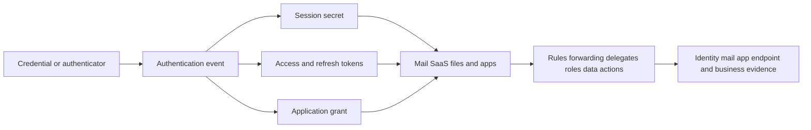
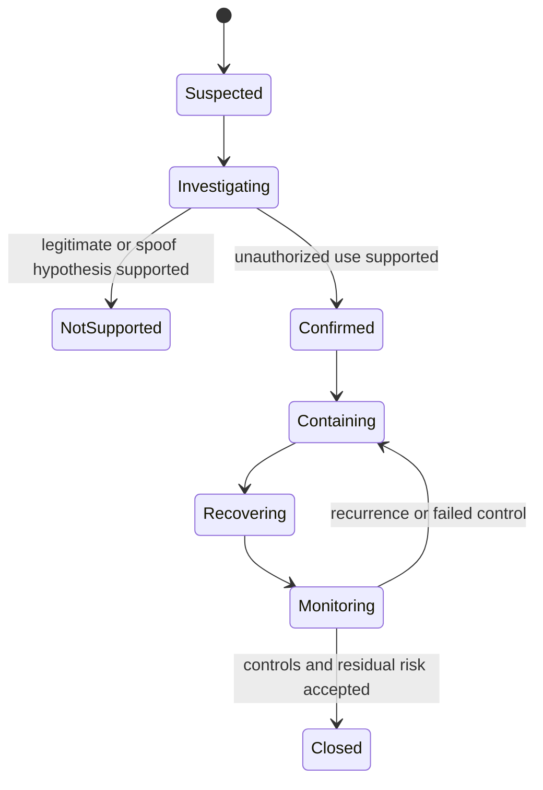
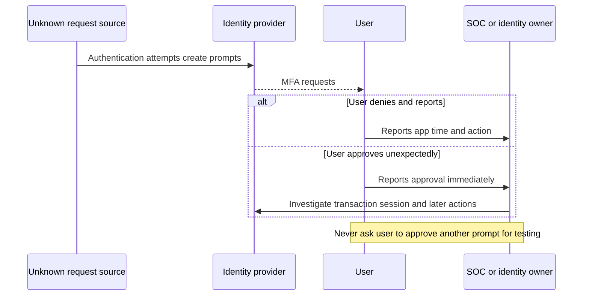
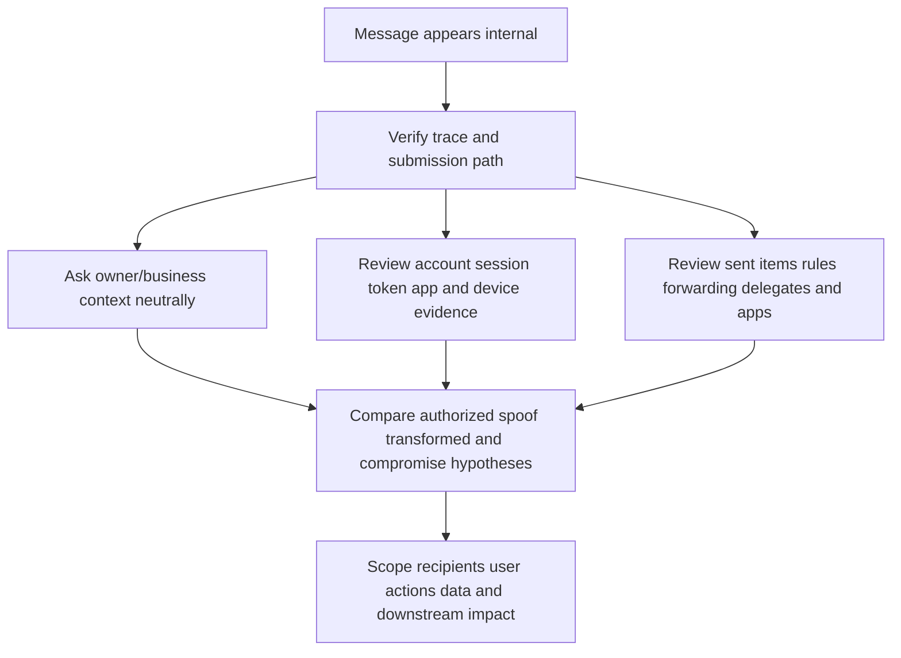
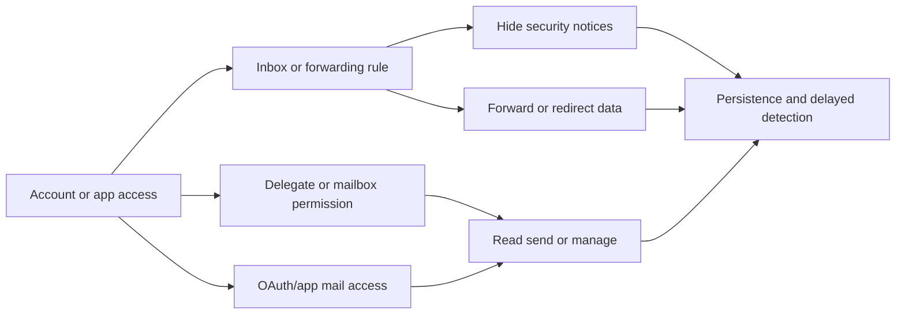
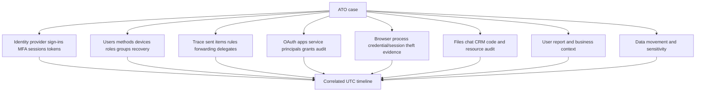
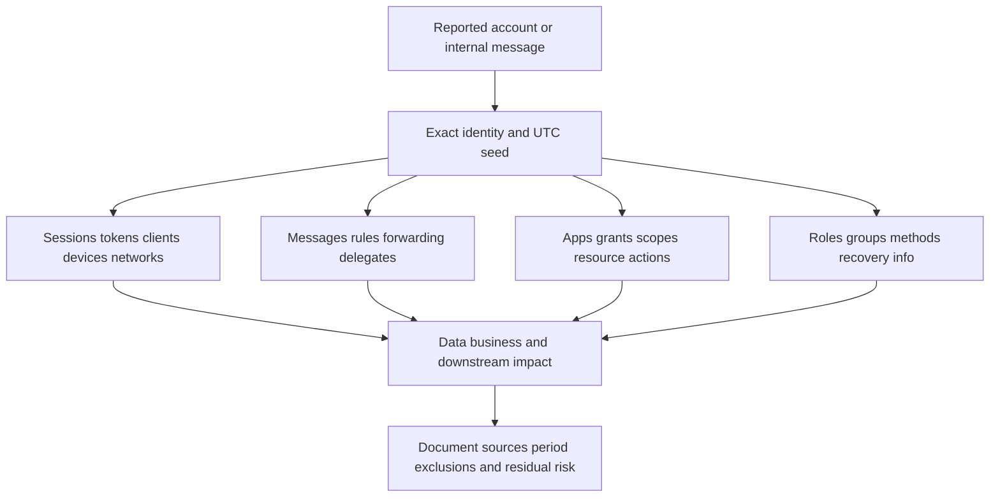
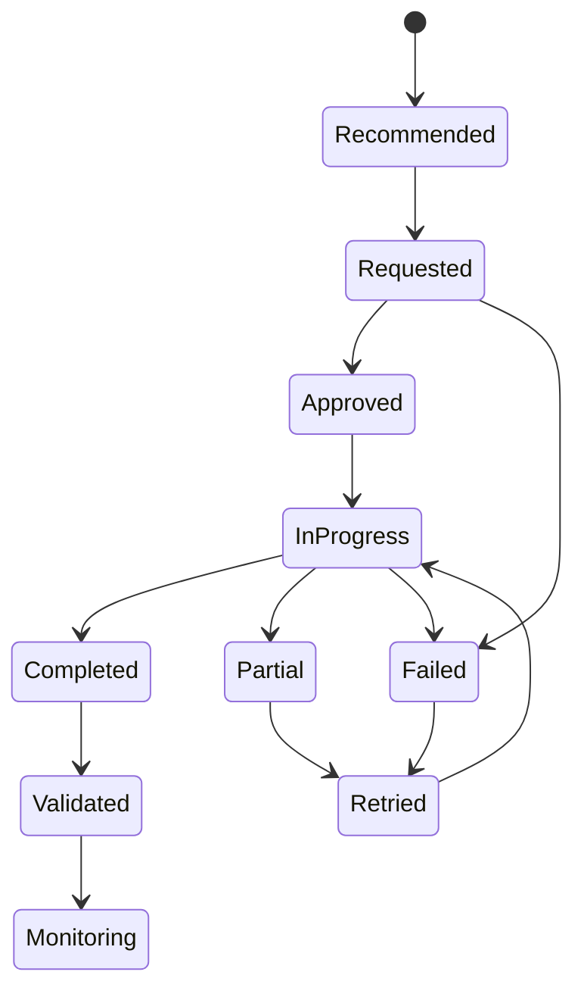
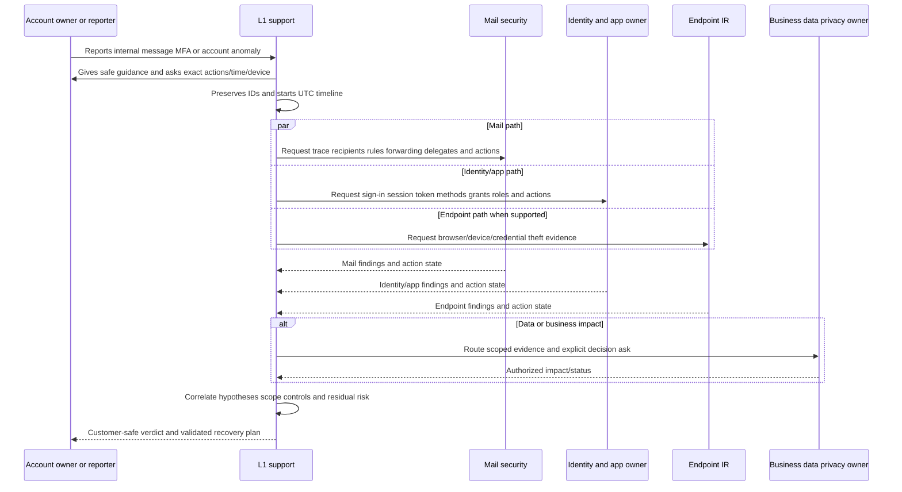
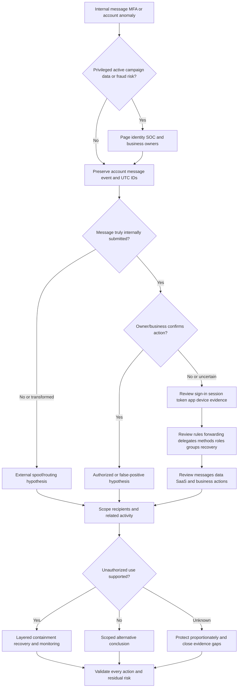

# Part 039 - Account Takeover and Compromised Internal Accounts

## Purpose, Evidence, and Currency

**Account takeover (ATO)** means unauthorized control or use of an account. The path may involve a stolen password, reused credential, approved multi-factor authentication (MFA) prompt, stolen browser session, access/refresh token, malicious application grant, compromised endpoint, help-desk manipulation, or another identity failure. A suspicious message from an internal address is a signal, not proof that the account is compromised; a legitimate internal account can send an unusual authorized message, an attacker can spoof an internal identity, or a system can transform/relay content.

Account response is not one password reset. Identity has multiple state layers:

- password and other credentials;
- registered authenticators and MFA methods;
- active browser/application sessions;
- access and refresh tokens;
- OAuth applications, service principals, and consent grants;
- mailbox rules, forwarding, delegates, and transport/client settings;
- account roles, group membership, permissions, recovery information, and devices;
- downstream SaaS, files, messages, transactions, and data accessed through the identity.

Each layer has an owner, evidence source, lifecycle, and validation method. Platform behavior differs. Some revocations take time, some tokens or applications have separate controls, and federated relying-party sessions may remain independent. Use current provider documentation and incident runbooks.

**MFA fatigue** or **MFA bombing** describes repeated authentication prompts intended to pressure a user into approving one. Manipulation can also involve impersonating support, changing registered methods, device-code or consent interactions, or persuading a person to reveal a one-time code. An unexpected MFA approval is urgent evidence, but it must be correlated with the authentication transaction and later activity.

This part is defensive. The lab uses invented audit rows only. It does not attempt sign-ins, create accounts/apps/tokens/rules, change passwords, revoke sessions, register MFA, or access a live tenant. Public Abnormal resources are cited only for public positioning and not private product behavior.

## Section Goal

By the end of this part, you should be able to:

- Define account takeover, credential, authenticator, MFA, session, cookie, token, access token, refresh token, application grant, mailbox rule, forwarding, delegate, and internal trust.
- Separate suspicious internal mail from proven internal account compromise.
- Explain credential, session, token, app, mailbox, device, permission, and downstream-resource layers.
- Recognize credential/session/token abuse and MFA fatigue/manipulation patterns without overclaiming intent.
- Read sign-in and identity evidence as events with time, account, application, client, device, IP/network, location, authentication detail, risk/context, and result.
- Explain why geolocation, impossible travel, unfamiliar IP, or MFA events are contextual rather than standalone proof.
- Investigate mailbox rules, forwarding, delegates, inbox actions, sent items, and OAuth applications as persistence/data-access paths.
- Build competing hypotheses for external spoofing, authorized unusual behavior, user error, internal account compromise, application compromise, and telemetry gaps.
- Scope the account, messages, sessions, apps, devices, recipients, roles, data, and downstream actions.
- Route password reset, authenticator review, session/token revocation, app/consent action, mailbox cleanup, role/permission correction, endpoint response, and monitoring to authorized owners.
- Validate each control rather than treating a command as success.
- Preserve identity evidence with minimum necessary privacy exposure.
- Write a customer-safe ATO verdict and recovery plan.
- Complete a local synthetic identity timeline and action-validation lab with zero tenant activity.

## JD Mapping

| Role responsibility or signal | Capability built here | Example support output |
|---|---|---|
| Triage internal threat reports | Separate mail identity, account state, and user/business context | "The message was internally submitted; account-owner authorization remains under identity review." |
| Investigate account takeover | Correlate sign-ins, sessions, tokens, apps, mailbox settings, and actions | Scoped identity evidence matrix |
| Own L1 case/escalation | Activate mail, identity, endpoint, SaaS, privacy, and business owners | Decision-ready timeline and explicit action asks |
| Communicate uncertainty | Avoid equating unfamiliar IP with attacker or reset with recovery | Confidence-rated claim-by-claim update |
| Validate remediation | Track requested/approved/in-progress/completed/failed/verified | Control validation ledger |
| Handle Microsoft 365/Google concepts honestly | Use official identity/mail evidence architecture | Learned architecture, no claimed tenant operations |
| Protect privacy | Minimize sign-in, location, device, mailbox, and content data | Redacted export references and secure evidence |
| Transfer enterprise support strengths | Apply enterprise scoping, critical-situation cadence, and follow-through | Production transfer without identity-SOC inflation |

## Candidate Honesty Note

You can say:

> "My production background is enterprise support, where I scoped complex incidents, coordinated stakeholders and Engineering, communicated under pressure, and validated recovery. I have not operated Abnormal AI, a SOC identity queue, or production account-takeover containment. I learned the identity/mailbox response architecture from official sources and practiced with synthetic audit rows. In a live incident, authorized identity, mail, endpoint, and application owners would perform changes; I would preserve evidence, coordinate, communicate, and verify outcomes."

| Evidence tier | Honest formulation | Boundary |
|---|---|---|
| **Production transfer** | Enterprise support ownership, evidence, escalation, validation | Not production identity incident response |
| **Local/synthetic lab** | Invented sign-in/mailbox/app timeline and control ledger | No account, tenant, token, app, or rule exists |
| **Learned architecture** | NIST/MITRE/Microsoft/Google identity and mail concepts | No private vendor logic or administration claim |
| **No direct experience** | No live revocation, MFA reset, app removal, mailbox remediation, or forensics | State gap and defer action to owner |

## Evidence Labels Used in This Part

| Label | Meaning | Example |
|---|---|---|
| **[Identity observation]** | Authoritative account/authentication event | "Sign-in record shows success for app SYN-Mail at 10:03 UTC." |
| **[Mail observation]** | Mailbox/message/rule/forwarding/delegate event | "A forwarding rule was created at 10:08 UTC." |
| **[App observation]** | OAuth/service-principal/grant/token event | "User consent event granted synthetic scope `Mail.Read` in fixture." |
| **[User report]** | Account owner's statement | "User reports approving one unexpected MFA prompt." |
| **[Business confirmation]** | Authorized owner confirms action expected/unauthorized | "Manager confirms external forwarding is not approved." |
| **[Inference]** | Testable interpretation | "The rule may be intended to hide or divert messages." |
| **[Conclusion]** | Supported account judgment within scope | "Unauthorized account use confirmed; entry path unresolved." |
| **[Unknown]** | Missing data/coverage | "Relying-party session status is unavailable." |

## Beginner Primer: One Identity, Many Keys and Doors

Imagine an office building. A person may have a password for reception, a badge, temporary visitor passes, keys to rooms, delegated access, mail-forwarding instructions, and access to partner buildings. Replacing the reception password does not automatically collect every badge, key, pass, or forwarding instruction.

| Identity layer | Building analogy | Digital example |
|---|---|---|
| Password | Memorized entry code | Password credential |
| Authenticator/MFA | Badge/security key/approved device | FIDO key, app method, OTP, push |
| Session cookie | Temporary visitor pass after entry | Browser session secret |
| Access token | Time-limited room pass | API resource access token |
| Refresh token | Authority to obtain new passes | Token renewal capability |
| App grant | Contractor authorization | OAuth consent/application permission |
| Mailbox rule/forwarding | Mailroom redirect instruction | Inbox rule/external forwarding |
| Delegate | Assistant with mailbox key | Send/read/manage delegation |
| Role/group | Master-key category | Admin role/group membership |
| Endpoint | Building entrance/device | Browser, phone, workstation |

The building analogy stops being accurate because digital state can be copied, distributed across identity providers and applications, and remain valid under different lifetimes. Every platform action needs current documentation and validation.

## Account Takeover Lifecycle

Account takeover is not one universal sequence. A defensive lifecycle helps identify evidence and controls without assuming the entry path.

| Stage | Defensive question | Evidence |
|---|---|---|
| Targeting/exposure | What identity/action was solicited? | Phishing/user report/mail evidence |
| Credential/authenticator event | Was a password, code, MFA, authenticator, or recovery path affected? | Identity and user evidence |
| Session/token establishment | Which session/token/app was issued? | Identity/token/app audit |
| Resource access | Which mail/files/SaaS/admin resources were used? | Resource audit logs |
| Persistence/change | Were rules, forwarding, delegates, apps, roles, methods, recovery data changed? | Admin/mail/app audit |
| Internal abuse | Were trusted internal messages/actions performed? | Mail trace, sent items, business confirmation |
| Data/fraud/impact | What data, transactions, or systems were affected? | DLP/business/finance/endpoint evidence |
| Containment/recovery | Which layers were invalidated/corrected? | Action and validation records |
| Monitoring | Did suspicious behavior recur? | Identity/resource/security telemetry |

## Credentials, Authenticators, Sessions, and Tokens

### Credential

A credential binds an identity to one or more authenticators under an identity system. In casual language, people call passwords "credentials," but exact terms help during response.

### Authenticator

An authenticator is something the user controls to prove identity, such as a password, cryptographic key, OTP device/application, or multi-factor authenticator. Registered methods can be added, removed, or changed, so review their lifecycle.

### Session

A session begins after authentication and lets software continue interacting without presenting the original factors on every request. A session secret can be a cookie or other mechanism. Sessions at an identity provider and relying applications may be independent.

### Tokens

An access token authorizes API/resource access for a period. A refresh token can obtain new access tokens under applicable rules. Token lifetimes, revocation, continuous access, device binding, and application behavior vary.

| Layer | Exposure symptom | Response question |
|---|---|---|
| Password | User entered secret; reuse suspected | Reset, reuse scope, successful/failed authentication |
| MFA method | Unexpected method added/changed | Which method, actor, proofing, notification? |
| Push/OTP | Unexpected approval/code disclosure | Which transaction/session did it authorize? |
| Session cookie | Authenticated activity without new sign-in | Which session/device/app and how to revoke/validate? |
| Access token | API actions under user/app identity | Which audience/scopes/resource/actions/lifetime? |
| Refresh token | Continued token issuance | Which client/grant and revocation control? |
| App grant | Persistent delegated/application access | Which app/service principal/scopes/consent/admin? |

## 🔍 Plain-English deep-dive: Authentication, Session, and Authorization Are Different

Checking into a hotel, receiving a room key, and being allowed into the gym are related but separate. Authentication is the check-in proof. A session/token is a key issued after proof. Authorization decides which rooms/resources the key can access.

Changing the check-in password does not necessarily invalidate every issued key. Removing one room permission does not end the hotel stay. That is why response asks separately:

- Which authentication occurred?
- Which session/tokens were created?
- Which resources and permissions were authorized?
- Which sessions/tokens/grants were invalidated?
- Which resource actions already occurred?

The hotel analogy stops being accurate because digital tokens can be copied, applications can act without a human present, and independent relying-party sessions may persist. Use provider-specific controls and audits.

## MFA Fatigue and Manipulation

MFA improves security but not all methods are phishing-resistant. Repeated prompts can pressure a user. Attackers may impersonate support, claim a prompt is a test, or exploit confusing number/code flows.

| Observation | Possible explanation | Evidence/test |
|---|---|---|
| Repeated denied prompts | Attack using known password; misconfigured app; user retry | Identity event details, app/client, user context |
| One approved unexpected prompt | Manipulation or mistaken approval | Transaction, session, subsequent actions |
| Method added before prompts | Unauthorized registration or legitimate device change | Authenticator audit and proofing workflow |
| Help-desk reset | Legitimate recovery or social engineering | Ticket, identity-proofing record, agent actions |
| OTP disclosed | Phishing/support scam | Authentication event and user report |
| Number/code mismatch | User confusion or relayed transaction | Provider transaction details |

### User Guidance

- Deny unexpected prompts and report them through the known support route.
- Do not share one-time codes or approve a prompt because a caller/message asks.
- Do not continue accepting/denying repeated prompts solely to silence them; contact the identity/SOC owner.
- Do not ask the user to approve another prompt as a diagnostic test.
- If approval occurred, treat it as urgent but do not blame the user.

## Sign-In Evidence

A sign-in event is not just "success" or "failure." Fields and semantics vary by provider, but a strong investigation captures:

| Field | Question | Caveat |
|---|---|---|
| Identity/account | Which subject/account? | Aliases/guest/federated identities |
| UTC time | When did event occur? | Clock skew and ingestion delay |
| Application/resource | Which client and target? | Service names can be unfamiliar |
| Result/error | Did authentication/resource access succeed? | Conditional/policy outcomes vary |
| Authentication details | Which factors/methods/stages? | Partial flows and prior session claims |
| Client/browser/protocol | Which software/flow? | User-agent can be spoofed |
| Device ID/compliance | Which known/managed device context? | Missing/unmanaged does not equal malicious |
| IP/network/ASN | Which source network? | VPN/proxy/mobile/cloud/shared NAT |
| Location | Geo inferred from IP | Approximate and error-prone |
| Risk/anomaly | Provider assessment | Signal, not proof; private logic may be unavailable |
| Session/token IDs | Which issued/access context? | Access and retention vary |
| Conditional access/policy | Which control applied? | Report-only versus enforced matters |

### Success, Failure, and Interruption

Repeated failures can indicate attack, user error, stale client credentials, or service behavior. A success can be legitimate or unauthorized. An interrupted/challenged event may still produce useful context. Read full provider semantics.

## 🔍 Plain-English deep-dive: Location Is Context, Not Identity

An IP geolocation result is like a postal sorting center stamped on a package: it indicates an estimated route/source, not who held the package. Corporate proxies, VPNs, mobile carriers, cloud services, remote desktops, and shared networks can make a user appear elsewhere.

"Impossible travel" means two observed locations/times appear inconsistent with physical travel. It can be a useful risk signal, but alternatives include VPN egress changes, token/session use, inaccurate geolocation, automated service traffic, and overlapping devices.

Customer-safe wording:

> "Two sign-in events were geolocated to different regions 18 minutes apart. This supports an anomaly hypothesis but does not identify an actor. We are correlating device, client, session, network, authentication, application, user, and subsequent-resource evidence."

The package analogy stops being accurate because digital sessions can operate concurrently. Do not use location alone to accuse a user or declare compromise.

## Internal Trust and Compromised Senders

Internal messages often receive more trust because the address, tenant, directory photo, history, and authentication appear legitimate. A compromised account can exploit that trust to send phishing, fraud, data requests, or malware.

| Internal signal | What it proves | What it does not prove |
|---|---|---|
| Intra-organization trace | Service records internal mail path | Account owner's authorization |
| Real internal address | Address/account exists | Current operator is legitimate |
| Authentication passes | Expected internal path | Benign intent/account control |
| Existing conversation | Relationship/history exists | Latest instruction authorized |
| Sent item present | Message stored/sent under account context | Human account owner intentionally sent |
| User denies sending | Important report | Technical path or actor by itself |

## 🔍 Plain-English deep-dive: Internal Is a Route, Not a Trust Verdict

A call made from an office phone extension may originate inside the building, but the phone can be used by the wrong person. Internal routing tells you where a system observed submission, not whether the account owner authorized it.

A safe conclusion separates claims:

- High confidence: provider trace records internal submission.
- Medium/high confidence: account owner denies the message through an independently known channel.
- Medium confidence: account misuse is likely based on session/mailbox evidence.
- Unknown: initial entry path until credential, endpoint, help-desk, token, or app evidence supports it.

The phone analogy stops being accurate because tokens and applications can send without a person actively using a mailbox. Investigate noninteractive/app and delegated actions too.

## Mailbox Rules and Forwarding

Mailbox rules automate message handling. Forwarding sends or redirects mail elsewhere. Both are legitimate features and common persistence/data-access surfaces.

| Mailbox setting/action | Legitimate use | Security question |
|---|---|---|
| Inbox rule | Organize/route messages | Who created/changed it, what criteria/action, hidden/disabled state? |
| External forwarding | Business continuity/workflow | Approved destination/policy and data exposure? |
| Redirect | Preserve original sender while routing | Authorized rule or diversion? |
| Delete/move rule | Reduce inbox noise | Hiding security/bank/user notifications? |
| Sent-item behavior | Workflow/app sends | Which actor/client/app created message? |
| Delegate | Assistant/shared mailbox management | Was permission approved and used appropriately? |
| Mailbox permission | Operational access | New/changed role and audit trail? |
| Transport rule | Org-wide routing | Admin-owned change versus mailbox compromise? |

Do not delete every rule blindly. Preserve configuration and audit evidence, identify business-approved rules, then authorized mail/identity owners remove or correct unauthorized entries and validate normal mail flow.

## Delegates, Roles, Groups, and Recovery Information

| Change surface | Risk | Evidence |
|---|---|---|
| New delegate/mailbox permission | Ongoing read/send access | Admin/mailbox audit and business approval |
| Admin role assignment | Privilege escalation | Directory role audit/approval |
| Group membership | Access to resources/mail | Group audit and resource owner |
| Recovery email/phone | Account recovery diversion | Authenticator/recovery audit and notification |
| New MFA method | Persistent authentication ability | Method registration and proofing logs |
| Device registration | Trusted device posture/access | Device identity/compliance audit |
| Application assignment/consent | API/SaaS access | App/service-principal/grant audit |

Scope privilege changes beyond the mailbox. A compromised identity can affect shared resources and other users through roles or delegated access.

## OAuth Applications and Token Abuse

OAuth is authorization, not simply login. A user or admin can grant an application scopes to access resources. A malicious or compromised app can persist after password reset.

| Entity | Plain meaning | Investigation question |
|---|---|---|
| Application registration | Definition/identity of app | Who owns/published it and in which tenant? |
| Service principal/enterprise app | Local representation in tenant | When created/assigned/consented? |
| Scope/permission | Allowed action/resource | Delegated or application; least privilege? |
| Consent grant | Authorization decision | User/admin actor, time, context, scope |
| Access token | Resource access credential | Audience, subject/app, lifetime, actions |
| Refresh token | Can obtain new access tokens | Revocation/control state |

Part 041 teaches consent attacks deeply. Here, the key response is to include app/grant/token evidence whenever the observed phishing or account behavior involves consent, APIs, or noninteractive resource access.

## Evidence Source Map

| Question | Authoritative source/owner |
|---|---|
| Did authentication succeed? | Identity provider |
| Which session/token/app acted? | Identity/app/resource audit |
| Was internal mail sent? | Mail trace/mailbox audit |
| Was the message authorized? | Account owner/business context plus technical evidence |
| Were rules/forwarding/delegates changed? | Mail/admin audit |
| Was endpoint/browser compromised? | EDR/IR/browser telemetry |
| What data/resources were accessed? | SaaS/resource/DLP/data owner |
| What financial/business action occurred? | Business system owner |

## Hypothesis Framework

| Hypothesis | Predicted evidence | Contradiction | Owner/test |
|---|---|---|---|
| External spoof appears internal | External/connector path; no account activity | Internal authenticated submission and resource use | Mail owner |
| Authorized unusual behavior | Owner/business confirms; expected device/app/process | Owner denies; unauthorized settings/actions | Business + identity/mail |
| Stolen password/new sign-in | Credential event and new authentication/session | No new auth; token/app path supported | Identity owner |
| Session/token theft | Resource use without expected new authentication; session anomalies | All use matches authorized session/device | Identity/resource/endpoint |
| MFA manipulation | Unexpected prompts/approval linked to session | Prompts caused by legitimate user retries | Identity + user |
| Malicious app consent | New app/grant/scopes/resource actions | Approved app and expected use | App/identity owner |
| Compromised endpoint | Browser/token/credential/process evidence | No endpoint evidence in covered devices | EDR/IR |
| Telemetry/config error | Events explained by logging, proxy, time, or service behavior | Corroborated unauthorized actions | Platform owner |

## Scope Model

| Axis | Seed | Expansion |
|---|---|---|
| Identity | Reported user/account | Aliases, guest/federated identity, privileged/service identities |
| Time | First symptom/action | Before initial evidence through containment/monitoring |
| Session/token | Event/session IDs | Related clients/apps/resources and refresh events |
| Device/network | Reported device/IP | Managed devices, browser/mobile, VPN/proxy context |
| Mail | Message/rule | Recipients, sent messages, inbox actions, forwarding, delegates |
| Apps | Suspect app/grant | Service principals, scopes, consents, resource actions |
| Permissions | User role/group | Changed roles/groups/delegates/shared resources |
| Data/business | Accessed resource/action | Downloads, forwarding, payments, code, customer data |

## Response Actions and Ownership

Actions depend on platform, evidence, impact, and authority.

| Action family | Purpose | Owner | Validation |
|---|---|---|---|
| Disable/block sign-in | Stop new account use | Identity admin/IR | Account state and business continuity plan |
| Password reset | Invalidate password credential | Identity/help desk under proofing | Reset event, user recovery, reuse scope |
| Authenticator/MFA review | Remove unauthorized methods/rebind | Identity owner | Approved methods and notifications |
| Session revocation | End active sessions where supported | Identity/resource owner | Provider state and ceased unauthorized activity |
| Token revocation | Invalidate access/refresh paths | Identity/app owner | Token/grant audit and resource behavior |
| App/consent removal | Remove malicious authorization | App/identity admin | Grant/service-principal state and downstream actions |
| Rule/forwarding cleanup | Stop hiding/diversion | Mail owner | Rules/forwarding state and mail-flow validation |
| Delegate/permission correction | Remove unauthorized access | Mail/directory/resource owner | Permission audit and access test |
| Endpoint containment | Address credential/session theft source | EDR/IR | Device state, eradication, monitoring |
| Message remediation | Remove internal campaign | Mail/SOC | Per-recipient action status |
| Data/business response | Address accessed data/transactions | Data/privacy/legal/finance/business | Authorized impact and notification status |

## 🔍 Plain-English deep-dive: Password Reset Changes One Layer

Changing the lock combination is important if it was disclosed, but it does not collect copied visitor passes, cancel contractor access, remove mailroom instructions, or clean a compromised laptop.

After a password reset, ask whether the platform/runbook also addressed:

- active identity-provider and relying-party sessions;
- access/refresh tokens and cookies;
- registered authenticators/MFA and recovery data;
- application/service-principal consent and scopes;
- mailbox rules, forwarding, delegates, and permissions;
- roles/groups/devices/keys;
- endpoint compromise;
- downstream messages, data, transactions, and monitoring.

The lock analogy stops being accurate because identity systems can invalidate some states automatically and others independently. Never generalize; verify current platform semantics.

## Action-State and Validation Ledger

| Action | Request evidence | Completion evidence | Behavioral validation |
|---|---|---|---|
| Password reset | Reset initiated | Audit confirms reset | User recovery and no old-credential use |
| Session revoke | Command submitted | Provider action/status | Unauthorized activity ceases; app sessions checked |
| App grant removal | Grant deletion request | Grant/service-principal audit | API/resource actions cease |
| Rule removal | Mail action | Rule list/audit | Expected mail visible; no recurrence |
| Message removal | Remediation job | Recipient-level result | No related copies; user status checked |
| Device isolation | EDR command | Target reports isolated | Network restriction and IR plan validated |

Commands can fail because a device is offline, permissions are missing, a token is issued by another authority, a relying-party session is independent, or an action targets the wrong object. Record partial/failure states.

## Investigation and Response Workflow

### Phase 1: Stabilize

- Use an independently known support route.
- Tell user not to approve further MFA, continue suspicious conversations, or change settings ad hoc.
- If an active privileged account or internal campaign is suspected, page authorized identity/SOC owners immediately.
- Preserve user access/business continuity through approved recovery—not improvised bypass.

### Phase 2: Preserve and Scope

Capture account IDs, message IDs, event/session/app IDs, UTC times, devices, exact user actions, impacted resources, and current controls. Minimize location, device, message, and personal data.

### Phase 3: Establish Identity and Mail Facts

Review sign-ins/authentication, methods, sessions/tokens, apps/grants, devices, roles/groups, recovery info, mail submission, sent items, rules/forwarding/delegates, recipients, and downstream user actions.

### Phase 4: Test Entry Paths and Impact

Compare password, MFA manipulation, session/token theft, malicious app, endpoint compromise, help-desk/recovery manipulation, external spoofing, authorized behavior, and telemetry error hypotheses. Establish data/business impact separately.

### Phase 5: Contain and Recover

Authorized owners apply credential, authenticator, session/token, app, mailbox, permissions, endpoint, message, and data/business controls. Preserve before destructive cleanup where required.

### Phase 6: Validate and Monitor

Validate every layer and downstream resource. Monitor for repeated sign-ins, token/app use, rule recreation, internal messages, data access, or business action. State telemetry/time/source boundaries.

## Troubleshooting Decision Tree

### Symptom-to-Test Matrix

| Symptom | Hypotheses | Safe discriminating evidence | Next action |
|---|---|---|---|
| Internal phishing message | Compromised account; spoof/relay; authorized simulation | Trace/submission, owner confirmation, account/app evidence | Scope recipients; identity/mail response |
| Repeated MFA prompts | Password attack; stale app; user retry | App/client, authentication detail, user timing | Deny/report; identity investigation |
| Unfamiliar successful sign-in | Compromise; VPN/travel; service activity | Device/client/session/network/user/resource actions | Contextualize and contain by risk |
| New forwarding rule | Unauthorized persistence; legitimate workflow | Rule audit, creator/session, destination/business approval | Preserve, remove if unauthorized, data scope |
| Password reset completed | Credential response only | Session/token/app/rule/resource validation | Continue layered containment |

## Worked Example 1: Internal Message and MFA Approval

### Inputs

- Synthetic internal trace shows message from `user-a@example.invalid` to three finance users.
- Account owner denies sending through a known channel.
- User reports one unexpected MFA approval at 10:01 UTC.
- Identity fixture shows successful mail-app session at 10:03 UTC.

### Conclusion

> **Synthetic conclusion:** Unauthorized account use is strongly supported. MFA manipulation is a plausible entry path because approval precedes the session, but endpoint/session/credential evidence is needed for final entry-path confidence. Identity and mail owners contain account/session and message campaign; finance checks user actions.

## Worked Example 2: Impossible Travel False Alarm

### Inputs

- Two synthetic events geolocate to different regions 12 minutes apart.
- Same managed device and corporate VPN service are recorded.
- User confirms VPN reconnection.
- No unauthorized resource action appears.

### Conclusion

> **Synthetic conclusion:** VPN egress change explains the location anomaly in the fixture. Account takeover is not supported by reviewed evidence. Do not tune away all location alerts; document expected VPN behavior and validate narrow provider settings.

## Worked Example 3: Password Reset but Rule Remains

### Inputs

- Password reset at 11:00 UTC.
- Synthetic external forwarding rule remains active until 11:20 UTC.
- Identity sessions revoked at 11:05; app grants not yet reviewed.

### Conclusion

> **Synthetic conclusion:** Credential and some session containment occurred, but mailbox persistence/data exposure remained for 20 minutes and app risk is unknown. Recovery is incomplete until rule, grant, downstream data, and monitoring validation finish.

## Worked Example 4: Malicious Consent Without Password Theft

### Inputs

- User reports granting a synthetic app permission.
- No password disclosure is reported.
- App audit shows delegated mail access in fixture.

### Conclusion

> **Synthetic conclusion:** Unauthorized application consent and mail access are supported. Do not classify as password theft without evidence. App/identity owners remove/revoke the grant/tokens under policy, scope API/mail actions, and validate no other grants/persistence.

## Worked Example 5: Compromised Endpoint Alternative

### Inputs

- Sign-in session appears from the user's normal device/network.
- EDR fixture reports browser credential/session theft behavior.
- User did not approve MFA or disclose password.

### Conclusion

> **Synthetic conclusion:** Endpoint-mediated session/token compromise is more strongly supported than a new-password sign-in. Identity and endpoint response must run together. Password reset alone cannot close the case while the device remains compromised.

## Common Failure Modes and Unsafe Shortcuts

| Failure | Why it fails | Safer behavior |
|---|---|---|
| Internal address equals trusted | Real accounts/apps can be abused | Verify route, owner, account/app evidence |
| Impossible travel equals attacker | VPN/proxy/mobile/geo errors | Correlate device/session/client/actions |
| User denial alone proves compromise | Report is important but path may differ | Corroborate trace/account/app evidence |
| Password reset closes case | Sessions/tokens/grants/rules/endpoints remain | Layered validation ledger |
| Revoke action equals success | Partial/delay/independent sessions | Check exact action state and behavior |
| Delete every rule | Destroys legitimate workflows/evidence | Preserve, approve, remove selectively |
| Remove app only | Tokens/resource actions/other grants may remain | App/token/resource scope and validation |
| Ask user to approve test MFA | Can authorize unknown transaction | Never reproduce; use logs/runbook |
| Accuse from IP/location | Network data does not identify operator | Evidence-calibrated language |
| Collect full mailbox broadly | Privacy overreach and noise | Minimum hypothesis-driven scope |
| Ignore endpoint | Credentials/sessions can be stolen again | EDR/IR when endpoint path plausible |
| Ignore business impact | Internal trust can cause fraud/data harm | Engage finance/data/privacy owners |

## Customer Communication Templates

### Suspected Internal Account

> "The message was submitted through an internal account context, but that does not by itself prove the account owner authorized it. We are correlating trace, sign-in, session/token, application, mailbox-rule, device, and owner/business evidence. Please do not continue the conversation or approve additional prompts."

### Confirmed Unauthorized Use

> "Unauthorized use of `user-a@example.invalid` is confirmed within the reviewed scope based on [observations]. Identity, mail, endpoint, and application owners are addressing credentials/authenticators, sessions/tokens, grants, rules/forwarding/delegates, messages, and device risk. Initial entry path remains [supported/unresolved]."

### Recovery in Progress

> "Password reset and session-revocation actions completed, but recovery remains open while app grants, mailbox persistence, endpoint state, downstream messages/data, and relying-party sessions are validated. We will not represent the account as recovered until the control ledger and monitoring checks pass."

### Scoped Resolution

> "The account returned to approved control, unauthorized rules/grants/permissions were corrected, affected messages/resources were scoped, and monitoring showed no recurrence in [sources/UTC interval]. Activity outside those systems/retention periods remains the documented residual limitation."

## Safe Synthetic Lab: The Layered Identity Recovery Ledger

### Objective

Create one local artifact from invented sign-in, MFA, session, mail, app, and endpoint rows. Determine whether account takeover is supported, build competing entry-path hypotheses, map impact, assign layered containment, and validate action states without any account/tenant activity.

The unique lab name is **The Layered Identity Recovery Ledger**.

### Prerequisites

- Local Markdown editor or spreadsheet.
- Offline study folder.
- Only the fixtures below.
- All identities end in `example.invalid` and all IDs are synthetic.
- No tenant, account, password, MFA device, app, token, mailbox, API, browser, endpoint, or admin access.

### Authorized scope

Authorized:

- Copy and analyze invented audit rows.
- Build timeline, hypothesis, scope, action, and communication tables.
- Label artifacts **local/public lab - synthetic identity metadata only**.
- Rehearse a spoken escalation.

Prohibited:

- Attempting sign-ins, approvals, password resets, session/token revocation, authenticator changes, app creation/consent/removal, mailbox rule/forwarding/delegate changes, or message sending/removal.
- Using real user/location/device/IP/token/app/mail/customer data.
- Querying a live directory, tenant, or endpoint.

### Synthetic event fixture

| UTC | Source | Event |
|---|---|---|
| 10:00 | User report | Unexpected MFA prompts begin |
| 10:01 | User report | One prompt approved accidentally |
| 10:03 | Identity | Successful synthetic mail-app session |
| 10:08 | Mail audit | External forwarding rule created to `sink@example.invalid` |
| 10:12 | Mail trace | Three internal messages sent |
| 10:16 | User report | Owner denies messages through known channel |
| 10:20 | Identity action | Synthetic password reset requested |
| 10:22 | Identity action | Synthetic session revoke requested |
| 10:25 | Mail action | Rule removal requested |
| 10:30 | App audit | Synthetic app-grant review pending |

### Steps

1. Create `Layered Identity Recovery Ledger`; label it `local/public lab - synthetic identity metadata only`.
2. Record authorization, exclusions, and exercise time in UTC.
3. Copy the fixture exactly; do not create matching accounts or actions.
4. Normalize the timeline and label observation, user report, inference, conclusion, and unknown.
5. Build at least five hypotheses: MFA manipulation/new session, stolen password, session/token theft, malicious app, and telemetry/authorized alternative.
6. Add predicted, supporting, contradicting evidence and authorized owner/test for each. Mark `not performed - synthetic lab`.
7. Scope identity, sessions/tokens, devices/networks, messages/recipients, rules/forwarding/delegates, apps/grants, roles/groups/methods, data/business actions, and time.
8. Create separate credential, authenticator, session, token, app, mailbox, endpoint, message, data, and monitoring action rows.
9. Track every action as recommended/requested/approved/in-progress/completed/partial/failed/validated. The fixture ends pending; do not invent completion.
10. Write an immediate user message, identity/SOC escalation, finance-recipient notice, recovery update, and scoped final-template placeholder.
11. Add one alternate VPN/impossible-travel case and show why context can exonerate the location hypothesis.
12. Add one app-consent case and show why password reset is insufficient.
13. Complete privacy/honesty review and zero-activity attestation.

### Expected evidence

- Ten-event correlated UTC timeline.
- Five or more testable entry-path hypotheses.
- Full multidimensional scope table.
- At least ten layered control/action rows.
- Action-state ledger that leaves pending items pending.
- Five communications with calibrated language.
- VPN/location alternative and app-consent alternative.
- Explicit separation of unauthorized use conclusion from initial entry-path conclusion.
- No live sign-in, account, password, MFA, session, token, app, rule, message, endpoint, tenant, or API action.

### Cleanup and privacy

- Retain only the synthetic local worksheet if useful.
- Confirm every identity uses `example.invalid` and every ID/location/device/IP is invented or omitted.
- Remove any accidentally pasted real sign-in, token, app, mailbox, user, device, IP, location, message, customer, or personal data.
- Delete the artifact if reliable redaction is impossible.
- Do not upload identity evidence to public scanners or AI services.
- Record that no production identity, mail, endpoint, app, data, or business action occurred.

### Artifacts

| Artifact | Skill shown | Honest label |
|---|---|---|
| Identity timeline | Cross-source correlation | **Local/public lab** |
| Hypothesis ledger | Entry-path restraint | **Local/public lab** |
| Layered action ledger | Containment/recovery validation | **Template only** |
| Scope map | Blast-radius reasoning | **Learned architecture** |
| Communication set | Customer-safe identity response | **Template only** |

### Validation rubric

| Dimension | Fail | Developing | Pass |
|---|---|---|---|
| Identity model | Password only | Mentions sessions | Separates credentials, authenticators, sessions, tokens, apps, mailbox, permissions, devices, and resources |
| Evidence | IP/location proves attacker | Uses sign-ins and user report | Correlates app/client/device/network/auth/session/resource/mail/endpoint/business evidence |
| Internal trust | Internal equals safe/compromised | Checks trace | Separates route, account control, owner authorization, app/delegate use, and downstream impact |
| Persistence | Resets password | Also revokes sessions | Reviews methods, tokens, apps/grants, rules/forwarding/delegates, roles/groups, recovery, endpoint |
| Action validation | Command equals done | Tracks completion | Uses full state ledger, target-specific validation, partial failures, and monitoring |
| Scope | One account | Messages and sign-ins | Identity/time/session/device/mail/app/permission/data/business scope with exclusions |
| Safety/privacy | Uses live tenant | Synthetic but vague | Metadata-only, no actions/queries, minimized fields, zero-activity attestation |
| Honesty | Claims production response | Calls it lab | Separates production transfer, synthetic practice, learned architecture, and direct gaps |

## Official Source Anchors

All sources were accessed on August 24, 2026 and must be revalidated before production use.

| Official/public source | What it anchors |
|---|---|
| [NIST SP 800-63B - Authentication and Authenticator Management](https://pages.nist.gov/800-63-4/sp800-63b.html) | Authentication, authenticators, phishing resistance, compromise/invalidation, sessions, cookies, tokens, and recovery concepts |
| [NIST SP 800-61 Revision 3](https://csrc.nist.gov/pubs/sp/800/61/r3/final) | Risk-integrated incident response coordination and improvement |
| [MITRE ATT&CK - Valid Accounts, T1078](https://attack.mitre.org/techniques/T1078/) | Abuse of valid accounts for access, persistence, privilege, and defense evasion |
| [MITRE ATT&CK - Multi-Factor Authentication Request Generation, T1621](https://attack.mitre.org/techniques/T1621/) | Repeated MFA request/fatigue technique and defensive concepts |
| [MITRE ATT&CK - Email Forwarding Rule, T1114.003](https://attack.mitre.org/techniques/T1114/003/) | Mail forwarding rules used for collection/persistence context |
| [MITRE ATT&CK - Steal Application Access Token, T1528](https://attack.mitre.org/techniques/T1528/) | Application-token theft and downstream access concepts |
| [Microsoft - Responding to a compromised email account](https://learn.microsoft.com/en-us/defender-office-365/responding-to-a-compromised-email-account) | Current Microsoft compromised-mailbox investigation and response workflow concepts |
| [Microsoft Entra - Revoke user access in an emergency](https://learn.microsoft.com/en-us/entra/identity/users/users-revoke-access) | Current Microsoft session/token revocation concepts and timing caveats |
| [Google Workspace Help - Investigate and take action on suspicious session cookies](https://knowledge.workspace.google.com/admin/security/investigate-and-take-action-on-suspicious-session-cookies) | Current Google suspicious-session investigation and action concepts |
| [Google Workspace Help - Manage a user's security settings](https://knowledge.workspace.google.com/admin/security/manage-a-users-security-settings) | Current Google administrator password/cookie/security-setting response concepts |
| [Abnormal AI - Email Security](https://abnormal.ai/products/email-security) | Public, attributable statements about compromised internal accounts and behavioral context only; no private logic |

## Likely Interview Questions

### Q1. What is account takeover?

**Model answer:** Unauthorized control or use of an account. It can involve a password, MFA/authenticator, session cookie, access/refresh token, application consent/grant, compromised endpoint, help-desk recovery, or another path. I separate the conclusion that use was unauthorized from the still-open question of initial entry path.

### Q2. Does an internal sender prove the account is compromised?

**Model answer:** No. I verify provider trace/submission, account-owner/business authorization, sign-in/session/token/app evidence, mailbox rules/forwarding/delegates, and downstream actions. It could be authorized unusual behavior, spoof/relay/transformation, delegated/app sending, or compromise. Internal is a route/context, not a trust verdict.

### Q3. How do you investigate repeated MFA prompts?

**Model answer:** I tell the user to deny and report unexpected prompts and never ask for a test approval. I capture app, time, device, prompt/approval action, then identity owners review authentication details, sessions, methods, and later resource activity. Repeated prompts can be attack, stale app, or user retries; an unexpected approval raises urgency but still needs transaction correlation.

### Q4. Why is impossible travel not proof?

**Model answer:** IP geolocation is approximate, and VPNs, proxies, mobile networks, cloud services, remote desktops, concurrent devices, and session/token use can create location anomalies. I correlate device ID/compliance, client, app, session, authentication detail, network, user context, and resource actions. I describe it as an anomaly signal, not actor identity.

### Q5. Why is password reset alone insufficient?

**Model answer:** Active sessions, cookies, refresh/access tokens, app grants, MFA/recovery methods, mailbox rules/forwarding/delegates, roles/groups, endpoint malware, and relying-party sessions can persist. Authorized owners address each applicable layer and validate behavior. Password reset changes one credential layer.

### Q6. What mailbox persistence should you check?

**Model answer:** Inbox rules, external forwarding/redirects, delete/move rules, delegates/mailbox permissions, sent items/submission path, transport/client settings, and OAuth apps with mail access. I preserve settings/audit first, identify legitimate workflows, remove unauthorized entries through the mail/identity owner, and assess data/message exposure.

### Q7. How do you validate account recovery?

**Model answer:** I use a control ledger: credential, authenticators/MFA/recovery, identity and relying-party sessions, tokens, app grants/service principals/scopes, mailbox rules/forwarding/delegates, roles/groups/devices, endpoint state, internal messages, data/business impact, and monitoring. Every action has target, owner, requested/completed/failed state, and behavioral validation.

### Q8. What are your L1 boundaries?

**Model answer:** I can preserve evidence, establish exact user actions, scope, coordinate identity/mail/endpoint/app/business owners, communicate, and validate reported statuses. I do not attempt sign-ins, collect passwords/tokens, approve MFA, revoke sessions, remove apps/rules, disable accounts, or change tenant settings without explicit authorization and training.

## 🧠 30-Second Memory Hooks

- **ATO is unauthorized account control/use; entry path is a separate conclusion.**
- **Internal is a route, not a trust verdict.**
- **Credential, authenticator, session, token, app grant, mailbox, endpoint, and data are separate layers.**
- **Authentication checks in; sessions/tokens carry access; authorization limits resources.**
- **MFA prompts can be attack or error; never approve one for testing.**
- **Location is context, not identity.**
- **Real internal messages can be sent by compromised accounts, delegates, or apps.**
- **Rules can hide; forwarding can divert; delegates/apps can persist.**
- **Password reset changes one layer.**
- **Session/token/app/rule actions need target-specific validation.**
- **Requested is not completed; completed is not validated.**
- **Scope account, sessions, apps, devices, messages, permissions, data, and business actions.**
- **Each system owner performs its own authorized containment.**
- **No live tenant action in a learning lab.**
- **Synthetic identity metadata proves method, not production incident ownership.**

## Completion Checklist

- [ ] I can define ATO, credential, authenticator, MFA, session, cookie, access/refresh token, app grant, rule, forwarding, and delegate.
- [ ] I separate unauthorized-use conclusion from initial entry-path conclusion.
- [ ] I know why internal submission does not prove owner authorization.
- [ ] I can read sign-in events across identity, time, app, client, device, network, auth, session, policy, and result fields.
- [ ] I use location/impossible travel only as contextual evidence.
- [ ] I can investigate MFA fatigue/manipulation without asking for reproduction.
- [ ] I review credentials, authenticators, sessions, tokens, apps, rules/forwarding/delegates, permissions, devices, endpoint, and resources.
- [ ] I understand why password reset alone may be insufficient.
- [ ] I preserve mailbox/app settings and audit evidence before cleanup.
- [ ] I can build competing spoof, authorized, credential, session/token, app, endpoint, and telemetry hypotheses.
- [ ] I can scope identities, time, sessions, devices, messages, apps, permissions, data, and business impact.
- [ ] I use a full action-state and validation ledger.
- [ ] I report partial failures and independent relying-party sessions explicitly.
- [ ] I protect sign-in, location, device, mailbox, token, and personal data.
- [ ] I can write a customer-safe ATO verdict and recovery update.
- [ ] I can describe the Layered Identity Recovery Ledger and its synthetic artifacts.
- [ ] I performed no sign-in, reset, revoke, MFA, token, app, rule, message, endpoint, or tenant action.
- [ ] I label production transfer, synthetic lab, learned architecture, and no-direct-experience boundaries honestly.
- [ ] I reviewed official sources and recorded August 24, 2026 as the access date.

[Next: Part 040 - Domain Spoofing Lookalikes and Impersonation](Part-040-domain-spoofing-lookalikes-and-impersonation.md)