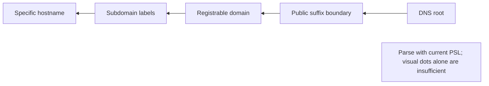
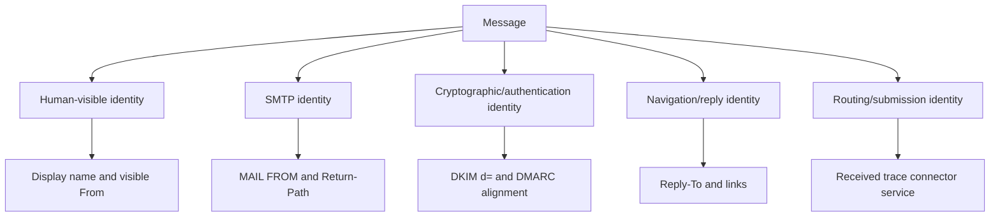
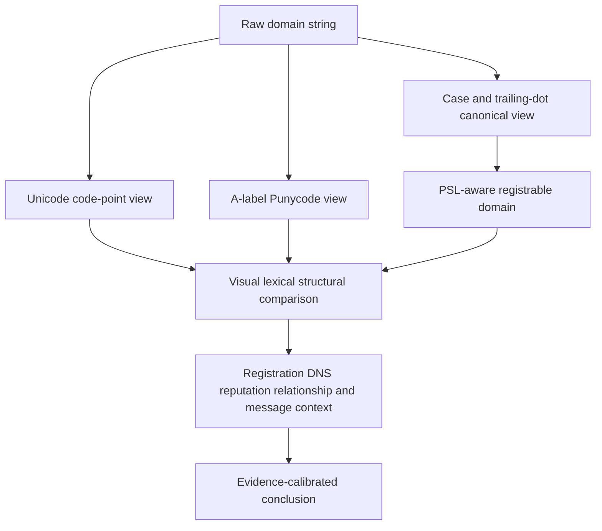
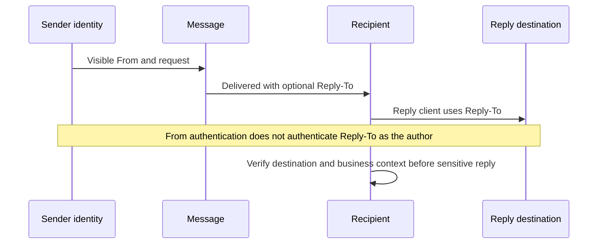
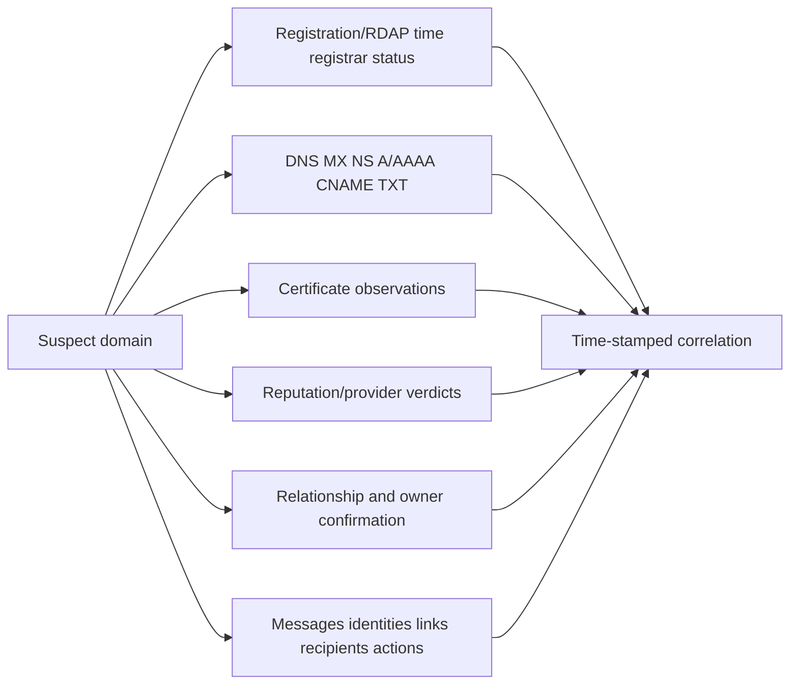
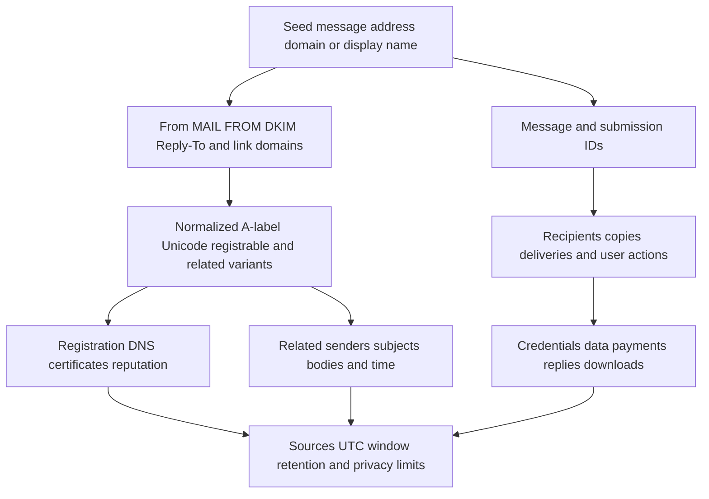
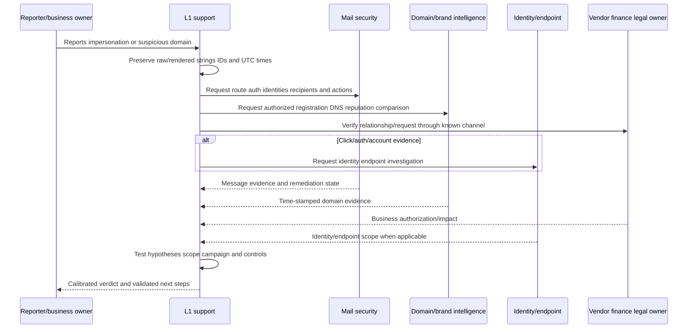
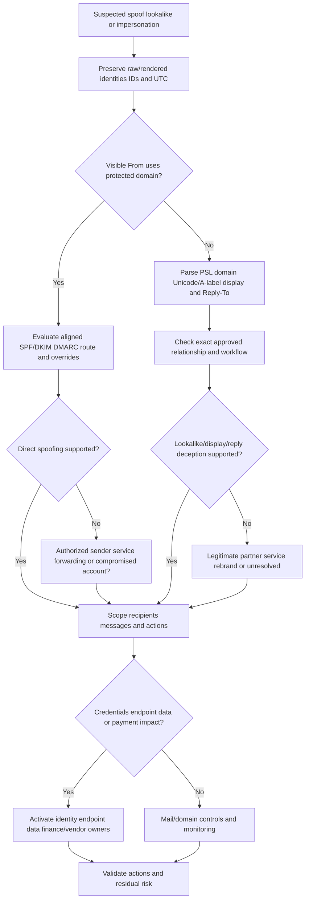

# Part 040 - Domain Spoofing Lookalikes and Impersonation

## Purpose, Evidence, and Currency

Email impersonation tries to make a recipient believe a message represents a different person, organization, brand, vendor, or system. The deception can occur in the visible display name, visible author address, SMTP envelope, reply path, links, domains, Unicode rendering, message body, branding, conversation context, or an actually compromised account.

These mechanisms are not interchangeable:

- **Direct domain spoofing** forges an identity in a domain the sender does not control. SPF, DKIM, DMARC, composite authentication, routing, and platform anti-spoof controls may expose or handle it.
- **Lookalike/cousin-domain impersonation** uses a separately controlled domain that resembles the target. That domain may correctly pass SPF, DKIM, and DMARC for itself.
- **Display-name impersonation** uses a trusted name while the underlying address belongs elsewhere.
- **Reply-to impersonation/mismatch** directs replies to a different address or domain.
- **Unicode/IDN impersonation** uses visually confusable characters or labels. An Internationalized Domain Name (IDN) can be legitimate; confusion is context, not proof.
- **Compromised-domain/account impersonation** uses legitimate infrastructure or an authentic account. Authentication may pass because the sender is technically authorized.

No single feature—domain age, registration privacy, lexical similarity, reputation, TLS, SPF/DKIM/DMARC pass, logo, display name, geographic location, or writing quality—proves maliciousness. The investigation combines message identity, authentication/alignment, DNS and registration provenance, normalized/rendered domain comparison, routing, reputation/tool output, relationship/business context, campaign scope, user action, and owner confirmation.

This part is defensive and beginner-first. It does not teach domain acquisition, brand targeting, evasion, phishing delivery, or operational reconnaissance. The lab is entirely offline and uses reserved `.invalid` names. Never browse, resolve, register, contact, block, report, or take down a suspected domain from a learning exercise. Public Abnormal pages are cited only for public positioning.

## Section Goal

By the end of this part, you should be able to:

- Define domain, label, fully qualified domain name (FQDN), registrable domain, public suffix, subdomain, hostname, URL host, IDN, Unicode, Punycode/A-label, display name, RFC 5322 From, MAIL FROM, Reply-To, alignment, spoofing, lookalike/cousin domain, and impersonation.
- Separate direct spoofing from lookalike, display-name, reply-to, compromised-account, and content/brand impersonation.
- Explain why authentication validates narrow domain/control claims rather than honesty or business authorization.
- Parse a domain right-to-left using a Public Suffix List (PSL)-aware registrable-domain model.
- Normalize case, trailing dots, Unicode/A-label representation, and rendered-vs-raw views without inventing certainty.
- Recognize insertion, deletion, substitution, transposition, separator, subdomain, TLD, Unicode-confusable, and word-order similarity patterns.
- Compare visible From, envelope/Return-Path, DKIM signing domain, DMARC alignment, Reply-To, links, and actual submission/routing.
- Treat domain age, registrar, nameservers, certificate, DNS, hosting, reputation, and privacy/proxy registration as contextual evidence with provenance and time.
- Use relationship, expected workflow, invoice/payment/contact change, thread history, role, urgency, and out-of-band confirmation.
- Build competing hypotheses for direct spoofing, lookalike domain, legitimate partner/rebrand, marketing/transactional service, forwarding/transformation, compromised sender, and false positive.
- Scope recipients, messages, domains, addresses, links, reply paths, infrastructure, user actions, and business impact.
- Route message remediation, blocking, domain investigation, brand/legal/takedown, vendor verification, identity response, and monitoring to authorized owners.
- Validate controls and document residual risk.
- Complete a zero-network domain-comparison lab with reserved examples.

## JD Mapping

| Role signal | Capability built here | Support output |
|---|---|---|
| Investigate sophisticated email attacks | Distinguish authentication spoofing from contextual impersonation | Identity-layer comparison matrix |
| Troubleshoot false positives/negatives | Explain why technically valid lookalikes can be harmful and legitimate cousins can look suspicious | Competing-hypothesis ledger |
| Communicate with customers | Translate domain/Unicode evidence without fear or accusation | Claim-by-claim verdict |
| Coordinate remediation | Separate mail, DNS/domain, identity, vendor, brand/legal, and business ownership | Explicit action and validation plan |
| Protect users | Capture user actions and stop trusted-workflow abuse | Recipient/user-action scope |
| Work across Microsoft/Google ecosystems | Use public platform anti-spoof/impersonation concepts | Learned architecture only |
| Show evidence rigor | Preserve raw and rendered strings, source time, and tool provenance | Reproducible comparison worksheet |
| Transfer enterprise support strength | Apply timeline, scoping, escalation, and validation | Production support transfer without threat-ops inflation |

## Candidate Honesty Note

Arti can say:

> "My production background is Microsoft enterprise support, where I isolated multi-layer issues, correlated logs and customer evidence, owned critical communication, and escalated with clear asks. I have not operated Abnormal AI or a production brand-protection/takedown program. I learned email authentication, domain parsing, IDN/Unicode, and impersonation investigation from official sources and practiced only with reserved offline strings. In production, authorized mail, security, DNS/domain, identity, vendor, brand/legal, and business owners would make enforcement or takedown decisions."

| Evidence tier | Honest claim | Boundary |
|---|---|---|
| **Production transfer** | Enterprise troubleshooting, customer ownership, evidence, escalation | Not production impersonation response |
| **Local/synthetic lab** | Offline reserved-domain comparison and case writing | No DNS, registration, reputation, blocking, or takedown action |
| **Learned architecture** | RFC, Unicode, PSL, provider, and public product concepts | No private detector, tenant, or brand tooling claim |
| **No direct experience** | No live domain seizure/reporting, registrar contact, or production tuning | State gap and route to owners |

## Evidence Labels

| Label | Meaning | Example |
|---|---|---|
| **[Raw observation]** | Exact message/domain string | "From domain is `pay-example.invalid`." |
| **[Rendered observation]** | What a specified UI displays | "Fixture UI hides the address until expansion." |
| **[Authentication observation]** | SPF/DKIM/DMARC result with identities | "DMARC passes for the lookalike domain itself." |
| **[Registration/DNS observation]** | Time-stamped authoritative/public record | "Synthetic fixture lists registration age as three days." |
| **[Business confirmation]** | Authorized relationship/workflow owner statement | "Vendor owner says no domain migration was approved." |
| **[Tool observation]** | Named tool/verdict at a time | "Tool-A labels string similar; method unknown." |
| **[Inference]** | Testable interpretation | "The domain may imitate the vendor name." |
| **[Conclusion]** | Supported judgment within scope | "Lookalike-domain impersonation confirmed in fixture." |
| **[Unknown]** | Missing data/coverage | "Registrant and certificate history are unavailable." |

## Beginner Primer: Domain Names Are Hierarchies

Domain names are read structurally from right to left. In `billing.partner.example.invalid`, the rightmost label is the top-level/suffix area, `example.invalid` is the reserved registrable example in this lab, and `billing.partner` are lower-level labels. Analyst-side registrable-domain extraction commonly uses an up-to-date Public Suffix List (PSL) because public suffixes can contain multiple labels. That comparison aid is not the current DMARC policy-discovery algorithm.

| Term | Plain meaning | Example |
|---|---|---|
| Label | Text between dots | `billing` |
| FQDN | Full hierarchical DNS name | `billing.partner.example.invalid.` |
| Trailing dot | Explicit DNS root marker | Final `.` in FQDN |
| Public suffix | Registry-controlled boundary represented in PSL policy data | Use current PSL; do not guess |
| Registrable domain | One label plus public suffix | PSL-aware comparison boundary |
| Subdomain | Labels left of registrable domain | `billing.partner` |
| Hostname/URL host | Network name in a URL/request | `login.example.invalid` |
| Email domain | Domain after `@` in an address | `example.invalid` |

### Why the Public Suffix List Matters

Taking the last two labels is wrong for many real domains. The PSL helps an analyst or URL/domain library estimate where registrable control begins. It is policy data, not a verdict list. A domain can also use private suffix rules. Record the PSL version/source and whether private rules were enabled when the boundary matters.

Do not silently reuse that result as the current DMARC Organizational Domain. RFC 9989, published in May 2026, replaced RFC 7489's PSL-oriented DMARC method with a bounded DNS Tree Walk. This creates two related but distinct questions:

| Question | Governing method | Investigation use |
|---|---|---|
| What registrable domain should the analyst compare for a URL/domain lookalike? | Named PSL implementation and snapshot, including private-rule setting | Lexical/structural grouping and ownership questions |
| What DMARC Policy Record applies to this message? | RFC 9989 policy discovery using the Author Domain and DNS Tree Walk | Authentication evaluation |
| Are domains in relaxed DMARC alignment? | RFC 9989 Organizational Domain determination | SPF/DKIM alignment with the Author Domain |
| Are domains in strict DMARC alignment? | Case-insensitive exact domain identity comparison | Exact alignment decision |

Two tools can therefore produce different boundary labels without either output being fabricated. Preserve the parser method, RFC generation, DNS observations, and timestamps instead of calling both outputs simply "the organizational domain."

## 🔍 Plain-English deep-dive: A Property Map and a Delivery Route Answer Different Questions

Imagine a shopping complex. A property map groups storefronts by landlord, while a delivery driver follows posted receiving-office signs. Both systems move right-to-left through an address hierarchy, but they answer different questions. The property map helps ask, "Which storefronts appear to share a controllable property boundary?" The receiving signs answer, "Which office published instructions for this delivery?"

A PSL-aware parser is like the property map. It gives an analyst a repeatable registrable-domain boundary for comparing names such as a protected domain, a lookalike, and a URL host. The PSL also contains private rules that can intentionally group hosted tenants differently depending on whether the parser enables that section.

RFC 9989's DMARC DNS Tree Walk is like following receiving-office signs. A mail receiver starts with the message's Author Domain and checks DNS for applicable DMARC Policy Records. It walks toward parent names under bounded rules, and `psd` tags can help establish an Organizational Domain or Public Suffix Domain. The receiver is discovering published mail policy, not asking a PSL library who probably controls a web property.

Therefore, never copy a PSL parser's output into a DMARC alignment field without protocol evidence. Record two fields when both matter: **analyst registrable domain (tool/snapshot/settings)** and **DMARC Organizational Domain or Policy Domain (receiver result or reproduced RFC 9989 method)**. Agreement strengthens reproducibility; disagreement is a lead to explain, not permission to choose whichever answer supports the preferred verdict.

**Memory hook:** PSL maps comparison boundaries; DMARC walks DNS for mail policy.

## Message Identity Layers

| Layer | Question | Impersonation use |
|---|---|---|
| Display name | What friendly name appears? | Trusted executive/vendor name |
| RFC 5322 From | What author address is presented? | Direct spoof or lookalike address |
| Sender | Who sent on behalf of another? | Delegation/service behavior |
| Reply-To | Where do replies go? | Diversion to another address/domain |
| MAIL FROM/Return-Path | Which SMTP return identity? | SPF/bounce path; can differ legitimately |
| DKIM `d=` | Which domain signed selected content? | Authenticated signing identity |
| DMARC domain/alignment | Does SPF or DKIM align with visible From? | Direct spoofing control signal |
| Received/submission path | Which systems handled/submitted mail? | External/internal/service/connector context |
| Link domains | Where do interactions lead? | Brand/credential/content impersonation |
| Body/signature/logo | What human identity/story is claimed? | Social engineering context |

## Direct Spoofing

Direct spoofing presents a domain identity the sender does not control. Email authentication can help evaluate specific claims:

- SPF checks whether the connecting IP is authorized for the evaluated MAIL FROM/HELO identity.
- DKIM verifies a signature for the `d=` signing domain and selected content.
- DMARC evaluates whether the **Author Domain**, extracted from the visible RFC 5322 From field, aligns with a passing SPF MAIL FROM domain or DKIM `d=` signing domain. A U-label Author Domain is converted to its A-label form for processing.

Under current RFC 9989, a receiver first looks for a DMARC Policy Record at the Author Domain. If none is found, the receiver performs a bounded DNS Tree Walk toward an Organizational Domain or Public Suffix Domain; anti-abuse rules limit the walk to at most eight queries. Relaxed alignment means the Author Domain and authenticated identifier have the same RFC 9989 Organizational Domain. Strict alignment means the two domains are identical. This is protocol evaluation, not a substitute for the PSL-aware comparison view used elsewhere in this Part.

| Result | Narrow interpretation | Not proven |
|---|---|---|
| SPF pass | IP authorized for evaluated envelope identity | Visible From honesty/content safety |
| DKIM pass | Signature validates for `d=` and signed fields/body | Human authorization/benign intent |
| DMARC pass | Aligned SPF or DKIM path passes for visible From | Account not compromised/message safe |
| DMARC fail | No passing aligned path as evaluated | Malicious intent by itself |
| Authentication none/error | Control absent/unavailable/error | Automatic attack verdict |

Direct spoofing can be affected by forwarding, mailing lists, gateways, connectors, ARC, transformations, DNS errors, policy discovery, and local-policy overrides. Reconstruct evaluation identities and path before concluding. Also record whether the result came from a legacy RFC 7489/PSL implementation or an RFC 9989/tree-walk implementation when that difference could change policy discovery or relaxed alignment.

RFC 9989 states the decisive limitation directly: DMARC addresses specific forms of exact-domain spoofing, but visually similar domains and display-name attacks are outside its scope. A DMARC pass validates authorized use of the evaluated Author Domain; it does not assert that the message, domain owner, business request, or destination is safe.

## 🔍 Plain-English deep-dive: Authentication Checks a Passport, Not the Traveler's Purpose

An officer can verify that a passport was issued by a country and belongs to the presented identity. That does not prove why the traveler is visiting or whether every statement is honest. Similarly, SPF/DKIM/DMARC can validate authorization, signature, and alignment claims; they do not prove benign business intent.

A lookalike domain owner can issue its own valid authentication records. A compromised vendor can send authenticated malicious mail. Conversely, a legitimate forwarded message can experience authentication changes.

Use four separate questions:

1. Which domain identity was asserted?
2. Was the technical sender authorized/aligned for that identity?
3. Is that identity the expected organization/person for this workflow?
4. Was the specific request authorized and safe?

The passport analogy stops being accurate because domains are delegated control, not people, and automated services may send on behalf of many organizations.

## Lookalike and Cousin Domains

A lookalike/cousin domain is separately controlled but resembles a trusted domain or brand. Similarity may be visual, lexical, semantic, or contextual.

| Pattern | Reserved synthetic pair | What changed |
|---|---|---|
| Insertion | `payexample.invalid` vs `pay-example.invalid` | Hyphen inserted |
| Deletion | `secure-example.invalid` vs `secur-example.invalid` | Character deleted |
| Substitution | `billing-example.invalid` vs `bi1ling-example.invalid` | Letter replaced by digit |
| Transposition | `vendor-example.invalid` vs `vednor-example.invalid` | Adjacent order changed |
| Word order | `example-pay.invalid` vs `pay-example.invalid` | Terms reordered |
| Added term | `example.invalid` vs `example-support.invalid` | Trust word added |
| Subdomain illusion | `example.invalid.attacker.invalid` | Trusted text appears left of true registrable domain |
| Different suffix | `example.invalid` vs `example.test` | Registrable suffix/domain differs |
| Unicode confusable | Rendered labels appear similar | Code points differ; normalize/display both |

Similarity alone is not intent. Partners, resellers, regional domains, product domains, mergers, campaign platforms, and legitimate services can be unfamiliar or similar. Verify ownership and relationship through authoritative business channels.

## Display-Name Impersonation

Mail clients often emphasize a friendly display name and hide the full address on compact/mobile views. `Chief Executive Officer <outside@example.invalid>` can look trusted at a glance if the display name is familiar.

| Check | Why it matters |
|---|---|
| Expand full sender address | Reveals underlying address/domain |
| Compare directory/contact resolution | Local contacts can affect rendering |
| Review raw RFC 5322 From | Separates display phrase from address |
| Check Sender/on-behalf-of | Legitimate delegation may be explicit |
| Review authentication for actual From | Tests narrow domain claims |
| Verify role/business request | Detects authority impersonation |
| Scope similar display names/messages | Finds campaign or legitimate service pattern |

Do not prohibit every external use of an employee/vendor name. Recruiters, ticket systems, calendar services, delegated mail, news, and legitimate partners may include names. Combine controls with context and least-disruptive tuning.

## Reply-To Mismatch and Conversation Diversion

Reply-To tells a client where replies should go. It can differ legitimately for mailing lists, support systems, surveys, campaigns, ticketing, no-reply services, delegated communication, and bounce handling. It is suspicious when it silently redirects a sensitive conversation to an unexpected identity.

| Evidence | Question |
|---|---|
| From vs Reply-To | Same address/domain/organization? If different, why? |
| Reply-To display | Does UI reveal destination clearly? |
| Thread participants | Was reply target introduced or changed? |
| Business workflow | Is alternate reply handling expected? |
| Authentication | Which domain did DMARC evaluate? Reply-To is not the DMARC From identity |
| User action | Did anyone reply/share data/change payment? |

## IDN, Unicode, and Punycode

The Domain Name System historically used ASCII. IDNA enables internationalized labels through standardized processing. An **A-label** is the ASCII-compatible form beginning with `xn--`; a **U-label** is a valid Unicode label representation. **Punycode** is part of the encoding used for A-labels.

Unicode supports legitimate languages and names. Some characters from different scripts can look similar. **Confusable** does not mean identical or malicious.

| View | Purpose | Risk if omitted |
|---|---|---|
| Raw source string | Preserve evidence | Transformation destroys original |
| Unicode rendered label | Understand user view | Miss visual deception |
| Code-point/script view | Identify actual characters/scripts | Treat appearance as identity |
| A-label/Punycode | Compare DNS-compatible form | Miss encoded label differences |
| Normalized comparison | Consistent analysis under standard | Ad hoc lowercasing/replacement errors |
| PSL-aware domain | Locate registrable boundary | Compare wrong labels |

## 🔍 Plain-English deep-dive: A Glyph Is an Appearance, a Code Point Is an Identity

Two keys on different keyboards can print symbols that look alike while representing different characters. A **glyph** is the visual shape; a **code point** identifies a Unicode character. Fonts and rendering affect appearance.

For safe analysis:

- preserve the exact raw string;
- display Unicode and A-label representations;
- identify scripts/code points with a trusted parser/tool;
- apply the relevant IDNA/Unicode standard rather than custom substitutions;
- compare the PSL-aware registrable domain;
- consider the recipient's actual client rendering;
- never say "homograph attack" solely because a domain is internationalized.

The keyboard analogy stops being accurate because Unicode normalization and IDNA impose formal validity/mapping rules, and browsers/clients may display A-labels based on policy.

## Subdomain Illusions and URL Host Parsing

Attackers and legitimate services can place trusted words anywhere left of the registrable domain. In `login.example.invalid.other.invalid`, the controlling reserved registrable domain is `other.invalid`, not the earlier text.

| String element | Common mistake | Correct question |
|---|---|---|
| Userinfo before `@` | Treat as host | What parser reports as host? |
| Subdomain | Treat trusted word as registrable owner | What is PSL-aware registrable domain? |
| Path/query | Treat brand text as host | Where does authority/host end? |
| Percent encoding | Read appearance only | What standards parser decodes where? |
| Backslash/Unicode separators | Assume browser behavior | Which client/parser and canonical URL? |
| Port | Ignore service context | Is explicit port expected? |

Part 037 covers links in depth. In this part, do not manually browse suspicious URLs. Use authorized tools and preserve source/rendered values.

## Domain Registration, DNS, Hosting, and Certificate Context

### Registration/RDAP/WHOIS

Registration records may expose registrar, registration/update/expiry times, status, nameservers, and redacted contact data. Privacy/proxy services are common and not proof of abuse. WHOIS availability/format varies; RDAP provides structured registration data where supported.

### DNS

Records can show current MX, A/AAAA, CNAME, TXT, NS, and other configuration. DNS is time-varying. Absence may mean no record, query error, split-horizon view, recent change, or retention gap.

### Certificates

A valid TLS certificate generally proves the requester satisfied certificate-validation requirements for a name at issuance; it does not prove the site or email is benign. Certificate Transparency can provide issuance observations, not ownership/intent verdicts.

| Signal | Useful question | Unsafe conclusion |
|---|---|---|
| Recent registration | Is timing consistent with campaign? | New equals malicious |
| Privacy/proxy | Is registrant contact hidden? | Privacy equals attacker |
| Shared nameserver/hosting | Does infrastructure cluster with case? | Shared host proves same actor |
| No MX | Is domain used only for links/redirects? | No MX means harmless |
| Valid certificate | Was certificate issued for host? | Padlock means safe |
| Authentication records | Can domain authenticate its own mail? | SPF/DKIM/DMARC means legitimate business |
| Reputation verdict | What source/time/method/coverage? | One tool is ground truth |

## Reputation and Similarity Scores

A reputation system may use observations such as prior abuse, age, hosting, registration, content, relationships, prevalence, or behavior. A similarity score may compare edit distance, keyboard adjacency, token/word changes, script confusables, or learned features. Private logic may be unavailable.

| Tool output | Record |
|---|---|
| Source/product | Exact provider/tool/version if available |
| Query/object | Domain, host, URL, address, message—do not conflate |
| Time | UTC lookup/observation time |
| Verdict/score | Exact text/value and scale |
| Method/coverage | Published method, feeds, retention, blind spots |
| Raw evidence | Safely stored result/reference |
| Interpretation | Observation versus inference |

Never upload customer messages or domains to public services without authorization. Queries can disclose investigation interest and customer data.

## Reproducible Domain Comparison Method

A domain comparison should be reproducible by another analyst. "It looks close" is not reproducible. Store the original value, every transformation, the tool or standard used, and the output. Never replace the original field with a normalized derivative.

### Step 1: Identify the object

State whether the string came from an email address domain, URL host, DKIM `d=`, Return-Path, Reply-To, display text, certificate name, DNS record, or tool output. The same characters can have different meaning in different fields. A URL-like phrase in body text is not necessarily the parsed destination host. A domain in a DKIM signature is not necessarily the visible From domain.

### Step 2: Preserve exact input

Store the exact source value through an approved evidence path. Preserve capitalization even though DNS comparison is generally case-insensitive because capitalization can explain rendering or transcription. Preserve a trailing dot, brackets, quotes, comments, whitespace, and Unicode characters in the raw field; parsers can then explain whether each item belongs to the domain or surrounding syntax.

### Step 3: Parse with the right grammar

Use an email-address parser for message addresses and a standards-aware URL parser for URLs. Do not split a URL on dots or `@` by hand. Record parser/library/product and version when practical. Parser disagreement is itself evidence: identify which client, gateway, browser, or security product consumed the original value.

### Step 4: Produce comparison views

Generate a canonical DNS comparison view, Unicode/U-label view, A-label view, code-point/script view when relevant, and PSL-aware registrable-domain/subdomain decomposition. If a transformation fails, preserve the exact error rather than forcing a result. An invalid IDNA label and a valid but unfamiliar IDN are different observations.

### Step 5: Compare dimensions separately

| Comparison dimension | Example question | Output |
|---|---|---|
| Exact equality | Are canonical strings identical? | Yes/no and transformation rules |
| Registrable-domain equality | Do they share the same PSL-aware registrable domain? | Exact boundary and PSL source/version |
| Label structure | Were labels added, removed, or moved? | Right-to-left label diff |
| Character sequence | Insert/delete/substitute/transpose? | Descriptive diff; score only if method known |
| Token/word sequence | Are brand and trust words reordered/added? | Token diff |
| Script/code point | Do rendered characters use different scripts/code points? | Code-point/script table |
| Rendered appearance | How does named client/font display it? | Screenshot/reference under policy |
| Semantic context | Does the name claim a role/product/workflow? | Human-reviewed inference |

### Step 6: Correlate external and business evidence

Similarity cannot establish ownership, motive, or authorization. Add time-stamped registration/DNS/certificate/reputation observations and known-channel business confirmation. Record missing coverage. Then write a mechanism conclusion and an intent/risk conclusion separately.

### Step 7: Peer-check high-impact decisions

Before a broad block, takedown referral, vendor accusation, or executive communication, have an authorized peer verify the raw string, registrable boundary, representation conversion, message identity, and exact target of the proposed action. This catches one-character transcription and wrong-object errors.

### Comparison Record Template

| Field | Required entry |
|---|---|
| Case/message ID | Stable internal reference |
| Source object | From, Reply-To, URL host, DKIM, DNS, etc. |
| Raw string | Exact preserved value |
| Parser/tool/version | Named implementation or `manual display only` |
| Canonical view | Output or exact error |
| Unicode/U-label | Output or exact error |
| A-label | Output or exact error |
| Code points/scripts | When visual confusion is relevant |
| PSL source/time | Version/retrieval time and private-rule setting for analyst comparison |
| Registrable domain | Exact output |
| DMARC discovery method | `treewalk`, legacy `psl`, provider output, or `not evaluated` |
| Similarity observations | Separate structural/lexical/visual facts |
| External enrichment | Source, object, UTC, verdict/data, coverage |
| Business confirmation | Owner, known channel, time, authorized claim |
| Conclusion/confidence | Mechanism and risk/intent stated separately |

## Time-Aware Infrastructure Evidence

Domain infrastructure changes. A current lookup may not represent delivery time. A domain can change nameservers, hosting, MX, TXT records, redirects, certificates, and status before or after a message. Reputation can also change as providers learn about a campaign.

For each observation, distinguish:

- **event time**: when the message, registration, DNS change, certificate issuance, or user action occurred;
- **observation time**: when your tool retrieved or recorded it;
- **validity/effective interval**: the period the record claims or is known to apply;
- **ingestion/publication time**: when a provider made telemetry available;
- **retention limit**: how far the source can look back.

| Time problem | Example | Safe handling |
|---|---|---|
| Current-state bias | Current MX is absent, but message arrived yesterday | Seek authorized historical evidence; mark current-only limitation |
| Reputation lag | Domain was unknown at delivery and harmful later | Preserve original verdict plus later update; do not rewrite history |
| Clock mismatch | Mail trace and registration tool use local time | Normalize to UTC and preserve source time zone |
| DNS cache/TTL | Different resolvers observed old/new values | Record resolver/view, query time, TTL, and authoritative evidence |
| Registration update | Update time follows abuse report | Do not infer original actor/motive solely from later change |
| Certificate timing | Certificate predates campaign | Shows issuance observation, not continuous hosting or intent |

A customer-safe timeline might say:

> "At delivery time, Provider A reported the domain as unknown. At 14:20 UTC, Provider A reclassified it as malicious. The current DNS observation was collected at 14:35 UTC and cannot by itself establish the domain's delivery-time records. Message and business evidence support the lookalike conclusion independently."

## Confidence Composition

Confidence belongs to a claim, not the entire case. A case may have high confidence that two registrable domains differ, medium confidence that one was selected to imitate the other, high confidence that the business request was unauthorized, and low confidence about actor identity.

| Claim | Typical supporting evidence | Common overclaim |
|---|---|---|
| Domains differ | Raw/parser/PSL output | None if reproducible |
| Visual similarity exists | Named rendering/code points/peer review | "Homograph attack" without intent/context |
| Direct spoofing occurred | Visible From, alignment, route, owner/config | Treating every DMARC fail as spoof |
| Lookalike impersonation occurred | Similar separate domain + unauthorized identity/request + campaign | Treating similarity alone as intent |
| Real account compromised | Sender-owner/identity evidence and unauthorized actions | Inferring from authenticated harmful message alone |
| Same actor/campaign | Shared rare infrastructure/content/timing and intelligence | Attributing from shared hosting/registrar |
| Data/payment impact occurred | Authoritative resource/business records | Assuming impact from message delivery |

Use phrases such as **observed**, **supports**, **consistent with**, **confirmed by owner**, **not established**, and **unknown within current sources**. Avoid "obviously fake," "definitely attacker-owned," or naming an actor without attribution-quality evidence.

## Choosing the Narrowest Effective Control

The response target must match the proven mechanism. A block on a visible From address may not stop a rotating-domain campaign. A block on an entire legitimate provider or vendor domain can cause greater harm than the attack. A display-name control can generate false positives if names are common.

### Control-selection questions

1. What exact object is malicious or unauthorized: message fingerprint, sender address, registrable domain, URL, attachment, display-name pattern, app/account, or business instruction?
2. Is the object dedicated to abuse or shared with legitimate traffic?
3. Will the control evaluate the same normalized identity the investigation used?
4. Does the platform act at pre-delivery, delivery, post-delivery, click, reply, or account/resource time?
5. What historical data can estimate false positives and misses?
6. What approval, expiry, rollback, and exception path applies?
7. How will success be observed, and how will recurrence/variant movement be detected?

| Mechanism | Candidate control family | Validation focus |
|---|---|---|
| Direct protected-domain spoof | Authentication/anti-spoof policy and override correction | Aligned identity, forwarding/service exceptions, delivery outcome |
| Single lookalike campaign | Exact domain/sender/URL/message remediation | Variants, recipient copies, legitimate collisions |
| Rotating lexical variants | Layered similarity + behavioral/context detection | Historical holdout, multilingual/partner false positives |
| Display-name impersonation | Protected-user/name and external-sender context | Common-name/delegated-service impact |
| Reply diversion | Reply-To/context detection or app configuration | Legitimate ticket/list/campaign routes |
| Compromised real sender | Account/vendor incident controls plus scoped mail action | Identity recovery and continued legitimate communication |
| Harmful link on shared service | Exact URL/path/content or time-of-click control | Shared-domain collateral and redirect changes |

### Validation stages

- **Pre-deployment test:** historical known bad, known good, and ambiguous samples.
- **Peer/owner review:** mail, business, vendor, privacy/legal, and brand stakeholders as applicable.
- **Limited rollout:** smallest safe audience/time/policy scope.
- **Outcome check:** per-message/action results and error/partial states.
- **Collateral check:** legitimate mail, partner workflows, multilingual/IDN traffic, shared services.
- **Recurrence check:** new domains, senders, links, and content after a stated UTC interval.
- **Expiry/review:** temporary controls require owner/date/reason; permanent controls require periodic validity review.

## Case Record Quality Standard

A strong impersonation record lets a later analyst answer the following without reopening every artifact:

- What exact identity did the recipient see, and in which client/view?
- What were the raw From, Sender, Reply-To, envelope, DKIM, DMARC, link, and routing identities?
- What did the parser/PSL/Unicode conversion produce, using which versions?
- Which claims are observations, inferences, owner confirmations, conclusions, and unknowns?
- Which external observations apply to delivery time versus lookup time?
- What exact relationship/request was expected and how was it verified?
- Which messages/recipients/user actions/accounts/data/transactions are in scope?
- What actions were recommended, requested, approved, completed, failed, and validated?
- What legitimate traffic could the control affect?
- What remains unknown because of access, retention, time, source, privacy, or product boundaries?

| Case field | Example quality requirement |
|---|---|
| One-line problem | Mechanism-neutral at intake |
| UTC timeline | Message, user, tool, owner, and action times |
| Evidence index | Stable IDs/secure locations; no secrets in notes |
| Identity matrix | Raw and parsed message/domain identities |
| Hypothesis ledger | Predicted, supporting, contradicting, next test |
| Scope | Included/excluded systems, recipients, times, actions |
| Verdict | Mechanism, intent/business authorization, impact separated |
| Action ledger | Object, owner, state, error, validation, rollback/expiry |
| Communication | Audience-specific, calibrated, no unsupported attribution |
| Residual risk | Coverage/retention/monitoring and decision owner |

## Business and Relationship Context

| Context | Why it matters | Verification owner |
|---|---|---|
| Known vendor domains | Expected identity inventory | Vendor management/procurement |
| Domain migration/rebrand | Legitimate unfamiliar domain | Vendor/domain/business owner |
| Payment/contact change | High-consequence workflow | Finance/procurement through known channel |
| Executive request | Authority pressure | Executive office/manager through directory route |
| New supplier/onboarding | No historical baseline | Procurement/legal/vendor owner |
| Marketing platform | Different From/Return-Path/Reply-To normal | Marketing/mail owner |
| Support/ticketing service | Delegated sender/reply routing | Application owner |
| Merger/subsidiary | Similar/different brand domains | Legal/IT/business owner |

## 🔍 Plain-English deep-dive: Similarity Creates a Question, Context Answers It

A uniform that resembles a delivery company may be suspicious, but a real subcontractor can wear a different uniform and a thief can wear a perfect one. Visual similarity starts verification; it does not finish it.

Ask:

- Is the exact domain/address approved for this relationship?
- Was a domain or contact change announced through an independently known channel?
- Is the requested action normal for this role, amount, timing, and process?
- Do message authentication, route, registration/DNS history, reputation, and campaign evidence support one hypothesis?
- Did recipients reply, authenticate, download, share data, or change a transaction?

The uniform analogy stops being accurate because a domain can be delegated to services and technically authenticated while the business request is unauthorized.

## Hypothesis Framework

| Hypothesis | Predicted evidence | Contradiction | Safe owner/test |
|---|---|---|---|
| Direct spoofing | Visible From target domain with failed/no aligned path or spoof signal | Authenticated authorized submission; forwarding explanation | Mail owner/raw trace |
| Lookalike domain | Separately controlled similar registrable domain, context mismatch | Approved vendor/rebrand/service domain | Domain + business owner |
| Display-name impersonation | Trusted display name, unexpected address | Approved delegate/service sender | Mail/directory/business |
| Reply diversion | Unexpected Reply-To tied to sensitive request | Documented ticket/list/campaign behavior | Mail/app/business |
| Unicode confusion | Different code points/scripts/A-label with visual similarity | Legitimate IDN and approved relationship | Standards-aware parser + owner |
| Compromised real account | Correct domain/auth, unauthorized behavior/account evidence | Sender owner confirms action | Identity/vendor incident owner |
| Legitimate service/delegation | Expected provider route, auth, contract/config | No owner approval; anomalous campaign | App/mail/business owner |
| Telemetry/rendering issue | Client/contact/parser changes display | Raw and multi-client evidence confirms deception | Client/mail owner |

## Scope Model

| Axis | Seed | Expansion |
|---|---|---|
| Time | First reported message | Registration/DNS history and campaign/response window |
| Message | Internet/network/provider ID | Copies, variants, thread, sender/service |
| Identity | Display/From | MAIL FROM, DKIM, Reply-To, delegate/app/account |
| Domain | Exact raw domain | Unicode/A-label, PSL domain, links, related infrastructure |
| Recipient | Reporter | All delivered/blocked recipients and shared mailboxes |
| User action | Report only | Reply, click, auth, download, data/payment/contact change |
| Business | Claimed vendor/person | Actual owner, workflow, contract, transaction |
| Infrastructure | Domain | Registrar/status, DNS, certificates, hosting, reputation |

## Investigation Workflow

### Phase 1: Preserve Raw and Rendered Evidence

Capture exact strings and headers through approved channels. Record client/view because rendering matters. Do not retype a Unicode domain from appearance. Preserve original and derivative representations separately.

### Phase 2: Parse Identities

Extract display name, From, Sender, Reply-To, MAIL FROM/Return-Path, DKIM `d=`, DMARC result/alignment, submission path, and link hosts. Determine PSL-aware registrable domains.

### Phase 3: Establish Context

Ask the business owner whether the exact address/domain/request is approved. Verify through independently known contact data, not message-provided details.

### Phase 4: Enrich Safely

Authorized owners query registration/RDAP, DNS, certificate, hosting, and reputation systems. Record source/time/object. Do not browse or contact infrastructure during L1 analysis.

### Phase 5: Scope and Respond

Find related messages/recipients, user actions, identity/endpoint impact, and business effects. Authorized owners remediate messages, apply precise controls, handle vendor/account response, and decide brand/legal/reporting/takedown.

### Phase 6: Validate and Monitor

Validate per-message outcomes, control match behavior, legitimate-mail impact, user/account recovery, and recurrence over a stated interval and data sources.

## Troubleshooting Decision Tree

## Response Ownership and Validation

| Action | Owner | Validation |
|---|---|---|
| Quarantine/remove messages | Mail/SOC | Recipient-level result, copies, late delivery |
| Block exact sender/domain/URL | Mail/security policy owner | Correct object/scope; legitimate impact; expiry/review |
| Detection/tuning change | Detection owner | Historical test, holdout, rollout, rollback, metrics |
| User/account response | Identity/endpoint owner | Session/token/device/control validation |
| Vendor confirmation/notification | Vendor/business owner | Known-channel confirmation and incident reference |
| Payment/data response | Finance/data/privacy/legal | Transaction/data scope and authorized decisions |
| Brand/domain monitoring | Brand/security/intelligence | Coverage, alert handling, review cadence |
| Registrar/host/report/takedown | Legal/brand/abuse owner | Authorized submission, status, evidence preservation |
| Domain/DNS changes for owned domain | DNS/domain owner | Authoritative records, propagation, mail/web impact |

### Takedown Boundary

L1 should not contact a registrar/host, threaten a sender, register a confusing domain, or submit legal/abuse reports without authorization. Takedowns require evidence, legal/brand authority, provider requirements, preservation, jurisdiction/process awareness, and a plan for infrastructure movement. Blocking and user protection may proceed independently under policy.

## Detection and Tuning Considerations

| Signal family | Benefit | Failure mode | Guardrail |
|---|---|---|---|
| Protected display names | Catches authority impersonation | External legitimate references/collisions | Address/relationship/context layers |
| Domain similarity | Finds lexical variants | Legitimate brands/partners/products | Approved-domain inventory + multiple features |
| Unicode/script | Finds confusable rendering | Harms legitimate IDNs/languages | Standards-aware, no blanket non-ASCII block |
| Domain age/reputation | Adds campaign context | New legitimate vendors/domains | Never single-signal block |
| Reply-To mismatch | Finds diversion | Ticket/list/campaign workflows | Application-specific exceptions |
| Authentication failure | Finds direct spoof | Forwarding/list/config failures | Path/ARC/connector analysis |
| Behavioral context | Detects unusual relationships/requests | Baseline gaps/cold start | Explainability and feedback loop |

## Worked Example 1: Direct Spoof

### Synthetic evidence

- Visible From: `cfo@example.invalid`.
- Fixture DMARC: fail, no aligned passing path.
- External submission path.
- CFO owner denies message; three finance recipients received it.

### Conclusion

> Direct spoofing of the reserved protected domain is supported in the fixture. DMARC failure supports the technical claim but business denial and routing establish context. Mail owner scopes/remediates recipients and reviews authentication enforcement/overrides; finance verifies actions.

## Worked Example 2: Authenticated Lookalike

### Synthetic evidence

- From: `billing@pay-example.invalid`.
- SPF, DKIM, and DMARC pass for `pay-example.invalid`.
- Expected vendor domain in inventory is `payment-example.invalid`.
- Vendor owner confirms no migration; request changes beneficiary.

### Conclusion

> Lookalike-domain vendor impersonation is strongly supported. Authentication passes are expected because the sender controls its own lookalike domain. The payment change requires independent finance/vendor handling; mail/domain controls use the exact observed identity and campaign scope.

## Worked Example 3: Legitimate Reply-To Mismatch

### Synthetic evidence

- Marketing message From uses approved brand domain.
- Reply-To uses documented campaign-service domain.
- Application owner confirms configuration and historical pattern.
- No sensitive request or user impact.

### Conclusion

> The Reply-To mismatch is legitimate within the scoped campaign workflow. Preserve the explanation and avoid a broad rule that would block all mismatches. If tuning is needed, use narrow service/configuration evidence and validate future behavior.

## Worked Example 4: Unicode Confusable but Unresolved

### Synthetic evidence

- Rendered label resembles protected brand.
- Code-point/A-label views differ.
- No registration/business/reputation evidence is available in the offline fixture.

### Conclusion

> Visual/Unicode similarity is confirmed; malicious intent is not established. Protect users proportionately if the message requests a sensitive action, and route authorized enrichment/relationship confirmation. Do not label every IDN malicious.

## Worked Example 5: Compromised Real Vendor

### Synthetic evidence

- Exact approved vendor domain; authentication and prior thread context pass.
- Vendor security contact confirms account compromise through known channel.
- Message requests bank-detail change.

### Conclusion

> Compromised legitimate vendor account is supported, not domain spoofing. Mail/finance/vendor/identity response is required. Blocking the entire vendor domain may disrupt legitimate incident communication; choose scoped controls and known out-of-band channels.

## Common Failure Modes

| Failure | Why it fails | Better behavior |
|---|---|---|
| Last two labels = registrable domain | Public suffixes vary | Use current PSL-aware parser |
| SPF pass = safe | SPF may cover different identity | State evaluated identity; check alignment/context |
| DMARC pass = authorized business request | Lookalike/compromised senders can pass | Verify exact organization and request |
| New domain = malicious | Legitimate domains are new | Correlate campaign/relationship evidence |
| WHOIS privacy = attacker | Privacy/proxy is common | Treat as context only |
| TLS padlock = legitimate | Certificate validates narrow control | Evaluate site/message/business context |
| Non-ASCII = malicious | IDNs support legitimate languages | Standards-aware confusable analysis |
| Similarity score = verdict | Method/threshold/context vary | Record tool provenance and corroborate |
| Reply-To mismatch = attack | Legitimate services use it | Verify app/workflow and sensitivity |
| Display name = identity | Friendly phrase is arbitrary | Expand exact address and route |
| Click/browse to inspect | Exposes user/system and changes evidence | Authorized detonation/intelligence owner |
| Public reputation upload | Discloses customer investigation | Approved private tools/minimized data |
| Block whole vendor domain | High business damage | Exact campaign/object and owner approval |
| L1 takedown contact | Legal/process/evidence risk | Route to brand/legal/abuse owner |

## Customer Communication Templates

### Under Investigation

> "The message resembles `[trusted identity]`, but the exact sender domain is `[observed domain]`. We are separately evaluating direct spoofing, lookalike/display-name/reply-to impersonation, legitimate service/delegation, and compromised-sender hypotheses. Authentication results validate narrow domain claims and are not a safety verdict."

### Confirmed Lookalike

> "The message used a separately controlled domain that resembles the approved organization domain. The sender's domain authenticated for itself, but the business owner confirmed it is not approved for this relationship/request. Affected messages, recipients, and user/business actions are scoped to `[sources/window]`."

### Direct Spoof

> "The visible From domain was the protected organization domain, but no passing aligned authentication path was observed in the reviewed trace and the submission was external. This supports direct spoofing within the scoped message set. Mail policy/override behavior and recipient remediation are being validated."

### Unresolved Similarity

> "Visual/lexical similarity is present, but current evidence does not establish malicious intent or domain ownership. Because the message requests `[sensitive action]`, users should pause and verify through a known channel while authorized domain/business enrichment continues."

### Scoped Resolution

> "The campaign was classified as `[mechanism]`, affected messages and user actions were addressed, and the applied controls were validated against the exact sender/domain/message set and known legitimate traffic. Monitoring continues through `[UTC]`; sources and retention limits are documented."

## Safe Synthetic Lab: The Reserved-Domain Impersonation Observatory

### Objective

Build an offline comparison and case-response artifact for direct spoofing, lookalike, display-name, reply-to, Unicode, legitimate-service, and compromised-sender scenarios. Use reserved domains only; perform no DNS, web, email, reputation, registration, account, block, or report action.

The unique lab name is **The Reserved-Domain Impersonation Observatory**.

### Prerequisites

- Local Markdown editor or spreadsheet.
- Offline text/code-point viewer if already installed; no downloads required.
- Fixtures below only.
- No tenant, DNS, RDAP/WHOIS, registrar, browser, reputation, mail, account, or product access.
- All domains end in `.invalid`.

### Authorized scope

Authorized:

- Copy/compare reserved strings locally.
- Mark hypothetical parser outputs explicitly.
- Build identity, hypothesis, scope, action, and communication tables.
- Label work **local/public lab - reserved synthetic domains only**.

Prohibited:

- Registering, resolving, browsing, pinging, querying, emailing, blocking, reporting, contacting, purchasing, or taking down any domain.
- Creating spoofed messages or sending mail.
- Testing real brands, customers, people, vendors, domains, URLs, or addresses.
- Uploading fixtures or customer data to public reputation/scanning services.

### Synthetic fixtures

| Case | Display/From | Other evidence |
|---|---|---|
| A direct spoof | `Executive <cfo@example.invalid>` | Fixture DMARC fail; external path |
| B lookalike | `Billing <billing@pay-example.invalid>` | Auth passes for own domain; approved is `payment-example.invalid` |
| C display-name | `Executive <outside@sender.invalid>` | No protected-domain use |
| D reply diversion | `Support <notice@example.invalid>` | Reply-To `case@reply.invalid` |
| E subdomain illusion | Link host `example.invalid.other.invalid` | PSL-aware reserved domain is `other.invalid` |
| F Unicode | Instructor supplies two visibly similar local labels | Record code points/A-label as hypothetical unless tool is trusted |
| G legitimate service | Approved app domain differs from brand | Owner confirmation fixture = yes |
| H compromised vendor | Exact approved vendor domain/auth | Known-channel vendor confirmation fixture = compromised |

### Steps

1. Create `Reserved-Domain Impersonation Observatory`; label it `local/public lab - reserved synthetic domains only`.
2. Record exercise authorization, exclusions, offline status, and UTC time.
3. Copy fixtures exactly. Do not substitute real domains or search them.
4. For each case, separate display name, From, Reply-To, MAIL FROM, DKIM `d=`, DMARC domain/result, link host, and routing fields; use `not provided` where absent.
5. Build raw, normalized-case/trailing-dot, Unicode rendered, code-point/script, A-label, PSL registrable-domain, and visual/lexical comparison columns. Do not fabricate conversion output.
6. Classify mechanism separately: direct spoof, lookalike, display-name, reply diversion, subdomain illusion, Unicode similarity, legitimate service, or compromised legitimate sender.
7. Create at least six competing hypotheses with predicted/contradicting evidence and owner/test. Mark all external tests `not performed - offline lab`.
8. Add time-stamped hypothetical registration/DNS/certificate/reputation rows; label them `fixture`, never real lookup.
9. Scope messages, recipients, identities, domains, links, user actions, business workflows, and impact.
10. Create action rows for mail remediation, precise block/tuning, user/account response, vendor confirmation, finance/data action, brand/legal routing, and monitoring.
11. Track action state from recommended through validated; leave fixture actions unperformed.
12. Write under-investigation, confirmed-lookalike, direct-spoof, unresolved-IDN, and scoped-resolution communications.
13. Add false-positive analysis for the legitimate service and show why a blanket Reply-To/non-ASCII/new-domain rule is unsafe.
14. Complete privacy, honesty, and zero-network/activity attestation.

### Expected evidence

- Eight-case identity-layer matrix.
- Raw/rendered/Unicode/A-label/PSL-aware comparison fields.
- Separate mechanism and malicious-intent conclusions.
- Six or more testable hypotheses.
- Source/time/provenance fields for every hypothetical enrichment.
- Recipient/user/business impact scope.
- Seven or more owned action rows with validation criteria.
- Five customer-safe communications.
- False-positive/overblocking analysis.
- Explicit record of no DNS, network, domain, mail, account, block, report, or takedown action.

### Cleanup and privacy

- Confirm all domains end in `.invalid` and no real people/brands/customers appear.
- Remove accidental real headers, domains, addresses, Unicode strings, registration data, IPs, messages, or customer content.
- Delete the worksheet if reliable redaction is impossible.
- Keep no browser, DNS, reputation, registration, mail, tenant, or tool history because none should be generated.
- Store only the synthetic artifact locally if useful.
- Record zero-network/activity attestation.

### Artifacts

| Artifact | Skill shown | Honest label |
|---|---|---|
| Identity-layer matrix | Email/domain parsing | **Local/public lab** |
| Domain representation sheet | Unicode/A-label/PSL restraint | **Local/public lab** |
| Hypothesis ledger | Mechanism discrimination | **Template only** |
| Action-validation plan | Ownership and follow-through | **Template only** |
| Communications | Evidence-calibrated support writing | **Template only** |

### Validation rubric

| Dimension | Fail | Developing | Pass |
|---|---|---|---|
| Domain parsing | Last-two-label guess | Reads right-to-left | Uses PSL-aware registrable boundary and preserves raw form |
| Mechanism | Calls all spoofing | Separates some types | Separates direct, lookalike, display, reply, Unicode, compromised, legitimate service |
| Authentication | Pass=safe/fail=attack | Mentions alignment | States exact identity/result and business limitations |
| Unicode | Non-ASCII=attack | Notes Punycode | Preserves raw/rendered/code point/A-label and legitimate IDN alternative |
| Enrichment | One reputation verdict | Multiple signals | Source/time/object/method/coverage and no-public-upload boundary |
| Context | Similarity proves intent | Asks owner | Correlates relationship, workflow, request, campaign, action, impact |
| Response | Broad block/takedown | Scoped block | Owner-specific precise controls, validation, legal boundary |
| Safety/honesty | Uses real/live domains | Reserved strings but vague | `.invalid`, offline, zero activity, clear experience labels |

## Official Source Anchors

All sources were accessed on August 24, 2026 and must be revalidated before production use.

| Official/public source | What it anchors |
|---|---|
| [RFC 9989 - DMARC](https://www.rfc-editor.org/rfc/rfc9989) | Current DMARC Author Domain, identifiers, DNS Tree Walk, alignment, policy, and limitations; obsoletes RFC 7489 |
| [RFC 7208 - SPF](https://www.rfc-editor.org/rfc/rfc7208) | SPF authorization and evaluated identities |
| [RFC 6376 - DKIM](https://www.rfc-editor.org/rfc/rfc6376) | DKIM signature and signing-domain concepts |
| [RFC 5890 - IDNA Definitions](https://www.rfc-editor.org/rfc/rfc5890) | IDN, U-label, A-label, and internationalized-domain terminology |
| [Unicode Technical Standard #39](https://www.unicode.org/reports/tr39/) | Unicode security mechanisms and confusable concepts |
| [Public Suffix List](https://publicsuffix.org/) | Current public/private suffix boundary data and purpose |
| [ICANN Registration Data Access Protocol](https://www.icann.org/rdap) | Structured domain registration data access concepts |
| [MITRE ATT&CK - Acquire Infrastructure: Domains, T1583.001](https://attack.mitre.org/techniques/T1583/001/) | Adversary domain infrastructure context, not an attribution shortcut |
| [Microsoft - Anti-phishing policies](https://learn.microsoft.com/en-us/defender-office-365/anti-phishing-policies-about) | Current Microsoft spoof/impersonation protection concepts |
| [Google Workspace - Threat types](https://knowledge.workspace.google.com/admin/security/threat-types) | Current official Google definitions of spoofing, phishing, whaling, and account breach concepts |
| [Abnormal AI - Email Security](https://abnormal.ai/products/email-security) | Public, attributable statements about lookalike domains, compromised accounts, and behavioral context only |

## Likely Interview Questions

### Q1. What is the difference between direct spoofing and a lookalike domain?

**Model answer:** Direct spoofing forges a domain identity the sender does not control, so authentication/alignment and route evidence may expose it. A lookalike is a separately controlled domain that resembles the target and can correctly pass SPF, DKIM, and DMARC for itself. I compare exact registrable domains, representations, relationship, request, routing, and campaign evidence.

### Q2. Does DMARC pass mean a message is safe?

**Model answer:** No. It means a passing SPF or DKIM path aligned with the visible From domain under DMARC evaluation. A lookalike domain can pass for itself, and a compromised legitimate account/domain can pass. DMARC is a narrow identity-control signal, not a business-authorization or content-safety verdict.

### Q3. How do you parse a suspicious domain?

**Model answer:** Preserve the raw string, normalize case/trailing-dot views, show Unicode and A-label representations, identify code points/scripts when relevant, and determine the registrable domain with a current PSL-aware parser. Then compare labels/structure and correlate registration, DNS, certificate, reputation, message, relationship, and user-action evidence.

### Q4. How do you handle Unicode or Punycode domains?

**Model answer:** I never treat non-ASCII or `xn--` as malicious by itself. IDNs are legitimate. I preserve raw/rendered forms, use standards-aware conversion, inspect code points/scripts/confusables, compare the PSL-aware domain and actual client rendering, and verify relationship/context. Visual similarity supports a question, not intent.

### Q5. Is Reply-To mismatch malicious?

**Model answer:** Not automatically. Mailing lists, ticketing, campaigns, and delegated services use different reply destinations. I compare From/Reply-To organizations, app configuration, thread history, request sensitivity, authentication for the actual From, and business owner confirmation. Unexpected diversion during a sensitive request raises risk.

### Q6. What domain intelligence signals matter?

**Model answer:** Registration time/status/registrar, nameservers and DNS, certificate observations, hosting, reputation, prevalence, lexical/Unicode similarity, campaign links, and relationship inventory. Every observation needs source, object, UTC time, method/coverage, and limitations. No single signal proves maliciousness or attribution.

### Q7. How do you respond to a confirmed lookalike?

**Model answer:** Scope messages, recipients, links/reply paths, user actions, accounts/endpoints, data, and business impact. Mail/security owners remediate and apply precise controls; vendor/finance/identity/data owners handle consequences; brand/legal/abuse owners decide reporting/takedown. I validate message outcomes, control scope, legitimate impact, and recurrence.

### Q8. What are your L1 boundaries?

**Model answer:** I can preserve/parse evidence, build hypotheses, scope, communicate, and coordinate owners. I do not browse, resolve, register, contact, block, report, or seek takedown of domains; upload customer data to public tools; send spoof tests; or change mail/DNS policies without explicit authorization and training.

## 🧠 30-Second Memory Hooks

- **Impersonation can live in name, From, envelope, Reply-To, link, domain, Unicode, thread, or account.**
- **Direct spoof borrows your domain; lookalike owns a similar one.**
- **Authentication checks a narrow passport, not purpose.**
- **DMARC pass can coexist with a harmful lookalike or compromised sender.**
- **Read domains right-to-left with a current PSL.**
- **Trusted text in a subdomain does not control the registrable domain.**
- **Preserve raw, rendered, Unicode, code-point, and A-label views.**
- **A glyph is appearance; a code point is identity.**
- **IDN is legitimate technology; confusable is context, not verdict.**
- **Reply-To difference can be business workflow or diversion.**
- **New, private, shared-hosted, or TLS-valid does not equal malicious or safe.**
- **Every reputation result needs source, object, UTC time, and coverage.**
- **Similarity creates a question; known-channel context answers it.**
- **Exact mechanism, exact scope, exact owner, exact validation.**
- **L1 protects and coordinates; brand/legal owners decide takedown.**
- **Reserved offline strings only in the lab.**

## Completion Checklist

- [ ] I can define label, FQDN, public suffix, registrable domain, subdomain, IDN, U-label, A-label, and Punycode.
- [ ] I separate direct spoofing, lookalike, display-name, Reply-To, Unicode, compromised sender, and legitimate service.
- [ ] I can state what SPF, DKIM, and DMARC do and do not prove.
- [ ] I parse domains right-to-left with a current PSL-aware method.
- [ ] I preserve raw/rendered/Unicode/code-point/A-label forms.
- [ ] I do not equate non-ASCII/IDN with maliciousness.
- [ ] I compare display, From, Sender, Reply-To, MAIL FROM, DKIM, DMARC, route, and links.
- [ ] I treat registration age/privacy, DNS, certificates, hosting, and reputation as contextual evidence.
- [ ] I record source, object, time, method/coverage, and limitations for enrichment.
- [ ] I verify exact domain/relationship/request through a known channel.
- [ ] I can build at least six competing hypotheses.
- [ ] I scope messages, recipients, identities, domains, links, users, accounts, data, and business actions.
- [ ] I route mail, identity, endpoint, vendor, finance/data, brand/legal, and DNS work correctly.
- [ ] I avoid broad blocks and validate legitimate impact.
- [ ] I know L1 does not independently browse, register, report, contact, or take down domains.
- [ ] I can write a mechanism-specific customer verdict.
- [ ] I can describe the Reserved-Domain Impersonation Observatory and its artifacts.
- [ ] I performed no network, DNS, RDAP, browser, mail, account, block, report, or takedown action.
- [ ] I label production transfer, synthetic lab, learned architecture, and direct gaps honestly.
- [ ] I reviewed official sources and recorded August 24, 2026 as the access date.

[Next: Part 041 - OAuth Consent Attacks and Token Abuse](Part-041-oauth-consent-attacks-and-token-abuse.md)