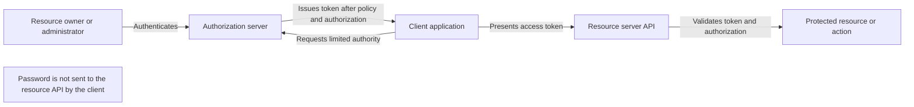
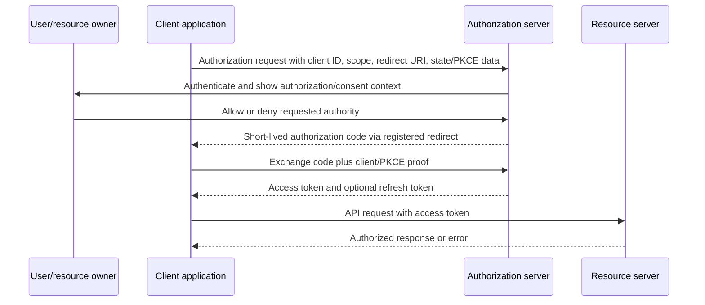
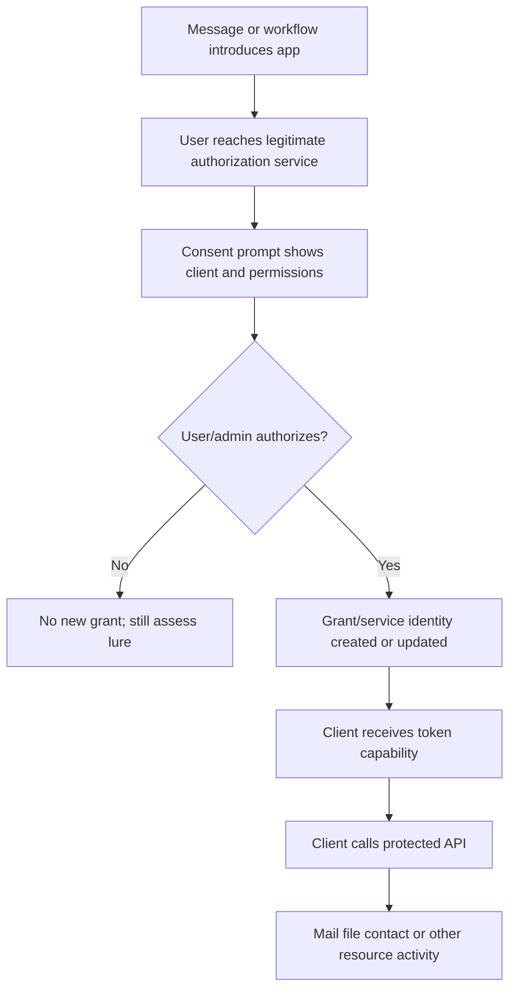
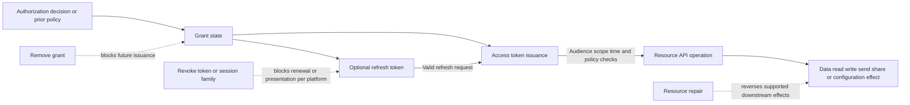
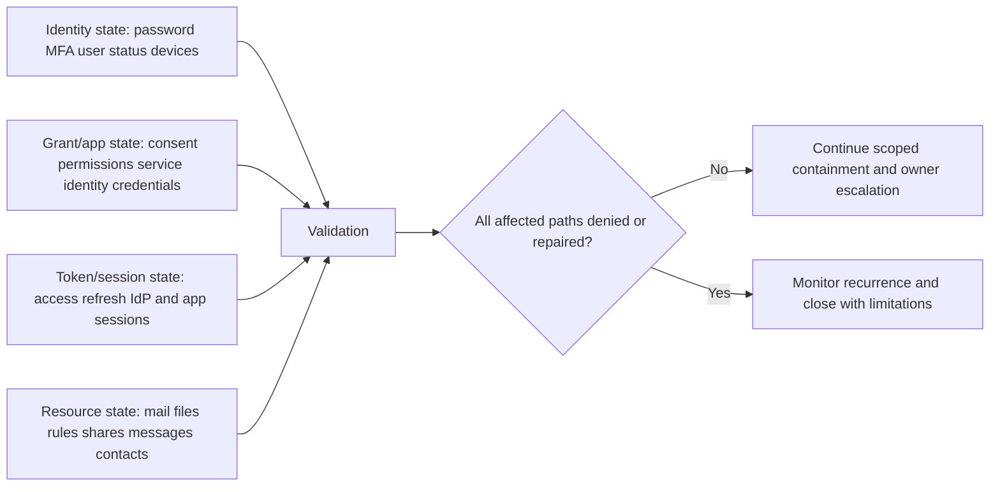
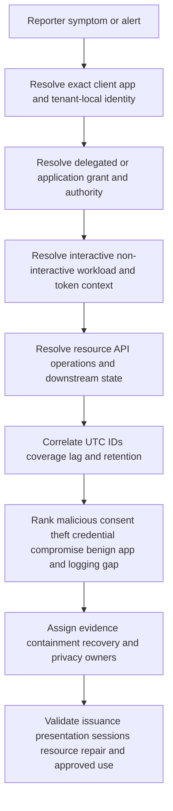
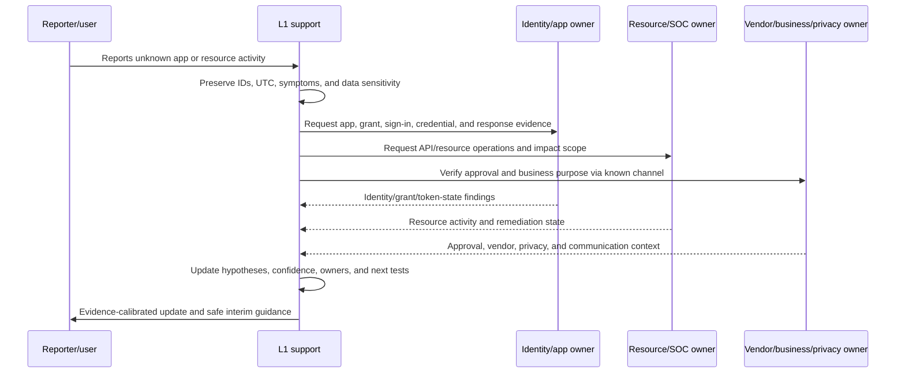

# Part 041 - OAuth Consent Attacks and Token Abuse

OAuth incidents are easy to mishandle because they look like password incidents while operating through a different authorization path. A person may keep the same password, complete multifactor authentication correctly, and still give an application permission to read mail, inspect files, or act through an application programming interface. An attacker may also steal an already-issued token and use it without replaying the user's password or current multifactor authentication challenge.

The beginner-friendly rule for this Part is:

> **A password proves or helps prove identity; an OAuth grant delegates authority; a token carries that authority to a resource. Investigate and recover each state separately.**

This Part explains malicious application consent, stolen token use, scopes, refresh tokens, persistence, audit evidence, response ownership, and validation. It is defensive. It does not teach how to register a malicious application, construct a consent lure, steal a token, call a victim's data, evade monitoring, or test a live tenant. The lab uses only offline synthetic records and inert placeholders.

No single fact proves an OAuth attack. An unfamiliar application can be legitimate. A verified publisher is not a guarantee of current behavior. A high-privilege scope does not prove use. An application programming interface event does not prove which human initiated it. A password reset does not prove that grants, tokens, application credentials, browser sessions, or downstream effects were removed. The investigation must correlate identity, application, grant, token, resource, event time, business approval, user action, observed API activity, and response validation.

## Section goal

After completing this Part, you should be able to:

- Explain OAuth 2.0 from zero knowledge and distinguish **authentication** from **authorization**.
- Define resource owner, client, authorization server, resource server, application object, service principal, grant, consent, scope, delegated permission, application permission, access token, refresh token, bearer token, sender-constrained token, session, and revocation.
- Draw the authorization-code flow without treating every redirect or token as malicious.
- Distinguish malicious consent from stolen-token replay, compromised application credentials, legitimate application activity, and ordinary user sign-in compromise.
- Explain why a password reset, multifactor reset, session revocation, grant removal, application disablement, and downstream repair are related but different actions.
- Build an evidence timeline across application creation, service-principal creation, consent/grant events, sign-ins, token-backed resource access, permission changes, and response actions.
- Scope affected users, applications, tenants, grants, permissions, resources, operations, time windows, and downstream effects without exposing token values.
- Recommend proportionate containment to authorized identity, application, security, resource, legal/privacy, and business owners.
- Validate recovery by testing the exact access path that was removed and by checking for alternate grants, credentials, apps, sessions, and persisted resource changes.
- Explain current security guidance such as least privilege, exact redirect URI matching, Proof Key for Code Exchange, refresh-token rotation, audience restriction, and sender-constrained tokens at an appropriate support depth.

## JD Mapping

| Role signal | Capability built here | Interview evidence |
|---|---|---|
| Investigate sophisticated cloud threats | Separates credential, grant, token, application, and resource mechanisms | Four-state incident explanation |
| Troubleshoot Microsoft 365 and SaaS behavior | Correlates Entra/Workspace application and OAuth evidence conceptually | Vendor-neutral evidence request |
| Own L1 cases | Moves from intake to scope, owners, actions, validation, and escalation | Case workflow and customer updates |
| Work with Engineering/Product/Security | Produces exact IDs, times, permissions, resource operations, and unknowns | Escalation packet template |
| Protect customer trust | Minimizes secrets and personal data while giving precise guidance | Redaction and communication controls |
| Use transferable Microsoft support experience honestly | Reuses hypothesis testing, critical-incident cadence, and fix validation | Production-transfer method, not platform claim |

Your Microsoft enterprise support background is a strong bridge here. You already know that changing one configuration does not prove an end-to-end fix and that a critical case needs owners, timestamps, evidence, customer updates, and validation. Apply those habits to authorization state. The honest boundary is that Microsoft cloud support experience and identity fundamentals do not automatically equal production ownership of Entra incident response, Google Workspace OAuth operations, Abnormal AI, or a security operations center.

## Candidate honesty note

| Evidence label | What can be claimed | Boundary to state |
|---|---|---|
| **Production transfer** | Enterprise case ownership, ambiguity reduction, escalation, customer communication, and fix validation | Not production OAuth incident containment |
| **Local/public lab** | Offline analysis of synthetic application, grant, token-state, and API-event records | No live tenant, app, token, or resource action |
| **Learned architecture** | OAuth RFC concepts and current public Microsoft/Google control models | No claim about private product internals or tenant behavior |
| **Template only** | Containment checklist, escalation packet, and customer communication | Recommended, not executed |

Safe interview language:

> "I have not led OAuth consent-attack response in a production Entra or Google Workspace tenant. I understand the standards and public control model, and I built an offline evidence-and-recovery ledger. My transferable strength is separating state, forming competing hypotheses, coordinating owners, and validating the exact path rather than equating a password reset with complete recovery."

## First Principles: Authentication Is Not Authorization

**Authentication** answers, "Who or what is presenting?" A password, multifactor challenge, certificate, passkey, or another method can contribute to authentication.

**Authorization** answers, "What may this identity or application do?" Permissions, roles, policy, grants, and resource checks contribute to authorization.

OAuth is primarily an authorization framework. It lets a **client application** obtain limited access to an HTTP service without requiring the person to give that application their password. The application receives a token representing approved authority. OpenID Connect, often abbreviated **OIDC**, adds an identity layer used for sign-in scenarios, but OAuth access tokens should not be casually treated as proof that a particular interactive login just occurred.

| Question | Authentication example | Authorization example |
|---|---|---|
| Who is this? | User completes sign-in and MFA | Not answered by scope alone |
| What may happen? | Authentication does not grant every action | App can read selected data under granted scopes |
| What is being presented? | Session cookie, credential, or proof | Access token or application identity with permissions |
| What should support validate? | Sign-in method, session, identity state | Grant, permission, audience, resource, operation, policy |

**Analogy:** Authentication is showing an identity document at a hotel desk. Authorization is the room and facilities the hotel assigns. The analogy stops being accurate because OAuth often authorizes software acting through APIs, permissions can be delegated or application-only, and multiple policy engines can evaluate a request after token issuance.

## Core OAuth Roles and Objects

OAuth 2.0 defines four core roles. Enterprise platforms add directory objects and governance records around them.

| Term | Plain meaning | Why it matters | Memory hook |
|---|---|---|---|
| Resource owner | Entity able to grant access to protected resources; often a user | May authorize delegated access | Owner approves authority |
| Client | Application requesting and using delegated or prearranged access | The app, not necessarily the user interface | Client asks and calls |
| Authorization server | Service that authenticates, evaluates authorization, and issues tokens | Source of token and grant policy | Authorization server issues |
| Resource server | API/service hosting protected resources | Enforces token and resource authorization | Resource server serves |
| Protected resource | Data or operation guarded by the resource server | Actual impact target | Resource is the value |
| Client ID | Public identifier for an application registration | Correlates requests and records; not a password | ID names the client |
| Client credential | Secret, certificate, or other proof used by a confidential client | Compromise may enable application-only token requests | Credential proves the client |
| Redirect URI | Registered return location for authorization responses | Loose matching can leak codes or tokens | Redirect must land exactly |
| Authorization grant | Credential/record representing approved authority | Basis for token issuance | Grant is the lease |
| Scope | String describing requested/issued access range | Defines potential operations and resources | Scope says how much |
| Access token | Credential used at a resource server | Enables API operations during its validity | Access token opens now |
| Refresh token | Credential used at the authorization server to obtain new access tokens | Can extend access without another user prompt | Refresh token renews |
| Session token/cookie | Application or identity-provider session state | May outlive or differ from OAuth tokens | Session keeps a door open |

An OAuth token may be **opaque**, meaning the client cannot infer its internal structure, or **structured**, such as a signed JSON Web Token. Do not paste either kind into a public decoder or support ticket. A token is a credential even when it looks like random text. Record only approved identifiers, a cryptographic hash when policy allows, or a stable redacted reference.

## The Authorization Code Flow

The authorization code flow is a common pattern. Current OAuth security guidance favors code-based flows with modern protections rather than issuing access tokens directly through the browser-facing authorization response.

Step by step:

1. The client directs the user's browser to the authorization server.
2. The request identifies the client, desired permissions, return location, and transaction protections.
3. The authorization server authenticates the user when necessary and evaluates policy.
4. The user or an administrator grants or denies access, unless prior policy/grant covers it.
5. A short-lived, single-use authorization code returns to the client's registered redirect URI.
6. The client exchanges that code at the token endpoint. A public client uses **Proof Key for Code Exchange (PKCE)** so a stolen code alone is insufficient.
7. The authorization server issues an access token and, when appropriate, a refresh token.
8. The client presents the access token to the intended resource server.
9. The resource server validates the token, audience, time, scope/roles, and applicable policy before serving the request.

This normal flow is not itself suspicious. The incident questions are whether the client was approved, the resource owner understood the request, the permission was proportionate, the transaction was protected, tokens were stolen or replayed, and resulting resource actions were authorized.

## Consent, Grants, and Enterprise Application State

**Consent** is an authorization decision, not merely a screen click. It can create or update durable grant state. Platform terminology differs, so preserve exact vendor object names while using this neutral model:

| Neutral layer | Microsoft-oriented example | Google-oriented example | Investigation question |
|---|---|---|---|
| Application definition | Application registration/object | OAuth client/project/app | Who owns the software definition? |
| Tenant-local application identity | Service principal/enterprise application | App represented in Workspace access controls | What exists in this organization? |
| Delegated grant | OAuth2 permission grant tied to user/admin consent | User authorization for scopes | Which users/scopes authorized it? |
| Application-only grant | App role assignment/application permission | Domain-wide delegation or other admin-authorized service access | Can it act without a signed-in user? |
| Runtime token | Access/refresh token | Access/refresh token | What resource and scope could it use? |
| Resource activity | Microsoft Graph/Exchange/SharePoint operation | Gmail/Drive/Calendar API operation | What did it actually do? |

In Microsoft Entra, an **application object** is a global definition in its home tenant, while a **service principal** is the local representation/identity used in a tenant. Public documentation exposes delegated permission grants and application permission assignments as different records. In Google Workspace, administrators can review app name, OAuth client ID, users, requested services, and scopes, then classify app access as Trusted, Limited, Specific Google data, or Blocked. These are platform mappings, not claims that every edition, log, or workflow is identical.

## Delegated Permissions Versus Application Permissions

This distinction controls scope and response.

| Dimension | Delegated permission | Application permission/application-only access |
|---|---|---|
| Human context | App acts on behalf of a signed-in user | App acts as its own workload identity |
| Effective authority | Usually intersection of user authority, granted permission, and policy | Granted application authority, resource policy, and workload identity controls |
| Grant source | User consent or administrator consent | Administrator authorization/assignment is typically required |
| Sign-in evidence | Interactive and non-interactive user activity may matter | Service-principal/workload sign-ins may matter |
| Primary object | User-associated delegated grant | Application role/permission assignment and app credential |
| Common containment | Remove affected delegated grants, revoke relevant sessions/tokens, restrict app | Remove application permissions, disable app/service principal, rotate credentials |
| Key risk | User grants a malicious app access to their data | Workload gains broad unattended access |

Do not say "the app has everything the user has" without checking exact semantics. A delegated token has scopes, an audience, a subject, policy conditions, and resource-side checks. Likewise, an application permission name indicates potential authority, not proof that the app used every operation.

## 🔍 Plain-English deep-dive: A Grant Is a Lease, Not a Copy of the Password

Imagine a building owner gives a maintenance company a lease allowing entry to specific utility rooms. The company does not receive the owner's house key or memorize the owner's password. It receives separate authority that building security recognizes.

In OAuth:

- the resource owner or administrator authorizes a client;
- the authorization server records or recognizes that grant;
- the client obtains access tokens representing allowed authority;
- a refresh token may let the client request replacement access tokens;
- the resource server accepts or rejects access-token-backed operations.

Changing the owner's personal key does not automatically terminate every lease. Some platforms link password changes to some token invalidation, but the OAuth standard does not make "password reset removes every grant and token everywhere" a universal rule. Existing access tokens, refresh tokens, application-issued sessions, application-only grants, client credentials, or copied data can follow different lifecycles.

The lease analogy stops being accurate because tokens may be short-lived, policy can be reevaluated, revocation propagation can be delayed, self-contained tokens may remain accepted until expiry, and resource servers can impose additional checks.

**Memory hook:** Password reset changes identity proof; grant removal ends delegated authority.

## Scope: Potential Authority Is Not Observed Activity

A **scope** describes an access range recognized by an authorization server/resource. Scope names are provider-specific and case-sensitive under OAuth's general rules. Some scopes are narrow; others permit reading, writing, sending, deleting, or offline/background access.

Use three columns instead of one:

| Layer | Example neutral statement | Evidence type |
|---|---|---|
| Requested authority | Client requested mail read and offline access | Authorization request/consent record |
| Granted authority | Grant includes approved scopes for named client and subject | Directory/grant record |
| Exercised authority | Resource log shows named API operation against resource at UTC time | Resource/API audit event |

Never convert "could read mail" into "read all mail" without operation evidence. Conversely, absence of retained resource logs does not prove no use. State the visibility window and confidence.

## 🔍 Plain-English deep-dive: The Request, the Receipt, and the Camera Footage Are Different Evidence

Imagine buying supplies for an office. A shopping list says what someone wants. A store receipt says what the cashier approved and sold. Security-camera footage and inventory records show what was actually carried away or used. Those artifacts can overlap, but none can replace the others.

OAuth evidence has the same separation:

- the authorization request or prompt shows **requested authority**;
- the grant and issued-token metadata show **granted authority**;
- resource/API audit events show **exercised authority**;
- resource state and business confirmation help establish **impact and authorization**.

If an app requested ten scopes but the authorization server granted three, the request is not the effective authority. If the app received three scopes but resource logs show only one read operation, do not claim all three were used. If logs retain only seven days, do not convert an empty result into proof that no earlier use occurred. If the app could access 10,000 files, do not call all 10,000 exfiltrated without evidence; describe potential exposure and observed operations separately.

The shopping analogy stops being accurate because a scope may authorize categories of operations rather than individual objects, access tokens can be renewed, one API operation can affect many resources, and telemetry may aggregate or omit details.

**Memory hook:** Request is intent, grant is authority, API event is use, resource evidence is impact.

### Scope-risk questions

- Is each scope necessary for the stated business function?
- Is read access enough, or was write/send/delete requested?
- Does offline/background access allow activity without a new user prompt?
- Is the audience one resource API or several?
- Does the app act as a user or as itself?
- How many users, groups, organizational units, or tenant resources are covered?
- Were permissions added or elevated after initial approval?
- Are resource-specific authorization systems also involved?

## Malicious Consent: The User May Authenticate Correctly

In **consent phishing**, a user is induced to authorize a malicious or misleading application. The identity provider can be genuine. The user may enter credentials only at the legitimate authorization server and satisfy multifactor authentication. The harmful event is the authorization decision, not necessarily password theft.

Defensive indicators may include:

- newly observed or misleading application identity;
- unexpected publisher, owner, reply path, or business workflow;
- high-risk or disproportionate scopes;
- grant events shortly after a lure or unusual user action;
- first-seen client activity followed by data access;
- resource API operations inconsistent with the user's/app's baseline;
- multiple users authorizing the same app in a short window;
- service-principal or application changes by unexpected actors;
- use of an application from unexpected network, client, or geography context;
- owner/user denial through an independently known channel.

None is sufficient alone. Legitimate onboarding, migrations, backup tools, productivity add-ins, mobile clients, security tools, and vendor changes can produce similar evidence.

## Token Theft and Replay Without New Consent

Consent abuse is one path. Token abuse can occur through other mechanisms:

| Mechanism hypothesis | What happened | Predicted evidence |
|---|---|---|
| Malicious consent | Victim/admin authorized attacker-controlled client | New grant plus client/resource activity |
| Access-token theft | Existing access token copied and replayed | Resource activity without corresponding new grant; limited by token validity/controls |
| Refresh-token theft | Refresh token copied and used to mint access tokens | Non-interactive token activity; longer persistence until invalidated/expired |
| Client-credential compromise | Secret/certificate/private key for confidential client compromised | Workload/service-principal token requests and app-only activity |
| Application compromise | Legitimate vendor/client backend compromised | Correct app identity with anomalous behavior across users/tenants |
| Session-cookie theft | Browser/application session copied | Session-backed activity that may not map directly to OAuth grant changes |
| Ordinary account takeover | User credential/session compromised and attacker changes app state | Suspicious sign-in plus grant/app changes; broader user activity |
| Benign automation | Approved app performs scheduled API work | Owner approval, expected permission, stable behavior, documented change |

MITRE ATT&CK separates **Steal Application Access Token (T1528)** from **Use Alternate Authentication Material: Application Access Token (T1550.001)**. That is a useful analytical distinction: acquisition and use are different events and may leave different evidence.

## Access Tokens, Refresh Tokens, and Sessions

| State | Used at | Typical purpose | Persistence concern | Response question |
|---|---|---|---|---|
| Authorization code | Token endpoint | Short-lived exchange credential | Theft/replay before one-time exchange | Was code flow protected and bound? |
| Access token | Resource server | Perform authorized API actions | Existing token may work until expiry/revocation evaluation | Can it still access the target resource? |
| Refresh token | Authorization server/token endpoint | Mint replacement access tokens | Extends access without new interactive prompt | Was the token family/grant invalidated? |
| Identity-provider session | Authorization server/browser | Avoid repeated interactive authentication | Can silently satisfy new auth requests | Was sign-in session revoked? |
| Client application session | Application | Keep user signed in to client | Application controls its own session | Can provider/admin revoke it? |
| Grant | Authorization server/directory | Durable authorization relationship | Allows new token issuance | Was exact delegated/app grant removed? |
| Client credential | Authorization server | Authenticate confidential application | App can request tokens as itself | Was secret/certificate/key rotated or disabled? |

### Bearer tokens

A **bearer token** is generally usable by whoever possesses it, subject to validity, audience, scope, and policy. It is like cash: possession may be enough to present it. That makes token secrecy essential.

### Sender-constrained tokens

A **sender-constrained token** requires the presenter to prove possession of additional key material. RFC 9449 defines Demonstrating Proof of Possession, abbreviated **DPoP**, an application-layer mechanism that binds tokens to a public/private key pair and uses a signed proof with request information. DPoP reduces misuse of a stolen token alone, but it does not replace Transport Layer Security, prevent all malicious code running inside the client, or prove benign intent.

### Refresh-token rotation

RFC 9700 requires public-client refresh tokens to be sender-constrained or use refresh-token rotation. Rotation issues a new refresh token during refresh and invalidates the prior one while retaining family relationships. Reuse of an invalidated family member can indicate compromise and cause active family revocation. Platform behavior varies; ask what controls and logs actually exist.

## 🔍 Plain-English deep-dive: Access Token, Refresh Token, and Session Are Three Different Keys

Think of a conference center:

- an **access token** is today's wristband for entering selected rooms;
- a **refresh token** is a voucher at registration that can obtain a new wristband;
- a **session cookie** is a stamp recognized by one event application so it does not ask you to sign in again;
- a **grant** is the registration record saying which organization/app is entitled to which rooms.

Cutting off one wristband does not necessarily destroy the voucher, erase the registration record, or end the app's own session. Removing the grant should prevent future issuance based on that authority, but already-issued access tokens can have a remaining validity window depending on token design and enforcement. An app-issued session may require action by the app or provisioning owner.

That is why support should never write "tokens revoked" when the only verified action was "password reset requested." Use exact language:

- password changed;
- user sign-in sessions revoked;
- delegated grant removed;
- application permission removed;
- application/service principal disabled;
- refresh-token family invalidated;
- existing access-token rejection observed after propagation;
- application session terminated by app owner;
- downstream resource effects repaired and validated.

The key analogy stops being accurate because tokens can be self-contained, introspected, cached, continuously reevaluated, audience-restricted, or sender-constrained.

**Memory hook:** Access acts, refresh renews, session remembers, grant authorizes.

## Why Password Reset Alone May Be Insufficient

Password reset is important when credentials may be compromised, but it answers only part of an OAuth incident.

1. OAuth exists partly so clients do not need the resource owner's password.
2. A malicious app may have a valid grant created after the user authenticated legitimately.
3. A refresh token may mint new access tokens under that grant.
4. Existing access tokens can remain valid for a period depending on platform architecture.
5. Application permissions may belong to a workload identity rather than the user's password lifecycle.
6. A confidential app may use its own secret or certificate.
7. A resource or client application may maintain its own session.
8. The app may already have copied data, sent messages, created rules, changed sharing, or established another persistence path.

RFC 9700 says authorization servers **may** automatically revoke refresh tokens after security events such as password change or logout. "May" is not a universal guarantee. Microsoft public guidance separately discusses blocking sign-in, revoking refresh tokens/sessions, disabling devices, application-issued sessions, and expiry/continuous access evaluation. Microsoft also states that disabling a violating app denies new token and refresh requests while existing access tokens remain valid until expiration. Google documents explicit app-access controls and token revocation behavior when access is restricted. Always validate platform-specific behavior and propagation.

## The Four-State Recovery Model

Use four primary state planes plus downstream impact:

| Plane | Evidence | Candidate actions by authorized owner | Validation |
|---|---|---|---|
| Identity | User state, authentication methods, sign-ins, risk, devices | Block sign-in, reset credential/MFA, disable device, investigate endpoint | New sign-in denied; approved recovery succeeds |
| Grant/application | App IDs, service identity, publisher/owner, delegated grants, app roles, credentials | Remove grant/assignment, disable app, rotate credential, restrict consent | New token issuance through removed authority fails |
| Token/session | Access/refresh lifecycle, non-interactive sign-ins, app sessions | Revoke relevant sessions/token families; wait/force policy reevaluation where supported | Existing token/session path is rejected after documented window |
| Resource | API events, mailbox/file/share/rule/config changes | Remove messages/rules/shares, recover data, notify owners, preserve evidence | Harmful changes reversed; expected access retained |
| Prevention | Consent policy, app governance, least privilege, alerts | Restrict high-risk permissions, review apps, improve monitoring/training | Test approved and denied scenarios without production disruption |

No L1 support engineer should improvise destructive tenant-wide revocation. Recommend and coordinate through named authorized owners, preserve evidence before irreversible deletion where policy requires it, and validate blast radius.

## Audit Evidence: Build a Correlated Story

An OAuth case requires more than a sign-in screenshot. Collect evidence around the client, grant, token use, and resource.

| Evidence family | Fields to request | Question answered |
|---|---|---|
| Case intake | Reporter, UTC times, app name/ID, user, observed impact | What triggered investigation? |
| Application definition | Client/application ID, object IDs, display name, owner, publisher, redirect URIs, creation/change times | Which software identity is involved? |
| Tenant-local identity | Service-principal/workload ID, status, owners, credentials, assignments | What exists locally and can it authenticate? |
| Grant/consent | Grant ID, actor, user/admin context, scopes/roles, creation/update time | What authority was approved by whom? |
| Sign-ins/token requests | Interactive/non-interactive/workload category, app, resource, IP/network, device, result, correlation ID | How were tokens/sessions obtained or used? |
| OAuth/API events | Client ID, user/subject, scope, API name/method, resource, event time, result/bytes when available | What authority was exercised? |
| Resource audit | Mail/file/share/rule/message/search/export actions | What changed or left the system? |
| Response | Actor, action, target object, UTC, result, change/request ID | What state was contained? |
| Validation | Negative and positive tests, propagation window, residual activity | Did the intended path close without breaking approved use? |

### Microsoft public evidence model

Microsoft Entra public documentation describes:

- audit logs for application/service-principal creation and changes, actors, target resources, old/new values, time, status, and correlation IDs;
- interactive user, non-interactive user, service-principal, and managed-identity sign-in categories;
- delegated permission grants and application permission/app-role assignments as different records;
- application permissions and user/admin consent review;
- separate emergency actions for account status, refresh-token/session revocation, and devices.

### Google Workspace public evidence model

Google Workspace public documentation describes:

- app name, OAuth client ID, ownership, verification state, users, requested services, and scopes in app access control;
- OAuth log events for Grant, revoke, and API-call activity where supported;
- fields such as application ID/name, user, scope, product, API name/method, IP, date, event, client type, and response bytes;
- visibility delays and edition/privilege differences;
- Trusted, Limited, Specific Google data, Blocked, service restrictions, and high-risk scope controls.

Do not promise a field without checking edition, retention, licensing, export, and privilege. Record `not available`, `not retained`, or `not requested` rather than inventing an empty value.

## Evidence Semantics and Common Traps

| Observation | Safe interpretation | Unsafe leap |
|---|---|---|
| Grant event exists | Authority was recorded for client/user/scope at time | Every permission was used |
| App is verified | Publisher/domain verification criteria were met | App is harmless forever |
| User denies recognizing app | Strong contextual contradiction | User denial alone proves attacker ownership |
| API call attributed to app | Token/client path invoked operation | Named human personally clicked it |
| No interactive sign-in near event | Could be refresh/app-only/session activity | Logs are wrong or event is impossible |
| Password reset completed | Password state changed | All grants/tokens/sessions/data are remediated |
| App disabled | Future app activity should be constrained per platform behavior | Existing access tokens/data effects vanished instantly |
| Scope includes read/write | Potential authority exists | All tenant data was read and altered |
| No events found | No events in searched source/window/query | No activity occurred anywhere |

### Time discipline

Record:

- event time as displayed and normalized UTC;
- source time zone and daylight-saving assumptions;
- ingestion/visibility delay;
- query execution time;
- retention start/end;
- policy/action time;
- expected propagation/expiry window;
- first negative validation and monitoring end time.

## Privacy and Secret Handling

Tokens, authorization codes, client secrets, private keys, cookies, and proof values are credentials. Do not collect them unless an approved incident procedure explicitly requires it. Most support cases need metadata, not secret values.

| Data | Default handling |
|---|---|
| Access/refresh token | Do not paste, decode publicly, email, or ticket; use approved redacted ID/hash if authorized |
| Client secret/private key | Never request in ordinary support intake; rotate through owner if compromised |
| Authorization header/cookie | Remove entirely from HAR, logs, screenshots, and examples |
| User identifiers | Minimize/redact based on case need and policy |
| Mail/file content | Collect only necessary evidence through approved restricted storage |
| IP/device/location | Treat as personal/security data; preserve only needed context |
| App/client/object IDs | Usually useful correlation metadata; still follow tenant-data policy |
| Scopes/roles | Preserve exact names because they drive authority analysis |

An encoded token is not anonymized. A decoded token payload may contain tenant, subject, audience, time, and other sensitive claims, while the original token remains a reusable credential. Prefer provider logs or authorized token metadata rather than ad hoc decoding.

## Hypothesis-Driven Investigation

Start with competing explanations, not a favorite verdict.

| Hypothesis | Predicted evidence | Contradiction | Safe next test/owner |
|---|---|---|---|
| Malicious user consent | User grant near lure; unfamiliar client; resource access | Approved app and expected user workflow | User + app owner + grant/audit logs |
| Illicit admin consent | Admin actor creates tenant-wide grant unexpectedly | Approved change record and owner confirmation | Identity governance/change owner |
| Stolen access token | Resource activity without new grant; short window/context anomaly | Activity tied to expected client/device and owner confirmation | Resource/identity logs; token metadata owner |
| Stolen refresh token | Repeated non-interactive token-backed access over time | Revocation stops it and legitimate client explains pattern | Identity provider/SOC |
| Client credential compromise | Service-principal sign-ins and app-only operations | Credential rotation/change and expected automation | App owner/identity/SOC |
| Legitimate new integration | Approved business owner, least privilege, expected change | No owner, misleading app, anomalous resource use | Procurement/app owner/change record |
| Vendor application compromise | Correct known app across multiple users with changed behavior | Vendor validates healthy operation and evidence points local | Vendor/security/CSM/legal |
| Ordinary user account takeover | Suspicious user sign-in plus app/grant changes | No user compromise evidence; only app workload | Identity incident owner |
| Logging/query gap | Missing source, retention, edition, lag, wrong ID/time | Independent source confirms complete visibility | Logging/platform owner |

## Investigation Workflow

### Step 1: Stabilize without overclaiming

- Ask the reporter not to reauthorize or interact with the suspicious app.
- Do not ask for token values, secrets, cookies, or full sensitive content.
- Capture exact app name and IDs if safely visible, user, UTC time, prompt/symptom, resource, and observed action.
- Determine whether there is active data, mail, finance, legal, or safety impact requiring urgent owner escalation.
- State that app unfamiliarity is under investigation, not confirmed maliciousness.

### Step 2: Identify exact objects

Friendly names are not unique. Correlate:

- tenant/customer ID as permitted;
- application/client ID;
- tenant-local service identity/object ID;
- grant/assignment ID;
- user/subject ID;
- resource/audience;
- credential key ID (never private material);
- correlation/request/event IDs;
- exact UTC window.

### Step 3: Separate grant types and authority

Determine whether the activity is delegated, application-only, domain-wide/admin-authorized, resource-specific, or another authorization system. List requested, granted, and observed authority separately.

### Step 4: Reconstruct the timeline

Include app/service identity creation, owner/credential changes, grant events, sign-ins/token requests, API operations, user report, containment actions, validation, and residual monitoring.

### Step 5: Scope resource impact

Search by exact client/app ID, user/subject, resource, operation, time, and related users. Scope mail, files, shares, contacts, rules, messages, exports, or configuration changes under authorized queries. State retention and blind spots.

### Step 6: Choose mechanism-aligned containment

Map each action to the state it changes. Avoid a generic "reset everything" instruction without ownership, blast radius, or validation.

### Step 7: Validate negative and positive outcomes

Negative validation proves the unauthorized path is denied. Positive validation proves approved apps/users still work. Record time, actor, object, result, error/reference, and expected propagation.

## Troubleshooting Decision Tree

```mermaid
flowchart TD
    Start[Unknown app consent or token-backed activity] --> IDs{Exact app client user resource IDs available?}
    IDs -->|No| Gather[Gather IDs UTC source retention and symptom]
    IDs -->|Yes| Grant{Grant or app permission exists?}
    Gather --> Grant
    Grant -->|Yes| Approved{Owner/change record approves app and scopes?}
    Grant -->|No| Use{Resource/API activity exists in visible window?}
    Approved -->|Yes| Behavior{Activity matches approved purpose and baseline?}
    Approved -->|No| Contain[Escalate for scoped grant/app/token containment]
    Behavior -->|Yes| Benign[Document legitimate integration or tuning need]
    Behavior -->|No| Compromise[Investigate app/user/vendor/credential compromise]
    Use -->|Yes| Theft[Investigate stolen token session or app-only path]
    Use -->|No| Gap{Coverage complete after lag and retention checks?}
    Gap -->|No| More[Request alternate identity resource and vendor evidence]
    Gap -->|Yes| Attempt[No observed use; assess attempted/authorized state]
    Contain --> Validate[Validate issuance access sessions and resource repair]
    Compromise --> Validate
    Theft --> Validate
```

## Containment and Recovery Matrix

The exact steps are platform- and authority-dependent. The L1 role is to recommend, coordinate, document, and validate within permissions, not to run unapproved destructive operations.

| Finding | Candidate action owner | Why | Validation |
|---|---|---|---|
| Malicious delegated grant | Identity/app admin removes exact grant and restricts re-consent | Stops future token issuance under grant | New issuance fails; grant absent; existing token window handled |
| Malicious app/service identity | Authorized app admin disables/removes according to evidence policy | Stops client authentication/new use | App status and failed token requests observed |
| Application permission | Admin removes exact assignment/permission | Ends workload authority | App-only request denied after propagation |
| Compromised client credential | App owner rotates/removes secret/certificate/key | Stops attacker authenticating as client | Old credential fails; new approved automation works |
| Suspected refresh token | Identity owner revokes relevant sessions/token family | Stops renewal path | Refresh/non-interactive path denied |
| Existing access token | Platform/SOC applies supported revocation/CAE/expiry controls | Closes current resource access | Resource rejects token after documented window |
| Compromised user | Identity incident procedure resets password/MFA, blocks/recover account/devices | Addresses identity takeover | Unauthorized sign-ins stop; approved recovery verified |
| App-issued session | App/SaaS owner revokes/deprovisions local session/account | IdP cannot always revoke app cookie | Local session denied |
| Resource changes/data access | Resource owner reverses rules/shares/messages/config and assesses disclosure | Token containment does not undo impact | Resource state and notifications verified |
| Campaign | SOC scopes other users/grants/apps/messages | One reporter may be one seed | Full scoped population addressed |

### Action-state ledger

| State | Meaning |
|---|---|
| Proposed | Candidate response under review |
| Approved | Authorized owner accepted action |
| Started | Execution began |
| Completed | Tool/API returned completion |
| Propagating | Distributed systems may not enforce everywhere yet |
| Validated | Exact unauthorized path tested and denied |
| Monitored | No recurrence during defined window |
| Rolled back | Action reversed due to error/business impact |

"Completed" is not "validated." A successful admin response proves the control plane accepted a request, not that every cached access token, application session, or resource path is already closed.

## 🔍 Plain-English deep-dive: Revocation Is a Distributed-State Problem

Imagine canceling a company badge used across several buildings. Headquarters updates the badge database immediately. One building checks the database at every door, another caches badge status for five minutes, and a third issued its own temporary visitor pass earlier. The cancellation request succeeded, but enforcement converges at different times.

OAuth deployments can have similar layers:

- an authorization server maintains grants and refresh-token state;
- access tokens can be self-contained and accepted until expiry;
- resource servers may introspect tokens or cache introspection results;
- continuous evaluation can shorten some windows;
- a client application may maintain its own session;
- resource changes already made are not undone by token invalidation.

RFC 7009 notes that revocation should be immediate at the authorization server but propagation delays can exist. It also explains that self-contained access-token architectures may rely on short lifetimes or additional backend interaction for immediate invalidation. RFC 7662 warns that cached introspection responses trade performance for liveness: a revoked token might be accepted while a resource relies on stale cached state.

Therefore, a recovery plan needs an expected enforcement window and a direct validation at the protected resource, not just a screenshot of the revoke button.

The badge analogy stops being accurate because digital credentials can be copied perfectly, authorization can be recomputed, and different resource servers may implement different token types and policies.

**Memory hook:** Revoke centrally, validate at the resource, repair downstream.

## Prevention and Hardening

Prevention is defense in depth, not user training alone.

| Control family | Purpose | Limit/validation |
|---|---|---|
| Consent governance | Restrict which users/apps/scopes can be approved | Test legitimate low-risk onboarding and admin workflow |
| Publisher/application verification | Add provenance signals | Verification is not behavior assurance |
| Least privilege | Minimize scope, resource, subject, and lifetime | Review actual operations and remove unused authority |
| App inventory/review | Find new, changed, unused, or overprivileged clients | Include owners, credentials, users, grants, and usage |
| Exact redirect matching | Prevent code/token delivery to unintended endpoint | Compare registered/runtime URI under current BCP |
| PKCE | Bind authorization code to client transaction/instance | Require support and prevent downgrade |
| Refresh-token rotation/sender constraint | Detect or reduce refresh-token replay | Validate family handling and client compatibility |
| Audience restriction | Limit token to intended resource server | Resource must enforce audience |
| Sender-constrained tokens/DPoP/mTLS | Require proof beyond token possession | Does not cure compromised client context or poor authorization |
| Token/session controls | Short lifetime, continuous evaluation, revocation | Measure actual enforcement window |
| Behavioral monitoring | Detect unusual grants, apps, token use, or resource operations | Baseline and false-positive review required |
| Resource auditing | See what the app did | Retention, edition, and content/privacy gaps remain |
| User/admin education | Improve prompt and app-risk decisions | Must be paired with technical controls |

### Current OAuth security guidance at support depth

RFC 9700, Best Current Practice 240, includes these important ideas:

- authorization servers must support PKCE; public clients must use it for authorization code protection;
- clients should not use the implicit grant except under tightly mitigated conditions;
- the resource owner password credentials grant must not be used;
- redirect URIs require exact string matching except defined native localhost port behavior;
- access tokens should be sender-constrained and audience-restricted where appropriate;
- access privileges should be restricted to minimum resources/actions;
- public-client refresh tokens must be sender-constrained or use rotation;
- clients/servers must not expose open redirectors;
- token and authorization endpoints require current secure transport practices.

These are architecture and implementation controls. An L1 threat case still begins with observed product/platform evidence, not an assumption that every customer deployment supports every mechanism.

## Worked Example 1: Suspicious User Consent

### Inputs

- User reports approving `Document Workflow Helper` at 09:14 UTC.
- Synthetic client ID: `client-041-A` (not a real identifier).
- Grant record at 09:14:22 UTC shows delegated mail-read and offline/background scopes.
- Non-interactive client activity begins at 09:16 UTC.
- Mail API search/read events appear for the user.
- Business application owner says the app is not approved.
- No credential-phishing evidence is available.

### Reasoning

1. The grant and activity share exact client/user IDs and close timing.
2. The granted authority is sufficient for the observed operations.
3. Business denial contradicts legitimate onboarding.
4. Correct authentication does not clear the app; it is compatible with malicious consent.
5. Absence of credential theft means password compromise is unproven, not impossible.

### Scoped conclusion

> **[Conclusion, high confidence]** The synthetic evidence supports unauthorized delegated application consent for `client-041-A`, followed by mail API activity within the reviewed user and time window. The evidence does not establish password theft or tenant-wide impact. Affected-user and campaign scope remains in progress.

### Candidate response plan

- Preserve grant, application, sign-in/token, and mail-operation evidence.
- Identity/app owner removes the exact delegated grant and prevents re-consent under policy.
- Authorized owner revokes relevant sessions/refresh paths and handles existing-token enforcement window.
- SOC scopes same client ID, permissions, lure, and related users.
- Resource owner assesses accessed messages and downstream disclosure.
- User account compromise checks run independently; password/MFA action depends on evidence/policy.
- Validate new token issuance fails, current API path is rejected, grant is absent, and no alternate app/grant remains.

### Caveat

Mail API logs may not prove every message viewed, and retention/edition may limit completeness. State exact searched operations and window.

## Worked Example 2: Password Reset but Activity Continues

### Inputs

- Password reset completed at 12:00 UTC.
- Existing app activity continues until 12:38 UTC.
- Delegated grant remains present.
- Refresh/session revocation was not performed.
- Access token lifetime and continuous evaluation support are not yet confirmed.

### Competing explanations

| Hypothesis | Prediction | Test |
|---|---|---|
| Existing access token still valid | Activity stops near expiry or supported enforcement | Ask token/platform owner for lifetime and resource validation |
| Refresh token minted new access token | Non-interactive token activity continues after access-token cycle | Review token/sign-in evidence and revoke relevant family |
| App-issued session | Resource app session continues independently | App owner checks local session |
| Application permission/credential | Workload activity does not depend on user password | Inspect grant type and service-principal evidence |
| Log delay | Events occurred earlier but appeared later | Compare event time, ingestion time, and request IDs |

The correct response is not "reset failed." The password change may have worked exactly as designed while a separate authorization path remained. Track state precisely.

## Worked Example 3: Legitimate Backup Application

### Inputs

- New app requests broad read permissions and offline access.
- Procurement and data owners provide an approved change record.
- Client ID, publisher, redirect URIs, and permission set match approved documentation.
- Activity occurs on a scheduled baseline from expected workload context.
- No unapproved operations or users are found.

### Conclusion

> **[Conclusion, moderate-to-high confidence]** Evidence supports a legitimate approved backup integration in the reviewed scope. Broad authority creates residual risk but does not by itself indicate malicious consent. Recommend owner-led least-privilege review, credential governance, and monitoring rather than incident containment.

This false-positive example matters: blanket blocking of every new app, offline scope, or non-interactive access can disrupt backups, security tooling, migration, workflow automation, and support systems.

## Common Failure Modes

| Failure | Why it fails | Better behavior |
|---|---|---|
| "MFA was used, so it is safe" | User can authorize malicious app after valid MFA | Evaluate client, grant, permission, and resource behavior |
| "Reset password and close" | Grant/token/app/session/resource states differ | Use four-state recovery ledger |
| "Scope means data was stolen" | Scope is potential authority | Correlate resource operations and state coverage limits |
| "No interactive sign-in, impossible" | Refresh/app-only/non-interactive paths exist | Search correct sign-in and API categories |
| Trust display name | Names are nonunique and can change | Use exact client/application/object IDs |
| Trust verified publisher as verdict | Verification is one provenance control | Assess owner, permission, behavior, and context |
| Revoke first, preserve later | Irreversible changes may erase useful context or cause outage | Preserve approved minimum evidence, then contain by severity |
| Delete app without scoping | Other users/grants/credentials/resources may remain; legitimate dependencies may break | Scope and coordinate owner-specific response |
| Paste token into decoder/ticket | Exposes reusable credential and sensitive claims | Use approved metadata/logs/redaction |
| Query only identity logs | Resource impact may be invisible | Correlate resource/API audit |
| Query only resource logs | Grant/acquisition mechanism may be invisible | Correlate app, grant, and sign-in evidence |
| Ignore propagation | Control-plane success may not equal immediate denial | Define window and validate resource path |
| Say "all access revoked" | Usually too broad for available evidence | Name exact objects, paths, and residual unknowns |

## Escalation Triggers and L1 Boundaries

Escalate urgently when:

- active sensitive-data access, mail sending, rule creation, forwarding, deletion, export, or privilege change is observed;
- tenant-wide/admin consent or application-only high privilege is involved;
- a client credential, certificate, private key, or signing material may be compromised;
- multiple users/tenants or a trusted vendor application are affected;
- a privileged administrator or security application is involved;
- token-backed activity continues after expected containment/expiry;
- legal, privacy, regulatory, finance, executive, or customer-notification decisions are required;
- evidence suggests endpoint malware, session theft, adversary-in-the-middle, or broader account takeover;
- destructive action could disrupt a critical integration;
- telemetry is contradictory, incomplete, or outside retention.

L1 should not:

- request or handle live tokens/secrets outside approved procedures;
- decode customer credentials in public tools;
- register or consent to test applications in a customer tenant;
- replay tokens, invoke suspicious APIs, or reproduce unauthorized access;
- disable/delete tenant-wide applications or grants without authorization;
- promise complete revocation without resource-level validation;
- accuse a publisher/vendor/employee without evidence;
- make breach, legal, or notification determinations.

## Support Case and Escalation Packet

| Section | Required content |
|---|---|
| Problem statement | Mechanism-neutral symptom, resource, user/app, time, business impact |
| Exact identifiers | Tenant, client/app, service identity, grant, subject, resource, correlation IDs as permitted |
| Timeline | UTC app/grant/sign-in/API/report/action/validation events |
| Authority map | Requested, granted, and exercised permissions; delegated vs app-only |
| Hypotheses | Ranked with supporting, contradicting, missing evidence |
| Scope | Users, apps, permissions, resources, operations, time, downstream effects |
| Actions | Owner, target state, approval, start/end/result, propagation |
| Validation | Negative/positive tests, monitoring window, residual paths |
| Privacy | Redactions, data classification, restricted evidence location |
| Ask | Exact decision/evidence/action needed from next team |

### Customer-safe under-investigation update

> "We are correlating the exact application/client ID, consent or permission grant, sign-in/token activity, and protected-resource operations. At this stage, application unfamiliarity and granted permissions are risk indicators, not proof of every operation or data access. Please avoid reauthorizing the app and do not send tokens, cookies, or client secrets. Identity, application, and resource owners are reviewing scoped containment and evidence preservation."

### Confirmed unauthorized-consent update

> "The reviewed evidence supports an unauthorized delegated grant for `[client ID reference]` affecting `[scoped users]`, followed by `[named resource operations]` during `[UTC window]`. Authorized owners removed the identified grant and addressed relevant token/session state. Validation of current resource denial, alternate grants/apps, downstream changes, and additional affected users is `[state]`. Password compromise is `[supported/not supported/unknown]` and is being handled as a separate hypothesis."

### Resolution update

> "The identified grant/application path is no longer authorized, relevant token/session enforcement was validated at `[resource]` at `[UTC]`, and scoped downstream changes were repaired or transferred to named owners. Approved integrations passed positive validation. Monitoring covered `[sources/window]`; residual limitations are `[retention, app sessions, copied data, or unavailable logs]`."

## Safe Synthetic Lab: The Four-State OAuth Recovery Ledger

### Objective

Build an offline incident ledger that distinguishes identity, grant/application, token/session, and resource state for synthetic OAuth scenarios. Produce a consent-attack sequence and containment checklist without creating an application, opening a consent URL, authenticating, generating/decoding/replaying a token, calling an API, or changing any account/tenant/resource.

The unique lab name is **The Four-State OAuth Recovery Ledger**.

### Prerequisites

- Local Markdown editor or spreadsheet.
- This Part and the synthetic fixtures below.
- No tenant, cloud account, developer console, identity provider, API client, browser flow, packet tool, token decoder, or internet lookup is required.
- Use only inert IDs such as `client-041-A`; no token-shaped strings.
- Record an exercise UTC start time and label the artifact **local/public lab - synthetic offline records only**.

### Authorized scope

Authorized:

- Copy the synthetic rows into a local ledger.
- Draw flows and compare timestamps.
- Create hypotheses, containment recommendations, validation criteria, communications, and escalation asks.
- Mark Microsoft/Google mappings as **learned architecture**.
- Mark response plans as **template only**.

Prohibited:

- Creating, registering, consenting to, authorizing, disabling, or deleting any application.
- Opening or constructing a consent link.
- Generating, requesting, decoding, introspecting, revoking, copying, or replaying any token/code/cookie/secret.
- Calling any identity, mail, file, directory, or SaaS API.
- Signing into or changing any account, tenant, app, permission, session, mailbox, file, rule, or policy.
- Using real customer, employer, user, vendor, application, domain, tenant, message, file, or incident data.
- Uploading the artifact to public services.

### Synthetic fixtures

All identifiers are inert labels, not valid credentials or global IDs.

| Event ID | UTC | Case | Actor/subject | Client | Event | Scope/resource | Result/context |
|---|---|---|---|---|---|---|---|
| E01 | 09:12:00 | A | user-A | client-041-A | User views app prompt | mail read + offline | Prompt fixture only |
| E02 | 09:14:22 | A | user-A | client-041-A | Delegated grant created | mail read + offline | Success |
| E03 | 09:16:03 | A | user-A | client-041-A | Non-interactive app activity | mail API | Success |
| E04 | 09:17:10 | A | user-A | client-041-A | Search/read operation | mailbox-A | 32 result items fixture |
| E05 | 09:30:00 | A | owner-A | client-041-A | Business confirmation | application approval | Not approved |
| E06 | 10:02:00 | B | user-B | client-041-B | Password reset | identity state | Success |
| E07 | 10:08:00 | B | user-B | client-041-B | API operation | files-B | Success after reset |
| E08 | 10:10:00 | B | user-B | client-041-B | Grant review | delegated grant | Still present |
| E09 | 11:00:00 | C | workload-C | client-041-C | App-only scheduled read | backup resource | Expected baseline |
| E10 | 11:05:00 | C | owner-C | client-041-C | Change/owner confirmation | approved backup | Approved |
| E11 | 12:00:00 | D | admin-D | client-041-D | Application permission assigned | directory read | No change record |
| E12 | 12:03:00 | D | workload-D | client-041-D | Service-principal activity | directory API | Success |
| E13 | 12:20:00 | D | admin-D | client-041-D | Admin account review | sign-in/session | Suspicious fixture |

Response-state fixtures for Case A:

| Action ID | State plane | Candidate action | Initial state |
|---|---|---|---|
| A01 | Evidence | Preserve app/grant/sign-in/API rows | Approved |
| A02 | Grant | Remove user-A delegated grant | Proposed |
| A03 | App | Restrict/disable client-041-A as authorized | Proposed |
| A04 | Token/session | Revoke relevant user/app refresh/session path | Proposed |
| A05 | Resource | Assess mailbox items/actions | Started |
| A06 | Campaign | Scope same client across users | Proposed |
| A07 | Prevention | Restrict re-consent under policy | Proposed |
| A08 | Validation | Test denied path and approved user mail path | Proposed |

### Steps

1. Create a document titled `The Four-State OAuth Recovery Ledger` and add the evidence label and UTC start time.
2. Copy the fixtures exactly. Do not replace placeholders with real identifiers or token-like values.
3. Define every role/object in your own words: resource owner, client, authorization server, resource server, grant, scope, access token, refresh token, session, and protected resource.
4. For each case, build four columns for identity, grant/application, token/session, and resource state. Use `unknown` where the fixture does not provide evidence.
5. Separate requested authority, granted authority, and exercised authority. Never infer exercised operations from a scope alone.
6. Create at least six hypotheses across the cases, including malicious consent, access/refresh-token use, client-credential or admin compromise, legitimate app, and logging gap.
7. For each hypothesis, list predicted evidence, contradiction, owner, lowest-risk test, and the exact finding that would change your confidence.
8. Build a UTC timeline for each case and a combined campaign view keyed by exact client and subject IDs.
9. Classify Case A, B, C, and D with confidence and limitations. Do not label any fixture as a real attack.
10. Expand Action A01-A08 with owner, approval requirement, target object, expected result, rollback, and validation.
11. Demonstrate why Case B is not evidence that the password reset failed; list at least four alternate states that could explain continued activity.
12. For Case C, write a false-positive analysis and least-privilege review instead of containment.
13. For Case D, distinguish admin account compromise from application-only authority and name the identity/application/resource owners needed.
14. Add negative validation for unauthorized paths and positive validation for approved paths.
15. Write under-investigation, confirmed synthetic finding, and scoped-resolution communications without claiming actions were executed.
16. Complete privacy and safety attestations: no credentials, no live systems, no API calls, no public upload, and no real data.

### Expected evidence

- Exact role/object glossary.
- Four-plane state table for Cases A-D.
- Requested/granted/exercised authority matrix.
- At least six competing hypotheses with discriminating tests.
- Correlated UTC timelines and exact synthetic IDs.
- Action ledger with owner, approval, target state, rollback, and validation.
- Explanation of why password reset is not complete OAuth recovery.
- Negative and positive validation plan.
- False-positive treatment for approved backup app.
- Three customer-safe communications.
- Explicit offline/no-credential/no-action attestation.

### Cleanup and privacy

- Search the artifact for `Bearer`, `Authorization:`, `access_token`, `refresh_token`, long encoded strings, cookies, secrets, private keys, and real email/domain/tenant data. Remove any accidental values.
- Confirm all app/user/resource identifiers use the `041` synthetic naming convention.
- Confirm no browser, tenant, identity provider, API, mail, file, or network history was generated.
- Delete the artifact if real data was accidentally introduced and cannot be reliably redacted.
- Store only the synthetic local artifact if useful for interview practice.
- Record cleanup time and final zero-activity attestation.

### Artifacts

| Artifact | Skill demonstrated | Honest label |
|---|---|---|
| Four-state recovery ledger | State-aware OAuth investigation | **Local/public lab** |
| Consent-attack sequence | OAuth architecture explanation | **Local/public lab** |
| Containment and validation checklist | Owner/action discipline | **Template only** |
| Microsoft/Google evidence mapping | Public documentation synthesis | **Learned architecture** |
| Case communications | Enterprise support transfer | **Production transfer** method with **template only** scenario |

## Validation rubric

| Dimension | Fail | Developing | Pass |
|---|---|---|---|
| Fundamentals | OAuth equals login | Names roles but mixes states | Separates authentication, authorization, roles, grants, tokens, sessions, resources |
| Authority | Scope equals access | Lists scope only | Separates requested, granted, and exercised authority |
| Mechanism | Every case is consent phishing | Notices token theft | Maintains consent, token, credential, session, app, and benign hypotheses |
| Evidence | Uses app display name/screenshots | Adds client ID | Correlates exact IDs, UTC, actors, grants, sign-ins, APIs, resources, coverage |
| Recovery | Password reset | Reset plus revoke | Maps actions to identity, grant/app, token/session, and resource state |
| Validation | Admin action succeeded | Waits for expiry | Tests unauthorized denial, approved success, alternates, and monitoring |
| Privacy | Pastes token | Redacts some fields | Avoids credentials and minimizes protected data by design |
| Honesty | Claims production incident | Calls lab hands-on production | Labels production transfer, lab, learned architecture, and template boundaries |

## Official Source Anchors

All sources were accessed on August 24, 2026 and must be revalidated before production use.

| Official/public source | What it anchors |
|---|---|
| [RFC 6749 - OAuth 2.0 Authorization Framework](https://www.rfc-editor.org/rfc/rfc6749) | Core roles, grants, scopes, access tokens, refresh tokens, endpoints, and flow |
| [RFC 9700 / BCP 240 - OAuth 2.0 Security Best Current Practice](https://www.rfc-editor.org/rfc/rfc9700) | Current PKCE, redirect, token replay, least privilege, refresh-token, and flow guidance |
| [RFC 7009 - OAuth 2.0 Token Revocation](https://www.rfc-editor.org/rfc/rfc7009) | Revocation endpoint semantics, related-token policy, propagation, and self-contained-token limits |
| [RFC 7662 - OAuth 2.0 Token Introspection](https://www.rfc-editor.org/rfc/rfc7662) | Active-state metadata and security/liveness implications of caching |
| [RFC 9449 - OAuth 2.0 DPoP](https://www.rfc-editor.org/rfc/rfc9449) | Application-layer sender-constrained access/refresh tokens and proof limitations |
| [Microsoft Entra - Protect against consent phishing](https://learn.microsoft.com/en-us/entra/identity/enterprise-apps/protect-against-consent-phishing) | Consent-phishing definition, disabled-app behavior, investigation, and hardening |
| [Microsoft Entra - Review permissions granted to enterprise applications](https://learn.microsoft.com/en-us/entra/identity/enterprise-apps/manage-application-permissions) | Delegated/application permission review and revocation model |
| [Microsoft Entra - Revoke user access in an emergency](https://learn.microsoft.com/en-us/entra/identity/users/users-revoke-access) | Access/refresh/session distinctions, revocation actions, and enforcement windows |
| [Microsoft Entra - Sign-in logs](https://learn.microsoft.com/en-us/entra/identity/monitoring-health/concept-sign-ins) | Interactive, non-interactive, service-principal, and managed-identity sign-in evidence |
| [Microsoft Entra - Audit logs](https://learn.microsoft.com/en-us/entra/identity/monitoring-health/concept-audit-logs) | Application/service-principal changes, actors, targets, times, status, and correlation IDs |
| [Google Workspace - Control which apps access data](https://knowledge.workspace.google.com/admin/apps/control-which-apps-access-google-workspace-data) | App inventory, client IDs, users, scopes, access states, restrictions, and visibility delays |
| [Google Workspace - OAuth log events](https://knowledge.workspace.google.com/admin/reports/oauth-log-events) | Grant/revoke/API events and searchable app, user, scope, method, product, IP, and time fields |
| [MITRE ATT&CK T1528 - Steal Application Access Token](https://attack.mitre.org/techniques/T1528/) | Defensive acquisition, mitigation, and detection context |
| [MITRE ATT&CK T1550.001 - Application Access Token](https://attack.mitre.org/techniques/T1550/001/) | Defensive token-use, API-access, mitigation, and detection context |

## Likely Interview Questions

### Q1. What is an OAuth consent attack?

**Model answer:** It is an authorization attack in which a user or administrator is induced to grant a malicious or misleading client application permissions to protected data or actions. The identity provider can be genuine and MFA can succeed; the harmful state is the grant and subsequent token-backed access. I correlate exact app/client IDs, actor, scopes, grant time, token/sign-in evidence, resource API operations, business approval, and user impact before concluding.

### Q2. Why might a password reset be insufficient?

**Model answer:** OAuth deliberately separates the user's password from application authorization. A delegated grant, refresh token, existing access token, application-only permission, client credential, identity-provider session, application session, or downstream resource change can have a different lifecycle. I map actions to identity, grant/app, token/session, and resource state, then validate the unauthorized API path is denied.

### Q3. What is the difference between an access token and a refresh token?

**Model answer:** An access token is presented to a resource server to perform authorized operations during its validity. A refresh token is presented to the authorization server to obtain new access tokens and is not normally sent to the resource server. Refresh tokens can extend persistence, so rotation, sender constraint, expiry, and revocation state matter. I never request or paste either credential into a ticket.

### Q4. What is the difference between delegated and application permissions?

**Model answer:** Delegated access is exercised by an app on behalf of a user and is constrained by the granted scopes, user authority, resource, and policy. Application-only access is exercised by a workload identity as itself, typically through administrator-granted application permissions and client credentials. Their logs, blast radius, owners, containment, and validation differ, so I identify the grant type first.

### Q5. How would you investigate a suspicious OAuth application?

**Model answer:** I preserve exact tenant, client/app, service identity, grant, user, resource, correlation IDs, and UTC times without collecting tokens. I separate requested, granted, and exercised authority; correlate audit, sign-in/token, OAuth, and resource events; verify business approval through a known channel; maintain malicious consent, token theft, credential compromise, vendor compromise, benign integration, and logging-gap hypotheses; then scope users, resources, operations, and downstream impact.

### Q6. How would you contain and validate the incident?

**Model answer:** Authorized owners preserve evidence and apply mechanism-specific actions: remove delegated grants or application assignments, disable/restrict the app, rotate compromised client credentials, revoke relevant refresh/session paths, address user identity compromise, and repair resource changes. I track propagation, prove new issuance and existing unauthorized access are denied, verify approved workflows still work, search for alternate apps/grants/credentials, and monitor a defined window.

### Q7. What controls reduce OAuth token abuse?

**Model answer:** Least privilege, consent governance, app inventory and owner review, exact redirect matching, authorization code with PKCE, audience restriction, short-lived access tokens, refresh-token rotation or sender constraint, DPoP or mutual TLS where supported, secure client credentials, continuous evaluation, and identity/resource audit correlation. No one control proves safety; I validate deployment support and false-positive impact.

### Q8. What are your L1 boundaries in an OAuth case?

**Model answer:** I can intake, preserve redacted metadata, correlate evidence, build hypotheses and scope, communicate, recommend owned actions, and validate results. I do not request or replay tokens, create consent flows, test a customer tenant, disable apps or grants without authorization, expose secrets, or make legal/breach conclusions. I escalate active data access, admin/app-only privilege, credential compromise, multiple users/tenants, vendor impact, and failed containment quickly.

## 30-Second Memory Hooks

- **OAuth delegates authority; it does not hand the app the user's password.**
- **Authentication asks who; authorization asks what.**
- **Grant is the lease; token is the usable credential.**
- **Access acts, refresh renews, session remembers.**
- **Requested is not granted; granted is not exercised.**
- **Delegated means app plus user; application-only means workload identity.**
- **Password reset is one plane, not complete recovery.**
- **Revoke centrally, validate at the resource, repair downstream.**
- **App names are friendly labels; client/object IDs correlate evidence.**
- **Never paste a token, secret, cookie, code, or private key into a ticket.**

## Completion Checklist

- [ ] I can explain OAuth's four roles from zero knowledge.
- [ ] I distinguish authentication, authorization, consent, grant, scope, and token.
- [ ] I can draw the authorization-code flow and explain PKCE at a support level.
- [ ] I distinguish access token, refresh token, identity-provider session, app session, and grant state.
- [ ] I distinguish delegated from application-only permissions.
- [ ] I separate requested, granted, and exercised authority.
- [ ] I maintain malicious consent, stolen token, client credential, user compromise, vendor compromise, benign app, and logging-gap hypotheses.
- [ ] I can request exact IDs, UTC times, audit/sign-in/API/resource evidence without credentials.
- [ ] I map recovery across identity, grant/app, token/session, and resource planes.
- [ ] I validate unauthorized denial and approved positive behavior after propagation.
- [ ] I completed the offline lab or can explain its artifacts and limitations aloud.
- [ ] I can answer Q1-Q8 without reading and preserve my no-production-experience boundary.
- [ ] I reviewed official sources and recorded August 24, 2026 as the access date.

[Next: Part 042 - Supply Chain Vendor and SaaS Risk](Part-042-supply-chain-vendor-and-saas-risk.md)