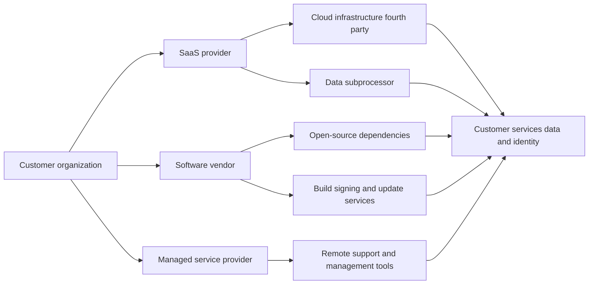
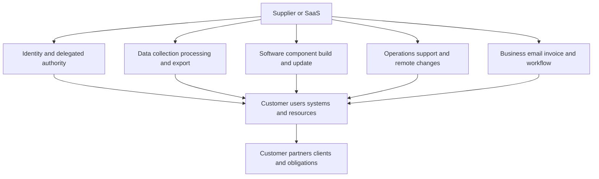
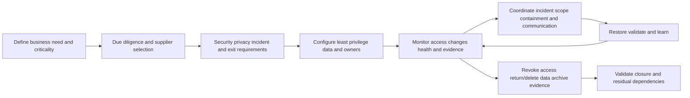
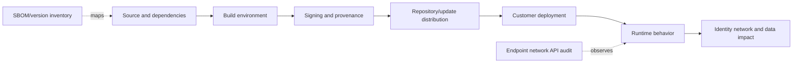
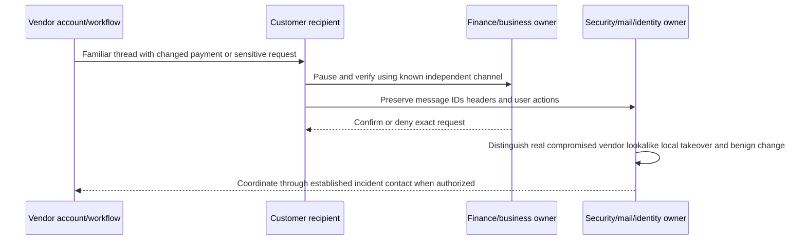
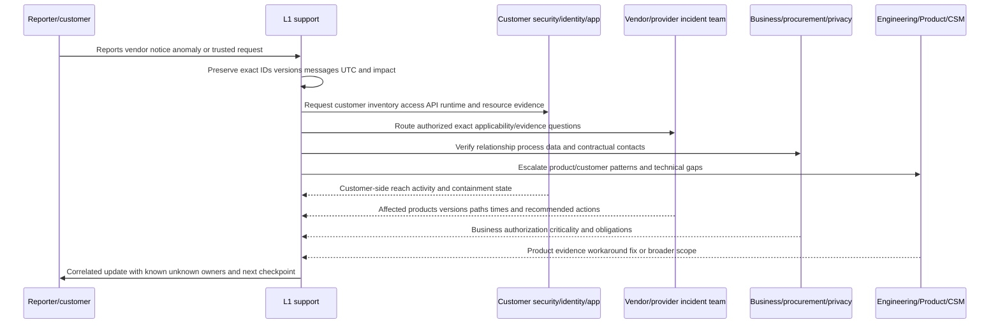
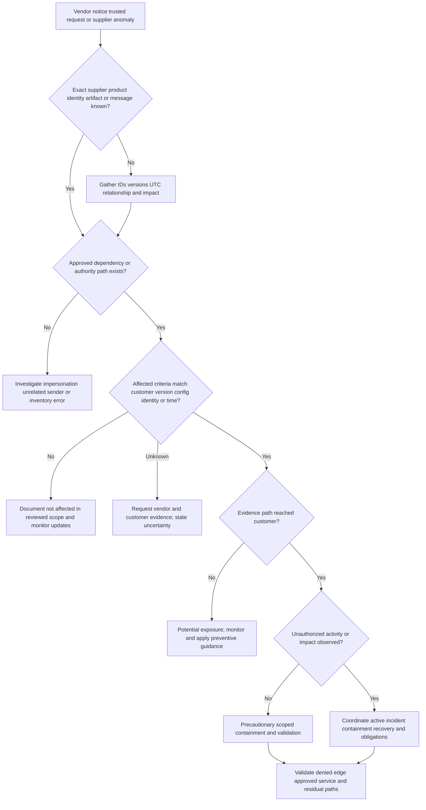
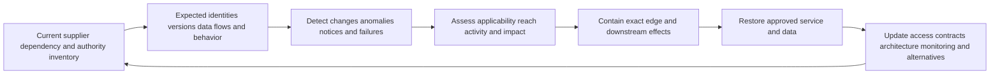

# Part 042 - Supply Chain Vendor and SaaS Risk

Organizations rarely operate alone. They depend on cloud providers, software vendors, managed service providers, contractors, payment processors, identity platforms, support partners, open-source components, data subprocessors, and many other outside parties. Those relationships create business value, but each can also become a path through which an incident reaches the organization.

The beginner-friendly rule for this Part is:

> **A vendor name is relationship context, not a security verdict. Map the exact dependency, authority, data, delivery, and communication paths before deciding what is affected or what to contain.**

This Part covers trusted-relationship abuse, compromised vendors, third-party applications, delegated access, software/update compromise, vendor email compromise, concentration risk, fourth parties, blast radius, evidence, coordinated response, and recovery. It is defensive. The lab uses only offline synthetic records. It does not scan a supplier, inspect a live package, contact a vendor, install software, test credentials, call an API, browse a suspicious link, or change any integration.

No single signal proves supply-chain compromise. A vendor incident notification does not mean every customer is affected. A signed update is not automatically harmless. A message from the correct vendor domain can be unauthorized if the vendor account is compromised. An unfamiliar SaaS application can be legitimate. A supplier questionnaire is not live telemetry. A software bill of materials is an inventory aid, not proof of exploitability. Conversely, absence of local alerts does not prove that a supplier path was unused. The investigation must join relationship records with technical authority, data flows, event evidence, affected versions/accounts, time, business processes, and vendor confirmation.

## Section goal

After completing this Part, you should be able to:

- Define supply chain, supplier, vendor, third party, fourth party, subprocessor, managed service provider, SaaS, dependency, trust relationship, delegated administration, software component, update channel, concentration risk, blast radius, inherent risk, residual risk, and cybersecurity supply chain risk management.
- Explain why a trusted relationship reduces normal business friction but must not reduce security verification.
- Distinguish trusted-relationship abuse from software supply-chain compromise, vendor email compromise, compromised SaaS integration, local account takeover, and legitimate vendor change.
- Build a dependency-and-authority graph showing identities, integrations, credentials, data, software delivery, support access, email workflows, and downstream resources.
- Rank supplier criticality without pretending that one score is objective truth.
- Request evidence that distinguishes potential exposure from observed customer impact.
- Scope affected suppliers, products, versions, tenants, users, integrations, credentials, data sets, transactions, resources, and time windows.
- Coordinate containment and communication across customer security, identity, application, procurement, privacy/legal, business, vendor, customer-success, and Engineering owners.
- Validate recovery by closing the compromised path, repairing downstream effects, confirming approved service restoration, and monitoring for recurrence.
- Apply current NIST, NCSC, and MITRE concepts at a support-appropriate depth without claiming production supply-chain incident ownership.

## JD Mapping

| Role signal | Capability built here | Interview evidence |
|---|---|---|
| Investigate complex cloud/email threats | Separates vendor identity, access, delivery, data, and business paths | Dependency-and-authority map |
| Work with customers and partners | Coordinates facts, asks, cadence, and ownership across organizations | Multi-party communication matrix |
| Own ambiguous L1 cases | Turns a broad vendor report into testable exposure and impact hypotheses | Scope and evidence workflow |
| Escalate to Engineering/Product/CSM | Produces exact versions, IDs, events, changes, and customer impact | Escalation packet |
| Protect customer trust | Avoids blame, speculation, secret exposure, and unverified reassurance | Evidence-calibrated updates |
| Use Microsoft enterprise support experience | Transfers critical-incident ownership, partner communication, and validation | Honest production-transfer story |

Your customer and partner support experience is a natural advantage. Cross-organization cases require clear ownership, action tracking, escalation discipline, and calm updates even when no team has the whole picture. The honest boundary is that transferable enterprise support and Microsoft cloud familiarity do not establish production experience with vendor compromise response, software supply-chain forensics, third-party risk management, SaaS security operations, or Abnormal AI.

## Candidate honesty note

| Evidence label | Safe claim | Boundary |
|---|---|---|
| **Production transfer** | Customer/partner case ownership, CRITSIT cadence, escalation, and fix validation | Not production supplier-incident command |
| **Local/public lab** | Offline analysis of synthetic suppliers, integrations, notices, and events | No live vendor, package, tenant, or access action |
| **Learned architecture** | Public NIST/NCSC/ATT&CK supply-chain and trust concepts | No private product or supplier assessment claim |
| **Template only** | Risk map, evidence request, response plan, and communications | Recommended, not executed |

Safe interview language:

> "I have not led a production supply-chain security incident. I have supported enterprise customers and partners through high-impact ambiguity, and I built an offline dependency-and-authority exercise from current public guidance. My method is to identify the exact trusted path, separate exposure from observed impact, coordinate the vendor and customer evidence planes, and validate containment and business recovery."

## Beginner Primer: What Is a Supply Chain?

A **supply chain** is the network of organizations, people, processes, technology, and information used to create, deliver, operate, support, and retire a product or service. In cybersecurity, the chain includes more than physical shipment. It can include source code, libraries, build systems, update services, cloud platforms, support access, identities, APIs, email relationships, data processors, and subcontractors.

**Cybersecurity Supply Chain Risk Management (C-SCRM)** is the coordinated process of identifying, assessing, treating, monitoring, and communicating cybersecurity risks arising from those dependencies. It is part of enterprise risk management, acquisition, operations, incident response, and resilience, not a one-time questionnaire.

| Term | Plain meaning | Why it matters | Memory hook |
|---|---|---|---|
| Supplier/vendor | Outside party providing a product or service | May hold access, data, code, or operational responsibility | Supplier provides |
| Third party | Entity directly connected by contract or relationship | Customer can often identify and govern it | Third is directly known |
| Fourth party | Supplier used by the third party | Can affect customer without direct contract | Fourth sits behind third |
| Subprocessor | Party processing data for a service provider | Adds privacy/data dependency | Subprocessor handles downstream data |
| SaaS | Software as a Service delivered and operated through cloud service | Updates, identity, data, and control plane are shared | SaaS is operated software |
| MSP/MSSP | Managed service/security service provider | May have privileged multi-customer access | Managed provider operates |
| Dependency | Component/service another outcome relies on | Failure or compromise propagates | Dependency is a needed link |
| Trust relationship | Preapproved identity, connection, workflow, or authority | Often receives less friction and more access | Trust lowers friction |
| Update channel | Mechanism delivering software/config changes | A compromised channel can distribute harm | Update path changes many |
| Blast radius | Set of people/assets/processes potentially or actually affected | Drives scope, severity, and containment | Radius shows reach |
| Concentration risk | Many critical services depend on one supplier/path | One failure can affect many outcomes | One basket, many eggs |

## What Supply-Chain Risk Is Not

Not every incident involving a vendor is a supply-chain compromise.

| Scenario | Likely category | Why |
|---|---|---|
| Customer user phished with fake vendor display name | Vendor impersonation/social engineering | Vendor may not be compromised |
| Real vendor mailbox sends unauthorized payment change | Vendor email compromise/trusted communication abuse | Correct vendor identity may be compromised |
| Customer reuses password at vendor portal | Customer/local credential problem | No evidence vendor or delivery path was compromised |
| Malicious code added to signed vendor update | Software supply-chain/update compromise | Delivery mechanism carries modified product |
| MSP admin account used across customers | Trusted-relationship/delegated-access abuse | Existing provider authority is leveraged |
| SaaS OAuth integration token stolen | Third-party application/integration compromise | Delegated/API authority is abused |
| Vendor has public vulnerability, customer version unaffected | Potential supplier exposure | Customer impact not established |
| Vendor outage | Availability dependency incident | May be operational rather than malicious |

Precise classification matters because the evidence, owners, containment, and communication differ.

## Trust Is a Control Decision, Not a Halo

Organizations intentionally trust suppliers. They allow automated invoices, API calls, remote support, signed updates, delegated administration, single sign-on, data processing, and urgent communications. That trust saves time. It can also reduce scrutiny.

## 🔍 Plain-English deep-dive: A Trusted Badge Opens a Door; It Does Not Make Every Action Safe

Imagine a building gives a maintenance company badges for the mechanical rooms. The badges are legitimate because the work is necessary. If one badge is stolen, the door reader may still say "authorized maintenance company." The badge proves the path was trusted; it does not prove the current person or task is authorized.

Vendor and SaaS relationships work similarly. A request can arrive through a correct domain, partner account, API client, support portal, certificate, signed package, or delegated admin relationship and still be harmful if the vendor identity, credential, build system, employee, or process is compromised.

Use three separate questions:

1. Is this the expected technical identity/path?
2. Is that identity/path currently controlled by the expected party?
3. Is this exact action, version, request, and business purpose authorized?

The badge analogy stops being accurate because digital access can be copied, automated, distributed to many customers, chained through fourth parties, and exercised without a human at a physical door.

**Memory hook:** Trust explains access; behavior and context validate use.

## The Five Dependency Planes

Map at least five planes. A supplier can affect several at once.

| Plane | Examples | Core evidence |
|---|---|---|
| Identity/authority | Partner admins, service accounts, OAuth grants, API keys, certificates, SSO federation | Accounts, roles, grants, credentials, sign-ins, token use |
| Data | Mail, files, customer records, telemetry, backups, support bundles | Data-flow map, classification, access/export logs, retention |
| Software/delivery | Libraries, packages, images, installers, update services, signatures | Version, hash/signature, SBOM, build/update provenance, deployment |
| Operations/support | Remote management, ticket portals, support sessions, automation | Session IDs, approvals, commands/changes, owner records |
| Business/communication | Invoices, bank details, purchase orders, executive/vendor email, status notices | Known-channel confirmation, contracts, transaction records, message evidence |

## Lifecycle: Before, During, and After the Contract

Supply-chain risk management begins before purchase and continues after termination.

| Lifecycle stage | Support/security question |
|---|---|
| Need | What outcome is critical and what failure is tolerable? |
| Selection | Which evidence supports capability and security claims? |
| Contract | Who must notify whom, how quickly, with what evidence and cooperation? |
| Onboarding | What identities, data, integrations, versions, and owners are authorized? |
| Operation | What changes, use, incidents, drift, and concentration are monitored? |
| Incident | Which exact customer paths are exposed or impacted? |
| Recovery | How is denied access and approved service restoration validated? |
| Offboarding | Are accounts, tokens, certificates, data, routes, and support access actually closed? |

## Supplier Criticality and Risk

**Inherent risk** is risk before considering controls. **Residual risk** is the risk remaining after controls. Neither is a single permanent number.

Assess dimensions separately:

| Dimension | Low example | High example | Evidence |
|---|---|---|---|
| Business criticality | Optional convenience | Revenue, safety, identity, mail, or core operations | Business impact analysis |
| Privilege | Read public status | Tenant-wide admin or deployment rights | Role/grant inventory |
| Data sensitivity | Public data | Credentials, regulated, customer, financial, source code | Data classification/flow |
| Reach | One test user | All users, endpoints, tenants, or customers | Assignment/deployment scope |
| Substitutability | Easy manual fallback | No viable alternative/long migration | Continuity plan |
| Concentration | Isolated dependency | Shared provider across critical services | Dependency portfolio |
| Detectability | Complete granular logs | Opaque provider activity | Logging/retention contract |
| Recoverability | Quick revoke/restore | Provider-only recovery or irreversible data use | Runbook/test evidence |
| Fourth-party depth | No material subprocessors | Critical opaque chain | Subprocessor/dependency record |

A formula can organize thinking but must not replace judgment:

$$
\text{Risk scenario} = \text{threat} \times \text{likelihood context} \times \text{business impact},
$$

with controls reducing likelihood, impact, or uncertainty. Do not multiply unsupported ordinal scores and present the result as scientific precision. Record assumptions, evidence date, scenario, owner, and uncertainty.

## 🔍 Plain-English deep-dive: A Questionnaire Is a Map, Not Live Traffic

A road map can show bridges, lanes, and planned routes. It cannot prove whether a bridge is currently damaged, who is driving on it, or what happened ten minutes ago. Supplier questionnaires, certifications, attestations, and architecture diagrams are similar: they help establish expected controls and paths but are point-in-time evidence with scope and limitations.

An audit report may cover one product, region, period, or control set. A certification can expire. A vendor may change subprocessors or architecture. A questionnaire answer may be accurate yet too general for the customer's configuration. A secure design does not prove a specific credential was not stolen.

Combine assurance evidence with operational evidence:

- current inventory and owner;
- actual permissions and data flows;
- configuration and version;
- sign-ins, API events, changes, and resource activity;
- vulnerability/advisory applicability;
- incident notices and known-channel confirmation;
- containment and validation results.

The map analogy stops being accurate because assurance artifacts also create contractual and governance accountability, not merely navigation help.

**Memory hook:** Assurance describes expected controls; telemetry tests current behavior.

## Trusted-Relationship Abuse

MITRE ATT&CK T1199 describes adversaries breaching or leveraging organizations that have access to intended victims. Common paths include MSP accounts, delegated administration, partner identities, federated trust, remote support, and provider connections.

| Trusted path | Intended use | Abuse possibility | Defensive evidence |
|---|---|---|---|
| Delegated admin | Provider manages tenant | Compromised provider identity changes roles/apps/data | Partner relationship, sign-in, role, consent, API audit |
| Support account/session | Troubleshooting | Unauthorized configuration/data access | Ticket, approval, session, command/change logs |
| API integration | Automated service | Token/key/client compromise | Grant, credential, token, API/resource events |
| Federation/SSO | Cross-organization access | Trust or external identity abuse | Federation config, assertion/sign-in, role, resource access |
| Remote management | Endpoint/network operations | Broad command/deployment reach | Tool identity, device scope, jobs, binaries, network |
| Email relationship | Routine finance/support | Compromised vendor mailbox redirects action | Header/account evidence, thread, known-channel verification |

## Software Supply-Chain Compromise

MITRE ATT&CK T1195 covers manipulation of products or delivery mechanisms before receipt by the final consumer. It includes development tools, environments, source repositories, open-source dependencies, update/distribution mechanisms, system images, and replacement/counterfeit products.

| Layer | Example risk | Customer-side question |
|---|---|---|
| Source | Unauthorized code change | Is affected commit/component present? |
| Dependency | Compromised package/version | Which products/builds include it? |
| Build | Build system or credential compromise | Can artifact provenance be verified? |
| Signing | Stolen/misused signing key | Does valid signature still represent trusted build? |
| Distribution | Update service/repository compromise | Which endpoints received/downloaded/installed it? |
| Runtime | Malicious behavior after install | What process, network, identity, and resource evidence exists? |
| Response | Broad remove/update guidance | What is authoritative, reversible, and validated? |

A Software Bill of Materials, abbreviated **SBOM**, inventories software components and relationships. It helps answer "Do we contain this component/version?" It does not by itself prove reachability, exploitability, malicious behavior, deployment, or impact. Combine it with build/deployment/runtime evidence.

## Vendor Email Compromise

Vendor Email Compromise, often abbreviated **VEC**, is a form of business email compromise involving a trusted vendor relationship. The vendor's real account/domain may be compromised, or a convincing impersonation may be used. Keep those mechanisms separate.

| Evidence | Compromised real vendor account | Lookalike/impersonation | Legitimate vendor change |
|---|---|---|---|
| From/authentication | Can be correct and pass | Separate domain/display/reply path may differ | Correct and expected |
| Thread | May use genuine history | May mimic or hijack partial context | Fits normal process |
| Request | Often payment/data/account change | Similar social-engineering goal | Supported by approved process |
| Vendor confirmation | Vendor may deny/declare compromise | Vendor denies sender/domain | Vendor confirms through known channel |
| Technical response | Vendor identity + customer message/business scope | Mail/domain/user/business scope | Update records/process, no attack claim |

Never ask a customer to reply to the suspicious message to verify it. Use a preexisting contact route, contract record, portal, or independently known number.

## SaaS Integration and Delegated Access Risk

SaaS suppliers can hold powerful logical access without installing software locally.

| Access type | Example | Key questions |
|---|---|---|
| OAuth delegated grant | App acts for user | Which users, scopes, resources, token activity? |
| Application permission | Workload acts as itself | Which app identity, credentials, tenant-wide authority? |
| API key/token | Service calls API | Who owns, where stored, scope, rotation, usage? |
| SCIM/provisioning | Creates/disables users/groups | Which mappings/actions changed access? |
| SSO/federation | Authenticates users | Which issuer, keys/certs, claims, sessions, fallback paths? |
| Webhook | Sends event data/callbacks | Which secret/signature, endpoint, events, replay controls? |
| Support/delegated admin | Provider staff administers service | Which accounts, roles, approvals, sessions, changes? |
| Data connector/export | Copies data to provider | Which data, frequency, destination, retention, deletion? |

Part 041 explains OAuth state in depth. Here, treat every integration as a supplier edge in a broader graph. A compromised SaaS provider can affect customers through access, data, automation, or trusted communications even when customer passwords are healthy.

## Fourth Parties and Concentration Risk

A customer may contract with Supplier A, while Supplier A depends on Cloud B, Identity C, Support D, and Library E. The customer may have no direct contract with B-E, but their failure can still propagate.

| Question | Why it matters |
|---|---|
| Which critical subprocessors/subcontractors exist? | Reveals hidden dependency paths |
| Which service regions/control planes are shared? | Shows common-mode failure |
| Can supplier substitute a failed fourth party? | Measures resilience |
| Who sends incident notifications and evidence? | Avoids communication gaps |
| Are access/data deleted when fourth-party use ends? | Prevents orphaned exposure |
| Do several critical suppliers depend on the same provider? | Identifies portfolio concentration |

Do not demand an infinite chain map. Scope material dependencies: those whose compromise/failure could materially affect confidentiality, integrity, availability, safety, compliance, or recovery.

## Exposure Versus Impact

Use explicit evidence labels:

| Label | Meaning | Example |
|---|---|---|
| Potentially exposed | Dependency/path matches advisory but use/impact unknown | Customer runs affected product version |
| Confirmed reached | Evidence shows supplier/path reached customer boundary | Update installed or partner account signed in |
| Confirmed activity | Specific operation occurred | App read files or admin changed config |
| Confirmed impact | Business/security harm established | Data disclosed, payment changed, service disrupted |
| Not affected in reviewed scope | Evidence contradicts applicability within stated coverage | Version absent and no affected path in inventory |
| Unknown | Evidence/retention/vendor answer incomplete | Distribution logs unavailable |

Avoid "not impacted" when you only know "no indicators found in one log." State source, window, query, retention, and blind spots.

## 🔍 Plain-English deep-dive: Blast Radius Is a Graph, Not a Circle

The phrase **blast radius** sounds like an explosion spreading evenly in every direction. Supplier incidents rarely behave that way. Imagine ink spilled onto a subway map. It travels only along connected lines, stops at closed stations, skips disconnected routes, and reaches transfer hubs that can carry it much farther. The right question is not merely "How close is the asset to the vendor?" It is "Which active edges connect the affected supplier condition to this asset, identity, data set, process, or downstream customer?"

For a SaaS credential incident, graph edges might be an OAuth grant, application permission, API key, support role, webhook, data export, or single sign-on trust. For a package incident, edges might be dependency inclusion, build, signing, repository publication, deployment ring, runtime loading, and network/data access. For vendor email compromise, edges might be a genuine mailbox, familiar thread, finance workflow, approval bypass, and payment destination.

Build the graph in layers:

1. **Affected source node:** exact vendor account, application, component, build, update, region, or communication channel.
2. **Customer boundary edge:** the grant, credential, download, installation, support session, message, or data flow that could cross into the customer.
3. **Internal reach:** users, endpoints, tenants, mailboxes, files, applications, transactions, and administrators reachable from that edge.
4. **Control gates:** least privilege, segmentation, deployment rings, approval, MFA, token audience, conditional access, allowlists, or disabled paths that may limit propagation.
5. **Downstream transfer:** customer clients, partners, recipients, published packages, shared data, invoices, and communications that could carry effects onward.

This model prevents two errors. First, it stops a broad vendor notice from becoming an unsupported claim that every customer asset is compromised. Second, it prevents a narrow seed from hiding concentration: one identity provider, update service, MSP, or subprocessor may connect to many supposedly separate services.

The subway analogy stops being accurate because digital edges can change during the incident, credentials can be copied, targeted payloads may activate only for selected customers, and telemetry may not reveal every transfer.

**Memory hook:** Nodes show what exists; edges show how harm can travel; controls show where it should stop.

## Hypothesis Framework

| Hypothesis | Predicted evidence | Contradiction | Safe owner/test |
|---|---|---|---|
| Vendor account compromised | Correct vendor identity with anomalous request/activity | Vendor confirms authorized action | Vendor incident contact + customer message/business logs |
| Vendor impersonated | Different domain/address/reply route/display deception | Exact approved sender and known process | Mail/domain + business owner |
| Trusted admin/access abused | Partner/MSP identity performs unusual privileged actions | Approved ticket/session/change | Identity/platform + provider |
| SaaS integration credential stolen | Correct client/key path with anomalous API use | Rotated credential and expected automation | App/SOC/API logs |
| Supplier SaaS compromised | Cross-customer/tenant behavior or vendor incident | Evidence isolated to customer user | Vendor/security/CSM coordination |
| Software update compromised | Affected version/channel and unexpected runtime behavior | Version absent/proven clean artifact | Vendor + endpoint/software owner |
| Open-source dependency affected | Component/version present and reachable/deployed | Not present or non-executable path | Engineering/SBOM/build/runtime evidence |
| Local customer account takeover | Customer identity signs in/changes integration | Only provider-side evidence | Identity incident owner |
| Benign vendor change | Approved change/owner and expected behavior | No record, wrong path, anomalous effect | Procurement/app/business owner |
| Advisory mismatch/logging gap | Notice is broad or telemetry incomplete | Exact affected artifact/event confirmed | Vendor + logging/platform owner |

## Investigation Workflow

### Step 1: Define the seed precisely

The seed may be:

- vendor incident/advisory ID;
- supplier name and product/service;
- exact application/client/partner account;
- package/component and version;
- update/build/artifact identifier;
- message/invoice/thread ID;
- API event or resource change;
- outage/change time;
- user report.

### Step 2: Confirm the relationship through records

Identify business owner, technical owner, security contact, contract/service, approved access, data class, criticality, fourth parties, and known incident route. Do not use contact details contained only in a suspicious message.

### Step 3: Build the dependency-and-authority graph

Map the supplier to customer through identities, grants, credentials, network/support connections, software versions/updates, data flows, automation, and communications. Mark active, disabled, unknown, and historical edges.

### Step 4: Test applicability

Compare authoritative affected product/version/configuration/path/time criteria to customer inventory and telemetry. Preserve exact source and publication/update time. A name match is not enough.

### Step 5: Test reach and activity

Determine whether the affected identity, update, integration, or message reached the customer and what it did. Correlate customer and vendor evidence by IDs and UTC time.

### Step 6: Scope downstream effects

Expand to users, tenants, endpoints, data, transactions, integrations, credentials, customers, and business processes. Include secondary trust: a compromised customer could become a supplier-like path to others.

### Step 7: Coordinate proportionate containment

Use named owners and reversible actions where possible. Preserve evidence before destructive changes under policy. Balance security urgency against critical-service outage and recovery options.

### Step 8: Validate and monitor

Prove compromised edges are denied/removed, affected versions are remediated, resource changes repaired, approved service restored, and no recurrence appears during a defined window.

## Evidence Request Matrix

| Evidence family | Exact fields | Purpose |
|---|---|---|
| Relationship | Supplier ID, contract/service, owners, contacts, criticality | Establish expected trust and authority |
| Identity/access | Partner/app/account IDs, roles, grants, credentials, sign-ins | Determine logical access path |
| Software | Product/component/version, hash/signature, build/update/deploy IDs | Test affected artifact/path |
| Data | Categories, source/destination, users/tenants, retention, exports | Scope confidentiality/privacy exposure |
| Operations | Tickets, approvals, support sessions, jobs, changes | Distinguish authorized support from abuse |
| Communication | Raw message, headers, thread, request, known-channel confirmation | Distinguish compromise/impersonation/change |
| Vendor notice | Advisory ID/version, affected criteria, timeline, IOCs, action/validation | Align vendor and customer scope |
| Runtime/resource | Process/network/API/admin/resource events | Establish reach, activity, and impact |
| Response | Actor, target, action, approval, UTC, result, rollback | Track containment/recovery |
| Validation | Negative/positive tests, monitoring, residual risk | Prove outcome and limitations |

## Troubleshooting Decision Tree

## Containment and Recovery

| Compromised plane | Candidate owner action | Business risk | Validation |
|---|---|---|---|
| Partner/admin account | Disable/restrict relationship, revoke sessions, rotate credentials | Loss of managed operations | Old path denied; approved emergency access works |
| SaaS app/grant | Remove/restrict grant/permissions, disable app, rotate secret | Workflow outage | Unauthorized API fails; approved replacement succeeds |
| API key/certificate | Revoke/rotate and update dependents | Automation failure | Old credential fails; inventory confirms all consumers migrated |
| Software version/update | Isolate/stop rollout, apply vendor remediation, restore known-good | Availability and rollback risk | Version/artifact/runtime state verified |
| Data connector/export | Pause flow, restrict data, assess copies/retention | Business processing interruption | No new transfer; data owner confirms recovery/deletion path |
| Support/remote tool | Disable session/tool edge or narrow scope | Delayed support | Access denied outside approved workflow |
| Vendor email/payment | Pause transaction, verify known channel, preserve message | Payment/service delay | Finance/business confirms correct destination/process |
| Resource effects | Remove rules/shares/jobs/accounts/messages, recover data | Secondary disruption | State repaired and reviewed |

### Recovery is not only revocation

Stopping access does not:

- restore altered configuration;
- recover deleted or encrypted data;
- reverse a payment;
- remove a deployed artifact;
- invalidate copies held elsewhere;
- notify affected parties;
- restore a critical business process;
- improve the contract or architecture that allowed excessive blast radius.

## 🔍 Plain-English deep-dive: A Supplier Incident Is Shared Work, Not Outsourced Responsibility

Suppose a water utility reports possible contamination. The utility must investigate treatment and distribution, but each hospital must still identify which buildings and systems used that water, protect patients, test locally, and communicate. The hospital cannot say, "The utility owns the incident, so we have nothing to do," nor can it independently claim the entire city is contaminated.

A supplier incident has two evidence planes:

- **vendor plane:** root cause, affected service/artifact/accounts, distribution, timing, mitigations, and provider-side validation;
- **customer plane:** actual inventory, access, configuration, deployment, telemetry, data, users, resource changes, business impact, and local controls.

The parties correlate those planes. Contracts and service responsibilities allocate duties, but the customer still owns its enterprise risk, local evidence, business decisions, and downstream obligations. The vendor should not be blamed beyond evidence, and the customer should not wait passively when local containment is justified.

The utility analogy stops being accurate because software and identities can be selectively targeted, digital evidence can be incomplete, and one customer may become a downstream path to another.

**Memory hook:** Vendor proves provider scope; customer proves local reach and impact.

## Communication and Coordination

| Audience | Needs | Avoid |
|---|---|---|
| Customer technical team | IDs, versions, scope, actions, tests, next asks | Generic "vendor issue" |
| Business owner | Service/transaction impact, workaround, decision time | Untranslated technical detail |
| Vendor incident team | Exact customer evidence and applicability questions | Accusation/speculation |
| CSM/account team | Customer impact, cadence, ownership, commitments | Unsupported ETA |
| Engineering/Product | Repro/evidence, affected versions, logs, workaround/bug ask | Narrative without artifacts |
| Procurement/vendor risk | Contract, notification, assurance, remediation, residual risk | Operational secrets not needed |
| Privacy/legal | Data categories, subjects, jurisdictions, confirmed/possible disclosure | Premature breach conclusion |
| Executives | Known impact, uncertainty, options, owners, next checkpoint | False precision |

### Under-investigation update

> "We are mapping the reported supplier event to the customer's exact product/service, version, integration, delegated authority, data flow, and business process. At present, `[notice/anomaly]` establishes a supplier-related question but does not by itself prove customer reach or impact. Customer and vendor evidence are being correlated by `[IDs/UTC window]`; precautionary actions, owners, and service tradeoffs are listed separately."

### Confirmed trusted-path abuse update

> "Evidence confirms that `[supplier identity/integration/update path]` reached `[scoped customer assets]` during `[UTC window]` and performed `[observed actions]`. The affected authority/delivery edge is `[contained state]`; downstream resource and business effects are `[state]`. Broader supplier, user, tenant, and fourth-party scope remains `[known/unknown]`."

### Not-affected-in-scope update

> "The vendor's current affected criteria are `[exact criteria]`. Customer evidence shows `[version/path/configuration]` was not present in `[inventory/telemetry scope]` during `[window]`. We therefore have no matched exposure in the reviewed scope, subject to `[retention/inventory/vendor-update limitations]`, and will monitor advisory changes through `[checkpoint]`."

## Worked Example 1: Compromised SaaS Integration Credential

### Inputs

- `BackupSaaS-042` is an approved supplier with delegated file-read access for 20 users.
- The provider reports that one client credential may have been exposed from 08:40 to 10:10 UTC.
- The provider notice identifies synthetic client `backup-client-042` and says customer access varies by grant.
- Customer sign-in/API evidence shows the exact client reading files for three users at 09:02-09:18 UTC from a context not seen in the prior 30-day baseline.
- The business owner confirms that the scheduled backup window is 01:00-03:00 UTC.
- No file write/delete events are present in the retained resource log, but read-event object detail is limited.

### Reasoning

1. **Relationship is established:** the supplier and app are approved, so this is not automatically a rogue-app case.
2. **Applicability is established:** the provider's affected client and time overlap the customer's exact integration and activity.
3. **Reach is confirmed:** the integration crossed the customer boundary for three users during the affected window.
4. **Activity is confirmed:** file-read API operations occurred. Their timing/context contradicts the expected backup schedule.
5. **Impact remains bounded:** read operations support possible confidentiality exposure for the objects reachable through those calls, but missing object-level retention prevents a claim that every accessible file was read or copied.
6. **Mechanism remains under investigation:** provider credential compromise is supported, while stolen customer refresh token, customer app configuration change, and logging attribution error remain alternatives until provider/customer identifiers align fully.

### Scoped conclusion

> **[Conclusion, high confidence for unauthorized integration activity; moderate confidence for provider credential mechanism]** The affected `backup-client-042` performed unexpected file-read operations for three scoped users during the provider's reported credential-exposure window. The reviewed logs do not show write/delete operations. Exact objects and external retention are incomplete, so potential disclosure scope exceeds confirmed object-level impact.

### Response and validation

- Preserve provider notice version, grant/client IDs, API events, users, resource scope, and baseline evidence.
- Authorized app/identity owners disable or restrict the exact integration and revoke/rotate affected credential/grant paths according to architecture.
- Data owners identify sensitivity and downstream obligations for the three users' reachable data.
- Provider supplies credential-rotation time, affected request IDs, source context, and confirmation of customer-specific use.
- Validate the old client/credential path is denied, new approved credential uses least privilege, scheduled backup succeeds, no unauthorized activity recurs, and all 20 users are checked for alternate evidence.

### Caveat

A provider statement about "credential exposure" is not proof of which party used it. Customer activity plus provider request evidence supports mechanism attribution; until then, communicate activity and provider-window overlap separately.

## Worked Example 2: SBOM Match Without Confirmed Deployment

### Inputs

- An advisory says `Package-042` version `4.2.0-fixture` was modified in a repository between 05:00 and 07:00 UTC.
- The internal application SBOM lists `Package-042` version `4.2.0-fixture`.
- Build metadata shows one successful build at 06:15 UTC, but the dependency may have been served from an internal cache populated the previous day.
- Deployment inventory shows the application release number but not the dependency hash.
- Endpoint/runtime telemetry contains no package-specific module-load field.

### Reasoning

The SBOM proves that the application design/build inventory references the named component and version. It does not prove which bytes the 06:15 build consumed. The build time overlaps the malicious publication window, but cache provenance could contradict exposure. The release number does not prove that this build reached production. Even if deployed, component inclusion does not prove runtime loading or malicious behavior.

Create a chain of required claims:

| Claim | Needed evidence | Current state |
|---|---|---|
| Component belongs to application design | SBOM/dependency manifest | Confirmed |
| Affected artifact entered build | Cache/repository digest and build provenance | Unknown |
| Build produced customer artifact | Build ID, artifact digest, signing/provenance | Build exists; digest gap |
| Artifact deployed | Deployment/ring/device inventory | Release only; build mapping unknown |
| Component loaded/executed | Runtime/module/process evidence | Not available |
| Harmful behavior occurred | Endpoint/network/identity/resource indicators | No finding in limited sources |

### Scoped conclusion

> **[Conclusion, potential exposure]** The affected package name/version appears in the SBOM and a build overlaps the advisory window. Artifact provenance, cache digest, deployment mapping, and runtime loading are not yet established. No harmful behavior was found in the reviewed telemetry, but that telemetry does not directly observe package loading.

### Response and validation

Engineering/build owners preserve manifests, cache/repository records, build logs, artifact digests, signatures, and deployment mappings. Security and endpoint owners apply the vendor's authoritative containment guidance without executing suspect artifacts for testing. If the affected artifact is confirmed, owners stop rollout/isolate per policy, deploy a known-good build, rotate exposed credentials if the advisory requires it, and inspect downstream behavior. Validation ties the remediated dependency digest to the build, signature, deployment, and healthy runtime; it does not stop at "pipeline green."

## Worked Example 3: Payment Change in a Genuine Vendor Thread

### Inputs

- Accounts payable receives a bank-change request in an existing thread with `VendorMail-042.invalid`.
- Synthetic authentication results are correct for the vendor's reserved domain.
- The message introduces urgency and asks the recipient to bypass the normal portal.
- Reply-To matches the sender, so there is no simple mismatch.
- Finance has no approved bank-change ticket.
- The vendor's independently recorded finance contact has not yet confirmed the request.

### Reasoning

Correct domain authentication and thread history support the technical identity path, not the business authorization. A compromised real vendor mailbox can pass authentication and preserve genuine context. A local customer mailbox compromise could also manipulate or selectively present a thread. A legitimate emergency change remains possible. Therefore:

- pause the transaction under finance policy;
- preserve raw message/thread IDs, headers, timestamps, recipients, and user actions;
- verify through the preexisting portal/contact, not message links or signatures;
- have the vendor investigate the exact mailbox/thread/time;
- have customer identity/mail owners check local mailbox/session/rule evidence;
- scope similar requests across recipients/vendors/payment records.

### Possible conclusions

If the vendor denies the request and reports mailbox compromise, classify the mechanism as vendor email compromise within the confirmed thread/account scope. If the technical sender is actually a separate domain, classify impersonation instead. If finance and vendor change records validate the request, classify a legitimate process exception and address why the control path was bypassed. If evidence remains incomplete, maintain a payment hold and state the unknown rather than forcing a verdict.

### Validation

Security validation confirms malicious messages are remediated and compromised identities/sessions are contained by their owners. Finance validation confirms no unauthorized payment occurred or that recovery actions are owned. Business validation confirms future bank changes use an independently verified process. Monitoring covers related requests and any downstream customers contacted from the compromised identity.

## Monitoring and Resilience

Resilience measures include:

- least privilege and time-bounded vendor access;
- unique named identities rather than shared accounts;
- strong authentication and credential rotation;
- inventory of suppliers, applications, components, versions, owners, and data flows;
- tested offboarding and emergency disablement;
- independent backups and restoration tests;
- alternate suppliers/manual fallback for critical processes;
- monitoring of delegated admins, integrations, API use, updates, and resource changes;
- contractual incident contacts, evidence, notification, cooperation, and exit provisions;
- review of critical fourth parties and concentration;
- tabletop exercises that include provider and business owners.

## Common Failure Modes

| Failure | Why it fails | Better behavior |
|---|---|---|
| "Trusted vendor, so safe" | Trust is the access path attackers may abuse | Verify exact identity, control, action, and behavior |
| "Vendor compromised, all customers breached" | Exposure and impact vary | Test affected criteria, reach, activity, impact |
| "No alerts, not affected" | Telemetry may not cover supplier path | State sources/window/retention and seek independent evidence |
| "Valid signature means clean" | Signing/build keys or channel may be compromised | Correlate provenance, authoritative notice, version, runtime |
| "SBOM proves vulnerability" | Inventory is not reachability/exploitability/activity | Join component, build, deploy, runtime, advisory evidence |
| "Questionnaire passed" | Point-in-time assurance is not live state | Combine assurance and telemetry |
| Delete/block before scoping | Can destroy evidence and critical service | Preserve minimum evidence, use approved proportionate action |
| Wait entirely for vendor | Customer still owns local risk/evidence | Run customer and vendor evidence planes in parallel |
| Blame vendor publicly | Attribution may be incomplete; harms coordination | Use evidence-calibrated neutral language |
| Revoke access and declare recovered | Downstream changes/data/business effects remain | Repair, restore, positive-test, monitor |
| Ignore fourth parties | Hidden dependencies cause blind spots | Map material subdependencies and concentration |
| Use suspicious reply channel | Compromised communication can confirm itself | Use established independent contact |

## Escalation Triggers and L1 Boundaries

Escalate urgently for:

- active privileged partner/MSP/delegated access;
- affected signed update, package, build, or widespread deployment;
- application-only or tenant-wide SaaS authority;
- confirmed sensitive-data access/export or customer-to-customer propagation;
- payment, banking, payroll, legal, executive, safety, or regulated workflow;
- critical-service disruption with risky containment tradeoffs;
- compromised vendor credentials/certificates/keys;
- multiple customers/tenants or trusted security/identity provider involvement;
- conflicting vendor/customer evidence or failed containment;
- public disclosure, notification, contractual, legal, or privacy decisions.

L1 should not:

- scan or probe a supplier;
- access a vendor portal with unapproved credentials;
- download/install suspicious packages or updates;
- contact a vendor through suspicious message details;
- revoke critical integrations without authorization;
- make public attribution, breach, legal, or notification declarations;
- request private keys, passwords, tokens, or unnecessary sensitive data;
- promise vendor remediation or ETA;
- label all customers affected from a broad notice.

## Support Escalation Packet

| Section | Required content |
|---|---|
| One-line problem | Neutral supplier/path symptom and customer impact |
| Relationship | Supplier/service/contract, owners, approved authority/data/process |
| Exact seed | Advisory, product/version, app/account, artifact, message, event IDs |
| Dependency graph | Identity, data, software, operations, communication, fourth parties |
| Timeline | Vendor/customer events/actions in UTC with source |
| Applicability | Affected criteria versus customer inventory/config/time |
| Reach/activity/impact | Separate findings and confidence |
| Hypotheses | Supporting, contradicting, missing evidence |
| Scope | Users, tenants, endpoints, data, transactions, integrations, downstream customers |
| Actions | Owner, approval, target, status, rollback, service tradeoff |
| Validation | Denied compromised path, repaired resources, approved service, monitoring |
| Ask | Exact evidence, decision, fix, workaround, or coordination needed |

## Safe Synthetic Lab: The Dependency and Authority Blast-Radius Map

### Objective

Build an offline third-party risk and communication map for synthetic supplier, SaaS, software, support, and vendor-email scenarios. Distinguish potential exposure, confirmed reach, observed activity, and impact. Perform no external or live action.

The unique lab name is **The Dependency and Authority Blast-Radius Map**.

### Prerequisites

- Local Markdown editor or spreadsheet.
- This Part and fixtures below.
- No tenant, vendor portal, package manager, source repository, email system, API, scanner, browser lookup, or network tool.
- Use synthetic identifiers ending in `-042` and reserved domains ending in `.invalid`.
- Label the artifact **local/public lab - synthetic offline supplier records only**.

### Authorized scope

Authorized:

- Copy and analyze the synthetic rows locally.
- Build dependency, authority, data, timeline, hypothesis, action, and communication artifacts.
- Mark NIST/NCSC/ATT&CK mappings **learned architecture**.
- Mark response actions **template only**.

Prohibited:

- Contacting, scanning, testing, logging into, or assessing a real supplier.
- Opening vendor links or replying to synthetic messages.
- Downloading, installing, executing, hashing, or inspecting real packages/updates.
- Calling APIs, changing grants/accounts/integrations, or rotating credentials.
- Using real customer, employer, vendor, contract, data, message, package, version, or incident information.
- Uploading the artifact to public services.

### Synthetic fixtures

| Case | Supplier/path | Relationship | Notice/evidence | Customer observation |
|---|---|---|---|---|
| A | `BackupSaaS-042` OAuth app | Approved file backup | Provider investigates stolen client credential | Unusual read events for 3 users |
| B | `MSP-042` delegated admin | Tenant support | Partner account suspected compromised | Role change without customer ticket |
| C | `Package-042` version `4.2.0-fixture` | Dependency in internal app | Advisory affects `4.2.0-fixture` build | SBOM says present; deployment unknown |
| D | `Update-042` | Signed desktop updates | Distribution incident affects 08:00-10:00 UTC | Two devices downloaded; install unknown |
| E | `VendorMail-042.invalid` | Approved supplier email | Payment-change request in real thread | Business owner has not confirmed |
| F | `Vendor-Lookalike-042.invalid` | No approved relationship | Display name resembles supplier | Separate sender/reply domain |
| G | `AnalyticsSaaS-042` | Approved analytics | No incident | New high-volume export matches approved launch |
| H | `Subprocessor-042` | Fourth party to SaaS | Regional outage only | Customer feature unavailable; no security evidence |

Dependency records:

| Edge ID | From | To | Plane | Authority/data | Owner/status |
|---|---|---|---|---|---|
| D01 | Customer | BackupSaaS-042 | Identity/data | Delegated file read for 20 users | AppOwner-042/active |
| D02 | Customer | MSP-042 | Identity/support | Time-limited admin role intended | IT-042/active |
| D03 | InternalApp-042 | Package-042 | Software | Build dependency | Eng-042/present in SBOM |
| D04 | Update-042 | DeviceGroup-042 | Delivery | Signed update to 100 devices | Endpoint-042/rollout |
| D05 | Customer | VendorMail-042.invalid | Business | Invoice/payment workflow | Finance-042/active |
| D06 | AnalyticsSaaS-042 | Subprocessor-042 | Data/operations | Regional processing | DataOwner-042/active |

### Steps

1. Create `The Dependency and Authority Blast-Radius Map`; record UTC start and evidence label.
2. Copy fixtures exactly. Do not substitute real organizations, domains, components, or advisories.
3. Define supplier, third party, fourth party, SaaS, trusted relationship, dependency, blast radius, inherent risk, and residual risk.
4. Draw the supplier graph and classify each edge by identity, data, software, operations, and business/communication planes.
5. For Cases A-H, separate notice, potential exposure, confirmed reach, observed activity, confirmed impact, and unknowns.
6. Create at least eight hypotheses across vendor compromise, local compromise, impersonation, legitimate change, update/dependency exposure, and logging/inventory gaps.
7. For each hypothesis, add prediction, contradiction, owner, safe evidence request, and confidence-changing result.
8. Build UTC timelines for A-D and E-F, keeping vendor and customer evidence sources separate.
9. Rank supplier criticality by dimensions rather than one unexplained score.
10. For Case C, show why SBOM presence does not prove deployment, reachability, execution, or impact.
11. For Case E, create a known-channel verification and finance hold plan; do not reply or call any number in the fixture.
12. For Case G, write a false-positive analysis and least-privilege monitoring recommendation.
13. For Case H, distinguish operational outage from security compromise and document the fourth-party dependency.
14. Create owned containment/recovery/validation rows for A-F, with rollback and service tradeoffs.
15. Write under-investigation, confirmed trusted-path abuse, not-affected-in-scope, and recovery communications.
16. Complete safety/privacy attestation and cleanup.

### Expected evidence

- Five-plane dependency-and-authority graph.
- Third/fourth-party and concentration view.
- Exposure/reach/activity/impact classification for eight cases.
- At least eight testable hypotheses.
- Correlated vendor/customer UTC timelines.
- Criticality assessment with evidence and uncertainty.
- SBOM limitation analysis.
- Owned response and validation plan with service tradeoffs.
- Four customer/vendor-safe communications.
- Zero external activity and no-real-data attestation.

### Cleanup and privacy

- Confirm all identifiers include `042` and domains end in `.invalid`.
- Remove any accidental real supplier, customer, user, contract, data, package, hash, credential, message, or incident information.
- Confirm no vendor contact, browsing, package download, API call, tenant change, email, scan, or network activity occurred.
- Delete the artifact if real data cannot be reliably removed.
- Store only the synthetic local file if useful.
- Record cleanup time and zero-activity attestation.

### Artifacts

| Artifact | Skill demonstrated | Honest label |
|---|---|---|
| Dependency-and-authority graph | Supplier/SaaS systems thinking | **Local/public lab** |
| Third-party risk and communication map | Cross-owner coordination | **Local/public lab** |
| Response and validation ledger | Incident ownership discipline | **Template only** |
| NIST/NCSC/ATT&CK mapping | Standards research | **Learned architecture** |
| Customer/vendor updates | Enterprise support transfer | **Production transfer** method with **template only** scenario |

## Validation rubric

| Dimension | Fail | Developing | Pass |
|---|---|---|---|
| Classification | Every vendor issue is supply chain | Names categories | Separates trusted relationship, software, SaaS, email, local account, outage, benign change |
| Dependency map | Supplier list only | Adds integrations | Maps authority, data, software, operations, communication, fourth parties |
| Evidence | Repeats advisory | Matches product name | Tests version/config/time, reach, activity, impact, and coverage |
| Risk | One unexplained score | Lists controls | Uses criticality dimensions, scenarios, evidence, uncertainty, residual risk |
| Coordination | Waits for vendor | Contacts vendor only | Runs vendor/customer planes with named business/security/privacy/Engineering owners |
| Response | Broad disconnect | Scoped containment | Includes evidence, rollback, critical-service tradeoff, recovery, validation |
| Communication | Blames/reassures | States uncertainty | Separates known, unknown, source, owner, ask, checkpoint |
| Honesty | Claims production SCRM | Calls lab vendor assessment | Preserves production-transfer, lab, learned, and template boundaries |

## Official Source Anchors

All sources were accessed on August 24, 2026 and must be revalidated before production use. Stale CISA and Abnormal URLs tested during research were excluded because they redirected away from the content or returned 404.

| Official/public source | What it anchors |
|---|---|
| [NIST SP 800-161 Rev. 1 Update 1](https://csrc.nist.gov/pubs/sp/800/161/r1/upd1/final) | Current cybersecurity supply-chain risk management practices for systems and organizations |
| [NIST Cybersecurity Framework 2.0](https://www.nist.gov/cyberframework) | Enterprise cybersecurity governance and risk outcome framework |
| [NIST IR 8276 - Key Practices in Cyber Supply Chain Risk Management](https://csrc.nist.gov/pubs/ir/8276/final) | Industry observations on key C-SCRM and external dependency practices |
| [UK NCSC - Supply chain security guidance](https://www.ncsc.gov.uk/collection/supply-chain-security) | Current reviewed guidance and principles for controlling supplier risk |
| [MITRE ATT&CK T1199 - Trusted Relationship](https://attack.mitre.org/techniques/T1199/) | Trusted third-party/delegated access abuse, mitigations, and detections |
| [MITRE ATT&CK T1195 - Supply Chain Compromise](https://attack.mitre.org/techniques/T1195/) | Product/dependency/build/update compromise layers and defensive controls |
| [MITRE ATT&CK T1078.004 - Cloud Accounts](https://attack.mitre.org/techniques/T1078/004/) | Cloud user/service/admin account abuse, mitigations, and behavioral detection context |

## Likely Interview Questions

### Q1. What is cybersecurity supply-chain risk?

**Model answer:** It is the risk that products, services, people, processes, identities, data, software components, delivery mechanisms, or suppliers and their dependencies introduce or transmit cyber harm. I manage it as a lifecycle: inventory and criticality, due diligence, contract, least-privilege onboarding, monitoring, incident coordination, recovery, and verified offboarding.

### Q2. What is a trusted-relationship attack?

**Model answer:** An attacker compromises or abuses a supplier, partner, MSP, delegated admin, federated identity, integration, or support path that already has customer access. The technical path may look authorized. I verify the exact external identity/relationship, expected authority, current control, behavior, approvals, resource actions, and downstream scope rather than trusting the vendor label.

### Q3. How do you distinguish vendor compromise from vendor impersonation?

**Model answer:** A compromised vendor can use the real account, domain, app, credential, or thread, while impersonation uses a separate or forged identity. I preserve raw message/access evidence, exact IDs and authentication, verify the request through an independently known business/vendor channel, correlate vendor and customer incidents, and keep local account takeover and legitimate change as competing hypotheses.

### Q4. How do you evaluate whether a supplier advisory affects a customer?

**Model answer:** I extract exact affected product, component, version, configuration, identity, delivery path, region, and UTC window from the authoritative notice. I compare them with customer inventory/SBOM, configuration, deployment, access, update, and runtime/resource evidence. I report potential exposure, confirmed reach, observed activity, and impact separately with retention and inventory limitations.

### Q5. What is the value and limitation of an SBOM?

**Model answer:** An SBOM helps identify software components and relationships, so it is valuable for applicability and dependency scope. Presence does not prove that a component was built into the affected artifact, deployed, reachable, executed, exploitable, malicious, or impactful. I join SBOM data with build, version, deployment, runtime, advisory, and telemetry evidence.

### Q6. How would you contain a SaaS or vendor access incident?

**Model answer:** Authorized owners preserve evidence and contain the exact edge: partner account/role, OAuth grant, app permission, API key, certificate, support session, data connector, or update. I include service criticality, rollback, emergency access, downstream resource repair, credential rotation, user/data/transaction scope, and vendor coordination. I validate old access is denied and approved service works.

### Q7. How do you communicate during a multi-party supplier incident?

**Model answer:** I maintain one shared fact pattern with source and UTC timestamps but tailor asks by audience. I separate vendor-plane scope from customer-plane reach and impact, list known/unknown, owners, decisions, actions, validation, limitations, and next checkpoint. I avoid blame, unsupported reassurance, public attribution, and promising another organization's ETA.

### Q8. What are your L1 boundaries?

**Model answer:** I can intake, map dependencies and authority, correlate redacted evidence, build hypotheses and scope, coordinate owners, communicate, recommend proportionate actions, and validate outcomes. I do not scan vendors, install suspect packages, use unapproved access, revoke critical integrations, request secrets, contact through suspicious channels, or decide attribution, breach, legal, or notification obligations.

## 30-Second Memory Hooks

- **Vendor name is context, not a verdict.**
- **Trust lowers friction; it does not remove verification.**
- **Map identity, data, software, operations, and business paths.**
- **Third party is direct; fourth party sits behind it.**
- **Advisory proves a question; customer evidence proves applicability.**
- **Exposure, reach, activity, and impact are different claims.**
- **SBOM is inventory, not exploit or impact proof.**
- **Vendor plane plus customer plane makes the incident picture.**
- **Contain the exact edge, then repair downstream and restore service.**
- **Never verify through the suspicious communication itself.**

## Completion Checklist

- [ ] I can define supply chain, supplier, third party, fourth party, SaaS, dependency, trust, and blast radius.
- [ ] I distinguish trusted-relationship, software/update, SaaS integration, vendor-email, impersonation, local account, outage, and benign-change cases.
- [ ] I can draw the five dependency planes and supplier lifecycle.
- [ ] I assess criticality by dimensions with evidence and uncertainty.
- [ ] I separate potential exposure, confirmed reach, observed activity, and impact.
- [ ] I can explain SBOM value and limitations.
- [ ] I correlate vendor and customer evidence by exact IDs, versions, and UTC time.
- [ ] I maintain at least six competing hypotheses before concluding.
- [ ] I map actions to owners, approval, rollback, service tradeoff, recovery, and validation.
- [ ] I can write neutral customer/vendor/CSM/Engineering updates with a next checkpoint.
- [ ] I completed the offline lab or can explain its artifacts and limitations aloud.
- [ ] I can answer Q1-Q8 without reading and state my production-experience boundary.
- [ ] I reviewed resolving official sources and recorded August 24, 2026 as the access date.

[Next: Part 043 - Grey Mail Spam and Bulk Email](Part-043-grey-mail-spam-and-bulk-email.md)