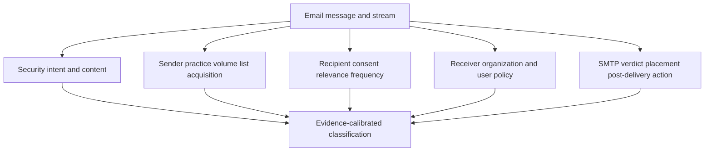
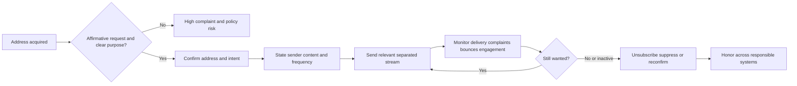
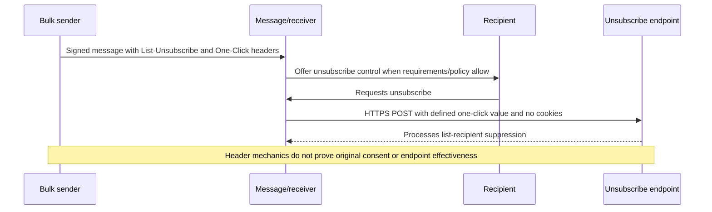
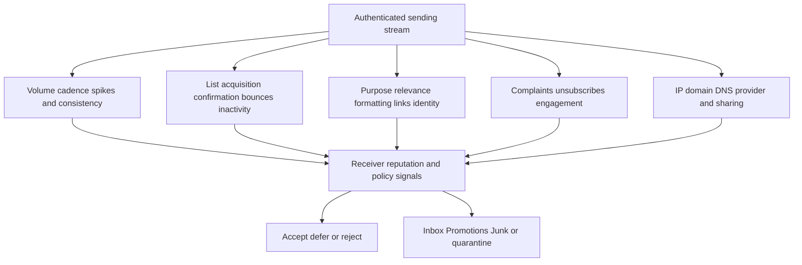
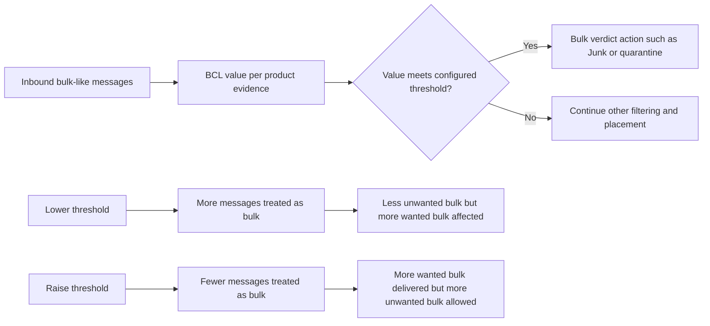
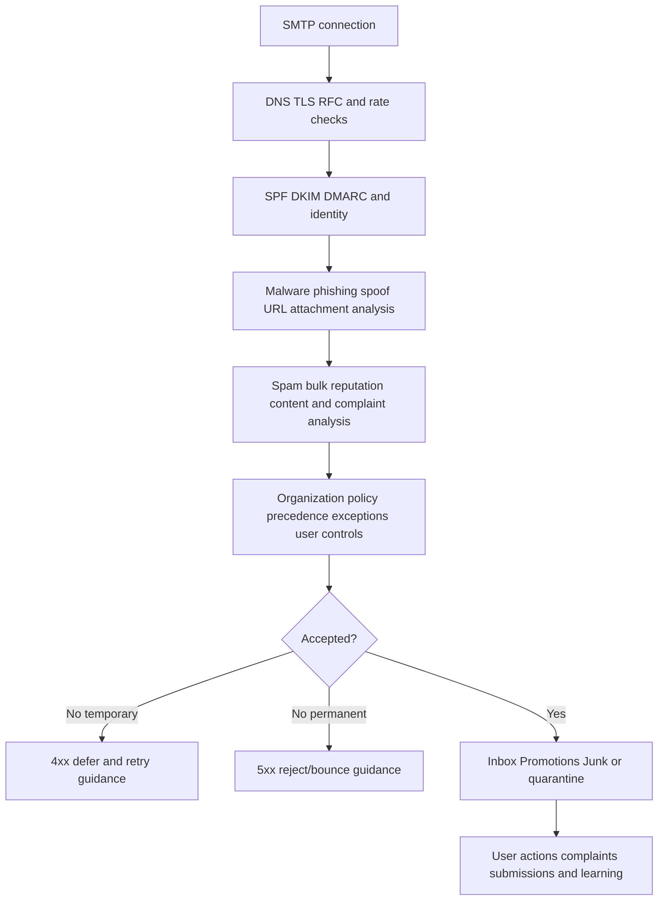
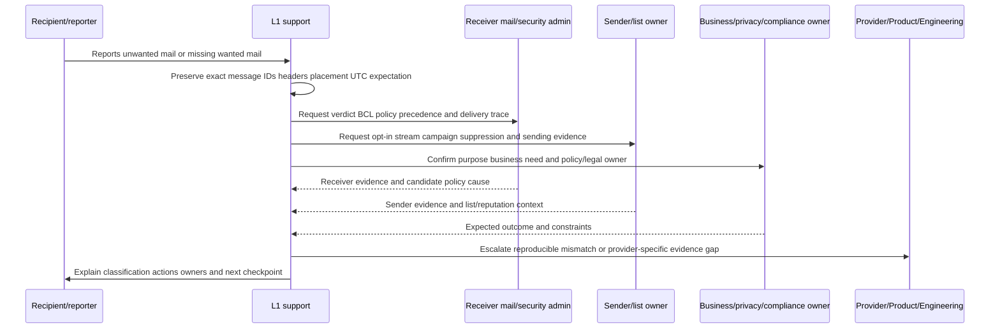
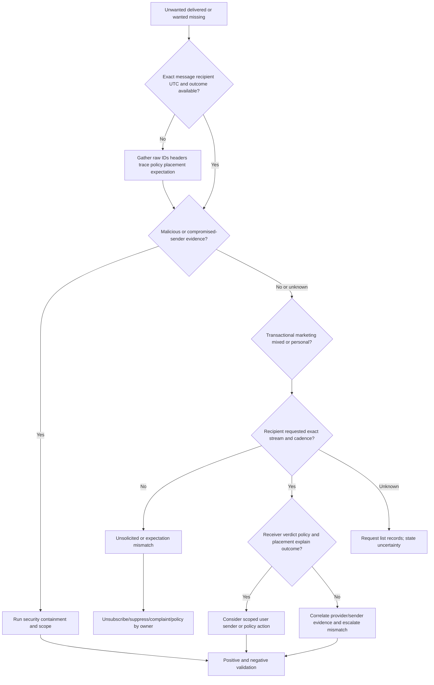

# Part 043 - Grey Mail Spam and Bulk Email

One recipient's useful newsletter can be another recipient's junk. A legitimate sender can authenticate correctly and still generate complaints. A message can comply with a commercial-email law and still be unwanted or filtered. A bulk sender can have a healthy reputation for one stream and a poor reputation for another. These are not contradictions; they are different evaluation layers.

The beginner-friendly rule for this Part is:

> **Do not force every unwanted message into “malicious” or “safe.” Separate security, sender practice, recipient expectation, organizational policy, and delivery outcome.**

This Part covers gray/grey mail, spam, junk, bulk mail, wanted subscriptions, unwanted subscriptions, transactional and marketing messages, opt-in and unsubscribe, complaints, authentication, reputation, receiver policy, placement, false positives, false negatives, and support communication. It is defensive. The lab is offline and synthetic. It does not send email, browse links, invoke unsubscribe endpoints, modify a tenant, contact a sender, or test a public mailbox provider.

The master title uses **Grey Mail**. Microsoft public documentation commonly uses **gray mail**. Both spellings refer to the same broad idea: bulk messages that can be legitimate and desired by some recipients but unwanted by others. Preserve a product's exact terminology when quoting its evidence.

No single signal determines the entire case. High volume does not prove malicious intent. Correct SPF, DKIM, and DMARC do not prove that recipients asked for the message. An unsubscribe header does not prove the endpoint works or the list was ethically acquired. A user spam complaint does not prove malware. Inbox placement does not prove sender compliance. Junk placement does not prove a platform defect. A law's definition does not replace local legal counsel, mailbox-provider requirements, organizational policy, or user preference.

## Section goal

After completing this Part, you should be able to:

- Define spam, junk, bulk email, gray/grey mail, unsolicited bulk email, unsolicited commercial email, marketing/promotional email, transactional/relationship email, list email, opt-in, confirmed opt-in, unsubscribe, complaint, reputation, deliverability, and inbox placement.
- Explain why message harmfulness, wantedness, legality, technical authenticity, and placement are different axes.
- Separate malicious phishing from non-malicious unwanted mail and legitimate wanted bulk mail.
- Read identity/authentication, list, unsubscribe, routing, and anti-spam evidence without overclaiming.
- Distinguish sender-level, campaign-level, recipient-level, and organization-level expectations.
- Explain Microsoft Bulk Complaint Level (BCL) at a support depth and why threshold changes trade missed wanted mail against allowed unwanted mail.
- Use Google and Yahoo sender guidance to reason about authentication, opt-in, complaints, list hygiene, stream separation, volume changes, and unsubscribe.
- Investigate delivery disagreements by correlating exact message IDs, recipients, policy, verdict, placement, complaint/subscription evidence, and sending behavior.
- Recommend proportionate actions owned by users, mail admins, senders, marketing/business owners, privacy/legal, and providers.
- Build a synthetic classification and customer-expectation matrix and validate both desired and undesired outcomes.

## JD Mapping

| Role signal | Capability built here | Interview evidence |
|---|---|---|
| Investigate email-security cases | Distinguishes malicious, spam, bulk, gray mail, and legitimate traffic | Multi-axis classification matrix |
| Troubleshoot customer expectations | Separates verdict, policy, placement, and preference | Evidence-driven explanation |
| Reduce false positives/negatives | Uses scoped threshold/stream/recipient reasoning | Safe tuning proposal |
| Communicate with technical/nontechnical users | Explains why "wanted" varies without dismissing reports | Customer-safe updates |
| Partner with CSM/Product/Engineering | Captures exact IDs, samples, policy, metrics, and business need | Escalation packet |
| Apply enterprise support strengths | Reuses scoping, hypothesis testing, change control, and validation | Production-transfer method |

Your Microsoft support background helps because these cases often begin as "the service blocked good mail" or "too much junk is arriving." The fastest path is not defending a product verdict. It is translating the complaint into observed versus expected behavior, identifying the controlling policy and message stream, testing alternatives, and validating a low-risk change. The honesty boundary is that transferable support method is not production ownership of Microsoft Defender for Office 365, deliverability operations, sender reputation, or Abnormal AI.

## Candidate honesty note

| Evidence label | Safe claim | Boundary |
|---|---|---|
| **Production transfer** | Enterprise troubleshooting, customer communication, escalation, and change validation | Not production anti-spam administration |
| **Local/public lab** | Offline classification of synthetic messages, policies, users, and outcomes | No sent mail, live tenant, or provider test |
| **Learned architecture** | Public IETF, FTC, Google, Yahoo, and Microsoft concepts | No private filter or reputation logic claim |
| **Template only** | Tuning plan, evidence request, communication, and rollback | Recommended, not executed |

Safe interview language:

> "I have not operated a commercial sending program or enterprise anti-spam platform in production. In an offline lab I separated maliciousness, bulk behavior, recipient consent, organizational policy, and placement. My transferable strength is turning subjective complaints into exact samples, policies, hypotheses, scoped changes, rollback, and outcome validation."

## A Five-Axis Mental Model

Classify each message on at least five axes.

| Axis | Core question | Example values |
|---|---|---|
| Security | Is the message deceptive or harmful? | Malicious, suspicious, no known threat, unknown |
| Sender practice | How and why was it sent? | Individual, transactional, subscribed bulk, unsolicited bulk, compromised sender |
| Recipient expectation | Did this recipient reasonably want this stream now? | Wanted, formerly wanted, never requested, unknown |
| Organizational policy | What should happen for this recipient/group? | Inbox, Promotions, Junk, quarantine, block, user choice |
| Delivery outcome | What actually happened? | Rejected, deferred, quarantined, Junk, Promotions, Inbox |

A message can therefore be:

- non-malicious, correctly authenticated, legally compliant, but unwanted by one recipient;
- wanted and legitimate, but placed in Junk because of sender reputation or policy;
- transactional and important, but suspicious because the account is compromised;
- promotional and subscribed, but too frequent for the original expectation;
- malicious while including professional unsubscribe headers;
- bulk to thousands but desired and low complaint;
- low volume but deceptive and harmful.

## Core Terms

| Term | Plain meaning | Why it matters | Memory hook |
|---|---|---|---|
| Spam/junk email | Messages a receiver/filter/user treats as unwanted or abusive | Meanings vary by product, policy, and user | Spam is unwanted in context |
| Bulk email | Similar campaign/stream sent at significant scale | Volume/pattern affects reputation and handling | Bulk means many |
| Gray/grey mail | Legitimate bulk mail with mixed recipient desirability/complaints | Sits between clearly wanted and clearly abusive | Gray means mixed wantedness |
| UBE | Unsolicited Bulk Email | Separates lack of request plus volume | Unsolicited and many |
| UCE | Unsolicited Commercial Email | Adds commercial purpose; may be low volume | Unsolicited and commercial |
| Marketing/promotional | Promotes product, service, event, content, or engagement | Usually needs clear expectation and opt-out handling | Marketing invites action |
| Transactional/relationship | Facilitates an agreed transaction or ongoing relationship under applicable definition | Often has different requirements/expectations | Transactional serves existing action |
| Mailing list | System distributes list messages to subscribers/members | Standard list headers can help management | List is managed membership |
| Opt-in | Recipient affirmatively requests a stream | Strong basis for expectation | Opt-in says yes |
| Confirmed/double opt-in | Recipient confirms control/intent after initial signup | Reduces mistakes, abuse, and invalid addresses | Confirm the yes |
| Unsubscribe/opt-out | Recipient requests future stream stop | Easy handling reduces complaints | Exit must work |
| Complaint | Recipient marks message as spam/junk or submits abuse feedback | Affects reputation and reveals expectation mismatch | Complaint is recipient feedback |
| Deliverability | Ability to have mail accepted and delivered somewhere | Not identical to Inbox placement | Delivered is not necessarily Inbox |
| Inbox placement | Message location after acceptance | Depends on receiver/user signals and policy | Placement is the folder outcome |
| Reputation | Receiver/provider assessment of sending identity/infrastructure/behavior over time | Influences acceptance and placement | Reputation remembers patterns |

## 🔍 Plain-English deep-dive: Wantedness Lives at the Recipient-Stream-Time Intersection

Imagine a restaurant sends a weekly menu to people who asked for it. Priya still enjoys it. Mateo moved away and no longer wants it. Lin signed up for monthly events, not daily coupons. Sam never subscribed because someone mistyped an address. The sender, brand, and message can be identical while each recipient's expectation differs.

Wantedness is not just a sender property. It is a relationship among:

- the exact recipient/address;
- the exact sender and message stream;
- how the address was acquired and confirmed;
- what content/frequency was promised;
- whether preferences changed;
- whether unsubscribe/complaints were honored;
- the current time and business context.

That is why "other users like this newsletter" does not invalidate one user's complaint. It is also why one complaint does not prove the sender is malicious. Support must scope by recipient and stream while checking whether a pattern reveals poor list practices.

The restaurant analogy stops being accurate because mailbox providers aggregate complaints and behavior across populations, automate placement, and may withhold private filter details.

**Memory hook:** Wanted by whom, from which stream, under what promise, at what time?

## Malicious Email Versus Spam Versus Gray Mail

| Category | Intent/content | Relationship | Typical response |
|---|---|---|---|
| Phishing/malware/fraud | Deceptive or harmful | Consent does not make harm safe | Security investigation, containment, user/identity/resource response |
| Compromised legitimate sender | Correct identity may send harmful/anomalous request | Prior trust increases risk | Account/vendor/security investigation |
| Unsolicited spam | No known malicious payload but not requested; often bulk | Weak/absent recipient expectation | Filter, complaint, sender/list hygiene, policy |
| Gray mail | Legitimate bulk with mixed or stale recipient desire | Some opt-in/relationship, relevance disputed | Preference/unsubscribe, BCL/policy, stream tuning |
| Wanted bulk | Requested, relevant, expected cadence | Active consent/relationship | Deliver/Promotions/Inbox per policy/user preference |
| Transactional | Supports existing transaction/relationship | Expected due to action/account | Preserve delivery while assessing security/authentication |
| Personal/business mail | Individual conversation | Direct relationship | Ordinary mail handling; investigate if anomalous |

Never downgrade a phishing report to "just spam" because the sender sends in bulk. Evaluate harmful intent first. Conversely, do not escalate every marketing complaint as a security incident when evidence supports non-malicious subscription disagreement.

## Message Purpose: Marketing, Transactional, and Mixed

The U.S. FTC's CAN-SPAM guidance explains that the message's **primary purpose** matters. It distinguishes commercial content, transactional/relationship content, and other content. It lists narrow transactional/relationship categories and explains that mixed messages can become commercial based on subject, ordering, prominence, and reasonable recipient interpretation.

This is a legal example, not universal legal advice. Jurisdictions differ. Support should route legal interpretation to counsel/privacy/compliance and focus on evidence and system behavior.

| Message example | Operational classification question | Security question |
|---|---|---|
| Receipt with small promotion | Is primary purpose transaction completion? | Is order/account real and sender uncompromised? |
| "Account update" dominated by sale | Is the subject/placement deceptive or primarily commercial? | Does it imitate a security/account alert? |
| Password reset | Transactional/security notification | Was reset requested; are links/identity valid? |
| Newsletter | Subscribed marketing/list mail | Is sender/linked content safe? |
| Recall/safety notice | Relationship/safety information | Is urgent notice authentic? |
| Employment benefit notice | Relationship/employment information | Is HR identity/request legitimate? |

Google recommends not mixing promotions into receipt messages and separating streams by function. Yahoo similarly recommends segregating bulk/marketing from user, transactional, and alert mail. Stream separation helps preserve reputation and makes recipient expectations and troubleshooting clearer.

## 🔍 Plain-English deep-dive: Legal Permission, Provider Requirements, Policy, and Preference Are Four Rulebooks

Imagine a community event. Local law says when amplified music is allowed. The venue contract sets stricter limits. The event organizer has its own program rules. A nearby resident can still dislike the music. Meeting one rulebook does not automatically satisfy the others.

Email has multiple rulebooks:

1. **Law/regulation:** varies by jurisdiction, message purpose, relationship, consent, content, and sender.
2. **Mailbox-provider requirements:** authentication, complaints, subscription practices, formatting, unsubscribe, and sending behavior.
3. **Recipient organization's policy:** anti-spam thresholds, quarantine, Promotions/Junk handling, allow/block controls, and exceptions.
4. **Individual preference:** user subscriptions, block/safe-sender lists, rules, and complaint choices.

A sender can be legally permitted to send and still violate a provider requirement, an organization's policy, or a recipient's current preference. A message can meet provider requirements and still land in Junk. A user can want a message that an organization intentionally blocks. Support should identify which rulebook controls the disputed outcome and involve the correct owner.

The event analogy stops being accurate because email providers use dynamic reputation and machine-learning signals that are not fully disclosed or static.

**Memory hook:** Legal is not deliverable; deliverable is not Inbox; Inbox is not wanted.

## Subscription and Expectation Lifecycle

### Strong list evidence

- signup source and UTC time;
- affirmative consent field/value and version of notice;
- confirmation event and address;
- promised content type/frequency;
- list/segment ID;
- preference changes;
- unsubscribe/complaint/suppression event;
- sender/platform responsible for honoring it;
- message stream and campaign IDs.

### Weak or risky acquisition practices

- purchased/rented/scraped lists;
- prechecked opt-in boxes;
- address added through unrelated transaction without clear expectation;
- third-party lead without auditable permission;
- old/stale list after purpose or frequency changed;
- typo or malicious signup without confirmation;
- failure to suppress opt-outs, complaints, hard bounces, or inactive addresses.

## List Headers and One-Click Unsubscribe

RFC 2369 defines structured list fields such as `List-Help`, `List-Subscribe`, `List-Unsubscribe`, `List-Post`, `List-Owner`, and `List-Archive`. These can help mail clients provide list controls. Header presence is evidence of list infrastructure, not proof of consent or safety.

RFC 8058 adds one-click signaling for `List-Unsubscribe`:

- a sender includes an HTTPS URI in `List-Unsubscribe`;
- it adds `List-Unsubscribe-Post: List-Unsubscribe=One-Click`;
- a valid DKIM signature covers these headers;
- a receiver can make the defined POST with user consent;
- the request must not carry cookies or unrelated authorization context;
- the endpoint should use opaque/hard-to-forge recipient/list information.

Do not manually invoke an unfamiliar unsubscribe link while investigating a potentially malicious message. A malicious sender can use interaction to validate an address or redirect a user. Use provider controls or authorized list-management evidence. The offline lab performs no request.

## Authentication: Identity Signal, Not Wantedness

| Control | What it helps establish | What it does not establish |
|---|---|---|
| SPF | Source authorization for evaluated SMTP identity | User opt-in, content value, visible From safety |
| DKIM | Signature validity for signing domain/content | Recipient consent or benign business purpose |
| DMARC | Authorized use/alignment of Author Domain | Wantedness, legality, compromised sender, list hygiene |
| TLS | Protected transport hop/session under implementation | Sender intent, end-to-end confidentiality, consent |
| PTR/forward DNS | Sending infrastructure identity consistency | Message desirability |

Google and Yahoo require stronger authentication for bulk senders because stable authenticated identity supports abuse control and reputation. An authenticated marketing message can still be spam to a recipient. An unauthenticated receipt can be legitimate but misconfigured. Treat authentication defects and recipient-expectation defects as separate root causes.

## 🔍 Plain-English deep-dive: Authentication Prints a Return Address; It Does Not Prove the Recipient Ordered the Catalog

A catalog company can correctly print its real return address and use a legitimate postal permit. That helps the postal service identify the sender. It does not prove a household asked for the catalog, still wants it, or considers the frequency reasonable.

SPF, DKIM, and DMARC similarly help bind mail to domain identities and authorization. They allow receivers to attribute behavior and apply reputation more reliably. They do not record each recipient's subscription promise. A sender with perfect authentication and a purchased list can still send unwanted mail. A compromised authenticated sender can send malicious mail.

The catalog analogy stops being accurate because email authentication is cryptographic/DNS-based, policies are evaluated automatically, and messages can be personalized or delivered at enormous speed.

**Memory hook:** Authentication answers "whose domain path?" Consent answers "did this recipient ask?"

## Complaints, Reputation, and Deliverability

Mailbox providers aggregate signals over time. Public documentation names factors such as complaints, authenticated domains, IP/domain/URL reputation, invalid recipients, sending volume/rate, content practices, infrastructure, and list quality. Private weighting and models are not fully public.

### Complaint rate needs a denominator

A rate is generally:

$$
\text{Complaint rate} = \frac{\text{complaints in defined scope}}{\text{messages in defined denominator}} \times 100\%.
$$

But providers can use different denominators and windows. Yahoo's public FAQ says its displayed complaint rate is based on messages delivered to Inbox, which may differ from a sender's calculation that includes Spam placement. Google Postmaster documentation publishes sender targets and says to keep reported spam rate below 0.10% and avoid 0.30% or higher. Do not compare metrics without source, identity, window, numerator, denominator, and lag.

## 🔍 Plain-English deep-dive: Ten Complaints Can Be Tiny or Catastrophic Depending on the Denominator

Ten complaints among one million Inbox deliveries is very different from ten complaints among one hundred. Ten complaints today can also represent a sudden campaign problem hidden by a monthly average. A dashboard can group by DKIM domain while a sender groups by campaign or IP.

For every rate, record:

- provider/tool and exact metric name;
- authenticated domain/IP/campaign scope;
- numerator event definition;
- denominator event definition;
- UTC window and averaging;
- filtering/placement exclusions;
- data availability lag and threshold context.

Never reverse-engineer a private provider model from one aggregate number. Use the metric to form hypotheses about list acquisition, frequency, content, compromised infrastructure, stream mixing, or a specific campaign, then test with sender-side and receiver-side evidence.

The fraction analogy stops being accurate because reputation can include non-linear, historical, content, identity, and hidden anti-abuse signals beyond the visible complaint rate.

**Memory hook:** A rate without identity, window, numerator, and denominator is not comparable evidence.

## Bulk Complaint Level and Receiver Thresholds

Microsoft 365 public documentation describes **Bulk Complaint Level (BCL)** as a value assigned to inbound messages from bulk senders. A higher value means the message is more likely to show undesirable, spam-like behavior. BCL ranges described publicly are:

| BCL | Public description |
|---|---|
| 0 | Not from a bulk sender |
| 1-3 | Bulk sender generating few complaints |
| 4-7 | Bulk sender generating mixed complaint levels |
| 8-9 | Bulk sender generating many complaints |

An anti-spam policy has a BCL threshold and an action. Lowering the threshold identifies more messages as bulk; raising it identifies fewer. This is a policy tradeoff, not a declaration that one number is universally correct.

Microsoft's current public documentation also describes a Promotions tag/folder experience for bulk mail under supported configurations and clients. Treat product behavior, rollout state, client version, user rules, safe senders, and policy precedence as evidence, not assumptions.

### BCL is not phishing confidence

Bulk is a source/practice/reputation classification. Phishing is a security/deception classification. A message can be both bulk and phishing, and other protection can override bulk handling. Do not loosen phishing/malware controls to solve wanted bulk placement.

## Placement Pipeline

The pipeline is conceptual. Providers can evaluate in different orders, combine models, and act after delivery. A support case needs the actual product/message evidence.

## Evidence Collection

| Evidence family | Fields | Question |
|---|---|---|
| Message identity | Message-ID, Internet/provider IDs, From, Sender, Reply-To, MAIL FROM, DKIM domains | Which exact stream/message? |
| Authentication | SPF, DKIM, DMARC, ARC, evaluated domains/results | Was domain use authorized/aligned? |
| List | List-ID, List-Unsubscribe, List-Unsubscribe-Post, campaign/list/segment ID | Is it list mail and what management signal exists? |
| Purpose/content | Subject, first content, transaction reference, promotion mix | Transactional, marketing, mixed, deceptive? |
| Recipient expectation | Signup/confirmation, promised frequency, preference, prior engagement | Did this recipient request this stream? |
| Feedback | Complaint, unsubscribe, bounce, suppression event | Was negative feedback honored? |
| Sending behavior | Volume, cadence, spike, IP/DKIM/From stream, shared provider | Is behavior stable/segregated? |
| Receiver verdict | Spam/bulk/phishing labels, BCL/SCL/headers, policy and action | Why/how was it handled? |
| Delivery | SMTP response, timestamp, placement, post-delivery move | Where did it end and when? |
| Scope | Recipients, campaigns, domains, providers, versions, UTC window | Is this individual or systemic? |

### Evidence labels

- **[Raw observation]:** exact header, verdict, event, policy, or user report.
- **[Sender record]:** subscription, suppression, campaign, or sending metric supplied by owner.
- **[Receiver record]:** placement, provider feedback, complaint, or anti-spam result.
- **[Inference]:** testable explanation such as stale consent or mixed streams.
- **[Conclusion]:** supported classification in stated scope.
- **[Unknown]:** missing retention, private model, recipient history, or sender record.

## Hypothesis Framework

| Hypothesis | Predicted evidence | Contradiction | Safe owner/test |
|---|---|---|---|
| Malicious phishing/fraud | Deceptive identity/request/link/payload/user impact | Known safe content and approved workflow | Security/mail/business owner |
| Wanted subscribed bulk | Confirmed opt-in, expected stream/frequency, low complaints | User never requested or opt-out ignored | Sender/list + recipient evidence |
| Stale gray mail | Old consent, changed relevance/frequency, rising complaints | Recent confirmed preference and relevance | List owner/marketing |
| Unsolicited spam | No auditable permission, purchased/scraped source, broad complaints | Confirmed opt-in for exact stream | Sender governance/privacy |
| Legitimate transactional | Existing transaction and purpose-first content | Promotion dominates or transaction absent | Business/application owner |
| Mixed stream harming reputation | Marketing and transactional share identity/infrastructure | Streams isolated with separate evidence | Sender/mail owner |
| Sender misconfiguration | Authentication, DNS, RFC, unsubscribe, rate error | All requirements pass; only recipient policy differs | Sender/provider evidence |
| Receiver policy threshold | BCL/policy/priority causes expected action | Different verdict or policy not applied | Mail admin/policy trace |
| User-specific preference/rule | One recipient blocked/moved mail | Many recipients same outcome before mailbox rule | User + mail evidence |
| Compromised bulk sender | Sudden volume/content/recipient spike, auth still passes | Planned campaign and owner confirmation | Sender security/marketing |
| Reputation lag | Prior problems persist after fix | Immediate unrelated root cause | Provider metrics over time |
| Logging/metric mismatch | Different denominator/window/domain grouping | Same definitions and aligned data | Sender/provider/tool owner |

## Investigation Workflow

### Step 1: State the expected behavior

Ask:

- Is the problem unwanted mail delivered, wanted mail missing, wrong folder, reject/defer, unsubscribe failure, or inconsistent recipients?
- Which exact recipient(s), message(s), stream, sender, and UTC window?
- What outcome is expected: security block, user opt-out, Promotions/Junk placement, Inbox delivery, or transactional reliability?

### Step 2: Preserve exact samples

Collect representative good/bad outcomes, raw headers through approved means, message IDs, delivery trace, policy/verdict, folder, recipient, and time. Avoid forwarding in ways that alter headers. Redact personal/content data to the minimum needed.

### Step 3: Check security first

Before treating the issue as preference, assess phishing, malware, compromised sender, links, attachments, account takeover, and business fraud. Escalate security evidence independently.

### Step 4: Classify purpose and stream

Determine individual versus automated, marketing versus transactional versus mixed, list/campaign ID, sending domain/IP/DKIM/From separation, volume/cadence, and provider.

### Step 5: Check recipient expectation

Look for signup/confirmation, notice version, promised content/frequency, preference, unsubscribe/complaint, suppression, and re-add source. If unavailable, say so.

### Step 6: Trace receiver behavior

Identify SMTP response, provider acceptance, verdict, BCL/SCL or comparable evidence, applied policy/priority/exception, folder, user rule/safe/block state, and post-delivery action.

### Step 7: Scope the pattern

Compare recipients, campaigns, message categories, authentication identities, sending IPs, time, and provider destinations. Do not infer global deliverability from one recipient.

### Step 8: Choose owner-aligned action

User preference, sender list hygiene, sender authentication/infrastructure, receiver policy, and malicious-message response belong to different owners. Use the narrowest action that addresses the actual mechanism.

### Step 9: Validate both sides

Confirm unwanted stream stops/moves as intended and wanted transactional/security mail still arrives. Monitor complaints, bounces, delivery errors, and placement over a defined window.

## Troubleshooting Decision Tree

## Response Matrix

| Finding | Primary owner | Candidate action | Validation |
|---|---|---|---|
| Malicious message | Security/mail/identity/resource | Quarantine/remove, block precise indicator, handle user/account impact | Campaign removed; controls and users validated |
| User no longer wants legitimate list | Recipient/list owner | Use trusted unsubscribe/preference/suppression workflow | Recipient stops receiving within expected time |
| Opt-out not honored | Sender governance/privacy/legal owner | Investigate suppression/re-add pipeline and obligations | Suppression persists across campaigns/platforms |
| Stale/inactive audience | Marketing/list owner | Reconfirm or suppress; clean invalid recipients | Complaints/bounces improve without re-adding users |
| Authentication/DNS/RFC defect | Sender/mail provider | Correct sender config and separate streams | Authentication and provider errors recover |
| Sudden volume spike | Sender operations/security | Pause/reduce, verify campaign/account, warm gradually | Errors/complaints stabilize; compromise excluded |
| Mixed transactional/marketing stream | Sender architecture/business | Separate From/DKIM/IP/template/purpose as appropriate | Transactional delivery protected; metrics segmented |
| BCL threshold disagreement | Receiver mail/security admin | Simulate/evaluate scoped threshold or Promotions handling | Wanted and unwanted samples meet expected outcomes |
| One user rule/block | User/support owner | Correct user preference/rule with approval | Only intended user behavior changes |
| Broad allow requested | Mail/security owner | Avoid permanent broad bypass; fix root cause or narrow temporary control | Authentication/threat protections retained |

## Safe Tuning Principles

1. **Do not solve deliverability by bypassing malware or high-confidence phishing controls.**
2. **Prefer sender/list/root-cause correction over receiver-wide allowlisting.**
3. **Separate transactional, security, marketing, and user streams.**
4. **Scope by exact sender identity, recipient group, campaign, and purpose.**
5. **Use simulation/reporting before threshold change when available.**
6. **Record baseline, hypothesis, expected effect, guardrails, rollback, and review time.**
7. **Validate wanted and unwanted samples.**
8. **Monitor downstream complaints, false positives, malicious misses, and business impact.**

Microsoft warns that allowed sender/domain entries can bypass most email protection and authentication checks and create risk; common broad domains should never be broadly allowed. Treat any exception as a high-scrutiny, time-bounded decision.

## Worked Example 1: Weekly Newsletter Becomes Daily

### Inputs

- Recipient confirmed a weekly newsletter six months ago.
- Sender begins daily promotional mail after a product launch.
- Authentication passes and list headers exist.
- Recipient marks two messages as spam and says "I never asked for daily ads."
- Sender record shows no new preference event.

### Reasoning

The exact sender and original opt-in are supported. No malicious content is observed. The sender changed frequency and content beyond the documented expectation. This supports **gray mail/expectation drift**, not "false user report" and not necessarily malicious spam. Sender-side segmentation/preferences and suppression are the primary fixes.

### Conclusion

> **[Conclusion, high confidence]** The recipient previously requested a weekly informational stream, but the reviewed daily promotional campaign exceeds the recorded content/frequency expectation. Authentication and list headers are healthy; they do not resolve the preference mismatch.

### Validation

Confirm the recipient is suppressed from daily promotions, weekly preference remains only if explicitly desired, no other campaign re-adds the address, and complaints for the changed stream decline.

## Worked Example 2: Receipt Lands in Junk

### Inputs

- Purchase is confirmed by business system.
- Message purpose is order receipt with a small footer promotion.
- Correct recipient and Message-ID exist.
- Authentication passes.
- Receiver trace shows bulk verdict due to shared marketing stream and current threshold.
- Other receipt recipients report the same placement.

### Reasoning

The receipt is legitimate and expected. The system does not need a malicious-message exception; it needs sender-stream and/or receiver policy analysis. If receipts share identity/infrastructure/content patterns with complaint-heavy marketing, their reputation and BCL can be coupled. The safest root correction is sender separation and hygiene, with a scoped receiver change only if business urgency requires it and security controls remain.

### Validation

Test synthetic/approved receipts and marketing samples after the change. Receipts should reach the expected folder, marketing should retain intended bulk handling, authentication remains healthy, and no phishing-like sample gains an unintended bypass.

## Worked Example 3: Correctly Authenticated Phishing Campaign

### Inputs

- New domain sends 8,000 messages.
- SPF, DKIM, and DMARC pass for that domain.
- Message impersonates a payroll service and links to credential collection.
- List-Unsubscribe headers are present.
- Recipients did not subscribe.

### Reasoning

Bulk status, unsubscribe headers, and self-authentication do not neutralize malicious intent. The correct category is phishing plus unsolicited bulk behavior. Security response takes priority: message/campaign containment, URL/domain analysis, recipient actions, credential/identity response, and scope. Do not invite recipients to click unsubscribe.

### Validation

Confirm messages/late deliveries are remediated, URL and identity actions are owned, affected users are assessed, precise controls work, and unrelated legitimate bulk mail is not broadly blocked.

## Metric and Timeline Discipline

| Metric/event | Record |
|---|---|
| Sent | Sender stream/campaign, accepted handoff, UTC window |
| Delivered | Provider definition and folder inclusion |
| Inbox | Provider-specific placement denominator |
| Complaint | User action/feedback-loop definition |
| Unsubscribe | Request time, mechanism, processed time, list/platform |
| Bounce | Hard/soft, SMTP code/text, retry/removal policy |
| Reputation | Domain/IP/DKIM identity, scale/category, source/window |
| BCL/SCL | Per-message value, threshold, policy/action |
| Open/click | Source accuracy, privacy/technical limitations |

Google explicitly says it does not track open rates and cannot verify third-party open-rate accuracy; low open rate is not necessarily a deliverability or spam-classification issue. Do not use opens as universal truth.

## Customer Communication

### Under investigation

> "We are separating security risk, sender/list practice, recipient expectation, applied anti-spam policy, and final placement for the exact samples. Current authentication/list evidence identifies the sending stream but does not by itself establish that the messages were requested or malicious. We are correlating message IDs, recipient scope, subscription/suppression records, verdict/BCL, policy precedence, and delivery outcomes."

### Legitimate but unwanted gray mail

> "The reviewed messages are authenticated list mail with no identified malicious content in the scoped samples. The recipient's recorded expectation does not match the current `[content/frequency]`, so this is being handled as an unwanted bulk/gray-mail and preference-management issue. `[Owner]` is validating suppression across `[lists/platforms]`; receiver-wide security bypass is not recommended."

### Wanted mail misplaced

> "The message is supported as an expected `[transactional/subscribed]` stream, but receiver evidence shows `[verdict/policy]` produced `[folder/action]`. The candidate cause is `[stream reputation/BCL threshold/policy/user rule]`, not a conclusion that all filters failed. We will test a scoped change against wanted samples and malicious/unwanted guardrails before broad rollout."

### Malicious bulk mail

> "Although the sending domain authenticated and the message included list-management headers, the reviewed content/behavior supports `[phishing/fraud/malware]`. Authentication proves authorized use of that domain, not benign intent or recipient consent. Security containment and user-impact scope are in progress through `[owners/window]`."

## Common Failure Modes

| Failure | Why it fails | Better behavior |
|---|---|---|
| "Authenticated means wanted" | Authentication is identity authorization | Check recipient-stream consent and behavior |
| "Unsubscribe means safe" | Malicious mail can include headers/links | Evaluate threat first; avoid interaction |
| "Bulk means spam" | Wanted high-volume streams exist | Separate volume, complaints, consent, relevance |
| "User complaint means attack" | Complaint may express preference | Check harmfulness separately |
| "Legal means Inbox" | Different rulebooks control outcomes | Separate law, provider, org, user |
| "Delivered means Inbox" | Accepted mail can go Junk/Promotions/quarantine | Trace final placement |
| "One recipient proves global issue" | Rules/preferences and sampling vary | Scope across exact comparable recipients |
| "Raise threshold until fixed" | Allows more unwanted mail and may miss malicious bulk | Simulate, scope, guardrail, rollback |
| Broad allowlisting | Can bypass protection/authentication | Fix sender/root cause or narrow temporary control |
| Mix receipts and promotions | Shared complaints/reputation harm critical mail | Separate streams and identities |
| Compare complaint rates blindly | Denominators/windows differ | Record metric semantics |
| Use opens as truth | Tracking blocked/inaccurate and provider-specific | Use multiple evidence sources |
| Retry 5xx repeatedly | Permanent errors should not be retried | Follow exact SMTP semantics and hygiene |
| Ignore 4xx pattern | Deferrals indicate transient/rate/reputation issues | Reduce rate, investigate, retry per guidance |

## Escalation Triggers and L1 Boundaries

Escalate when:

- malicious content, credential collection, account compromise, fraud, or malware is present;
- transactional/security/regulated messages are broadly rejected or misplaced;
- complaint/reputation problems affect multiple streams/domains/providers;
- sender infrastructure may be compromised or volume spikes are unauthorized;
- opt-outs are repeatedly ignored across platforms;
- legal/privacy/compliance interpretation is required;
- a broad allow/bypass or threshold change would materially weaken security;
- provider evidence contradicts receiver/sender logs;
- product behavior is reproducible but undocumented or inconsistent;
- customer impact is critical and no safe workaround exists.

L1 should not:

- decide legal compliance;
- promise Inbox placement or reputation recovery time;
- reveal private filtering internals not in evidence;
- invoke suspicious unsubscribe links;
- send live bulk/GTUBE tests without explicit authorization and controlled procedure;
- change tenant policies, allowlists, or thresholds without ownership/change control;
- classify every complaint as phishing or every bulk message as safe;
- ask for unnecessary message content or recipient personal data.

## Escalation Packet

| Section | Required content |
|---|---|
| Problem/expectation | Unwanted delivered, wanted missing, wrong folder, reject/defer, opt-out failure |
| Samples | Message IDs, recipients, UTC, raw/redacted headers, campaigns |
| Security | Threat findings and unknowns |
| Purpose/stream | Transactional, marketing, mixed, list, personal; From/DKIM/IP separation |
| Recipient evidence | Opt-in, confirmation, promised frequency, unsubscribe/complaint/suppression |
| Receiver evidence | SMTP, verdict, BCL/SCL, policy/priority/action, placement/user rule |
| Sender evidence | Volume/cadence, bounces, complaint/reputation metrics with semantics |
| Hypotheses | Support, contradiction, missing evidence |
| Proposed change | Owner, scope, expected effect, guardrails, rollback |
| Validation | Wanted/unwanted/malicious samples and monitoring window |
| Ask | Exact provider/Product/Engineering/business decision needed |

## Safe Synthetic Lab: The Recipient Expectation and Placement Observatory

### Objective

Build an offline classification and customer-expectation matrix across malicious mail, wanted bulk, stale gray mail, unsolicited spam, transactional mail, mixed-purpose mail, unsubscribe failures, and receiver-policy outcomes. Send no messages and perform no unsubscribe or tenant action.

The unique lab name is **The Recipient Expectation and Placement Observatory**.

### Prerequisites

- Local Markdown editor or spreadsheet.
- This Part and fixtures below.
- No mailbox, tenant, sender platform, provider dashboard, DNS tool, browser, API, or network access.
- Reserved domains ending in `.invalid` and synthetic IDs containing `043` only.
- Label artifact **local/public lab - synthetic offline email records only**.

### Authorized scope

Authorized:

- Copy synthetic headers/records locally.
- Classify messages and build hypotheses, policy proposals, validation, and communications.
- Mark IETF/FTC/Google/Yahoo/Microsoft mappings **learned architecture**.
- Mark actions and provider behavior tests **template only**.

Prohibited:

- Sending email, including GTUBE or test campaigns.
- Opening links or invoking any unsubscribe URL/POST.
- Signing into or modifying a mailbox, tenant, sender platform, DNS, policy, threshold, rule, list, suppression, or reputation service.
- Contacting a sender/provider/recipient.
- Using real messages, people, companies, domains, addresses, campaign data, or complaints.
- Uploading artifacts to public scanners, AI, or reputation services.

### Synthetic fixtures

| Case | Stream/message | Recipient history | Security | Receiver outcome |
|---|---|---|---|---|
| A | `weekly-043@news.invalid` weekly digest | Confirmed weekly opt-in | No threat in fixture | Inbox |
| B | Same sender daily promotion | Only weekly opt-in | No threat in fixture | User complaint/Junk |
| C | `receipts-043@shop.invalid` order receipt | Purchase confirmed | Auth pass, purpose-first | Bulk/Junk for 12 users |
| D | `promo-043@shop.invalid` sale | Confirmed monthly opt-in | No threat | Promotions |
| E | `offers-043@unknown.invalid` sale | No signup record | No known payload | Inbox then complaint |
| F | `payroll-043@new.invalid` "review payroll" | No signup | Credential link fixture | Quarantine as phishing |
| G | `events-043@events.invalid` | Unsubscribed at 09:00 UTC | Campaign sent at 12:00 UTC | Inbox |
| H | `security-043@account.invalid` reset alert | User requested reset | Auth pass | Rejected 5xx config fixture |

Synthetic metadata:

| Case | SPF/DKIM/DMARC | List headers | BCL | Policy/action | Sender fact |
|---|---|---|---:|---|---|
| A | pass/pass/pass | RFC 8058 fixture | 2 | Below threshold 6/Inbox | Stable weekly |
| B | pass/pass/pass | RFC 8058 fixture | 5 | User rule/Junk | Frequency changed |
| C | pass/pass/pass | None | 7 | Threshold 6/Junk | Shares IP/DKIM with promo |
| D | pass/pass/pass | RFC 8058 fixture | 4 | Promotions fixture | Stable monthly |
| E | pass/pass/pass | Body link only | 8 | Threshold 6/Junk after feedback | No consent record |
| F | pass/pass/pass | Forged-looking fixture | 9 | Phishing/quarantine | Malicious intent fixture |
| G | pass/pass/pass | RFC 8058 fixture | 3 | Inbox | Suppression sync failed |
| H | pass/pass/pass | None | 0 | Permanent config reject | Transactional stream |

### Steps

1. Create `The Recipient Expectation and Placement Observatory`; record UTC and evidence label.
2. Copy fixtures exactly; do not replace them with real messages or domains.
3. Define all core terms and create the five-axis model for A-H.
4. Classify security, sender practice, recipient expectation, organizational policy, and delivery outcome separately.
5. Identify purpose as marketing, transactional, mixed, list, or malicious; note uncertainty.
6. For each case, list authentication's narrow meaning and what it does not prove.
7. Create at least eight hypotheses with predictions, contradictions, owners, and offline evidence requests.
8. Build per-recipient/stream consent and preference timelines for A-B and G.
9. Build sender/receiver timelines for C and H, separating acceptance, verdict, action, placement, and error.
10. Explain why F remains phishing despite authentication and list-header fixtures.
11. Create a BCL threshold simulation table for values 5, 6, 7, and 8 across A-H; do not change a tenant.
12. Propose scoped fixes for C, G, and H with guardrails and rollback.
13. Create a false-positive test set (A, C, H) and unwanted/malicious guardrail set (B, E, F, G).
14. Write the four customer communications from this Part using fixture facts.
15. Record metric semantics for one synthetic complaint rate using two different denominators and explain the mismatch.
16. Complete safety, privacy, cleanup, and no-activity attestations.

### Expected evidence

- Five-axis classification matrix for eight cases.
- Message-purpose and authentication-boundary analysis.
- Per-recipient/stream consent and preference timelines.
- At least eight competing hypotheses.
- BCL threshold simulation with tradeoffs.
- Scoped sender, user, and receiver actions with rollback.
- Positive, unwanted, and malicious validation set.
- Metric denominator comparison.
- Four audience-safe communications.
- Explicit no-send/no-click/no-tenant/no-real-data attestation.

### Cleanup and privacy

- Confirm all domains end in `.invalid` and IDs contain `043`.
- Remove any accidental real address, person, sender, domain, message, campaign, token, link, or provider account data.
- Confirm no email, unsubscribe request, browser request, DNS lookup, API call, provider login, tenant/list/policy change, or public upload occurred.
- Delete the artifact if real data cannot be reliably removed.
- Store only the synthetic local artifact if useful.
- Record cleanup time and zero-activity attestation.

### Artifacts

| Artifact | Skill demonstrated | Honest label |
|---|---|---|
| Classification/customer-expectation matrix | Multi-axis email reasoning | **Local/public lab** |
| BCL simulation and guardrails | Safe policy tradeoff | **Local/public lab** |
| Sender/list/receiver action plan | Ownership and validation | **Template only** |
| Standards/provider mapping | Public documentation research | **Learned architecture** |
| Customer communications | Enterprise support transfer | **Production transfer** method with **template only** scenario |

## Validation rubric

| Dimension | Fail | Developing | Pass |
|---|---|---|---|
| Classification | Safe vs malicious only | Names bulk/spam | Separates security, practice, expectation, policy, outcome |
| Consent | Sender-wide assumption | User says wanted/unwanted | Uses recipient-stream-time promise and preference evidence |
| Authentication | Pass equals safe | Knows narrow checks | Separates identity authorization from wantedness/intent |
| Deliverability | Delivered or not | Includes folder | Traces SMTP, verdict, policy, placement, user/post-delivery behavior |
| Metrics | Quotes rate | Adds timeframe | Records identity, numerator, denominator, window, lag, source |
| Tuning | Broad allow/threshold | Scoped change | Baseline, guardrails, rollback, positive/negative validation |
| Communication | Defends filter/dismisses user | States verdict | Explains layers, evidence, owners, next checkpoint |
| Honesty/safety | Claims production/send test | Calls offline lab production | Labels evidence and performs zero live activity |

## Official Source Anchors

All sources were accessed on August 24, 2026 and must be revalidated before production use. A stale secondary FTC blog URL tested during research returned 404 and was excluded; the current FTC compliance guide resolved.

| Official/public source | What it anchors |
|---|---|
| [FTC - CAN-SPAM Act: A Compliance Guide for Business](https://www.ftc.gov/business-guidance/resources/can-spam-act-compliance-guide-business) | U.S. commercial versus transactional/relationship primary-purpose and opt-out guidance; not universal legal advice |
| [RFC 2369 - List Header Fields](https://www.rfc-editor.org/rfc/rfc2369) | List help, subscribe, unsubscribe, owner, post, and archive header model |
| [RFC 8058 - One-Click Unsubscribe](https://www.rfc-editor.org/rfc/rfc8058) | Signed one-click list-unsubscribe signaling and security requirements |
| [Google - Email sender guidelines](https://support.google.com/a/answer/81126) | Authentication, opt-in, complaints, unsubscribe, formatting, stream and volume guidance |
| [Google - Email sender guidelines FAQ](https://support.google.com/a/answer/14229414) | Current bulk-sender enforcement, unsubscribe, authentication, and support context |
| [Yahoo - Sender Requirements and Recommendations](https://senders.yahooinc.com/best-practices/) | Bulk sender authentication, complaint, opt-in, stream separation, unsubscribe, hygiene, and DNS guidance |
| [Yahoo - Sender FAQs](https://senders.yahooinc.com/faqs/) | Bulk classification, metric denominator, one-click, feedback loop, reputation, and Inbox limitations |
| [Yahoo - SMTP Error Codes](https://senders.yahooinc.com/smtp-error-codes/) | Temporary/permanent, complaint, unsolicited, authentication, RFC, and content delivery diagnostics |
| [Microsoft - Anti-spam protection](https://learn.microsoft.com/en-us/defender-office-365/anti-spam-protection-about) | Spam/high-confidence/bulk verdicts, actions, policies, priority, and allowlist risk |
| [Microsoft - Bulk email detection](https://learn.microsoft.com/en-us/defender-office-365/anti-spam-bulk-complaint-level-bcl-about) | Current BCL ranges, threshold effects, bulk/gray mail, and Promotions behavior |
| [Microsoft - Configure anti-spam policies](https://learn.microsoft.com/en-us/defender-office-365/anti-spam-policies-configure) | Policy scope, threshold, actions, precedence, change, and validation concepts |

## Likely Interview Questions

### Q1. What is gray mail?

**Model answer:** Gray/grey mail is legitimate bulk email whose desirability is mixed or changes by recipient, stream, frequency, and time. It sits between clearly wanted mail and clearly abusive spam. I do not use the label to clear security risk; I separately assess maliciousness, sender/list practice, recipient expectation, organizational policy, and actual placement.

### Q2. What is the difference between spam, bulk mail, and phishing?

**Model answer:** Bulk describes scale/pattern, spam describes unwanted or abusive mail in a receiver/user context, and phishing describes deceptive malicious intent to steal information or induce harmful action. A campaign can be bulk phishing, wanted bulk, or non-malicious unsolicited spam. I classify each dimension from evidence rather than making them synonyms.

### Q3. Does SPF/DKIM/DMARC pass mean recipients requested the email?

**Model answer:** No. Authentication helps establish authorized use of domain identities and supports attribution/reputation. It does not prove recipient opt-in, current relevance, legal compliance, benign intent, or an uncompromised sender. I correlate exact recipient-stream consent, promised frequency, complaints, unsubscribe, and resource/security evidence separately.

### Q4. How would you investigate wanted mail going to Junk?

**Model answer:** I collect exact message/recipient/UTC/header/trace samples, confirm security and purpose, verify recipient expectation, inspect authentication and sender stream, identify receiver verdict/BCL/SCL, applied policy precedence, folder and user rules, then scope across comparable recipients/campaigns. I test sender separation/root correction or a narrowly owned policy change against wanted and malicious/unwanted guardrails.

### Q5. What is BCL and what happens when its threshold changes?

**Model answer:** In Microsoft 365, BCL is a per-message bulk complaint level; higher values indicate more undesirable spam-like bulk behavior. The anti-spam policy threshold determines when the bulk verdict action applies. Lowering it catches more bulk but can affect wanted mail; raising it allows more wanted bulk but also more unwanted bulk. I simulate and validate rather than call one threshold universally correct.

### Q6. Why are easy unsubscribe and list hygiene important?

**Model answer:** They align sending with recipient expectations and reduce complaints, invalid recipients, wasted volume, and reputation harm. RFC 8058 defines signed one-click signaling; providers also require practical unsubscribe behavior for covered bulk streams. Header presence does not prove consent or endpoint success, so I check subscription, suppression, timing, and re-add paths.

### Q7. Why should transactional and marketing streams be separated?

**Model answer:** Their purpose, recipient expectation, cadence, and business impact differ. Shared IP/DKIM/From infrastructure can couple complaints and reputation so poor marketing practices affect receipts or security alerts. Separation improves attribution, policy, metrics, troubleshooting, and resilience, while each stream still needs correct authentication and security review.

### Q8. What are your L1 boundaries?

**Model answer:** I can preserve redacted samples, classify layers, correlate sender/list/receiver evidence, build hypotheses, communicate, recommend scoped actions, and validate outcomes. I do not decide law, expose private filtering logic, promise Inbox placement, invoke suspicious unsubscribe links, send unapproved tests, or change broad policies/allowlists/thresholds without authorized owners and rollback.

## 30-Second Memory Hooks

- **Security, practice, expectation, policy, and placement are separate axes.**
- **Bulk means many; spam means unwanted in context; phishing means malicious deception.**
- **Wanted by whom, from which stream, under what promise, at what time?**
- **Authentication identifies a domain path; it does not record subscription.**
- **Legal is not deliverable; delivered is not Inbox; Inbox is not wanted.**
- **List header is a mechanism signal, not consent proof.**
- **A rate needs identity, numerator, denominator, window, lag, and source.**
- **Lower BCL threshold catches more bulk; higher threshold allows more.**
- **Separate transactional and marketing streams.**
- **Tune with wanted, unwanted, and malicious guardrails.**

## Completion Checklist

- [ ] I can define spam, bulk, gray mail, UBE, UCE, marketing, transactional, opt-in, complaint, reputation, and placement.
- [ ] I classify security, practice, expectation, policy, and outcome separately.
- [ ] I explain why authentication does not prove consent or safety.
- [ ] I can describe RFC 2369 and RFC 8058 without invoking a live link.
- [ ] I distinguish legal/provider/organization/user rulebooks.
- [ ] I can interpret BCL and threshold tradeoffs at a support level.
- [ ] I collect exact sender, list, receiver, placement, and recipient evidence.
- [ ] I compare metrics only after recording numerator, denominator, identity, window, lag, and source.
- [ ] I maintain malicious, wanted, stale, unsolicited, transactional, policy, sender, user, and logging hypotheses.
- [ ] I propose scoped tuning with guardrails, rollback, and positive/negative validation.
- [ ] I completed the offline lab or can explain its artifacts and limitations aloud.
- [ ] I can answer Q1-Q8 without reading and preserve my honesty boundary.
- [ ] I reviewed resolving sources and recorded August 24, 2026 as the access date.

[Next: Part 044 - Data Exfiltration and Sensitive Content](Part-044-data-exfiltration-and-sensitive-content.md)