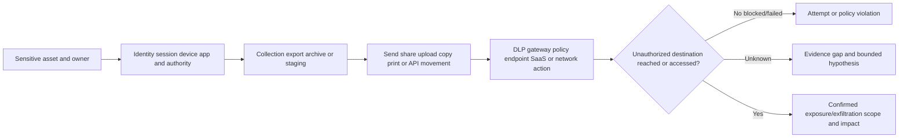
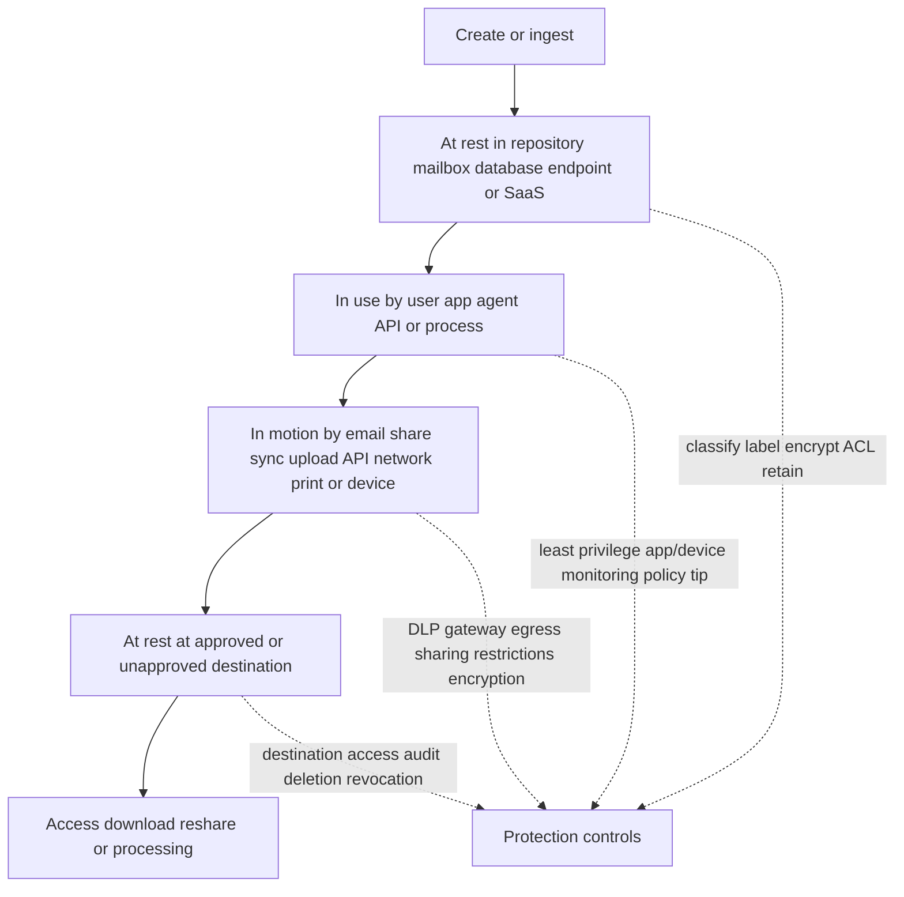
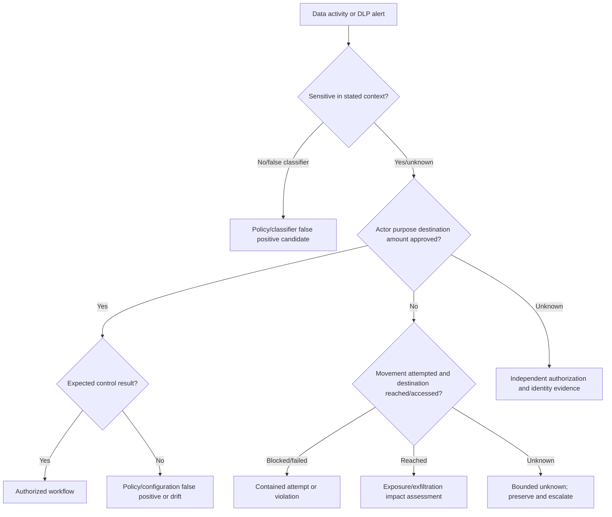
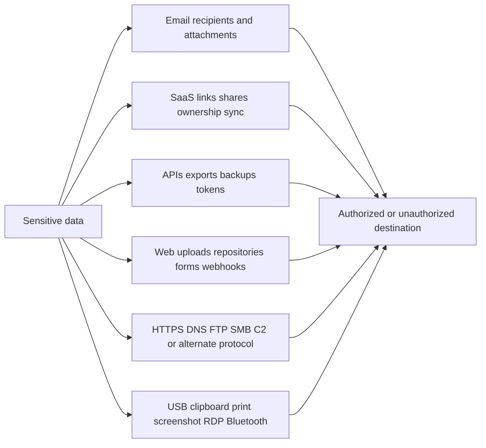
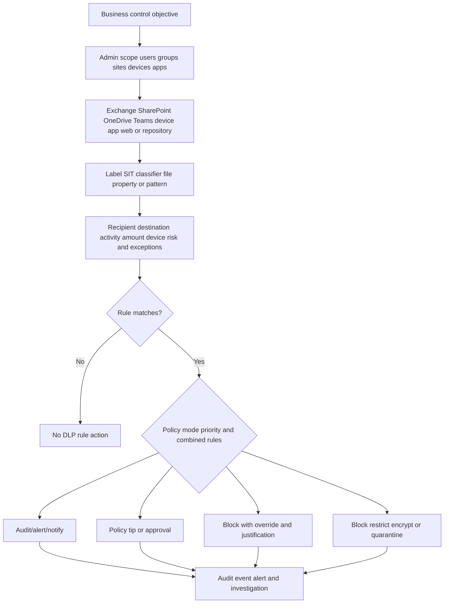
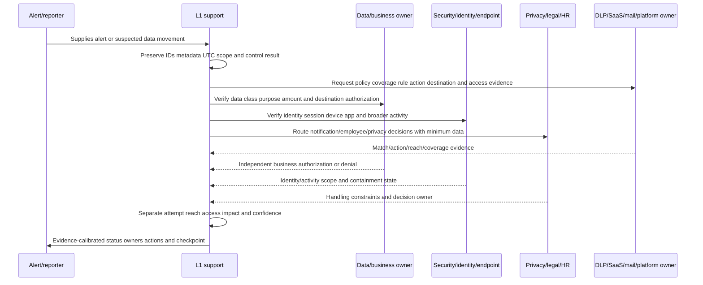
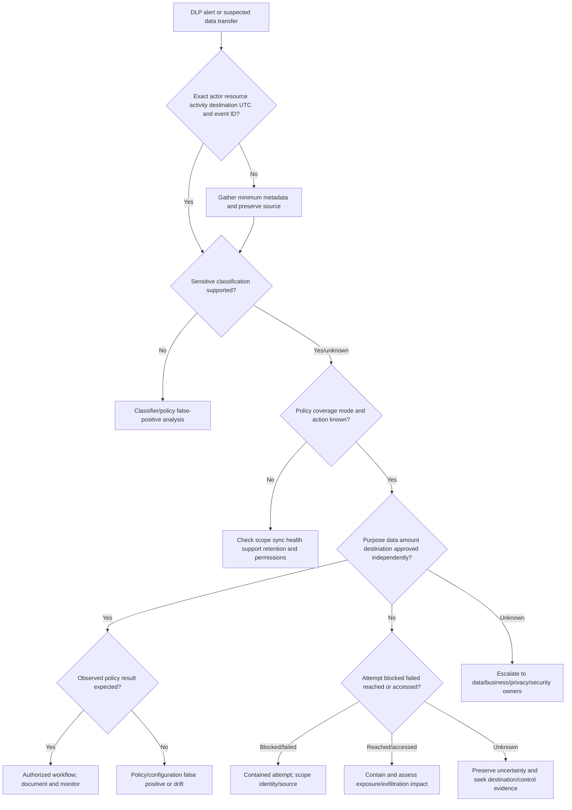
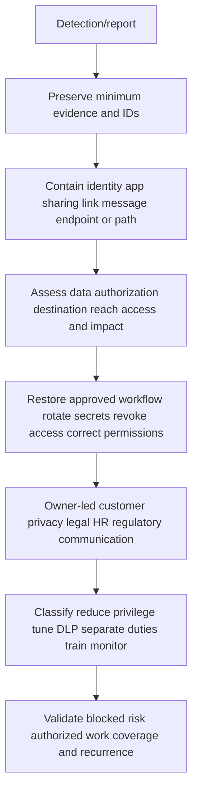

# Part 044 - Data Exfiltration and Sensitive Content

Data exfiltration means data is taken from an organization or authorized boundary by an unauthorized person, account, application, or process. It threatens **confidentiality**, which means information is available only to authorized entities. Exfiltration can happen through email, cloud sharing, application programming interfaces (APIs), web uploads, removable media, printing, screenshots, messaging, source repositories, backups, or attacker command-and-control channels.

A large attachment is not automatically exfiltration. An external share is not automatically a breach. A Data Loss Prevention (DLP) alert is not automatically proof that data left. A blocked attempt is not a completed transfer. An authorized user can perform an unauthorized action, while a new external recipient can be an approved customer. The support engineer must connect data sensitivity, identity, authority, action, destination, control result, confirmed access, and impact.

The beginner-first rule for this Part is:

> **Prove the confidentiality-impacting chain. Separate sensitive-content detection, attempted movement, control action, destination reach, access, and business impact.**

This Part is defensive and evidence-minimizing. It does not teach how to evade monitoring or move real data. The lab uses synthetic metadata and reserved `.invalid` domains. It sends nothing, opens nothing, copies no file, calls no API, changes no policy, and uses no real sensitive content.

## Section goal

After completing this Part, you should be able to:

- Define data, sensitive data, classification, confidentiality, data loss, leakage, exposure, exfiltration, oversharing, DLP, sensitive information type, sensitivity label, insider risk, and least privilege.
- Distinguish authorized sharing, accidental leakage, policy violation, blocked attempt, suspicious preparation, and confirmed malicious exfiltration.
- Trace data at rest, in use, and in motion through email, SaaS, endpoint, cloud, API, network, and physical channels.
- Explain DLP as a policy/control system whose match, alert, action, and success states must be verified separately.
- Build competing hypotheses for anomalous downloads, external sends, sharing links, overrides, cloud copies, and high-volume access.
- Correlate user/account, resource, classification, activity, destination, control, and access evidence with exact UTC timestamps and IDs.
- Investigate while minimizing exposure to sensitive content, personal data, secrets, and regulated information.
- Separate a trusted insider, negligent user, compromised account, malicious insider, misconfiguration, sanctioned workflow, and instrumentation gap.
- Recommend proportionate containment, business verification, evidence preservation, recovery, notification routing, and prevention.
- Create a synthetic exfiltration triage and control map and explain its production limitations honestly.

## JD Mapping

| Role signal | Capability built here | Interview proof |
|---|---|---|
| Threat investigation | Reconstructs data-access-to-destination chain | Exfiltration evidence matrix |
| Configuration support | Separates DLP scope, condition, action, mode, priority, and coverage | Policy-path analysis |
| Customer trust | Minimizes sensitive evidence and avoids premature breach claims | Privacy-safe update |
| Complex escalation | Supplies exact resource/activity IDs, timelines, coverage, and asks | Escalation packet |
| Recommendations | Maps immediate, corrective, and preventive controls | Control-layer plan |
| Cross-functional work | Routes security, privacy, legal, HR, business, identity, endpoint, and data ownership | Ownership map |

Your Microsoft enterprise-support background transfers through scope control, evidence preservation, permissions reasoning, cloud audit correlation, change ownership, and customer communication. The honesty boundary is important: this lesson does not establish production DLP, insider-risk, forensic, privacy-response, or Abnormal AI experience.

## Candidate honesty note

| Evidence label | Safe claim | Boundary |
|---|---|---|
| **Production transfer** | Used disciplined enterprise support, escalation, privacy, and validation methods | Not production exfiltration response |
| **Local/public lab** | Classified synthetic offline records and built a control map | No live data, tenant, endpoint, email, SaaS, or network activity |
| **Learned architecture** | Studied current NIST, MITRE ATT&CK, and Microsoft Purview public material | No private detection logic or operational ownership |
| **Template only** | Built evidence requests, containment options, communications, and validation | Proposed, not executed |

Safe interview language:

> "I have not operated an enterprise DLP or insider-risk program in production. In a synthetic offline lab I separated sensitive-content matches, user actions, control outcomes, destination access, and impact. My transferable strength is preserving evidence, minimizing data exposure, forming competing hypotheses, coordinating owners, and validating a scoped response."

## The Six-Link Exfiltration Chain

| Link | Question | Example evidence |
|---|---|---|
| Sensitive asset | What data was involved and why sensitive? | Classification label, approved metadata, data-owner statement |
| Identity/access | Who or what accessed it, with which authority? | Account/app/device/session, role, grant, resource ACL |
| Collection/staging | Was data gathered, exported, compressed, copied, or prepared? | Export job, archive creation, bulk reads, temporary location |
| Movement attempt | What transfer/share/send/copy action occurred? | Message, link, API, upload, USB, print, network event |
| Destination/control | Where was it aimed and what did controls do? | Recipient/tenant/domain/device, DLP action, error, block/override |
| Reach/access/impact | Did unauthorized destination receive/access/use it? | Delivery/access/download logs, recipient confirmation through owner, impact assessment |

Do not skip links by saying "DLP alert equals exfiltration." A DLP match may establish that content and context met a rule. It may not establish whether the action was blocked, overridden, completed, delivered, accessed, or malicious.

## Core Terms

| Term | Plain meaning | Why it matters | Memory hook |
|---|---|---|---|
| Data | Recorded information in any format | The protected object | Data is the asset |
| Sensitive data | Information whose unauthorized use/disclosure can harm people or organizations | Drives control and response priority | Sensitivity is consequence plus context |
| Classification | Category/label based on value, secrecy, law, contract, or business need | Connects data to handling policy | Classification says how to handle |
| Confidentiality | Access only by authorized entities | Primary security property harmed by exfiltration | Confidentiality controls who knows |
| Data at rest | Stored data | Inventory, permissions, encryption, retention matter | Rest means stored |
| Data in use | Data opened/processed by user/app | Endpoint/app behavior matters | Use means being handled |
| Data in motion | Data moving between systems/people | Email/network/API controls matter | Motion means moving |
| Leakage/exposure | Data becomes available beyond intended boundary, often accidentally | Can be serious without malicious intent | Exposure is unintended availability |
| Exfiltration | Unauthorized removal/transfer of data, often adversarial | Requires chain and scope evidence | Exfil means stolen out |
| Oversharing | Access is broader than business need | May precede or create exposure | Too many can reach it |
| DLP | Policies/controls to identify, monitor, warn, restrict, and report risky sensitive-data activity | Produces detection and prevention evidence | DLP watches data and context |
| SIT | Sensitive Information Type, a classifier for patterns/context such as financial identifiers | Match is probabilistic/contextual, not legal judgment | SIT says content looks sensitive |
| Sensitivity label | Organization-defined metadata/handling classification | Can drive policy/encryption/access | Label carries handling intent |
| Insider | Person with legitimate relationship/access | Authorized access can still be misused | Insider begins inside trust |
| Least privilege | Only necessary access for necessary time | Reduces available data and blast radius | Minimum access, minimum time |

## 🔍 Plain-English deep-dive: A Smoke Alarm Is Not a Fire Report

A smoke alarm detects conditions associated with fire. Burnt toast can trigger it. A real fire can occur where there is no alarm. The alarm may sound before anyone confirms flames, and a sprinkler may prevent spread.

A DLP alert is similar. A classifier may detect a sensitive pattern or label, a rule may match a risky context, and a control may audit, warn, block, allow override, encrypt, quarantine, or restrict access. The alert is an investigation seed. It is not automatically a declaration that malicious exfiltration completed.

Support should ask:

- What exact content classifier/label and confidence/count matched?
- Was the resource and user/device/location in policy scope?
- What exact activity triggered the event?
- What rule/mode/priority/action applied?
- Was it audit, block, block-with-override, approval, encryption, or allow?
- Did the user override; with what approved justification?
- Did the destination receive/access data?
- Was the activity authorized by the data/business owner?
- What detection/inspection limits apply?

The analogy stops being accurate because DLP systems evaluate many workloads and policies, can take automated actions, and can expose content/context subject to strict permissions and privacy rules.

**Memory hook:** An alert starts proof; it does not finish proof.

## Data States and Control Locations

| State | Defensive controls | Evidence limitations |
|---|---|---|
| At rest | Inventory, classification, labels, access control, encryption, retention | Unknown/unmanaged stores may be absent |
| In use | App/device restrictions, least privilege, screen/clipboard/print controls, logging | Screenshots/manual observation may be hard to prove |
| In motion | Email/SaaS/network DLP, proxy, gateway, sharing restrictions, TLS | Encryption can limit content inspection; metadata may remain |
| Destination rest | External access control, revocation, link expiry, recipient agreement | Organization may lack destination telemetry/control |

## Sensitive Data Context

Sensitivity is not only a regex match. It depends on content, aggregation, ownership, context, recipient, purpose, jurisdiction, contract, and consequences.

| Data family | Examples | Context questions |
|---|---|---|
| Personal information | Identity/contact/government identifiers | Whose data, how many people, direct/indirect identifiability? |
| Financial/payment | Account/payment/card information | Tokenized, test, expired, live, regulated? |
| Health | Diagnoses, treatment, patient identifiers | Identifiable, covered workflow, minimum necessary? |
| Authentication secrets | Passwords, tokens, private keys, recovery codes | Still valid, privileged, rotated, logged elsewhere? |
| Intellectual property | Source, designs, algorithms, roadmaps | Public, confidential, trade secret, contract restricted? |
| Customer/business | Contracts, pricing, support evidence, strategy | Approved recipient and purpose? |
| Security information | Vulnerability, architecture, incident evidence | Disclosure could increase risk? |
| Aggregated metadata | Lists, behavior, logs, analytics | Re-identification or strategic sensitivity? |

Use synthetic placeholders in tickets whenever possible: counts, classifier names, hashes, labels, IDs, and redacted snippets instead of full content.

## Authority Versus Ability

An account can technically download a file but lack business authorization to export it. Conversely, an external recipient can be approved by contract and data owner even if the activity looks anomalous.

| Dimension | Question | Owner/evidence |
|---|---|---|
| Identity authorization | Could this identity access resource? | IAM/resource admin, role/ACL/grant |
| Business authorization | Should this identity perform this action for this purpose? | Manager/data/business owner, ticket/approval |
| Data handling authorization | May this data class go to this destination/channel? | Data governance/privacy/legal, policy |
| Temporal authorization | Was it permitted at this time/window? | Change/export ticket, employment/vendor status |
| Destination authorization | Is this tenant/domain/person/device approved? | Vendor/customer/data owner records |
| Volume authorization | Is this amount/frequency expected? | Business process baseline/export scope |

## 🔍 Plain-English deep-dive: A Building Badge Opens a Door but Does Not Authorize Taking the Filing Cabinet

An employee badge can open a records room because the employee needs files for work. The badge proves a door permission. It does not authorize moving every cabinet to a personal garage.

Cloud roles, file permissions, application scopes, and mailbox access similarly establish technical ability. Exfiltration analysis needs business purpose, data-handling policy, destination, amount, and timing. This is why "the user had access" does not close a case.

The reverse is also true: a courier moving approved records to an authorized archive can look unusual but be legitimate. Confirmation must come from an independent owner and recorded approval, not merely from the actor whose behavior is under review.

The analogy stops being accurate because digital data can be copied without removing the original, can spread instantly, and can be accessed through stolen sessions or automated applications.

**Memory hook:** Permission to read is not permission to export.

## Authorized, Accidental, Suspicious, and Malicious Outcomes

| Classification | Authority | Control/result | Example conclusion |
|---|---|---|---|
| Authorized sharing | Approved purpose/data/destination | Allowed or justified override | Expected business process |
| Policy false positive | Activity approved; classifier/context wrong | Blocked/alerted unexpectedly | Tune policy/classifier/scope |
| Accidental leakage | User intended work but wrong recipient/link/channel | May be sent/accessed | Exposure; contain and assess |
| Negligent policy violation | User ignored handling requirement | Override or alternate path | Policy/education/control issue |
| Suspicious preparation | Unusual access/export/staging; no movement proof | Detection before transfer | Investigate identity/purpose |
| Blocked exfiltration attempt | Unauthorized movement attempted; control blocked | No destination reach shown | Attempt contained; scope actor/source |
| Confirmed malicious exfiltration | Unauthorized actor/action and destination reach/access supported | Completed or accessible | Incident with confidentiality impact |
| Unknown | Key evidence unavailable | Result uncertain | Preserve uncertainty and escalate |

## Exfiltration Channels and ATT&CK Context

MITRE ATT&CK's Exfiltration tactic states that adversaries try to steal data. It includes packaging, compression/encryption, command-and-control channels, alternative protocols, web services, cloud-account transfers, scheduled transfers, transfer-size limits, other network media, and physical media. ATT&CK is a behavior taxonomy, not proof that every matching event is malicious.

| Channel | Legitimate examples | Suspicious context |
|---|---|---|
| Email | Customer deliverable, approved partner transfer | New personal recipient, sensitive attachment, unusual volume |
| SaaS external share | Contract collaboration | Anonymous link, external owner, unusual mass sharing |
| Cloud-account transfer | Approved tenant migration/backup | New untrusted account, snapshot/share/ownership transfer |
| Web upload | Approved business service | Personal storage, paste/text service, new repository |
| API/export | Reporting, backup, integration | New app/token, bulk reads/exports, odd time/location |
| Network protocol | Managed transfer service | Uncommon protocol/process/destination, high outbound ratio |
| Removable media | Approved offline transfer | Unknown USB, departure context, sensitive bulk copy |
| Print/screenshot/clipboard | Approved work | High-volume/off-hours/unapproved app/channel |
| Messaging/webhook | Approved automation | Secret/data posted to external workspace/endpoint |
| Physical/manual | Authorized records process | Unapproved removal/photography |

## DLP Policy Anatomy

Microsoft Purview public documentation describes DLP policies with:

- administrative and workload scope;
- locations/data states;
- content definitions such as Sensitive Information Types (SITs), sensitivity labels, retention labels, and classifiers where supported;
- conditions that connect content with context;
- actions such as audit, warn, block, block-with-override, encryption, approval, quarantine, or access restriction depending on location;
- notifications, policy tips, overrides/justifications, incident reports, alerts, priority, and processing behavior;
- simulation, enforcement, and disabled states.

### Match is not action; action is not completion

Purview documentation explicitly notes that an item can match a DLP rule even when no actions are performed. Audit and alert settings can aggregate events. A user override can permit activity. A block can prevent one channel without proving there was no other activity. Inspection limits, encrypted/password-protected content, unsupported file types, policy scope, device state, licensing, retention, sync delay, and logging gaps affect evidence.

## DLP Evidence Matrix

| Layer | Evidence | Frequent mistake |
|---|---|---|
| Policy intent | Control objective/version/owner | Reading configuration without business requirement |
| Scope | User/group/site/device/app/workload inclusion/exclusion | Assuming alert absence means no event |
| Content | SIT/label/classifier/count/confidence/context | Treating a match as definitive legal classification |
| Activity | Send/share/upload/copy/print/export/access | Conflating file match with egress action |
| Rule | Policy/rule ID, priority, mode, conditions | Ignoring multiple-rule precedence |
| Action | Audit, warn, override, block, encrypt, quarantine | Calling audit a block |
| Override | Actor, UTC, reason, policy behavior | Assuming justification was approved/true |
| Delivery/reach | Accepted, shared, copied, blocked, error | Treating attempted as completed |
| Destination access | Access/download/reshare/owner change | Treating delivery as read/use |
| Coverage | Retention, unsupported/encrypted/unscanned, health | Treating no log as proof of no exfiltration |

## 🔍 Plain-English deep-dive: Mailing a Package Is Not the Same as Delivery, Opening, or Harm

Imagine someone tries to mail a confidential binder. Security can stop it before pickup. A courier can accept it but fail to deliver. It can reach a reception desk but never reach the addressee. The addressee can receive it but leave it sealed. Someone can open it without using or copying the information. Each state supports a different conclusion.

Digital movement needs the same discipline:

1. **Preparation:** data was searched, collected, exported, copied, or archived.
2. **Attempt:** a send, share, upload, copy, print, or API operation was initiated.
3. **Control outcome:** a policy audited, warned, blocked, allowed, or allowed an override.
4. **Reach:** the message/file/link/object became available at the destination.
5. **Access:** an external or unauthorized identity opened, downloaded, synchronized, or queried it.
6. **Use/impact:** data was reshared, exploited, published, used for fraud, or otherwise caused harm.

Evidence at a later state usually supports the earlier states for that exact path, but evidence at an earlier state does not prove all later states. A block supports an attempted action and containment for that control path; it does not prove destination reach. A successful email delivery or sharing-link creation can support availability but not necessarily access. An access event can support exposure, while downstream use may remain unknown.

The package analogy stops being accurate because digital data can be copied while the original remains, links can expose content to many people, automated services can access data, and logging may not show every downstream copy or screenshot.

**Memory hook:** Attempt is not reach; reach is not access; access is not measured impact.

## 🔍 Plain-English deep-dive: No Alert Can Mean No Event, No Coverage, No Match, No Alert Rule, or No Retained Evidence

Suppose a security camera has no recording of a hallway event. Possibilities include: nothing happened, the camera faced elsewhere, power was off, motion threshold did not trigger, retention expired, or the recording was unavailable. "No video" is not automatically "no event."

For DLP and audit telemetry, record the observation boundary:

- Was the user/resource/device/location in scope?
- Was the policy active and synchronized at event time?
- Did the content type support inspection?
- Was it encrypted, password protected, too large, nested, unsupported, or incompletely scanned?
- Did the action generate an event/alert under that configuration?
- Was alert aggregation used?
- Did the investigator have the role to see content or only metadata?
- Was evidence inside retention and available in the queried tool?
- Was the exact identity/resource/activity ID queried?

The camera analogy stops being accurate because cloud telemetry can be distributed across providers, generated asynchronously, permission-filtered, aggregated, and re-evaluated after policy/content changes.

**Memory hook:** Absence of alert is meaningful only after coverage is proven.

## Insider and Compromised-Account Hypotheses

Avoid personality judgments. Investigate observable behavior and authority.

| Hypothesis | Predicted evidence | Contradiction | Owner/test |
|---|---|---|---|
| Approved business transfer | Ticket/contract/data-owner approval, approved destination/amount | Owner denies; data exceeds scope | Business/data owner |
| Accidental recipient/share | Similar names, correction/report, no concealment pattern | Repeated/hidden activity after warning | Mail/SaaS/user evidence |
| Classifier false positive | Synthetic/test/invalid values; context absent | Strong label/EDM/data-owner confirmation | DLP/data governance |
| Policy scope/action defect | Wrong inclusion, mode, priority, exception, sync | Intended rule/action demonstrably applied | DLP admin evidence |
| Compromised identity | Unfamiliar session/device/app/token, anomalous access, user denial | Known approved session and action | Identity/security |
| Malicious insider | Unauthorized purpose, staging, repeated bypass, untrusted destination | Independently approved process | Security/HR/legal; least disclosure |
| Negligent workaround | Warning/override, personal convenience, no malicious objective | Covert staging/false justification | Manager/security/training |
| Compromised application | New/changed grant, service principal bulk reads/exports | Expected integration/job and owner validation | App/identity/security |
| Automated job | Scheduled export/backup, stable identity/destination/volume | New destination or unauthorized config change | App/data owner |
| Destination/account misclassification | Approved partner appears external/new | No owner/contract or personal tenant | Vendor/business/data owner |
| Logging gap | Coverage/retention/permission/health failure | Complete trace proves action state | Platform/telemetry owner |
| Attack simulation/test | Authorized test plan and window | No authorization or out-of-scope data | Security-test owner |

## Anomaly Is a Prioritization Signal

Useful signals include unusual volume, frequency, time, recipient, destination, resource set, app, protocol, device, location, job, permission, or sequence. None alone proves intent.

| Signal | Benign explanation | Risk explanation | Discriminating evidence |
|---|---|---|---|
| Large download | Migration, analytics, offline travel | Staging before departure/attack | Ticket, destination, subsequent actions |
| New external domain | New customer/vendor | Personal/attacker destination | Contract/owner/domain/account relationship |
| Off-hours export | Time zone/batch job | Covert activity | Job identity/schedule/session/device |
| Many file reads | Search/index/backup | Collection | Process/app, export/archive, destination |
| Compression | Standard packaging | Staging/concealment | Owner/job/filename/path/follow-on transfer |
| Override | Approved urgent workflow | Policy bypass | Reason, approval, pattern, data/destination |
| First-time API | New integration | Stolen token/malicious app | Grant owner/change ticket/session/resource scope |
| Personal cloud | Approved exception rare | Unauthorized transfer | Policy, account ownership, data-owner approval |

## Investigation Workflow

### Step 1: Establish the report and impact hypothesis

State one neutral sentence: "A DLP alert reports that identity X attempted activity Y involving resource Z toward destination D at UTC T; sensitive-content, action, destination reach, authorization, and scope remain under review."

### Step 2: Minimize and preserve evidence

Start with IDs and metadata. Avoid copying full sensitive content into cases/chats. Use approved roles and tools. Record original source, event/resource IDs, UTC, collection method, redactions, access, and retention risk.

### Step 3: Confirm policy and coverage

Identify policy/rule/version/mode/priority, scope, classifier/label, condition/context, action, override, alert aggregation, supported location/file, health, and retention. Distinguish configured action from observed action.

### Step 4: Verify identity and authority independently

Correlate user/service principal/app/device/session/token/role and resource access. Ask business/data owner whether purpose, amount, destination, and time were approved. Do not rely only on the actor's assertion.

### Step 5: Reconstruct the chain

Build resource access, collection/export, staging, movement, control, destination receipt, destination access, and follow-on activity in UTC. Preserve separate sources and clock limitations.

### Step 6: Scope breadth and depth

Breadth: users/accounts/apps/resources/destinations/channels. Depth: classification, records/bytes, identifiability, credentials/secrets, recipient access, resharing, downstream systems. Use ranges/unknowns when exact counts are unavailable.

### Step 7: Form competing hypotheses

Maintain at least an authorized workflow, accidental exposure, configuration/classifier issue, compromised identity/application, malicious/negligent insider, and telemetry gap until evidence discriminates.

### Step 8: Coordinate proportionate actions

Security owns containment; data/business owns authorization and continuity; privacy/legal owns regulatory/notification interpretation; HR owns employee-process decisions; platform owners execute controlled changes. L1 preserves facts and ownership.

### Step 9: Validate outcome and prevention

Confirm risky access/path is denied or bounded, authorized work is restored, secrets are rotated if exposed, destination access/revocation/deletion is addressed by authorized owners, monitoring covers the recurrence, and no evidence was over-shared.

## Troubleshooting Decision Tree

## Evidence-Minimizing Collection

| Prefer first | Escalate only when necessary | Avoid |
|---|---|---|
| Event/resource/message/share IDs | Approved contextual snippet | Full document in ordinary ticket |
| Classification/label/SIT/count | Content preview with restricted role | Copying regulated identifiers |
| Hash, filename, size, owner | Original file via approved evidence process | Public upload/hash service for confidential file |
| Recipient domain/category | Exact recipient for authorized investigators | Broad chat distribution |
| UTC events and action result | Destination-access details | Screenshots containing unrelated people/data |
| Scope/range estimates | Record-level review by data/privacy owner | L1 legal conclusions |

### Evidence labels

- **[Raw observation]:** exact event/policy/resource/delivery/access record.
- **[Owner statement]:** independently attributed business/data/security confirmation.
- **[Inference]:** testable explanation.
- **[Conclusion]:** supported finding with scope/confidence.
- **[Unknown]:** missing/expired/restricted/unavailable evidence.
- **[Coverage limit]:** reason observation cannot cover the full event.

## Scope and Severity

Do not use file size alone. Consider:

| Dimension | Questions |
|---|---|
| Data sensitivity | Credentials, personal, health, financial, IP, customer, security? |
| Population | How many people/customers/records/resources? |
| Identifiability | Direct identifiers, linkable data, anonymized, synthetic? |
| Destination | Approved partner, unknown person, public link, attacker-controlled account? |
| Control | Blocked, encrypted, expired, revoked, unrestricted, downloaded? |
| Actor | Mistake, compromised identity/app, malicious/negligent insider, automation? |
| Reach/use | Delivered, accessible, accessed, downloaded, reshared, extorted? |
| Secrets | Valid tokens/keys/passwords; privilege and rotation? |
| Contract/regulation | Owner/legal interpretation and timing obligations? |
| Business impact | Customer trust, operations, competitive, safety, fraud? |

## Response Layers

| Layer | Candidate actions (owner-approved) | Validation |
|---|---|---|
| Preserve | Secure IDs/logs/config/timeline; restrict access | Evidence readable, sourced, minimally exposed |
| Identity/app containment | Disable/restrict account/app/session/token as warranted | Unauthorized access denied; approved emergency access managed |
| Resource containment | Revoke share/link/ownership; restrict/download/delete through owner | External access no longer works; internal owner retains control |
| Channel containment | Quarantine message, block precise destination/path, isolate device | Exact route denied; unrelated business works |
| Secrets | Rotate/revoke and search usage | Old secret invalid; dependent services repaired |
| Recovery | Correct ACL/policy/config; restore sanctioned transfer | Approved workflow functions securely |
| Notification | Route facts to privacy/legal/customer/HR owners | Required decisions/timelines recorded |
| Prevention | Classification, least privilege, simulation/tuning, monitoring/training | Controls detect/prevent recurrence with acceptable false positives |

Do not instruct an external recipient to delete data without the authorized legal/privacy/business owner. Deletion statements may need contractual, forensic, and evidentiary handling.

## Worked Example 1: Blocked External Email

### Inputs

- A finance user attaches a synthetic payroll fixture to a personal address.
- DLP identifies the approved payroll label.
- Policy is enforced and blocks external recipients without override.
- Mail trace shows no delivery.
- User says the personal address was for weekend work; no approval exists.

### Reasoning

Sensitivity, actor, resource, destination, and unauthorized purpose are supported. The attempted channel was blocked, so confirmed external receipt is not supported. Classify as a contained unauthorized movement attempt/policy violation, while checking whether the file was staged or transferred through another channel and whether identity compromise is present.

### Conclusion

> **[Conclusion, high confidence for this channel]** The reviewed outbound email attempt involved sensitive payroll-labeled content and an unapproved personal destination. The enforced DLP action and delivery evidence support that this email path was blocked. No conclusion is made about other channels until scoped telemetry is reviewed.

### Validation

Confirm message nondelivery, personal recipient never received it through this path, resource access is appropriate, no alternate transfer is observed within coverage, and the approved remote-work process is communicated.

## Worked Example 2: Approved Customer Export

### Inputs

- A customer-success analyst exports 25,000 records at 02:00 UTC.
- Activity is rare for this user and triggers an aggregate DLP alert.
- A change ticket authorizes a migration to an approved customer tenant.
- Data owner confirms fields, amount, destination, time, and encryption.
- Destination audit records approved service-account ingestion.

### Reasoning

The anomaly is real but explained. Sensitive data moved externally under documented purpose and controls. This is authorized transfer, not exfiltration. If DLP repeatedly alerts, tune scope/context or use auditable approval/override rather than weakening all external-transfer detection.

### Validation

Confirm destination identity, record reconciliation, ticket closure, temporary access expiry, no unexpected recipients, and policy still alerts/blocks unapproved destinations.

## Worked Example 3: Compromised OAuth Application

### Inputs

- A third-party application has broad file-read permission.
- New service-principal sessions read many sensitive project files.
- API export and external cloud-share records follow.
- App owner denies the activity; no change ticket exists.
- Destination access is confirmed for an unapproved account.

### Reasoning

The actor may be a compromised application rather than a human insider. Correlate grant, credential/token, service-principal session, API operations, resource set, destination, and access. Containment must include app grant/credential/token/session states and resource shares. Password reset alone is irrelevant to an app credential.

### Validation

Confirm old app authority cannot access/export, unapproved shares are revoked, impacted resources/secrets are addressed, approved integration is securely restored if needed, and monitoring catches a synthetic/authorized recurrence test.

## False Positives, False Negatives, and Coverage Gaps

| Issue | Example | Response |
|---|---|---|
| False positive content | Test number resembles identifier | Improve context/confidence/exact-data matching |
| False positive context | Approved partner treated as unknown external | Validate owner/destination; narrow exception |
| False positive scope | Wrong group/site/device included | Correct scope and test precedence |
| False negative classifier | Proprietary design has no pattern/label | Improve classification/label/classifier/process |
| False negative channel | Screenshot/manual/unsupported app not covered | Layer endpoint/access/behavior controls |
| Coverage gap | Device not onboarded or policy unsynced | Repair health and state uncertainty |
| Inspection gap | Encrypted/password-protected/unsupported/large content | Use metadata/handling policy and approved review |
| Alert gap | Match audited but alert not configured/threshold not reached | Check rule/aggregation; do not infer no event |
| Retention gap | Event outside available window | State limitation; seek approved alternate source |

Part 045 will deepen tuning mathematics and behavioral-verdict tradeoffs. Here, the operational rule is to preserve protection while correcting the narrowest content, context, scope, priority, action, or workflow defect.

## Customer Communication Templates

### Under investigation

> "We are correlating the exact alert/event with the data classification, user/application authority, attempted activity, configured control action, destination, and any evidence of receipt or access. A DLP match establishes a policy condition, not by itself completed exfiltration. Evidence access is restricted and we are using IDs/metadata before content. Next checkpoint: `[UTC]`."

### Blocked attempt

> "For the reviewed `[message/share/upload]` path, evidence supports an unauthorized attempt involving `[classification]` toward `[destination category]`. The configured control blocked the action, and current delivery/access evidence does not show destination receipt through this path. `[Security/data owner]` is checking account intent and other channels within `[coverage/window]`."

### Confirmed exposure

> "Evidence confirms `[resource scope]` was made available to and accessed by an unapproved destination during `[UTC window]`. Immediate access/path containment is complete/in progress under `[owner]`. Record population, downstream access, secret validity, and notification obligations remain owned by `[data/privacy/legal/security owners]`; we will not speculate beyond verified scope."

### Authorized anomaly/policy mismatch

> "The activity was unusual and correctly generated investigation evidence, but independent owner records support an approved transfer of `[scope]` to `[approved destination category]` under `[ticket/process]`. The remaining issue is policy/workflow alignment. Any tuning will remain scoped and will retain controls for unapproved destinations."

## Common Failure Modes

| Failure | Why it fails | Better behavior |
|---|---|---|
| "DLP alert equals breach" | Match/action/reach/access differ | Prove six-link chain |
| "Blocked means case closed" | Actor/source/other channels may remain | Scope identity, data, and alternate paths |
| "User had access, so authorized" | Technical ability is not business permission | Verify purpose/data/destination independently |
| "Large means malicious" | Migrations/analytics can be large | Compare ticket, baseline, destination, sequence |
| "Small means harmless" | One secret or key can be critical | Weight sensitivity and consequence |
| "External means unauthorized" | Customers/vendors can be approved | Verify exact recipient/tenant/purpose |
| "No alert means no exfil" | Coverage, mode, threshold, retention, inspection vary | Prove observation boundary |
| Put full content in ticket | Creates additional exposure | Use IDs/metadata/redacted minimum |
| Ask actor only | Compromised/malicious/mistaken actor may mislead | Use independent owners/logs |
| Broad permanent exception | Opens a recurring route | Correct root cause; narrow/time-bound control |
| Immediate file deletion | Can destroy evidence or disrupt business | Preserve and coordinate owner-approved action |
| Premature employee accusation | Intent not proven; HR/legal/privacy implications | Describe behavior and evidence neutrally |
| Public scanner/upload | Leaks confidential evidence | Use approved restricted systems |
| Promise notification outcome | Legal/privacy decision outside L1 | Route facts to decision owner |

## Escalation Triggers and L1 Boundaries

Escalate immediately when:

- credentials, private keys, tokens, health/financial/personal/customer/IP/security data may be externally accessible;
- destination receipt/access is confirmed or public/anonymous sharing exists;
- a compromised account/application/device or malicious insider is plausible;
- multiple users/resources/channels/tenants are involved;
- a blocked attempt suggests preparation or alternate paths;
- evidence is expiring, unavailable, or requires privileged content access;
- privacy/legal/regulatory/contractual/HR/customer decisions are needed;
- containment risks critical business operations or evidence destruction;
- DLP scope/action behaves contrary to documented configuration;
- customer requests broad bypass or collection of sensitive content.

L1 should not:

- declare a breach, insider guilt, legal obligation, or harmlessness without owner evidence;
- inspect more sensitive content than necessary or outside authorization;
- contact destinations/recipients or request deletion directly;
- revoke accounts/apps, delete files, change sharing/DLP/retention, or isolate devices without approval;
- upload evidence to public services;
- execute real exfiltration tests or move test data through customer systems;
- promise complete scope when coverage/retention is incomplete;
- reveal sensitive findings to broad audiences.

## Escalation Packet

| Section | Minimum content |
|---|---|
| Neutral problem | Exact observed activity and customer impact |
| Seed IDs | Alert/event/resource/message/share/session/app IDs |
| UTC timeline | Access, collection, staging, movement, control, reach/access events by source |
| Data | Owner, classification/label/SIT, estimated amount/population, secret status |
| Identity | User/app/device/session/role/grant and compromise findings |
| Authority | Purpose, amount, destination, timing approval/denial and owner |
| DLP/control | Policy/rule/version/scope/mode/priority/action/override/coverage |
| Destination | Domain/tenant/account/device category; delivery/share/access state |
| Hypotheses | Support, contradiction, missing evidence, confidence |
| Scope | Users/apps/resources/channels/destinations/window and observation boundary |
| Actions | Owner, approval, target, rollback/business tradeoff/status |
| Privacy | Redactions, access restrictions, retention, prohibited distribution |
| Validation | Risk path denied, approved workflow restored, secrets/access checked |
| Ask | Exact decision/evidence/fix/workaround needed |

## Safe Synthetic Lab: The Confidentiality Chain Observatory

### Objective

Build a synthetic exfiltration triage and control map that distinguishes content matches, authority, attempted action, control outcome, destination reach/access, and impact. Perform no live data movement or inspection.

The unique lab name is **The Confidentiality Chain Observatory**.

### Prerequisites

- Local Markdown editor or spreadsheet.
- This Part and fixtures below.
- No email, tenant, SaaS, API, endpoint, DLP, network, browser, removable media, printer, public service, or scanner.
- Reserved domains ending in `.invalid`; synthetic IDs contain `044`.
- Label artifact **local/public lab - synthetic offline metadata only**.

### Authorized scope

Authorized:

- Copy and reason over synthetic metadata locally.
- Build data-flow, authority, policy, hypothesis, timeline, response, and communication artifacts.
- Mark NIST/MITRE/Microsoft mappings **learned architecture**.
- Mark actions/changes/notifications **template only**.

Prohibited:

- Creating or using real sensitive values, files, people, accounts, messages, endpoints, destinations, or customer data.
- Sending email, sharing/uploading/copying/printing a file, calling an API, attaching removable media, or making any network request.
- Signing into or changing a tenant, DLP policy, label, rule, account, grant, link, app, device, or log retention.
- Contacting any sender, recipient, destination, provider, employee, or vendor.
- Uploading fixtures/artifacts to public AI, scanners, storage, or analysis services.

### Synthetic fixtures

| Case | Resource/class | Actor/action | Destination/control | Reach/access |
|---|---|---|---|---|
| A | `Payroll-044`, HighlyConfidential fixture | User emails personal address | Enforced block; no override | No delivery in fixture |
| B | `Migration-044`, CustomerConfidential | User exports 25,000 rows | Approved customer tenant; audit | Ingested by approved service account |
| C | `TestCards-044`, synthetic invalid numbers | User sends training file | SIT match; blocked | No delivery; content false positive |
| D | `Design-044`, label missing | 700 reads, archive created | No egress event in coverage | Unknown |
| E | `Health-044`, HealthRestricted | Anonymous external link created | Link allowed due policy gap | External access confirmed once |
| F | `Secrets-044`, valid-token fixture label | App reads and exports | Unapproved cloud account | Destination access confirmed |
| G | `Partner-044`, ContractConfidential | User override with justification | Approved partner domain | Approved recipient accessed |
| H | `Archive-044`, sensitivity unknown | Endpoint copy event absent | Device not onboarded | Coverage gap; no conclusion |

Policy/activity metadata:

| Case | Scope/mode | Match/action | Authorization | Key limitation |
|---|---|---|---|---|
| A | In scope/enforce | Label + external/block | Denied | Other channels unreviewed |
| B | In scope/audit | Aggregate volume/alert | Ticket/data owner approve | Rare behavior |
| C | In scope/enforce | SIT/block | Training approved | Fixture values not real sensitive data |
| D | Repository in scope; endpoint unknown | No DLP egress event | No export approval | No movement proof |
| E | In scope; rule lacks anonymous-link context | Label match/audit only | Denied | Link access proves exposure, not resharing |
| F | App in scope/audit | Label/API export alert | App owner denies | Token origin under review |
| G | In scope/block-with-override | Override logged | Ticket/partner approve | Confirm override matched exact scope |
| H | Device out of scope | No event | Unknown | Absence cannot prove no copy |

### Steps

1. Create `The Confidentiality Chain Observatory`; record UTC start and evidence label.
2. Copy fixtures exactly; do not substitute real identifiers, data, domains, or events.
3. Define sensitive data, confidentiality, exposure, leakage, exfiltration, DLP, SIT, label, and least privilege.
4. Map A-H through sensitive asset, identity/access, collection/staging, movement, control, destination, reach/access, and impact.
5. Classify each as authorized, false positive, accidental/policy gap, suspicious preparation, blocked attempt, confirmed exposure/exfiltration, or unknown.
6. For every case, record what the DLP evidence proves and does not prove.
7. Build at least eight competing hypotheses covering approved transfer, accident, classifier error, policy defect, compromised identity/app, insider misuse, automation, and logging gap.
8. Add prediction, contradiction, minimum evidence request, owner, and confidence-changing result for each hypothesis.
9. Build separate UTC timelines for A, D, E, and F; preserve source per row.
10. Create an authority matrix for purpose, data, amount, destination, time, and channel.
11. Write a scope statement with breadth, depth, and observation boundary for E and F.
12. Build a control map across classify, access, behavior, DLP, destination, response, and validation.
13. Propose owner-approved containment/recovery for A, E, and F with rollback/business tradeoffs; do not execute.
14. Create positive guardrails for B and G and risk guardrails for A, E, and F.
15. Write the four customer updates using only fixture metadata.
16. Complete privacy/cleanup and zero-activity attestations.

### Expected evidence

- Eight-case confidentiality-chain matrix.
- Authority-versus-ability matrix.
- DLP match/action/reach/access proof ledger.
- At least eight competing hypotheses.
- Four source-separated UTC timelines.
- Breadth/depth/coverage scope statements.
- Seven-layer prevention/response control map.
- Scoped actions with owner, approval, tradeoff, rollback, and validation.
- Four privacy-safe communications.
- No-real-data and zero-live-activity attestation.

### Cleanup and privacy

- Confirm every ID includes `044` and every domain ends in `.invalid`.
- Remove any accidental real content, identifiers, people, domains, account/app/device/resource IDs, secrets, logs, screenshots, links, or customer/employer data.
- Confirm no email, share, upload, copy, print, USB, API, browser, DNS, network, tenant, endpoint, DLP, account, app, link, or recipient activity occurred.
- Delete the artifact if real data cannot be reliably removed.
- Store only the synthetic local artifact if useful.
- Record cleanup time and zero-activity attestation.

### Artifacts

| Artifact | Skill demonstrated | Honest label |
|---|---|---|
| Synthetic exfiltration triage matrix | Confidentiality-chain reasoning | **Local/public lab** |
| Data-state/channel/control map | Systems thinking | **Local/public lab** |
| Response/validation plan | Proportionate ownership | **Template only** |
| NIST/MITRE/Purview mapping | Public-source research | **Learned architecture** |
| Privacy-safe updates/escalation | Enterprise support method | **Production transfer** method with **template only** scenario |

## Validation rubric

| Dimension | Fail | Developing | Pass |
|---|---|---|---|
| Classification | Alert equals exfiltration | Distinguishes block from allow | Separates match, attempt, action, reach, access, impact, authority |
| Data context | File size only | Names data type | Uses owner, class, population, identifiability, secrets, consequence |
| Identity/authority | Had access equals allowed | Asks user | Independently verifies purpose/data/amount/destination/time/channel |
| DLP | Quotes alert | Reads rule | Verifies scope, mode, priority, content, activity, action, override, coverage |
| Evidence/privacy | Copies full file | Redacts some | Starts with IDs/metadata, restricted roles, source/UTC/retention boundaries |
| Hypotheses | Insider blame | Two explanations | Tests sanctioned, accidental, config, compromise, insider, automation, gap |
| Response | Delete/block broadly | Contains one path | Preserves evidence, scopes, contains, restores, routes notification, validates |
| Honesty | Claims production DLP | Calls lab production | Uses four evidence labels and clear limits |

## Official Source Anchors

All sources were accessed on August 24, 2026 and must be revalidated before production use. Two CISA Data Loss Prevention URLs tested during research redirected to an unrelated DHS page and were excluded rather than cited.

| Official/public source | What it anchors |
|---|---|
| [MITRE ATT&CK - Exfiltration tactic TA0010](https://attack.mitre.org/tactics/TA0010/) | Exfiltration objective and technique families |
| [MITRE ATT&CK T1048 - Exfiltration Over Alternative Protocol](https://attack.mitre.org/techniques/T1048/) | Alternate network/protocol and cloud/API behavior, mitigations, detections |
| [MITRE ATT&CK T1567 - Exfiltration Over Web Service](https://attack.mitre.org/techniques/T1567/) | Legitimate web service/cloud/repository/webhook channels and defensive context |
| [MITRE ATT&CK T1537 - Transfer Data to Cloud Account](https://attack.mitre.org/techniques/T1537/) | Same-provider cloud account/share/sync/backup paths |
| [NIST Cybersecurity Framework 2.0](https://www.nist.gov/cyberframework) | Enterprise cybersecurity risk outcomes and governance lifecycle |
| [NIST SP 800-61 Rev. 3](https://csrc.nist.gov/pubs/sp/800/61/r3/final) | Current incident-response integration with CSF 2.0 |
| [NIST SP 800-53 Rev. 5 / Release 5.2.0 page](https://csrc.nist.gov/pubs/sp/800/53/r5/upd1/final) | Security/privacy control families, confidentiality, access, audit, media, incident response |
| [Microsoft - Learn about data loss prevention](https://learn.microsoft.com/en-us/purview/dlp-learn-about-dlp) | DLP goals, locations, states, actions, lifecycle, simulation, alerts, and activity evidence |
| [Microsoft - Data Loss Prevention policy reference](https://learn.microsoft.com/en-us/purview/dlp-policy-reference) | Current policy anatomy, rules, conditions, actions, priority, limits, overrides, alerts |
| [Microsoft - Get started with DLP alerts](https://learn.microsoft.com/en-us/purview/dlp-alerts-get-started) | Alert aggregation, permissions, event/entity/policy details, and retention context |

## Likely Interview Questions

### Q1. What is data exfiltration?

**Model answer:** Data exfiltration is unauthorized removal or transfer of data from an authorized boundary, usually with confidentiality impact. I prove a chain: sensitive asset, actor/access, collection or staging, movement, control result, destination reach/access, and impact. I do not equate a large download or DLP alert with completed exfiltration.

### Q2. What is the difference between data leakage, exposure, and exfiltration?

**Model answer:** Leakage/exposure means data becomes available beyond its intended boundary, often accidentally or through misconfiguration. Exfiltration emphasizes unauthorized taking or transfer, often adversarial. Both can harm confidentiality. I state intent only when supported and focus first on authorization, destination, access, scope, and containment.

### Q3. Does a DLP alert prove that data left the organization?

**Model answer:** No. It proves the configured alert conditions were met within observed coverage. I verify content match, activity, policy scope/mode/priority, action, override, delivery/share result, destination access, and coverage limitations. A match can be audited, blocked, overridden, aggregated, or generated without proof of receipt.

### Q4. How do you distinguish authorized transfer from exfiltration?

**Model answer:** I independently verify six authority dimensions: actor, purpose, data class, amount, destination, time, and channel, using business/data-owner records plus technical logs. Technical access is not enough. Then I compare the observed sequence and control result with the approved workflow and scope.

### Q5. How do you investigate without exposing more sensitive data?

**Model answer:** I start with event/resource IDs, labels/classifiers, counts, hashes, filenames, destinations, actions, and UTC metadata. Content access requires approved restricted roles and minimum necessary preview. I redact cases, preserve source/chain, avoid public uploads, and route privacy/legal decisions to their owners.

### Q6. What does no DLP alert mean?

**Model answer:** Only that no alert was visible in the queried source and scope. It could mean no event, no coverage, no classifier/rule match, audit without alert, threshold not reached, aggregation, unsupported/encrypted content, policy/health issue, permission filtering, or expired evidence. I prove the observation boundary before interpreting absence.

### Q7. How would you respond to a blocked exfiltration attempt?

**Model answer:** I preserve minimum evidence, confirm the exact path was blocked, assess identity/app compromise and business authorization, scope resources and alternate channels, coordinate proportionate account/app/resource containment, route privacy/HR/legal needs, restore approved work, and validate both the risky path and legitimate workflows.

### Q8. What are your L1 boundaries?

**Model answer:** I can preserve and correlate authorized metadata, build hypotheses/timelines, explain DLP state, coordinate owners, recommend scoped actions, and validate outcomes. I do not declare a breach or insider guilt, decide legal notification, inspect unnecessary content, contact external recipients, delete evidence, change controls, or run real transfer tests without authorization.

## 30-Second Memory Hooks

- **Prove asset, actor, stage, movement, control, destination, reach, and impact.**
- **Alert is not action; action is not completion; delivery is not access.**
- **Permission to read is not permission to export.**
- **Sensitivity is consequence plus context, not only pattern.**
- **DLP watches what, where, who, action, and rule state.**
- **No alert means little until coverage is proven.**
- **Anomaly prioritizes investigation; it does not prove intent.**
- **Start with IDs and metadata, not full sensitive content.**
- **Blocked path still requires actor, source, and alternate-channel scope.**
- **Contain risk, preserve evidence, restore approved work, validate both sides.**

## Completion Checklist

- [ ] I can define all core data, confidentiality, exfiltration, DLP, SIT, label, and insider terms.
- [ ] I can draw the six-link exfiltration chain from memory.
- [ ] I separate sensitive match, activity, action, override, reach, access, and impact.
- [ ] I verify business authority independently from technical access.
- [ ] I can explain data at rest, in use, and in motion and major channels.
- [ ] I can read DLP scope, location, content, condition, action, mode, priority, and coverage conceptually.
- [ ] I maintain sanctioned, accidental, classifier, policy, compromise, insider, automation, and logging-gap hypotheses.
- [ ] I begin with minimum metadata and preserve privacy/retention/source boundaries.
- [ ] I can scope breadth, depth, destination, secrets, and observation limits.
- [ ] I propose proportionate actions with owner, approval, tradeoff, rollback, and validation.
- [ ] I completed or can explain the synthetic lab and its no-live-activity limits.
- [ ] I can answer Q1-Q8 aloud and preserve my honesty boundary.
- [ ] I revalidated official sources and recorded August 24, 2026 as access date.

[Next: Part 045 - False Positives False Negatives and Tuning](Part-045-false-positives-false-negatives-and-tuning.md)