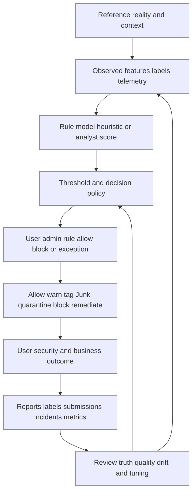
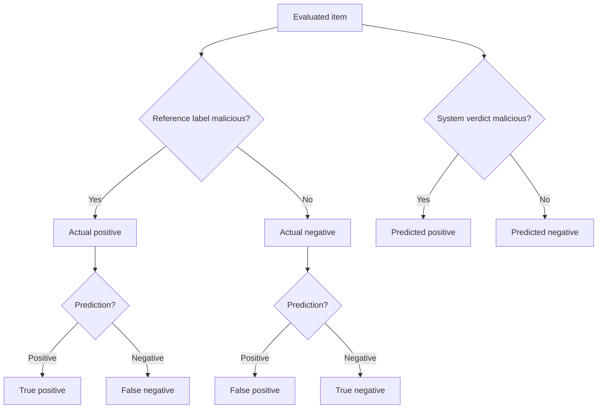
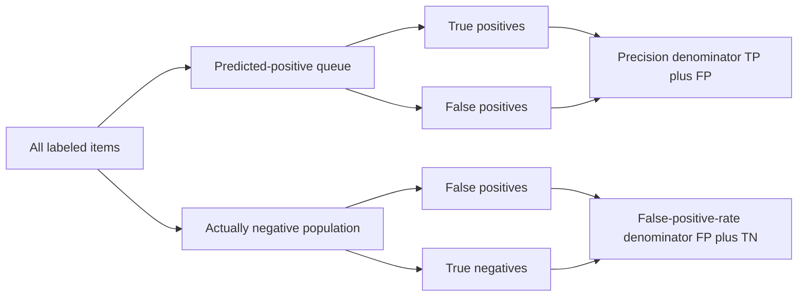
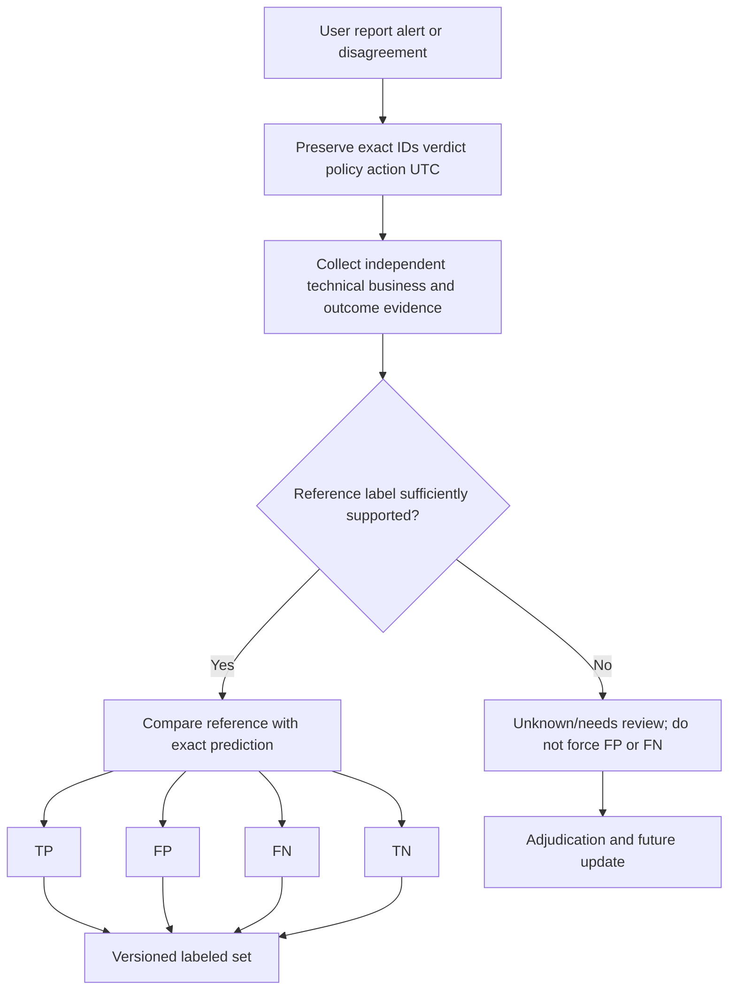
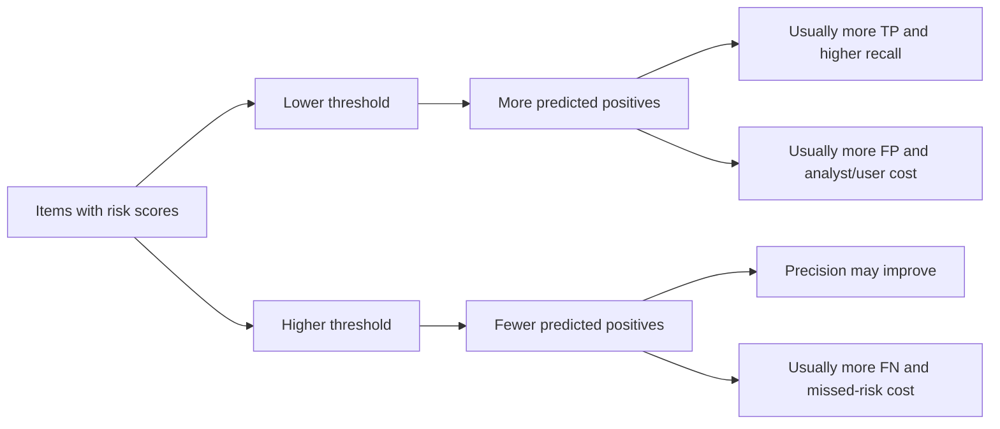
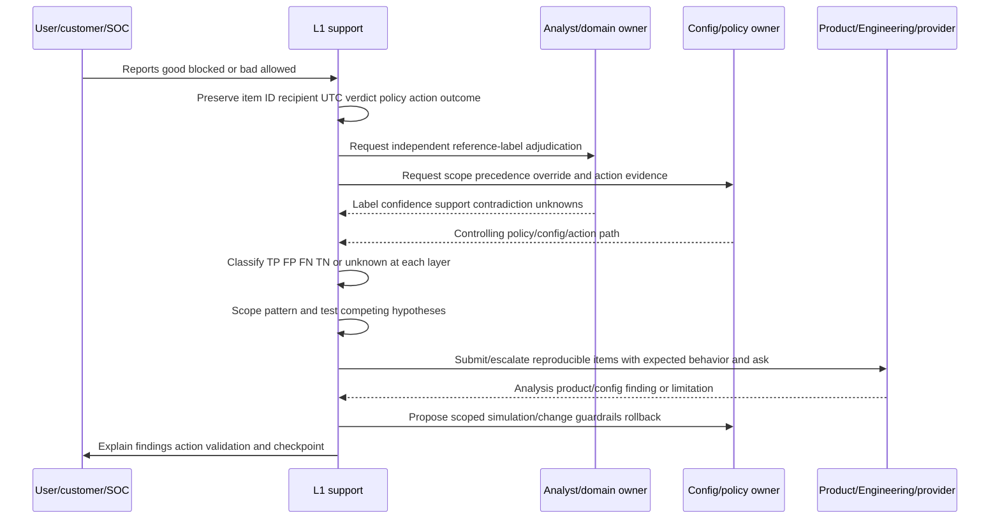
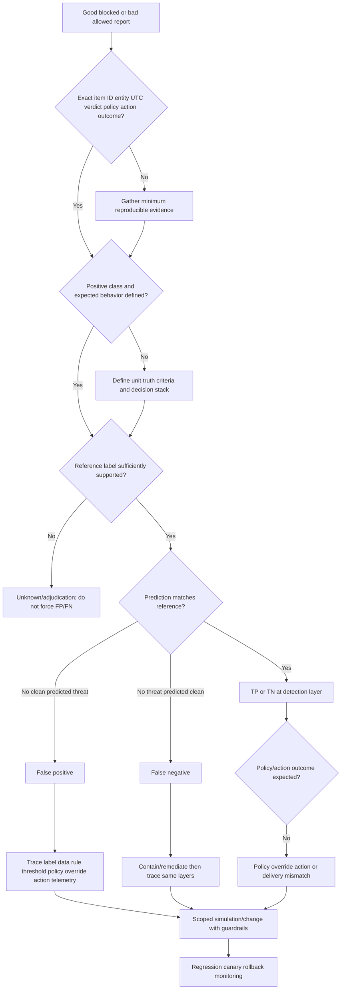
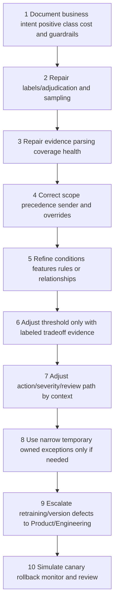

# Part 045 - False Positives False Negatives and Tuning

A security system makes decisions under uncertainty. It may classify an email as malicious, a login as risky, a file transfer as sensitive, or an application action as anomalous. The decision can be correct or wrong. A wrong positive decision is a **false positive**. A wrong negative decision is a **false negative**.

Those definitions sound simple, but support cases are harder. "Positive" must be defined. A reference label must be trustworthy. The exact decision and expected behavior must be known. A clean message quarantined due to an intentional tenant policy can be a correct policy action even when a user calls it a false positive. A malicious message in Junk instead of Inbox may be a correct threat detection but an unsatisfactory workflow. A DLP alert can be correct even if the user had approval; the policy intent may need context. A provider model, local policy, allow/block override, and final action are different layers.

The beginner-first rule is:

> **A false verdict requires a defined positive class, a defensible reference label, an exact observed decision, and an expected behavior contract. Tune the layer that caused the mismatch, then validate both error types.**

This Part covers binary classification, true/false positives/negatives, reference labels, confusion matrices, precision, recall, specificity, false-positive and false-negative rates, accuracy, F-scores, prevalence, thresholds, business cost, policy effects, feedback, exceptions, simulations, canaries, rollback, monitoring, and customer communication. It does not reveal or claim any private vendor model. The lab is offline and synthetic; it changes no model, policy, threshold, allowlist, tenant, or production system.

## Section goal

After completing this Part, you should be able to:

- Define prediction, score, threshold, positive/negative class, reference label, ground truth, true positive, false positive, false negative, true negative, and confusion matrix.
- Explain why customer disagreement, user reports, placement, alert severity, and provider verdict are evidence but not automatically ground truth.
- Separate detection/classification, organization policy, override, action, delivery/placement, and remediation outcomes.
- Calculate precision, recall, specificity, false-positive rate, false-negative rate, accuracy, and $F_1$ from counts.
- Explain the base-rate problem and why high accuracy can hide dangerous misses or overwhelming false alerts.
- Translate false positives and false negatives into user, analyst, security, compliance, customer, and business costs.
- Trace an error to labeling, data/coverage, model/rule, score/threshold, policy/configuration, exception, action, or telemetry.
- Propose safe tuning through documented intent, offline/simulation evaluation, scoped rollout, guardrails, rollback, and monitoring.
- Avoid broad allowlisting and threshold changes when root cause is sender configuration, policy precedence, label quality, or compromised behavior.
- Produce a synthetic behavioral-verdict investigation and tuning memo with honest limitations.

## JD Mapping

| Role signal | Capability built here | Interview proof |
|---|---|---|
| Behavioral false-positive cases | Defines expected behavior and proves error layer | Verdict investigation memo |
| Threat investigation | Finds and contains false negatives | Miss analysis and response plan |
| Configuration tickets | Traces precedence, scope, actions, and overrides | Decision-path map |
| Product/Engineering collaboration | Supplies labeled examples, versions, metrics, and regression set | Escalation packet |
| Recommendations | Balances security, productivity, workload, and risk | Cost/guardrail analysis |
| Customer trust | Explains uncertainty and tradeoffs without blaming | Customer-safe updates |

Your prior support experience transfers through expected-versus-actual definition, policy and precedence investigation, minimal reproductions, change control, regression validation, and Engineering escalation. The honesty boundary remains: this Part does not establish production ownership of email-security models, DLP tuning, Abnormal AI, or machine-learning operations.

## Candidate honesty note

| Evidence label | Safe claim | Boundary |
|---|---|---|
| **Production transfer** | Applied enterprise support method, customer communication, change validation, and escalation | Not production security-model tuning |
| **Local/public lab** | Calculated metrics and tested synthetic thresholds offline | No live tenant, model, policy, message, data, or system |
| **Learned architecture** | Studied current NIST, Microsoft, and scikit-learn public material | No private product internals |
| **Template only** | Built investigation, exception, rollout, rollback, and monitoring plans | Recommended, not executed |

Safe interview language:

> "I have not tuned Abnormal AI or another security model in production. In an offline synthetic lab I defined reference labels, built confusion matrices, compared threshold and business-cost tradeoffs, and designed guardrails. My production-transfer strength is isolating whether the mismatch comes from evidence, policy, configuration, model decision, override, or action, then validating a scoped owner-approved change."

## The Decision Stack

Do not assume the visible outcome came directly from one model.

| Layer | Question | Possible mismatch |
|---|---|---|
| Reality/reference | What should the item truly be in defined context? | Wrong/ambiguous/stale label |
| Observation/features | What evidence was visible and valid at decision time? | Missing/delayed/corrupt/coverage gap |
| Detector/rule/model | What score/verdict did logic produce? | Classification error or intended behavior |
| Threshold/policy | How was score/context converted into decision? | Wrong threshold, scope, priority, exception |
| Override | Did user/admin/rule/allow/block change the decision? | Unsafe or expired override |
| Action | What happened: allow, warn, Junk, quarantine, block, remediate? | Action differs from intended response |
| Outcome/feedback | What did user/business/security observe later? | Placement/remediation/feedback mismatch |

A detector can classify correctly while a mail-flow rule allows the threat. A detector can classify a message as clean while a local block list rejects it. A user can report wanted bulk as phishing. A model can score correctly but an action threshold can be inappropriate for one high-risk population. Support must locate the controlling layer.

## Core Terms

| Term | Plain meaning | Why it matters | Memory hook |
|---|---|---|---|
| Binary classification | Choosing between two classes | Foundation for four outcomes | Two possible truths, two possible predictions |
| Positive class | The condition being detected | Determines what TP/FP/FN mean | Positive is the target, not "good" |
| Negative class | Absence of target condition | Forms comparison population | Negative means not target |
| Prediction/verdict | Class assigned by system | Compared with reference label | Prediction is system answer |
| Score | Numeric ordering/confidence/risk signal | Threshold may convert it into a class | Score ranks; threshold decides |
| Threshold | Decision boundary applied to score | Moves FP/FN tradeoff | Boundary changes decisions |
| Reference label | Best available external judgment of actual class | Needed to call prediction true/false | Label is comparison answer |
| Ground truth | Ideal correct reality; often approximated by labels | Real investigations have uncertainty | Truth may be expensive or delayed |
| True positive (TP) | Positive prediction, actually positive | Correct detection | Found real target |
| False positive (FP) | Positive prediction, actually negative | Unnecessary action/noise | Alarm on clean item |
| False negative (FN) | Negative prediction, actually positive | Missed threat/risk | Missed real target |
| True negative (TN) | Negative prediction, actually negative | Correct quiet outcome | Correctly left clean item alone |
| Prevalence/base rate | Fraction actually positive in population | Changes interpretation of precision | How common is target? |
| Calibration | Whether scores/probabilities correspond to observed frequencies | A 0.8 score need not mean 80% unless calibrated/defined | Score meaning needs evidence |
| Drift | Data/behavior/relationship changes over time | Performance can decay | Normal changes |

## 🔍 Plain-English deep-dive: Positive Does Not Mean Good

In a medical test, "positive" means the condition being tested for is present. That condition may be undesirable. In security, if the target class is **malicious email**, a positive verdict means malicious. A false positive is therefore clean email predicted malicious. A false negative is malicious email predicted clean.

If the target changes to **legitimate email**, the terms reverse. Now a positive means legitimate, and a false positive would be malicious mail incorrectly predicted legitimate. This is why a metric report without a named positive class can be dangerously ambiguous.

Before using TP/FP/FN/TN, write:

- unit of evaluation: message, URL, account, event, user-day, file, alert, or campaign;
- positive class: exactly what condition counts as positive;
- reference-label definition and source;
- prediction/verdict definition and time;
- population, UTC window, and exclusions;
- action/outcome, separately from verdict.

The medical analogy stops being accurate because security labels can change as new intelligence appears, multiple classes can apply to one item, adversaries adapt, and organization policies can intentionally act beyond a detector's class.

**Memory hook:** Name the positive class before naming the error.

## Confusion Matrix

For this Part, define positive as **actual malicious email**, and predicted positive as **system says malicious**.

| | Actual malicious (positive) | Actual clean (negative) |
|---|---:|---:|
| Predicted malicious (positive) | True positive (TP) | False positive (FP) |
| Predicted clean (negative) | False negative (FN) | True negative (TN) |

### Four support narratives

| Outcome | Security example | Support priority |
|---|---|---|
| TP | Phishing correctly quarantined | Validate response/scope; reduce user impact |
| FP | Clean invoice incorrectly quarantined as phishing | Restore safely, find decision layer, prevent recurrence |
| FN | Phishing delivered as clean | Contain/remediate, scope similar items/users, improve prevention |
| TN | Clean business email delivered normally | Guardrail during tuning |

## Metrics From Counts

Let $N = TP + FP + FN + TN$.

| Metric | Formula | Plain meaning | Main caution |
|---|---|---|---|
| Precision | $\frac{TP}{TP+FP}$ | Of positive predictions, how many were truly positive? | Changes with prevalence and label quality |
| Recall/sensitivity/TPR | $\frac{TP}{TP+FN}$ | Of actual positives, how many were found? | Says nothing about FP volume |
| Specificity/TNR | $\frac{TN}{TN+FP}$ | Of actual negatives, how many were correctly left negative? | High value can coexist with many FPs at scale |
| False-positive rate | $\frac{FP}{FP+TN}$ | Of actual negatives, how many were incorrectly positive? | Not the same as $1-\text{precision}$ |
| False-negative rate | $\frac{FN}{FN+TP}$ | Of actual positives, how many were missed? | Equals $1-\text{recall}$ |
| Accuracy | $\frac{TP+TN}{N}$ | Fraction of all decisions correct | Misleading for rare threats |
| $F_1$ | $2\frac{PR}{P+R}$ | Harmonic balance of precision and recall | Ignores TN and equalizes P/R |
| $F_\beta$ | $(1+\beta^2)\frac{PR}{\beta^2P+R}$ | Weights recall more if $\beta>1$ | Weight must reflect business objective |

Where $P$ is precision and $R$ is recall in the F-score formulas.

### Worked arithmetic

Suppose a labeled sample has:

- $TP=80$
- $FP=20$
- $FN=20$
- $TN=880$

Then:

$$
\text{Precision}=\frac{80}{80+20}=0.80=80\%
$$

$$
\text{Recall}=\frac{80}{80+20}=0.80=80\%
$$

$$
\text{Specificity}=\frac{880}{880+20}\approx97.78\%
$$

$$
\text{Accuracy}=\frac{80+880}{1000}=96\%
$$

The system has 96% accuracy, but it misses one in five threats. Whether that is acceptable depends on target, severity, controls, review capacity, and business context.

## 🔍 Plain-English deep-dive: Precision and False-Positive Rate Use Different Waiting Rooms

Imagine a hospital with two waiting rooms. The first contains everyone the triage desk sent for urgent testing. Asking "how many people in this urgent-testing room truly have the condition?" resembles **precision**: start with predicted positives, then measure how many are true positives.

The second waiting room contains everyone who truly does not have the condition. Asking "how many healthy people were incorrectly sent for urgent testing?" resembles the **false-positive rate**: start with actual negatives, then measure how many became false positives.

The same $FP$ count appears in both metrics, but the denominators differ:

$$
	ext{Precision}=\frac{TP}{TP+FP}
$$

$$
	ext{False-positive rate}=\frac{FP}{FP+TN}.
$$

Precision answers an **alert-queue question**: if an analyst opens a positive alert, how often is the target actually present? False-positive rate answers a **clean-population disruption question**: among all truly clean items, how often does the system raise a positive decision incorrectly?

In rare-event security, the actual-negative population can be enormous. A low false-positive rate can therefore produce many false alerts, and those false alerts can dominate the predicted-positive queue, producing modest precision. Neither metric contradicts the other.

Do not say "the false-positive rate is 20%" when you mean "20% of alerts are false." The latter means $FP/(TP+FP)$, which is $1-\text{precision}$, often called the false discovery proportion/rate under stated definitions. Always write the formula or denominator.

The waiting-room analogy stops being accurate because security items can have multiple labels, decisions can be correlated by campaign, labels can be uncertain, and downstream automation can process alerts without one human per item.

**Memory hook:** Precision starts in the alert queue; FPR starts in the actually clean population.

## 🔍 Plain-English deep-dive: Accuracy Can Look Excellent While the Security System Does Nothing Useful

Imagine 100,000 messages where only 100 are malicious, a prevalence of 0.1%. A useless classifier that labels every message clean produces:

- $TP=0$
- $FN=100$
- $FP=0$
- $TN=99{,}900$

Its accuracy is:

$$
\frac{99{,}900}{100{,}000}=99.9\%.
$$

Yet recall is zero because it catches no threat. The high number reflects the common clean class, not useful detection.

Now suppose a detector has 95% recall and 99% specificity in that population:

- $TP=95$, $FN=5$
- $TN=98{,}901$, $FP=999$

Precision becomes:

$$
\frac{95}{95+999}\approx8.68\%.
$$

The detector finds most threats but generates about ten false alerts per true threat. This does not mean it is bad; automation, downstream controls, ranking, severity, and analyst capacity matter. It does mean "95% recall and 99% specificity" is insufficient for operational planning without prevalence and volume.

The rare-disease analogy often used for base rates stops being accurate because adversaries adapt, events are correlated, campaigns cluster, and security systems combine layers rather than independent tests.

**Memory hook:** In rare-event security, a tiny false-positive rate can create a large queue.

## Reference Labels and Ground Truth

Ground truth can be delayed or incomplete. A URL may be benign at delivery and weaponized later. A sender may be compromised. A DLP event may be approved. A user may report spam as phishing. An analyst may disagree with another analyst.

| Label source | Strength | Limitation |
|---|---|---|
| Confirmed incident/impact | Strong behavioral outcome | Only available for subset; can be late |
| Multi-source technical investigation | Rich, reproducible evidence | Time/skill/cost; coverage gaps |
| Human expert adjudication | Context-sensitive | Subjectivity and disagreement |
| Business/data owner confirmation | Establishes workflow authority | Does not establish technical safety alone |
| Provider submission/analysis | Independent product evidence | Provider scope/latency/privacy; can be disputed |
| User report | Valuable intent/wantedness signal | User can confuse spam/phishing/legitimate |
| Existing model verdict | Scalable weak label | Circular if used as truth for same model |
| Blocklist/reputation | Useful historical signal | Stale, broad, or context-limited |
| Synthetic fixture | Controlled and safe | May not represent production distribution |

### Label-quality fields

- item/entity ID and immutable sample reference;
- label taxonomy/version and positive class;
- label source(s), owner, and UTC decision time;
- evidence supporting and contradicting label;
- confidence and unresolved ambiguity;
- adjudication/review history;
- item state at evaluation time;
- privacy/redaction/retention constraints;
- whether label is safe for metrics, regression, or only investigation.

Do not silently rewrite old results using future knowledge. Maintain **as-of-time** and **retrospective** labels when the distinction matters.

## Expected Behavior Contract

An item can be correctly classified but handled incorrectly. Define expected behavior across the stack.

| Contract field | Example |
|---|---|
| Unit | One inbound message-recipient pair |
| Positive class | Credential phishing at delivery time |
| Reference | Analyst-adjudicated label using stated sources |
| Detector output | Threat score and class, version X |
| Decision threshold | Quarantine at score $\ge 0.80$ for standard users |
| Policy scope | Standard users; executives use $\ge 0.70$ |
| Overrides | No broad allow; approved simulation handling only |
| Action | Quarantine and alert; high-confidence response workflow |
| Expected user outcome | No Inbox delivery; notification per policy |
| Validation window | Comparable traffic for seven days plus regression set |

Without this contract, "should have been blocked" could mean model class, tenant policy, user list, post-delivery remediation, or business preference.

## Error Taxonomy Beyond the Model

| Error family | False-positive example | False-negative example |
|---|---|---|
| Label error | Clean item mislabeled malicious | Threat mislabeled clean |
| Data/coverage error | Missing relationship context makes vendor look new | Missing URL/body/session evidence hides threat |
| Feature/parsing error | Invoice word over-weighted | QR/image/attachment not extracted |
| Rule/model error | Benign pattern matches rule | Novel threat pattern not recognized |
| Threshold error | Score just below safe context still blocked | Risky score just below action boundary allowed |
| Policy scope/precedence | Strict policy affects unintended users | Intended users excluded from protection |
| Override/exception | Broad allow lets clean-looking classification bypass controls | Block entry catches legitimate partner |
| Action/delivery | Correct clean verdict moved to Junk by user rule | Correct threat verdict not remediated due failure |
| Feedback/telemetry | Duplicate events inflate FP count | Missing reports hide FN count |
| Workflow/expectation | Approved DLP transfer called false alarm | User calls actual phishing "wanted" |

## Thresholds and Tradeoffs

Suppose higher score means more likely positive. Predict positive when score $\ge t$.

"Usually" matters. Real curves can be irregular on small/biased samples. Precision is not guaranteed to increase monotonically at every threshold. Score calibration and distribution can change.

### Threshold is only one tuning lever

| Lever | Use when | Risk |
|---|---|---|
| Policy intent | Desired outcome unclear | Tuning symptoms without purpose |
| Label/adjudication | Ground truth inconsistent | Optimizing to bad labels |
| Scope | Wrong users/resources/traffic | Protection gaps or unnecessary disruption |
| Conditions/features | Context missing/overbroad | Overfit rules; hidden interactions |
| Data/source health | Missing/stale evidence | False confidence in threshold |
| Threshold | Score ordering useful but operating point wrong | FP/FN tradeoff shifts globally |
| Action | Same verdict needs different response | May hide detection issue |
| Exception | Narrow stable authorized case | Bypass abuse, expiry/ownership debt |
| Sender/config fix | External system causes repeat mismatch | Requires other owner/time |
| Model retraining/version | Systematic generalization/behavior issue | Engineering/model governance required |

## 🔍 Plain-English deep-dive: A Threshold Is a Thermostat, Not a Repair Technician

A thermostat decides when heating starts based on measured temperature. Lowering the setpoint changes how often heat runs. It does not repair a broken sensor, open window, undersized furnace, or incorrect room assignment.

A security threshold changes how scores become decisions. It cannot fix:

- wrong reference labels;
- missing evidence or parser failure;
- incorrect policy scope/precedence;
- unsafe broad allow/block entries;
- a sender's broken authentication;
- a user rule moving mail;
- an action/remediation failure;
- a compromised trusted account;
- a changed business workflow requiring context.

Changing the threshold when another layer is broken can move errors rather than solve them. Diagnose first, then use a threshold only if the score distribution and objective support it.

The analogy stops being accurate because security decisions can involve multiple models/rules/classes, adaptive adversaries, unequal costs, and different thresholds/actions by context.

**Memory hook:** Threshold moves the boundary; it does not repair upstream evidence or downstream action.

## Business Cost and Capacity

| False-positive cost | False-negative cost |
|---|---|
| Delayed invoice/contract/alert | Credential theft, fraud, malware, exfiltration |
| Lost productivity and user trust | Incident response and recovery |
| Analyst queue and alert fatigue | Customer/employee/data harm |
| Unnecessary quarantine/containment | Regulatory/contractual exposure |
| Unsafe workarounds and bypass pressure | Reputation and business interruption |
| Support cases and escalation | Loss of confidence in protection |

A simple expected-cost model is:

$$
\text{Total error cost}(t)=C_{FP}\cdot FP(t)+C_{FN}\cdot FN(t),
$$

where $C_{FP}$ and $C_{FN}$ are context-specific cost weights. This is a planning model, not money truth. Costs can be non-linear: one missed critical BEC can dominate thousands of routine false alerts; ten duplicate FPs may cost less than ten distinct high-touch cases.

Add constraints:

- analyst review capacity per hour/day;
- maximum acceptable miss rate for critical classes;
- latency and user-impact limits;
- subgroup/persona constraints;
- security controls downstream/upstream;
- legal/privacy/business risk tolerance;
- rollback and monitoring ability.

## Precision, Recall, and Operating Context

| Question | Metric/evidence |
|---|---|
| How trustworthy is a positive alert queue? | Precision plus severity/label quality |
| How many actual threats are found? | Recall |
| How much clean traffic stays quiet? | Specificity |
| How many clean items are alerted? | FP count and FPR |
| How many threats are missed? | FN count and FNR |
| Can analysts process alerts? | Predicted-positive volume, time/alert, backlog/SLA |
| Are scores meaningful? | Calibration/reliability analysis where available |
| Are rare/high-cost classes protected? | Per-class/per-segment metrics and worst cases |

$F_1$ can summarize precision/recall but does not know business cost, true negatives, severity, or analyst capacity. Do not optimize one metric in isolation.

## Prevalence and Dataset Shift

Metrics depend on the evaluated population.

| Shift | Example | Consequence |
|---|---|---|
| Prevalence shift | Attack campaign increases threat proportion | Precision can change even at same TPR/FPR |
| Sender/relationship shift | New vendor/customer acquisition | New-relationship signals change |
| Seasonal shift | Payroll/tax/event periods | Normal volume/content changes |
| Adversarial shift | New lure/QR/attachment technique | Recall can fall |
| Policy shift | New strict preset/group scope | Visible outcomes change without model change |
| Label shift | Taxonomy/adjudication changes | Metrics across versions not directly comparable |
| Instrumentation shift | Parser/log source/retention changes | Apparent error rate may change |

Part 055 covers drift deeply. Here, always record dataset source, sampling method, time, prevalence, segments, label version, and product/policy versions.

## Investigation Workflow

### Step 1: Name the disputed outcome

Good blocked, bad allowed, wrong severity, wrong folder, late remediation, duplicate alert, or policy-tip mismatch are different symptoms.

### Step 2: Preserve exact evidence

Record immutable item/message/event IDs, recipient/entity, UTC, raw verdict/score if exposed, detector/policy/action/override, delivery/location, versions, and customer expectation. Preserve content only through authorized minimum handling.

### Step 3: Define the positive class and contract

Write the unit, positive condition, reference criteria, prediction, expected policy/action, scope, and time. If these are unresolved, classification remains unknown.

### Step 4: Establish the reference label

Use independent technical evidence, domain/business owner context, incident outcome, provider analysis, and adjudication. Record confidence and disagreement. Do not train/evaluate against user reports blindly.

### Step 5: Trace the decision stack

Find the controlling detector/rule, score/threshold where visible, tenant/user policy, precedence, allow/block/override, final action, and post-delivery change. Separate as-of-time from current re-analysis.

### Step 6: Scope the pattern

Compare similar and contrasting examples by sender/entity, campaign, recipient persona, policy, data type, channel, version, time, and environment. One item proves one item unless shared mechanism is supported.

### Step 7: Form competing hypotheses

Maintain label error, missing evidence, intended detector behavior, model/rule error, threshold, policy/scope, override, action, telemetry, and changed-workflow hypotheses.

### Step 8: Contain urgent false negatives or restore critical false positives

Use precise owner-approved remediation. A temporary block/allow can mitigate while root cause is investigated, but document expiry, scope, risk, and validation. Do not let workaround become invisible permanent policy.

### Step 9: Tune safely

Prefer root-cause/config/workflow correction. Simulate/shadow candidate policy, compare versioned labeled set and recent representative data, define guardrails, canary scope, rollback, owners, and monitoring.

### Step 10: Validate and close feedback loop

Re-test original, near-neighbor, legitimate, malicious, edge, and subgroup cases. Monitor FP/FN counts/rates, precision/recall, action outcomes, workload, incidents, overrides, and customer impact over stated window.

## Troubleshooting Decision Tree

## Root-Cause Hypotheses

| Hypothesis | Prediction | Contradiction | Cheap discriminating check |
|---|---|---|---|
| Reference label wrong | Independent review changes class | Multiple strong sources agree | Blind second adjudication |
| Missing evidence at decision | Source/parser absent or delayed | Evidence was present and used | Timestamp/source coverage check |
| Intended behavior misunderstood | Documentation/contract says observed result expected | Contract says opposite | Policy intent/version review |
| Policy precedence/scope | Different users/policies differ predictably | Same controlling policy everywhere | Recipient/entity policy trace |
| User/admin override | Override explains allow/block | No matching active override | Exact override/entity/expiry lookup |
| Threshold operating point | Errors cluster near boundary and score ranking useful | Errors across score range | Labeled score distribution |
| Rule/model systematic pattern | Similar feature/relationship cases fail | Contrasting near-neighbors correct | Minimal cohort analysis |
| Sender/config defect | Auth/routing/content pattern explains FP | Healthy comparable sender fails too | Header/config comparison |
| Action/remediation failure | Verdict correct; action absent/late | Action completed as expected | Action/audit/delivery trace |
| Logging/duplication | Counts differ by IDs/aggregation | Unique event mapping consistent | Deduplicate immutable IDs |
| Environment drift | Error starts after traffic/business change | Distribution stable | Before/after segment comparison |
| Adversarial adaptation | Novel pattern in confirmed FNs | Same pattern detected | Campaign feature comparison |

## Safe Tuning Hierarchy

This is a reasoning order, not a universal implementation recipe. Product ownership and available controls vary.

## Exceptions and Allowlists

An exception changes protection for future traffic. Treat it as code/configuration with risk.

| Exception field | Required question |
|---|---|
| Exact mechanism | Sender+infrastructure, URL path, file hash, app, recipient group, rule condition? |
| Justification | Which validated business workflow needs it? |
| Threat boundary | Which protections remain active? |
| Scope | Smallest entities, users, data, time, and environment? |
| Owner | Who approves and reviews? |
| Expiry | Automatic end/date/condition? |
| Monitoring | What usage and abuse signals are watched? |
| Rollback | How is it removed; what if business breaks? |
| Root correction | Which sender/policy/product fix makes it unnecessary? |
| Validation | Which clean and malicious near-neighbor tests pass? |

Microsoft's current public submissions documentation shows that allow/block entries can override entity-associated filters and have expiry/behavior details. That makes them controlled mitigations, not harmless labels. Prefer fixing sender authentication, routing, policy, or detector cause over a broad permanent allow.

## Simulation, Shadow, Canary, and Rollback

| Stage | Purpose | Evidence |
|---|---|---|
| Offline replay | Compare candidate decisions on versioned labeled fixtures | Metrics and per-item deltas |
| Simulation/shadow | Observe candidate policy without intended enforcement | Representative matches/actions that would occur |
| Canary | Apply to limited authorized scope | User/security impact in production-like context |
| Staged rollout | Expand after gates pass | Segment metrics and incident/queue guardrails |
| Full rollout | Controlled broad adoption | Stable outcomes against baseline |
| Rollback | Restore known state if guardrail fails | Reversion time and recovered outcomes |

Microsoft Purview public guidance describes simulation as running a policy as if enforced without actual enforcement, with separate results, and recommends it for reducing false positives before production changes. Product-specific simulation coverage and retention must be recorded.

### Change record

- hypothesis and root-cause evidence;
- exact old/new configuration or candidate version;
- affected population and exclusions;
- baseline counts/rates/volumes and metric definitions;
- labeled regression set version;
- expected FP/FN/action/workload change;
- security and business guardrails;
- owner/approver/change window;
- rollback trigger/method;
- observation window and checkpoint;
- residual risk and unknowns.

## Worked Example 1: Legitimate Partner Invoice Quarantined

### Inputs

- Exact message/recipient/UTC and headers preserved.
- Independent business owner confirms a real invoice and relationship.
- Authentication and sender infrastructure are valid for reviewed message.
- Detector category shows impersonation; quarantine action follows policy.
- Similar messages began after partner changed sending service.

### Reasoning

At the defined malicious-positive detection layer, the item is a false positive if clean label is sufficiently supported. The pattern suggests changed infrastructure/relationship context, not an automatic case for lowering all impersonation protection. Compare known-good history, current sender/infrastructure pair, reply/payment details, and near-neighbor malicious impersonation. Ask partner to correct configuration where applicable; use a narrow owner-approved temporary mechanism only if business urgency requires it.

### Validation

Original and comparable legitimate messages follow expected path; a lookalike sender and altered payment request remain blocked; exception expires; no broader domain/path bypass exists; customer impact and FP recurrence decline.

## Worked Example 2: Credential Phish Delivered as Clean

### Inputs

- User reports exact delivered message.
- Safe handling confirms credential-harvesting destination and campaign.
- Initial verdict was clean and no local allow/rule explains delivery.
- Similar messages reached 14 recipients; two interacted.

### Reasoning

This is a false negative at the malicious-positive detection layer, subject to the evidence and as-of-time label. Immediate priority is containment/remediation: remove/scope campaign, assess users, identity/session/resource effects, and precise indicators. Then determine missing/novel evidence, timing, detector/version, and provider submission. Do not wait for aggregate tuning analysis before user-risk response.

### Validation

Campaign no longer reaches users; affected identities/resources are handled; the exact and safe near-neighbor regression fixtures become positive; unrelated legitimate traffic remains unaffected; root-cause/product response is tracked.

## Worked Example 3: Correct DLP Alert, Wrong Workflow Expectation

### Inputs

- DLP detects restricted data sent to an external approved customer.
- Policy is configured to alert on every external transfer but not block.
- Data owner confirms transfer is authorized.
- Customer calls alert a false positive.

### Reasoning

The content/context match and alert can be a true positive for **external sensitive-data transfer** while the activity is business-authorized. It is not necessarily a false positive. The mismatch is policy intent/workflow context: should approved customers be separately recognized, should alerts aggregate, or should approval/justification enrich triage? Define positive class before changing labels.

### Validation

Approved transfer remains visible but routes with expected severity/context; unapproved external destinations still alert/block per intent; metrics do not relabel all authorized transfers as classifier errors.

## Monitoring After Change

| Monitor | Why |
|---|---|
| TP/FP/FN/TN counts and rates | Core decision quality |
| Precision/recall by class/segment | Avoid average hiding vulnerable group |
| Predicted-positive volume | Analyst/action capacity |
| User reports and disputes | Feedback and expectation shifts |
| Overrides/exceptions usage | Bypass debt and abuse |
| Quarantine/release/remediation outcomes | Downstream action quality |
| Incident severity/impact | Business-weighted misses |
| Label agreement/unknown rate | Reference quality |
| Score distribution near boundary | Operating-point stability |
| Data/feature/traffic changes | Drift and instrumentation |
| Latency/backlog/SLA | Operational feasibility |
| Customer/productivity impact | False-positive cost |

Use rates and counts together. A stable FPR can produce more cases after traffic doubles. A better average can hide one critical class regression.

## Customer Communication Templates

### Under investigation

> "We are separating the reference label, original detection verdict, tenant/user policy and overrides, final action, and observed outcome for the exact item. The report is valid evidence, but `false positive/false negative` will be assigned only after the positive class and expected behavior are confirmed. Next checkpoint: `[UTC]`."

### Confirmed false positive

> "Independent review supports that `[item/case scope]` was legitimate at the relevant time, while the detection layer classified it as `[positive class]`; this is a false positive in the stated scope. `[Temporary restoration/mitigation]` is owned by `[owner]`. Root-cause review focuses on `[evidence/configuration/pattern]`; any change will be tested against legitimate and malicious guardrails."

### Confirmed false negative

> "Evidence supports that `[item/campaign]` was `[malicious/risky class]` while the original decision allowed/classified it negative; this is a false negative in the stated scope. Containment and user/resource assessment are `[status]`. Similar-item scope, policy/override path, provider/Product analysis, and prevention validation are in progress."

### Correct detection, policy mismatch

> "The detector's class is supported by the defined rule/reference, but `[policy/override/action/placement]` produced an outcome different from the agreed business expectation. We are treating this as a configuration/workflow mismatch rather than a model false verdict. The proposed change is scoped to `[population/context]` with `[security guardrails/rollback]`."

## Common Failure Modes

| Failure | Why it fails | Better behavior |
|---|---|---|
| User disagreement equals FP | User reports may express preference or incomplete context | Adjudicate reference and contract |
| Delivered threat always means FN | Policy override/action can allow correct positive verdict | Trace stack |
| Quarantined clean always model FP | Local policy/block may cause outcome | Find controlling layer |
| Undefined positive class | TP/FP/FN/TN can reverse | Name target first |
| Accuracy only | Rare class can be entirely missed | Use confusion counts, precision, recall, costs |
| Rates without counts | Small rates at scale overwhelm | Report both |
| Metrics without population/time | Prevalence and drift make comparison invalid | Version dataset/window/segments |
| Treat provider verdict as immutable truth | Evidence can change; disputes exist | Preserve as one source/adjudicate |
| Lower threshold after one miss | Creates unknown FP/workload impact | Evaluate cohort/guardrails |
| Raise threshold after one FP | Creates unknown misses | Fix exact cause/simulate |
| Broad permanent allow | Can skip protections for future changed content | Narrow/temporary/owned/root fix |
| Optimize $F_1$ blindly | Ignores TN, severity, cost, capacity | Use business constraints |
| Test only original sample | Overfits workaround | Use near-neighbor regression set |
| No rollback/monitoring | Silent regressions persist | Define gates/checkpoints |
| Use future label as past certainty | Hides as-of-time behavior | Preserve temporal labels |

## Escalation Triggers and L1 Boundaries

Escalate when:

- confirmed/suspected false negatives involve phishing, malware, fraud, account compromise, exfiltration, or user impact;
- a false-positive pattern blocks critical, regulated, safety, identity, payroll, or customer workflows;
- errors affect many entities, tenants, policies, campaigns, classes, or regions;
- reference labels are disputed or require privileged/domain/legal review;
- model/rule behavior is reproducible after config/override/action causes are excluded;
- a threshold/exception change materially changes security posture;
- private score/feature/model evidence or retraining is required;
- data/telemetry/parser/coverage degradation is suspected;
- remediation/action does not match verdict/policy;
- metrics/regression behavior differs across vulnerable/high-risk segments.

L1 should not:

- claim private model internals or change model thresholds/retraining without ownership;
- mark items clean/malicious from user preference alone;
- release/allow/block/change policy broadly without authorization;
- submit/upload customer evidence outside approved privacy process;
- promise zero false positives or zero false negatives;
- optimize one metric without business/security guardrails;
- delay urgent false-negative containment while debating labels;
- call a policy disagreement a model defect without tracing the decision stack.

## Escalation Packet

| Section | Required content |
|---|---|
| Symptom | Good blocked, bad allowed, wrong severity/action/placement, pattern |
| Exact seeds | Item/message/event/submission IDs, recipients/entities, UTC |
| Positive class/contract | Unit, truth criteria, expected verdict/policy/action/outcome |
| Reference labels | Source, evidence, confidence, adjudication, temporal state |
| Decision stack | Score/verdict where exposed, version, policy/scope/priority, override, action |
| Scope | Counts, segments, campaigns, time, environments, coverage |
| Confusion evidence | TP/FP/FN/TN or case set with unknowns |
| Hypotheses | Support, contradiction, discriminating checks |
| Customer/business cost | Security, productivity, analyst load, severity |
| Mitigation | Exact scope, owner, expiry, residual risk |
| Proposed tuning | Candidate layer/change; simulation/canary/gates |
| Regression set | Legitimate, malicious, edge, near-neighbor, subgroup fixtures |
| Rollback/monitoring | Trigger, method, metrics, window, checkpoint |
| Ask | Exact analysis, defect, data, decision, fix, or documentation needed |

## Safe Synthetic Lab: The Two-Error Tuning Observatory

### Objective

Build an offline behavioral-verdict investigation and tuning memo using a synthetic scored dataset. Define the positive class, calculate confusion matrices/metrics/costs at candidate thresholds, distinguish policy/model/outcome errors, and propose a safe change with guardrails. Perform no live action.

The unique lab name is **The Two-Error Tuning Observatory**.

### Prerequisites

- Local Markdown editor, spreadsheet, or hand calculator.
- This Part and fixtures below.
- No tenant, email, DLP, model, API, script, package, notebook, browser, public service, or network access.
- Synthetic IDs ending `-045`; reserved domains end `.invalid`.
- Label artifact **local/public lab - synthetic offline verdict records only**.

### Authorized scope

Authorized:

- Copy fixtures locally and calculate manually/offline.
- Define labels, metrics, costs, hypotheses, candidate change, regression, communication, and monitoring.
- Mark NIST/Microsoft/scikit-learn concepts **learned architecture**.
- Mark policy/model/exception/change actions **template only**.

Prohibited:

- Sending/submitting/releasing/quarantining/allowing/blocking any real message/item.
- Signing into or changing a tenant, policy, threshold, model, rule, scope, exception, list, action, or feedback system.
- Uploading data to provider, public AI, scanner, notebook service, or metric tool.
- Using real users, senders, domains, messages, labels, scores, incidents, customers, or production metrics.
- Executing code or installing packages for this lab.

### Synthetic fixtures

Positive class: `confirmed-malicious-045`. Predict positive when `score >= threshold`.

| ID | Score | Reference label | Context note |
|---|---:|---|---|
| T01-045 | 0.95 | Positive | Credential lure fixture |
| T02-045 | 0.88 | Positive | Malicious attachment fixture |
| T03-045 | 0.76 | Positive | Vendor-fraud fixture |
| T04-045 | 0.63 | Positive | New QR lure fixture |
| T05-045 | 0.42 | Positive | Compromised trusted sender fixture |
| C01-045 | 0.91 | Negative | Approved payroll alert fixture |
| C02-045 | 0.82 | Negative | New legitimate vendor invoice fixture |
| C03-045 | 0.71 | Negative | Approved security simulation fixture |
| C04-045 | 0.58 | Negative | Wanted bulk notification fixture |
| C05-045 | 0.37 | Negative | Ordinary external reply fixture |
| C06-045 | 0.20 | Negative | Internal workflow fixture |
| C07-045 | 0.05 | Negative | Routine notification fixture |

Expected calculations:

| Threshold | TP | FP | FN | TN | Precision | Recall | Predicted-positive volume |
|---:|---:|---:|---:|---:|---:|---:|---:|
| 0.50 | 4 | 4 | 1 | 3 | 50.0% | 80.0% | 8 |
| 0.70 | 3 | 3 | 2 | 4 | 50.0% | 60.0% | 6 |
| 0.85 | 2 | 1 | 3 | 6 | 66.7% | 40.0% | 3 |

Synthetic planning weights: $C_{FP}=2$ units and $C_{FN}=20$ units.

| Threshold | Error-cost calculation | Total cost units |
|---:|---|---:|
| 0.50 | $4\times2 + 1\times20$ | 28 |
| 0.70 | $3\times2 + 2\times20$ | 46 |
| 0.85 | $1\times2 + 3\times20$ | 62 |

The weights are a teaching fixture, not production risk valuation. The small dataset is deliberately irregular and insufficient to claim model quality.

Decision-stack fixtures:

| Case | Detector prediction | Policy/action | Actual support issue |
|---|---|---|---|
| P01-045 | Clean, correctly | User blocked sender | Wrong folder/action, not model FP |
| P02-045 | Malicious, correctly | Broad allow delivered | Policy false negative outcome; detector TP |
| P03-045 | Sensitive transfer, correctly | Alert only; owner approved | True policy match, workflow triage issue |
| P04-045 | Clean, incorrectly malicious | Quarantine | Detector FP candidate |
| P05-045 | Malicious, incorrectly clean | Inbox | Detector FN candidate |

### Steps

1. Create `The Two-Error Tuning Observatory`; record UTC start and evidence label.
2. Copy fixtures exactly; do not use real data or run code.
3. Write the unit, positive class, reference-label criteria, decision rule, expected action, population, and limitations.
4. Draw the decision stack for P01-P05 and identify detector, policy, override, action, and outcome separately.
5. Hand-classify T01-C07 into TP/FP/FN/TN at thresholds 0.50, 0.70, and 0.85.
6. Calculate precision, recall, specificity, FPR, FNR, accuracy, and $F_1$ for each threshold; show formulas and counts.
7. Confirm or correct the supplied expected calculations; record any discrepancy before continuing.
8. Calculate synthetic weighted error cost and analyst queue volume at each threshold.
9. Explain why the lowest cost in this fixture is not sufficient production evidence.
10. Create at least eight hypotheses across labels, evidence, intended behavior, threshold, scope/precedence, overrides, action, and drift.
11. Add prediction, contradiction, safe offline check, owner, and confidence-changing result for each.
12. Propose a candidate strategy that addresses C01-C04 context before global threshold change; mark template only.
13. Build a regression set containing all 12 scored items plus P01-P05 decision-stack cases and state expected layer outcomes.
14. Define guardrails for T04/T05 misses, C01/C02 business impact, predicted-positive volume, and P02 unsafe override.
15. Write offline replay, simulation, canary, staged rollout, rollback, and monitoring rows; execute none.
16. Write the four customer updates and a Product/Engineering escalation ask.
17. Complete safety/privacy/cleanup and zero-activity attestations.

### Expected evidence

- Exact positive-class and expected-behavior contract.
- Three confusion matrices and metric calculations.
- Threshold/cost/capacity comparison.
- Five decision-stack classifications.
- At least eight testable root-cause hypotheses.
- Context-before-threshold tuning proposal.
- Seventeen-item regression/guardrail set.
- Simulation/canary/rollback/monitoring plan.
- Four customer-safe updates and Engineering ask.
- No-real-data and zero-live-activity attestation.

### Cleanup and privacy

- Confirm all IDs contain `045` and any domains end in `.invalid`.
- Remove accidental real items, people, domains, messages, scores, labels, policies, incidents, customers, screenshots, secrets, or production metrics.
- Confirm no email/submission, tenant/model/policy/list/threshold/exception/action, code execution, package installation, browser, API, upload, or network activity occurred.
- Delete the artifact if real data cannot be reliably removed.
- Store only the synthetic local artifact if useful.
- Record cleanup time and zero-activity attestation.

### Artifacts

| Artifact | Skill demonstrated | Honest label |
|---|---|---|
| Behavioral-verdict investigation and tuning memo | End-to-end error reasoning | **Local/public lab** |
| Metric/cost/threshold workbook | Quantitative tradeoff | **Local/public lab** |
| Simulation/canary/rollback plan | Safe change design | **Template only** |
| NIST/Microsoft/scikit-learn map | Current public research | **Learned architecture** |
| Customer/escalation communication | Enterprise support method | **Production transfer** method with **template only** scenario |

## Validation rubric

| Dimension | Fail | Developing | Pass |
|---|---|---|---|
| Definitions | Good/bad only | Names FP/FN | Defines unit, positive class, truth, prediction, action, time |
| Labels | User report is truth | Uses one source | Versioned evidence, confidence, adjudication, temporal state |
| Stack | Outcome equals model | Mentions policy | Traces detector, threshold, scope, override, action, outcome |
| Metrics | Accuracy only | Precision/recall | Counts, rates, prevalence, segments, cost, capacity, limitations |
| Root cause | Change threshold | Checks config | Tests label, data, logic, threshold, policy, override, action, telemetry |
| Tuning | Broad allow/global change | Scoped change | Intent, simulation, guardrails, canary, rollback, monitoring |
| Validation | Original item only | Clean/threat pair | Near-neighbor, edge, subgroup, action, workload regression |
| Honesty | Claims production model tuning | Calls lab production | Preserves four evidence labels and no-live limits |

## Official Source Anchors

All sources were accessed on August 24, 2026 and must be revalidated before production use. The direct NIST AI RMF PDF did not extract through the research tool, so the resolving NIST framework and Playbook pages are cited. A scikit-learn `precision_recall.html` URL returned 404 and was excluded; the current model-evaluation page resolves.

| Official/public source | What it anchors |
|---|---|
| [NIST - AI Risk Management Framework](https://www.nist.gov/itl/ai-risk-management-framework) | Voluntary trustworthy-AI risk management, context, design/use/evaluation, current revision notice |
| [NIST AI RMF Playbook](https://airc.nist.gov/airmf-resources/playbook/) | Govern/Map/Measure/Manage; TEVV, monitoring, drift, risk tolerance, human oversight, continual improvement |
| [Microsoft - Defender submissions for admins](https://learn.microsoft.com/en-us/defender-office-365/submissions-admin) | Current clean/threat/uncertain submissions, policy/override checks, analysis, dispute, allow/block behavior |
| [Microsoft - Resolve email false positives](https://learn.microsoft.com/en-us/defender-office-365/step-by-step-guides/how-to-handle-false-positives-in-microsoft-defender-for-office-365) | Current header/source/root-fix/validation workflow for legitimate mail incorrectly handled |
| [Microsoft - Investigate false-negative malicious email](https://learn.microsoft.com/en-us/defender-office-365/step-by-step-guides/how-to-handle-false-negatives-in-microsoft-defender-for-office-365) | Current user report, triage, mitigation, submission, and prevention workflow |
| [Microsoft - DLP simulation mode](https://learn.microsoft.com/en-us/purview/dlp-simulation-mode-learn) | Isolated policy evaluation, matched items/alerts, coverage, retention, and pre-enforcement tuning |
| [Microsoft - Investigating DLP alerts](https://learn.microsoft.com/en-us/purview/dlp-alert-investigation-learn) | Trigger-notify-triage-investigate-remediate-tune lifecycle and true/false-positive decisions |
| [Microsoft - Design a DLP policy](https://learn.microsoft.com/en-us/purview/dlp-policy-design) | Intent statement, business-to-configuration mapping, conditions, scope, action, documented design |
| [scikit-learn - Metrics and scoring](https://scikit-learn.org/stable/modules/model_evaluation.html#precision-recall-f-measure-metrics) | Current confusion matrix, precision, recall, F-measures, averaging, threshold curves, imbalance cautions |
| [scikit-learn - Confusion matrix API](https://scikit-learn.org/stable/modules/generated/sklearn.metrics.confusion_matrix.html) | Current matrix convention, counts, labels, normalization, per-threshold reference |

## Likely Interview Questions

### Q1. What is a false positive and a false negative?

**Model answer:** First I define the positive class. If positive means malicious email, a false positive is clean mail predicted malicious; a false negative is malicious mail predicted clean. I also separate the detector verdict from policy, overrides, action, and placement, because a bad outcome may not be a model error.

### Q2. What do you need before calling a case a false verdict?

**Model answer:** The evaluation unit, positive class, trustworthy reference label, exact original prediction and time, expected behavior contract, and decision-stack evidence. I preserve label confidence and unknowns. A user report or current reputation is useful evidence but not automatically historical ground truth.

### Q3. Explain precision and recall.

**Model answer:** Precision is $TP/(TP+FP)$: among positive alerts, how many are real. Recall is $TP/(TP+FN)$: among real positives, how many were found. In rare-event security I also need counts, prevalence, specificity/FPR, severity, analyst capacity, and business cost; one metric is not an operating decision.

### Q4. Why can accuracy be misleading in security?

**Model answer:** Threats are often rare. A classifier that calls every message clean can have 99.9% accuracy in a population with 0.1% threats while catching none, so recall is zero. I use the confusion matrix and segment/business metrics instead of accuracy alone.

### Q5. What happens when you lower a malicious-risk threshold?

**Model answer:** More items are usually predicted malicious, so true positives and recall can rise, but false positives and workload can also rise. The exact effect must be measured on representative labeled data. Threshold tuning cannot repair bad labels, missing evidence, wrong scope, unsafe overrides, or failed actions.

### Q6. How do you safely tune a security control?

**Model answer:** Document intent/positive class/cost, repair labels and coverage, isolate the controlling layer, compare candidate changes offline or in simulation, use a versioned regression set, define malicious and legitimate guardrails, canary and stage with owners, set rollback triggers, then monitor counts, rates, action outcomes, workload, and incidents.

### Q7. How do you handle a false negative?

**Model answer:** I prioritize containment and user/resource impact, preserve exact IDs and as-of-time evidence, scope similar items, inspect policy/override/action and detector causes, submit/escalate with a defensible label, implement precise mitigation, and validate the campaign plus legitimate near-neighbors. I do not wait for model tuning before urgent response.

### Q8. What are your L1 boundaries?

**Model answer:** I can define expected behavior, preserve evidence, adjudicate through owners, trace configuration and outcomes, calculate metrics, build hypotheses, communicate, and propose scoped validation. I do not claim private model internals, retrain/change thresholds or broad allows, upload sensitive samples, or promise zero errors without authorized owners and governance.

## 30-Second Memory Hooks

- **Name the positive class before naming the error.**
- **Reference label plus prediction makes true/false.**
- **Verdict, policy, override, action, and outcome are separate.**
- **Precision asks: can I trust positive alerts?**
- **Recall asks: how many real positives did I find?**
- **Accuracy can hide total failure on a rare class.**
- **Rates need counts, population, window, and prevalence.**
- **Threshold moves the boundary; it does not repair the stack.**
- **False negatives demand response before tuning debate.**
- **Simulate, guardrail, canary, rollback, monitor.**

## Completion Checklist

- [ ] I can define binary classification, positive class, labels, scores, thresholds, and TP/FP/FN/TN.
- [ ] I can draw and populate a confusion matrix without reversing axes/classes.
- [ ] I can calculate precision, recall, specificity, FPR, FNR, accuracy, and $F_1$.
- [ ] I can explain the base-rate example and why counts matter.
- [ ] I distinguish detector errors from policy, override, action, placement, and workflow mismatches.
- [ ] I assess reference-label source, confidence, time, disagreement, and privacy.
- [ ] I can list label, evidence, logic, threshold, policy, override, action, telemetry, and drift hypotheses.
- [ ] I can compare FP/FN business cost and analyst capacity without pretending weights are exact money.
- [ ] I use documented intent and root cause before threshold/exception changes.
- [ ] I can define offline/simulation, regression, canary, rollback, and monitoring gates.
- [ ] I completed or can explain the synthetic lab and all limitations aloud.
- [ ] I can answer Q1-Q8 and state my evidence tier honestly.
- [ ] I revalidated official sources and recorded August 24, 2026 as access date.

[Next: Part 046 - Threat Investigation Evidence Preservation and Timelines](Part-046-threat-investigation-evidence-preservation-and-timelines.md)