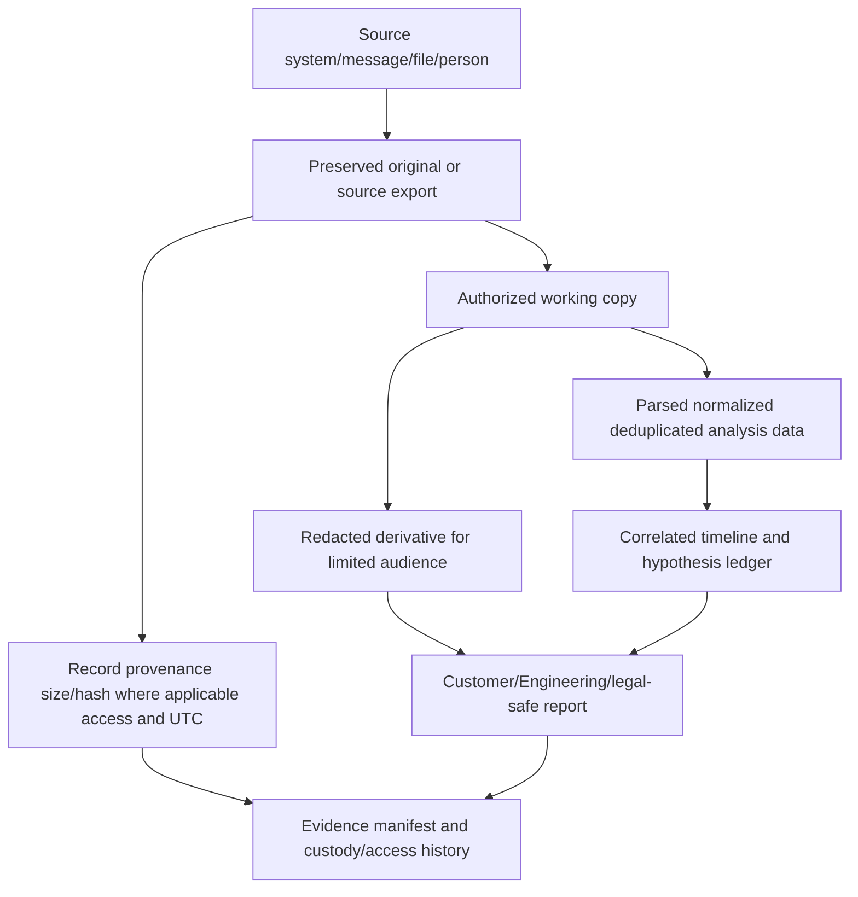
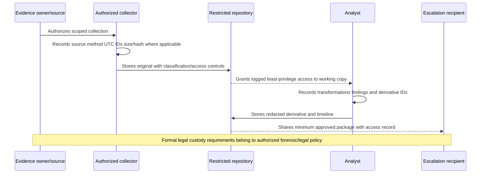
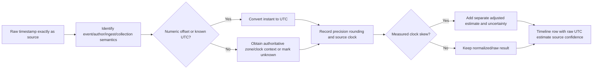
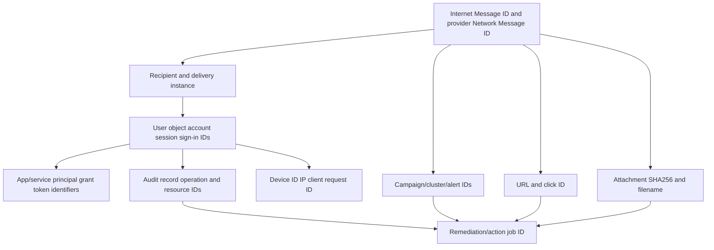
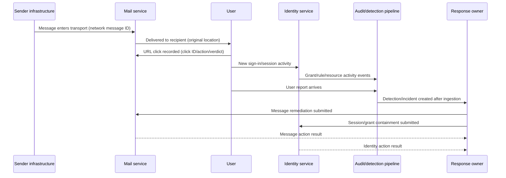
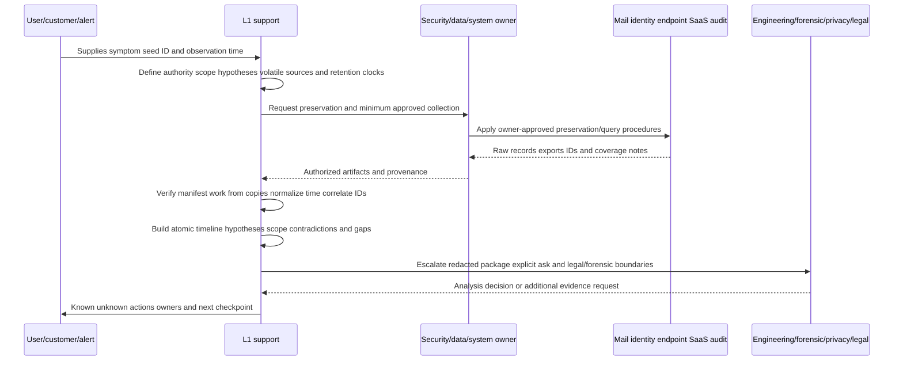
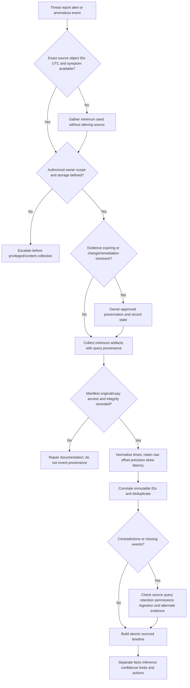

# Part 046 - Threat Investigation Evidence Preservation and Timelines

A threat investigation turns scattered observations into a defensible account of what happened, when, to whom, through which path, with what impact, and with which remaining uncertainties. That account is only as trustworthy as its evidence.

Evidence can disappear, change, be reprocessed, fall outside retention, be hidden by permissions, or be misread. A screenshot can omit IDs and filters. A forwarded email can change headers. A message's `Date` field is not necessarily its transport time. A provider can detect a threat after delivery. An audit record can arrive later than the event. Two systems can report local time in different zones. A timeline sorted without source and time semantics can produce a confident but false story.

The beginner-first rule is:

> **Preserve originals and provenance, work from copies, normalize time without erasing raw time, correlate by exact identifiers, and label every row as observation, owner statement, inference, conclusion, unknown, or coverage limit.**

This Part teaches an incident-support evidence workflow, not legal digital forensics. It covers identification, preservation, collection, examination, analysis, timelines, evidence manifests, integrity checks, chain of custody, privacy, redaction, correlation IDs, time zones, clock skew, ingestion latency, retention, query scope, negative evidence, customer communication, and escalation. The lab is offline and synthetic. It collects no tenant, mailbox, endpoint, file, packet, log, customer, or employee evidence.

## Section goal

After completing this Part, you should be able to:

- Define evidence, artifact, source, provenance, integrity, authenticity, chain of custody, original, working copy, hash, manifest, retention, legal hold, and spoliation at a support-safe level.
- Explain the evidence lifecycle: prepare, identify, preserve, collect, examine, analyze, report, retain, and dispose under policy.
- Preserve raw email, IDs, audit events, telemetry, configuration, user reports, and query metadata without altering originals.
- Distinguish event time, author time, transport time, receipt time, detection time, ingestion time, collection time, and report time.
- Normalize numeric-offset timestamps to Coordinated Universal Time (UTC) while retaining raw values, offset, precision, and conversion method.
- Account for local time, daylight-saving ambiguity, clock skew, rounding, latency, and unknown offsets.
- Correlate message, alert, campaign, click, identity, session, application, file, URL, resource, audit, request, and action IDs.
- Build an atomic-event timeline that separates observations from interpretations and makes gaps visible.
- Use absence of evidence only after documenting query, source, coverage, retention, permissions, latency, and expected event behavior.
- Produce a redacted evidence package and correlated timeline with honest production and legal boundaries.

## JD Mapping

| Role signal | Capability built here | Interview proof |
|---|---|---|
| Complex threat investigation | Correlates email, identity, URL/file, policy, and audit evidence | Source-linked timeline |
| L1 case ownership | Preserves volatile evidence and tracks scope/asks | Evidence manifest and query ledger |
| Engineering collaboration | Provides exact IDs, raw/normalized times, reproductions, and gaps | Escalation packet |
| Customer trust | Redacts, minimizes access, and avoids overstatement | Privacy-safe report |
| RCA insights | Separates causal sequence from chronology | Observation/inference ledger |
| Validation | Records before/after actions and coverage | Action-outcome timeline |

Your prior enterprise-support experience transfers through evidence-first troubleshooting, correlation IDs, log/time analysis, escalation packaging, customer updates, and fix validation. The boundary is explicit: this Part does not establish production incident-response command, forensic acquisition, eDiscovery, legal chain-of-custody expertise, Microsoft Defender operations, or Abnormal AI experience.

## Candidate honesty note

| Evidence label | Safe claim | Boundary |
|---|---|---|
| **Production transfer** | Applied enterprise support evidence, timeline, escalation, and communication discipline | Not production digital-forensics ownership |
| **Local/public lab** | Normalized and correlated synthetic offline records | No live collection, system access, or forensic acquisition |
| **Learned architecture** | Studied current NIST, IETF, and Microsoft public documentation | No private telemetry/product internals |
| **Template only** | Built manifests, custody log, queries, reports, preservation/response asks | Proposed, not executed |

Safe interview language:

> "I have not acted as a forensic examiner or legal custodian. In a synthetic offline lab I preserved raw records, tracked provenance, normalized multiple timestamp types, correlated immutable IDs, documented gaps, and built a redacted timeline. My production-transfer strength is disciplined evidence handling and Engineering-ready escalation while involving security, privacy, legal, and forensic owners when their authority is required."

## Evidence Lifecycle

```mermaid
flowchart LR
    Prepare[Prepare authority roles retention tools and storage] --> Identify[Identify likely sources and volatile evidence]
    Identify --> Preserve[Preserve source state access and retention]
    Preserve --> Collect[Collect minimum authorized artifacts and metadata]
    Collect --> Examine[Parse filter deduplicate normalize and validate]
    Examine --> Analyze[Correlate hypotheses scope impact and contradictions]
    Analyze --> Report[Report facts inference confidence limits actions]
    Report --> Retain[Retain protect review access and legal requirements]
    Retain --> Dispose[Dispose under approved retention and ownership]
```

| Phase | Core question | Failure to avoid |
|---|---|---|
| Prepare | Who is authorized and where will evidence go? | Ad hoc access/storage |
| Identify | Which sources can answer which hypotheses? | Collect everything without purpose |
| Preserve | What can expire/change and how is it protected? | Remediation destroys evidence |
| Collect | What minimum data and metadata are necessary? | Screenshots without raw IDs/query context |
| Examine | How is data transformed for review? | Editing original or losing raw value |
| Analyze | What does evidence support/contradict? | Chronology mistaken for causality |
| Report | What is known, inferred, unknown, and limited? | Confident narrative without citations |
| Retain/dispose | Who owns access/lifecycle? | Keeping sensitive data forever or deleting early |

## Core Terms

| Term | Plain meaning | Why it matters | Memory hook |
|---|---|---|---|
| Evidence | Information used to support/refute a claim | Basis for findings | Evidence answers a question |
| Artifact | Discrete evidence item such as export, header, event, screenshot, or file | Unit tracked in manifest | Artifact is an evidence object |
| Source | System/person/process from which artifact came | Determines semantics and reliability | Source says where |
| Provenance | Origin and processing history of data | Lets reviewers reproduce and assess | Provenance says how it arrived |
| Integrity | Evidence has not been altered unexpectedly | Protects trust in content | Integrity means unchanged as tracked |
| Authenticity | Evidence is what it claims to be | Distinct from unchanged bytes | Authentic means genuine source/object |
| Chain of custody | Record of possession/access/transfer/control | Important when formal handling is required | Who had it, when, why |
| Original/source artifact | Earliest authorized captured form retained unchanged | Reference for re-examination | Preserve original |
| Working copy | Copy used for parsing/redaction/analysis | Protects original | Analyze the copy |
| Cryptographic hash | Fixed-size digest used to detect byte changes | Supports integrity comparison | Same bytes, same digest under algorithm |
| Manifest | Inventory of artifacts and metadata | Makes package reviewable | Manifest is package map |
| Retention | How long evidence/logs remain available | Creates urgency and limits | Evidence has an expiry clock |
| Redaction | Authorized removal/masking of unnecessary sensitive content from a derivative | Enables minimum disclosure | Share less, preserve source |
| Timeline | Ordered atomic events with sources and uncertainty | Reconstructs sequence | One row, one event |

## Evidence Types and Strength

| Evidence type | Examples | Strength | Limitation |
|---|---|---|---|
| Raw/system record | Audit event, trace row, API response, original header | Structured IDs and source semantics | Coverage/retention/ingest/tool limits |
| Export | CSV/JSON/report from system | Reviewable snapshot | Query/filter/export limits; transformation |
| Source message/file | `.eml`, quarantined message, endpoint file | Rich content/metadata | Sensitive/dangerous; strict access required |
| Configuration snapshot | Policy/rule/grant/role state and version | Explains expected behavior | Current state may differ from event time |
| Screenshot | UI state, error, unavailable export | Fast visual context | Cropped, mutable, hard to query, missing metadata |
| User/owner statement | What person observed/intended/approved | Critical context | Memory, interpretation, time uncertainty |
| Analyst note | Query result interpretation/hypothesis | Captures reasoning | Not raw evidence; can be biased |
| External/provider analysis | Submission verdict/advisory | Independent context | Time/scope/method may differ |

## 🔍 Plain-English deep-dive: A Hash Is a Tamper-Evident Seal, Not a Birth Certificate

Imagine sealing a package with a uniquely patterned tamper-evident strip. If the strip pattern is unchanged, that supports that the sealed package has not changed since sealing. It does not prove who originally packed it, whether the contents were genuine, or whether the packer had authority.

A cryptographic hash similarly supports byte-level integrity: if a file's bytes are identical under the same algorithm, its digest should match. A changed digest shows changed bytes (or an operational mistake), but a matching digest does not independently prove authenticity, completeness, legality, or origin. Someone could hash a fabricated file.

Record:

- algorithm and exact digest;
- artifact ID/name and byte size;
- collection source/method and UTC time;
- person/system performing collection;
- original-versus-working-copy status;
- storage/access controls;
- later verification result.

Cloud records and screenshots may not expose stable source-file bytes. Do not invent a hash requirement where the source is a portal record. Hash the exported artifact if appropriate, while separately preserving query/source provenance. Re-exporting the same logical rows can produce different file bytes because ordering, encoding, metadata, or generated timestamps differ.

The seal analogy stops being accurate because hashes are mathematical digests, collisions are an algorithmic consideration, and cloud evidence can be dynamic rather than one physical object.

**Memory hook:** Hash supports unchanged bytes; provenance supports origin; neither alone proves truth.

## Original, Copy, Derivative, and Report

| Object | Allowed change | Required record |
|---|---|---|
| Source system | None by investigator unless response owner approves | Source/query/API/version/time |
| Original export/file | Retain unchanged | ID, method, hash/size if applicable, storage/access |
| Working copy | Parsing/dedup/normalization allowed | Transformation and tool/version |
| Redacted derivative | Mask/minimize for audience | Redaction method, reviewer, link to source ID |
| Timeline/report | Interpretation and synthesis | Citations, confidence, versions, author/reviewer |

## Evidence Manifest

| Field | Purpose |
|---|---|
| Evidence ID | Stable package reference such as `E046-001` |
| Description | What artifact contains without unnecessary content |
| Source/system | Originating workload/tool/person |
| Source object/event ID | Immutable correlation key where available |
| Source time semantics | Event/delivery/detection/collection etc. |
| Collection UTC | When artifact was acquired |
| Collector/authority | Who/what and under which approval/role |
| Method/query | Exact filter/search/export/API and scope |
| Raw format/version | CSV/JSON/EML/screenshot/tool/version/schema |
| Size/hash | Integrity fields where appropriate |
| Original location | Protected storage reference, not public link |
| Working/redacted derivatives | Child artifact IDs and transformations |
| Sensitivity/access | Classification and permitted audience |
| Retention/hold | Owner, expiry, hold decision |
| Limitations | Row caps, missing fields, latency, permissions, unsupported records |

## Chain of Custody, Access History, and Support Boundaries

Support chain-of-custody discipline can record who collected, accessed, transformed, transferred, or disposed of an artifact, when, why, and under what authority. If litigation, law enforcement, regulatory investigation, employee action, or formal forensic acquisition is possible, stop improvising and involve legal/privacy/forensic owners. They define admissibility, preservation notices, imaging, write blockers, evidence bags, declarations, and jurisdiction-specific rules.

## Time Is Evidence

### Timestamp families

| Time field | Meaning | Trust/ordering caution |
|---|---|---|
| Author/origination time | Creator says item became ready | User/device controlled; queued before transport |
| Transport/Received time | Mail/system hop recorded receipt/processing | Each hop/source clock differs; order semantics matter |
| Service receipt/delivery time | Provider accepted/delivered item | Provider-specific; per-recipient outcomes can differ |
| Event time | Activity occurred according to source | Clock precision/skew/time zone |
| Detection time | Control classified/alerted | Can be after event or post-delivery |
| Ingestion time | Pipeline received/indexed record | Latency; not event time |
| Collection time | Investigator exported/captured evidence | Says when observed, not when event occurred |
| Report time | User/analyst reported observation | Memory and delay |
| Modification time | Object metadata says last change | Can change through copy/process; semantics vary |

RFC 5322 says the email `Date` field is the time the creator indicates the message was complete and ready to enter delivery, not necessarily actual transport time. `Received` trace fields contain hop date-times. Preserve both; do not substitute one for the other.

## 🔍 Plain-English deep-dive: UTC Normalization Is Translating Clocks, Not Rewriting History

Imagine witnesses describing the same train departure using clocks in New York, London, and India. A coordinator converts all times to one reference clock so sequence can be compared. The original statements remain attached because an incorrect zone assumption would change the conversion.

For numeric offsets, RFC 3339 describes offset as local time minus UTC. Therefore:

$$
\text{UTC} = \text{local time} - \text{offset}.
$$

Examples:

- `2026-08-24T09:55:00-04:00` equals `2026-08-24T13:55:00Z`.
- `2026-08-24T16:04:20+02:00` equals `2026-08-24T14:04:20Z`.
- `2026-08-24T18:30:00+05:30` equals `2026-08-24T13:00:00Z`.

Store raw timestamp, parsed offset/time-zone information, normalized UTC, source precision, conversion rule/tool/version, and uncertainty. Never add `Z` to a local time without conversion. Never guess `EST`, `IST`, or another ambiguous abbreviation. Daylight-saving rules and historical zones need authoritative context. `-00:00` can mean UTC instant known but local offset unknown, which is semantically different from preferred UTC `Z` in RFC 3339.

Normalization does not fix a source clock that was four minutes fast. Clock correction belongs in a separate field/derivative estimate with evidence and uncertainty; raw time remains untouched.

The witness analogy stops being accurate because system events can be generated, buffered, retried, duplicated, rounded, and ingested asynchronously.

**Memory hook:** Keep raw time; add UTC; record the math and uncertainty.

## Time Normalization Pipeline

### Timeline time fields

- `raw_time`
- `raw_zone_or_offset`
- `time_semantics`
- `normalized_utc`
- `precision`
- `clock_source`
- `known_skew`
- `adjusted_utc_estimate` (optional, never overwrites raw)
- `uncertainty_range`
- `ingested_utc` (if distinct)
- `collected_utc`

## Clock Skew, Precision, and Latency

| Problem | Example | Safe representation |
|---|---|---|
| Clock skew | Endpoint known +4 minutes fast | Raw 14:12Z; adjusted estimate 14:08Z; evidence/uncertainty |
| Coarse precision | Event logs to minute only | `14:08Z`, precision 1 minute; not `14:08:00.000Z` certainty |
| Ingestion delay | Event 14:08, visible 15:30 | Separate event and ingest/observation times |
| Batch processing | Ten events share export time | Do not use export time as event order |
| DST ambiguity | Local `01:30` occurs twice | Require offset/zone/date/fold context or mark ambiguous |
| Unknown zone | User says "10 AM" | Owner statement, local-zone unknown, range/hypothesis |
| Rounding | UI shows seconds but backend milliseconds | Record displayed precision and source |
| Leap/format oddity | `23:59:60Z`, `-00:00` | Parse per standard/tool; preserve raw |

## Atomic Timeline Schema

One row should describe one event or one explicit statement, not an entire paragraph.

| Field | Example |
|---|---|
| Timeline row ID | `T046-007` |
| Normalized UTC | `2026-08-24T14:07:15Z` |
| Raw time | `2026-08-24T14:07:15.431Z` |
| Time semantics/precision | Event time; milliseconds |
| Source/evidence ID | Audit source; `E046-004` |
| Source record ID | `AUD-046-07` |
| Actor/entity | Synthetic user/app/message/resource ID |
| Activity | Mailbox rule created |
| Object/destination | Rule ID/target category |
| Result | Success/failure/unknown |
| Classification | Raw observation, owner statement, inference, conclusion, unknown, coverage limit |
| Confidence | High/medium/low with basis |
| Hypothesis impact | Supports H2; contradicts H1 |
| Notes/limitations | Ingested 65 minutes later; no client IP in fixture |

## 🔍 Plain-English deep-dive: A Timeline Is a Ledger, Not a Detective Novel

A financial ledger records individual transactions with date, source document, amount, and account. It does not replace entries with a dramatic paragraph saying, "The company was losing money." The conclusion comes from traceable rows.

A threat timeline should similarly separate:

- **Observation:** `Audit record AUD-046-07 records mailbox-rule creation by session S-046 at 14:07:15Z.`
- **Owner statement:** `User states they did not create the rule; statement collected at 15:20Z.`
- **Inference:** `The rule creation may indicate post-compromise persistence.`
- **Conclusion:** `Identity compromise is supported by the unrecognized session, rule, grant, and user denial in the reviewed scope.`
- **Unknown:** `Whether the attacker read prior messages is unknown because required events are unavailable.`
- **Coverage limit:** `Audit retention begins after the suspected initial-access date.`

Put interpretations in their own fields/rows and cite supporting/contradicting evidence. Sequence does not prove causation. Two events close in time can share a cause, be unrelated, or be reordered by skew/latency.

The ledger analogy stops being accurate because security evidence can be uncertain, duplicated, adversarially manipulated, and discovered retrospectively.

**Memory hook:** One row, one event, one source; interpretation stays labeled.

## Correlation Identifiers

| Identifier | Use | Caution |
|---|---|---|
| Internet `Message-ID` | Message/thread identity across systems | Can be absent/duplicated/attacker-controlled; version semantics |
| Provider network message ID | Provider transport/delivery correlation | Provider/tenant scope; preserve exact format |
| Alert/campaign/cluster ID | Group detections and response | Grouping can change/reprocess |
| Click ID | Link click event | Click verdict may be unknown/failure; not always user access proof |
| URL/domain/path | Content/campaign pivot | Normalize carefully; redirects/rewrites/time changes |
| File SHA256 | Exact bytes correlation | Does not prove file origin/intent; container/child distinction |
| User/object ID | Stable identity pivot | Display names/addresses can change; guest/service identities |
| Session/sign-in/request ID | Activity/session correlation | Token/session semantics and retention vary |
| App/service principal/grant ID | OAuth/app activity | App ID versus object/tenant instance differ |
| Audit record ID | Event dedup/citation | Schema/source uniqueness scope |
| Resource/message/rule ID | Object/configuration correlation | Current object may differ from event-time state |
| Action/remediation ID | Track response execution | Submitted action is not successful completion |

Subjects, display names, filenames, and IP addresses are useful pivots but are not reliable unique keys by themselves.

## Email Evidence Map

| Plane | Evidence | Question |
|---|---|---|
| Message | Raw header/MIME, Message-ID, network ID, sender/recipient | Which exact item/recipient copy? |
| Transport | Received fields, trace, connector/rule, accept/defer/reject/deliver | How did it move? |
| Authentication | SPF, DKIM, DMARC, ARC and domains/results | Was domain use authorized/aligned? |
| Detection | Original/latest threat, technology, confidence, alert/campaign IDs | What was known and when? |
| Policy/override | Policy/rule IDs, scope, action, primary/all overrides | Why did final delivery differ? |
| Placement | Original/latest location; recipient mailbox behavior limits | Where did system place it? |
| URL/file | Original/rewritten URL, source, click ID/action/verdict, file hash/detonation | What content/action was observed? |
| User/identity | Report, click, sign-in, session, MFA, rule, grant, forwarding | Did user/account interact or change? |
| Remediation | ZAP/manual/quarantine release/action job/result | Was response attempted and completed? |

Microsoft's current Email entity documentation distinguishes original from latest threats/locations and shows delivery/post-delivery timeline events. It also notes that user actions might not appear in latest delivery location. Preserve the product's exact semantics and limitations.

## Timeline Example: Email-to-Identity Chain

The diagram is a hypothesis template. Evidence can show a different order or no link. A click preceding a sign-in does not by itself prove credentials were entered.

## Query and Collection Ledger

| Field | Why record it |
|---|---|
| Query ID/name | Stable reference |
| Investigator/account/role | Authority and visibility scope |
| Source/tool/version | Semantics/reproducibility |
| Executed UTC | When source was queried |
| Event-time range | Inclusion window and time basis |
| Filters/operations/IDs | Exact search criteria |
| Included/excluded scopes | Users, tenants, workloads, record types |
| Results/row count | Completeness check |
| Export limit/pagination/dedup | Missing/duplicate risk |
| Ingestion/retention note | Why recent/old events may be absent |
| Output evidence ID/hash | Link query to artifact |
| Errors/retries | Reliability and partial results |

## 🔍 Plain-English deep-dive: "No Event Found" Is a Query Result, Not Automatically a Historical Fact

Imagine searching one library shelf for a missing book. Not finding it can mean the book never existed, is checked out, is on another shelf, was removed, is miscataloged, or your access is restricted. The search result is real; the historical conclusion needs coverage.

Before using absence as evidence, document:

- expected event type and why the action should generate it;
- exact source, workload, tenant, user/app/resource, operation name, and IDs;
- UTC range expanded for skew and latency;
- ingestion status and normal delay;
- retention/licensing and event-time eligibility;
- query syntax, exact operation spelling, row/export/pagination limits;
- investigator permissions/administrative-unit scope;
- deduplication/aggregation behavior;
- source health and known outages;
- alternate corroborating source.

Then use calibrated language: "No matching record was returned by query Q046-03 within source S, scope X, and UTC window Y; this source cannot cover Z." Do not write "the user never did it" unless the controls and independent evidence justify that conclusion.

The library analogy stops being accurate because logs can be delayed, licensed per user, generated only for selected operations, altered by source processing, and distributed across systems.

**Memory hook:** Negative evidence is source + query + scope + time + coverage, not silence alone.

## Hypothesis Ledger

| Hypothesis | Supporting evidence | Contradicting evidence | Missing/discriminating check |
|---|---|---|---|
| User clicked and entered credentials | Allowed click, later unfamiliar sign-in, user statement | Click blocked; no identity anomaly | Safe user interview and identity/session evidence |
| Message delivered due override | Correct positive verdict plus primary allow override | No override; clean original verdict | Event-time policy/override record |
| Account compromised before message | Prior anomalous session/rule | Earliest anomaly after click | Expand identity window/retention |
| User intentionally created rule | Known session/device and owner confirmation | User denial, unrecognized session | Independent device/session/owner evidence |
| Detection was post-delivery | Original clean, later reprocess/ZAP | Original threat already positive | Original/latest timeline fields |
| Similar messages form one campaign | Shared IDs/fingerprint/URL/sender pattern | Only subject/display similarity | Campaign/cluster and content pivots |
| Missing event means no action | Proven complete source coverage | Retention/permission/ingestion gap | Query ledger and alternate source |
| Timestamp order is wrong due skew | Measured +4 minute endpoint skew | Trusted synced source confirms order | Preserve raw and adjusted uncertainty |

## Investigation Workflow

### Step 1: Define authority and purpose

Who owns the case, evidence sources, privacy/legal decisions, response actions, and storage? What question will each artifact answer? Avoid curiosity collection.

### Step 2: Inventory volatile/expiring sources

Prioritize short-retention logs, dynamic message state, tokens/sessions, URLs/files that can change, user/device volatile evidence, and configuration that may be edited. Request owner-approved preservation before remediation when safe. Urgent containment can take priority; record what changed.

### Step 3: Preserve seed identifiers

Capture exact message/network/alert/campaign/click/session/app/resource/audit/action IDs, recipient/entity, UTC/report time, source, and raw header/event. Avoid forwarding or copy/paste that loses structure.

### Step 4: Collect minimally from each evidence plane

Use least privilege and approved tools. Start with metadata. Record query/source/version/time/permissions/limits. Content preview/download should be exceptional and audited where the platform supports it.

### Step 5: Create manifest and protected originals

Assign evidence IDs, preserve originals/read-only source exports, record size/hash where applicable, classification/access/retention, and create working copies.

### Step 6: Normalize and correlate

Preserve raw fields, parse into structured derivative, normalize times, document skew/precision/ingestion, deduplicate by source record IDs, and connect entities using exact correlation keys.

### Step 7: Build atomic timeline and hypotheses

One event per row. Separate observation, owner statement, inference, conclusion, unknown, and coverage limit. For each hypothesis, record supporting, contradicting, missing evidence, and confidence-changing check.

### Step 8: Scope and assess impact

Expand from exact seeds to campaign/entity/relationship/behavior pivots with documented queries. Distinguish potential exposure, observed activity, confirmed reach, and impact. Track source coverage.

### Step 9: Report and escalate

Create audience-specific derivatives. Engineering gets exact IDs, versions, minimal repro, query results, and ask. Customer gets facts/actions/limits. Legal/privacy/HR/forensic owners get restricted evidence under their process.

### Step 10: Preserve response and validation events

Timeline submitted versus completed actions separately. Record rollback, status, coverage, and validation. Retain/dispose artifacts only under owner policy.

## Troubleshooting Decision Tree

## Evidence Quality Rubric

| Dimension | Stronger evidence | Weaker evidence |
|---|---|---|
| Source | Authoritative raw system record | Recollection/uncited screenshot |
| Identity | Immutable IDs plus authenticated context | Display name only |
| Time | Raw timestamp with numeric offset/UTC, precision, semantics | "Around lunchtime" |
| Integrity | Controlled original, manifest, digest where applicable | Edited copy with unknown history |
| Provenance | Exact collection method/query/version/access | Unknown export origin |
| Corroboration | Independent sources agree | One source repeated |
| Coverage | Retention/permission/latency/limits documented | Silence assumed complete |
| Reproducibility | Reviewer can rerun query under authorization | Manual clicks not recorded |
| Privacy | Minimum necessary, classified, restricted | Full content broadly shared |
| Interpretation | Observation/inference/unknown separated | Conclusions embedded as facts |

## Worked Example 1: Credential-Phishing Timeline

### Inputs

- User reports one message at 14:09Z.
- Raw header `Date` is 09:55-04:00 (13:55Z).
- First trusted gateway `Received` event is 13:57:10Z; delivery is 13:57:30Z.
- Click event is 14:01:05Z with allowed action.
- Identity sign-in is 16:04:20+02:00 (14:04:20Z).
- Mailbox rule is created at 14:07:15Z.
- Detection appears at 14:12:30Z and remediation completes 14:15Z.

### Reasoning

The author date precedes transport but is not treated as trusted delivery proof. Exact network message and click IDs connect delivery and interaction; account/session and audit IDs connect sign-in/rule. The sequence supports a credential-compromise hypothesis, but click plus sign-in does not prove credential entry alone. User statement, sign-in attributes, session, MFA, rule details, and broader access decide confidence.

### Conclusion

> **[Conclusion, medium-to-high confidence in synthetic scope]** The reviewed message was delivered, an allowed link interaction followed, an unfamiliar sign-in and mailbox-rule creation occurred shortly afterward, and the user denied the identity/rule activity. Evidence supports identity compromise while the exact credential-capture mechanism remains inferred.

### Validation

Record message and identity containment as separate submitted/completed rows; validate sessions/grants/rules/resources, similar recipients, late messages, authorized access restoration, and monitoring.

## Worked Example 2: Current Portal State Conflicts With Original Delivery

### Inputs

- Customer screenshot shows message in quarantine at 15:00Z.
- Email entity timeline shows original Inbox delivery at 13:00Z.
- ZAP moved the message at 13:30Z.
- User says "it was always quarantined."

### Reasoning

The screenshot is a true observation at collection time but not proof of original location. Product timeline separates original delivery and post-delivery action. User statement likely reflects current view, not transport history. Preserve all three with time semantics.

### Conclusion

> **[Conclusion, high confidence]** The message was initially accessible in Inbox for approximately 30 minutes before post-delivery remediation moved it to quarantine. The 15:00Z screenshot confirms later state only.

## Worked Example 3: No Audit Event During a Gap

### Inputs

- Suspected sharing at 10:00Z.
- Audit search uses correct user but wrong operation spelling and only 10:00-10:05Z.
- Source typically ingests in 60-90 minutes; query ran at 10:20Z.
- Investigator has administrative-unit-restricted scope excluding resource owner.

### Reasoning

"No result" is explained by three concrete coverage defects. It cannot support "no sharing." Correct operation, broader skew window, ingestion wait/requery, and authorized unrestricted/appropriate scope are discriminating checks.

### Conclusion

> **[Coverage limit]** Initial audit query cannot establish absence of sharing because operation syntax, ingestion timing, and administrative scope were insufficient.

## Privacy, Safety, and Access

| Principle | Practice |
|---|---|
| Purpose limitation | Collect only to test documented hypotheses/obligations |
| Data minimization | IDs/metadata before content; scoped ranges before broad exports |
| Least privilege | Separate metadata, content preview, remediation, audit, and export roles |
| Segregation | Originals/restricted content apart from customer/redacted reports |
| Access logging | Record who accessed/downloaded/previewed evidence |
| Secure transfer | Approved repository/channel, expiration, access review |
| Retention | Owner policy/hold, not analyst convenience |
| Redaction | Derivative only; preserve source and redaction map securely |
| Dangerous content | Do not open/execute/browse; use authorized analysis owners |
| Cross-boundary sharing | Privacy/legal/customer/vendor authorization before disclosure |

Microsoft public documentation notes that email preview/download actions require specific permissions and generate audit records. Treat content access as a privileged investigative action, not a default support step.

## Common Failure Modes

| Failure | Why it fails | Better behavior |
|---|---|---|
| Forward message as evidence | Can alter header/body/transport context | Preserve original/raw source IDs |
| Screenshot only | Omits IDs, filters, rows, semantics | Export/raw event plus screenshot context |
| Edit original CSV/EML | Loses integrity/provenance | Working copy and transformation record |
| Hash equals authentic | Hash does not establish origin/truth | Combine provenance/authenticity/integrity |
| Sort local times as strings | Offsets/DST reorder events | Preserve raw and normalize UTC |
| Replace raw time with UTC | Hides conversion assumptions | Store both |
| Use Date as delivery time | RFC 5322 Date is creator origination | Use transport/service receipt/delivery evidence |
| Use ingestion as event time | Pipeline delay changes order | Separate event/ingest/collection |
| Invent millisecond precision | UI/source may be coarse | Record actual precision/uncertainty |
| Timeline paragraph per row | Mixes facts and inference | One atomic event per row |
| Chronology proves causality | Temporal proximity can mislead | Competing hypotheses/corroboration |
| No result means no event | Coverage/retention/query/permission vary | Query ledger and bounded negative evidence |
| Subject/display name as key | Nonunique/mutable/attacker controlled | Exact IDs and hashes where appropriate |
| Current config equals event config | State can change | Event-time snapshot/audit/change history |
| Collect everything | Privacy and review overload | Hypothesis-driven minimum collection |
| Remediate without recording | Destroys/changes evidence and validation | Preserve then record submitted/completed actions |

## Customer Communication Templates

### Evidence preservation underway

> "We have preserved the initial identifiers and requested owner-approved retention/export for the time-sensitive sources. The working timeline keeps raw and UTC-normalized times, source IDs, and collection times separate. We are minimizing message/content access and will report coverage gaps explicitly. Next checkpoint: `[UTC]`."

### Timeline finding

> "Current evidence supports this sequence: `[event A]` at `[UTC]`, `[event B]` at `[UTC]`, and `[event C]` at `[UTC]`, linked by `[IDs]`. `[Statement]` remains an inference because `[missing/contradicting evidence]`. Submitted response actions and confirmed completion are tracked separately."

### No matching event found

> "Query `[ID]` returned no matching `[operation]` records in `[source]` for `[scope/window]`. This is not yet proof the activity did not occur because `[retention/ingestion/permission/coverage limitation]`. `[Owner]` is checking `[alternate source/corrected query]` by `[UTC]`."

### Restricted evidence boundary

> "The requested artifact contains `[sensitive category]` and is restricted to `[authorized owner/role]`. The support package uses `[IDs/redacted metadata]` sufficient for the current technical question. Any full-content collection, external sharing, legal hold, or formal forensic acquisition must follow `[privacy/legal/forensic owner]` process."

## Escalation Triggers and L1 Boundaries

Escalate when:

- evidence may expire, be overwritten, or change before collection;
- formal legal hold, eDiscovery, regulator/law-enforcement, employee, or litigation issues arise;
- endpoint/memory/disk/cloud forensic acquisition is needed;
- privileged content preview/download or cross-tenant/cross-border transfer is required;
- identity compromise, malicious code, exfiltration, fraud, or widespread campaign is plausible;
- source records conflict materially or clock/coverage gaps block scope;
- customer requests full content or secrets in ordinary channels;
- remediation may destroy evidence or disrupt critical service;
- product telemetry is inconsistent, missing, or reproducibly incorrect;
- chain-of-custody/admissibility requirements exceed support policy.

L1 should not:

- perform forensic imaging, memory acquisition, password cracking, malware execution, or suspicious URL browsing;
- access/download content without role, purpose, and approval;
- claim legal admissibility or complete chain of custody;
- alter originals, silently adjust timestamps, or fabricate hashes/provenance;
- change retention/hold, delete accounts/files/messages/logs, or contact external parties without owners;
- state absence as fact without coverage;
- share raw sensitive evidence broadly;
- promise a complete timeline when sources are unavailable.

## Escalation Packet

| Section | Required content |
|---|---|
| One-line problem | Neutral symptom/impact and current status |
| Authority/owners | Security, system, data, privacy/legal/forensic, response owners |
| Evidence manifest | IDs, descriptions, sources, collection UTC/method, integrity/access/retention |
| Seed identifiers | Message/network/alert/campaign/click/session/app/resource/audit/action IDs |
| Query ledger | Source, version, exact filters, event window, execution UTC, result/limits |
| Timeline | Atomic rows, raw time, UTC, semantics, source, confidence, citations |
| Hypotheses | Support, contradiction, missing evidence, discriminating checks |
| Scope | Entities/resources/channels/window plus observation coverage |
| Actions | Submitted/completed status, owner, target, rollback, validation |
| Privacy/redaction | Classification, restricted artifacts, derivative IDs, audience |
| Limitations | Retention, ingestion, permissions, schema, clock, row/export gaps |
| Ask | Exact evidence, product behavior, decision, fix, or owner action needed |

## Safe Synthetic Lab: The Provenance and UTC Correlation Observatory

### Objective

Create a redacted evidence package and correlated timeline from synthetic records with multiple time zones, event/ingestion/collection times, IDs, contradictions, and coverage gaps. Perform no live collection or system access.

The unique lab name is **The Provenance and UTC Correlation Observatory**.

### Prerequisites

- Local Markdown editor or spreadsheet.
- This Part and fixtures below.
- No tenant, mailbox, endpoint, API, browser, DNS, network, packet, log, file, hash service, or public upload.
- Synthetic IDs contain `046`; domains end in `.invalid`.
- Label artifact **local/public lab - synthetic offline evidence metadata only**.

### Authorized scope

Authorized:

- Copy synthetic fixture rows locally.
- Build manifest, query ledger, time-conversion table, correlation graph, timeline, hypotheses, redacted report, and escalation packet.
- Calculate fixture hashes only if a digest is already supplied; do not execute tools.
- Mark NIST/IETF/Microsoft mappings **learned architecture**.
- Mark preservation, query, access, response, retention, and legal actions **template only**.

Prohibited:

- Accessing/exporting any real tenant, mailbox, endpoint, file, message, audit log, policy, user, application, or network evidence.
- Opening/visiting/executing any URL, attachment, file, command, script, or tool.
- Creating, hashing, uploading, or sharing real sensitive/dangerous content.
- Changing retention, hold, account/session/grant, message, rule, policy, file, or remediation state.
- Contacting any user, provider, sender, recipient, employee, or external party.

### Synthetic fixtures

| Evidence ID | Source/raw time | Event | Correlation IDs | Ingest/collection |
|---|---|---|---|---|
| E046-001 | Header Date `2026-08-24T09:55:00-04:00` | Creator says message ready | `IMID-046`, `NMID-046` | Collected 15:00Z |
| E046-002 | Gateway `2026-08-24T13:57:10Z` | Message received | `NMID-046`, `GW-046` | Ingest 13:57:12Z |
| E046-003 | Mail `2026-08-24T13:57:30Z` | Inbox delivery | `NMID-046`, `RECIP-046` | Ingest 13:58:00Z |
| E046-004 | Click `2026-08-24T14:01:05Z` | URL action allowed | `NMID-046`, `CLICK-046`, `USER-046` | Ingest 14:02:00Z |
| E046-005 | IdP `2026-08-24T16:04:20+02:00` | New sign-in | `USER-046`, `SESSION-046` | Ingest 14:06:00Z |
| E046-006 | Identity `2026-08-24T14:05:00Z` | App grant added | `SESSION-046`, `APP-046`, `GRANT-046` | Ingest 14:06:15Z |
| E046-007 | Audit `2026-08-24T14:07:15.431Z` | Mailbox rule created | `SESSION-046`, `RULE-046`, `AUD-046-07` | Ingest 15:12:00Z |
| E046-008 | User statement `2026-08-24 10:09:00 -0400` | Reports message; denies rule | `USER-046`, `NMID-046` | Collected 15:20Z |
| E046-009 | Detection `2026-08-24T14:12:30Z` | Message reclassified phishing | `NMID-046`, `ALERT-046` | Ingest 14:12:40Z |
| E046-010 | Response `2026-08-24T14:15:00Z` | ZAP completed | `NMID-046`, `ACTION-046` | Ingest 14:15:05Z |
| E046-011 | Endpoint raw `2026-08-24T14:12:00Z` | Browser process ended | `DEVICE-046`, `USER-046` | Clock measured +4m; uncertainty 30s |
| E046-012 | Audit query run `2026-08-24T14:20:00Z` | No grant-removal event returned | `Q046-01` | Query before normal ingest; restricted scope |

Expected time conversions:

| Evidence | Raw | Normalized/adjusted representation |
|---|---|---|
| E046-001 | `09:55:00-04:00` | `13:55:00Z`; author time, source controlled |
| E046-005 | `16:04:20+02:00` | `14:04:20Z`; identity event |
| E046-008 | `10:09:00-0400` | `14:09:00Z`; owner statement/report time |
| E046-011 | `14:12:00Z`, clock +4m | Preserve raw; adjusted estimate `14:08:00Z +/- 30s` |

Synthetic artifact-integrity metadata:

| Artifact | Size | SHA256 fixture | Meaning |
|---|---:|---|---|
| `raw-events-046.json` | 4600 bytes | `aaaaaaaaaaaaaaaaaaaaaaaaaaaaaaaaaaaaaaaaaaaaaaaaaaaaaaaaaaaa0046` | Supplied teaching digest only; do not compute |
| `timeline-working-046.csv` | 3200 bytes | `bbbbbbbbbbbbbbbbbbbbbbbbbbbbbbbbbbbbbbbbbbbbbbbbbbbbbbbb0046` | Derivative teaching digest only |

### Steps

1. Create `The Provenance and UTC Correlation Observatory`; record UTC start and evidence label.
2. Copy fixtures exactly; do not substitute real data or execute tools.
3. Define evidence, provenance, integrity, authenticity, custody, original, working copy, hash, manifest, and timeline.
4. Build a 12-row evidence manifest with source, IDs, time semantics, collection/ingest, access, sensitivity, retention, and limitations.
5. Build a query ledger for Q046-01; explain why its no-result cannot prove no grant-removal event.
6. Normalize E046-001, E046-005, and E046-008 to UTC; preserve raw time and show math.
7. Preserve E046-011 raw time and add a separate skew-adjusted estimate/uncertainty; do not overwrite raw.
8. Create an atomic UTC timeline for all event/statement/query rows; keep ingest and collection separate.
9. Draw a correlation graph using exact message, click, user, session, app/grant, rule/audit, alert, and action IDs.
10. Label every timeline row as observation, owner statement, inference, conclusion, unknown, or coverage limit.
11. Create at least eight hypotheses with supporting, contradicting, missing evidence, safe owner/check, and confidence result.
12. Write query/source coverage boundaries for mail, click, identity, audit, endpoint, detection, and response fixtures.
13. Create a redacted customer timeline that omits synthetic sensitive IDs while preserving useful sequence.
14. Create an Engineering timeline retaining exact synthetic IDs and explicit product/evidence asks.
15. Record response submission versus completion and validation separately.
16. Complete privacy, manifest, cleanup, and zero-activity attestations.

### Expected evidence

- Twelve-row evidence manifest.
- Query ledger and bounded negative-evidence statement.
- Raw-to-UTC conversion table with one skew-adjusted estimate.
- Atomic correlated timeline with source/class/confidence per row.
- Exact-ID correlation graph.
- At least eight competing hypotheses.
- Per-source coverage/retention/permission/latency limitations.
- Redacted customer and exact-ID Engineering derivatives.
- Response/validation rows and package manifest.
- No-real-data and zero-live-activity attestation.

### Cleanup and privacy

- Confirm all IDs contain `046`, domains end `.invalid`, and supplied digests are clearly fixtures.
- Remove accidental real messages, headers, users, domains, URLs, files, hashes, IPs, account/app/resource IDs, logs, screenshots, cases, or customer/employer information.
- Confirm no system access, query, export, hash computation, script/tool execution, URL/file opening, upload, preservation, retention/hold, remediation, contact, or network activity occurred.
- Delete the artifact if real data cannot be reliably removed.
- Store only synthetic local artifacts if useful.
- Record cleanup time and zero-activity attestation.

### Artifacts

| Artifact | Skill demonstrated | Honest label |
|---|---|---|
| Redacted evidence package and correlated timeline | Evidence-to-narrative discipline | **Local/public lab** |
| Manifest/query/coverage ledger | Provenance and reproducibility | **Local/public lab** |
| Preservation/custody/retention plan | Owner-aware handling | **Template only** |
| NIST/IETF/Microsoft mapping | Public-source research | **Learned architecture** |
| Customer/Engineering derivatives | Enterprise support communication | **Production transfer** method with **template only** scenario |

## Validation rubric

| Dimension | Fail | Developing | Pass |
|---|---|---|---|
| Preservation | Screenshot/forward only | Saves export | Original/copy/manifest/access/integrity/retention tracked |
| Provenance | Unknown source | Names portal | Exact source/query/version/collector/UTC/limits |
| Time | Sorts displayed strings | Converts UTC | Keeps raw, semantics, offset, precision, skew, latency, collection |
| Correlation | Subject/name matching | Uses one ID | Connects exact IDs across message/user/session/app/resource/action |
| Timeline | Narrative paragraph | Ordered events | Atomic source-linked rows with class/confidence/gaps |
| Negative evidence | No log means no event | Mentions retention | Records query, source, scope, permission, ingest, expected generation |
| Privacy | Full content everywhere | Ad hoc redaction | Minimum data, restricted originals, derivative/audience map |
| Honesty | Claims forensic/legal expertise | Calls lab forensics | Preserves four labels and escalates formal boundaries |

## Official Source Anchors

All sources were accessed on August 24, 2026 and must be revalidated before production use. NIST SP 800-86 and SP 800-92 are older publications (2006); they are used for stable forensic/log-management principles, not current product/tool procedures. Current incident-response framing comes from NIST SP 800-61 Rev. 3. RFC 3339 is updated by later RFCs; this Part uses its core numeric-offset/UTC timestamp semantics only.

| Official/public source | What it anchors |
|---|---|
| [NIST SP 800-61 Rev. 3](https://csrc.nist.gov/pubs/sp/800/61/r3/final) | Current incident response integrated with CSF 2.0 risk management |
| [NIST SP 800-86](https://csrc.nist.gov/pubs/sp/800/86/final) | Forensic techniques integrated into IT incident response; evidence handling principles |
| [NIST SP 800-92](https://csrc.nist.gov/pubs/sp/800/92/final) | Security log management, collection, analysis, retention, and operational considerations |
| [RFC 5322 - Internet Message Format](https://www.rfc-editor.org/rfc/rfc5322) | Origination Date, Message-ID/threading, Received trace fields, raw email semantics |
| [RFC 3339 - Internet Timestamps](https://www.rfc-editor.org/rfc/rfc3339) | UTC, numeric offsets, unknown offset, ordering prerequisites, timestamp format |
| [Microsoft - Email entity page](https://learn.microsoft.com/en-us/defender-office-365/mdo-email-entity-page) | Current message IDs, original/latest threat/location, delivery/post-delivery timeline, overrides, URL/file evidence, privileged access |
| [Microsoft - Threat Explorer and Real-time detections](https://learn.microsoft.com/en-us/defender-office-365/threat-explorer-real-time-detections-about) | Current filters/IDs/click/campaign/delivery/action fields, exports, retention window and limitations |
| [Microsoft - Message trace](https://learn.microsoft.com/en-us/defender-office-365/message-trace-defender-portal) | Current received/rejected/deferred/delivered and pre-final actions; report limits/types |
| [Microsoft - Audit search](https://learn.microsoft.com/en-us/purview/audit-search) | Current UTC queries, operation names, permissions, ingestion latency, result/export limits, retention and admin-unit scope |
| [Microsoft - Purview auditing overview](https://learn.microsoft.com/en-us/purview/audit-solutions-overview) | Current audit capability, retention/licensing, APIs, forensic/compliance use context |

## Likely Interview Questions

### Q1. What makes an evidence package trustworthy?

**Model answer:** Clear authority and purpose, source provenance, protected original plus working copies, exact IDs/query/method/collection UTC, integrity metadata where appropriate, access/custody history, sensitivity/retention, transformations/redactions, reproducible timeline citations, and explicit coverage limits. A hash alone is not provenance or authenticity.

### Q2. How do you handle timestamps from multiple systems?

**Model answer:** I preserve raw time, identify event semantics and numeric offset/zone, normalize the instant to UTC, record precision and conversion, separate event from ingestion/collection, and document clock skew or ambiguity. Any skew-adjusted estimate is a separate field with uncertainty; it never overwrites raw evidence.

### Q3. Why is an email Date field not the delivery time?

**Model answer:** RFC 5322 defines Date as when the creator says the message was complete and ready to enter transport. It can be queued or manipulated. I use Received/transport and provider receipt/delivery records for movement, while preserving Date as a separate author-time observation.

### Q4. What is chain of custody?

**Model answer:** It is a record of who possessed, accessed, transferred, transformed, or controlled evidence, when, why, and under what authority. In support I maintain disciplined manifests/access history, but formal legal admissibility and forensic custody are owned by authorized legal/forensic policy and experts.

### Q5. How do you correlate evidence across tools?

**Model answer:** I start from exact immutable identifiers: network/Internet message, alert/campaign/click, user/object/session/sign-in, app/grant, audit record/resource, file hash, request and response-action IDs. I keep source semantics and avoid relying on subjects, display names, filenames, or IPs as unique keys.

### Q6. When can absence of a log be evidence?

**Model answer:** Only after I document expected event generation, source health, exact query/operation/IDs, UTC range, clock/ingestion delay, retention/licensing, permissions/admin scope, pagination/export/aggregation, and alternate sources. Otherwise I report only that no matching record was returned within stated coverage.

### Q7. What belongs in a threat timeline?

**Model answer:** One atomic event per row: raw/UTC time, semantics/precision, source/evidence ID, source record ID, actor/object/action/result, observation classification, confidence, hypothesis impact, and limitations. Owner statements and inferences are separate from raw observations; chronology alone does not prove cause.

### Q8. What are your L1 boundaries?

**Model answer:** I can preserve authorized metadata/exports, maintain manifests, normalize/correlate, build hypotheses/timelines, redact, communicate, and escalate. I do not perform forensic imaging, execute malware, browse suspicious links, access content without approval, claim legal admissibility, alter originals, silently adjust times, or change retention/hold/remediation outside owner control.

## 30-Second Memory Hooks

- **Preserve original; analyze working copy.**
- **Hash supports bytes; provenance supports origin.**
- **One evidence ID connects manifest, query, timeline, and report.**
- **Date is not delivery time.**
- **Keep raw time; add UTC; record math, precision, skew, and latency.**
- **Event time is not ingest time; collection time is not event time.**
- **One timeline row, one event, one source.**
- **Exact IDs beat subjects, names, filenames, and IPs.**
- **No event found is a bounded query result until coverage is proven.**
- **Facts, statements, inferences, conclusions, unknowns, and limits stay labeled.**

## Completion Checklist

- [ ] I can define evidence, artifact, provenance, integrity, authenticity, custody, original, copy, hash, and manifest.
- [ ] I can draw the evidence lifecycle and explain each phase.
- [ ] I preserve originals and document working/redacted derivatives.
- [ ] I can explain when a hash helps and what it cannot prove.
- [ ] I distinguish author, transport, receipt, event, detection, ingest, collection, and report times.
- [ ] I can convert numeric-offset times to UTC while retaining raw values and uncertainty.
- [ ] I can build an atomic timeline with source, IDs, class, confidence, and limits.
- [ ] I correlate exact message, click, identity/session, app/grant, audit/resource, file, and action IDs.
- [ ] I maintain query/collection ledgers and bound negative evidence.
- [ ] I minimize content access, redact derivatives, and preserve privacy/retention ownership.
- [ ] I completed or can explain the synthetic lab and no-live limits aloud.
- [ ] I can answer Q1-Q8 without claiming forensic/legal production expertise.
- [ ] I revalidated official sources and recorded August 24, 2026 as access date.

[Next: Part 047 - Threat Response Quarantine Remediation and Recovery](Part-047-threat-response-quarantine-remediation-and-recovery.md)