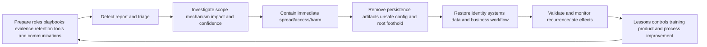
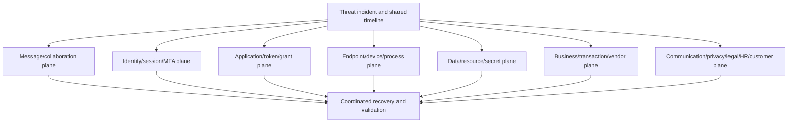
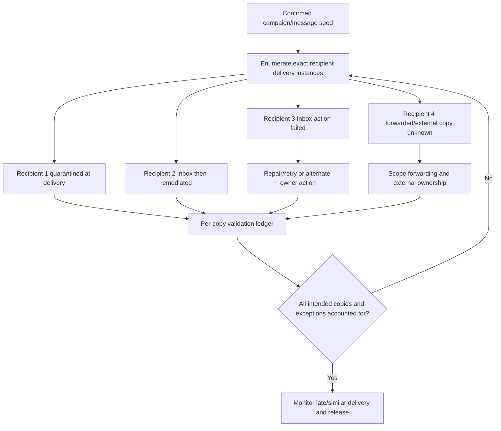
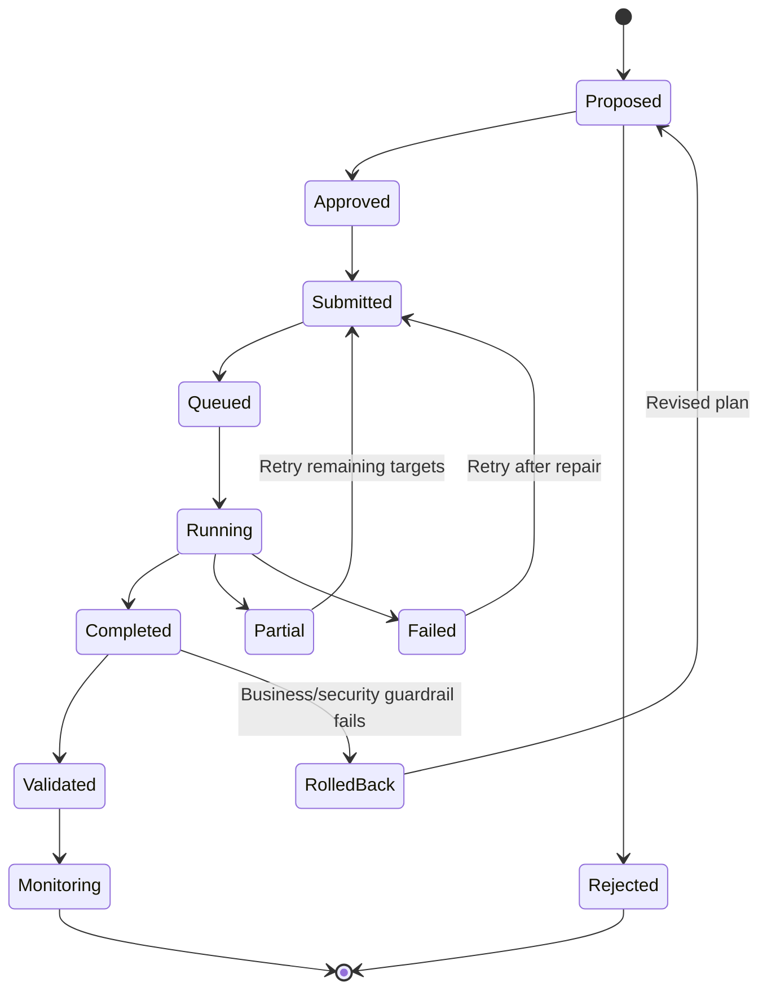
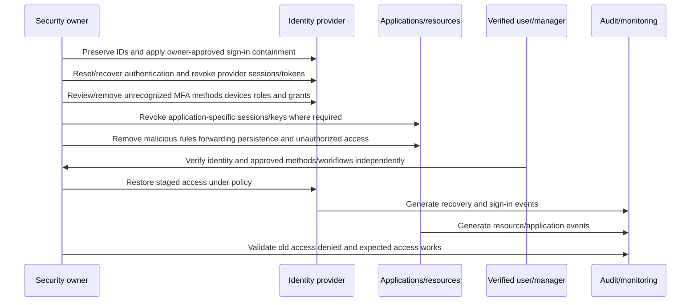
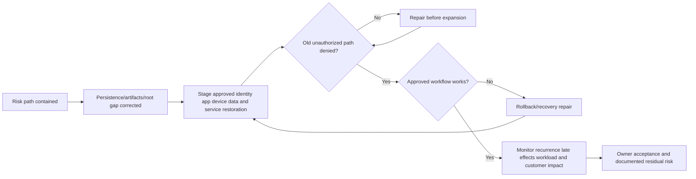
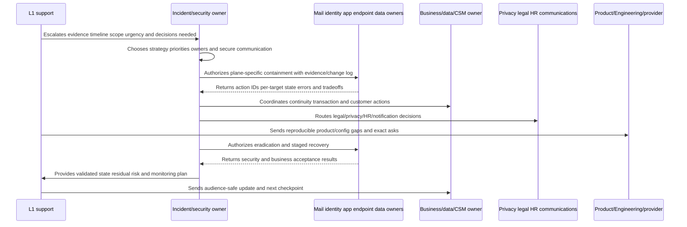
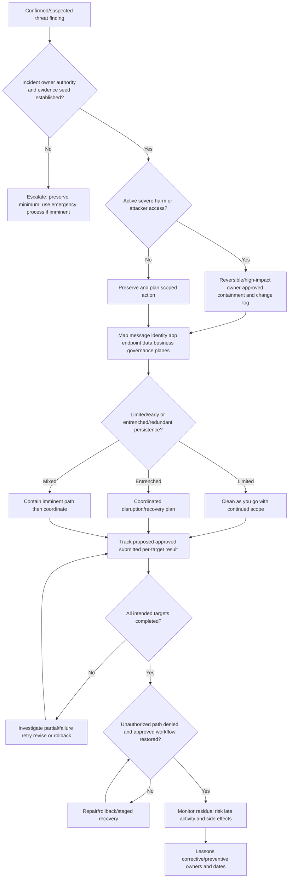

# Part 047 - Threat Response Quarantine Remediation and Recovery

Threat response converts investigation findings into risk reduction. The work is not finished when someone clicks **Quarantine**, **Delete**, **Disable**, **Revoke**, or **Block**. Each action has a target, scope, owner, authorization, state, side effect, completion result, validation method, and possible rollback or continuity plan.

A phishing message can be removed while a stolen session remains active. A password can be reset while a malicious OAuth grant persists. An account can be disabled while an attacker-controlled external application session remains valid. A sender can be blocked while a lookalike domain or compromised internal account continues the campaign. A fraudulent payment request can be deleted after the transaction has already moved. Quarantine can prevent access, retain an object for review, or expose release options depending on product and policy. It is not one universal state.

The beginner-first rule is:

> **Respond across every affected plane, track proposed through validated state, preserve necessary evidence, restore approved business safely, and monitor for recurrence.**

This Part is defensive. It explains containment, eradication, recovery, monitoring, and prevention at an enterprise-support depth. It does not authorize actions in a tenant, mailbox, identity provider, endpoint, SaaS application, bank, or external organization. The lab is offline and synthetic; it sends, releases, removes, disables, revokes, resets, rotates, contacts, or changes nothing.

## Section goal

After completing this Part, you should be able to:

- Define incident response, containment, eradication, remediation, quarantine, isolation, recovery, restoration, rollback, validation, and lessons learned.
- Explain why message removal, sender blocking, password reset, session revocation, app-grant removal, endpoint isolation, secret rotation, and transaction response address different mechanisms.
- Build a response plan across message/collaboration, identity/session, app/token, endpoint, data/resource, business/transaction, and communication/governance planes.
- Distinguish proposed, approved, submitted, queued, running, completed, partially completed, failed, rolled back, and validated action states.
- Choose between immediate clean-as-you-go containment and coordinated recovery based on adversary persistence, scope, evidence, and business risk.
- Preserve evidence without delaying action during imminent harm, and record every change in the timeline.
- Explain quarantine, release, Junk/Deleted/Recoverable states, post-delivery actions, retention, and per-recipient outcomes conceptually.
- Design recovery acceptance criteria that prove unauthorized access is denied and approved service is restored.
- Coordinate users, SecOps, identity, endpoint, mail/SaaS, business, privacy/legal/HR, CSM, Product, and Engineering owners.
- Produce an immediate-to-preventive response plan with action dependencies, rollback, communications, and validation.

## JD Mapping

| Role signal | Capability built here | Interview proof |
|---|---|---|
| Threat response | Converts findings into owned action/state/validation | Response ledger |
| L1 ownership | Tracks customer, technical, and escalation tasks to closure | End-to-end plan |
| Configuration support | Distinguishes message/policy/identity/app/resource controls | Plane-specific runbook |
| Customer trust | Communicates risk reduction without claiming premature resolution | Update sequence |
| Cross-functional collaboration | Coordinates technical, business, privacy, and vendor owners | RACI/decision log |
| Recommendations/RCA | Adds corrective and preventive actions | Immediate-to-preventive roadmap |

Your prior enterprise-support background is useful for severity, ownership, change control, critical-incident communication, rollback, and validation. The honesty boundary remains: this lesson is not production incident command, legal/privacy notification authority, digital forensics, banking fraud recovery, Microsoft security administration, or Abnormal AI operation.

## Candidate honesty note

| Evidence label | Safe claim | Boundary |
|---|---|---|
| **Production transfer** | Applied enterprise support ownership, change, escalation, validation, and communication methods | Not production cyber incident command |
| **Local/public lab** | Built and reasoned over a synthetic offline response ledger | No live action or system access |
| **Learned architecture** | Studied current NIST and Microsoft public response guidance | No private platform workflows/internals |
| **Template only** | Created containment, recovery, notification, rollback, validation, and prevention plans | Proposed, not executed |

Safe interview language:

> "I have not run Abnormal AI or enterprise security response in production. In a synthetic offline lab I mapped message, identity, app/token, endpoint, data, business, and communication response planes; tracked action state and dependencies; and defined recovery acceptance criteria. My transferable strength is ownership, change safety, escalation, and verifying outcomes rather than equating submission with remediation."

## Response Lifecycle

| Phase | Goal | Exit evidence |
|---|---|---|
| Prepare | Make response possible before crisis | Owners, access, communications, logging, recovery plan tested |
| Detect/triage | Decide urgency, likely mechanism, initial scope | Case owner, severity, seed IDs, immediate risks |
| Investigate | Build evidence-backed scope/hypotheses | Timeline, affected entities, confidence, gaps |
| Contain | Stop or limit current harm | Risk path denied/isolated; business tradeoff recorded |
| Eradicate | Remove attacker persistence/cause/artifacts | Malicious rules/grants/files/config/footholds removed |
| Recover | Return approved operations securely | Acceptance criteria pass; staged access/service restored |
| Monitor | Catch recurrence/late activity | Defined telemetry/window/owners and no unexpected activity |
| Improve | Reduce future likelihood/impact/time | Corrective/preventive actions, owners, dates, retest |

Real incidents overlap phases. Investigation continues during containment, and monitoring starts before full recovery. The labels organize work; they are not a reason to wait during imminent harm.

## Core Terms

| Term | Plain meaning | Why it matters | Memory hook |
|---|---|---|---|
| Incident response | Organized investigation and risk reduction for security events | Coordinates technical/business work | Response turns evidence into safer state |
| Containment | Limit current access, spread, or harm | Buys control/time | Stop the bleeding |
| Eradication | Remove attacker foothold/persistence/root artifact | Prevents immediate return | Remove the foothold |
| Remediation | Action correcting/mitigating a finding | Can span containment/eradication/recovery | Fix a finding |
| Quarantine | Controlled isolation/holding state under product policy | Not deletion or universal verdict | Hold apart for review |
| Isolation | Separate entity/device/message/resource from normal access | Scope differs by control | Disconnect the path |
| Recovery/restoration | Return approved service/data/access securely | Business must resume | Restore safely |
| Rollback | Revert a response change | Limits response-caused harm | Undo the change, not the incident |
| Validation | Evidence that action produced intended result | Completion claim depends on it | Prove the new state |
| Residual risk | Risk remaining after actions | Zero risk is unrealistic | What remains |
| Corrective action | Fixes identified cause/control gap | Near-term recurrence reduction | Correct known gap |
| Preventive action | Improves resilience beyond immediate case | Long-term improvement | Make next incident harder |

## The Seven Response Planes

| Plane | Candidate response questions | Validation questions |
|---|---|---|
| Message/collaboration | Which exact copies, recipients, chats/files, late deliveries, releases? | Are all target copies inaccessible/handled as intended? |
| Identity/session/MFA | Disable/restrict? password? sessions/tokens? MFA methods/devices/roles? | Can old access still authenticate/use resources? |
| App/token/grant | Malicious consent/app credential/webhook/API key/session? | Is authority revoked and dependent approved app restored? |
| Endpoint/device | Isolate, scan, collect, rebuild, patch? | Is device clean/managed/reconnected under criteria? |
| Data/resource/secret | Revoke sharing/ACL, rotate secrets, repair data, scope access? | Old links/secrets/access fail; integrity/availability restored? |
| Business/transaction | Payment/payroll/vendor/legal/safety action? | Transaction/customer/vendor outcome confirmed by owner? |
| Governance/communication | Who decides customer/privacy/legal/HR/regulator/vendor notice? | Decisions, audience, timing, facts, owners recorded? |

A plan can include "not applicable" with rationale. It should not silently ignore a plane.

## 🔍 Plain-English deep-dive: Quarantine Is a Secure Waiting Room, Not a Final Verdict or a Shredder

At an airport, a bag can be moved to a secure inspection room. It is no longer on the normal conveyor, but it still exists. Authorized staff can inspect, release, retain, or dispose of it according to procedure. The waiting room does not itself prove the bag is dangerous.

Digital quarantine is similar, but product semantics vary:

- why the item was quarantined (spam, phishing, malware, DLP, policy, file type);
- whether user/admin can view, preview, download, request release, release, delete, or report it;
- whether one or all recipients are affected;
- retention/expiration and recoverability;
- whether release re-delivers rather than restores in place;
- whether deletion from quarantine also changes a source file/object;
- whether action is audited;
- which downstream filter/rule can quarantine a released item again.

Microsoft's current public documentation says quarantined email is retained based on reason and becomes unrecoverable after expiration; actions are audited. Releasing email re-delivers it, so Outlook can show the re-delivery timestamp while the original send date remains in headers. Deleting a quarantined email is permanent. Quarantined SharePoint/OneDrive files can leave a blocked source file after quarantine expiration/removal. These are product-specific examples, not universal quarantine rules.

The airport analogy stops being accurate because digital copies can exist per recipient or across systems, automated actions can occur after delivery, and deletion/recoverability depends on service and hold policy.

**Memory hook:** Quarantine isolates an object under policy; verify existence, access, recipients, release, expiry, and source state.

## Message and Collaboration Response

| Action concept | What it can accomplish | What it does not prove |
|---|---|---|
| Quarantine | Restrict normal user access and retain under policy | Every copy removed; no prior interaction |
| Move to Junk/Deleted | Reduce normal visibility | Inaccessible/unrecoverable; threat neutralized elsewhere |
| Soft delete/recoverable state | Remove from normal folders while retaining recovery path | Permanent purge |
| Hard delete/purge | Stronger removal under product semantics | Other copies, exports, forwards, screenshots removed |
| ZAP/post-delivery action | Retroactively act after updated verdict | No pre-action exposure/interaction; all folders/systems covered |
| Release | Restore/re-deliver an approved item | Future similar items always allowed; original timing unchanged |
| Submit/report | Provide item for analysis/feedback | Immediate global fix/removal |
| Entity block | Prevent matching sender/domain/URL/file behavior | Lookalikes, compromised internal senders, changed entities blocked |
| User notification | Warn/instruct recipients | Message removed or identity secure |

### Per-recipient state matters

One Internet message can have multiple delivery instances. Some recipients may be blocked, others delivered, others later remediated, and one copy forwarded externally. Use exact network/message IDs plus recipient and action state. "The message was deleted" is incomplete without target population and result.

## Action State Machine

| State | Meaning | Evidence |
|---|---|---|
| Proposed | Suggested but not authorized | Plan, target, reason, owner request |
| Approved | Authorized under change/incident process | Approver/time/scope |
| Submitted | Command/API/workflow accepted request | Action/job ID and parameters |
| Queued/running | Execution pending/in progress | Platform status/time |
| Completed | Platform says action finished | Per-target result, not just job summary |
| Partial | Some targets succeeded | Success/failure lists and retry decision |
| Failed | Intended state not reached | Error, cause, owner, next action |
| Rolled back | Response change reversed | Reason and restored state |
| Validated | Independent check proves intended risk/business outcome | Query/test/owner confirmation |
| Monitoring | Defined observation continues | Metric/telemetry/window/owner |

## 🔍 Plain-English deep-dive: Pressing the Elevator Button Does Not Mean You Reached the Floor

Pressing an elevator button is a request. The light may turn on, the elevator may queue the request, start moving, stop due to a fault, arrive at a different bank, or open at the correct floor. You confirm arrival by observing the floor and doors, not by remembering that you pressed the button.

Response actions have the same distinction:

- **intent:** what state should change;
- **authorization:** who approved it;
- **submission:** platform accepted the request;
- **execution:** action ran against exact targets;
- **result:** success/partial/failure per target;
- **effect:** unauthorized path is denied and desired business state is achieved;
- **monitoring:** result persists and no bypass/recurrence appears.

Examples:

- A message-remediation job completes but one recipient copy was already forwarded.
- A session-revoke request succeeds, but a separate application-issued session remains valid.
- A secret is rotated, but one service still uses the old secret and fails.
- A malicious sharing link is revoked, but a downloaded copy remains outside control.
- A quarantine release says released, but another filter re-quarantines it.

Always record action ID, exact targets, state timestamps, per-target output, error, retry, independent validation, and residual risk.

The elevator analogy stops being accurate because response actions can fan out to thousands of targets, have asynchronous eventual consistency, and change multiple systems with partial outcomes.

**Memory hook:** Submitted is not completed; completed is not validated.

## Preserve Before Change, Unless Imminent Harm Wins

| Decision factor | Preserve first | Act immediately and document |
|---|---|---|
| Evidence volatility | Source will change but harm is contained | Data deletion/encryption/exfiltration/fraud is active |
| Scope | Unknown; action could alert adversary or destroy links | Small known target with severe impact |
| Business continuity | Change could stop critical service | Ongoing attacker access outweighs outage |
| Legal/HR/privacy | Formal process may require preservation | Emergency safety/risk process authorizes containment |
| Recovery | No rollback/backup/owner available | Safe reversible control exists |

"Do no harm" does not mean "do nothing." It means weigh attacker harm, response harm, evidence loss, and business impact; get the right owner; choose the smallest effective action; and log the decision.

## Contain-as-You-Go Versus Coordinated Disruption

| Approach | Fits when | Main risk | Guardrail |
|---|---|---|---|
| Clean as you go | Early/limited incident; independent artifacts; low tipping-off risk | Missed hidden persistence | Continue scope/monitoring |
| Coordinated "big bang" | Established adversary, redundant access, broad privileges | Complexity and business disruption | Rehearsed dependencies/owners/secure comms |
| Hybrid | Immediate high-harm path plus later coordinated persistence removal | Inconsistent states | Clear phase boundary and decision log |

L1 does not choose enterprise disruption alone. Escalate with facts, likely persistence, blast radius, business dependencies, and explicit decision needed.

## Identity, Session, and MFA Response

### Identity recovery checklist by mechanism

| Mechanism | Candidate owner action | Validation |
|---|---|---|
| Account sign-in | Disable/block/restrict during investigation | New sign-in denied under target state |
| Password/credential | Owner-approved reset to trusted channel | Old credential fails; user completes secure recovery |
| Refresh/access token | Revoke sessions/tokens; account for token lifetime/CAE | Old token/session tested/observed denied per authorized procedure |
| Application session cookie | App owner terminates app-issued sessions | App session no longer works |
| MFA methods | Remove unrecognized methods/devices; re-register securely | Only approved methods present; strong auth passes |
| Roles/groups | Remove unauthorized privilege/assignment | Effective access review shows intended role only |
| OAuth grants/apps | Revoke/remove malicious grant/app credentials/consent | App cannot access resources; legitimate apps verified |
| Mailbox persistence | Remove malicious forwarding/rules/delegates/signatures | No hidden/unapproved paths; controlled mail test |
| Registered devices | Disable/isolate/wipe only under device owner process | Old device access denied; data/recovery implications handled |

## 🔍 Plain-English deep-dive: Changing the Front-Door Key Does Not Close Every Side Door

If a building key is stolen, replacing the front-door lock helps. But an intruder may have copied a garage remote, added a back-door key, enrolled a new access badge, propped a window, or left an accomplice inside.

Password reset is the front-door change. Depending on the incident and platform, also examine:

- active access and refresh tokens;
- browser/application-issued session cookies;
- MFA methods and registered devices;
- OAuth grants, application credentials, service principals, API keys;
- administrative roles, groups, delegates, and resource ACLs;
- mailbox rules, forwarding, signatures, contacts, recovery information;
- endpoint persistence or stolen local data;
- downstream applications that authenticate independently.

Microsoft Entra public guidance says access revocation can have a delay, access tokens may last until expiry unless supported controls accelerate reevaluation, and application-issued session tokens are controlled by that application. "Revoke sessions" is important but not magical across every downstream service.

The building analogy stops being accurate because digital authority can be replicated, cached, delegated, and scoped per resource/provider without one physical perimeter.

**Memory hook:** Reset credential, revoke sessions, remove persistence, verify downstream access.

## Application, Token, and Secret Response

| State | Containment | Eradication | Recovery |
|---|---|---|---|
| Malicious user consent | Restrict user/app access | Revoke grant/remove unauthorized app | Re-consent only approved least privilege if needed |
| Compromised app credential | Disable credential/app path | Remove/rotate credential; investigate use | Restore new credential securely; update dependencies |
| Leaked API key/token | Revoke/rotate | Remove exposure/source; search usage | Update approved clients/secrets store |
| Malicious webhook | Disable endpoint/integration | Remove config and related automation | Restore approved webhook with validation/signing |
| Overprivileged app | Restrict scope/access | Correct grants/roles | Test minimum necessary business functions |
| Third-party SaaS session | Contact app owner/provider through approved path | Revoke app-side sessions and persistence | Staged re-enable with monitoring |

Password resets do not revoke an application credential that is independent of the user. Secret rotation is not complete until old credential fails and all legitimate dependencies successfully use the new one.

## Endpoint, Data, and Resource Response

| Plane | Immediate | Corrective | Recovery/validation |
|---|---|---|---|
| Endpoint | Isolate/restrict under endpoint owner | Remove/rebuild/patch persistence and vulnerabilities | Reconnect under clean/managed criteria |
| File/object | Quarantine/restrict access | Remove malicious copy/repair permissions | Approved object usable; malicious bytes/access absent |
| Data share/link | Revoke external/public link | Correct ACL/inheritance/ownership | Old link/account denied; approved collaboration restored |
| Secret/key | Revoke/rotate | Remove source exposure and overprivilege | Old secret denied; dependent services healthy |
| Data integrity | Freeze writes/compare trusted source | Restore clean version and investigate alteration | Reconciliation and owner sign-off |
| Backup | Protect from attacker access | Validate clean restore point/credentials | Restore test succeeds; backup controls repaired |

Do not instruct destructive endpoint or file actions from an L1 study guide. Real actions require owners, evidence, recovery, and legal/privacy consideration.

## Business and Transaction Response

Technical cleanup does not reverse a business event.

| Scenario | Technical response | Business-owner response |
|---|---|---|
| Payment-change fraud | Message/account/domain containment | Finance hold/recall, known-channel vendor verification, bank/legal process |
| Payroll change | Identity/mail response | Payroll/HR verification and correction |
| Data exposure | Access/link/session containment | Data owner/privacy/legal impact/notification decision |
| Vendor compromise | Grant/account/path containment | Vendor/contract/CSM continuity and assurance |
| Customer message | Remove/secure sender account | Customer communication and corrected transaction |
| Safety/regulated workflow | Secure systems | Safety/compliance continuity procedure |

Use known trusted contact channels, not numbers/links in suspicious messages. L1 does not promise fund recovery or decide legal notification.

## Prioritization

| Priority driver | Examples |
|---|---|
| Imminent harm | Active exfiltration, encryption, fraud, destructive access |
| Privilege | Admin/service/app authority, broad data access |
| Persistence | Multiple sessions, apps, rules, devices, backdoors |
| Scope | Many recipients/resources/tenants/customers |
| Sensitivity | Credentials, secrets, regulated/customer/IP data |
| Business criticality | Identity, payroll, finance, safety, customer service |
| Recoverability | No backup/rollback; destructive action risk |
| Evidence expiry | Short retention/volatile state |
| Adversary awareness | Partial action may trigger adaptation |

Severity is not only technical confidence. A low-confidence but catastrophic active scenario may justify reversible containment while investigation continues.

## Recovery Acceptance Criteria

Recovery is not "turn it back on." Define tests before restoration.

| Plane | Security criterion | Business criterion |
|---|---|---|
| Identity | Old credentials/tokens/sessions/methods denied; intended roles only | Verified user can authenticate through approved method |
| App | Malicious grant/credential/session denied | Approved integration works at least privilege |
| Mail | Malicious copies/persistence handled; late delivery controlled | Legitimate sending/receiving/critical notifications work |
| Endpoint | No known persistence; managed/patched/rebuilt criteria pass | Required apps/data accessible |
| Data/resource | Unauthorized link/ACL/secret denied; integrity checked | Correct users/services can access accurate data |
| Business | Fraud/data/customer actions owned | Transaction/service/customer correction confirmed |
| Monitoring | Relevant alerts/logs healthy; no recurrence | Operational load and user experience acceptable |

## 🔍 Plain-English deep-dive: Containment Builds a Dam; Recovery Restores the Town's Water

During a flood, responders may close gates to stop water. That containment protects people but can also stop drinking-water flow. Removing debris and repairing the broken channel addresses cause. Recovery then restores safe service, tests quality and pressure, and watches the repair.

Cyber response has the same distinctions:

- **Containment:** disable account, isolate device, revoke share, quarantine messages, block a precise path.
- **Eradication/correction:** remove persistence, malicious grant/rule/file, repair configuration, patch vulnerability, rotate exposed secret.
- **Recovery:** restore approved user/app/device/data/business function in stages.
- **Validation:** prove old unauthorized path fails and intended path works.
- **Monitoring:** watch for recurrence and response side effects.

Keeping an account disabled forever is not successful recovery if the employee needs it. Re-enabling it after only a password reset is unsafe if app grants/session tokens remain. Recovery balances security with continuity using explicit acceptance criteria.

The dam analogy stops being accurate because digital incidents can involve hidden copies, multiple independent identity providers, and attackers who adapt during response.

**Memory hook:** Contain risk, remove persistence, restore service, validate both directions.

## Response Workflow

### Step 1: Confirm owner, severity, and authority

Identify incident commander/security owner, technical owners, business/data owner, privacy/legal/HR/communications, customer/CSM owner, and Product/Engineering/vendor contacts. Define secure channels and decision rights.

### Step 2: Preserve before and during action

Preserve seed IDs, timeline, relevant source state, and event-time configuration. During imminent harm, act under emergency authority and record exactly what changed, when, by whom, and why.

### Step 3: Define current risk and response strategy

Active or historical? Limited or persistent? Clean-as-you-go, coordinated, or hybrid? What business processes could fail? What action tips off the adversary? Which plane is urgent?

### Step 4: Create response ledger

For every action: finding/hypothesis, plane, target, owner, approver, intent, prerequisites/dependencies, submitted/completed times, job/action ID, state, error, side effect, rollback, validation, residual risk.

### Step 5: Contain across affected planes

Do not stop at message removal if identity/app/resource impact exists. Avoid broad controls when precise targets work. Include transaction/customer/data actions.

### Step 6: Re-scope after containment

Containment can expose new persistence or late deliveries. Re-query messages, sessions, apps, rules, devices, resources, shares, and actions. Verify no target omissions or partial failures.

### Step 7: Eradicate root mechanisms

Remove malicious persistence/artifacts, fix unsafe configuration, rotate exposed secrets, patch/rebuild as owned, correct sender/integration/workflow, and document Product/Engineering gaps.

### Step 8: Recover in stages

Use trusted user/owner verification, least privilege, clean device/session, new credentials/secrets, approved apps, and controlled restoration. Coordinate service dependencies.

### Step 9: Validate security and business outcomes

Test old unauthorized path fails, approved path works, action state is complete per target, data/service integrity is acceptable, monitoring works, and no critical false positives/outages persist.

### Step 10: Monitor, communicate, and improve

Set owner/window/queries/metrics/trigger. Capture lessons into detections, policies, logging, training, runbooks, architecture, vendor actions, and knowledge content. Track until completion, not recommendation.

## Troubleshooting Decision Tree

## Response Ledger Template

| Field | Example content |
|---|---|
| Action ID | `A047-007` |
| Finding/hypothesis | Unrecognized refresh/session/app access |
| Plane/target | Identity; `USER-047`; exact session/grant IDs |
| Intent | Deny unauthorized access while preserving approved identity |
| Owner/approver | Identity owner/security incident commander |
| Prerequisites | Evidence IDs preserved; emergency access/continuity checked |
| Action | Template-only revoke/restrict/remove concept |
| Submitted/completed UTC | Separate timestamps |
| Platform job/reference | Synthetic `JOB-047-007` |
| Per-target state | Completed/partial/failed/unknown |
| Side effect | User/app disruption |
| Rollback/recovery | Secure reauthentication/re-consent under least privilege |
| Validation | Old path denied; approved path works; audit event exists |
| Residual risk | App-issued session coverage unknown |
| Monitor/owner/window | Sign-ins/grants/resources for stated period |

## Common Response Dependencies

| Action | Dependency | Failure if ignored |
|---|---|---|
| Disable account | Break-glass/delegated critical work | Business outage or locked response team |
| Rotate service secret | Inventory all consumers and rollback | Production service failure |
| Revoke OAuth app | Identify legitimate shared functions | Data backup/integration outage |
| Isolate endpoint | Remote access/forensic collection/rebuild | Lost evidence or stranded user |
| Remove message | Preserve source and scope all recipients/forwards | Incomplete campaign understanding |
| Revoke share | Data owner/partner continuity | Customer/vendor collaboration disruption |
| Block domain | Shared/compromised legitimate infrastructure | Broad false positives |
| Hard delete | Hold/recovery/evidence policy | Irreversible loss |
| Notify users | Accurate facts and safe instructions | Panic, alert attacker, unsafe clicks/replies |

## Worked Example 1: Phishing Delivered, No Interaction Found

### Inputs

- Ten exact recipient copies identified.
- Three were quarantined at delivery; seven reached Inbox.
- No matching click is found within documented coverage.
- Message is confirmed phishing.
- No identity anomalies are currently observed.

### Response reasoning

Preserve exact message/campaign evidence. Remove/quarantine the seven delivered copies through owner-approved action and validate per recipient. Warn users using a trusted channel if policy requires, without including active links. Search late/similar deliveries and broaden identity review if user statements or new telemetry indicate interaction. Do not claim no interaction beyond click/identity coverage.

### Exit criteria

- 10/10 recipient states accounted for.
- 7/7 intended remediation targets completed and validated.
- No release/forward/late-delivery exception remains within scope.
- User/identity monitoring window and escalation trigger recorded.

## Worked Example 2: Phishing Followed by Account Takeover

### Inputs

- Allowed click, unfamiliar sign-in, malicious mailbox rule, OAuth grant, and external forwarding are supported.
- User confirms none were approved.
- Message copies remain in other recipients' mailboxes.

### Response reasoning

This is not an email-only cleanup. Coordinate message campaign remediation; identity sign-in containment and secure recovery; session/token and app-grant response; MFA/device/role review; mailbox-rule/forwarding/delegate cleanup; resource/data scope; endpoint assessment; user/customer/business actions. Preserve action timeline and do not send recovery secrets to the compromised mailbox.

### Exit criteria

- Old credentials/provider sessions and identified app authority no longer work under tested/observed semantics.
- Unrecognized MFA methods, roles, grants, forwarding, and rules are gone.
- Approved access and mail functions work after trusted re-verification.
- Messages/campaign/users/resources and potential data access are scoped.
- Monitoring covers recurrence and downstream app sessions/late events.

## Worked Example 3: Vendor Fraud and Payment Change

### Inputs

- Message came from compromised vendor account and authenticated correctly.
- Employee changed payment details through normal finance workflow.
- Fraud discovered after transaction submission.

### Response reasoning

Message removal, sender block, and employee password reset do not reverse payment. Preserve thread/transaction evidence; contact vendor and financial institutions through known channels under finance/legal/security owners; hold/recall/correct transaction if possible; scope vendor relationship and recipients; assess whether customer identity or vendor identity is compromised; contain exact sender/session/path without broadly blocking necessary vendor operations.

### Exit criteria

- Transaction status and owner action documented.
- Vendor/customer account and communication path independently verified.
- Similar requests/recipients scoped.
- Correct payment process restored with independent verification controls.
- Customer/vendor/legal communications owned and approved.

## False Positive and Recovery Undo

Response can harm legitimate content/users. Plan safe correction.

| Mis-action | Recovery concept | Guardrail |
|---|---|---|
| Clean message quarantined | Authorized release/re-delivery | Re-analyze; avoid broad permanent allow |
| Clean message soft-deleted | Move/recover under owner/product semantics | Preserve action ID and recipient targets |
| Legitimate sender blocked | Remove precise block after validation | Retain other protections; monitor |
| User disabled incorrectly | Trusted verification and staged re-enable | Review sessions/MFA/roles; document impact |
| Legitimate app grant removed | Re-consent minimum approved scopes | Validate owner/credential/monitoring |
| Endpoint isolated incorrectly | Reconnect after health/security criteria | Confirm no unsafe bypass |
| Share revoked incorrectly | Restore least-privilege approved access | Old broad/public path remains denied |

Releasing a clean item and reporting a false positive are distinct. Restoring one object does not necessarily fix future classification, and creating an allow can change future protection.

## User and Stakeholder Communication

### Immediate recipient instruction

> "A message associated with `[safe identifier/time/sender category]` is under investigation. Do not open links/attachments, reply, forward, or use contact details from that message. If you interacted, report through `[trusted internal channel]` and include only the requested metadata. Security actions are tracked by `[owner/case ID]`."

### Containment update

> "Containment is `[complete/partial/in progress]` for `[exact scope]`. `[n]` of `[N]` message targets and `[identity/app/resource]` actions are validated; `[remaining/failed/unknown]` targets are owned by `[owner]`. Completion means per-target results plus independent validation, not only action submission. Next checkpoint: `[UTC]`."

### Recovery update

> "Unauthorized `[access/path/artifact]` is denied in the reviewed scope, and approved `[user/app/service/workflow]` has passed staged recovery checks. Residual risk remains `[known unknown]`; monitoring covers `[signals/window]`. `[Privacy/legal/business/customer]` decisions remain with `[owner]`."

### False-positive correction

> "Independent review supports that `[item/workflow]` is legitimate. The incorrect action has been reversed for `[scope]` and delivery/access is validated. Root-cause work is focused on `[policy/detector/sender/config]`; no broad bypass has been added. Security guardrails remain `[summary]`."

## Notification and Disclosure Boundaries

| Audience | Owner | Content focus |
|---|---|---|
| Affected user | Security/IT/HR as applicable | Safe actions, trusted recovery, support channel |
| Executives | Incident commander/communications/legal | Impact, decisions, risk, recovery, next checkpoint |
| Customer/CSM | Customer owner/legal/security | Verified scope, service impact, actions, commitments |
| Vendor/partner | Vendor/business/security/legal | Known-channel facts, shared actions, evidence requests |
| Privacy/regulator | Privacy/legal | Data categories/population/reach, legal criteria/timing |
| Law enforcement/insurer | Legal/executive/IR owner | Formal approved package/process |
| Product/Engineering | Technical owner | Repro, IDs, versions, expected/actual, validation, ask |

L1 supplies accurate technical facts and timelines. Legal/privacy/communications owners decide external disclosure and wording.

## Monitoring Plan

| Monitor | Purpose | Trigger/example |
|---|---|---|
| Message/campaign | Late/similar delivery/release/forwarding | New matching recipient copy |
| Identity | Sign-in/session/MFA/role anomalies | Old/new unauthorized session activity |
| App/grant | Consent, credential, API access | Recreated grant or access from old credential |
| Mailbox | Rules, forwarding, delegate, outbound mail | Persistence returns |
| Endpoint | Reconnect/process/alert/health | Malicious process or unmanaged state |
| Data/resource | Share/access/download/secret usage | Old link/secret/access used |
| Business | Payment/customer/vendor follow-through | Duplicate/changed transaction request |
| Response action | Partial/failure/rollback | Target not validated by deadline |
| False positives | Legitimate workflow disruption | Guardrail threshold crossed |

Define owner, data source, exact query/ID, frequency, duration, expected baseline, trigger, and escalation action.

## Lessons and Prevention

| Finding | Corrective action | Preventive action |
|---|---|---|
| Unsafe allow caused delivery | Remove/fix exact override | Allow governance, expiry, review, testing |
| User entered credentials | Recover identity/resources | Phishing-resistant MFA, training, link controls |
| OAuth grant persisted | Revoke grant/app | Consent policy, least privilege, app monitoring |
| Rule/forwarding hid mail | Remove persistence | Alert on rule/forwarding changes |
| Logging gap delayed scope | Enable/repair telemetry | Retention/coverage tests and runbook |
| Release caused re-quarantine | Fix downstream filtering | Document end-to-end release validation |
| Transaction changed by email only | Correct payment | Independent known-channel verification |
| Response action partially failed | Retry/repair | Per-target state automation and alerts |

Improvements need owner, priority, due date, acceptance test, and evidence of completion. A lesson is not learned until behavior/control changes.

## Common Failure Modes

| Failure | Why it fails | Better behavior |
|---|---|---|
| Quarantined equals resolved | Other copies/interactions/identity persist | Scope planes and validate per target |
| Clicked action equals completed | Async/partial/failure states | Track job and independent effect |
| Password reset only | Tokens/apps/MFA/rules/downstream sessions persist | Mechanism-complete identity recovery |
| Block sender only | Lookalike/internal/app routes remain | Block precise indicators plus root path |
| Delete message before preserving | Loses investigation/product evidence | Preserve minimum unless imminent harm wins |
| Hard delete casually | Irreversible/hold/recovery risk | Owner/legal/change review |
| Release plus broad allow | Future malicious variants can bypass | Restore item, fix root cause, narrow/expire |
| Disable all users at once | Massive outage and recovery complexity | Risk-based staged/coordinated plan |
| Rotate secret without dependencies | Breaks production | Consumer inventory/canary/rollback |
| Partial cleanup of entrenched actor | Tips off/adaptation/persistence | Incident-owner coordinated strategy |
| No business response | Fraud/data/customer harm continues | Finance/data/customer owners |
| User notified through compromised channel | Attacker can see/intercept | Trusted alternate channel |
| Completion without validation | State may not match intent | Security + business acceptance tests |
| No monitoring | Recurrence/late events missed | Owner/query/window/trigger |
| No rollback | Response-caused outage persists | Predefined recovery path |
| L1 decides legal notice | Authority/context missing | Route facts to legal/privacy |

## Escalation Triggers and L1 Boundaries

Escalate immediately when:

- active account/app/session/endpoint/data access, exfiltration, encryption, destruction, fraud, or safety impact exists;
- administrative/service/app privileges or many users/resources are involved;
- redundant persistence suggests coordinated disruption;
- legal hold, privacy notification, employee/HR, law enforcement, insurance, or regulator decisions arise;
- destructive or broad actions are requested;
- response can interrupt identity, payroll, finance, safety, customer, or production services;
- a message/action job is partial, failed, inconsistent, or product behavior is undocumented;
- evidence is expiring or remediation may destroy it;
- an external vendor/customer/financial institution must be contacted;
- recovery criteria or rollback are unavailable.

L1 should not:

- execute tenant, identity, endpoint, app, secret, file, transaction, or quarantine actions without authority;
- send passwords/recovery secrets through compromised channels;
- release/download/share potentially harmful content casually;
- hard-delete evidence or alter holds/retention;
- contact banks/vendors/customers/regulators/law enforcement independently;
- promise fund/data recovery, complete eradication, or zero recurrence;
- re-enable users/apps/devices/services without acceptance criteria;
- treat proposed/submitted/completed as validated;
- claim private Abnormal or Microsoft product behavior beyond evidence.

## Escalation Packet

| Section | Required content |
|---|---|
| Incident summary | Mechanism, impact, confidence, current risk |
| Evidence/timeline | IDs, sources, UTC, preservation, coverage/unknowns |
| Scope | Users/messages/apps/devices/data/transactions/destinations |
| Strategy decision | Clean-as-you-go/coordinated/hybrid and rationale |
| Response planes | Applicable/not-applicable with evidence |
| Action ledger | Owner/approver/target/dependency/job/state/error/UTC |
| Continuity/rollback | Business impact, workaround, reversal/recovery |
| Validation | Unauthorized path denied, approved path works, per-target evidence |
| Monitoring | Source/query/frequency/window/trigger/owner |
| Communication | Audience, owner, sent/approved status, next checkpoint |
| Corrective/preventive | Root gap, action, owner, date, acceptance test |
| Ask | Exact decision, permission, product fix, evidence, resource, or owner needed |

## Safe Synthetic Lab: The Multi-Plane Recovery Ledger

### Objective

Build an immediate-to-preventive response plan for synthetic threat cases. Track every action from proposal through validation across message, identity, app/token, endpoint, data/resource, business, and governance planes. Execute nothing.

The unique lab name is **The Multi-Plane Recovery Ledger**.

### Prerequisites

- Local Markdown editor or spreadsheet.
- This Part and fixtures below.
- No tenant, mailbox, identity provider, SaaS app, endpoint, API, browser, network, bank/vendor contact, quarantine, or action center.
- Synthetic IDs contain `047`; domains end in `.invalid`.
- Label artifact **local/public lab - synthetic offline response records only**.

### Authorized scope

Authorized:

- Copy and reason over fixtures locally.
- Build plane map, strategy decision, response ledger, dependencies, validation, monitoring, communications, and prevention.
- Mark NIST/Microsoft mappings **learned architecture**.
- Mark all containment, remediation, recovery, notification, and policy actions **template only**.

Prohibited:

- Sending, releasing, deleting, moving, quarantining, downloading, sharing, or submitting any message/file.
- Disabling/enabling users/devices/apps, resetting passwords/MFA, revoking sessions/grants, rotating secrets, or changing roles/rules/forwarding/shares.
- Accessing a portal/API/tenant/account/device/log or running commands/scripts/tools.
- Contacting users, banks, vendors, customers, providers, legal authorities, or external parties.
- Using/uploading real messages, data, identities, secrets, incidents, transactions, or customer/employer information.

### Synthetic fixtures

| Case | Finding | Affected planes | Current state |
|---|---|---|---|
| A | Phish delivered to 8 recipients; no interaction in coverage | Message, user communication | 3 quarantined; 5 Inbox |
| B | Phish, click, unfamiliar sign-in, rule, OAuth grant | Message, identity, app, mailbox, data | Active session fixture |
| C | Malware attachment on one endpoint | Message, endpoint, identity, data | Device online fixture |
| D | Vendor account compromise/payment change | Message, business, vendor, finance, governance | Transaction submitted fixture |
| E | Sensitive file anonymous link accessed | Identity, app/SaaS, data, privacy | Link active fixture |
| F | Leaked service API key | App/token, data, production service | Key still used by 3 services fixture |
| G | Clean invoice quarantined | Message, business, false-positive feedback | Release requested fixture |
| H | Broad domain block proposed after one phish | Message/policy, business, governance | Not approved fixture |

Synthetic action-state records:

| Action ID | Case/target | State | Evidence/issue |
|---|---|---|---|
| A047-01 | A / five Inbox copies | Completed | Job says 5 success; validation pending |
| A047-02 | B / user sessions | Partial | IdP sessions revoked; app session unknown |
| A047-03 | B / OAuth grant | Proposed | Awaiting app/identity owner |
| A047-04 | C / device isolation | Submitted | Job queued; endpoint still online |
| A047-05 | D / payment hold/recall | In progress | Finance owner; outcome unknown |
| A047-06 | E / anonymous link | Completed | Link revoked; downloaded-copy scope unknown |
| A047-07 | F / API key rotation | Approved | Consumer dependency plan incomplete |
| A047-08 | G / clean message release | Completed | Message re-delivered; future classification unknown |
| A047-09 | H / domain block | Rejected | Scope too broad; precise URL/message action preferred |

### Steps

1. Create `The Multi-Plane Recovery Ledger`; record UTC start and evidence label.
2. Copy fixtures exactly; do not use real data or execute actions.
3. Define containment, eradication, remediation, quarantine, recovery, rollback, validation, and residual risk.
4. Map A-H across all seven response planes; mark applicable/not-applicable with rationale.
5. Choose clean-as-you-go, coordinated, or hybrid strategy for each case and explain business/adversary tradeoff.
6. Expand A047-01 through A047-09 into full response-ledger rows with owner, approver, intent, dependency, UTC, target, state, error, rollback, validation, residual risk, and monitoring.
7. For every Completed action, add an independent security and business validation; do not promote unsupported actions to Validated.
8. For Partial/Submitted/In-progress records, add next check, deadline, failure branch, and escalation trigger.
9. Build at least eight competing response hypotheses/risks, including alternate persistence and response-caused outage.
10. Create action dependency graphs for B and F; show why password reset or key rotation alone is incomplete.
11. Define staged recovery acceptance criteria for B, C, E, F, and G.
12. Build recipient-level state reconciliation for all eight copies in A.
13. Build finance/vendor known-channel response and communication ownership for D without contacting anyone.
14. Replace H's broad domain block with a precise temporary plan and monitoring/expiry.
15. Write immediate instruction, containment, recovery, and false-positive updates.
16. Create monitoring rows and immediate/corrective/preventive actions with owners/dates/tests.
17. Complete privacy, cleanup, and zero-activity attestations.

### Expected evidence

- Eight-case seven-plane applicability map.
- Response strategy decision ledger.
- Nine full action-state rows with dependencies and residual risk.
- Independent security/business validation per completed action.
- At least eight response-risk hypotheses.
- Identity/app and service-secret dependency graphs.
- Staged recovery acceptance criteria.
- Recipient-level message reconciliation.
- Four customer/stakeholder communications.
- Immediate-to-preventive roadmap and monitoring plan.
- No-real-data and zero-live-activity attestation.

### Cleanup and privacy

- Confirm all IDs contain `047` and domains end `.invalid`.
- Remove accidental real users, messages, domains, URLs, files, identities, apps, devices, data, secrets, transactions, vendors, customers, incidents, logs, or screenshots.
- Confirm no message/quarantine, identity/session/MFA, app/grant/token, endpoint/file/data, business/transaction, contact, tenant/API/browser/network, command/script/tool, upload, or policy action occurred.
- Delete the artifact if real data cannot be reliably removed.
- Store only the synthetic local artifact if useful.
- Record cleanup time and zero-activity attestation.

### Artifacts

| Artifact | Skill demonstrated | Honest label |
|---|---|---|
| Immediate-to-preventive response plan | Multi-plane response ownership | **Local/public lab** |
| Action-state/dependency/validation ledger | Completion rigor | **Local/public lab** |
| Recovery/rollback/monitoring plan | Safe change and continuity | **Template only** |
| NIST/Microsoft response mapping | Public-source research | **Learned architecture** |
| Customer/stakeholder updates | Enterprise support communication | **Production transfer** method with **template only** scenario |

## Validation rubric

| Dimension | Fail | Developing | Pass |
|---|---|---|---|
| Scope | Delete email only | Adds account | Covers seven planes and residual unknowns |
| State | Clicked equals done | Checks job | Proposed-to-validated per target with failure/partial/rollback |
| Evidence | Acts destructively first | Preserves some | Balances imminent harm, preservation, and complete change log |
| Identity | Password reset only | Revokes sessions | Covers tokens/app sessions/MFA/grants/roles/rules/resources |
| Business | Technical cleanup only | Notifies manager | Finance/data/customer/vendor/governance ownership and outcomes |
| Recovery | Re-enable immediately | Has checklist | Security and business acceptance criteria plus staged restoration |
| Monitoring | Case closed after action | Watches one source | Owner/query/window/trigger across applicable planes |
| Honesty | Claims production incident command | Calls lab production | Preserves four labels and L1/owner boundaries |

## Official Source Anchors

All sources were accessed on August 24, 2026 and must be revalidated before production use. The Microsoft Defender XDR `action-center-overview` URL tested during research returned 404 and was excluded. Product behavior varies by license, role, policy, workload, client, deployment, and later documentation.

| Official/public source | What it anchors |
|---|---|
| [NIST SP 800-61 Rev. 3](https://csrc.nist.gov/pubs/sp/800/61/r3/final) | Current incident-response integration with CSF 2.0 cybersecurity risk management |
| [NIST Cybersecurity Framework 2.0](https://www.nist.gov/cyberframework) | Govern, Identify, Protect, Detect, Respond, Recover risk outcomes and improvement |
| [Microsoft - Incident response overview](https://learn.microsoft.com/en-us/security/operations/incident-response-overview) | Current response/recovery best practices, do-no-harm, strategy, continuity, coordination, lessons |
| [Microsoft - Incident response playbooks](https://learn.microsoft.com/en-us/security/operations/incident-response-playbooks) | Current prerequisites, workflow, checklist, and investigation-playbook structure |
| [Microsoft - Threat hunting/remediation](https://learn.microsoft.com/en-us/defender-office-365/threat-explorer-threat-hunting) | Current move/delete/release/submission/block/proposal targets, permissions, action limits and review |
| [Microsoft - Manage quarantined messages/files](https://learn.microsoft.com/en-us/defender-office-365/quarantine-admin-manage-messages-files) | Current quarantine roles, retention, release/re-delivery, delete, audit, recipient and file-state behavior |
| [Microsoft - Zero-hour auto purge](https://learn.microsoft.com/en-us/defender-office-365/zero-hour-auto-purge) | Current post-delivery email/Teams action, verdict/policy effects, limitations and validation sources |
| [Microsoft - Respond to a compromised email account](https://learn.microsoft.com/en-us/defender-office-365/responding-to-a-compromised-email-account) | Current account/session/MFA/app/role/forwarding/rule investigation and recovery layers |
| [Microsoft Entra - Revoke user access in an emergency](https://learn.microsoft.com/en-us/entra/identity/users/users-revoke-access) | Current access/refresh/application session semantics, revocation delay, hybrid/app/device considerations |

## Likely Interview Questions

### Q1. What is the difference between containment, eradication, and recovery?

**Model answer:** Containment limits current access/spread/harm; eradication removes persistence, malicious artifacts, and root footholds; recovery restores approved identity, systems, data, and business workflow securely. Validation proves the unauthorized path fails and intended path works; monitoring checks that state persists.

### Q2. Does quarantining or deleting a phishing message resolve the incident?

**Model answer:** It can address exact message copies, but not prior interaction, forwarded/external copies, compromised identity, sessions/tokens, OAuth grants, mailbox rules, endpoint effects, data access, or fraudulent transactions. I reconcile per-recipient state and assess every applicable response plane.

### Q3. Why is a completed action not necessarily remediated?

**Model answer:** Platform completion can be partial, target the wrong entity, or leave alternate paths. I track proposal, approval, submission, execution, per-target result, rollback, and independent validation. Remediated means the intended risk state and business acceptance criteria are evidenced, with residual risk monitored.

### Q4. Why might a password reset be insufficient for account takeover?

**Model answer:** Existing access/refresh tokens, app-issued sessions, malicious MFA methods/devices, OAuth grants, app credentials, roles, delegates, mailbox rules/forwarding, endpoints, and downstream resources may persist. Recovery must match the mechanisms and verify old access is denied.

### Q5. How do you choose between immediate cleanup and coordinated remediation?

**Model answer:** I consider active harm, privilege, persistence redundancy, scope, adversary awareness, evidence, business dependencies, recoverability, and owner capability. Limited early cases often support clean-as-you-go; entrenched actors may require coordinated disruption; active severe harm can require a hybrid immediate containment plus coordinated recovery.

### Q6. How do you validate recovery?

**Model answer:** Per plane, I test the old unauthorized credential/session/grant/link/message/path fails, approved user/app/device/data/service workflow succeeds, action state is complete for all targets, integrity and business transactions are reconciled, telemetry works, and monitoring has owner/window/triggers.

### Q7. How do false positives affect response?

**Model answer:** Response itself can harm legitimate mail, accounts, apps, devices, and collaboration. I preserve evidence, use the smallest reversible action, define rollback, restore only after independent clean/authorized validation, avoid broad permanent allows, test malicious guardrails, and monitor recurrence.

### Q8. What are your L1 boundaries?

**Model answer:** I can preserve evidence, map planes, build action/dependency/validation ledgers, track owners/states, communicate, and escalate. I do not execute destructive/broad tenant, identity, app, endpoint, data, transaction, quarantine, or disclosure actions, nor claim legal/privacy authority or complete eradication without owners and evidence.

## 30-Second Memory Hooks

- **Seven planes: message, identity, app, endpoint, data, business, governance.**
- **Quarantine is isolation under policy, not universal deletion or truth.**
- **Submitted is not completed; completed is not validated.**
- **Preserve before change unless imminent harm justifies action.**
- **Password reset is one door, not every session, grant, rule, or app.**
- **Contain risk; remove persistence; restore service; validate both directions.**
- **Per-recipient/per-target state beats job-summary confidence.**
- **Technical cleanup does not reverse payment or disclosure.**
- **Recovery needs rollback, security criteria, and business criteria.**
- **Lessons require owners, dates, tests, and completion evidence.**

## Completion Checklist

- [ ] I can define containment, eradication, remediation, quarantine, recovery, rollback, validation, and residual risk.
- [ ] I can map an incident across all seven response planes.
- [ ] I track every action from proposed through validated, including partial/failure/rollback.
- [ ] I can explain quarantine/release/delete/post-delivery behavior without universal assumptions.
- [ ] I understand preserve-versus-immediate-action and clean-as-you-go/coordinated/hybrid tradeoffs.
- [ ] I can explain why password reset/session revoke/message removal alone may be incomplete.
- [ ] I include endpoint, data, resource, transaction, customer, privacy/legal/HR, and vendor owners when applicable.
- [ ] I define staged recovery with unauthorized-path and approved-workflow acceptance tests.
- [ ] I create monitoring with source/query/owner/window/trigger/action.
- [ ] I separate immediate, corrective, and preventive actions with completion evidence.
- [ ] I completed or can explain the synthetic lab and no-live-action limits aloud.
- [ ] I can answer Q1-Q8 and preserve my L1/production boundary.
- [ ] I revalidated official sources and recorded August 24, 2026 as access date.

[Next: Part 048 - AI and Machine Learning Foundations](Part-048-ai-and-machine-learning-foundations.md)