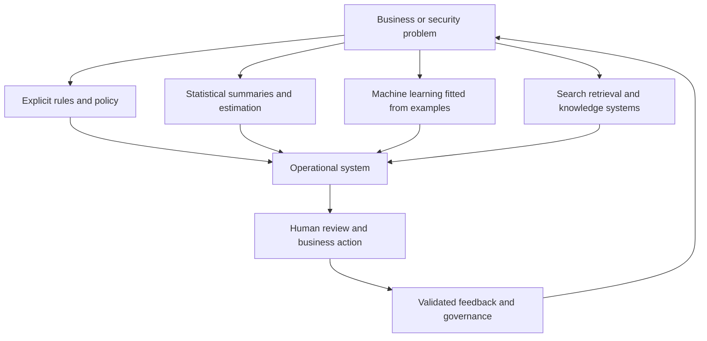
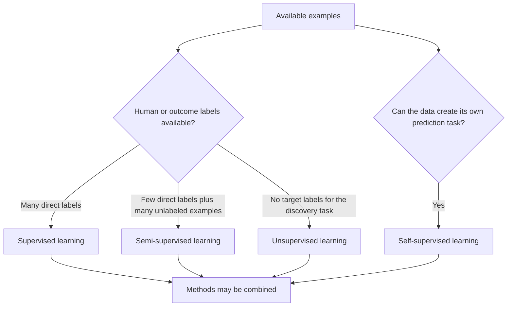
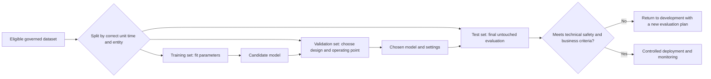
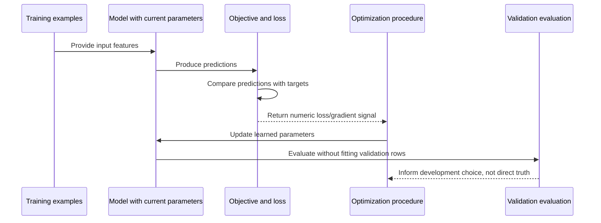
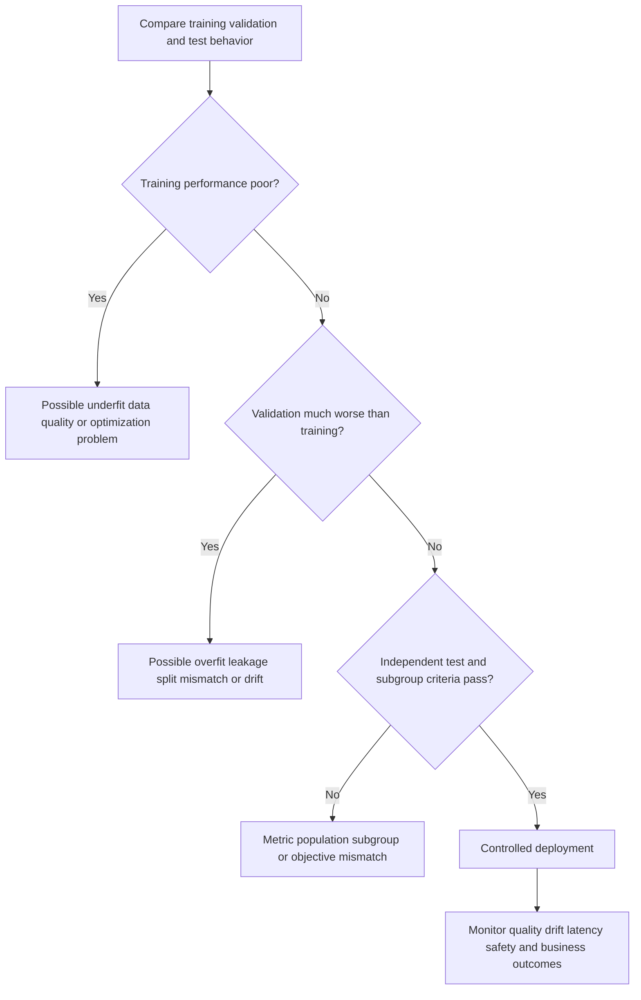
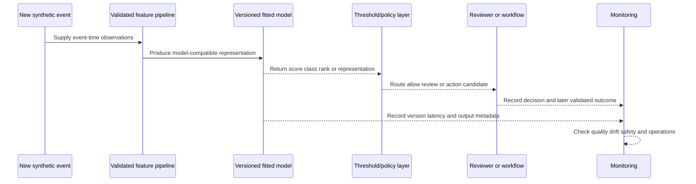
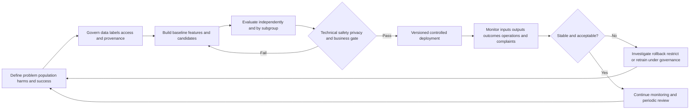
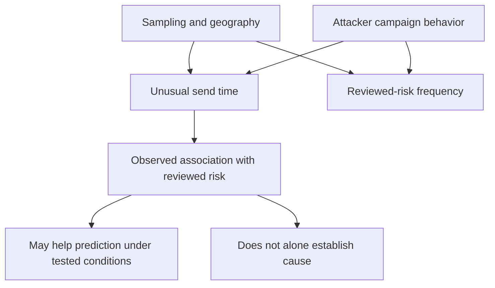
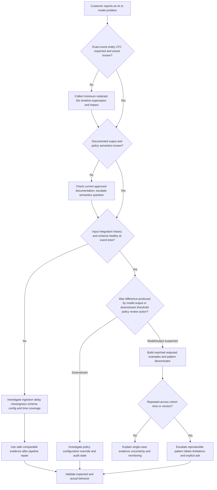

# Part 048 - AI and Machine Learning Foundations

## Section goal

This Part builds a beginner-safe mental model of artificial intelligence (AI), machine learning (ML), and ordinary statistical rules so that an L1 Technical Support Engineer can discuss behavioral security systems without inventing product internals. The practical goal is not to turn Arti into a data scientist. It is to make every later conversation about baselines, features, precision, thresholds, drift, explainability, and AI agents understandable, testable, and customer-safe.

By the end, you should be able to explain what a model learns, what it does not know, how examples become training data, why validation and test data are separated, how a loss function guides fitting, why good training performance can still fail in the real world, and how inference differs from training. You should also be able to distinguish correlation from causation, interpret probabilistic outputs cautiously, and state exactly what is unknown about proprietary Abnormal AI models, features, thresholds, training data, architecture, and implementation.

The central support principle is:

> Treat an AI output as evidence produced by a defined process, not as an oracle, a causal explanation, or a complete description of the product.

This Part is defensive and conceptual. Its lab uses only fictional tables and hand calculations. It does not upload data, call a model or API, access an account, test Abnormal AI, or make claims about production behavior.

## Learning outcomes

After completing this Part, you should be able to:

- distinguish AI, ML, a trained model, a deterministic rule, and conventional statistical estimation;
- explain examples, observations, features, labels, targets, predictions, scores, and classes from zero knowledge;
- compare supervised, unsupervised, semi-supervised, and self-supervised learning at a high level;
- separate training, validation, and test data and explain why the separation protects evaluation integrity;
- describe objectives, loss functions, optimization, parameters, hyperparameters, fitting, and convergence without unnecessary mathematics;
- recognize underfitting, overfitting, generalization, data leakage, distribution mismatch, and class imbalance;
- distinguish training from inference and connect both to evaluation, deployment, monitoring, and feedback;
- explain why correlation supports a hypothesis but does not establish causation;
- interpret scores and estimated probabilities without assuming certainty, calibration, or Abnormal-specific semantics;
- route customer questions toward observable behavior, documentation, reproducible evidence, and the correct product or engineering owner;
- use Arti's Copilot evaluation/training, analytics, SQL/Python, support-trend work, and customer communication as transferable evidence only; and
- preserve the boundary between public product statements and unknown proprietary implementation.

## JD Mapping

| Supplied role signal | Capability built in this Part | Transferable proof Arti can use | Boundary |
|---|---|---|---|
| Behavioral false-positive support | Separates label, prediction, score, threshold, and observed outcome | Structured case investigation and trend analysis | No claim of tuning an Abnormal model |
| Threat investigations | Treats model output as one evidence source among message, identity, relationship, and customer facts | Evidence-first CRITSIT and escalation habits | No claim of production email-security verdict ownership |
| Customer trust | Explains uncertainty and public limits plainly | Technical and nontechnical Microsoft customer communication | No disclosure or speculation about proprietary internals |
| Engineering collaboration | Produces reproducible inputs, expected/actual results, and evaluation questions | Engineering/Product escalation and fix validation | No claim of model-development ownership |
| Product feedback | Distinguishes single-case symptom from aggregate performance pattern | CSAT, backlog, case-quality, and support-trend analysis | Support cases are not automatically ground-truth labels |
| AI Security Agents and prompting | Establishes model, context, evaluation, and human-verification vocabulary | Copilot, Copilot Studio/agent, and LLM evaluation/training work | Generative AI experience is not behavioral detection expertise |
| Analytics and tools | Connects tables, metrics, segmentation, SQL, Python, and visual checks | Working SQL/Python/Power BI knowledge | Lab calculations are not production model monitoring |
| Continuous learning | Uses official sources and explicit knowledge boundaries | KB/training creation and mentoring | Public documentation may not expose implementation detail |

## Candidate honesty note

| Evidence label | Safe statement | What must not be implied |
|---|---|---|
| **Production transfer** | "I have evaluated and supported Copilot-related experiences, analyzed support trends, validated fixes, and explained technical uncertainty to enterprise customers." | That Arti trained security models or administered Abnormal AI |
| **Local/public lab** | "I built a synthetic learning-lifecycle worksheet and hand-calculated simple errors and split decisions." | That any real model, tenant, API, or customer data was used |
| **Learned architecture** | "My understanding of ML lifecycle and responsible-AI controls comes from official NIST and Microsoft sources." | That a vendor implements every generic lifecycle stage in the illustrated way |
| **No direct experience** | "I have not operated Abnormal AI or its proprietary models in production." | Hidden expertise in model features, weights, thresholds, training data, or agent design |
| **Unknown proprietary detail** | "Abnormal's public material describes AI-driven and behavior-oriented security outcomes at a high level; exact implementation requires approved documentation or an internal owner." | Guessing model families, data sources, scoring semantics, retraining cadence, or decision logic |

Safe interview language:

> "I understand the general ML lifecycle and can investigate observable product outcomes, data boundaries, evaluation tradeoffs, and support patterns. I have not operated Abnormal AI in production. Its proprietary models, features, thresholds, labels, training data, calibration, and agent implementation are unknown to me unless an approved source states otherwise. I would use customer-safe evidence and route implementation questions to the authorized owner."

## 1. The AI, ML, statistics, and rules map

**Artificial intelligence** is a broad label for computer systems designed to perform tasks associated with perception, language, reasoning, prediction, planning, or decision support. The label describes a capability area, not one algorithm. A spreadsheet rule, a search system, a classifier, a large language model, and a planning agent can all be discussed under AI in some contexts, even though they work very differently.

**Machine learning** is a way to build behavior by fitting a model from examples rather than hand-writing every decision rule. A **model** is the fitted mathematical or computational mapping from inputs to outputs. **Statistics** supplies methods for describing data, estimating relationships, quantifying uncertainty, and testing assumptions. A **deterministic rule** is an explicit instruction whose output is fixed for a given input, such as "if attachment size exceeds the configured limit, reject it." Real systems often combine all four.

| Approach | How behavior is produced | Simple example | Strength | Main caution |
|---|---|---|---|---|
| Explicit rule | Human states the condition and action | Flag an impossible date format | Easy to explain and test | Brittle when reality has many exceptions |
| Statistical rule | Human chooses a statistic and criterion | Compare today's count with a historical range | Compact and interpretable | Assumptions and population choice matter |
| Machine learning | Algorithm fits parameters from examples | Rank events from observed patterns | Can combine many weak signals | Can learn noise, bias, or shortcuts |
| Retrieval | System finds relevant stored material | Find a KB article for an error | Grounded in available sources | Retrieval can miss or select stale material |
| Generative model | Model predicts a sequence or structured output | Draft a case summary | Flexible language/interface | Can generate unsupported statements |
| Hybrid system | Rules, models, policy, and humans interact | Score, policy gate, then analyst review | Layered control and operational flexibility | Outcome cannot be attributed to one component without evidence |

An analogy is a hospital. Written triage rules resemble deterministic controls. Population statistics summarize expected ranges. A learned risk model combines patterns from prior examples. A clinician considers context and makes an accountable decision. The analogy stops where software lacks human clinical understanding and where security outcomes, evidence, and harms differ from medicine.

**Memory hook:** AI is the neighborhood; ML is one building method; a model is a fitted artifact; policy and humans still matter.

## 2. Observations, examples, features, labels, and outputs

An **observation** or **example** is one unit presented to a learning or evaluation process. It could represent a message, user-day, relationship event, login, support case, or time window. The correct unit depends on the question. A **feature** is a measurable input derived from an observation. A **label** or **target** is the outcome the training or evaluation process is trying to predict. A **prediction** is the model's output for a new example.

For a fictional message-review exercise, one observation might be message `MSG-048-7`. Features could include whether the sender relationship is new, the number of recipients, and the hour relative to the recipient's normal working pattern. A label might be `review-confirmed-risk` or `review-confirmed-legitimate`. A score might be `0.73`, but that number has no meaning until its documented definition, scale, population, and calibration are known.

| Term | Plain meaning | Security-support illustration | Question to ask |
|---|---|---|---|
| Observation/example | One row or unit considered | One synthetic message-recipient event | What exactly does one row represent? |
| Raw observation | Recorded fact before transformation | UTC timestamp or sender domain | Was it collected reliably and lawfully? |
| Feature | Model-usable representation | Relationship age in days | How was it calculated and at what time? |
| Label/target | Outcome used for learning/evaluation | Confirmed legitimate versus confirmed risky | Who assigned it and with what evidence? |
| Parameter | Value learned during fitting | A learned coefficient or internal weight | Was it learned, not manually selected? |
| Hyperparameter | Setting chosen around training | Tree depth or regularization strength | How was it selected without test leakage? |
| Prediction | Output for an example | Predicted class or rank | Is it final or one input to policy? |
| Score | Continuous or ordered output | Synthetic risk rank `73/100` | What is its documented semantics? |
| Probability estimate | Number intended to estimate frequency under conditions | `0.73` estimated event likelihood | Is it calibrated for this population? |
| Decision | Operational action after model/policy/human logic | Review, allow, or contain | Which layer made the decision? |

```mermaid
flowchart LR
    Event[Raw fictional event] --> Validate[Schema quality and time checks]
    Validate --> Transform[Feature transformation]
    Transform --> Vector[Feature representation]
    Vector --> Model[Fitted model]
    Model --> Output[Score class rank or generated result]
    Output --> Policy[Threshold policy and safeguards]
    Policy --> Review[Human or automated action]
    Review --> Outcome[Observed outcome]
    Outcome --> Label[Carefully governed feedback label]
```

The feature table is not reality itself. It is a selected representation. If the raw event omits context, the model cannot recover it magically. If a label reflects a rushed reviewer decision, the model can learn that decision pattern rather than the true outcome. If a feature becomes available only after the event was resolved, using it during training can create leakage.

## 🔍 Plain-English deep-dive: A model learns from a map, not from the entire territory

Imagine planning a route with a city map. The map contains streets, intersections, and perhaps traffic categories. It does not contain every pothole, temporary closure, pedestrian intention, or future construction project. A useful map deliberately compresses reality. A feature set does the same thing: it represents selected aspects of events in a form a model can process.

Suppose a synthetic table has three columns: `relationship_age_days`, `message_hour`, and `recipient_count`. The model sees those representations, not the sender's intent. Even a text representation is encoded, segmented, and limited by the available context. A label such as `malicious` is also not the attacker's intention directly; it is a recorded judgment or outcome produced through some process.

This explains four support cautions. First, a model can be wrong because relevant context was unavailable or represented poorly. Second, a model can be confidently wrong because its available map strongly resembles a learned pattern. Third, adding more columns does not guarantee a better map; noisy, stale, duplicated, or leaked features can make performance worse. Fourth, an explanation about contributing features describes the model's map, not necessarily the real-world cause.

The map analogy stops being accurate because learned representations can be high-dimensional, nonlinear, and updated from vast data, while a paper map is designed explicitly by people. The core lesson remains: observed inputs are a representation with scope and limits.

**Memory hook:** Features are a map of reality; labels are recorded judgments; neither is reality in full.

## 3. Four high-level learning modes

Learning modes are categorized by what training signal is available. These categories overlap in modern systems, and a product may combine methods. They do not identify any Abnormal-specific implementation.

| Learning mode | Training signal | Beginner example | Security-relevant use concept | Important limit |
|---|---|---|---|---|
| Supervised | Input examples paired with target labels | Learn spam/not-spam from reviewed messages | Classification or regression from known outcomes | Labels can be scarce, delayed, noisy, or biased |
| Unsupervised | No target labels for the discovery task | Group customers by similar usage | Clustering, density, or unusual-pattern discovery | Unusual does not mean harmful |
| Semi-supervised | Small labeled set plus larger unlabeled set | Learn from some reviewed events and many unreviewed ones | Extend a limited labeling signal cautiously | Wrong pseudo-labels or assumptions can reinforce errors |
| Self-supervised | Training target constructed from the data itself | Predict a hidden word from surrounding text | Learn useful representations before a downstream task | Pretraining objective is not the business objective |

### 3.1 Supervised learning

In supervised learning, each training example has a target. A classifier predicts a category, such as one of several review outcomes. A regressor predicts a numeric value, such as expected volume. During training, the model compares predictions with known targets and adjusts parameters to reduce error.

This sounds simple, but labels need provenance. Was the label assigned by one analyst, customer feedback, downstream action, a policy rule, or a confirmed business outcome? Was the reviewer shown the model result first? Did a false-negative event ever enter the reviewed set? A label is evidence with a collection process, not perfect truth.

### 3.2 Unsupervised learning

Unsupervised learning looks for structure without direct target labels. **Clustering** groups examples that are similar under selected features. **Density estimation** models where observations commonly occur. **Dimensionality reduction** compresses many variables into fewer representations. Anomaly methods may assign higher unusualness to sparse or distant observations.

The support-safe statement is "the event is unusual relative to a defined reference," not "unsupervised learning proves an attack." A new employee, acquisition, seasonal invoice cycle, or changed supplier can be unusual and legitimate.

### 3.3 Semi-supervised learning

Semi-supervised learning uses a limited labeled set with a larger unlabeled set. A method might learn a representation from all examples and use labels for the final task, or cautiously assign provisional labels to high-confidence unlabeled examples. It can help where review is expensive, but errors can spread if the assumptions are wrong.

### 3.4 Self-supervised learning

Self-supervised learning creates a training task from the data. A language system might predict masked or next units. A representation system might learn that two transformed views belong to the same source item. The output representation can later support another task. Success on the constructed task does not guarantee correctness, safety, or usefulness on a customer workflow.

## 4. Data splits: train, validation, and test

The **training set** is used to fit parameters. The **validation set** is used during development to compare choices such as features, hyperparameters, thresholds, or model versions. The **test set** is held back for a final, relatively unbiased estimate after choices are made. A separate production evaluation may then measure behavior in the deployment population.

| Split | Used for | Must not become | Typical contamination risk |
|---|---|---|---|
| Training | Fit model parameters | The sole proof of quality | Memorizing examples or duplicated entities |
| Validation | Select features, model, hyperparameters, and often threshold | An endlessly retried hidden test | Repeated tuning until validation noise is exploited |
| Test | Final estimate after development choices | Another tuning set | Looking at results, changing design, and retesting repeatedly |
| Production shadow/canary | Observe controlled real-population behavior | Unreviewed automatic broad rollout | Selection bias, incomplete labels, hidden business impact |
| Ongoing monitoring | Detect drift and operational harm | A substitute for predeployment evaluation | Delayed/noisy outcomes and changing policy |

### 4.1 Why random row splits can be wrong

If the same account, conversation, campaign, vendor, or duplicated message appears in both training and test sets, the test can be artificially easy. Time also matters: training on future information to predict the past is impossible in deployment. A **group split** keeps related entities together. A **time split** trains on earlier periods and evaluates later periods. The correct split reflects how the model will encounter new data.

### 4.2 Leakage

**Data leakage** occurs when training or evaluation uses information that would not legitimately be available at prediction time, or when information crosses split boundaries. A feature called `case_closed_as_malicious` would trivially reveal a later outcome. A normalization statistic computed over the full dataset can leak test-distribution information. Duplicate threads across sets can reveal labels indirectly.

| Leakage pattern | Why performance looks better | Corrective idea |
|---|---|---|
| Future outcome feature | It reveals the answer after the fact | Enforce event-time feature availability |
| Same entity in train and test | Model recognizes entity-specific details | Group split by entity or relationship |
| Duplicate/near-duplicate examples | Test repeats training content | Deduplicate before splitting |
| Full-data normalization | Test distribution influences preprocessing | Fit transformation on training only |
| Threshold chosen on test | Test informs operating point | Choose on validation, report once on test |
| Reviewer sees model output when labeling | Labels may echo the prediction | Blind or independently review a representative sample |

## 🔍 Plain-English deep-dive: The test set is a sealed exam, not homework with answers at the back

Training resembles studying worked problems. Validation resembles a practice exam used to choose study strategy. The test set resembles a sealed final exam. If a student opens the final, studies the answers, changes strategy, and takes the same final again, the score no longer measures performance on unseen questions.

Model development can make the same mistake more subtly. A team sees a test failure, changes features, reruns the same test, and repeats until the score improves. The model has not directly fitted test rows, but human choices have fitted test feedback. The test has become validation data.

Security data adds relatedness. Ten messages from one campaign are not ten independent exam questions if nearly identical examples appear on both sides of a split. The same vendor or account can leak recognizable patterns. A random split may report excellent results while the model struggles with genuinely new campaigns, relationships, or future behavior.

The exam analogy stops being accurate because deployment populations change, labels can be uncertain, and one numeric score cannot capture every security cost. The lesson is still strong: protect independent evaluation, split by the real unit of generalization, and document every development decision influenced by results.

**Memory hook:** Train learns, validation chooses, test estimates; never study the sealed exam.

## 5. Objectives, loss, fitting, and optimization

An **objective** states what training is trying to improve. A **loss function** turns the difference between prediction and target into a numeric penalty for one example or batch. Training usually adjusts model parameters to reduce average loss plus any regularization terms. **Optimization** is the numerical search process. **Fitting** is the overall act of learning parameters from data.

Let $y_i$ be the known target for example $i$, let $\hat{y}_i$ be the model prediction, and let $L(y_i, \hat{y}_i)$ be the loss for that example. For $n$ examples, a simple average empirical loss is:

$$
\text{Average loss} = \frac{1}{n}\sum_{i=1}^{n} L(y_i, \hat{y}_i)
$$

Plain notation:

- $n$ is the number of examples in the calculation;
- $i$ identifies one example;
- $y_i$ is its recorded target;
- $\hat{y}_i$ is its predicted output; and
- $L$ is the chosen penalty rule.

For a simple numeric prediction, **mean squared error** (MSE) squares each difference:

$$
\operatorname{MSE} = \frac{1}{n}\sum_{i=1}^{n}(y_i-\hat{y}_i)^2
$$

If targets are $[2,4,6]$ and predictions are $[3,4,4]$, the errors are $[-1,0,2]$, the squared errors are $[1,0,4]$, and:

$$
\operatorname{MSE}=\frac{1+0+4}{3}=\frac{5}{3}\approx1.67
$$

This example teaches arithmetic, not a recommended security objective. Different losses emphasize different errors. Operational security costs may be asymmetric: missing a serious attack and reviewing a legitimate message do not have the same consequence. Even a well-chosen training loss is only a proxy for customer outcomes.

| Concept | Plain meaning | Chosen or learned? | Support caution |
|---|---|---|---|
| Objective | Formal training goal | Chosen | Proxy may not match customer outcome |
| Loss | Numeric penalty for error | Chosen | Different losses weight mistakes differently |
| Parameter | Internal value adjusted during fitting | Learned | Large models may have many uninterpretable parameters |
| Hyperparameter | Training/model setting | Chosen or searched | Selecting it repeatedly can overfit validation data |
| Optimizer | Procedure that changes parameters | Chosen | Lower training loss does not prove generalization |
| Epoch | One pass through a training dataset | Process count | More passes can eventually memorize noise |
| Batch | Subset used for one update | Chosen/sampled | Sampling affects stability and representation |
| Regularization | Constraint or penalty discouraging overly complex fitting | Chosen | It manages, not eliminates, overfitting |
| Convergence | Optimization changes become small or reach a stopping rule | Observed | Convergence can occur at a poor solution |

## 6. Fitting, generalization, underfitting, and overfitting

**Generalization** is useful performance on new examples from the intended population, not merely the training examples. **Underfitting** occurs when the learned relationship is too simple or insufficiently fitted to capture important structure. **Overfitting** occurs when a model learns training-specific noise or shortcuts that do not transfer.

| Pattern | Training behavior | Validation/test behavior | Candidate explanations | Next check |
|---|---|---|---|---|
| Underfitting | Poor | Poor | Weak representation, model too simple, optimization/data issue | Inspect examples, learning curve, features, loss |
| Overfitting | Very strong | Much weaker | Memorization, too much complexity, small data, duplicates | Group/time split, regularization, independent test |
| Healthy fit | Appropriate | Similar within uncertainty | Transferable signal | Test subgroups and production assumptions |
| Leakage | Suspiciously excellent | Often excellent until deployment | Future/duplicate/target information present | Event-time and split audit |
| Distribution mismatch | Strong historical scores | Weak new-population behavior | Population/process/adversary changed | Compare feature/label distributions and context |
| Metric mismatch | Good chosen metric | Poor customer outcome | Objective ignores cost/workflow | Add business and safety measures |

### 6.1 Bias and variance as a useful high-level model

At a high level, **bias** can mean systematic error from overly restrictive assumptions, while **variance** can mean sensitivity to the particular training sample. A rigid model may miss real patterns; an excessively flexible model may chase noise. This bias-variance framing is not the same as societal or fairness bias, which Part 057 addresses.

### 6.2 Regularization and early stopping

Regularization discourages unnecessary complexity, for example by penalizing large parameters or limiting tree depth. **Early stopping** stops training when validation performance no longer improves. More data, better-quality labels, careful feature design, augmentation, and simpler models can also help. None is a universal cure.

## 🔍 Plain-English deep-dive: Overfitting is memorizing the practice route instead of learning to drive

Imagine a learner driver who practices one route repeatedly. They memorize every turn and pothole, receive a perfect route score, but cannot handle a new junction or roadwork. Training performance is excellent; generalization is poor.

A model can memorize identities, duplicated content, campaign artifacts, or label quirks. It can use a shortcut that correlates with outcomes in historical data but disappears later. For example, if nearly every reviewed risky synthetic event happened during one artificial test week, a model might rely on the week marker instead of meaningful behavior. It has optimized the worksheet, not the intended task.

Underfitting is the opposite driving failure: the learner knows only "move forward" and "stop" but has not learned steering, mirrors, or junctions. Both failures can produce support-visible symptoms. Overfitting may appear as good reported historical metrics but brittle customer behavior. Underfitting may appear as broad, obvious misses and weak separation.

The driving analogy stops being accurate because models do not form human understanding and deployments may include policy layers or ensembles. It still clarifies why a training score is not enough: test genuinely new routes, realistic conditions, rare cases, and important subgroups.

**Memory hook:** Fit the pattern, not the practice set; new roads reveal generalization.

## 7. Evaluation is more than one metric

**Evaluation** measures behavior against defined criteria. A complete evaluation specifies the population, time range, unit of analysis, label process, sampling strategy, metrics, uncertainty, subgroups, baselines, costs, and decision thresholds. It also includes operational properties such as latency, availability, reproducibility, privacy, and human workload.

| Evaluation dimension | Example question | Why one number is insufficient |
|---|---|---|
| Predictive quality | How often are reviewed outcomes ranked correctly? | Depends on labels, threshold, prevalence, and sampling |
| Rare-event detection | Are important uncommon cases found? | Accuracy can look high while misses remain severe |
| False-positive burden | How much legitimate work is interrupted or reviewed? | Aggregate rates hide high-volume impact |
| Subgroup behavior | Does performance vary by role, region, tenure, or workflow? | Overall average can hide weak groups |
| Calibration | Do probability-like outputs match observed frequencies? | Ranking can be good while probabilities are misleading |
| Robustness | Does behavior persist under benign variation or changing patterns? | Static test sets miss adaptation and drift |
| Latency/availability | Is an output timely and reliably produced? | A correct result arriving too late can be useless |
| Human factors | Can reviewers understand, challenge, and correct output? | Automation can induce overreliance |
| Privacy/security | Is data used under purpose, access, retention, and threat controls? | Performance never excuses unsafe processing |
| Business outcome | Does the system reduce risk without unacceptable disruption? | Proxy metrics may not equal customer value |

The next Parts derive behavioral baselines and features before Part 052 calculates confusion-matrix metrics. For now, remember that a metric answers a defined question about a defined dataset. It is not an intrinsic property of a model forever.

## 8. Training versus inference

**Training** fits model parameters from a governed dataset. **Inference** applies the already fitted model to new input to produce an output. Inference can be online and near-real-time, or offline and batch-oriented. Some systems update components continuously, but that possibility must not be assumed for a specific product.

| Training concern | Inference concern |
|---|---|
| Dataset eligibility and provenance | Input schema and feature availability |
| Labels and objective | Version and configuration actually serving |
| Split integrity and leakage | Latency, timeout, missing feature, fallback |
| Optimization and reproducibility | Score/output semantics and policy |
| Validation/test gates | Monitoring, logging, privacy, access |
| Model artifact approval | Rollback and incident response |

An inference failure is not always a model-quality failure. A stale feature, malformed schema, delayed connector, wrong model version, policy override, missing relationship history, or UI presentation issue can change the observed outcome. Support should locate the failing layer before blaming "the AI."

## 9. Deployment and monitoring lifecycle

Deployment places a versioned model and surrounding pipeline into an operational environment. Mature practice uses approval, versioning, access control, reproducibility, canary or shadow evaluation where appropriate, rollback, monitoring, and incident processes. The exact Abnormal lifecycle is proprietary and unknown.

| Monitor family | Candidate signal | What it can indicate | What it cannot prove alone |
|---|---|---|---|
| Input/data quality | Missing fields, schema changes, delayed history | Pipeline or integration issue | Model is inaccurate |
| Distribution | Feature/entity/volume shifts | Drift or business change | Malicious adaptation |
| Output | Score/class/routing distribution | Version, threshold, or population change | Root cause |
| Outcome/performance | Reviewed labels and delayed confirmed outcomes | Quality change | Immediate truth when labels are noisy |
| Calibration | Reliability across score bands | Probability mismatch | Causal reason |
| Operational | Latency, errors, saturation, availability | Serving failure | Concept drift |
| Business | Review queue, interruption, customer complaints | Workflow impact | Model-only cause |
| Safety/privacy | Access, retention, misuse, incident indicators | Governance/control risk | Legal conclusion |

Monitoring must account for **feedback delay**. A case may be confirmed weeks later. Immediate support feedback can be useful but unrepresentative. Repeated complaints can indicate a pattern, yet duplicated cases from one incident should not be counted as independent evidence without context.

## 10. Correlation is not causation

**Correlation** means two variables vary together. **Causation** means changing one variable produces a change in another under a defensible causal model. Correlation can be useful for prediction without proving why the event occurred.

Suppose synthetic risky messages are often sent outside a recipient's usual hours. The time feature may correlate with reviewed risk. It does not prove that unusual timing caused maliciousness. Both could be explained by a third factor, such as geography, campaign timing, or the way examples were sampled. Conversely, a useful causal factor might have weak simple correlation because other variables mask it.

| Statement | Classification | Better wording |
|---|---|---|
| "Events outside the baseline were reviewed risky more often in this sample." | Correlation/observation | Keep population and time window |
| "The unusual hour caused the attack." | Unsupported causal claim | Describe it as a contributing observed signal |
| "After a policy change, complaints fell." | Before/after association | Check volume, seasonality, other changes, and control group |
| "The model used feature X, so X caused the verdict." | Model-mechanism confusion | Feature contribution may affect output, not real-world cause |
| "No correlation means no relationship." | Incorrect | Nonlinear, subgroup, interaction, or measurement effects may exist |

Support language should distinguish observation, model contribution, hypothesis, and confirmed mechanism. This discipline protects customer trust and improves escalation quality.

## 11. Scores, probability estimates, confidence, and uncertainty

A model may output a class, rank, distance, score, probability estimate, distribution, text, or structured object. A number between zero and one is not automatically a probability. Even if documented as a probability estimate, it may be calibrated only for a particular population and time period. A decision threshold may convert the continuous value into a route or action.

| Output term | Safe general meaning | Unsafe assumption |
|---|---|---|
| Score | Ordered or continuous model output | It equals probability |
| Probability estimate | Intended estimated frequency under conditions | It is certainty for one event |
| Confidence | Ambiguous term requiring definition | It always means calibrated correctness probability |
| Uncertainty | What the system/data does not establish | One universal number captures every unknown |
| Rank | Relative order among examples | Distance between ranks has fixed meaning |
| Class | Selected category | It is a causal or final legal/security fact |
| Threshold | Operating point converting output to routing | It is necessarily part of the model itself |

Part 053 examines thresholds and calibration in detail. In this Part, use a documentation-first rule: ask what the output represents, range, direction, version, population, and downstream policy. Never assume Abnormal score semantics, probability calibration, or threshold behavior from generic ML vocabulary.

## 🔍 Plain-English deep-dive: A weather forecast is a frequency statement, not a promise to one street

A calibrated 70% rain forecast means that across many comparable forecast situations, rain should occur about 70% of the time under the defined event and location rules. It does not mean 70% of one street gets wet, nor does rain prove the forecast was badly calibrated. One outcome cannot validate a frequency claim.

Model probability estimates work similarly when they are genuinely calibrated. A single event with a `0.70` estimate can still be legitimate or risky. Evaluation groups many comparable predictions into bands and compares predicted values with observed frequencies. Base rates, population shift, label delay, and policy selection can change the interpretation.

A raw anomaly score is even less like a weather probability. It may express distance, ranking, transformed evidence, or an internal quantity. Mapping it to "70% malicious" without documentation is a fabrication. The operational decision may also combine score, rule, threshold, customer configuration, and analyst review.

The weather analogy stops being accurate because security actors adapt, labels can be contested, and intervention can change observed outcomes. It still teaches the key distinction: probability is not certainty, and an undocumented score is not a probability.

**Memory hook:** Ask what the number means before interpreting the number.

## 12. Public product knowledge and proprietary limits

Public Abnormal AI material can support attributed, high-level statements about the company's public positioning and product outcomes. It cannot reveal the full design of proprietary models, feature pipelines, training corpora, customer-specific configurations, thresholds, model versions, feedback systems, or agent controls. A marketing phrase is not a technical specification. A support symptom is not a reverse-engineered architecture.

| Question | What can be answered safely now | What requires approved product evidence |
|---|---|---|
| Does the company publicly describe AI-driven security? | Attribute the exact current official public statement | Internal model inventory and architecture |
| Does behavior matter at a high level? | Attribute only documented public positioning | Exact entity baselines, windows, features, and weights |
| Why did one event receive an outcome? | State observable evidence and documented explanation fields | Hidden feature contribution and internal execution trace |
| What does a score mean? | Use approved field documentation | Guessing probability, scale, calibration, or threshold |
| How is a model trained? | Explain generic ML concepts | Training data, labels, objective, algorithms, cadence |
| Is customer data pooled? | Do not speculate | Approved privacy, architecture, contract, and product answer |
| Does customer feedback retrain immediately? | Do not assume | Approved feedback and release lifecycle documentation |
| Which model made the decision? | Use visible version/audit evidence if authorized | Proprietary orchestration details |

Customer-safe response pattern:

1. Restate the observable question: exact event, recipient/entity, UTC time, expected and actual outcome.
2. Confirm documented product semantics: visible field, policy, action, configuration, and source version.
3. Separate observed facts from generic ML explanation and product-specific unknowns.
4. Gather minimum necessary identifiers and reproducible comparison examples.
5. Escalate with an explicit ask, such as "confirm documented score semantics" or "review why these matched examples diverged."
6. Do not promise disclosure of protected model details or convert an unsupported theory into a customer fact.

## 13. Worked example 1: Rule, statistic, or model?

### Inputs

A fictional support team observes these mechanisms:

- Mechanism A rejects a record when a required field is empty.
- Mechanism B reports that today's event count is three standard deviations above a historical average.
- Mechanism C combines many fitted inputs to rank review priority.
- Mechanism D searches approved KB articles and drafts a response that a human verifies.

### Step-by-step reasoning

Mechanism A is an explicit deterministic rule. It can be tested with empty and populated fields. Mechanism B is a statistical rule; interpretation depends on distribution, window, seasonality, and the meaning of standard deviation. Mechanism C is a learned model at a high level; without documentation we do not know its family, objective, or score semantics. Mechanism D is a hybrid retrieval and generative workflow with grounding and human verification requirements.

### Result and caveats

The word "AI" alone does not identify failure ownership. If A fails, inspect schema and policy. If B surprises, inspect baseline/window/seasonality. If C changes, inspect inputs, version, output semantics, threshold/policy, and evaluation evidence. If D hallucinates, inspect retrieval, source currency, prompt/context, generation, citation verification, and approval. A real product may combine all mechanisms.

## 14. Worked example 2: Hand-calculating a loss

### Inputs

A harmless synthetic numeric task predicts expected daily support-case counts for three queues:

| Queue | Actual target $y_i$ | Prediction $\hat{y}_i$ | Error $y_i-\hat{y}_i$ | Squared error |
|---|---:|---:|---:|---:|
| Q-A | 5 | 4 | 1 | 1 |
| Q-B | 10 | 13 | -3 | 9 |
| Q-C | 20 | 18 | 2 | 4 |

### Calculation

$$
\operatorname{MSE}=\frac{1^2+(-3)^2+2^2}{3}=\frac{1+9+4}{3}=\frac{14}{3}\approx4.67
$$

The **root mean squared error** (RMSE) returns to the original unit:

$$
\operatorname{RMSE}=\sqrt{\frac{14}{3}}\approx2.16\text{ cases}
$$

### Interpretation

The calculation says the average squared error is about `4.67`, and the square-root summary is about `2.16 cases`. It does not show whether errors concentrate in a critical queue, whether counts are predictable, or whether underprediction costs more than overprediction. Always pair a mathematical objective with operational interpretation.

## 15. Worked example 3: Split leakage in related events

### Inputs

A synthetic dataset contains 1,000 message-recipient rows from 100 near-duplicate campaigns. A random row split places copies from 93 campaigns in both train and test. Test accuracy appears very high.

### Reasoning

The unit of desired generalization is a new campaign, not another copy of a known campaign. Random rows let the model recognize campaign-specific artifacts. A grouped split should place all rows from one campaign in one split. A time split may be even more realistic if the goal is future campaigns.

### Result

After campaign grouping, performance drops. That drop is not necessarily model damage; it is a more honest test. The team should report both the prior contamination and the revised evaluation. It should also inspect whether entities, conversations, or domains cross boundaries.

## 16. Worked example 4: Correlation and support communication

### Inputs

In a synthetic month, 60% of reviewed risky cases occurred outside the recipient's normal hours, compared with 20% of reviewed legitimate cases.

### Incorrect conclusion

"Unusual time caused the risky verdict and proves malicious intent."

### Better analysis

The sample shows an association. Check sample selection, label process, geography, employee shifts, volume, relationship novelty, campaign grouping, and whether the time feature was actually available and used. A model contribution, if documented, would explain output sensitivity, not the attacker's real cause.

### Customer-safe wording

> "The event occurred outside the reference activity window and that observation may provide behavioral context. It does not independently prove maliciousness or causation. We are correlating it with identity, relationship, content, policy, and confirmed outcome evidence."

## 17. Support troubleshooting method

AI-related tickets often start with broad statements such as "the AI missed it," "the model is wrong," or "confidence changed." Convert the statement into observable layers.

| Layer | Minimum questions | Useful evidence | Escalation ask |
|---|---|---|---|
| Event identity | Which exact event/entity/recipient and UTC time? | Redacted stable IDs and timeline | Confirm target object and scope |
| Expected behavior | What outcome was expected, based on which documentation/policy? | Approved documentation and configuration | Confirm expected contract |
| Input availability | Which relevant fields/history were available at event time? | Schema/health/completeness metadata | Check ingestion or feature availability |
| Model/output | Which documented output/version is visible? | Score/class/explanation as allowed | Confirm semantics/version |
| Policy/threshold | What routing/configuration followed the output? | Policy and change history | Determine policy versus model ownership |
| Human/action | Was there review, override, release, or remediation? | Audit trail and per-target state | Separate prediction from final action |
| Comparison | Are there matched examples with different outcomes? | Small redacted comparison set | Request divergence analysis |
| Pattern | Is this isolated or recurring by cohort/time/version? | Case trend with denominator | Request aggregate investigation |

## Troubleshooting decision tree

## 18. Failure modes and misleading shortcuts

| Failure mode | Why it fails | Better support behavior |
|---|---|---|
| "AI means neural network" | AI is broader; implementation may be hybrid | Ask for documented architecture |
| "The model learns from every ticket instantly" | Feedback/retraining lifecycle is unknown | Treat case feedback as governed evidence, not immediate training |
| "A score of 0.8 means 80% malicious" | Score may not be calibrated probability | Confirm field semantics, scale, population, and version |
| "High confidence means correct" | Confidence is ambiguous and errors remain possible | Define confidence and examine validation evidence |
| "Unusual means malicious" | Legitimate change and rare behavior exist | Correlate multiple evidence sources |
| "Correlation proves why" | Confounding and selection can explain association | Use causal restraint |
| "Training accuracy proves quality" | Memorization and leakage can inflate it | Require independent realistic evaluation |
| "Random split is always fair" | Related entities/time can cross splits | Group/time split by deployment question |
| "More features always improve a model" | Noise, leakage, proxies, cost, and drift can worsen it | Validate incremental value and governance |
| "Labels are ground truth" | Labels have provenance, uncertainty, and delay | Audit labeling process and disagreement |
| "One false positive proves global failure" | One case lacks denominator and population context | Resolve the case and look for a reproducible pattern |
| "No complaint means no false negatives" | Undetected events may never generate tickets | Use independent sampling and outcome sources |
| "Model output equals final product action" | Policy, threshold, human, and workflow layers intervene | Trace each layer and audit event |
| "Public marketing explains internals" | Positioning is not a technical specification | Attribute high-level claims and label unknowns |
| "Generic ML behavior is Abnormal behavior" | Vendor implementation is proprietary | State generic concept separately from product fact |
| "Best metric wins" | Metrics encode population and cost choices | Review security, business, subgroup, and safety criteria |

Escalate when score semantics are undocumented, visible behavior conflicts with approved documentation, model/policy ownership cannot be separated, a pattern spans many customers or entities, privacy or data-use questions arise, a possible security defect exists, or customer impact requires protected implementation review.

## 19. Customer-safe explanation pattern

Use a four-layer response:

1. **Observed fact:** "For event `SYN-048-21`, the visible outcome was `review`, at the recorded UTC time."
2. **Documented semantics:** "The approved field guide defines this status as routing for analyst review; it does not define the displayed value as a probability."
3. **Current evidence and limits:** "Input health appears normal in the available window; we have not established which proprietary model signals contributed."
4. **Next action:** "We are comparing matched examples, policy history, and version evidence and have asked the authorized product owner to confirm output semantics."

This pattern explains without exposing protected details or pretending uncertainty does not exist.

## Safe synthetic lab: The Paper Model Lifecycle Observatory 048

### Objective

Build a complete, offline learning-lifecycle artifact from a small fictional table. Classify rules versus learned behavior, define examples/features/labels, design train/validation/test splits, hand-calculate a loss, identify leakage, interpret a fictional output cautiously, and write a support escalation. The unique lab name is **The Paper Model Lifecycle Observatory 048**.

The lab uses paper, Markdown, or a local spreadsheet only. It performs no training or inference. All records are synthetic and use reserved `.invalid` domains. No model/API upload, account access, customer data, live prompt, executable code, production configuration, or Abnormal claim is allowed.

### Prerequisites

- A local Markdown editor, paper, or local spreadsheet with network upload disabled.
- This Part and the fictional records below.
- Basic arithmetic for subtraction, squaring, addition, division, and square root.
- No Abnormal AI tenant, Microsoft tenant, model service, API key, browser portal, notebook service, or external AI tool.
- Artifact label: **local/public lab - synthetic paper calculations only**.
- Start timestamp recorded in UTC and a statement that all names/domains are fictional.

### Privacy and authorization boundary

Authorized activities:

- copy the synthetic fixtures into a local table;
- calculate values by hand or with a local calculator;
- draw the required Mermaid diagrams in the local artifact;
- write generic learned-architecture and support statements; and
- cite official public sources.

Prohibited activities:

- using real messages, people, accounts, domains, cases, labels, prompts, logs, identifiers, or customer/employer data;
- uploading the table or artifact to any model, API, website, hosted notebook, or collaboration service;
- attempting to infer, probe, extract, evade, or reproduce an Abnormal model;
- testing a live product, tenant, threshold, score, agent, or security control;
- claiming that fictional values resemble actual vendor fields; and
- treating the exercise as production model-development experience.

### Synthetic fixtures

| Example ID | Relationship age days | Hour deviation | Recipient count | Attachment | Review label | Fictional count target | Fictional prediction |
|---|---:|---:|---:|---|---|---:|---:|
| EX-048-01 | 400 | 0 | 1 | No | Legitimate | 5 | 4 |
| EX-048-02 | 3 | 7 | 8 | No | Risky | 10 | 13 |
| EX-048-03 | 90 | 1 | 2 | Yes | Legitimate | 20 | 18 |
| EX-048-04 | 0 | 9 | 20 | Yes | Risky | 8 | 8 |
| EX-048-05 | 730 | 5 | 1 | No | Legitimate | 12 | 11 |
| EX-048-06 | 14 | 0 | 5 | Yes | Uncertain | 6 | 9 |
| EX-048-07 | 180 | 2 | 3 | No | Legitimate | 9 | 8 |
| EX-048-08 | 1 | 8 | 12 | Yes | Risky | 15 | 14 |
| EX-048-09 | 365 | 0 | 2 | No | Legitimate | 7 | 7 |
| EX-048-10 | 2 | 6 | 9 | No | Risky | 11 | 13 |
| EX-048-11 | 45 | 3 | 4 | Yes | Uncertain | 10 | 9 |
| EX-048-12 | 500 | 1 | 1 | No | Legitimate | 14 | 12 |

Additional fictional statements:

| ID | Statement |
|---|---|
| M-048-A | Reject a row if `Example ID` is empty |
| M-048-B | Compare today's count with a 30-day average and range |
| M-048-C | Fit parameters from labeled examples to rank review priority |
| M-048-D | Retrieve an approved article and draft a summary for human review |
| L-048-1 | A future field `final_incident_outcome` was accidentally included in training |
| L-048-2 | Near-duplicate campaign rows were randomly split across train and test |
| O-048-1 | A fictional system displays `0.82` with no documented field definition |

### Lab steps

1. Create a local artifact titled `The Paper Model Lifecycle Observatory 048` and record the evidence label, UTC start, and zero-real-data statement.
2. Write one paragraph distinguishing AI, ML, statistics, deterministic rules, models, policy, and human review.
3. Classify M-048-A through M-048-D as rule, statistic, learned model, retrieval/generative workflow, or hybrid; write one test and one limitation for each.
4. Define the observation unit for EX-048-01 through EX-048-12. State why a message, recipient-message, user-day, and campaign would create different tables.
5. Identify raw observations, proposed features, labels, predictions, and decisions. Mark `Review label` as a synthetic reviewer judgment rather than perfect truth.
6. Create a data dictionary with type, meaning, allowed values, event-time availability, missing-value plan, privacy purpose, and retention note for every column.
7. Propose supervised, unsupervised, semi-supervised, and self-supervised tasks using the fixtures only as conceptual examples. State why each output would not prove malicious intent.
8. Design a train/validation/test split by a fictional campaign group and time. Do not calculate model performance. Explain why random row splitting could leak related examples.
9. Find and explain L-048-1 and L-048-2. For each, state how the reported result could be inflated and how to redesign the split or feature pipeline.
10. Hand-calculate MSE and RMSE for the first three count rows, showing every error and square. Then calculate the same summaries for rows 4-6 and compare cautiously.
11. Draw at least one lifecycle diagram from problem definition through monitoring and one training-versus-inference sequence diagram.
12. For O-048-1, write five questions needed before interpreting `0.82`: field definition, scale/direction, probability status/calibration, model/policy version, and population/context.
13. Create an underfit/overfit/leakage/mismatch diagnosis table with hypothetical training and validation observations.
14. Write one correlation statement about hour deviation and label, then rewrite it to remove a false causal claim.
15. Create an evaluation card listing population, time window, unit, label process, split, metric families, subgroup checks, operational criteria, privacy checks, and limitations.
16. Build a support packet for a fictional "AI is wrong" ticket with exact synthetic IDs, expected/actual behavior, evidence coverage, product-specific unknowns, and an explicit owner question.
17. Say an honest 90-second explanation aloud: connect Copilot evaluation/training, analytics, SQL/Python, trend work, and customer communication only as transferable methods.
18. Complete the validation rubric, source check, privacy check, cleanup, and zero-activity attestation.

### Expected evidence

- A rule/statistics/ML/retrieval classification table with tests and limits.
- An observation-feature-label-output glossary and complete data dictionary.
- Four high-level learning-mode examples with non-proof cautions.
- A group/time train-validation-test design.
- Two leakage findings and corrections.
- Two fully hand-worked MSE/RMSE calculations.
- At least two valid Mermaid lifecycle diagrams in the artifact.
- A score-semantics question set that does not call `0.82` a probability.
- An underfit/overfit/leakage/mismatch diagnosis table.
- A correlation-versus-causation rewrite.
- An evaluation card and fictional support escalation packet.
- A spoken honesty statement and source ledger dated August 24, 2026.
- A privacy, cleanup, and zero-live-activity attestation.

### Cleanup and privacy

- Confirm that every identifier contains `048` and every domain, if added, ends in `.invalid`.
- Remove any accidentally entered real person, employer, customer, tenant, account, domain, message, prompt, case, log, secret, model output, screenshot, or product field.
- Confirm nothing was uploaded to a model, API, website, hosted notebook, or external service.
- Confirm no account, tenant, production system, Abnormal product, prompt-injection target, or security control was accessed or tested.
- Delete the artifact if real or confidential data cannot be reliably removed.
- Retain only the local synthetic worksheet if it remains useful.
- Record cleanup UTC time and the statement: `Synthetic paper exercise only; zero live model, API, account, upload, attack, or production activity.`

### Validation rubric

| Dimension | Fail | Developing | Pass |
|---|---|---|---|
| Foundations | Calls every mechanism AI | Names ML vaguely | Separates AI, ML, statistics, rules, retrieval, policy, and humans |
| Data vocabulary | Mixes rows/features/labels | Defines terms without time context | Defines unit, provenance, event-time availability, and label limits |
| Learning modes | Says supervised versus unsupervised only | Lists four modes | Explains training signal, use, and non-proof limit for all four |
| Split integrity | Randomly splits related rows | Holds out rows | Uses campaign/entity/time logic and catches leakage |
| Mathematics | Gives answer only | Shows partial arithmetic | Shows notation, errors, squares, MSE/RMSE, and business caveat |
| Generalization | Equates training score with quality | Names overfitting | Diagnoses underfit, overfit, leakage, mismatch, and metric mismatch |
| Score interpretation | Calls `0.82` an 82% risk | Adds a caveat | Requires documented semantics, calibration, population, policy, and version |
| Support method | Blames the model | Collects one screenshot | Separates input, model, policy, action, comparison, and pattern layers |
| Privacy/safety | Uses real data or service | Uses synthetic data but uploads it | Local paper-only work with cleanup and zero-activity attestation |
| Honesty | Claims Abnormal model expertise | Says "generic AI" without limits | States production transfer, lab, learned architecture, and unknown internals |

## 20. Official Source Anchors

All sources below were accessed on **August 24, 2026** for this guide. Revalidate them before an interview or production decision because web content, product language, and framework guidance can change. Source anchors support generic concepts or attributed public positioning; they do not disclose Abnormal's proprietary models, features, thresholds, training data, calibration, feedback, or agent implementation.

| Official or primary source | What it anchors | Use boundary |
|---|---|---|
| [NIST AI Risk Management Framework 1.0](https://www.nist.gov/itl/ai-risk-management-framework) | Govern, Map, Measure, and Manage lifecycle risk concepts | Voluntary risk framework, not a product architecture |
| [NIST AI RMF Playbook](https://airc.nist.gov/AI_RMF_Knowledge_Base/Playbook) | Suggested actions across AI lifecycle functions | Contextual guidance, not a universal checklist |
| [NIST AI 600-1 Generative AI Profile](https://doi.org/10.6028/NIST.AI.600-1) | Generative-AI risk framing relevant to later agent Parts | GenAI-specific profile, not behavioral-model internals |
| [NIST AI Resource Center](https://airc.nist.gov/) | Official AI RMF resources, terminology, and evaluations | Revalidate linked resources and versions |
| [Microsoft Learn - What is Responsible AI](https://learn.microsoft.com/en-us/azure/machine-learning/concept-responsible-ai?view=azureml-api-2) | Fairness, reliability/safety, privacy/security, inclusiveness, transparency, and accountability | Azure Machine Learning guidance, not Abnormal implementation |
| [Microsoft Learn - Responsible AI practices for Azure OpenAI](https://learn.microsoft.com/en-us/azure/ai-foundry/responsible-ai/openai/overview) | Identify, measure, mitigate, and operate lifecycle practices | Generative-AI service guidance, not a universal lifecycle or product specification |
| [NIST Engineering Statistics Handbook](https://www.itl.nist.gov/div898/handbook/) | Primary statistical concepts and measurement discipline | General statistics reference, not security scoring semantics |
| [Abnormal AI official site](https://abnormal.ai/) | Only current, attributable high-level company/product positioning | Marketing-level public source; do not infer hidden technical details |

### Source-use rules

1. Quote no long passages; summarize and link.
2. Attribute vendor claims as vendor statements, not independent validation.
3. Prefer current technical documentation over marketing language when both exist.
4. Mark generic ML explanations as generic.
5. Mark product-specific unknowns explicitly.
6. Route privacy, legal, contractual, or protected architecture questions to authorized owners.
7. Record the page title, URL, access date, and claim supported in a source ledger.

## Likely Interview Questions

### Q1. What is the difference between AI, machine learning, statistics, and a rule?

**Model answer:** AI is the broad capability area. Machine learning fits a model from examples; statistics describes data, estimates relationships, and quantifies uncertainty; a deterministic rule applies an explicitly written condition. Operational products can combine models, rules, retrieval, policy, and human review, so I identify the actual layer before troubleshooting.

### Q2. What are examples, features, labels, and predictions?

**Model answer:** An example is one unit such as a message-recipient event. Features are measurable representations available for that unit, a label is the governed target or reviewed outcome, and a prediction is the fitted model's output for a new example. Labels and features have provenance and limits; neither is complete reality or automatic ground truth.

### Q3. How do supervised, unsupervised, semi-supervised, and self-supervised learning differ?

**Model answer:** Supervised learning uses direct target labels; unsupervised learning discovers structure without target labels; semi-supervised learning combines a small labeled set with more unlabeled data; self-supervised learning constructs a prediction task from the data to learn representations. These methods can be combined, and none makes an anomaly or output proof of malicious intent.

### Q4. Why separate training, validation, and test data?

**Model answer:** Training fits parameters, validation chooses features/model/hyperparameters and often an operating point, and the held-back test estimates performance after those choices. I also split by the real unit, such as entity, campaign, relationship, or time, to avoid duplicates and future information leaking across sets.

### Q5. What are underfitting, overfitting, and generalization?

**Model answer:** Underfitting misses important structure and performs poorly even on training data. Overfitting captures training-specific noise or shortcuts and performs much worse on realistic unseen data. Generalization is acceptable behavior on new examples from the intended population, verified with independent, leakage-resistant evaluation and later monitoring.

### Q6. What is the difference between training and inference?

**Model answer:** Training uses governed examples and an objective to fit model parameters. Inference applies a versioned fitted model to new event-time inputs. The observed product outcome may also include feature pipelines, thresholds, policy, configuration, human review, and actions, so an inference ticket is not automatically a model-quality defect.

### Q7. Why do correlation and a high score not prove causation or maliciousness?

**Model answer:** Correlation can support prediction while confounding, sampling, or another variable explains the relationship; a contributing feature describes model behavior, not real-world cause. A score also needs documented scale, direction, population, version, and calibration. I never convert an undocumented Abnormal value into a probability or verdict.

### Q8. How would you discuss Abnormal AI models honestly in an interview or customer case?

**Model answer:** I would attribute only current public high-level statements, explain generic ML concepts separately, and say that proprietary models, features, thresholds, labels, training data, calibration, feedback, and agent implementation are unknown unless approved documentation states them. I can investigate observable inputs, outputs, policy, timelines, comparisons, and support patterns, then escalate a precise implementation question.

## 30-Second Memory Hooks

- **AI is broad; ML fits from examples; statistics measures; rules state conditions.**
- **One row is an example; features describe it; a label is a governed target.**
- **Supervised has labels; unsupervised finds structure; semi uses few labels; self creates a task.**
- **Train learns, validation chooses, test estimates.**
- **A loss guides fitting; it is a proxy, not customer value itself.**
- **Underfit misses the road; overfit memorizes one route; generalization handles new roads.**
- **Training creates parameters; inference applies a versioned model.**
- **Correlation predicts togetherness, not cause.**
- **Ask what a score means before interpreting it.**
- **Model output, threshold, policy, human review, and action are distinct layers.**
- **Public positioning is not proprietary architecture.**
- **Arti's AI evaluation, analytics, and support communication transfer; Abnormal operation does not.**

## Completion Checklist

- [ ] I can explain the Section goal in under 30 seconds.
- [ ] I can distinguish AI, ML, statistics, deterministic rules, retrieval, generative output, policy, and human review.
- [ ] I can define examples, observations, features, labels, targets, parameters, hyperparameters, predictions, scores, and decisions.
- [ ] I can compare all four high-level learning modes and state why unusualness is not proof.
- [ ] I can design train/validation/test splits by entity, relationship, campaign, and time.
- [ ] I can identify future-information, duplicate, transformation, threshold, and reviewer leakage.
- [ ] I can explain objective, loss, optimization, fitting, regularization, and convergence.
- [ ] I can hand-calculate MSE and explain every symbol and business limitation.
- [ ] I can diagnose underfitting, overfitting, leakage, distribution mismatch, and metric mismatch.
- [ ] I can separate training, inference, threshold/policy, human review, action, and monitoring.
- [ ] I can explain correlation versus causation and probability versus certainty.
- [ ] I can troubleshoot an "AI is wrong" ticket using observable layers and an explicit escalation ask.
- [ ] I completed or can accurately describe **The Paper Model Lifecycle Observatory 048** and its Prerequisites, Expected evidence, Cleanup and privacy, and Validation rubric.
- [ ] I used no model/API uploads, customer data, live prompts, accounts, production systems, or product tests.
- [ ] I can state the Candidate honesty note and proprietary Abnormal limits without hesitation.
- [ ] I checked every Official Source Anchor and recorded **August 24, 2026**.
- [ ] I can answer exactly Q1-Q8 aloud without claiming direct Abnormal experience.

[Next: Part 049 - Identity and Entity Behavioral Baselines](Part-049-identity-and-entity-behavioral-baselines.md)