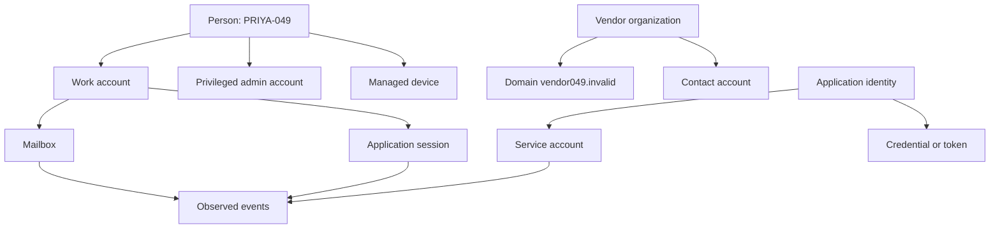
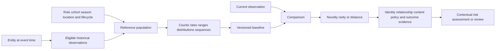
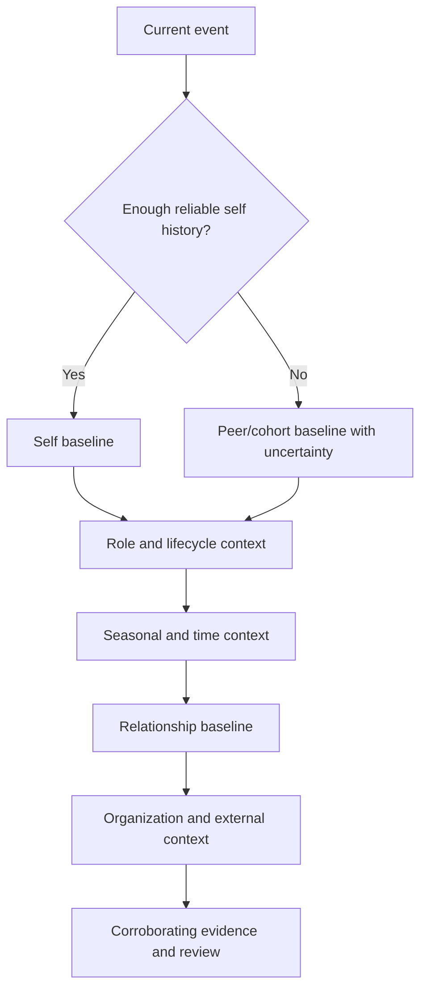
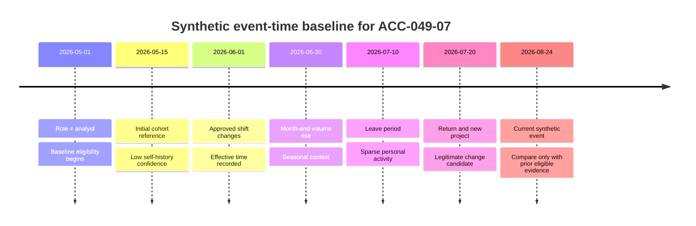
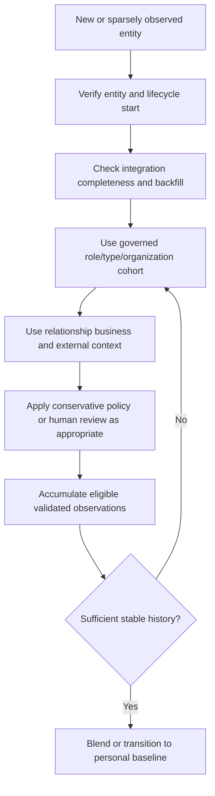
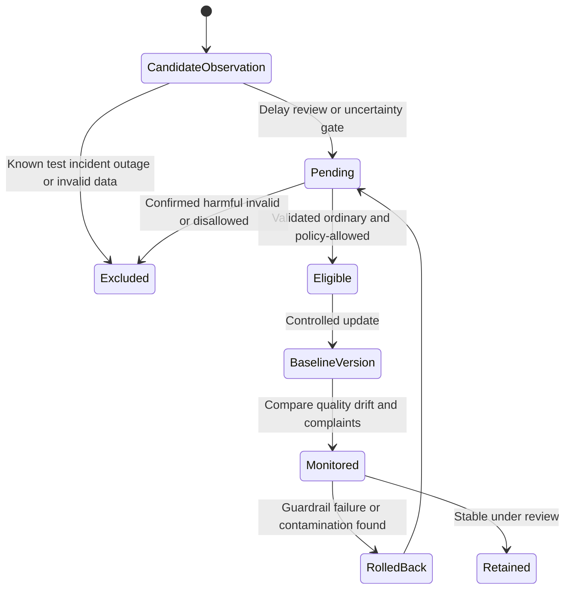
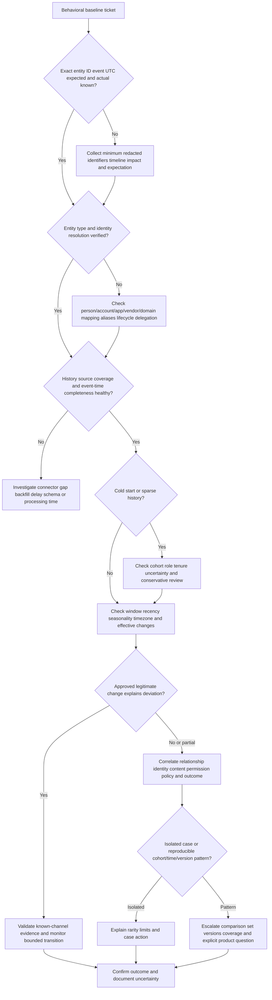

# Part 049 - Identity and Entity Behavioral Baselines

## Section goal

This Part explains how historical and peer context can help describe what is ordinary or unusual for an identity or entity. An **entity** is a thing the system reasons about, such as a person, account, domain, vendor, or application. A **behavioral baseline** is a time- and population-bounded reference describing prior patterns. It is not a personality profile, a permanent truth, or proof that a deviation is malicious.

The practical support goal is to turn vague phrases such as "behavioral AI found an anomaly" into precise questions: Which entity? Which identity resolution? Which history and time zone? Which peer group? Which feature and window? Was the event merely rare, or did corroborating evidence make it risky? Did a new employee, role change, acquisition, season, or system migration create legitimate change? Could contaminated history teach a baseline that malicious activity is normal?

The central rule is:

> A baseline is a documented reference for comparison. Rarity raises a question; context and corroboration determine risk.

Everything here is vendor-neutral unless an official public source is attributed. Abnormal's proprietary entity graph, model design, feature definitions, windows, update cadence, poisoning defenses, thresholds, training data, and score semantics remain unknown. The lab is a local paper exercise using fictional identities and reserved domains only.

## Learning outcomes

After completing this Part, you should be able to:

- distinguish a human person from an account, mailbox, device, domain, vendor, application, and service identity;
- explain why entity resolution and identity lifecycle evidence must precede behavioral comparison;
- build a baseline from histories, cohorts, peer groups, time windows, and event-time context;
- compare personal, entity, relationship, peer, organization, and seasonal reference frames;
- reason about cold start, sparse history, new vendors, new applications, and newly connected data;
- handle hour-of-day, day-of-week, month-end, quarter-end, holidays, leave, and campaign seasonality;
- distinguish legitimate change from risky deviation using effective times and corroborating evidence;
- explain why rarity, novelty, or distance from normal is not automatically risk;
- recognize baseline lag, overadaptation, contamination, and poisoning at a defensive conceptual level;
- describe cautious update, quarantine, rollback, and review concepts without claiming a vendor implementation;
- troubleshoot support-visible symptoms such as "new user flagged," "travel treated as unusual," or "known vendor changed"; and
- tie your support trend analysis, SQL/Python/analytics, Copilot evaluation/training, and customer communication to transferable baseline reasoning only.

## JD Mapping

| Supplied role signal | Capability built | Transferable evidence | Honesty boundary |
|---|---|---|---|
| Behavioral false-positive cases | Tests entity, history, cohort, season, and legitimate change | Evidence-first investigation and fix validation | No Abnormal baseline tuning claim |
| Threat investigation | Correlates unusual behavior with identity, mail, app, and business evidence | Complex Microsoft investigations and critical-situation ownership | No production BEC or identity-detection claim |
| Customer communication | Explains "unusual" without accusing a user or vendor | Technical/nontechnical enterprise updates | No unsupported intent or insider allegation |
| Configuration tickets | Distinguishes missing history, integration health, mapping, and policy | Microsoft cloud/configuration troubleshooting | Product-specific fields and controls require docs |
| Engineering/Product escalation | Supplies entity IDs, windows, expected/actual, comparisons, and change history | Engineering/Product escalation and validation | Protected model details stay with authorized teams |
| Support trends and analytics | Segments cases by cohort, time, tenant change, and symptom | CSAT, backlog, quality, Power BI, SQL/Python skills | Tickets are biased samples, not population truth |
| AI support | Evaluates context, uncertainty, and human review | Copilot/agent evaluation and training | GenAI does not equal behavior-model experience |
| Customer trust/culture | Uses neutral, evidence-based language and privacy minimization | Several years of enterprise support | Avoid profiling, blame, or legal/privacy conclusions |

## Candidate honesty note

| Evidence tier | Safe claim | Prohibited implication |
|---|---|---|
| **Production transfer** | "I have compared affected and unaffected users, timelines, configuration, and support trends in enterprise investigations." | That those comparisons were Abnormal behavioral models |
| **Local/public lab** | "I created synthetic profiles for people, accounts, domains, vendors, and applications and tested cold-start and seasonality hypotheses." | That real employee or customer behavior was analyzed |
| **Learned architecture** | "I understand baseline and entity concepts from official risk, identity, and product sources." | That a generic diagram reproduces a vendor system |
| **No direct experience** | "I have not operated Abnormal AI or its behavioral baselines in production." | Knowledge of hidden features, update rules, or thresholds |
| **Unknown proprietary implementation** | "Exact Abnormal models, features, identity graph, histories, peer construction, windows, scores, and poisoning controls are unknown unless approved documentation states them." | Reverse-engineering or presenting marketing language as specification |

Safe interview language:

> "My transferable method is to identify the entity and event time, compare appropriate history and peers, test legitimate changes, correlate independent evidence, and communicate uncertainty. I have practiced that method on synthetic records only. I would not claim that rarity proves risk or that I know Abnormal's proprietary baseline construction."

## 1. Entity and identity foundations

A **person** is a human. An **account** is a digital identity record used to access or represent activity. One person can have many accounts; one shared account can represent many people; a service account may represent no human user. A **mailbox** stores and exchanges messages. A **domain** is a namespace such as `vendor049.invalid`. A **vendor** is a business relationship that can include several domains, contacts, bank details, and applications. An **application** is software acting for a user or service. Confusing these entities creates false comparisons.



| Entity type | Plain meaning | Useful history | Common confusion | Support-safe identifier |
|---|---|---|---|---|
| Person | Human subject | Role, tenure, approved work context | Treating an account as the person | Synthetic person ID, not name |
| User account | Directory identity | Sign-in, app, resource, message activity | One person equals one account | Tenant-scoped synthetic account ID |
| Privileged account | Account with elevated authority | Admin actions, approved schedule, device | Comparing it with ordinary users | Separate account and role ID |
| Shared mailbox/account | Identity used by a group | Team schedule and authorized operators | Assigning all activity to one person | Shared-resource ID plus operator evidence |
| Domain | DNS/email namespace | First seen, relationship, authentication, use | Domain equals vendor or intent | Defanged/reserved domain ID |
| Vendor | Business entity/relationship | Contacts, invoices, domains, cadence | One domain or sender equals entire vendor | Synthetic vendor ID |
| Application | Software integration/client | Scopes, owner, usage pattern, version | App identity equals user identity | App registration/service ID |
| Service identity | Nonhuman identity | Job schedule, resources, source systems | Human peer group is appropriate | Workload/service ID |
| Device | Endpoint or registered client | Ownership, management, location, health | IP address uniquely identifies device | Synthetic device ID |

**Entity resolution** links records believed to describe the same real-world entity. It can use stable IDs, directories, aliases, verified domain ownership, application registration, and lifecycle records. Name or email-string similarity alone is not sufficient. Merged identities can contaminate history; split identities can make an established entity appear new.

## 🔍 Plain-English deep-dive: A coat-check ticket identifies a coat, not automatically the person wearing it

At a theater, a numbered ticket links a visitor to a stored coat. The ticket is useful because the coat-check system has a controlled issuance process. If two tickets are duplicated or one coat is transferred, the number alone no longer proves who wore the coat earlier.

An account ID is like that ticket. It is a stable reference within a system, but it is not the human being. A shared mailbox can be operated by several people. An automation can use delegated authority. A renamed account can retain an identifier. A re-created account can reuse a familiar address while receiving a new object ID. A person can switch roles and approved devices while remaining the same person.

Before comparing behavior, establish what the entity represents and at what time. Ask whether the directory object existed, whether aliases merged correctly, whether the activity was delegated, whether a service acted on behalf of a user, and whether the identifier is tenant-scoped. A false merge combines unrelated histories and can normalize harmful behavior. A false split removes history and creates cold start.

The coat-check analogy stops where digital authority can be delegated, copied, cached, and active in many systems at once. The lesson remains: entity identity is evidence with provenance, not a name-shaped assumption.

**Memory hook:** Resolve the entity before measuring its behavior.

## 2. What a baseline is

A behavioral baseline summarizes a chosen history or comparison population. It might describe frequency, typical ranges, categorical proportions, relationship age, sequence patterns, or timing. Every baseline has a **subject**, **reference population**, **feature**, **window**, **time semantics**, **aggregation**, **update rule**, and **validity boundary**.



| Baseline component | Question | Example | Failure if omitted |
|---|---|---|---|
| Subject | What entity is compared? | Account `ACC-049-07` | Mixed people/accounts |
| Feature | What behavior is summarized? | Recipient count per message | Vague "behavior" |
| Eligible history | Which past events count? | Prior 60 complete days | Contamination or partial periods |
| Window | How far back and how weighted? | Rolling 30 days, recent-weighted | Stale or unstable reference |
| Time semantics | Event time, ingestion time, or processing time? | Message accepted UTC | Late events distort order |
| Cohort | Which comparable entities contribute? | Same role and region | Inappropriate peer comparison |
| Aggregation | Count, rate, median, distribution, sequence? | Median and robust range | Average hides shape/outliers |
| Version | Which baseline state applied? | `BASE-049-v3` | Cannot reproduce outcome |
| Update rule | When do new observations enter? | After review/lag/filter | Attack may normalize itself |
| Exclusion | Which events do not teach the baseline? | Known test, outage, confirmed incident | Corrupted reference |

A baseline may be descriptive without involving ML. A rolling median and range can be a statistical baseline. A learned embedding or density model can create a richer comparison. Product-specific mechanisms remain unknown.

## 3. Reference frames: self, peers, organization, and relationships

No single reference answers every question. A self baseline asks whether the current event resembles the entity's own past. A peer baseline compares similar entities. An organization baseline provides broad context. A relationship baseline asks whether two entities have interacted this way before. Part 050 develops relationship graphs in detail.

| Reference frame | Main question | Strength | Risk | Example |
|---|---|---|---|---|
| Self/history | Is this normal for this entity? | Personalized | Cold start and legitimate change | User's usual recipients |
| Peer/cohort | Is this normal for comparable entities? | Helps sparse/new entities | Bad cohort can encode bias | New finance analyst versus finance peers |
| Organization | Is this common across the tenant? | Broad context | Can wash out role differences | Typical work hours by region |
| Relationship | Is this interaction normal for this pair? | Captures trust/cadence context | New legitimate relationships | Vendor-contact history |
| Role/process | Does it fit the business workflow? | Explains approved tasks | Role data can be stale | Quarter-end finance activity |
| Seasonal | Is it expected for this time/period? | Reduces calendar false positives | Attackers may exploit seasons | Month-end invoice volume |
| External/population | Is it common more broadly? | Helps novel local entities | Population may not match tenant | Public domain age category |



### Peer-group construction

A **cohort** is a group selected for comparison. Useful cohort dimensions may include role family, privilege, region, tenure, shift, department, application type, vendor category, and business process. Too broad a cohort makes meaningful behavior look unusual or hides role-specific risk. Too narrow a cohort creates unstable statistics and can reveal sensitive attributes.

Peer grouping must be evaluated, documented, and governed. Do not assume coworkers in the same department perform the same tasks. Do not use protected or sensitive attributes casually. Part 057 covers fairness and responsible use.

## 4. Time context, windows, and recency

Behavior changes with time. A **lookback window** defines eligible history before the event. A **rolling window** moves as time advances. A **fixed window** covers a defined calendar period. **Recency weighting** gives newer observations more influence. **Decay** reduces older influence. None is automatically correct.



| Time choice | Benefit | Risk | Support check |
|---|---|---|---|
| Short rolling window | Adapts to recent change | Noisy; can normalize attack quickly | Compare stable longer reference |
| Long rolling window | Stable history | Stale after role/process change | Check lifecycle effective dates |
| Exponential decay | Smooth preference for recent data | Harder to explain; old influence remains | Document weighting/version |
| Calendar-matched | Captures weekday/month/quarter season | Sparse matching periods | Compare multiple cycles |
| Event-time window | Reflects what happened before decision | Needs correct clocks/late data handling | Normalize timestamps and delays |
| Processing-time window | Operationally easy | Late events can enter wrong order | Measure ingestion lag |
| Separate pre/post-change | Avoids mixing regimes | Requires trusted change record | Verify role/migration change |

The baseline used for a decision must contain only evidence legitimately available then. Reconstructing with today's history can produce **hindsight contamination**: later normal events make the earlier anomaly appear ordinary.

## 🔍 Plain-English deep-dive: A baseline is a moving rear-view mirror, not a windshield

A driver uses a rear-view mirror to understand what is behind. The mirror is useful, but it cannot show a road that has never been traveled, and its view changes as the car moves. A behavioral baseline similarly summarizes eligible past observations. It does not know a new employee's future role, an acquisition that has not been recorded, or an attacker's intent.

A very short mirror shows recent detail but can shake with every bump. A very long mirror may preserve an old route after the vehicle turns. Recency weighting balances those effects but introduces design choices. If an attacker repeatedly performs small actions and those actions enter the reference, the mirror can gradually depict the malicious route as normal.

The current event must not be placed into its own reference before comparison. Later events also must not leak backward when explaining an earlier outcome. Event time, processing delay, role effective time, and baseline version are essential evidence.

The driving analogy stops because baselines can combine peers, relationships, and learned representations rather than one visual history. The lesson is durable: a baseline describes selected past context; it does not foresee or certify the present.

**Memory hook:** Compare the present with eligible prior history, not with hindsight.

## 5. Cold start and sparse history

**Cold start** occurs when an entity lacks enough reliable history for a personalized comparison. Common cases include a new employee, new account, new domain, new vendor, new application, newly connected tenant, re-created identity, or recently enabled data source. Sparse history should increase uncertainty, not automatically risk.



| Cold-start entity | Useful context | Unsafe shortcut | Better action |
|---|---|---|---|
| New employee | Role, manager, region, approved start | Treat every first contact as risky | Peer plus workflow context and review |
| New vendor | Procurement approval, known-channel verification | Assume no history means fraud | Verify independently and build relationship history |
| New domain | Ownership, authentication, business record | Domain age alone decides | Combine technical and business evidence |
| New application | Owner, scopes, approval, rollout | Compare with human accounts | App-type and intended schedule baseline |
| New service account | Job definition, resources, schedule | Use employee work-hour cohort | Workload-specific expected behavior |
| Newly connected tenant | Backfill coverage, connector health, start time | Interpret partial history as normal | Mark confidence and data completeness |
| Re-created account | Object ID and lifecycle event | Merge by familiar email string | Treat identities separately until verified |

Cold-start strategies are generic concepts: cohort priors, conservative review, explicit uncertainty, staged learning, and minimum-history gates. Do not claim Abnormal uses any particular strategy.

## 🔍 Plain-English deep-dive: A new restaurant has no personal sales history, but the neighborhood still provides context

Imagine a restaurant opening today. It has no history of its own, so nobody can truthfully say that serving 80 lunches is above or below its personal norm. A planner can still compare similar restaurants in the neighborhood, account for opening-week promotions, inspect seating capacity, and ask whether a festival is happening. Those comparisons provide a starting context, not a permanent identity for the restaurant.

A new account, vendor, domain, or application has the same cold-start problem. A role or entity-type cohort can supply a cautious prior reference. Business records can show intended purpose. Organization and seasonal context can explain an opening-week surge. As eligible observations accumulate, a personal reference becomes more informative. The transition should be controlled: a handful of early events should not define "normal" forever, and a confirmed incident should not teach the reference.

Cold start also appears falsely when data is missing. A long-established vendor can look new after an entity-mapping split or connector reset. A re-created account can use a familiar address but have a different object ID. Before applying cohort logic, verify identity lifecycle and source coverage.

The restaurant analogy stops because digital actions can be automated at high speed, delegated, and adversarially manipulated. Its useful lesson is that no personal history does not mean no context. Use peers and purpose carefully, expose uncertainty, and earn personalization from validated observations.

**Memory hook:** During cold start, borrow context cautiously; do not borrow certainty.

## 5A. Building a synthetic profile from several feature families

A useful entity profile rarely consists of one average. It can summarize **numeric features** such as recipient count, **categorical features** such as common application, **temporal features** such as hour-of-week, **set features** such as usual resources, and **sequential features** such as sign-in followed by report generation. Each summary answers a different question.

Consider a fictional service identity with ten eligible daily recipient counts:

$$
1,\ 1,\ 2,\ 2,\ 2,\ 3,\ 3,\ 3,\ 4,\ 19
$$

The arithmetic mean is:

$$
\bar{x}=\frac{1+1+2+2+2+3+3+3+4+19}{10}=\frac{40}{10}=4
$$

The **median** is the middle of the ordered observations. With ten values, average the fifth and sixth values:

$$
\operatorname{median}=\frac{2+3}{2}=2.5
$$

The value `19` pulls the mean upward. If that event was an approved monthly report, it may be a seasonal mode rather than noise. If it was a confirmed compromise, it should not silently define ordinary behavior. The correct response is not automatically to delete the outlier; it is to preserve provenance, identify the event type, and choose a representation that respects the business process.

One robust spread summary is **median absolute deviation** (MAD). First calculate each distance from the median `2.5`:

$$
1.5,\ 1.5,\ 0.5,\ 0.5,\ 0.5,\ 0.5,\ 0.5,\ 0.5,\ 1.5,\ 16.5
$$

The median of these ten distances is `0.5`, so:

$$
\operatorname{MAD}=0.5
$$

MAD is less dominated by one extreme value than the ordinary range. It still has limitations: repeated/discrete values can produce zero MAD; multimodal and seasonal behavior can make one center misleading; and a distance does not measure maliciousness.

| Feature family | Synthetic profile representation | Current observation | Question raised | Important caveat |
|---|---|---|---|---|
| Numeric | Median recipients `2.5`, MAD `0.5` | `19` recipients | Is this a seasonal batch or unusual burst? | Distance is not risk |
| Categorical | Approved app used in 96/100 events | Unknown app | Is the app new, renamed, or unauthorized? | Rare categories can be legitimate |
| Temporal | Typical schedule 02:00-02:20 UTC | 04:00 UTC | Was there an effective-dated schedule change? | Time zone and job delay matter |
| Set/resource | Usual resources `{R1,R2}` | Resource `X` | Is access approved for this workload? | New project can expand set |
| Relationship | Known recipient groups `{FinanceOps}` | New executive group | Is there an approved workflow? | Known relationship can still be abused |
| Sequence | Sign-in -> report read -> write summary | Sign-in -> grant consent | Is the action sequence authorized? | Missing telemetry can break sequences |
| Volume rate | 100-120 records per daily run | 305 records | Migration, backlog, or misuse? | Denominator and period matter |
| Data quality | 99% event completeness | 62% completeness | Is apparent novelty caused by missing history? | Completeness estimate needs evidence |

### Multimodal behavior

**Multimodal** means the distribution has more than one ordinary pattern. A person may work from two regions, a shared mailbox may have weekday and month-end modes, and an application may run both hourly checks and a weekly batch. One average placed between modes can describe neither mode correctly.

For a fictional user whose message times cluster near 08:00 and 20:00 UTC, the average near 14:00 UTC might be uncommon. Better choices include separate mode profiles, hour-of-week categories, role/shift context, or sequence-based comparison. The right design depends on enough data and privacy-governed purpose.

### Categorical frequency and unseen values

Suppose an approved application appears in 96 of 100 eligible events, a backup application appears four times, and a third application has never appeared. Frequencies are `96%`, `4%`, and `0%` in that finite history. A zero historical count does not mean impossible or malicious. The application may be newly approved, renamed, absent during the window, or genuinely unauthorized.

Use **smoothing** at a conceptual level when estimating categorical probabilities so unseen categories do not automatically receive impossible probability. The exact method is model-specific and must not be attributed to Abnormal. In support, the more important step is checking application registration, owner, scope, approval effective time, and source completeness.

### Rates require denominators

"Twenty external messages" lacks context. Twenty out of twenty messages is different from twenty out of twenty thousand. A rate can be written:

$$
	ext{External-message rate}=\frac{\text{external messages}}{\text{all eligible messages}}
$$

If an account sent 20 external messages out of 200 total, the rate is:

$$
\frac{20}{200}=0.10=10\%
$$

If the previous week was 5 out of 50, that rate was also `10%`; volume changed but proportion did not. Both count and rate may matter for workload and risk. Always name the numerator, denominator, window, eligibility, and data completeness.

### Sequence context

Individual events can look ordinary while their order is unusual. A service identity may normally authenticate, read one resource, calculate locally, and write a summary. A sequence that authenticates, creates a new credential, changes a permission, and exports data asks a different question even if each event type occurs elsewhere in the organization.

Sequence analysis is sensitive to missing events and clock order. Before declaring a sequence novel, check timestamp normalization, ingestion lag, duplicate suppression, and source coverage. A process change can introduce a new legitimate sequence; a compromised identity can deliberately mimic ordinary event frequency while changing order or target.

### Profile card

| Profile field | Synthetic value | Evidence status | Uncertainty note |
|---|---|---|---|
| Entity | `SVC-049-03` service identity | Registry fixture | Owner identity is synthetic |
| Purpose | Reporting automation | Approved fixture | No real production purpose |
| Eligible window | Prior 60 complete days | Design choice | Window sufficiency untested |
| Schedule modes | Daily 02:00; weekly 04:00 | Fictional history | Late jobs can widen times |
| Resource set | `R-049`, `R2-049` | Fictional history | New resource needs approval evidence |
| Volume summaries | Median, MAD, mode-specific range | Hand calculation | Multimodal periods separated |
| Application | `APP-049-04` | Registry fixture | Registration approval synthetic |
| Exclusions | Tests, outages, confirmed incidents | Policy design | Product implementation unknown |
| Baseline version | `BASE-049-v1` | Lab identifier | No vendor equivalence |
| Update state | Candidate -> pending -> eligible | Defensive concept | Exact update method unknown |

This card prevents "the AI knows the user" language. It shows a bounded, inspectable reference and its unknowns. A production product may use far richer representations; the support discipline still applies: define the entity, time, evidence, comparison, uncertainty, and decision layer.

## 6. Seasonality and legitimate cycles

**Seasonality** is repeated variation associated with time. It can be hourly, daily, weekly, monthly, quarterly, annual, or event-driven. Finance often changes near month-end; retail activity changes near holidays; global teams span time zones; support queues change around launches; employees take leave.

| Cycle | Legitimate explanation | Risk that can hide within it | Comparison idea |
|---|---|---|---|
| Hour of day | Shift, travel, global collaboration | Stolen session at unusual hour | User and role/region schedule plus device/session evidence |
| Day of week | Weekend operations or on-call | Persistence during low staffing | Compare approved on-call periods |
| Month-end | Invoice close and payments | Vendor/payment fraud | Known-channel workflow and relationship evidence |
| Quarter-end | Sales and finance volume | Urgent executive impersonation | Same-quarter prior cycles and approval chain |
| Holiday | Campaigns, leave, reduced staff | Social-engineering pretext | Holiday calendar and verified coverage |
| Product launch | New recipients/apps/volume | Abusive automation | Change ticket, owners, rate, and content context |
| Acquisition | New domains, vendors, identities | Supply-chain compromise | Migration plan and staged baseline reset |
| Academic/fiscal year | Enrollment or budget activity | Bulk phishing timed to cycle | Multi-year matched periods |

Seasonality is not a blanket excuse. Attackers can imitate legitimate cycles. The analyst should ask whether the event fits the detailed process: approved actors, known recipients, amount range, application, device, sequence, and independent verification.

## 7. Legitimate change and concept change

People and organizations evolve. A promotion, new project, travel, leave, merger, remote-work policy, vendor migration, or application rollout can make the old baseline stale. Use effective-dated change evidence and separate pre-change from post-change observations.

```mermaid
sequenceDiagram
    participant Change as Approved business change
    participant Directory as Identity/configuration source
    participant Baseline as Baseline process concept
    participant Event as Current event
    participant Analyst as Support/analyst review
    Change->>Directory: Record role/vendor/app effective time
    Directory->>Baseline: Provide governed lifecycle context
    Event->>Baseline: Compare using event-time eligible reference
    Baseline-->>Analyst: Return deviation plus uncertainty/context
    Analyst->>Change: Verify known-channel approval and scope
    Change-->>Analyst: Confirm, contradict, or leave unknown
    Analyst->>Baseline: Submit governed feedback; do not assume instant learning
```

| Change type | Evidence | Baseline treatment concept | Remaining risk |
|---|---|---|---|
| Role transfer | Effective-dated HR/directory record | Preserve old history separately; use new peer context | Compromised account can exploit transition |
| Travel | Approved itinerary/policy and known-channel user check | Temporary location/time context | Travel evidence can be spoofed or stale |
| New project | Change ticket, manager, collaborators | Time-bounded relationship expansion | Scope creep beyond project |
| Vendor migration | Procurement and verified contacts/domains | Link verified successor with cautious transition | Compromised vendor or lookalike |
| App rollout | Owner, scopes, cohort, schedule | Application-specific baseline | Overprivilege or unauthorized replica |
| Reorganization | Effective department/manager graph | Rebuild peer groups with versioning | Mapping lag and fairness issues |
| Leave/return | Authorized lifecycle dates | Avoid interpreting inactivity/return as attack alone | Credentials may have been exposed during leave |

## 8. Rarity, anomaly, and risk

**Rarity** means an observation is uncommon under a defined reference. **Novelty** means it has not been observed in the relevant history. **Anomaly score** is a method-specific measure of unusualness. **Risk** combines possible harm, likelihood/uncertainty, asset value, threat evidence, control context, and business consequences. The concepts overlap but are not equivalent.

| Observation | Rarity | Corroborating context | Safer interpretation |
|---|---:|---|---|
| New recipient for a new salesperson | High | Approved role/start and CRM assignment | Likely legitimate cold start; monitor |
| New recipient plus lookalike domain and payment change | High | Identity/business fraud signals | Elevated risk; independent verification |
| Midnight service-account action | Low if scheduled | Correct job/device/resource | Expected automation |
| Frequent message to known vendor with changed bank details | Low relationship rarity | High business-risk content | Common relationship can still be risky |
| Rare attachment type from verified project partner | High | Approved project and safe file handling | Review without declaring malicious |
| Ordinary login followed by malicious OAuth grant | Login low rarity | Grant/permission anomaly | Risk arises from action and authority |

One mathematically simple rarity measure for a categorical event is empirical frequency. If a category occurred $k$ times in $n$ eligible prior observations, the estimated frequency is:

$$
\hat{p}=\frac{k}{n}
$$

If a recipient domain appeared 2 times in 100 eligible messages, $\hat{p}=2/100=0.02=2\%$. That estimate is sensitive to window, grouping, sparse data, and changing behavior. It is not a maliciousness probability.

## 🔍 Plain-English deep-dive: A fire alarm detects unusual smoke conditions, not the legal cause of a fire

A smoke alarm reacts to a measured condition. Burnt toast, steam, dust, and a dangerous fire can all create alarm-like signals. The alarm is valuable because it prompts timely checking, but it does not establish intent, liability, exact location, or cause.

Behavioral anomaly signals work similarly. A new domain, unusual hour, larger recipient count, or changed application can justify investigation. Those signals can also arise from legitimate business change. Conversely, a sophisticated attack may imitate normal frequency and relationships, so low rarity does not establish safety.

Risk assessment combines the signal with asset importance, permissions, content, identity/session evidence, relationship history, threat indicators, configuration, and business verification. Human review should remain neutral: "unusual under this reference" is defensible; "the employee is malicious" is not.

The fire-alarm analogy stops because model outputs may combine many features and operational actions can be automated. It still provides the best beginner rule: detection is a prompt for evidence-based response, not a verdict about cause or intent.

**Memory hook:** Rare is a question. Risk is a contextual judgment.

## 9. Baseline updates, contamination, and poisoning caution

A baseline must adapt, but adaptation creates risk. **Contamination** means unsuitable observations enter reference history. **Poisoning** is intentional manipulation of data or learning to degrade or redirect behavior. This Part stays defensive: it explains safeguards, not attack recipes.



| Update hazard | Example | Effect | Defensive concept |
|---|---|---|---|
| Instant self-inclusion | Current event enters baseline before scoring | Event makes itself look less unusual | Compare first, update later |
| Confirmed-incident inclusion | Compromise history treated as normal | Persistence becomes expected | Incident exclusion and rebaseline review |
| Slow malicious repetition | Repeated small deviations | Gradual normalization | Stable reference, rate/change monitoring, review gates |
| Data outage | Missing events shrink observed behavior | False novelty after recovery | Health/coverage markers and backfill handling |
| Bulk migration | New entities overwhelm cohort | Cohort distribution shifts suddenly | Change-aware version and canary monitoring |
| Wrong entity merge | Attacker/vendor history joins legitimate entity | Contaminated relationship | Stable identifiers and merge audit |
| Reviewer feedback echo | Reviewers copy model result | Labels reinforce output | Independent review and disagreement sampling |
| Overfast adaptation | Legitimate/risky distinction disappears | Baseline chases every event | Minimum evidence and controlled update |
| Frozen baseline | No adaptation after role/process change | Persistent false positives | Versioned rebaseline with rollback |

Generic safeguards include delayed updates, holdout monitoring, explicit exclusions, robust aggregation, change-point review, stable long-term comparison, minimum-history gates, reviewer separation, provenance, versioning, and rollback. Never state that Abnormal uses a safeguard unless an approved source confirms it.

## 10. Baseline quality and uncertainty

| Quality dimension | Healthy evidence | Warning sign | Support action |
|---|---|---|---|
| Coverage | Expected source/time/entity events present | Connector gap or partial backfill | Check integration health/window |
| Identity integrity | Stable unique entity mapping | Merge/split/rename mismatch | Reconcile object IDs and lifecycle |
| Recency | Window fits business change rate | Old behavior dominates | Compare pre/post-change versions |
| Sample size | Enough eligible observations | One or two events define normal | Use cohort and state uncertainty |
| Representativeness | History covers ordinary cycles | Only incident/holiday period | Expand or segment period |
| Robustness | Outliers do not dominate summary | Mean shifts from one burst | Use robust summary/review |
| Seasonality | Matched calendar context | Month-end treated as generic day | Compare matched cycles |
| Explainability | Reference and deviation are describable | "AI says unusual" only | Request documented contribution/context |
| Governance | Purpose, access, retention, version recorded | Undocumented personal profiling | Escalate privacy/governance question |

Uncertainty should be explicit. Cold-start uncertainty, missing-data uncertainty, identity-resolution uncertainty, label uncertainty, and model uncertainty are different. A generic "low confidence" label can conceal which evidence is missing.

## 11. Support-visible symptoms and hypotheses

| Customer symptom | Plausible hypotheses | Discriminating evidence | Do not assume |
|---|---|---|---|
| New employee activity repeatedly flagged | Cold start, wrong cohort, missing role/start record, actual risky behavior | Object ID, start/effective dates, peer context, event details | All new-user flags are defects |
| Known vendor appears new | Domain/contact change, entity split, alias mapping, data gap, lookalike | Verified vendor IDs/domains, relationship history, connector coverage | Familiar display name proves same vendor |
| Travel creates unusual sign-in | Approved travel, VPN/proxy, timezone, compromised session | Known-channel confirmation, device/session, network context | Geolocation is exact or causal |
| Service account compared with humans | Entity-type error, wrong peer group | Workload ID, owner, schedule, app/resource | Nonhuman identity follows office hours |
| Behavior changed after migration | Baseline reset, missing backfill, new identifiers, genuine config issue | Migration time, mapping, coverage, versions | Model drift is the only cause |
| Repeated incident becomes less unusual | Baseline contamination, policy change, attacker mimicry, display change | Event-time versions, update/exclusion evidence | Product "learned the attack" without proof |
| Month-end false positives | Seasonality absent, vendor/process change, actual fraud attempt | Prior month-ends, amounts, approval workflow | Calendar explains every event |

## Troubleshooting decision tree



## 12. Worked example 1: New finance analyst

### Inputs

`PERSON-049-01` starts as a finance analyst on August 1. The account sends a first message to twelve internal recipients at 08:00 local time about a documented month-end process. The self-history contains only five days. A customer asks why the activity was considered unusual.

### Reasoning

The event can be novel for the account while ordinary for the role and process. Verify account object ID, start date, role, region/time zone, recipient group, approved month-end procedure, and message evidence. State that personal history is sparse. Compare with a governed finance cohort and matched month-end periods, but do not let peer similarity override suspicious content or identity evidence.

### Conclusion

"Cold-start novelty" is a hypothesis, not a verdict or defect. If approved role/process evidence and identity controls corroborate the action, support can explain the bounded uncertainty and monitor transition. If the message requests an unusual payment path or comes from an unfamiliar session, escalate regardless of cohort normality.

## 13. Worked example 2: Vendor domain migration

### Inputs

Vendor `VEN-049-02` historically uses `oldvendor049.invalid`. Procurement records an effective migration to `newvendor049.invalid`. A payment-change message arrives two days later from the new domain.

### Reasoning

The new domain has no direct history. Do not merge solely because the display name matches. Independently verify the migration through a known trusted channel, domain/authentication evidence, contact ownership, effective date, procurement record, and payment-control workflow. Even a legitimate migration does not prove changed bank details are safe.

### Conclusion

The baseline can treat the domain as a new linked entity with documented transition context, but business verification remains required. Record both the relationship continuity evidence and the residual fraud risk.

## 14. Worked example 3: Service-account schedule change

### Inputs

`SVC-049-03` normally accesses a reporting resource at 02:00 UTC. A planned job migration changes the schedule to 04:00 UTC and triples volume. Alerts begin immediately.

### Reasoning

Verify the service identity, application owner, change ticket, deployment time, expected resource, source environment, volume, and least-privilege scope. Split pre- and post-change regimes. Do not compare the service account with human office-hour peers. Check for actions outside the approved schedule or resource set.

### Conclusion

An effective-dated application change can explain the shift, but validation must prove observed behavior matches the approved plan. A broad "relearn normal" request is unsafe without scope, rollback, and monitoring.

## 15. Worked example 4: Repeated low-volume compromise

### Inputs

A fictional compromised account sends one unusual external message daily for twenty days. The deviation score decreases over time in the synthetic worksheet.

### Reasoning

Possible explanations include legitimate adaptation, baseline contamination, UI/score transformation, policy change, increasing relationship history, or missing evidence. Do not claim poisoning from the symptom. Reconstruct event-time baseline versions, check update eligibility/exclusions, compare a stable historical reference, inspect identity and recipient evidence, and ask the product owner to confirm documented update semantics.

### Conclusion

The support escalation should say: "Repeated suspicious events correlate with decreasing displayed unusualness; implementation cause is unconfirmed." Include exact synthetic IDs, times, versions, independent risk evidence, and the explicit question.

## 16. Customer-safe language

### Explain unusualness

> "The event differs from the selected prior or peer reference in `[Documented dimension]`. That observation is contextual evidence, not proof of malicious intent. We are checking entity mapping, data coverage, lifecycle changes, seasonality, relationship history, and independent security/business evidence."

### Explain cold start

> "This entity has limited eligible history in the available window, so a personal comparison carries additional uncertainty. We are validating role/type context and source completeness rather than treating newness itself as risk."

### Explain an unknown proprietary detail

> "I can explain the generic baseline concept and the observable case evidence, but the exact product feature, window, weighting, or update rule is proprietary or not present in the approved documentation I have. I have escalated that specific question to the authorized owner."

### Avoid accusatory profiling

Do not write "the employee behaved maliciously" based on a baseline. Write "the account event was unusual under the stated reference and requires corroboration." Separate human identity from account activity and route insider, HR, legal, or privacy concerns to authorized owners.

## 17. Common failure modes

| Failure | Why it fails | Better behavior |
|---|---|---|
| Person equals account | Delegation/shared/service identities exist | Resolve entity and operator context |
| Name-string merge | Lookalikes, reuse, aliases, and re-creation occur | Use stable scoped IDs and verified links |
| One baseline fits all | Roles, applications, seasons, and relationships differ | Select and document reference frame |
| Rare equals malicious | Legitimate novelty is common | Corroborate risk and business context |
| Common equals safe | Trusted relationships can be compromised | Inspect mechanism and authority |
| New employee equals high risk | Cold start creates uncertainty, not guilt | Use governed cohorts and review |
| Peer group is automatically fair | Cohort choices can encode error/bias | Evaluate composition and subgroup impact |
| Average describes behavior | Skew/outliers/sequences can matter | Use distributions and robust summaries |
| Current profile explains past decision | Hindsight changes history | Reconstruct event-time version |
| Fast adaptation is always good | Attacks can contaminate reference | Controlled update and stable comparison |
| Frozen history is always safe | Legitimate changes cause persistent errors | Versioned rebaseline after verified change |
| Missing event means no activity | Coverage/retention/query can fail | Prove source health and window |
| Travel location proves compromise | Geolocation/proxy/VPN are imperfect | Correlate device/session and known-channel facts |
| Month-end explains payment change | Attackers exploit business cycles | Independent payment verification |
| Marketing describes model internals | Public claims lack technical detail | Attribute only high-level wording |
| Support ticket is a clean label | Reporting and selection are biased | Govern labels and seek denominators |

## 18. Escalation packet

| Field | Required content |
|---|---|
| Case question | Precise expected/actual outcome and impact |
| Entity map | Person/account/domain/vendor/app IDs and verified links |
| Event time | UTC plus local context, ingestion delay, lifecycle effective times |
| Source coverage | Integration health, start/backfill, missing periods, retention |
| Reference hypothesis | Self/peer/organization/relationship/season and proposed window |
| Legitimate changes | Role, travel, project, vendor, app, migration evidence |
| Corroboration | Identity, relationship, message, content, permission, business evidence |
| Comparison set | Small redacted matched affected/unaffected examples |
| Pattern | Numerator, denominator, cohort, time, version, duplicates |
| Unknowns | Exact proprietary features/windows/updates/scores not assumed |
| Ask | Confirm semantics, mapping, baseline version, defect, or next evidence |
| Privacy | Minimum necessary fields, redaction, access, retention, deletion |

## Safe synthetic lab: The Synthetic Entity Baseline Garden 049

### Objective

Create baseline profiles for fictional people, accounts, domains, vendors, applications, and service identities; test cold start, seasonality, legitimate change, rarity-versus-risk, and baseline-contamination hypotheses. The unique lab is **The Synthetic Entity Baseline Garden 049**.

This is a paper/local calculation lab. It does not train or query a model. It uses no customer data, model/API upload, account, tenant, portal, live prompt, attack, or product claim.

### Prerequisites

- Local Markdown editor, paper, or local spreadsheet only.
- This Part and the synthetic fixtures below.
- A local calculator for counts, fractions, medians, and percentages.
- No external AI service, model API, hosted notebook, identity provider, email tenant, or Abnormal access.
- Artifact label: **local/public lab - synthetic baseline tables only**.
- Record UTC start, purpose, authorization boundary, and zero-real-data statement.

### Privacy and authorization boundary

Authorized:

- copy fictional IDs and `.invalid` domains locally;
- calculate simple frequencies and compare defined windows;
- draw entity and baseline diagrams;
- write hypothetical support explanations and escalations; and
- cite verified official public sources.

Prohibited:

- real employee/customer/account/domain/vendor/application/message/sign-in data;
- model, API, portal, tenant, account, log, or product access;
- uploads to AI tools, cloud spreadsheets, or hosted notebooks;
- live profiling, surveillance, prompt attacks, security-control tests, or production changes;
- claims that fixtures represent Abnormal fields, thresholds, models, or outcomes.

### Synthetic entity registry

| Entity ID | Type | Lifecycle context | Intended behavior | Change evidence |
|---|---|---|---|---|
| PERSON-049-01 | Person | New finance analyst, starts Aug 1 | Month-end finance collaboration | HR-CHANGE-049-01 |
| ACC-049-01 | User account | Owned by PERSON-049-01 | Interactive work from managed device | DIR-049-01 |
| SHARED-049-02 | Shared mailbox | Five finance operators | Invoice intake during business cycle | OWNER-049-02 |
| SVC-049-03 | Service identity | Reporting automation | Scheduled resource access | APP-CHANGE-049-03 |
| APP-049-04 | Application | Approved reporting app | Read synthetic report resource | APPROVAL-049-04 |
| VEN-049-05 | Vendor | Existing supplier | Weekly invoice messages | PROC-049-05 |
| oldvendor049.invalid | Domain | Historical vendor domain | Prior verified messages | DOMAIN-049-A |
| newvendor049.invalid | Domain | Migration effective Aug 20 | New verified channel candidate | DOMAIN-049-B |

### Synthetic event table

| Event ID | UTC time | Entity | Action | Counterparty/resource | Count/value | Context |
|---|---|---|---|---|---:|---|
| EVT-049-01 | 2026-08-02 08:00 | ACC-049-01 | Internal message | Finance group | 12 recipients | New employee |
| EVT-049-02 | 2026-08-15 08:10 | ACC-049-01 | Internal message | Finance group | 14 recipients | Routine cycle |
| EVT-049-03 | 2026-08-24 08:05 | ACC-049-01 | Internal message | Finance group | 13 recipients | Current event |
| EVT-049-04 | 2026-08-01 02:00 | SVC-049-03 | Report read | Resource R-049 | 100 records | Old schedule |
| EVT-049-05 | 2026-08-22 04:00 | SVC-049-03 | Report read | Resource R-049 | 300 records | Approved migration |
| EVT-049-06 | 2026-08-23 04:00 | SVC-049-03 | Report read | Resource R-049 | 305 records | New schedule |
| EVT-049-07 | 2026-08-24 04:00 | SVC-049-03 | Report read | Resource X-049 | 300 records | Wrong resource candidate |
| EVT-049-08 | 2026-08-19 15:00 | VEN-049-05 | Invoice message | SHARED-049-02 | 1 | Old domain |
| EVT-049-09 | 2026-08-22 15:00 | VEN-049-05 | Payment change | SHARED-049-02 | 1 | New domain |
| EVT-049-10 | 2026-08-24 23:30 | ACC-049-01 | OAuth consent | APP-X-049 | 1 | Unapproved app candidate |

### Lab steps

1. Create `The Synthetic Entity Baseline Garden 049`; record UTC, evidence label, purpose, and zero-real-data statement.
2. Draw a person-account-mailbox-device-application-vendor-domain graph from the registry.
3. Explain why each entity needs a separate identifier and baseline. Identify delegation and one-to-many mappings.
4. Create a data dictionary for every registry/event field with type, meaning, event-time availability, source, privacy purpose, and retention note.
5. Define six reference frames: self, peer, organization, relationship, role/process, and seasonal. Give one strength and failure mode for each.
6. Design a baseline card for ACC-049-01: subject, feature, history, window, timezone, cohort, aggregation, update rule, exclusions, version, and uncertainty.
7. Mark ACC-049-01 as cold start and propose a governed finance-role cohort. List information that must not be inferred.
8. Compare EVT-049-01 through EVT-049-03. Calculate recipient-count mean, median, range, and empirical frequency of the finance-group counterparty.
9. Build an event-time timeline around HR-CHANGE-049-01. Ensure no later event enters an earlier decision reference.
10. Separate the SVC-049-03 pre- and post-migration regimes. Explain why EVT-049-07 remains concerning even though time and volume match the new schedule.
11. Analyze EVT-049-09 as a new-domain and payment-change event. Build independent known-channel verification questions without contacting anyone.
12. Analyze EVT-049-10. Explain why ordinary account message behavior does not make an unapproved app consent safe.
13. Create a seasonality table for weekday, month-end, quarter-end, holiday, leave/return, and migration.
14. Write four rarity statements and rewrite each into a risk-aware statement with corroboration and uncertainty.
15. Create baseline-update eligibility states: candidate, pending, eligible, excluded, versioned, monitored, rolled back.
16. Add four contamination/poisoning hypotheses at defensive high level and one guardrail per hypothesis. Include no operational attack method.
17. Simulate a connector gap from August 10-14. Explain how missing coverage changes every conclusion.
18. Write one customer update for cold start, one for legitimate change, and one for an unresolved product-specific baseline question.
19. Build an escalation packet using the template above and an explicit ask about documented semantics rather than hidden internals.
20. Deliver a 90-second spoken explanation tying support comparisons, analytics/SQL/Python, Copilot evaluation/training, and customer communication only as transferable facts.
21. Complete source, privacy, cleanup, rubric, and zero-activity checks.

### Expected evidence

- A resolved entity graph and identity-boundary explanation.
- Registry and event data dictionaries.
- Six reference-frame comparison rows.
- Complete ACC-049-01 baseline card.
- Cold-start cohort and uncertainty plan.
- Hand-calculated count summaries and event-time timeline.
- Pre/post service-identity change analysis.
- New vendor-domain/payment verification worksheet.
- Rarity-versus-risk rewrites and corroboration matrix.
- Seasonality and legitimate-change table.
- Defensive update/contamination guardrail state machine.
- Missing-coverage impact analysis.
- Three customer-safe updates and one escalation packet.
- Spoken honesty explanation and source ledger dated August 24, 2026.
- Privacy, cleanup, and zero-live-activity attestation.

### Cleanup and privacy

- Confirm every ID contains `049` and every domain ends `.invalid`.
- Remove accidental real names, users, employers, customers, tenants, accounts, domains, vendors, applications, events, messages, sign-ins, roles, locations, or identifiers.
- Confirm the artifact never left the local machine and was not uploaded to a model, API, cloud document, portal, or hosted notebook.
- Confirm no account, tenant, product, identity provider, vendor, user, prompt, attack, or control was accessed or tested.
- Delete the artifact if real or confidential information cannot be removed reliably.
- Retain only the local synthetic artifact if useful.
- Record cleanup UTC and: `Synthetic paper baseline exercise only; zero live data, model, API, account, upload, profiling, attack, or production activity.`

### Validation rubric

| Dimension | Fail | Developing | Pass |
|---|---|---|---|
| Entity resolution | Treats person/account/domain as interchangeable | Lists entity types | Uses stable IDs, lifecycle, delegation, and merge/split cautions |
| Baseline definition | Says "normal behavior" only | Gives a history | Specifies subject, feature, population, window, time, aggregation, update, exclusion, version |
| Reference choice | Uses self only | Adds peers | Compares self, peer, organization, relationship, process, and season |
| Cold start | Calls newness risky | Notes limited history | Uses uncertainty, governed cohorts, health checks, and staged history |
| Time | Uses current profile for all events | Records timestamps | Uses event-time windows, effective dates, delays, and versions |
| Rarity/risk | Equates unusual with malicious | Adds one caveat | Correlates independent identity, relationship, business, and security evidence |
| Change | Tells model to relearn | Checks role change | Separates regimes, verifies change, scopes transition, monitors residual risk |
| Update safety | Includes every event | Excludes incidents manually | Uses eligibility, delay, provenance, monitoring, and rollback concepts |
| Privacy | Profiles real people | Uses synthetic data but uploads | Local synthetic IDs, minimization, cleanup, and no-upload attestation |
| Honesty | Claims Abnormal baseline knowledge | Says generic only | Explicitly labels transfer, lab, learned architecture, and unknown implementation |

## 19. Official Source Anchors

All sources were accessed on **August 24, 2026**. Revalidate them before interview or production use. Official sources anchor risk, identity, behavior-analytics, and attributed public positioning; none reveals Abnormal's proprietary entity graph, features, histories, peer groups, windows, update rules, thresholds, training data, scores, or poisoning defenses.

| Official source | What it anchors | Boundary |
|---|---|---|
| [NIST AI Risk Management Framework 1.0](https://www.nist.gov/itl/ai-risk-management-framework) | Context, lifecycle, measurement, governance, and risk management | Voluntary framework; not product design |
| [NIST AI RMF Playbook](https://airc.nist.gov/AI_RMF_Knowledge_Base/Playbook) | Context of use, data, drift, monitoring, human oversight, and documentation | Suggestions, not a universal checklist |
| [NIST Digital Identity Guidelines](https://pages.nist.gov/800-63-4/) | Identity, authenticators, federation, lifecycle, and assurance vocabulary | Digital identity guidance, not behavior-baseline specification |
| [Microsoft Sentinel UEBA overview](https://learn.microsoft.com/en-us/azure/sentinel/identify-threats-with-entity-behavior-analytics) | Official example of entity and behavior analytics concepts | Microsoft Sentinel behavior, not Abnormal behavior |
| [Microsoft Learn - What is Responsible AI](https://learn.microsoft.com/en-us/azure/machine-learning/concept-responsible-ai?view=azureml-api-2) | Reliability, fairness, transparency, privacy/security, accountability | Azure guidance, not vendor implementation |
| [Abnormal AI official site](https://abnormal.ai/) | Attributable current public behavioral-security positioning only | Marketing/public level; implementation remains unknown |
| [Abnormal AI platform overview](https://abnormal.ai/platform/overview) | Attributable current high-level platform statements | Do not infer features, formulas, thresholds, data, or model architecture |

### Source-use discipline

- Attribute vendor statements and preserve their date/context.
- Do not copy long passages.
- Separate official statements, generic concepts, support observations, hypotheses, and unknowns.
- Record URL, title, access date, and exact claim supported.
- Route protected product, privacy, contractual, or legal questions to authorized owners.

## Likely Interview Questions

### Q1. What is an entity behavioral baseline?

**Model answer:** It is a versioned, time-bounded reference describing selected prior or peer behavior for a defined entity and feature. I specify the entity, eligible history, window, cohort, aggregation, season, exclusions, and uncertainty. A deviation is contextual evidence, not proof of malicious intent.

### Q2. Why distinguish a person, account, domain, vendor, and application?

**Model answer:** They have different identifiers, owners, histories, privileges, and expected behavior. One person can have multiple accounts, shared accounts have multiple operators, and applications can act without a person. Incorrect merging contaminates history; incorrect splitting creates false cold start.

### Q3. How do self and peer baselines differ?

**Model answer:** A self baseline compares an entity with its own eligible history and is personalized but weak during cold start. A peer baseline compares a governed cohort and can help sparse entities, but a bad cohort can create error or bias. I use role, lifecycle, season, and relationship context and state uncertainty.

### Q4. How do you handle a new employee or vendor?

**Model answer:** I verify entity/lifecycle records and source completeness, label the cold-start uncertainty, use appropriate role or vendor-type context, and require business and security corroboration. Newness alone is neither malicious nor safe; history should accumulate through controlled eligible observations.

### Q5. How do seasonality and legitimate change affect a baseline?

**Model answer:** Work varies by hour, weekday, month/quarter, holiday, launch, travel, role, and migration. I use event-time and effective-dated change evidence, compare matched periods, separate pre/post-change regimes, and still verify detailed workflow because attackers can imitate legitimate cycles.

### Q6. Why is rarity not the same as risk?

**Model answer:** Rarity only says an observation is uncommon under a defined reference. Risk also considers possible harm, identity/session evidence, relationship, content, permissions, business process, controls, and uncertainty. Common behavior can be compromised, and rare behavior can be legitimate.

### Q7. What is baseline poisoning, and how do you discuss it safely?

**Model answer:** At a defensive high level, poisoning is intentional manipulation of learning/reference data; ordinary contamination can also occur through incidents, outages, bad labels, or entity errors. Safeguards include provenance, delayed eligibility, exclusions, stable comparisons, monitoring, versioning, and rollback. I would not provide attack recipes or claim Abnormal's controls.

### Q8. How would you troubleshoot a customer baseline complaint?

**Model answer:** I identify the exact entity/event/time and expected outcome; verify identity mapping, source coverage, cold start, cohort, window, seasonality, and legitimate changes; correlate independent evidence; separate model output from policy/action; compare matched examples; and escalate a reproducible pattern with explicit product questions and proprietary limits.

## 30-Second Memory Hooks

- **A person is not an account; resolve the entity first.**
- **A baseline needs subject, feature, history, window, cohort, time, update, and version.**
- **Self personalizes; peers support sparse history; both can be wrong.**
- **Cold start means uncertainty, not guilt.**
- **Compare event time with eligible prior evidence, never hindsight.**
- **Seasonality explains cycles, not every event inside them.**
- **Rare is a question; risk needs context and harm.**
- **Common relationships can still be compromised.**
- **Adaptation without gates can normalize contamination.**
- **Stable IDs prevent false merges and false newness.**
- **Support observations are not automatic labels.**
- **Abnormal's exact baseline implementation remains unknown.**

## Completion Checklist

- [ ] I can state the Section goal and central rule without notes.
- [ ] I can distinguish people, accounts, mailboxes, devices, domains, vendors, applications, and service identities.
- [ ] I can explain false merge, false split, delegation, lifecycle, and entity resolution.
- [ ] I can specify every baseline component before saying "normal."
- [ ] I can compare self, peer, organization, relationship, role/process, seasonal, and external references.
- [ ] I can handle cold start and sparse history without equating newness with risk.
- [ ] I can reason about time zones, event time, processing delay, windows, recency, and hindsight.
- [ ] I can separate pre/post legitimate change and validate effective dates.
- [ ] I can explain rarity, novelty, anomaly, and risk as different concepts.
- [ ] I can discuss contamination and poisoning only at a defensive high level.
- [ ] I can troubleshoot new-user, vendor-change, travel, service-account, migration, and repeat-incident symptoms.
- [ ] I completed or can describe **The Synthetic Entity Baseline Garden 049**, including Prerequisites, Expected evidence, Cleanup and privacy, and Validation rubric.
- [ ] I used only synthetic local tables and no model/API upload, customer data, account, prompt, attack, or production access.
- [ ] I can deliver the Candidate honesty note and proprietary Abnormal boundary.
- [ ] I checked Official Source Anchors and recorded **August 24, 2026**.
- [ ] I can answer exactly Q1-Q8 aloud.

[Next: Part 050 - Relationship and Communication Baselines](Part-050-relationship-and-communication-baselines.md)