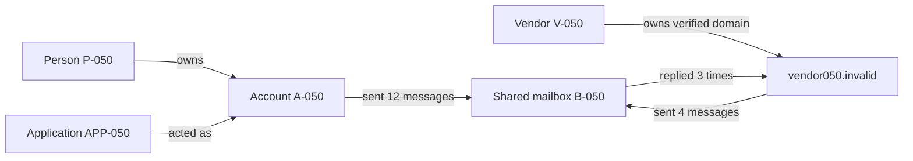
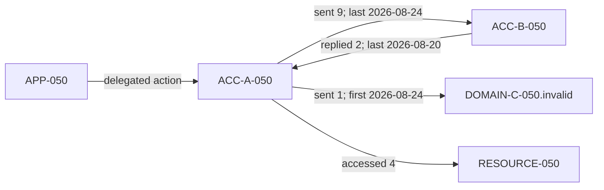
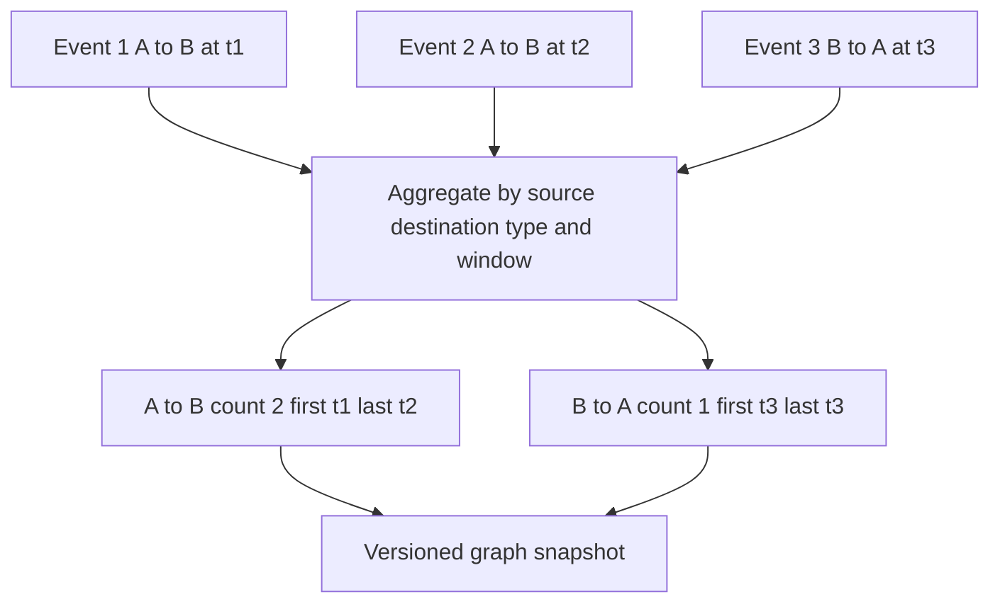
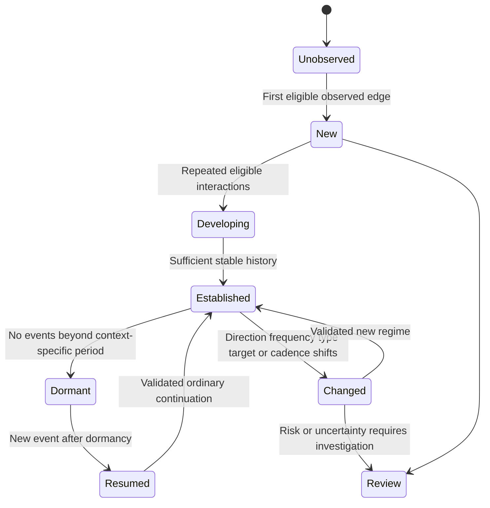
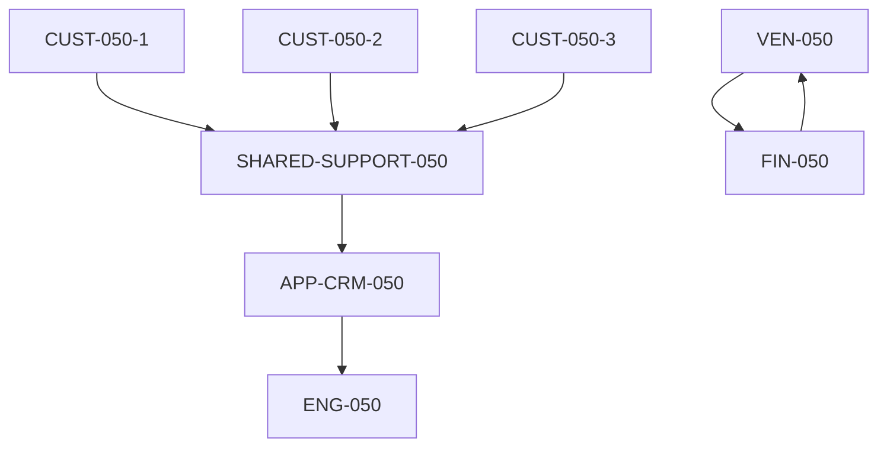
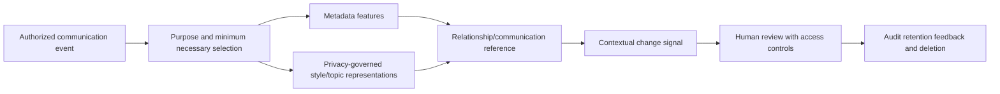
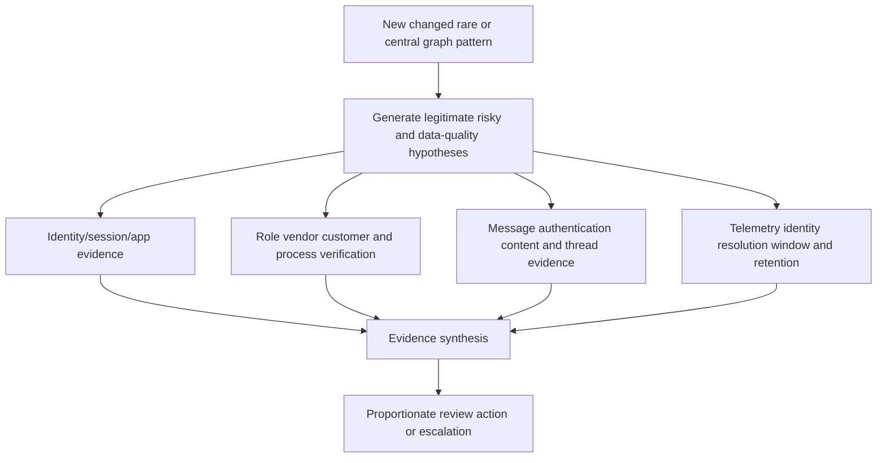
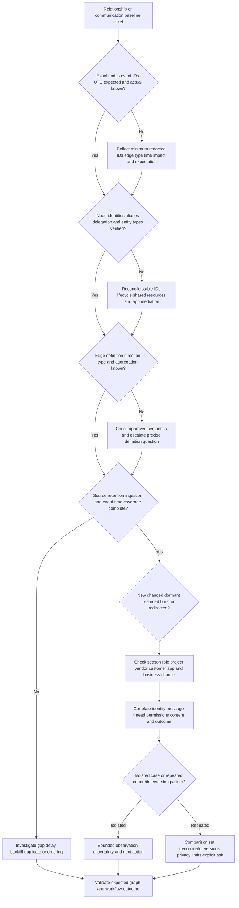

# Part 050 - Relationship and Communication Baselines

## Section goal

This Part explains how relationships and communication patterns can provide context that an isolated message, sign-in, or application event cannot. A **graph** represents entities as **nodes** and observed relationships as **edges**. Direction, frequency, recency, sequence, and business context can describe how people, accounts, domains, vendors, customers, and applications normally interact. A new or changed edge can raise an investigation question, but it does not prove compromise, fraud, collusion, or intent.

The goal is not to reproduce a vendor's relationship model. It is to make graph language precise enough for support: Which nodes and identifiers? What does an edge mean? Is it directed? What event created it? How often and how recently did interaction occur? Is absence caused by missing telemetry? Did a legitimate project, vendor migration, role change, or season create the relationship? Are metadata, style, or topic features being discussed within authorized privacy boundaries?

The central rule is:

> A graph records defined observations and context. It is an evidence map, not a social truth machine or proof of malicious intent.

Abnormal's proprietary relationship graph, communication representations, content processing, model architecture, features, windows, scores, thresholds, privacy design, and training data are unknown except where approved public documentation explicitly states a high-level claim. The lab uses only fictional tables and paper/local calculations.

## Learning outcomes

After completing this Part, you should be able to:

- define graphs, nodes, edges, direction, weight, frequency, recency, degree, paths, components, and neighborhoods;
- distinguish a person-to-person relationship from account, mailbox, domain, vendor, customer, and application interactions;
- represent inbound, outbound, reciprocal, one-to-many, delegated, and application-mediated communication;
- compare first-seen, new, dormant, resumed, intensified, weakened, redirected, and structurally changed relationships;
- define time windows and event-time snapshots without leaking future interactions into earlier analysis;
- reason about frequency, recency, cadence, burstiness, response behavior, and sequences;
- discuss communication metadata, style, and topic concepts at a privacy-preserving high level;
- distinguish internal, vendor, customer, partner, personal, shared-mailbox, and automated contexts;
- explain why a graph edge, centrality measure, cluster, or shortest path is not proof of trust or causation;
- troubleshoot missing, new, or changed relationship symptoms using identity, telemetry, lifecycle, and business evidence;
- create customer-safe explanations that avoid profiling or revealing protected model details; and
- connect Arti's enterprise investigations, support analytics/SQL/Python, Copilot evaluation/training, trend work, and audience-aware communication only as transferable methods.

## JD Mapping

| Supplied role signal | Capability built | Transferable Arti evidence | Boundary |
|---|---|---|---|
| Behavioral false-positive cases | Tests relationship history, direction, cadence, and legitimate change | Affected/unaffected comparison and validation discipline | No claim of changing Abnormal relationship features |
| Threat investigation | Maps sender, recipient, vendor, account, app, and timeline evidence | Complex investigations and Engineering escalation | No production email-threat graph ownership |
| BEC/vendor fraud support | Separates familiar relationship from changed request or route | Customer communication and evidence correlation | No invented vendor-verification product behavior |
| Configuration/integration | Checks identity mapping, telemetry coverage, aliases, and shared mailboxes | Microsoft cloud troubleshooting | Product-specific connectors require approved docs |
| Customer trust/privacy | Explains metadata/context without exposing content or intent claims | Enterprise audience adaptation | No profiling, surveillance, or legal conclusions |
| Pattern detection | Segments recurring tickets by relationship change and cohort | CSAT/backlog/case-quality analytics | Ticket volume is not population performance |
| AI Security Agents | Establishes graph/context and tool-mediated relationship vocabulary | Copilot/agent evaluation and human verification | No equivalence to Abnormal agent implementation |
| Product/Engineering collaboration | Provides graph snapshot, event IDs, coverage, comparison, and explicit ask | Escalation and fix validation | Proprietary weights/embeddings remain protected |

## Candidate honesty note

| Evidence tier | Safe statement | Do not imply |
|---|---|---|
| **Production transfer** | "I have correlated users, systems, timelines, affected scope, and customer context in enterprise support." | That Arti operated a production security relationship graph |
| **Local/public lab** | "I built a fictional directed temporal graph and calculated frequency/recency by hand." | Use of real communications or customer metadata |
| **Learned architecture** | "I understand graph and privacy concepts from official and primary sources." | That the synthetic schema matches Abnormal internals |
| **No direct experience** | "I have not operated Abnormal AI in production." | Knowledge of hidden graph features, topic/style processing, or scores |
| **Unknown proprietary detail** | "Exact Abnormal graph construction, communication representations, windows, thresholds, models, training data, and privacy controls are unknown unless approved documentation states them." | Reverse-engineering from a verdict or marketing graphic |

Safe interview language:

> "I can reason from defined entities, time-stamped directed interactions, frequency, recency, business context, and independent evidence. My graph lab is synthetic. I would attribute only high-level public Abnormal statements and would not claim that a graph signal proves risk or that I know proprietary relationship features."

## 1. Graph foundations

A graph $G$ can be written as $G=(V,E)$, where $V$ is a set of vertices or nodes and $E$ is a set of edges. A node represents a defined entity. An edge represents a defined relationship or event between nodes. The definition matters: "sent at least one message during 30 days" is different from "is an approved supplier" or "shared an application session."

| Term | Plain meaning | Synthetic example | Common mistake | Memory hook |
|---|---|---|---|---|
| Node/vertex | One represented entity | `ACC-050-01` | Treating a display name as stable identity | Node is the noun |
| Edge | Defined connection/event | Account sent to mailbox | Edge automatically means trust | Edge is the verb |
| Directed edge | Relationship has source and destination | Sender -> recipient | Assuming reciprocity | Arrow matters |
| Undirected edge | Relationship treated as symmetric | Same project membership | Losing who initiated | Symmetry is a choice |
| Weight | Numeric summary attached to edge | 12 messages in window | Weight means risk | Weight needs units |
| Attribute | Property of node/edge | Role, UTC time, event type | Attribute is timeless truth | Record source/time |
| Degree | Number of incident edges/neighbors | Five outgoing counterparties | High degree means malicious | Count is context |
| Path | Sequence of connected nodes/edges | Person -> account -> app -> resource | Path proves causal chain | Path only shows represented links |
| Neighborhood | Nearby nodes under a rule | One-hop contacts | Neighborhood equals peer group | Define radius/type |
| Component | Connected region of graph | Project team cluster | Disconnected means unrelated in reality | Telemetry limits graph |

The graph is built from observed and governed data. Missing events, aliases, shared accounts, forwarding, distribution lists, and application mediation can distort it. Graph structure is representation, not the underlying organization in full.

## 🔍 Plain-English deep-dive: A subway map is useful because it leaves most of the city out

A subway map shows stations and lines. It usually ignores building shapes, walking gradients, traffic, weather, and who owns each property. That simplification makes one task easier: planning a train route. It becomes dangerous only when someone treats the map as a complete model of the city.

A communication graph is similar. Nodes and edges retain selected facts needed for a defined security or support purpose. The graph may show that account A sent to mailbox B at a certain time. It may not show the human operator, a phone call that approved the work, a message deleted before collection, or the business reason. A path through three nodes shows representational connectivity, not that one node caused another's behavior.

Different graph definitions create different maps. A message-event graph has one edge per event. An aggregated graph might collapse 100 events into an edge weighted `100`. A business relationship graph might include an approved-vendor edge even before communication. Combining them without labels can create false meaning.

The subway analogy stops because digital graphs can be dynamic, high-dimensional, probabilistic, and privacy-sensitive. The durable lesson is to name the graph's purpose and omissions before interpreting its shape.

**Memory hook:** A graph is a task-specific map; define what every node and edge means.

## 2. Directed, weighted, typed, and temporal graphs

Communication is usually directed. `A -> B` means A sent to B; it does not mean B replied. Edges can be **typed** (`sent`, `replied`, `delegated`, `authenticated`, `called API`) and **weighted** by count, bytes, amount, or another defined measure. A **temporal graph** preserves event times or snapshots so relationships can change.

| Graph property | Question | Example | Interpretation caution |
|---|---|---|---|
| Direction | Who initiated toward whom? | Vendor -> finance mailbox | Forwarding/app mediation can obscure initiator |
| Edge type | What interaction occurred? | `message_sent`, `reply`, `consent` | Do not aggregate unlike actions blindly |
| Weight | What numeric summary? | 30 messages/30 days | Units and window required |
| First seen | Earliest observed eligible event | 2026-08-01 | Collection may begin later than relationship |
| Last seen | Most recent observed eligible event | 2026-08-24 | Absence may reflect telemetry gap |
| Duration | Observed time between first/last | 23 days | Does not prove continuous relationship |
| Recency | Time since last event | 3 hours | Recency is event-time dependent |
| Frequency | Events per eligible interval | 2/week | Denominator and inactive periods matter |
| Reciprocity | Relative two-way activity | 10 outbound, 8 inbound | Automated notifications are legitimately one-way |
| Burstiness | Concentration into short periods | 20 events in 5 minutes | Business batch or abuse both possible |

### Hand-calculated edge summaries

Suppose `A -> B` has events on days 1, 3, 10, and 24 of a 30-day eligible window. Frequency is:

$$
f_{A\rightarrow B}=\frac{4\text{ events}}{30\text{ eligible days}}\approx0.133\text{ events/day}
$$

If the current event occurs on day 30 and the prior last event was day 24, recency is six days. If `B -> A` has two events, a simple reciprocity ratio could be:

$$
r=\frac{\min(4,2)}{\max(4,2)}=\frac{2}{4}=0.5
$$

This ratio is a teaching device, not a recommended risk feature. A newsletter can be safely one-way, while a compromised conversation can be highly reciprocal. Interpret measurements within communication type and business process.

## 3. Event graphs versus aggregated graphs

An event graph preserves each interaction, identifiers, timestamps, and attributes. An aggregated graph summarizes many interactions into one edge for a window. Aggregation improves scanning and privacy minimization but can hide sequence, recipients, and changes.

| Representation | Preserves | Loses or risks | Useful for |
|---|---|---|---|
| One edge per event | Exact sequence/time/attributes | Large volume and privacy exposure | Timeline investigation |
| Window aggregate | Count, first/last, summaries | Individual sequence/content | Baseline comparison |
| Binary relationship | Whether link existed | Frequency, direction strength | Simple neighborhood view |
| Typed multigraph | Multiple edge types between same nodes | More complexity | Separating message, app, and identity actions |
| Snapshot series | Graph state at several times | Between-snapshot detail | Change analysis |
| Streaming graph | Near-current updates | Ordering, duplication, late-arrival complexity | Operational detection concept |

For support, preserve enough event evidence to explain an aggregate. A customer may challenge "new relationship" when the raw history contains old messages. The issue could be aggregation window, entity split, source start, excluded event type, or processing delay.

## 4. New, changed, dormant, and resumed relationships

"New relationship" can mean first ever in complete history, first in the connected source, first in a window, first after entity re-creation, first for a message direction, or first for a communication type. Support must ask which definition applies.

| Relationship state | Operational definition example | Legitimate explanation | Risk hypothesis | Validation |
|---|---|---|---|---|
| First observed | No eligible prior edge in complete 90-day source | New project/vendor/customer | New lure or lookalike | Coverage plus business verification |
| Window-new | No edge in 30 days, older edge exists | Infrequent supplier | Dormant relationship abuse | Inspect older history and current request |
| Direction-new | B sent to A before; A never sent to B | First reply | Account misuse/data transfer | Message/action context |
| Type-new | Email existed; OAuth consent is new | Approved integration | Malicious app grant | App owner/scopes/approval |
| Intensified | Rate rises beyond matched cycles | Quarter close/campaign | Compromise or exfiltration | Denominator, season, identity evidence |
| Redirected | Same sender now targets new group | Reorganization | Privilege targeting | Role/change and recipients |
| Dormant/resumed | Long observed gap then activity | Annual renewal | Old vendor/account compromise | Known-channel verification |
| Weakened | Expected activity disappears | Leave or contract end | Telemetry outage/suppression | Source health and lifecycle |

## 🔍 Plain-English deep-dive: A first meeting in your calendar may be an old relationship outside the calendar

Suppose a calendar shows the first meeting with a supplier today. That could mean the companies truly met for the first time. It could also mean earlier meetings used another calendar, occurred before retention began, involved an alias, happened by phone, or were organized by a colleague. "First observed" is bounded by source, identity mapping, event type, and history window.

The same caution applies to graph novelty. A newly connected tenant cannot prove there was no earlier relationship. An alias change can split one counterparty into two nodes. A vendor domain migration can make a continuing business relationship appear new. Conversely, a familiar display name can hide a genuinely new lookalike node.

A good explanation states the boundary: "No eligible prior edge was found for these resolved IDs in the reviewed 90-day message source." It does not say, "These people have never communicated." The first statement is testable; the second exceeds evidence.

The calendar analogy stops because a security graph can combine many sources and model inferred representations. Its central lesson remains: novelty is always relative to observed coverage and identity resolution.

**Memory hook:** Say "first observed under this source and window," not "never happened."

## 5. Frequency, recency, cadence, and burstiness

**Frequency** is how often events occur per eligible period. **Recency** is elapsed time since a prior eligible event. **Cadence** is a repeating timing pattern. **Burstiness** describes events concentrated in short intervals rather than evenly spread. Each needs a correct denominator and season.

| Pattern | Same total count? | Different structure | Business example | Risk question |
|---|---:|---|---|---|
| Even cadence | 12/month | About 3/week | Weekly status thread | Does current timing fit cycle? |
| Monthly burst | 12/month | All on close day | Invoice batch | Is close process approved? |
| Sudden burst | 12/month | All in 2 minutes unexpectedly | Automation or compromise | Source, app, recipients, rate control |
| Dormant then burst | 12/month | After long silence | Renewal campaign | Is vendor/account still trusted? |
| Direction reversal | 12/month | Recipient becomes sender | First reply or takeover | What action/content changed? |
| Recipient expansion | 12/month | Same sender, wider group | Announcement or targeting | Is scope authorized? |

A comparison should match hour-of-week, month-end, campaign, role, and source completeness where appropriate. Counts without denominators mislead: 100 events from 100,000 may be a lower rate than 10 from 20.

## 5A. Comparing graph snapshots safely

A graph changes over time. To investigate change, define two comparable snapshots with the same node-resolution rules, edge types, data sources, eligibility, and duration. If July includes email and application events while August includes email only, structural differences may reflect collection rather than behavior.

Let $E_1$ be the set of directed typed edges in the earlier snapshot and $E_2$ the corresponding set in the later snapshot. Then:

- retained edges are $E_1\cap E_2$;
- added edges are $E_2\setminus E_1$; and
- removed or unobserved edges are $E_1\setminus E_2$.

Suppose the fictional earlier set is:

$$
E_1=\{A\rightarrow B,\ B\rightarrow A,\ A\rightarrow C,\ D\rightarrow A\}
$$

and the later set is:

$$
E_2=\{A\rightarrow B,\ B\rightarrow A,\ A\rightarrow D,\ E\rightarrow A\}
$$

The intersection contains two retained edges: $A\rightarrow B$ and $B\rightarrow A$. Two earlier edges are absent later, and two later edges are new under the defined snapshot. That arithmetic says nothing yet about risk, deletion, or intent.

A simple **Jaccard similarity** compares set overlap with the union:

$$
J(E_1,E_2)=\frac{|E_1\cap E_2|}{|E_1\cup E_2|}
$$

Here the intersection size is `2` and the union has `6` unique directed edges:

$$
J(E_1,E_2)=\frac{2}{6}\approx0.333
$$

The snapshots overlap by about one third under this edge definition. This is not "33.3% trustworthy" or "66.7% anomalous." It is a structural similarity statistic. Direction and type must be included consistently; otherwise `A -> B message` and `B -> A reply` may collapse incorrectly.

| Snapshot comparison field | Earlier | Later | Interpretation question |
|---|---|---|---|
| Window | July 1-31 | August 1-31 | Are durations and season comparable? |
| Sources | Email + app | Email + app | Did both remain healthy? |
| Node rule | Tenant-scoped object IDs | Same version | Were aliases or mergers changed? |
| Edge rule | Directed typed eligible event | Same version | Did event eligibility change? |
| Active nodes | 40 | 52 | New users/vendors/apps or mapping split? |
| Directed edges | 120 | 150 | Growth, season, or collection difference? |
| Retained edges | Not applicable | 95 | Which stable workflows continue? |
| Added edges | Not applicable | 55 | What business changes explain them? |
| Absent edges | Not applicable | 25 | Dormancy, leave, outage, or suppression? |
| Duplicate rate | 1% | 8% | Did ingestion retries inflate weights? |

### Weighted change

An edge can be retained while its weight changes. If `A -> B` had 10 eligible messages in a 20-business-day earlier window and 18 in a 20-business-day later window, its rates are:

$$
f_1=\frac{10}{20}=0.5\text{ messages/business day}
$$

$$
f_2=\frac{18}{20}=0.9\text{ messages/business day}
$$

The absolute rate change is $0.9-0.5=0.4$ messages per business day. The relative increase is:

$$
\frac{0.9-0.5}{0.5}=0.8=80\%
$$

An 80% increase sounds dramatic, but the actual change is eight messages over a month. Report both absolute and relative values. Check duplicates, eligible days, project activity, seasonality, and whether message type changed. A large percentage from a tiny baseline can be operationally unimportant; a small percentage across millions of events can be significant.

### Neighborhood change

For node A, define an outbound neighborhood $N^+(A)$ as destinations receiving a selected edge type from A. Earlier, $N_1^+(A)=\{B,C\}$; later, $N_2^+(A)=\{B,D\}$. The number of neighbors stays two, but one destination changed. Degree alone misses that replacement. A support comparison should name retained, added, and absent counterparties with pseudonymous IDs and business context.

### Change ledger

| Change ID | Observation | Legitimate hypotheses | Risk hypotheses | Data-quality hypotheses | Cheapest check |
|---|---|---|---|---|---|
| CHG-050-01 | New vendor-domain -> finance edge | Verified domain migration | Lookalike or vendor compromise | Alias split | Known-channel ownership plus IDs |
| CHG-050-02 | App edge rate rises 80% | Backlog or scheduled batch | Abusive automation | Duplicate ingestion | Job/change and event deduplication |
| CHG-050-03 | Customer edge absent | Case closed | Message suppression | Source gap/retention | Case and connector timeline |
| CHG-050-04 | New resource destination | Approved project | Unauthorized access | Resource rename | Change/owner and stable resource ID |
| CHG-050-05 | Reciprocity falls | Notification workflow | Reply blocking or takeover | Inbound connector issue | Direction-specific source health |

### Late-arriving events and graph version

An event that happened July 31 may arrive August 2. If snapshots are built by processing time, it enters August. If built by event time after a settling delay, it may enter July. Neither choice is universally correct, but the choice must be explicit. A frozen historical graph version improves reproducibility; an updated backfilled version improves completeness. Support may need both: "what the system knew then" and "what later evidence shows."

Do not silently rewrite an earlier decision with later-arriving history. Record the original snapshot/version, the corrected snapshot, the reason for change, and whether the observed product outcome would have differed under documented behavior.

## 🔍 Plain-English deep-dive: Comparing two team photos requires the same camera angle and guest list rule

Imagine comparing two company team photos to identify staffing change. The first photo includes contractors and remote employees; the second excludes them. The second camera crops the back row. Counting faces will report major change even if nobody joined or left.

Graph snapshots have the same comparability problem. Source coverage is the camera angle. Identity and edge definitions are the guest list rule. Window length is the exposure period. Deduplication prevents one person from appearing twice. Late-arriving events resemble people added to the caption after the photograph.

Before attributing graph change to behavior, hold these rules steady or quantify the difference. Then distinguish node changes, edge additions/removals, weight changes, direction/type changes, and data-quality changes. Preserve the event-time snapshot that informed the original outcome and a later corrected view separately.

The photo analogy stops because temporal graphs encode repeated directed events, not one visual scene. It still captures a core analytical requirement: inconsistent observation rules can manufacture structural change.

**Memory hook:** Compare graphs only after aligning identity, sources, edge rules, and time.

## 6. Paths, neighborhoods, degree, and centrality

A **path** is a sequence of edges connecting nodes. **In-degree** counts incoming neighbors/edges; **out-degree** counts outgoing ones. **Centrality** is a family of graph measures intended to describe structural importance under a definition. High centrality can belong to help desks, shared mailboxes, executives, automated systems, or popular vendors. It is not a threat label.

| Measure/concept | Plain question | Legitimate high value | Misuse to avoid |
|---|---|---|---|
| In-degree | How many sources point here? | Support mailbox receives many requests | "Many senders means targeted attack" |
| Out-degree | How many destinations? | Newsletter/automation | "Many recipients means exfiltration" |
| Weighted degree | How much defined activity? | Busy shared service | Equating volume with risk |
| Betweenness concept | Does node sit on many represented paths? | CRM/integration hub | Assuming control or causality |
| Neighborhood change | Did nearby nodes/types change? | New project team | Treating expansion as malicious |
| Component | Which nodes are connected in this graph? | Separate business units | Assuming no off-graph relationship |
| Short path | Few represented steps connect nodes | Shared app/alias | Claiming collusion or data flow |

Graph paths are especially vulnerable to storytelling. `A -> B -> C` does not prove A influenced C unless edge semantics and timing support that mechanism. It may merely show that A emailed a shared mailbox that an application also uses.

## 7. Communication metadata

**Metadata** describes communication without necessarily containing full message content. Examples include sender/recipient identifiers, timestamps, direction, message/thread IDs, recipient counts, attachment presence, language category, and routing results. Metadata can still be sensitive personal or organizational data and requires purpose, minimization, access, retention, and secure handling.

| Metadata category | Example | Useful question | Privacy/security caution |
|---|---|---|---|
| Identity | Sender/recipient stable IDs | Who interacted? | Can reveal associations and roles |
| Time | Accepted UTC and local context | When and at what cadence? | Can expose schedules/leave |
| Direction | Inbound/outbound/reply | Who initiated? | Forwarding/delegation complicates |
| Volume | Recipient/attachment counts | Did scale change? | Aggregate where possible |
| Thread | Message/reference IDs | Is this a continuation? | IDs can be customer-sensitive |
| Routing/auth | Domain and result categories | Did path/auth change? | Do not overcollect full headers |
| Device/app | Client or application category | Was software context expected? | Fingerprinting and access control needed |
| Content-derived category | Topic/style representation | Did communication context change? | Derived data can remain sensitive |

Metadata is not automatically anonymous. A rare communication pair can identify people. Aggregation, pseudonymous IDs, purpose limitation, and role-based access help, but do not eliminate every re-identification risk.

## 8. Style and topic concepts with privacy limits

**Style features** may describe measurable communication form, such as typical length range, greeting pattern category, punctuation tendency, reply latency, or language distribution. **Topic features** may represent broad subject categories or semantic similarity. A production implementation could use raw content, derived representations, metadata only, or combinations; do not guess.

| Concept | High-level example | What it may support | What it cannot prove |
|---|---|---|---|
| Length pattern | Typical range changes sharply | Changed workflow or sender context | Authorship or intent |
| Greeting/style category | Formal style differs | Review of possible impersonation | Who wrote the message |
| Reply latency | Response arrives much faster/slower | Automation or process change | Compromise |
| Language category | Different language appears | New region/customer or takeover hypothesis | Nationality or maliciousness |
| Topic shift | Invoice thread shifts to credential request | Changed business purpose | Causal attack chain |
| Semantic similarity | Message resembles prior category | Retrieval/context support | Factual truth |
| Thread consistency | Identifiers and participants change | Hijack/migration hypothesis | Authenticity by itself |

Customer-safe language avoids saying a model "reads employees' minds" or "knows how a person writes." Say only what approved documentation and observed fields support. Content-derived data can be personal, confidential, privileged, regulated, or security-sensitive. Minimize it and escalate privacy/legal questions.

## 🔍 Plain-English deep-dive: An envelope reveals less than a letter, but it can still reveal a private relationship

An envelope shows addresses, postage, routing marks, and timing without showing the letter's full text. That information can still reveal that a person contacted a doctor, lawyer, union, or competitor. "Metadata only" therefore does not mean "no privacy impact."

Digital communication metadata can reveal social structure, working hours, role changes, and business relationships. Derived style or topic categories may expose even more. Replacing a name with an identifier reduces casual exposure but does not necessarily anonymize a rare graph. Combining datasets can re-identify nodes.

Privacy-safe support starts with purpose and minimum necessary evidence. A false-positive case may need stable IDs, UTC times, relationship count, and documented explanation fields; it may not need full message bodies or an employee's entire communication history. Access, secure transfer, retention, deletion, and audit remain required.

The envelope analogy stops because digital metadata is high-volume, searchable, linkable, and easily aggregated. Its lesson is essential: content minimization helps, but relationship data still deserves strong governance.

**Memory hook:** Metadata is less content, not no sensitivity.

## 9. Vendor, customer, internal, and application context

The same graph pattern can mean different things by relationship type. An internal directory relationship, external customer support relationship, supplier payment relationship, newsletter, shared mailbox, and automated application need different expectations.

| Context | Normal structure | High-value change | Independent validation |
|---|---|---|---|
| Internal team | Reciprocal role-based collaboration | New executive/privileged target | Directory/project and identity evidence |
| Shared mailbox | Many-to-one inbound, delegated replies | New operator or forwarding | Mailbox delegation and audit |
| Vendor | Periodic contacts/domains/invoice flow | New domain, bank detail, urgency | Known-channel procurement/finance check |
| Customer | Case-linked communication, variable cadence | Unexpected attachment/request | CRM/case and account verification |
| Partner | Cross-organization projects | Scope/recipient expansion | Contract/project owner |
| Newsletter | One-to-many, low reciprocity | Link/domain/content change | Sender/authentication and subscription |
| Application | Scheduled or event-driven messages/API actions | New resource/scope/recipient | App owner, registration, change record |
| Personal/external | Often sparse | Sensitive data or impersonation | Policy, content, user context with privacy |

An established vendor edge lowers novelty but does not make a changed payment request safe. A new customer edge can be completely legitimate. Relationship age is one signal among many.

## 10. Graph signals are not proof

| Graph observation | Unsupported leap | Defensible statement |
|---|---|---|
| New edge | "This is an attacker" | No eligible prior edge under defined source/window |
| Short path to risky node | "They collaborated" | Represented links connect nodes under stated edge types |
| High centrality | "This is the ringleader" | Node has high structural connectivity in this graph |
| Dense cluster | "This group is colluding" | Nodes interact more within the represented window |
| Style change | "A different person wrote it" | Derived style representation differs from reference |
| Dormant relationship resumes | "Vendor is compromised" | Interaction resumed after an observed gap; verify business context |
| Topic shift | "Thread was hijacked" | Content category changed; correlate identity/thread evidence |

## 11. Worked example 1: New vendor edge and payment request

### Inputs

`newvendor050.invalid -> FIN-050` is first observed in a complete 60-day message source. Display name resembles established vendor `VEN-050`, but domain ID differs. The message requests a bank-detail change.

### Reasoning

Build separate nodes until ownership is independently verified. Check domain/authentication evidence, procurement migration records, known contacts, thread IDs, reply-to/routing, identity/session indicators, and the payment-control process. Relationship novelty and high-impact request corroborate concern, but neither proves fraud.

### Customer-safe result

"This is the first eligible edge from the resolved new domain to the finance mailbox in the reviewed source/window, and the request changes a sensitive payment process. Please use the established known-channel verification procedure while security owners complete identity and message review."

## 12. Worked example 2: Familiar sender, changed direction

### Inputs

An internal account has received automated reports from `APP-050` for months but has never sent data to the application's external endpoint. A new outbound upload event appears.

### Reasoning

The node pair is established, but the edge type/direction is new. Verify app owner, approved workflow, OAuth scope, resource, change record, user/session, volume, and audit event. "Known relationship" does not cover every direction and action.

### Result

Escalation should identify `new edge type/direction`, not `new relationship` generally. That precision makes Engineering review reproducible.

## 13. Worked example 3: Burst after quarter-end

### Inputs

Finance sends 60 messages to ten established vendors in one hour. Ordinary weekly frequency is 20 messages, but prior quarter-end hours show 55-70.

### Reasoning

Compare matched quarter-end periods, approved close schedule, operators, devices, recipients, amounts, and content categories. The burst is rare under a generic week but ordinary in the seasonal mode. Still inspect changed payment instructions or novel domains because attackers exploit close periods.

### Result

Seasonality reduces unsupported anomaly concern; it does not whitelist the batch. State both observations.

## 14. Worked example 4: Missing edge caused by alias split

### Inputs

A customer says two users communicated for years, but the graph displays a new relationship. Investigation finds recipient `alex@old050.invalid` migrated to `alex@new050.invalid` with a new account object.

### Reasoning

Determine whether the product/documented semantics link aliases or object lifecycle. Preserve separate objects unless verified mapping supports continuity. Check source backfill, retention, migration time, forwarding, and current edge definition. Do not manually assert vendor logic.

### Result

"The observed novelty may arise from an identity/lifecycle split across old and new scoped IDs. We have provided both IDs, migration evidence, history coverage, and the documented-semantics question to the product owner."

## 15. Support troubleshooting table

| Symptom | Local hypotheses | Cheapest discriminating check | Escalation trigger |
|---|---|---|---|
| Known contact shown as new | Alias/domain/object change, window, data gap, actual lookalike | Stable IDs and source coverage | Documented behavior conflicts after mapping |
| No edge despite messages | Wrong event type, retention, ingestion delay, aggregation | Exact message IDs and eligible window | Reproducible ingestion/graph defect |
| One-way relation called unusual | Expected notification flow or missing replies | Edge direction/type and mailbox route | Product explanation contradicts semantics |
| Burst false positive | Seasonality, bulk process, compromise | Matched cycles and app/user source | Multi-entity/version pattern |
| Style/topic complaint | Legitimate author/process change, privacy concern | Approved explanation fields and change evidence | Protected data/implementation question |
| Shared mailbox attributed to person | Delegation or identity-resolution issue | Audit/operator/resource IDs | Incorrect entity mapping affects outcomes |
| Familiar vendor request missed | Common edge hides changed domain/action | Edge type/domain/payment context | Potential security defect or systemic gap |

## Troubleshooting decision tree

## 16. Failure modes

| Failure mode | Why it fails | Better behavior |
|---|---|---|
| Edge means friendship/trust | Edge semantics may be one event or automation | State exact type/source/window |
| Undirected graph for email | Loses who initiated and replied | Preserve directed edge types |
| Weight means risk | Weight may be message count or bytes | Name unit and correlate evidence |
| First observed means first ever | Coverage/window/identity may be incomplete | Bound novelty statement |
| Familiar pair means safe | Accounts/vendors can be compromised | Inspect changed action/content/session |
| New pair means malicious | Projects/customers/vendors create novelty | Verify business context |
| High degree means threat | Shared services are naturally central | Compare entity type and role |
| Path means causation | Connectivity is not influence or flow | Verify edge semantics/timing |
| Dense cluster means collusion | Teams naturally communicate densely | Avoid intent claims; use authorized evidence |
| Metadata is anonymous | Relationships can re-identify people | Minimize, control, retain, delete |
| Style proves author | Representation can vary for many reasons | Treat as contributing signal only |
| Topic proves malicious intent | Topic categories are uncertain/contextual | Correlate business and security evidence |
| Aggregate preserves sequence | Aggregation hides order and exceptions | Retain authorized event evidence |
| Current graph explains past | Future edges leak backward | Reconstruct event-time snapshot |
| Support tickets are representative | Reporting is selected and duplicated | Add denominator and cohort |
| Generic graph equals Abnormal graph | Proprietary design is unknown | Separate generic concept and attributed fact |

## 17. Escalation packet

| Field | Required content |
|---|---|
| Question | Exact expected versus actual relationship behavior |
| Nodes | Stable pseudonymous IDs, entity types, verified aliases/ownership |
| Edges | Direction, type, event IDs, timestamps, weight unit, aggregation |
| Snapshot | Event-time window, source start, retention, baseline/graph version if visible |
| Coverage | Connector health, late events, duplicates, missing sources |
| Change context | Role, project, vendor/domain, customer, app, migration, season |
| Corroboration | Identity/session, message/thread, permission, business, outcome evidence |
| Comparison | Matched affected/unaffected edges with minimum data |
| Pattern | Numerator, denominator, cohort, time, version, duplicate handling |
| Privacy | Purpose, minimization, redaction, access, retention/deletion |
| Unknowns | Proprietary graph/style/topic/features/scores not assumed |
| Ask | Confirm semantics, mapping, source, defect, explanation, or next evidence |

## Safe synthetic lab: The Harmless Relationship Constellation 050

### Objective

Construct a directed, typed, weighted, temporal graph from fictional communication metadata; calculate frequency/recency; identify new, changed, dormant, resumed, reciprocal, one-way, bursty, vendor, customer, internal, and application-mediated relationships; then write privacy-safe support conclusions. The unique lab is **The Harmless Relationship Constellation 050**.

The lab uses paper, local Markdown, or a local spreadsheet. It does not upload data, call a model/API, access accounts, inspect live communications, run prompt attacks, or claim production behavior.

### Prerequisites

- Local Markdown editor, paper, or local spreadsheet only.
- This Part and fixtures below.
- A calculator for counts, rates, time differences, and ratios.
- No tenant, mailbox, identity provider, model, API, hosted notebook, graph service, or Abnormal access.
- Artifact label: **local/public lab - fictional graph metadata only**.
- Record UTC start, purpose, authorization boundary, and zero-real-data statement.

### Privacy and authorization boundary

Authorized:

- copy fictional IDs and `.invalid` domains locally;
- draw graph diagrams and calculate simple summaries;
- write generic, attributed, and customer-safe statements; and
- cite verified official/primary sources.

Prohibited:

- real messages, bodies, subjects, people, accounts, domains, vendors, customers, applications, graphs, logs, or identifiers;
- uploads to a model, API, cloud spreadsheet, graph database, or hosted service;
- tenant/account access, live prompt injection, surveillance, profiling, scanning, or security-control tests;
- operational bypass prompts or claims about Abnormal graph implementation.

### Synthetic node registry

| Node ID | Type | Context | Privacy label |
|---|---|---|---|
| ACC-A-050 | User account | Finance analyst | Fictional pseudonymous |
| ACC-B-050 | User account | Finance approver | Fictional pseudonymous |
| SHARED-050 | Shared mailbox | Accounts payable | Fictional resource |
| VEN-050 | Vendor | Approved supplier | Fictional organization |
| oldvendor050.invalid | Domain | Historical vendor domain | Reserved domain |
| newvendor050.invalid | Domain | Proposed migrated domain | Reserved domain |
| CUST-050 | Customer | Open support case | Fictional organization |
| APP-050 | Application | Invoice workflow | Fictional nonhuman identity |
| RES-050 | Resource | Synthetic invoice store | Fictional resource |

### Synthetic event edges

| Event ID | UTC | Source | Destination | Type | Thread | Metadata note |
|---|---|---|---|---|---|---|
| EDGE-050-01 | 2026-07-01 09:00 | oldvendor050.invalid | SHARED-050 | message | T-050-A | Invoice category |
| EDGE-050-02 | 2026-07-01 10:00 | SHARED-050 | oldvendor050.invalid | reply | T-050-A | Acknowledgment |
| EDGE-050-03 | 2026-07-15 09:00 | oldvendor050.invalid | SHARED-050 | message | T-050-B | Invoice category |
| EDGE-050-04 | 2026-08-01 09:00 | oldvendor050.invalid | SHARED-050 | message | T-050-C | Invoice category |
| EDGE-050-05 | 2026-08-20 09:00 | newvendor050.invalid | SHARED-050 | message | T-050-D | Payment-change category |
| EDGE-050-06 | 2026-08-20 09:02 | SHARED-050 | newvendor050.invalid | reply | T-050-D | Fast response |
| EDGE-050-07 | 2026-08-21 02:00 | APP-050 | RES-050 | read | JOB-050 | Scheduled app |
| EDGE-050-08 | 2026-08-21 02:01 | APP-050 | ACC-A-050 | notify | JOB-050 | Automated notification |
| EDGE-050-09 | 2026-08-24 11:00 | ACC-A-050 | CUST-050 | message | CASE-050 | Case response |
| EDGE-050-10 | 2026-08-24 11:01 | ACC-A-050 | CUST-050 | message | CASE-050 | Duplicate candidate |
| EDGE-050-11 | 2026-08-24 11:05 | CUST-050 | ACC-A-050 | reply | CASE-050 | Customer reply |
| EDGE-050-12 | 2026-08-24 23:00 | ACC-A-050 | RES-050 | write | X-050 | New direction/type |

### Lab steps

1. Create `The Harmless Relationship Constellation 050`; record UTC, label, purpose, and zero-real-data attestation.
2. Define graph, node, edge, direction, type, weight, first/last seen, frequency, recency, reciprocity, path, neighborhood, and component.
3. Draw the full directed typed graph. Keep vendor organization and its two domains as separate linked nodes.
4. Create an event graph, then aggregate by source/destination/type for July and August separately.
5. Calculate count, first seen, last seen, eligible-day frequency, and current recency for each aggregate edge.
6. Calculate the teaching reciprocity ratio for the historical vendor/shared-mailbox pair and explain why it is not trust or risk.
7. Label edges as first observed, established, dormant, resumed, intensified, redirected, direction-new, or type-new under explicit definitions.
8. Analyze EDGE-050-05 and EDGE-050-06. List vendor-migration, lookalike, compromised-vendor, thread-change, and data-quality hypotheses.
9. Analyze APP-050 as a one-way automated relationship. Explain why low reciprocity is expected.
10. Analyze EDGE-050-09 through EDGE-050-11 for duplicate handling and case context.
11. Analyze EDGE-050-12 as a new edge type/direction, not merely a new node pair.
12. Create two graph snapshots: immediately before and after August 20. Do not use later evidence in the earlier snapshot.
13. Simulate a source outage from July 16-31 and rewrite every novelty claim with the coverage limit.
14. Build metadata minimization: retain only IDs, UTC, type, thread token, and broad category; explain why even this remains sensitive.
15. Write one style-change and one topic-shift hypothesis without asserting authorship, intent, or full content access.
16. Create vendor, customer, internal, shared-mailbox, and application context cards.
17. Write three customer-safe statements: first observed, familiar-but-changed, and unresolved proprietary graph semantics.
18. Build an escalation packet with comparison edges, denominator, snapshot, source health, privacy, and an explicit ask.
19. Deliver a 90-second spoken explanation tying enterprise investigation, analytics/SQL/Python, Copilot evaluation/training, trends, and communication only as transfer skills.
20. Complete the source, privacy, cleanup, rubric, and zero-activity checks.

### Expected evidence

- Directed typed node/edge graph and registry.
- Event and two window-aggregated graph tables.
- Hand-calculated count, frequency, recency, and reciprocity examples.
- Explicit relationship-state classification.
- Pre/post temporal snapshots without future leakage.
- Vendor-domain/payment-change hypothesis ledger.
- Application one-way and customer-case context analysis.
- New edge-type/direction explanation.
- Source-outage rewrite and duplicate-handling note.
- Metadata minimization/privacy matrix.
- Style/topic statements with proof limits.
- Three customer-safe updates and one escalation packet.
- Spoken honesty statement and source ledger dated August 24, 2026.
- Cleanup and zero-live-activity attestation.

### Cleanup and privacy

- Confirm every ID contains `050` and every domain ends `.invalid`.
- Remove accidental real people, accounts, mailboxes, domains, vendors, customers, applications, messages, subjects, bodies, threads, metadata, graphs, logs, or screenshots.
- Confirm nothing was uploaded to a model, API, graph service, cloud document, or hosted notebook.
- Confirm no tenant, account, product, communication, prompt, person, vendor, customer, or security control was accessed, profiled, attacked, or tested.
- Delete the artifact if real/confidential data cannot be reliably removed.
- Retain only the local fictional artifact if useful.
- Record cleanup UTC and: `Synthetic relationship graph only; zero live data, model, API, account, upload, prompt attack, profiling, or production activity.`

### Validation rubric

| Dimension | Fail | Developing | Pass |
|---|---|---|---|
| Graph meaning | Draws unlabeled connections | Names nodes/edges | Defines identity, direction, type, source, time, unit, and window |
| Temporal reasoning | Uses one timeless graph | Adds first/last seen | Uses event-time snapshots, coverage, change states, and no future leakage |
| Relationship change | New equals risky | Lists legitimate reason | Distinguishes first-observed, direction/type change, dormancy, burst, and context |
| Mathematics | Gives counts only | Calculates rate | Shows denominator, recency, reciprocity, and limitations |
| Context | Treats all communication alike | Separates internal/external | Handles vendor, customer, shared, app, seasonal, and process differences |
| Proof limits | Path/cluster means causation | Adds disclaimer | Separates represented connectivity, hypotheses, corroboration, and intent |
| Privacy | Calls metadata anonymous | Redacts names | Uses purpose, minimization, pseudonyms, access, retention, deletion, and re-identification caution |
| Support | Says "AI graph wrong" | Collects screenshot | Resolves IDs, semantics, coverage, snapshots, comparisons, denominator, and explicit ask |
| Safety | Uses live communication | Uses synthetic upload | Local fictional paper work and zero-activity attestation |
| Honesty | Claims Abnormal graph expertise | Says generic graph | Labels transfer/lab/learned architecture and unknown proprietary implementation |

## 18. Official Source Anchors

All sources were accessed on **August 24, 2026** and must be revalidated before interview or production use. Sources anchor graph terminology, privacy/risk practice, Microsoft-specific UEBA examples, and attributable public Abnormal positioning. They do not reveal Abnormal's proprietary graph, communication features, content processing, windows, scores, thresholds, models, training data, or privacy implementation.

| Official or primary source | What it anchors | Boundary |
|---|---|---|
| [NIST AI Risk Management Framework 1.0](https://www.nist.gov/itl/ai-risk-management-framework) | Context, data, measurement, transparency, privacy, and governance | Voluntary framework, not product architecture |
| [NIST Privacy Framework](https://www.nist.gov/privacy-framework) | Identify-P, Govern-P, Control-P, Communicate-P, and Protect-P privacy risk practices | Framework, not legal advice |
| [Microsoft Sentinel UEBA overview](https://learn.microsoft.com/en-us/azure/sentinel/identify-threats-with-entity-behavior-analytics) | Official example of entity histories, peers, organization context, and anomaly investigation | Microsoft Sentinel semantics only |
| [RFC 5322 - Internet Message Format](https://www.rfc-editor.org/rfc/rfc5322) | Primary message field and identifier structure relevant to metadata/thread evidence | Message format, not graph or risk scoring |
| [Abnormal AI official site](https://abnormal.ai/) | Current attributable public behavioral-security positioning | Public marketing level only |
| [Abnormal AI platform overview](https://abnormal.ai/platform/overview) | Current attributable high-level statements about identity, relationship, and communication patterns | Do not infer graph schema, features, formulas, or implementation |

### Source-use discipline

- Attribute Abnormal statements exactly and keep implementation unknown.
- Treat Microsoft product specifics as examples, not cross-vendor facts.
- Use NIST for risk/privacy practice and RFC 5322 for message structure.
- Record title, URL, access date, claim, and revalidation result.
- Do not copy long source text or disclose protected/customer information.

## Likely Interview Questions

### Q1. What is a communication graph?

**Model answer:** It is a defined representation where nodes are entities and edges are observed interactions or relationships. I specify stable identities, edge type, direction, source, timestamp, weight unit, aggregation window, and coverage. The graph is a task-specific evidence map, not complete social truth.

### Q2. Why do direction, frequency, and recency matter?

**Model answer:** Direction distinguishes who initiated; frequency measures events per eligible period; recency measures time since a prior eligible event. Together they describe cadence and change, but one-way automation, seasonality, missing data, and business workflows can make unusual patterns legitimate.

### Q3. What does "new relationship" mean?

**Model answer:** I avoid the unbounded phrase. I state "first eligible observed edge for these resolved IDs, edge type, source, and window." The relationship may predate retention, use an alias, occur in another channel, or be genuinely new, so I verify identity, coverage, and business context.

### Q4. Why is a familiar vendor relationship not proof that a payment request is safe?

**Model answer:** The vendor account can be compromised, the domain or reply path can change, or an established thread can be abused. I compare node identity, edge type/direction, thread and authentication evidence, request content, identity signals, and known-channel finance/procurement verification.

### Q5. How do you discuss style or topic baselines responsibly?

**Model answer:** I describe them only as privacy-governed derived representations that may provide context. A style change does not prove authorship, and a topic shift does not prove intent. I minimize data, use approved explanation fields, control access/retention, and avoid guessing Abnormal's content processing.

### Q6. Why do graph paths, clusters, or centrality not prove maliciousness?

**Model answer:** They describe connectivity under selected node and edge definitions. High centrality may be a shared service; clusters may be teams; a path may combine unrelated edge types. I verify semantics, timing, source coverage, business context, and independent security evidence before drawing a risk conclusion.

### Q7. How would you troubleshoot a known contact shown as new?

**Model answer:** I collect exact pseudonymous node/event IDs and UTC time, verify aliases, object lifecycle, domain ownership, delegation, edge type/direction, aggregation window, source start/retention, ingestion health, and historical events. Then I compare matched examples and escalate the documented-semantics question if behavior still conflicts.

### Q8. What are your experience and product-knowledge boundaries?

**Model answer:** I have transferable enterprise investigation, analytics, Copilot evaluation/training, trend, and customer-communication skills and a synthetic graph lab. I have not operated Abnormal AI. Its proprietary graph, communication features, content processing, windows, models, thresholds, scores, data, and privacy implementation remain unknown unless approved sources state them.

## 30-Second Memory Hooks

- **Nodes are nouns; typed directed edges are verbs.**
- **Every weight needs a unit and window.**
- **First observed is bounded by IDs, source, type, and time.**
- **Frequency needs a denominator; recency needs event time.**
- **Known relationship does not make a changed action safe.**
- **New relationship does not make a legitimate project malicious.**
- **A path shows represented connectivity, not causation.**
- **Centrality often describes shared services, not threats.**
- **Metadata is less content, not no sensitivity.**
- **Style is not authorship; topic is not intent.**
- **Reconstruct the graph snapshot that existed at decision time.**
- **Abnormal's exact graph implementation remains unknown.**

## Completion Checklist

- [ ] I can state the Section goal and graph central rule.
- [ ] I can define node, edge, direction, weight, attribute, degree, path, neighborhood, component, and snapshot.
- [ ] I can distinguish event, aggregate, binary, typed multigraph, snapshot, and streaming representations.
- [ ] I can calculate frequency, recency, and a teaching reciprocity ratio with units and caveats.
- [ ] I can distinguish first-observed, window-new, direction-new, type-new, intensified, dormant, resumed, redirected, and weakened relationships.
- [ ] I can reason about vendor, customer, internal, shared-mailbox, and application contexts.
- [ ] I can explain style/topic concepts without claiming authorship, intent, or proprietary implementation.
- [ ] I can explain why paths, clusters, centrality, and graph signals are not proof.
- [ ] I can troubleshoot identity mapping, aliases, source coverage, aggregation, and event-time snapshots.
- [ ] I completed or can explain **The Harmless Relationship Constellation 050**, including Prerequisites, Expected evidence, Cleanup and privacy, and Validation rubric.
- [ ] I used no real communications, customer data, model/API upload, account, live prompt, graph service, or production system.
- [ ] I can state the Candidate honesty note and public-product limits.
- [ ] I checked Official Source Anchors and recorded **August 24, 2026**.
- [ ] I can answer exactly Q1-Q8 aloud.

[Next: Part 051 - Feature Engineering and Anomaly Signals](Part-051-feature-engineering-and-anomaly-signals.md)