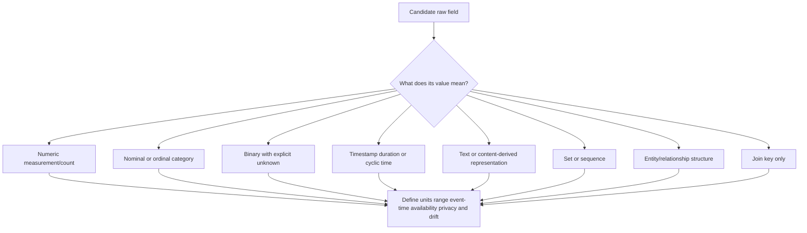
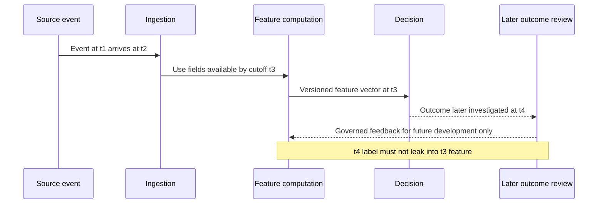
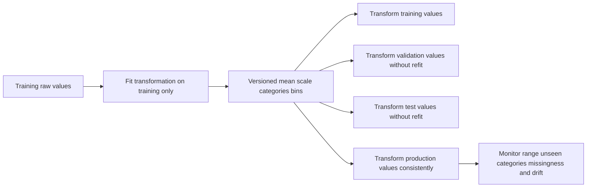
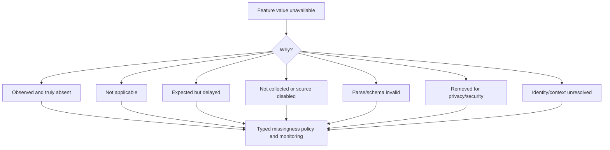
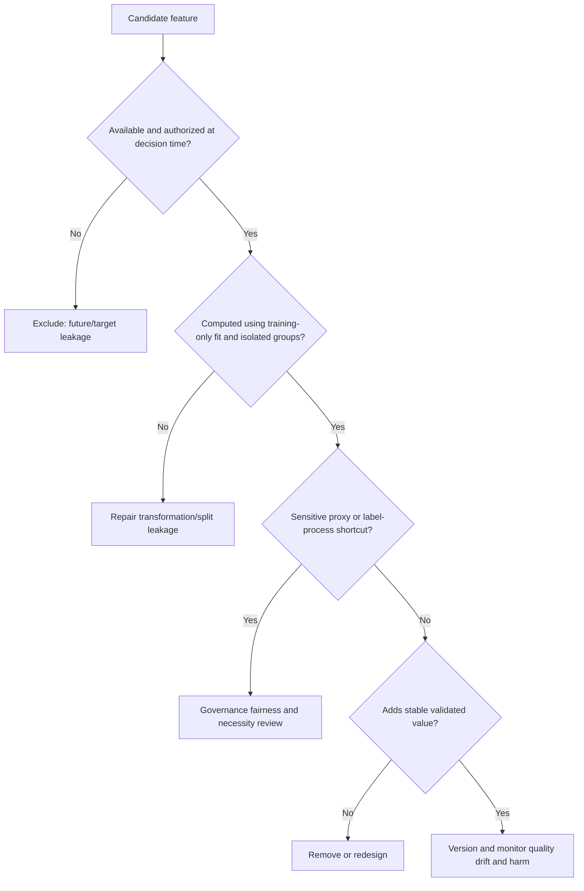
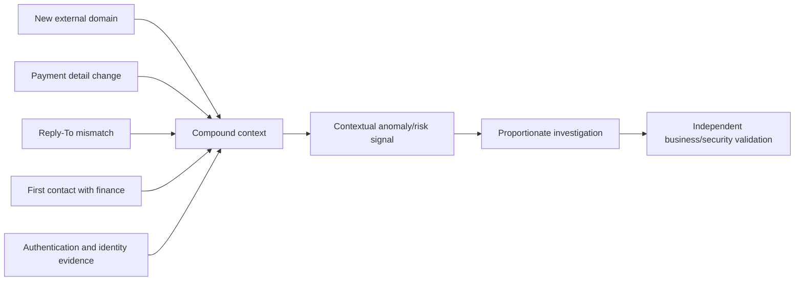
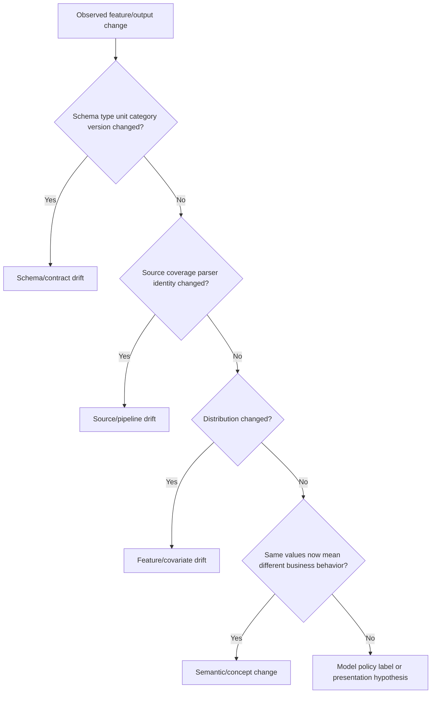
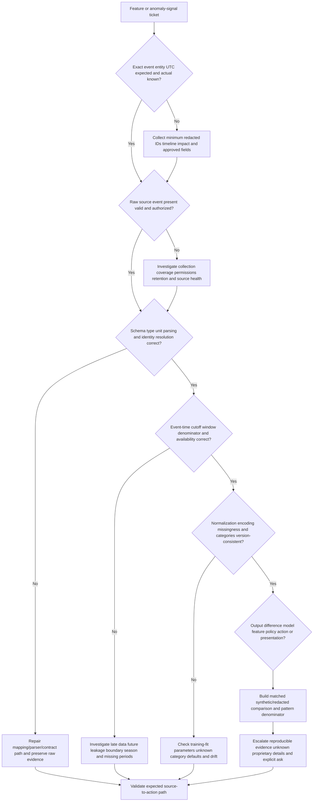

# Part 051 - Feature Engineering and Anomaly Signals

## Section goal

This Part explains how raw observations become model- or rule-usable features and how those features can produce anomaly signals. **Feature engineering** is the governed process of selecting, defining, transforming, aggregating, and validating representations of events. A feature is not the real-world event itself. An anomaly signal is not proof of harm. Both inherit the quality, timing, coverage, privacy, and assumptions of their pipeline.

The support goal is to diagnose beyond "the AI got it wrong." Was the raw field present? Was its unit correct? Did event time or processing time define the window? Was the category unseen? Was missingness represented intentionally? Did normalization use the correct reference? Did an interaction combine otherwise ordinary values? Did a future outcome leak into training? Did a proxy create unfair or brittle behavior? Did schema or distribution drift change what the feature means?

The central rule is:

> A feature is a documented measurement made from eligible evidence at a specific time. Validate its meaning, provenance, availability, and failure modes before interpreting its signal.

This Part makes no claim about proprietary Abnormal features, embeddings, models, windows, aggregation, normalization, encoding, training data, thresholds, scores, drift controls, or implementation. Public vendor material is cited only for attributed high-level positioning. The lab uses fictional tables and hand/local calculations only.

## Learning outcomes

After completing this Part, you should be able to:

- distinguish raw facts, parsed fields, derived features, labels, predictions, scores, policy, and actions;
- classify numeric, categorical, ordinal, binary, temporal, text, set, sequence, and graph features;
- explain point-in-time features, rolling windows, tumbling windows, aggregation, lag, and event-time eligibility;
- calculate count, rate, mean, median, range, recency, and simple normalized values by hand;
- explain scaling, normalization, standardization, log transformation, clipping, binning, and category encoding at a high level;
- handle missing, unknown, not applicable, delayed, redacted, and invalid values distinctly;
- detect target leakage, future leakage, split leakage, transformation leakage, and feedback leakage;
- identify proxies, sensitive-attribute risks, interactions, rarity features, and sparse categories;
- define feature quality across validity, completeness, consistency, timeliness, uniqueness, provenance, and stability;
- reason about feature drift, schema drift, source drift, and meaning drift;
- map support-visible symptoms to ingestion, parsing, identity resolution, windowing, transformation, model, policy, or presentation layers; and
- use your analytics/SQL/Python, Copilot evaluation/training, support trends, fix validation, and customer communication only as transferable facts.

## JD Mapping

| Supplied role signal | Capability built | Transferable evidence | Boundary |
|---|---|---|---|
| Behavioral false-positive ownership | Traces feature inputs, time windows, missingness, and comparison context | Structured troubleshooting and fix validation | No claim of viewing or editing Abnormal hidden features |
| Threat investigations | Separates weak signals, interactions, and corroboration | Complex investigations and evidence packages | No production security-model design claim |
| Configuration/API tickets | Checks schema, type, units, mapping, delay, and version | Microsoft cloud and REST/JSON working knowledge | Vendor API/feature contract requires approved docs |
| Support analytics | Uses counts, rates, windows, cohorts, SQL/Python concepts | CSAT/backlog/case-quality/trend analysis | Support data is not model training data by default |
| Product/Engineering escalation | Supplies raw-versus-derived evidence and reproducible comparisons | Escalation and regression validation | Proprietary implementation remains protected |
| Customer trust | Explains observable fields without exposing or inventing internals | Audience-aware enterprise communication | Avoid causal or certainty claims |
| AI support tools | Understands context, representations, evaluation, and human verification | Copilot/agent evaluation and training | GenAI experience is not behavioral-feature engineering |
| Security/privacy culture | Identifies leakage, proxies, minimization, and access limits | Evidence ethics and support privacy habits | No legal conclusion or live profiling |

## Candidate honesty note

| Evidence tier | Safe statement | Must not be implied |
|---|---|---|
| **Production transfer** | "I have validated raw versus transformed support evidence, compared cohorts and time windows, and used analytics to find patterns." | That you built Abnormal production features |
| **Local/public lab** | "I designed and hand-calculated a fictional feature table for a synthetic BEC case." | That a model was trained or a customer event was processed |
| **Learned architecture** | "I understand feature quality, leakage, transformation, and responsible-AI concepts from official sources." | That generic patterns match Abnormal implementation |
| **No direct experience** | "I have not operated Abnormal AI in production or inspected its proprietary feature pipeline." | Knowledge of embeddings, weights, thresholds, training data, or code |
| **Unknown proprietary detail** | "Exact Abnormal features, windows, transformations, missing-value handling, models, scores, and drift controls are unknown unless approved documentation states them." | Reverse-engineering a feature from a customer outcome |

Safe interview language:

> "I can test the observable data path, define event-time features, calculate synthetic transformations, recognize leakage and drift, and build a reproducible escalation. I cannot claim knowledge of Abnormal's proprietary feature set or training pipeline."

## 1. From event to feature to action

A **raw observation** is recorded evidence such as an accepted UTC timestamp, sender identifier, recipient count, application ID, or authentication result. Parsing extracts structured fields. Feature engineering transforms fields into representations. A model or statistical method produces an output. Threshold, policy, configuration, and human review can then determine action.

```mermaid
flowchart LR
    Reality[Real-world event] --> Collect[Authorized collection]
    Collect --> Raw[Raw immutable observation]
    Raw --> Parse[Parse and validate schema]
    Parse --> Resolve[Resolve identity relationship and time]
    Resolve --> Transform[Transform aggregate normalize encode]
    Transform --> Features[Versioned feature vector]
    Features --> Model[Model or statistical rule]
    Model --> Output[Score class rank or signal]
    Output --> Policy[Threshold policy configuration]
    Policy --> Action[Review allow contain or other action]
    Action --> Outcome[Observed outcome and governed feedback]
```

| Layer | Example | Owner question | Support-visible symptom |
|---|---|---|---|
| Raw source | Timestamp `2026-08-24T12:00Z` | Was it collected and retained correctly? | Event absent |
| Parsing | Domain extracted from address | Did parser handle syntax/version? | Wrong domain/category |
| Identity resolution | Alias linked to account ID | Was mapping valid at event time? | Known entity appears new |
| Feature | `relationship_age_days=120` | Definition/window/version? | Value looks stale |
| Model/statistic | Continuous output | What are approved semantics? | Unexpected score/class |
| Threshold/policy | Route if condition met | Which version/configuration? | Same score, different action |
| Human/workflow | Analyst override | Who changed state and why? | Model blamed for manual action |
| Presentation | UI label/chart | Is display transformed/cached? | Portal differs from export |

## 🔍 Plain-English deep-dive: Features are prepared ingredients, not the entire meal or the farm

A cook receives tomatoes, flour, spices, and oil. Washing, chopping, measuring, and combining them creates prepared ingredients for a recipe. The final dish depends on ingredient quality, preparation, recipe, temperature, timing, and the diner's judgment. A chopped tomato is not the whole farm, and one spice does not explain the meal.

Raw observations resemble delivered ingredients. Parsing and transformation prepare them. Features are measured representations such as "days since first observed relationship" or "messages per eligible day." A model combines features. Policy and humans decide what to do. If a field is stale, a unit is wrong, or a window includes the future, the downstream result can be misleading even when the model runs exactly as designed.

The recipe analogy stops because model representations can be learned, high-dimensional, and not human-readable. Its support lesson is precise: inspect the whole pipeline rather than attributing every symptom to "the model," and never confuse one contributing feature with the real-world cause.

**Memory hook:** Raw data is collected; features are prepared; models combine; policy acts.

## 2. Feature types

The data type determines valid operations. Averaging department names is meaningless. Treating an ordered severity as an unrelated category loses order. Encoding an identifier as a numeric magnitude can create false distance.

| Feature type | Plain meaning | Synthetic example | Valid operation concepts | Caution |
|---|---|---|---|---|
| Numeric continuous | Measured value over a range | Message length | Scale, log, clip, aggregate | Unit and outliers matter |
| Numeric count | Number of events/items | Recipient count | Count/rate/window | Exposure denominator matters |
| Categorical nominal | Unordered label | Application category | One-hot, frequency, learned representation | Unseen/high-cardinality values |
| Ordinal | Ordered category | Low/medium/high | Ordered encoding | Gaps may not be equal |
| Binary/Boolean | Two-state indicator | Attachment present | 0/1 with missing separate | Unknown is not false |
| Temporal | Time or duration | Hour-of-week, recency | Cyclic encoding, lag, window | Time zone and event time |
| Text | Token/string content | Defanged subject text | Counts, embeddings, categories | Privacy, language, adversarial text |
| Set | Unordered collection | Recipient domains | Size, overlap, novelty | Membership and privacy |
| Sequence | Ordered events | Sign-in -> consent -> export | Transition/order patterns | Missing/late events |
| Graph | Nodes/edges/neighborhood | New directed vendor edge | Degree, age, change | Connectivity is not intent |
| Identifier | Stable reference | Account object ID | Join/group, not magnitude | Memorization and privacy |

## 3. Point-in-time correctness

A feature for an event at time $t$ may use only information available by the defined decision time. **Point-in-time correctness** prevents future facts and later corrections from leaking into a historical feature. Store both event time and ingestion/availability time where needed.

| Time field | Meaning | Example | Misuse |
|---|---|---|---|
| Event time | When source says event occurred | Message accepted UTC | Assuming it was immediately available |
| Ingestion time | When platform received event | Connector arrival UTC | Using as business event order |
| Processing time | When transformation ran | Batch start UTC | Treating batch order as event order |
| Availability time | When field was usable for decision | Directory sync completion | Leaking later identity context |
| Effective time | When configuration/role should apply | Promotion start UTC | Applying current role to old event |
| Label time | When outcome was confirmed | Incident review completion | Using label as prediction-time feature |

## 4. Windows and aggregation

A **window** selects events relative to a reference time. A **rolling window** moves with each event. A **tumbling window** divides time into non-overlapping blocks. A **session window** groups activity separated by gaps. Aggregation converts multiple events into count, sum, rate, mean, median, minimum, maximum, distinct count, proportion, recency, or sequence summaries.

| Window | Definition example | Useful for | Main risk |
|---|---|---|---|
| Point | Current event only | Direct properties | No history/context |
| Rolling 24 hours | Prior 24 eligible hours ending before event | Recent burst/rate | Expensive, boundary sensitivity |
| Rolling 30 days | Prior 30 eligible days | Relationship/history | Stale after change |
| Tumbling day | Calendar UTC day blocks | Reporting/volume | Midnight boundary artifacts |
| Hour-of-week matched | Prior same weekday/hour | Seasonality | Sparse reference |
| Session | Events until inactivity gap | Interaction sequence | Gap choice changes sessions |
| Expanding | All eligible prior history | Stable long-term context | Old regime dominates |
| Dual window | Short versus long comparison | Change detection | Interpretation/maintenance complexity |

Suppose 12 messages occurred during 6 eligible business days. The count is `12`, while the rate is:

$$
\text{message rate}=\frac{12}{6}=2\text{ messages per eligible business day}
$$

If three days were missing because of connector failure, using nine calendar days as a denominator understates the observed rate and hides coverage uncertainty.

## 🔍 Plain-English deep-dive: A camera exposure window changes what motion looks like

A short camera exposure freezes a moving object. A long exposure turns the same movement into a streak. Neither image is inherently false; each summarizes a different interval. If the photographer fails to state the exposure, viewers can misinterpret motion.

Feature windows behave similarly. A five-minute count highlights bursts. A 30-day count emphasizes stable volume. A first-seen feature depends on how far back reliable history extends. A month-end comparison should often use matched business cycles rather than an arbitrary week.

Window boundaries can manufacture differences. Twenty events at 23:59 and twenty at 00:01 appear in two tumbling days but one four-minute rolling window. Late-arriving events can alter a backfilled window after the original decision. Support should preserve the feature version used then and distinguish it from a later corrected calculation.

The camera analogy stops because data windows also involve eligibility, identity, missing events, and transformations. Its lesson remains: every aggregate needs a stated window, cutoff, denominator, time semantics, and coverage.

**Memory hook:** A window is the exposure setting of a behavioral measurement.

## 5. Common aggregations and robust summaries

| Aggregation | Formula/idea | Strength | Weakness | Synthetic use |
|---|---|---|---|---|
| Count | Number of eligible events | Simple | Ignores exposure | Messages in 24h |
| Rate | Count divided by eligible exposure | Comparable | Denominator errors | Messages/business day |
| Sum | Total numeric amount | Business impact | Extreme values dominate | Total recipients |
| Mean | Sum divided by count | Familiar center | Outlier sensitive | Average recipients |
| Median | Middle ordered value | Robust center | Hides modes | Typical message size |
| Min/max | Extremes | Bounds | One error dominates | First/last time |
| Distinct count | Unique entities/categories | Breadth | Identity errors inflate | Unique recipient domains |
| Proportion | Subset divided by total | Composition | Small denominator unstable | External-recipient share |
| Recency | Current time minus prior event | Relationship freshness | Missing history looks old/new | Days since vendor contact |
| Change/delta | Current minus prior/reference | Directional shift | Scale-dependent | Recipient increase |
| Ratio | One measure divided by another | Relative structure | Zero/small denominator | Inbound/outbound ratio |

For values `[1,2,2,3,22]`, the mean is $30/5=6$, while the median is `2`. The extreme value may be a valid batch or a data error. Robust summaries reduce its influence but do not decide which.

## 6. Scaling, normalization, transformations, and encoding

**Scaling** changes numeric range. **Standardization** often subtracts a reference mean and divides by a reference standard deviation. **Min-max normalization** maps a defined range to another range. A **log transformation** compresses large positive values. **Clipping** caps extremes. **Binning** turns a number into categories. **Encoding** turns categories into model-usable representations.

| Transformation | High-level operation | Good reason | Failure mode |
|---|---|---|---|
| Standardize | $z=(x-\mu)/\sigma$ | Comparable numeric scale | Test/prod refit leakage; outliers |
| Min-max | $(x-\min)/(\max-\min)$ | Bounded range | New values exceed training range |
| Log | $\log(1+x)$ for nonnegative $x$ | Compress skew | Invalid negatives and zero handling |
| Clip/winsorize | Cap values at bounds | Limit extreme influence | Hides meaningful attack/batch extremes |
| Bin | Map values to intervals | Interpretability/nonlinearity | Boundary instability and lost detail |
| One-hot | Binary column per category | Simple nominal categories | High cardinality/unseen category |
| Ordinal encode | Ordered numbers | Preserves true order | False equal spacing |
| Frequency encode | Category occurrence rate | Compact | Rare/sensitive proxy and drift |
| Hash/learned representation | Compact high-cardinality representation | Scale | Collision/opacity/unknown behavior |

If a training reference has mean $\mu=10$ and standard deviation $\sigma=2$, a current value $x=14$ has:

$$
z=\frac{14-10}{2}=2
$$

That means two reference standard deviations above the mean under the assumptions. It is not a 2% risk, not a probability, and not proof of anomaly or harm. Standard deviation itself can be misleading for skewed or multimodal data.

## 7. Categorical encoding and high cardinality

A category such as application type can be one-hot encoded. An identifier such as exact sender address may have millions of values; naïve one-hot encoding becomes sparse and can memorize identities. Grouping rare categories, using governed representations, or treating IDs as join keys can help, but every method has tradeoffs.

| Category issue | Symptom | Risk | Check |
|---|---|---|---|
| Unseen category | Production value absent in training vocabulary | Error/default/unknown behavior | Explicit `UNKNOWN` path and monitoring |
| Rare category | Few examples | Unstable estimate or privacy exposure | Minimum support and human review |
| High cardinality | Huge vocabulary | Memorization, cost, brittleness | Purpose and generalization test |
| Renamed value | `APP_A` becomes `APP-A` | False novelty | Canonical mapping/version |
| Merged category | Different apps share `Other` | Hidden risk/context | Preserve meaningful types |
| Ordinal misuse | Department encoded 1,2,3 | Fake numeric distance | Nominal encoding |
| Identifier reuse | Familiar string, new object | History contamination | Stable scoped ID/lifecycle |

## 8. Missingness is information with multiple meanings

Missing values can mean not collected, not applicable, source delayed, access denied, redacted, parser failed, entity unresolved, or truly absent. Replacing all with zero erases meaning. A missingness indicator can help, but it can also become a proxy for source, region, or customer configuration.

| Missingness state | Example | Safe representation concept | Support action |
|---|---|---|---|
| True zero | Zero attachments observed | Numeric `0` | Confirm source coverage |
| Unknown | Attachment telemetry unavailable | Separate `UNKNOWN` | Investigate source |
| Not applicable | Service account has no human tenure | `NOT_APPLICABLE` | Use entity-specific feature |
| Delayed | Directory role not synced yet | `DELAYED` plus age | Check availability time |
| Invalid | Timestamp cannot parse | `INVALID` | Preserve raw and parser error |
| Redacted | Content category intentionally removed | `REDACTED` | Respect purpose/access |
| Unresolved | Sender cannot map to entity | `UNRESOLVED` | Entity-resolution path |

## 🔍 Plain-English deep-dive: A blank form field can mean "none," "unknown," "not asked," or "refused"

On a medical form, a blank allergy field could mean no allergies, the patient does not know, the question was skipped, the system failed, or the patient chose not to answer. Writing "none" into every blank can create harmful certainty.

Feature pipelines face the same problem. A missing attachment count is not necessarily zero attachments. A missing role may reflect sync delay. A service identity may have no human department because the concept is not applicable. Redacted content should not be reconstructed casually.

Missingness can itself correlate with outcomes because certain sources, regions, account types, or configurations omit fields. That correlation may become a brittle shortcut or unfair proxy. Monitor missing rates by source and cohort, test whether the model relies on the indicator, and fix collection rather than celebrating predictive missingness.

The form analogy stops because automated pipelines operate at scale and may transform missing states into learned representations. Its lesson is exact: preserve why a value is missing and do not turn absence of evidence into evidence of absence.

**Memory hook:** Unknown is not zero; not applicable is not missing; delayed is not absent.

## 9. Leakage

**Leakage** gives training or evaluation information unavailable in legitimate inference or lets evaluation data influence development. It produces deceptively strong results and brittle deployment.

| Leakage type | Example | Why invalid | Prevention concept |
|---|---|---|---|
| Target leakage | `final_incident_verdict` used as feature | Contains answer | Feature availability audit |
| Future leakage | Future message count in prior-event feature | Uses later events | Strict event-time cutoff |
| Split leakage | Same campaign/entity duplicates across sets | Test resembles train | Group/time split and dedup |
| Transformation leakage | Mean/categories fitted on all data | Test informs representation | Fit preprocessing on training only |
| Label leakage | Reviewer explanation copies model output | Target echoes prediction | Independent/blinded review sample |
| Feedback leakage | Production action changes observed outcome | Label reflects intervention/selection | Causal/selection-aware evaluation |
| Join leakage | Post-event table joined without effective time | Later state applied backward | Point-in-time joins |
| Text leakage | Template contains resolution wording | Shortcut to case outcome | Inspect tokens/source process |

## 🔍 Plain-English deep-dive: Leakage is an answer key hidden in a student's notes

A student appears brilliant if the final exam answer key is accidentally included in permitted notes. The score measures access to answers, not general understanding. A model can achieve the same illusion when a feature contains a future verdict, remediation action, or duplicated campaign fingerprint.

Leakage can be indirect. A case-closure code may encode the label. A timestamp may reveal which artificial batch contains attacks. A preprocessing mean computed from test data exposes the future population. A reviewer shown the model decision may copy it into the label.

Fixing leakage usually lowers measured performance. That is an improvement in honesty, not a regression in the model. Rebuild point-in-time features, split related entities/campaigns, fit transformations on training only, and protect independent labels/test sets.

The exam analogy stops because real deployments change and labels can be uncertain even without leakage. The lesson remains: evaluation must measure inference with only legitimate information.

**Memory hook:** If a feature knows the future answer, the evaluation is rehearsed, not real.

## 10. Proxies and sensitive attributes

A **proxy** is a feature that stands in for another attribute. Postal code can proxy socioeconomic or demographic factors; language, device, work schedule, role, or domain may correlate with sensitive characteristics. A proxy can be operationally meaningful and still create fairness/privacy risk.

| Candidate proxy | Legitimate operational meaning | Responsible-use risk | Review question |
|---|---|---|---|
| Region/time zone | Expected schedule/routing | Nationality or location proxy | Is it necessary and tested by subgroup? |
| Language | Communication context | Nationality/ethnicity proxy | Can less sensitive context suffice? |
| Job title/role | Permission/workflow context | Rank or employment-status impact | Is role current and fairly grouped? |
| Device type | Management/security posture | Income/accessibility proxy | Is security state measured directly? |
| Tenure | Cold-start context | Disadvantages new staff | Is uncertainty handled without blame? |
| Domain/vendor | Relationship identity | Organization reputation overgeneralization | Is exact relationship evidence available? |
| Missingness | Source/configuration | Customer/cohort proxy | Why is field missing? |

Part 057 goes deeper into bias and responsible use. Support should not infer protected attributes or provide legal advice. Escalate privacy/fairness concerns with minimum evidence and authorized owners.

## 11. Interactions and compound signals

An **interaction** means the effect or meaning of one feature depends on another. A new domain alone can be legitimate; a payment-change request alone can be legitimate; the combination with unusual reply path and new relationship may warrant stronger review.

| Signal 1 | Signal 2 | Interaction question | Non-proof caveat |
|---|---|---|---|
| New relationship | Sensitive request | Is novelty paired with high-impact workflow? | New vendor can be legitimate |
| Unusual hour | New device/session | Is identity context changed jointly? | Travel and replacement device exist |
| Familiar vendor | Changed domain | Is relationship continuity verified? | Migration can be approved |
| High recipient count | External destinations | Is scope unlike role/process? | Newsletter/project can explain |
| New app | Broad scope | Is permission grant approved? | Rollout can be legitimate |
| Style shift | Thread/auth change | Is impersonation hypothesis corroborated? | Style does not prove author |

Interactions can improve useful context but reduce simple explainability and increase sparse combinations. Do not claim a particular interaction exists in Abnormal unless approved evidence says so.

## 12. Rarity features

A rarity feature may estimate how infrequently a category, value, edge, or pattern appears under a reference. For $k$ occurrences in $n$ eligible events, empirical frequency is $\hat{p}=k/n$. A simple inverse-frequency idea grows as frequency falls, but exact formulas need smoothing and governance.

If a domain appears twice in 200 eligible interactions:

$$
\hat{p}=\frac{2}{200}=0.01=1\%
$$

That is historical frequency, not 99% maliciousness. Sparse counts, source gaps, seasonality, cold start, and entity resolution affect it. A known compromised vendor can be frequent and risky.

## 13. Feature quality contract

| Quality dimension | Definition | Synthetic check | Support symptom |
|---|---|---|---|
| Validity | Value follows type/range/schema | Recipient count nonnegative | Parse/default error |
| Completeness | Expected eligible values present | Missing-rate by source | Unexpected unknowns |
| Consistency | Same concept represented uniformly | UTC/unit/category mapping | Different portal/export values |
| Timeliness | Available before needed | Ingestion lag percentile | Stale baseline |
| Uniqueness | Duplicate events controlled | Event ID dedup | Inflated counts |
| Accuracy | Value reflects source reality | Compare authoritative sample | Wrong identity/domain |
| Provenance | Source and transformation traceable | Lineage/version | Cannot reproduce |
| Stability | Meaning/distribution reasonably stable | Versioned trend | Sudden score shift |
| Coverage | Population/time/source represented | Expected source matrix | Cohort blind spot |
| Privacy | Purpose/access/retention appropriate | Minimization review | Overcollection |

## 14. Feature drift and meaning drift

**Feature drift** means feature distribution changes. **Schema drift** changes fields/types. **Source drift** changes collection. **Meaning drift** changes what a value represents even if schema stays the same. Part 055 expands monitoring.

| Drift example | Feature value | Hidden change | Check |
|---|---|---|---|
| App renamed | Category changes | Same application, new string | Stable app ID/version |
| UTC becomes local time | Numeric hour still 0-23 | Meaning shifted | Unit/time-zone contract |
| Connector backfill | Volume spikes | Historical events arrive late | Event versus ingestion time |
| Distribution-list expansion | Recipient count rises | Business configuration | Group membership change |
| Privacy redaction | Text-derived feature missing | Collection policy changed | Governance/change record |
| Role taxonomy update | Peer category changes | Mapping semantics | Effective-dated taxonomy |

## 15. Support-visible symptoms by layer

| Symptom | Plausible layer | Cheap check | Escalate when |
|---|---|---|---|
| Feature displays impossible negative count | Parsing/transformation/UI | Raw field, units, version | Reproducible contract violation |
| Known sender appears rare | Identity/window/source | Stable IDs and eligible history | Mapping is correct but output conflicts |
| Scores shift after connector change | Coverage/source/window | Change timeline and missing rates | Multi-entity pattern persists |
| Same event differs across UI/export | Presentation/version/cache | IDs, timestamps, API/UI versions | Documented representations disagree |
| New category causes errors | Encoding/schema | Raw value and unknown path | No safe fallback or widespread failure |
| False positives cluster by region | Proxy/time/source/cohort | Segment with denominator and coverage | Fairness/privacy risk or systemic pattern |
| Detection weak after migration | Identifier/meaning/history drift | Pre/post IDs and backfill | Product defect or undocumented behavior |

## Troubleshooting decision tree

## 16. Worked example 1: Synthetic BEC feature row

### Inputs

`MSG-051-01` comes from `newvendor051.invalid` to a finance mailbox, requests a payment-route change, has a reply-to domain mismatch, and arrives at a normal work hour. No live data is used.

### Feature sketch

| Feature | Value | Type | Event-time evidence | Caveat |
|---|---:|---|---|---|
| Relationship age days | 0 | Numeric | No eligible prior edge in 90-day complete source | First observed, not first ever |
| Sender-domain frequency | 0/500 | Rate | Eligible finance messages | Zero needs smoothing/context |
| Work-hour indicator | 1 | Binary | Recipient time zone | Ordinary timing is not safety |
| Payment-change category | 1 | Binary/derived | Synthetic category | Category is not intent |
| Reply-to mismatch | 1 | Binary | Parsed header fixture | Forwarding/workflow alternatives |
| Recipient count | 1 | Count | Envelope fixture | Low count does not mean low impact |

The interaction among a new domain, sensitive request, and reply mismatch can support review. It does not prove fraud. Independent known-channel business verification and identity/message evidence remain necessary.

## 17. Worked example 2: Window and denominator

An account sends 20 external messages during a 10-day window. The connector was healthy for only five days. Reporting `2 per calendar day` assumes complete exposure. The observed eligible-day rate is:

$$
\frac{20}{5}=4\text{ external messages per observed eligible day}
$$

Neither estimate describes the missing five days. Report the coverage gap and avoid extrapolating without assumptions.

## 18. Worked example 3: Standardization drift

A training feature has $\mu=10$ and $\sigma=2$. Production value `14` maps to $z=2$. A pipeline bug refits on one production batch with mean `14` and standard deviation `4`, mapping the same value to $z=0$. The raw event is unchanged, but transformation semantics changed.

Validation should compare transformation version and parameters, not blame the model. Production should apply approved training-fitted parameters unless the documented lifecycle intentionally updates them.

## 19. Worked example 4: Missing versus zero

Two messages display `attachment_count=0`. In row A, the parser observed a complete message with no attachments. In row B, MIME parsing failed and a default wrote zero. Their UI values match, but evidence differs. Preserve `parse_status` or typed missingness so the model and support workflow can distinguish them.

## 20. Common failure modes

| Failure | Why it fails | Better behavior |
|---|---|---|
| Feature equals raw fact | Transformations introduce assumptions | Preserve lineage and definition |
| Current data reconstructs old feature | Future/backfill leaks hindsight | Use point-in-time snapshot/version |
| Count without denominator | Exposure differs | Report eligible rate and coverage |
| Average alone | Outliers/modes hidden | Add median/distribution/season |
| Standardized value is probability | $z$ is relative distance | Explain reference and units |
| Refit normalization everywhere | Semantics change and leak | Fit on training; version consistently |
| Unknown category becomes zero | Conflates meanings | Explicit unknown path |
| Missing equals false | Delayed/invalid/not-applicable differ | Typed missingness |
| More features is always better | Noise, cost, leakage, proxies increase | Validate incremental stable value |
| Identifier as numeric magnitude | Creates fake ordering/distance | Use as scoped key or governed encoding |
| Rare equals risky | Legitimate novelty exists | Corroborate context/harm |
| Interaction proves cause | Feature combination predicts, not causes | Use causal restraint |
| Tickets become labels automatically | Selection/reviewer bias | Govern labeling and denominators |
| Drift means attacker | Product/business/source changes exist | Classify drift and test alternatives |
| UI value proves backend value | Cache/display transforms exist | Compare raw/API/version evidence |
| Generic feature list equals Abnormal | Proprietary details unknown | Label generic concepts and public claims |

## 21. Escalation packet

| Field | Required content |
|---|---|
| Question | Exact expected versus actual symptom/impact |
| Identity/event | Pseudonymous IDs, UTC, entity and event type |
| Raw evidence | Minimum source fields, source/version, integrity |
| Feature contract | Name if documented, type, unit, formula, window, cutoff |
| Availability | Event/ingest/process/effective/label times |
| Missingness | State, reason, rate, affected cohorts |
| Transformation | Version, parameters, category mapping, fallback |
| Coverage | Source health, retention, duplicates, delays, backfill |
| Comparison | Matched affected/unaffected examples |
| Pattern | Numerator, denominator, cohort, time, version |
| Privacy | Purpose, minimization, access, retention/deletion |
| Unknowns | Proprietary features/models/thresholds not guessed |
| Ask | Confirm semantics, lineage, defect, expected behavior, or next evidence |

## Safe synthetic lab: The Feature Foundry Ledger 051

### Objective

Turn fictional raw message, identity, relationship, and application observations into a documented feature table for a synthetic BEC investigation. Calculate windows, rates, normalization, missingness, rarity, and interactions; find leakage and drift; map support symptoms. The unique lab is **The Feature Foundry Ledger 051**.

This lab uses local paper/Markdown/spreadsheet calculations only. It trains no model and uses no API, upload, customer data, live prompt, account, production system, or proprietary claim.

### Prerequisites

- Local Markdown editor, paper, or local spreadsheet only.
- This Part and fictional fixtures below.
- Calculator for arithmetic, fractions, mean, median, rate, and standardization.
- No model, API, hosted notebook, cloud sheet, tenant, account, email system, or Abnormal access.
- Artifact label: **local/public lab - fictional feature calculations only**.
- Record UTC start, purpose, authorization boundary, and zero-real-data statement.

### Privacy and authorization boundary

Authorized:

- copy fictional IDs and `.invalid` domains locally;
- calculate and document synthetic features;
- draw feature-pipeline diagrams; and
- cite verified official/public sources.

Prohibited:

- real messages, people, customers, tenants, cases, domains, logs, prompts, feature values, or vendor outputs;
- model/API/cloud/hosted uploads or calls;
- tenant/account/product access, prompt attacks, profiling, scanning, or security-control tests;
- guessing or claiming Abnormal proprietary features or formulas.

### Synthetic raw observations

| Event ID | UTC | Sender domain | Recipient group | Recipients | Attachment count | Reply domain | Category | Source status |
|---|---|---|---|---:|---:|---|---|---|
| MSG-051-01 | 2026-08-24 09:00 | newvendor051.invalid | FIN-051 | 1 | 0 | other051.invalid | Payment change | Complete |
| MSG-051-02 | 2026-08-23 09:00 | oldvendor051.invalid | FIN-051 | 1 | 1 | oldvendor051.invalid | Invoice | Complete |
| MSG-051-03 | 2026-08-16 09:05 | oldvendor051.invalid | FIN-051 | 1 | 1 | oldvendor051.invalid | Invoice | Complete |
| MSG-051-04 | 2026-08-09 09:10 | oldvendor051.invalid | FIN-051 | 2 | 1 | oldvendor051.invalid | Invoice | Complete |
| MSG-051-05 | 2026-08-02 09:00 | oldvendor051.invalid | FIN-051 | 1 | blank | oldvendor051.invalid | Invoice | Parse failed |
| MSG-051-06 | 2026-08-24 23:30 | internal051.invalid | EXEC-051 | 30 | 0 | internal051.invalid | Announcement | Complete |

Additional history: `oldvendor051.invalid` appeared 20 times in 90 complete eligible days; `newvendor051.invalid` appeared zero times; finance received 500 eligible messages. Training reference recipient-count mean is `5`, standard deviation `5`. A fictional future field `final_case_verdict` and a post-event `remediation_action` are present in an unsafe draft table.

### Lab steps

1. Create `The Feature Foundry Ledger 051`; record UTC, evidence label, and zero-real-data statement.
2. Draw raw -> parse -> resolve -> transform -> feature -> output -> policy -> action -> feedback pipeline.
3. Build a data dictionary with type, unit, source, event-time availability, privacy purpose, missing state, range, and version for every raw column.
4. Propose numeric, categorical, binary, temporal, text-category, set, sequence, and graph features. Mark identifiers as keys, not magnitudes.
5. Calculate recipient count, external proportion, relationship recency, relationship age, domain frequency, reply mismatch, and hour-of-week features.
6. Calculate `newvendor051.invalid` empirical frequency `0/500` and explain why it is not a maliciousness probability.
7. Calculate standardization for recipient counts `1` and `30` using training $\mu=5$, $\sigma=5`; explain limitations.
8. Calculate mean and median attachment count using only valid observed values. Keep MSG-051-05 as `INVALID/PARSE_FAILED`, not zero.
9. Define rolling 24-hour, rolling 30-day, and matched weekday/hour windows. State exact cutoff and denominator.
10. Simulate a seven-day connector gap and recalculate observed-day rate with a coverage warning.
11. Encode message category and source status using explicit known/unknown categories; document unseen-category behavior.
12. Create three interactions: new domain + payment change; reply mismatch + first relation; unusual time + recipient expansion. State non-proof caveats.
13. Identify `final_case_verdict` as target/future leakage and `remediation_action` as post-outcome leakage. Remove both.
14. Find split leakage if near-duplicate vendor threads cross train/test. Propose group/time split.
15. Identify potential proxies among time zone, language/category, role, and missingness. Write governance questions, not legal conclusions.
16. Create a feature quality scorecard for validity, completeness, consistency, timeliness, uniqueness, accuracy, provenance, stability, coverage, and privacy.
17. Simulate category rename and UTC-to-local conversion without schema change; classify meaning drift.
18. Map five support symptoms to source, parse, identity, window, transform, model, policy, or UI layers.
19. Write a customer-safe explanation and escalation packet that labels all proprietary Abnormal details unknown.
20. Deliver a 90-second spoken explanation tying analytics/SQL/Python, Copilot evaluation/training, support trends, validation, and communication only as transfer evidence.
21. Complete source, privacy, cleanup, rubric, and zero-activity checks.

### Expected evidence

- Full raw-to-action pipeline diagram and data dictionary.
- Typed feature inventory across all required families.
- Hand-calculated counts, rates, recency, rarity, mean, median, and standardized values.
- Three explicit windows with event-time cutoffs and denominators.
- Typed missingness and unseen-category handling.
- Three interaction features with non-proof cautions.
- Leakage findings and corrected split/preprocessing plan.
- Proxy/governance question table.
- Feature quality scorecard and drift classifications.
- Support symptom-to-layer map.
- Customer-safe explanation and complete escalation packet.
- Spoken honesty statement and source ledger dated August 24, 2026.
- Cleanup and zero-live-activity attestation.

### Cleanup and privacy

- Confirm every ID contains `051` and every domain ends `.invalid`.
- Remove accidental real people, customers, employers, messages, domains, accounts, tenants, logs, prompts, labels, features, screenshots, or product values.
- Confirm no artifact or fixture was uploaded to a model, API, cloud sheet, portal, or hosted notebook.
- Confirm no tenant, account, product, live prompt, model, or security control was accessed, attacked, profiled, or tested.
- Delete the artifact if real/confidential data cannot be reliably removed.
- Retain only the local fictional worksheet if useful.
- Record cleanup UTC and: `Synthetic feature exercise only; zero live data, model, API, account, upload, prompt attack, profiling, or production activity.`

### Validation rubric

| Dimension | Fail | Developing | Pass |
|---|---|---|---|
| Lineage | Starts with feature value | Mentions source | Traces raw, parse, identity, time, transform, version, output, policy, action |
| Types | Treats all values numeric | Lists common types | Uses numeric, categorical, binary, temporal, text, set, sequence, graph, key correctly |
| Windows | Says "recent" | Names 30 days | Defines event-time cutoff, eligibility, denominator, coverage, season, and version |
| Math | Gives results only | Shows one formula | Shows rates, summaries, standardization, notation, and business limitations |
| Missingness | Replaces blank with zero | Adds unknown | Distinguishes absent, unknown, N/A, delayed, invalid, redacted, unresolved |
| Leakage | Notices target column | Removes future feature | Audits target, future, split, transform, label, feedback, join, and text leakage |
| Proxies | Ignores sensitive correlation | Adds warning | Tests necessity, subgroup behavior, direct measure, governance, and privacy |
| Drift | Calls every change model drift | Checks schema | Separates schema, source, distribution, meaning, model, policy, and UI |
| Safety | Uses live/model data | Uses synthetic upload | Local fictional calculations and zero-activity attestation |
| Honesty | Claims Abnormal features | Says generic pipeline | Labels transfer/lab/learned architecture and proprietary unknowns |

## 22. Official Source Anchors

All sources were accessed on **August 24, 2026** and must be revalidated before interview or production use. They anchor generic AI risk, data quality, bias, responsible-AI, message-field, and public product concepts. They do not reveal Abnormal's proprietary raw data, features, embeddings, windows, transformations, missingness logic, models, thresholds, training data, scores, or drift implementation.

| Official or primary source | What it anchors | Boundary |
|---|---|---|
| [NIST AI Risk Management Framework 1.0](https://www.nist.gov/itl/ai-risk-management-framework) | Data, context, measurement, validity/reliability, transparency, privacy, governance | Voluntary framework, not feature specification |
| [NIST AI RMF Playbook](https://airc.nist.gov/AI_RMF_Knowledge_Base/Playbook) | Suggested data, TEVV, drift, documentation, and monitoring actions | Not a universal checklist |
| [NIST SP 1270 - Towards a Standard for Identifying and Managing Bias in AI](https://www.nist.gov/publications/towards-standard-identifying-and-managing-bias-artificial-intelligence) | Systemic, computational/statistical, and human-cognitive bias considerations | General guidance, not legal advice |
| [Microsoft Learn - What is Responsible AI](https://learn.microsoft.com/en-us/azure/machine-learning/concept-responsible-ai?view=azureml-api-2) | Reliability, fairness, transparency, privacy/security, and accountability | Azure guidance, not Abnormal design |
| [RFC 5322 - Internet Message Format](https://www.rfc-editor.org/rfc/rfc5322) | Primary syntax/semantics for message fields used in synthetic raw observations | Message format, not security feature semantics |
| [Abnormal AI official site](https://abnormal.ai/) | Current attributable high-level behavioral-security positioning | Public/marketing level only |
| [Abnormal AI platform overview](https://abnormal.ai/platform/overview) | Current attributable high-level statements about behavioral signals/context | Do not infer proprietary feature definitions or pipeline |

### Source-use discipline

- Attribute vendor statements and preserve date/context.
- Keep generic feature examples separate from product facts.
- Record title, URL, access date, supported claim, and revalidation result.
- Do not copy long text or include real/customer data.
- Route protected architecture, privacy, fairness, legal, or contractual questions to authorized owners.

## Likely Interview Questions

### Q1. What is feature engineering?

**Model answer:** It is the governed process of turning eligible raw observations into defined model- or rule-usable representations through parsing, identity/time resolution, aggregation, transformation, and encoding. Every feature needs type, unit, source, event-time availability, window, version, quality, privacy purpose, and limitations.

### Q2. What feature types matter in behavioral security?

**Model answer:** Generic families include numeric counts/rates, categorical and ordinal values, binary indicators, temporal and recency values, text-derived representations, sets, sequences, graph relationships, and stable identifiers used as keys. The valid transformation and failure modes differ by type.

### Q3. Why do feature windows and denominators matter?

**Model answer:** A five-minute burst, 30-day relationship, and matched month-end history answer different questions. Counts also depend on eligible exposure. I specify event-time cutoff, window, denominator, source coverage, late arrivals, seasonality, and the feature version used at decision time.

### Q4. How do you handle missing feature values?

**Model answer:** I distinguish true zero/absence from unknown, not applicable, delayed, invalid, redacted, and unresolved. I preserve the reason, monitor missing rates by source/cohort, avoid unsafe defaulting, and consider whether missingness becomes a proxy or shortcut.

### Q5. What is data leakage?

**Model answer:** Leakage gives development/evaluation information unavailable at legitimate inference or lets test data influence choices. Examples include future verdicts, post-event actions, duplicate campaigns across splits, full-data normalization, and reviewers echoing model outputs. I use point-in-time joins, grouped/time splits, training-only preprocessing, and independent labels/tests.

### Q6. What are proxy and interaction features?

**Model answer:** A proxy correlates with another attribute and can create privacy, fairness, or brittleness risk; an interaction means one feature's meaning depends on another. New domain plus payment change can be more informative jointly, but still does not prove fraud or cause. Both require necessity, stability, subgroup, and governance review.

### Q7. How would you troubleshoot a feature-related false positive?

**Model answer:** I trace exact event/entity/time from raw source through parsing, identity resolution, event-time window/denominator, missingness, normalization/encoding version, model output, policy/action, and UI. I compare matched examples, measure pattern/coverage, and escalate an explicit semantics or defect question without guessing hidden features.

### Q8. What do you know about Abnormal's feature pipeline?

**Model answer:** Only attributable high-level public statements. I have not operated or inspected it. Exact raw data, features, embeddings, windows, transformations, missing handling, models, training data, thresholds, scores, and drift controls are proprietary or unknown unless approved documentation states them. My evidence is generic study and a synthetic lab.

## 30-Second Memory Hooks

- **A feature is a measured representation, not reality.**
- **Trace raw -> parse -> identity/time -> transform -> model -> policy -> action.**
- **Types control valid operations.**
- **Every aggregate needs window, cutoff, denominator, and coverage.**
- **Fit transformations on training; apply the same version later.**
- **A z-score is distance, not probability or risk.**
- **Unknown is not zero; N/A is not missing.**
- **Leakage is an answer key hidden in development data.**
- **Proxies can be predictive and still unsafe.**
- **Interactions add context, not causal proof.**
- **Rarity is frequency under a reference, not maliciousness.**
- **Abnormal's proprietary features remain unknown.**

## Completion Checklist

- [ ] I can state the Section goal and central feature rule.
- [ ] I can trace raw observation through action and identify each ownership layer.
- [ ] I can classify numeric, categorical, ordinal, binary, temporal, text, set, sequence, graph, and identifier fields.
- [ ] I can define point-in-time correctness and all relevant time fields.
- [ ] I can calculate counts, rates, mean, median, recency, rarity, and standardization with plain notation.
- [ ] I can compare rolling, tumbling, session, matched, expanding, and dual windows.
- [ ] I can explain scaling, log, clipping, binning, one-hot, ordinal, frequency, and learned encodings at high level.
- [ ] I can distinguish all required missingness states.
- [ ] I can detect target, future, split, transformation, label, feedback, join, and text leakage.
- [ ] I can reason about proxies, interactions, rarity, feature quality, and drift without causal claims.
- [ ] I can map support symptoms to source, parser, identity, window, transform, model, policy, or UI.
- [ ] I completed or can explain **The Feature Foundry Ledger 051**, including Prerequisites, Expected evidence, Cleanup and privacy, and Validation rubric.
- [ ] I used no model/API upload, customer data, live prompt, account, product, or production system.
- [ ] I can state the Candidate honesty note and proprietary Abnormal boundary.
- [ ] I checked Official Source Anchors and recorded **August 24, 2026**.
- [ ] I can answer exactly Q1-Q8 aloud.

[Next: Part 052 - Precision Recall and the Confusion Matrix](Part-052-precision-recall-and-the-confusion-matrix.md)