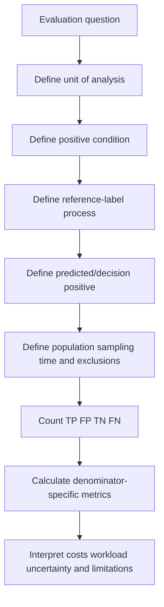
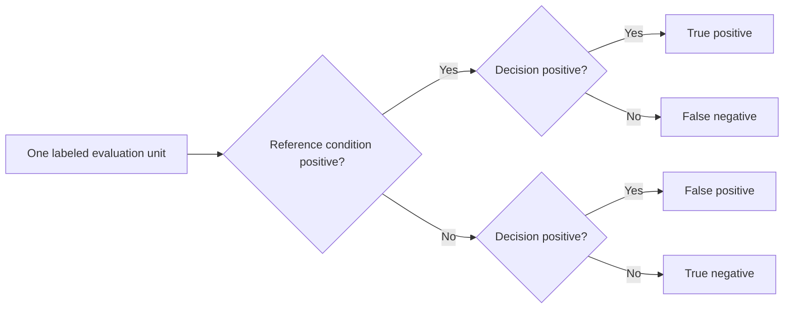
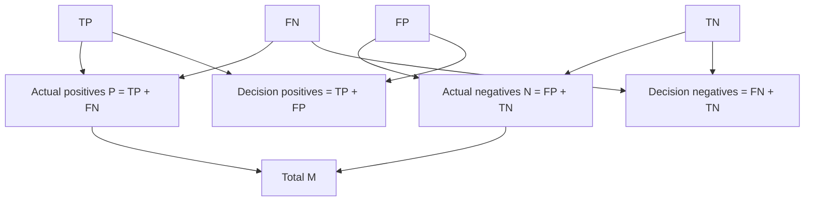
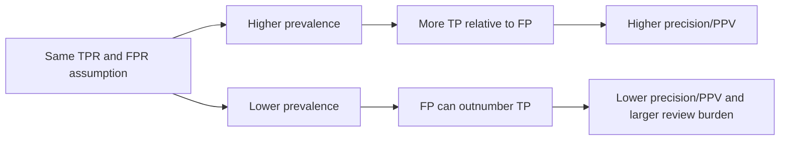
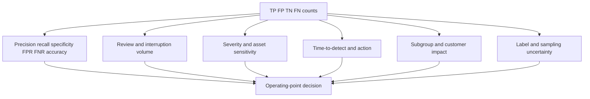
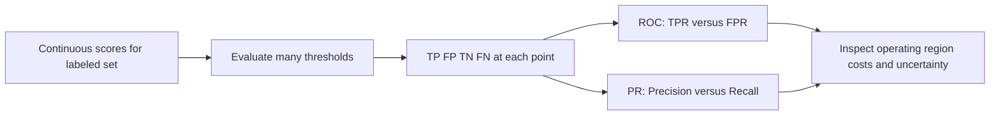
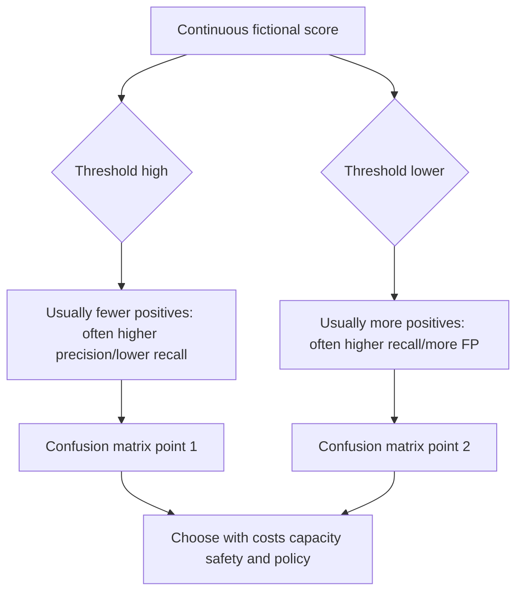
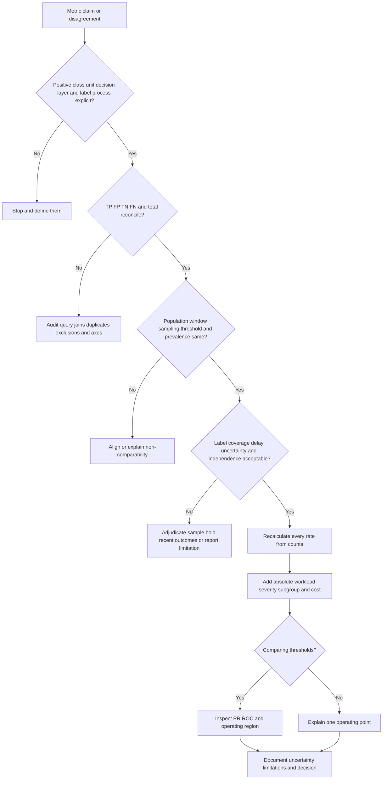

# Part 052 - Precision Recall and the Confusion Matrix

## Section goal

This Part teaches how to count and interpret binary classification outcomes from zero knowledge. A **confusion matrix** compares a system's positive/negative decisions with a defined reference label. Its four cells are true positive (TP), false positive (FP), true negative (TN), and false negative (FN). Those counts become precision, recall, specificity, false-positive rate, false-negative rate, accuracy, and prevalence.

The goal is not to find one universally best metric. It is to ask what population, label process, sampling method, threshold, time period, unit, and business cost produced the number. Security events are often rare, so accuracy can be excellent while a system misses every attack. A tiny false-positive rate can still create a large analyst queue when legitimate volume is enormous. Precision can change when prevalence changes even if sensitivity and specificity remain similar.

The central rule is:

> Name the positive class, reconstruct the four counts, state every denominator, and interpret the operational cost before trusting a metric.

All examples are fictional hand calculations. They do not describe Abnormal AI performance, thresholds, labels, benchmark design, or score semantics. Abnormal's proprietary models, data, sampling, metrics, thresholds, and evaluation remain unknown unless an approved public source explicitly documents a claim with its methodology.

## Learning outcomes

After completing this Part, you should be able to:

- define actual/reference positive and negative versus predicted/decision positive and negative;
- identify TP, FP, TN, and FN without reversing the viewpoint;
- calculate precision/positive predictive value (PPV), recall/sensitivity/true-positive rate (TPR), specificity/true-negative rate (TNR), false-positive rate (FPR), false-negative rate (FNR), accuracy, prevalence, and related counts;
- explain each denominator in plain English and handle zero-denominator cases safely;
- build and audit a confusion matrix from a table or business narrative;
- show why base rate/prevalence changes precision and review burden;
- explain class imbalance and why accuracy can be misleading;
- compare precision-recall (PR) and receiver operating characteristic (ROC) views at a high level;
- distinguish a single operating point from a threshold curve and area summaries;
- explain macro, micro, weighted, and per-class averaging caveats;
- add explicit false-positive/false-negative costs without pretending cost is universal;
- troubleshoot metric disagreements caused by population, sampling, labels, units, windows, duplicates, intervention, or threshold changes; and
- communicate your analytics/SQL/Python and support-trend strengths as transferable calculation and explanation skills only.

## JD Mapping

| Supplied role signal | Capability built | Transferable evidence | Boundary |
|---|---|---|---|
| Behavioral false-positive cases | Quantifies FP burden and investigates denominator/context | Support quality and trend analytics | No claim of Abnormal production metrics |
| Threat investigations | Tracks misses/FN hypotheses and label evidence | Evidence-based complex investigations | Undetected threats may not be labeled |
| Customer communication | Explains tradeoffs without hiding behind accuracy | Enterprise technical/nontechnical updates | No unsupported performance promise |
| Product/Engineering collaboration | Sends counts, population, sampling, threshold, labels, costs | Escalation and validation practice | Protected benchmark/evaluation details stay authorized |
| Support metrics/SQL/Python | Aggregates and segments confusion counts | Working analytics and query skills | Synthetic calculations are not production monitoring |
| AI support/evaluation | Distinguishes metrics, evaluation sets, and human review | Copilot evaluation/training | GenAI evaluation is not behavioral-security benchmarking |
| Process improvement | Connects queue burden, misses, and guardrails | Case quality, backlog, CSAT trends | Metrics require denominators and causal restraint |
| Customer trust | States uncertainty and base-rate effects | Clear expectation management | Avoid vendor comparisons without comparable studies |

## Candidate honesty note

| Evidence tier | Safe statement | Must not be implied |
|---|---|---|
| **Production transfer** | "I have used support metrics and trend analysis to reason about quality, volume, and customer impact." | That you measured an Abnormal production model |
| **Local/public lab** | "I hand-calculated confusion matrices and base-rate/cost scenarios from synthetic tables." | That the numbers represent customer or vendor outcomes |
| **Learned architecture** | "I learned evaluation and responsible-AI concepts from official sources." | That generic formulas reveal Abnormal score behavior |
| **No direct experience** | "I have not operated Abnormal AI or its evaluation pipeline in production." | Knowledge of private labels, sampling, thresholds, or benchmark sets |
| **Unknown proprietary detail** | "Exact Abnormal performance definitions, model metrics, datasets, prevalence, thresholding, and evaluation methodology are unknown unless approved material states them." | Repeating a marketing number without its scope and footnotes |

Safe interview language:

> "I can reconstruct and explain a confusion matrix, calculate the metrics, test base-rate and cost effects, and ask the evaluation questions that make a number meaningful. My examples are synthetic; I do not claim Abnormal production performance."

## 1. First define the positive class and unit

"Positive" does not mean morally good. It means the condition designated as positive for the evaluation. In a threat-detection example, positive may mean `reference-confirmed risky message`. In a legitimate-mail routing example, positive might instead mean `legitimate`. Switching the definition swaps interpretation.

The **unit** also matters. One row could be a message, recipient-message copy, incident, user-day, domain, or support case. Ten copies of one campaign are not necessarily ten independent incidents.

| Definition field | Synthetic choice | Why it matters | Failure example |
|---|---|---|---|
| Unit | Recipient-message copy | Determines count and duplicate handling | Counting one campaign as 1 or 100 |
| Positive reference | Independently confirmed risky | Defines actual positive | "Flagged" used as truth |
| Negative reference | Independently confirmed legitimate | Defines actual negative | Unreviewed treated as clean |
| Decision positive | Routed for security review | Defines prediction/action | Model score confused with final action |
| Population | All eligible inbound copies in August | Sets prevalence | Balanced test presented as production |
| Threshold/policy | Fictional operating point T-052 | Sets TP/FP tradeoff | Comparing different thresholds |
| Label window | Outcome known by defined cutoff | Controls delay/censoring | Recent unknowns marked negative |
| Exclusions | Tests, duplicates, source gaps documented | Affects denominator | Quietly removing hard cases |

## 2. The four confusion-matrix cells

The word **true** means the decision agrees with the reference. **False** means it disagrees. **Positive/negative** refers to the system's decision in the first word pair and the reference condition used to classify the outcome.

| Cell | Decision | Reference | Plain English | Security example |
|---|---|---|---|---|
| TP | Positive | Positive | Correctly surfaced positive | Confirmed risky message routed for review |
| FP | Positive | Negative | Incorrectly surfaced positive | Legitimate message routed for review |
| TN | Negative | Negative | Correctly left negative | Legitimate message not routed |
| FN | Negative | Positive | Missed positive | Confirmed risky message not routed |

The same event can be a TP for one layer and an FP for another if definitions differ. A model may score positive, policy may suppress it, and an analyst may later label it differently. Specify the evaluated decision layer.

## 🔍 Plain-English deep-dive: The smoke-alarm matrix depends on whether "positive" means alarm or fire

Imagine evaluating a smoke alarm. The real condition is fire/no fire; the alarm decision is alarm/no alarm. Alarm during fire is TP. Alarm without fire is FP. Silence without fire is TN. Silence during fire is FN.

Now imagine someone calls "positive" a quiet room. Every label flips. The arithmetic can still be correct while the conversation becomes nonsense. This is why an evaluation begins by naming the positive class and which axis is reference versus decision.

Security adds uncertainty. "Fire" may be confirmed only after investigation; some silent fires are never discovered; an alarm may trigger intervention that prevents later evidence. Therefore the reference labels, coverage, and follow-up window must be documented.

The analogy stops because security actors adapt and decisions can change outcomes. Its foundational lesson remains: define condition and decision before counting agreement and error.

**Memory hook:** True/false means agreement; positive/negative means the defined class.

## 3. Matrix layout and totals

This guide uses rows for the **reference/actual** class and columns for the **decision/predicted** class. Other tools may transpose axes, so always read labels.

| Reference \ Decision | Positive decision | Negative decision | Row total |
|---|---:|---:|---:|
| Positive reference | TP | FN | $P=TP+FN$ |
| Negative reference | FP | TN | $N=FP+TN$ |
| Column total | $TP+FP$ | $FN+TN$ | $M=TP+FP+TN+FN$ |

Here:

- $P$ is the number of actual/reference positives;
- $N$ is the number of actual/reference negatives; and
- $M$ is the total evaluated population.

Audit invariant:

$$
M=TP+FP+TN+FN
$$

If table totals do not reconcile, stop before calculating rates.

## 4. Precision or positive predictive value

**Precision**, also called **positive predictive value (PPV)**, asks: among decision-positive items, what fraction are reference positive?

$$
\operatorname{Precision}=\operatorname{PPV}=\frac{TP}{TP+FP}
$$

The denominator $TP+FP$ is the review/positive-decision queue. High precision means a larger share of surfaced items are confirmed positive under the label process. It does not describe how many positives were missed.

If $TP=15$ and $FP=45$:

$$
\operatorname{Precision}=\frac{15}{15+45}=\frac{15}{60}=0.25=25\%
$$

An analyst sees one confirmed positive per four reviewed items, on average in this synthetic set. That might be acceptable or unacceptable depending on severity, review cost, automation, and label quality.

## 5. Recall, sensitivity, or true-positive rate

**Recall**, **sensitivity**, and **true-positive rate (TPR)** ask: among reference positives, what fraction did the decision surface?

$$
\operatorname{Recall}=\operatorname{Sensitivity}=\operatorname{TPR}=\frac{TP}{TP+FN}
$$

The denominator $TP+FN$ is all known reference positives. If $TP=15$ and $FN=5$:

$$
\operatorname{Recall}=\frac{15}{15+5}=\frac{15}{20}=0.75=75\%
$$

The decision surfaces three quarters of known positives and misses one quarter. If undiscovered positives are absent from labels, measured recall can be optimistic.

## 6. Specificity and false-positive rate

**Specificity**, also called **true-negative rate (TNR)**, asks: among reference negatives, what fraction were correctly left negative?

$$
\operatorname{Specificity}=\operatorname{TNR}=\frac{TN}{TN+FP}
$$

**False-positive rate (FPR)** asks: among reference negatives, what fraction were incorrectly surfaced?

$$
\operatorname{FPR}=\frac{FP}{FP+TN}
$$

They are complements when defined on the same population:

$$
\operatorname{Specificity}=1-\operatorname{FPR}
$$

With $TN=9{,}935$ and $FP=45$:

$$
\operatorname{Specificity}=\frac{9{,}935}{9{,}980}\approx0.99549=99.549\%
$$

$$
\operatorname{FPR}=\frac{45}{9{,}980}\approx0.00451=0.451\%
$$

A `0.451%` FPR sounds tiny, but it creates 45 false reviews in 9,980 legitimate items. At one million legitimate items, a similar rate would imply roughly 4,510 false positives, subject to distribution stability.

## 7. False-negative rate

**False-negative rate (FNR)** asks: among reference positives, what fraction were missed?

$$
\operatorname{FNR}=\frac{FN}{FN+TP}
$$

It complements recall:

$$
\operatorname{FNR}=1-\operatorname{Recall}
$$

With $FN=5$ and $TP=15$:

$$
\operatorname{FNR}=\frac{5}{20}=0.25=25\%
$$

## 8. Accuracy and error rate

**Accuracy** asks: what fraction of all evaluated items were classified correctly?

$$
\operatorname{Accuracy}=\frac{TP+TN}{TP+FP+TN+FN}
$$

For the synthetic matrix $TP=15$, $FP=45$, $TN=9{,}935$, $FN=5$:

$$
\operatorname{Accuracy}=\frac{15+9{,}935}{10{,}000}=\frac{9{,}950}{10{,}000}=99.5\%
$$

The **error rate** is:

$$
\operatorname{ErrorRate}=\frac{FP+FN}{M}=1-\operatorname{Accuracy}=0.5\%
$$

Despite `99.5%` accuracy, precision is only `25%` and recall `75%`. The majority negative class dominates accuracy.

## 🔍 Plain-English deep-dive: A broken rare-event detector can boast 99.8% accuracy

Suppose 10,000 messages contain 20 confirmed risky messages and 9,980 legitimate messages. A useless system that labels every message legitimate has `TN=9,980`, `FN=20`, `TP=0`, and `FP=0`.

Its accuracy is:

$$
\frac{0+9{,}980}{10{,}000}=99.8\%
$$

Its recall is:

$$
\frac{0}{0+20}=0\%
$$

Accuracy applauds the system for guessing the majority class; recall exposes that it finds none of the positives. Precision has denominator $TP+FP=0$, so it is undefined rather than magically perfect.

This is like a weather service in a desert saying "no rain" every day. It is usually correct but useless for the rare storm. The analogy stops because security actions and attackers change outcomes. The lesson is exact: class imbalance requires class-specific metrics, counts, and costs.

**Memory hook:** Majority-class accuracy can hide total failure on the rare class.

## 9. Prevalence and base rate

**Prevalence** or **base rate** is the fraction of reference positives in the evaluated population:

$$
\operatorname{Prevalence}=\frac{TP+FN}{M}
$$

For 20 positives in 10,000:

$$
\operatorname{Prevalence}=\frac{20}{10{,}000}=0.002=0.2\%
$$

| Metric | Formula | Denominator question | Synthetic interpretation |
|---|---|---|---|
| Precision/PPV | $TP/(TP+FP)$ | Of surfaced items? | Share of review queue confirmed positive |
| Recall/TPR | $TP/(TP+FN)$ | Of actual positives? | Share of known positives surfaced |
| Specificity/TNR | $TN/(TN+FP)$ | Of actual negatives? | Share of legitimate items left negative |
| FPR | $FP/(FP+TN)$ | Of actual negatives? | Legitimate-item interruption rate |
| FNR | $FN/(FN+TP)$ | Of actual positives? | Known-positive miss rate |
| Accuracy | $(TP+TN)/M$ | Of all items? | Overall agreement dominated by majority |
| Prevalence | $(TP+FN)/M$ | How common are positives? | Base rate in evaluated population |

## 10. Base-rate effect on precision

Assume a system has TPR `90%` and FPR `1%` in two fictional populations.

### Population A: 1% prevalence in 10,000

- Positives: 100; negatives: 9,900.
- $TP=90$, $FN=10$.
- $FP=99$, $TN=9,801$.
- Precision:

$$
\frac{90}{90+99}=\frac{90}{189}\approx47.62\%
$$

### Population B: 0.1% prevalence in 10,000

- Positives: 10; negatives: 9,990.
- $TP=9$, $FN=1$.
- Approximately $FP=100$, $TN=9,890$ after rounding to counts.
- Precision:

$$
\frac{9}{9+100}=\frac{9}{109}\approx8.26\%
$$

Similar TPR/FPR produces much lower precision in the rarer population because false positives arise from a much larger negative pool relative to positives.

## 🔍 Plain-English deep-dive: Searching a haystack changes the meaning of an excellent filter

Imagine a filter that catches 90% of needles and mistakenly selects 1% of hay. In a pile with 100 needles and 9,900 pieces of hay, it selects 90 needles and 99 hay pieces. About half the selected items are needles.

In a larger haystack with only 10 needles and 9,990 hay pieces, it selects 9 needles and about 100 hay pieces. The filter's needle-catching rate and hay-selection rate are unchanged, but only about 8% of selected items are needles.

Precision therefore depends on prevalence and sampling. A balanced benchmark with 50% positives cannot be used to predict production queue precision in a 0.1% population without adjustment and assumptions. Customer, tenant, time, threat type, and review-selection differences matter.

The haystack analogy stops because security data has dependencies and adaptive actors. Its lesson is crucial: always ask how common the positive condition is in the evaluated population.

**Memory hook:** Same detector rates, rarer positives, lower PPV.

## 11. Negative predictive value and completeness

Although not required for every interview answer, **negative predictive value (NPV)** asks: among decision-negative items, what fraction are reference negative?

$$
\operatorname{NPV}=\frac{TN}{TN+FN}
$$

In rare-event settings NPV can be high even with meaningful misses, so pair it with FNR/recall and absolute FN counts. Like precision, NPV depends on prevalence.

## 12. Cost and business interpretation

Metrics count errors; business decisions weigh consequences. A false positive may create analyst workload, mail delay, user disruption, or trust loss. A false negative may enable fraud, compromise, or data loss. Costs vary by scenario and are not reducible to one universal currency.

A simple expected cost is:

$$
C=FP\cdot c_{FP}+FN\cdot c_{FN}
$$

where $c_{FP}$ and $c_{FN}$ are scenario-specific estimated costs. If $FP=45$, $FN=5$, $c_{FP}=1$ review-unit, and $c_{FN}=100$ impact-units:

$$
C=45\cdot1+5\cdot100=545\text{ units}
$$

If another threshold yields $FP=145$, $FN=1$:

$$
C=145\cdot1+1\cdot100=245\text{ units}
$$

Under these fictional costs the second point is lower cost despite more false positives. Change the costs, capacity, severity mix, or intervention effect and the decision can reverse. Do not use invented cost units as a production conclusion.

| Cost dimension | FP example | FN example | Guardrail |
|---|---|---|---|
| Analyst labor | Extra review | Investigation starts late/not at all | Queue capacity and severity routing |
| User productivity | Legitimate message delayed | User engages malicious message | Release and rapid escalation |
| Financial | Payment interrupted | Fraud proceeds | Known-channel controls |
| Security | Alert fatigue | Compromise/exfiltration | Layered controls and sampling |
| Trust | Customer sees noisy product | Customer sees missed threat | Transparent evidence and follow-up |
| Equity | Certain group overflagged | Certain group underprotected | Per-group review and governance |

## 13. Precision-recall versus ROC at a high level

A **receiver operating characteristic (ROC) curve** plots TPR/recall against FPR across thresholds. A **precision-recall (PR) curve** plots precision against recall. Each threshold gives an operating point.

| View | Axes | Highlights | Rare-event caution |
|---|---|---|---|
| ROC | TPR versus FPR | Ranking across positive/negative classes | Large TN pool can make FPR look small |
| PR | Precision versus recall | Positive yield and coverage | Strongly affected by prevalence |
| Confusion matrix | Four counts at one threshold | Concrete workload/errors | One point does not show alternatives |
| Area under curve | Summary across thresholds | Ranking summary | Can hide poor operational region |

ROC is not "bad" for imbalance, and PR is not automatically "better." Use both with counts, prevalence, uncertainty, operating costs, and relevant threshold region. Curves from different datasets are not directly comparable without population and label context.

## 14. Thresholds and one operating point

The usual direction depends on score semantics and is not guaranteed without documentation. Part 053 goes deeper. Never assume an Abnormal score is a probability or that customers control a threshold.

## 15. Macro, micro, weighted, and per-class caveats

For multiple classes, labels, tenants, or groups, metrics can be averaged differently.

| Average | How it works at high level | Strength | Caveat |
|---|---|---|---|
| Per-class/group | Report separately | Exposes variation | More numbers; small groups uncertain |
| Macro | Unweighted mean of per-group metrics | Gives each group equal weight | Tiny groups influence equally |
| Weighted macro | Mean weighted by support/population | Reflects volume | Large groups dominate |
| Micro | Pool counts first, then calculate | Overall event-level behavior | Hides weak small groups |

Suppose Group A has recall `90%` over 1,000 positives and Group B has recall `50%` over 10 positives.

Macro recall is:

$$
\frac{90\%+50\%}{2}=70\%
$$

If exact counts are $TP_A=900$, $FN_A=100$, $TP_B=5$, $FN_B=5$, micro recall is:

$$
\frac{900+5}{900+100+5+5}=\frac{905}{1{,}010}\approx89.60\%
$$

Both are correct summaries for different questions. Micro hides Group B's weakness. Macro may overemphasize a tiny uncertain group. Report per-group counts and confidence/uncertainty where decisions matter.

## 16. Sampling and label bias

| Evaluation hazard | Effect | Better practice concept |
|---|---|---|
| Review only alerts | Few/no TN or FN observed | Sample decision-negative population |
| Balanced test set | Artificial prevalence | Report design and adjust interpretation |
| Customer complaints as all errors | Reporting-selection bias | Add systematic sampling/denominator |
| Duplicate campaign copies | Inflated confidence/counts | Group and report dependence |
| Delayed outcomes | Recent positives marked negative | Censor/hold until label window |
| Analyst sees decision | Confirmation/automation bias | Independent/blinded sample |
| Action prevents outcome | Label reflects intervention | Record treatment/action and causal limits |
| Uncertain labels forced binary | Artificial truth | Adjudication/uncertain category/sensitivity analysis |

## 🔍 Plain-English deep-dive: A restaurant survey of only complainers cannot estimate overall satisfaction

If a restaurant surveys only people who ask for the manager, it learns about complaints but cannot estimate the percentage of all diners who were satisfied. Similarly, reviewing only alerts can estimate precision among reviewed alerts, but it cannot measure false negatives or specificity without sampling decision-negative items.

Customer tickets are valuable error evidence but are selected by awareness, impact, reporting behavior, entitlement, and duplication. One incident can create many tickets. Silent misses may create none. A balanced benchmark can support model comparison but does not preserve production prevalence.

The fix is transparent sampling: define the population, sample both decision-positive and decision-negative units, adjudicate labels independently, account for campaign/entity dependence, and report uncertainty. Support trends can generate hypotheses and prioritize investigation; they are not automatically a clean test set.

The survey analogy stops because security outcomes can be hidden and interventions change exposure. The lesson remains: infer only to the population your sampling supports.

**Memory hook:** Alert review measures the alert queue, not unseen misses.

## 17. Troubleshooting metric disagreements

| Symptom | Plausible cause | Discriminating check |
|---|---|---|
| Dashboard precision differs from manual | Different unit/window/label cutoff/duplicates | Reconcile raw four counts and definitions |
| Accuracy high, customers unhappy | Class imbalance or costly subgroup errors | Recall, precision, counts, cost, subgroup |
| FPR unchanged, queue doubles | Negative volume doubled | Absolute FP count and denominator |
| Precision drops after rollout | Prevalence/population/threshold/label changed | Segment by cohort/time/version |
| Recall cannot be measured | Decision negatives not reviewed | Sampling and outcome coverage |
| Macro and micro disagree | Group sizes/performance differ | Per-group counts and both averages |
| ROC strong, PR weak | Rare prevalence and FP burden | PR curve/counts in operating region |
| Metric improves after exclusions | Hard cases/source gaps removed | Exclusion ledger and sensitivity analysis |

## Troubleshooting decision tree

## 18. Worked example 1: Complete rare-event matrix

### Inputs

In 10,000 fictional recipient-message copies, independent review labels 20 positive and 9,980 negative. A fictional decision surfaces 60 items: 15 positive and 45 negative. Five positive items were not surfaced.

| Reference \ Decision | Positive | Negative | Total |
|---|---:|---:|---:|
| Positive | TP = 15 | FN = 5 | 20 |
| Negative | FP = 45 | TN = 9,935 | 9,980 |
| Total | 60 | 9,940 | 10,000 |

### Results

- Precision: $15/60=25\%$.
- Recall/TPR: $15/20=75\%$.
- Specificity: $9{,}935/9{,}980\approx99.549\%$.
- FPR: $45/9{,}980\approx0.451\%$.
- FNR: $5/20=25\%$.
- Accuracy: $9{,}950/10{,}000=99.5\%$.
- Prevalence: $20/10{,}000=0.2\%$.

### Business interpretation

Sixty items require the defined positive workflow; 45 are false positives under the reference, and five known positives are missed. Whether that is acceptable depends on severity, automation, review capacity, label confidence, and alternatives. Accuracy alone obscures both burdens.

## 19. Worked example 2: Accuracy-only baseline

The always-negative classifier has `99.8%` accuracy and `0%` recall on the same population. Its undefined precision must not be reported as `0%` or `100%` without convention and explanation because there are no positive decisions.

## 20. Worked example 3: Two operating points and cost

| Point | TP | FP | TN | FN | Precision | Recall |
|---|---:|---:|---:|---:|---:|---:|
| Conservative | 15 | 45 | 9,935 | 5 | 25.0% | 75.0% |
| Sensitive | 19 | 145 | 9,835 | 1 | 11.6% | 95.0% |

The sensitive point reviews 104 more items and finds four more positives. Under $c_{FP}=1$, $c_{FN}=100$, its simple cost is lower. Under $c_{FP}=10$, the result changes. Choose costs and constraints with owners; do not hide them in one score.

## 21. Worked example 4: Macro versus micro

Group A's large population dominates micro recall near `89.6%`, while macro recall is `70%`. Report Group B's `5/10` directly. A tiny sample also has high uncertainty, so do not jump from a rate to a fairness or product conclusion without more evidence and governance.

## 22. Common failure modes

| Failure | Why it fails | Better behavior |
|---|---|---|
| Positive means good | Class definition is arbitrary | Name positive condition |
| Axes assumed | Tools transpose rows/columns | Read labels and reconstruct narrative |
| Accuracy alone | Majority dominates | Add class metrics/counts/cost |
| Precision called recall | Denominators differ | Ask "of surfaced" versus "of actual positive" |
| FPR called FP percentage of all | Wrong denominator | Use $FP/(FP+TN)$ |
| Small FPR means small queue | Large negative volume | Report absolute FP count |
| Balanced test precision equals production | Prevalence differs | Model base-rate effect |
| Alert review measures recall | No decision-negative labels | Sample negatives/outcomes |
| Undefined division forced to zero | Hides no predicted/actual positives | State undefined and convention |
| Curves replace operating point | Area hides deployment region | Report threshold counts/cost |
| Macro is always fair | Tiny groups equal-weighted | Per-group counts and uncertainty |
| Micro is always representative | Large groups hide small failures | Show per-group/macro too |
| Tickets equal ground truth | Selection/duplication/label noise | Govern and sample |
| Benchmark numbers compared casually | Populations/methods differ | Require comparable methodology |
| Generic numbers imply Abnormal | Proprietary evaluation unknown | Label synthetic and attribute public claims |

## 23. Escalation packet

| Field | Required content |
|---|---|
| Metric question | Exact claim/disagreement and business impact |
| Positive/unit | Reference positive, decision positive, unit |
| Counts | TP, FP, TN, FN, totals, reconciliation |
| Population | Inclusion/exclusion, cohort, time, source coverage |
| Sampling | Full population or strategy/weights/dependence |
| Labels | Source, adjudication, uncertainty, delay, blindness |
| Operating point | Threshold/policy/version if documented |
| Metrics | Formulas, denominators, values, undefined conventions |
| Base rate | Prevalence and production/test mismatch |
| Cost/workload | Absolute queue, misses, severity, capacity, subgroup |
| Comparison | Same methodology or explicit non-comparability |
| Unknowns | Proprietary vendor metrics/data/thresholds not guessed |
| Ask | Confirm definitions, query, label set, threshold, defect, or next evidence |

## Safe synthetic lab: The Rare-Event Metrics Workbench 052

### Objective

Build and audit confusion matrices, calculate all requested metrics using KaTeX and hand arithmetic, model base-rate effects, compare two operating points, explain PR versus ROC, and expose macro/micro caveats. The unique lab is **The Rare-Event Metrics Workbench 052**.

This is a paper/local calculation lab. No model/API upload, customer data, account, tenant, live prompt, product access, or production claim is allowed.

### Prerequisites

- Local Markdown editor, paper, or local spreadsheet only.
- This Part, calculator, and fixtures below.
- Ability to add, divide, convert decimal to percent, and round transparently.
- No model, API, hosted notebook, cloud sheet, tenant, account, security product, or Abnormal access.
- Artifact label: **local/public lab - synthetic metric calculations only**.
- Record UTC start, purpose, rounding convention, and zero-real-data statement.

### Privacy and authorization boundary

Authorized:

- copy synthetic aggregate counts locally;
- perform hand/local arithmetic and draw diagrams;
- write fictional business interpretations; and
- cite verified official/primary sources.

Prohibited:

- real customer, employer, tenant, message, person, incident, label, benchmark, score, or performance data;
- model/API/cloud uploads or calls;
- account/product access, prompt attacks, testing controls, or vendor comparison claims;
- presenting fixtures as Abnormal metrics.

### Synthetic fixtures

| Scenario | TP | FP | TN | FN | Population note |
|---|---:|---:|---:|---:|---|
| A rare-event operating point | 15 | 45 | 9,935 | 5 | 10,000 copies; 0.2% prevalence |
| B always negative | 0 | 0 | 9,980 | 20 | Accuracy trap |
| C sensitive point | 19 | 145 | 9,835 | 1 | Same labels, different point |
| D balanced evaluation | 900 | 100 | 900 | 100 | Artificial 50% prevalence |
| Group A | 900 | 90 | 9,010 | 100 | Large group |
| Group B | 5 | 20 | 75 | 5 | Small group |

### Lab steps

1. Create `The Rare-Event Metrics Workbench 052`; record UTC, label, definitions, and rounding.
2. For every scenario, name unit, positive reference, positive decision, population, label source, and threshold assumption.
3. Draw each confusion matrix with labeled axes; reconcile row/column/total counts.
4. Calculate precision/PPV, recall/sensitivity/TPR, specificity/TNR, FPR, FNR, accuracy, prevalence, NPV, and error rate for A.
5. Write every formula in KaTeX and explain numerator/denominator in plain English.
6. Calculate B; state recall `0%`, accuracy `99.8%`, and precision undefined because $TP+FP=0$.
7. Compare A and C using absolute TP/FP/FN differences, precision, recall, specificity, FPR, FNR, and queue size.
8. Apply cost scenarios $(c_{FP},c_{FN})=(1,100)$, `(10,100)`, and `(1,1000)`; show where preference changes.
9. Construct prevalence scenarios `10%`, `1%`, `0.1%`, and `0.01%` for fixed fictional TPR/FPR; calculate approximate precision and queue composition.
10. Explain why D's balanced precision cannot be copied to A's production-like prevalence.
11. Draw a conceptual score-threshold sequence and mark at least three confusion-matrix points.
12. Explain PR versus ROC axes, strengths, and rare-event cautions without claiming one is universally superior.
13. Calculate per-group, macro, weighted, and micro recall/precision for Group A/B where defined; show counts.
14. Create a sampling/label risk register: alert-only review, delayed outcomes, duplicates, intervention, reviewer bias, uncertain labels.
15. Write one analyst-capacity memo: convert FP counts into review hours at fictional 5, 15, and 30 minutes per item.
16. Create a customer-safe metric explanation that avoids Abnormal performance claims.
17. Build an escalation packet for a dashboard/manual discrepancy.
18. Deliver a 90-second spoken answer tying analytics/SQL/Python, trends, Copilot evaluation/training, validation, and communication only as transfer evidence.
19. Complete source, privacy, cleanup, rubric, and zero-activity checks.

### Expected evidence

- Six labeled/reconciled confusion matrices.
- Full KaTeX formula sheet with denominator explanations.
- Hand-calculated A and B metrics including undefined precision handling.
- A-versus-C operating-point and cost comparison.
- Four prevalence/PPV scenarios.
- PR-versus-ROC conceptual explanation.
- Per-group/macro/micro/weighted caveat worksheet.
- Sampling/label-risk register and analyst-capacity memo.
- Customer-safe explanation and escalation packet.
- Spoken honesty statement and source ledger dated August 24, 2026.
- Cleanup and zero-live-activity attestation.

### Cleanup and privacy

- Confirm every identifier contains `052`; all numbers remain fictional aggregate counts.
- Remove accidental real customer, tenant, message, employee, incident, score, label, benchmark, product, or performance information.
- Confirm nothing was uploaded to a model, API, cloud sheet, portal, or hosted notebook.
- Confirm no account, tenant, product, live prompt, security control, or vendor benchmark was accessed or tested.
- Delete the artifact if real/confidential data cannot be reliably removed.
- Retain only the local synthetic worksheet if useful.
- Record cleanup UTC and: `Synthetic metric exercise only; zero live data, model, API, account, upload, prompt attack, benchmark, or production activity.`

### Validation rubric

| Dimension | Fail | Developing | Pass |
|---|---|---|---|
| Definitions | Positive undefined | Names class | Defines unit, reference, decision, population, labels, threshold, exclusions |
| Matrix | Reverses cells | Correct four cells | Labeled axes, narrative, row/column/total reconciliation |
| Formulas | Memorized rates | Correct calculations | KaTeX, numerator/denominator words, complements, zero-denominator handling |
| Imbalance | Quotes accuracy | Adds recall | Demonstrates always-negative trap and absolute burden |
| Base rate | Ignores prevalence | Mentions effect | Calculates PPV change under fixed TPR/FPR |
| Cost | Says FP/FN both bad | Assigns one cost | Tests multiple costs, capacity, severity, and guardrails |
| PR/ROC | Declares one superior | Names axes | Connects thresholds, operating region, prevalence, counts, and area limits |
| Averaging | Gives one aggregate | Gives macro/micro | Reports per-group counts, uncertainty, weighted and masking caveats |
| Safety | Uses live metrics | Uses synthetic upload | Local aggregate calculations and zero-activity attestation |
| Honesty | Claims Abnormal performance | Says fictional | Explicit transfer/lab/learned architecture and proprietary unknowns |

## 24. Official Source Anchors

All sources were accessed on **August 24, 2026** and must be revalidated before interview or production use. They anchor statistical measurement, responsible evaluation, and attributable public positioning. They do not validate or reveal Abnormal's proprietary datasets, labels, prevalence, sampling, thresholds, score semantics, confusion matrices, model metrics, or benchmark methodology.

| Official or primary source | What it anchors | Boundary |
|---|---|---|
| [NIST AI Risk Management Framework 1.0](https://www.nist.gov/itl/ai-risk-management-framework) | Validity/reliability, measurement, context, transparency, and risk tradeoffs | Voluntary framework, not metric prescription |
| [NIST AI RMF Playbook](https://airc.nist.gov/AI_RMF_Knowledge_Base/Playbook) | Suggested TEVV, metric, context, monitoring, and documentation actions | Not a universal checklist |
| [NIST/SEMATECH e-Handbook of Statistical Methods](https://www.itl.nist.gov/div898/handbook/) | Statistical measurement, sampling, uncertainty, and comparison foundations | General statistics, not security benchmark design |
| [Microsoft Learn - What is Responsible AI](https://learn.microsoft.com/en-us/azure/machine-learning/concept-responsible-ai?view=azureml-api-2) | Reliability, fairness, error analysis, transparency, and accountability | Azure guidance, not Abnormal evaluation |
| [scikit-learn - Metrics and scoring](https://scikit-learn.org/stable/modules/model_evaluation.html) | Open-source project reference for standard classification metric terminology | Software documentation, not a production-security standard |
| [Abnormal AI official site](https://abnormal.ai/) | Current attributable high-level company/product claims and any displayed methodology footnotes | Vendor claims require exact scope; do not generalize |

### Source-use discipline

- Preserve metric definition, dataset, sampling, prevalence, threshold, date, and footnotes with any public performance claim.
- Do not compare numbers from noncomparable populations or methodologies.
- Do not copy long source passages.
- Mark every lab value synthetic.
- Route protected benchmark, privacy, contractual, and product questions to authorized owners.

## Likely Interview Questions

### Q1. What are TP, FP, TN, and FN?

**Model answer:** After defining the positive reference and positive decision, TP is a positive correctly surfaced, FP a negative incorrectly surfaced, TN a negative correctly left negative, and FN a positive missed. I label axes and unit because tools can transpose layouts and one message versus one incident changes counts.

### Q2. What is the difference between precision and recall?

**Model answer:** Precision is $TP/(TP+FP)$, the positive yield among surfaced items. Recall is $TP/(TP+FN)$, the coverage among known positives. Precision describes review quality/burden; recall describes misses among labeled positives. Neither alone is sufficient.

### Q3. What are specificity, FPR, and FNR?

**Model answer:** Specificity is $TN/(TN+FP)$, the correctly negative share among actual negatives. FPR is $FP/(FP+TN)=1-\text{specificity}$. FNR is $FN/(FN+TP)=1-\text{recall}$. I always name denominators and absolute counts.

### Q4. Why can accuracy mislead in security?

**Model answer:** Positives are often rare, so the negative majority dominates accuracy. In a 0.2% positive population, predicting everything negative gives 99.8% accuracy but 0% recall. I report the confusion counts, precision, recall, FPR/FNR, prevalence, workload, and cost.

### Q5. How does prevalence affect precision?

**Model answer:** Precision depends on how many true positives exist relative to false positives. With the same TPR and FPR, a lower positive base rate produces fewer TP while FP still arise from a large negative pool, so PPV usually falls. Balanced test precision therefore cannot be copied directly to rare production populations.

### Q6. When would you use PR versus ROC?

**Model answer:** ROC shows TPR versus FPR across thresholds; PR shows precision versus recall and makes positive yield visible. In rare-event work I inspect both, especially the operational threshold region, plus counts, prevalence, uncertainty, and cost. Area summaries do not replace an operating point.

### Q7. What is the macro versus micro caveat?

**Model answer:** Macro averages per-group metrics equally, while micro pools counts so large groups dominate; weighted averages use population support. Each answers a different question and can hide important behavior, so I report per-group counts, uncertainty, and multiple summaries where impact matters.

### Q8. How would you discuss Abnormal performance numbers?

**Model answer:** I would use only current official attributed claims with their dataset, sampling, prevalence, label process, threshold, dates, comparator settings, and footnotes. I have no access to proprietary evaluation. My demonstrated evidence is synthetic hand calculation and transferable analytics/customer communication.

## 30-Second Memory Hooks

- **Define positive, unit, reference, decision, and population first.**
- **TP and TN agree; FP and FN disagree.**
- **Precision: of surfaced, how many positive?**
- **Recall: of positives, how many surfaced?**
- **Specificity/FPR share the actual-negative denominator.**
- **Recall/FNR share the actual-positive denominator.**
- **Accuracy can celebrate an always-negative rare-event detector.**
- **Small FPR times huge volume creates a big queue.**
- **Lower prevalence usually lowers PPV at fixed TPR/FPR.**
- **PR and ROC are threshold views, not operational decisions.**
- **Macro equalizes groups; micro follows volume.**
- **No Abnormal metric claim without official method and scope.**

## Completion Checklist

- [ ] I can state the Section goal and central denominator rule.
- [ ] I can define the unit, reference positive, decision positive, population, label process, threshold, and exclusions.
- [ ] I can reconstruct TP, FP, TN, FN from a narrative and reconcile totals.
- [ ] I can write and explain precision/PPV, recall/sensitivity/TPR, specificity/TNR, FPR, FNR, accuracy, prevalence, NPV, and error rate in KaTeX.
- [ ] I handle zero denominators as undefined with an explicit convention.
- [ ] I can demonstrate the always-negative accuracy trap.
- [ ] I can hand-calculate base-rate effects on PPV and workload.
- [ ] I can compare operating points using absolute counts, costs, capacity, and severity.
- [ ] I can explain PR versus ROC and area/operating-region limitations.
- [ ] I can explain per-class, macro, weighted, and micro summaries with counts.
- [ ] I can identify sampling, label, duplicate, intervention, and review bias.
- [ ] I completed or can explain **The Rare-Event Metrics Workbench 052**, including Prerequisites, Expected evidence, Cleanup and privacy, and Validation rubric.
- [ ] I used no customer data, model/API upload, account, live prompt, product, or production benchmark.
- [ ] I can state the Candidate honesty note and proprietary Abnormal boundary.
- [ ] I checked Official Source Anchors and recorded **August 24, 2026**.
- [ ] I can answer exactly Q1-Q8 aloud.

[Next: Part 053 - Thresholds Confidence and Calibration](Part-053-thresholds-confidence-and-calibration.md)