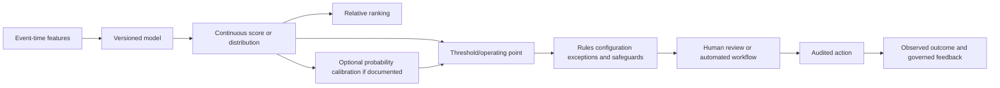
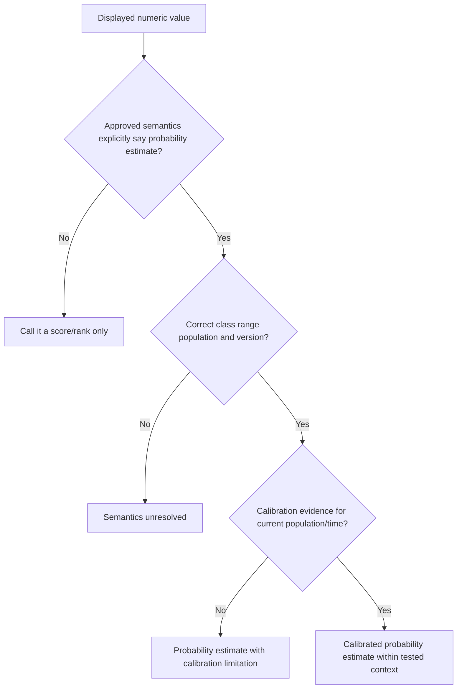
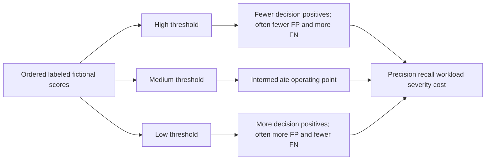
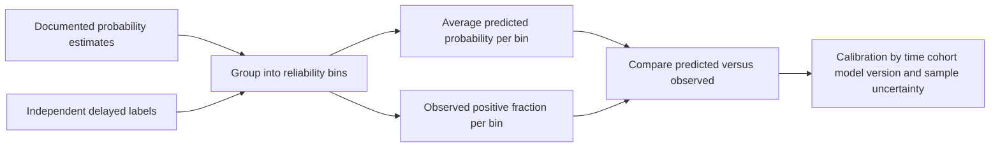
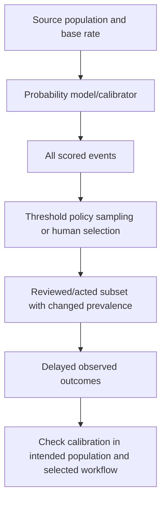
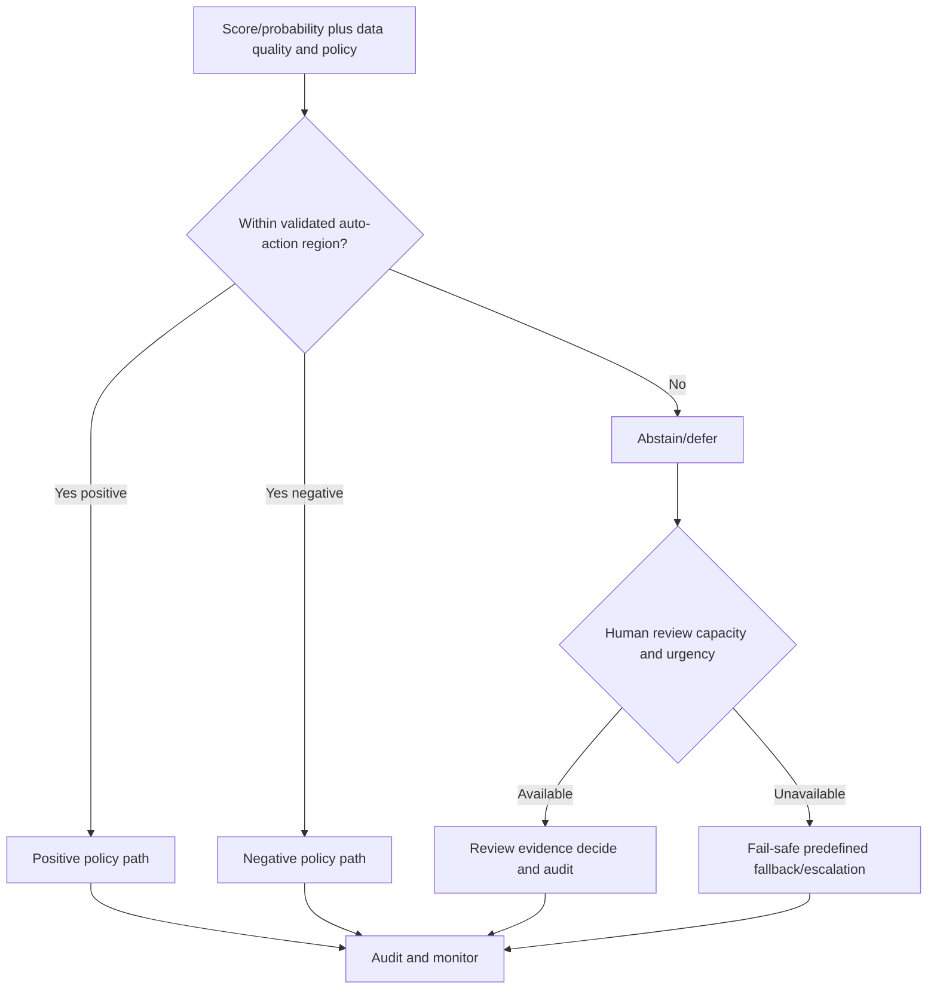
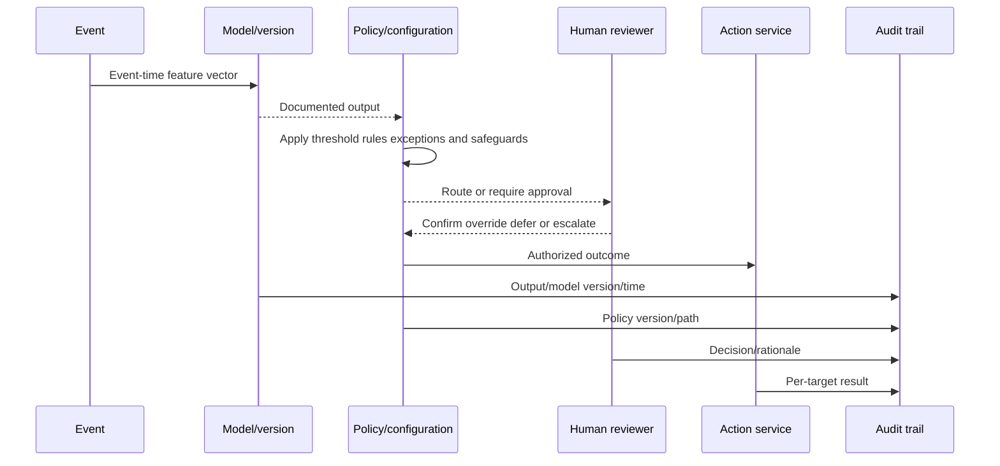
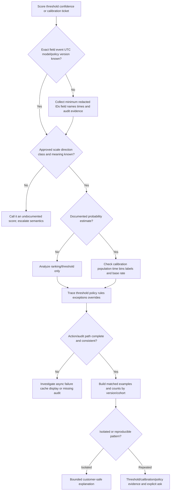

# Part 053 - Thresholds Confidence and Calibration

## Section goal

This Part separates concepts that are often collapsed into one word such as "confidence." A model can produce a continuous **score** used for ranking. A score may or may not be a **probability estimate**. A **threshold** converts a continuous output into a routing or decision candidate. A **policy layer** can combine thresholds with rules, configuration, exceptions, and business controls. **Calibration** asks whether documented probability estimates match observed frequencies over comparable groups. Human review can accept, reject, defer, or escalate an output.

The support goal is to answer tickets such as "Why was 82 blocked but 91 allowed?", "Does 0.7 mean 70% malicious?", "Why did confidence change?", or "Can we lower the threshold?" without inventing semantics. First identify the field, scale, direction, model/version, population, timestamp, and policy. Then distinguish ranking, probability, threshold, override, abstention, review, and action. A displayed number alone does not reveal any of those layers.

The central rule is:

> Never interpret a number until approved documentation defines its semantics, scale, direction, population, version, calibration, and downstream policy.

Abnormal's proprietary score meanings, probability estimates, calibration, thresholds, customer controls, policy layers, model versions, and action logic are unknown unless approved documentation explicitly states them. Every numeric example here is fictional and must not be mapped to an Abnormal field.

## Learning outcomes

After completing this Part, you should be able to:

- distinguish raw model output, score, rank, probability estimate, confidence, uncertainty, threshold, policy, verdict, and action;
- explain why a number between zero and one is not automatically a probability;
- calculate confusion matrices at several fictional thresholds and explain operating-point tradeoffs;
- distinguish ranking/discrimination from calibration/reliability;
- create and interpret simple reliability bins and a calibration curve at high level;
- hand-calculate a binary Brier score and state what it does and does not isolate;
- explain how prevalence/base-rate and population shift affect PPV and calibration;
- distinguish aleatoric/data uncertainty, epistemic/model uncertainty, ambiguity, and operational uncertainty at high level;
- explain abstention, reject option, deferral, fallback, and human-review queues;
- map policy/rule/exception/override/audit layers around a model output;
- troubleshoot ticket contradictions using event IDs, versions, timestamps, configuration, comparable examples, and audit evidence; and
- connect your Copilot evaluation/training, analytics/SQL/Python, support trends, fix validation, and customer communication only as transferable skills.

## JD Mapping

| Supplied role signal | Capability built | Transferable evidence | Boundary |
|---|---|---|---|
| Behavioral false-positive tickets | Traces score-to-policy-to-action and threshold tradeoffs | Structured comparison and validation | No claim of changing Abnormal thresholds |
| Threat investigations | Avoids treating score as proof; uses corroboration | Evidence-first critical-situation investigations | No production security-scoring claim |
| Customer communication | Explains uncertainty/calibration and contradictions safely | Technical/nontechnical enterprise updates | No undocumented score interpretation |
| Configuration support | Checks policy, exceptions, overrides, versions, and effective time | Microsoft cloud configuration troubleshooting | Abnormal controls require approved docs |
| Product/Engineering escalation | Supplies matched examples and exact semantics question | Escalation and fix validation | Protected model/calibration details remain authorized |
| AI support/evaluation | Evaluates probability-like outputs and human verification | Copilot/agent evaluation and training | GenAI confidence is not behavioral score expertise |
| Analytics/SQL/Python | Calculates bins, matrices, costs, queue load, and drift | Working analytics and trends | Synthetic worksheet is not production monitoring |
| Customer trust | Makes uncertainty and ownership visible | Expectation management | Avoid promises based on one score |

## Candidate honesty note

| Evidence tier | Safe statement | Do not imply |
|---|---|---|
| **Production transfer** | "I have compared versions/configuration and validated expected versus actual behavior in enterprise support." | That you owned production model thresholds |
| **Local/public lab** | "I calculated fictional threshold matrices, reliability bins, and Brier scores by hand." | That values represent Abnormal outputs |
| **Learned architecture** | "I understand calibration and responsible evaluation from official sources." | That generic calibration methods match vendor implementation |
| **No direct experience** | "I have not operated Abnormal AI or its scoring/policy pipeline in production." | Knowledge of private score scales or customer controls |
| **Unknown proprietary detail** | "Abnormal score semantics, probabilities, calibration, thresholds, policies, and model orchestration are unknown unless approved documentation states them." | Converting screenshots into reverse-engineered logic |

Safe interview language:

> "I can explain scores, thresholds, calibration, base rates, abstention, and human review generically and investigate observable product behavior. I would never assume an Abnormal value is a probability or customer-adjustable threshold without approved documentation."

## 1. Output vocabulary

| Term | Plain meaning | Example concept | Critical question |
|---|---|---|---|
| Raw output/logit/distance | Internal numeric result before documented transformation | Signed distance | Is it exposed or meaningful to users? |
| Score | Continuous/ordered value | `73` on fictional scale | What scale, direction, and version? |
| Rank | Relative ordering | Item is 5th in queue | Relative to which batch/population? |
| Probability estimate | Intended estimate of outcome frequency under conditions | `0.70` for positive class | Is it calibrated and for what population? |
| Confidence | Ambiguous informal/technical term | UI says "high" | Define exactly; never assume probability |
| Uncertainty | Limits in data/model/context/operations | Missing history or out-of-distribution | Which uncertainty type and evidence? |
| Threshold | Cut point for routing | Review if score $\ge t$ | Which layer/owner/version? |
| Policy | Rules/configuration combining signals and controls | Review high-value requests | Did policy override score? |
| Verdict | Named assessment/category | Suspicious/legitimate/unknown | Model, policy, or human verdict? |
| Action | Operational response | Allow, review, contain | Who authorized and validated it? |

## 🔍 Plain-English deep-dive: A thermometer number and a hospital triage decision are different layers

A thermometer reports a measurement on a defined scale. A hospital uses temperature with symptoms, age, history, and policy to choose triage. `39°C` is neither a probability of illness nor the treatment itself. Two patients with the same temperature can receive different routing because other evidence differs.

A model score can similarly be a measurement or ranking signal. A threshold may route it. Policy may add business context or exceptions. Human review may change the final outcome. A UI can display a category derived from several layers.

If one fictional event with score `82` is reviewed while another with `91` is allowed, do not conclude the threshold is inconsistent. The values may come from different score types, versions, populations, times, classes, or policy paths. One action may have been overridden. The displayed score may not be the decision input.

The thermometer analogy stops because model outputs can be opaque and dynamically produced. The lesson remains: measurement, interpretation, policy, and action are separate evidence layers.

**Memory hook:** A score measures or ranks; policy decides what happens next.

## 2. Score versus probability

A score can preserve ordering without representing probability. Multiplying every score by ten preserves rank but changes numeric values. A monotonic transformation can preserve ranking and ROC behavior while changing calibration.

| Property | Ranking score | Probability estimate |
|---|---|---|
| Required range | Any documented range | Usually $[0,1]$ or percentages |
| Meaning | Relative order/strength | Estimated outcome frequency under conditions |
| Monotonic transform | Often preserves ranking | Usually changes probability meaning |
| Threshold | Can create decisions | Can create decisions using cost/base rate |
| Calibration expected | Not necessarily | Yes, if probabilistic interpretation claimed |
| Single-event certainty | No | No |
| Population dependence | Yes | Strongly yes |

If scores `[1,2,3]` become `[10,20,30]`, ranking remains. Calling `30` a 30% probability would be nonsense without a calibrated mapping.

## 3. Threshold and operating point

A **threshold** $t$ converts a score $s$ into a binary decision under a stated direction. A fictional rule might be:

$$
\hat{y}=\begin{cases}
1,&s\ge t\\
0,&s<t
\end{cases}
$$

Here $\hat{y}=1$ means decision positive. Some systems use lower-is-riskier scores, class-specific thresholds, multiple bands, or policies rather than one cut. Do not assume direction.

| Threshold effect, assuming higher means more positive | Often changes | Not guaranteed |
|---|---|---|
| Raise threshold | Fewer positive decisions, fewer FP, more FN, higher precision, lower recall | Precision can behave irregularly in small/noisy sets |
| Lower threshold | More positive decisions, more TP and FP, fewer FN, higher recall | Score ties/policy can alter path |
| Keep threshold, population changes | Counts/precision/workload can change | TPR/FPR may also drift |
| Keep score, policy changes | Action can change | Model output may be identical |

## 4. Hand-worked threshold table

Consider ten fictional items with known labels and scores. Higher is defined as more positive for this lab only.

| Item | Score | Label |
|---|---:|---:|
| A | 0.95 | 1 |
| B | 0.90 | 0 |
| C | 0.85 | 1 |
| D | 0.80 | 1 |
| E | 0.70 | 0 |
| F | 0.60 | 1 |
| G | 0.55 | 0 |
| H | 0.40 | 0 |
| I | 0.30 | 1 |
| J | 0.10 | 0 |

| Threshold | TP | FP | TN | FN | Precision | Recall | Positive queue |
|---:|---:|---:|---:|---:|---:|---:|---:|
| $0.90$ | 1 | 1 | 4 | 4 | $1/2=50\%$ | $1/5=20\%$ | 2 |
| $0.70$ | 3 | 2 | 3 | 2 | $3/5=60\%$ | $3/5=60\%$ | 5 |
| $0.50$ | 4 | 3 | 2 | 1 | $4/7\approx57.1\%$ | $4/5=80\%$ | 7 |
| $0.20$ | 5 | 4 | 1 | 0 | $5/9\approx55.6\%$ | $5/5=100\%$ | 9 |

Precision is not perfectly monotonic in this small set. Threshold choice is an operating decision using costs, capacity, severity, policy, and uncertainty, not simply "maximize one metric."

## 5. Ranking and discrimination

**Discrimination** is the ability to rank positives above negatives. A model can rank well but provide badly calibrated probabilities. For example, changing probability-like values from `[0.9,0.8,0.2,0.1]` to `[0.6,0.55,0.45,0.4]` may preserve ordering but change probability quality.

| Question | Ranking metric/view | Calibration view | Operating view |
|---|---|---|---|
| Are positives ordered above negatives? | ROC/PR/ranking measures | Not answered | Threshold-dependent |
| Does 0.7 occur positive about 70%? | Not answered | Reliability/calibration | Supports probability decisions |
| How many reviews/misses at $t$? | One point from ranking | May inform costs | Confusion matrix at $t$ |
| Is queue within capacity? | Rank top-$k$ possible | Not sufficient | Workload/policy constraint |

## 6. Calibration and reliability

For a calibrated binary probability model, among many comparable events assigned near probability $p$, approximately fraction $p$ should be positive under the defined label and population. Calibration is a group frequency property, not a guarantee for one event.

| Bin | Items | Average predicted $\bar{p}$ | Positives | Observed fraction | Gap $\text{obs}-\bar{p}$ |
|---|---:|---:|---:|---:|---:|
| Low | 40 | 0.10 | 6 | $6/40=0.15$ | +0.05 |
| Medium | 30 | 0.50 | 12 | $12/30=0.40$ | -0.10 |
| High | 30 | 0.80 | 21 | $21/30=0.70$ | -0.10 |

In this synthetic table, medium/high estimates are higher than observed frequencies, while low estimates are lower. Small bins are uncertain; arbitrary bin boundaries can hide local behavior. A reliability diagram plots average predicted value against observed fraction with the perfect-calibration diagonal.

## 🔍 Plain-English deep-dive: A calibrated weather forecast can be wrong today and still reliable over time

If a weather service predicts 70% rain on 100 comparable days and rain occurs on about 70, the forecast is calibrated around that band. It can predict 70% today and today can remain dry without contradiction. Calibration is evaluated across repeated comparable forecasts.

Security labels complicate the analogy. Outcomes may be delayed, disputed, sampled selectively, or changed by intervention. Attackers adapt. A decision to contain an event can prevent the harmful outcome that a probability intended to predict. Population and label definitions must therefore accompany any reliability claim.

A displayed `0.70` is not eligible for this interpretation unless documentation says it is a probability estimate for a specific event/class. A raw score between zero and one may simply be normalized ranking.

The weather analogy stops because security interventions and adversaries are active. Its lesson remains: probabilistic correctness is a frequency property, not certainty for one case.

**Memory hook:** Calibration asks whether predicted frequencies match observed frequencies in context.

## 7. Brier score by hand

For binary labels $y_i\in\{0,1\}$ and documented probability estimates $p_i$, the binary Brier score is mean squared probability error:

$$
\operatorname{Brier}=\frac{1}{n}\sum_{i=1}^{n}(p_i-y_i)^2
$$

For four synthetic predictions $p=[0.9,0.7,0.4,0.1]$ and labels $y=[1,0,1,0]$:

| Item | $p_i$ | $y_i$ | $(p_i-y_i)^2$ |
|---|---:|---:|---:|
| 1 | 0.9 | 1 | 0.01 |
| 2 | 0.7 | 0 | 0.49 |
| 3 | 0.4 | 1 | 0.36 |
| 4 | 0.1 | 0 | 0.01 |

$$
\operatorname{Brier}=\frac{0.01+0.49+0.36+0.01}{4}=\frac{0.87}{4}=0.2175
$$

Lower is better under the definition, but Brier score reflects calibration, discrimination/resolution, and outcome uncertainty together. It does not isolate calibration by itself. Compare with a relevant baseline and decomposition/plots where appropriate.

## 8. Base rates and calibration transfer

Probability meaning is population-dependent. A model calibrated on one prevalence can become miscalibrated after deployment to another population or after selection by an upstream rule. Calibration among all events does not guarantee calibration among reviewed events.

| Shift | Effect | Calibration check |
|---|---|---|
| Tenant/cohort | Different behaviors/base rates | Per-cohort reliability with sample caution |
| Time/threat season | Positive rate changes | Rolling and matched-period reliability |
| Upstream filtering | Selected set has higher prevalence | Evaluate after selection separately |
| Policy intervention | Outcome is changed/prevented | Define target and intervention handling |
| Label process | Review becomes stricter | Re-adjudicate/track version |
| Model update | Score distribution/mapping changes | Version-specific calibration |

## 9. Confidence and uncertainty

"Confidence" can mean maximum class probability, distance from threshold, prediction-set coverage, reviewer certainty, data completeness, or a UI category. Ask for the definition. **Uncertainty** is broader.

| Uncertainty type | Plain meaning | Synthetic example | Response |
|---|---|---|---|
| Aleatoric/data | Inherent ambiguity/noise in observation | Message supports two plausible interpretations | Preserve uncertainty; collect outcome evidence |
| Epistemic/model | Limited knowledge due to sparse/out-of-scope data | New vendor pattern absent from development | Human review, more evidence, cautious fallback |
| Measurement | Feature/source error or imprecision | Geolocation or timestamp uncertainty | Inspect source/quality |
| Distributional | Current event differs from known population | New application/workflow | Detect shift and constrain use |
| Label | Reference outcome uncertain/disputed | Incomplete incident confirmation | Adjudicate or keep uncertain class |
| Operational | Serving/version/pipeline unknown | Missing feature or timeout | Fallback and incident handling |
| Human | Reviewer disagreement/limited evidence | Analysts differ | Second review and record rationale |

## 🔍 Plain-English deep-dive: "Confidence" is a suitcase label that does not reveal what is packed inside

At an airport, two suitcases can both carry a label saying "heavy." One may contain books, another equipment, and the scale may use pounds or kilograms. The label helps only after its rule and unit are known.

"Confidence" is similarly overloaded. It might mean the largest predicted class probability, distance from a decision boundary, agreement among several models, amount of supporting data, reviewer certainty, or a product-defined category. Those quantities are not interchangeable. A model can be far from a threshold but poorly calibrated. A calibrated `0.55` estimate can be close to a decision boundary. A reviewer can feel confident despite incomplete evidence.

When a customer says confidence fell, unpack the suitcase: exact field, calculation owner, scale, class, time, version, source completeness, relationship history, model output, calibration mapping, policy band, and UI display. If documentation does not define the term, do not supply a generic definition as product fact.

The suitcase analogy stops because technical outputs can interact dynamically with policy and feedback. Its lesson is practical: replace one ambiguous label with several testable evidence questions.

**Memory hook:** Never troubleshoot "confidence" until its contents and units are unpacked.

## 9A. Confidence-decomposition worksheet

The following worksheet does not claim that a product computes each component. It is a support reasoning device for finding what the customer or UI means.

| Candidate meaning | Example field/evidence | What a higher value could mean | What it does not guarantee |
|---|---|---|---|
| Maximum class probability | Largest documented $p(y=k\mid x)$ | Model assigns more probability to one class | Calibration or correctness |
| Margin | Difference between top two scores | Greater separation in model outputs | Probability meaning or safety |
| Distance from threshold | $|s-t|$ | Less sensitivity to small score change | Stability under feature/model shift |
| Ensemble agreement | Fraction of models voting similarly | Internal agreement | Independent evidence or truth |
| Data support | Similar historical examples/count | More represented neighborhood | Labels are correct or current |
| Feature completeness | Required inputs present | Fewer operational unknowns | Model fit for population |
| Calibration evidence | Reliability in a held-out cohort | Frequency mapping tested | One event outcome |
| Reviewer certainty | Human-assigned confidence | Analyst judgment strength | Freedom from bias/fatigue |
| Policy certainty band | Product-defined low/medium/high | Routing category | Raw model uncertainty |
| Explanation coverage | Documented reasons available | More communicable context | Causal proof |

### Margin calculation

Suppose a fictional three-class model outputs scores `[0.60, 0.35, 0.05]` documented as class probabilities. The top-two margin is:

$$
m=0.60-0.35=0.25
$$

Another output `[0.90,0.05,0.05]` has margin `0.85`. The second is more separated by this definition. That does not establish better calibration, correctness, or appropriateness of an action. If the values are raw scores rather than probabilities, the same margin arithmetic has different semantics.

### Distance-to-threshold calculation

For score $s=0.72$ and fictional threshold $t=0.70$:

$$
d=|s-t|=|0.72-0.70|=0.02
$$

The event is close to the cut. A small score change could cross this policy under the assumed direction. But distance `0.02` is not uncertainty probability. The score may have unknown scale; policy may contain bands or overrides.

### Ensemble disagreement concept

Suppose five independent-looking model components vote `[positive, positive, negative, positive, negative]`. A simple agreement fraction for the majority is `3/5=60%`. Calling that "60% probability" is wrong. Components may be correlated, weighted, or not comparable. A production ensemble could combine continuous outputs rather than votes.

### Data-support concept

A prediction about a long-established relationship may have many similar historical observations; a new vendor may have few. More history can reduce one kind of uncertainty while leaving other risks. A compromised familiar vendor has abundant relationship history but may still be dangerous. Never equate familiarity with safety.

### Sensitivity near a boundary

A local sensitivity exercise changes one harmless synthetic input at a time and observes whether a fictional score crosses a threshold. It can reveal instability but not a causal explanation. Production probing may expose protected behavior and is outside this lab. Use only paper tables or authorized internal evaluation processes.

| Situation | Score | Threshold | Distance | Policy route | Investigation question |
|---|---:|---:|---:|---|---|
| A | 0.95 | 0.70 | 0.25 | Positive candidate | Is probability/score semantics documented? |
| B | 0.72 | 0.70 | 0.02 | Positive candidate | Is near-boundary review required? |
| C | 0.68 | 0.70 | 0.02 | Negative/review candidate | Does policy use a band rather than one cut? |
| D | 0.20 | 0.70 | 0.50 | Negative candidate | Could missing data or OOD make fallback necessary? |

### Confidence communication template

> "The displayed field is documented as `[score/probability/category]` for `[class/population]`, with `[scale/direction/version]`. It is `[distance]` from the documented policy boundary, but that distance is not a probability of correctness. Available context is `[complete/incomplete]`; calibration evidence covers `[population/time]`; policy and human review produced `[action]`. Remaining uncertainty is `[specific type]`."

If any bracket lacks approved evidence, state that it is unknown and escalate. Do not fill gaps with generic ML assumptions.

### Support comparison design

When comparing two events, hold constant or record:

- exact output field/class and direction;
- model and calibration version;
- threshold/policy/configuration version;
- tenant/cohort/time and base rate;
- feature completeness and integration health;
- action/override/audit path;
- label availability and intervention; and
- UI rounding/cache/version.

Without those controls, a score comparison can be numerically precise but conceptually invalid.

## 10. Abstention, deferral, and human review

An **abstention** or **reject option** means the automated system declines to make a normal definitive decision under stated conditions. It can route to human review, request more evidence, use a safe fallback, or defer action. Abstention is not failure if designed and measured; it is dangerous if it silently drops items.

| Deferral reason | Example | Safe fallback concept | Metric |
|---|---|---|---|
| Score near boundary | Ambiguous band | Human review | Abstention rate and review outcome |
| Missing critical feature | Identity context delayed | Hold or conservative route | Missingness and delay |
| Out-of-distribution | Novel app/workflow | Restricted action and expert review | OOD/novelty rate |
| Policy conflict | Rule and model disagree | Escalate with evidence | Conflict rate |
| High-impact action | Payment/account disable | Human approval | Approval latency/error |
| System error | Timeout/version unavailable | Deterministic fail-safe | Availability/fallback success |

Review capacity matters. If 1,000 events/day abstain and each takes 10 minutes, workload is:

$$
1{,}000\times10=10{,}000\text{ minutes}=166.7\text{ hours/day}
$$

A nominal safeguard without capacity becomes delay or rubber-stamping.

## 🔍 Plain-English deep-dive: An airport secondary-screening lane is useful only if it has staff and rules

Airport screening does not force every ambiguous bag into "safe" or "dangerous" immediately. Some go to secondary screening. That is an abstention path. Its value depends on clear criteria, trained staff, queue capacity, evidence, escalation, and audited release/containment.

An AI workflow can similarly defer near-boundary, missing-context, novel, or high-impact cases. But sending everything uncertain to a tiny team creates backlog and automation bias. Reviewers need explanations, original evidence, independent judgment, and an override/appeal path.

The airport analogy stops because digital systems can act at machine scale and a review decision may feed future labels. The lesson is strong: abstention transfers risk to an operational process; it does not remove risk.

**Memory hook:** Deferral is a control only when the review lane works.

## 11. Policy layers, overrides, and audits

| Layer | Possible divergence cause | Evidence |
|---|---|---|
| Model version | Different models/deployments | Version and serving time |
| Score type | Different classes/components | Field name/schema/docs |
| Threshold | Class/cohort/policy-specific cut | Policy version/effective time |
| Rule | Explicit high-impact or known-safe control | Rule ID/path |
| Exception/allow/block | Customer/admin configuration | Scope, owner, change audit |
| Human override | Analyst/customer decision | Reviewer, reason, time |
| Action | Async partial/failure | Job and per-target result |
| UI | Cache/rounding/transformation | Raw/API versus display |

## 12. Customer ticket reasoning patterns

### "Why did score 82 act but 91 not act?"

Ask whether numbers share field, class, scale, direction, model version, tenant/population, time, and policy. Compare raw event and audit paths. One may be thresholded by a different policy or overridden. Do not promise monotonic action from an undocumented score.

### "Does 0.7 mean 70% malicious?"

Only if approved documentation defines it as that probability estimate for the positive class/population/version, with calibration limits. Otherwise call it a score and escalate semantics.

### "Can you lower the threshold?"

First confirm a customer-accessible threshold exists and its scope. Explain expected TP/FP, review capacity, false-negative/false-positive cost, rollback, approval, monitoring, and supported configuration. L1 should not invent or change hidden model thresholds.

### "Confidence dropped after migration"

Check source coverage, identity mapping, feature missingness, model/policy version, population, display semantics, and legitimate behavior change. "Calibration drift" is only one hypothesis.

## 13. Worked example 1: Score contradiction

Two synthetic events show `82` and `91`. Audit reveals `82` is `financial-request score v2` under policy P-A, while `91` is `identity anomaly score v4` under policy P-B. Comparing magnitude is invalid. The escalation asks for approved field semantics and audit-path explanation, not threshold disclosure.

## 14. Worked example 2: Reliability bins

The three bins above contain 100 events and 39 positives. Compute weighted absolute calibration gap as a teaching **expected calibration error (ECE)** concept:

$$
\operatorname{ECE}=\sum_b\frac{n_b}{n}|\operatorname{acc}(b)-\operatorname{conf}(b)|
$$

$$
=\frac{40}{100}|0.15-0.10|+\frac{30}{100}|0.40-0.50|+\frac{30}{100}|0.70-0.80|
$$

$$
=0.4(0.05)+0.3(0.10)+0.3(0.10)=0.08
$$

ECE here is `0.08`. It depends heavily on binning and sample; it does not prove good/bad product behavior or replace reliability plots and proper scoring rules.

## 15. Worked example 3: Threshold with review capacity

Threshold A produces 200 reviews/day at 15 minutes each: 50 hours/day. Threshold B produces 600 reviews/day: 150 hours/day. If staffing offers 80 review hours, B cannot be responsibly selected without automation, prioritization, capacity, or altered service targets, even if recall is higher.

## 16. Worked example 4: Base-rate shift

A probability model calibrated in a 10% positive population may overstate positive probability when deployed into a 1% population unless inputs/likelihood mapping and recalibration account for shift. Do not apply a simple correction blindly; verify target, selection, covariate shift, and validation data.

## 17. Troubleshooting table

| Symptom | Plausible cause | Cheapest check |
|---|---|---|
| Higher score, lower action | Different score/policy/version/override | Field schema and audit path |
| Number called probability informally | Documentation mismatch | Approved definition and class |
| Same score changed action over time | Policy/config/version change | Effective-dated audit |
| Queue precision drops | Prevalence/threshold/labels/drift | Counts by time/cohort/version |
| Calibration appears worse | Small bins/base-rate/label delay | Reliability bins with counts |
| Many abstentions | Missing features/OOD/tight bands | Reason-code distribution |
| Review backlog | Capacity mismatch | Arrival rate and handling time |
| UI/API disagree | Rounding/cache/field/version | Raw IDs/times and schemas |

## Troubleshooting decision tree

## 18. Common failure modes

| Failure | Why it fails | Better behavior |
|---|---|---|
| 0-1 means probability | Scores can be normalized distances | Require documented probability semantics |
| High score means certainty | Confidence/score are ambiguous | Define output and uncertainty |
| One event proves miscalibration | Calibration is group frequency | Use comparable bins/sample |
| Good calibration means good ranking | Different properties | Evaluate discrimination too |
| Good ranking means calibrated | Monotonic transforms preserve rank | Reliability/proper scoring evaluation |
| Threshold is model | Often downstream policy | Trace layers/owners |
| Lower threshold always better | FP/load/cost rise | Operating-point analysis |
| Same score must mean same action | Policy/class/version/context differ | Compare full audit path |
| Accuracy validates probability | Threshold metric ignores probability quality | Calibration/proper scoring |
| ECE alone proves calibration | Bin-dependent and lossy | Reliability plot/counts/proper scores |
| Brier isolates calibration | Combines several qualities | Interpret with baseline/decomposition |
| Abstention eliminates risk | Moves risk to review/fallback | Measure capacity/outcomes |
| Human review is perfect | Bias, fatigue, missing evidence | Independent review/audit/appeal |
| Base rate is fixed | Populations/time/selection change | Monitor/recalibrate responsibly |
| Customer can tune hidden threshold | Control may not exist/supported | Confirm approved configuration |
| Generic score equals Abnormal score | Proprietary semantics unknown | Explicitly label unknowns |

## 19. Escalation packet

| Field | Required content |
|---|---|
| Ticket question | Exact contradiction/impact |
| Event | Pseudonymous ID, entity, UTC, expected/actual |
| Output | Exact field name/value/class/scale/direction/docs |
| Version | Model/calibrator/policy/config/UI versions and effective time |
| Probability status | Documented probability or score only |
| Threshold path | Cut/band if documented, rules, exception, override |
| Action audit | Reviewer/owner, job/result, timestamps |
| Population | Cohort/time/prevalence/selection/source coverage |
| Labels | Process, delay, uncertainty, intervention |
| Reliability | Bin counts, average prediction, observed fraction |
| Workload/cost | Queue, capacity, FP/FN severity, fallback |
| Comparison | Matched events with all layer differences |
| Unknowns | Proprietary semantics/calibration/thresholds not guessed |
| Ask | Confirm semantics, policy path, defect, calibration concern, or next evidence |

## Safe synthetic lab: The Calibration and Decision Gatehouse 053

### Objective

Analyze fictional scores at several thresholds, build confusion matrices, reliability bins, Brier/ECE calculations, base-rate scenarios, policy/override paths, abstention bands, and review-capacity plans. The unique lab is **The Calibration and Decision Gatehouse 053**.

It uses paper/local calculations only. No model/API upload, customer data, account, live prompt, product access, threshold change, or production claim is allowed.

### Prerequisites

- Local Markdown editor, paper, or local spreadsheet only.
- This Part and synthetic fixtures.
- Calculator for fractions, squares, percentages, and weighted sums.
- No model, API, hosted notebook, cloud sheet, tenant, account, security product, or Abnormal access.
- Artifact label: **local/public lab - fictional score and policy calculations only**.
- Record UTC start, definitions, rounding, and zero-real-data statement.

### Privacy and authorization boundary

Authorized:

- copy fictional scores/labels/policies locally;
- calculate matrices, bins, and workload;
- draw score-to-action diagrams; and
- cite verified official/public sources.

Prohibited:

- real customer/vendor scores, thresholds, labels, messages, tenants, cases, or performance;
- model/API/cloud calls or uploads;
- account/product access, live prompt attacks, threshold changes, or control tests;
- mapping fixtures to Abnormal fields or claiming vendor semantics.

### Synthetic fixtures

Use the ten-item score table in Section 4 plus:

| Event | Display field | Value | Model version | Policy | Action | Audit note |
|---|---|---:|---|---|---|---|
| EVT-053-01 | financial score | 82 | M-053-A | P-053-A | Review | No override |
| EVT-053-02 | identity score | 91 | M-053-B | P-053-B | Allow | Human override recorded |
| EVT-053-03 | probability estimate | 0.70 | M-053-C | P-053-C | Abstain | Missing identity context |
| EVT-053-04 | unknown field | 0.88 | M-053-D | unknown | Unknown | Documentation absent |

Use reliability bins and Brier examples from Sections 6-7.

### Lab steps

1. Create `The Calibration and Decision Gatehouse 053`; record UTC, evidence label, definitions, and zero-real-data statement.
2. Define score, rank, probability, confidence, uncertainty, threshold, operating point, policy, verdict, action, calibration, and abstention.
3. Draw model -> score/probability -> threshold -> policy -> review -> action -> audit.
4. Recalculate TP/FP/TN/FN, precision, recall, specificity, FPR, FNR, and queue at thresholds `0.90`, `0.70`, `0.50`, and `0.20`.
5. Calculate two fictional cost functions and identify the selected operating point under each; state limitations.
6. Demonstrate a monotonic score transformation that preserves ranking but destroys any naïve probability interpretation.
7. Build the three reliability bins; calculate observed fraction, gap, ECE, and sample-size cautions.
8. Hand-calculate Brier score for all four probability examples and compare with a constant base-rate predictor.
9. Create base-rate scenarios and explain why calibration/PPV may not transfer after selection or tenant change.
10. Classify seven uncertainty examples as data, model, measurement, distributional, label, operational, or human.
11. Design three outcome bands: auto-negative candidate, abstain/review, auto-positive candidate, but label them fictional and policy-dependent.
12. Calculate review workload for 100, 500, and 1,000 abstentions/day at 5, 10, and 20 minutes.
13. Trace EVT-053-01 and EVT-053-02; explain why `82` versus `91` is not directly comparable.
14. For EVT-053-03, specify the documented probability/class/population questions and fallback.
15. For EVT-053-04, refuse probability interpretation and create an explicit semantics escalation.
16. Build a policy ledger with model, threshold, rule, exception, human override, action, and audit times.
17. Write customer-safe answers for all four common ticket questions.
18. Build a full escalation packet with matched examples and proprietary limits.
19. Deliver a 90-second spoken answer tying Copilot evaluation/training, analytics/SQL/Python, support trends, validation, and customer communication only as transfer evidence.
20. Complete source, privacy, cleanup, rubric, and zero-activity checks.

### Expected evidence

- Complete output-vocabulary and score-to-action diagrams.
- Four threshold confusion matrices and tradeoff/cost table.
- Ranking-preserving transformation example.
- Reliability table, ECE calculation, and Brier calculation.
- Base-rate/calibration-transfer analysis.
- Seven-type uncertainty classification.
- Abstention/fallback and review-capacity plan.
- Four event audit traces and customer-safe answers.
- Policy ledger and escalation packet.
- Spoken honesty statement and source ledger dated August 24, 2026.
- Cleanup and zero-live-activity attestation.

### Cleanup and privacy

- Confirm every ID contains `053`; all scores, labels, and policies remain fictional.
- Remove accidental real customer, tenant, event, score, threshold, model, policy, case, label, benchmark, or product information.
- Confirm nothing was uploaded to a model, API, cloud sheet, portal, or hosted notebook.
- Confirm no account, tenant, product, live prompt, threshold, policy, or security control was accessed, changed, attacked, or tested.
- Delete the artifact if real/confidential data cannot be reliably removed.
- Retain only the local fictional worksheet if useful.
- Record cleanup UTC and: `Synthetic score/calibration exercise only; zero live data, model, API, account, upload, prompt attack, threshold change, or production activity.`

### Validation rubric

| Dimension | Fail | Developing | Pass |
|---|---|---|---|
| Semantics | Calls every number probability | Calls it score | Requires field, class, scale, direction, population, version, documentation |
| Threshold | Treats threshold as model | Shows cut | Traces threshold, policy, rule, exception, override, action, and audit |
| Tradeoff | Says lower is better | Calculates matrix | Uses counts, metrics, cost, severity, capacity, base rate, and uncertainty |
| Ranking | Equates ranking/calibration | Names both | Demonstrates preserved ranking with changed probability mapping |
| Calibration | Judges one event | Creates bins | Uses comparable groups, counts, reliability, labels, selection, time, uncertainty |
| Math | Gives ECE/Brier result only | Shows formulas | Hand arithmetic, notation, baseline, and metric limitations |
| Uncertainty | Says low confidence | Names missing data | Distinguishes seven uncertainty sources and responses |
| Abstention | Drops uncertain items | Routes review | Capacity, SLA, fallback, audit, feedback, and failure monitoring |
| Safety | Uses live scores | Uses synthetic upload | Local fictional calculations and zero-activity attestation |
| Honesty | Claims Abnormal thresholds | Says generic | Explicit transfer/lab/learned architecture and proprietary unknowns |

## 20. Official Source Anchors

All sources were accessed on **August 24, 2026** and must be revalidated before interview or production use. They anchor risk, probabilistic evaluation, calibration terminology, and responsible human oversight. They do not reveal Abnormal's proprietary score semantics, probabilities, calibrators, thresholds, policies, customer controls, model versions, data, or actions.

| Official or primary source | What it anchors | Boundary |
|---|---|---|
| [NIST AI Risk Management Framework 1.0](https://www.nist.gov/itl/ai-risk-management-framework) | Validity/reliability, measurement, context, transparency, human oversight, risk tradeoffs | Voluntary framework, not scoring architecture |
| [NIST AI RMF Playbook](https://airc.nist.gov/AI_RMF_Knowledge_Base/Playbook) | Suggested TEVV, uncertainty, monitoring, documentation, and human-review actions | Not a universal checklist |
| [Microsoft Learn - What is Responsible AI](https://learn.microsoft.com/en-us/azure/machine-learning/concept-responsible-ai?view=azureml-api-2) | Reliability/safety, transparency, accountability, error analysis, human control | Azure guidance, not Abnormal implementation |
| [scikit-learn - Probability calibration](https://scikit-learn.org/stable/modules/calibration.html) | Official open-source reference for reliability diagrams and probability calibration concepts | Library documentation, not security standard/product claim |
| [scikit-learn - Tuning a decision threshold](https://scikit-learn.org/stable/modules/classification_threshold.html) | Separation of statistical prediction from decision action and threshold tuning | Library workflow, not Abnormal control semantics |
| [Abnormal AI official site](https://abnormal.ai/) | Current attributable high-level public product claims and footnotes only | Do not infer score/probability/threshold meaning |

### Source-use discipline

- Do not call a vendor number a probability without approved field documentation.
- Preserve model/policy/version/population/date/methodology with claims.
- Treat library examples as generic concepts only.
- Mark every lab value fictional.
- Route protected model, calibration, policy, privacy, contractual, or legal questions to authorized owners.

## Likely Interview Questions

### Q1. What is the difference between a score and a probability?

**Model answer:** A score is a documented continuous/ordered output whose scale can be arbitrary; a probability estimate intends to represent outcome frequency in $[0,1]$ for a defined class/population. A value between zero and one is not automatically a probability. I require semantics, direction, version, population, and calibration evidence.

### Q2. What does a threshold do?

**Model answer:** It converts a continuous output into a decision/routing candidate under a stated direction. Moving it usually trades TP/FN against FP/TN and changes precision, recall, and workload. Policy, rules, exceptions, human review, and action can follow, so the threshold is not necessarily the final verdict.

### Q3. What is calibration?

**Model answer:** For documented probability estimates, calibration asks whether events predicted near $p$ are positive about fraction $p$ across comparable groups. It is a frequency property, assessed with reliability bins/plots and proper scores, not a guarantee for one event. Population, selection, labels, time, and intervention matter.

### Q4. Can a model rank well but be poorly calibrated?

**Model answer:** Yes. A monotonic transformation can preserve ordering and discrimination while changing probability meaning. I evaluate ranking with PR/ROC-type views and calibration with reliability/proper scoring, then inspect threshold operating points separately.

### Q5. How do base rates affect score decisions?

**Model answer:** Changing prevalence can change precision, queue composition, costs, and probability calibration even if ranking remains useful. Upstream selection also changes the reviewed population. I validate on the intended cohort/time and monitor after shifts rather than copying a threshold or probability interpretation.

### Q6. What is abstention?

**Model answer:** It is an explicit decision not to auto-classify/action normally when evidence is ambiguous, missing, novel, conflicting, or high impact. It must route to a staffed review or fail-safe fallback with SLA, audit, override, appeal, and monitoring; otherwise it silently transfers risk to backlog.

### Q7. How would you investigate a lower score acting while a higher score did not?

**Model answer:** I verify field/class/scale/direction, model and policy versions, population/time, threshold, rule, exception, human override, action result, and UI transformation. I compare matched event audit paths. I do not assume scores are comparable or monotonic with final action.

### Q8. What can you say about Abnormal score semantics?

**Model answer:** Only what current approved official documentation explicitly defines. I have not operated Abnormal AI. I will not assume a displayed value is probability, confidence, risk, or customer-adjustable threshold. My evidence is generic study, synthetic calculations, and transferable support investigation/communication.

## 30-Second Memory Hooks

- **A number needs semantics, scale, direction, class, population, and version.**
- **Score ranks; probability estimates frequency; policy acts.**
- **Threshold creates an operating point, not truth.**
- **Ranking and calibration are different properties.**
- **Calibration is many comparable cases, not one outcome.**
- **Brier combines probability error qualities; ECE depends on bins.**
- **Base-rate and selection shifts can break probability meaning.**
- **"Confidence" is undefined until documented.**
- **Abstention transfers work to review/fallback.**
- **Same score can meet different policy paths.**
- **Audit model, policy, override, and action separately.**
- **Never assume Abnormal score semantics.**

## Completion Checklist

- [ ] I can state the Section goal and score-semantics rule.
- [ ] I can distinguish raw output, score, rank, probability, confidence, uncertainty, threshold, policy, verdict, and action.
- [ ] I can explain why `[0,1]` does not prove probability.
- [ ] I can build confusion matrices and costs at several fictional thresholds.
- [ ] I can separate ranking/discrimination, calibration/reliability, and operating-point quality.
- [ ] I can calculate reliability bins, ECE, and Brier score with limitations.
- [ ] I can explain base-rate, selection, cohort, time, label, and intervention effects.
- [ ] I can distinguish data, model, measurement, distributional, label, operational, and human uncertainty.
- [ ] I can design abstention, review capacity, fallback, audit, override, and appeal.
- [ ] I can trace score -> threshold -> policy -> exception -> human -> action -> audit.
- [ ] I can investigate score/action contradictions without assuming comparability.
- [ ] I completed or can explain **The Calibration and Decision Gatehouse 053**, including Prerequisites, Expected evidence, Cleanup and privacy, and Validation rubric.
- [ ] I used no customer data, model/API upload, account, live prompt, threshold/policy change, product, or production system.
- [ ] I can state the Candidate honesty note and proprietary Abnormal boundary.
- [ ] I checked Official Source Anchors and recorded **August 24, 2026**.
- [ ] I can answer exactly Q1-Q8 aloud.

[Next: Part 054 - Explainability and Human Review](Part-054-explainability-and-human-review.md)