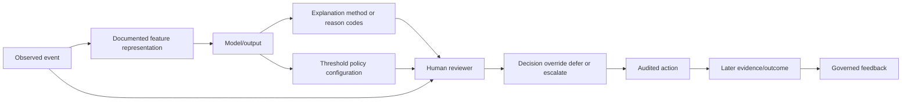
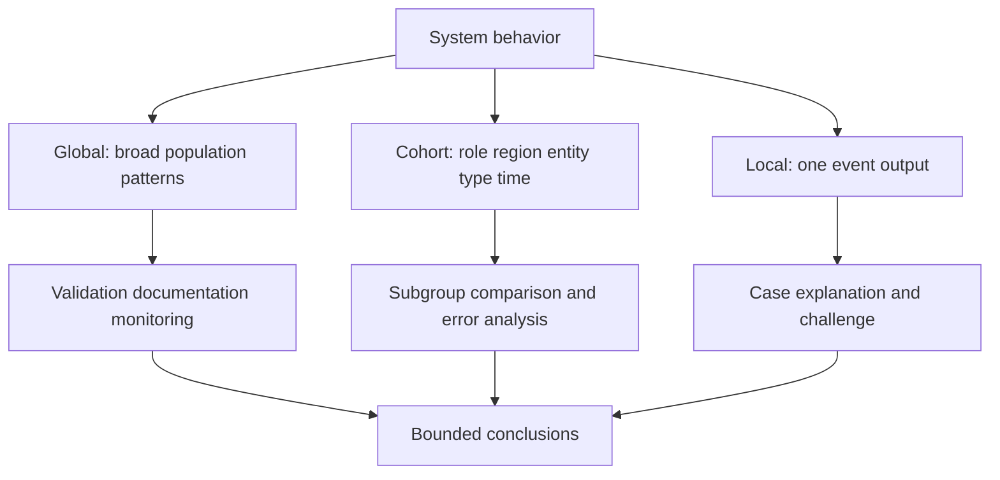
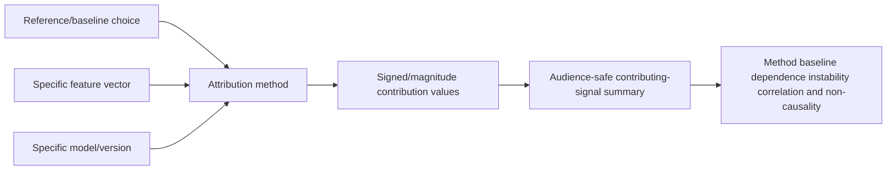
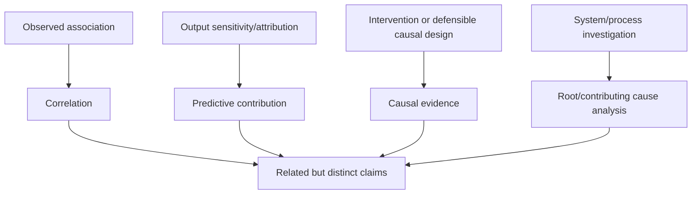
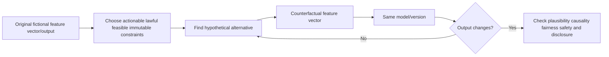
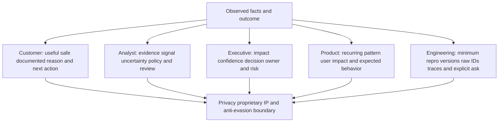
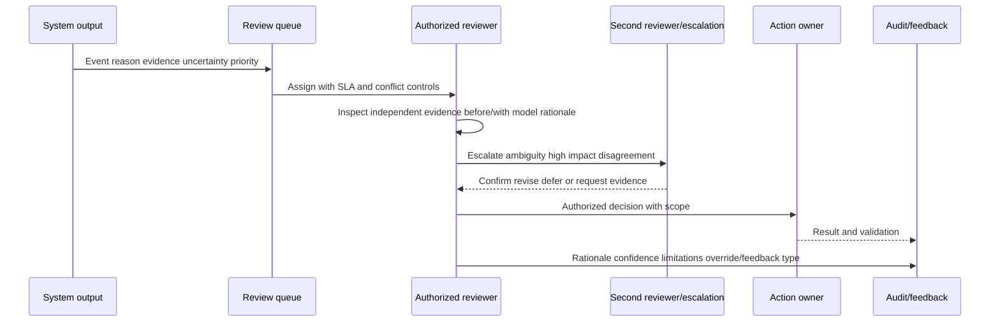
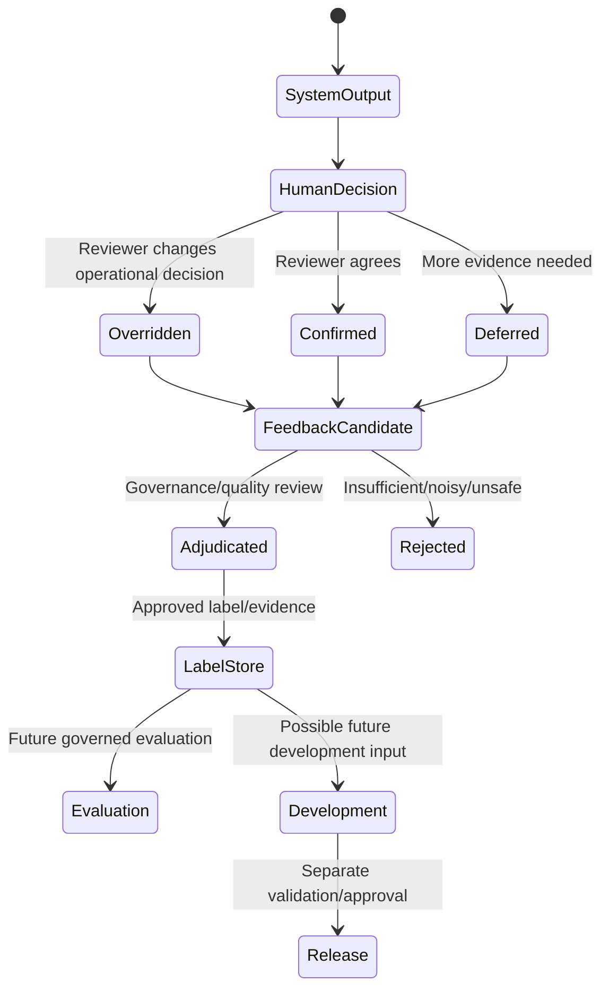
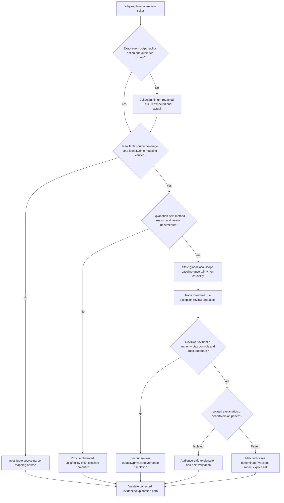

# Part 054 - Explainability and Human Review

## Section goal

This Part explains how to describe model or system behavior without turning an explanation into proof, causation, intent, certainty, or disclosure of protected internals. **Global explanation** summarizes broad model behavior across a population. **Local explanation** addresses one output. **Feature attribution** assigns output contribution under a method and baseline. **Contributing signals** are evidence factors. A **counterfactual** asks how an output might change under a hypothetical input change. Human review adds contextual judgment but also bias, inconsistency, fatigue, and audit requirements.

The support goal is to answer "Why was this classified this way?" with the right level of evidence for the customer, analyst, executive, Product, or Engineering audience. A good answer separates observed facts, documented system behavior, method-dependent contribution, policy/action, uncertainty, and next validation. It avoids exposing security-sensitive controls, personal data, model internals, or exploitable details.

The central rule is:

> An explanation describes evidence or modeled behavior under stated assumptions. It does not prove the real-world cause, the actor's intent, or the correctness of the outcome.

Abnormal's proprietary models, explanations, features, baselines, attribution methods, thresholds, training data, reviewer workflows, and feedback implementation are unknown unless approved documentation explicitly states them. All worked examples and the lab are fictional.

## Learning outcomes

After completing this Part, you should be able to:

- distinguish interpretability, explainability, transparency, documentation, auditability, and evidence;
- compare global, cohort, local, contrastive, example-based, and counterfactual explanations;
- explain feature attribution and contributing signals at a method-dependent high level;
- distinguish predictive contribution from correlation, causation, root cause, and actor intent;
- identify baseline/reference, feature dependence, instability, missingness, and out-of-distribution limits;
- build audience-safe explanations for customers, analysts, executives, Product, and Engineering;
- apply privacy, proprietary, intellectual-property, and security-sensitive disclosure boundaries;
- design human review around evidence, authority, consistency, second review, and escalation;
- recognize automation bias, anchoring, confirmation bias, selection bias, fatigue, and hindsight bias;
- separate override, correction, appeal, feedback, label, retraining, and product change;
- create an audit trail for output, explanation, policy, reviewer, action, and later outcome; and
- use your customer communication, Copilot evaluation/training, fix validation, analytics/SQL/Python, mentoring, and escalation only as transferable facts.

## JD Mapping

| Supplied role signal | Capability built | Transferable evidence | Boundary |
|---|---|---|---|
| Behavioral false-positive cases | Builds local evidence and correction/feedback record | Reproduction and fix validation | No claim of inspecting hidden Abnormal attribution |
| Threat investigations | Separates contributing signal from proof/causation | Complex evidence-based investigations | No production threat-verdict ownership |
| Customer communication | Tailors explanation to safe, useful detail | Enterprise technical/nontechnical updates | No protected internals or personal profiling |
| Product/Engineering collaboration | Sends reproducible local/global pattern and explicit ask | Escalation and validation | Engineering gets need-to-know protected detail only |
| Knowledge/training | Teaches explanation limits and review rubric | KB/training creation and mentoring | No invented product behavior |
| AI support/evaluation | Evaluates grounding, explanation, and human verification | Copilot/agent evaluation/training | GenAI explanations differ from behavioral models |
| Analytics/trends | Separates one case from cohort/system pattern | Support quality and trend analysis | Tickets are selected, not full population |
| Customer trust/security | Balances transparency with privacy and anti-evasion boundaries | Evidence ethics and expectation management | No legal/IP conclusion by L1 |

## Candidate honesty note

| Evidence tier | Safe statement | Must not be implied |
|---|---|---|
| **Production transfer** | "I have translated complex evidence, validated fixes, created training, and escalated reproducible cases for enterprise customers." | That you operated Abnormal explanation tools |
| **Local/public lab** | "I wrote customer, analyst, executive, and Engineering explanations from synthetic signals and audited reviewer decisions." | Use of real customer/model data |
| **Learned architecture** | "I understand explanation and responsible-human-review concepts from official sources." | That generic methods match Abnormal internals |
| **No direct experience** | "I have not operated Abnormal AI or reviewed its proprietary explanation implementation in production." | Knowledge of feature weights or explanation algorithms |
| **Unknown proprietary detail** | "Abnormal explanation methods, feature attribution, baselines, thresholds, models, reviewer tools, and feedback lifecycle are unknown unless approved documentation states them." | Reverse-engineering from UI reasons |

Safe interview language:

> "I can provide a bounded, audience-appropriate explanation of observed evidence, documented behavior, policy, and uncertainty, then validate with independent evidence. I will not present feature contribution as cause or expose protected model/security details."

## 1. Core vocabulary

| Term | Plain meaning | Why it matters | Not equivalent to |
|---|---|---|---|
| Interpretability | Degree a person can understand model behavior | Supports inspection and debugging | Correctness |
| Explainability | Process/artifact communicating why/how output occurred | Supports review and trust decisions | Causal proof |
| Transparency | Appropriate visibility into purpose, limits, data, process, governance | Enables informed use | Full source/model disclosure |
| Documentation | Recorded system intent, design, evaluation, limits | Stable reference | Real-time explanation |
| Auditability | Ability to reconstruct who/what/when/why | Accountability and incidents | Interpretability |
| Evidence | Observable fact with provenance | Supports conclusions | Explanation alone |
| Attribution | Method-dependent contribution assignment | Describes model sensitivity/output | Real-world cause |
| Counterfactual | Hypothetical change associated with output change | Contrast/debugging | Feasible recommendation or cause |
| Review | Authorized human assessment | Adds context/accountability | Infallible ground truth |

## 🔍 Plain-English deep-dive: A restaurant receipt explains the bill, not why you became hungry

A receipt lists items, quantities, prices, taxes, and total. It can explain how the bill was calculated. It does not explain why the customer chose the restaurant, who caused hunger, whether the meal was healthy, or whether every ingredient was sourced ethically.

A local model explanation can similarly describe which represented factors contributed to an output under a method. It does not establish why the real-world event happened, the sender's intent, or whether the label is correct. A policy explanation can show which rule routed the case without revealing model reasoning.

The receipt may also omit the kitchen's proprietary recipe. That does not make it useless: the customer needs enough information to check charges and seek correction, while the restaurant protects trade secrets. Security systems have an additional anti-evasion concern: exact boundaries or feature weights can help adversaries adapt.

The analogy stops because model attributions can be approximate and unstable, while arithmetic receipts are deterministic. The lesson remains: match the explanation to the decision question and do not stretch it into causal truth.

**Memory hook:** Explain the output path; do not invent the world's cause.

## 2. Global, cohort, and local explanations

**Global** explanations summarize behavior over a population. **Cohort** explanations focus on a subset. **Local** explanations address one example. A global trend does not automatically explain a local output; a local attribution cannot characterize the whole system.

| Explanation scope | Question | Example artifact | Limitation |
|---|---|---|---|
| Global | What generally influences model behavior? | Population feature-importance summary | Averages hide subgroups/local interactions |
| Cohort | How does behavior differ for this subset? | New-user error analysis | Cohort definition/sample uncertainty |
| Local | Why this output under method? | Top contributing signals | Approximate, baseline-dependent |
| Contrastive | Why A rather than B? | Differences between matched events | Correlation, not cause |
| Example-based | Which prior examples are similar? | Nearest synthetic cases | Similarity definition and privacy |
| Counterfactual | What hypothetical change flips output? | Minimal feature change | May be impossible/unsafe/unfair |
| Policy | Which configured path acted? | Rule/threshold/override trace | Does not expose model mechanism |

## 3. Feature attribution and contributing signals

Feature attribution assigns contribution values to inputs for an output under a chosen method/reference. Different methods can disagree. Correlated features can share or swap attribution. Features may represent aggregates or embeddings whose human meaning is limited.

| Attribution question | Required context | Common trap | Safe wording |
|---|---|---|---|
| Contributed toward what? | Class/output/version | "Risk" vague | "Toward fictional positive output" |
| Compared with what? | Baseline/reference | Baseline invisible | "Relative to defined reference" |
| Sign or magnitude? | Direction/units | Large means bad | "Increased/decreased output under method" |
| Independent features? | Correlation/interactions | Double-counting | "Correlated factors may share attribution" |
| Stable? | Perturbation/version tests | One explanation treated exact | "Approximate and locally tested" |
| Causal? | Causal design/evidence | Contribution equals cause | "Predictive contribution, not causation" |

A simple fictional linear model illustrates arithmetic:

$$
s=b+w_1x_1+w_2x_2
$$

If $b=0.2$, $w_1=0.5$, $x_1=1$, $w_2=-0.1$, and $x_2=2$:

$$
s=0.2+(0.5)(1)+(-0.1)(2)=0.5
$$

Here contributions relative to zero are `+0.5` and `-0.2`. This exact decomposition works for the fictional linear form; complex models need method-dependent approximations/references. It is not an Abnormal score.

## 4. Reasons, evidence, and explanations

| Artifact | Example | What it establishes | What it does not establish |
|---|---|---|---|
| Raw evidence | Sender domain, UTC, Message-ID | Observed field with provenance | Malicious intent |
| Derived feature | Relationship age `0 days` | Representation under definition | Relationship never existed elsewhere |
| Contributing signal | New domain increased fictional output | Model behavior under method | Domain caused attack |
| Reason code | `NEW_RELATIONSHIP` | Product/policy category if documented | Full model internals |
| Policy trace | High-impact request requires review | Why workflow routed | Model correctness |
| Analyst rationale | Identity + request + business verification | Human decision basis | Universal truth |
| Outcome evidence | Vendor confirms unauthorized request | Supports incident conclusion | Every similar message is malicious |

## 5. Correlation, contribution, causation, and root cause

| Claim | Evidence needed | Safe example |
|---|---|---|
| Observation | Direct record/provenance | Event used a new domain |
| Correlation | Population comparison | New domains were more common among reviewed positives |
| Model contribution | Valid attribution/trace | New-domain feature increased output relative to reference |
| Causation | Causal design/mechanism and assumptions | Controlled policy intervention changed queue rate |
| Incident root cause | Technical/process evidence chain | Alias mapping defect caused history split |
| Intent | Strong authorized human/legal/security evidence | Do not infer from model attribution |

## 🔍 Plain-English deep-dive: Turning a steering wheel predicts direction, but a skid can change the result

In ordinary driving, steering-wheel angle contributes to vehicle direction. Road ice, speed, tires, and braking interact. Seeing the wheel turned right does not prove why a collision occurred. A dashboard may show a steering input without explaining the road conditions.

Feature contribution is similar. A new-relationship representation may push a model output upward. Other features and interactions also matter. Correlated features can split credit differently. The contribution describes the model's mapping, not the attacker's motive or the incident's root cause.

A support explanation should therefore layer evidence: observed domain and relationship history; documented contribution or reason; policy routing; independent identity/message/business validation; remaining uncertainty. Avoid "the model detected fraud because the domain was new" unless the product documentation and outcome evidence justify every part.

The driving analogy stops because machine-learning attribution may be approximate rather than physically causal. Its lesson is the distinction among signal, contribution, outcome, and cause.

**Memory hook:** Attribution explains output sensitivity; investigation establishes real-world cause.

## 6. Counterfactual explanations

A counterfactual asks: under a model and constraints, what hypothetical input change would produce a different output? For a fictional model, "If relationship age were 30 rather than 0, the output would cross below the review threshold" is counterfactual, not advice to manipulate history.

| Counterfactual property | Question | Failure |
|---|---|---|
| Validity | Does output change under same model/version? | Recomputed with different policy/model |
| Proximity | Is change small under a meaningful distance? | Mixed units make "small" meaningless |
| Sparsity | Are few features changed? | Many unrealistic changes |
| Feasibility | Could the change occur legitimately? | Age/identity changed impossibly |
| Actionability | Is the person allowed/able to change it? | Blames user for immutable context |
| Causality | Does hypothetical obey dependencies? | Changes child without parent |
| Safety | Could disclosure enable evasion? | Reveals exact bypass boundary |
| Fairness | Does suggestion impose unequal burden? | Protected/proxy attribute targeted |

Counterfactuals can debug sensitivity or support recourse in some domains. In security, exact adversarial guidance can enable evasion, so disclosure must be limited and authorized. This guide provides no bypass recipes.

## 7. Explanation stability and fidelity

**Fidelity** asks how well an explanation represents the model behavior it claims to explain. **Stability** asks whether small, irrelevant changes produce similar explanations. A simple explanation can be understandable but low-fidelity; a high-fidelity representation can be incomprehensible.

| Quality | Question | Test concept | Caveat |
|---|---|---|---|
| Fidelity | Does explanation reflect the model locally/globally? | Compare surrogate/reason to model behavior | Access/method limits |
| Stability | Do small benign changes preserve explanation? | Synthetic perturbations | Genuine boundary sensitivity exists |
| Consistency | Same method/version yields reproducible result? | Repeat with fixed inputs | Nondeterminism/versioning |
| Comprehensibility | Can audience use it correctly? | User study/review rubric | Simplicity can mislead |
| Completeness | Does it cover enough relevant path? | Explain model + policy + action | Full internals may be unsafe |
| Contestability | Can person challenge/correct? | Appeal/override process | Not every action customer-controllable |

## 8. Audience-safe explanation ladder

| Audience | Needs | Avoid | Example emphasis |
|---|---|---|---|
| Customer admin | What happened, documented reason, action, validation | Hidden weights/raw sensitive content | Observable signals and policy path |
| SOC analyst | Evidence, uncertainty, related events, review controls | Unsupported intent | Corroboration and alternatives |
| End user | Safe action and correction path | Profiling details/blame | Neutral event/account language |
| Executive | Impact, risk, decision, owner, next checkpoint | Feature dump | Business consequence and confidence limits |
| Product | Pattern, personas, impact, recurrence, desired outcome | One anecdote as prevalence | Trend with denominator |
| Engineering | Repro, raw IDs, versions, expected/actual, traces | Unnecessary PII/content | Minimum technical evidence |
| Privacy/legal | Purpose, categories, population, access, retention | L1 legal conclusion | Facts and decision request |

### Customer-safe template

> "For event `[ID/time]`, the observable evidence includes `[minimum facts]`. Approved documentation identifies `[reason/policy]` as contributing to `[output/routing]`. This is a contextual explanation, not proof of intent or causation. `[Independent evidence]` supports/does not yet support the outcome. We are validating `[next test]`; proprietary model details and unnecessary personal content are not included."

## 9. Proprietary, privacy, and security boundaries

| Boundary | Why | Safe alternative |
|---|---|---|
| Exact feature weights/thresholds | IP and evasion risk | Approved reason categories and behavior |
| Full training data/details | Privacy, contracts, security, IP | Approved provenance/governance summary |
| Other customers' examples | Confidentiality/isolation | Synthetic or aggregate approved examples |
| Employee full communications | Privacy/minimization | Exact minimum event metadata/content excerpt if authorized |
| Detection gaps/bypass sequence | Adversarial enablement | Defensive remediation and responsible disclosure |
| Reviewer identity/opinion beyond need | Privacy/safety | Role, decision, audit ID |
| Internal logs/secrets | Security | Redacted correlation IDs and relevant statuses |

Transparency is not unlimited disclosure. A customer can receive meaningful reasons, evidence, correction paths, and limitations while the vendor protects sensitive implementation and other customers.

## 🔍 Plain-English deep-dive: A bank can explain a charge without publishing the vault blueprint

A bank statement can show date, merchant, amount, and dispute path. The bank need not publish alarm placement or vault combinations. Useful accountability and security coexist when disclosure is purpose-specific.

Security-product explanations follow the same principle. Customers need enough to understand an event, validate expected behavior, correct errors, and take safe action. Exact feature weights, thresholds, internal detection gaps, or other customers' data can expose IP, privacy, and anti-evasion risks.

"Proprietary" must not become an excuse for empty answers. Provide observable facts, approved reason categories, policy/audit path, limitations, and escalation/appeal. Document why a deeper detail cannot be shared and route the question to the authorized owner.

The bank analogy stops because AI explanations can be approximate and customer contracts vary. Its lesson is balanced transparency: disclose what enables accountable use, withhold what creates unjustified privacy/security risk.

**Memory hook:** Explain the transaction; protect the vault blueprint.

## 10. Human review design

Human review is a socio-technical control. The reviewer needs authority, evidence, time, competence, conflict handling, escalation, and feedback rules. Simply putting a person in the loop does not guarantee safety.

| Review element | Requirement | Failure mode |
|---|---|---|
| Queue | Priority, SLA, capacity, dedup | Backlog or first-come risk |
| Evidence | Original/derived/provenance/coverage | Reason code only |
| Independence | Option to inspect facts before anchor | Automation bias |
| Authority | Reviewer can defer/override/escalate | Rubber stamp |
| Expertise | Domain and product knowledge | Misinterpretation |
| Consistency | Rubric/calibration/second review | Reviewer lottery |
| Conflict | Disagreement and tie-break process | Silent inconsistency |
| Audit | Who/what/when/why/evidence/version | No accountability |
| Feedback | Typed correction, not automatic retrain | Poison/noisy labels |
| Appeal | Customer/user challenge and correction | Uncontestable harm |

## 11. Reviewer bias and error

| Bias/risk | Plain meaning | Example | Mitigation concept |
|---|---|---|---|
| Automation bias | Overtrust system output | Reviewer accepts high score without evidence | Independent facts and challenge prompts |
| Anchoring | First information dominates | Reason code frames all later evidence | Blind-first sample/alternate hypotheses |
| Confirmation bias | Seek supporting evidence only | Ignore legitimate change | Required disconfirming test |
| Hindsight bias | Outcome makes past seem obvious | Judge earlier decision with later facts | Event-time reconstruction |
| Selection bias | Only alerts reviewed | Misses unknown | Sample negatives/outcomes |
| Fatigue | Quality falls with queue pressure | Rubber-stamping | Capacity, breaks, prioritization |
| Availability bias | Recent incident overweights similar pattern | Overflag common benign event | Base rates and rubric |
| Group/proxy bias | Assumptions vary by cohort | New staff treated as risky | Fairness review and neutral evidence |

## 🔍 Plain-English deep-dive: A human reviewer is a co-pilot with instruments, not a ceremonial passenger

Putting a person beside an automated system does not create oversight if the person cannot see evidence, lacks time, cannot change the outcome, or is punished for disagreement. That person is a ceremonial passenger. Meaningful review resembles a co-pilot who can read instruments independently, challenge the plan, take control, and record why.

The system explanation is one instrument, not the windshield. Reviewers also need source evidence, data-quality status, policy context, alternative hypotheses, and the authority to defer or escalate. High-impact or ambiguous decisions may need a second reviewer. Queue pressure and repetitive agreement can turn review into rubber-stamping.

A good workflow sometimes presents raw facts before the model conclusion, then reveals the explanation so the reviewer can compare. It samples decision-negative cases to find misses and measures reviewer disagreement. It does not automatically feed every click back as truth.

The aviation analogy stops because digital review can happen at enormous scale and reviewers may not control the underlying model. Its lesson remains: human oversight is a designed capability with evidence, authority, competence, capacity, and audit, not a checkbox.

**Memory hook:** A reviewer must be able to see, challenge, act, and explain.

## 11A. Measuring human-review quality without declaring reviewers infallible

Review quality has several dimensions: agreement, accuracy against later evidence, consistency across cohorts, decision latency, override usefulness, escalation quality, and the effect of model anchoring. No single measure proves good judgment.

| Review measure | Numerator/denominator concept | What it can reveal | Main caveat |
|---|---|---|---|
| Raw agreement | Matching reviewer decisions / double-reviewed items | Consistency | Agreement can be jointly wrong |
| Positive agreement | Both positive relative to positive decisions | Rare-class consistency | Definition varies; report formula |
| Negative agreement | Both negative relative to negative decisions | Benign-class consistency | Majority class can dominate |
| Cohen's kappa | Agreement beyond chance under marginals | Chance-adjusted consistency | Sensitive to prevalence/marginals |
| Override rate | Overrides / reviewed outputs | Friction or valuable challenge | High/low is not inherently good |
| Escalation rate | Escalations / reviews | Ambiguity and boundary use | Culture/capacity affects it |
| Later-outcome agreement | Review decisions matching adjudicated later outcomes | Quality under label process | Labels delayed/noisy/intervened |
| Median review time | Middle handling duration | Capacity/complexity | Speed can reduce quality |
| Appeal reversal | Reversed appeals / completed appeals | Contestability/error | Reporting/access selection bias |

### Hand-worked raw agreement

Suppose two reviewers independently assess 100 synthetic events:

| Reviewer A \ Reviewer B | Positive | Negative | Total |
|---|---:|---:|---:|
| Positive | 20 | 10 | 30 |
| Negative | 5 | 65 | 70 |
| Total | 25 | 75 | 100 |

They agree on `20 + 65 = 85` events:

$$
P_o=\frac{85}{100}=0.85=85\%
$$

Raw agreement is high, but the matrix exposes asymmetric disagreement: A positive/B negative occurs 10 times; A negative/B positive occurs 5 times. Investigate evidence, rubric, cohort, and anchoring rather than hiding both in `85%`.

### Cohen's kappa as a teaching calculation

Expected chance agreement from the reviewers' marginal positive/negative rates is:

$$
P_e=\left(\frac{30}{100}\cdot\frac{25}{100}\right)+\left(\frac{70}{100}\cdot\frac{75}{100}\right)
$$

$$
P_e=0.075+0.525=0.60
$$

Cohen's kappa is:

$$
\kappa=\frac{P_o-P_e}{1-P_e}=\frac{0.85-0.60}{1-0.60}=\frac{0.25}{0.40}=0.625
$$

Kappa `0.625` is a descriptive statistic under this synthetic setup. Do not apply a universal "good" label without domain context, sample uncertainty, prevalence, decision cost, and rubric. Reviewers can agree for the wrong reason, and prevalence can create a kappa paradox.

### Blind-first versus model-visible review

To estimate automation bias, a governed evaluation can compare independent review conditions. Group X sees source evidence before system output; Group Y sees output first. Randomization, comparable cases, reviewer expertise, and ethics/governance matter. Measure agreement with later adjudication, review time, escalation, and confidence. Do not secretly experiment on production decisions or people.

| Condition | Benefit | Risk | Ethical/operational guardrail |
|---|---|---|---|
| Evidence-first | Reduces initial model anchoring | Slower; misses useful model context | Reveal explanation after initial assessment |
| Model-first | Fast and realistic for many tools | Automation/confirmation bias | Required independent evidence checklist |
| Blinded double review | Measures reviewer consistency | Expensive | Sample high-impact/uncertain cases |
| Adjudicated panel | Resolves disagreement and improves rubric | Groupthink/slow | Diverse expertise and decision log |
| Negative sampling | Finds missed positives/review blind spots | Labels are costly | Risk-based random sample |

### Reviewer calibration

If reviewers assign a probability-like confidence, calibration can be assessed only if the scale is defined and outcomes are independently adjudicated. A reviewer saying `90%` should not be treated as evidence unless their comparable `90%` judgments are positive near 90% over time. Many organizations use ordinal categories instead; define them explicitly.

### Queue capacity and fatigue

If 480 cases arrive per 8-hour day and one reviewer completes 6 cases/hour, one reviewer handles 48/day. Ignoring breaks, meetings, escalation, and variability, minimum arithmetic staffing is:

$$
\frac{480}{48}=10\text{ reviewer-days/day}
$$

Real capacity needs occupancy limits, severity mix, second review, quality sampling, training, and absence. If arrival exceeds service rate, backlog grows. Review design must monitor quality versus queue age, shift, and repetition; otherwise a "human control" degrades exactly during incidents.

### Feedback-quality gates

Before an override becomes a label candidate, record:

- whether the reviewer saw the system output first;
- evidence sources and coverage;
- rubric/version and decision category;
- reviewer role and potential conflict;
- independent verification or second review;
- event-time versus hindsight evidence;
- action/intervention that may change outcome;
- uncertainty and dissent; and
- privacy/retention eligibility.

Feedback that fails gates can still inform support/product investigation but should not be silently treated as training truth.

## 12. Override, feedback, label, and retraining are different

| Event | Meaning | Does not automatically mean |
|---|---|---|
| Override | Operational decision changed | Model is globally wrong |
| Correction | Fact/label/output fixed | Immediate retraining |
| Customer feedback | Reported experience/evidence | Ground truth |
| Adjudicated label | Reviewed outcome under rubric | Timeless certainty |
| Evaluation update | Metrics recomputed | Production model changed |
| Retraining | New model fit | Safe deployment |
| Release | Approved version deployed | Every past issue fixed |
| Policy change | Decision logic changed | Model changed |

## 13. Audit record

| Audit field | Example |
|---|---|
| Event/entity | Pseudonymous IDs and UTC |
| Source coverage | Available/missing evidence and retention |
| Model/output | Field, value/category, model version |
| Explanation | Method/reason version, baseline/reference, top signals |
| Policy | Threshold/rule/config/exception version |
| Reviewer | Role, assignment, decision time |
| Evidence reviewed | IDs/sources, not unnecessary content |
| Alternatives | Legitimate/risky/data-quality hypotheses |
| Decision | Confirm/override/defer/escalate with rationale |
| Action/result | Scope, owner, job, per-target validation |
| Feedback type | Observation/correction/label candidate/product issue |
| Later outcome | Source, time, uncertainty, intervention |
| Appeal/change | Request, owner, final resolution |

## 14. Worked example 1: Customer-safe local explanation

### Inputs

A fictional message from `newvendor054.invalid` requests payment change. Observable facts: first eligible domain edge in 90-day complete history, reply-to mismatch, verified normal work hour, and no confirmed account compromise. A fictional reason code says `RELATIONSHIP_CHANGE`.

### Weak explanation

"AI knew it was fraud because the sender was new."

### Better explanation

"The reviewed event used a newly observed domain for this resolved vendor relationship and a different reply path while requesting a sensitive payment-process change. The documented relationship-change reason contributed to review routing. Newness alone is not proof of fraud; finance should verify through an established channel while security validates domain, identity, and thread evidence. Exact model weights/thresholds are not inferred."

## 15. Worked example 2: Attribution disagreement

Two explanation methods rank `new_domain` and `payment_change` differently because features interact and the baseline differs. The support conclusion is not that one method lies. Record method/version/reference, test stability, use raw evidence, and escalate if approved explanation behavior conflicts with documentation.

## 16. Worked example 3: Counterfactual safety

A fictional counterfactual says changing `relationship_age_days` from `0` to `30` changes output. That is not actionable: users cannot ethically fabricate history, and disclosure could encourage evasion. Customer guidance should focus on independent vendor verification and approved onboarding, not score manipulation.

## 17. Worked example 4: Override and feedback

An analyst overrides a false positive after known-channel vendor verification. Record evidence, policy/output versions, rationale, business impact, and correction. Submit typed feedback for adjudication. Do not promise immediate retraining or a global allow. Validate the exact item restoration and monitor future comparable items.

## 18. Troubleshooting table

| Symptom | Plausible cause | Cheapest check |
|---|---|---|
| Reason differs for identical-looking events | Hidden context/version/policy/method | Exact IDs, feature/reason versions, audit path |
| Explanation contradicts raw fact | Parser/mapping/stale UI/explanation defect | Raw source and event-time feature |
| Top signal changed after update | Model/explainer/reference version | Versioned matched comparison |
| Customer asks for exact weight | Protected/undocumented detail | Approved disclosure policy and useful alternative |
| Reviewers disagree | Ambiguity/rubric/bias/evidence gap | Independent second review and rubric |
| Overrides rise | Drift/policy/labels/training/reviewer change | Counts with denominator by cohort/version |
| Feedback has no visible effect | Lifecycle not immediate or rejected | Feedback status and product process docs |
| Explanation enables bypass concern | Over-disclosure | Security owner/responsible disclosure route |

## Troubleshooting decision tree

## 19. Common failure modes

| Failure | Why it fails | Better behavior |
|---|---|---|
| Explanation equals proof | Method describes model/evidence | Corroborate outcome |
| Attribution equals cause | Predictive contribution is noncausal | Use causal restraint |
| Local explains global | One event cannot characterize population | Separate scopes |
| Global explains every local | Averages hide interactions | Local evidence/reason |
| Top feature alone decides | Features interact/policy follows | Show bounded combination |
| Counterfactual is advice | May be infeasible/unsafe/unfair | Check constraints and security |
| More detail always transparent | Privacy/IP/evasion harm | Audience/need-to-know ladder |
| Proprietary means no answer | Customer needs accountability | Facts, approved reasons, path, appeal |
| Human loop guarantees safety | Bias/fatigue/capacity exist | Review design and audit |
| Override equals model defect | Label/policy/context can differ | Type and aggregate feedback |
| Feedback equals retraining | Governance/release steps intervene | Explain lifecycle |
| Reviewer label is ground truth | Disagreement/uncertainty remain | Adjudication and quality sampling |
| Explanation stable forever | Version/reference/data change | Version and monitor |
| Exact threshold disclosed casually | Evasion/IP risk | Approved high-level behavior |
| Generic methods equal Abnormal | Proprietary implementation unknown | Label generic and attributed facts |

## 20. Escalation packet

| Field | Required content |
|---|---|
| Question/audience | What explanation is needed and why |
| Event | Pseudonymous IDs, UTC, expected/actual impact |
| Raw evidence | Minimum facts, provenance, coverage |
| Output | Field/class/value, model version, semantics |
| Explanation | Local/global/cohort/method/reason/reference/version |
| Limitations | Correlation, non-causality, stability, missingness, OOD |
| Policy/action | Threshold/rule/exception/reviewer/action audit |
| Review | Evidence, rationale, disagreement, second review |
| Feedback | Observation/correction/label/product issue and status |
| Pattern | Matched cases, denominator, cohort/time/version |
| Disclosure | Customer-safe versus protected details rationale |
| Privacy | Purpose, minimization, access, retention/deletion |
| Unknowns | Proprietary methods/features/thresholds not guessed |
| Ask | Confirm explanation semantics, defect, review, disclosure, or next evidence |

## Safe synthetic lab: The Explanation Review Chamber 054

### Objective

Create global, cohort, local, contrastive, example-based, and counterfactual explanation artifacts from fictional signals; write audience-specific explanations; conduct two-reviewer adjudication; record override, feedback, and audit while protecting privacy and anti-evasion boundaries. The unique lab is **The Explanation Review Chamber 054**.

This lab is paper/local only. It calls no model/API, uploads no data, accesses no account, runs no live prompt or attack, and makes no production or Abnormal implementation claim.

### Prerequisites

- Local Markdown editor, paper, or local spreadsheet only.
- This Part and fictional fixtures below.
- No model, API, hosted notebook, cloud sheet, tenant, account, mail system, or Abnormal access.
- Artifact label: **local/public lab - fictional explanation and review records only**.
- Record UTC start, purpose, reviewer roles, disclosure boundary, and zero-real-data statement.

### Privacy and authorization boundary

Authorized:

- copy fictional IDs and `.invalid` domains locally;
- perform hand arithmetic for the fictional linear explanation;
- write audience-safe explanation and review records; and
- cite verified official/public sources.

Prohibited:

- real messages, people, customers, tenants, cases, scores, explanations, model fields, reviewer data, or vendor internals;
- model/API/cloud calls or uploads;
- account/product access, live prompt injection, detection probing, evasion tests, or threshold extraction;
- operational bypass guidance or Abnormal implementation claims.

### Synthetic fixtures

| Event | Observed facts | Fictional reason | Policy/action | Later evidence |
|---|---|---|---|---|
| EVT-054-01 | New vendor domain; payment change; reply mismatch | Relationship change | Review | Vendor denies request |
| EVT-054-02 | New vendor domain; approved migration; invoice | Relationship change | Review | Procurement confirms |
| EVT-054-03 | Known domain; new OAuth grant; broad scope | Permission change | Escalate | App owner denies |
| EVT-054-04 | Known newsletter; recipient burst | Volume change | Review | Campaign approved |

Fictional linear output: $s=0.2+0.5x_1-0.1x_2$, with no vendor equivalence. Reviewer A sees reason code before evidence; Reviewer B inspects facts first.

### Lab steps

1. Create `The Explanation Review Chamber 054`; record UTC, label, purpose, and zero-real-data statement.
2. Define interpretability, explainability, transparency, documentation, auditability, evidence, attribution, counterfactual, and review.
3. Draw event -> feature -> model -> explanation/policy -> review -> action -> outcome -> feedback.
4. Hand-calculate the fictional linear score and contributions; state why this is not causation or Abnormal behavior.
5. Create global, cohort, local, contrastive, example-based, counterfactual, and policy explanations for fixtures.
6. For every explanation, record scope, audience, method/reason, baseline/reference, version, evidence, uncertainty, and proof limit.
7. Compare EVT-054-01 and EVT-054-02. Explain why the same reason can accompany different legitimate/risky outcomes.
8. Create two attribution rankings with different baselines; document disagreement and stability questions.
9. Write three counterfactuals, then reject any infeasible, unfair, privacy-invasive, or evasion-enabling recommendation.
10. Produce customer, SOC analyst, executive, Product, Engineering, and privacy/legal summaries from the same facts.
11. Build a disclosure matrix for customer-safe, internal need-to-know, restricted security, and prohibited detail.
12. Conduct Reviewer A/B paper reviews. Record anchoring/automation-bias risk and independent evidence.
13. Adjudicate disagreement with a rubric and second-review decision.
14. Record confirm/override/defer/escalate, action, validation, and later outcome for each event.
15. Convert each outcome into typed feedback: observation, correction, label candidate, product issue, or documentation issue.
16. Explain why feedback does not imply immediate retraining or global allow.
17. Build a complete audit record and appeal/correction path.
18. Write a responsible-disclosure escalation for an explanation that appears to expose bypass detail, without including the detail.
19. Deliver a 90-second spoken answer tying communication, Copilot evaluation/training, validation, analytics, mentoring, and escalation only as transfer evidence.
20. Complete source, privacy, cleanup, rubric, and zero-activity checks.

### Expected evidence

- Complete explanation/review lifecycle diagram and glossary.
- Hand-calculated fictional local contribution.
- Seven explanation-scope artifacts with limitations.
- Matched legitimate/risky reason-code comparison.
- Attribution-baseline disagreement and stability record.
- Counterfactual feasibility/fairness/security screen.
- Six audience-specific explanations.
- Disclosure boundary matrix.
- Two-reviewer bias/adjudication record.
- Override/feedback/retraining distinction and audit trail.
- Appeal/correction and responsible-disclosure templates.
- Spoken honesty statement and source ledger dated August 24, 2026.
- Cleanup and zero-live-activity attestation.

### Cleanup and privacy

- Confirm every ID contains `054` and every domain ends `.invalid`.
- Remove accidental real customer, user, message, tenant, event, explanation, score, model, policy, reviewer, outcome, or product detail.
- Confirm nothing was uploaded to a model, API, cloud sheet, portal, or hosted notebook.
- Confirm no account, tenant, product, prompt, detection, threshold, reviewer system, or security control was accessed, attacked, probed, or tested.
- Delete the artifact if real/confidential data cannot be reliably removed.
- Retain only the local fictional artifact if useful.
- Record cleanup UTC and: `Synthetic explanation/review exercise only; zero live data, model, API, account, upload, prompt attack, detection probing, or production activity.`

### Validation rubric

| Dimension | Fail | Developing | Pass |
|---|---|---|---|
| Scope | One explanation fits all | Names local/global | Separates global, cohort, local, contrastive, example, counterfactual, policy |
| Attribution | Calls contribution cause | Adds caveat | Records method/reference/version/correlation/stability/non-causality |
| Evidence | Repeats reason code | Adds raw fact | Layers provenance, feature, explanation, policy, review, outcome, uncertainty |
| Counterfactual | Provides bypass/action blindly | Checks feasibility | Checks validity, proximity, feasibility, causality, fairness, privacy, security |
| Audience | Sends feature dump | Simplifies customer text | Produces safe customer/analyst/executive/Product/Engineering/privacy versions |
| Disclosure | Shares internals or says proprietary only | Redacts | Balances accountability, IP, privacy, other-customer, and anti-evasion limits |
| Human review | Human equals truth | Adds second reviewer | Capacity, independence, rubric, bias, authority, disagreement, audit, appeal |
| Feedback | Override retrains model | Labels feedback | Separates override, correction, adjudication, evaluation, training, release, policy |
| Safety | Uses live/model data | Uses synthetic upload | Local fictional work and zero-activity attestation |
| Honesty | Claims Abnormal explanations | Says generic | Explicit transfer/lab/learned architecture and proprietary unknowns |

## 21. Official Source Anchors

All sources were accessed on **August 24, 2026** and must be revalidated before interview or production use. They anchor explainability, transparency, human oversight, bias, privacy, and accountable review concepts. They do not reveal Abnormal's proprietary explanation methods, features, baselines, thresholds, models, reviewer tools, data, or feedback implementation.

| Official or primary source | What it anchors | Boundary |
|---|---|---|
| [NIST AI Risk Management Framework 1.0](https://www.nist.gov/itl/ai-risk-management-framework) | Explainability/interpretability, transparency, accountability, validity/reliability, human oversight | Voluntary framework, not explainer specification |
| [NIST AI RMF Playbook](https://airc.nist.gov/AI_RMF_Knowledge_Base/Playbook) | Suggested explanation, documentation, TEVV, participation, contestability, and oversight actions | Not a universal checklist |
| [NIST SP 1270 - Identifying and Managing Bias in AI](https://www.nist.gov/publications/towards-standard-identifying-and-managing-bias-artificial-intelligence) | Systemic, computational/statistical, and human-cognitive bias | General guidance, not legal advice |
| [NIST Privacy Framework](https://www.nist.gov/privacy-framework) | Purpose, governance, control, communication, and protection of privacy risk | Framework, not legal conclusion |
| [Microsoft Learn - Model interpretability](https://learn.microsoft.com/en-us/azure/machine-learning/how-to-machine-learning-interpretability?view=azureml-api-2) | Official examples of global/local feature importance and responsible interpretation tooling | Azure tooling, not Abnormal method |
| [Microsoft Learn - Counterfactual analysis](https://learn.microsoft.com/en-us/azure/machine-learning/concept-counterfactual-analysis?view=azureml-api-2) | Official counterfactual/what-if concepts and limitations | Azure tooling, not recourse/security guidance |
| [Abnormal AI official site](https://abnormal.ai/) | Current attributable public reasons/explanation positioning only if explicitly present | Do not infer hidden weights, methods, thresholds, or internals |

### Source-use discipline

- Attribute public product claims exactly and preserve context/footnotes.
- Separate model contribution, policy reason, human rationale, and outcome evidence.
- Do not copy long source text.
- Do not expose sensitive internals or customer data.
- Route privacy, IP, legal, contractual, anti-evasion, or protected architecture questions to authorized owners.

## Likely Interview Questions

### Q1. What is the difference between global and local explainability?

**Model answer:** Global explanations summarize broad behavior across a population; cohort explanations focus on a subset; local explanations address one output. Global averages may not explain a local interaction, and one local attribution cannot characterize the whole model. I state scope, method, reference, version, and limitations.

### Q2. Does feature attribution explain why an attack happened?

**Model answer:** No. Attribution describes how represented features contributed to a model output under a method and baseline. Correlated features, interactions, and method choice affect values. Real-world cause and intent require independent incident/business evidence and causal reasoning.

### Q3. What is a counterfactual explanation?

**Model answer:** It is a hypothetical feature change associated with a different output under the same model. I check validity, proximity, feasibility, actionability, causal dependencies, fairness, privacy, and anti-evasion risk. It is not automatically advice, recourse, or proof of cause.

### Q4. How do you explain a verdict safely to a customer?

**Model answer:** I layer minimum observed facts, approved documented reason/policy, output/action, independent validation, uncertainty, and next step. I say the explanation is contextual rather than causal proof and avoid hidden weights, thresholds, other-customer data, unnecessary content, or evasion-enabling details.

### Q5. Why is a human in the loop not automatically safe?

**Model answer:** Reviewers face automation bias, anchoring, confirmation/hindsight bias, fatigue, inconsistent rubrics, evidence gaps, and capacity pressure. Safe review needs authority, independent evidence, SLAs, second review, disagreement handling, audit, appeal, and quality monitoring.

### Q6. What is the difference between override and feedback?

**Model answer:** Override changes an operational decision. Feedback records an observation or correction candidate. Adjudication may create a label; evaluation may use it; retraining and release are separate governed steps. An override does not imply immediate model change or a global allow.

### Q7. What belongs in an explanation audit trail?

**Model answer:** Event/source coverage, model/output and version, explanation method/reason/reference, policy/configuration, reviewer evidence/rationale, alternatives, decision/action/result, typed feedback, later outcome, and appeal/correction, with privacy-minimized IDs and timestamps.

### Q8. What are your Abnormal explainability boundaries?

**Model answer:** I have transferable communication, evaluation, validation, analytics, training, and escalation skills plus a synthetic lab. I have not operated Abnormal AI. Its proprietary models, explanations, feature attribution, baselines, thresholds, reviewer tools, and feedback lifecycle remain unknown unless approved documentation states them.

## 30-Second Memory Hooks

- **Explainability describes system behavior; evidence validates the event.**
- **Global is population; cohort is subset; local is one output.**
- **Attribution is contribution under a method, not causation.**
- **A reason code is not the whole model or incident.**
- **Counterfactual is hypothetical, not automatically feasible or safe.**
- **Explain the transaction; protect the vault blueprint.**
- **Human review needs capacity, independence, rubric, audit, and appeal.**
- **Automation bias can turn review into a rubber stamp.**
- **Override is not label; label is not retraining; retraining is not release.**
- **Use event-time evidence, not hindsight.**
- **Tailor detail to audience and need-to-know.**
- **Abnormal's exact explanation implementation remains unknown.**

## Completion Checklist

- [ ] I can state the Section goal and explanation central rule.
- [ ] I can distinguish interpretability, explainability, transparency, documentation, auditability, evidence, attribution, counterfactual, and review.
- [ ] I can compare global, cohort, local, contrastive, example-based, counterfactual, and policy explanations.
- [ ] I can explain attribution method/reference/version/correlation/interaction/stability limits.
- [ ] I can separate observation, correlation, model contribution, causation, root cause, and intent.
- [ ] I can screen counterfactuals for feasibility, causality, fairness, privacy, and anti-evasion risk.
- [ ] I can write customer, analyst, executive, Product, Engineering, and privacy explanations.
- [ ] I can balance transparency with proprietary, privacy, other-customer, and security boundaries.
- [ ] I can identify reviewer bias and design independent/second review, capacity, audit, and appeal.
- [ ] I can separate override, correction, feedback, adjudicated label, evaluation, retraining, release, and policy change.
- [ ] I can build a complete explanation/review audit trail and escalation packet.
- [ ] I completed or can explain **The Explanation Review Chamber 054**, including Prerequisites, Expected evidence, Cleanup and privacy, and Validation rubric.
- [ ] I used no customer data, model/API upload, account, live prompt, detection probing, product, or production system.
- [ ] I can state the Candidate honesty note and proprietary Abnormal boundary.
- [ ] I checked Official Source Anchors and recorded **August 24, 2026**.
- [ ] I can answer exactly Q1-Q8 aloud.

[Next: Part 055 - Model Drift Monitoring and Feedback Loops](Part-055-model-drift-monitoring-and-feedback-loops.md)