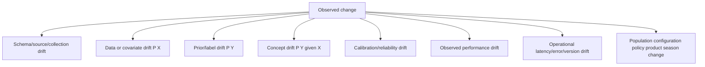
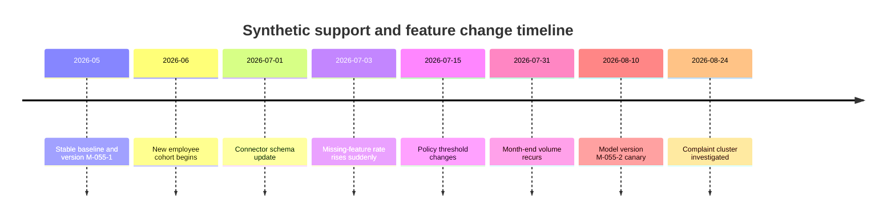
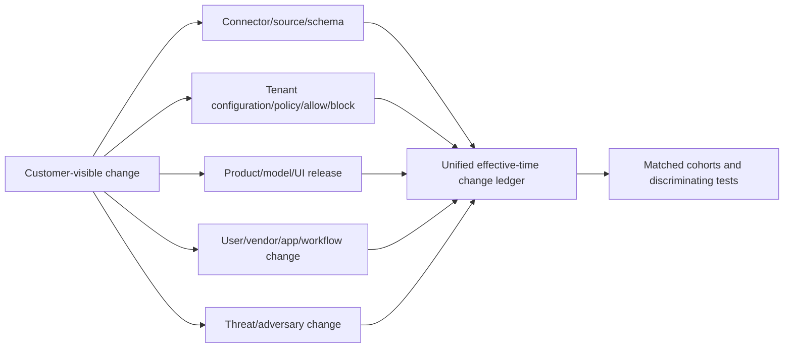
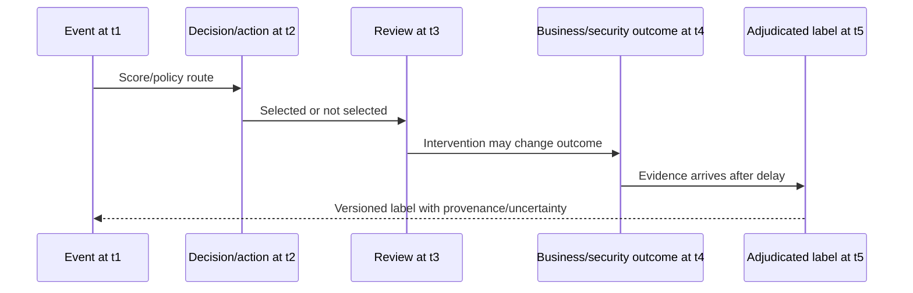
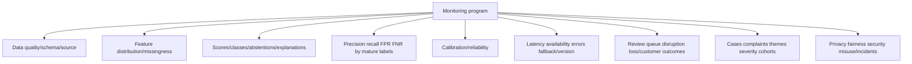
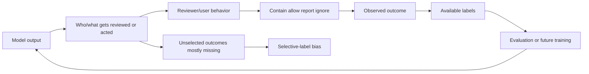
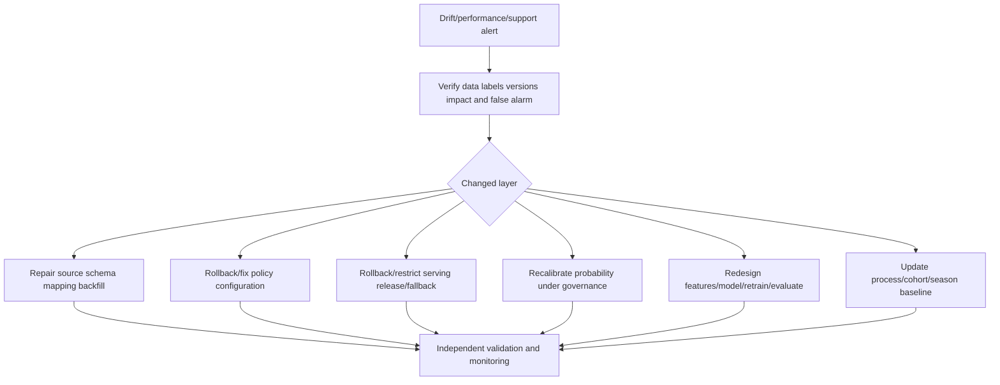
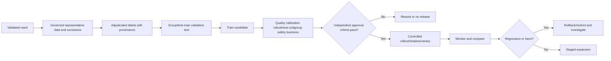
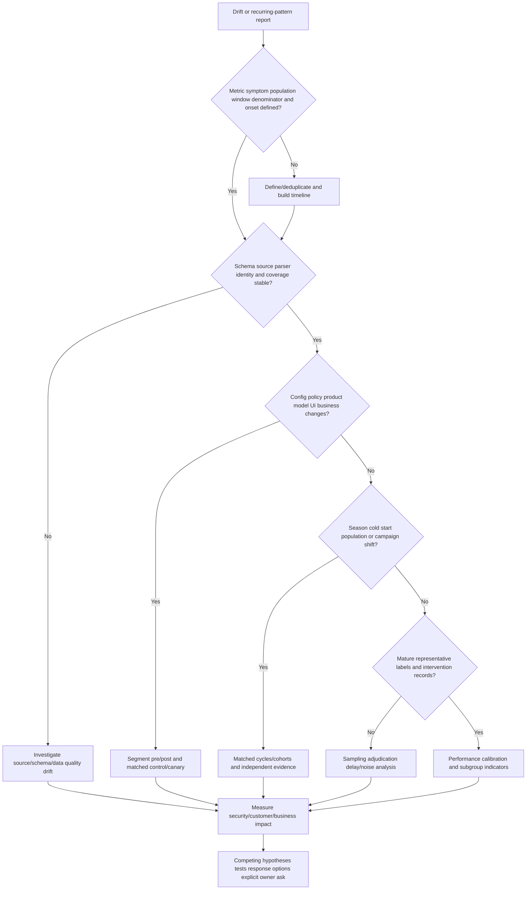

# Part 055 - Model Drift Monitoring and Feedback Loops

## Section goal

This Part explains how data, behavior, labels, systems, and customer workflows change after an AI-enabled capability is designed or deployed. **Drift** is a family of changes, not one diagnosis. Input/covariate drift changes the distribution of features. Concept drift changes the relationship between inputs and the target. Label drift changes outcome frequency. Schema/source drift changes data contracts or collection. Calibration drift changes probability reliability. Product, policy, configuration, population, seasonality, and cold start can create similar symptoms.

The support goal is to convert "the model drifted" into falsifiable alternatives and monitored evidence. A rising false-positive complaint rate may come from a connector gap, new user cohort, holiday cycle, label policy, threshold/configuration change, model release, customer migration, or true behavior/adversary change. Retraining is one possible response, not the default L1 answer.

The central rule is:

> Detect change, locate the changed layer, measure customer and security impact, and choose a governed response; do not call every shift model drift or every retraining an improvement.

Abnormal's proprietary monitoring, drift metrics, features, labels, retraining cadence, feedback processing, model versions, thresholds, and release practices are unknown unless approved documentation explicitly states them. The lab is fictional and offline.

## Learning outcomes

After completing this Part, you should be able to:

- distinguish schema, source, data/covariate, feature, prior/label, concept, calibration, and performance drift;
- separate seasonality, cold start, population change, configuration change, product release, and data outage from drift hypotheses;
- explain sudden, gradual, recurring/seasonal, incremental, and regional/subgroup change patterns;
- reason about delayed, missing, noisy, disputed, intervention-affected, and selectively observed labels;
- define monitoring across data quality, feature distribution, outputs, performance, calibration, operations, business, safety, and support;
- use baselines, control bands, matched periods, cohorts, versions, and denominators carefully;
- distinguish alert, investigation, rollback, restriction, recalibration, policy change, data repair, and retraining responses;
- explain retraining data/label/evaluation/approval/rollback requirements at high level;
- recognize feedback loops, selective labels, automation bias, self-fulfilling outcomes, and model-induced behavior;
- turn recurring support cases into a privacy-safe pattern escalation with numerator, denominator, time, cohort, and version;
- communicate customer-safe status without promising root cause or automatic model change; and
- tie your support trends, analytics/SQL/Python, Copilot evaluation/training, fix validation, critical-situation ownership, and customer communication only as transferable evidence.

## JD Mapping

| Supplied role signal | Capability built | Transferable evidence | Boundary |
|---|---|---|---|
| Behavioral false-positive cases | Distinguishes isolated case, cohort change, and systemic drift | Case comparison and trend analysis | No Abnormal model-monitor ownership claim |
| Complex investigations | Builds change timeline and competing hypotheses | critical situation/evidence/escalation habits | No production drift remediation claim |
| Product/Engineering collaboration | Sends versioned pattern, indicators, impact, and ask | Engineering/Product escalation and fix validation | Retraining/release decisions stay with owners |
| Support pattern detection | Uses tags, denominators, cohorts, and time windows | CSAT/backlog/case-quality analytics | Tickets are selected feedback |
| Customer updates | States current facts, scope, workaround, next checkpoint | Enterprise communication | No premature "model drift" RCA |
| Configuration/API tickets | Checks connectors, schemas, mapping, policy, versions | Microsoft cloud/REST troubleshooting | Vendor internals require docs |
| AI evaluation | Understands evaluation sets and regressions | Copilot/agent evaluation/training | GenAI regression differs from detection drift |
| Process improvement | Converts patterns into monitoring and prevention | KB/training/mentoring/quality work | No claim that one intervention caused improvement |

## Candidate honesty note

| Evidence tier | Safe statement | Do not imply |
|---|---|---|
| **Production transfer** | "I have trended support symptoms, correlated changes, validated fixes, and escalated recurring patterns." | That you retrained or monitored Abnormal models |
| **Local/public lab** | "I built a fictional drift dashboard and response plan from synthetic weekly aggregates." | Use of real model/customer data |
| **Learned architecture** | "I understand drift and monitoring concepts from official sources." | That generic metrics match vendor implementation |
| **No direct experience** | "I have not operated Abnormal AI or its model-monitoring pipeline in production." | Knowledge of private retraining cadence/feedback |
| **Unknown proprietary detail** | "Abnormal drift metrics, features, labels, feedback, retraining, calibration, thresholds, and releases are unknown unless approved documentation states them." | Reverse-engineering changes from tickets |

Safe interview language:

> "My transferable strength is change correlation: define baseline, segment by cohort/version, test source/configuration/product/business alternatives, measure impact, and escalate reproducibly. I would not diagnose model drift or recommend retraining from support complaints alone."

## 1. Drift taxonomy

| Change type | Plain meaning | Example | What it does not prove |
|---|---|---|---|
| Schema drift | Fields/types/categories contract changes | `recipient_count` string -> integer | Model quality cause |
| Source drift | Collection/coverage/parser changes | Connector stops one event source | Behavior changed |
| Data/covariate drift | Input distribution $P(X)$ changes | More new applications | Target relationship changed |
| Label/prior drift | Positive frequency $P(Y)$ changes | Seasonal fraud rate rises | Feature relationship changed |
| Concept drift | Relationship $P(Y\mid X)$ changes | Familiar signals mean different risk | Input distribution changed |
| Calibration drift | Probability estimates no longer match frequencies | 0.7 bin observes 0.4 positive | Ranking necessarily worsened |
| Performance drift | Measured metrics change | Recall drops in adjudicated sample | Root layer |
| Operational drift | Serving/latency/errors/version path changes | Timeouts trigger fallback | Statistical model changed |
| Business/policy change | Workflow or action definition changes | New review rule | Model changed |

Mathematical notation is high-level:

- $X$ means input features;
- $Y$ means target/outcome;
- $P(X)$ is the distribution of inputs;
- $P(Y)$ is the target base rate; and
- $P(Y\mid X)$ is the outcome relationship conditional on inputs.

## 🔍 Plain-English deep-dive: A grocery store can sell different food even when customer taste is unchanged

Suppose a store's produce deliveries shift from apples to oranges. The input mix changed. Customers may still prefer fruit by the same rules. That resembles covariate drift: $P(X)$ changed while the mapping to preference might remain.

Now suppose customer taste changes and the same apple is no longer popular. That resembles concept drift: the relationship between product characteristics and outcome changed. If the store changes its survey question from "buy" to "recommend," label meaning changed. If the scanner stops recording refrigerated items, source coverage changed.

All can appear as lower sales or stranger recommendations. The symptom does not identify the layer. The store must check inventory, measurement, customer segments, seasons, promotions, and decision rules before retraining a recommendation model.

The analogy stops because security actors adapt and interventions affect labels. Its lesson is foundational: input mix, outcome frequency, input-outcome relationship, and measurement contract are different changes.

**Memory hook:** Different inputs, different outcomes, different relationship, or different measurement are separate drift hypotheses.

## 2. Shape of change

| Shape | Description | Synthetic example | Monitoring implication |
|---|---|---|---|
| Sudden | Abrupt step | Schema release or attack campaign | Change-point/version timeline |
| Gradual | Slow transition | Vendor/app adoption | Trend and long/short windows |
| Incremental | Baseline moves steadily | Organization growth | Adaptive plus stable reference |
| Recurring/seasonal | Pattern returns | Month-end payments | Matched-cycle baseline |
| Temporary | Short excursion then returns | Outage/backfill | Avoid permanent response |
| Regional/cohort | Limited subset | New office/role | Segment, do not average away |
| Adversarial | Attacker adapts | Mimicry/feature manipulation | Layered controls and human review |

## 3. Seasonality, cold start, and population change

Seasonality is predictable recurring variation. Cold start is insufficient entity/history context. Population change occurs when users, entities, workflows, geographies, applications, or threat mix change. All can alter distributions and performance without a model defect.

| Context change | Symptom | Evidence | Safe response concept |
|---|---|---|---|
| Month/quarter end | Volume/FP spike | Matched prior cycles | Seasonal reference and process checks |
| Holidays | Different staffing/senders | Calendar and coverage | Time-bounded monitoring |
| New employees | Novel relations/actions | Start/role/cohort | Cold-start uncertainty/human review |
| Acquisition | New domains/apps/vendors | Migration plan/effective IDs | Staged mapping and revalidation |
| Remote-work shift | Location/device changes | Approved policy and devices | Rebaseline under governance |
| New product feature | New event categories | Release notes/version | Schema/meaning tests |
| Threat campaign | Positive base rate changes | Independent outcomes/threat evidence | Incident response and monitoring |

## 4. Configuration and product changes

| Change ledger field | Example |
|---|---|
| Change ID | `CHG-055-07` |
| Layer | Connector schema |
| Effective UTC | 2026-07-01 10:00 |
| Scope | Synthetic tenant/cohort |
| Owner | Integration owner |
| Expected effect | New category and renamed field |
| Observed indicators | Missingness +18%, queue +30% |
| Rollback/repair | Mapping version rollback |
| Validation | Feature distribution and case outcomes recover |

Without a shared change ledger, teams can misattribute a policy release to a model or a source outage to customer behavior.

## 5. Label delay, missingness, and noise

Labels often arrive after investigation, customer confirmation, or business outcome. Recent events may be **right-censored**: enough time has not passed to observe the outcome. Unreviewed does not mean negative.

| Label issue | Example | Monitoring distortion | Mitigation concept |
|---|---|---|---|
| Delay | Fraud confirmed weeks later | Recent recall appears high | Mature label window/censoring |
| Missing | Decision-negative events unreviewed | FN unknown | Risk-based random sampling |
| Noise | Analyst disagreement | Metrics fluctuate | Adjudication/double review |
| Definition change | Policy label renamed/re-scoped | Apparent performance jump | Label-version mapping |
| Selection | Only alerts labeled | Precision visible, recall hidden | Sample full population |
| Intervention | Containment prevents harm | Outcome looks negative | Record action/treatment |
| Feedback echo | Reviewer copies model output | Artificial agreement | Independent review sample |
| Duplicate | One incident creates many rows/tickets | False confidence/volume | Group by campaign/entity/case |

## 🔍 Plain-English deep-dive: A school cannot grade today's exam using results that arrive next month

Imagine students take an exam today, but essay grades arrive next month. A dashboard that marks ungraded essays as wrong or right will create fake performance changes. It should label them pending and compare only mature cohorts.

Security outcomes often have longer and uneven delays. A false negative may be discovered only after user report or incident correlation. A false positive may be confirmed quickly. This asymmetric delay can make recent metrics look better than they are. Interventions also change what happens next.

Track event time, decision time, review time, outcome time, label time, label version, and intervention. Report coverage and pending proportions. Sensitivity analyses can test whether plausible unresolved outcomes change conclusions.

The school analogy stops because security labels can remain unknowable and actors adapt. The lesson remains: delayed and selective labels are a measurement problem, not empty negatives.

**Memory hook:** Recent unlabeled events are pending evidence, not clean outcomes.

## 6. Monitoring layers

| Layer | Example indicator | Denominator/context | Trigger caution |
|---|---|---|---|
| Data quality | Missing-feature rate | Expected eligible events | Source/config changes |
| Schema | Unknown-category count | Parsed records | New valid category |
| Feature | Median/quantile/category share | Cohort/window/version | Seasonality |
| Output | Positive/abstention rate | Scored eligible events | Threshold/policy change |
| Performance | Precision/recall/FPR/FNR | Mature independently labeled sample | Label delay/noise |
| Calibration | Reliability bins/Brier | Probability-only defined population | Binning/sample/base rate |
| Operations | p95 latency/error/fallback | Requests/inferences | Traffic/release |
| Business | Review hours, delayed legitimate work | Eligible workflow volume | Process change |
| Support | Cases per 10k events; severity/theme | Installed/active population | Reporting/duplication |
| Safety | Privacy incident/appeal/subgroup disparity | Relevant affected population | Legal/governance review |

## 7. Baselines, bands, and alerts

Monitoring compares current values with a reference. References can be fixed, rolling, matched seasonal, cohort-specific, or change-aware. A control band is not a guarantee of normality; it is a trigger for investigation.

| Reference | Strength | Weakness | Use |
|---|---|---|---|
| Fixed pre-release | Stable comparison | Becomes stale | Release regression |
| Rolling | Adapts | Can normalize gradual harm | Operational trends |
| Short versus long | Detects shifts | More interpretation | Sudden/gradual balance |
| Seasonal matched | Handles cycles | Needs repeated history | Month/quarter/holiday |
| Cohort-specific | Exposes subgroup changes | Small samples/privacy | Role/region/entity type |
| Control/canary | Supports release attribution | Selection/interference | Product/model changes |

For a rate $r_t$, a simple relative change is:

$$
\Delta_{rel}=\frac{r_t-r_0}{r_0}
$$

If support cases rise from 2 to 3 per 10,000 events:

$$
\Delta_{rel}=\frac{3-2}{2}=0.5=50\%
$$

The absolute increase is one case per 10,000. Report both; small baselines exaggerate percentages.

## 8. Feature-distribution comparisons

Simple comparisons include missing rate, mean/median/quantiles, category share, unseen category, and range. Statistical distances/tests require assumptions and can detect tiny unimportant changes at large sample sizes.

| Comparison | What it shows | Limitation |
|---|---|---|
| Missing-rate delta | Collection availability | Missingness reason varies |
| Mean/median/quantiles | Numeric location/spread | Multimodal patterns hidden |
| Category proportions | Mix change | New legitimate categories |
| Range/out-of-range | Contract violations | Outliers may be valid |
| Population Stability Index concept | Binned distribution change | Bins/thresholds arbitrary |
| KS test concept | Numeric distribution difference | Significance not business impact |
| Jensen-Shannon/KL concept | Distribution divergence | Sparse/zero bins and interpretation |

Support need not calculate advanced drift metrics in production. It should understand that a drift statistic is a signal with reference, sample, assumptions, and business impact.

## 🔍 Plain-English deep-dive: A smoke detector needs both self-tests and real fire drills

A smoke detector can monitor battery voltage and sensor health. Those operational checks do not prove it detects real fires. Fire drills and certified tests evaluate outcomes. Complaints from occupants reveal workflow issues but may miss silent failures.

AI monitoring needs the same layers. Data and feature monitors are self-tests. Performance and calibration on mature labels are outcome tests. Business/support indicators show human impact. Safety and privacy monitoring checks harms outside accuracy.

No single dashboard is enough. Healthy input distributions can coexist with concept drift; changed inputs can coexist with stable performance. Customer tickets can reveal rare severe defects but lack denominators. Monitoring combines leading indicators, lagging labels, and investigation.

The analogy stops because model behavior can adapt and attackers actively evade. Its lesson remains: monitor components, outcomes, operations, and people separately.

**Memory hook:** Self-tests, outcome tests, and human-impact signals answer different questions.

## 9. Performance and calibration monitoring

Use mature labels, independent sampling, per-cohort counts, and stable definitions. Track absolute TP/FP/TN/FN, precision, recall, FPR/FNR, prevalence, queue, and severity. For probability estimates, reliability bins must match documented population/version.

| Indicator change | Possible interpretations | Next check |
|---|---|---|
| Precision down | Base rate down, FP up, labels changed | Counts/prevalence/threshold |
| Recall down | FN up, threats changed, negative sample improved | Mature negative sampling |
| FPR up | Legitimate behavior/source/policy changed | Cohort/matched events |
| Positive rate up | More threats, lower threshold, population/source change | Version/change ledger |
| Calibration overconfident | Base rate/concept/calibrator changed | Reliability by version/cohort |
| Brier worse | Calibration/ranking/outcome mix | Decomposition/plots/baseline |

## 10. Business and support indicators

| Indicator | Formula/concept | Useful interpretation | Bias risk |
|---|---|---|---|
| Cases per 10k eligible events | $10{,}000\times cases/events$ | Normalizes volume | Events/installation coverage |
| Unique affected tenants | Deduplicated customers | Breadth | Tenant size differs |
| Repeat case rate | Recurring cases/closed cases | Persistence | Tagging/closure changes |
| Override rate | Overrides/reviews | Friction/challenge | Reviewer culture |
| Release/restore rate | Corrected items/actions | FP burden | Only noticed errors |
| Escalation rate | Engineering escalations/cases | Complexity/systemic pattern | Process policy changes |
| Review hours | Queue x handling time | Capacity impact | Estimates vary |
| Severity-weighted impact | Owned rubric | Prioritization | Subjective/gaming |

Support trends should include event denominator, unique entities/tenants, duplicates, severity, time, product/model/policy version, and change timeline. A spike in case count after improved reporting can indicate visibility rather than degradation.

## 11. Feedback loops and selection bias

An output can change human behavior and future data. Alerted events get reviewed; unalerted events do not. Users adapt to controls. Reviewers copy explanations. Policy blocks events before outcomes. These feedback loops make labels non-random.

| Feedback loop | Mechanism | Risk | Guardrail concept |
|---|---|---|---|
| Alert-selection | Alerts get labels | Recall/FN invisible | Random/risk-based negative sampling |
| Automation bias | Reviewer copies model | Artificial agreement | Independent/blind sample |
| Intervention | Action prevents target outcome | Label says negative | Record treatment/action |
| User adaptation | Workflow changes to avoid friction | Distribution/meaning shifts | Monitor behavior and harm |
| Attacker adaptation | Mimics accepted behavior | Concept/adversarial drift | Layered defenses/red team |
| Policy reinforcement | Rule excludes examples | Blind spot persists | Shadow evaluation/appeal |
| Popularity/self-fulfilling | Ranked items receive more attention | More evidence for already-ranked | Controlled exploration/governance |

## 🔍 Plain-English deep-dive: A hall of mirrors can make a system learn its own reflection

If a model alerts on certain events, analysts review those events and generate labels. Unalerted events remain mostly unlabeled. The next evaluation dataset contains many examples the model already selected. High agreement can reflect selection and automation bias rather than broad performance.

This is a hall of mirrors: output shapes observation, observation becomes feedback, and feedback appears to confirm output. Intervention adds another reflection by preventing outcomes. Customer complaints select visible or harmful errors, not all errors.

Break the loop with independent sampling, explicit intervention records, blind review subsets, dissent/appeal, label provenance, holdout evaluation, and feedback-quality gates. In security, exploration must remain safe and authorized; never leave customers unprotected merely to collect labels.

The analogy stops because feedback can still contain valuable external evidence. The lesson is that feedback must be understood as selected, action-affected data.

**Memory hook:** If the model chooses what gets labeled, labels can echo the model.

## 12. Response options

| Response | Fits when | Required evidence/guardrail |
|---|---|---|
| Observe/investigate | Small/uncertain shift | Timebox, owner, trigger |
| Data repair | Schema/source/mapping issue | Reprocessing and point-in-time impact |
| Policy/config rollback | Effective change causes harm | Approval, rollback, validation |
| Model rollback/restriction | Release regression/severe risk | Owner, compatibility, monitoring |
| Recalibration | Ranking useful, probability mapping shifted | Independent calibration set/version |
| Threshold/policy change | Cost/capacity/base rate changed | Supported control, evaluation, rollback |
| Feature/model redesign | Concept/robustness issue | Development and independent test |
| Retraining | New representative governed data/labels needed | Full lifecycle, not ticket fix |
| Human review expansion | Temporary uncertainty/high impact | Capacity, SLA, bias, privacy |
| Customer communication | Impact or workaround exists | Verified facts and next checkpoint |

## 13. Retraining concepts and cautions

Retraining fits parameters on a selected dataset. It can reproduce bias, learn contaminated incidents, forget rare cases, overfit recent noise, break calibration, or regress subgroups. A safe lifecycle includes problem definition, data/label governance, split integrity, evaluation, security/privacy review, canary/shadow as appropriate, rollback, monitoring, and release approval.

| Retraining question | Why |
|---|---|
| What problem and target changed? | Avoid reflex retraining |
| Which data/period/populations are eligible? | Representation and privacy |
| Which incidents/outages/tests are excluded? | Prevent contamination |
| How are labels adjudicated and delayed? | Avoid feedback echo |
| How are entities/campaigns/time split? | Prevent leakage |
| Which baseline/challenger and guardrails? | Prove incremental value |
| Does calibration/threshold need reassessment? | Probabilities/decisions can shift |
| Which subgroups/rare cases regress? | Average can hide harm |
| How is rollback performed? | Limit deployment harm |

L1 can document the pattern and escalation need; it should not promise retraining or timeline.

## 14. Support pattern escalation

| Field | Required content |
|---|---|
| Pattern statement | Observable symptom, not "model drift" conclusion |
| Numerator/denominator | Cases/errors per eligible events/users/tenants |
| Deduplication | Unique incident/entity/customer counts |
| Time | Onset, trend, matched season, label maturity |
| Cohort | Tenant, role, entity, workflow, region, threat type |
| Versions | Model/product/policy/config/schema/source/UI |
| Change ledger | Releases, migrations, incidents, business changes |
| Indicators | Data, feature, output, performance, calibration, operations, business, support |
| Examples | Minimum matched affected/unaffected cases |
| Labels | Source, delay, uncertainty, intervention |
| Impact | Security, customer, analyst, business, privacy |
| Hypotheses/tests | Competing explanations and discriminating checks |
| Ask | Owner decision, data, rollback, defect, investigation, or monitoring |

## 15. Worked example 1: Sudden complaint spike after schema release

Complaints rise 50% from 2 to 3 per 10,000 eligible events after a connector schema rename. Missingness rises 18 percentage points; model version is unchanged. The leading hypothesis is source/schema drift, not concept drift. Repair mapping, validate point-in-time impact, compare matched events, and continue performance monitoring.

## 16. Worked example 2: Month-end recurring false positives

A positive-rate spike appears on the last two business days for six months. Generic rolling baseline alerts each month. Matched month-end metrics remain stable. This supports recurring seasonality. Validate finance process and independent risk signals; attackers can exploit the cycle. A seasonal reference/policy may be considered by owners.

## 17. Worked example 3: Performance drop with mature labels

On independently sampled, 30-day-mature labels, recall drops from `90/100=90%` to `72/100=72%` after a new campaign type. Source health, threshold, and label definitions are stable. Concept/adversarial change becomes more plausible. Escalate examples, feature/output distributions, severity, and rollback/defense options; do not promise retraining.

## 18. Worked example 4: Feedback loop

Only positive decisions are reviewed. Precision appears 95%, but no decision-negative sample exists. Recall cannot be estimated. Introduce authorized risk-based random negative sampling and independent adjudication; record interventions. Do not infer broad quality from the alert queue.

## 19. Troubleshooting table

| Symptom | Plausible cause | Cheapest discriminating check |
|---|---|---|
| Feature distribution shift | Business/season/source/schema | Change ledger and source health |
| Positive rate spike | Threshold/policy/base rate/model/source | Versioned counts and prevalence |
| Complaints rise | Quality/reporting/adoption/version | Cases per denominator and unique tenants |
| Recall appears high recently | Label delay/selection | Mature-window negative sampling |
| Calibration worsens | Base rate/concept/calibrator/labels | Reliability by version/cohort |
| One cohort harmed | Population/feature/proxy/mapping | Per-cohort counts and data quality |
| Retraining requested | Root cause uncertain | Locate changed layer first |
| Feedback agrees with model | Automation/selection bias | Blind independent sample |

## Troubleshooting decision tree

## 20. Common failure modes

| Failure | Why it fails | Better behavior |
|---|---|---|
| Every shift is model drift | Source/policy/business layers change | Taxonomy and change ledger |
| Drift means performance loss | Inputs can change harmlessly | Measure outcomes/impact |
| No input drift means no problem | Concept can change | Mature performance sampling |
| Retrain immediately | Can learn noise/bias/poison | Locate layer and govern lifecycle |
| Rolling baseline only | Normalizes gradual harm | Stable + adaptive references |
| Fixed baseline forever | Legitimate change stales it | Versioned matched baselines |
| Tickets are denominator | Reporting/adoption varies | Cases per eligible population |
| Recent labels are complete | Delay/censoring | Mature windows/pending state |
| Unreviewed equals negative | Selective labels | Sample decision negatives |
| Override equals ground truth | Human bias/context | Adjudication/provenance |
| Performance average only | Cohort harm hidden | Per-group counts/uncertainty |
| Statistical significance equals importance | Large samples detect tiny shifts | Effect size/business impact |
| Model update caused change | Concurrent changes confound | Control/canary/timeline |
| Feedback always improves model | Loops/poison/noise | Quality gates/holdout |
| Support can promise retraining | Owner/lifecycle unknown | Escalate facts and ask |
| Generic drift equals Abnormal drift | Proprietary monitoring unknown | Label unknowns |

## 21. Escalation packet

| Section | Required content |
|---|---|
| Summary | Observable change, onset, impact, confidence |
| Population | Unit, eligibility, cohort, denominator, coverage |
| Timeline | Source/config/product/model/policy/business/threat changes |
| Indicators | Quality, feature, output, performance, calibration, ops, business, support, safety |
| Labels | Source, maturity, uncertainty, selection, intervention |
| Segmentation | Tenant/role/entity/region/workflow/version/season |
| Examples | Matched affected/unaffected minimum evidence |
| Hypotheses | Schema/source/data/prior/concept/calibration/policy alternatives |
| Tests | Expected observations and results |
| Response options | Repair/rollback/restrict/recalibrate/retrain/review/communicate |
| Privacy | Minimization, access, retention, deletion |
| Unknowns | Proprietary monitoring/retraining not guessed |
| Ask | Owner decision, evidence, mitigation, defect, or investigation |

## Safe synthetic lab: The Drift Signal Observatory 055

### Objective

Build a fictional multi-layer monitoring dashboard, classify drift and change hypotheses, account for seasonality/cold start/label delay, expose feedback-loop bias, and write a support escalation/response plan. The unique lab is **The Drift Signal Observatory 055**.

The lab uses local aggregate tables and paper calculations only. It performs no training/retraining, model/API upload, account access, live prompt, customer analysis, or production claim.

### Prerequisites

- Local Markdown editor, paper, or local spreadsheet only.
- This Part and synthetic weekly aggregates below.
- Calculator for rates, percentage points, relative change, and confusion metrics.
- No model, API, hosted notebook, cloud sheet, tenant, account, security product, or Abnormal access.
- Artifact label: **local/public lab - synthetic drift aggregates only**.
- Record UTC start, baseline/window, label maturity, and zero-real-data statement.

### Privacy and authorization boundary

Authorized:

- copy fictional aggregate data locally;
- calculate rates and build diagrams;
- write generic monitoring/escalation artifacts; and
- cite verified official/public sources.

Prohibited:

- real customers, tenants, users, messages, labels, model outputs, cases, telemetry, scores, or product data;
- model/API/cloud calls or uploads;
- account/product access, retraining, threshold/policy change, live prompt attack, or control testing;
- claims about Abnormal monitoring/retraining implementation.

### Synthetic weekly aggregates

| Week | Eligible events | Missing feature % | Positive rate % | Mature precision % | Mature recall % | Cases | Unique tenants | Change |
|---|---:|---:|---:|---:|---:|---:|---:|---|
| W1 | 100,000 | 2 | 0.8 | 80 | 90 | 20 | 4 | Baseline |
| W2 | 102,000 | 2 | 0.8 | 81 | 89 | 21 | 4 | None |
| W3 | 101,000 | 20 | 1.1 | 70 | pending | 31 | 8 | Schema rename |
| W4 | 103,000 | 19 | 1.2 | 69 | pending | 34 | 9 | Mapping unresolved |
| W5 | 105,000 | 3 | 0.9 | 79 | pending | 24 | 5 | Mapping repair |
| W6 | 120,000 | 3 | 1.4 | 77 | pending | 40 | 10 | Month-end/new cohort |

Additional fixtures: model M-055-1 unchanged W1-W5; policy P-055 changes W5; M-055-2 canary serves 10% W6; only positive decisions are routinely reviewed; negative random sample labels mature after 30 days.

### Lab steps

1. Create `The Drift Signal Observatory 055`; record UTC, label, baseline, definitions, and zero-real-data statement.
2. Define schema, source, data/covariate, feature, prior/label, concept, calibration, performance, operational, and business change.
3. Draw monitoring layers and unified change timeline.
4. Calculate cases per 10,000 eligible events and unique-tenant breadth for every week.
5. Calculate absolute percentage-point and relative changes for missingness, positive rate, precision, recall, and case rate.
6. Classify W3-W4 as competing source/schema, data, policy, and concept hypotheses; identify cheapest checks.
7. Evaluate W5 recovery while accounting for policy change. Do not attribute recovery solely to mapping repair.
8. Analyze W6 with matched month-end, new-cohort, policy, canary, and threat-mix alternatives.
9. Create fixed, rolling, short/long, seasonal, cohort, and canary references with pros/cons.
10. Mark recall values pending until 30-day mature negative sampling; explain censoring.
11. Build a label ledger with event/decision/review/outcome/label times, uncertainty, reviewer, and intervention.
12. Demonstrate why alert-only labels measure precision but not recall; design safe independent negative sampling.
13. Create reliability bins for a fictional probability output by model version; state sample/base-rate limits.
14. Build feature quality and distribution checks, including unknown categories and duplicate/backfill indicators.
15. Create business/support indicators: queue hours, case rate, repeats, severity, unique tenants, appeals.
16. Draw the feedback loop and identify selection, automation, intervention, user, attacker, and policy loops.
17. Build response options for schema repair, policy rollback, model canary restriction, recalibration, retraining investigation, and customer communication.
18. Create a retraining readiness checklist without training anything.
19. Write customer update, Engineering escalation, Product pattern brief, and monitoring plan.
20. Deliver a 90-second spoken answer tying trends, analytics/SQL/Python, Copilot evaluation/training, validation, critical-situation ownership, and communication only as transfer evidence.
21. Complete source, privacy, cleanup, rubric, and zero-activity checks.

### Expected evidence

- Drift taxonomy, monitoring architecture, and unified change timeline.
- Hand-calculated weekly rates, absolute and relative changes.
- W3-W6 competing-hypothesis ledgers.
- Six-reference baseline comparison.
- Mature-label/censoring and intervention ledger.
- Negative-sampling and feedback-loop controls.
- Data/feature/output/performance/calibration/ops/business/support/safety dashboard.
- Response option and retraining-readiness matrices.
- Customer, Engineering, Product, and monitoring artifacts.
- Spoken honesty statement and source ledger dated August 24, 2026.
- Cleanup and zero-live-activity attestation.

### Cleanup and privacy

- Confirm every ID contains `055`; all aggregates remain fictional.
- Remove accidental real customer, tenant, user, event, model, feature, label, case, score, telemetry, version, or product information.
- Confirm nothing was uploaded to a model, API, cloud sheet, portal, or hosted notebook.
- Confirm no account, tenant, product, live prompt, model, threshold, policy, retraining, or security control was accessed, attacked, changed, or tested.
- Delete the artifact if real/confidential data cannot be reliably removed.
- Retain only the local fictional artifact if useful.
- Record cleanup UTC and: `Synthetic drift exercise only; zero live data, model, API, account, upload, prompt attack, retraining, configuration change, or production activity.`

### Validation rubric

| Dimension | Fail | Developing | Pass |
|---|---|---|---|
| Taxonomy | Calls every change drift | Names data/concept | Separates schema/source/data/prior/concept/calibration/performance/ops/business |
| Timeline | Looks at metrics only | Notes release | Correlates effective source/config/product/model/policy/business/threat changes |
| Labels | Treats recent unknown as negative | Notes delay | Uses maturity, censoring, selection, noise, intervention, version, provenance |
| Monitoring | Watches one metric | Adds features/performance | Covers quality, distribution, output, performance, calibration, ops, business, support, safety |
| Baseline | Uses rolling only | Uses fixed/rolling | Uses stable/adaptive/seasonal/cohort/canary references and effect sizes |
| Feedback | Uses alerts as labels | Mentions bias | Designs negative sampling, blind review, intervention records, quality gates |
| Response | Says retrain | Adds rollback | Chooses layer-specific repair/restrict/recalibrate/retrain/review/communication |
| Escalation | Sends ticket list | Adds trend | Includes denominator, dedup, versions, cohorts, examples, labels, impact, tests, ask |
| Safety | Uses live data/retraining | Uses synthetic upload | Local aggregates and zero-activity attestation |
| Honesty | Claims Abnormal drift control | Says generic | Explicit transfer/lab/learned architecture and proprietary unknowns |

## 22. Official Source Anchors

All sources were accessed on **August 24, 2026** and must be revalidated before interview or production use. They anchor AI risk, monitoring, drift, lifecycle, responsible evaluation, and attributable public positioning. They do not reveal Abnormal's proprietary monitoring, features, labels, calibration, feedback, retraining, thresholds, models, or release process.

| Official or primary source | What it anchors | Boundary |
|---|---|---|
| [NIST AI Risk Management Framework 1.0](https://www.nist.gov/itl/ai-risk-management-framework) | Govern/Map/Measure/Manage, validity, monitoring, context, lifecycle risk | Voluntary framework, not monitoring specification |
| [NIST AI RMF Playbook](https://airc.nist.gov/AI_RMF_Knowledge_Base/Playbook) | Suggested drift, monitoring, TEVV, incident, feedback, and documentation actions | Not a universal checklist |
| [NIST AI Resource Center](https://airc.nist.gov/) | Official TEVV and AI RMF resources | Revalidate versions/status |
| [Microsoft Learn - Model monitoring](https://learn.microsoft.com/en-us/azure/machine-learning/concept-model-monitoring?view=azureml-api-2) | Official example of production data, prediction, and model-quality monitoring concepts | Azure tooling, not Abnormal implementation |
| [Microsoft Learn - What is Responsible AI](https://learn.microsoft.com/en-us/azure/machine-learning/concept-responsible-ai?view=azureml-api-2) | Reliability, fairness, transparency, privacy/security, accountability | Azure guidance, not product architecture |
| [Abnormal AI official site](https://abnormal.ai/) | Current attributable high-level public product/model statements only | Do not infer retraining, monitoring, or drift methods |

### Source-use discipline

- Attribute product statements and preserve date/context/footnotes.
- Keep generic monitoring/retraining concepts separate from vendor facts.
- Record source title, URL, access date, claim, and revalidation.
- Do not copy long passages or use real/customer telemetry.
- Route protected architecture, privacy, security, contractual, retraining, and release questions to authorized owners.

## Likely Interview Questions

### Q1. What is the difference between data drift and concept drift?

**Model answer:** Data/covariate drift changes input distribution $P(X)$. Concept drift changes the relationship $P(Y\mid X)$. Either can occur without the other. I also check schema/source, label/base-rate, calibration, performance, operations, policy, product, season, population, and business changes before diagnosis.

### Q2. Does feature drift mean model performance has degraded?

**Model answer:** No. Inputs can change while outcomes remain acceptable, and performance can degrade without obvious input drift. Feature drift is an investigation signal. I measure mature-label performance, calibration, cohorts, business/support impact, and source/version context.

### Q3. How do label delay and selection affect monitoring?

**Model answer:** Recent outcomes may be pending, and alerts are more likely to be reviewed than decision negatives. Mark recent labels censored/pending, track label time/version/uncertainty/intervention, independently sample negatives, deduplicate campaigns, and avoid treating unreviewed as legitimate.

### Q4. What should an AI monitoring program watch?

**Model answer:** Data/schema/source quality; feature distributions/missingness; outputs/abstention; mature-label performance; calibration; latency/errors/fallback/version; business workload/outcomes; support cases with denominators; and privacy/fairness/security incidents, segmented by relevant cohorts and changes.

### Q5. When should a model be retrained?

**Model answer:** Only after validating that feature/model redesign and new representative governed data/labels address the changed problem better than data repair, policy rollback, recalibration, or other controls. Retraining requires leakage-resistant splits, independent evaluation, subgroup/safety checks, approval, staged rollout, monitoring, and rollback.

### Q6. What is a feedback loop?

**Model answer:** Model output changes which events get reviewed or acted on; actions change outcomes; selected outcomes become labels; labels then evaluate or train future models. This can echo the model through selective labels, automation bias, and intervention. Use independent sampling, blind review subsets, treatment records, and quality gates.

### Q7. How would you escalate recurring false positives?

**Model answer:** I provide the observable pattern, cases per eligible denominator, unique tenants/entities, deduplication, onset, cohorts, severity, model/product/policy/schema versions, change ledger, matched examples, label maturity, data/feature/output/business indicators, hypotheses/tests, privacy controls, impact, and explicit owner ask.

### Q8. What are your Abnormal drift-monitoring boundaries?

**Model answer:** I have transferable trend analytics, evaluation, validation, escalation, and customer communication plus a synthetic lab. I have not operated Abnormal AI. Its drift metrics, features, labels, feedback, retraining, thresholds, calibration, and release process remain unknown unless approved documentation states them.

## 30-Second Memory Hooks

- **Different inputs, labels, concepts, calibration, sources, and policies are different changes.**
- **Feature drift is a signal, not performance proof.**
- **Seasonality recurs; cold start lacks history; population change shifts context.**
- **Recent unlabeled is pending, not negative.**
- **Monitor data, features, outputs, outcomes, operations, business, support, and safety.**
- **Report absolute and relative change with denominators.**
- **Stable and adaptive baselines catch different failures.**
- **If output chooses labels, feedback can mirror the model.**
- **Retraining is a governed release, not a support button.**
- **Locate the layer before choosing repair.**
- **Tickets need denominator, dedup, cohort, time, and version.**
- **Abnormal's monitoring/retraining implementation remains unknown.**

## Completion Checklist

- [ ] I can state the Section goal and change-taxonomy rule.
- [ ] I can distinguish schema, source, data/covariate, label/prior, concept, calibration, performance, operational, and business changes.
- [ ] I can classify sudden, gradual, incremental, recurring, temporary, cohort, and adversarial shifts.
- [ ] I can separate seasonality, cold start, population, configuration, product, and threat changes.
- [ ] I can handle label delay, censoring, missingness, noise, definition change, selection, intervention, feedback echo, and duplicates.
- [ ] I can design all required monitoring layers with denominators, cohorts, versions, and baselines.
- [ ] I can calculate absolute/relative changes and explain effect size versus significance.
- [ ] I can identify feedback loops and design sampling/review/treatment/quality guards.
- [ ] I can compare data repair, rollback, restriction, recalibration, policy, retraining, review, and communication responses.
- [ ] I can explain retraining readiness and release/rollback without promising it.
- [ ] I can build a complete support pattern escalation.
- [ ] I completed or can explain **The Drift Signal Observatory 055**, including Prerequisites, Expected evidence, Cleanup and privacy, and Validation rubric.
- [ ] I used no customer data, model/API upload, account, live prompt, retraining, configuration change, product, or production system.
- [ ] I can state the Candidate honesty note and proprietary Abnormal boundary.
- [ ] I checked Official Source Anchors and recorded **August 24, 2026**.
- [ ] I can answer exactly Q1-Q8 aloud.

[Next: Part 056 - Adversarial Behavior Evasion and Robustness](Part-056-adversarial-behavior-evasion-and-robustness.md)