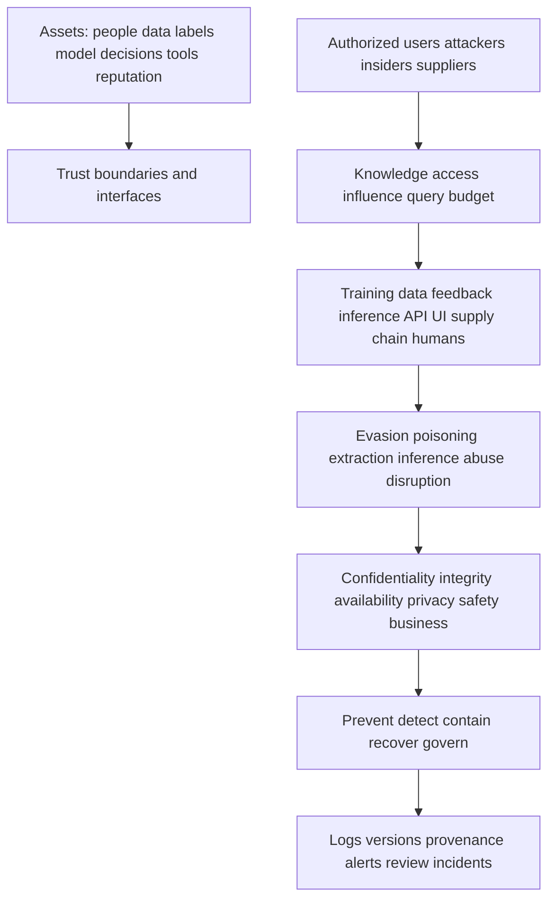
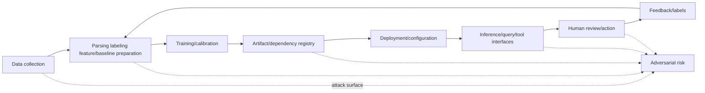
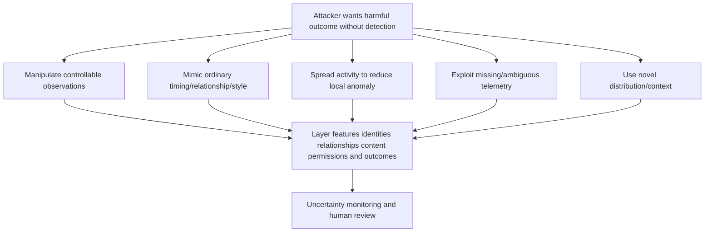
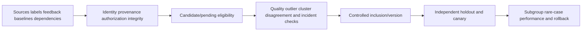
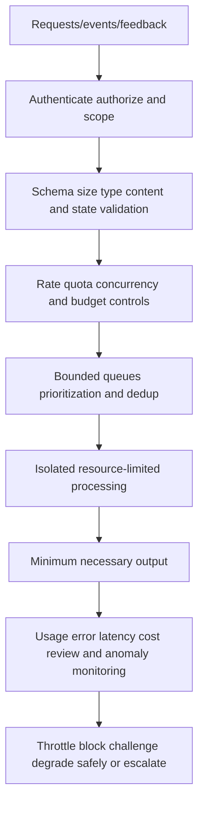
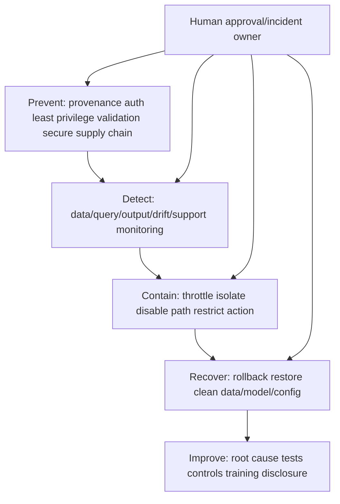
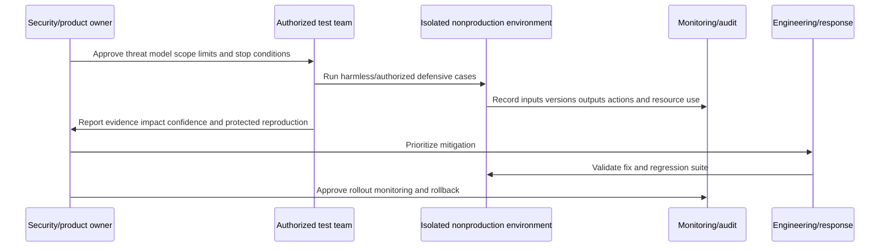
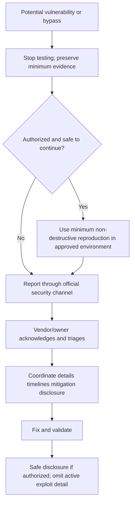
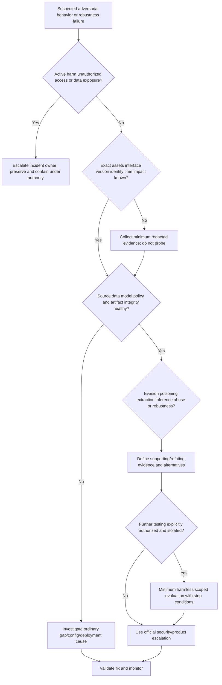

# Part 056 - Adversarial Behavior Evasion and Robustness

## Section goal

This Part introduces adversarial behavior against AI/ML-enabled systems at a defensive, non-operational level. An **adaptive attacker** changes behavior after observing controls. **Evasion** attempts to influence inference so harmful activity is not detected or is misclassified. **Poisoning** attempts to corrupt training, feedback, labels, or baselines. **Model extraction** attempts to approximate protected model behavior. **Inference attacks** attempt to learn sensitive facts about data or membership. **Robustness** is the ability to maintain acceptable behavior under expected variation, faults, manipulation, and distribution shift.

The support goal is to recognize plausible categories and evidence without giving bypass recipes or blaming every miss on a sophisticated attacker. A detection miss may arise from ordinary false negatives, data gaps, configuration, drift, policy, or attack adaptation. A score change is not proof of evasion. Defensive response uses least privilege, data provenance, query/rate controls, monitoring, layered detections, uncertainty, human review, incident response, and responsible disclosure.

The central rule is:

> Assume attackers can adapt, but require evidence for the mechanism; protect data and decision interfaces with layered controls rather than relying on secrecy or one model.

No exploit instructions, bypass prompts, payloads, probe sequences, or live tests appear here. Abnormal's proprietary threat model, models, data, controls, thresholds, anti-evasion methods, rate limits, and response process are unknown unless approved documentation states them.

## Learning outcomes

After completing this Part, you should be able to:

- define adaptive attacker, attack surface, threat model, evasion, poisoning, extraction, inference, robustness, and resilience;
- distinguish training-time, inference-time, supply-chain, deployment, feedback, and human/workflow attack surfaces;
- explain white-box, gray-box, and black-box knowledge at high level without operational guidance;
- describe feature manipulation, mimicry, perturbation, baseline contamination, label corruption, and distribution shift defensively;
- distinguish model extraction from membership/property/data inference concepts;
- identify confidentiality, integrity, availability, privacy, and abuse impacts;
- build layered prevention, detection, containment, recovery, and governance controls;
- discuss input validation, schemas, provenance, isolation, least privilege, rate limits, query monitoring, and output minimization;
- define robustness evaluation with harmless synthetic variations and authorized red-team governance;
- use abstention, human approval, fallbacks, rollback, and incident response proportionately;
- write a responsible-disclosure report without publishing bypass detail; and
- tie your enterprise investigation, networking/security upskilling, Copilot evaluation/training, support trends, analytics, and customer communication only as transferable evidence.

## JD Mapping

| Supplied role signal | Capability built | Transferable evidence | Boundary |
|---|---|---|---|
| Threat investigations | Classifies adversarial hypotheses and evidence | Complex investigations/critical situations | No production adversarial-ML ownership |
| Behavioral false negatives | Separates evasion from source/config/model/label causes | Hypothesis testing and escalation | No claim of Abnormal anti-evasion controls |
| AI Security Agents | Applies tool/data/prompt/permission threat thinking | Copilot/agent evaluation and human verification | Part 058 covers agent-specific safeguards |
| Product/Engineering collaboration | Sends protected repro, impact, evidence, and disclosure | Engineering/Product escalation | No public bypass reproduction |
| Customer trust | Communicates risk without overclaiming or disclosing exploit detail | Enterprise updates | No attribution or zero-risk promise |
| Support patterns | Detects repeated query/feedback/miss patterns | Trend analytics | Tickets alone do not prove an attack |
| Security/privacy culture | Protects data/model interfaces and reporting | Evidence ethics | No legal/privacy conclusion |
| Continuous learning | Uses NIST/MITRE/CISA primary sources | KB/training/mentoring | Framework mapping is not product proof |

## Candidate honesty note

| Evidence tier | Safe statement | Do not imply |
|---|---|---|
| **Production transfer** | "I have investigated complex technical behavior, preserved evidence, escalated securely, and communicated risk." | That you conducted production ML red teaming |
| **Local/public lab** | "I built a paper threat model and robustness control matrix using harmless synthetic records." | Live probing or exploitation |
| **Learned architecture** | "I understand adversarial-ML categories from NIST, MITRE ATLAS, and official guidance." | That frameworks describe Abnormal internals |
| **No direct experience** | "I have not operated Abnormal AI or tested its models in production." | Knowledge of hidden controls/weaknesses |
| **Unknown proprietary detail** | "Abnormal models, features, interfaces, anti-evasion controls, rate limits, thresholds, data, and incident response are unknown unless approved documentation states them." | Reverse-engineering or promising resistance |

Safe interview language:

> "I can classify adversarial risks, preserve evidence, test benign variations in an authorized lab, and recommend layered controls. I would never probe a customer or vendor system, publish bypass details, or claim Abnormal's private defenses."

## 1. Threat-model foundations

A **threat model** states assets, actors, goals, capabilities, access, trust boundaries, attack surfaces, impacts, assumptions, controls, and evidence. It prevents the word "adversarial" from becoming vague.

| Threat-model field | Defensive question | Example |
|---|---|---|
| Asset | What must be protected? | Labels, baselines, model output, customer data |
| Actor | Who could cause harm? | External attacker, compromised user, insider, supplier |
| Goal | What outcome do they seek? | Avoid detection, corrupt learning, steal information |
| Capability | What access/knowledge exists? | Public UI, feedback channel, stolen account |
| Surface | Where can influence occur? | Input, label, API, reviewer, dependency |
| Impact | Which harm? | Missed threat, false action, privacy leak, outage |
| Control | What reduces likelihood/impact? | Provenance, rate limit, review, rollback |
| Evidence | What would support/refute? | Query pattern, label anomalies, version timeline |

## 🔍 Plain-English deep-dive: Defensive threat modeling is planning locks, not teaching lock picking

A building security review asks which doors exist, who has keys, what valuables are inside, how entry is logged, and what happens if a key is stolen. It can recommend stronger locks, cameras, visitor controls, and incident response without publishing a step-by-step way to defeat a lock.

AI threat modeling follows the same boundary. Identify training/feedback inputs, inference interfaces, output detail, administrative controls, model artifacts, dependencies, and human workflows. Consider attacker knowledge and access. Then design prevention, detection, containment, recovery, and disclosure.

An overly secret design is not automatically secure; attackers may learn from ordinary outcomes. Conversely, publishing exact thresholds or bypass conditions can increase risk. The goal is useful transparency with anti-evasion discipline.

The building analogy stops because digital attacks can scale and copy data instantly. Its lesson is clear: analyze attack surfaces and controls without operationalizing abuse.

**Memory hook:** Map doors, keys, valuables, logs, and response; do not publish the lock bypass.

## 2. Lifecycle attack surfaces

| Lifecycle surface | Risk concept | Defensive controls |
|---|---|---|
| Collection | Manipulated or spoofed observations | Authentication, source integrity, corroboration |
| Labeling | Corrupt/noisy/biased labels | Provenance, double review, disagreement, sampling |
| Baseline update | Harmful activity normalized | Delay, exclusions, stable reference, rollback |
| Training | Poison/backdoor concept | Data lineage, validation, outlier/cluster review |
| Dependency/supply chain | Malicious/tampered package/model | SBOM, signatures, allowlists, scanning, provenance |
| Registry/storage | Model/data theft or replacement | Access, encryption, integrity, audit |
| Deployment | Wrong version/configuration | Approval, attestation, canary, rollback |
| Inference interface | Evasion, extraction, inference, abuse | Auth, minimization, rate/query controls, monitoring |
| Human review | Social engineering/automation bias | Independent evidence, least privilege, audit |
| Feedback | Poison/noisy self-reinforcement | Typed feedback, adjudication, holdout, quality gates |

## 3. Attacker knowledge and access

| Knowledge/access label | High-level meaning | Defender implication | Caution |
|---|---|---|---|
| White-box | Detailed model/parameters/architecture access | Strong insider/supply-chain controls | Do not assume external attackers have it |
| Gray-box | Partial knowledge/documentation/output access | Minimize sensitive detail and monitor | Boundaries vary |
| Black-box | Query/observe inputs and outputs | Rate/query controls and output minimization | Repeated observation can still reveal patterns |
| Training influence | Can insert/alter data/labels | Provenance and approval gates | Customer feedback is not necessarily direct training |
| Inference influence | Chooses operational inputs | Validation and robust detection | Normal use also controls inputs |
| Administrative access | Changes policy/version/permissions | Least privilege and audit | Larger blast radius than one query |

These categories describe assumptions for analysis. They do not instruct how to exploit an interface.

## 4. Evasion at inference time

**Evasion** attempts to cause a harmful input/activity to receive a safer output or route at inference. High-level forms include manipulating observable features, mimicking normal behavior, distributing activity, exploiting missingness, or shifting into underrepresented contexts. Defensive reasoning focuses on invariants and corroboration.

| Evasion concept | Defensive description | Detection/control idea | Non-proof caution |
|---|---|---|---|
| Feature manipulation | Attacker changes controllable observed values | Prefer hard-to-manipulate corroborated signals | Change can be legitimate |
| Mimicry | Harmful activity resembles normal patterns | Mechanism/business verification and multi-layer context | Similarity does not prove attack |
| Low-and-slow | Activity distributed over time | Short/long windows, cumulative risk, stable baseline | Long projects also gradual |
| Missingness abuse | Operate where telemetry is weak | Coverage monitoring, fail-safe uncertainty | Missing source can be outage |
| Novel context | Use unseen app/domain/workflow | OOD/novelty review and least privilege | New business is common |
| Transfer | Manipulation generalizes across models | Diverse/layered controls | Do not assume model independence |

## 🔍 Plain-English deep-dive: Camouflage matches one background, while defense checks movement, heat, and context

Camouflage can make an object resemble a forest visually. It may still produce heat, sound, tracks, or impossible movement. A defender relying on one color feature is brittle; multiple independent sensing modes make mimicry harder.

Behavioral evasion follows that intuition. An attacker may imitate normal timing or wording, but identity, relationship, permission, device, process, business verification, and outcome evidence can disagree. Layering should not mean collecting everything; it means choosing necessary, governed, partially independent evidence.

Attackers can also learn which signals matter through repeated interaction. Minimize exposed scoring details, limit abusive querying, monitor patterns, and change controls through governed releases. Do not rely only on obscurity.

The camouflage analogy stops because digital features can be copied exactly and models may share weaknesses. Its defensive lesson is robust: avoid a single manipulable signal and validate real-world process.

**Memory hook:** Mimicry can fool one view; corroborated layers test the whole story.

## 5. Poisoning and baseline contamination

Poisoning targets the integrity of data, labels, feedback, or learned artifacts. It can be indiscriminate (degrade overall behavior) or targeted (affect a class/entity/pattern). A **backdoor** concept is a hidden behavior triggered under attacker-chosen conditions. This guide does not describe trigger construction.

| Poisoning surface | Defensive risk | Safeguard concept |
|---|---|---|
| Training examples | Manipulated records bias fit | Source trust, dedup, anomaly/cluster review |
| Labels | False labels teach wrong mapping | Adjudication, provenance, reviewer agreement |
| Feedback | Coordinated/noisy reports | Rate/reputation controls, typed evidence |
| Baseline | Repeated malicious activity becomes normal | Delayed update, incident exclusions, stable reference |
| Calibration set | Probability mapping corrupted | Independent protected sample |
| Evaluation/test | Metrics falsely improve/degrade | Access control, immutable versioned sets |
| Dependency/model artifact | Tampered code/weights | Signatures, registry, SBOM, attestation |

## 🔍 Plain-English deep-dive: Protecting a well requires guarding water sources, testing samples, and retaining a clean reserve

A community well can be contaminated accidentally or intentionally. Defense includes controlling what enters, testing water, recording sources, isolating suspicious batches, and keeping a clean reserve for comparison and recovery. Waiting until everyone is sick is not enough.

Data and feedback pipelines need similar provenance and quarantine. A support correction can be valuable but should not instantly update a model or baseline. Confirm evidence, reviewer independence, incident status, duplicates, and authorization. Protected holdouts and stable historical references can reveal that new data is changing behavior unexpectedly.

The analogy stops because data records can be copied and corrected without consuming them. Its lesson is that integrity requires lifecycle controls, not only a final model test.

**Memory hook:** Guard inputs, quarantine uncertainty, test changes, and preserve a clean reference.

## 6. Model extraction and sensitive inference concepts

**Model extraction** attempts to create a substitute approximating a model through access to outputs or artifacts. **Membership inference** asks whether a record was in training. **Property inference** seeks aggregate properties of training data. **Model inversion/data reconstruction** seeks sensitive attributes or representative data. These categories overlap and depend on access/output detail.

| Threat | Target asset | Potential impact | Defensive control concept |
|---|---|---|---|
| Model extraction | IP/model behavior | Evasion, theft, competitive harm | Auth, rate/query monitoring, output minimization |
| Membership inference | Presence in training | Privacy/confidentiality | Data minimization, regularization/privacy techniques, output limits |
| Property inference | Dataset characteristics | Sensitive organizational knowledge | Aggregate/privacy review |
| Inversion/reconstruction | Training/input attributes | Data exposure | Privacy-preserving design and access controls |
| Artifact theft | Model file/weights | Direct extraction/tampering | Encryption, least privilege, registry integrity |

Do not test these threats against live services. Security teams use authorized, scoped evaluation methods and legal/privacy review.

## 7. Availability and abuse

Adversaries may exhaust inference capacity, flood review queues, trigger costly workflows, or manipulate alerts. Ordinary traffic spikes and bugs can look similar.

| Abuse surface | Symptom | Control concept | Failure caution |
|---|---|---|---|
| Query flood | Latency/error/cost spike | Per-identity quotas and global capacity | DoS and legitimate incident surge differ |
| Expensive input | Resource exhaustion | Size/complexity/time limits | Avoid rejecting legitimate large cases silently |
| Feedback flood | Review/label overload | Authentication, rate, dedup, evidence gates | Do not suppress genuine reports |
| Alert flooding | Analyst fatigue | Correlation, prioritization, bounded automation | Aggregation can hide distinct harm |
| Tool/action abuse | Repeated side effects | Approval, idempotency, budget, rollback | Part 058 expands agent controls |

## 🔍 Plain-English deep-dive: A bank protects an ATM with limits, monitoring, and settlement checks

An ATM authenticates a customer, limits withdrawals, monitors repeated failures, records transactions, and reconciles accounts. The daily limit is not the only control; stolen credentials, insider actions, and system faults still require detection and investigation.

Model/query interfaces benefit from similar layers: authenticated identity, least privilege, rate and cost budgets, response minimization, abuse monitoring, anomaly correlation, and audit. Rate limiting must consider distributed identities and legitimate emergencies, but this guide does not describe bypass methods.

The analogy stops because AI interfaces can return rich outputs and requests vary greatly in cost. Its lesson is that query governance protects availability, privacy, and model confidentiality together.

**Memory hook:** Authenticate, limit, observe, reconcile, and respond; no single limit is enough.

## 8. Robustness and resilience

**Robustness** means acceptable behavior under defined variation or manipulation. **Resilience** includes preparation, containment, recovery, and adaptation when failures occur. Robustness is always scoped: to which perturbations, distributions, threat model, metrics, and costs?

| Robustness dimension | Benign/defensive test concept | Acceptance question |
|---|---|---|
| Data quality | Missing/late/duplicate synthetic fields | Does fallback remain safe and visible? |
| Benign variation | Equivalent formatting/time shifts | Is outcome stable where it should be? |
| Distribution | New synthetic cohort/app/category | Does system abstain/route safely? |
| Adversarial | Authorized red-team perturbation categories | Are critical harms bounded? |
| Operational | Timeout/dependency failure | Is failure contained and recoverable? |
| Calibration | Base-rate/cohort shift | Are probabilities still reliable? |
| Human | Reviewer disagreement/fatigue | Are second review/appeal effective? |
| Policy | Conflicting rule/exception | Is precedence auditable? |

Robustness evaluation should include invariants (what should not change), sensitivities (what should change), worst-case harms, average behavior, subgroups, false positives/negatives, abstention, latency, and recovery. A model robust to character changes may remain vulnerable to business-process manipulation.

## 9. Defense in depth

| Layer | Example control | What it covers | Residual risk |
|---|---|---|---|
| Identity/access | Strong auth, least privilege | Unauthorized model/data/admin use | Compromised authorized identity |
| Input | Schema, provenance, size/type checks | Malformed/untrusted data | Semantically harmful valid input |
| Data/labels | Lineage, quarantine, adjudication | Poison/noise | Sophisticated valid-looking contamination |
| Model | Robust evaluation, regularization, uncertainty | Known variations | Novel attacks |
| Policy | High-impact rules, abstention, approval | Model uncertainty | Misconfigured rule |
| Interface | Output minimization, rate/query controls | Extraction/inference/abuse | Distributed/slow abuse |
| Monitoring | Data/output/query/support/safety signals | Detection and response | Blind spots/label delay |
| Human/IR | Review, incident response, disclosure | Context and recovery | Bias/capacity |

## 10. Robust evaluation without live attacks

Use synthetic and authorized fixtures to vary benign formatting, missingness, timing, identity mapping, and business context. For adversarial evaluation, a designated security/red team defines scope, authorization, safe environment, stop conditions, data handling, reporting, and remediation. L1 should not improvise live tests.

## 11. Detection and monitoring indicators

| Indicator family | Example | Alternative explanation |
|---|---|---|
| Query pattern | Unusual volume/coverage/timing | Integration bug or legitimate batch |
| Output probing | Many near-duplicate inputs with outcome comparison | QA/test or user retries |
| Feedback | Coordinated labels from new identities | Customer campaign/reporting event |
| Baseline | Gradual normalization of suspicious behavior | Legitimate role/process change |
| Distribution | New feature combinations | Product launch/acquisition |
| Performance | FN cluster under new pattern | Data gap or label shift |
| Artifact | Hash/signature/version mismatch | Deployment error |
| Review | Sudden overrides/disagreement | Training/rubric/policy change |

Indicators require identity, authorization, source quality, version, denominator, and context. Do not accuse a customer/user based on pattern alone.

## 12. Incident response and containment

| Phase | AI/ML-specific questions | General response link |
|---|---|---|
| Triage | Which model/data/interface/version/tenant and active harm? | Incident owner/severity |
| Preserve | Queries, outputs, versions, logs, data lineage, policy | Minimum evidence/chain |
| Contain | Restrict query/tool/data/model path, throttle, human approval | Least disruptive effective action |
| Scope | Other models/tenants/labels/dependencies/identities? | Blast radius |
| Eradicate | Remove poisoned data/artifact/credential/config | Root foothold |
| Recover | Restore trusted version/data/policy and service | Acceptance criteria/rollback |
| Monitor | Repeat queries, output drift, artifact integrity, abuse | Owner/window/trigger |
| Learn | Fix, test, disclosure, runbook, supply chain | Corrective/preventive actions |

## 13. Responsible disclosure

| Disclosure field | Content |
|---|---|
| Contact/channel | Official security.txt/VDP/support escalation |
| Scope/authorization | What was authorized and where |
| Summary | Defensive vulnerability category |
| Impact | Confidentiality/integrity/availability/privacy/business |
| Evidence | Minimum redacted IDs/times/versions |
| Reproduction | Protected, non-destructive, need-to-know |
| Safety | Testing stopped; no customer/third-party access |
| Mitigation | Defensive suggestion without public bypass |
| Coordination | Contact, acknowledgement, timeline, disclosure plan |

Never demand payment, threaten disclosure, access data, expand scope, or publish a live bypass. Follow law, contract, policy, and the official vulnerability disclosure process.

## 14. Worked example 1: Suspected evasion versus data gap

Several confirmed risky synthetic events share ordinary timing/style and were missed. The connector also lacked identity events. Evasion/mimicry and missing telemetry are competing hypotheses. Restore/validate coverage, compare model/policy versions, review independent business/message evidence, and escalate pattern; do not claim attacker adaptation from normal-looking features.

## 15. Worked example 2: Baseline contamination

A compromised account's repeated activity becomes less unusual in a synthetic adaptive baseline. Preserve event-time versions, exclude confirmed incident period under owner policy, compare stable reference, and monitor peers. The symptom supports contamination concern but exact update behavior remains a product question.

## 16. Worked example 3: Feedback flood

Many new synthetic identities submit identical feedback. Do not accept labels automatically. Authenticate, deduplicate, rate-control, preserve evidence, sample independent events, and route legitimate reports. Avoid public speculation about poisoning.

## 17. Worked example 4: Extraction concern

Logs show repeated structured queries and detailed outputs from one credential. Support preserves request IDs, authorization, rate, response schema, owner, and impact; rotates/contains the credential if authorized; escalates through security. It does not continue probing or publish the query pattern.

## 18. Troubleshooting table

| Symptom | Hypotheses | Cheapest defensive check |
|---|---|---|
| New miss pattern | Evasion, data gap, concept drift, policy | Coverage/version/matched cases |
| Baseline normalizes incident | Contamination, display/version, legitimate change | Event-time baseline/update eligibility |
| Query volume spike | Extraction/DoS, bug, batch | Identity, authorization, rate, request IDs |
| Feedback agreement surge | Poisoning, campaign, duplicate, UI change | Provenance/dedup/reviewer independence |
| Output reveals detail | Excessive schema, customer need, documentation | Approved output/disclosure contract |
| Model artifact mismatch | Tampering/deploy error | Signature/hash/registry audit |
| Robustness test fails | Real defect/test artifact/out-of-scope assumption | Reproduce in authorized isolated fixture |

## Troubleshooting decision tree

## 19. Common failure modes

| Failure | Why it fails | Better behavior |
|---|---|---|
| Every miss is evasion | Ordinary errors/gaps exist | Competing hypotheses/evidence |
| Secrecy alone protects | Outputs/behavior reveal patterns | Layered interface/data controls |
| Publish exact weakness | Enables abuse | Protected responsible disclosure |
| Test live vendor/customer | Unauthorized/harmful | Isolated authorized lab/tabletop |
| More features guarantee robustness | Shared/manipulable/noisy signals | Independent governed layers |
| Rate limit solves extraction | Slow/distributed/authorized misuse | Identity, output, query monitoring, budgets |
| Feedback is trusted label | Poison/noise/selection | Provenance/adjudication/holdout |
| Baseline always adapts safely | Contamination possible | Delay/exclusions/stable reference |
| Robust to one perturbation means robust | Threat-model specific | Scope and diverse tests |
| Human review cannot be attacked | Social engineering/bias/fatigue | Evidence/authority/audit/training |
| Rollback ends incident | Data/credentials/dependencies persist | Scope/eradicate/recover/monitor |
| Framework mapping proves exploit | Taxonomy is hypothesis aid | Product evidence required |
| Support should reproduce bypass | Increases harm | Stop, preserve, route securely |
| Marketing "robust" proves guarantee | Scope/method unknown | Demand defined evaluation |
| Generic controls equal Abnormal | Proprietary defenses unknown | Explicit unknown boundary |

## 20. Escalation packet

| Section | Required content |
|---|---|
| Summary | Potential category, observed impact, confidence, active status |
| Authorization | Scope and whether any test occurred |
| Assets/surface | Data, model, label, interface, policy, human, dependency |
| Actor/capability | Evidence-based assumptions only |
| Timeline | UTC events, versions, requests, changes, outcomes |
| Evidence | Redacted request/event IDs, logs, integrity, source coverage |
| Alternatives | Data gap, defect, drift, configuration, legitimate use |
| Exposure | Confidentiality/integrity/availability/privacy/business |
| Containment | Owner-approved actions and validation |
| Reproduction | Protected minimum only; no public bypass |
| Monitoring | Identity/query/data/output/support indicators |
| Disclosure | Official channel, coordinator, status |
| Unknowns | Proprietary controls/models not guessed |
| Ask | Security triage, owner, mitigation, data, decision, timeline |

## Safe synthetic lab: The Defensive Robustness Tabletop 056

### Objective

Create a paper threat model for a fictional AI-enabled security workflow; classify evasion, poisoning, extraction, inference, availability, supply-chain, and human risks; map layered controls, monitoring, incident response, and responsible disclosure. The unique lab is **The Defensive Robustness Tabletop 056**.

No system is queried or tested. The lab contains no payload, bypass prompt, exploit recipe, model/API call, account access, customer data, or production claim.

### Prerequisites

- Local Markdown editor, paper, or local spreadsheet only.
- This Part and synthetic architecture below.
- No model, API, hosted service, tenant, account, security product, or Abnormal access.
- Artifact label: **local/public lab - defensive paper threat model only**.
- Record UTC start, authorization statement, no-testing rule, and zero-real-data statement.

### Privacy and authorization boundary

Authorized:

- reason over fictional components and IDs locally;
- create defensive categories, controls, and response plans;
- use harmless abstract test cases such as missing field or delayed event; and
- cite verified official/public sources.

Prohibited:

- any live prompt, query, payload, probing, scanning, extraction, inference, poisoning, evasion, or availability test;
- real customer/vendor/model data, accounts, endpoints, logs, scores, labels, or weaknesses;
- model/API/cloud uploads/calls;
- operational bypass details or claims about Abnormal controls.

### Synthetic architecture

| Component ID | Purpose | Trust boundary | Defensive concern |
|---|---|---|---|
| SRC-056 | Synthetic event source | External -> ingestion | Authenticity/schema |
| LABEL-056 | Paper label queue | Reviewer boundary | Provenance/bias |
| BASE-056 | Fictional baseline store | Data boundary | Contamination/version |
| MODEL-056 | Abstract model box | Registry/deploy boundary | Integrity/confidentiality |
| API-056 | Abstract inference interface | Client/service boundary | Abuse/output minimization |
| REVIEW-056 | Human review queue | Human/action boundary | Bias/capacity/social engineering |
| FEEDBACK-056 | Correction channel | Customer/data boundary | Poison/noise/selection |
| ACTION-056 | Abstract side-effect service | High-impact boundary | Approval/idempotency/rollback |

### Lab steps

1. Create `The Defensive Robustness Tabletop 056`; record UTC, label, no-testing, and zero-real-data statements.
2. Draw lifecycle architecture and trust boundaries from SRC-056 through feedback/action.
3. Inventory assets: confidentiality, integrity, availability, privacy, safety, IP, customer trust, and business continuity.
4. Define actor, goal, knowledge/access, capability, surface, impact, evidence, and control fields.
5. Create at least twelve threat scenarios across evasion, poisoning, extraction, membership/property/inversion concepts, availability, supply chain, human review, and action abuse.
6. Keep each scenario abstract: no payload, sequence, prompt, or bypass detail.
7. Map each scenario to prevention, detection, containment, recovery, governance, and residual risk.
8. Add alternative ordinary explanations for every observed indicator.
9. Create provenance/quarantine/eligibility/holdout/rollback controls for SRC/LABEL/BASE/FEEDBACK.
10. Create authentication, least privilege, output minimization, rate/query budget, monitoring, and incident controls for API-056.
11. Design harmless robustness fixtures: missing field, duplicate event, delayed event, renamed category, benign formatting change, timeout, reviewer disagreement, policy conflict.
12. Define invariants, expected sensitivity, fallback, stop condition, and acceptance criteria for each fixture.
13. Build query/feedback/data/artifact/review/support monitoring indicators with denominators and owners.
14. Write incident response for suspected active extraction, poisoned labels, and artifact mismatch without reproducing attacks.
15. Build a responsible-disclosure template and coordination flow using fictional `FIND-056`.
16. Write a customer-safe update that avoids attribution, exploit detail, and unsupported assurance.
17. Create an Engineering escalation with protected reproduction placeholder and explicit security ask.
18. Deliver a 90-second spoken answer tying investigation, networking/security learning, Copilot evaluation/training, analytics, trends, and communication only as transfer evidence.
19. Complete source, privacy, cleanup, rubric, and zero-activity checks.

### Expected evidence

- Complete lifecycle/trust-boundary threat model.
- Asset/actor/goal/capability/surface/impact inventory.
- At least twelve abstract defensive threat scenarios.
- Prevention/detection/containment/recovery/governance control matrix.
- Ordinary-alternative hypothesis column for every indicator.
- Data/label/baseline/feedback integrity controls.
- Interface/access/rate/output/monitoring controls.
- Eight harmless robustness fixture specifications.
- Three incident-response plans.
- Responsible-disclosure template, customer update, and Engineering escalation.
- Spoken honesty statement and source ledger dated August 24, 2026.
- Cleanup and zero-live-activity attestation.

### Cleanup and privacy

- Confirm every ID contains `056`; all architecture and threats remain fictional/abstract.
- Remove accidental real vendor, customer, model, account, endpoint, prompt, query, weakness, log, score, label, or security detail.
- Confirm nothing was uploaded/called and no live system, account, model, API, product, prompt, query, or control was accessed, attacked, probed, or tested.
- Delete the artifact if real/confidential or operational bypass detail cannot be reliably removed.
- Retain only the local defensive tabletop if useful.
- Record cleanup UTC and: `Defensive paper tabletop only; zero live data, model, API, account, upload, prompt, query, probing, attack, bypass, or production activity.`

### Validation rubric

| Dimension | Fail | Developing | Pass |
|---|---|---|---|
| Threat model | Lists attacks only | Names assets/actors | Defines assets, actors, goals, access, surfaces, impacts, assumptions, evidence, controls |
| Safety | Includes bypass recipe/live test | Says defensive | Abstract paper-only scenarios, explicit prohibitions, no operational detail |
| Evasion | Says attackers change features | Adds mimicry | Uses corroborated layers, invariants, OOD, uncertainty, human/business checks |
| Poisoning | Trusts feedback | Adds provenance | Quarantine, adjudication, exclusions, holdout, versioning, rollback, monitoring |
| Extraction/inference | Says rate limit | Adds auth | Uses least privilege, output minimization, query monitoring, budgets, privacy design |
| Robustness | Claims universal | Tests one variation | Defines threat model, invariants, sensitivity, subgroups, operations, recovery, residual risk |
| Response | Blocks user | Adds incident owner | Preserves, contains, scopes, recovers, monitors, learns, validates |
| Disclosure | Publishes reproduction | Contacts vendor | Official channel, minimum protected evidence, coordination, no bypass detail |
| Sources | Framework equals fact | Cites framework | Uses NIST/MITRE/CISA as taxonomy/guidance and product evidence separately |
| Honesty | Claims Abnormal defenses | Says generic | Explicit transfer/lab/learned architecture and proprietary unknowns |

## 21. Support Boundary for Suspected Adversarial Behavior

An L1 support engineer should treat “the attacker bypassed the model” as a **hypothesis**, not an established root cause. First preserve the reported object identifiers, UTC window, expected and observed outcomes, policy and configuration context, affected scope, comparison examples, and available audit evidence. Test ordinary alternatives such as incomplete telemetry, delayed processing, identity mismatch, unsupported configuration, changed business behavior, policy precedence, or an incorrect customer expectation. If the pattern remains reproducible, escalate through the approved security-sensitive channel with the minimum protected evidence and an explicit question.

Do not ask the customer to reproduce an attack, reveal sensitive detection boundaries, run probing experiments, or share unnecessary message content. Do not promise that a single mitigation prevents future evasion. Keep the customer update factual: describe the observed outcome, immediate protective guidance, evidence collected, responsible owner, next checkpoint, and any approved workaround. Abnormal-specific models, features, thresholds, training data, anti-evasion mechanisms, and private implementation details remain unknown unless authorized documentation or an internal owner establishes them.

## 22. Official Source Anchors

All sources were accessed on **August 24, 2026** and must be revalidated before interview or production use. They anchor adversarial-ML taxonomy, AI risk, attack-pattern knowledge, vulnerability disclosure, and responsible security practice. They do not reveal Abnormal's proprietary threat model, models, data, interfaces, anti-evasion controls, rate limits, thresholds, or incidents.

| Official or primary source | What it anchors | Boundary |
|---|---|---|
| [NIST AI Risk Management Framework 1.0](https://www.nist.gov/itl/ai-risk-management-framework) | Secure/resilient AI, governance, measurement, monitoring, incident and supply-chain risk | Voluntary framework, not product control map |
| [NIST AI RMF Playbook](https://airc.nist.gov/AI_RMF_Knowledge_Base/Playbook) | Suggested adversarial, monitoring, incident, TEVV, third-party, and risk-response actions | Not a universal checklist |
| [NIST AI 100-2 - Adversarial Machine Learning Taxonomy](https://csrc.nist.gov/pubs/ai/100/2/e2023/final) | Terminology and taxonomy for evasion, poisoning, privacy, abuse, and mitigations | Taxonomy, not exploit instructions or vendor proof |
| [MITRE ATLAS](https://atlas.mitre.org/) | Official knowledge base for adversarial threats to AI-enabled systems | Hypothesis/control mapping, not proof of an incident |
| [CERT/CC - Guide to Coordinated Vulnerability Disclosure](https://certcc.github.io/CERT-Guide-to-CVD/) | Coordinated vulnerability disclosure roles, phases, principles, and operational considerations | Primary disclosure-process guidance, not legal advice |
| [Microsoft Learn - Responsible AI practices for Azure OpenAI](https://learn.microsoft.com/en-us/azure/ai-foundry/responsible-ai/openai/overview) | Identify, measure, mitigate, operate, red-team and layered-control concepts | Generative-AI service guidance, not Abnormal design |
| [Abnormal AI official site](https://abnormal.ai/) | Current attributable high-level public security/AI statements only | Do not infer anti-evasion architecture or guarantees |

### Source-use discipline

- Use NIST/MITRE as taxonomy and defensive guidance, not confirmation of a product weakness.
- Do not copy or publish operational attack steps.
- Use official disclosure channels and need-to-know evidence.
- Attribute vendor claims with scope/date/footnotes.
- Route active vulnerabilities, privacy, legal, contractual, and protected architecture issues to authorized security owners.

## Likely Interview Questions

### Q1. What is adversarial machine learning?

**Model answer:** It studies intentional attempts to compromise AI/ML confidentiality, integrity, availability, privacy, or abuse resistance across data, training, supply chain, deployment, inference, feedback, and human workflows. I define the threat model and evidence rather than assuming every error is adversarial.

### Q2. What is the difference between evasion and poisoning?

**Model answer:** Evasion manipulates inference-time observations/behavior to alter an output or route. Poisoning corrupts training, labels, feedback, baselines, calibration, or artifacts so future behavior changes. Defenses differ: inference layering/query controls versus provenance, quarantine, adjudication, holdouts, versioning, and rollback.

### Q3. What are model extraction and inference attacks?

**Model answer:** Extraction seeks a substitute or protected model behavior; membership/property/inversion concepts seek sensitive facts about training data or attributes. Defensive controls include strong access, least privilege, output minimization, rate/query budgets, monitoring, artifact protection, privacy-preserving design, and incident response.

### Q4. How does mimicry affect behavioral detection?

**Model answer:** An adaptive attacker may imitate normal timing, relationship, style, or volume. I avoid one manipulable signal and correlate identity, relationship, permissions, content, device, business process, and outcome evidence, while monitoring missingness and distribution shift. Similarity alone neither proves safety nor attack.

### Q5. What makes a system robust?

**Model answer:** Robustness is scoped acceptable behavior under defined benign variation, faults, distribution changes, and adversarial manipulation. I specify the threat model, invariants, sensitivities, metrics, subgroups, operations, abstention/fallback, human review, recovery, and residual risk; no system is universally robust.

### Q6. What role do rate limits and monitoring play?

**Model answer:** They reduce query abuse, extraction, privacy leakage, cost, and availability risk, but are only one layer. Combine authenticated identity, authorization, quotas/budgets, output minimization, query-pattern monitoring, bounded queues, anomaly correlation, incident response, and legitimate-use handling.

### Q7. How would you handle a suspected AI vulnerability?

**Model answer:** Stop unapproved testing, preserve minimum evidence, confirm authorization/scope, escalate through the official security or VDP channel, protect reproduction details, coordinate mitigation/validation/disclosure, and never expand access, touch customer data, or publish an active bypass.

### Q8. What are your Abnormal adversarial-security boundaries?

**Model answer:** I have transferable investigation, security learning, evaluation, trend, and communication skills plus a defensive paper tabletop. I have not probed Abnormal AI. Its models, data, interfaces, anti-evasion controls, rate limits, thresholds, and incident process remain unknown unless approved documentation states them.

## 30-Second Memory Hooks

- **Threat model: assets, actors, goals, access, surfaces, impacts, evidence, controls.**
- **Evasion targets inference; poisoning targets future learning/reference.**
- **Mimicry can fool one feature; corroborated layers test the story.**
- **Feedback is untrusted until provenance and adjudication.**
- **Extraction targets model behavior; inference targets sensitive data facts.**
- **Authenticate, limit, minimize outputs, monitor, and reconcile.**
- **Robustness is scoped to a threat model, never universal.**
- **Resilience includes containment, rollback, recovery, and learning.**
- **Human reviewers need evidence and anti-bias controls.**
- **A framework match is a hypothesis, not incident proof.**
- **Stop, preserve, and disclose through the official channel.**
- **No Abnormal anti-evasion claim without approved evidence.**

## Completion Checklist

- [ ] I can state the Section goal and defensive central rule.
- [ ] I can build a threat model with assets, actors, goals, access, surfaces, impacts, assumptions, controls, and evidence.
- [ ] I can distinguish lifecycle surfaces and white/gray/black-box assumptions at high level.
- [ ] I can explain evasion, feature manipulation, mimicry, low-and-slow, missingness, and novelty without recipes.
- [ ] I can explain poisoning, baseline contamination, feedback risk, holdouts, provenance, and rollback.
- [ ] I can distinguish extraction, membership, property, inversion/reconstruction, and artifact theft defensively.
- [ ] I can design access, validation, least privilege, rate/query, output, monitoring, and human controls.
- [ ] I can define robustness/resilience scope, invariants, sensitivity, fallbacks, recovery, and residual risk.
- [ ] I can recognize adversarial indicators while testing ordinary alternatives.
- [ ] I can use incident response and responsible disclosure without publishing bypass detail.
- [ ] I can build a complete security escalation packet.
- [ ] I completed or can explain **The Defensive Robustness Tabletop 056**, including Prerequisites, Expected evidence, Cleanup and privacy, and Validation rubric.
- [ ] I used no live prompt/query, model/API upload, account, probing, attack, bypass, customer data, or production system.
- [ ] I can state the Candidate honesty note and proprietary Abnormal boundary.
- [ ] I checked Official Source Anchors and recorded **August 24, 2026**.
- [ ] I can answer exactly Q1-Q8 aloud.

[Next: Part 057 - AI Privacy Bias and Responsible Use](Part-057-ai-privacy-bias-and-responsible-use.md)