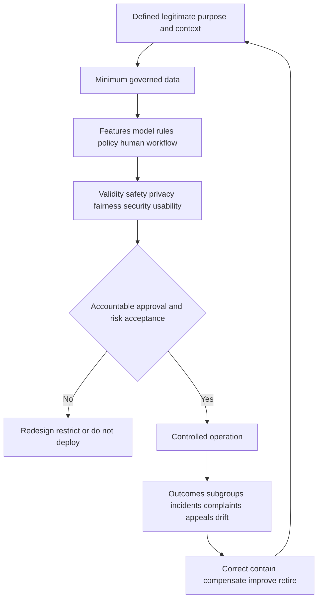
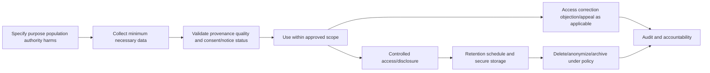
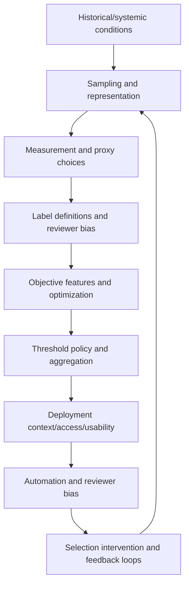
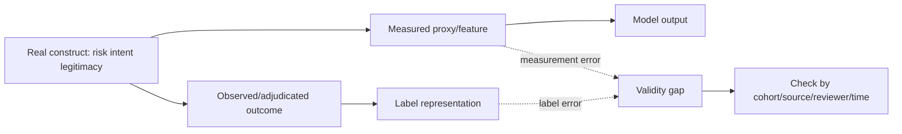
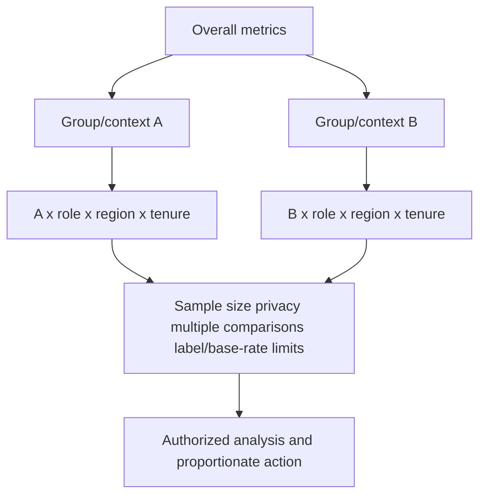
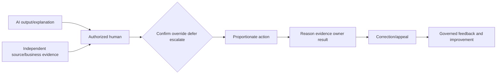
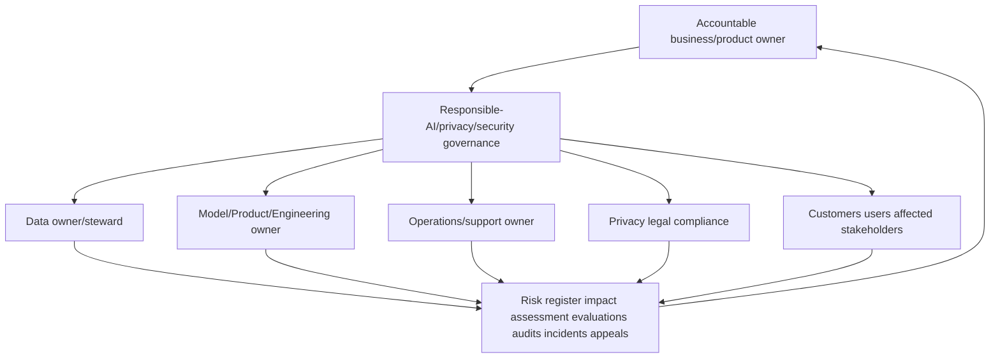
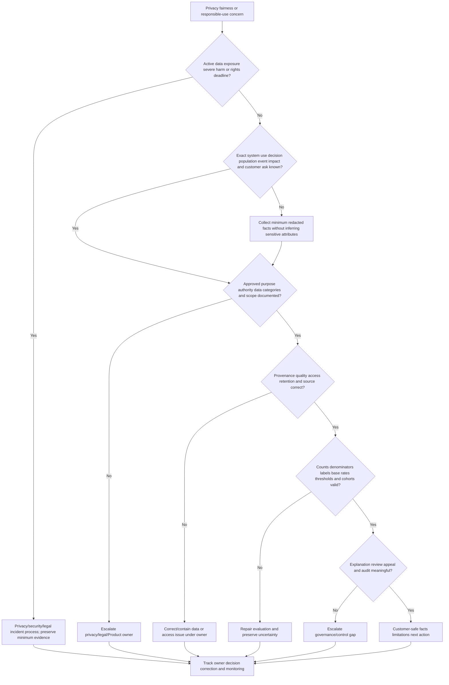

# Part 057 - AI Privacy Bias and Responsible Use

## Section goal

This Part explains responsible AI as an ongoing socio-technical governance practice, not a claim that a model is morally neutral or legally compliant. Privacy asks whether data is used for a defined purpose with minimization, authority, access, security, retention, deletion, provenance, transparency, and appropriate choice/consent. Bias can arise from society, institutions, data collection, measurement, labels, sampling, features, aggregation, objectives, thresholds, deployment, human review, and feedback. **Disparate impact** is a high-level concept describing outcomes that affect groups differently even without explicit intent; its legal meaning depends on jurisdiction and context.

The support goal is to discuss customer concerns safely: identify the system purpose and decision, relevant populations, data categories, observed outcome, documentation, configuration, human oversight, correction/appeal, and authorized privacy/legal owners. Do not promise compliance, infer sensitive attributes, expose other customers, or treat an aggregate metric as proof of fairness.

The central rule is:

> Responsible use requires a legitimate defined purpose, minimum necessary governed data, valid and subgroup-aware evaluation, meaningful human accountability, contestability, and continuous monitoring.

This guide is not legal advice. Abnormal's proprietary data, models, features, fairness evaluations, retention, consent mechanisms, thresholds, human-review tools, and governance are unknown unless approved public or contractual documentation states them.

## Learning outcomes

After completing this Part, you should be able to:

- distinguish privacy, confidentiality, security, fairness, bias, ethics, compliance, governance, and responsible use;
- apply purpose specification, necessity, proportionality, minimization, provenance, quality, access, retention, deletion, and accountability concepts;
- ask appropriate authority/consent/notice questions without giving legal advice;
- distinguish systemic, computational/statistical, and human-cognitive bias at high level;
- identify representation, selection, historical, measurement, label, proxy, aggregation, objective, threshold, deployment, automation, and feedback bias;
- explain why removing a sensitive field does not remove proxies or unequal effects;
- compare aggregate and subgroup metrics with base-rate, sample-size, label, and intersectionality cautions;
- discuss disparate treatment/impact concepts cautiously and route conclusions to qualified legal/policy owners;
- design transparency, documentation, audit, explanation, appeal, correction, override, and human-oversight controls;
- handle customer privacy/fairness tickets with minimum necessary evidence and neutral language;
- build a responsible-AI risk register and escalation packet; and
- tie your customer trust, evidence handling, Copilot evaluation/training, analytics/SQL/Python, support trends, KB/training, and escalation only as transferable facts.

## JD Mapping

| Supplied role signal | Capability built | Transferable evidence | Boundary |
|---|---|---|---|
| Customer trust/security mindset | Uses minimum evidence and accountable explanations | Several years of enterprise communication and evidence handling | No privacy/legal authority claim |
| Behavioral false-positive cases | Tests subgroup/context/proxy and correction path | Case comparison/fix validation | No claim of Abnormal fairness tuning |
| Product/Engineering collaboration | Provides risk register, observed impact, population, and ask | Escalation and validation | Governance decisions stay authorized |
| Support trends/analytics | Segments outcomes with denominators and uncertainty | CSAT/backlog/quality analytics | Sensitive groups require governance |
| AI support tools | Evaluates purpose, data, harms, human verification | Copilot/agent evaluation/training | Not equivalent to security-model governance |
| Customer onboarding/configuration | Clarifies data purpose, permissions, roles, and shared responsibility | Microsoft cloud/identity experience | Vendor contracts/docs control specifics |
| KB/training | Teaches safe language and escalation | Training/mentoring | No invented policy |
| Cross-functional culture | Routes privacy, legal, security, Product, Engineering, CSM | critical-situation collaboration | L1 supplies facts, not final legal decision |

## Candidate honesty note

| Evidence tier | Safe statement | Do not imply |
|---|---|---|
| **Production transfer** | "I have handled enterprise evidence carefully, communicated limitations, analyzed support trends, and escalated risk." | That you served as privacy counsel or AI governance owner |
| **Local/public lab** | "I built a synthetic responsible-AI risk register and subgroup metric worksheet." | Use of real demographic/customer data |
| **Learned architecture** | "I studied NIST and Microsoft responsible-AI/privacy guidance." | That frameworks certify a vendor |
| **No direct experience** | "I have not operated Abnormal AI or audited its governance in production." | Knowledge of private data/retention/fairness controls |
| **Unknown proprietary detail** | "Abnormal data, features, models, thresholds, retention, consent, fairness testing, and review governance are unknown unless approved sources state them." | Inferring compliance from marketing |

Safe interview language:

> "I can identify privacy and fairness risks, collect minimum evidence, calculate synthetic subgroup metrics, communicate uncertainty, and route legal/policy decisions appropriately. I do not claim legal advice, production Abnormal governance, or universal fairness from one metric."

## 1. Responsible-AI vocabulary

| Term | Plain meaning | Why it matters | Not the same as |
|---|---|---|---|
| Privacy | Appropriate processing of data about people/organizations | Autonomy, dignity, rights, trust, risk | Confidentiality only |
| Confidentiality | Prevent unauthorized disclosure | Protects information | Complete privacy governance |
| Security | Protect confidentiality, integrity, availability | Prevents abuse/incident | Fairness or lawful purpose |
| Fairness | Contextual equitable treatment/outcomes | Avoid unjustified harm/disadvantage | One universal equation |
| Bias | Systematic skew from social/data/model/human processes | Can create error/harm | Always intentional prejudice |
| Ethics | Values/principles guiding action | Addresses what should be done | Law alone |
| Compliance | Meeting applicable obligations | Required accountability | Proof of ethical/accurate system |
| Governance | Roles, policies, controls, evidence, decisions | Makes responsibility operational | Documentation only |
| Accountability | Named owners answer for decisions/outcomes | Enables correction | Blame |
| Contestability | Ability to challenge/correct a decision | Protects affected people/customers | Guaranteed reversal |

## 🔍 Plain-English deep-dive: A library card has a purpose; it is not permission to track every book-related behavior forever

A library needs some information to lend books and recover them. That purpose does not automatically justify collecting a patron's every conversation, location, or unrelated purchase indefinitely. Access should be limited, records retained only as needed, and patrons informed about meaningful practices.

AI systems similarly need a stated purpose before data collection. "Improving AI" is too broad by itself. Ask which decision, user, benefit, harm, and data are involved. Could a less sensitive field or shorter retention achieve the purpose? Who can access it? Can it be corrected or deleted under applicable policy? Was it collected from a trustworthy source with authority?

The library analogy stops because enterprise security processing can involve contractual, legitimate-interest, regulatory, and incident-response bases that differ by jurisdiction. The lesson remains: purpose limits collection, use, sharing, retention, and later reuse.

**Memory hook:** Purpose is the fence around data use, not a label attached afterward.

## 2. Data lifecycle and privacy controls

| Lifecycle control | Support question | Evidence | Escalation |
|---|---|---|---|
| Purpose | What exact security/business outcome? | Approved use case/document | Purpose unclear/expanded |
| Authority/choice | What law/contract/policy/consent applies? | Approved privacy/legal record | L1 cannot determine |
| Minimization | Is each field necessary? | Data inventory/necessity rationale | Overcollection suspected |
| Provenance | Where/when/how collected? | Source/lineage/version | Unknown/untrusted origin |
| Quality | Accurate, complete, current, representative? | Quality metrics/correction | Harmful error |
| Access | Who/role/why? | RBAC/audit | Excess privilege/access |
| Sharing | Which processors/regions/purposes? | Contract/data-flow | Unauthorized disclosure concern |
| Retention | How long and why? | Schedule/legal hold | Indefinite/contradictory |
| Deletion | How is removal verified? | Job/result/exception | Failed deletion request |
| Correction/appeal | How can facts/outcomes be challenged? | Workflow/SLA/audit | No meaningful route |

### Data minimization

Minimization can reduce fields, precision, granularity, population, retention, access, and output. Pseudonymization replaces direct identifiers but may remain re-identifiable when graph/context is unique. Aggregation helps but can hide subgroup harms and can still reveal small groups.

## 3. Consent, notice, authority, and escalation

Consent is one possible basis for processing, not the only one, and valid consent requirements vary. In enterprise security, employment, contract, legitimate interest, legal obligation, and incident response may be relevant depending on law/policy. L1 must not decide the legal basis.

| Customer question | Safe support response | Owner |
|---|---|---|
| "Did every employee consent?" | Explain documented product/configuration facts; route legal-basis question | Customer/vendor privacy/legal |
| "Can you delete this data?" | Confirm documented request path, identity/tenant, scope, retention exceptions | Privacy/data owner/support process |
| "Where is data stored?" | Use current approved architecture/contract docs | Security/privacy/legal/CSM |
| "Is this GDPR/CCPA compliant?" | Do not certify; provide approved compliance material and owner route | Legal/privacy/compliance |
| "Why is this field collected?" | State approved purpose and necessity if documented | Product/privacy owner |
| "Can I opt out?" | Use supported configuration/rights process only | Customer admin/privacy/legal |

## 4. Bias sources across the lifecycle

| Bias type | Plain meaning | Synthetic example | Defensive question |
|---|---|---|---|
| Historical/systemic | Data reflects unequal past conditions | One group had less system access | Should past pattern be reproduced? |
| Representation | Population/group under/overrepresented | New region sparse in data | Who is missing and why? |
| Selection | Observed subset differs | Only alerts labeled | What outcomes are unseen? |
| Measurement | Feature measures groups differently | Geolocation less precise | Is measurement equally valid? |
| Label | Outcome definition/reviewer differs | Ambiguous events forced negative | How was truth adjudicated? |
| Proxy | Feature stands for sensitive attribute | Language/region/role | Is proxy necessary/direct measure available? |
| Aggregation | Overall model hides subgroup patterns | Global metric strong, cohort weak | Report disaggregated counts |
| Objective | Optimization omits harm | Accuracy ignores rare misses | Whose costs are represented? |
| Threshold/policy | Same/different cut creates unequal errors | One queue capacity by region | Is rule justified/monitored? |
| Deployment | Intended context differs from use | Tool used for employee discipline | Is use within approved scope? |
| Automation | Humans overtrust output | Reviewer copies verdict | Can humans challenge independently? |
| Feedback | Output shapes future labels | Only flagged events reviewed | Does system learn reflection? |

## 🔍 Plain-English deep-dive: A funhouse mirror can faithfully reflect the mirror's distortion

A camera pointed at a warped mirror can capture the image perfectly. Better camera resolution does not remove the distortion; it records it more accurately. Historical data can work the same way. A model may faithfully learn patterns created by unequal access, biased enforcement, or flawed labels.

This is why technical accuracy is not the entire fairness question. Ask how data was generated, who was missing, what the label represents, whose harm is counted, and where the system is deployed. More data from the same skewed process can reinforce it.

The mirror analogy stops because data can contain useful signals and interventions can improve systems. Its lesson is that statistical fit to history does not automatically justify reproducing history.

**Memory hook:** A model can learn a distorted history accurately.

## 5. Representativeness and sampling

A dataset is representative only relative to a target population, time, context, and task. A group can have many rows but little diversity. Duplicated campaigns inflate sample size without independent evidence.

| Representation question | Example evidence | Risk |
|---|---|---|
| Who is in target population? | Tenant/entity/workflow definition | Undefined generalization |
| Who appears in data? | Counts by relevant cohort/time | Missing groups |
| Why missing? | Access/source/consent/configuration | Systematic blind spot |
| Are rows independent? | Campaign/entity grouping | False confidence |
| Does time match deployment? | Future holdout/matched season | Stale behavior |
| Are rare/high-harm cases present? | Severity-stratified sampling | Average hides critical failure |
| Are labels equally available? | Review/outcome coverage | Selective-label bias |

## 6. Measurement and label bias

A construct such as "malicious intent" is not directly measured by message hour. A label such as "customer reported false positive" includes reporting behavior. Validate measurement across cohorts and use multiple evidence sources.

## 7. Proxies and removing sensitive attributes

Removing a sensitive field can be appropriate but does not guarantee fairness. Other features can reconstruct it or capture structural differences. Conversely, collecting sensitive attributes for fairness evaluation can create privacy and legal risk and requires authorization.

| Feature/proxy | Operational use | Fairness/privacy concern | Safer question |
|---|---|---|---|
| Region | Time/routing context | Nationality/ethnicity proxy | Can timezone/source health suffice? |
| Language | Communication context | Nationality proxy | Is category necessary and valid? |
| Tenure | Cold start | New employees disadvantaged | Use uncertainty, not blame |
| Device | Security posture | Access/income/accessibility proxy | Measure management state directly |
| Role/title | Permission/workflow | Rank/employment proxy | Use effective task context |
| Missingness | Source availability | Tenant/group proxy | Fix source and monitor |

Do not infer or collect protected characteristics in a support case without explicit authorized purpose.

## 8. Aggregation and intersectionality

An aggregate metric can hide subgroup errors. **Intersectionality** means experiences can differ at combinations of characteristics or contexts; analyzing only one dimension at a time can miss harm. Small cells increase uncertainty and privacy risk.

| View | Benefit | Risk | Guardrail |
|---|---|---|---|
| Overall | Simple system summary | Hides subgroup harm | Always inspect key cohorts |
| Single subgroup | Finds broad difference | Within-group variation | Counts/base rates/confidence |
| Intersection | Finds combined effects | Small cells/re-identification | Minimum size/privacy review |
| Per-tenant | Customer relevance | Tiny samples/noncomparability | Time aggregation and context |
| Severity-weighted | Reflects impact | Subjective weights | Document ownership/rationale |

## 🔍 Plain-English deep-dive: An average elevator height does not make every floor accessible

If a building's elevators serve an average of ten floors, that statistic does not show whether one wing is unreachable by wheelchair users or whether the emergency elevator fails at night. Overall performance can be high while a subgroup faces a critical barrier.

AI metrics behave similarly. Overall precision or recall can hide weak behavior for new employees, a region, a language, a shared-mailbox workflow, or an intersection. But slicing endlessly creates tiny noisy groups and privacy risk. Choose groups tied to plausible harms and authorized governance, report counts/base rates, and avoid identifying individuals.

The elevator analogy stops because groups and labels can change and fairness definitions may conflict. Its lesson is to pair aggregate performance with contextually justified subgroup analysis.

**Memory hook:** A strong average can coexist with an inaccessible corner.

## 9. Group metrics and base-rate cautions

Use confusion counts and rates from Part 052. Differences in precision can arise from prevalence even when TPR/FPR match. Equalizing one metric can worsen another. Legal/ethical definitions vary by use case.

### Synthetic subgroup example

| Group | TP | FP | TN | FN | Precision | Recall | FPR | Prevalence |
|---|---:|---:|---:|---:|---:|---:|---:|---:|
| A | 80 | 20 | 880 | 20 | 80% | 80% | $20/900=2.22\%$ | 10% |
| B | 8 | 12 | 972 | 8 | 40% | 50% | $12/984=1.22\%$ | 1.6% |

Group B has lower precision and recall but lower FPR. Different prevalence and sample size complicate interpretation. Investigate labels, source quality, representation, threshold, severity, and workflow; do not declare discrimination or compliance from this table alone.

| Fairness metric concept | Question | Tension/caveat |
|---|---|---|
| Demographic/statistical parity | Are positive-decision rates similar? | Ignores different base rates/needs |
| Equal opportunity/TPR parity | Are actual positives surfaced similarly? | FPR/precision can differ |
| Equalized odds | Are TPR and FPR similar? | May conflict with calibration/utility |
| Predictive parity/PPV parity | Are positive decisions equally reliable? | Can conflict with error-rate parity |
| Calibration by group | Does predicted $p$ match outcome frequency per group? | Sample/base-rate/label issues |
| Individual/counterfactual concepts | Are similar cases treated similarly? | Defining similarity/causality is hard |

These terms are educational concepts, not a legal test or recommendation. Qualified owners choose appropriate criteria.

## 10. Disparate treatment and disparate impact concepts

At a high level, **disparate treatment** involves different treatment based on a protected characteristic, often with intent questions. **Disparate impact** can describe a facially neutral practice producing disproportionately adverse outcomes. Legal definitions, protected groups, defenses, evidence, and remedies vary by jurisdiction/domain.

L1 safe process:

1. Preserve exact customer observation, affected workflow, group definition supplied by authorized owner, and impact.
2. Do not infer sensitive attributes or ask unnecessary personal questions.
3. Collect minimum aggregate counts, denominators, versions, source quality, labels, policy, and appeal history.
4. Escalate promptly to privacy/legal/compliance and Product/security owners.
5. Avoid admitting violation, denying possibility, or providing legal conclusions.
6. Continue technical fact-finding and customer updates under owner guidance.

## 11. Automation bias and human oversight

| Oversight control | Purpose | Weak implementation |
|---|---|---|
| Independent evidence | Reduce anchoring | Reviewer sees only score |
| Authority to override | Meaningful control | Human cannot change action |
| Second review | High-impact/ambiguous consistency | Same bias duplicated |
| Capacity/SLA | Avoid rubber-stamp/backlog | Queue overwhelms staff |
| Rubric/training | Consistency and domain skill | Checkbox script |
| Audit | Accountability/reconstruction | Decision only, no rationale |
| Appeal/correction | Contest harm/error | Hidden or inaccessible route |
| Feedback gates | Prevent noisy/poison labels | Every click becomes truth |

## 12. Transparency and documentation

| Artifact | Audience | Minimum content |
|---|---|---|
| System/use-case card | Owners/users | Purpose, users, out-of-scope, decisions, harms |
| Data sheet/inventory | Data/privacy/security | Sources, categories, populations, provenance, quality, retention |
| Model/evaluation card | Technical/governance | Version, task, metrics, cohorts, limits, calibration, robustness |
| Explanation | Affected/reviewer | Observable reasons, policy, uncertainty, next step |
| Decision/audit log | Operations/governance | Output, policy, reviewer, action, evidence, result |
| Incident record | Security/privacy | Timeline, scope, impact, containment, notification owners |
| Change log | Support/Product | Version, effective time, expected/actual, rollback |
| Appeal record | Affected/customer/governance | Request, evidence, owner, decision, correction |

Transparency must be audience-appropriate and protect privacy, security, IP, and other customers. "Proprietary" should not eliminate meaningful accountability.

## 🔍 Plain-English deep-dive: An appeal process is a circuit breaker, not an accusation against the system

An electrical circuit breaker allows a system to stop safely when current exceeds limits. It does not mean the power grid is always broken. An appeal/correction route similarly lets affected people or customers challenge a decision, provide missing context, and prevent repeated harm.

Appeals reveal measurement errors, identity mapping issues, legitimate change, inaccessible explanations, or policy problems. They can also be noisy or malicious, so they require authentication, evidence, privacy controls, and adjudication. Their outcomes should become typed feedback, not automatic retraining labels.

The analogy stops because appeals involve rights, communication, and human judgment. Its lesson is that contestability is a normal safety function, not a sign of failure or blame.

**Memory hook:** A correction path limits harm and teaches the system responsibly.

## 13. Governance and accountability

| Governance role | Accountability |
|---|---|
| Business/use-case owner | Purpose, benefits, risk acceptance, stop decision |
| Product/model owner | Design, evaluation, documentation, releases |
| Data owner/steward | Authority, quality, provenance, access, retention |
| Security | Threat model, controls, incidents, disclosure |
| Privacy/legal/compliance | Applicable obligations, notices, rights, contracts |
| Operations/support | Case ownership, evidence, communication, trends, escalation |
| Human reviewers | Authorized decisions, rationale, bias controls |
| Internal audit/assurance | Independent control/evidence review |
| Customer/affected stakeholder | Context, feedback, contestability, shared responsibility |

## 14. Worked example 1: New-user false positives

New employees show a higher false-positive complaint rate. Possible causes include cold start, role mapping, missing history, real risk differences, label/reporting differences, or threshold policy. Do not infer age/nationality/competence. Compare event-time source quality, role/tenure cohorts, counts/denominators, severity, and correction outcomes; escalate fairness/privacy concerns.

## 15. Worked example 2: Language proxy

A text-language category correlates with review routing. It may reflect region/business context or proxy nationality. Test necessity, measurement quality, source coverage, interactions, subgroup outcomes, alternative direct features, and customer harm under governance. Do not remove/add sensitive data casually or claim discrimination from correlation.

## 16. Worked example 3: Aggregate hides subgroup

Overall recall is 90%, but a small new-app cohort is 50%. Validate sample independence, label maturity, source completeness, base rate, and uncertainty. If impact is high, restrict/route review and escalate even before statistical certainty. Avoid exposing individuals in tiny cells.

## 17. Worked example 4: Deletion/retention ticket

A customer asks to delete event data. L1 verifies requester/tenant through approved process, identifies documented data category/scope, records request ID, routes privacy/data owner, explains no unsupported timeline, tracks deletion/exception result, and avoids exporting data. Legal hold/contractual exceptions are owner decisions.

## 18. Customer-safe response patterns

### Privacy purpose

> "The approved documentation describes `[data category]` as used for `[specific purpose]`. I am confirming scope, access, retention, and the applicable request process with the privacy/data owner. I will not infer a legal basis or share unnecessary content."

### Fairness concern

> "We take the observed difference seriously. We are preserving minimum aggregate evidence, checking population/labels/source quality/configuration/version and correction history, and have routed the legal/privacy/policy assessment to the authorized owners. We are not inferring sensitive attributes or drawing a compliance conclusion from one case."

### Appeal/correction

> "The event and supporting context are under independent review through `[approved process]`. The current output is not treated as proof of intent. We will document the decision, corrective action if needed, and next checkpoint while protecting personal and proprietary information."

## 19. Troubleshooting table

| Symptom | Plausible cause | Cheapest check |
|---|---|---|
| Group reports more false positives | Base rate/source/label/threshold/proxy/cold start | Per-group counts and quality |
| Privacy field appears unexpectedly | UI/schema/config/access issue | Documented purpose and source lineage |
| Deleted data still visible | Cache/backup/legal hold/job failure | Request/job/scope/retention docs |
| Explanation exposes sensitive data | Overbroad UI/access | Role, field, audit, minimization |
| Reviewers rarely override | Automation bias or strong model | Blind sample and authority check |
| Appeals cluster after release | Regression/documentation/process change | Version/onset/denominator |
| Overall metric good, subgroup bad | Aggregation/representation | Cohort counts/uncertainty |
| Customer asks compliance certification | Legal/contract question | Approved compliance materials/owner |

## Troubleshooting decision tree

## 20. Common failure modes

| Failure | Why it fails | Better behavior |
|---|---|---|
| Security equals privacy | Secure misuse can violate purpose | Lifecycle privacy governance |
| Consent solves all | Basis/validity/context vary | Route authority to legal/privacy |
| Collect everything for accuracy | Increases privacy/security/bias | Necessity/minimization |
| Remove sensitive field = fair | Proxies/structural effects remain | Outcome and proxy analysis |
| More data = representative | Same process/duplicates persist | Target-population sampling |
| Labels are objective | Review/history/measurement bias | Provenance/adjudication |
| Overall metric = fair | Subgroups hidden | Authorized disaggregation |
| Slice endlessly | Tiny cells/noise/re-identification | Harm-driven groups/minimum size |
| Equal metric always fair | Criteria conflict/context differs | Governance chooses criteria |
| Correlation proves discrimination | Legal/causal evidence absent | Escalate facts and analysis |
| Human loop removes bias | Humans anchor/fatigue | Meaningful oversight |
| Explanation is transparency | May omit purpose/data/appeal | Full documentation/audit |
| Appeal retrains instantly | Feedback requires adjudication | Typed lifecycle |
| Compliance badge proves responsible | Scope/date/control evidence matter | Approved current assurance |
| Support gives legal advice | Authority/context missing | Route to qualified owners |
| Generic RAI equals Abnormal practice | Proprietary governance unknown | Explicit boundary |

## 21. Escalation packet

| Section | Required content |
|---|---|
| Concern | Customer observation, affected workflow, impact, urgency |
| Purpose/use | Intended decision, users, out-of-scope use |
| Data | Categories, provenance, quality, authority/notice status, minimization |
| Lifecycle | Access, sharing, region, retention, deletion/correction |
| Population | Unit, cohort definitions, counts, denominators, representation |
| Outcomes | TP/FP/TN/FN, rates, base rates, severity, uncertainty |
| Bias hypotheses | Historical, representation, measurement, label, proxy, aggregation, automation, feedback |
| Versions | Data/schema/model/policy/config/product/effective time |
| Oversight | Explanation, reviewer authority, override, audit, appeal |
| Privacy/safety | Minimum evidence, access, secure transfer, retention |
| Customer communication | Facts, limitations, owners, checkpoint |
| Unknowns | Proprietary/legal conclusions not guessed |
| Ask | Privacy/legal/Product/security decision, evidence, correction, control, timeline |

## Safe synthetic lab: The Responsible AI Commons 057

### Objective

Build a fictional responsible-AI risk register, data lifecycle, bias map, subgroup metric worksheet, transparency pack, human-oversight design, appeal path, and customer escalation. The unique lab is **The Responsible AI Commons 057**.

The lab uses synthetic aggregate tables only. It uses no real protected/sensitive attributes, customer data, model/API upload, account, live prompt, profiling, legal conclusion, or production claim.

### Prerequisites

- Local Markdown editor, paper, or local spreadsheet only.
- This Part and synthetic fixtures.
- Calculator for confusion metrics, rates, absolute/relative gaps.
- No model, API, hosted notebook, cloud sheet, tenant, account, security product, or Abnormal access.
- Artifact label: **local/public lab - synthetic responsible-AI records only**.
- Record UTC start, purpose, no-legal-advice statement, and zero-real-data statement.

### Privacy and authorization boundary

Authorized:

- copy fictional aggregate Group A/B counts locally;
- calculate metrics and write governance artifacts;
- use fictional context groups not real protected classes; and
- cite verified official/public sources.

Prohibited:

- real demographic/protected/sensitive/customer/employee data or inference;
- model/API/cloud uploads or calls;
- account/product access, live profiling, prompt attacks, or production testing;
- legal compliance conclusions or Abnormal governance claims.

### Synthetic use case

An abstract workflow routes fictional events for review. Group A/B are arbitrary test cohorts, not real demographic groups. Use the subgroup confusion counts in Section 9. Additional issues:

| Issue ID | Fictional observation |
|---|---|
| RAI-057-01 | Group B has sparse source coverage and lower recall |
| RAI-057-02 | Language category may proxy region |
| RAI-057-03 | Reviewers see model verdict before evidence |
| RAI-057-04 | Data retention has no documented end date |
| RAI-057-05 | Appeal page is inaccessible to keyboard-only user |
| RAI-057-06 | Support feedback automatically marked ground truth in draft design |

### Lab steps

1. Create `The Responsible AI Commons 057`; record UTC, label, purpose, no-legal-advice, and zero-real-data statements.
2. Define privacy, confidentiality, security, fairness, bias, ethics, compliance, governance, accountability, and contestability.
3. Draw purpose -> data -> design -> evaluation -> approval -> operation -> monitoring -> response lifecycle.
4. Create a data inventory with category, purpose, necessity, provenance, authority/notice owner, access, sharing, retention, deletion, correction, and security.
5. Apply minimization by field, precision, population, retention, access, and output; record utility tradeoff.
6. Map historical/systemic, representation, selection, measurement, label, proxy, aggregation, objective, threshold, deployment, automation, and feedback bias.
7. Calculate Group A/B precision, recall, FPR, FNR, prevalence, positive-decision rate, and absolute gaps.
8. Explain base-rate/sample-size/label/source uncertainty and why no legal/fairness verdict follows.
9. Compare parity, equal-opportunity, equalized-odds, predictive-parity, calibration, and individual concepts without selecting a legal standard.
10. Analyze RAI-057-01/02 with source-quality and proxy necessity alternatives.
11. Redesign RAI-057-03 with evidence-first sample, authority, second review, disagreement, capacity, and audit.
12. Redesign RAI-057-04 with documented retention/deletion/exception owner; execute nothing.
13. Redesign RAI-057-05 for accessibility and alternative appeal channels.
14. Redesign RAI-057-06 with typed feedback, adjudication, provenance, holdout, and release gates.
15. Build transparency artifacts: system card, data sheet, model/evaluation card, explanation, audit, change log, appeal record.
16. Create governance RACI and escalation triggers for privacy, legal, security, Product, Engineering, support, CSM, and customer owner.
17. Write privacy-purpose, fairness-concern, and appeal customer messages.
18. Build a full responsible-AI risk register with likelihood/impact, controls, evidence, owner, due date, residual risk, and review date.
19. Deliver a 90-second spoken answer tying trust, evidence handling, Copilot evaluation/training, analytics, support trends, KB/training, and escalation only as transfer evidence.
20. Complete source, privacy, cleanup, rubric, and zero-activity checks.

### Expected evidence

- Responsible-AI lifecycle and vocabulary table.
- Purpose/necessity/provenance/access/retention data inventory.
- Twelve-source bias map.
- Hand-calculated Group A/B metrics and caveat memo.
- Fairness-criteria comparison without legal conclusion.
- Six issue redesigns.
- Human-review/appeal/accessibility controls.
- Seven transparency/audit artifacts.
- Governance RACI and risk register.
- Three customer-safe messages and escalation packet.
- Spoken honesty statement and source ledger dated August 24, 2026.
- Cleanup and zero-live-activity attestation.

### Cleanup and privacy

- Confirm every ID contains `057`; Group A/B remain fictional non-demographic cohorts.
- Remove accidental real person, customer, employee, tenant, protected/sensitive attribute, message, model, policy, case, metric, legal conclusion, or product detail.
- Confirm nothing was uploaded to a model, API, cloud sheet, portal, or hosted notebook.
- Confirm no account, tenant, product, live prompt, profiling, sensitive inference, legal process, or security control was accessed, attacked, changed, or tested.
- Delete the artifact if real/confidential data cannot be reliably removed.
- Retain only the local fictional artifact if useful.
- Record cleanup UTC and: `Synthetic responsible-AI exercise only; zero live sensitive data, model, API, account, upload, profiling, legal conclusion, prompt attack, or production activity.`

### Validation rubric

| Dimension | Fail | Developing | Pass |
|---|---|---|---|
| Purpose/privacy | Says data helps AI | Lists fields | Defines purpose, necessity, authority owner, provenance, access, retention, deletion, correction |
| Bias | Says model neutral/biased | Lists data bias | Maps systemic, representation, measurement, label, proxy, aggregation, objective, human, feedback |
| Metrics | Overall accuracy only | Adds subgroup rate | Counts, denominators, base rates, sample/label uncertainty, intersections/privacy |
| Fairness | Chooses one metric universally | Lists parity terms | Explains conflicts/context and routes criteria/legal decisions |
| Proxies | Removes sensitive field | Notes correlation | Tests necessity/direct measure/outcome/source/privacy without inferring attributes |
| Oversight | Human approves | Adds override | Evidence-first, authority, capacity, second review, bias, audit, appeal, accessibility |
| Transparency | Shares model details | Writes explanation | Covers purpose/data/evaluation/limits/action/audit/appeal with security boundaries |
| Governance | Says legal owns it | Names roles | RACI, risk register, owners, gates, incidents, monitoring, correction, retirement |
| Safety | Uses real group data | Uses synthetic upload | Local fictional aggregates, no sensitive inference/legal conclusion |
| Honesty | Claims Abnormal governance | Says generic RAI | Explicit transfer/lab/learned architecture and proprietary unknowns |

## 22. Official Source Anchors

All sources were accessed on **August 24, 2026** and must be revalidated before interview or production use. They anchor AI risk, privacy, bias, responsible-AI principles, and attributable public trust material. They do not certify legal compliance or reveal Abnormal's proprietary data, models, features, fairness tests, retention, consent, thresholds, review, or governance.

| Official or primary source | What it anchors | Boundary |
|---|---|---|
| [NIST AI Risk Management Framework 1.0](https://www.nist.gov/itl/ai-risk-management-framework) | Trustworthiness, context, fairness, privacy, transparency, accountability, governance | Voluntary framework, not certification |
| [NIST AI RMF Playbook](https://airc.nist.gov/AI_RMF_Knowledge_Base/Playbook) | Suggested impact, participation, data, bias, privacy, monitoring, and contestability actions | Not a universal checklist |
| [NIST Privacy Framework](https://www.nist.gov/privacy-framework) | Enterprise privacy risk management and lifecycle functions | Framework, not legal advice |
| [NIST SP 1270 - Identifying and Managing Bias in AI](https://www.nist.gov/publications/towards-standard-identifying-and-managing-bias-artificial-intelligence) | Systemic, computational/statistical, and human-cognitive bias | General guidance, not legal determination |
| [Microsoft Learn - What is Responsible AI](https://learn.microsoft.com/en-us/azure/machine-learning/concept-responsible-ai?view=azureml-api-2) | Fairness, reliability/safety, privacy/security, inclusiveness, transparency, accountability | Azure guidance, not Abnormal implementation |
| [Abnormal AI Trust Center](https://abnormal.ai/trust-center) | Current attributable public security/privacy/compliance materials available there | Scope/date-specific vendor material; not universal certification |
| [Abnormal AI official site](https://abnormal.ai/) | Current attributable high-level product positioning | Do not infer data/model/governance details |

### Source-use discipline

- Treat frameworks as guidance, not legal compliance certification.
- Use approved contractual/trust materials for vendor-specific answers.
- Preserve scope, date, report/certification boundaries, and customer responsibility.
- Do not copy long text or infer sensitive attributes.
- Route privacy, legal, compliance, labor/employment, accessibility, contractual, and protected architecture questions to qualified owners.

## Likely Interview Questions

### Q1. What is responsible AI?

**Model answer:** It is lifecycle governance that defines purpose/context, manages data and model risks, evaluates validity/safety/privacy/fairness/security, assigns accountable owners, enables human oversight and contestability, monitors outcomes/incidents, and corrects or retires systems. It is not one metric or compliance slogan.

### Q2. How are privacy and security different?

**Model answer:** Security protects confidentiality, integrity, and availability. Privacy asks whether processing of data about people/organizations is appropriate for a defined purpose, with authority, minimization, transparency, access, retention, sharing, correction, deletion, and accountability. Secure processing can still violate purpose.

### Q3. Where can AI bias enter?

**Model answer:** Historical/systemic conditions, representation/selection, measurement, labels/reviewers, proxies, aggregation, objectives, thresholds/policy, deployment context, automation bias, and feedback loops. Bias is not always intentional, so I inspect the full socio-technical lifecycle.

### Q4. Does removing protected attributes make a model fair?

**Model answer:** Not necessarily. Region, language, role, device, tenure, and missingness can proxy sensitive attributes or structural differences. Evaluate necessity, measurement validity, subgroup outcomes, base rates, labels, and alternatives under authorized privacy/legal governance; do not infer attributes in support.

### Q5. How do you evaluate subgroup fairness?

**Model answer:** Start with per-group TP/FP/TN/FN, precision, recall, FPR/FNR, prevalence, positive-decision rate, calibration where applicable, counts, severity, label/source quality, sample uncertainty, and intersections. Fairness criteria can conflict, so qualified owners choose context-appropriate goals and legal standards.

### Q6. What is disparate impact?

**Model answer:** At a high conceptual level, a neutral-seeming practice can produce disproportionately adverse outcomes for a group without explicit intent. The legal definition, protected groups, evidence, defenses, and remedies vary. I preserve facts/metrics and escalate promptly; I do not make a legal conclusion.

### Q7. What makes human oversight meaningful?

**Model answer:** Independent evidence, authority to override/defer/escalate, expertise, capacity, a rubric, second review for high impact, bias controls, audit, accessible appeal/correction, and governed feedback. A human who only rubber-stamps a score is not meaningful oversight.

### Q8. What are your Abnormal responsible-AI boundaries?

**Model answer:** I have transferable trust, evidence, evaluation, analytics, training, and escalation skills plus a synthetic risk-register lab. I have not audited Abnormal AI. Its data, models, retention, consent, fairness tests, thresholds, review, and governance remain unknown unless approved public/contractual materials state them; I do not give legal advice.

## 30-Second Memory Hooks

- **Responsible AI is lifecycle governance, not one metric.**
- **Purpose fences collection, use, sharing, retention, and reuse.**
- **Security protects data; privacy governs appropriate processing.**
- **A model can learn a distorted history accurately.**
- **Removing a sensitive field does not remove proxies.**
- **Strong averages can hide inaccessible corners.**
- **Counts, denominators, base rates, labels, and uncertainty precede fairness claims.**
- **Fairness metrics can conflict; context and owners matter.**
- **Disparate impact is a legal-sensitive concept, not an L1 conclusion.**
- **Meaningful oversight can challenge, act, audit, and appeal.**
- **Typed feedback is not automatic retraining.**
- **No Abnormal governance claim without approved evidence.**

## Completion Checklist

- [ ] I can state the Section goal and responsible-use central rule.
- [ ] I can distinguish privacy, confidentiality, security, fairness, bias, ethics, compliance, governance, accountability, and contestability.
- [ ] I can map purpose, authority/notice, minimization, provenance, quality, access, sharing, retention, deletion, and correction.
- [ ] I can identify all required bias sources across the lifecycle.
- [ ] I can explain representation, measurement, label, proxy, aggregation, automation, and feedback bias.
- [ ] I can explain why removing sensitive attributes is insufficient and why collecting them also needs governance.
- [ ] I can calculate subgroup confusion metrics with base-rate/sample/label cautions.
- [ ] I can compare fairness concepts without selecting a universal/legal standard.
- [ ] I can discuss disparate impact without legal advice and route appropriately.
- [ ] I can design transparency, audit, meaningful oversight, accessible appeal, correction, and feedback gates.
- [ ] I can build a responsible-AI risk register and escalation packet.
- [ ] I completed or can explain **The Responsible AI Commons 057**, including Prerequisites, Expected evidence, Cleanup and privacy, and Validation rubric.
- [ ] I used no real sensitive group data, model/API upload, account, profiling, legal conclusion, live prompt, product, or production system.
- [ ] I can state the Candidate honesty note and proprietary Abnormal boundary.
- [ ] I checked Official Source Anchors and recorded **August 24, 2026**.
- [ ] I can answer exactly Q1-Q8 aloud.

[Next: Part 058 - AI Agent Safeguards Prompt Injection and Hallucination](Part-058-ai-agent-safeguards-prompt-injection-and-hallucination.md)