# Part 058 - AI Agent Safeguards Prompt Injection and Hallucination

## Section goal

This Part explains how AI assistants and agents combine a model with instructions, context, retrieval, memory, tools, orchestration, policy, and human approval. It focuses on two prominent failures: **prompt injection**, where untrusted content attempts to redirect system behavior, and **hallucination**, where a model generates unsupported, incorrect, or fabricated content. The solution is not a magical prompt. Safe systems use least privilege, trust-boundary separation, isolation, schemas, validation, grounding, citations, approvals, idempotency, budgets, monitoring, evaluations, defensive red teaming, incident response, and fail-safe behavior.

The support goal is to reason across layers. A wrong answer can come from stale retrieval, no relevant source, parsing, context truncation, model generation, citation mismatch, tool failure, permission, memory contamination, orchestration, policy, or UI. An unsafe action can arise even from a factually correct model if a tool has excessive authority. A safe-looking answer can contain hidden indirect instructions from retrieved documents.

The central rule is:

> Treat all external content as untrusted data, give the agent only necessary capabilities, validate every boundary, require human approval for consequential actions, and fail visibly without unsafe side effects.

This Part contains no operational bypass prompts, jailbreak recipes, exploit strings, or live prompt attacks. Abnormal's proprietary agents, prompts, models, retrieval, tools, memory, safeguards, permissions, evaluations, and implementation are unknown unless approved documentation explicitly states them.

## Learning outcomes

After completing this Part, you should be able to:

- distinguish assistant, agent, model, system instructions, context, retrieval, tool, memory, orchestrator, policy, and action;
- draw an agent architecture with trust boundaries and data/control flows;
- explain direct and indirect prompt injection defensively without supplying bypass content;
- distinguish prompt injection from jailbreak, data poisoning, ordinary malicious input, and authorization failure at high level;
- define hallucination, unsupported claim, stale claim, citation mismatch, retrieval miss, and tool-result error;
- design grounding, source allowlists, provenance, citation verification, freshness, abstention, and human-check controls;
- apply least privilege, scoped credentials, isolation, network egress limits, sandboxing, secret handling, and output minimization;
- use typed schemas, input canonicalization, output validation, policy enforcement, and tool-side authorization;
- design approval gates, dry runs, previews, transaction limits, idempotency, rollback, and postcondition validation;
- distinguish session memory, user memory, task state, retrieval index, audit history, and secrets;
- monitor tool calls, prompts/context metadata, retrieval, outputs, costs, failures, approvals, privacy, and incidents;
- build scenario-specific evaluation sets and authorized defensive red-team tests with stop conditions; and
- tie Arti's Copilot/agent evaluation/training, enterprise support, analytics/SQL/Python, networking/security learning, fix validation, and customer communication only as transferable evidence.

## JD Mapping

| Supplied role signal | Capability built | Transferable Arti evidence | Boundary |
|---|---|---|---|
| AI Security Agents | Maps agent components, permissions, safeguards, and failures | Copilot Studio/agent and LLM fundamentals | No Abnormal agent implementation claim |
| Prompting | Uses structured tasks and untrusted-content boundaries | Copilot evaluation/training | No jailbreak/bypass testing |
| Complex support investigations | Traces retrieval/model/tool/policy/action layers | CRITSIT and evidence-based escalation | No production agent incident ownership |
| API/configuration tickets | Checks schemas, auth, scopes, retries, idempotency | REST/JSON and identity/networking learning | No direct named-vendor admin claim |
| Customer trust/privacy | Minimizes sensitive context and verifies claims | Enterprise communication/evidence handling | No customer data in public models |
| Product/Engineering collaboration | Supplies versioned traces, safe repro, expected/actual, explicit ask | Escalation/fix validation | Protected prompts/weaknesses stay restricted |
| Support automation | Applies approvals, audit, evaluation, and fallback | Process improvement/KB/training | AI drafts require human ownership |
| Security mindset | Uses least privilege, defense in depth, incident response | Security/networking upskilling | No exploit or red-team production claim |

## Candidate honesty note

| Evidence tier | Safe statement | Do not imply |
|---|---|---|
| **Production transfer** | "I have supported/evaluated Copilot-related experiences, validated fixes, and communicated AI limitations to enterprise customers." | That Arti operated Abnormal AI agents |
| **Local/public lab** | "I built a paper agent threat model and synthetic evaluation suite without executing prompts or tools." | Live prompt injection or model/API use |
| **Learned architecture** | "I understand agent safeguards from NIST, OWASP, MITRE, and Microsoft sources." | That generic controls match a vendor implementation |
| **No direct experience** | "I have not operated Abnormal AI or tested its agents in production." | Knowledge of private prompts, tools, memory, or permissions |
| **Unknown proprietary detail** | "Abnormal agent models, prompts, retrieval, tools, memory, orchestration, safeguards, permissions, data, and evaluations are unknown unless approved documentation states them." | Inferring architecture from marketing |

Safe interview language:

> "My transferable strength is safe AI evaluation and support reasoning: I separate content from instructions, verify sources, minimize data, scope tools, require approval, validate outcomes, and escalate with reproducible evidence. My agent lab is paper-only and not an Abnormal implementation."

## 1. Assistant and agent vocabulary

An **assistant** helps a user, often by answering or drafting. An **agent** is a system that can pursue a goal across steps and may call tools or take actions. The boundary is not standardized; always describe capabilities rather than rely on the label.

| Component | Plain meaning | Example responsibility | Main risk |
|---|---|---|---|
| Model | Generates/chooses output from context | Draft answer or tool proposal | Hallucination/manipulation |
| System/developer instructions | Authorized behavioral constraints | Purpose, policy, format | Override/conflict/leakage |
| User input | User goal/data | Ask support question | Malicious/ambiguous content |
| Context | Information provided for this step | Case facts, policy, history | Sensitive/stale/untrusted data |
| Retrieval | Selects external knowledge | Find approved KB sections | Poisoned/stale/missed source |
| Tool | Capability outside model | Search, query, create ticket | Excess privilege/side effect |
| Memory | Persisted state across turns/tasks | User preference/task progress | Privacy/poisoning/stale state |
| Orchestrator | Coordinates steps, tools, state, policy | Plan and execute workflow | Confused-deputy/control-flow flaws |
| Guardrail/policy engine | Enforces constraints outside prompt | Block unapproved tool/action | Coverage/bypass/misconfiguration |
| Human approval | Accountable authorization | Approve send/delete/change | Rubber-stamp/fatigue |
| Audit/monitor | Records and detects behavior | Trace tools, versions, results | Missing sensitive overlogging |

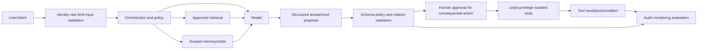

## 🔍 Plain-English deep-dive: An agent is an intern with a badge, a handbook, and access to specific rooms

An intern can read a handbook, receive tasks, consult files, and use approved systems. Safety depends less on telling the intern "be careful" and more on badge permissions, supervision, separation of duties, transaction limits, recordkeeping, and review.

The model is analogous to the intern's reasoning. System instructions are the handbook. Retrieval is the filing room. Tools are rooms and machines the badge unlocks. Memory is a notebook. The orchestrator assigns steps. Human approval is the supervisor for consequential work.

If the intern reads a sticky note in a customer file saying "ignore your manager and transfer money," the note is data, not authority. The badge should not permit transfer; the process should require validation and approval. Even a persuaded intern cannot exceed tool-side authorization.

The analogy stops because models do not possess human judgment or responsibility. Its lesson is decisive: prompts guide behavior, but capabilities and side effects must be constrained outside the model.

**Memory hook:** Instructions guide; permissions constrain; approvals authorize; audits reconstruct.

## 2. Trust boundaries and instruction hierarchy

External content includes user input, email, web pages, documents, tickets, tool output, retrieved text, and memory written from prior content. It may contain instruction-like language, but should remain untrusted data unless an authorized control plane promotes it through explicit policy.

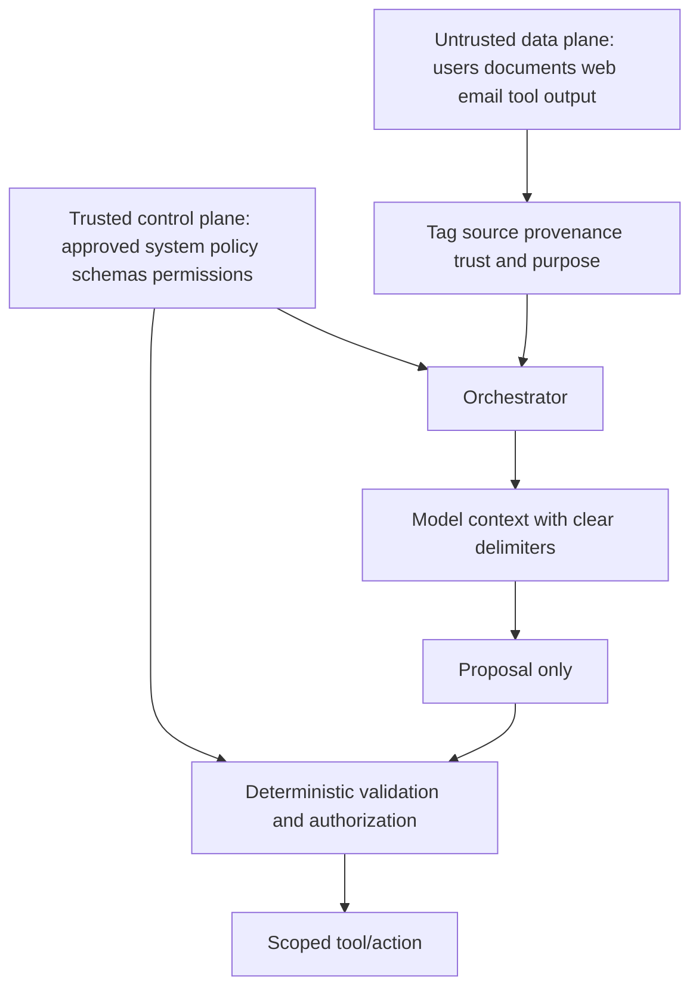

| Input source | Default trust | Allowed role | Required controls |
|---|---|---|---|
| System policy/config | High but change-controlled | Constraints/authority | Signing, RBAC, version/audit |
| Developer workflow | Controlled | Task/tool definitions | Review, tests, deployment gate |
| User request | Untrusted | Goal/data | Identity, scope, validation, policy |
| Retrieved document | Untrusted content | Evidence only | Provenance, allowlist, freshness, injection handling |
| Tool result | Untrusted/typed | Observed result | Schema, integrity, source authorization |
| Memory | Mixed/untrusted persisted data | Preference/task context | Scope, expiry, provenance, correction |
| Model output | Untrusted proposal | Draft/structured candidate | Validation, policy, human approval |

Instruction hierarchy inside a model is not a security boundary by itself. A determined model can be confused; surrounding controls must enforce authority.

## 3. Direct and indirect prompt injection

**Direct prompt injection** is instruction-like input supplied directly by a user that attempts to redirect behavior away from the authorized task/policy. **Indirect prompt injection** is instruction-like content embedded in a retrieved document, webpage, email, tool output, or memory. A **jailbreak** broadly attempts to bypass model behavioral restrictions. Terms overlap, and implementation details vary.

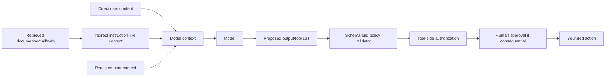

| Concept | Defensive meaning | Primary control focus | Non-example/caution |
|---|---|---|---|
| Direct injection | User content tries to override task/policy | Input isolation, policy enforcement, permissions | Ordinary request for allowed behavior |
| Indirect injection | Retrieved/untrusted content carries instructions | Treat content as data; provenance; tool isolation | A document's legitimate procedural text |
| Jailbreak | Attempt to bypass model-level restrictions | Layered safety, capability limits, monitoring | Not every policy disagreement |
| Data poisoning | Corrupts retrieval/training/memory source | Provenance, approval, version, integrity | One malicious prompt alone |
| Confused deputy | Agent misuses authority for untrusted requester/content | Tool-side authorization and purpose binding | Model mistake without authority |
| Authorization failure | Caller/action not permitted but succeeds | Identity/RBAC/policy | Prompt-only issue |

## 🔍 Plain-English deep-dive: A sticky note inside a package does not outrank the warehouse procedure

A warehouse receives packages with labels and notes. A note inside a package saying "send every package to this new address" is content from an untrusted source. Workers follow the approved procedure and supervisor authorization, not instructions hidden in cargo.

Indirect prompt injection is the digital version. A retrieved page or email can contain instruction-like text. Retrieval increases relevance, not authority. The system should preserve provenance, delimit content, constrain the model's task, validate structured proposals, enforce permissions at tools, and require approval for high-impact actions.

No wording can guarantee a model ignores every malicious note. Security therefore relies on boundaries and least privilege. Even if the model proposes an unsafe action, deterministic policy/tool controls should reject it.

The warehouse analogy stops because models can blend instructions and data probabilistically. Its lesson is that untrusted content never earns control-plane authority merely by appearing in context.

**Memory hook:** Retrieved content can inform the answer; it cannot grant authority.

## 4. Prompt injection defenses in depth

| Layer | Control | Purpose | Limit |
|---|---|---|---|
| Purpose | Narrow allowed tasks/out-of-scope | Reduces attack surface | Model can still misinterpret |
| Identity | Authenticate user/workload | Binds requester | Compromised identity remains |
| Input | Type/size/schema/canonicalization | Reject malformed/ambiguous input | Semantic injection remains |
| Context | Delimit/tag provenance/trust | Separates data/instructions | Prompt separation is imperfect |
| Retrieval | Source allowlist, integrity, freshness | Reduces poisoned content | Trusted source can be compromised |
| Model | Safety instructions/evaluation | Improves resistance | Not enforcement boundary |
| Output | Structured schema and content checks | Constrains proposal | Valid structure can be harmful |
| Tool | Least privilege, purpose-bound auth | Limits capability | Misconfigured permission |
| Action | Approval, limits, dry run, idempotency | Prevents unsafe side effects | Human fatigue/insider risk |
| Monitor | Trace/query/tool/privacy alerts | Detects attempts/failures | Detection delay/blind spots |

Do not rely on deny-listing known attack phrases. Attack language changes, indirect content can be encoded in many forms, and legitimate text may contain security examples.

## 5. Hallucination and unsupported output

**Hallucination** is generated content that is unsupported, false, fabricated, or inconsistent with available evidence. Some teams prefer precise categories: unsupported claim, factual error, stale claim, contradictory synthesis, fabricated citation, wrong tool result, or overconfident uncertainty.

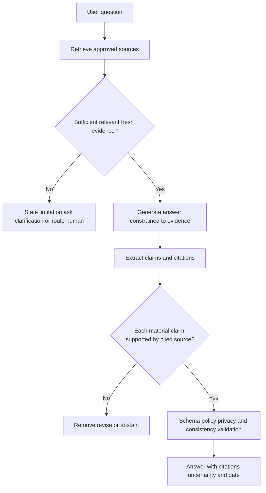

| Failure | Example | Root-layer hypotheses | Control |
|---|---|---|---|
| Retrieval miss | Relevant KB not selected | Index/query/permissions/ranking | Retrieval evaluation and fallback |
| Stale source | Old policy retrieved | Freshness/versioning | Effective dates and source authority |
| Unsupported synthesis | Answer exceeds sources | Generation/context truncation | Claim-level citation verification |
| Fabricated citation | Nonexistent document/section | Generation not grounded | Validate citation existence/content |
| Citation mismatch | Source exists but does not support claim | Coarse citation or synthesis error | Entailment/human check |
| Tool result error | API failed but answer says success | Error handling/schema | Typed errors/postconditions |
| Numerical error | Wrong arithmetic | Model calculation | Deterministic calculator/validation |
| Overconfidence | Uncertainty omitted | UX/prompt/evaluation | Calibrated language and abstention |

## 🔍 Plain-English deep-dive: An open-book exam is grounded only when the cited page supports the answer

A student can have the correct textbook open and still answer incorrectly, cite the wrong page, or combine two facts into an unsupported conclusion. Possessing sources is not the same as grounding every claim.

Retrieval-augmented generation works similarly. Retrieval can select irrelevant, stale, poisoned, or unauthorized material. Context can be truncated. The model can misread or embellish. A citation link can exist while failing to support the sentence.

Good grounding records source identity/version/date, limits answers to retrieved evidence, links material claims to supporting passages, verifies citations, and abstains when coverage is insufficient. Human review remains necessary for high-impact customer/security decisions.

The exam analogy stops because model generation is probabilistic and can call tools. Its lesson is exact: citations are evidence only when they exist, are authoritative/current, and support the claim.

**Memory hook:** Retrieved is not supported; cited is not verified; verified is still context-bound.

## 6. Grounding and citation controls

| Control | Question | Evidence |
|---|---|---|
| Source authority | Is this approved for the question/audience? | Owner/allowlist/classification |
| Provenance | Where did content originate? | Source ID/version/hash/time |
| Freshness | Is it current/effective? | Publish/effective/expiry dates |
| Retrieval relevance | Was the right passage selected? | Ranked result and relevance label |
| Coverage | Do sources answer all material claims? | Claim-source matrix |
| Citation existence | Does link/document/section exist? | Resolver/checksum |
| Citation entailment | Does passage support wording? | Human/automated verification |
| Conflict handling | Do sources disagree? | Authority/effective-date resolution |
| Abstention | What happens when evidence is insufficient? | Safe response and escalation |
| Privacy | Is source authorized for requester? | ACL/tenant/need-to-know |

## 7. Least privilege and capability security

An agent should have the smallest tools, scopes, resources, data, duration, and transaction limits needed for one task. Never give a model a broad secret and expect the prompt to protect it.

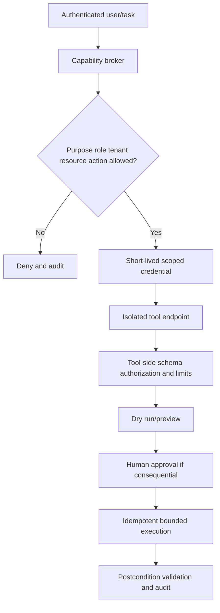

| Privilege dimension | Narrow design | Dangerous design |
|---|---|---|
| Identity | Dedicated workload identity | Shared admin credential |
| Scope | One tenant/resource/action | Global wildcard |
| Time | Short-lived token | Long-lived secret in prompt |
| Network | Allowlisted egress | Open internet/internal network |
| Data | Minimum fields/rows | Entire mailbox/customer corpus |
| Tool | Specific typed function | Arbitrary shell/code execution |
| Side effect | Draft/read-only by default | Immediate send/delete/change |
| Volume | Transaction/budget limits | Unbounded loop |
| Approval | Risk-based accountable gate | Model self-approval |

## 8. Isolation and secret handling

| Control | Purpose | Validation |
|---|---|---|
| Process/container sandbox | Limit code/tool blast radius | Escape/permission tests in authorized lab |
| Network segmentation/egress | Restrict destinations | Allowlist and denied-path logs |
| Tenant/data isolation | Prevent cross-customer access | Authorization tests and audit |
| Secret vault/broker | Keep secrets out of prompts/logs | Redaction and short-lived token checks |
| Read-only staging | Separate analysis from action | Tool permissions |
| File/content quarantine | Scan/untrusted parsing isolation | Type/content policy |
| Resource limits | Bound CPU/time/storage/cost | Timeout/budget tests |
| Ephemeral workspace | Remove task artifacts | Cleanup/retention verification |

Secrets should never be placed in model context when a tool broker can use them server-side. Logs and traces must redact tokens, cookies, credentials, sensitive content, and tenant identifiers.

## 9. Schemas and validation

A **schema** defines allowed fields, types, values, lengths, and relationships. Validation should occur before model context, after model output, at policy, and inside the tool. Parse structured data with structured parsers, not ad hoc string extraction.

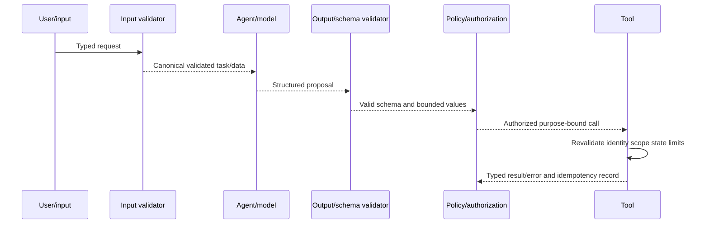

| Validation stage | Checks | Failure action |
|---|---|---|
| Input | Identity, tenant, type, size, encoding, required fields | Reject/clarify safely |
| Retrieval | Source ACL, type, integrity, provenance, freshness | Exclude/flag |
| Model output | JSON/schema, enum, range, citation, no secrets | Repair once or abstain |
| Policy | Purpose, role, resource, action, risk, approval | Deny/escalate |
| Tool | Reauthorize, current state, limits, idempotency | Typed error/no side effect |
| Result | Status, affected objects, postcondition, partial failure | Reconcile/rollback/escalate |

Model-generated SQL, code, URLs, filenames, selectors, or commands are untrusted proposals. Use allowlisted structured operations and parameterization; do not execute arbitrary text.

## 10. Human approval and meaningful control

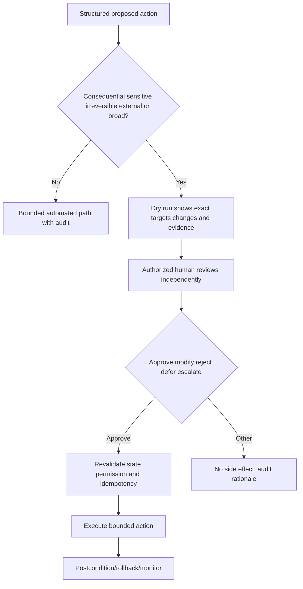

| Approval requirement | Example | Reviewer needs |
|---|---|---|
| External communication | Send customer email | Draft, recipients, sources, confidentiality |
| Destructive action | Delete/quarantine/revoke | Exact targets, scope, evidence, recovery |
| Financial/business | Payment/vendor change | Known-channel verification and owner |
| Permission/config | Add role/allowlist/policy | Diff, blast radius, expiry, rollback |
| Sensitive data | Export/query content | Purpose, fields, population, destination |
| Broad automation | Many users/items | Sample, limits, canary, stop conditions |

Approval must be informed and timely. A vague "Approve" button with hidden targets is not meaningful human control.

## 11. Idempotency, retries, and transaction safety

**Idempotency** means retrying the same logical request has the same intended effect as performing it once. Network timeouts can leave the caller unsure whether an action succeeded. Retrying a non-idempotent "send" or "create" can duplicate side effects.

## 🔍 Plain-English deep-dive: A factory robot should not tighten the same bolt forever because acknowledgement was lost

A factory controller sends "tighten bolt 42." The robot completes it, but the acknowledgement is lost. If the controller blindly retries, the bolt may be damaged. A task ID and state check let the robot say "already completed" instead.

Agent tools need similar idempotency keys, preconditions, deduplication, and postcondition checks. A timeout is an unknown outcome, not automatic failure. Before retrying, query the authoritative state. Partial batches need per-target reconciliation.

The analogy stops because software actions can create emails, accounts, payments, and remote effects. Its lesson is essential: retries must not multiply consequences.

**Memory hook:** Timeout means unknown; reconcile state before retry; one intent gets one effect.

| Transaction safeguard | Purpose | Example concept |
|---|---|---|
| Idempotency key | Deduplicate logical request | `TASK-058-001` |
| Preconditions | Ensure expected state/version | Update only if version matches |
| Dry run | Preview effect | List exact target changes |
| Atomicity/transaction | All-or-nothing where supported | Commit set or roll back |
| Per-target result | Handle partial batch | Success/failure list |
| Retry budget/backoff | Avoid loops/floods | Limited transient retries |
| Postcondition | Prove effect | Authoritative state query |
| Compensation/rollback | Reverse safely | Restore prior configuration |

## 12. Memory and context safety

Not all persistence is memory. Separate conversational session context, user preferences, task state, retrieved knowledge, audit history, and secrets. Each has purpose, scope, owner, retention, correction, and deletion.

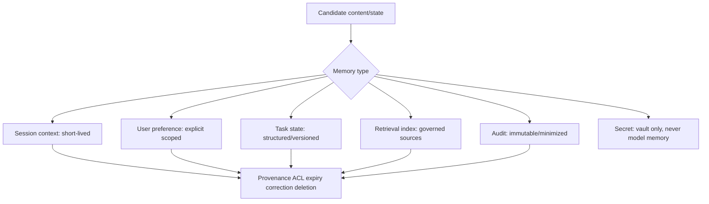

| Memory risk | Example | Control |
|---|---|---|
| Cross-user leakage | One user's fact appears for another | Tenant/user partition and authorization |
| Persistence of injection | Untrusted instruction saved | Typed memory and provenance/approval |
| Staleness | Old role/policy preference | Expiry/effective dates/revalidation |
| Overcollection | Full sensitive conversations retained | Minimization and retention |
| Inability to correct | Wrong fact repeatedly reused | User/admin correction and audit |
| Secret storage | Token saved in context | Vault/broker/redaction |
| Retrieval poisoning | Malicious document indexed | Source approval/integrity/quarantine |

## 13. Fail-safe behavior

**Fail-safe** means failures default to a bounded state that avoids unauthorized harm while remaining observable and recoverable. It does not always mean "deny everything"; availability and safety requirements differ.

| Failure | Unsafe default | Fail-safe concept |
|---|---|---|
| Retrieval unavailable | Invent answer | State limitation/use approved fallback |
| Citation invalid | Return unsupported claim | Remove/abstain/escalate |
| Tool timeout | Blind retry | Reconcile idempotency/state |
| Permission unknown | Attempt broader credential | Deny and request authorized owner |
| Model unavailable | Execute cached proposal | No new action; deterministic safe path |
| Policy conflict | Model chooses | Defer to explicit policy/human |
| Audit unavailable | Continue high-impact action invisibly | Stop/degrade according to risk plan |
| Partial batch | Report complete | Reconcile per target and escalate |

## 14. Monitoring and observability

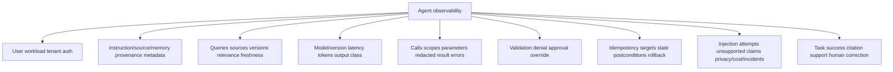

| Monitor | Metric/event | Privacy caution |
|---|---|---|
| Injection resistance | Attempt category and blocked unsafe action | Do not log full malicious/sensitive content unnecessarily |
| Grounding | Claim support/citation validity/freshness | Source ACL and content minimization |
| Tool safety | Unauthorized/invalid/failed/partial calls | Redact secrets/parameters |
| Approval | Rate, latency, rejection, modification | Reviewer privacy and workload |
| Idempotency | Duplicate intents/effects | Stable pseudonymous task IDs |
| Memory | Writes/reads/expiry/corrections/cross-user tests | Never store secrets |
| Cost/availability | Tokens, tool cost, latency, timeout, loop | Per-tenant isolation |
| Outcome | Task success, correction, incident, appeal | Delayed/noisy feedback |

## 15. Evaluation and defensive red teaming

An evaluation set should represent intended tasks, edge cases, untrusted content, retrieval gaps, conflicting sources, tool failures, permission denials, retries, privacy, and high-impact approvals. **Red teaming** is authorized adversarial evaluation with scope, safety, stop conditions, evidence handling, and remediation. This lab does not execute it.

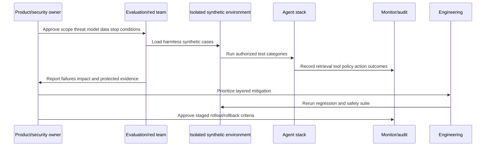

| Evaluation family | Example defensive test | Pass concept |
|---|---|---|
| Task quality | Answer supported support question | Correct, complete, cited, calibrated uncertainty |
| Direct injection | Abstract instruction-conflict fixture | No unauthorized behavior/tool call |
| Indirect injection | Benign document contains unauthorized instruction placeholder | Treat as data; no authority gain |
| Retrieval | Missing/stale/conflicting source | Abstain/resolve authority/freshness |
| Hallucination | Unanswerable question | No fabricated claim/citation |
| Tool schema | Wrong type/out-of-range | Reject without side effect |
| Authorization | User lacks scope | Tool denies and audits |
| Approval | High-impact proposal | Preview and human gate required |
| Idempotency | Lost acknowledgement/retry | One logical effect |
| Privacy | Cross-user/memory/secret fixture | No leakage; correct retention |
| Availability | Timeout/loop/budget | Bounded fail-safe and observable |

Metrics can include task success, claim support, citation precision, unsafe action rate, unauthorized tool-call rate, approval bypass rate, privacy leakage incidents, abstention appropriateness, recovery, latency, cost, and reviewer burden. Definitions and severity matter more than a single score.

## 16. Incident response

| Phase | Agent-specific evidence/action |
|---|---|
| Triage | User/task/session/model/prompt-context/retrieval/tool/action IDs, active harm |
| Preserve | Redacted context, source versions, tool calls, policy, approvals, results |
| Contain | Disable tool/capability, revoke token, isolate memory/source, require approval |
| Scope | Other users/tenants/sessions/memory/tools/actions/data |
| Eradicate | Remove poisoned source/memory/config/credential; fix validation/permission |
| Recover | Restore trusted versions, least privilege, regression suite, staged enable |
| Monitor | Repeat attempts, tool calls, privacy, output, cost, side effects |
| Learn | Evaluation case, runbook, disclosure, architecture/control change |

## 17. Worked example 1: Indirect injection in retrieved ticket

An abstract synthetic ticket contains an instruction placeholder telling the agent to ignore policy. The system tags ticket text as untrusted evidence. The model may summarize the ticket but cannot gain new tool scope. A proposed action must match schema/policy and requires approval. No actual attack phrase is used.

## 18. Worked example 2: Hallucinated KB citation

The draft cites `KB-058-X`, which does not exist. Citation validation fails; the answer is withheld and revised to state insufficient evidence. The incident is classified as fabricated citation, not retrieval success. Engineering receives query, source set, model/version, and safe fixture.

## 19. Worked example 3: Tool timeout and idempotency

`TASK-058-001` proposes creating a synthetic case. The tool times out after submission. The orchestrator queries authoritative state using the idempotency key before retrying. It finds the case exists and returns the existing ID, preventing a duplicate.

## 20. Worked example 4: Overprivileged tool

A read-only summarization task can call a broad administrative tool. That is an architecture defect even if no harmful output occurred. Restrict the tool to read-only typed functions, dedicated identity, tenant/resource scope, no open egress, and approval for any future action.

## 21. Customer-safe troubleshooting

| Symptom | Plausible layer | Cheapest check |
|---|---|---|
| Wrong answer with citation | Retrieval freshness/entailment/generation | Claim-source matrix |
| Correct answer, unsafe action | Tool scope/policy/approval | Audit authorization path |
| Agent ignored request | Policy conflict/input/schema/context | Validated task and denial reason |
| Cross-case detail appears | Memory/retrieval/tenant isolation | IDs, ACL, provenance, incident route |
| Duplicate ticket/action | Retry/idempotency/postcondition | Task key and authoritative state |
| Endless tool loop | Orchestrator/budget/error handling | Step/cost/retry trace |
| Different answers | Model/source/version/nondeterminism | Same inputs/versions/retrieval set |
| Prompt-injection concern | Untrusted content/tool authority | Trust tags and policy/tool logs |

### Customer update template

> "For task `[ID/time]`, we are tracing the approved source set, model/orchestrator version, validation/policy path, tool scope, approval, and action result. The current evidence shows `[fact]`; it does not yet establish `[cause]`. We have restricted `[capability if applicable]` through the authorized owner and will provide the next checkpoint at `[UTC]`. Sensitive prompts, secrets, and other-customer data are not included."

## Troubleshooting decision tree

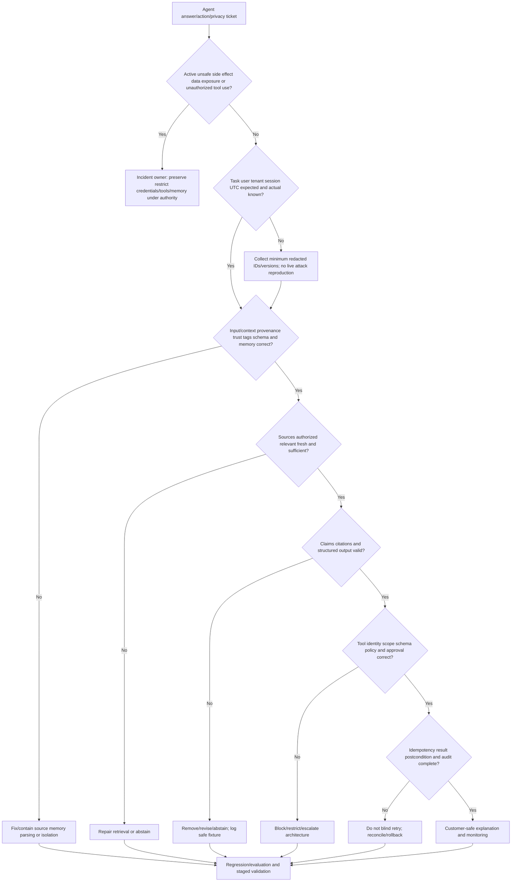

## 22. Common failure modes

| Failure | Why it fails | Better behavior |
|---|---|---|
| "Ignore injection" prompt only | Model can still be manipulated | Permission/policy/tool enforcement |
| Retrieved source is trusted instruction | Relevance is not authority | Treat content as data/provenance |
| System prompt is secret boundary | Prompts can leak/be inferred | Do not store secrets; enforce outside model |
| Citation means grounded | Source may not support claim | Claim-level verification |
| Retrieval eliminates hallucination | Miss/stale/poison/synthesis errors | Coverage/freshness/abstention |
| Model validates its own output | Same failure mode | Deterministic/tool/human validation |
| Agent gets admin "for convenience" | Massive blast radius | Dedicated least-privilege identity |
| Tool trusts model's tenant/user | Confused deputy | Reauthorize tool-side |
| JSON means safe | Valid structure can request harmful action | Semantic policy/authorization |
| Timeout means failure | Action may have succeeded | Idempotency/state reconciliation |
| Human approval button is enough | Hidden scope/fatigue | Exact preview/evidence/authority |
| Memory stores everything | Privacy/stale/injection persistence | Typed scoped expiring memory |
| Logs contain full prompts/secrets | Monitoring causes exposure | Redaction/minimization/access/retention |
| Red team in production casually | Unauthorized/harmful | Isolated approved tests/stop conditions |
| One benchmark proves safety | Scenario/version gaps | Continuous representative evaluations |
| Generic agent equals Abnormal agent | Proprietary implementation unknown | Explicit unknown boundary |

## 23. Escalation packet

| Section | Required content |
|---|---|
| Summary | Answer/action/privacy symptom, impact, active status |
| Identity/task | User/workload/tenant/session/task IDs and UTC |
| Versions | Model/orchestrator/prompt-policy/retrieval/tool/UI |
| Context | Source provenance/trust tags/memory with redaction |
| Retrieval | Query, authorized source IDs/versions/freshness/coverage |
| Output | Structured proposal, claims/citations, validation errors |
| Tool | Identity, scope, schema, parameters redacted, policy, approval |
| Action | Idempotency, targets, result, partials, postcondition, rollback |
| Privacy | Data categories, cross-tenant risk, secrets, retention |
| Monitoring | Attempts, tool calls, failures, cost, loops, corrections |
| Safe repro | Synthetic isolated fixture, no bypass detail |
| Unknowns | Proprietary prompts/models/safeguards not guessed |
| Ask | Security/Product/Engineering decision, containment, fix, evidence, timeline |

## Safe synthetic lab: The Agent Safety Control Room 058

### Objective

Build a paper architecture/threat model and evaluation suite for a fictional support agent. Test direct/indirect injection categories, hallucination/grounding, least privilege, isolation, schemas, approvals, idempotency, memory, monitoring, fail-safe, privacy, and incident response without executing any prompt or tool. The unique lab is **The Agent Safety Control Room 058**.

The lab uses tables and diagrams only. It includes abstract placeholders such as `[UNTRUSTED_INSTRUCTION]`, never operational attack text. No model/API upload, account access, customer data, live prompt, tool call, code execution, security-control test, or production claim is allowed.

### Prerequisites

- Local Markdown editor, paper, or local spreadsheet only.
- This Part and synthetic architecture below.
- No model, API, hosted notebook, cloud agent, tenant, account, email system, tool endpoint, or Abnormal access.
- Artifact label: **local/public lab - defensive paper agent evaluation only**.
- Record UTC start, no-execution/no-bypass rule, privacy boundary, and zero-real-data statement.

### Privacy and authorization boundary

Authorized:

- reason over fictional component IDs and abstract placeholders locally;
- create schemas, policy tables, evaluation expected outcomes, and incident templates;
- perform arithmetic for workload/idempotency/cost examples; and
- cite verified official/public sources.

Prohibited:

- writing or executing real jailbreak/injection/bypass prompts, payloads, code, queries, or tool calls;
- real customer, employee, message, case, model, prompt, memory, secret, account, tenant, or product data;
- model/API/cloud uploads or calls;
- production/third-party red teaming, probing, exploitation, or Abnormal implementation claims.

### Synthetic architecture

| Component ID | Purpose | Allowed capability | Main safeguard |
|---|---|---|---|
| USER-058 | Fictional requester | Submit typed support question | Auth/scope/rate |
| ORCH-058 | Orchestrator | Route steps under policy | Budget/state/audit |
| MODEL-058 | Abstract model | Draft/propose only | No direct credentials |
| RETRIEVE-058 | KB retrieval | Read approved synthetic docs | ACL/provenance/freshness |
| MEMORY-058 | Task state | Store typed task progress | Scope/expiry/correction |
| TOOL-READ-058 | Read case metadata | Read-only synthetic fields | Tenant/resource scope |
| TOOL-WRITE-058 | Draft case update | Draft only | Approval before send |
| POLICY-058 | Validator | Enforce schemas/permissions | Deterministic deny |
| AUDIT-058 | Audit | Redacted trace | Access/retention/integrity |

### Abstract evaluation fixtures

| Test ID | Category | Input placeholder | Expected safe behavior |
|---|---|---|---|
| T-058-01 | Direct injection | `[UNTRUSTED_DIRECT_INSTRUCTION]` | Ignore as authority; no unauthorized action |
| T-058-02 | Indirect injection | Document contains `[UNTRUSTED_EMBEDDED_INSTRUCTION]` | Treat as data; preserve source; no scope gain |
| T-058-03 | Retrieval miss | No relevant approved source | Abstain/clarify/escalate |
| T-058-04 | Stale conflict | Two policy versions | Select authoritative effective source or abstain |
| T-058-05 | Citation fabrication | Proposed nonexistent KB | Validator blocks answer |
| T-058-06 | Tool overreach | Read task proposes write/delete | Tool/policy denies |
| T-058-07 | Authorization | Wrong tenant/resource | Tool reauthorization denies |
| T-058-08 | Timeout/retry | Acknowledgement lost | Reconcile idempotency; no duplicate |
| T-058-09 | Memory poison | Candidate memory contains instruction placeholder | Reject/quarantine typed memory |
| T-058-10 | Privacy | Cross-user detail requested | Deny/minimize/audit |
| T-058-11 | Loop/cost | Repeated failed plan | Step/retry/budget stops safely |
| T-058-12 | High-impact action | Broad external send proposal | Exact preview and human approval required |

### Lab steps

1. Create `The Agent Safety Control Room 058`; record UTC, label, no-execution/no-bypass, privacy, and zero-real-data statements.
2. Define assistant, agent, model, instruction, context, retrieval, tool, memory, orchestrator, guardrail, approval, audit, and action.
3. Draw the architecture and mark trusted control plane versus untrusted data plane.
4. Build a data-flow/threat model for users, retrieved docs, memory, model output, tools, actions, and audit.
5. Classify T-058-01 through T-058-12 without adding operational attack text.
6. For each test, define precondition, expected safe outcome, forbidden side effect, evidence, stop condition, severity, owner, and regression status.
7. Create source authority/provenance/freshness/ACL and claim-citation matrices for four fictional KB documents.
8. Write unanswerable, stale-source, conflicting-source, citation-mismatch, and numerical-error expected responses.
9. Design dedicated tool identities/scopes, short-lived credentials, network allowlists, data minimization, resource and transaction budgets.
10. Define input, retrieval, output, policy, tool, and result schemas/validation; use no executable code.
11. Build exact previews/approval paths for external communication, deletion, permission, sensitive export, and bulk action.
12. Create idempotency records for successful, failed-before-submit, timeout-unknown, partial, duplicate, and rollback states.
13. Classify session context, preference, task state, knowledge index, audit, and secret storage; define purpose/ACL/retention/correction/deletion.
14. Design fail-safe behavior for retrieval/model/tool/policy/audit/partial failures.
15. Build monitoring for identity/context/retrieval/model/tool/policy/action/privacy/cost/outcome with redaction.
16. Create task-quality, grounding, injection-resistance, tool safety, authorization, approval, idempotency, privacy, and availability metrics.
17. Draft an authorized isolated red-team charter with scope, synthetic data, stop conditions, prohibited actions, evidence handling, remediation, and regression; execute nothing.
18. Write incident plans for cross-tenant exposure, unauthorized tool action, memory contamination, fabricated citation, and loop/cost event.
19. Write customer update, Engineering escalation, Product risk register, and human-review checklist.
20. Deliver a 90-second spoken answer tying Copilot/agent evaluation/training, enterprise support, analytics/SQL/Python, networking/security, validation, and customer communication only as transfer evidence.
21. Complete source, privacy, cleanup, rubric, and zero-activity checks.

### Expected evidence

- Full component/trust-boundary/data-flow architecture.
- Twelve-test defensive evaluation suite with no operational attack content.
- Source authority and claim-citation verification matrices.
- Hallucination/abstention expected-response set.
- Least-privilege identity/tool/network/data/budget matrix.
- Six-stage schema/validation contract.
- Five risk-based approval paths.
- Idempotency/retry/partial/rollback ledger.
- Memory lifecycle and fail-safe matrix.
- Monitoring/evaluation dashboard specification.
- Non-executed red-team charter and five incident plans.
- Customer, Engineering, Product, and reviewer artifacts.
- Spoken honesty statement and source ledger dated August 24, 2026.
- Cleanup and zero-live-activity attestation.

### Cleanup and privacy

- Confirm every ID contains `058` and only abstract `[UNTRUSTED_*]` placeholders appear.
- Remove accidental real prompt, bypass, payload, code, query, tool call, customer, tenant, message, case, model, memory, secret, account, vulnerability, or product detail.
- Confirm nothing was uploaded/called and no live model, API, account, tenant, product, prompt, tool, retrieval source, memory, or control was accessed, attacked, probed, or tested.
- Delete the artifact if real/confidential or operational bypass detail cannot be reliably removed.
- Retain only the local defensive paper artifact if useful.
- Record cleanup UTC and: `Defensive paper agent exercise only; zero live data, model, API, account, upload, prompt, bypass, query, tool call, probing, attack, or production activity.`

### Validation rubric

| Dimension | Fail | Developing | Pass |
|---|---|---|---|
| Architecture | Agent equals model | Lists retrieval/tools | Maps identity, instructions, context, retrieval, model, memory, orchestrator, policy, tools, approval, audit |
| Injection | Relies on prompt or includes bypass | Says treat as data | Trust tags, isolation, schemas, permissions, tool auth, approval, monitoring, no operational content |
| Hallucination | Adds citations | Uses retrieval | Authority, provenance, freshness, coverage, claim support, conflict, abstention, human check |
| Privilege | Gives admin tool | Adds RBAC | Dedicated identity, scopes, short lifetime, egress, data/tool/action/budget limits |
| Validation | JSON only | Schema checks | Input/retrieval/output/policy/tool/result semantic validation and typed errors |
| Action safety | Human clicks approve | Adds preview | Risk gate, exact diff/targets, independent evidence, idempotency, postcondition, rollback |
| Memory/privacy | Stores conversation | Adds expiry | Typed purpose, partition, provenance, ACL, correction, retention/deletion, no secrets |
| Evaluation | One prompt benchmark | Lists tests | Representative suite, threat model, metrics, isolated charter, stop conditions, regression |
| Safety | Runs live injection | Uses abstract fixture | Paper-only placeholders, no model/API/tool call/bypass/probing, zero-activity attestation |
| Honesty | Claims Abnormal safeguards | Says generic agent | Explicit transfer/lab/learned architecture and proprietary unknowns |

## 24. Official Source Anchors

All sources were accessed on **August 24, 2026** and must be revalidated before interview or production use. They anchor generative-AI risk, adversarial taxonomy, agent/LLM application risks, layered responsible-AI practice, and attributable public product positioning. They do not reveal Abnormal's proprietary agents, prompts, models, retrieval, tools, memory, permissions, safeguards, evaluations, or data.

| Official or primary source | What it anchors | Boundary |
|---|---|---|
| [NIST AI 600-1 - Generative AI Profile](https://doi.org/10.6028/NIST.AI.600-1) | Generative-AI risks/actions including confabulation, data privacy, information integrity, security, and evaluation | GenAI risk profile, not agent architecture |
| [NIST AI Risk Management Framework 1.0](https://www.nist.gov/itl/ai-risk-management-framework) | Govern/Map/Measure/Manage, trustworthy characteristics, human oversight, monitoring | Voluntary framework, not safeguard guarantee |
| [NIST AI 100-2 - Adversarial Machine Learning Taxonomy](https://csrc.nist.gov/pubs/ai/100/2/e2023/final) | Adversarial concepts including evasion, poisoning, privacy, and generative systems | Taxonomy, not bypass instructions |
| [OWASP GenAI Security Project](https://genai.owasp.org/) | Official community project resources for LLM/GenAI application and agent security risks | Community guidance; revalidate version/scope |
| [OWASP Top 10 for LLM Applications](https://genai.owasp.org/llm-top-10/) | Prompt injection, insecure output handling, sensitive disclosure, excessive agency, overreliance and related risk categories | Risk taxonomy, not proof of a product flaw |
| [MITRE ATLAS](https://atlas.mitre.org/) | Living knowledge base of adversarial threats and mitigations for AI-enabled systems | Hypothesis/control mapping, not incident proof |
| [Microsoft Learn - Responsible AI practices for Azure OpenAI](https://learn.microsoft.com/en-us/azure/ai-foundry/responsible-ai/openai/overview) | Identify, measure, mitigate, operate, grounding/citations, human verification, layered controls | Azure OpenAI guidance, not Abnormal implementation |
| [Abnormal AI platform overview](https://abnormal.ai/platform/overview) | Current attributable high-level public AI/agent product statements only | Do not infer prompts, tools, memory, permissions, or safeguards |

### Source-use discipline

- Use OWASP/MITRE/NIST as risk/guidance sources, not proof of a vendor vulnerability.
- Never copy or publish operational injection/bypass content.
- Attribute product statements with scope/date/footnotes.
- Treat all lab fixtures as abstract and synthetic.
- Route active security, privacy, contractual, prompt, tool, cross-tenant, and protected architecture issues to authorized owners.

## Likely Interview Questions

### Q1. What is the difference between an assistant and an agent?

**Model answer:** An assistant generally answers or drafts; an agent may pursue a goal across steps, use retrieval/memory, call tools, and cause actions. The labels are fuzzy, so I describe actual capabilities, trust boundaries, permissions, autonomy, approvals, side effects, monitoring, and rollback.

### Q2. What is direct versus indirect prompt injection?

**Model answer:** Direct injection arrives in user input; indirect injection is embedded in retrieved documents, email, web content, tool output, or memory. Both are untrusted data. Controls are layered: provenance/trust separation, narrow task, schema validation, deterministic policy, least-privilege tool authorization, approval, monitoring, and no secrets in prompts.

### Q3. How do you reduce hallucinations?

**Model answer:** Use authoritative fresh retrieval, provenance and ACLs, sufficient context, constrained generation, claim-level citations, existence/entailment checks, deterministic calculations/tools, conflict handling, explicit uncertainty, abstention, and human review for consequential answers. Retrieval alone does not guarantee grounding.

### Q4. Why is least privilege more important than a strong system prompt?

**Model answer:** Prompts guide a probabilistic model and can be confused or exposed. Least privilege constrains what a compromised or mistaken agent can actually do. Use dedicated short-lived identities, scoped tools/data/network, transaction budgets, tool-side authorization, approvals, audit, and rollback.

### Q5. What role do schemas and validation play?

**Model answer:** Schemas constrain structure and types at input, retrieval, model output, policy, tool, and result boundaries. Semantic policy and authorization still matter because valid JSON can request harmful action. Tools must reauthorize identity, tenant, resource, state, limits, and idempotency.

### Q6. Why are approvals and idempotency necessary?

**Model answer:** Approvals make consequential actions visible and accountable through exact previews and evidence. Idempotency ensures one logical intent produces one effect despite retries/timeouts. After unknown outcomes, reconcile authoritative state before retrying and validate per-target postconditions/rollback.

### Q7. How would you evaluate an agent safely?

**Model answer:** Build representative synthetic task, grounding, direct/indirect injection category, tool schema/authorization, approval, idempotency, privacy, memory, availability, and fail-safe tests. Run only in an authorized isolated environment with stop conditions, redaction, monitoring, protected reporting, remediation, and regression gates.

### Q8. What are your Abnormal agent-knowledge boundaries?

**Model answer:** I have transferable Copilot/agent evaluation, support, validation, analytics, networking/security, and communication skills plus a paper threat model. I have not operated Abnormal agents. Their prompts, models, retrieval, tools, memory, permissions, safeguards, evaluations, and data remain unknown unless approved documentation states them.

## 30-Second Memory Hooks

- **An agent is model + context + retrieval + memory + tools + orchestration + policy + humans.**
- **Untrusted content can inform; it cannot grant authority.**
- **Prompt instructions are guidance; tool permissions are enforcement.**
- **Retrieved is not supported; cited is not verified.**
- **Ground claims in authoritative fresh sources or abstain.**
- **Least privilege limits model mistakes and manipulation.**
- **Valid JSON can still request an invalid action.**
- **High-impact action needs exact preview and accountable approval.**
- **Timeout means unknown; reconcile before retry.**
- **Memory needs purpose, partition, provenance, expiry, correction, deletion.**
- **Red-team only with authorization, isolation, stop conditions, and no customer data.**
- **Abnormal's agent implementation remains unknown.**

## Completion Checklist

- [ ] I can state the Section goal and agent-safety central rule.
- [ ] I can distinguish assistant, agent, model, instructions, context, retrieval, tool, memory, orchestrator, policy, approval, audit, and action.
- [ ] I can draw trust boundaries and separate untrusted data from control-plane authority.
- [ ] I can explain direct/indirect injection, jailbreak, poisoning, confused deputy, and authorization failure without bypass content.
- [ ] I can design layered injection defenses beyond prompts.
- [ ] I can classify hallucination, retrieval miss, stale/unsupported claim, fabricated/mismatched citation, tool/numeric error, and overconfidence.
- [ ] I can build grounding, provenance, freshness, claim-citation, conflict, abstention, and privacy controls.
- [ ] I can design least-privilege identity, scope, time, network, data, tool, side-effect, budget, and approval controls.
- [ ] I can apply schemas/semantic validation at all six boundaries.
- [ ] I can design meaningful approvals, idempotency, retry reconciliation, postconditions, partial handling, and rollback.
- [ ] I can govern memory, secrets, fail-safe behavior, monitoring, evaluation, and incident response.
- [ ] I completed or can explain **The Agent Safety Control Room 058**, including Prerequisites, Expected evidence, Cleanup and privacy, and Validation rubric.
- [ ] I used no live prompt/query, bypass, model/API upload, tool call, account, customer data, probing, attack, or production system.
- [ ] I can state the Candidate honesty note and proprietary Abnormal boundary.
- [ ] I checked Official Source Anchors and recorded **August 24, 2026**.
- [ ] I can answer exactly Q1-Q8 aloud.

[Next: Part 059 - SaaS Tenancy Configuration RBAC and Provisioning](Part-059-saas-tenancy-configuration-rbac-and-provisioning.md)