# Part 059 - SaaS Tenancy Configuration RBAC and Provisioning

## Section goal

This Part builds a beginner-first operating model for **Software as a Service (SaaS)** administration. SaaS means software operated by a provider and consumed over a network, usually without the customer managing the underlying application servers. The convenient user interface can hide several distinct control planes: tenant boundaries, organization ownership, environment separation, configuration inheritance, authorization, identity lifecycle, audit, and recovery. A support engineer must make those boundaries visible before changing anything.

The central support question is not merely, “What value appears on this screen?” It is:

> Which object owns the setting, which scope supplies the effective value, which identity is authorized to change it, what changed, who approved it, and how can the prior state be restored safely?

A **tenant** is a provider-defined administrative and data boundary for one customer or customer subdivision. An **organization** is a business or administrative grouping; depending on the product, it may equal a tenant, contain workspaces, or sit above several tenants. A **workspace** is usually a collaboration or workload boundary inside an organization. An **environment** is a lifecycle boundary such as development, test, staging, or production. These terms are not universal standards. Product documentation and actual object identifiers decide their meaning.

This Part also introduces **role-based access control (RBAC)**, where permissions are collected into roles and roles are assigned to identities at defined scopes. It separates a role definition from a role assignment, an identity from a human, and administrative authority from support access. It treats provisioning as a lifecycle rather than a one-time account creation. Finally, it shows how defaults, inheritance, overrides, drift, audit evidence, change control, rollback, and deprovisioning interact.

No instructions in this Part authorize changes in a real tenant. The lab is local, synthetic, and paper based. It uses no customer data, provider account, token, secret, live role, or production configuration.

## Learning outcomes

After completing this Part, you should be able to:

- define SaaS, tenant, organization, workspace, project, account, subscription, environment, region, control plane, and data plane before using them;
- explain why similarly named objects may have different ownership and isolation semantics across products;
- distinguish logical, administrative, identity, billing, configuration, and data-isolation boundaries;
- draw a hierarchy and identify parent, child, peer, inherited, default, explicit, and effective state;
- calculate effective configuration from documented precedence rather than visual assumption;
- separate configuration ownership from the interface through which a value is displayed;
- define RBAC roles, permissions, actions, resources, principals, assignments, scope, conditions, and deny behavior;
- apply least privilege, separation of duties, just-in-time access, review, expiry, and emergency-access controls conceptually;
- distinguish customer administrator, provider operator, support engineer, delegated administrator, auditor, and workload identity boundaries;
- model joiner, mover, leaver, service-account, invitation, suspension, deletion, and recovery lifecycles;
- investigate configuration drift with snapshots, versions, actors, approvals, audit events, and independent validation;
- plan a safe rollback using prerequisites, dependencies, blast radius, canaries, checkpoints, and stop conditions;
- build an evidence packet that does not expose secrets, personal data, tenant identifiers, or unsupported proprietary details; and
- position your Microsoft 365 support and escalation experience as production transfer while labeling generic SaaS architecture and named-vendor behavior honestly.

## JD Mapping

| Supplied role signal | Capability built in this Part | Your transferable evidence | Honesty boundary |
|---|---|---|---|
| Own inbound configuration tickets | Finds owning scope, effective value, actor, change, and rollback path | Several years of enterprise support and fix validation | Do not claim Abnormal configuration ownership |
| Enterprise SaaS ecosystem | Maps tenants, organizations, workspaces, environments, identity, and control planes | SharePoint Online, OneDrive, Sync Client, and Copilot support | Generic terms are not proof of another vendor's model |
| SaaS Security | Connects isolation, least privilege, lifecycle, and audit to risk | Microsoft cloud and security upskilling | No Abnormal SaaS Security implementation claim |
| Complex investigations | Uses timelines, competing hypotheses, state snapshots, and discriminating tests | critical-situation ownership and Engineering/Product escalation | No invented customer incident |
| Customer trust | Minimizes evidence and separates observation from inference | Enterprise customer and partner communication | Never request secrets or unnecessary content |
| API and integration questions | Reasons about object IDs, scopes, assignments, provisioning, and eventual state | REST/JSON and identity fundamentals | No production-scale API claim unless CV supported |
| Recommendations and RCA insights | Separates trigger, cause, contributing conditions, and control gaps | Fix validation, case-quality work, and KB/training | A rollback is not automatically a root cause |
| Cross-functional collaboration | Produces exact scope, expected/actual state, timeline, and explicit ask | Product/Engineering collaboration | Internal implementation remains unknown |

## Candidate honesty note

| Evidence tier | Safe statement | Do not imply |
|---|---|---|
| **Production transfer** | “In enterprise support, I investigated tenant-scoped behavior, customer configuration, identity context, service evidence, and validated fixes.” | That every Microsoft object maps directly to Abnormal or another SaaS product |
| **Local/public lab** | “I built a synthetic tenancy, RBAC, provisioning, drift, and rollback workbook using fictional IDs.” | That the workbook changed or tested a production platform |
| **Learned architecture** | “I use a vendor-neutral hierarchy and effective-state method, then verify product-specific semantics in official documentation.” | That tenant, org, workspace, project, or environment are interchangeable |
| **No direct experience** | “I have not administered Abnormal AI, Okta, Google Workspace, Slack, Zoom, Splunk, CrowdStrike, or Cortex SOAR in production.” | Hidden hands-on experience or privileged access |
| **Unknown proprietary detail** | “Abnormal's exact tenancy, isolation, role catalog, support-access path, configuration precedence, provisioning workflow, and rollback implementation are unknown unless approved documentation states them.” | Architecture inferred from a label, screenshot, or marketing page |

Safe interview language:

> “My production transfer is enterprise support: I am used to confirming tenant identity, scope, configuration, change history, service state, and customer impact before acting. For a new SaaS product, I would verify its object model and authorization semantics from approved documentation, reproduce only in an authorized non-production scope, preserve before-and-after evidence, and state clearly that my generic lab is learned architecture rather than platform operations.”

## 1. SaaS administration starts with boundaries

SaaS customers share provider-operated infrastructure to varying degrees. **Multitenancy** means a service supports multiple customer populations while enforcing defined separation. It does not tell us whether every layer is shared. Compute, storage, encryption keys, indexes, queues, regions, or administrative systems may have different designs. Support should describe only documented boundaries.

A **control plane** manages identity, policy, configuration, and lifecycle. A **data plane** performs workload operations or handles customer content. A settings page is usually a control-plane interface, but a setting may take time to propagate into the data plane. This distinction explains why “the portal shows the new value” and “the workload behaves according to the new value” can both be true at different moments.

| Boundary type | Plain meaning | Question to ask | Evidence |
|---|---|---|---|
| Administrative | Who can manage the object? | Which role at which scope authorizes this action? | Role assignment and audit event |
| Identity | Where are identities represented? | Which directory, principal, or federation owns authentication? | Issuer, object ID, assignment |
| Configuration | Where does policy apply? | Parent, child, default, override, or exception? | Effective-state explanation |
| Data | Which customer data is separated? | What documented isolation boundary applies? | Approved architecture statement |
| Workload | Which jobs/resources share execution? | Is behavior regional, environmental, or tenant specific? | Resource/environment IDs |
| Billing | Who purchases and pays? | Does subscription ownership imply admin authority? | Contract/subscription owner |
| Support | Who may observe or intervene? | Is access customer-approved, time-bound, and audited? | Case, approval, access event |
| Lifecycle | Who creates, changes, suspends, and deletes? | What is source of truth and recovery window? | Provisioning/audit record |

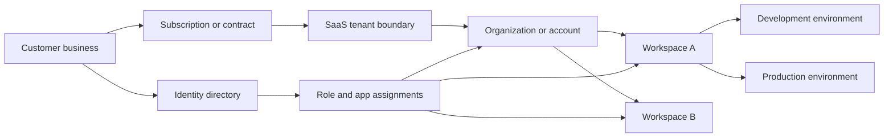

The diagram is a reasoning model, not a claim about Abnormal or any named product. A real product may omit, rename, combine, or multiply these layers.

## 🔍 Plain-English deep-dive: A tenant is like a secured office lease, not the whole corporation

Imagine a corporation leasing offices in a provider-operated building. The building owner runs elevators, power, and physical security. One leased office has its own badge list, rooms, filing rules, and managers. That office resembles a tenant. The corporation may lease several offices for regions or subsidiaries; therefore, the corporation and tenant are not necessarily the same thing.

A workspace resembles a room or department inside an office. An environment resembles separate model rooms used for testing and live customer work. A subscription resembles the commercial agreement paying for space. A directory resembles the badge authority. None of these automatically proves who owns a particular document or setting.

The analogy stops because SaaS isolation is implemented through software, identity, policy, encryption, and provider operations rather than walls. Some services use shared infrastructure with logical isolation; others dedicate components. The lesson is to identify the documented boundary and object ID, not infer isolation from a friendly display name.

**Memory cue:** Business boundary, billing boundary, identity boundary, and data boundary may be four different lines.

## 2. Tenant, organization, workspace, and environment vocabulary

| Term | Beginner definition | Common purpose | Dangerous assumption |
|---|---|---|---|
| Tenant | Provider-defined customer administration/data boundary | Isolate identities, configuration, or data | Tenant always equals legal company |
| Organization/org | Business or management container | Group members, policies, and workspaces | Org is always above tenant |
| Account | Ambiguous container or identity record | Commercial, admin, or user context | “Account” identifies one object type |
| Workspace | Collaboration or workload container | Separate teams, data, or settings | Workspace is a security boundary by default |
| Project | Work grouping for resources | Delegate and organize work | Project inherits every setting |
| Environment | Lifecycle or deployment boundary | Dev/test/stage/prod separation | Environment is isolated from production data |
| Subscription | Commercial entitlement | Features, limits, support, billing | Subscription owner is technical admin |
| Region | Geographic service location | Residency, latency, resilience | Region displayed equals every data location |
| Instance | Deployed copy or runtime object | Execute workload | One tenant has one instance |
| Cell/shard | Provider infrastructure partition | Scale and fault isolation | Customer can administer it |

Record both stable identifiers and display names. Display names can change, collide, be localized, or be copied. A support timeline should prefer a provider-generated tenant, organization, workspace, environment, policy, role, assignment, and change identifier after redaction.

## 3. Ownership and the object graph

**Ownership** means accountable control over an object or decision. Technical ownership can differ from business sponsorship, billing ownership, data ownership, identity ownership, and support ownership. A person who can see a page may not own the setting shown there. A child administrator may manage a workspace but not the inherited organization policy.

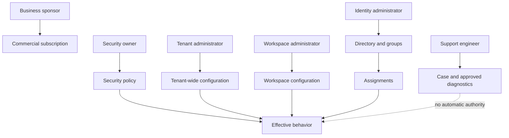

| Ownership role | Owns | Does not automatically own | Support validation |
|---|---|---|---|
| Business sponsor | Outcome and funding | Daily admin or security decision | Named accountable contact |
| Subscription owner | Purchase/renewal | Tenant policy or data access | Contract system, not assumption |
| Tenant admin | Documented tenant settings | Customer business approval | Scoped role and current assignment |
| Workspace admin | Documented workspace settings | Parent policy or peer workspace | Resource scope and inheritance |
| Identity admin | Directory objects/assignments | SaaS internal application policy | Directory audit plus SaaS state |
| Security admin | Security controls/investigation | Billing or unrestricted content | Role/approval and case purpose |
| Auditor | Evidence review | Configuration mutation | Read-only role and export rules |
| Support engineer | Case investigation under policy | Standing customer-admin authority | Case-linked, approved, audited path |

## 4. Isolation is a property to verify, not a synonym for tenant

Isolation can apply to authentication, authorization, storage, queries, encryption, network paths, caches, logs, backups, and operational access. A correct tenant identifier is necessary but not sufficient; every request and background job must preserve the relevant boundary. Support usually validates externally observable behavior and documented controls rather than private implementation.

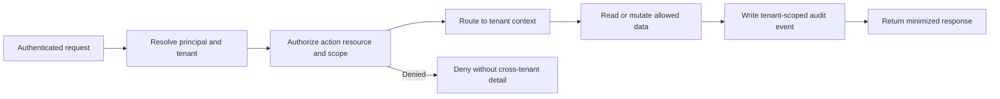

| Isolation question | Healthy concept | Warning signal | Escalation evidence |
|---|---|---|---|
| Identity binding | Principal is bound to intended tenant | Same email assumed to mean same object | Issuer, principal ID, tenant ID |
| Authorization | Server checks action/resource/scope | UI hides button but API accepts action | Redacted request/result and role |
| Query filtering | Tenant context enforced server-side | Client supplies unrestricted tenant field | Safe synthetic reproduction only |
| Cache | Keys include tenant and authorization context | Cross-user result after role change | Correlation IDs and incident route |
| Audit | Event records correct tenant/actor/target | Missing or wrong tenant attribution | Event ID, UTC, object IDs |
| Support access | Approved, time-bound, auditable | Shared standing admin | Case/approval/access timestamps |

Any suspected cross-tenant exposure is a security and privacy incident, not an ordinary configuration ticket. Preserve minimal evidence, stop unnecessary access, do not reproduce across customer tenants, and follow the authorized incident process.

## 5. Configuration hierarchy

A **configuration hierarchy** arranges scopes from broad to narrow. A parent can supply a value to children through **inheritance**. A **default** is a value used when no applicable explicit value exists. An **override** is an explicit child value that replaces or modifies inherited behavior where the product permits it. **Effective state** is the value actually applied after precedence, conditions, exceptions, rollout, and propagation are evaluated.

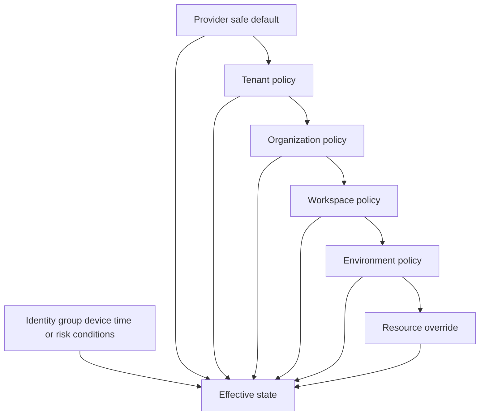

The diagram shows candidate inputs, not a universal “last one wins” rule. Some systems merge lists, apply explicit deny, choose the most restrictive value, evaluate ordered policies, or stop inheritance. Product documentation decides precedence.

| State word | Meaning | Example question | Evidence needed |
|---|---|---|---|
| Default | Used when nothing more specific applies | Which version introduced this default? | Versioned documentation/config |
| Inherited | Supplied by ancestor scope | Which parent and policy ID? | Hierarchy path |
| Explicit | Directly set on this object | Who set it and when? | Audit event/change record |
| Override | Child value replaces/adjusts parent | Is overriding allowed? | Precedence rule and child setting |
| Exception | Narrow exclusion/addition | Which subject/resource matches? | Condition and membership |
| Effective | Final applied value | Why does behavior differ from display? | Evaluation trace/data-plane proof |
| Pending | Accepted but not applied everywhere | What propagation expectation applies? | Operation status and timestamps |
| Drifted | Actual state differs from approved baseline | Is difference authorized? | Baseline, actual snapshot, change history |

## 🔍 Plain-English deep-dive: Effective configuration is a family recipe with substitutions

A family recipe says “use olive oil by default.” A regional version says “use sunflower oil.” A child with an allergy has an approved substitution. The label on the original recipe does not reveal what will be served to that child. You must follow the recipe hierarchy, identify substitutions, and inspect the final dish.

SaaS configuration behaves similarly. A tenant default may be inherited by a workspace. An environment can have an explicit value. A group exception can apply only to selected users. A staged rollout can expose a new value to a percentage or ring. The page currently open may show one layer rather than the effective result.

The analogy stops because software precedence can merge sets, apply deny rules, or evaluate dynamic conditions. The support lesson remains: write the hierarchy and precedence in a table, calculate the expected effective value, then verify observed behavior independently.

**Memory cue:** Displayed state is one input; effective state is the evaluated outcome.

## 6. Computing effective state safely

Use a deterministic worksheet rather than intuition:

1. Identify the affected principal, resource, action, tenant, workspace, environment, and UTC time.
2. Capture the product/version and feature/rollout context.
3. List every candidate policy and source scope.
4. Record whether each value is unset, default, inherited, explicit, exception, deny, or pending.
5. Apply documented precedence and condition logic.
6. Record expected effective state and uncertainty.
7. Verify through an authoritative effective-state view or harmless behavior test.
8. Compare control-plane change time with data-plane application time.

| Order | Scope | Candidate value | State | Condition | Expected contribution |
|---:|---|---|---|---|---|
| 1 | Provider | Enabled | Default | All tenants | Applies only if no stronger rule |
| 2 | Tenant `TEN-059` | Enabled | Explicit | Entire tenant | Candidate parent value |
| 3 | Workspace `WS-059-B` | Disabled | Explicit override | Workspace B | Replaces tenant if allowed |
| 4 | Group `GRP-059-REVIEW` | Enabled | Exception | Member and production | Applies to matching members if higher precedence |
| 5 | Resource `RES-059-7` | Unset | None | N/A | Adds nothing |
| Result | Effective | Unknown until precedence verified | Calculated | User/resource/time | Must be tested/documented |

Do not present the example result as universal. A good answer explicitly says, “If documented precedence places the group exception above the workspace override, the expected result is enabled; otherwise it remains disabled. I would verify the product rule and effective-state evidence.”

## 7. RBAC from first principles

**Authorization** decides what an authenticated identity may do. A **permission** represents an allowed operation, often an action on a resource type. A **role definition** groups permissions. A **principal** is an identity that can receive access, such as a user, group, service principal, or workload identity. A **role assignment** binds a principal to a role at a scope. An optional **condition** narrows when the assignment applies.

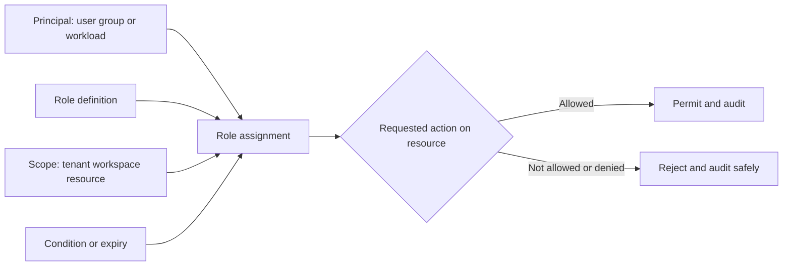

| RBAC element | Plain meaning | Example | Common mistake |
|---|---|---|---|
| Principal | Identity receiving access | Group `GRP-059-ANALYSTS` | Confusing display name with immutable ID |
| Permission | Atomic capability | Read case metadata | Assuming read includes export |
| Role definition | Named permission collection | Case Analyst | Treating role name as proof of contents |
| Assignment | Principal + role + scope | Analysts at Workspace B | Looking only at role definition |
| Scope | Resource boundary | One workspace | Assuming child scope or parent scope behavior |
| Condition | Additional constraint | During approved window | Ignoring time/device/risk context |
| Deny | Explicit prohibition where supported | No export | Assuming every platform supports deny |
| Effective access | Result after all paths | Read allowed, export denied | Checking direct assignment only |

RBAC role names are labels. “Administrator” in one product may be narrower than “Owner” in another. Custom roles can change over time. Always capture the role definition version or permission list relevant to the event.

## 8. Least privilege and separation of duties

**Least privilege** means giving only the access needed for an approved purpose, resource set, and duration. **Separation of duties** means dividing sensitive steps so one identity cannot initiate, approve, execute, and conceal a high-impact action alone. **Just-in-time (JIT)** access is activated only when needed and expires. These controls reduce blast radius but require usable workflows and review.

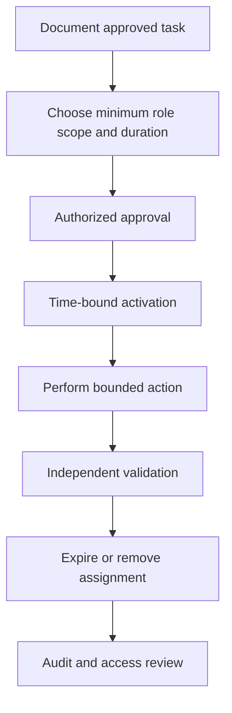

| Control | Purpose | Support check | Failure mode |
|---|---|---|---|
| Narrow role | Limit actions | Permission list | Broad built-in role chosen for convenience |
| Narrow scope | Limit resources | Assignment scope | Tenant-wide role for one workspace issue |
| Short duration | Limit exposure | Start/expiry UTC | Permanent emergency access |
| Group governance | Consistent membership | Owner/review/source | Nested/stale membership grants access |
| JIT activation | Access only when needed | Approval/activation/audit | Activation becomes routine rubber stamp |
| Separation of duties | Prevent unilateral sensitive change | Initiator/approver/executor | Same identity performs all steps |
| Access review | Remove stale entitlement | Last use/business need | Review confirms names without evidence |
| Emergency access | Recover from lockout | Protected/tested/monitored | Shared credential or daily use |

## 🔍 Plain-English deep-dive: A role is a key ring, an assignment is handing it to someone for a building

A key ring bundles keys. It does nothing until handed to a person. Handing a maintenance key ring to Priya for Building B is an assignment: principal Priya, maintenance role, Building B scope. Giving the same ring for every building creates a larger blast radius. Adding an expiry makes the handoff temporary.

The ring's label is not enough. Someone may have added a master key. Priya may also receive keys through a team. A separate “do not enter records room” rule may override part of the ring. Support must inspect the role contents, every assignment path, scope, conditions, group membership, and explicit deny behavior.

The analogy stops because software authorization can be dynamic, inherited, cached, token based, or policy driven. Its useful rule is: role definition plus assignment plus principal plus scope plus conditions determines candidate access; server-side evaluation determines effective access.

**Memory cue:** Role is capability; assignment is who, where, and sometimes when.

## 9. Direct, group, inherited, and workload access

An identity may gain access through several paths. Direct assignments are easy to see but difficult to govern at scale. Group assignments centralize lifecycle, but nested groups and delayed synchronization can hide effective membership. Inherited assignments may flow from parent scopes. Workload identities need owners, purpose, credential strategy, and lifecycle just as humans do.

| Access path | Advantage | Risk | Evidence |
|---|---|---|---|
| Direct user assignment | Simple for exceptional need | Stale one-off access | Assignment ID and expiry |
| Group assignment | Scalable lifecycle | Nested/dynamic membership ambiguity | Group IDs, rule, source, sync time |
| Parent-scope assignment | Consistent delegation | Excess child-resource reach | Scope hierarchy |
| Delegated admin | Distributed operations | Boundary confusion | Delegation contract and role |
| Workload identity | Automation without human account | Orphaned broad privilege | Owner, app ID, scope, credential |
| Emergency identity | Resilience | High-value standing access | Protection, monitoring, tests |

When a user says, “I am an admin,” translate it into evidence: principal ID, tenant, role definition, assignment ID, scope, activation status, group membership, token/session age, and failed action. Authentication success does not prove authorization for the target resource.

## 10. Admin and support boundaries

A customer administrator operates under the customer's authority. A provider operator manages service infrastructure under provider policy. A support engineer investigates cases under a narrower support policy. These personas may use different systems and permissions. Support access should be purpose bound, approved where required, time limited, monitored, and minimized.

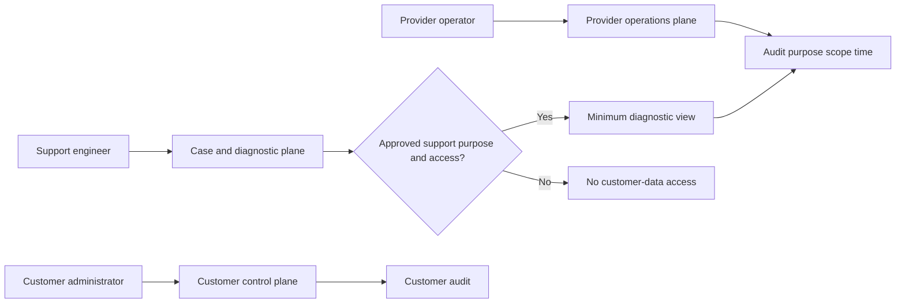

| Persona | Legitimate need | Boundary | Good evidence practice |
|---|---|---|---|
| Customer admin | Configure owned tenant | Customer policy and role | Export minimum redacted state |
| Delegated partner | Manage agreed scope | Contract/delegation/tenant | Identify partner principal and scope |
| Support engineer | Diagnose reported behavior | Case purpose and support policy | Case-linked IDs, no secret collection |
| Provider operator | Maintain service | Internal change controls | Refer to approved incident/change evidence |
| Engineer | Debug/fix implementation | Need-to-know and environment | Synthetic repro before protected data |
| Auditor | Verify control operation | Read-only evidence scope | Integrity, retention, access log |

Never ask a customer to send a password, session cookie, API key, client secret, private key, full bearer token, or unrestricted data export. Prefer correlation IDs, redacted screenshots, object IDs, UTC timestamps, role names plus permission lists, and audit event IDs. Use approved secure transfer for any necessary protected evidence.

## 11. Provisioning is a lifecycle

**Provisioning** creates or updates identities, memberships, assignments, entitlements, and application records. **Deprovisioning** removes or disables access when it is no longer justified. A **source of truth** is the authoritative system for a data element or lifecycle decision. One organization may use a human-resources system for employment status, a directory for identity, and the SaaS application for product-specific roles.

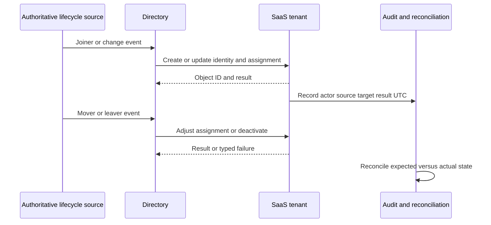

| Lifecycle stage | Expected decision | Typical risk | Validation |
|---|---|---|---|
| Joiner | Create minimum identity/access | Overprovision from broad birthright role | Manager/app-owner approval |
| Mover | Replace obsolete access | New role added while old role remains | Before/after entitlement diff |
| Leaver | Disable/revoke promptly | Active sessions, tokens, ownership remain | Sign-in/session/object checks |
| External guest | Sponsor and expiry | No active sponsor or end date | Periodic review |
| Workload creation | Named owner/purpose/scope | Secret sprawl and orphaning | Inventory and credential policy |
| Suspension | Block access while preserving evidence | Confused with deletion | Status and token/session behavior |
| Deletion | Remove after retention/recovery decision | Irreversible data/ownership loss | Dependency and recovery plan |
| Restore | Re-establish authorized state | Restores stale excessive access | New approval and reconciliation |

## 12. Provisioning and deprovisioning order

Order matters because identities may own resources, approve workflows, hold sessions, or act as integration credentials. A leaver workflow might disable interactive sign-in, revoke sessions, remove assignments, transfer owned resources, rotate shared dependencies, preserve required evidence, and later delete according to policy. The exact sequence is product and policy specific.

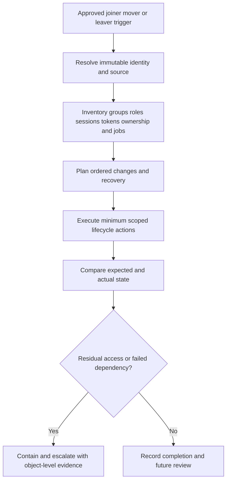

Deprovisioning failure has a high security impact. Never interpret “user removed from one group” as “all access revoked.” Consider direct roles, nested groups, app-local roles, active sessions, refresh tokens, API keys, workload identities, delegated ownership, shared credentials, and delayed synchronization. Part 063 covers SCIM-specific lifecycle behavior in depth.

## 13. Configuration drift

**Configuration drift** is a difference between actual state and an approved, expected, declared, or known-good state. Not every difference is a defect. The baseline may be stale, an emergency change may be authorized, a provider default may have changed, or rollout may be incomplete. Drift investigation must identify authority and time.

| Drift category | Example | Key question | Response |
|---|---|---|---|
| Authorized planned | Approved policy rollout | Did implementation match change? | Validate and close/document variance |
| Authorized emergency | Incident containment change | Was it reviewed and expired? | Retrospective review and cleanup |
| Unauthorized human | Admin changed production directly | Was account compromised or process bypassed? | Contain, audit, investigate |
| Automation defect | Script repeatedly overwrites value | Which identity/version/job? | Disable safely, fix, reconcile |
| Provider default change | New tenants receive new default | Does it alter existing objects? | Verify dated documentation |
| Inheritance change | Parent policy changed | Which children inherited it? | Scope and impact analysis |
| Partial propagation | Control plane updated, data plane mixed | What is expected convergence? | Monitor and escalate if breached |
| Baseline error | Declared state is outdated | Who owns baseline truth? | Correct through governance |

## 🔍 Plain-English deep-dive: Drift is a smoke alarm, not a verdict

A home inventory says the kitchen has four chairs; today there are five. The difference is real, but it does not tell us whether someone bought an approved chair, moved one temporarily, made a counting error, or entered the wrong house. Drift detection identifies a discrepancy. Investigation establishes authority, cause, impact, and correction.

In SaaS support, compare a timestamped approved baseline with a timestamped actual snapshot at the same scope. Confirm product version, default changes, inheritance, pending operations, and actor history. Then decide whether to restore, approve, update the baseline, wait for documented propagation, or escalate.

The analogy stops because software state can be distributed and eventually consistent. Its key lesson is to avoid declaring “unauthorized change” from a diff alone.

**Memory cue:** Drift is difference; governance determines whether the difference is wrong.

## 14. Audit and change evidence

An audit event should help answer who or what acted, what action was attempted, which object was targeted, in which tenant/scope, when, from which source, with what result, and under which correlation or change identifier. Absence of an event is not automatically proof that no change happened; retention, permissions, export latency, logging coverage, or wrong time range may explain it.

| Evidence field | Why it matters | Redaction rule |
|---|---|---|
| Actor principal/object ID | Distinguishes people, apps, and automation | Pseudonymize externally when needed |
| Action | Shows attempted operation | Preserve exact operation name |
| Target object ID/type | Anchors affected resource | Redact tenant-specific values in portfolio |
| Scope/tenant | Prevents wrong-boundary conclusions | Use synthetic IDs outside authorized case |
| Result/error | Separates attempt from success | Preserve code; remove secret-bearing text |
| UTC timestamp | Supports sequence/correlation | Record timezone and clock source |
| Source/client/IP class | Helps identify channel | Minimize personal/network data |
| Correlation/request ID | Joins service evidence | Usually safe after policy check |
| Change/approval ID | Connects governance | Keep internal links restricted |
| Before/after values | Proves state transition | Remove sensitive configuration content |

## 15. Change control and rollback

A safe change has an owner, purpose, scope, risk, dependencies, approvals, tested procedure, validation, rollback conditions, communication plan, and evidence. **Rollback** means restoring a known prior state or applying a compensating change. It is not always possible: data transformation, deletion, external side effects, or incompatible schema changes can make reversal incomplete.

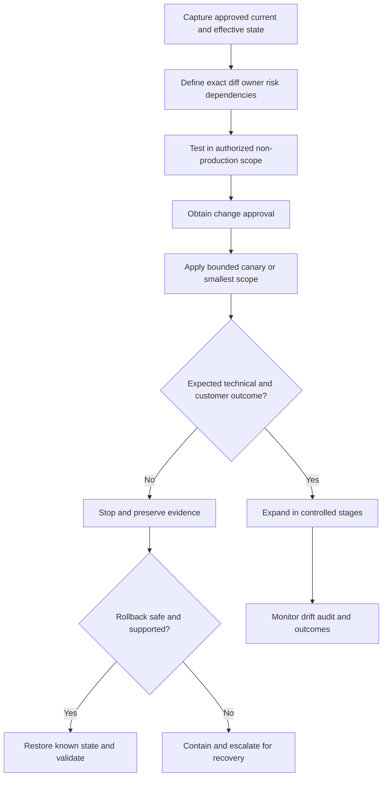

| Change element | Required question | Example evidence |
|---|---|---|
| Purpose | Why is change needed? | Case/change objective |
| Scope | Exact tenants/workspaces/resources? | Immutable ID list |
| Baseline | What is current/effective state? | Timestamped snapshot |
| Dependency | What can break or retain access? | Identity/integration map |
| Approval | Who accepts risk? | Change approval ID |
| Test | What safe check discriminates success? | Non-production result |
| Canary | What smallest cohort goes first? | Ring/object list |
| Stop condition | When do we halt? | Error/impact threshold |
| Rollback | What state and order restore? | Versioned procedure/snapshot |
| Validation | How prove desired outcome? | Independent data-plane evidence |
| Communication | Who needs updates and when? | Stakeholder cadence |

## 16. Worked example 1: Wrong workspace, right-looking name

**Input:** A customer says a policy is disabled in “Finance,” but Finance users still receive the behavior. Two workspaces share the display name “Finance” after a regional migration.

**Reasoning:** First identify tenant, immutable workspace ID, user principal ID, environment, policy ID, and UTC observation. The screenshot came from `WS-059-EU`; the affected users belong to `WS-059-US`. This is an object-selection error, not proof of failed propagation.

**Evidence:** Redacted workspace IDs, membership, policy scope, audit timestamp, and effective-state check. No passwords, tokens, message content, or unrelated users are collected.

**Result:** The customer reviews the correct workspace with an authorized administrator. Support does not copy the EU setting blindly because the US workspace may intentionally differ.

**Caveat:** If the UI selected the wrong workspace despite the correct ID, that becomes a separate product/UI hypothesis with version and correlation evidence.

## 17. Worked example 2: Inherited value mistaken for drift

**Input:** A workspace snapshot shows `retention = 30`, while the approved workspace baseline says the field should be unset.

**Reasoning:** “Unset” can mean inherit. The tenant parent has an explicit value of 30. The effective workspace value therefore may correctly be 30 even though the child object has no direct value.

**Evidence:** Parent-child hierarchy, parent policy ID, child raw state, documented precedence, audit event for the parent change, and effective-state output.

**Result:** No child drift exists. Governance checks whether the parent change was authorized and whether all inheriting children were included in impact review.

**Caveat:** If the product materializes inherited values into children, raw snapshots may look explicit. Confirm representation semantics.

## 18. Worked example 3: Admin cannot change one resource

**Input:** An administrator can edit most workspaces but receives a denial on one production workspace.

**Reasoning:** Authentication is already successful. Compare role assignments, scope, activation, group path, deny/condition, resource ownership, and token/session age. The user's role is assigned at a development folder, not the production workspace.

**Evidence:** Principal ID, role definition, assignment ID, scope path, failed action, error code, request/correlation ID, and UTC. Do not request a token.

**Result:** The application owner decides whether production access is justified. Support does not recommend tenant-wide admin as a shortcut.

**Caveat:** If a correct new assignment exists, stale token claims or authorization cache may be a separate documented propagation hypothesis. Reauthentication is a test, not a universal fix.

## 19. Worked example 4: Mover retains old role

**Input:** A user moved from Billing to Security. A group-driven process added the new role but an old direct assignment remained.

**Reasoning:** Compare all effective assignment paths, not just current group membership. Determine source of truth, assignment owner, creation actor, last use, and required separation of duties.

**Evidence:** Synthetic principal `USR-059-17`, old direct assignment, new group assignment, before/after entitlement diff, and reconciliation result.

**Result:** The authorized owner removes the obsolete direct assignment, validates loss of old capability and preservation of new work, and records why the mover process missed it.

**Caveat:** Removing access can interrupt ownership or scheduled work. Dependency review precedes change.

## 20. Worked example 5: Portal success but behavior remains old

**Input:** A configuration update returned success at 10:00 UTC; at 10:03 the workload still behaves according to the old policy.

**Reasoning:** Separate write acceptance, control-plane readback, propagation operation, cache/token state, data-plane evaluation, and client observation. Check documented convergence expectation and operation status. Do not repeat changes blindly.

**Evidence:** Change ID, accepted timestamp, current control-plane value, operation state, harmless test result, client/session context, and correlation IDs.

**Result:** If within documented propagation, monitor with a checkpoint. If beyond it, escalate with one clean timeline and no repeated toggles.

**Caveat:** A different policy may override the changed value; propagation should not become the default explanation.

## 21. Customer-safe intake

Ask for the minimum facts needed to choose a layer:

| Intake field | Customer-safe question | Why |
|---|---|---|
| Impact | Who/what is affected and what cannot be done? | Severity and scope |
| Boundary | Which tenant/org/workspace/environment IDs? | Prevent wrong-object work |
| Identity | Which redacted principal/object ID and role path? | Authorization analysis |
| Expected | What documented or approved behavior is expected? | Establish baseline |
| Actual | Exact result/error, not interpretation? | Preserve observation |
| Time | First/last seen in UTC? | Audit and change correlation |
| Change | What changed, by whom, through which path? | Trigger hypotheses |
| Effective state | Is evidence raw, displayed, or evaluated? | Hierarchy reasoning |
| Reproduction | Smallest authorized harmless check? | Discriminate safely |
| Evidence | Correlation/audit/change IDs available? | Cross-layer trace |

## Troubleshooting decision tree

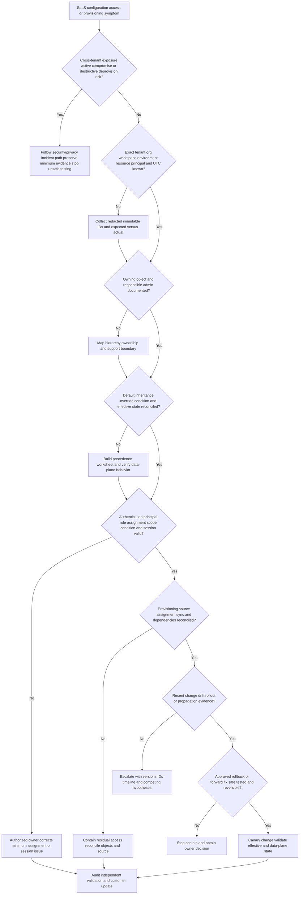

## 22. Common failure modes

| Failure mode | Why it misleads or harms | Better action |
|---|---|---|
| Treating org and tenant as synonyms | Product hierarchy may differ | Verify object model and IDs |
| Using display name only | Names collide or change | Capture immutable redacted ID |
| Assuming tenant means dedicated infrastructure | Isolation design is undocumented | State only approved architecture |
| Reading one settings page as effective state | Inheritance/conditions/rollout may apply | Calculate and independently verify |
| Assuming unset means disabled | Unset may inherit/default | Check representation and precedence |
| Assuming child always overrides parent | Deny/restrictive/ordered rules may differ | Use documented algorithm |
| Granting global admin to test | Expands blast radius and corrupts evidence | Minimum scoped authorization test |
| Checking only direct role | Group/inherited/workload paths remain | Enumerate all effective paths |
| Trusting role name | Custom contents/version may differ | Capture permission list/version |
| Asking for a token or secret | Creates security exposure | Use IDs, errors, claims metadata, audit |
| Removing user from one group as deprovision | Sessions/direct roles/apps may remain | Full lifecycle reconciliation |
| Deleting before dependency review | Ownership/data/recovery can break | Suspend, inventory, transfer, then decide |
| Repeating a timed-out change | Can duplicate or oscillate state | Query authoritative operation/state |
| Calling every difference drift | Baseline/default may be wrong | Establish authority and time |
| Rolling back without checking schema/dependencies | Prior state may no longer be valid | Test supportability and compensation |
| Treating rollback as RCA | Restored state does not explain cause | Continue trigger/control analysis |
| Reproducing cross-tenant issue | Risks further exposure | Incident route; no unsafe reproduction |
| Claiming Abnormal's internal model | Generic architecture becomes fiction | Preserve explicit proprietary unknowns |

## 23. Escalation packet

| Packet section | Required content |
|---|---|
| Summary | Customer impact, affected capability, active risk, current containment |
| Boundaries | Redacted tenant/org/workspace/environment/resource IDs |
| Identity | Principal type/ID, directory/issuer context, no credentials |
| Authorization | Role definition/version, assignment, scope, condition, activation |
| Configuration | Raw values, hierarchy, defaults, inheritance, overrides, effective result |
| Lifecycle | Source of truth, provisioning job/event, expected and actual objects |
| Change | Actor, channel, approval/change ID, before/after, UTC timeline |
| Service | Product/version, feature/ring, operation and correlation IDs |
| Reproduction | Authorized smallest synthetic/non-production check |
| Hypotheses | Ranked, each with supporting and contradicting evidence |
| Safety | Data minimization, secret redaction, no cross-tenant testing |
| Ask | Exact Engineering/Product/Security decision or evidence needed |

## Safe synthetic lab: The SaaS Boundary and Drift Observatory 059

### Objective

Build a local paper workbook for a fictional provider named **Northstar SaaS**. Model two tenants, organizations, workspaces, development and production environments, configuration inheritance, roles, assignments, human and workload identities, joiner/mover/leaver events, drift, audit, change approval, and rollback. The unique lab is **The SaaS Boundary and Drift Observatory 059**.

The lab proves method only. It uses no SaaS account, trial, cloud API, identity provider, Abnormal system, customer data, token, secret, production setting, or live provisioning action.

### Prerequisites

- A local Markdown editor or local spreadsheet.
- This Part and fictional IDs beginning with `TEN-059`, `ORG-059`, `WS-059`, `ENV-059`, `USR-059`, `APP-059`, `ROLE-059`, and `CHG-059`.
- No provider tenant, cloud account, browser session, API client, directory connection, customer export, or credential.
- Artifact label: **local/public lab - synthetic SaaS tenancy and RBAC analysis only**.
- Record lab start UTC, owner, zero-real-data statement, no-live-change statement, and August 24, 2026 source-ledger date.

### Synthetic topology

| Object | Parent | Purpose | Sensitive-data rule |
|---|---|---|---|
| `TEN-059-A` | Provider | Fictional Alpha customer boundary | Synthetic only |
| `ORG-059-A1` | `TEN-059-A` | Alpha business org | Synthetic only |
| `WS-059-FIN` | `ORG-059-A1` | Finance workspace | No real finance data |
| `ENV-059-FIN-DEV` | `WS-059-FIN` | Development | Paper object only |
| `ENV-059-FIN-PROD` | `WS-059-FIN` | Production-labelled simulation | Not real production |
| `TEN-059-B` | Provider | Fictional Beta boundary | Used to test separation on paper |
| `APP-059-SYNC` | `TEN-059-A` | Fictional provisioning workload | No credential exists |

### Role catalog

| Role | Permissions | Intended scope | Prohibited interpretation |
|---|---|---|---|
| `ROLE-059-READER` | Read synthetic metadata | Workspace | No customer content access |
| `ROLE-059-CONFIG` | Read/update selected synthetic settings | Workspace | Not tenant admin |
| `ROLE-059-IDENTITY` | Manage synthetic assignments | Tenant | No authentication bypass |
| `ROLE-059-AUDITOR` | Read synthetic audit | Tenant | No mutation |
| `ROLE-059-EMERGENCY` | Paper recovery capabilities | Tenant, inactive | No real credential/account |

### Lab steps

1. Create the workbook title, artifact label, UTC start, authorization boundary, no-live-system statement, and source date.
2. Draw the two-tenant topology and mark business, billing, identity, configuration, data, support, and lifecycle boundaries.
3. Write definitions for tenant, organization, workspace, environment, subscription, control plane, data plane, ownership, and isolation.
4. Create an object register with immutable ID, display name, type, parent, owner, lifecycle status, region label, and evidence source.
5. Create a configuration register for five settings at provider, tenant, organization, workspace, environment, group, and resource scopes.
6. Assign each value a state: unset, default, inherited, explicit, override, exception, deny, pending, or effective.
7. Define three different precedence models: last-specific-wins, most-restrictive-wins, and ordered-policy. Explain why documentation is required to choose one.
8. Calculate effective state for ten synthetic principal/resource/time cases and record uncertainty.
9. Build role definitions, permission atoms, role assignments, scopes, conditions, owners, approvals, activation, expiry, and review dates.
10. Include one direct assignment, one group assignment, one nested-membership hypothesis, one workload identity, and one inactive emergency role.
11. Create joiner, mover, leaver, external guest, workload-creation, suspension, deletion, and restoration lifecycle records.
12. For the mover, intentionally leave a synthetic direct assignment and detect it through reconciliation.
13. For the leaver, inventory direct roles, groups, app-local assignment, sessions, token concepts, owned resources, scheduled work, and retention decision without creating any credential.
14. Create a known-good baseline and six drift events: planned, emergency, unauthorized-human hypothesis, automation defect, changed default, and partial propagation.
15. Write audit events with actor, action, target, scope, result, UTC, source, request, correlation, and change IDs.
16. Build a change record with purpose, scope, baseline, diff, dependencies, approval, canary, validation, stop condition, rollback, and communication.
17. Simulate a timeout-unknown result; reconcile authoritative paper state before allowing a retry.
18. Simulate a rollback that is unsafe because an owned resource must be transferred; choose containment and escalation instead.
19. Run the troubleshooting decision tree on four cases: wrong workspace, inherited value, denied admin, and stale direct assignment.
20. Produce a redacted customer update and an Engineering escalation with an explicit ask.
21. Deliver a 90-second spoken explanation connecting your prior tenant/configuration support transfer to the learned generic model, with named-platform boundaries.
22. Complete cleanup, privacy review, source verification, and the rubric.

### Expected evidence

- A two-tenant object hierarchy with all boundary types marked.
- An object and ownership register using only fictional `059` identifiers.
- At least five settings across seven candidate scopes with raw and effective state.
- Ten documented effective-state calculations under explicit precedence assumptions.
- A permission/role/assignment/scope/condition matrix.
- Human, group, delegated, workload, emergency, and auditor access paths.
- Eight lifecycle records and a residual-access reconciliation.
- Six classified drift events with baseline, actual, authority, cause hypothesis, and action.
- A synthetic audit timeline and one complete change record.
- A timeout reconciliation and unsafe-rollback decision.
- Four decision-tree case sheets, a customer update, and an escalation packet.
- A source ledger dated **August 24, 2026**.
- A spoken honesty statement distinguishing production transfer, local lab, learned architecture, no direct experience, and proprietary unknowns.

### Cleanup and privacy

- Confirm every tenant, identity, role, assignment, configuration, audit, change, correlation, and case ID is fictional and contains `059`.
- Search for and remove real names, emails, domains, tenant IDs, workspace IDs, account numbers, customer content, IP addresses, URLs, screenshots, tokens, cookies, API keys, client secrets, certificates, and private keys.
- Confirm no browser login, account creation, API request, directory connection, role assignment, provisioning action, or configuration change occurred.
- Replace accidental real evidence with clearly fictional values; delete the artifact if reliable sanitization is impossible.
- Retain only the local workbook if useful, under normal local access and retention controls.
- Record cleanup UTC and: `Synthetic paper SaaS exercise only; zero customer data, credential, provider account, API call, live role, provisioning action, or production change.`

### Validation rubric

| Dimension | Fail | Developing | Pass |
|---|---|---|---|
| Boundaries | Tenant equals company | Lists containers | Separates business, billing, identity, config, data, support, lifecycle |
| Object model | Uses names only | Has parent/child | Uses immutable IDs, types, owners, parents, statuses, evidence |
| Effective state | Reads one page | Lists inheritance | Calculates documented precedence, conditions, rollout, data-plane proof |
| RBAC | Role name only | Lists permissions | Principal + role + scope + conditions + all paths + effective test |
| Least privilege | Uses admin shortcut | Narrows role | Narrows role/scope/time, approval, review, separation, emergency path |
| Lifecycle | Create/delete only | Adds mover/leaver | Reconciles assignments, sessions, ownership, workloads, retention, recovery |
| Drift | Difference equals incident | Compares snapshots | Establishes baseline authority, timeline, actor, cause, impact, correction |
| Change | Toggles setting | Records change | Baseline, diff, dependency, canary, stop, rollback, validation, communication |
| Evidence | Screenshots and claims | Adds IDs | UTC, immutable IDs, audit/correlation, redaction, observation/inference |
| Safety/honesty | Uses live tenant or claims vendors | Says synthetic | Zero live activity and explicit production/learned/proprietary boundaries |

## 24. Official Source Anchors

All sources below were verified for this guide and recorded with the guide currency date **August 24, 2026**. Revalidate changing product documentation before an interview or real administrative decision. These sources anchor general identity/RBAC and Microsoft-specific examples; they do not document Abnormal's proprietary tenancy, role, provisioning, isolation, support access, or rollback design.

| Official or primary source | What it anchors | Boundary |
|---|---|---|
| [NIST Glossary - Least Privilege](https://csrc.nist.gov/glossary/term/least_privilege) | Primary security meaning of restricting privileges to task needs | Principle, not SaaS object model |
| [NIST SP 800-53 Rev. 5](https://csrc.nist.gov/pubs/sp/800/53/r5/upd1/final) | Access control, least privilege, separation of duties, audit, configuration, and system controls | Control catalog; tailoring required |
| [Microsoft Learn - Overview of Microsoft Entra RBAC](https://learn.microsoft.com/en-us/entra/identity/role-based-access-control/custom-overview) | Microsoft role definitions, assignments, principals, scopes, access review, and audit examples | Microsoft Entra behavior only |
| [Microsoft Learn - What is Microsoft Entra?](https://learn.microsoft.com/en-us/entra/fundamentals/what-is-entra) | Current enterprise identity/access product-family context and tenant references | Product family changes over time |
| [Microsoft Learn - Apps and service principals](https://learn.microsoft.com/en-us/entra/identity-platform/app-objects-and-service-principals) | Application object versus tenant-local service principal concepts | Microsoft identity-platform semantics |
| [OWASP Authorization Cheat Sheet](https://cheatsheetseries.owasp.org/cheatsheets/Authorization_Cheat_Sheet.html) | Deny-by-default, least privilege, authorization validation, and logging guidance | Community defensive guidance, not vendor guarantee |

### Source-use discipline

- Verify exact product terminology, hierarchy, role contents, scope rules, inheritance, support-access procedure, and lifecycle behavior in approved current documentation.
- Separate stable principles from changing feature, licensing, UI, and rollout details.
- Treat screenshots and names as leads; prefer immutable IDs, effective state, and audit evidence.
- Never use a support case to infer or publish private architecture.
- Revalidate every current-product claim after August 24, 2026.

## Likely Interview Questions

### Q1. How do tenant, organization, workspace, and environment differ?

**Model answer:** They are product-defined scopes, not universal synonyms. A tenant is commonly a customer administration or data boundary; an organization is a business/management container; a workspace groups collaboration or workload; and an environment separates lifecycle stages such as development and production. I verify the real hierarchy, immutable IDs, ownership, isolation, and inheritance in official documentation before troubleshooting.

### Q2. What is effective configuration?

**Model answer:** Effective configuration is the state applied after defaults, parent inheritance, explicit values, exceptions, deny rules, conditions, rollout, and propagation are evaluated. I list every candidate source, apply documented precedence, distinguish control-plane display from data-plane behavior, and verify with authoritative effective-state or harmless behavior evidence.

### Q3. Explain RBAC and a role assignment.

**Model answer:** RBAC groups permissions into role definitions. A role assignment binds a principal, such as a user, group, or workload identity, to a role at a scope, sometimes with conditions or expiry. I inspect role contents, every direct/group/inherited path, scope, activation, and effective authorization; a role name or successful login alone is insufficient.

### Q4. How would you apply least privilege during support?

**Model answer:** Start with the approved task, choose the smallest role, resource scope, and duration, require appropriate approval, use read-only diagnostics first, and audit activation and use. For consequential changes, separate requester, approver, executor, and validator where practical. I would never request a customer's secret or recommend global admin merely to test.

### Q5. Why can deprovisioning fail even after a user is removed from a group?

**Model answer:** Access can remain through direct roles, nested groups, app-local assignments, active sessions, refresh tokens, API keys, delegated ownership, or workload identities, and synchronization may be delayed. I reconcile the authoritative leaver event against every access and dependency path, validate residual access, preserve required evidence, and escalate failures with object-level IDs.

### Q6. How do you investigate configuration drift?

**Model answer:** Compare timestamped actual state with an authoritative approved baseline at the same scope. Then check defaults, inheritance, provider/version changes, actor and automation history, rollout, propagation, and baseline freshness. Drift is a difference, not automatically an unauthorized change; governance and evidence determine whether to restore, approve, update, wait, or escalate.

### Q7. What makes a rollback safe?

**Model answer:** A safe rollback uses a known compatible prior state, dependency and blast-radius analysis, approval, a tested ordered procedure, canary scope, validation, stop conditions, and communication. If side effects are irreversible or dependencies changed, I contain and escalate instead of forcing reversal. After rollback, I independently validate outcome and continue root-cause analysis.

### Q8. How does your background transfer without overstating SaaS-platform experience?

**Model answer:** My production transfer is enterprise support: tenant context, customer configuration, evidence-based investigation, critical-situation ownership, Engineering/Product escalation, fix validation, and clear updates. My tenancy/RBAC workbook is a synthetic local lab, and vendor-neutral architecture is learned knowledge. I have not administered Abnormal or the other named ecosystems in production, and I would verify each product's approved model before acting.

## Memory Hooks

- **Names are labels; immutable IDs anchor the case.**
- **Tenant, org, workspace, environment, subscription, and directory are separate until documented otherwise.**
- **Displayed value is not automatically effective behavior.**
- **Default + inheritance + override + condition + rollout = candidate effective state.**
- **Role is permissions; assignment is principal + role + scope + conditions.**
- **Authentication says who; authorization says what, where, and when.**
- **Least privilege narrows action, resource, data, network, and time.**
- **Support access is case-bound authority, not standing customer administration.**
- **Provisioning creates access; reconciliation proves it.**
- **Leaver means roles, groups, sessions, tokens, ownership, and workloads, not one delete.**
- **Drift is a difference, not a verdict.**
- **Rollback restores state; it does not establish root cause.**
- **A cross-tenant signal is an incident boundary, not a reproduction invitation.**
- **prior experience transfers; Abnormal internals remain unknown.**

## Completion Checklist

- [ ] I can state the Section goal and the central ownership/effective-state question.
- [ ] I can define tenant, organization, account, workspace, project, environment, subscription, region, control plane, and data plane.
- [ ] I can separate administrative, identity, configuration, data, workload, billing, support, and lifecycle boundaries.
- [ ] I can explain why product terminology and immutable object IDs must be verified.
- [ ] I can map ownership across business, subscription, tenant, workspace, identity, security, support, and audit roles.
- [ ] I can distinguish default, inherited, explicit, override, exception, effective, pending, and drifted state.
- [ ] I can build a precedence worksheet and verify data-plane behavior.
- [ ] I can define permission, role definition, principal, role assignment, scope, condition, deny, and effective access.
- [ ] I can apply least privilege, separation of duties, JIT, access review, and emergency-access boundaries.
- [ ] I can explain customer-admin, provider-operator, delegated-admin, auditor, workload, and support boundaries.
- [ ] I can model joiner, mover, leaver, guest, workload, suspension, deletion, restore, and reconciliation.
- [ ] I can classify drift without treating every difference as unauthorized.
- [ ] I can collect actor/action/target/result/time/source/correlation/change evidence without secrets.
- [ ] I can plan change, canary, stop, rollback or compensation, validation, and communication.
- [ ] I completed or can explain **The SaaS Boundary and Drift Observatory 059**.
- [ ] The lab includes Prerequisites, Expected evidence, Cleanup and privacy, and Validation rubric.
- [ ] I used only fictional `059` objects and performed zero live account, API, role, provisioning, or configuration activity.
- [ ] I can state the Candidate honesty note and named-platform experience boundaries aloud.
- [ ] I checked the Official Source Anchors and recorded **August 24, 2026**.
- [ ] I can answer exactly Q1-Q8 without exposing sensitive evidence.

[Next: Part 060 - Directories Entra and Okta Concepts](Part-060-directories-entra-and-okta-concepts.md)