# Part 060 - Directories Entra and Okta Concepts

## Section goal

This Part explains an **identity directory** from zero knowledge. A directory is a structured service that stores identity objects and relationships so systems can answer questions such as: Who or what is requesting access? Which organization owns that identity? Which groups, applications, devices, and roles relate to it? Is it active? Which system is authoritative for each attribute and lifecycle event?

A directory is not merely a contact list. It is part of an identity control plane. It can represent human users, external collaborators, devices, applications, service identities, and groups. It can participate in authentication, authorization, application assignment, provisioning, governance, and auditing. It can also synchronize with other directories and applications. A support engineer must identify the exact object, directory boundary, source, target, identifier, lifecycle state, and assignment path before drawing conclusions.

This Part treats **Microsoft Entra ID** as a production-transfer area for Arti because the supplied CV includes Microsoft cloud support and Entra/Active Directory fundamentals. That does not mean every Entra feature was operated directly or that SharePoint/OneDrive support equals tenant-wide identity administration. **Okta** remains a learned architecture and later synthetic-lab target. No Okta production use is claimed. Abnormal's directory integration, identity schema, application objects, group handling, synchronization, and support tools remain unknown unless approved documentation states them.

The central rule is:

> Identify the directory and tenant first; identify the immutable object and its source second; then trace relationships, assignments, synchronization, policy, lifecycle, and logs without treating similar names as equivalent objects.

No live Entra or Okta configuration is performed. The safe lab uses fictional JSON-like records and paper flows only. It contains no real tenant, account, email, token, password, client secret, certificate, device, group, or application assignment.

## Learning outcomes

After completing this Part, you should be able to:

- define identity, account, credential, directory, tenant, object, attribute, schema, identifier, principal, source, target, and synchronization;
- distinguish human, workload, device, and external identities;
- explain users, groups, devices, applications, application registrations, application objects, service principals, managed identities, and enterprise applications at a useful conceptual level;
- separate a software application from its identity configuration and tenant-local application instance;
- distinguish authentication, authorization, app assignment, admin role assignment, consent, and provisioning;
- explain group ownership, source, membership type, dynamic rules, nesting, flattening, and operation-specific transitivity;
- trace joiner, mover, leaver, guest, workload, device, and application lifecycles;
- explain why duplicate display names, reused email addresses, stale objects, and mismatched immutable IDs cause support errors;
- compare Active Directory Domain Services with Microsoft Entra ID without calling either a simple replacement for the other;
- describe current Okta org, Universal Directory, user, profile, group, group rule, app, app user, assignment, and source concepts from official documentation;
- build an Entra-to-Okta concept comparison without claiming one-to-one equivalence;
- investigate assignment, import, synchronization, duplicate-object, and deprovisioning symptoms safely; and
- use precise interview language that distinguishes Arti's Microsoft production transfer from Okta learned architecture and all named-platform gaps.

## JD Mapping

| Supplied role signal | Capability built | Arti evidence | Boundary |
|---|---|---|---|
| Enterprise SaaS ecosystem | Maps directories, principals, groups, applications, and assignments | Microsoft cloud support and Entra/AD fundamentals | No assumption about Abnormal's object model |
| Microsoft 365 | Connects tenant-local identities and apps to Microsoft cloud integrations | SharePoint Online, OneDrive, Sync Client, Copilot | Do not claim full Entra administrator production ownership |
| Okta | Establishes official-doc vocabulary and troubleshooting model | Structured learning in this guide | No direct Okta production use |
| Configuration tickets | Distinguishes source, object ID, assignment, policy, and sync state | Enterprise case ownership and fix validation | No unauthorized tenant changes |
| Onboarding with CSMs | Explains identity prerequisites and ownership | Customer/partner communication and training | Product-specific onboarding remains learned |
| Complex investigations | Uses object graphs and lifecycle timelines | CRITSIT and Engineering/Product escalation | No invented identity incident |
| SaaS Security | Connects external/workload identity, least privilege, lifecycle, and audit | Microsoft and security fundamentals | No Abnormal control implementation claim |
| API/integration questions | Reasons about schemas, IDs, mappings, and state | REST/JSON working knowledge | No production automation claim beyond evidence |

## Candidate honesty note

| Evidence tier | Safe statement | Do not imply |
|---|---|---|
| **Production transfer - Microsoft** | “My Microsoft support background gives me practical familiarity with tenant context, users/groups, cloud service identity dependencies, customer configuration, escalation, and validation.” | Full-scope Entra identity engineering or administration unless a real example supports it |
| **Local/public lab** | “I built a synthetic directory object graph and lifecycle comparison with no live tenant.” | Real Entra/Okta provisioning or assignment changes |
| **Learned architecture - Okta** | “From current official Okta documentation, I can explain orgs, Universal Directory, profiles, groups, apps, assignments, and lifecycle concepts.” | That Arti operated an Okta org or System Log in production |
| **No direct experience** | “I have not administered Okta or Abnormal AI in production.” | Hidden credentials, customer access, or private product knowledge |
| **Proprietary unknown** | “Abnormal's supported directories, schema, sync topology, app objects, group rules, lifecycle behavior, and support-access paths are unknown unless approved documentation says otherwise.” | A generic Entra or Okta pattern is an Abnormal fact |

Safe interview language:

> “I would lean on my Microsoft cloud support background for tenant and identity reasoning, but I would not overstate it as full Entra administration. Okta is a learned area for me: I can map the official concepts and troubleshoot a synthetic object flow, then validate the customer's actual org, source, identifiers, assignments, policies, and logs with an authorized administrator.”

## 1. Identity directory mental model

An **identity** is a representation of an entity in a particular context. An **entity** can be a person, application, service, device, group, or organization. An **account** is a record through which an entity interacts with a system. A **credential** is evidence used to authenticate, such as a password, certificate, key, or token; the credential is not the identity itself.

An **object** is a directory record with a type, immutable identifier, attributes, relationships, state, and timestamps. A **schema** defines permitted attributes and their types. An **attribute** is a named value such as department, status, or display name. A **principal** is an identity that can be authenticated or assigned access in a security context.

| Term | Plain meaning | Example | Common confusion |
|---|---|---|---|
| Entity | Real or logical thing | Person or application | Entity equals one account forever |
| Identity | Representation in a context | User object in one tenant | Same email means same identity |
| Account | System-specific access record | SaaS local user | Account equals credential |
| Credential | Authentication evidence | Certificate or passkey | Credential grants every permission |
| Directory | Stores identity objects/relationships | Cloud identity directory | Directory is only a people list |
| Object | Typed stored record | User, group, device, app | Display name is immutable identity |
| Attribute | Named property | `department=Support` | Attribute is always authoritative |
| Schema | Attribute/type contract | User profile schema | Every connected app uses same schema |
| Principal | Security identity | User or service principal | Every object is a principal |
| Identifier | Value used to distinguish object | Tenant-scoped object ID | Email/UPN is permanently unique |

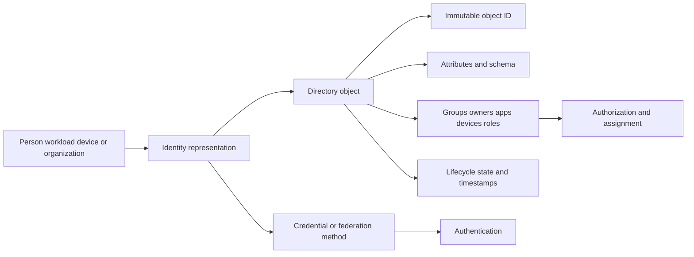

## 🔍 Plain-English deep-dive: A directory is a city registry, not the person

A city registry stores a resident number, legal name, addresses, household relationships, status, and dates. The resident exists independently of the record. The registry may contain an old address, two records created by mistake, or a name shared by many people. The resident number is a stronger anchor than a display name.

A directory works similarly. A person may have objects in an on-premises directory, a cloud tenant, an Okta org, and several applications. Each object can have different identifiers and lifecycle. Synchronization creates relationships between records; it does not make them literally one database row. An email address can change or be reused. A display name can collide.

The analogy stops because digital identities authenticate and receive permissions, while civic records generally do not authorize API calls. The support lesson is strong: identify the authoritative system and immutable object ID at every hop before changing or deleting anything.

**Memory cue:** Person, account, directory object, and credential are four different things.

## 2. Directory and tenant boundaries

In Microsoft documentation, a Microsoft Entra tenant is a dedicated and trusted instance containing resources such as registered applications and a directory of users. In Okta documentation, an Okta org is a root container for users, groups, app integrations, policy, and configuration. These definitions are product specific. “Tenant” and “org” can be useful comparison labels, but they are not a standards-based equivalence.

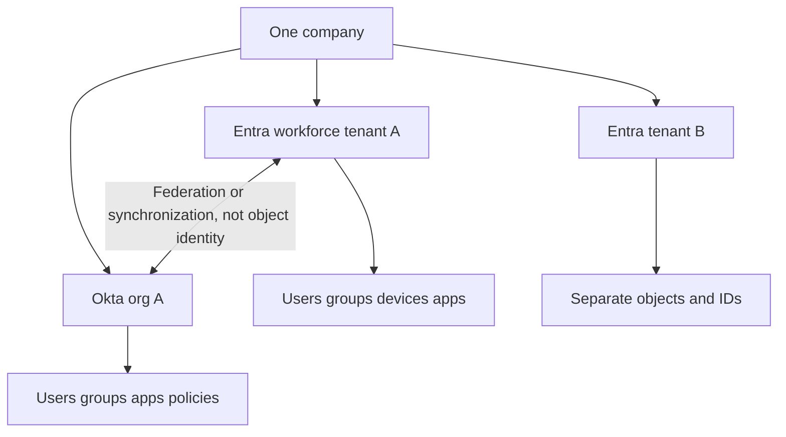

| Boundary question | Microsoft Entra concept | Okta concept | Support caution |
|---|---|---|---|
| Root administrative container | Tenant/directory | Org | Verify exact URL/tenant ID/org ID |
| Human records | User objects | Okta user profiles | Attributes and statuses differ |
| Groups | Security/Microsoft 365 and other group concepts | Okta/imported groups and group rules | Nesting/assignment semantics differ |
| Application representation | App registration/application object and service principal | App integration and app-user profile concepts | Not one-to-one |
| External population | Guest/external identity and external tenant concepts | Sourced/external users depend on design | Verify source and federation |
| Workload identity | Applications, service principals, managed identities | Service accounts/apps and current Okta products/concepts | Use current official scope |
| Audit | Sign-in, audit, provisioning and related logs | System Log and product-specific reports | Retention/licensing change |

## 3. Human, workload, device, and external identities

Identity type changes the lifecycle, authentication method, owner, and evidence. A human can respond to an MFA prompt; a workload usually cannot. A device supplies posture or ownership context but is not the user. An external collaborator may authenticate in a home organization while a resource tenant stores a local representation and authorization.

| Identity class | Represents | Typical owner | Lifecycle trigger | Main risk |
|---|---|---|---|---|
| Workforce human | Employee or internal worker | Manager/HR/identity team | Hire, move, leave | Excess/stale access |
| External human | Guest, partner, contractor, customer | Sponsor/business owner | Invite, contract, expiry | Orphaned access and unclear home identity |
| Workload | App, service, script, automation | Technical/business owner | Deployment, replacement, retirement | Secrets, broad permissions, no owner |
| Device | Managed/registered endpoint | User/IT/organization | Enroll, replace, retire | Stale compliance or duplicate device |
| Group | Collection used for assignment/policy | Group owner/data source | Membership or rule change | Hidden transitive access |
| Emergency identity | Recovery capability | Security leadership | Tested emergency process | Standing high privilege |

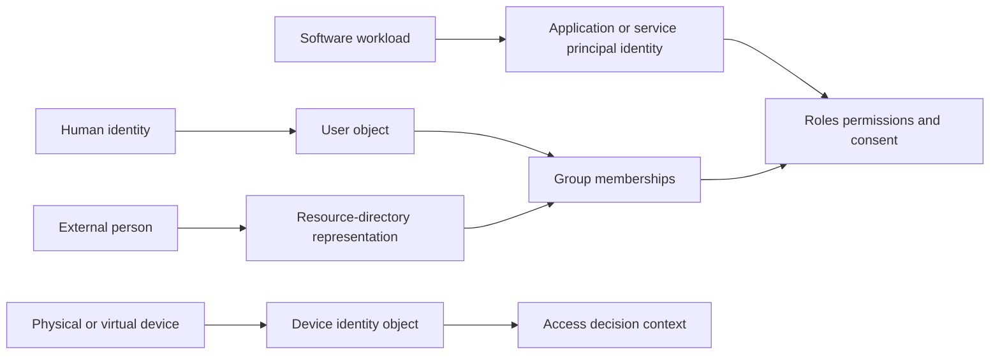

## 4. Users and profiles

A user object typically has identity, contact, organizational, lifecycle, source, and sign-in attributes. Some attributes are authoritative in another system. Support should distinguish a primary directory profile from an application-specific profile created after assignment.

| User field category | Question | Failure example | Evidence |
|---|---|---|---|
| Immutable ID | Which exact object? | Two users share display name | Object ID |
| Sign-in identifier | What identifier is accepted? | Renamed UPN/login | Current and historical identifiers |
| Source | Where is object mastered? | Cloud edit overwritten by sync | Source/authority metadata |
| Status | Active, suspended, deactivated, deleted? | Portal lists user but sign-in blocked | Lifecycle status/time |
| Profile | Which attributes exist? | Required target attribute empty | Schema and mapping |
| Type | Member, guest, contractor, custom type? | Wrong policy applies | Type/source evidence |
| Relationships | Groups, manager, owner, app assignments? | Direct assignment overlooked | Relationship IDs |
| Authentication | Which home/issuer/factor? | Wrong tenant or federation route | Sign-in metadata, not secrets |

Microsoft Entra user objects and Okta user profiles have different schemas and state models. Current Okta documentation distinguishes the central Okta user profile from an **app user profile** created for a specific assigned application. That distinction helps explain why a value can be correct in the central profile but wrong in the downstream app profile.

## 5. Groups, rules, nesting, and transitivity

A **group** collects principals so access, licenses, apps, or policy can be assigned at scale. A **static group** has explicit membership. A **dynamic group** or **group rule** computes membership from attributes or conditions. A **nested group** contains another group. **Transitive membership** means membership through one or more nested relationships.

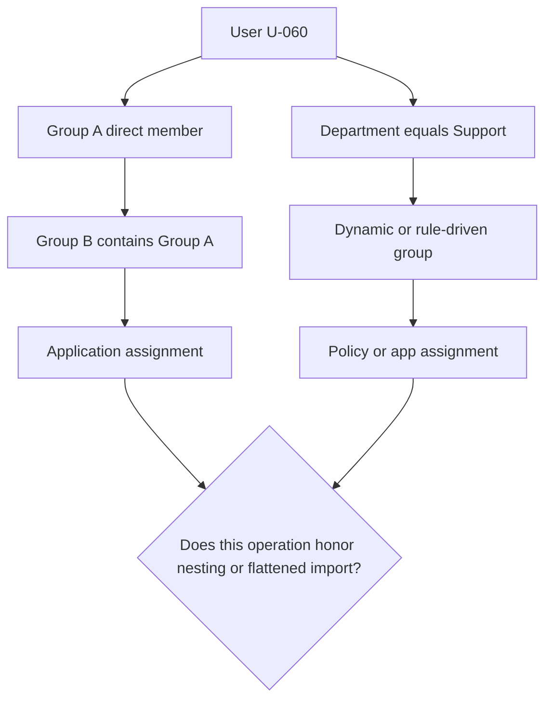

| Membership concept | Meaning | Troubleshooting question | Caution |
|---|---|---|---|
| Direct | User explicitly listed | Which actor/source added it? | May survive role change |
| Dynamic/rule | Computed from attributes | Which attribute and evaluation time? | Wrong source data drives access |
| Nested | Group inside group | Does this specific operation traverse nesting? | “Directory supports nesting” is too broad |
| Transitive | Indirect path | Which complete path grants access? | APIs may offer direct vs transitive views |
| Flattened import | External nesting becomes direct-looking memberships | Which source path produced membership? | Loses visible hierarchy |
| Group assignment | Group linked to app/role | Do nested members receive assignment? | Operation/product specific |
| Group push/link | Synchronizes group to target | Is source or target authoritative? | Similar names can create duplicates |

Current official Okta help states that Okta does not support nested groups and imports nested directory memberships in a flattened way by adding users to groups in Okta. Current Microsoft Learn documentation for Entra enterprise-app assignment states that assignment does not cascade to nested groups. These are specific current behaviors, not permission to generalize across every group feature or future release.

## 🔍 Plain-English deep-dive: A group is a mailing list, but every delivery system chooses how to expand it

Suppose “All Support” contains the “EMEA Support” mailing list, and Priya belongs to EMEA Support. One mail system expands nested lists, another refuses nested lists, and a third imports Priya as a direct-looking member of All Support. The organization chart is the same, but the resulting delivery differs.

Identity access works similarly. A directory may represent group nesting, but an application assignment, license operation, role assignment, provisioning connector, or target SaaS app may evaluate it differently. “Priya is transitively in the group” does not prove “Priya receives this app assignment.”

The analogy stops because group membership can grant high-impact authorization rather than merely receive mail. The support rule is to test or document the exact operation: source membership, import representation, assignment semantics, synchronization state, and target effective access.

**Memory cue:** Group nesting is a relationship; transitive authorization is an operation-specific decision.

## 6. Devices as directory objects

Microsoft Learn describes a device identity as a directory object that can inform access or configuration decisions. Device registration, join, hybrid join, management, compliance, and user association are distinct concepts. A device object is not proof that the physical endpoint is healthy, managed, compliant, or currently used by the expected person.

| Device evidence | What it can show | What it cannot prove alone |
|---|---|---|
| Device object ID | Exact directory record | Physical device identity without validation |
| Registration/join type | Relationship to directory | Current compliance or management |
| Owner/user association | Recorded relationship | Person currently holding device |
| Compliance state | Last reported policy result | Current security state if stale |
| Last activity | Observed directory activity | Complete user activity |
| Duplicate objects | Several registrations | Which is legitimate without correlation |

For this role, device concepts matter when identity or integration behavior depends on Conditional Access, endpoint state, network path, or stale registrations. Part 066 covers Conditional Access impact on Microsoft integrations at a high level.

## 7. Applications are not users

A software application can require an identity configuration so an identity provider knows redirect locations, token audience, credentials or keys, exposed permissions, and requested access. The application can also have a tenant-local security identity and app assignments. These are related but distinct objects.

In Microsoft Entra terminology, an **application registration** creates an identity configuration. The **application object** is the home-tenant template or global representation for the app. A **service principal** is the tenant-local representation or application instance in a tenant where the app is used. The **Enterprise applications** interface principally exposes service principals in the tenant. A **managed identity** is a special service-principal type used for supported Azure workloads so developers do not manage credentials directly.

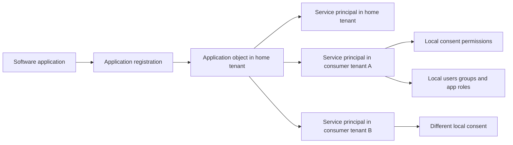

| Microsoft concept | Plain meaning | Key identifier/relationship | Support trap |
|---|---|---|---|
| App registration | Configuration act/interface | Produces app object; often client ID | Calling it the running app |
| Application object | Home-tenant template | One-to-many service principals | Looking in consumer tenant for object owner |
| Service principal | Tenant-local app identity/instance | References app/client ID, has own object ID | Confusing app ID and service-principal object ID |
| Enterprise application | Admin experience around tenant-local service principal | Assignments, permissions, sign-in/config | Treating it as separate unrelated app |
| App role | Application-defined role value | Assigned to user/group/service principal | Confusing with directory admin role |
| Managed identity | Special service principal for supported resource | Resource-bound lifecycle | Assuming it has an app registration |

## 🔍 Plain-English deep-dive: Application object is a blueprint; service principal is a tenant-local building permit

An architect creates one blueprint for a store design. Each city where a store opens creates a local permit and operating record. The blueprint describes common design; the local permit identifies what this store may do in that city and who can operate it. Deleting one city's permit does not erase the master blueprint or another city's store.

The application object resembles the blueprint in its home tenant. A service principal resembles the tenant-local representation. Consent and assignments are local governance around that instance. The app/client ID and service-principal object ID answer different questions.

The analogy stops because Microsoft object creation and property propagation have precise documented behavior. Its practical lesson is to record tenant ID, app/client ID, application-object ID when relevant, service-principal object ID, consent grant, and assignment ID separately.

**Memory cue:** App object is the template; service principal is the local identity.

## 8. App assignment, consent, and provisioning are different

**App assignment** associates a user or group with an enterprise application and optionally an app role. **Consent** authorizes a client application to access a resource/API with particular permissions under defined delegated or application context. **Provisioning** creates or updates a user/group representation in the target application. **Single sign-on (SSO)** lets a user authenticate through an identity provider. One can work while another fails.

| Function | Question answered | Object/evidence | Can fail independently? |
|---|---|---|---|
| Authentication | Who signed in and how? | Sign-in event/session metadata | Yes |
| App assignment | Is user/group assigned to app/role? | Assignment ID/path | Yes |
| Consent | What API access was granted? | Permission grant, client/resource IDs | Yes |
| Provisioning | Does target account/profile exist and match? | Source/target IDs, job/event | Yes |
| Authorization | May principal perform requested action? | Role/scope/claims/policy | Yes |
| SSO | Can identity-provider result establish app session? | SAML/OIDC transaction evidence | Yes |

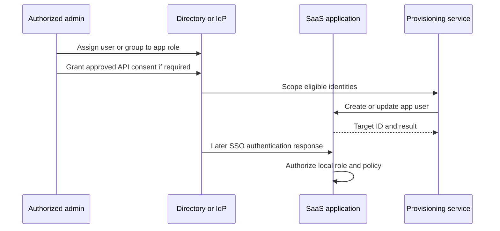

A support statement such as “the app is connected” is too vague. State which layer succeeded: service principal exists, consent is present, user is assigned, provisioning succeeded, SSO succeeded, target authorization succeeded, or audit events are flowing.

## 9. Directory roles versus application roles

A directory administrator role controls management of directory resources. An application role is defined by or for an application and controls application access. A resource role in another control plane may be separate again. Similar labels such as “Admin” do not make them equivalent.

| Role class | Protects/manages | Assigned to | Example question |
|---|---|---|---|
| Directory role | Directory users/groups/apps/settings | User, group, service principal depending feature | Can principal manage app registrations? |
| App role | Application capability | User, group, service principal | Can principal use analyst feature? |
| Resource role | Cloud/resource operations | Security principal at resource scope | Can principal read this resource? |
| Okta admin role | Okta administrative capability | Current Okta-supported principal/scope model | Which org/resource set and permissions? |
| Target-local role | Role stored inside SaaS app | Target app account/group | Did provisioning map correct role? |

The role name “Application Administrator” in Entra is not the same as an app's “Application Admin” role. Record role definition, control plane, assignment, principal, resource, and scope.

## 10. External identities

An external person can authenticate using a home identity while a resource organization stores a representation used for authorization. Microsoft Entra External ID documentation distinguishes workforce-tenant business collaboration from external-tenant consumer/business-customer scenarios. Exact user types, redemption, cross-tenant trust, and policy are product features and change over time.

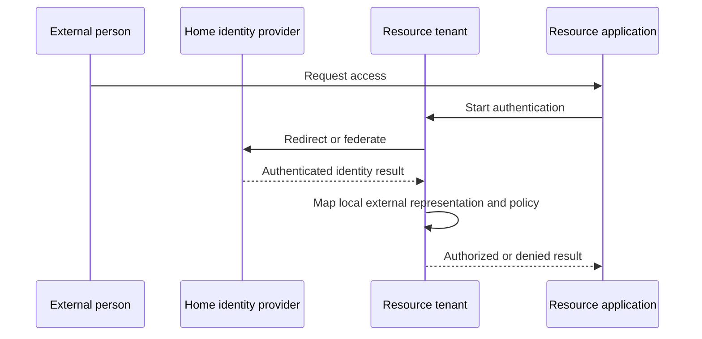

| External-identity question | Why it matters |
|---|---|
| Where does authentication occur? | Home credential problems differ from resource authorization |
| What local object represents the user? | Local object ID anchors assignments/audit |
| Who sponsors access? | Ownership and expiry |
| Which tenant's policy denied access? | Correct admin and evidence source |
| Was invitation/redemption completed? | Lifecycle state |
| Is email merely a contact attribute? | Prevent wrong-object matching |
| When should access expire? | Guest/contract lifecycle |

Never tell a customer to create a duplicate local user merely to bypass external-identity diagnosis. Duplicate objects can create ambiguous sign-in, wrong assignments, and deprovisioning gaps.

## 11. Workload identities and service accounts

A **workload identity** represents software such as an application, service, script, pipeline, or container. Microsoft documents applications, service principals, and managed identities as workload-identity concepts. Industry terminology is inconsistent, so describe the actual object and authentication method.

| Workload property | Required question | Risk if unknown |
|---|---|---|
| Owner | Which human/team is accountable? | Orphaned privileged identity |
| Purpose | What exact job requires access? | Privilege accumulation |
| Identity type | Service principal, managed identity, service account? | Wrong lifecycle/credential advice |
| Authentication | Federated, certificate, secret, managed? | Secret sprawl or expiry outage |
| Permission | Which API/resource/action? | Excess blast radius |
| Scope | Which tenant/resource/environment? | Cross-environment access |
| Rotation/expiry | How does credential/trust renew? | Sudden integration failure |
| Monitoring | Which sign-in/audit events? | Invisible misuse |
| Retirement | What trigger removes access? | Zombie application identity |

Do not ask for workload secrets. For support, collect nonsecret metadata: app/client ID, service-principal object ID, tenant ID in approved redacted form, credential type, key/certificate identifier or expiry metadata, requested resource, scopes/roles, error code, UTC, and correlation ID.

## 12. Source of truth and profile mapping

The **source of truth** is authoritative for a lifecycle decision or attribute. Authority can be split: HR may own employment status and manager; a directory may own sign-in identifier; an application owner may own product role. A **profile mapping** transforms attributes from source schema to target schema.

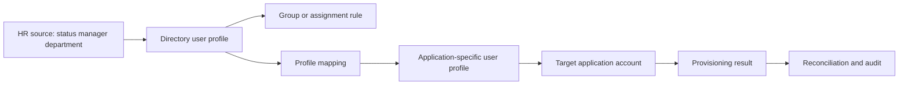

| Mapping issue | Example | Cheapest discriminating check |
|---|---|---|
| Missing source value | Department null | Inspect source attribute and authority |
| Wrong expression | Country mapped to department | Mapping version/preview |
| Type mismatch | Array sent to string field | Source/target schema |
| Required target field | Last name absent | Target error and schema |
| Collision | Two users map to same username | Matching rule and immutable IDs |
| Wrong direction | Target edit overwritten | Source/target ownership |
| Stale evaluation | Old department drives group | Last update and job time |
| App profile divergence | Directory correct, target wrong | App-user profile and mapping |

## 13. Lifecycle: joiner, mover, leaver, and beyond

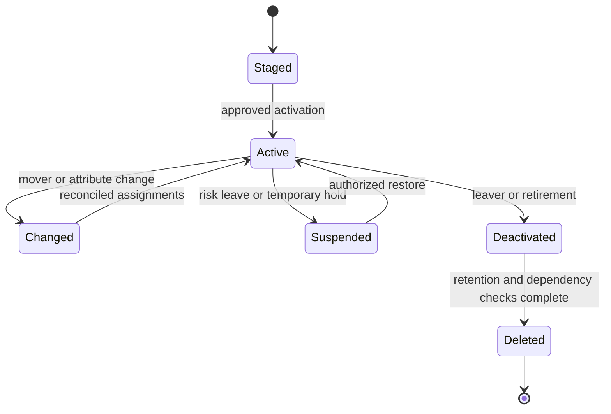

| Lifecycle | Human identity focus | Workload/app focus | Device focus |
|---|---|---|---|
| Create | Source record, manager, minimum access | Owner, purpose, tenant, minimum permission | Enrollment/ownership |
| Activate | Authentication/assignment ready | Credential/trust established | Registration/join complete |
| Change | Replace obsolete entitlements | Scope/version/owner change | Ownership/compliance change |
| Suspend | Block while preserving record | Disable credential/token issuance/job | Disable or quarantine depending system |
| Deactivate | Remove sign-in and assignments | Stop workload and revoke access | Retire relationship |
| Delete | Retention/recovery and ownership transfer | Dependency and audit preservation | Remove stale object after validation |
| Restore | New approval and reconciliation | Re-establish trust minimally | Re-enroll or restore supported record |

Deletion is not always the first containment step. Suspension or deactivation can preserve evidence and support recovery while preventing new access. The authorized owner and product documentation decide.

## 🔍 Plain-English deep-dive: Synchronization is a chain of photocopies with editors

Imagine HR owns a master employee card. A directory photocopies selected fields. A group rule writes “Support Team” based on department. A SaaS connector creates another app-specific card and changes the username format. If HR updates department, several processing steps must run before the SaaS card changes.

If the target is wrong, find the earliest incorrect copy. A correct HR record with a wrong directory value points to import or mapping. A correct directory value with wrong group membership points to rule evaluation. A correct group and assignment with wrong app profile points to provisioning or target behavior.

The analogy stops because identity systems use APIs, event processing, retries, and independent schemas rather than paper. Its troubleshooting power is exact: compare source, normalized directory object, rule result, assignment, app profile, target object, and timestamps in order.

**Memory cue:** Find the first wrong object in the chain.

## 14. Active Directory Domain Services versus Microsoft Entra ID

**Active Directory Domain Services (AD DS)** is a Windows Server directory for domains, forests, organizational units, domain-joined computers, Group Policy, and protocols such as Kerberos, NTLM, and LDAP in on-premises or compatible environments. **Microsoft Entra ID** is Microsoft's cloud identity and access management service using modern cloud identity protocols and cloud control-plane concepts. Organizations can synchronize or federate identities, but the services have different objects, protocols, administration, and design goals.

| Dimension | AD DS | Microsoft Entra ID | Support implication |
|---|---|---|---|
| Primary model | Domains/forests and Windows infrastructure | Cloud tenant/directory and applications | Do not map every object directly |
| Organization | Organizational units and groups | Tenant, administrative units, groups, roles | OU is not simply an Entra group |
| Common protocols | Kerberos, NTLM, LDAP | OAuth 2.0, OIDC, SAML and cloud APIs | Error evidence differs |
| Devices | Domain join and computer objects | Registered, joined, hybrid joined device identities | Similar “joined” word, different state |
| Apps | Integrated/legacy and federation patterns | App objects, service principals, enterprise apps | Capture exact control plane |
| Administration | Domain/forest delegation and Group Policy | Entra RBAC, app assignments, governance | Role systems differ |
| Connectivity | Strong on-prem network/DNS dependencies | Internet/cloud endpoints and modern auth | Hybrid path can span both |
| Synchronization | Can source cloud objects through supported tooling | Receives/manages cloud representations | Source authority matters |

Avoid saying “Entra is AD in the cloud.” That phrase erases architecture and troubleshooting differences. A better beginner answer is: “They solve related identity problems in different environments; hybrid designs connect them, but objects, protocols, and administration are not identical.”

## 15. Okta concepts from official documentation

Current official Okta documentation describes an **Okta org** as the root container for users, groups, app integrations, policy, and configuration. **Universal Directory (UD)** is described as the central identity data layer. An Okta user has a central profile; an assigned application can have an app-user profile with target-specific attributes. Groups and group rules can drive assignments and policy. Directory integrations and apps can act as sources or targets depending on design.

| Okta concept | Beginner explanation | Comparison aid | Boundary |
|---|---|---|---|
| Org | Root Okta administrative container | Roughly asks the “which tenant?” question | Not an Entra tenant clone |
| Universal Directory | Central profile/schema and relationship layer | Directory/profile plane | Product features/licensing change |
| Okta user | User object and profile in org | Human identity record | State/schema differs from Entra |
| User type/profile | Base/custom attributes and schema | Typed profile | No one-to-one Entra type mapping |
| Group | Collection managed in or imported to Okta | Assignment/policy grouping | Current nesting behavior differs |
| Group rule | Attribute expression driving membership | Dynamic membership concept | Syntax/evaluation product specific |
| App integration | Connection/configuration for an app | Enterprise application concept aid | Object model differs |
| App user | User assignment/profile for one app | App-specific target profile | Not the central Okta user |
| Assignment | User/group related to app | App assignment | Roles and provisioning depend on app |
| Profile mapping | Attribute transform between profiles | Provisioning mapping | Direction/source must be explicit |

Okta is learned architecture for Arti. Part 069 will apply these concepts to a larger synthetic Okta troubleshooting lab, including policies, network zones, System Log, SSO, and provisioning. This Part does not create an Okta org or use an Integrator Free Plan.

## 16. Entra and Okta concept bridge

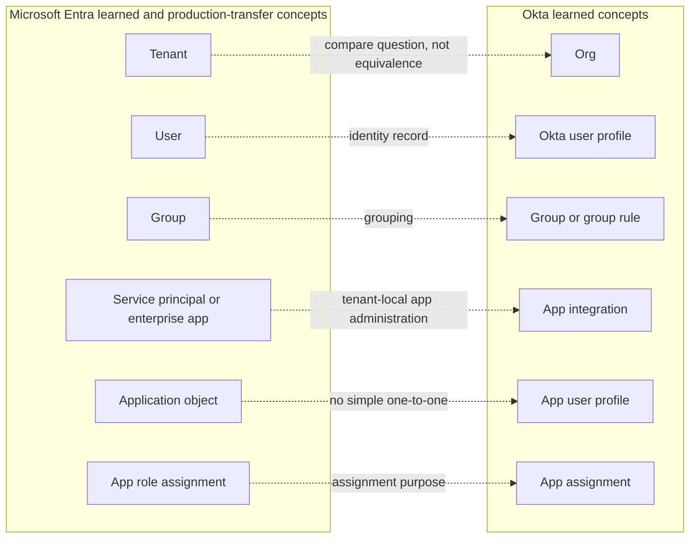

| Question | Entra evidence | Okta evidence | Neutral wording |
|---|---|---|---|
| Which boundary? | Tenant ID/domain | Org URL/ID/context | Confirm root identity boundary |
| Which person/object? | User object ID/source/type | Okta user ID/status/source | Use immutable platform ID |
| Which group path? | Direct/transitive/dynamic and operation | Okta/imported group and rules | Trace actual effective membership |
| Which app object? | App ID, application object, service principal | App integration and app-user assignment | Name exact object type |
| Which assignment? | App role assignment/principal/resource IDs | User/group app assignment | Separate assignment from SSO/provisioning |
| Which lifecycle? | Source/sync/provisioning/audit state | Source/profile/mapping/app-user state | Find first divergent object |

## 17. Worked example 1: Duplicate display name

**Input:** Two directory users are named “Alex Kim,” and the application owner says the wrong Alex received access.

**Reasoning:** Do not use display name or email alone. Compare immutable user IDs, tenant/org, source, status, group path, assignment ID, and target app-user ID. Determine whether assignment, provisioning match, or target display caused confusion.

**Evidence:** Fictional IDs `ENTRA-U-060-A`, `ENTRA-U-060-B`, assignment IDs, target IDs, and UTC events. No personal data or credentials.

**Result:** The synthetic assignment belongs to A while target matching linked B. Escalation asks the connector owner to verify matching configuration and reconcile safely.

**Caveat:** A reused email may be legitimate over time; do not merge records without authoritative lifecycle evidence.

## 18. Worked example 2: App registration versus enterprise application

**Input:** A customer searches App registrations in a consumer tenant and cannot find the vendor's app, but the Enterprise applications view shows it.

**Reasoning:** The application's home-tenant application object can be elsewhere, while a tenant-local service principal represents the app in the consumer tenant. Search by app/client ID and service-principal object ID, not display name alone.

**Evidence:** Approved redacted tenant ID, app/client ID, local service-principal object ID, consent/assignment metadata, and sign-in correlation.

**Result:** The object presence is explained without claiming that consent or user assignment is correct. Those layers are checked separately.

**Caveat:** Do not instruct deletion/recreation as a discovery shortcut; object relationships and grants can be disrupted.

## 19. Worked example 3: Nested group assumption

**Input:** A user belongs to Child Group, which belongs to Parent Group. Parent Group is assigned to an enterprise application, but the user cannot access it.

**Reasoning:** Verify the current operation's nested-group semantics. Current Microsoft Learn says enterprise-app assignment does not cascade to nested groups. Check whether the user needs direct or supported group assignment through authorized governance.

**Evidence:** Direct and transitive membership paths, app assignment IDs, operation-specific documentation date, sign-in result, and target app state.

**Result:** The app owner uses an approved supported assignment design rather than granting a broad admin role.

**Caveat:** Other group operations can have different transitivity; do not generalize this outcome to every Entra feature.

## 20. Worked example 4: Correct Okta profile, wrong app user

**Input:** In a synthetic Okta-style case, the central user profile says `department=Support`, while the target app profile says `department=Sales`.

**Reasoning:** Distinguish central user profile, app-user profile, source ownership, profile mapping direction, last update, assignment, and target provisioning result. The first divergence is the mapping/output layer, not authentication.

**Evidence:** Fictional Okta user ID, app ID, app-user ID, mapping version, source and target timestamps, and typed provisioning event.

**Result:** A learned-architecture escalation asks the authorized Okta/app owner to inspect the mapping and reprovision/reconcile through supported controls.

**Caveat:** Arti has not run this in an Okta org; the case proves conceptual troubleshooting only.

## 21. Worked example 5: Leaver's workload survives

**Input:** A human owner is deactivated, but an integration application they created continues accessing an API.

**Reasoning:** Human deactivation does not automatically retire separate workload identities. Inventory application/service identity owner, purpose, credential/trust, permissions, last use, dependencies, and replacement owner.

**Evidence:** Fictional human and app IDs, ownership, assignment, nonsecret credential metadata, sign-in/audit times, and change approval.

**Result:** Security and application owners decide whether to transfer ownership, restrict, rotate, suspend, or retire. Support does not expose or collect the credential.

**Caveat:** Abruptly disabling a business-critical workload can cause outage; active compromise follows incident containment authority.

## 22. Customer-safe evidence matrix

| Symptom | Minimum evidence | Never request |
|---|---|---|
| User missing | Tenant/org, immutable ID, source, status, UTC | Password or identity document |
| Wrong group | User/group IDs, direct/transitive path, rule/source | Full employee directory export |
| App missing | App/client ID, service-principal/app ID, tenant/org | Client secret/private key |
| Assignment failure | Principal/resource/role assignment IDs, error, UTC | Bearer token |
| Profile mismatch | Source/app-user/target IDs, mapping version, redacted fields | Unnecessary personal attributes |
| Workload failure | App/service ID, credential type/expiry metadata, scope, error | Secret/certificate private key |
| External sign-in | Home/resource tenant, local object ID, error/correlation | MFA code/session cookie |
| Deprovision gap | Lifecycle event, all access paths, target state | Unbounded logs/customer data |

## Troubleshooting decision tree

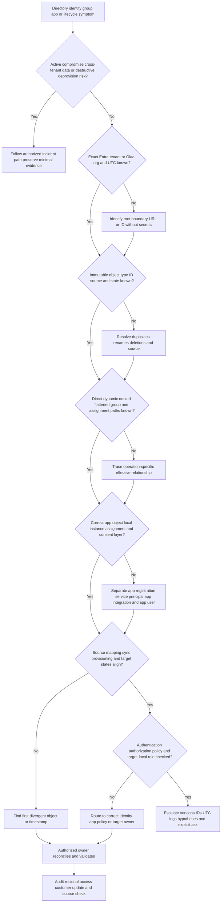

## 23. Common failure modes

| Failure mode | Why it fails | Better behavior |
|---|---|---|
| Person equals account | One person can have many records | Name entity, directory, object, and ID |
| Email is immutable identity | Email changes/reuses/collides | Use tenant/org-scoped immutable ID |
| Credential equals permission | Authentication evidence does not define all access | Separate authentication and authorization |
| Directory is a flat user list | Apps, groups, devices, workloads, relationships matter | Draw typed object graph |
| Entra is “AD in cloud” | Protocols/object/admin models differ | Explain related but distinct services |
| App registration equals enterprise app | Template and tenant-local instance differ | Capture app object and service principal |
| App ID equals object ID | Identifiers answer different questions | Label every ID type |
| Successful SSO means provisioned | Target account/role can still fail | Check assignment, provisioning, target authz |
| Assignment means consent | Different grants and actors | Inspect each layer separately |
| Group membership always transitive | Operation-specific behavior | Verify direct/transitive semantics |
| Okta groups mirror AD nesting | Current Okta docs describe flattening/no nesting | Trace imported representation |
| Central profile equals app profile | Target-specific mapping can differ | Compare source, central, app-user, target |
| Remove from source means removed everywhere | Sync, direct access, sessions can remain | Reconcile all target paths |
| Delete duplicate immediately | Wrong object may own access/data | Preserve, map, authorize, then act |
| Disable human disables workload | Separate principals/lifecycles | Inventory app/service identities |
| Ask for token to debug | Exposes bearer authority | Collect nonsecret metadata and logs |
| Entra familiarity equals full administration | Overstates candidate evidence | Use production-transfer wording |
| Okta study equals Okta experience | Misrepresents learning | Label official-doc and synthetic evidence |
| Generic model equals Abnormal architecture | Proprietary claim is unsupported | Keep explicit unknown boundary |

## 24. Escalation packet

| Section | Required content |
|---|---|
| Impact | Affected users/workloads/apps, security/availability impact |
| Boundary | Entra tenant or Okta org identifiers, redacted as policy requires |
| Object graph | Typed immutable IDs and relationships |
| Source | Authoritative system for lifecycle and each relevant attribute |
| Groups | Direct/dynamic/nested/flattened paths and operation semantics |
| Application | App/client, application object, local service principal/app integration, app user |
| Grants | Assignment, app role, admin role, consent, target-local role |
| Lifecycle | Status changes, source/import/sync/provision/target timestamps |
| Evidence | Error/result, UTC, request/correlation/event IDs, redacted logs |
| Hypotheses | Ranked layer hypotheses with supporting/contradicting evidence |
| Safety | No secrets, unnecessary PII, or unsafe deletion/recreation |
| Ask | Exact identity/app/vendor owner action or product evidence required |

## Safe synthetic lab: The Twin Directory Object Atlas 060

### Objective

Build a local, synthetic object atlas comparing a fictional Microsoft Entra tenant model with a fictional Okta org model. Trace human, external, workload, device, group, application, assignment, source, profile, mapping, and lifecycle records. The unique lab is **The Twin Directory Object Atlas 060**.

This is a paper and local Markdown exercise only. It does not create an Entra tenant, Okta org, user, app, group, service principal, credential, consent grant, or provisioning connection. It makes no Abnormal implementation claim.

### Prerequisites

- Local Markdown editor or spreadsheet.
- This Part and only fictional IDs prefixed `E-060`, `O-060`, `SRC-060`, `APP-060`, `EVT-060`, and `CASE-060`.
- No Microsoft 365 tenant login, Entra admin center, Okta org, Integrator account, API client, Graph Explorer, browser session, token, credential, or customer data.
- Artifact label: **local/public lab - synthetic directory object architecture only**.
- Record start UTC, zero-real-identity statement, no-live-admin statement, and source ledger date **August 24, 2026**.

### Synthetic records

| ID | Product-style model | Type | Source | State |
|---|---|---|---|---|
| `E-060-TENANT-A` | Entra-style | Tenant | Fictional company | Active label |
| `E-060-U-01` | Entra-style | Workforce user | `SRC-060-HR` | Active |
| `E-060-G-01` | Entra-style | Group | Directory | Active |
| `E-060-APP-01` | Entra-style | Application object | Home tenant | Active |
| `E-060-SP-01` | Entra-style | Service principal | Consumer tenant | Active |
| `O-060-ORG-A` | Okta-style | Org | Fictional company | Active label |
| `O-060-U-01` | Okta-style | Central user profile | `SRC-060-HR` | Active |
| `O-060-AU-01` | Okta-style | App user profile | Mapping | Assigned |
| `O-060-G-01` | Okta-style | Group | Group rule | Active |

### Lab steps

1. Create the atlas with artifact label, UTC, authorization statement, zero-real-data statement, and experience boundary.
2. Define entity, identity, account, credential, directory, tenant, org, object, attribute, schema, principal, source, target, and synchronization.
3. Draw separate Entra-style and Okta-style boundaries; connect them only with a dashed conceptual comparison.
4. Create 25 fictional typed objects covering workforce/external users, groups, device, app object, service principal, managed-identity concept, Okta user, app user, app, and workload/service concept.
5. Give every object an immutable ID, display name, source, owner, status, created/updated UTC, and relationships.
6. Create two duplicate display names and one reused login/email-like synthetic attribute; resolve only by immutable IDs.
7. Model direct, dynamic/rule-based, nested source, flattened import, and app-assignment membership.
8. Write an operation-semantics table that refuses to infer transitivity without product documentation.
9. Build an Entra application-object to three service-principal relationship with separate local assignments and consent placeholders; use no secrets or token values.
10. Build an Okta central-user to app-user profile mapping with three attributes and one deliberate mismatch.
11. Separate authentication, SSO, app assignment, consent, provisioning, authorization, and target-local role outcomes for five cases.
12. Model a workforce joiner, contractor invitation, mover, leaver, device retirement, workload owner departure, app retirement, and restore.
13. For each lifecycle, identify source trigger, directory object state, group/assignment effect, target effect, residual risk, and reconciliation evidence.
14. Compare AD DS and Entra across topology, protocols, users, groups, devices, applications, administration, and hybrid synchronization.
15. Build an Entra/Okta bridge table with “similar purpose” and “not equivalent” columns.
16. Run five worked cases: duplicate user, missing enterprise app, nested assignment, app-profile mismatch, and surviving workload.
17. Produce a customer-safe evidence request that asks for IDs and event metadata but no password, token, secret, cookie, private key, or unnecessary profile data.
18. Produce an escalation packet with an explicit identity/app owner ask.
19. Deliver two spoken answers: a 60-second app-object/service-principal explanation and a 90-second honesty-aware Entra/Okta comparison.
20. Validate every official source URL, date the ledger August 24, 2026, and complete cleanup/rubric.

### Expected evidence

- Two separate directory-boundary diagrams and one non-equivalence bridge.
- At least 25 fictional typed objects with immutable IDs and relationships.
- Duplicate-name and reused-attribute resolution worksheet.
- Direct/dynamic/nested/flattened membership and operation-semantics table.
- Application object, three local service principals, assignment and consent placeholders.
- Central-profile/app-profile mapping with first-divergence analysis.
- Five layer-separated outcomes for authentication through target authorization.
- Eight lifecycle traces with residual-access reconciliation.
- AD DS versus Entra comparison and Entra versus Okta concept map.
- Five completed case worksheets and one escalation packet.
- Source ledger dated **August 24, 2026**.
- Spoken candidate-boundary statement: Microsoft production transfer, Okta learned architecture, zero Abnormal production claim.

### Cleanup and privacy

- Confirm every tenant, org, person, group, device, app, profile, assignment, event, and case is fictional and contains `060`.
- Remove real names, usernames, email addresses, tenant/org domains, device identifiers, employment data, app/client IDs, object IDs, screenshots, log extracts, tokens, passwords, API keys, client secrets, certificates, and private keys.
- Confirm no live account, directory, API, admin center, Graph Explorer, Okta console, application, group, role, consent, or provisioning operation was accessed or changed.
- Delete the artifact if real identity or credential material cannot be reliably removed.
- Retain only the synthetic atlas under normal local access and retention controls.
- Record cleanup UTC and: `Synthetic directory architecture exercise only; zero live tenant, org, identity, credential, API, assignment, consent, provisioning, or production activity.`

### Validation rubric

| Dimension | Fail | Developing | Pass |
|---|---|---|---|
| Identity model | User equals person | Lists objects | Separates entity, identity, account, credential, principal, object, source |
| Boundaries | Mixes tenants/orgs | Names boundary | Uses immutable root/object IDs and explicit non-equivalence |
| Groups | Assumes nesting | Notes membership | Traces direct, rule, nested, flattened, operation-specific effect |
| Applications | App is one object | Lists app/SP | Separates software, app object, local SP, assignment, consent, app user |
| Profiles | One universal profile | Lists mappings | Compares source, central, app profile, target, first divergence |
| Lifecycle | Create/delete | Adds mover/leaver | Includes people, guests, workloads, devices, apps, residual reconciliation |
| AD/Entra | “AD in cloud” | Lists differences | Explains topology, protocol, object, admin, hybrid boundaries |
| Entra/Okta | Claims equivalence | Compares labels | Uses similar-purpose questions and product-specific semantics |
| Evidence | Uses names/secrets | Uses IDs | Immutable IDs, UTC, source, state, event IDs, minimal redaction |
| Honesty/safety | Uses live org or claims Okta | Says learned | Zero live activity; Microsoft transfer, Okta learned, Abnormal unknown |

## 25. Official Source Anchors

All sources were accessed and recorded for the guide on **August 24, 2026**. Product behavior, licensing, interfaces, terminology, and feature scope must be revalidated before interview or production use. The sources establish Microsoft- and Okta-specific concepts; they do not establish Abnormal's architecture.

| Official source | What it anchors | Candidate/product boundary |
|---|---|---|
| [Microsoft Learn - Compare Active Directory to Microsoft Entra ID](https://learn.microsoft.com/en-us/entra/fundamentals/compare) | Official conceptual differences for users, apps, devices, protocols, administration, and provisioning | Microsoft-specific; not “same service in cloud” |
| [Microsoft Learn - Apps and service principals](https://learn.microsoft.com/en-us/entra/identity-platform/app-objects-and-service-principals) | Application registration, application object, tenant-local service principal, managed identity relationships | Entra model only |
| [Microsoft Learn - Workload identities](https://learn.microsoft.com/en-us/entra/workload-id/workload-identities-overview) | Human/machine distinction and Entra workload-identity concepts | Arti uses conceptual/transfer language |
| [Microsoft Learn - External ID overview](https://learn.microsoft.com/en-us/entra/external-id/external-identities-overview) | Workforce/external tenant and B2B/external population concepts | Current product behavior; revalidate |
| [Microsoft Learn - Device identity](https://learn.microsoft.com/en-us/entra/identity/devices/overview) | Device object, registration/join/hybrid-join overview | Device record is not complete endpoint proof |
| [Microsoft Learn - Manage users and groups assignment to an application](https://learn.microsoft.com/en-us/entra/identity/enterprise-apps/assign-user-or-group-access-portal) | App assignments, app roles, current nested-group limitation | Current feature/licensing scope |
| [Okta Developer - Okta organizations](https://developer.okta.com/docs/concepts/okta-organizations/) | Org as root container, URLs, boundaries, features, and current org concepts | Learned only; no Okta operations claim |
| [Okta Developer - Universal Directory](https://developer.okta.com/docs/concepts/user-profiles/) | User/app profiles, schemas, mappings, groups, rules, and directory integrations | Learned official-doc architecture |
| [Okta Help - Manage groups](https://help.okta.com/oie/en-us/content/topics/users-groups-profiles/usgp-groups-main.htm) | Current group management and nested-group/flattening statement | Revalidate before use |
| [Okta Help - Profile types](https://help.okta.com/oie/en-us/content/topics/users-groups-profiles/usgp-about-profiles.htm) | Okta user, group, and app-user profile distinctions | Learned official documentation |

### Source-use discipline

- Prefer immutable IDs and source metadata over display names or email-like attributes.
- Check the exact operation before claiming group transitivity or assignment behavior.
- Keep Microsoft application object, service principal, enterprise app, app role, consent, and provisioning language distinct.
- Treat Okta terms as current learned architecture and revalidate feature/licensing changes.
- Do not infer Abnormal-supported directories, sync design, schemas, group behavior, or app objects.

## Likely Interview Questions

### Q1. What is an identity directory?

**Model answer:** It is a control-plane service that stores typed identity objects, attributes, schemas, relationships, lifecycle state, and identifiers for people, groups, devices, applications, and workloads. It supports authentication, authorization, assignment, provisioning, governance, and audit. I identify the tenant/org, immutable object ID, source, state, and relationship path before troubleshooting.

### Q2. How do human, external, workload, and device identities differ?

**Model answer:** Human identities represent people and usually follow HR/manager lifecycle. External identities require a sponsor and may authenticate in a home organization. Workload identities represent software and need a technical owner, purpose, nonhuman authentication, permissions, and retirement. Device identities provide endpoint relationship or state context; none of these object types should be treated as interchangeable.

### Q3. What is the difference between an Entra application object and service principal?

**Model answer:** The application object is the application's home-tenant template or global representation. A service principal is the tenant-local application identity or instance created where the app is used; local consent, assignments, and access apply around it. I keep app/client ID, application-object ID, service-principal object ID, tenant, grants, and assignments distinct.

### Q4. Why is group nesting dangerous to assume?

**Model answer:** A source directory can represent nested groups, but a particular app assignment, role, license, provisioning connector, or target may not evaluate transitive membership. Okta can flatten imported nested membership, and current Entra enterprise-app assignment does not cascade to nested groups. I verify the exact operation and trace direct, rule, nested, flattened, and effective paths.

### Q5. How are assignment, consent, SSO, and provisioning different?

**Model answer:** Assignment links a principal to an app or app role. Consent grants a client approved API permissions. SSO establishes an application session from identity-provider authentication. Provisioning creates or updates a target account/profile. Each has separate objects, owners, logs, and failure modes, so “the integration works” must be decomposed by layer.

### Q6. How do AD DS and Microsoft Entra ID differ?

**Model answer:** AD DS is a Windows Server domain/forest directory using concepts such as organizational units, domain join, Group Policy, Kerberos, NTLM, and LDAP. Entra ID is a cloud identity and access service centered on tenants, cloud apps, modern protocols, service principals, and cloud policy. Hybrid systems connect them, but object, protocol, administration, and failure semantics are not identical.

### Q7. How would you troubleshoot a profile mismatch across directories and an app?

**Model answer:** Identify authority for the attribute, then compare source record, directory profile, rule/group result, app assignment, mapping version, app-user profile, target record, and UTC events in order. The first incorrect object narrows the owner and cause. I use immutable IDs and redacted values, never credentials or unnecessary personal data.

### Q8. What are your Entra and Okta experience boundaries?

**Model answer:** My Microsoft enterprise support and Entra/AD fundamentals provide production-transfer context for tenant, user/group, app dependency, investigation, escalation, and validation, but I do not overstate that as full Entra administration. Okta is learned architecture from official documentation and a synthetic lab. I have not operated Okta or Abnormal in production.

## Memory Hooks

- **Entity is the thing; identity is its representation; account is the system record; credential proves access attempt.**
- **Directory first, immutable object second, relationships third.**
- **Email and display name are attributes, not durable identity proof.**
- **Human, external, workload, and device identities need different owners and lifecycles.**
- **Group nesting exists only where the exact operation honors it.**
- **Find direct, rule-driven, nested, flattened, and effective membership separately.**
- **App object is the template; service principal is the tenant-local identity.**
- **Enterprise application is the local administration view around a service principal.**
- **Assignment, consent, SSO, provisioning, and target authorization can fail independently.**
- **Find the first wrong object in the source-to-target chain.**
- **AD DS and Entra solve related identity problems with different architectures.**
- **Entra is production transfer, not unlimited admin experience.**
- **Okta is learned architecture, not production experience.**
- **Abnormal directory internals remain unknown.**

## Completion Checklist

- [ ] I can state the Section goal and central directory/object rule.
- [ ] I can define entity, identity, account, credential, directory, tenant, org, object, attribute, schema, principal, source, target, and synchronization.
- [ ] I can separate human, external, workload, device, group, and emergency identities.
- [ ] I can use immutable IDs rather than display names or email as identity proof.
- [ ] I can explain central user profiles versus application-specific user profiles.
- [ ] I can trace direct, dynamic/rule, nested, transitive, and flattened group membership.
- [ ] I can state that transitive authorization is operation specific.
- [ ] I can explain application registration, application object, service principal, enterprise app, app role, and managed identity.
- [ ] I can distinguish directory admin roles, app roles, resource roles, and target-local roles.
- [ ] I can separate assignment, consent, provisioning, SSO, authentication, and authorization.
- [ ] I can trace external identity across home authentication and resource authorization.
- [ ] I can inventory workload owner, purpose, identity, authentication, permissions, scope, monitoring, and retirement.
- [ ] I can locate first divergence across source, directory, rule, assignment, app profile, and target.
- [ ] I can explain AD DS versus Entra without saying they are the same service.
- [ ] I can compare Entra and Okta concepts without claiming one-to-one equivalence.
- [ ] I completed or can explain **The Twin Directory Object Atlas 060**.
- [ ] The lab includes Prerequisites, Expected evidence, Cleanup and privacy, and Validation rubric.
- [ ] I used no live tenant, org, account, API, assignment, consent, provisioning, token, secret, or personal data.
- [ ] I checked Official Source Anchors and recorded **August 24, 2026**.
- [ ] I can state Entra production-transfer, Okta learned, and Abnormal-unknown boundaries aloud.
- [ ] I can answer exactly Q1-Q8.

[Next: Part 061 - SSO and SAML](Part-061-sso-and-saml.md)