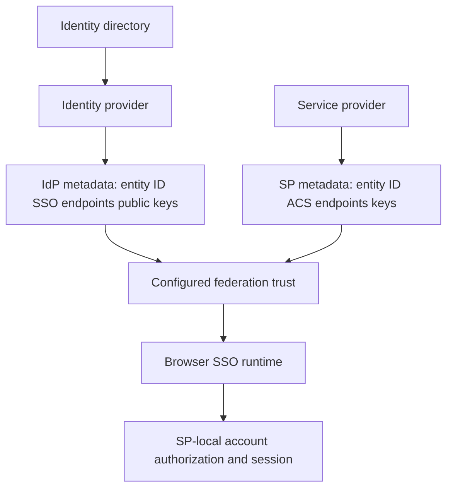
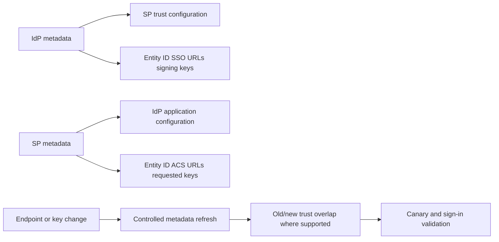
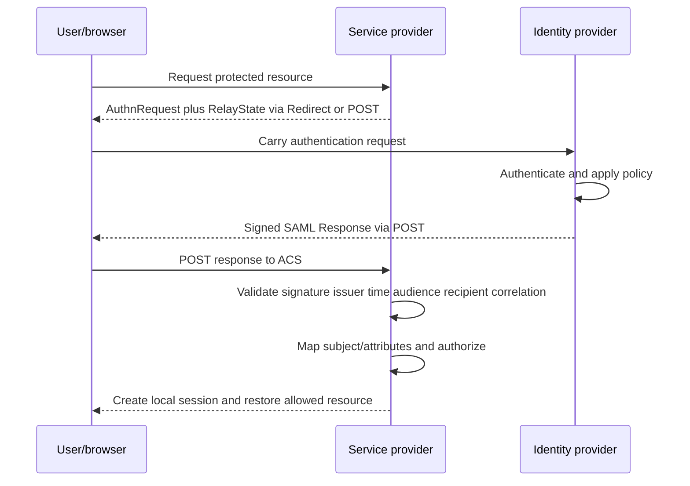
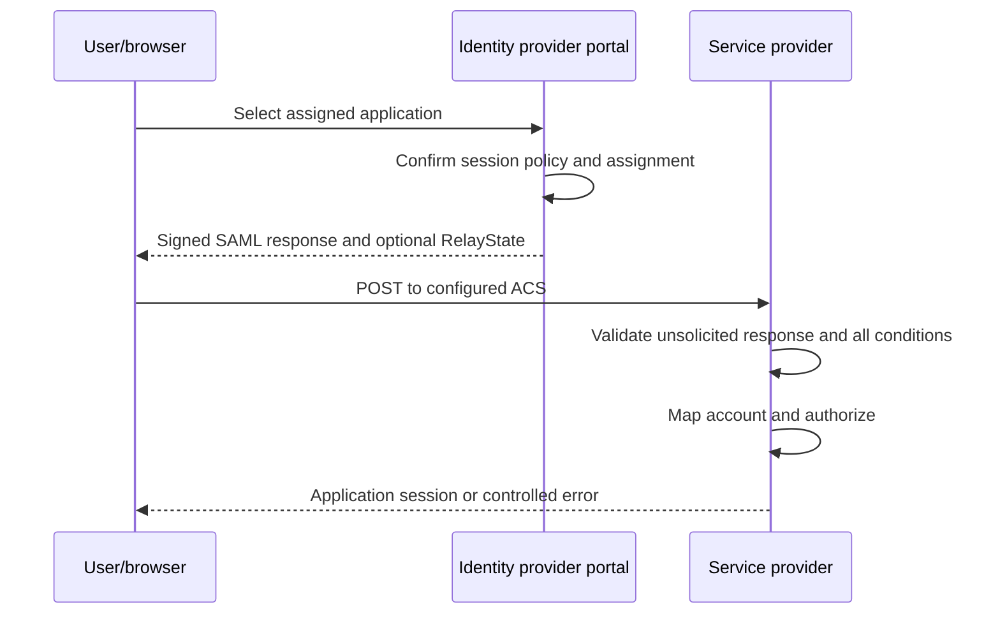
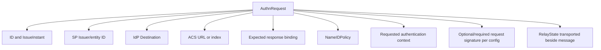
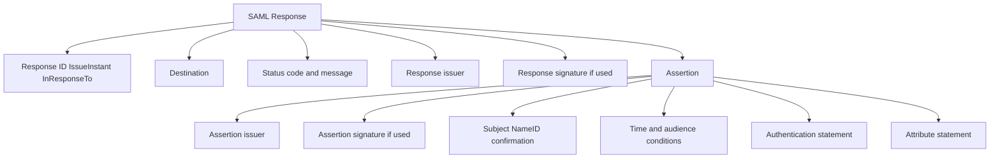
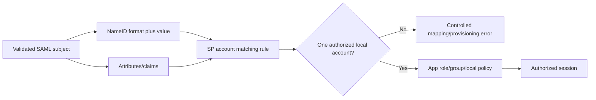
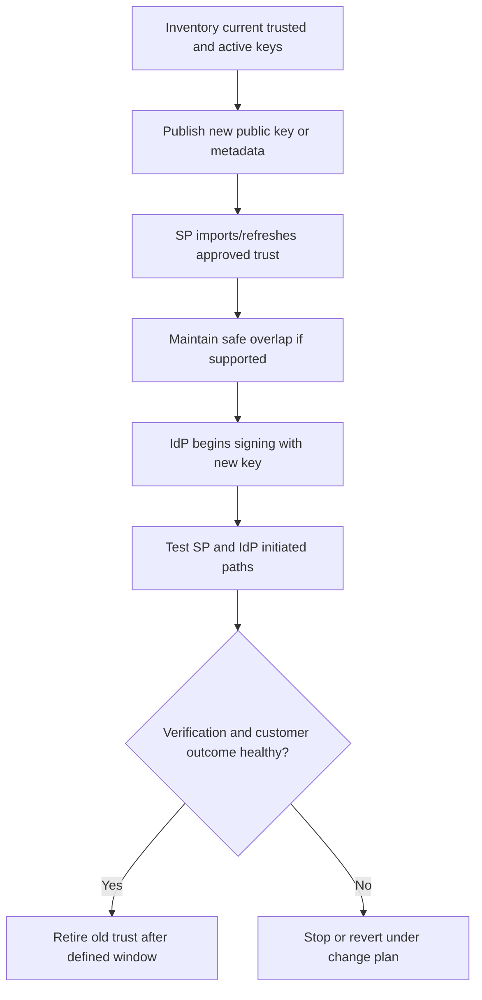
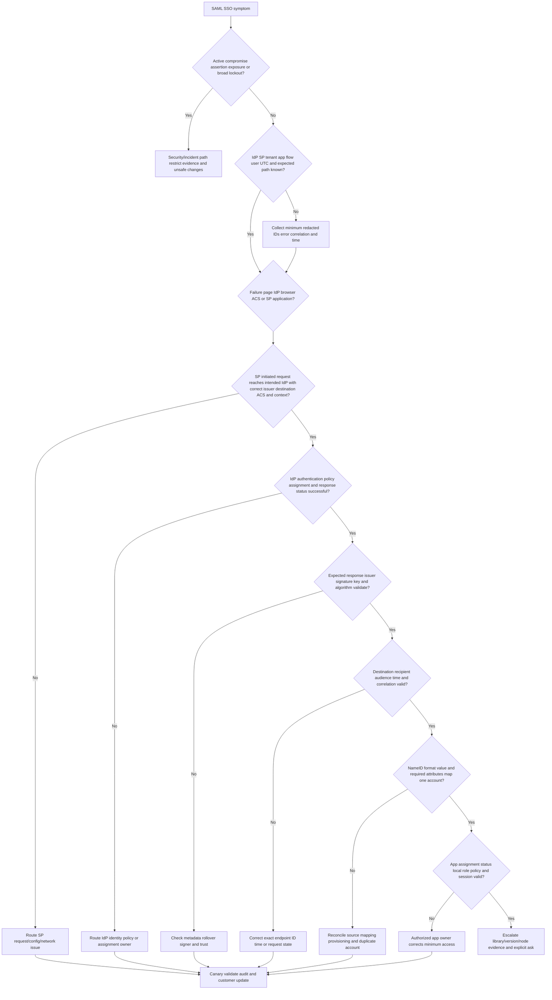

# Part 061 - SSO and SAML

## Section goal

This Part explains **single sign-on (SSO)**, **federation**, and **Security Assertion Markup Language (SAML)** from zero knowledge. SSO is a user experience and session outcome: a person authenticates through a trusted system and can reach one or more applications without managing a separate password in each application. Federation is a trust arrangement in which one security domain accepts identity statements from another under agreed rules. SAML is an Extensible Markup Language (XML)-based standard family commonly used for browser-based enterprise federation.

SAML does not make the service provider ignore security. The **identity provider (IdP)** authenticates a subject and issues a response containing an assertion. The **service provider (SP)** receives that response through the browser and must validate the issuer, signature, trust key or certificate, time conditions, audience, recipient/destination, request correlation where applicable, subject, and required attributes before creating a local session. The SP then applies its own authorization and account lifecycle rules.

The central troubleshooting rule is:

> Locate the failing boundary, then validate request, response, signature trust, protocol conditions, subject mapping, assignment, provisioning, local authorization, and session state in order; never treat “the assertion exists” as “the sign-in is valid.”

This Part includes Microsoft Entra examples as production-transfer learning because of your prior support background, but it does not claim full Entra SAML administration. Okta terminology is learned from official documentation only. There is no claim of production SAML administration in Abnormal, Okta, Google Workspace, Slack, Zoom, or another named platform. Abnormal's supported SAML profile, configuration UI, certificates, claim mapping, assignment model, and support access are unknown unless approved documentation states them.

The lab is synthetic and local. It never posts an assertion, configures a real IdP/SP, captures a real browser session, uploads metadata, or includes a real certificate, user attribute, session cookie, tenant identifier, or signature value.

## Learning outcomes

After completing this Part, you should be able to:

- distinguish authentication, authorization, SSO, federation, provisioning, and application session;
- define SAML IdP, SP, principal/subject, assertion, request, response, metadata, entity ID, endpoint, binding, profile, and trust relationship;
- explain SP-initiated and IdP-initiated browser SSO at a high level;
- identify an authentication request, SAML response, assertion, status, subject, NameID, conditions, audience restriction, attribute statement, and authentication statement;
- explain entity IDs, single sign-on service endpoints, Assertion Consumer Service (ACS) endpoints, destination, recipient, and request correlation;
- distinguish HTTP Redirect and HTTP POST bindings without treating a browser redirect as the whole protocol;
- explain RelayState as request context and not as proof of authorization;
- distinguish NameID from claims/attributes and from a durable directory object ID;
- distinguish signing from encryption and certificate expiry from signature validation;
- explain trust-key rollover, overlap, metadata refresh, and clock synchronization conceptually;
- troubleshoot issuer, audience, ACS/recipient, signature, certificate, time, NameID, attribute, assignment, provisioning, local-account, session, and policy failures;
- preserve useful SAML evidence while redacting assertions, identifiers, attributes, cookies, certificates, and secrets safely; and
- state candidate and named-platform experience boundaries without weakening a technically credible answer.

## JD Mapping

| Supplied role signal | Capability built | Your transferable evidence | Boundary |
|---|---|---|---|
| Enterprise SaaS and identity | Traces federated sign-in across directory, IdP, browser, SP, and session | Microsoft cloud and Entra/AD fundamentals | No Abnormal or Okta SAML operations claim |
| Own configuration tickets | Checks identifiers, endpoints, certificates, claims, and assignments | Enterprise support and configuration investigation | No live changes without authorized owner |
| Complex investigations | Correlates browser, IdP, SP, request, response, and time evidence | critical-situation ownership and escalation | No invented identity incident |
| Customer trust | Redacts assertion content and avoids secrets/cookies | Customer communication and evidence handling | SAML responses can contain sensitive identity data |
| Microsoft 365 ecosystem | Uses Entra protocol documentation as a concrete example | production-transfer context | Does not imply full tenant-wide identity admin |
| Okta ecosystem | Understands Okta's documented IdP/SP and app concepts | Learned architecture only | No Okta org experience |
| API/integration mindset | Separates endpoints, identifiers, status, and validation contracts | REST/JSON/networking learning | SAML is XML/browser federation, not REST |
| Recommendations/escalation | Produces exact failed check and owner-specific ask | Engineering/Product collaboration | Do not recommend disabling validation |

## Candidate honesty note

| Evidence tier | Safe statement | Do not imply |
|---|---|---|
| **Production transfer - Microsoft** | “My prior enterprise support background gives me practical tenant, identity, browser, configuration, evidence, and escalation habits.” | Full Entra SAML deployment ownership without a real example |
| **Local/public lab** | “I annotated fictional SAML metadata, request, and response fields locally and built a validation tree.” | A live SAML transaction or certificate configuration |
| **Learned architecture - Okta** | “I understand Okta's official IdP/SP SAML concepts and can apply a vendor-neutral troubleshooting method.” | Production Okta administration |
| **No direct experience** | “I have not administered Abnormal or Okta SAML in production.” | Knowledge of private app mappings, certificates, or logs |
| **Proprietary unknown** | “Abnormal's supported SAML profile, endpoints, identifiers, certificate handling, claim mapping, and break-glass process are unknown unless approved documentation states them.” | Generic SAML behavior is a vendor-specific promise |

Safe interview language:

> “I have transferable Microsoft identity and enterprise troubleshooting experience, plus a synthetic SAML validation lab. I would confirm the customer's IdP and SP, exact entity IDs and ACS, metadata/certificate versions, request and response correlation, signature and conditions, NameID/attributes, assignment, target account, and local authorization. I would not request a raw unredacted assertion or claim hands-on Okta or Abnormal SAML administration.”

**Named-platform experience boundary:** Microsoft identity support is transferable production context; Abnormal AI and Okta SAML administration are learned architecture and synthetic-lab areas, not claimed production experience.

## 1. Authentication, authorization, SSO, and federation

**Authentication** establishes confidence in who or what is signing in. **Authorization** decides what that authenticated principal may do. **SSO** reduces repeated interactive sign-ins across participating applications. **Federation** allows an SP in one domain to rely on an IdP in another according to configured trust. **Provisioning** creates and updates the target account and entitlements. A successful SAML authentication does not guarantee the target account exists or has permission.

| Concept | Question answered | Example evidence | Independent failure? |
|---|---|---|---|
| Authentication | Who authenticated and under what context? | IdP sign-in event, assertion authn statement | Yes |
| Federation | Which IdP/SP trust applies? | Metadata, issuer, entity IDs, certificate | Yes |
| SSO | Can prior IdP session reduce another prompt? | Browser/IdP session behavior | Yes |
| Provisioning | Does target account/profile exist? | Source/target object IDs and provisioning event | Yes |
| Authorization | May user use feature/resource? | App role/group/local policy | Yes |
| Application session | Did SP create/maintain local session? | SP session/error, cookie metadata | Yes |

```mermaid
flowchart LR
    User[User and browser] --> SP[Service provider]
    SP --> IdP[Identity provider]
    IdP --> AuthN[Authenticate user and apply IdP policy]
    AuthN --> Assertion[Issue signed SAML response/assertion]
    Assertion --> Browser[Browser carries response]
    Browser --> Validate[SP validates trust and conditions]
    Validate --> Map[Map subject and attributes]
    Map --> Authorize[SP local account and authorization]
    Authorize --> Session[SP application session]
```

## 🔍 Plain-English deep-dive: Federation is a hotel trusting a conference badge desk

A hotel hosts a conference. Instead of checking every attendee's employer documents, the hotel agrees to trust the conference badge desk. The desk verifies an attendee and issues a signed badge for this hotel, valid for a limited time. The hotel checks the badge issuer, signature, hotel name, time, and attendee identifier before allowing entry.

The badge desk resembles the IdP. The hotel resembles the SP. The badge resembles a SAML assertion. The hotel's door is the ACS endpoint. The intended hotel resembles the audience. The expiry resembles assertion time conditions. A room reservation resembles target provisioning and authorization: a valid conference badge can enter the lobby but does not automatically grant every room.

The analogy stops because SAML messages are XML structures carried through a browser and validated cryptographically. Its key lesson is that trust is constrained: correct issuer, correct destination/audience, valid signature, valid time, expected subject, and local authorization.

**Memory cue:** IdP authenticates; SP validates and authorizes.

## 2. SAML standard family

SAML 2.0 is a family of OASIS specifications rather than one single message. **Assertions and Protocols** define assertions and protocol messages. **Bindings** define how SAML messages map to transport mechanisms such as HTTP Redirect or HTTP POST. **Profiles** combine assertions, protocols, and bindings for use cases such as browser SSO. **Metadata** describes entities, roles, endpoints, keys, and capabilities.

| Specification area | Plain meaning | Example question |
|---|---|---|
| Assertions | Statements about subject, authentication, attributes, authorization | What does the IdP assert? |
| Protocols | Request/response message rules | How does SP request authentication? |
| Bindings | How messages travel using another protocol | Redirect or POST? |
| Profiles | Interoperable use-case recipe | Browser SSO flow? |
| Metadata | Machine-readable trust/configuration description | Which entity ID, endpoint, and signing key? |
| XML Signature | Integrity/authenticity mechanism | Which element is signed and with which trusted key? |
| XML Encryption | Optional confidentiality mechanism | Can intended recipient decrypt protected assertion? |

SAML is often called an authentication protocol, but assertions can carry authentication, attribute, and authorization-decision statements. In common enterprise SSO, the SP still makes its own authorization decision based on validated identity and local policy.

## 3. Actors and trust relationship

| Actor/object | Role | Owns | Does not automatically own |
|---|---|---|---|
| Principal/subject | Person represented in assertion | Identity relationship | SAML configuration |
| Browser/user agent | Carries redirects/forms | Client session context | Trust validation |
| IdP | Authenticates and issues response/assertion | IdP policy, signing key, claims | SP local authorization |
| SP | Provides application and consumes response | ACS, validation, account/session | User's IdP credential |
| Directory | Stores source identity/profile | User/group/app objects | Every SP-local role |
| Admins | Configure respective sides | Their controlled plane | Other side's private keys |
| Metadata | Describes entity configuration | IDs, endpoints, public keys | Live health or user assignment |

## 4. Entity IDs and endpoints

An **entity ID** is an identifier for a SAML entity, commonly represented as a URI. It is an identifier, not necessarily a browsable web page. The IdP has a single sign-on service endpoint that receives authentication requests. The SP has an **Assertion Consumer Service (ACS)** endpoint that receives SAML responses. Products may call these fields Identifier, Audience URI, Reply URL, Sign-on URL, Login URL, or similar names; use exact documentation.

| Field | Side | Purpose | Common failure |
|---|---|---|---|
| SP entity ID | SP | Identifies SP/request issuer and often expected audience relationship | Exact mismatch or wrong tenant app |
| IdP entity ID | IdP | Identifies assertion issuer | SP trusts different issuer |
| IdP SSO URL | IdP | Receives browser authentication request | Wrong environment/endpoint |
| ACS URL | SP | Receives response | Unregistered/wrong path/tenant |
| Destination | Response | Intended response endpoint | Does not match receiver expectation |
| Recipient | Subject confirmation | Intended bearer recipient | Wrong ACS or host |
| Audience | Assertion condition | Intended SP/entity | Wrong entity ID |
| Logout endpoint | Either profile-dependent | Participates in logout if supported/configured | Assuming login SSO implies logout SSO |

Exact string matching, normalization rules, multiple ACS endpoints, tenant routing, and aliases are implementation/profile details. Copying a URL from another environment can create a validly signed assertion for the wrong recipient or audience.

## 5. Metadata

SAML metadata can describe entity IDs, IdP/SP roles, supported bindings, endpoints, keys/certificates, NameID formats, and other capabilities. Metadata exchange reduces manual transcription but does not remove ownership, approval, change control, or refresh/rollover needs.

| Metadata check | Why it matters | Safe evidence |
|---|---|---|
| Source/authority | Prevent untrusted configuration | Official/admin-approved source reference |
| Entity role | Distinguish IdP vs SP descriptors | Descriptor type |
| Entity ID | Bind correct relationship | Redacted or fictional identifier |
| Endpoints | Route request/response | Scheme/host/path pattern, redacted |
| Binding | Match transport representation | Redirect/POST designation |
| Key use | Signing versus encryption | Public certificate fingerprint/expiry metadata |
| Validity/cache | Refresh before stale config | Valid-until/cache duration if present |
| Version/change | Coordinate rollout | Change ID and metadata hash |

Never import metadata from an unverified email attachment or public paste. In production, use the organization's approved secure process and verify ownership.

## 6. SP-initiated SSO

In SP-initiated SSO, the user starts at the application. The SP determines the appropriate IdP, creates an authentication request, and sends it through the browser. The IdP authenticates the user or uses an existing IdP session, applies policy, creates a response/assertion, and returns it through the browser to the ACS. The SP validates it and creates a local application session if authorization succeeds.

SP initiation usually provides request context and can support request/response correlation. It does not guarantee the user will return; browser closure, policy failure, or network interruption can stop the asynchronous journey.

## 7. IdP-initiated SSO

In IdP-initiated SSO, the user selects an application from the IdP or another IdP-side starting point. There may be no SP authentication request to correlate. The IdP sends an unsolicited response to the SP's ACS according to configuration. The SP still validates issuer, signature, conditions, audience, recipient, subject, and attributes.

| Flow | Starts at | Authentication request | Strength | Troubleshooting caveat |
|---|---|---|---|---|
| SP-initiated | Application/SP | Usually present | Context/deep link and correlation | IdP discovery and request configuration |
| IdP-initiated | IdP portal | Often absent | Simple app launch | Less request context; support varies |

Support for either flow is product specific. Do not assume an SP supports unsolicited responses or that successful IdP initiation proves SP initiation is configured correctly.

## 🔍 Plain-English deep-dive: SP-initiated is a reservation; IdP-initiated is a walk-in referral

With a reservation, the hotel gives the guest a reservation number before sending them to the conference badge desk. When the guest returns, the hotel can match the response to the original reservation and destination. That resembles SP-initiated SSO with request ID and RelayState.

With a walk-in referral, the badge desk sends an authenticated attendee to the hotel without a prior reservation. The hotel may accept this if configured for that issuer, audience, recipient, and workflow, but it cannot correlate the response to a reservation that never existed. That resembles IdP-initiated SSO.

The analogy stops because SAML implementation details and replay defenses are more precise. The lesson is that both flows require full assertion validation, but their request context and correlation differ.

**Memory cue:** SP-initiated has a request journey; IdP-initiated may be unsolicited.

## 8. Bindings: Redirect and POST

A **binding** maps SAML protocol messages onto a transport. Browser SSO often uses HTTP Redirect for an authentication request and HTTP POST for a response. Redirect commonly carries encoded request data in a URL query; POST commonly uses an auto-submitted HTML form containing `SAMLResponse`. Exact encoding, compression, signatures, and supported combinations are specified by standards and implementations.

| Binding concept | Typical browser role | Evidence location | Caution |
|---|---|---|---|
| HTTP Redirect | Send request to IdP | Redirect URL/query and browser network trace | URLs/logs can expose identifiers/context |
| HTTP POST | Send response to ACS | Form POST body | Assertion can contain sensitive attributes |
| Artifact | Reference requiring resolution | Browser artifact plus back-channel exchange | Support varies; not assumed here |
| SOAP/back channel | Protocol exchange for supported profiles | Server-side logs | Not ordinary browser POST |

Do not paste a real `SAMLResponse` into a public decoder or public AI service. Even without a password, it may contain a bearer assertion, identity attributes, group/role data, tenant identifiers, internal endpoints, and certificate material.

## 9. Authentication request anatomy

An authentication request can include an ID, version, issue instant, issuer, destination, ACS URL or index, protocol binding preference, NameID policy, requested authentication context, and flags such as force authentication or passive behavior depending on implementation.

| Request field | Validation/configuration question | Failure symptom |
|---|---|---|
| ID | Unique and correlatable? | InResponseTo mismatch or replay concern |
| Issuer | Exact configured SP identifier? | IdP cannot find app/trust |
| Destination | Correct IdP endpoint? | Request rejected/wrong tenant |
| ACS | Registered/allowed endpoint? | Reply/ACS mismatch |
| NameIDPolicy | Supported requested format? | Unsupported request or wrong identifier |
| RequestedAuthnContext | Can IdP satisfy/interpret? | Authentication context error |
| Signature | Required and valid under trusted SP key? | Request signature rejection |
| RelayState | Opaque, bounded, validated context? | Wrong landing/open redirect risk |

## 10. Response and assertion anatomy

A **SAML Response** is the protocol wrapper. It can contain status and one or more assertions depending on profile/implementation. An **assertion** contains statements about a subject and conditions for use. Support should distinguish response-level and assertion-level issuer, ID, signature, destination, and time.

| Element | Meaning | SP check |
|---|---|---|
| Response status | Protocol success/failure | Parse nested status and safe message |
| InResponseTo | Links response to request | Match outstanding request when required |
| Destination | Response target | Exact expected ACS/endpoint rule |
| Issuer | Entity issuing response/assertion | Match trusted configured IdP |
| Signature | Integrity and signer authentication | Verify correct signed element/key/algorithm |
| Subject/NameID | Identified principal | Map format/value under approved rule |
| Recipient | Bearer assertion recipient | Match expected ACS |
| NotBefore/NotOnOrAfter | Validity window | Validate with controlled skew policy |
| Audience | Intended relying party | Match SP entity/audience config |
| AuthnStatement | Authentication time/context/session index | Check app requirements |
| AttributeStatement | Claims/attributes | Validate required names, formats, values |

## 11. NameID, claims, and attributes

**NameID** is the SAML subject identifier in a specified format/context. It may be persistent, transient, email-address-shaped, unspecified, or another supported format. Its syntax does not prove ownership or permanence. A value that looks like an email is not automatically the user's durable object ID.

A **claim** is a statement about a subject. In SAML XML, attributes and attribute values can carry profile data, groups, roles, identifiers, or other information agreed between IdP and SP. The SP's mapping configuration decides which attribute is required and how it maps to a local account.

| Identifier/attribute | Suitable use | Dangerous use |
|---|---|---|
| Persistent pairwise NameID | Stable SP-specific subject when supported/configured | Assume same value across SPs |
| Transient NameID | One session/short context | Local permanent account key |
| Email-format NameID | App expects current email-like identifier | Assume immutable/reuse safe |
| Directory object ID attribute | Correlate exact directory object where contract supports | Assume target app stores same key |
| Group/role attribute | Target authorization input | Send all groups without need/minimization |
| Display name | User display | Unique account match |

## 12. RelayState

**RelayState** is a value transported alongside a SAML request/response to preserve application context such as a deep link. It is not part of the assertion's identity proof by itself and must not be trusted as arbitrary authorization or an unrestricted redirect destination.

| RelayState use | Good control | Risk |
|---|---|---|
| Restore protected path | Map opaque nonce to server-side state | Exposed sensitive URL/data |
| Deep link | Allowlist internal destinations | Open redirect |
| Tenant/app context | Bind to expected request/session | Cross-tenant confusion |
| IdP-initiated landing | Validate supported target | User-controlled arbitrary URL |
| Request correlation aid | Integrity/state binding according to implementation | Treat as substitute for InResponseTo/signature |

## 🔍 Plain-English deep-dive: RelayState is a claim ticket, not a master key

Think of RelayState as the numbered ticket a coatroom gives you so the attendant can return to the intended item or destination after another step completes. The ticket preserves context, but it does not prove who you are or authorize access to every coat. In the same way, an implementation can use RelayState to restore a deep link or correlate server-side state, while authentication, request correlation, destination validation, and local authorization remain separate checks.

The analogy stops because RelayState may cross browser and identity boundaries, can be modified or exposed depending on the profile, and may contain a URL or opaque value. Treat it as untrusted unless the implementation protects and validates it according to the supported contract; never turn it into an unrestricted redirect or authorization decision.

Avoid logging full RelayState when it may contain identifiers or URLs. Prefer opaque short-lived server-side state references.

## 13. Signing, encryption, certificates, and keys

A digital **signature** helps the receiver validate integrity and authenticate the signer under a trusted public key. It does not hide the message. **Encryption** protects confidentiality for the intended decryptor; it does not replace all signature and condition validation. A SAML signing certificate commonly carries the IdP's public key and identifying metadata. The private signing key must remain protected by its owner.

| Control | Protects | Does not provide alone | Support evidence |
|---|---|---|---|
| TLS | Browser/server channel | End-to-end assertion trust after browser handling | Endpoint/certificate error metadata |
| XML signature | Signed element integrity and signer trust | Confidentiality or user authorization | Verification result, key ID/fingerprint |
| XML encryption | Assertion confidentiality | Signer authenticity/local authorization | Decryption error and encryption cert metadata |
| Certificate validity dates | Administrative/key lifecycle signal | Proof signature was made by expected entity | Not-before/not-after, fingerprint |
| Metadata key | Published trust material | Automatic safe refresh unless configured | Metadata version/hash |
| Private key | Creates signature/decrypts as designed | Should never be shared with support | Never collect |

## 🔍 Plain-English deep-dive: A signature is a tamper-evident seal, not an opaque envelope

A signed letter has a seal that lets the recipient check who sealed it and whether the letter changed. Anyone holding the letter may still read it. An encrypted envelope hides the letter from unintended readers, but the recipient still needs to verify who sent it and whether its instructions apply.

SAML signatures are like seals: they protect integrity and establish signer trust when correctly validated against the expected key. Encryption is like the opaque envelope: it protects content confidentiality for the intended SP. TLS protects transport segments but does not excuse assertion validation.

The analogy stops because XML signatures cover selected XML elements and validation must resist wrapping, canonicalization, algorithm, and key-selection mistakes through mature libraries. The support lesson is concise: identify what is signed/encrypted, which trusted key applies, and which validation failed; never ask for the private key.

**Memory cue:** Signed is not secret; encrypted is not automatically trusted.

## 14. Certificate rollover and metadata change

Signing certificates expire or rotate. A robust rollover coordinates IdP publication, SP trust, overlap where supported, activation time, cache/metadata refresh, canary validation, monitoring, and rollback. “Certificate is not expired” does not prove the SP trusts it. “New certificate uploaded” does not prove the runtime uses it.

| Rollover symptom | Hypotheses | Evidence |
|---|---|---|
| All users fail at same time | IdP switched key; SP trust stale | First failure UTC, signature key/fingerprint |
| Some SPs fail | Metadata refresh or trust differs by SP | Per-SP config/version |
| One node fails intermittently | Distributed cache/config mismatch | Node/correlation and key set |
| New cert present but old used | Activation/signer selection not changed | Runtime signing fingerprint |
| Old cert expired but signatures validate | Runtime uses another trusted key | Actual signature key, not UI list |

## 15. Time conditions and clock skew

SAML assertions have short validity conditions such as `NotBefore` and `NotOnOrAfter`. Subject confirmation can have its own expiry. IdP and SP clocks must be synchronized. A small configured skew tolerance can account for normal clock difference, but enlarging windows to hide clock errors increases replay exposure.

| Time field | Meaning | Failure |
|---|---|---|
| IssueInstant | Message/assertion issue time | Implausible future/past event |
| NotBefore | Earliest permitted use | SP clock behind/ahead relative to assertion |
| NotOnOrAfter | Exclusive end of validity | Response arrived/processed too late |
| AuthnInstant | When authentication occurred | App requires recent authentication |
| SessionNotOnOrAfter | Authentication-session limit if present | Session exceeds condition |
| SubjectConfirmationData expiry | Bearer confirmation deadline | Recipient receives after expiry |

Always record IdP event UTC, SP receive/validation UTC, browser observation UTC, time source/offset evidence, and assertion conditions. Do not simply “add ten minutes of skew.” Fix time synchronization and use product-recommended tolerance.

## 16. Validation order

The exact secure validation algorithm belongs in a mature SAML library and product implementation, not custom support code. Conceptually, support should identify these checks and their result:

1. Parse the expected response safely and reject malformed/unexpected structures.
2. Identify the configured trust relationship and expected IdP/SP.
3. Verify required signature(s) over the correct element using expected trusted key and allowed algorithms.
4. Validate response status, destination, and request correlation as applicable.
5. Validate assertion issuer, audience, recipient, time conditions, and subject confirmation.
6. Detect replay according to product/library design.
7. Map NameID and required attributes to exactly one authorized local account.
8. Apply assignment, provisioning, local role/policy, and session controls.

| Check | Example failure | Correct owner path |
|---|---|---|
| Structure/profile | Malformed or unsupported message | SP/IdP integration owner |
| Signature/trust | Unknown signing key | Certificate/metadata change owners |
| Destination/recipient | Wrong ACS | SP and IdP app configuration owners |
| Issuer/audience | Wrong entity IDs | Federation configuration owners |
| Time | Assertion not yet valid/expired | Time and IdP/SP operators |
| Correlation/replay | Unexpected InResponseTo/reused ID | SP implementation/session owner |
| Subject mapping | NameID not matched | Directory/app account owner |
| Attributes | Required role/group absent | Claims/mapping and app owner |
| Local access | User unassigned/suspended | App/identity governance owner |

## 17. Worked example 1: Audience mismatch

**Input:** Authentication succeeds at the IdP, but the SP reports that the assertion audience is invalid.

**Reasoning:** Compare the assertion's audience value with the SP's configured expected entity ID, preserving exact characters and environment. Confirm the authentication request issuer, IdP app configuration, and SP metadata version. Do not change both sides simultaneously.

**Evidence:** Fictional issuer `https://sp-061.example/entity`, received audience `https://sp-061.example/prod`, expected value, response ID, UTC, and metadata hash.

**Result:** The synthetic IdP used a staging identifier after a copied configuration. The authorized admin corrects one side according to approved SP metadata, canaries, and validates.

**Caveat:** Audience aliases and multiple values are implementation/profile specific; use exact product documentation.

## 18. Worked example 2: Wrong ACS/recipient

**Input:** The IdP posts to `/saml/acs`, but the production SP expects `/auth/saml/consume`; users receive a recipient or destination error.

**Reasoning:** Compare configured ACS, request ACS, response destination, subject confirmation recipient, reverse proxy path, environment, and tenant routing. Determine whether the browser reached the intended endpoint and whether an intermediary rewrote host/scheme/path.

**Evidence:** Redacted scheme/host/path patterns, response destination/recipient, HTTP status, request/correlation ID, and UTC. The assertion body is not shared unredacted.

**Result:** Use approved metadata and change control to align the production endpoint; validate with a small authorized test user.

**Caveat:** Do not add a broad wildcard ACS or disable recipient validation.

## 19. Worked example 3: Signing-key rollover

**Input:** All users begin failing signature validation at 09:00 UTC after an IdP certificate change.

**Reasoning:** Check the signature's actual key/certificate fingerprint, SP trusted keys, metadata refresh time/cache, activation schedule, overlap plan, and distributed nodes. Expiry shown in UI is secondary to the actual runtime key.

**Evidence:** Public fingerprint/serial metadata under policy, validity dates, metadata hash, first-failure UTC, node/correlation ID, and change record. No private key or complete assertion.

**Result:** The paper case finds new signing key active before SP trust refresh. The recovery owner imports approved metadata/trust and validates according to the rollback plan.

**Caveat:** Never email a private key or advise trusting an unverified certificate merely because sign-in resumes.

## 20. Worked example 4: NameID mismatch after rename

**Input:** The assertion is valid, but the SP says no account matches the subject after a user's sign-in name changed.

**Reasoning:** Identify NameID format/value, SP matching rule, immutable directory ID attribute if contractually supported, target account key, provisioning history, duplicate accounts, and rename timing. Authentication and signature are already downstream evidence; this is mapping/lifecycle.

**Evidence:** Fictional source object ID, old/new synthetic identifiers, NameID format, target account ID, mapping version, and UTC events.

**Result:** The authorized identity/app owner updates mapping or target account through supported lifecycle, then reconciles duplicates and access.

**Caveat:** Do not merge or recreate accounts based only on matching display name/email.

## 21. Worked example 5: Clock skew

**Input:** Intermittent “assertion not yet valid” errors occur only on one SP node.

**Reasoning:** Compare assertion `NotBefore`, IdP issue time, each SP node's receive time and offset, load-balancer routing, and configured tolerance. The one-node pattern contradicts a universal IdP claim error.

**Evidence:** Synthetic UTC times, node ID, NTP/time-service health metadata, assertion condition values, and correlation.

**Result:** Restore clock synchronization through the authorized infrastructure owner; retain a small documented product tolerance rather than widening the window.

**Caveat:** Time errors can coexist with queue/network delay; compare actual receive time.

## 22. Worked example 6: Valid SAML, denied app

**Input:** SP validates the assertion but returns “not authorized.”

**Reasoning:** Separate SAML trust from user assignment, provisioning, app-local status, group/role attribute, policy, license, and target authorization. Check whether the NameID mapped to the intended account.

**Evidence:** SP validation-success event, mapped target account ID, assignment and provisioning state, required role/attribute contract, and local authorization result.

**Result:** The application owner corrects the minimum approved assignment or mapping; no certificate change is needed.

**Caveat:** Repeated reauthentication cannot fix missing authorization.

## 23. Safe redaction and evidence handling

SAML request/response data can expose personal identifiers, groups, roles, tenant IDs, internal URLs, authentication context, session indexes, request IDs, and signed bearer material. A raw response can be useful only through an approved secure workflow and narrow need. Portfolio and chat evidence should use synthetic structures.

| Evidence | Usually preserve | Redact/replace |
|---|---|---|
| Error/status code | Exact code and safe message | Personal free text |
| UTC timestamp | Exact time/timezone | N/A |
| Correlation/request IDs | Exact if policy allows | Customer-specific IDs in public artifact |
| Entity/endpoint comparison | Structure and mismatch location | Real tenant/host/path if sensitive |
| Certificate | Fingerprint/expiry/key-use metadata | Full cert if unnecessary; always private key |
| Assertion structure | Element names and validation result | Entire encoded/raw assertion |
| NameID/attributes | Format, presence, mapping result | Values, groups, roles, personal data |
| Cookies/headers | Presence and flow metadata | Cookie/token values, Authorization headers |

Redacting signed XML changes the signature. Therefore, a redacted assertion is not suitable for cryptographic revalidation. Preserve the original only in the approved restricted evidence channel; create a separately labeled sanitized derivative for discussion.

## Troubleshooting decision tree

## 24. Common failure modes

| Failure mode | Why it fails | Better action |
|---|---|---|
| SSO equals authentication | SSO is an experience/session outcome | Separate authn, federation, authz, session |
| SAML success equals app access | Provisioning/local role can deny | Check target account and authorization |
| Assertion exists so it is valid | It may be forged, expired, wrong audience | Validate all trust/condition checks |
| Signature means encrypted | Signed content can be readable | Treat assertion as sensitive |
| TLS replaces assertion signature | Browser-mediated message still needs trust | Validate expected signed element/key |
| Certificate not expired means trusted | SP may not trust or runtime uses another key | Check actual signature fingerprint and trust |
| Upload any cert that restores access | Creates unverified trust | Verify approved metadata/ownership |
| Disable audience/recipient checks | Enables misdelivery/replay classes | Correct exact IDs/endpoints |
| Add broad ACS wildcard | Expands recipient attack surface | Register minimum exact endpoints |
| Increase clock skew widely | Masks time issue and expands replay window | Fix clocks; use recommended tolerance |
| Email-shaped NameID is immutable | Addresses change/reuse | Use agreed stable mapping and IDs |
| Send every group in assertion | Data exposure/size/authorization risk | Minimum required attributes |
| IdP initiation proves SP initiation | Request path/config differs | Test both supported flows separately |
| RelayState is trusted redirect | Can create open redirect/cross-tenant issue | Opaque, bounded, validated state |
| Redact XML then verify signature | Redaction invalidates signature | Restricted original plus sanitized derivative |
| Paste response into public decoder | Exposes bearer/identity information | Approved local/enterprise tooling only |
| Recreate enterprise app first | Disrupts assignments/trust and evidence | Capture IDs/config, isolate failed check |
| Claim Okta/Abnormal implementation | Unsupported vendor-specific claim | State learned/generic/proprietary boundaries |

## 25. Escalation packet

| Section | Required content |
|---|---|
| Impact | User population, app, lockout/security impact, start UTC |
| Topology | IdP, SP, tenant/org, app instance, SP/IdP initiated path |
| Request | ID, issuer, destination, ACS, binding, redacted RelayState result |
| Response | ID, InResponseTo, destination, issuer, status, receive UTC |
| Signature | Signed element, verification result, public fingerprint/key ID, algorithm |
| Conditions | Audience, recipient, NotBefore/NotOnOrAfter result |
| Subject | NameID format, mapping result, no exposed value |
| Attributes | Required presence/type/mapping, values redacted |
| Local state | Assignment, provisioning, target account, role/policy/session |
| Change | Metadata/cert/endpoint/claim/policy change and approval ID |
| Evidence safety | Restricted original location; sanitized derivative |
| Ask | Exact IdP, SP, app, identity, network, or Engineering action |

## Safe synthetic lab: The SAML Trust Theater 061

### Objective

Build a paper-only SAML trust model with fictional IdP/SP metadata, an abstract authentication request, an abstract response/assertion, validation outcomes, failure cases, and a redaction worksheet. The unique lab is **The SAML Trust Theater 061**.

The lab never produces a usable signed assertion. XML-like examples use placeholders such as `[SIG-061]` and `[NAMEID-REDACTED-061]`; no private key, public test endpoint, live IdP, SP, browser capture, decoder upload, or real tenant is used.

### Prerequisites

- Local Markdown editor or paper.
- This Part and fictional reserved domain `example.test` used only as text.
- Fictional IDs beginning `IDP-061`, `SP-061`, `REQ-061`, `RESP-061`, `ASSERT-061`, `CERT-061`, and `CASE-061`.
- No Entra tenant, Okta org, Abnormal account, application, browser extension, proxy capture, public SAML decoder, certificate, token, cookie, or customer data.
- Artifact label: **local/public lab - synthetic non-executable SAML analysis only**.
- Record start UTC, no-live-transaction statement, no-credential statement, and source-ledger date August 24, 2026.

### Synthetic trust record

| Field | Fictional value | Purpose |
|---|---|---|
| IdP entity ID | `https://idp-061.example.test/entity` | Expected issuer |
| IdP SSO endpoint | `https://idp-061.example.test/sso` | Request destination |
| SP entity ID | `https://sp-061.example.test/entity` | Expected audience/request issuer |
| ACS | `https://sp-061.example.test/saml/acs` | Response recipient |
| Signing fingerprint | `CERT-061-FP-OLD` / `CERT-061-FP-NEW` | Noncryptographic placeholders |
| NameID | `[NAMEID-REDACTED-061]` | No real identifier |
| Signature | `[SIG-061-NOT-USABLE]` | No key/signature material |

### Lab steps

1. Create the lab cover with label, UTC, authorization, no-live-system, no-real-identity, and candidate-boundary statements.
2. Define authentication, authorization, SSO, federation, provisioning, session, IdP, SP, assertion, metadata, entity ID, ACS, binding, profile, and RelayState.
3. Draw separate trust-configuration and runtime-flow diagrams.
4. Create fictional IdP and SP metadata field tables without valid certificates or importable XML.
5. Build SP-initiated and IdP-initiated sequences; identify differences in request, correlation, and context.
6. Annotate HTTP Redirect request and HTTP POST response concepts without constructing an operational URL or form.
7. Build an abstract AuthnRequest field list: ID, issue time, issuer, destination, ACS, binding, NameID policy, context, signature requirement, and RelayState.
8. Build an abstract response/assertion field list: IDs, InResponseTo, destination, status, issuer, signature, subject, NameID, recipient, time, audience, authn statement, attributes.
9. Create a validation matrix with pass/fail/not-applicable for structure, signature, issuer, destination, recipient, audience, time, correlation, replay, subject mapping, attributes, assignment, provisioning, and local authorization.
10. Create twelve failure fixtures: wrong issuer, audience, ACS, recipient, expired, not-yet-valid, unknown signing key, malformed status, missing InResponseTo, NameID mismatch, missing role, and unassigned user.
11. For each fixture, record symptom, failing layer, cheapest safe evidence, owner, customer message, and forbidden shortcut.
12. Simulate certificate rollover with old/new placeholder fingerprints, metadata versions, overlap, activation, canary, and rollback.
13. Simulate a one-node clock offset and prove why broad skew is not the correction.
14. Create a NameID/attribute mapping with persistent, transient, and email-format examples using fictional values.
15. Build a redaction worksheet for request, response, assertion, endpoint, certificate, attributes, RelayState, cookies, and logs.
16. State explicitly that redacted XML cannot pass original signature verification.
17. Run the troubleshooting decision tree on audience mismatch, certificate rollover, account mapping, and valid-SAML/denied-app cases.
18. Draft one customer update and one Engineering escalation with exact failed check and explicit ask.
19. Deliver a 90-second SAML flow answer and a 60-second candidate-honesty answer.
20. Validate sources, cleanup, privacy, and rubric; execute and upload nothing.

### Expected evidence

- Trust-configuration and runtime diagrams.
- Fictional metadata field inventories for one IdP and one SP.
- SP-initiated and IdP-initiated sequences.
- Request and response/assertion anatomy sheets.
- Full validation matrix with at least thirteen checks.
- Twelve failure fixtures with safe next actions.
- Certificate rollover and clock-offset worksheets.
- NameID/attribute mapping comparison.
- Redaction matrix and restricted-original/sanitized-derivative rule.
- Four completed decision-tree cases.
- Customer update and escalation packet.
- Source ledger dated **August 24, 2026**.
- Spoken Microsoft-transfer, Okta-learned, Abnormal-unknown statement.

### Cleanup and privacy

- Confirm all entity IDs use `example.test` and every message/certificate/case identifier contains `061`.
- Confirm no valid XML signature, certificate, private key, metadata file, SAMLResponse, session cookie, token, real NameID, attribute, group, role, user, tenant, endpoint, or customer data exists.
- Remove any copied production request/response, browser trace, screenshot, hostname, tenant ID, certificate body, or identity value.
- Confirm nothing was pasted into a public decoder, public AI service, browser tool, IdP, SP, or account.
- Delete the artifact if real SAML or identity data cannot be reliably removed.
- Record cleanup UTC and: `Synthetic non-executable SAML exercise only; zero live IdP/SP, transaction, browser capture, credential, assertion, certificate, account, upload, or production activity.`

### Validation rubric

| Dimension | Fail | Developing | Pass |
|---|---|---|---|
| Concepts | SSO equals authentication | Lists IdP/SP | Separates authn, federation, SSO, provisioning, authz, session |
| Configuration | Copies URLs | Lists metadata | Maps entity IDs, endpoints, bindings, keys, ownership, version |
| Flows | One arrow | Has SP flow | Correct SP/IdP initiation, browser role, request context |
| Assertion | “Token” only | Lists fields | Separates response, assertion, subject, conditions, attributes, authn |
| Validation | Signature only | Adds audience/time | Ordered trust, destination, recipient, correlation, mapping, access |
| Crypto | Signature encrypts | Names cert | Signed vs encrypted, actual key, rollover, no private key |
| Troubleshooting | Reconfigure both sides | Checks error | Isolates exact failed boundary and safe discriminating evidence |
| Redaction | Public decoder/raw XML | Hides NameID | Restricted original, sanitized derivative, values/cookies/keys protected |
| Safety | Builds live IdP/SP | Uses placeholders | Non-executable paper artifact and zero upload/activity |
| Honesty | Claims named platforms | Says generic | experience transfer, Okta learned, Abnormal implementation unknown |

## 26. Official Source Anchors

All source anchors were recorded for the guide on **August 24, 2026**. Standards are stable anchors, while product pages, supported fields, user interfaces, certificate processes, and troubleshooting features can change and must be revalidated. OASIS PDF URLs are normative documents even when a text-extraction tool cannot render them.

| Official or primary source | What it anchors | Boundary |
|---|---|---|
| [OASIS - Assertions and Protocols for SAML V2.0](https://docs.oasis-open.org/security/saml/v2.0/saml-core-2.0-os.pdf) | Normative assertion and protocol structures/semantics | Read with profiles/bindings and implementation guidance |
| [OASIS - Bindings for SAML V2.0](https://docs.oasis-open.org/security/saml/v2.0/saml-bindings-2.0-os.pdf) | HTTP Redirect, HTTP POST, and other binding definitions | Does not define one vendor's supported subset |
| [OASIS - Profiles for SAML V2.0](https://docs.oasis-open.org/security/saml/v2.0/saml-profiles-2.0-os.pdf) | Browser SSO and other profile composition | Profile support is product specific |
| [OASIS - Metadata for SAML V2.0](https://docs.oasis-open.org/security/saml/v2.0/saml-metadata-2.0-os.pdf) | Entity roles, endpoints, keys, and metadata model | Import/refresh operations remain vendor specific |
| [Microsoft Learn - SSO SAML protocol](https://learn.microsoft.com/en-us/entra/identity-platform/single-sign-on-saml-protocol) | Current Entra request/response elements, issuer, ACS, NameID, signature, conditions, audience, attributes | Microsoft implementation example |
| [Microsoft Learn - Debug SAML-based SSO](https://learn.microsoft.com/en-us/entra/identity/enterprise-apps/debug-saml-sso-issues) | Request/response evidence and current Entra troubleshooting boundaries | Never overrides evidence/privacy policy |
| [Okta Developer - SAML](https://developer.okta.com/docs/concepts/saml/) | Current official conceptual IdP/SP, flow, RelayState, metadata, and certificate guidance | Learned architecture only |
| [Okta Help - SAML app integrations](https://help.okta.com/oie/en-us/content/topics/apps/apps-about-saml.htm) | Current Okta IdP/SP role concepts and app integration overview | No hands-on Okta claim |

### Source-use discipline

- Use OASIS documents for normative structure and product documentation for supported subsets.
- Revalidate exact entity-ID, ACS, signature, encryption, NameID, attribute, and initiation support.
- Never weaken signature, audience, recipient, destination, replay, or time validation to “make SSO work.”
- Use mature platform SAML implementations rather than hand-rolled XML security.
- Keep Abnormal-specific SAML behavior unknown unless approved documentation states it.

## Likely Interview Questions

### Q1. What is the difference between SSO and federation?

**Model answer:** SSO is the user/session outcome of reducing repeated sign-ins across applications. Federation is a trust relationship across security domains. SAML is one standards family used to implement browser federation: an IdP authenticates and issues an assertion; the SP validates it, maps the subject, applies local authorization, and creates its own session.

### Q2. What are the IdP, SP, assertion, and ACS?

**Model answer:** The IdP authenticates the subject and issues a SAML response/assertion. The SP provides the application and consumes the response. The assertion contains statements, conditions, subject, and attributes. The ACS is the SP endpoint that receives the browser-posted response; it must match the configured destination/recipient expectations.

### Q3. How do SP-initiated and IdP-initiated SSO differ?

**Model answer:** SP-initiated starts at the app and normally includes an authentication request, request ID, ACS context, and optional RelayState for a protected resource. IdP-initiated starts at the IdP and can send an unsolicited response with less request context. The SP must fully validate either flow, and support for each is product specific.

### Q4. What should an SP validate in a SAML response?

**Model answer:** Using a mature library, validate structure/profile, expected issuer and trust, required signature over the correct element, allowed algorithm/key, status, destination, recipient, audience, time conditions, request correlation and replay controls, subject confirmation, NameID mapping, required attributes, assignment, target account, local authorization, and session policy.

### Q5. What is the difference between signing and encryption?

**Model answer:** Signing protects integrity and authenticates the signer under a trusted public key; signed content is not necessarily secret. Encryption protects confidentiality for the intended decryptor but does not replace signer, condition, or authorization checks. Support can use public fingerprint/expiry metadata but must never request the private key.

### Q6. How would you troubleshoot an audience or ACS mismatch?

**Model answer:** Identify exact IdP, SP, tenant/app, flow, and environment. Compare request issuer and ACS with configured SP metadata; compare response destination, subject recipient, and audience with the SP's expected endpoint/entity ID. Preserve exact strings in the authorized case, change one owned configuration through approval, canary, and validate without disabling checks.

### Q7. How do you handle SAML evidence safely?

**Model answer:** Treat assertions, attributes, RelayState, cookies, endpoints, and certificates as sensitive. Prefer error, UTC, correlation IDs, element presence, comparison results, and public fingerprint metadata. Keep any necessary original in an approved restricted channel and make a separately labeled sanitized derivative; redaction changes XML and invalidates the original signature.

### Q8. What are your SAML experience boundaries?

**Model answer:** I bring enterprise support, tenant/identity context, browser/network evidence, escalation, and validation as production transfer, plus a synthetic SAML field and failure lab. Okta SAML is learned from official documentation. I have not administered Okta or Abnormal SAML in production, and Abnormal's exact profile and configuration remain unknown.

## Memory Hooks

- **Authentication proves identity context; authorization grants application capability.**
- **SSO is an experience; federation is trust; SAML is one protocol family.**
- **IdP authenticates and asserts; SP validates, maps, authorizes, and sessions.**
- **Entity ID identifies; endpoint receives.**
- **ACS receives the response; audience identifies the intended SP.**
- **Destination and recipient answer where; audience answers for whom.**
- **SP-initiated has a request; IdP-initiated may be unsolicited.**
- **RelayState carries context, not authority.**
- **NameID format matters; email shape is not permanence.**
- **Signed is not secret; encrypted is not automatically trusted.**
- **Actual runtime signing key matters more than a certificate list.**
- **Small skew handles clock difference; broad skew hides a defect.**
- **Valid SAML can still map to no account or no authorization.**
- **Restricted original, sanitized derivative.**

## Completion Checklist

- [ ] I can state the Section goal and validation-order rule.
- [ ] I can distinguish authentication, authorization, SSO, federation, provisioning, and application session.
- [ ] I can define IdP, SP, subject, assertion, request, response, metadata, binding, profile, entity ID, and ACS.
- [ ] I can draw SP-initiated and IdP-initiated browser flows.
- [ ] I can explain HTTP Redirect and HTTP POST bindings at a high level.
- [ ] I can distinguish request issuer/destination/ACS from response destination/recipient/audience.
- [ ] I can explain response wrapper, status, assertion, subject, conditions, authn statement, and attributes.
- [ ] I can distinguish NameID formats from attributes and immutable directory identity.
- [ ] I can explain RelayState without treating it as authorization.
- [ ] I can explain signing, encryption, TLS, public certificate, private key, rollover, and metadata refresh.
- [ ] I can investigate audience, recipient, issuer, signature, key, clock, NameID, attribute, assignment, provisioning, and local authorization failures.
- [ ] I can preserve restricted evidence and create a sanitized derivative without claiming it remains signature-valid.
- [ ] I completed or can explain **The SAML Trust Theater 061**.
- [ ] The lab includes Prerequisites, Expected evidence, Cleanup and privacy, and Validation rubric.
- [ ] I used no live IdP/SP, account, browser capture, decoder upload, assertion, cookie, token, certificate, key, or customer data.
- [ ] I can state prior production transfer, Okta learned architecture, and Abnormal proprietary unknowns.
- [ ] I checked Official Source Anchors and recorded **August 24, 2026**.
- [ ] I can answer exactly Q1-Q8.

[Next: Part 062 - OAuth and OpenID Connect](Part-062-oauth-and-openid-connect.md)