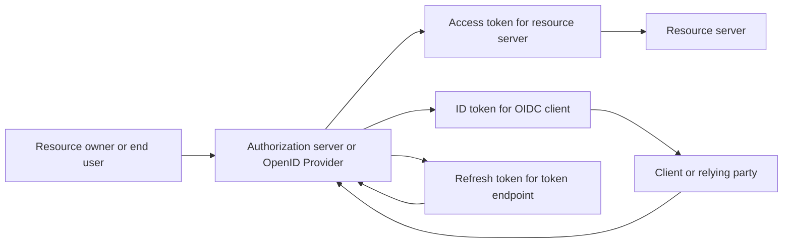
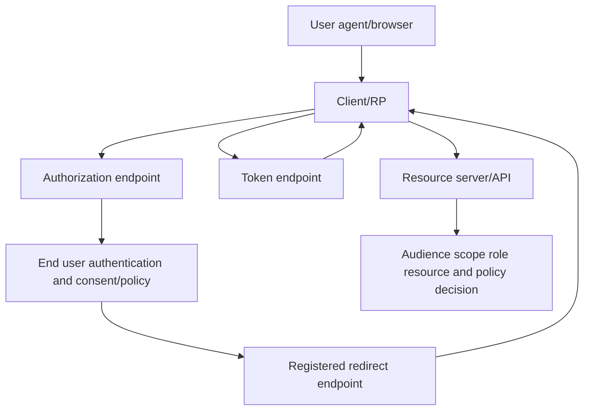
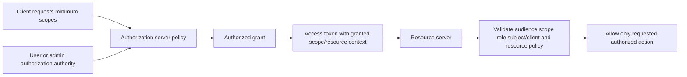
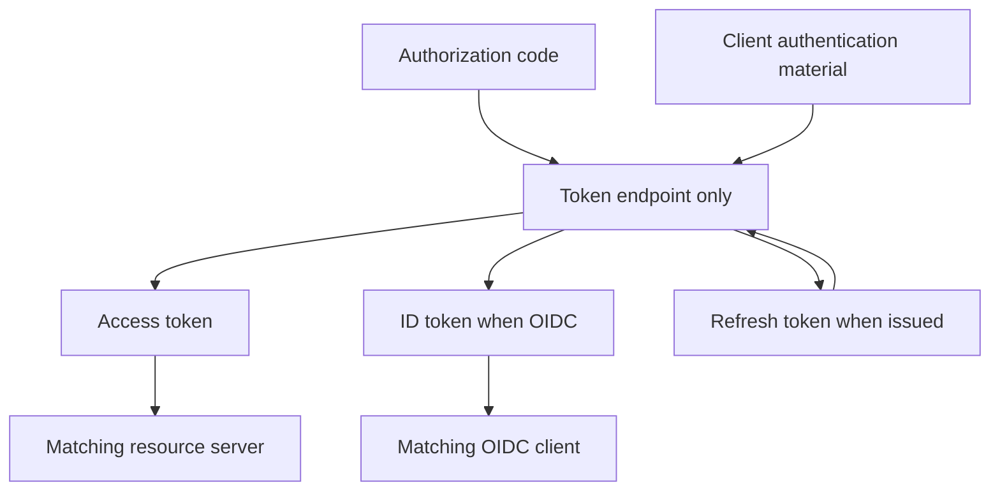
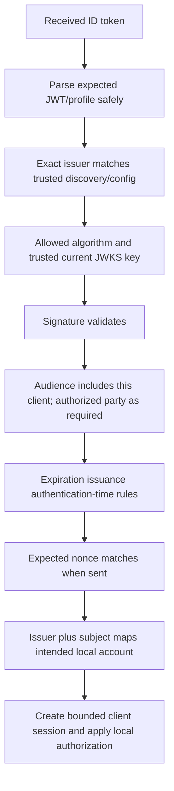
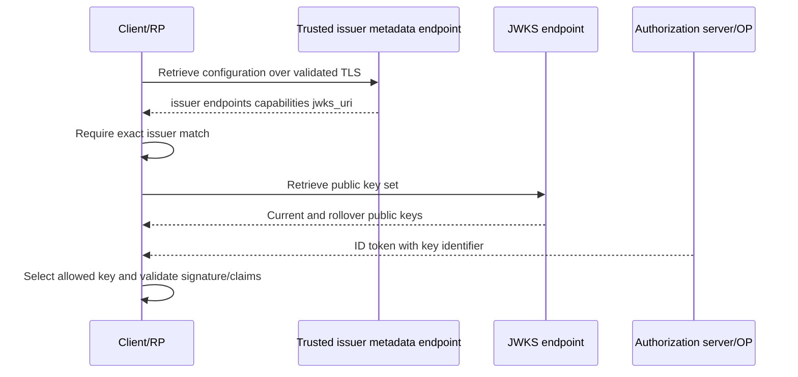
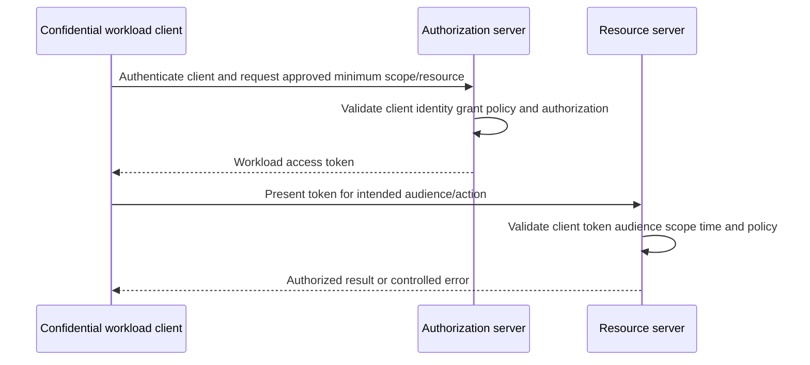
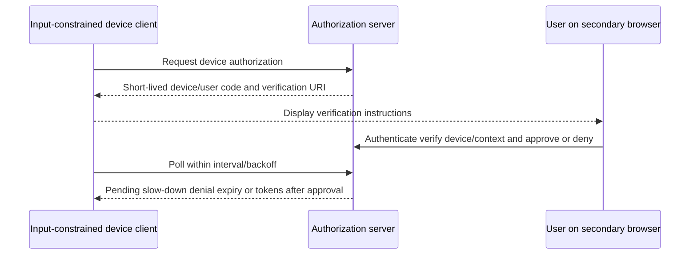
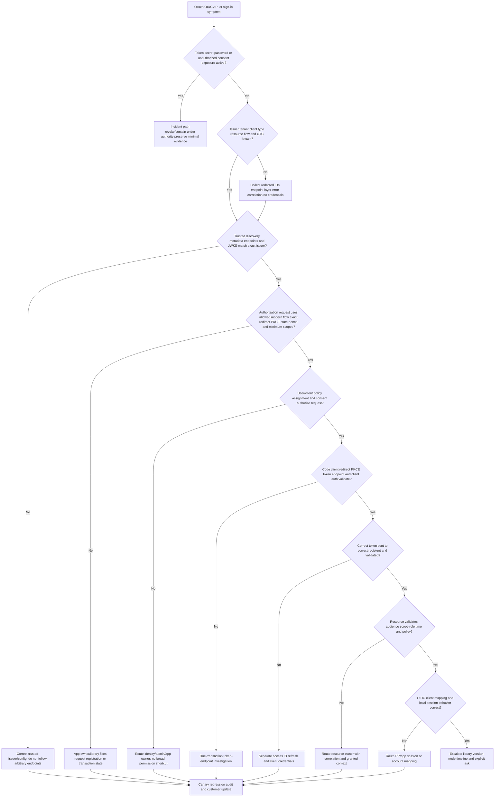

# Part 062 - OAuth and OpenID Connect

## Section goal

This Part explains **OAuth 2.0** and **OpenID Connect (OIDC)** from zero knowledge. OAuth is an authorization framework that lets a client obtain limited access to a protected HTTP resource without receiving the resource owner's password. OIDC is an identity layer built on OAuth 2.0 that lets a relying party verify an end user's authentication and receive defined identity claims, principally through an ID token.

The most important distinction is purpose. OAuth answers, “May this client call this resource with this authorization?” OIDC adds, “Which subject authenticated at this issuer for this client, and what claims describe that authentication?” OAuth alone is not a standardized login protocol. An access token is for a resource server. An ID token is for the OIDC client/relying party. A refresh token is for the authorization server's token endpoint. Interchanging them creates security and support failures.

The central rule is:

> Identify the actor, flow, issuer, client, redirect URI, resource/audience, scope, token type, validation owner, and current security profile before diagnosing an OAuth or OIDC symptom; never expose a token or “fix” a flow by weakening redirect, PKCE, state, nonce, issuer, audience, signature, time, or consent checks.

For modern redirect-based user flows, this Part centers **authorization code with Proof Key for Code Exchange (PKCE)**. Current RFC 9700 security best practice requires PKCE for public clients and recommends it for confidential clients. It advises clients not to use the implicit grant in ordinary modern designs, and it states that the resource owner password credentials grant must not be used. This guide therefore provides no setup recipe, payload, or migration workaround for deprecated insecure flows.

Client credentials and device authorization are explained only at an architectural support level. No live authorization request, token exchange, app registration, consent, secret, certificate, user code, or API call appears in the lab. Microsoft identity documentation is a production-transfer anchor for you; Okta, Google, Slack, Zoom, Abnormal, and other platform implementations remain learned or unknown unless the candidate has direct evidence.

## Learning outcomes

After completing this Part, you should be able to:

- distinguish authentication, authorization, delegation, consent, client authentication, and resource-server authorization;
- define resource owner, end user, client, user agent, authorization server, OpenID Provider, resource server, relying party, protected resource, grant, code, token, scope, and claim;
- distinguish public and confidential clients by their ability to protect client credentials, not by whether a client ID is visible;
- draw authorization code with PKCE and explain code verifier/challenge binding without generating a usable value;
- explain state, nonce, redirect URI, issuer, client ID, audience, resource, scope, and consent boundaries;
- distinguish access, ID, and refresh tokens by intended recipient, purpose, validation, and handling;
- explain OIDC discovery, authorization-server metadata, JSON Web Key Set (JWKS), key IDs, and rollover conceptually;
- explain client credentials for workload-to-resource access and why it does not represent a human user;
- explain device authorization for constrained devices and its phishing/polling risks at a high level;
- explain token introspection and revocation as optional standardized capabilities with deployment-specific policy/latency;
- classify authorization-endpoint, token-endpoint, resource-server, client/session, discovery/JWKS, consent, and policy errors;
- avoid deprecated/insecure flow guidance and reject requests to collect user passwords or expose client secrets/tokens; and
- give a truthful Microsoft-transfer, standards-learning, and named-platform-boundary answer.

## JD Mapping

| Supplied role signal | Capability built | transferable evidence | Boundary |
|---|---|---|---|
| REST APIs and integrations | Traces client, authorization server, resource server, token, scope, and errors | REST/JSON/Postman/cURL working knowledge | Lab executes no OAuth/API request |
| Microsoft 365 ecosystem | Uses Entra identity platform as a concrete official example | Microsoft cloud support and Entra fundamentals | No claim of app-registration/consent ownership without evidence |
| SaaS Security | Connects grants, scopes, tokens, workload identities, and revocation | Security/identity upskilling | No Abnormal implementation claim |
| Complex support investigations | Separates browser authorization, token exchange, API use, and app session | critical situation and escalation habits | No invented OAuth incident |
| Configuration tickets | Checks redirect URI, client type, consent, issuer, resource, and key metadata | Evidence-based configuration support | No weakening security controls |
| Customer trust/privacy | Treats tokens and claims as credentials/sensitive data | Enterprise communication and redaction | Never request raw token/secret/password |
| AI Security Agents/integrations | Reasons about workload/client identity and least privilege | Copilot/agent and automation familiarity | No assumption about agent auth design |
| Engineering collaboration | Produces endpoint/layer/error/correlation evidence and exact ask | Fix validation and Engineering/Product work | Protected values remain redacted |

## Candidate honesty note

| Evidence tier | Safe statement | Do not imply |
|---|---|---|
| **Production transfer - Microsoft** | “My prior cloud support and Entra fundamentals transfer to tenant, identity, client/resource, browser, policy, and evidence reasoning.” | Full production OAuth authorization-server implementation or app-consent ownership |
| **Local/public lab** | “I built a non-executable OAuth/OIDC flow and validation workbook with placeholders only.” | A live app registration, consent, token, or API call |
| **Learned standards** | “I anchor modern security guidance in RFC 9700, OAuth/OIDC specifications, and current Microsoft Learn.” | That every vendor supports every optional endpoint or claim |
| **No direct experience** | “I have not administered Abnormal, Okta, Google, Slack, or Zoom OAuth integrations in production.” | Hidden platform credentials or implementation knowledge |
| **Proprietary unknown** | “Abnormal's clients, flows, redirect URIs, scopes, token formats, issuer, keys, consent, and revocation behavior are unknown unless approved documentation states them.” | Generic OAuth equals Abnormal behavior |

Safe interview language:

> “I understand OAuth/OIDC from standards and experience transfer experience. I would identify whether the failure is authorization, authentication, consent, token exchange, resource API, or application session; collect only redacted metadata and correlation IDs; and verify issuer, client, redirect, PKCE, state/nonce, resource/audience, scope, token lifetime, and policy. I would not request a password, token, authorization code, refresh token, secret, or private key.”

## 1. Authorization versus authentication

**Authorization** is permission to perform actions on resources. **Authentication** establishes confidence in an identity. OAuth's core purpose is delegated authorization. OIDC profiles OAuth to provide an authentication result and identity claims to a client.

| Question | OAuth | OIDC |
|---|---|---|
| Primary purpose | Limited authorization to protected resources | Authentication and identity claims on OAuth |
| Main artifact | Access token; optionally refresh token | ID token plus OAuth artifacts |
| Intended consumer | Resource server for access token | Client/relying party for ID token |
| User identity guarantee | Not standardized by OAuth alone | Defined through issuer/subject and ID-token validation |
| Standard scope marker | Authorization-server defined scopes | `openid` marks an OIDC request |
| Common misuse | Treat access token as login proof | Send ID token to unrelated API |



## 🔍 Plain-English deep-dive: OAuth is a valet key; OIDC adds a verified identity card

A car owner gives a valet a limited key. The key may start the car but not open the trunk. That resembles an OAuth access token: limited capability for a resource, not the owner's password. The parking system decides the key's scope, destination, and lifetime.

An OIDC ID token is closer to a signed identity card handed to the valet application, stating which subject authenticated at which issuer for which client. The identity card is not the car key. Presenting it to the car does not make it an access token; presenting the valet key as proof of legal identity is also wrong.

The analogy stops because tokens can be opaque or structured and require precise validation. Its lesson is memorable: access token goes to the API; ID token goes to the client; refresh token goes to the authorization server.

**Memory cue:** Key opens resource; identity card informs client; renewal voucher returns to issuer.

## 2. OAuth and OIDC actors

| Actor | Plain meaning | Responsibility | Failure boundary |
|---|---|---|---|
| Resource owner | Entity able to grant access | Approves or has policy authorize access | Consent/business authority |
| End user | Human participant | Authenticates and interacts | Identity/policy/user journey |
| Client | Application requesting protected access | Register, redirect, store state, handle tokens safely | Client config/session/security |
| User agent | Browser or equivalent | Carries front-channel interaction | Cookies, redirects, network, privacy |
| Authorization server | Issues tokens after validating grant/policy | Endpoints, client/grant validation | Authorization/token service |
| OpenID Provider | Authorization server supporting OIDC | Authenticates user and issues ID token | OIDC issuer/claims/keys |
| Resource server | API hosting protected resource | Validate token and authorize action | Audience/scope/role/resource policy |
| Relying party | OIDC client relying on authentication | Validate ID token and create session | Client/session/account mapping |



## 3. Clients: public versus confidential

A **client ID** identifies a client registration and is not a secret. A **public client** cannot reliably keep credentials confidential, such as browser-based or installed software distributed to users. A **confidential client** can protect credentials or use a suitable client-authentication method in a controlled backend. Classification depends on the component and deployment, not marketing labels.

| Client characteristic | Public client | Confidential client |
|---|---|---|
| Can protect shared secret? | No reliable guarantee | Backend can protect under controls |
| PKCE | Required by current BCP | Recommended by current BCP |
| Client authentication | Cannot rely on embedded shared secret | Supported configured method |
| Typical component | SPA/native app | Server-side web/daemon backend |
| Main risk | Code/token theft from user environment | Credential/key compromise and broad grants |
| Support evidence | Client ID/type, redirect, PKCE metadata | Plus auth method/key/secret expiry metadata |

Never place a client secret in browser JavaScript, a native binary and call it confidential, a URL, support ticket, source repository, screenshot, or public lab. Use supported libraries and secure secret/key/workload-identity facilities.

## 4. Grants, flows, and endpoints

An **authorization grant** represents authorization used by a client to obtain an access token. A **flow** is the end-to-end interaction. The authorization endpoint interacts through the user agent. The token endpoint exchanges a grant or refresh token for tokens. A redirect endpoint belongs to the client. A resource endpoint belongs to the API.

| Endpoint | Owner | Receives conceptually | Returns conceptually | Never assume |
|---|---|---|---|---|
| Authorization | Authorization server/OP | Client ID, redirect, scope, state, PKCE, OIDC parameters | Code or controlled error via user agent | It is an API called with bearer token |
| Token | Authorization server/OP | Code + verifier, client auth as applicable, or other grant | Access/ID/refresh tokens or error | Browser may safely hold a client secret |
| Redirect/callback | Client | Authorization response | Client session transition | Any arbitrary redirect is acceptable |
| Resource/API | Resource server | Access token and API request | Resource result or auth error | ID token is valid API authorization |
| UserInfo | OIDC protected resource | Access token | Authorized user claims | ID-token subject need not be cross-checked |
| Introspection | Authorization server | Token from authorized resource | Active state/metadata | Public unauthenticated token decoder |
| Revocation | Authorization server | Token from authorized client | Revocation response | Every access token stops everywhere instantly |

## 5. Authorization code with PKCE

**PKCE** means Proof Key for Code Exchange, pronounced “pixy.” The client creates a high-entropy, transaction-specific **code verifier** and derives a **code challenge**. It sends the challenge with the authorization request. Later it sends the verifier with the code to the token endpoint. The authorization server compares the derivation. Someone who steals only the authorization code cannot redeem it without the verifier.

This guide uses placeholders and never generates operational verifier/challenge values.

```mermaid
sequenceDiagram
    participant User as User/browser
    participant Client as Client
    participant AS as Authorization server/OP
    participant RS as Resource server
    Client->>Client: Create transaction state nonce if OIDC and PKCE verifier
    Client-->>User: Redirect with client ID exact redirect scope state challenge S256
    User->>AS: Authorization request
    AS->>User: Authenticate and obtain authorization/consent
    AS-->>User: Redirect with short-lived code and state
    User->>Client: Callback
    Client->>Client: Validate state and issuer context
    Client->>AS: Code plus original redirect plus verifier; client auth if applicable
    AS->>AS: Validate code client redirect PKCE grant and policy
    AS-->>Client: Access token; ID token for OIDC; optional refresh token
    Client->>Client: Validate OIDC ID token before session use
    Client->>RS: Access token for intended resource
    RS->>RS: Validate token audience scope role time and policy
```

| PKCE element | Location | Purpose | Failure |
|---|---|---|---|
| Code verifier | Client transaction; later token request | Secret proof for this code exchange | Lost/mismatched/low entropy |
| Code challenge | Authorization request | Binds eventual verifier to code | Missing/wrong method |
| Challenge method | Authorization request | Defines transformation | Downgrade/unsupported method |
| Authorization code | Browser callback then token endpoint | Short-lived grant artifact | Expired/reused/wrong client |
| Server binding | Authorization server | Associates code, challenge, client, redirect | Implementation/config defect |

Current security guidance favors the `S256` challenge method. Do not downgrade to `plain` after an error in a modern design; investigate supported metadata, client/library version, and configuration.

## 🔍 Plain-English deep-dive: PKCE is a claim ticket with a private matching pattern

At a coat desk, the customer keeps a private pattern and gives the desk only a derived mark when checking in a coat. The desk issues a claim ticket. A thief may steal the visible ticket, but cannot collect the coat without presenting the private pattern that matches the stored mark.

The authorization code resembles the claim ticket. The verifier resembles the private pattern. The challenge resembles the derived mark recorded by the desk. The code is also bound to the client and redirect context under the protocol.

The analogy stops because PKCE uses cryptographic randomness and a defined transformation rather than a human pattern. Its support lesson is exact: trace one transaction's challenge at authorization and verifier at token exchange; never ask the customer to reveal a live verifier, code, or token in an unprotected channel.

**Memory cue:** Challenge goes out; verifier comes back; stolen code alone should fail.

## 6. State, nonce, and redirect URI

`state` and `nonce` have related but distinct roles. **State** is a client value carried through the authorization response and bound to the user-agent transaction, commonly used for cross-site request forgery protection and local state correlation. **Nonce** is an OIDC value included in the ID token and validated by the relying party to bind the authentication result and mitigate replay. **Redirect URI** is the pre-registered client destination for the response.

| Value | Sent to | Returned in | Primary question | Unsafe shortcut |
|---|---|---|---|---|
| `state` | Authorization endpoint | Authorization response | Is callback bound to this client browser transaction? | Static/predictable or unvalidated state |
| `nonce` | OIDC authorization request | ID token claim | Is ID token bound to expected authentication transaction? | Ignore missing/mismatch |
| Redirect URI | Authorization endpoint/token exchange | Browser destination and code binding | Is this exact registered callback for the client? | Wildcard/open redirect |
| Issuer | Discovery/config and token | Metadata/ID token/response mechanisms | Which authorization server issued this? | Host-only comparison |
| Client ID | Authorization/token context | Audience relationship | Which registration requested result? | Treat as secret/authentication |

Do not put sensitive URLs, PII, tenant secrets, or authorization data directly in state. Use an opaque reference to server-side or appropriately protected client state. Redirect URI matching must follow current standards/product rules, generally exact matching with narrow documented exceptions.

## 7. Scopes, claims, roles, and consent

A **scope** is a string defined by an authorization server/resource ecosystem that represents requested access. A **claim** is a name/value statement in a token or response. A **role** is an authorization concept whose representation is deployment specific. **Consent** is an authorization decision by a user or administrator under policy; a click alone does not eliminate organizational, legal, or security requirements.



| Item | Requested/issued where | Enforced where | Caution |
|---|---|---|---|
| Scope | Authorization/token request and token context | Authorization and resource server | Names are provider/resource specific |
| Claim | Token/UserInfo/introspection | Consumer interprets according to contract | Presence is not automatic authorization |
| App role | Registration/assignment/token depending platform | Resource/application | Different from directory admin role |
| Consent | Authorization server policy/UI/admin process | Determines grant | Does not replace target app assignment |
| Resource/audience | Requested/associated token target | Resource server | Token for API A must not go to API B |

Least privilege means minimum client, resource, actions, fields, subjects, duration, and offline access. Review granted scopes, not only requested scopes or friendly consent text.

## 8. Token types and recipients

| Artifact | Intended recipient | Purpose | Typical validation/handling | Must not be used as |
|---|---|---|---|---|
| Authorization code | Authorization server token endpoint via client | Exchange grant for tokens | Short-lived, single-use, bound to client/redirect/PKCE | API token |
| Access token | Resource server | Authorize protected resource request | Resource validates active/time/audience/scope/policy | Generic client login proof |
| ID token | OIDC client/RP | Communicate authentication event/subject claims | Client validates issuer, audience, signature/key, time, nonce | Access token for arbitrary API |
| Refresh token | Authorization server token endpoint | Obtain new access tokens | Client protects; issuer binds/rotates/revokes | Resource-server credential |
| Client credential/assertion | Authorization server endpoint | Authenticate confidential client | Secret/key protection, issuer/audience/time as applicable | End-user identity |



Token format is independent from token purpose. An access token may be opaque or JWT-shaped. A client should not depend on internal access-token contents for an API it does not own. Part 064 covers token, secret, session, and storage hygiene in greater depth.

## 9. OpenID Connect and ID-token validation

OIDC requests include the `openid` scope. The OpenID Provider authenticates the user and the relying party receives an ID token, normally a JSON Web Token (JWT). The RP must validate according to OIDC and its registered configuration using a mature library.



| Claim/element | Plain meaning | Support check |
|---|---|---|
| `iss` | Issuer identifier | Exact trusted issuer/discovery match |
| `sub` | Subject identifier within issuer | Pair with issuer; do not use email instead |
| `aud` | Intended audience/client | Contains expected client ID |
| `azp` | Authorized party where applicable | Validate under profile/multiple audience rules |
| `exp` | Expiration time | Current UTC before expiry with approved skew |
| `iat` | Issued-at time | Plausible/current under client policy |
| `nonce` | Transaction binding | Exact expected value when requested |
| `auth_time` | Time of end-user authentication | Check when freshness required |
| `acr`/`amr` | Authentication context/method references | Interpret only under documented contract |

Use issuer plus subject as the stable OIDC identity key. OpenID Connect explicitly warns that email, preferred username, and similar claims are not guaranteed unique or stable across time/issuers.

## 10. Discovery, metadata, and JWKS

**Discovery** lets a client obtain OpenID Provider configuration from a well-known location. OAuth authorization-server metadata serves a related general OAuth purpose. Metadata can include issuer, authorization endpoint, token endpoint, supported scopes/grants/response types/client authentication methods, introspection/revocation endpoints, and `jwks_uri`. A **JWKS** is a JSON Web Key Set containing public key representations.



| Metadata item | Why it matters | Failure mode |
|---|---|---|
| Issuer | Trust anchor and token identity namespace | Path/tenant mismatch or mix-up |
| Authorization endpoint | User-agent authorization destination | Wrong environment/tenant |
| Token endpoint | Code/refresh exchange destination | Code sent to wrong issuer |
| JWKS URI | Public verification keys | Stale cache/unknown key ID |
| Grant/response support | Client compatibility | Unsupported flow/response |
| PKCE methods | Secure code-flow capability | Missing/misread `S256` support |
| Client-auth methods | Confidential client compatibility | Wrong secret/cert/assertion method |
| Revocation/introspection | Optional lifecycle/status endpoints | Assumed available when absent |

Metadata is not trusted merely because it is JSON. Retrieve from the intended issuer through validated TLS and ensure returned issuer exactly matches expected issuer. Key provenance matters; never accept an arbitrary key URL from an untrusted token header.

## 🔍 Plain-English deep-dive: Discovery is an official station map, not permission to board every train

A railway publishes an official map listing stations, platforms, and supported services. The map helps a traveler avoid manually typing every destination. The traveler still verifies the map came from the correct railway and that the railway name printed inside matches the expected operator.

OAuth/OIDC metadata similarly publishes endpoints and capabilities. JWKS is like the current list of official seal samples used to verify tickets. A new key ID can mean normal rollover, stale cache, wrong issuer, or malicious input. The client refreshes only from the trusted configured JWKS URI and still validates issuer, audience, time, nonce, and signature.

The analogy stops because metadata and keys are security-critical machine inputs. Its lesson is: discovery reduces configuration error but does not replace provenance, exact issuer matching, TLS validation, capability checks, or token validation.

**Memory cue:** Discover from trusted issuer; verify issuer again; fetch keys only from trusted metadata.

## 11. Client credentials at a high level

The **client credentials grant** is used by a confidential client acting on its own behalf or under a prearranged authorization. There is no human resource owner interaction in the flow. The resulting access token represents client/workload authorization, not an end-user login. It must be scoped to the intended resource/actions.



| Client-credentials question | Why |
|---|---|
| Which workload/client ID? | Exact principal and registration |
| Who owns it? | Accountability and lifecycle |
| Which auth method? | Secret/certificate/federation expiry and protection |
| Which tenant/issuer? | Trust boundary |
| Which resource/audience? | Prevent token redirect |
| Which scope/app role? | Least privilege |
| Which environment? | Prevent dev/prod crossover |
| Which sign-in/audit event? | Usage and compromise evidence |

Do not “fix” invalid client by moving a secret to a browser, logging it, or sharing it. Collect secret identifier/expiry metadata, not the secret value.

## 12. Device authorization at a high level

The device authorization grant supports Internet-connected input-constrained devices or clients without a suitable browser. The device obtains a device code/user code and tells the user to use a browser on another device to review and approve. The device polls according to server instructions. It is not a replacement for normal browser-based OAuth on capable devices.



| Risk/control | Support concept |
|---|---|
| Remote phishing | User confirms they initiated and possess/recognize device |
| Code guessing | Entropy, expiry, rate limiting |
| Polling overload | Respect interval, slow-down, timeout backoff |
| Wrong account/device | Display clear client/device and authorization context |
| Public-client impersonation | Understand device client limitations |
| Code exposure | Treat codes as temporary sensitive artifacts; never collect in chat |

The lab contains no device/user code. If a customer receives an unsolicited device-authorization prompt, advise them through the organization's security process not to approve unknown requests.

## 13. Introspection, revocation, and session reality

**Token introspection** lets an authorized protected resource ask an authorization server about token active state and metadata. **Token revocation** lets a client notify an authorization server that a token is no longer needed. Both are optional capabilities in a deployment and require protected endpoints and policy.

| Mechanism | Caller | Purpose | Caution |
|---|---|---|---|
| Introspection | Authorized resource server | Determine current active state/context | Caching can delay revocation visibility |
| Revocation | Authorized client | Invalidate token/grant under policy | Related-token cascade is policy/design dependent |
| Short access lifetime | Authorization server policy | Bound exposure/window | Does not replace refresh-token protection |
| Refresh rotation | Authorization server/client | Detect/restrict replay patterns | Client must safely replace/discard old token |
| Local session logout | Client/app | End local app session | Does not necessarily revoke every token/IdP session |
| IdP/AS logout | Authorization system | End central session per supported mechanisms | Does not guarantee every app session ends instantly |

Revocation success does not always mean every distributed resource rejects a self-contained access token immediately. Consider token type, lifetime, resource validation, introspection caching, propagation, related grant policy, and local sessions.

## 🔍 Plain-English deep-dive: Logging out, revoking a pass, and closing a building are separate actions

Imagine a visitor leaves one office and returns its temporary room badge. The office session is closed, but the visitor may still have an active building pass issued by security. Security can revoke that pass, yet a remote door controller with an old cached list might recognize it briefly. Closing the entire building session is a different action again.

An application logout usually ends the client's local session. Token revocation asks the authorization server to invalidate a token or related grant under its policy. An authorization-server logout affects the central login session according to supported mechanisms. A resource server can continue accepting a short-lived self-contained token until expiry or until revocation state reaches its validation path. These outcomes must be measured separately.

The analogy stops because token validation, introspection, caches, and logout profiles vary by system. Its support lesson is exact: state which session, token, grant, client, and resource should stop working, at what time, and by what authoritative evidence.

**Memory cue:** End app session, revoke grant, expire token, and end IdP session are four different events.

## 14. Deprecated and insecure patterns boundary

This Part does not teach how to configure or execute deprecated insecure flows.

| Pattern | Current boundary | Safer direction |
|---|---|---|
| Resource owner password credentials | RFC 9700 says it must not be used | Standards-supported redirect/device/workload flow appropriate to client |
| Implicit grant/access token in authorization response | Current BCP says clients should not use it absent exceptional mitigations | Authorization code with PKCE and current profile/library |
| Access token in URL query | High leakage risk; current guidance rejects this pattern | Authorization header under TLS |
| Shared secret in SPA/native app | Public component cannot protect it | PKCE; backend/confidential component if architecture needs one |
| Wildcard/open redirect | Enables credential/code leakage | Exact registered redirects and no open redirector |
| Static/reused state/nonce/verifier | Breaks transaction binding | Unique, random, securely bound values |
| Hand-rolled OAuth/OIDC validation | Easy to miss profile/security requirements | Supported mature library and provider guidance |

## 15. Error taxonomy

| Location | Example category | Likely layer | Evidence |
|---|---|---|---|
| Authorization endpoint | `invalid_request` | Missing/malformed parameter | Redacted parameter presence and correlation |
| Authorization endpoint | `unauthorized_client` | Registration/flow not allowed | Client ID/type/grant support |
| Authorization endpoint | `access_denied` | User/policy denied | Consent/policy event, no token |
| Authorization endpoint | `invalid_scope` | Scope name/resource/policy | Requested scope names, app/resource IDs |
| OIDC silent request | `login_required`/`interaction_required` | User interaction/session/policy | Prompt mode and session context |
| Token endpoint | `invalid_client` | Client authentication | Method, credential ID/expiry, no secret |
| Token endpoint | `invalid_grant` | Code/verifier/redirect/expiry/reuse | One-transaction timeline |
| Token endpoint | `unsupported_grant_type` | Flow/profile mismatch | Metadata and client config |
| Resource server | `invalid_token`/401 | Token invalid/expired/wrong validation | Audience/issuer/time and API correlation |
| Resource server | `insufficient_scope`/403 | Token valid but lacks access | Granted scope/role and requested action |
| Client/RP | Nonce/issuer/audience/signature error | ID-token validation | Discovery/JWKS/key ID and claims metadata |
| Browser | CORS/cookie/network error | Client platform/browser/network | DevTools error, origin, redirect type, no token |

## 16. Worked example 1: Redirect URI mismatch

**Input:** Authorization fails before the callback with a redirect mismatch.

**Reasoning:** Identify issuer/tenant, client ID, client type, exact requested redirect, registered redirects, environment, scheme/host/port/path/case/encoding, and reverse-proxy external URL. Do not add a wildcard or broad domain.

**Evidence:** Fictional client `CLIENT-062-A`, expected and observed structural URI components, error/correlation ID, UTC, and registration version. No code/token/secret.

**Result:** The authorized app owner registers the exact intended production callback through change control and removes obsolete redirects after validation.

**Caveat:** Localhost/native exceptions and platform client types are profile/provider specific.

## 17. Worked example 2: `invalid_grant` after callback

**Input:** The browser returns a code, but token exchange reports `invalid_grant`.

**Reasoning:** Keep to one transaction. Check code age/use, client ID, issuer/token endpoint, exact redirect used in both legs, PKCE challenge/verifier binding result, client authentication, and clock. Do not request the code or verifier value; use server/client validation logs and IDs.

**Evidence:** Transaction ID, code issue/redeem UTC, code-used boolean, PKCE validation result, redirect comparison result, token endpoint host/issuer, and correlation.

**Result:** The fictional client lost transaction state and sent a verifier from another browser tab. Engineering fixes per-transaction storage through the supported library.

**Caveat:** The same error label covers several causes; the error name alone is not RCA.

## 18. Worked example 3: Wrong audience at API

**Input:** Token acquisition succeeds, but API returns 401 and records wrong audience.

**Reasoning:** Identify the intended resource, requested scopes/resource indicator, access-token audience metadata available to the API owner, API endpoint, issuer, and client. Do not decode or validate a token for an API the support team does not own in public tooling.

**Evidence:** Resource ID, granted scope names, API correlation, issuer, audience-validation result, HTTP status, and UTC; raw token omitted.

**Result:** The client requested authorization for API A and sent the token to API B. Correct resource/scope selection through approved config.

**Caveat:** Scope names and multi-resource behavior are provider specific.

## 19. Worked example 4: OIDC key rollover

**Input:** RP reports an unknown `kid` after the issuer rotates signing keys.

**Reasoning:** Confirm exact issuer, trusted discovery document, JWKS URI, cache time, token key ID metadata, allowed algorithm, and distributed node state. Refresh JWKS from trusted metadata, not a token-supplied arbitrary URL.

**Evidence:** Issuer, discovery/JWKS retrieval UTC, key IDs/fingerprints, cache headers, RP node, token issue time, and validation result; no token.

**Result:** One RP node retained stale JWKS beyond expected cache behavior. Engineering corrects refresh/cache handling and validates overlap.

**Caveat:** Unknown key can also indicate wrong issuer or malicious token; do not auto-trust.

## 20. Worked example 5: Consent exists but API returns 403

**Input:** Administrator says consent is granted; resource server returns insufficient scope.

**Reasoning:** Consent authorizes a grant under policy but token must contain/represent the required granted scope/role for the correct resource, and the calling identity must satisfy resource authorization. Check delegated versus application context, assignment, token acquisition after consent, and API action.

**Evidence:** Client/resource IDs, consent grant metadata, granted scope/role names, token issuance UTC, API action/result, and correlation.

**Result:** Consent covered read but the client attempted write. Request only justified permission through governance; do not broaden to a global permission for testing.

**Caveat:** Provider terms and admin-restricted permissions vary.

## 21. Worked example 6: Logout expectation mismatch

**Input:** User logs out of the app, closes the tab, reopens it, and signs in without a prompt; they report logout is broken.

**Reasoning:** Separate local application session, authorization-server session, refresh token/grant, access-token lifetime, browser cookies, and single sign-on. Local logout can end only the app session while the IdP session enables immediate reauthentication.

**Evidence:** Local session termination event, IdP/AS session behavior, token/grant revocation policy, browser context, UTC, and product logout documentation.

**Result:** Explain expected layered session behavior or route a real local-session defect. Do not expose cookie/token values.

**Caveat:** Logout/profile support is provider and application specific.

## 22. Customer-safe evidence

| Needed evidence | Safe form | Prohibited form |
|---|---|---|
| Client | Client ID and type under policy | Client secret/private key |
| Issuer/tenant | Approved redacted ID/URL structure | Unnecessary full tenant export |
| Flow | Auth code + PKCE, client creds, device high-level | Live runnable request URL with values |
| Redirect | Exact structure in restricted case; sanitized derivative | Authorization code in URL |
| Scopes/resource | Names/IDs and granted result | Broad token dump |
| Token | Type, issuer/audience/time/key ID validation result | Raw access/ID/refresh token |
| Credential | Type, ID/fingerprint, expiry metadata | Secret, assertion, private certificate key |
| Error | Code, endpoint layer, UTC, correlation/trace | Full response containing credentials/PII |
| Browser | HAR/DevTools sanitized headers and origins | Cookies, Authorization headers, codes |

## Troubleshooting decision tree



## 23. Common failure modes

| Failure mode | Why it fails | Better behavior |
|---|---|---|
| OAuth equals login | Core OAuth is authorization | Use OIDC for standardized authentication |
| Access token identifies user to client | Token is for resource server and may represent client | Validate ID token for OIDC client |
| ID token calls API | Wrong intended recipient/purpose | Send access token to matching resource |
| Refresh token calls API | Refresh token is for token endpoint | Protect and use only with issuer |
| Client ID is secret | It is an identifier | Protect actual client authentication material |
| Secret embedded in SPA/native app | Public environment cannot protect it | PKCE and supported architecture |
| Disable PKCE after error | Enables downgrade/weakens binding | Require/fix S256 support/config |
| Use implicit for convenience | Current BCP warns against it | Authorization code with PKCE |
| Collect user password in client | RFC 9700 prohibits password grant | Appropriate modern supported flow |
| Wildcard redirect | Enables leakage/mix-up/open redirect risk | Exact registered redirect |
| Static state/nonce/verifier | Breaks transaction/replay protection | Unique and securely bound per transaction |
| Put PII/deep URL in state | Leaks through browser/logs | Opaque state reference |
| Decode token without validation | Parse is not trust | Mature validation and correct recipient |
| Trust key from token header URL | Attacker controls key reference | Keys from trusted issuer metadata/JWKS |
| Unknown `kid` means add arbitrary key | Wrong issuer/malicious token possible | Verify issuer and refresh trusted JWKS |
| Consent means every API action | Scope/resource/local auth still apply | Inspect granted permission and action |
| Retry invalid grant repeatedly | Codes are short-lived/single-use | Start clean transaction after cause check |
| Log tokens for support | Bearer/token leakage | Redacted metadata and correlation IDs |
| Local logout equals global logout/revocation | Sessions/grants/tokens are layered | Define exact expected logout boundary |
| experience transfer equals all-vendor experience | Overstates evidence | Named-platform honesty boundary |

## 24. Escalation packet

| Section | Required content |
|---|---|
| Impact | Sign-in/API/action impact and active security risk |
| Actors | Issuer/AS, tenant, client ID/type, user/workload, resource/API |
| Flow | Authorization code+PKCE, client credentials, or device high-level |
| Metadata | Trusted issuer, discovery URL, endpoint and JWKS version/time |
| Request | Redirect match, scopes/resource, state/nonce/PKCE presence/results |
| Authorization | Assignment, consent/grant, policy, delegated/application context |
| Exchange | Code issue/redeem UTC, token endpoint, client auth method/result |
| Tokens | Type, intended recipient, issuer/audience/scope/time/key-ID validation results; no values |
| Resource | API endpoint/action, HTTP/error, correlation, audience/scope/role result |
| Session | RP account mapping/local session and logout expectation |
| Change | Registration, key, permission, policy, library, browser, proxy changes |
| Ask | Exact AS/IdP, client, resource, identity, security, or Engineering need |

## Safe synthetic lab: The OAuth OIDC Boundary Exchange 062

### Objective

Build a local, non-executable flow and evidence workbook for a fictional authorization server, OIDC relying party, resource API, user, and workload client. The unique lab is **The OAuth OIDC Boundary Exchange 062**.

Use placeholders only. Do not create a valid authorization URL, PKCE pair, state, nonce, code, token, client secret, private key, device/user code, JWT, or API request. The lab analyzes field presence, ownership, validation, and failures without executing protocol activity.

### Prerequisites

- Local Markdown editor or paper.
- This Part and fictional identifiers `ISS-062`, `CLIENT-062`, `USER-062`, `WORKLOAD-062`, `RESOURCE-062`, `TXN-062`, `KEY-062`, and `CASE-062`.
- Reserved text-only hostnames under `example.test`.
- No Entra tenant, Okta org, Abnormal account, app registration, browser flow, API client, public decoder, token endpoint, credential, consent, or network call.
- Artifact label: **local/public lab - synthetic non-executable OAuth OIDC architecture only**.
- Record start UTC, zero-token/secret statement, no-live-registration/consent statement, and source date August 24, 2026.

### Synthetic architecture

| Object | Fictional identifier | Purpose |
|---|---|---|
| Issuer/OP | `https://issuer-062.example.test` | Trust boundary only |
| Public client/RP | `CLIENT-062-PUBLIC` | Authorization code+PKCE model |
| Confidential workload | `CLIENT-062-WORKLOAD` | Client-credentials model |
| Resource API | `RESOURCE-062-API` | Access-token recipient |
| User | `USER-062-A` | OIDC subject placeholder |
| Key IDs | `KEY-062-OLD`, `KEY-062-NEW` | Rollover placeholders |

### Lab steps

1. Create the lab cover with artifact label, UTC, authorization, zero-live-system, zero-secret/token, and candidate-boundary statements.
2. Define authorization, authentication, delegation, consent, client authentication, resource owner, client, AS/OP, RP, resource server, grant, scope, claim, and token.
3. Draw an actor diagram and label front channel, back channel, trust boundaries, and intended token recipients.
4. Build a public/confidential client comparison and explain why client ID is not secret.
5. Draw authorization code+PKCE using placeholders `[VERIFIER-062-NOT-GENERATED]` and `[CHALLENGE-062-NOT-GENERATED]` only.
6. For each flow step, record actor, endpoint owner, input field names, sensitive-class label, output type, validation, log, and failure owner.
7. Build state, nonce, redirect, issuer, client, resource, scope, and consent boundary cards.
8. Create access/ID/refresh/code/client-credential comparison and one “wrong recipient” case for each.
9. Build an OIDC ID-token validation worksheet containing only claim names and pass/fail placeholders, never values or encoded tokens.
10. Build discovery/metadata/JWKS tables with fictional endpoints and old/new key IDs; no usable key material.
11. Model a client-credentials workload with owner, purpose, resource, minimum scope, auth-method metadata, rotation, audit, and retirement.
12. Model device authorization with blank code placeholders, user confirmation, polling interval concept, slow-down/backoff, expiry, and phishing warning.
13. Compare introspection, revocation, short lifetime, refresh rotation, local logout, and central session behavior.
14. Create an explicit prohibited-pattern register for password grant, implicit grant, token in URL, secret in public client, wildcard redirect, and public token decoder.
15. Build twelve failure cases covering redirect, state, PKCE, consent, invalid client, invalid grant, wrong resource, insufficient scope, nonce, issuer, unknown key ID, and logout expectation.
16. For each case, record endpoint layer, evidence without credentials, cheapest check, owner, corrective boundary, and forbidden shortcut.
17. Run the troubleshooting tree on four cases: invalid grant, wrong audience, unknown key ID, and 403 after consent.
18. Draft a customer-safe evidence request and Engineering escalation with explicit ask.
19. Deliver a 90-second OAuth/OIDC answer and a 60-second deprecated-flow safety answer.
20. Validate source URLs, August 24, 2026 ledger, cleanup, privacy, and rubric.

### Expected evidence

- Actor/front-channel/back-channel/trust-boundary diagram.
- Public versus confidential client comparison.
- Non-executable authorization-code+PKCE sequence.
- Per-step ownership/validation/evidence matrix.
- State/nonce/redirect/issuer/client/resource/scope/consent cards.
- Access/ID/refresh/code/client-credential recipient matrix.
- ID-token validation worksheet with no values.
- Discovery/JWKS rollover worksheet with placeholder key IDs.
- Client-credentials and device-authorization high-level maps.
- Introspection/revocation/session comparison.
- Deprecated/insecure-pattern prohibition register.
- Twelve failure cases, four decision-tree results, customer request, and escalation.
- Source ledger dated **August 24, 2026**.
- Candidate statement distinguishing experience transfer, standards learning, named-platform gaps, and Abnormal unknowns.

### Cleanup and privacy

- Confirm every ID and hostname is fictional, contains `062`, or uses `example.test`.
- Confirm no operational verifier, challenge, state, nonce, code, token, secret, assertion, private/public key body, device code, user code, URL, API request, cookie, Authorization header, tenant, or person data exists.
- Remove copied provider examples containing usable-looking credentials or real tenant/app IDs; retain field names only.
- Confirm no browser redirect, app registration, consent, API call, public decoder, metadata fetch, or token exchange occurred.
- Delete the artifact if real credential or identity data cannot be reliably removed.
- Record cleanup UTC and: `Synthetic non-executable OAuth/OIDC exercise only; zero live registration, consent, redirect, code, token, secret, key, device authorization, API call, upload, or production activity.`

### Validation rubric

| Dimension | Fail | Developing | Pass |
|---|---|---|---|
| Purpose | OAuth equals login | Mentions OIDC | Separates OAuth authorization, OIDC authentication, resource authorization |
| Actors | Client/server only | Lists four actors | Maps user, client/RP, browser, AS/OP, resource and ownership |
| Code flow | Code equals token | Adds PKCE | Per-transaction S256 challenge/verifier, state/nonce/redirect validation |
| Tokens | Interchanges tokens | Lists three types | Intended recipient, purpose, validation, storage, wrong-use cases |
| Discovery | Trusts JSON/key | Lists endpoints | Exact issuer, trusted metadata, JWKS provenance, cache/rollover |
| Consent/scopes | Consent means access | Checks scope | Resource/audience, granted context, local policy, least privilege |
| Other grants | Teaches passwords/implicit | Names grant | Safe client-credentials/device concepts and explicit deprecated boundary |
| Troubleshooting | Requests token | Uses error | Endpoint/layer, redacted metadata, correlation, owner, no weakened checks |
| Safety | Executes flow | Uses fake URL | Non-executable placeholders; zero tokens, secrets, calls, registrations |
| Honesty | Claims all vendors | Says standards | experience transfer, named vendors learned/no direct, Abnormal unknown |

## 25. Official Source Anchors

All source anchors were verified and recorded with guide currency date **August 24, 2026**. RFC 9700 is the current Best Current Practice security anchor that updates older OAuth guidance. Product behavior, metadata, error codes, UI, and library recommendations must be revalidated.

| Official or primary source | What it anchors | Boundary |
|---|---|---|
| [RFC 6749 - OAuth 2.0 Authorization Framework](https://www.rfc-editor.org/rfc/rfc6749.html) | Core roles, endpoints, grants, scopes, access and refresh tokens | Read with later security updates |
| [RFC 7636 - Proof Key for Code Exchange](https://www.rfc-editor.org/rfc/rfc7636.html) | PKCE verifier/challenge and code-binding concept | Use current BCP requirements |
| [RFC 9700 - Best Current Practice for OAuth 2.0 Security](https://www.rfc-editor.org/rfc/rfc9700.html) | Current PKCE, redirect, token, refresh, implicit/password-grant, and metadata security guidance | Primary current security anchor |
| [OpenID Connect Core 1.0](https://openid.net/specs/openid-connect-core-1_0.html) | OIDC authentication, ID tokens, claims, nonce, validation, UserInfo | OIDC profile, not generic access-token format |
| [OpenID Connect Discovery 1.0](https://openid.net/specs/openid-connect-discovery-1_0.html) | Issuer configuration, endpoints, JWKS URI, capabilities, exact issuer validation | Discovery is optional/product-profile specific |
| [RFC 8414 - OAuth Authorization Server Metadata](https://www.rfc-editor.org/rfc/rfc8414.html) | General OAuth metadata, endpoints, capabilities, introspection/revocation and PKCE metadata | Exact deployment support varies |
| [RFC 8628 - OAuth Device Authorization Grant](https://www.rfc-editor.org/rfc/rfc8628.html) | Input-constrained device flow, polling, codes, phishing and rate concerns | High-level only in this guide |
| [RFC 6750 - Bearer Token Usage](https://www.rfc-editor.org/rfc/rfc6750.html) | Bearer risk, Authorization header, errors, transport/storage protection | Updated by RFC 9700 where applicable |
| [RFC 7009 - Token Revocation](https://www.rfc-editor.org/rfc/rfc7009.html) | Revocation endpoint and policy/propagation concepts | Access-token immediacy depends on design |
| [RFC 7662 - Token Introspection](https://www.rfc-editor.org/rfc/rfc7662.html) | Authorized resource query for active state/context | Endpoint must be protected; caching tradeoff |
| [Microsoft Learn - OAuth 2.0 authorization code flow](https://learn.microsoft.com/en-us/entra/identity-platform/v2-oauth2-auth-code-flow) | Current Microsoft code+PKCE implementation concepts and error evidence | Microsoft example; use supported libraries |

### Source-use discipline

- Apply RFC 9700 security best current practice when older RFC examples conflict with modern recommendations.
- Use authorization code with PKCE for modern redirect-based user flows under provider guidance.
- Do not teach or recommend the resource-owner password grant or ordinary implicit grant.
- Use supported mature libraries; never hand-roll token validation for production.
- Never claim Abnormal or another vendor's flow, scope, token format, or endpoint without approved current documentation.

## Likely Interview Questions

### Q1. What is the difference between OAuth and OpenID Connect?

**Model answer:** OAuth is an authorization framework for limited client access to protected resources. It does not standardize user login by itself. OIDC adds an authentication/identity layer using the `openid` scope and ID token. The access token is for the resource server; the ID token is for the client/RP; the refresh token returns only to the authorization server.

### Q2. Who are the main OAuth actors?

**Model answer:** The resource owner can grant access; the client requests access; the authorization server issues tokens after grant and policy validation; and the resource server hosts/protects the API. A browser often carries the front-channel user interaction. In OIDC, the authorization server is an OpenID Provider and the client is a relying party for authentication.

### Q3. How does authorization code with PKCE work?

**Model answer:** The client creates a transaction-specific high-entropy verifier and sends its S256-derived challenge with the authorization request. After receiving the short-lived code at an exact registered redirect, it validates transaction state and sends the code plus verifier to the token endpoint. The server verifies the binding before issuing tokens, so a stolen code alone is insufficient.

### Q4. What are state and nonce for?

**Model answer:** State binds the authorization callback to the client/user-agent transaction and commonly protects against CSRF; it should be unique, validated, and opaque. Nonce is an OIDC transaction value returned inside the ID token and checked by the RP to mitigate replay/code-injection scenarios. Neither should contain sensitive user or URL data in plaintext.

### Q5. How should an ID token be validated?

**Model answer:** Use a mature OIDC library and trusted discovery/configuration. Validate exact issuer, allowed algorithm, signature using trusted JWKS, audience/client ID and authorized party rules, expiration/issuance/authentication time as required, nonce when sent, and stable issuer-plus-subject mapping. Parsing or decoding a JWT is not validation.

### Q6. What are current insecure-flow boundaries?

**Model answer:** RFC 9700 says the resource owner password credentials grant must not be used and clients should not use the implicit grant in ordinary modern designs. Public clients must use PKCE and confidential clients should use it. I would migrate through provider-supported libraries/architecture, never by disabling PKCE, broadening redirects, or collecting user passwords.

### Q7. How would you troubleshoot a 401 versus 403 from an API?

**Model answer:** First locate the resource server and correlation ID. A 401 often points to missing/invalid/expired token, issuer, audience, or validation. A 403 often means the token was accepted but lacks scope/role or resource policy denies the action. I verify intended resource, granted scope/context, token type metadata, API action, and policy without collecting the token.

### Q8. What are your OAuth/OIDC experience boundaries?

**Model answer:** Microsoft cloud support and Entra fundamentals give me production-transfer context for tenant, client/resource, browser, policy, and evidence, and I have standards-based synthetic flow practice. I do not claim authorization-server implementation or production Okta/Google/Slack/Zoom/Abnormal OAuth administration. Abnormal's exact flows and tokens remain unknown.

## Memory Hooks

- **OAuth delegates authorization; OIDC standardizes authentication on top.**
- **Access token to API, ID token to client, refresh token to issuer.**
- **Client ID identifies; client credential authenticates.**
- **Public clients cannot keep shared secrets.**
- **Challenge goes out; verifier comes back; stolen code alone fails.**
- **State binds callback; nonce binds ID token.**
- **Redirect URI must be the exact intended client endpoint.**
- **Scope requests range; resource/audience identifies recipient; API still authorizes action.**
- **Issuer plus subject is identity; email is only a claim.**
- **Discovery is configuration, not automatic trust.**
- **Unknown key ID means verify issuer and refresh trusted JWKS, never trust arbitrary key.**
- **Client credentials represent workload, not user.**
- **Device flow requires user recognition and controlled polling.**
- **Password grant: must not. Implicit: do not use in normal modern designs.**
- **Never put tokens in URLs, logs, tickets, or public decoders.**

## Completion Checklist

- [ ] I can state the Section goal and central actor/recipient rule.
- [ ] I can distinguish authentication, authorization, delegation, consent, client authentication, and resource authorization.
- [ ] I can define resource owner, client, user agent, AS/OP, resource server, RP, grant, scope, claim, and token.
- [ ] I can distinguish public and confidential clients and explain why client ID is not secret.
- [ ] I can draw authorization code with PKCE using non-operational placeholders.
- [ ] I can explain state, nonce, exact redirect, issuer, client, resource/audience, scope, and consent.
- [ ] I can distinguish code, access, ID, refresh, and client-authentication artifacts by recipient.
- [ ] I can list the major ID-token validation checks and use issuer plus subject.
- [ ] I can explain discovery, metadata, JWKS, key ID, cache, and rollover boundaries.
- [ ] I can explain client credentials without inventing a human user.
- [ ] I can explain device authorization, phishing, polling, slow-down, and expiry at a high level.
- [ ] I can distinguish introspection, revocation, token lifetime, refresh rotation, and sessions.
- [ ] I will not recommend password grant, ordinary implicit grant, token URLs, public secrets, wildcard redirects, or hand-rolled validation.
- [ ] I can classify authorization, token, resource, client/session, and discovery/JWKS errors.
- [ ] I completed or can explain **The OAuth OIDC Boundary Exchange 062**.
- [ ] The lab includes Prerequisites, Expected evidence, Cleanup and privacy, and Validation rubric.
- [ ] I created no live registration, consent, request, code, token, secret, key, device flow, or API call.
- [ ] I can state experience transfer, standards knowledge, named-platform gaps, and Abnormal unknowns.
- [ ] I checked Official Source Anchors and recorded **August 24, 2026**.
- [ ] I can answer exactly Q1-Q8.

[Next: Part 063 - SCIM Identity Lifecycle](Part-063-scim-identity-lifecycle.md)