# Part 063 - SCIM Identity Lifecycle

## Section goal

This Part explains **System for Cross-domain Identity Management (SCIM)** from zero knowledge. SCIM is an HTTP-based standards suite for provisioning and managing identity resources across administrative domains. It provides a platform-neutral JSON schema for resources such as Users and Groups and a protocol for creating, retrieving, replacing, partially updating, deleting, searching, and discovering those resources.

SCIM does not perform user sign-in. It is not SAML, OAuth, or OpenID Connect, although a SCIM endpoint normally relies on an established authentication and authorization mechanism such as a protected workload identity or token. SAML/OIDC can establish an application session; SCIM can create, update, deactivate, or delete the account that the application session maps to. One may work while the other fails.

The most important operational problem is identity correlation. The provisioning client has a source object identifier. The SCIM service provider creates its own stable `id`. The optional `externalId` lets the client place its provisioning-domain identifier on the resource. A joining or matching attribute such as `userName` can be used to locate an existing target. These values have different owners and stability. Confusing them creates duplicate users, updates the wrong account, and leaves former users active.

The central rule is:

> Establish source of truth, in-scope assignment, matching contract, source identifier, target `id`, schema and capability support, expected lifecycle action, and current target state before creating, updating, deactivating, deleting, retrying, or rematching a SCIM resource.

This Part covers User and Group resources, core and enterprise schemas, common attributes, discovery endpoints, create/read/replace/PATCH/delete/deactivate operations, filters, pagination, source of truth, assignment, reconciliation, eventual consistency, retries, duplicates, deprovisioning risk, privacy, and errors. It does not provide credentials, a live tenant setup, runnable API requests, or password-provisioning instructions. The lab uses fictional resource records and a paper operation ledger only.

Microsoft Entra provisioning concepts are production-transfer learning for you, not a claim that you operated SCIM jobs in production. Okta SCIM behavior is learned from current official documentation. Abnormal's supported identity providers, SCIM profile, schemas, matching attributes, cadence, endpoints, deprovisioning semantics, and logs remain unknown unless approved documentation states them.

## Learning outcomes

After completing this Part, you should be able to:

- define SCIM client, service provider, provisioning domain, resource, resource type, schema, endpoint, source, target, and source of truth;
- explain why SCIM provisioning is separate from SSO and target authorization;
- distinguish User and Group resources, core schemas, enterprise extensions, common attributes, and custom extensions;
- distinguish service-provider `id`, client-defined `externalId`, `userName`, display name, email, and target-local identifiers;
- explain attribute type, cardinality, mutability, returned behavior, uniqueness, case sensitivity, required status, and canonical values;
- explain create, retrieve, query, PUT replace, PATCH add/remove/replace, deactivate, reactivate, and DELETE at a conceptual level;
- explain filters, zero-result ListResponse, pagination, stateless page inconsistency, and capability discovery;
- trace assignment and scoping into a provisioning cycle and target operation;
- explain source-of-truth and attribute-level authority across HR, directory, provisioning client, SCIM service provider, and target application;
- reconcile source objects to target resources without matching on display names or email alone;
- reason about eventual consistency, initial versus incremental cycles, watermarks, retry/backoff, partial failures, concurrency, and ETags;
- investigate duplicates, stale attributes, group-membership gaps, incorrect matching, and deprovisioning failures;
- treat `active=false`, scope removal, deletion, token/session survival, ownership, and restoration as security-critical lifecycle decisions; and
- state experience transfer, Okta learned architecture, no-direct-platform experience, and Abnormal proprietary boundaries truthfully.

## JD Mapping

| Supplied role signal | Capability built | Your transferable evidence | Boundary |
|---|---|---|---|
| Own inbound configuration tickets | Traces source, scope, mappings, match, target ID, operation, and result | enterprise configuration support and fix validation | No live SCIM administration claim |
| Enterprise SaaS ecosystem | Connects directory lifecycle to target SaaS accounts/groups | Entra/AD fundamentals and Microsoft cloud context | Product profiles differ |
| Okta ecosystem | Uses official Okta SCIM concepts for learned comparison | Structured study only | No Okta org production use |
| Microsoft 365 ecosystem | Uses current Entra provisioning documentation as concrete example | production-transfer context | No claim of owning Entra provisioning jobs |
| SaaS Security | Focuses least privilege, source authority, residual access, deactivation, and audit | Security and identity upskilling | No Abnormal implementation claim |
| Complex investigations | Builds object correlation, timelines, competing hypotheses, and reconciliation | critical situation, escalation, and Engineering collaboration | No invented deprovisioning incident |
| API questions | Understands HTTP/JSON endpoints, methods, filters, pagination, and errors | REST/JSON/Postman/cURL working knowledge | Lab makes no API call |
| Customer trust/privacy | Minimizes personal attributes and protects credentials | Customer communication/evidence handling | SCIM records contain sensitive identity data |

## Candidate honesty note

| Evidence tier | Safe statement | Do not imply |
|---|---|---|
| **Production transfer - Microsoft** | “I bring Microsoft tenant, identity, configuration, lifecycle, case ownership, escalation, and validation habits.” | That you operated Microsoft Entra SCIM provisioning jobs unless supported by a real story |
| **Local/public lab** | “I built a synthetic SCIM object and reconciliation ledger with fictional users/groups and no API.” | A live endpoint, connector, token, or tenant change |
| **Learned architecture - Okta** | “I can explain current Okta SCIM lifecycle concepts from official documentation.” | Production Okta provisioning experience |
| **Standards knowledge** | “I anchor `id`, `externalId`, schema, HTTP operations, filters, pagination, and PATCH behavior in RFC 7643/7644.” | Every vendor supports all optional SCIM features |
| **Proprietary unknown** | “Abnormal's SCIM profile, matching, cadence, schemas, deprovision action, credentials, and support evidence remain unknown unless approved documentation states them.” | Generic standards reveal private product behavior |

Safe interview language:

> “My SCIM experience is standards-based and synthetic, with Microsoft identity support as transfer. I would first confirm source of truth, in-scope assignment, matching property, source object, target `id`, current target state, schema/capabilities, and lifecycle intent. I would use redacted provisioning and target evidence, never request a bearer token or password, and never delete or rematch a user merely to clear an error.”

**Named-platform experience boundary:** Microsoft tenant and identity support are transferable production context; Abnormal AI, Okta, and other named-platform SCIM operations are learned architecture and synthetic-lab areas, not claimed production experience.

## 1. What problem SCIM solves

Without a standard, every identity provider and SaaS application needs a custom user-management connector. The same business action, such as hiring a person, may require different request formats, fields, status values, and error handling for each app. SCIM defines a common resource model and HTTP protocol so products can implement a reusable provisioning contract.

| Without SCIM | With a SCIM profile | Remaining design work |
|---|---|---|
| Custom user endpoint per app | Standard `/Users` concept | Supported subset and base URI |
| Custom group format | Standard Group resource concept | Group and nesting semantics |
| Custom attribute names | Core/enterprise schema and extensions | Mapping and authority |
| Custom update action | PUT/PATCH concepts | Optional support and exact profile |
| Custom query syntax | SCIM filters/ListResponse | Supported operators and matching fields |
| Custom error body | SCIM error schema plus HTTP status | Vendor details and retry policy |
| Manual lifecycle | Automated scope-to-target operations | Governance, timing, and recovery |

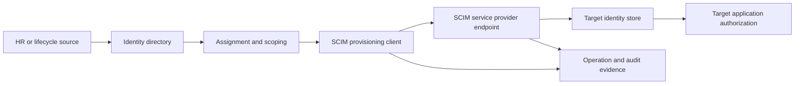

## 🔍 Plain-English deep-dive: SCIM is a standardized employee-change form and courier route

Imagine every building has a different onboarding form. One asks for surname first, another calls the employee number “external key,” and another uses a checkbox to deactivate. A standardized form gives the courier common fields and actions. The receiving building still decides its local badge number, permitted fields, and what “inactive” means.

The source organization resembles the provisioning domain. The courier resembles the SCIM client. The receiving building resembles the SCIM service provider. Its local badge number resembles `id`; the sender's employee reference resembles `externalId`. The form schema describes fields; the delivery protocol describes create, update, query, and delete.

The analogy stops because SCIM operations are authenticated HTTP requests and can alter access across many accounts. Its operational lesson is exact: standards reduce format differences, but source authority, mapping, matching, target semantics, privacy, authorization, and reconciliation still require explicit design.

**Memory cue:** SCIM standardizes identity-resource exchange; it does not decide business authority.

## 2. Client, service provider, source, and target

RFC 7643 defines a **SCIM client** as an application that manages identity data held by a **SCIM service provider**. “Service provider” here means the HTTP application exposing SCIM, not necessarily the SAML SP from Part 061. The **source system** supplies authoritative lifecycle or attributes; the **target system** receives a representation. One platform can be source in one integration and target in another.

| Role | Owns | Example responsibility | Common mistake |
|---|---|---|---|
| Lifecycle source | Employment/contract status | Joiner/mover/leaver trigger | Treating directory cache as authority |
| Directory | Identity object/profile | User/group and assignments | Assuming every attribute is mastered there |
| Provisioning client | Scope, mapping, outbound correlation | Query/create/update/deactivate target | Treating target `id` as source ID |
| SCIM service provider | Endpoint, target schema, target `id`, local persistence | Validate/store/return resources | Silently accepting ambiguous duplicates |
| Target app owner | Account behavior, local roles/licensing | Define inactive/delete semantics | Assuming SCIM implies all authorization |
| Security/governance | Access policy and response | Least privilege, review, deprovision | Broadening scope to fix sync |

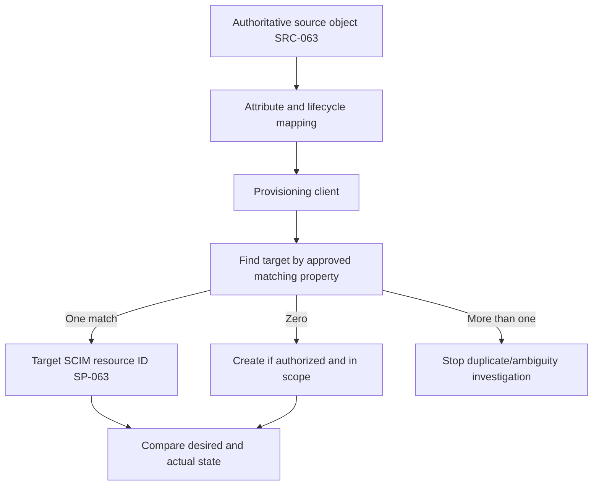

## 3. SCIM resources and schemas

A **resource** is a JSON object managed by the service provider. A **resource type** defines its endpoint, base schema, and extensions. A **schema URI** names the attribute contract present in the resource. Core SCIM defines User and Group resources. The enterprise User extension adds business attributes such as employee number, department, and manager.

| Resource/schema | Purpose | Required/typical anchor | Boundary |
|---|---|---|---|
| User core schema | Represent a user account/profile | `schemas`, target `id`, `userName`, `meta` in returned resource | Provider profile can support subset/extensions |
| Group core schema | Represent group and members | target `id`, `displayName`, members as supported | Authorization meaning is out of SCIM scope |
| Enterprise User extension | Add enterprise attributes | Employee/department/manager concepts | Authority and support vary |
| Custom extension | Add provider/client-specific attributes | Unique schema URI and contract | Avoid name conflict and excess data |
| ServiceProviderConfig | Discover feature support | PATCH/filter/bulk/sort/ETag/auth scheme metadata | Public exposure follows security policy |
| ResourceTypes | Discover resource types/endpoints | User/Group endpoint metadata | Do not hard-code pluralization blindly |
| Schemas | Discover supported attributes/characteristics | Type, required, mutability, returned, uniqueness | Discovery support/profile varies |

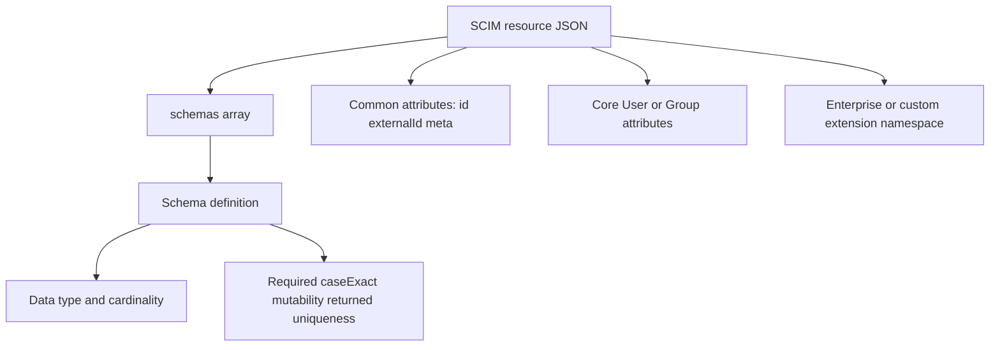

## 4. Attribute characteristics

SCIM schema is attribute based. The receiver validates attributes in the context of an operation. A client cannot assume the service provider stores or returns exactly what was sent; the provider interprets according to its schema and may default, canonicalize, ignore read-only input, or reject invalid values.

| Characteristic | Plain meaning | Example support question |
|---|---|---|
| Type | String, Boolean, integer, dateTime, reference, complex, etc. | Is target receiving Boolean or text? |
| Multi-valued | Zero or more values rather than one | Which email/member element is selected? |
| Required | Must be present for relevant operation/resource | Which source attribute is empty? |
| Case exact | Whether string comparison preserves/uses case | Why did filter/match differ? |
| Mutability | `readOnly`, `readWrite`, `immutable`, `writeOnly` | Is client permitted to change it? |
| Returned | `always`, `never`, `default`, `request` | Why is attribute absent from response? |
| Uniqueness | None, server, or global intent | Which field caused conflict? |
| Canonical values | Suggested/accepted vocabulary | Is target rejecting unsupported type? |
| Reference types | Resource types a reference may target | Does manager/member ID point to correct target? |

The `password` attribute exists in the standard with special write-only handling, but this guide does not teach password provisioning. Support must never request or log a password. Modern integrations should avoid password synchronization when stronger federation and lifecycle designs meet the requirement.

## 5. `id`, `externalId`, `userName`, and matching

The service provider assigns `id`; it is stable, non-reassignable, read-only, always returned, and identifies the target resource. The provisioning client supplies optional `externalId` to correlate its source-domain identity. `userName` is a required User attribute and target-server unique under the core schema. Email and display name are profile data, not inherently stable correlation keys.

| Value | Issuer/owner | Stability/uniqueness concept | Correct use | Dangerous assumption |
|---|---|---|---|---|
| `id` | SCIM service provider | Stable target resource ID | Future target operations and references | Source directory object ID automatically |
| `externalId` | Provisioning client | Client-controlled; scoped to provisioning domain/tenant | Source-target correlation/filter | Service provider generates it |
| `userName` | Target contract/client input | Required and target User unique | Login/matching where approved | Never changes or equals email |
| Email | Attribute source | Can change/reuse; multi-valued | Contact or approved match with controls | Immutable identity |
| Display name | Profile/display | Not unique | Human readability | Matching or deletion key |
| Target app local ID | Target implementation | Product specific | Link app objects/logs | Same as SCIM `id` without proof |

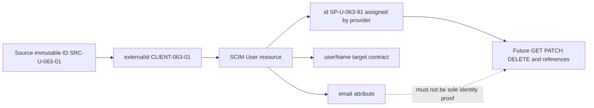

## 🔍 Plain-English deep-dive: `externalId` is the sender's tracking number; `id` is the receiver's shelf number

A warehouse sender labels a package `SRC-17`. The receiving warehouse stores it on shelf `R-901`. The sender's tracking number helps correlate the package across organizations; the receiver's shelf number is the stable local locator. A recipient name printed on the package can change and may not be unique.

In SCIM, the client supplies `externalId`; the service provider assigns `id`. After creation or matching, the provisioning system records the target `id` for future operations. `userName` can be a target login/matching field, while email and display name are weaker profile identifiers.

The analogy stops because SCIM uniqueness and tenancy rules are precise and mappings can be cached. The support lesson is exact: inventory every identifier with owner, scope, mutability, matching role, and current value. Never delete or merge based on a display name.

**Memory cue:** Client labels with `externalId`; provider locates with `id`.

## 6. User resources and lifecycle status

The SCIM User resource can carry `active`, userName, names, emails, phone numbers, groups, roles, entitlements, locale, timezone, and extensions. The standard says the definitive meaning of `active` is determined by the service provider; typically `false` means sign-in is suspended. Therefore, `active=false` must be verified against target behavior rather than assumed.

| User state concept | Expected target question | Risk |
|---|---|---|
| Created | Does account exist with target `id`? | Duplicate if match missed |
| Active | Can the intended user sign in/use assigned functions? | Target may need separate assignment/license |
| Updated | Which attributes changed and who owns them? | Source overwrite/manual drift |
| Deactivated | What exactly does `active=false` stop? | Existing sessions/tokens/local keys may survive |
| Reactivated | What access/roles/groups return? | Stale excessive access restored |
| Deleted | Is resource absent from query/retrieval as expected? | Irreversible data/ownership loss |
| Out of scope | What deprovision action is configured? | Accidental mass disable from rule change |

## 7. Group resources and membership

A SCIM Group has a display name and optional members. Member `value` refers to the target SCIM resource `id`, not the source object's ID. The standard allows a service provider to support nested groups, but vendor provisioning clients and target applications may impose narrower behavior. Group membership's authorization meaning is outside the SCIM standard.

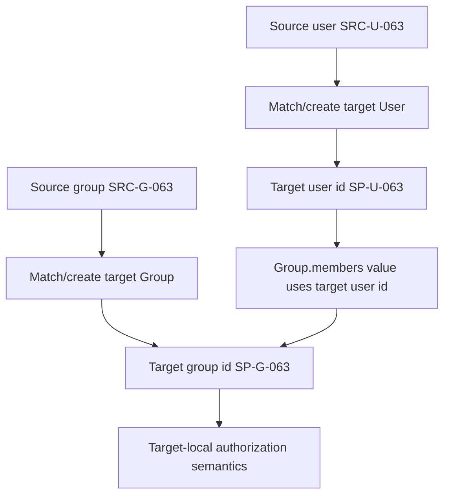

| Group issue | Hypotheses | Evidence |
|---|---|---|
| Group exists, user absent | User not provisioned; wrong target ID; PATCH failed; scope gap | Source/target IDs and membership event |
| Duplicate groups | Display-name match ambiguous/case/canonicalization | Group IDs, externalIds, query results |
| Nested member missing | Client/profile does not traverse nesting | Direct membership and official behavior |
| Member add returns success but no access | Local app policy/license/role separate | Target membership plus authorization event |
| Huge group slow | Page/PATCH/rate/target limits | Batch/operation counts and timings |
| Removed member returns | Source rule re-adds or competing writer | Source authority and operation timeline |

## 8. Discovery and capabilities

SCIM defines discovery endpoints for service-provider configuration, resource types, and schemas. Filtering, sorting, PATCH, bulk, and ETags have capability signals. A client should not assume optional features.

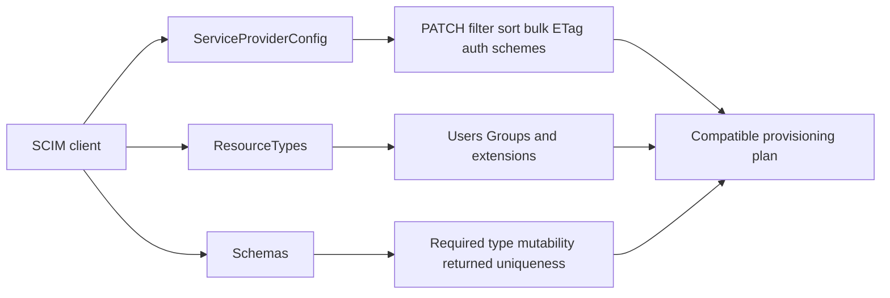

| Capability | Why discover | Unsafe assumption |
|---|---|---|
| PATCH | Partial updates/groups | Every endpoint supports it |
| Filter | Locate/match resources | Every operator/path supported |
| Sort | Deterministic display/query | Sorting is required |
| Bulk | Many operations | Bulk is atomic as a whole |
| ETag | Conditional concurrency | Versioning always available |
| Schemas | Attribute contract | Core schema means every optional attribute |
| ResourceTypes | Endpoint/resource support | `/Users` and `/Groups` are all resources |
| Auth schemes | Connector authentication | Spec's example token is preferred |

## 9. Create and retrieve

Create uses POST to a resource-type endpoint. The service provider assigns `id` and returns its representation, normally with a created status and location. Before create, a provisioning client usually queries by the approved matching property to avoid duplicates. Zero matches can justify create; one match justifies link/update; multiple matches require human-safe investigation.

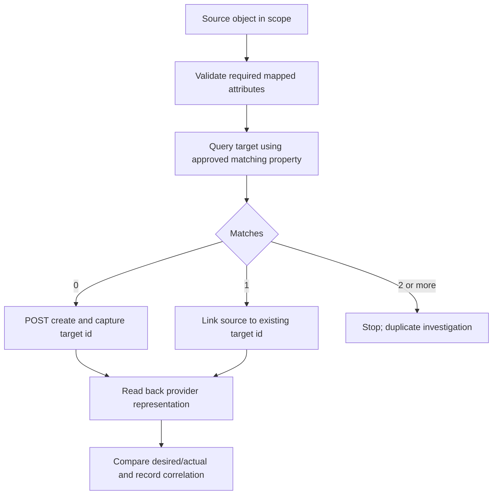

| Create result | Meaning | Next action |
|---|---|---|
| 201 with target `id` | Resource created | Store mapping; verify returned state |
| 200 ListResponse, zero | Query valid/no match | Create only if source is authorized/in scope |
| 200 ListResponse, one | Existing match | Validate identity; link/update |
| 200 ListResponse, many | Ambiguous match | Do not pick first; investigate |
| 409 uniqueness | Target conflict/reserved value | Locate conflicting resource and authority |
| 400 schema/value | Request not accepted | Fix source/mapping/schema, not target manually |
| 401/403 | Connector auth/authorization | Credential metadata/scope/target policy |

## 10. PUT, PATCH, and operation semantics

PUT replaces a resource's attributes under schema rules; omitted read-write attributes can be cleared or defaulted depending on provider behavior. PATCH performs ordered partial add/remove/replace operations. RFC 7644 says the PATCH operations for one request are applied sequentially and the request is atomic: if one operation fails, the original resource is restored.

| Operation | Intent | Main risk | Safe validation |
|---|---|---|---|
| PUT | Replace resource representation | Omitted attributes cleared/defaulted | Read full provider state and schema first |
| PATCH add | Add/new or replace certain locations under semantics | Duplicate multivalue or unexpected single-value replace | Read back targeted path |
| PATCH remove | Remove selected value/path | Broad remove clears all values | Validate precise path/filter and resulting state |
| PATCH replace | Replace selected value/path | No-target/multiple matches | Confirm selected target and read back |
| DELETE | Remove resource | Irreversible access/data/ownership loss | Dependency, approval, target 404/query absence |
| `active=false` PATCH | Administrative deactivation where implemented | Residual sessions/access; semantics differ | Test target sign-in/access and audit |

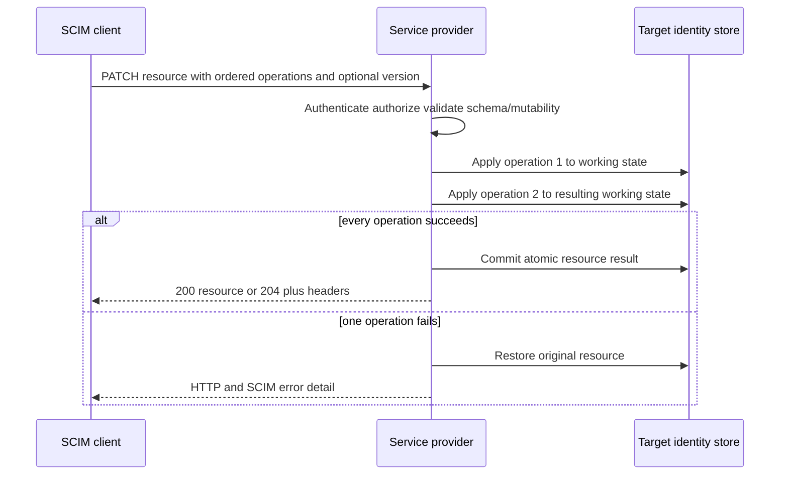

The overall provisioning job is not necessarily atomic across many users/groups. A successful user update and failed group membership can leave partial end-to-end state that reconciliation must detect.

## 🔍 Plain-English deep-dive: PATCH is a numbered repair list, not a full replacement invoice

A building manager submits a numbered repair list: add one badge holder, remove one old phone, replace the department label. Each instruction modifies the result of the previous one. If the third instruction is invalid and the contract says the list is atomic, the building restores the pre-list record rather than keeping half the changes.

PUT is closer to submitting the complete official record again. Missing fields can be interpreted as removed or defaulted, so a client that lacks the full schema can accidentally erase information. PATCH narrows the requested changes but requires precise path and multi-value semantics.

The analogy stops because SCIM providers can vary within allowed behavior and optional support. The support rule is to identify method, resource `id`, version, operation order, path/filter, schema mutability, HTTP/SCIM result, and read-back state.

**Memory cue:** PUT replaces; PATCH edits; read-back reconciles.

## 11. Filters and matching

Filtering is optional for service providers but central to many provisioning profiles. SCIM defines operators such as equality, presence, contains, starts/ends with, comparisons, logical operators, and complex-value filters. A specific client may use only a subset. A filter returning no resources is a successful ListResponse with `totalResults=0`, not a 404.

| Filter concern | Question | Failure |
|---|---|---|
| Capability | Does provider support filter and operator? | `invalidFilter` or client incompatibility |
| Attribute path | Core or extension path correct? | No match/invalid path |
| Case behavior | What is attribute `caseExact`? | Duplicate/missed match |
| Quoting/encoding | Is value represented safely? | Syntax error/log leakage |
| Multi-valued path | Is selected element/subattribute correct? | Wrong email/member match |
| PII in URI | Is filter value sensitive? | Browser/proxy/log privacy leak |
| Result cardinality | Zero, one, or many? | Wrong create/link decision |

Do not include real SCIM filter values containing personal data in a public artifact. RFC 7644 discusses POST search for cases where sensitive filter information should not appear in a URI. Product support must be verified.

## 12. Pagination and completeness

SCIM pagination uses a 1-based `startIndex`, requested `count`, and response fields such as `totalResults`, `itemsPerPage`, and `startIndex`. Pagination is stateless; resources can change between requests, so pages can be inconsistent. A reconciliation job must not silently treat one page as the whole population.

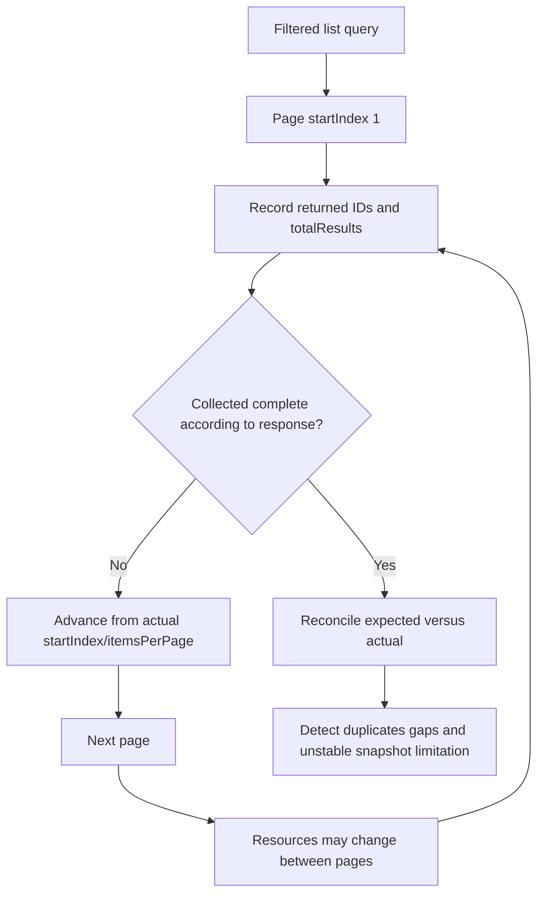

| Pagination mistake | Consequence | Better behavior |
|---|---|---|
| Assume default page contains all | Missing users/groups | Follow response and documented limits |
| Assume zero `Resources` means no total | Misread `count=0`/response | Read `totalResults` and parameters |
| Advance by requested count only | Skip/duplicate if fewer returned | Use actual response fields/provider contract |
| Treat pages as snapshot | Inconsistent reconciliation | Record time/watermark and tolerate/recheck changes |
| Fetch unnecessary attributes | Privacy/latency burden | Request minimum fields where supported |

## 13. Assignment and scoping

Provisioning clients commonly determine scope through application assignment, group membership, or attribute filters. Scope is a business and security decision: it selects which source objects the connector manages. Going out of scope can trigger deactivation. A small rule error can therefore become a mass access-removal event.

| Scope input | Example concept | Deprovision risk |
|---|---|---|
| Direct app assignment | One user assigned | One-off stale/forgotten access |
| Assigned group | Immediate members in scope | Nested-member assumptions |
| Dynamic group/rule | Attribute-driven membership | Source attribute/rule change causes mass exit |
| Attribute filter | Department/status criteria | Null/case/mapping change alters population |
| All users/groups | Broad connector scope | Large blast radius and privacy |
| Exclusion | Break-glass/admin/service accounts | Exception becomes stale |

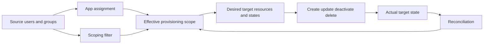

Before changing scope, calculate additions, updates, deactivations, deletions, excluded critical accounts, and restoration procedure. Use accidental-deletion safeguards where available, but do not assume a safeguard covers every target operation.

## 14. Source of truth and attribute authority

“Source of truth” should be defined per lifecycle decision and attribute. HR may own employment status and manager. A directory can own sign-in name and object ID. The app owner can own target role. The provisioning client maps and transforms, but does not automatically become authoritative for everything.

| Data/lifecycle element | Candidate authority | Why explicit ownership matters |
|---|---|---|
| Employment status | HR/lifecycle system | Drives active/deactivate with high impact |
| Source object ID | Directory/source system | Stable correlation |
| Target SCIM `id` | Service provider | Future target operations/references |
| `externalId` | Provisioning client | Cross-domain correlation |
| Department/manager | HR or directory by policy | Group/role changes and references |
| App-local role | Application/governance owner | SCIM may map but business owns decision |
| Group membership | Directory/rule/app depending model | Competing writers create oscillation |
| Target-owned preference | User/app | Must not be overwritten by source |
| Deletion | Governance/data/app owner | Retention, ownership, recovery |

## 15. Initial and incremental reconciliation

An initial cycle evaluates the full in-scope population, matches existing target objects, creates or updates, resolves references, and establishes a watermark or synchronization state. Incremental cycles process changes since the last known point. Product schedules and semantics vary. A “sync completed” message can mean the cycle completed with per-object failures.

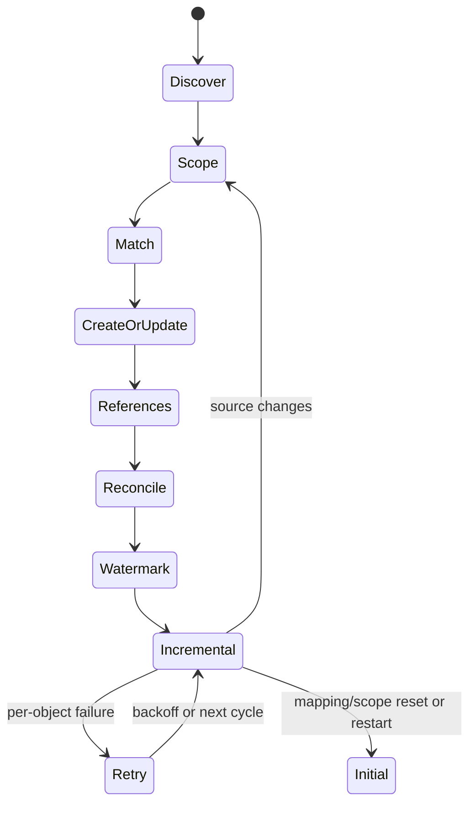

| Cycle evidence | Question |
|---|---|
| Job/cycle ID | Which execution? |
| Start/end UTC | Was the source change included? |
| Scope count | Expected population? |
| Match/create/update/deactivate counts | What actions occurred? |
| Per-object result | Did this identity succeed? |
| Source/target IDs | Which objects are linked? |
| Watermark/delta state | Which source changes are next? |
| Retry/quarantine state | Is processing delayed/stopped? |

## 16. Eventual consistency, retries, and concurrency

**Eventual consistency** means accepted changes may take time to appear in all views. A provisioning client can update target state while a cache, application authorization service, or secondary index remains stale. Retries must distinguish “failed before effect,” “succeeded,” and “unknown outcome.” Create retries without reconciliation can produce duplicates.

| Situation | Unsafe reaction | Safe reasoning |
|---|---|---|
| POST times out | Repeat create immediately | Query/match and authoritative target state first |
| PATCH 204 but app stale | Repeat PATCH/toggle active | Read target state and downstream propagation evidence |
| 429 | Tight retry loop | Respect Retry-After/provider backoff and queue evidence |
| 5xx transient | Unlimited retries | Bounded retry/backoff; preserve first/last error |
| 409 uniqueness | Change username randomly | Locate conflict and correct correlation/authority |
| 412 precondition | Overwrite latest state | Retrieve current version and reconcile competing change |
| Partial batch/job | Mark all failed/succeeded | Per-object/per-operation ledger |

ETags can help prevent lost updates when supported. A conditional update that fails means the resource changed; it is a signal to reconcile, not permission to remove the precondition and overwrite.

## 🔍 Plain-English deep-dive: Reconciliation is balancing two ledgers, not trusting the courier receipt

A courier receipt proves a package was accepted for delivery. It does not prove the receiver put it on the correct shelf, updated inventory, or removed the old item. An accountant compares the sender's intended ledger, courier events, receiver's shelf record, and final inventory.

SCIM needs the same discipline. A 2xx response is protocol evidence for an operation, but target read-back, target application behavior, group membership, and access state can still diverge. A timeout is even less decisive because the operation may have succeeded before the response was lost.

The analogy stops because distributed systems can retry and converge automatically. The lesson is exact: maintain desired state, operation result, target `id`, actual resource, downstream effect, and reconciliation time as separate evidence.

**Memory cue:** Request sent, response received, target stored, and access changed are four checkpoints.

## 17. Deactivation, deletion, and deprovision risk

Deprovisioning has two competing risks: leaving unauthorized access active and removing legitimate access/data. The target's definition of `active=false`, DELETE, session/token behavior, ownership, licenses, API keys, app-local accounts, and recovery window must be understood.

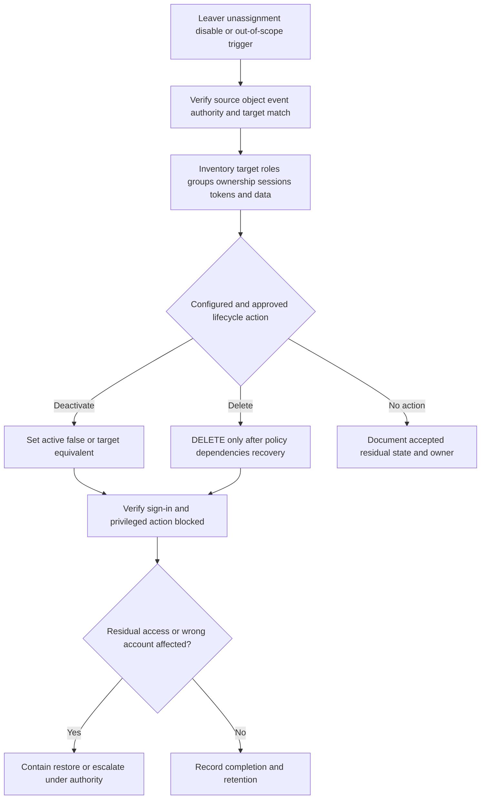

| Deprovision check | Why |
|---|---|
| Source trigger and approval | Prevent wrong-person action |
| Target `id` correlation | Prevent deactivating duplicate/other user |
| Target `active` semantics | Prove effect |
| Group/role/license | Remove access paths and cost |
| Active sessions/tokens | Account state may not revoke sessions |
| Personal API keys/service identities | Human account may own separate credentials |
| Owned data/workflows | Avoid orphaning/deletion |
| Retention/legal hold | Preserve required evidence/data |
| Restore behavior | Recover accidental deactivation safely |
| Audit/result | Demonstrate completion and residual risk |

## 18. Duplicate and matching investigation

Duplicates can result from changed joining attributes, missing target-ID cache, timeout/retry, manual account creation, case/canonicalization differences, two provisioning clients, source re-creation with a new immutable ID, or an incorrect match rule.

| Duplicate evidence | Resource A | Resource B | Decision question |
|---|---|---|---|
| Target `id` | Stable target ID | Different target ID | Which object was linked by connector? |
| `externalId` | Source ID A | Source ID B/empty | Which provisioning domain/client owns it? |
| `userName` | Old/current | Current/alias | Was rename propagated? |
| Created UTC/actor | Earlier/manual | Later/connector | Trigger sequence? |
| Last sign-in/use | Active history | None/different | Business owner and security impact? |
| Roles/data ownership | Valuable state | Minimal/new | Merge/delete risk? |
| Provisioning logs | Update/link | Create | First divergence? |

Do not “fix” duplicates by deleting the newer or less-used account automatically. Establish identity, ownership, access, data, target support for merge, retention, and rollback. Stop further create retries while preserving deprovisioning safety.

## 19. Error taxonomy

| HTTP/SCIM result | Likely meaning | Support next step |
|---|---|---|
| 200 ListResponse, zero | Valid query, no match | Verify match field/value/scope before create |
| 201 | Created | Capture target `id`, read back, reconcile |
| 204 | Successful no-content operation | GET/read target state where safe |
| 400 `invalidFilter` | Unsupported/malformed filter/path/type | Compare capability/profile and schema |
| 400 `invalidPath`/`noTarget` | PATCH target path absent/wrong | Inspect current target resource and intended path |
| 400 `mutability` | Read-only/immutable/required conflict | Fix mapping/operation; do not force |
| 400 `invalidValue` | Required/type/schema mismatch | Source value and target schema |
| 401 | Connector authentication missing/invalid | Credential type/ID/expiry, never value |
| 403 | Connector lacks authorization or sensitive query blocked | Scope/policy and safe search method |
| 404 | Resource/endpoint absent | Correct target `id`, deletion history, base URL |
| 409 `uniqueness` | Duplicate/conflicting value | Locate all matches and authority |
| 412 | Resource changed/precondition failed | Read latest, reconcile, retry intentionally |
| 413 | Payload/operation limit | Capability/size and safe batching |
| 429 | Rate limit | Retry-After/backoff and queue |
| 5xx | Provider/server failure | Bounded retry and vendor escalation |

## 20. Worked example 1: Duplicate after create timeout

**Input:** A create call times out. The next cycle creates another target account with the same person but a modified username.

**Reasoning:** The first outcome was unknown, not failed. Query by approved external/source identifier and all relevant matching values. Compare target IDs, creation timestamps, client operation IDs, and source object. Freeze further creates for this object.

**Evidence:** Fictional source `SRC-U-063-01`, targets `SP-U-063-A/B`, timeout UTC, query cardinality, externalIds, target ownership, and logs. No token or personal data.

**Result:** The paper case finds the first target existed. The second create resulted from changing the joining property instead of reconciling. An authorized owner selects supported merge/disable/delete actions after role/data review.

**Caveat:** A uniqueness conflict could have prevented this in another profile; do not assume target constraints.

## 21. Worked example 2: User remains active after unassignment

**Input:** A user is removed from app assignment but can still sign in.

**Reasoning:** Check whether assignment controls provisioning scope, whether the user was previously managed by this job, the configured out-of-scope action, cycle timing, per-object deactivation event, target `active`, SSO assignment, local target account, and active sessions. SCIM deactivation and SSO/session control are separate.

**Evidence:** Source/target IDs, assignment change UTC, job/cycle ID, expected operation, target read-back, sign-in/session evidence, and target authorization.

**Result:** The synthetic connector set `active=false`, but a separate unmanaged local account matched the same email. This becomes duplicate/account-governance investigation.

**Caveat:** Never ask the user to keep signing in as a test during an active offboarding concern.

## 22. Worked example 3: Required surname missing

**Input:** Create returns a schema/value error because the target requires family name, but the source field is null.

**Reasoning:** Identify target schema requirement, source authority, mapping expression, affected population, and whether a legitimate fallback exists. Do not invent a surname silently or edit target manually if the source will overwrite it.

**Evidence:** Attribute names, null/presence state, schema characteristic, source owner, mapping version, error code, and counts; personal values omitted.

**Result:** The HR/data owner corrects authoritative data or approves a documented transformation after impact review. Reprocess only affected objects and reconcile.

**Caveat:** Cultural naming models require careful design; “last name required” can be a product limitation rather than bad user data.

## 23. Worked example 4: Group membership uses wrong ID

**Input:** Group PATCH returns 404 for member reference even though the user exists in the source directory.

**Reasoning:** SCIM Group member `value` should reference the target service-provider `id`, not the source object ID. Check user creation/link result, target ID cache, group operation body metadata, and target `/Users/{id}` retrieval.

**Evidence:** Fictional source ID, target User `id`, target Group `id`, member path/value classification, error, and operation ordering.

**Result:** Correct the connector correlation/mapping; do not create a second user simply to obtain another ID.

**Caveat:** Vendor group profiles and supported membership operations vary.

## 24. Worked example 5: PATCH 204, stale application role

**Input:** SCIM PATCH succeeds and target profile shows the new department, but app role remains old.

**Reasoning:** Determine whether role is sourced from department mapping, group membership, target rule, manual assignment, or separate authorization system. A successful profile update does not prove downstream authorization recalculated.

**Evidence:** Target resource state, membership/role owner, rule evaluation time, local audit, and application authorization event.

**Result:** Route to target authorization-rule owner; do not resend unrelated SCIM profile updates repeatedly.

**Caveat:** Eventual consistency is one hypothesis, not a default cause.

## 25. Worked example 6: Pagination misses leavers

**Input:** Reconciliation sees 100 active targets but checks only the first 20 returned resources; 3 former users remain active on later pages.

**Reasoning:** Inspect `totalResults`, `itemsPerPage`, `startIndex`, requested count, page advancement, target changes during enumeration, and filters. The connector's “successful query” was incomplete.

**Evidence:** Page ledger, returned target IDs, total count, query time, and missing IDs. No identity attributes beyond synthetic IDs.

**Result:** Correct page traversal and add completeness assertions/reconciliation, then handle leavers under approved deprovision process.

**Caveat:** Stateless pages can shift; recheck boundaries or use provider-supported incremental mechanisms.

## 26. Customer-safe evidence matrix

| Symptom | Minimum safe evidence | Never request |
|---|---|---|
| User not created | Source ID, scope result, match count, operation/error, UTC | Token/password/full profile |
| Duplicate | Source and target IDs, externalIds, timestamps, owners | Delete instruction without review |
| Wrong attribute | Attribute path, source/presence, mapping/schema version | Unnecessary personal values |
| Group gap | Source/target group/user IDs, membership operation/result | Entire organization membership export |
| Deactivation failure | Trigger, expected action, target state, session/access evidence | Repeated sign-in by leaver |
| Connector auth | Credential type/ID/expiry, endpoint/correlation | Bearer token/client secret/private key |
| Filter/page issue | Sanitized filter structure and page metadata | PII in public URL/log |
| Rate/server error | HTTP/SCIM code, Retry-After, counts, correlation | Tight live retry loop |

## Troubleshooting decision tree

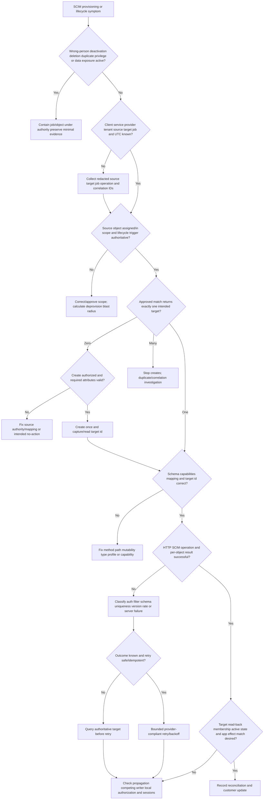

## 27. Common failure modes

| Failure mode | Why it fails | Better behavior |
|---|---|---|
| SCIM equals SSO | Provisioning and authentication are separate | Check account lifecycle and sign-in independently |
| `id` equals source ID | Provider assigns target `id` | Record source ID, externalId, target ID separately |
| `externalId` is server-generated | Client owns it | Verify provisioning domain and uniqueness contract |
| Email/display name is identity | Changes/reuse/collisions | Immutable IDs and approved match |
| Zero query result is 404 | SCIM uses successful empty ListResponse | Read totalResults/cardinality |
| Query first page only | Misses resources/leavers | Complete page traversal and assertions |
| Pages are stable snapshot | Stateless changes can shift results | Record time and recheck boundaries |
| All SCIM supports every operator | Features/profile optional | Discover and verify client subset |
| PUT is harmless update | Omitted fields can clear/default | Know full schema/provider behavior |
| PATCH equals JSON Patch exactly | SCIM has its own paths/semantics | Use SCIM library/profile |
| PATCH job is globally atomic | Atomicity is per resource request, not whole sync | Per-object reconciliation |
| Retry timed-out POST | Can duplicate resource | Query target/correlation first |
| Remove assignment deletes user | Deprovision behavior is configured/product-specific | Inspect expected operation and target state |
| `active=false` revokes every session | Target/session/token behavior separate | Validate residual access and incident route |
| DELETE is the cleanest fix | Can destroy data/ownership/recovery | Deactivate, investigate, approve dependencies |
| Group member uses source ID | Target expects target resource reference | Use service-provider `id` |
| Successful profile update grants role | Authorization may be separate | Check role/group/rule owner |
| Manual target edit fixes mapping | Source can overwrite and drift | Correct authority/mapping, then reconcile |
| Ask for SCIM bearer token | Credential exposure | Use token metadata/error/correlation only |
| Generic SCIM equals vendor profile | Optional/subset behavior differs | Current official product documentation |

## 28. Escalation packet

| Section | Required content |
|---|---|
| Impact | Missing/excess access, affected count, security/data risk |
| Integration | Source, client/job, tenant, target/service provider, profile/version |
| Scope | Assignment/filter result, expected population, recent scope change |
| Object identity | Source ID, `externalId`, matching field, target `id`, target-local ID |
| Schema/mapping | Attribute paths, characteristics, transforms, authority, version |
| Operation | Method, endpoint/resource type, path semantics, outcome classification |
| Result | HTTP status, SCIM type/detail, operation/correlation ID, UTC |
| Target state | Read-back resource, group/active state, app authorization/session effect |
| Cycle | Initial/incremental, watermark, retry/backoff/quarantine, page completeness |
| Changes | Credential, mapping, scope, schema, target, app, rule, lifecycle changes |
| Privacy | Values minimized/redacted; no token/password/private data |
| Ask | Exact identity/app/provider/Engineering decision or fix required |

## Safe synthetic lab: The SCIM Reconciliation Rail Yard 063

### Objective

Build a local paper model of a fictional SCIM provisioning client and service provider. Track Users, Groups, source and target identifiers, schemas, matching, create/read/PUT/PATCH/deactivate/delete intentions, filters, pagination, initial/incremental cycles, eventual consistency, retries, duplicates, and deprovision risk. The unique lab is **The SCIM Reconciliation Rail Yard 063**.

The lab contains JSON-like field inventories but no executable endpoint, bearer token, HTTP request, password, real filter value, live app, or customer data. It demonstrates reasoning and reconciliation only.

### Prerequisites

- Local Markdown editor or spreadsheet only.
- This Part and fictional IDs prefixed `SRC-063`, `CLIENT-063`, `SP-063`, `JOB-063`, `OP-063`, and `CASE-063`.
- Reserved text-only hostname `scim-063.example.test`.
- No Entra tenant, Okta org, Abnormal account, SCIM endpoint, API client, network call, token, secret, password, certificate, user, group, or customer export.
- Artifact label: **local/public lab - synthetic SCIM lifecycle and reconciliation only**.
- Record start UTC, zero-real-identity/credential statement, no-live-API statement, and source date August 24, 2026.

### Synthetic object inventory

| Source object | Source ID | externalId placeholder | Target `id` | Desired state |
|---|---|---|---|---|
| User A | `SRC-063-U-A` | `CLIENT-063-U-A` | `SP-063-U-A` | Active |
| User B mover | `SRC-063-U-B` | `CLIENT-063-U-B` | `SP-063-U-B` | Updated |
| User C leaver | `SRC-063-U-C` | `CLIENT-063-U-C` | `SP-063-U-C` | Inactive |
| Group Support | `SRC-063-G-S` | `CLIENT-063-G-S` | `SP-063-G-S` | Members reconciled |

### Lab steps

1. Create the lab cover with artifact label, UTC, authorization boundary, zero-live-API, zero-real-identity, and experience labels.
2. Define SCIM client, service provider, provisioning domain, source, target, resource, resource type, schema, endpoint, source of truth, assignment, match, and reconciliation.
3. Draw source-directory-client-SCIM-target-application boundaries and separate provisioning from SSO/authorization.
4. Create 20 fictional User/Group records with source ID, externalId, target `id`, username placeholder, source authority, scope, lifecycle, and target state.
5. Define core User, Group, enterprise extension, and one fictional custom extension using field names only.
6. Build attribute characteristic cards for type, multi-valued, required, caseExact, mutability, returned, uniqueness, canonical values, and reference type.
7. Create an identifier register distinguishing source ID, `externalId`, `id`, userName, email-like placeholder, display name, and target-local ID.
8. Build discovery outputs for ServiceProviderConfig, ResourceTypes, and Schemas with only capability booleans/field names.
9. Design a matching decision table for zero, one, and multiple results; forbid “pick first.”
10. Model create, retrieve, query, PUT, PATCH add/remove/replace, active false/true, and DELETE as non-executed operation cards.
11. For PATCH, model ordered atomic changes on one resource and contrast with a partial multi-object job.
12. Build filter cards using abstract `[MATCH-VALUE-063]`; include equality, complex path, invalid filter, sensitive-value POST-search decision, and zero-result response.
13. Build a five-page synthetic target inventory with totalResults/startIndex/itemsPerPage and insert a mid-pagination change to show stateless inconsistency.
14. Create assignment/group/dynamic-rule/attribute-filter scope scenarios and calculate additions, updates, deactivations, and exclusions.
15. Build per-attribute authority for status, source ID, department, manager, target role, preference, group, and deletion.
16. Model initial and three incremental cycles with watermarks, source changes, match, action, reference update, retry, and reconciliation.
17. Create timeout-unknown POST, 409 uniqueness, 412 version, 429 retry, and 5xx cases; choose safe next actions.
18. Create two duplicates and complete the duplicate-evidence table before selecting any remediation.
19. Model leaver deactivation with target state, groups/roles/license, sessions/tokens, API keys, ownership, retention, restore, and audit.
20. Run the decision tree on duplicate-after-timeout, unassignment-but-active, group wrong-ID, and incomplete pagination.
21. Draft a customer update and Engineering escalation with an explicit ask and no sensitive values.
22. Deliver a 90-second SCIM lifecycle answer and 60-second honesty boundary.
23. Validate source URLs/date, cleanup, privacy, zero-activity statement, and rubric.

### Expected evidence

- Boundary diagram separating lifecycle provisioning, SSO, and target authorization.
- Twenty fictional User/Group object correlations.
- Schema and attribute-characteristics reference.
- Identifier ownership and matching register.
- Capability discovery workbook.
- Non-executed operation cards for create through delete/reactivate.
- PATCH atomicity versus multi-object partial-job comparison.
- Filter and five-page pagination worksheets.
- Scope blast-radius calculation.
- Attribute source-of-truth matrix.
- Initial/incremental cycle and watermark ledger.
- Timeout, conflict, concurrency, rate, and server-error decisions.
- Duplicate and leaver residual-access investigations.
- Four decision-tree cases, customer update, and escalation packet.
- Source ledger dated **August 24, 2026**.
- Spoken Microsoft-transfer, Okta-learned, Abnormal-unknown statement.

### Cleanup and privacy

- Confirm every person, group, job, operation, source, target, and identifier is fictional and includes `063`.
- Confirm all hostnames use `example.test` and no valid authorization header, token, secret, password, private key, certificate, URL, or request exists.
- Remove real names, email addresses, departments, employment status, manager relationships, tenant/org IDs, app IDs, screenshots, logs, and source/target exports.
- Confirm no Entra/Okta/Abnormal/admin console, API client, endpoint, account, connector, or network request was accessed.
- Delete the artifact if identity or credential data cannot be reliably removed.
- Record cleanup UTC and: `Synthetic paper SCIM exercise only; zero live identity, endpoint, token, password, request, connector, tenant, app, provisioning, deprovisioning, or production activity.`

### Validation rubric

| Dimension | Fail | Developing | Pass |
|---|---|---|---|
| Purpose | SCIM equals SSO | Says provisioning | Separates lifecycle, authentication, app authorization, sessions |
| Identity | Matches email/name | Uses one ID | Tracks source ID, externalId, target id, match, target-local ID |
| Schema | Lists fields | Notes User/Group | Attribute characteristics, extensions, capabilities, provider interpretation |
| Operations | CRUD labels | Knows PATCH | PUT/PATCH semantics, atomic per resource, read-back, version |
| Search | One query | Uses filter | Cardinality, optional operators, privacy, ListResponse, pagination completeness |
| Lifecycle | Create/delete | Adds active | Scope, source authority, de/reactivate, delete, restore, residual access |
| Reconciliation | Trusts 2xx | Reads target | Desired/action/result/actual/app effect, timing, watermarks, retries |
| Errors | Retries all | Classifies HTTP | SCIM type, outcome certainty, conflict/version/rate/backoff |
| Safety | Uses live endpoint | Fake records | No request/credential/PII; paper-only and cleaned |
| Honesty | Claims SCIM ops | Says learned | experience transfer, Okta learned, Abnormal profile unknown |

## 29. Official Source Anchors

All sources were verified and recorded with guide currency date **August 24, 2026**. RFC 7643 and RFC 7644 are the primary schema/protocol anchors. Vendor implementation profiles, supported operations, mappings, cadence, retry behavior, authentication methods, and interfaces change and must be revalidated.

| Official or primary source | What it anchors | Boundary |
|---|---|---|
| [RFC 7643 - SCIM Core Schema](https://www.rfc-editor.org/rfc/rfc7643.html) | Resources, schemas, attributes, `id`, `externalId`, User/Group, active, enterprise extension, privacy | Platform-neutral schema, not vendor profile |
| [RFC 7644 - SCIM Protocol](https://www.rfc-editor.org/rfc/rfc7644.html) | Endpoints/methods, create/query/filter/page, PUT/PATCH/delete, errors, discovery, ETag, multi-tenancy, security | Optional features must be discovered/verified |
| [Microsoft Learn - Develop a SCIM endpoint for provisioning](https://learn.microsoft.com/en-us/entra/identity/app-provisioning/use-scim-to-provision-users-and-groups) | Current Microsoft Entra SCIM profile, mapping, lifecycle, endpoint expectations, examples | Microsoft implementation; no candidate ops claim |
| [Microsoft Learn - Understand Application Provisioning](https://learn.microsoft.com/en-us/entra/identity/app-provisioning/how-provisioning-works) | Current assignment/scoping, initial/incremental cycles, matching, watermarks, retries, quarantine, deprovision concepts | Product behavior/licensing can change |
| [Okta Developer - SCIM concepts](https://developer.okta.com/docs/concepts/scim/) | Current Okta SCIM lifecycle, sourcing, mapping, active/deactivation, rate-limit concepts | Learned architecture only |
| [Okta Developer - Build your SCIM API service](https://developer.okta.com/docs/guides/scim-provisioning-integration-prepare/main/) | Current Okta integration requirements, unique ID, active resource, schema/endpoint concepts | No live lab or Okta production claim |

### Source-use discipline

- Use RFCs for base semantics and current vendor docs for profiles/subsets.
- Verify optional PATCH/filter/bulk/sort/ETag/group capabilities.
- Treat all SCIM identity data as sensitive; minimize attributes and avoid PII in URLs/logs.
- Never request passwords, bearer tokens, secrets, or private keys for troubleshooting.
- Keep Abnormal's SCIM support, matching, cadence, schemas, and deprovision behavior explicitly unknown.

## Likely Interview Questions

### Q1. What is SCIM and how is it different from SSO?

**Model answer:** SCIM is an HTTP/JSON standards suite for provisioning and managing identity resources such as Users and Groups across domains. It creates, queries, updates, deactivates, or deletes target records. SSO through SAML/OIDC authenticates users and creates sessions. A SCIM account can exist while SSO fails, and SSO can succeed while target provisioning or authorization is wrong.

### Q2. What is the difference between `id` and `externalId`?

**Model answer:** The SCIM service provider assigns stable, read-only, non-reassignable target `id`; future target operations and group references use it. The provisioning client supplies optional `externalId` from its own provisioning domain to correlate the source object. I also track the joining property and target-local account ID rather than assuming any two identifiers are identical.

### Q3. How should a provisioning client avoid duplicate users?

**Model answer:** Define an approved stable matching property, query before create, and evaluate cardinality: zero can permit create, one can link/update after identity validation, and multiple must stop for duplicate investigation. After create, capture the target `id` and read back. A timeout is an unknown outcome, so query authoritative target state before retrying.

### Q4. What is PUT versus PATCH in SCIM?

**Model answer:** PUT replaces resource attributes under the provider schema; omitted read-write attributes can be cleared or defaulted, so it has broad risk. PATCH applies ordered add/remove/replace operations to selected paths. RFC 7644 treats one PATCH request as atomic for that resource, but a multi-object provisioning cycle can still be partially successful. Read-back and reconciliation remain necessary.

### Q5. How do filters and pagination affect troubleshooting?

**Model answer:** Filter support and operators can be optional/profile-specific, and zero matches return a successful ListResponse with `totalResults=0`. Pagination is 1-based and stateless; one page is not the population and resources may change between pages. I record query structure, result cardinality, totalResults/startIndex/itemsPerPage, all returned IDs, time, and completeness limitations.

### Q6. How would you investigate a user who stayed active after deprovisioning?

**Model answer:** Verify the authoritative lifecycle trigger, scope/unassignment behavior, source-target correlation, expected connector action, cycle/per-object result, target `active` state, target-local duplicate accounts, groups/roles/licenses, sessions/tokens, API keys, and app authorization. `active=false` is provider-defined and does not automatically prove every session or credential was revoked.

### Q7. What is reconciliation and why is it necessary?

**Model answer:** Reconciliation compares desired source state, operation attempted, protocol result, actual target resource, and downstream access effect. A 2xx response proves an operation response, not every final business outcome. Reconciliation detects partial jobs, stale caches, competing writers, missed pages, duplicates, residual access, and unknown timeout outcomes.

### Q8. What are your SCIM experience boundaries?

**Model answer:** I have Microsoft identity and enterprise support experience as production transfer plus a standards-based synthetic SCIM lifecycle lab. I have not operated Okta or Abnormal SCIM in production. Okta is learned from official docs, and Abnormal's SCIM profile, schemas, matching, cadence, credentials, and deprovision behavior remain unknown unless approved documentation states them.

## Memory Hooks

- **SCIM provisions; SAML/OIDC signs in; the app authorizes.**
- **Client owns `externalId`; provider owns stable `id`.**
- **Name and email display; immutable IDs correlate.**
- **Zero match can create, one can link, many must stop.**
- **User and Group are resources; schema defines behavior, not just fields.**
- **PUT replaces; PATCH edits; read-back reconciles.**
- **One PATCH is atomic for one resource; a sync job can be partial.**
- **Empty query is 200 plus zero results, not 404.**
- **Pagination is 1-based, stateless, and easy to under-read.**
- **Scope removal can be a deprovision event.**
- **A timeout means unknown; query before retry.**
- **`active=false` needs target and residual-access validation.**
- **DELETE requires ownership, retention, recovery, and approval.**
- **Request sent, response received, target stored, access changed: four checkpoints.**

## Completion Checklist

- [ ] I can state the Section goal and source-match-target-reconcile rule.
- [ ] I can define client, service provider, provisioning domain, resource, type, schema, endpoint, source, target, and authority.
- [ ] I can separate SCIM provisioning, SSO authentication, app authorization, and sessions.
- [ ] I can explain User, Group, enterprise extension, and custom extension concepts.
- [ ] I can explain attribute type, cardinality, required, caseExact, mutability, returned, uniqueness, canonical values, and references.
- [ ] I can distinguish source ID, externalId, target id, userName, email, display name, and target-local ID.
- [ ] I can use zero/one/many matching decisions and avoid blind create/retry.
- [ ] I can explain create/retrieve/query, PUT, PATCH add/remove/replace, active false/true, and DELETE.
- [ ] I can explain per-resource PATCH atomicity versus partial multi-object jobs.
- [ ] I can interpret filters, zero ListResponse, pagination, sensitive-query, and capability boundaries.
- [ ] I can model assignment/scoping and calculate deprovision blast radius.
- [ ] I can map attribute/lifecycle source of truth.
- [ ] I can trace initial/incremental cycles, watermarks, retry/backoff, concurrency, and eventual consistency.
- [ ] I can investigate duplicates, group wrong-ID, profile/authorization divergence, and missed pages.
- [ ] I can validate deactivation/deletion against roles, sessions, tokens, keys, ownership, retention, and restore.
- [ ] I completed or can explain **The SCIM Reconciliation Rail Yard 063**.
- [ ] The lab includes Prerequisites, Expected evidence, Cleanup and privacy, and Validation rubric.
- [ ] I used no live endpoint, token, secret, password, request, tenant, account, or identity data.
- [ ] I can state experience transfer, Okta learned, and Abnormal unknown boundaries.
- [ ] I checked Official Source Anchors and recorded **August 24, 2026**.
- [ ] I can answer exactly Q1-Q8.

[Next: Part 064 - Tokens Scopes Secrets and Sessions](Part-064-tokens-scopes-secrets-and-sessions.md)