# Part 064 - Tokens Scopes Secrets and Sessions

## Section goal

This Part explains tokens, scopes, secrets, service identities, cookies, and sessions from zero knowledge. These concepts often appear together in an integration case, but they are not interchangeable. A token is a value used to carry or refer to security information. A scope describes requested or granted authorization in an OAuth profile. A secret is confidential credential material. A service identity represents a non-human workload. A cookie is a browser-managed name/value mechanism. A session is application state connecting a sequence of requests to an authenticated or anonymous context.

The most important support habit is to identify the artifact before reasoning about it. An access token is for a resource server; an ID token is for an OpenID Connect client; a refresh token obtains new access tokens; an authorization code is a short-lived intermediary; an API key often identifies or authorizes a client under a vendor-specific contract; a client secret authenticates a confidential client; a session ID refers to application session state. Their issuers, recipients, lifetimes, storage, validation, rotation, and revocation differ.

A JSON Web Token (JWT) is a compact claims format, not a synonym for access token and not proof of validity. A JWT can be signed, message-authentication-code protected, encrypted, nested, or unsecured under different profiles. Base64url-encoded claims in a signed JWT are usually readable. A signature provides integrity and origin authentication under a trusted-key and validation policy; it does not provide confidentiality. A recipient must still validate the approved algorithm, signature/key, issuer, audience, time claims, token type/profile, and context-required claims before trusting it.

The central support rule is:

> Identify artifact purpose, issuer, subject/client, intended recipient, privileges, lifetime, storage/transport path, validation contract, and lifecycle state before changing scopes, credentials, token policy, cookie behavior, or sessions.

This Part covers opaque versus structured tokens, JWTs at a high level, bearer risk, claims validation, access/refresh/ID tokens, API keys, client secrets, certificates, workload identity, scopes/roles, least privilege, storage, logging redaction, rotation, overlap, expiration, revocation, service identities, cookies, browser sessions, timeouts, logout, and cross-site request forgery (CSRF) at a defensive high level. It does not provide a real token, secret, private key, certificate, cookie, credential-generation command, API request, exploit, live tenant change, or customer data. The lab is a paper inventory using fictional metadata and fingerprints only.

Microsoft identity and Azure workload concepts are production-transfer learning for you, not a claim that you owned application credential governance in production. Okta and other identity-platform comparisons remain learned architecture unless real evidence supports more. Abnormal's credential types, token formats, scope names, session design, rotation behavior, integration identities, and evidence interfaces remain proprietary unknowns unless approved documentation states them.

## Learning outcomes

After completing this Part, you should be able to:

- distinguish credential, token, claim, grant, permission, scope, role, service identity, cookie, and session;
- explain bearer tokens and why possession can be enough to replay them;
- distinguish opaque tokens from structured tokens and explain why token shape does not determine token purpose;
- explain JWT, JWS, JWE, header, claims set, signature, encryption, and key identifier at a safe high level;
- explain that signature is not encryption and decoding is not validation;
- distinguish access, refresh, ID, authorization-code, API-key, client-secret, certificate, and session artifacts;
- validate token metadata conceptually using issuer, audience, signature/key, algorithm, expiration, not-before, issued-at, type/profile, subject/client, nonce, and policy;
- separate scopes, delegated permissions, application permissions, roles, group claims, consent, and runtime authorization;
- build a least-privilege privilege-to-operation matrix rather than asking for broad access;
- inventory static and dynamic credentials using owner, consumer, purpose, environment, storage, expiry, rotation, revocation, and dependencies;
- prefer managed/workload identity or federation over stored long-lived secrets where supported;
- design overlap-based rotation and prove both new-credential success and old-credential rejection;
- explain expiration, revocation, rotation, deletion, and session termination as different lifecycle events;
- protect support evidence by recording metadata/fingerprints rather than credential values;
- explain secure session cookies, idle/absolute timeouts, renewal, privilege-change regeneration, logout, and CSRF defenses at a high level;
- investigate invalid-token, insufficient-scope, expired-credential, wrong-audience, signing-key, clock-skew, stale-session, and rotation failures; and
- state experience and proprietary boundaries accurately.

## JD Mapping

| Supplied role signal | Capability built | Your transferable evidence | Boundary |
|---|---|---|---|
| SaaS Security support | Treats tokens, secrets, sessions, and service identities as security assets | Microsoft security and identity support habits | No claim of Abnormal credential administration |
| Enterprise integrations | Maps machine identity, permissions, API recipient, and lifecycle | REST/JSON and cloud configuration knowledge | Vendor profiles differ |
| Microsoft 365 ecosystem | Transfers Entra app/service-principal, managed identity, permission, and token concepts | production-transfer context | No invented app-governance ownership |
| API troubleshooting | Separates 401 invalid token from 403 insufficient scope and target authorization | HTTP/API working knowledge | No live API call in lab |
| Complex escalations | Correlates issuance, use, expiry, rotation, revocation, and session events | critical situation and Engineering collaboration | No invented credential incident |
| Customer communication | Requests fingerprints, IDs, claims names, UTC, and errors rather than values | Privacy-aware evidence collection | Never request token/secret/private key/cookie |
| Security posture | Uses least privilege, short lifetime, secretless identity, overlap rotation, and old-key rejection | Security upskilling | Architecture depends on platform support |
| Browser troubleshooting | Separates IdP session, app session, cookie, token, logout, and CSRF | Browser/HTTP transfer | No claim of product session internals |

## Candidate honesty note

| Evidence tier | Safe statement | Do not imply |
|---|---|---|
| **Production transfer - Microsoft** | “I bring Microsoft cloud, identity, incident, escalation, and validation habits to credential and token cases.” | That you owned a tenant-wide secret program or token issuer |
| **Local/public lab** | “I built a synthetic credential metadata, scope, validation, rotation, and session ledger without creating a credential.” | A real token, endpoint, app, browser cookie, or tenant change |
| **Learned architecture** | “I can explain standards and current Microsoft/OWASP guidance and transfer it carefully.” | Direct production operation of every identity platform |
| **Standards knowledge** | “I use RFC 6750, 7009, 7519, and 9700 for bearer, revocation, JWT, and OAuth security concepts.” | That every vendor exposes RFC endpoints or JWT access tokens |
| **Proprietary unknown** | “Abnormal's formats, scopes, credential choices, session behavior, logs, and rotation remain unknown absent approved docs.” | Generic standards reveal private implementation |

Safe interview language:

> “I would classify the artifact before troubleshooting it, then record only metadata: issuer, audience, token/credential type, client or subject identifier, granted scope names, issue/expiry UTC, key or credential ID, fingerprint, error, and correlation ID. I would never request the token, secret, private key, cookie, or refresh token. For rotation I would inventory consumers, add and validate the replacement, migrate them, prove the old credential is rejected, monitor, and only then close the change.”

**Named-platform experience boundary:** Microsoft cloud and identity support are transferable production context; Abnormal AI and other named-platform token, secret, and session implementations remain learned architecture unless supported by a real documented example.

## 1. The security-artifact map

A **credential** is something a principal presents to prove identity or authority. A **principal** is an identity that can be granted permissions: a human, application, managed identity, service account, device, or workload. A **token** is a value issued for a security purpose. A **claim** is a name/value assertion within a structured token. A **permission** allows an operation. A **scope** is an OAuth string representing requested/granted access under an authorization-server contract. A **role** groups permissions under a system's authorization model.

| Term | Plain meaning | Typical owner | Main support question |
|---|---|---|---|
| Principal | Identity receiving access | Identity/app platform | Who or what is acting? |
| Credential | Proof used by principal | Credential issuer/owner | What proves the actor? |
| Token | Issued security artifact | Authorization/identity/session server | What purpose and recipient? |
| Claim | Assertion in structured token | Issuer profile | What does it mean in this profile? |
| Scope | OAuth authorization string | Authorization/resource-server contract | Which resource/action was granted? |
| Role | Named authorization bundle | App/resource/governance owner | Which permissions result at runtime? |
| Cookie | Browser-managed name/value | Web origin/server | When and where will browser send it? |
| Session | Server/client state across requests | Application/IdP | Which session remains active? |
| Fingerprint | Non-secret correlation representation | Inventory/support process | Can events be linked without value? |

```mermaid
flowchart LR
    Principal[Human or workload principal] --> Credential[Credential or trusted platform identity]
    Credential --> Issuer[Identity or authorization server]
    Issuer --> Token[Purpose-bound token]
    Token --> Recipient[Client or resource server]
    Recipient --> Validate[Validate issuer recipient time proof type context]
    Validate --> Authorize[Apply scope role policy resource checks]
    Authorize --> Session[Optional application session]
    Session --> Cookie[Optional browser session cookie]
```

## 2. Token purpose comes before token shape

The same-looking string can serve different purposes, and the same purpose can use different formats. An access token may be opaque or JWT. A session identifier can be opaque. An ID token is normally a JWT under OpenID Connect. An API key can look like a random token but have vendor-defined identity and authorization semantics.

| Artifact | Intended recipient/use | Can call API by itself? | Treat as secret? | Common misuse |
|---|---|---|---|---|
| Access token | Resource server | Yes, within grant/policy | Yes | Sent to client as identity proof |
| Refresh token | Authorization server token endpoint | No; obtains tokens | Yes, high value | Sent to resource API |
| ID token | OpenID Connect client | No, not an API credential | Sensitive | Sent to API as access token |
| Authorization code | Token endpoint/client flow | No; exchanged once | Sensitive/short-lived | Logged or replayed |
| API key | Vendor API/gateway | Often, per vendor | Yes | Put in URL/repository/ticket |
| Client secret | Authorization server/client authentication | Not normally resource API itself | Yes | Confused with access token |
| Session ID | Application session store | Authenticates app requests | Yes | Logged/shared as harmless cookie |
| CSRF token | Request-intent defense | No | Protect appropriately | Treated as access token |

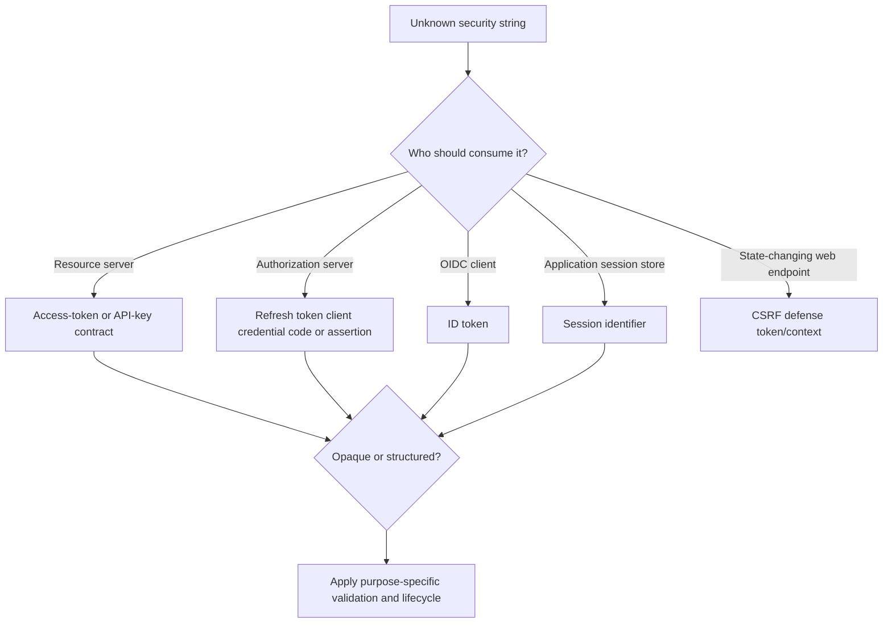

## 🔍 Plain-English deep-dive: A key-shaped object is not necessarily a door key

A hotel wristband, parking ticket, room key, coat-check tag, and employee badge can all be small plastic objects. Their shape does not tell you the correct recipient or authority. Giving a coat-check tag to a hotel-room reader will fail; using a room key as proof of identity at a border would be absurd.

Security artifacts behave similarly. A three-part string may be a JWT, but its profile determines whether it is an ID token, access token, client assertion, logout token, or another message. An opaque random string may be an access token, API key, or session ID. “It decodes” or “it looks like a JWT” does not establish purpose, trust, or authorization.

The analogy stops because token validation is cryptographic and protocol-specific. The support lesson is exact: first identify issuer, intended recipient, profile/type, actor, privilege, lifetime, and storage path; only then interpret format and claims.

**Memory cue:** Shape describes representation; contract defines authority.

## 3. Opaque and structured tokens

An **opaque token** has no meaning to the client; it is a handle the resource server validates through local state or an authorization-server mechanism. A **structured token** carries claims in a protected format so a recipient can validate and interpret it under a profile. Neither is universally safer. Architecture, revocation needs, privacy, latency, key management, and resource-server trust determine tradeoffs.

| Dimension | Opaque/reference token | Structured/self-contained token |
|---|---|---|
| Client visibility | Meaningless string | Encoded claims may be visible |
| Resource validation | Lookup/introspection/local shared state | Local cryptographic/profile validation often possible |
| Immediate status | Central lookup can reflect revocation | May remain accepted until expiry/cache/event unless profile supports more |
| Privacy in artifact | Claims not directly exposed | Minimize claims; signing alone is readable |
| Availability dependency | Validation service/state may be required | Key/metadata availability and cache required |
| Key complexity | Central service handles more | Distributed verifiers must manage trusted keys/algorithms |
| Size | Often small | Can be larger |
| Main support evidence | Token fingerprint, issuer/client, status result | Fingerprint, header/claim names, values only if safe, validation stage |

## 4. JWT, JWS, and JWE at a safe high level

**JSON Web Token (JWT)** is a compact claims representation. **JSON Web Signature (JWS)** provides signature or message-authentication-code integrity protection. **JSON Web Encryption (JWE)** provides authenticated encryption. JWT claims are JSON name/value pairs. The JOSE header describes cryptographic processing, for example an algorithm and key identifier. This guide never creates or decodes a real token.

| Concept | Meaning | What it does not prove alone |
|---|---|---|
| JWT | Claims format carried in JWS/JWE | Validity, purpose, authorization |
| Header | Cryptographic/type processing metadata | Trusted algorithm or key |
| Claims set | Assertions such as issuer/audience/time | Truth without trusted issuer validation |
| Signature/MAC | Integrity and signer/key relationship | Confidentiality or correct audience |
| Encryption | Confidentiality plus integrity under JWE | Correct authorization decision |
| `kid` | Key identifier hint | Permission to fetch arbitrary key/location |
| Base64url | Encoding suitable for compact form | Encryption or secrecy |

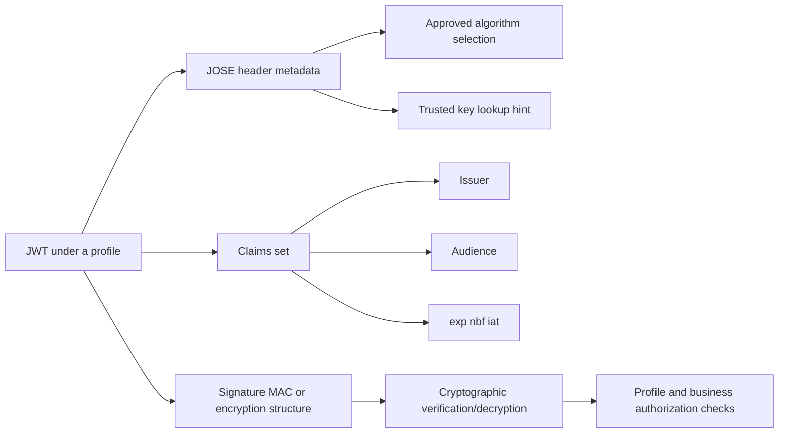

## 5. Signature is not encryption

A common signed JWT uses encoded header and claims plus a signature. Anyone who obtains it can often decode the header and claims without any key. The signature lets a verifier detect unauthorized changes and authenticate the signer according to the trusted key relationship. It does not hide names, identifiers, scopes, roles, tenant data, or other claims.

| Action | What it establishes | What remains |
|---|---|---|
| Split/decode token text | Readable representation | No trust at all |
| Parse JSON | Syntactic fields | No cryptographic validity |
| Verify signature | Integrity under selected trusted key/algorithm | Issuer/audience/time/type/context |
| Validate issuer | Expected security domain | Audience/recipient and other checks |
| Validate audience | Token intended for this recipient | Scope/resource/action checks |
| Validate time | Currently usable within policy | Revocation/session/authorization state |
| Encrypt | Claim confidentiality for intended decryptor | Full validation and authorization |

## 🔍 Plain-English deep-dive: A signed postcard is still a postcard

Imagine a postcard with a tamper-evident official seal. A recipient can verify that the message was not altered after the office sealed it. Anyone handling the postcard can still read it. If the postcard is addressed to Building B, Building A must reject it even if the seal is authentic. If it expired yesterday, a perfect seal does not restore validity.

A signed JWT is similar: integrity is not confidentiality. Signature verification is one gate. Issuer, audience, time, token type/profile, transaction bindings, subject/client, and required authorization must also match. Encryption is the closer equivalent of a sealed envelope, but even an encrypted message still needs trusted sender and business-policy checks.

The analogy stops because digital signatures use cryptographic keys and JWT profiles define exact processing. The support lesson is to never paste a production token into a public decoder. Use approved protected tools and collect only the minimum claim metadata needed.

**Memory cue:** Signed means tamper-evident, not unreadable or automatically acceptable.

## 6. JWT validation gates

Token validation must be fail-closed: a failure at any required gate rejects the token. Applications should use maintained libraries and profile documentation, not hand-rolled string parsing. Support can reason about the stages without handling the token value.

| Gate | Validation question | Typical failure |
|---|---|---|
| Syntax/type | Is this the expected token representation/profile? | Wrong token sent |
| Algorithm policy | Is algorithm explicitly allowed for this profile? | Algorithm confusion/unsupported alg |
| Trusted key | Did key come from trusted issuer metadata/configuration? | Unknown `kid`, stale JWKS, malicious key source |
| Cryptographic proof | Does signature/MAC/decryption verify? | Altered token, wrong key |
| Issuer `iss` | Exact expected issuer? | Wrong tenant/policy/authority |
| Audience `aud` | Does recipient identify itself? | ID token/access token for another app/API |
| Expiry `exp` | Current time before expiration with bounded skew? | Expired token |
| Not-before `nbf` | Current time at/after activation? | Future token/clock skew |
| Issued-at `iat` | Plausible age/time under policy? | Clock anomaly/stale issuance |
| Subject/client | Expected identity and actor type? | User/workload/client confusion |
| Type/profile | Expected token kind and required claims? | Cross-token confusion |
| Transaction binding | Correct nonce/code/client/session where required? | Replay/injection/mix-up |
| Privilege/context | Scope/role/resource/action/tenant permitted now? | Valid token but forbidden action |

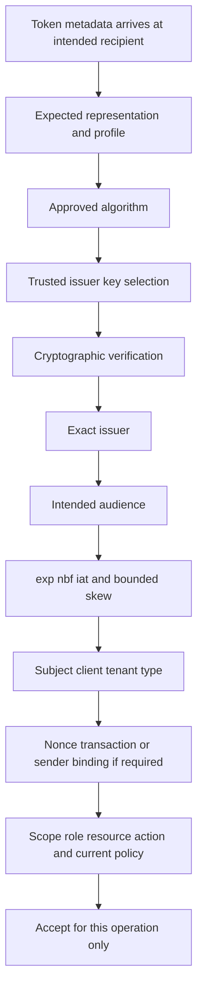

## 7. Access, refresh, and ID token separation

An **access token** authorizes a client to call a resource server under granted scope/policy. A **refresh token** is presented to the authorization server to obtain new access tokens and is normally more durable and highly sensitive. An **ID token** tells the OpenID Connect client about an authentication event and subject under OIDC validation rules. The resource API should not accept an ID token as an access token.

| Property | Access token | Refresh token | ID token |
|---|---|---|---|
| Recipient | Resource server | Authorization server | OIDC client |
| Primary purpose | API access | Obtain new tokens | Authentication assertion to client |
| Format | Opaque or structured | Usually opaque to client/profile-specific | JWT |
| Typical lifetime | Shorter | Longer/rotated/bound | Authentication transaction/session context |
| Privilege | Resource/action access | Ability to mint access under grant | Not API authorization |
| Validation owner | Resource server | Authorization server | OIDC client |
| Exposure impact | API replay within privilege/time | Ongoing token minting under grant | Identity/session confusion/privacy |
| Revocation concern | May persist until expiry depending architecture | Revoke grant/token family and detect replay | Client/IdP session lifecycle separate |

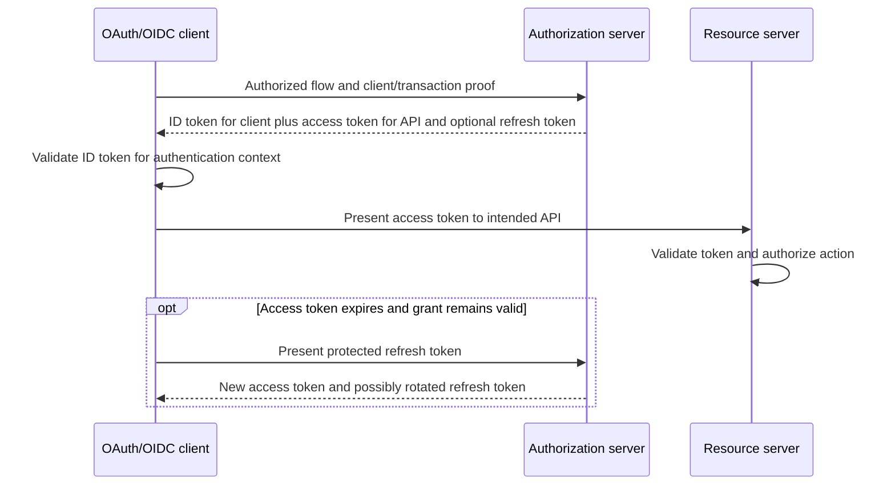

## 8. Bearer risk and sender constraints

RFC 6750 defines a bearer token so possession is enough to use it without proving possession of a cryptographic key. Therefore disclosure can become access. TLS, strict destination validation, short lifetime, least privilege, audience restriction, secure storage, redaction, and incident response reduce risk. RFC 9700 recommends sender-constrained access tokens where feasible, such as mutual TLS or Demonstrating Proof of Possession (DPoP), but these require end-to-end profile support.

| Bearer risk | Control | Residual boundary |
|---|---|---|
| Network theft | End-to-end TLS and endpoint validation | Compromised endpoint/proxy can still expose |
| Log/history leak | Authorization header and redaction; never URL | Debug traces/crash dumps need controls |
| Wrong server | Audience restriction and fixed trusted endpoint | Client must not accept arbitrary resource URL |
| Replay | Short lifetime, sender constraint where supported | Bearer remains replayable inside window |
| Excess privilege | Least scope/resource/action | Resource authorization still required |
| Long-term renewal | Protect/rotate/bind refresh token | Token family incident handling needed |
| Browser script theft | Architecture such as secure HttpOnly cookie/BFF | XSS can still act through victim session |

## 9. Scopes, roles, permissions, and consent

A scope string is defined by an authorization server/resource-server ecosystem. It is not globally standardized. **Delegated access** means a client acts with a signed-in user and is constrained by grant, user privilege, and resource policy. **Application** or app-only access means the workload acts as itself without a user. A role is a product authorization construct and can appear in token claims under a profile, but runtime authorization still belongs to the resource server.

| Concept | Decided by | Example question | Common confusion |
|---|---|---|---|
| Requested scope | Client authorization request | What minimum capability is requested? | Request equals grant |
| Granted scope | Authorization server/consent/policy | What was actually granted? | Grant equals runtime allow |
| Delegated permission | User/client/tenant model | Can user and client both do action? | User privilege ignored |
| Application permission | Workload/admin grant | Does app need unattended capability? | Broad app-only used for convenience |
| Role | Resource/app authorization model | Which named role maps to actions? | Role claim trusted without policy |
| Consent | Resource owner/admin authorization decision | Who approved which client/resources? | Permanent unconditional access |
| Runtime authorization | Resource server | Is actor allowed on this resource now? | Valid token means all actions |

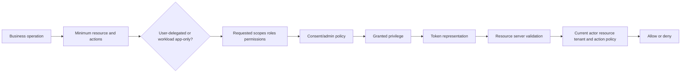

## 10. Least-privilege analysis

Least privilege means granting only the minimum resources and actions, for the minimum identities, environments, and duration needed. “Read only” can still expose all tenant data. A narrow write permission can still be destructive. Scope names must be mapped to actual operations and data.

| Business operation | Data/resource | Action | Actor | Environment | Frequency | Candidate minimum privilege | Owner approval |
|---|---|---|---|---|---|---|---|
| Read configuration | Integration instance | Read selected config | Support connector | Production | On demand | Product-specific config-read | App/security owner |
| Synchronize identity | In-scope users/groups | Read source/write target subset | Provisioning service | Production | Scheduled | Exact profile privileges | Identity/app owner |
| Retrieve events | Authorized event stream | Read from checkpoint | SIEM collector | Production | Continuous | Event-read only | Security owner |
| Rotate credential | One service identity | Add/remove credential metadata | Identity admin workflow | Production | Periodic/emergency | Credential lifecycle role | Identity/security owner |

Least-privilege review asks:

- Can the operation be redesigned to avoid a permission?
- Can delegated access replace app-only access without breaking availability?
- Can the data/resource population be narrowed?
- Can write be split from read?
- Can one identity per environment/integration replace a shared identity?
- Can time-bound or dynamically issued access replace long-lived privilege?
- Who owns recertification and removal?
- What detection exists for unusual use?

## 🔍 Plain-English deep-dive: A scope is a ticket category, not a completed security decision

Imagine a service ticket marked “building maintenance.” That label may permit the request to enter a maintenance queue, but it does not let the technician enter every office, open every safe, or work forever. The building still checks identity, room, task, time, and local policy.

An OAuth scope similarly communicates requested or granted authorization under a specific ecosystem. The resource server must still validate audience, actor, resource, tenant, operation, and current policy. Delegated access can also be limited by what the user is allowed to do. App-only access can be powerful because no user is present to narrow it.

The analogy stops because scopes are protocol strings and roles/permissions can be represented differently. The operational lesson is exact: translate every scope or role into concrete resources/actions and test both permitted and forbidden operations using authorized procedures.

**Memory cue:** Scope starts authorization context; the resource server finishes the decision.

## 11. API keys, client secrets, certificates, and assertions

An **API key** is vendor-specific and may identify a project/client, authorize operations, meter usage, or combine these functions. A **client secret** is a shared confidential value used by a confidential OAuth client to authenticate to an authorization server. A **certificate credential** uses possession of a private key and a public certificate relationship. A **client assertion** can be a short-lived signed statement used for client authentication under a profile. None should be pasted into a support ticket.

| Credential type | Secret material | Strength/benefit | Operational burden/risk |
|---|---|---|---|
| API key | Key value | Simple/vendor-supported | Often long-lived/bearer/shared; weak attribution if reused |
| Client secret | Shared value | Broad interoperability | Storage, distribution, expiry, leakage, synchronized rotation |
| Certificate credential | Private key; public cert shared | Asymmetric; verifier need not store shared secret | Key protection, certificate expiry/rollover, chain/profile |
| Signed client assertion | Signing private key; short-lived assertion | Avoids sending static shared secret per request | Correct signing, replay/time/audience validation |
| Managed identity | Platform-managed credential inaccessible to app/operator | No manually managed credential in supported platform | Platform and workload binding/authorization |
| Workload identity federation | Trust in external workload issuer/subject/audience | Eliminates stored cross-platform secret | Trust configuration and external IdP security |

Certificates are not “secret files”; the public certificate is intended to be distributed. The corresponding private key is secret. A certificate thumbprint/key ID is normally metadata, but exposure policy still applies. Certificate validity does not automatically grant permission, and token validity can be shorter than certificate validity.

## 12. Service identities and non-human ownership

A service identity represents software, automation, a connector, a job, or a hosted workload. It needs a business owner, technical owner, purpose, environments, resource permissions, credential strategy, lifecycle, monitoring, and decommission plan. “No human user” does not mean “no owner.”

| Inventory field | Why it matters |
|---|---|
| Identity/object/client ID | Stable non-secret correlation |
| Display name | Human readability, not identity proof |
| Workload/purpose | Detect abandoned or repurposed identity |
| Business and technical owner | Approval and incident contact |
| Environment/tenant | Prevent cross-environment use |
| Resource/audience | Limit destination |
| Scopes/roles | Privilege and blast radius |
| Credential type/IDs | Rotation and incident handling |
| Last-used/created/expiry UTC | Staleness and outage risk |
| Consumers/dependencies | Rotation migration plan |
| Sign-in/use logs | Attribution/anomaly detection |
| Decommission criteria | Remove abandoned privilege |

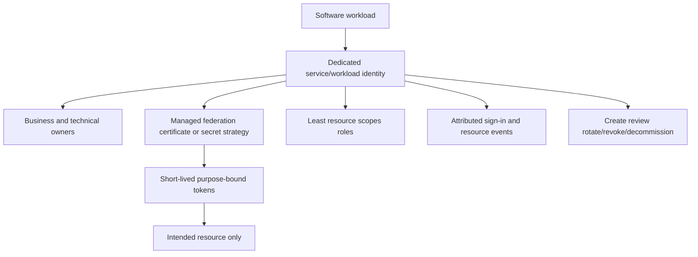

## 13. Prefer secretless workload identity where supported

Microsoft recommends managed identity where the workload and scenario support it. The platform manages credentials and applications obtain tokens without handling a secret. Workload identity federation allows an external workload's trusted identity token to be exchanged for an access token according to configured issuer, subject, and audience trust. This removes a stored long-lived cross-platform secret, but it does not remove identity, token, privilege, or trust management.

| Choice order | Use when | Main validation |
|---|---|---|
| Managed/platform identity | Workload runs on supported platform/resource | Correct workload binding and least target role |
| Workload identity federation | External platform provides trustworthy workload identity | Exact issuer/subject/audience and repository/job/environment boundaries |
| Asymmetric certificate/assertion | Federation/managed identity unavailable but supported | Protected private key, rollover, issuer/audience/time/replay |
| Client secret/API key | Only supported practical method | Secret manager, narrow privilege, short life, rotation, monitoring |
| Shared human credential | Avoid | Replace with attributable service identity |

Secretless does not mean credentialless in the abstract. The platform or external identity provider still authenticates the workload and issues short-lived artifacts. The improvement is that developers and operators do not distribute a reusable static secret to the workload.

## 14. Credential inventory and storage

If an organization cannot answer “what uses this credential?” it cannot rotate or revoke safely. Store secrets in a designated secret-management system with fine-grained access, audit, availability, backup/recovery, and lifecycle controls. Do not commit them to source, bake them into images, place them in tickets, or expose them in diagnostics.

| Metadata field | Safe example | Never record in general ticket |
|---|---|---|
| Credential ID | `CRED-ID-064-A` | Secret value |
| Type | Client secret/certificate/API key | Private key |
| Owner | Team/role alias | Unnecessary personal details |
| Consumer | `WORKLOAD-064-A` | Memory dump containing value |
| Purpose/audience | `RESOURCE-064-A` | Authorization header |
| Storage class | Approved vault/platform identity | Vault export |
| Created/expires UTC | Metadata only | Token body unless approved/minimized |
| Fingerprint/thumbprint | Approved identifier | Full certificate plus private key bundle |
| Last used UTC | Audit metadata | Raw cookie/session ID |
| Scope/role names | Names and risk classification | Live bearer token |

```mermaid
flowchart LR
    Generate[Approved creation or platform identity] --> Store[Secrets manager or managed trust]
    Store --> Authorize[Fine-grained consumer access]
    Authorize --> Deliver[Runtime retrieval or token acquisition]
    Deliver --> Use[Intended resource only]
    Use --> Audit[Metadata and fingerprint audit]
    Audit --> Rotate[Scheduled or risk-triggered rotation]
    Rotate --> Revoke[Old credential rejection]
    Revoke --> Delete[Remove remnants and decommission]
```

## 15. Logging and redaction

Security debugging needs correlation without replayable values. Logs should include credential/token/session lifecycle events and decisions, but never the full value. A stable keyed fingerprint can correlate an artifact within an authorized environment; a plain unsalted hash may be unsafe for low-entropy credentials. Product-approved implementation is required.

| Log this | Do not log this |
|---|---|
| Token/credential type | Access/refresh/ID token value |
| Issuer and audience identifiers | Client secret/API key/password |
| Subject/client/tenant non-secret IDs if necessary | Session cookie/ID |
| Scope/role names | Authorization/Cookie headers |
| `kid`/thumbprint/credential ID | Private key/certificate bundle |
| Issued/expiry/validation UTC | Authorization code/assertion value |
| Validation stage/error category | Full request dump with secrets |
| Correlation/request/session fingerprint | Raw session identifier |
| Source/destination service | URL query containing token |

Redaction must occur before data reaches log sinks, telemetry, exception messages, analytics, chat, screenshots, and support bundles. “We delete it later” is not adequate because copies may exist in replicas, archives, exports, or downstream systems.

## 16. Rotation is a migration, not a reset button

Rotation replaces credential material while preserving authorized service. Safe rotation usually overlaps old and new credentials long enough to migrate all known consumers, validates the new credential end to end, removes the old credential, proves old rejection, and monitors. Emergency rotation may shorten or eliminate overlap based on exposure risk.

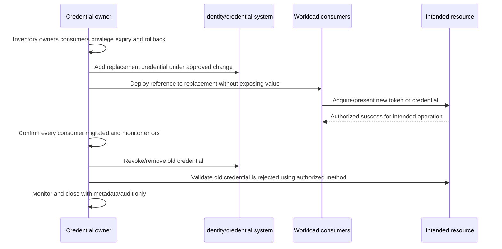

| Phase | Evidence | Stop condition |
|---|---|---|
| Inventory | Identity, credential IDs, owners, consumers, privilege, expiry | Unknown consumer/owner |
| Prepare | Change/rollback, monitoring, maintenance window | No rollback/incident owner |
| Add | New credential ID/type/expiry; no value in ticket | Wrong identity or excessive privilege |
| Migrate | Consumer deployment/config versions | Some consumer still uses old |
| Validate new | Intended positive operation plus forbidden negative test where allowed | Wrong audience/scope/behavior |
| Remove old | Revocation/removal event UTC | Unexpected dependency failure |
| Validate old rejection | Expected failure category, not credential value | Old still accepted |
| Monitor/close | Error/use trends and audit trail | Suspicious use or unresolved outage |

## 🔍 Plain-English deep-dive: A new lock working does not prove the old key stopped working

A facilities team installs a new lock cylinder on one entrance and successfully opens it with a new key. That proves the new key works at that entrance. It does not prove every entrance was changed, every employee received the new key, or the old key no longer opens a side door.

Credential rotation is the same. Positive validation proves the replacement works for a tested consumer and operation. Inventory and migration prove consumers moved. Removal/revocation plus a controlled negative validation proves the old credential no longer works. Monitoring finds missed consumers and suspicious attempts.

The analogy stops because distributed caches and tokens can outlive the credential that minted them. Removing a client secret may stop future client authentication without instantly invalidating already-issued access tokens or sessions. The exact product lifecycle must be verified.

**Memory cue:** New works, all moved, old fails, monitoring clean: four rotation proofs.

## 17. Expiration, rotation, revocation, deletion, and residual tokens

**Expiration** rejects an artifact after a time. **Rotation** introduces replacement material. **Revocation** invalidates an artifact/grant before natural expiry where supported. **Deletion** removes a credential record. These actions can have different propagation and cascade behavior. Already-issued access tokens, refresh tokens, app sessions, and browser cookies may not follow automatically.

| Lifecycle action | Direct target | Does not automatically prove |
|---|---|---|
| Secret expires | Client credential use after expiry | Existing access token/session revoked |
| Secret rotated | Replacement exists | Old removed or consumers migrated |
| Secret deleted | Credential record absent | Previously issued tokens invalid now |
| Refresh token revoked | Refresh/possibly related grant per policy | Every access token immediately rejected |
| Access token expires | That access token no longer valid | Refresh token/session ended |
| App logout | App session invalidated | IdP session or other app sessions ended |
| IdP logout | Identity-provider session action | Every downstream app/token ended |
| Account disabled | Identity state changed | Every cached session/token/API key stopped |

RFC 7009 allows clients to request revocation of access or refresh tokens. Server policy can cascade to related tokens/grants, and propagation may have delay. A successful revocation response intentionally does not reveal whether a submitted token was valid. Product behavior must be checked.

## 18. Credential exposure response

A suspected credential exposure is a security incident, not a routine login failure. Do not copy the value to confirm it. Record type, credential ID/fingerprint, owner, identity, privilege, environments, exposure location/time, first/last observed use, and response actions. Revoke/rotate under authority, search for use and replicas, remove exposed copies, and investigate root cause.

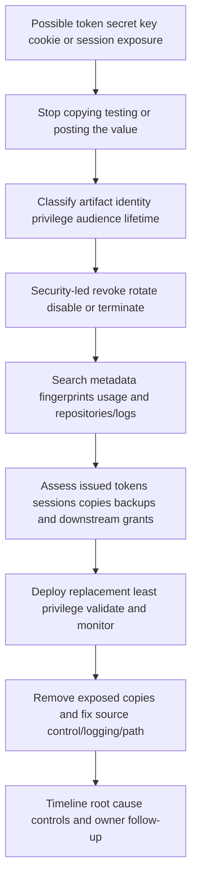

| Incident question | Why |
|---|---|
| What artifact/type? | Determines use and revocation path |
| Which identity/tenant/environment? | Defines blast radius |
| Which resource, scopes, roles? | Defines potential actions/data |
| When created/expires/last used? | Bounds timeline |
| Where exposed and replicated? | Finds copies in logs/history/backups |
| Was it used from unexpected source? | Detects compromise |
| What can be revoked immediately? | Containment |
| Which issued tokens/sessions survive? | Residual risk |
| Which consumers need replacement? | Availability |
| What control failed? | Prevention |

## 19. Cookies and browser sessions

HTTP requests are stateless, so applications use a session mechanism to connect requests to server-side state. A session ID in a cookie is temporarily equivalent to the authentication strength of that session: theft can permit impersonation. The cookie value should be unpredictable and meaningless; sensitive session data and authorization state should be protected server-side or under an approved secure design.

| Cookie attribute/design | Purpose | Boundary |
|---|---|---|
| `Secure` | Send cookie only over HTTPS | Does not stop script access or CSRF |
| `HttpOnly` | Prevent JavaScript from reading cookie | XSS can still initiate requests in victim context |
| `SameSite` | Restrict cross-site cookie sending | Defense in depth, not universal CSRF replacement |
| Host-only/no `Domain` | Narrow to originating host | Review sibling apps/origins |
| Restricted `Path` | Limit path sending | Not a full security boundary between same-host apps |
| `__Host-` prefix | Enforce Secure, no Domain, Path `/` in supporting browsers | Correct server config still required |
| Non-persistent/expiry | Bound browser persistence | Server must enforce session expiry |
| Server-side invalidation | End session authority | Clearing client cookie alone is insufficient |

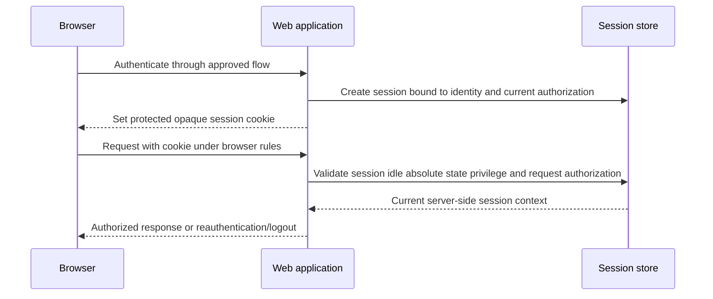

## 20. Session lifecycle and timeouts

Secure sessions have creation, authentication upgrade, renewal, authorization checks, idle timeout, absolute timeout, logout, risk-event reauthentication, invalidation, and audit. Regenerate the session identifier after authentication and privilege changes to prevent session fixation and stale privilege binding.

| Event | Expected control | Support evidence |
|---|---|---|
| Anonymous session created | Unpredictable server-generated ID | Session event/fingerprint |
| Authentication succeeds | Regenerate ID; bind authenticated state | Old/new fingerprints and UTC |
| Privilege changes | Regenerate/re-evaluate authorization | Role event and session renewal |
| Idle timeout | Server invalidates after inactivity | Last activity and timeout policy |
| Absolute timeout | Server invalidates regardless of activity | Created/expired UTC |
| Risk event | Reauthenticate/terminate under policy | Risk and challenge event |
| Logout | Server invalidation and client cleanup | Session destruction UTC |
| Concurrent sessions | Product/policy-specific visibility/control | Session inventory metadata |

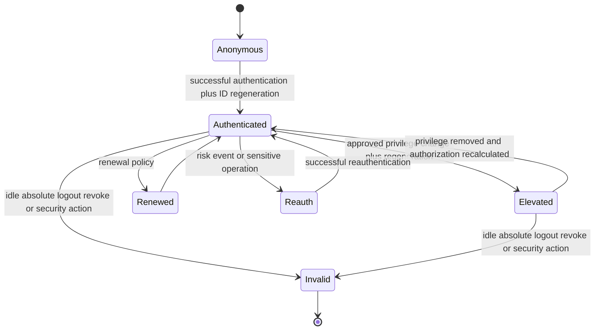

## 21. Logout is not universal revocation

One user interaction can involve an identity-provider session, authorization grant, access token, refresh token, application session, browser cookie, and separate downstream service sessions. Logging out of the application should invalidate the app session server-side and clear client state, but it may not end the IdP session, revoke refresh/access tokens, remove consent, or sign out of other applications.

| Layer | Typical owner | Termination evidence |
|---|---|---|
| Browser cookie | Browser/application origin | Expired/cleared cookie plus server invalidation |
| Application session | Application | Session store/audit invalidation |
| IdP session | Identity provider | IdP logout/session event |
| Authorization grant | Authorization server/resource owner | Grant revoked/consent removed |
| Refresh-token family | Authorization server/client | Revocation/replay event/policy |
| Access token | Authorization/resource server | Expiry/revocation/status behavior |
| Target SaaS local session | Target app | Target session termination |
| API key/service credential | Credential owner/target | Credential revoked/rejected |

## 22. CSRF at a defensive high level

**Cross-Site Request Forgery (CSRF)** occurs when an attacker causes an authenticated browser to send an unwanted state-changing request to a trusted site. Browsers automatically attach eligible cookies, so a server needs evidence that the request originated from the legitimate application context and was intentionally formed. Use framework-provided defenses where available.

| Defense | Role | Important limit |
|---|---|---|
| Synchronizer token | Server validates secret unpredictable token tied to session | Protect value; never log/URL; XSS can bypass |
| Signed double-submit pattern | Binds submitted token to session under stateless design | Naive cookie matching is weaker/injectable |
| SameSite cookie | Reduces cross-site cookie sending | Defense in depth; same-site/subdomain/client-side gaps |
| Origin/Referer validation | Compares source to trusted target origin | Proxy/privacy/missing-header handling needed |
| Fetch Metadata | Uses browser request-context headers | Browser/proxy coverage and fallback |
| Custom header/CORS policy | Cross-origin scripts need approved preflight | CORS allowlist and client input must be secure |
| Reauthentication/user confirmation | Protects high-risk actions | UX impact; layer with other defenses |
| No state-changing GET | Preserves safe-method assumption | Existing legacy behavior needs correction |

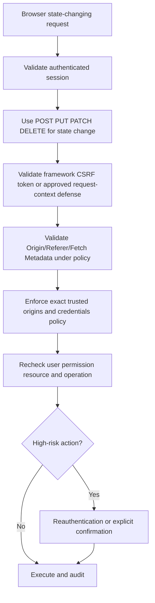

CSRF tokens are not OAuth access tokens. SameSite is not a full replacement for CSRF defense in most deployments. `HttpOnly` protects cookie confidentiality from JavaScript but does not stop malicious script from sending requests. Cross-site scripting can defeat many CSRF protections, so XSS prevention is essential.

## 23. Common HTTP/authentication symptoms

| Symptom/result | Likely layer | Next evidence |
|---|---|---|
| 400 invalid request | Protocol/request | Parameter names, grant/profile, correlation, no values |
| 401 invalid token | Resource authentication | Type, issuer, audience, expiry, key ID, validation stage |
| 401 after rotation | Client authentication or resource token | Credential ID/expiry and token issuance/use timeline |
| 403 insufficient scope | Resource authorization | Required versus granted scope and actor/resource policy |
| 403 with valid scope | Runtime authorization | Roles, tenant, object-level policy, user privilege |
| Unknown signing key | Token validation | Trusted issuer metadata/JWKS cache and `kid` |
| Not yet valid/expired | Time validation | UTC, `nbf`/`exp`, bounded skew, issuer/resource clocks |
| Intermittent old/new success | Rotation/caching/multi-consumer | Credential IDs, node/consumer versions, issued-token age |
| Logout but still active | Session/token layering | App session, IdP session, tokens, target sessions |
| State change from other site | CSRF protection | Cookie attributes, token/origin/fetch metadata, method |

## 24. Worked example 1: JWT decodes but API returns 401

**Input:** A customer says a three-part token decodes and contains the expected username, but the API rejects it.

**Reasoning:** Decoding proves only representation. Classify token type and intended recipient. Compare expected issuer/audience, key ID/trusted metadata, signature-validation stage, expiry/not-before UTC, and resource token profile. An ID token sent to an API is a leading hypothesis.

**Evidence:** Token type label, issuer/audience identifiers, `kid`, issued/expiry UTC, error and correlation ID, all captured without token value or personal claims.

**Result:** The fictional client supplied an ID token to a resource expecting an access token. Correct the client library flow/profile rather than weakening API audience validation.

**Caveat:** Never paste a customer token into an online decoder.

## 25. Worked example 2: 403 after broad scope consent

**Input:** An application has a broad-looking granted scope but one object operation returns 403.

**Reasoning:** Validate token recipient and granted scope, then check delegated versus app-only actor, user privilege, tenant, resource ownership, object-level policy, license, and target-local role. Scope is not the complete runtime decision.

**Evidence:** Client ID, actor type, scope/role names, target resource class, operation, consent event, 403 detail, and resource audit.

**Result:** The delegated token was valid, but the user lacked the target object's required role. Do not add an application-wide permission to bypass user authorization.

**Caveat:** Product permission names and consent rules vary.

## 26. Worked example 3: Secret rotated but one worker fails

**Input:** Most job workers succeed after client-secret rotation; one returns client-authentication failures.

**Reasoning:** Correlate worker/deployment version, secret reference/version metadata, configuration reload behavior, credential IDs, issuance success, and old-credential removal time. Do not request either secret.

**Evidence:** Worker ID, deployment hash, vault reference/version ID, credential ID and expiry, error, UTC, and client sign-in logs.

**Result:** One worker never reloaded the new vault reference before old removal. Restore service using authorized rollback/new deployment, then improve migration completeness checks.

**Caveat:** Extending old credential lifetime can increase exposure; security owner decides during incidents.

## 27. Worked example 4: Old access token works after secret deletion

**Input:** A client secret is deleted, but an access token minted earlier still calls the API.

**Reasoning:** Client-secret deletion stops future client authentication using that secret. A self-contained access token can remain valid until expiry unless resource/authorization infrastructure supports and applies revocation or other event handling. Check token issue/expiry, grant/session state, resource validation model, and incident policy.

**Evidence:** Credential deletion UTC, token fingerprint and issue/expiry UTC, resource audience/scope, use event, and revocation architecture metadata.

**Result:** Expected residual validity under the fictional design. Security containment includes grant/token/session action where supported, not only secret deletion.

**Caveat:** Never use a suspected stolen token to test production casually.

## 28. Worked example 5: Logout returns directly to the app

**Input:** A user clicks app logout, revisits the app, and is signed in immediately.

**Reasoning:** Confirm app session invalidation and cookie cleanup. Then determine whether the IdP session remained active and the app initiated a new silent/interactive authentication. Separate refresh token, IdP session, and app session timelines.

**Evidence:** App session fingerprint lifecycle, cookie names/attributes without values, IdP authentication events, redirect flow metadata, and UTC.

**Result:** App logout worked, but active IdP SSO created a new app session. Product requirements decide local logout versus federated logout behavior.

**Caveat:** “Sign out everywhere” requires explicit multi-layer design and may not be instantaneous.

## 29. Worked example 6: Browser sends state-changing request unexpectedly

**Input:** A cookie-authenticated application processes a state-changing request initiated from another site.

**Reasoning:** Treat as security issue. Check whether state changed on GET, framework CSRF validation existed, SameSite/Domain/Secure/HttpOnly attributes, Origin/Referer/Fetch Metadata policy, exact CORS origins, and server-side authorization. Preserve logs without cookie or CSRF token values.

**Evidence:** Method/path, source/target origin categories, cookie attributes, protection decision, session fingerprint, user/operation authorization, and audit event.

**Result:** The synthetic app relied only on a permissive cookie and had no CSRF token/origin defense. Engineering uses maintained framework protection and defense in depth.

**Caveat:** XSS and client-side request construction need separate investigation.

## 30. Customer-safe evidence matrix

| Symptom | Minimum safe evidence | Never request |
|---|---|---|
| Token rejected | Type, issuer, audience, `kid`, issue/expiry UTC, validation stage, correlation | Token value |
| Insufficient scope | Required/granted names, actor mode, resource/action, 403 detail | Broad admin grant as test |
| Client authentication | Client/credential ID, type, expiry, last-use/error UTC | Secret/private key/assertion |
| Rotation outage | Credential IDs, consumers, deployment/vault reference versions, timeline | Old/new credential values |
| Key rollover | Issuer, `kid`, metadata/JWKS retrieval/cache timing | Private signing key |
| Session persists | Session fingerprint/events, cookie attributes, IdP/app/token layers | Cookie/session ID |
| Exposure | Type, fingerprint/ID, privilege, location/time, use events | Reposting the exposed value |
| CSRF concern | Method, origin categories, defense decision, session fingerprint | CSRF token/cookie values |

## Troubleshooting decision tree

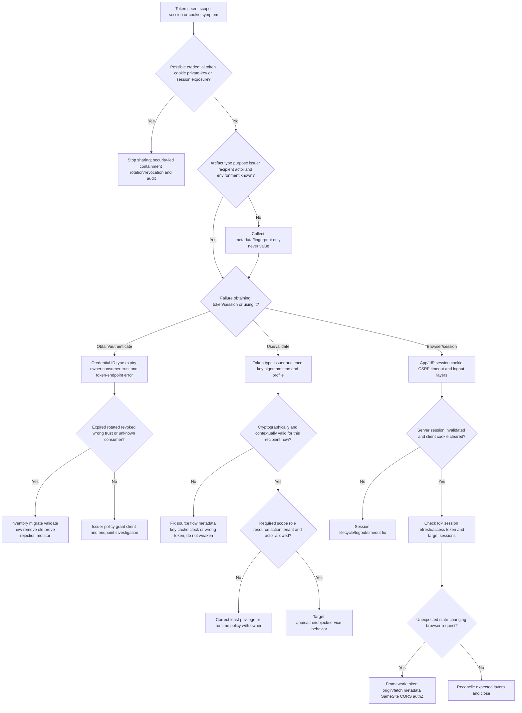

## 31. Common failure modes

| Failure mode | Why it fails | Better behavior |
|---|---|---|
| JWT means valid | Format is not trust | Full profile validation |
| Decode equals validate | Parsing performs no proof | Library verification plus issuer/audience/time/context |
| Signature means encryption | Signed claims often readable | Minimize claims; use required confidentiality design |
| Any signed token works | Wrong audience/type can be validly signed | Purpose/type and exact recipient validation |
| Trust token-provided key URL blindly | Attacker can redirect trust | Issuer-bound trusted metadata/configuration |
| Access token proves login to client | It targets resource server | Validate ID token/session under OIDC/client profile |
| ID token calls API | It targets client | Use access token intended for API |
| Scope equals permission everywhere | Scope vocabulary is ecosystem-specific | Map to resource operations and runtime policy |
| Valid token means authorized | Resource/action/tenant policy remains | Enforce object-level authorization |
| Ask for broader scope to test | Expands blast radius and hides root cause | Compare required/granted and exact deny layer |
| API key is harmless identifier | Often authorizes as bearer | Treat as secret and inventory privilege |
| Certificate is a secret | Public cert is distributable; private key is secret | Protect key and track thumbprint/expiry |
| Rotate by creating new secret | Consumers/old credential unresolved | Four proofs: new works, all moved, old fails, monitor |
| Delete secret revokes tokens | Issued artifacts may survive | Analyze token/grant/session lifecycle |
| Store secrets in config/source | Replication and leakage | Managed identity/federation or secret manager |
| Log token for correlation | Log becomes credential source | Approved fingerprint and metadata |
| Share one service identity | Poor attribution and broad blast radius | Dedicated identity per purpose/environment |
| Managed identity needs no governance | It still has permissions/owners/lifecycle | Inventory, least privilege, logs, decommission |
| Logout ends everything | App, IdP, grants, tokens, sessions differ | Validate each required layer |
| Clear cookie ends session | Server state may remain valid | Server invalidation plus client cleanup |
| HttpOnly stops CSRF | Browser still sends cookie | CSRF defenses and authorization |
| SameSite alone always stops CSRF | Same-site, legacy, client-side, GET gaps | Framework token plus defense in depth |
| Timeouts enforced in browser | Client can be manipulated | Server-side idle and absolute timeout |
| Refresh token is just long access token | Different recipient/purpose and high value | Protect, rotate/bind, revoke grant family |

## 32. Escalation packet

| Section | Required content |
|---|---|
| Impact | Availability, unauthorized access/data, affected identities/operations |
| Artifact classification | Type, purpose, issuer, intended recipient, actor mode, format |
| Non-secret IDs | Tenant/client/resource/credential/key/session fingerprint/correlation |
| Privilege | Requested/granted scopes, roles, resource/action, delegated/app-only |
| Validation | Algorithm policy, trusted key source, issuer, audience, time, type, failure gate |
| Credential lifecycle | Owner, consumer, storage class, created/expiry/rotation/revocation UTC |
| Token/session lifecycle | Issue/use/expiry/revocation/logout/invalidation events |
| Rotation | Consumer migration matrix, positive/negative proof, monitoring |
| Browser | Cookie attributes, app/IdP session, timeout, CSRF defense decisions |
| Changes | Credential, permission, issuer metadata/key, clock, app, proxy, cookie changes |
| Privacy | Values excluded/redacted; handling path and exposure response |
| Ask | Exact identity/security/application/Engineering decision or fix |

## Safe synthetic lab: The Credential Lighthouse and Session Locks 064

### Objective

Build a local paper inventory and decision model for fictional tokens, scopes, service identities, credentials, rotation, revocation, browser cookies, sessions, and CSRF defenses. The unique lab is **The Credential Lighthouse and Session Locks 064**.

The lab records metadata, invented identifiers, claim names, fingerprints, and expected decisions only. It does not create, encode, decode, sign, encrypt, acquire, present, rotate, revoke, or test any real token, API key, client secret, certificate, private key, cookie, session, application, endpoint, tenant, or account.

### Prerequisites

- Local Markdown editor or spreadsheet only.
- This Part and fictional IDs prefixed `APP-064`, `WORKLOAD-064`, `CRED-064`, `TOK-064`, `KEY-064`, `SESSION-064`, `COOKIE-064`, `CASE-064`, and `OP-064`.
- Reserved text-only hosts `issuer-064.example.test`, `api-064.example.test`, and `app-064.example.test`.
- No browser storage inspection, decoder, API client, identity tenant, authorization server, secret manager, admin console, network call, token, secret, key, certificate, cookie, session, or customer data.
- Artifact label: **local/public lab - synthetic credential/token/session metadata only**.
- Record start UTC, zero-credential statement, zero-live-system statement, and source date August 24, 2026.

### Synthetic inventory starter

| Artifact ID | Type | Purpose/recipient | Privilege/lifetime | Value rule |
|---|---|---|---|---|
| `TOK-064-ACCESS-A` | Fictional access token metadata | `api-064.example.test` | Read event names; 10 minutes | No value exists |
| `TOK-064-REFRESH-A` | Fictional refresh metadata | Authorization server | Grant family; rotation | No value exists |
| `TOK-064-ID-A` | Fictional ID-token metadata | `APP-064-A` | Authentication claims | No value exists |
| `CRED-064-A` | Fictional workload credential | Client authentication | Narrow app; 30 days | ID/fingerprint only |
| `SESSION-064-A` | Fictional app session | App session store | Idle/absolute policy | Fingerprint only |
| `COOKIE-064-A` | Fictional session cookie metadata | App origin | Secure attributes | Name/attributes only |

### Lab steps

1. Create a cover with artifact label, UTC, safety boundary, and Microsoft-transfer/learned/proprietary labels.
2. Define principal, credential, token, claim, scope, permission, role, cookie, session, fingerprint, issuer, client, and resource server.
3. Draw the security-artifact map from workload/human through credential, issuer, token, validation, authorization, session, and cookie.
4. Create 24 fictional artifacts spanning access, refresh, ID, code, API key, client secret, certificate, managed identity, federated trust, session ID, cookie, and CSRF metadata.
5. For each, inventory purpose, issuer, recipient, actor, format, privilege, lifetime, storage class, owner, consumer, revocation, and value prohibition.
6. Build opaque-versus-structured and JWT/JWS/JWE comparison cards; state signature is not encryption and decoding is not validation.
7. Build a JWT validation gate ledger using only invented metadata for algorithm, `kid`, issuer, audience, exp/nbf/iat, type/profile, actor, transaction binding, and privilege.
8. Model one wrong-audience, one expired, one future-not-before, one unknown-key, and one wrong-token-type failure.
9. Build access/refresh/ID token recipient and lifecycle diagrams.
10. Create a bearer-risk threat/control/residual-risk matrix including TLS, redaction, audience, lifetime, sender constraint, and refresh protection.
11. Translate eight fictional business operations into resource/action/actor/environment/frequency and minimum privilege.
12. Compare delegated and application access; add user/resource runtime policy to each decision.
13. Create six fictional service identities with business/technical owner, purpose, environment, resource, roles, credential strategy, use logs, and decommission date.
14. Select managed identity, federation, certificate/assertion, or static secret for six scenarios and explain the boundary.
15. Build a credential inventory with IDs/fingerprints only and an explicit list of forbidden value locations.
16. Design standard rotation for `CRED-064-A`: inventory, replacement, migration, positive test, old removal, negative test, monitor, rollback.
17. Design emergency exposure response for `CRED-064-B`, including residual issued tokens/sessions and copy removal.
18. Create expiration/rotation/revocation/deletion scenarios and list what each does not prove.
19. Build a redaction table for request headers, URLs, exceptions, screenshots, support bundles, and logs.
20. Model an app session with creation, authentication regeneration, privilege-change regeneration, idle/absolute timeout, reauthentication, and logout.
21. Create cookie metadata using Secure, HttpOnly, SameSite, host-only, Path, persistence, and prefix decisions without any cookie value.
22. Draw app session, IdP session, grant, refresh token, access token, target session, and service-credential layers for logout.
23. Build a defensive CSRF matrix covering framework protection, token, Origin/Referer, Fetch Metadata, SameSite, CORS, no state-changing GET, and reauthentication.
24. Run the decision tree on wrong token type, 403 despite scope, one stale rotation consumer, old access token after secret deletion, app logout with IdP SSO, and unexpected browser state change.
25. Draft a customer update and security/Engineering escalation without values.
26. Deliver a 90-second “classify before handling” answer, a 90-second rotation answer, and a 60-second honesty boundary.
27. Validate source URLs/date, cleanup, privacy, zero-activity statement, and rubric.

### Expected evidence

- Security-artifact boundary map and 24-artifact metadata inventory.
- Opaque/structured and JWT/JWS/JWE comparison.
- Signature-not-encryption explanation and validation-gate ledger.
- Five token-validation failure cards.
- Access/refresh/ID lifecycle diagrams.
- Bearer risk/control matrix.
- Eight-operation least-privilege matrix.
- Delegated/app-only/runtime authorization comparison.
- Six service-identity governance records.
- Secretless/static credential decision matrix.
- Credential inventory and forbidden-location register.
- Standard rotation and emergency exposure workflows.
- Lifecycle and redaction matrices.
- Session state and cookie-attribute workbook.
- Logout-layer and defensive CSRF models.
- Six decision-tree cases, customer update, and escalation packet.
- Source ledger dated **August 24, 2026**.
- Spoken Microsoft-transfer and Abnormal-unknown statements.

### Cleanup and privacy

- Confirm every identity, artifact, key, token, credential, app, service, session, cookie, case, host, and fingerprint is fictional and includes `064`.
- Confirm no value has token-like, API-key-like, secret-like, cookie-like, private-key-like, certificate-body-like, or authorization-header content.
- Confirm all hosts use `example.test` and no valid request, endpoint, issuer metadata, redirect URI, code, assertion, or credential exists.
- Remove real tenant/client/app/object IDs, issuer/audience values, scope lists, claim values, email, screenshots, logs, headers, cookies, sessions, fingerprints, and vault paths.
- Confirm no browser developer storage, decoder, API client, identity portal, secret manager, application, endpoint, or network request was used.
- Delete the artifact if a security value or customer identity cannot be reliably removed.
- Record cleanup UTC and: `Synthetic paper metadata exercise only; zero live token, key, secret, certificate, cookie, session, credential, app, endpoint, request, tenant, browser-storage, rotation, revocation, or production activity.`

### Validation rubric

| Dimension | Fail | Developing | Pass |
|---|---|---|---|
| Classification | Calls every value token | Knows common types | Purpose, issuer, recipient, actor, format, lifetime, storage, lifecycle |
| JWT | Decode equals validate | Checks signature | Algorithm/key, issuer, audience, time, type/profile, context; signature not encryption |
| Token purpose | Swaps ID/access | Separates types | Access/refresh/ID/code recipients and lifecycle |
| Authorization | Scope equals allow | Lists scope | Delegated/app-only, consent, role, resource/action runtime decision |
| Credentials | Stores shared secret | Uses vault | Managed/federated preference, owner, inventory, least privilege, lifecycle |
| Rotation | New credential works | Removes old | Inventory, overlap, migration, positive, negative, monitoring, residual token analysis |
| Evidence | Copies values | Redacts manually | Fingerprints/IDs/UTC/stages; no replayable values |
| Sessions | Cookie equals SSO | Knows timeout | App/IdP/tokens, server invalidation, regeneration, idle/absolute/logout |
| CSRF | SameSite only | Uses token | Framework defense, origin/context, SameSite, CORS, authZ, high-risk reauth |
| Honesty/safety | Live credential activity | Synthetic values | Metadata-only, zero values/systems, experience transfer, proprietary unknown |

## 33. Official Source Anchors

All sources were verified and recorded with guide currency date **August 24, 2026**. RFCs anchor token/JWT/revocation semantics; RFC 9700 updates OAuth security best current practice. Current platform and OWASP guidance must be revalidated because products, browser behavior, and recommendations evolve.

| Official or primary source | What it anchors | Boundary |
|---|---|---|
| [RFC 6750 - OAuth Bearer Token Usage](https://www.rfc-editor.org/rfc/rfc6750.html) | Bearer possession risk, Authorization header, invalid token/insufficient scope, TLS, URL/log exposure | Updated by RFC 9700; profiles vary |
| [RFC 7009 - OAuth Token Revocation](https://www.rfc-editor.org/rfc/rfc7009.html) | Revocation endpoint semantics, refresh/access behavior, cascading policy, propagation | Product support and cascade vary |
| [RFC 7519 - JSON Web Token](https://www.rfc-editor.org/rfc/rfc7519.html) | JWT claims format, issuer/audience/time, JWS/JWE relationship, privacy/trust | Use current JOSE/profile security guidance too |
| [RFC 9700 - OAuth 2.0 Security Best Current Practice](https://www.rfc-editor.org/rfc/rfc9700.html) | PKCE, sender constraints, least privilege/audience restriction, refresh protection, modern threat guidance | Implement through supported maintained libraries/profiles |
| [Microsoft Learn - Managed identities for Azure resources](https://learn.microsoft.com/en-us/entra/identity/managed-identities-azure-resources/overview) | Platform-managed workload identities and secret replacement | cloud platform support boundaries |
| [Microsoft Learn - Workload identity federation](https://learn.microsoft.com/en-us/entra/workload-id/workload-identity-federation) | External workload trust/exchange, issuer-subject-audience matching, secret elimination | Trust configuration remains security-sensitive |
| [Microsoft Learn - Application security best practices](https://learn.microsoft.com/en-us/entra/identity-platform/security-best-practices-for-app-registration) | Managed identity preference, federation/certificate over secrets, credential review/rotation, least privilege/ownership | Microsoft profile; no production claim |
| [OWASP Secrets Management Cheat Sheet](https://cheatsheetseries.owasp.org/cheatsheets/Secrets_Management_Cheat_Sheet.html) | Centralized management, least privilege, automation, lifecycle, auditing, detection, incident response | Secondary guidance; product docs govern implementation |
| [OWASP Session Management Cheat Sheet](https://cheatsheetseries.owasp.org/cheatsheets/Session_Management_Cheat_Sheet.html) | Session IDs, cookies, renewal, timeouts, logout, logging/redaction | Application/framework threat model required |
| [OWASP CSRF Prevention Cheat Sheet](https://cheatsheetseries.owasp.org/cheatsheets/Cross-Site_Request_Forgery_Prevention_Cheat_Sheet.html) | Framework defenses, synchronizer/signed patterns, SameSite limits, Origin/Fetch Metadata, CORS | XSS and client-side CSRF require separate controls |

### Source-use discipline

- Use purpose-specific standards and current product profiles; never infer purpose from token shape.
- Use maintained libraries; do not hand-roll JWT, OAuth, cookie, session, or CSRF controls.
- Prefer managed/federated workload identity where supported; otherwise manage credentials centrally.
- Never send bearer credentials in URLs or support artifacts.
- Treat credential exposure as incident; never repost the value.
- Keep Abnormal-specific formats, scopes, identities, sessions, rotation, and logs explicitly unknown.

## Likely Interview Questions

### Q1. What is the difference between an access token, refresh token, and ID token?

**Model answer:** An access token is for a resource server and authorizes API access under granted policy. A refresh token is for the authorization server and can obtain new access tokens, so it is high-value and must be protected, bound or rotated as supported. An ID token is for the OpenID Connect client and describes an authentication event; it is not an API access credential.

### Q2. What is a JWT, and does a signature encrypt it?

**Model answer:** A JWT is a compact claims format carried in a JWS or JWE. A normal signed JWT provides integrity and signer/key authentication under a validation policy, but its encoded claims are usually readable; signature is not encryption. Decoding is not validation. The recipient must verify approved algorithm and trusted key, issuer, audience, time, type/profile, and context before authorization.

### Q3. What makes bearer tokens risky?

**Model answer:** Any possessor can normally replay a bearer token without proving a cryptographic key. I reduce risk with TLS and endpoint validation, no URLs/logs, secure storage, short lifetime, narrow scope and audience, protected refresh tokens, monitoring, and sender-constrained tokens where the end-to-end profile supports them. Exposure is handled as a security incident.

### Q4. Why can a valid token still receive 403?

**Model answer:** Token validity only establishes that the artifact passed authentication and profile checks for the recipient. Authorization still evaluates granted scope or role, delegated versus app-only actor, user privilege, tenant, target resource, object ownership, license, and current policy. I separate 401 invalid-token evidence from 403 insufficient-scope or runtime-authorization evidence.

### Q5. How would you rotate a client credential safely?

**Model answer:** Inventory identity, owners, consumers, privilege, storage references, expiry, dependencies, monitoring, and rollback. Add a least-privileged replacement, migrate and validate each consumer, prove intended operations succeed, remove/revoke the old credential, prove old rejection using an authorized method, assess already-issued tokens/sessions, monitor errors/use, and retain metadata only.

### Q6. Why prefer managed identity or workload identity federation?

**Model answer:** They avoid distributing a reusable long-lived static secret to the workload. Managed identity lets the platform manage credential material; federation trusts a narrowly defined external workload issuer, subject, and audience and exchanges its assertion for short-lived access. Both still require owners, least privilege, exact trust binding, logs, reviews, and decommissioning.

### Q7. How are cookies, sessions, logout, and CSRF related?

**Model answer:** A protected cookie often carries an opaque application session ID, while the server stores and validates session state. Logout must invalidate server state and clear client state, but it may not end IdP sessions or revoke tokens/grants. Because browsers automatically send eligible cookies, state-changing requests need framework CSRF defenses plus origin/context, SameSite, CORS, authorization, and high-risk reauthentication as appropriate.

### Q8. What evidence would you request for a token or secret case?

**Model answer:** Metadata only: artifact type, issuer, audience, client/subject/tenant identifiers, granted scope names, key or credential ID, approved fingerprint, issue/expiry UTC, validation stage/error, correlation ID, owner, consumer, and lifecycle events. I never request the access/refresh/ID token, client secret, API key, private key, authorization code, assertion, session ID, or cookie value.

## Memory Hooks

- **Purpose before shape; recipient before claims.**
- **JWT is a format, not a verdict.**
- **Decode reads; verify proves integrity; validate establishes context.**
- **Signed is not encrypted.**
- **Access goes to API; refresh goes to issuer; ID goes to client.**
- **Bearer means possession can become access.**
- **Scope starts authorization; resource policy finishes it.**
- **Valid token can still be forbidden.**
- **Prefer managed/federated identity; govern it anyway.**
- **No owner means no safe service identity.**
- **New works, all moved, old fails, monitoring clean.**
- **Deleting a secret does not necessarily kill issued tokens.**
- **Log identifiers, fingerprints, stages, and UTC; never values.**
- **Cookie carries; session remembers; server authorizes.**
- **App logout, IdP logout, token revocation, and consent removal differ.**
- **SameSite helps; CSRF defense still needs intent and authorization.**

## Completion Checklist

- [ ] I can state the Section goal and artifact-classification rule.
- [ ] I can define principal, credential, token, claim, scope, role, cookie, session, and fingerprint.
- [ ] I can classify access, refresh, ID, code, API key, client secret, certificate, and session artifacts.
- [ ] I can explain opaque versus structured tokens without claiming one is universally safer.
- [ ] I can explain JWT/JWS/JWE and why signature is not encryption.
- [ ] I can explain why decoding is not validation.
- [ ] I can list algorithm/key, issuer, audience, time, type/profile, actor, binding, and privilege validation gates.
- [ ] I can explain bearer risk, audience restriction, least privilege, lifetime, and sender constraints.
- [ ] I can separate scopes, delegated/app-only permission, role, consent, and runtime authorization.
- [ ] I can build a concrete least-privilege operation matrix.
- [ ] I can inventory service identities and credentials with owners/consumers/lifecycle.
- [ ] I can prefer managed identity/federation where supported and explain remaining governance.
- [ ] I can design overlap rotation with positive and negative proof.
- [ ] I can separate expiration, rotation, revocation, deletion, token, and session effects.
- [ ] I can handle possible exposure without copying the value.
- [ ] I can explain secure cookie attributes, session regeneration, idle/absolute timeout, and server invalidation.
- [ ] I can separate app session, IdP session, grant, tokens, target session, and credential during logout.
- [ ] I can explain defensive CSRF layers and SameSite/HttpOnly limits.
- [ ] I completed or can explain **The Credential Lighthouse and Session Locks 064**.
- [ ] The lab includes Prerequisites, Expected evidence, Cleanup and privacy, and Validation rubric.
- [ ] I used no live token, secret, key, certificate, cookie, session, endpoint, account, or tenant.
- [ ] I can state experience transfer and Abnormal proprietary unknown boundaries.
- [ ] I checked Official Source Anchors and recorded **August 24, 2026**.
- [ ] I can answer exactly Q1-Q8.

[Next: Part 065 - Audit Logs Webhooks and Integration Permissions](Part-065-audit-logs-webhooks-and-integration-permissions.md)