# Part 065 - Audit Logs Webhooks and Integration Permissions

## Section goal

This Part explains audit logs, webhooks, and integration permissions from zero knowledge. These topics form one support system: permissions determine what an integration may observe or do; subscriptions determine which changes a publisher should notify; webhooks deliver event messages; logs record production, delivery, validation, processing, and administrative changes; reconciliation compares the consumer's state with the authoritative source.

An **audit log** is a chronological record intended to support attribution and reconstruction of meaningful actions or changes. An **application log** records operational/security events from application code. A **delivery log** records attempts to send a webhook and the recipient's response. A **webhook** is an HTTP callback: a publisher sends an event notification to a consumer-controlled endpoint when a subscribed event occurs. These records answer different questions and none is automatically complete or authoritative for every conclusion.

Webhook delivery is a distributed-system workflow, not a guaranteed instantaneous function call. Messages can be delayed, retried, duplicated, batched, lost, or delivered out of event order. A 2xx acknowledgement proves the endpoint accepted the HTTP request under the publisher's contract; it does not prove that downstream business processing succeeded. A publisher's delivery log can show “not attempted,” “attempted and failed,” or “acknowledged,” while the consumer's ingress, queue, worker, and target logs show later stages.

The central support rule is:

> Build separate event, delivery, processing, permission, and target-state timelines; correlate them with stable identifiers and UTC before changing a subscription, endpoint, secret, permission, retry policy, queue, or customer data.

This Part covers event actors and objects, timestamps, event IDs, correlation IDs, audit versus operational records, integrity, retention, redaction, webhook subscriptions, endpoint validation, HTTPS, signatures/HMAC at a high level, replay resistance, acknowledgement, retries, backoff, duplicates, ordering, idempotency, queues, dead-letter handling, reconciliation, polling/delta fallback, permission-to-event mapping, consent/grants, least privilege, and investigation of missing/duplicate/delayed events. It does not provide a live endpoint, secret, signature, API request, tenant change, credential, private key, customer event, or executable receiver. The lab is a paper delivery ledger using fictional metadata only.

Microsoft Graph change-notification material is production-transfer learning for Arti and a current official example, not a claim that she implemented Graph webhook receivers in production. GitHub webhook material is learned architecture from official public documentation. Abnormal's audit schema, event taxonomy, webhook support, subscription lifecycle, signatures, delivery guarantees, retry windows, permissions, retention, and evidence interfaces remain proprietary unknowns unless approved documentation states them.

## Learning outcomes

After completing this Part, you should be able to:

- define event, audit log, application log, access log, delivery log, webhook, publisher, consumer, endpoint, subscription, queue, and reconciliation;
- distinguish source event time, publication time, delivery-attempt time, receive time, queue time, processing time, and target-state time;
- design an event record around when, where, who, what, action, object, outcome, reason, tenant, and correlation;
- explain why display text is weaker than stable actor/object identifiers and why one timestamp is insufficient;
- distinguish event ID, delivery ID, subscription ID, request/correlation ID, trace/span ID, checkpoint, and idempotency key;
- explain log provenance, trust boundaries, time synchronization, schema versions, retention, access controls, immutability/tamper evidence, and privacy;
- explain webhook setup, endpoint validation, event/resource filters, subscription expiry/renewal, and lifecycle notifications conceptually;
- explain HTTPS, origin authentication, HMAC/signature validation, exact raw-body validation, constant-time comparison, secret rotation, and replay defenses at a safe high level;
- separate authenticate, authorize, validate, acknowledge, enqueue, process, commit, and reconcile stages;
- reason about at-most-once, at-least-once, and exactly-once claims without assuming a network delivers exactly once;
- design idempotent consumers for duplicates and safe out-of-order processing;
- classify timeouts, 2xx, 4xx, 5xx, throttling, Retry-After, exponential backoff, and dead-letter handling;
- use source APIs, delta/checkpoint mechanisms, or polling to reconcile missed events where supported;
- map business needs to source permissions, subscription scope, event categories, payload fields, downstream actions, and retention;
- investigate missing, delayed, duplicate, out-of-order, invalid-signature, expired-subscription, revoked-permission, and slow-endpoint cases;
- produce a customer-safe escalation packet without event payloads, secrets, signatures, tokens, or unnecessary personal data; and
- state Microsoft transfer, GitHub learned architecture, and Abnormal proprietary boundaries honestly.

## JD Mapping

| Supplied role signal | Capability built | Arti's transferable evidence | Boundary |
|---|---|---|---|
| Complex support investigations | Reconstructs source, delivery, queue, processing, and target timelines | CRITSIT, escalation, and Engineering collaboration | No invented webhook incident |
| SaaS Security | Treats logs, event payloads, subscription secrets, grants, and service identities as sensitive | Microsoft security/identity habits | No Abnormal implementation claim |
| Enterprise integrations | Maps permissions and subscription scope to observable events and downstream state | REST/JSON/cloud configuration knowledge | Product contracts vary |
| Microsoft 365 ecosystem | Transfers current Graph change-notification, lifecycle, permission, and reconciliation concepts | Microsoft production-transfer context | No claim of building Graph receivers |
| API troubleshooting | Interprets HTTP acknowledgement, retry, timeout, redirect, auth, and rate behavior | HTTP/API working knowledge | Lab sends no request |
| Log-driven RCA | Correlates stable IDs, UTC, actors, objects, outcomes, and changes | Production support evidence discipline | Synthetic data only here |
| Customer trust | Requests minimum metadata and redacts event content/credentials | Privacy-aware communication | No raw mailbox/security payloads |
| Permission review | Connects least privilege to event/resource fields and downstream actions | Identity/RBAC transfer | Vendor permissions need current docs |

## Candidate honesty note

| Evidence tier | Safe statement | Do not imply |
|---|---|---|
| **Production transfer - Microsoft** | “I have used Microsoft support and identity practices to reason about logs, permissions, timelines, and integrations.” | That Arti implemented Microsoft Graph webhook infrastructure |
| **Local/public lab** | “I built a synthetic event/delivery/permission reconciliation ledger without an endpoint or payload.” | A live subscription, webhook delivery, secret, or API call |
| **Learned architecture - GitHub/Graph** | “I studied current official webhook/change-notification delivery guidance and can transfer the reliability concepts.” | Direct production operations on those platforms |
| **Standards knowledge** | “I use HTTP semantics and HMAC concepts to explain acknowledgement, retry, and integrity at a high level.” | A custom cryptographic implementation |
| **Proprietary unknown** | “Abnormal's event schemas, signatures, guarantees, retries, permissions, and logs remain unknown absent approved docs.” | Generic webhook patterns reveal product internals |

Safe interview language:

> “For a missing-event case, I first prove whether the source event occurred and was eligible under the subscription. Then I trace publisher attempt, endpoint receipt, authenticity validation, acknowledgement, queue, worker, target write, and reconciliation with distinct UTC timestamps and identifiers. I request metadata and redacted field names, not webhook secrets, signatures, authorization headers, tokens, or sensitive payload content.”

**Named-platform experience boundary:** Microsoft support evidence practices are transferable production context; Abnormal AI, GitHub, Microsoft Graph webhook implementation, and other named-platform event-delivery operations are learned architecture or synthetic-lab areas unless a real example establishes otherwise.

## 1. Event, audit, log, and notification vocabulary

An **event** is a record that something meaningful happened. An **action** is what an actor intended or attempted. An **outcome** records success, failure, deferment, or another result. An **audit trail** allows reconstruction of attributable actions. A **notification** tells a subscriber about an event/change; it may contain the full resource, a subset, or only an identifier requiring retrieval.

| Record type | Primary purpose | Example question | Dangerous assumption |
|---|---|---|---|
| Audit log | Attribution/reconstruction/governance | Who changed permission X on object Y? | Every internal step is present |
| Security log | Detection/investigation | Was access denied or suspicious? | Absence proves no attack |
| Application log | Operational behavior/errors | Which module failed and why? | Actor identity is authoritative |
| Access log | Request/response metadata | Did endpoint receive an HTTP request? | Business processing succeeded |
| Delivery log | Publisher notification attempt/result | Did publisher attempt and what response? | Consumer committed the event |
| Queue/worker log | Asynchronous processing | Was event enqueued/retried/dead-lettered? | Source still has same state |
| Target audit | Downstream mutation/state | What changed in target? | Change came from this webhook |
| Metric/alert | Aggregated health signal | Did failure/latency rate exceed threshold? | Provides per-event forensic detail |

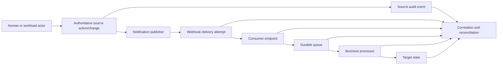

## 2. Audit evidence is not one universal log

Different systems observe different boundaries. A source audit record can show a configuration update; an HTTP log can show a callback; a worker log can show transformation failure; a target audit can show no write. Support should not stretch one record beyond its vantage point.

| Evidence source | Strongest conclusion | Cannot prove alone |
|---|---|---|
| Source audit | Source accepted/recorded action under its model | Webhook delivered |
| Subscription record | Configuration existed at observed time | It existed when event occurred unless history available |
| Publisher delivery log | Attempt/result at publisher boundary | Endpoint enqueued/processed |
| Load balancer/access log | Request reached that boundary | Signature valid or event committed |
| Consumer ingress log | Handler received/validated/acknowledged | Worker succeeded later |
| Queue record | Message persisted/available | Target write completed |
| Worker trace | Processing path/outcome | Authoritative source state unchanged |
| Target audit/read-back | Target mutation/current state | Which delivery caused it without correlation |

## 🔍 Plain-English deep-dive: Audit logs are witness statements from different doorways

Imagine a package crossing a campus. The sending-room ledger says the package left. The gate camera says a vehicle entered. The receiving-room scanner says a parcel arrived. The shelf inventory says the item was stored. Each witness sees a different doorway. A gate camera cannot prove what is on the shelf; a shelf record cannot prove which vehicle delivered it without identifiers and time correlation.

Integration logs work the same way. Publisher “delivered” often means an HTTP request received a qualifying acknowledgement. Consumer processing may happen asynchronously after that acknowledgement. Conversely, a target can already match desired state due to polling or another writer even if one webhook failed.

The analogy stops because distributed systems retry, batch, and reorder messages. The support lesson is exact: state the boundary and strongest conclusion for every log, then connect ledgers with stable IDs and UTC.

**Memory cue:** Every log is a witness; no witness sees the whole route.

## 3. Event-record anatomy: when, where, who, what

OWASP recommends recording sufficient “when, where, who, and what” context. The exact schema depends on purpose and privacy. Security events need actor, action, target, result, and reason; integration events also need tenant, source, subscription, schema version, and correlation.

| Field family | Useful fields | Support question |
|---|---|---|
| When | Event UTC, recorded UTC, received UTC, processed UTC | When did each boundary observe it? |
| Where | Service, tenant, region, environment, component/version | Which system instance? |
| Who | Actor type, stable actor ID, client/workload ID, impersonation/delegation | Who or what acted? |
| What | Event type, action, object type/ID, changed-field names | What happened to which object? |
| Outcome | Success/fail/defer/unknown, reason category, status | Did intended action complete? |
| Correlation | Event, delivery, subscription, request, trace, operation IDs | Which records belong together? |
| Security | Auth method class, permission/role names, policy decision | Why was it allowed/denied? |
| Schema | Producer/version, payload version, encoding | How should fields be interpreted? |
| Confidence | Clock/source/identity confidence | Which values are estimated/untrusted? |

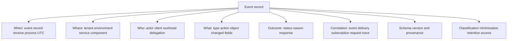

## 4. Stable identifiers and display values

Display names, email addresses, titles, and URLs can change or collide. Use stable source actor/object IDs and preserve tenant/namespace. If identifiers are personal data under policy, minimize and protect them.

| Identifier | Identifies | Scope/owner | Reuse rule |
|---|---|---|---|
| Actor ID | Human/workload principal | Identity tenant/source | Never infer globally unique without namespace |
| Object/resource ID | Changed entity | Source service/tenant | Prefer over display text |
| Event ID | Logical event | Producer contract | Dedup only according to documented scope |
| Delivery ID | One delivery/redelivery family or attempt | Publisher contract | Can differ from or remain same as event ID |
| Subscription ID | Notification configuration | Publisher/tenant/app | Track lifecycle and scope |
| Request/correlation ID | One request/operation chain | Service boundary | Support lookup, not necessarily event identity |
| Trace/span ID | Distributed telemetry path | Observability system | Sampling can omit spans |
| Idempotency key | Consumer/business operation dedup | Consumer contract | Must bind to intended effect |
| Checkpoint/watermark | Processed source position | Consumer/source mechanism | Persist atomically with effects where possible |

## 5. Time is a set of clocks, not one timestamp

An event can occur at source at 10:00, be recorded at 10:00:01, published at 10:00:03, delivered at 10:02 due to retry, queued immediately, processed at 10:05, and reflected in target at 10:06. Arrival order is not event order. Record UTC, clock source/confidence, and timezone/precision.

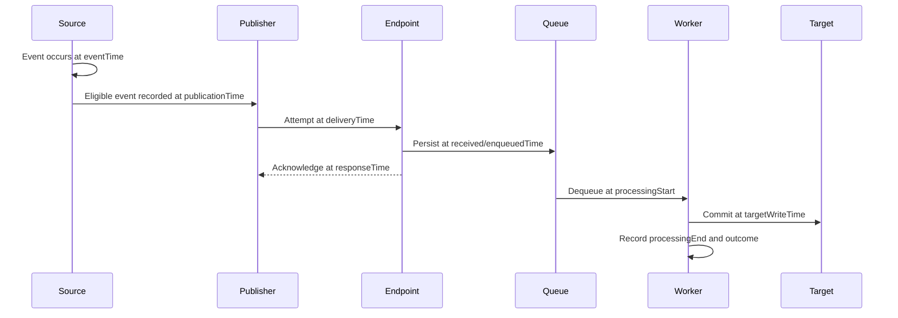

| Timestamp | Meaning | Common mistake |
|---|---|---|
| `eventTime` | Source says action/change occurred | Sort all workflows solely by it |
| `recordedTime` | Source persisted audit record | Treat as action time |
| `publishedTime` | Publisher made event eligible | Assume delivery attempted then |
| `attemptTime` | Publisher started one delivery | Confuse retry with new event |
| `receivedTime` | Consumer boundary received | Assume source order |
| `enqueuedTime` | Durable queue accepted | Assume worker processed |
| `processedTime` | Worker finished/decided | Assume target visible immediately |
| `targetTime` | Target audit/visibility time | Assume same source actor |

## 6. Correlation and causation

Correlation says records likely belong to one flow. Causation requires stronger evidence: a specific delivery was validated, processed, and applied under a known operation. Time proximity alone is weak because concurrent writers and retries exist.

| Evidence strength | Example | Claim |
|---|---|---|
| Weak | Same display name and minute | Possible relation |
| Moderate | Same source object and event type | Likely same business change |
| Strong | Same event/delivery/subscription plus trace | Same delivery pipeline |
| Stronger | Worker operation ID appears in target audit | Delivery caused target write under recorded path |
| Reconciled | Source desired and target actual states compared | End state known at reconciliation time |

## 7. Log trust, integrity, and non-repudiation limits

Logs can be missing, forged, injected, modified, deleted, delayed, or misattributed. Treat external fields as untrusted input and sanitize/encode them to prevent log injection. Protect transport and storage, separate write/read privileges, monitor access, detect gaps/tampering, and synchronize clocks. “Immutable” should be a documented property, not a label.

| Control | Threat reduced | Boundary |
|---|---|---|
| Append-oriented/read-only retention | Casual modification/deletion | Privileged storage admins/system compromise remain |
| Central secure collection | Local deletion/host loss | Collector availability and trust matter |
| Access separation | Unauthorized read/change | Emergency/admin paths require audit |
| Tamper-evident chaining/signing | Undetected modification | Key custody and completeness/gap proof needed |
| Time synchronization | Misordered timelines | Remote clocks and queue delays remain |
| Schema validation/sanitization | Injection/parser ambiguity | Legitimate but false values remain |
| Sequence/gap monitoring | Missing ranges | Producer might not guarantee sequence |
| Backup/retention controls | Loss and legal needs | Copies increase privacy exposure |

## 8. Privacy, redaction, retention, and disposal

Logs and webhook payloads can contain personal data, security events, message content, URLs, IPs, tenant identifiers, tokens, signatures, and secrets. Collect only what purpose and law allow. Redact before logging, not after broad replication. Retention should be long enough for operations/security/compliance and no longer than required.

| Usually record | Usually redact/exclude |
|---|---|
| Event type/action | Access/refresh tokens |
| Stable IDs where necessary and authorized | Webhook secret/signature value |
| Object type and changed-field names | Authorization/Cookie headers |
| UTC and status/reason categories | Session IDs/private keys/passwords |
| HTTP status/latency | Full resource/message body by default |
| Subscription/delivery/correlation IDs | Sensitive query parameters/URLs |
| Permission/scope names | Unnecessary names/emails/content |
| Schema/component version | Stack dump containing secrets/customer data |

## 9. What a webhook is

A webhook reverses polling direction. Instead of the consumer repeatedly asking “anything changed?”, the publisher sends an HTTP request to a registered endpoint when an eligible event occurs. The consumer still may need retrieval or reconciliation because the notification can be a hint rather than full state.

| Model | Strength | Cost/risk |
|---|---|---|
| Polling | Consumer controls schedule; can compare authoritative state | Latency, rate/load, repeated reads |
| Webhook | Low latency; publisher pushes eligible changes | Public/reachable endpoint, delivery/auth/retry complexity |
| Event broker/stream | Buffering, scale, consumer groups, replay capabilities | Platform/operations complexity |
| Hybrid webhook plus reconciliation | Fast notification plus completeness repair | Two paths to operate and correlate |

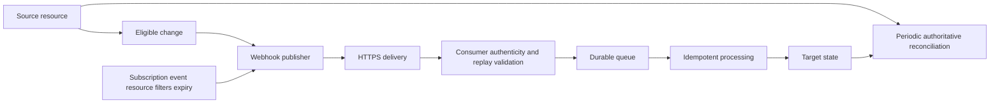

## 🔍 Plain-English deep-dive: A webhook is a doorbell, not a moving company

A doorbell tells you someone arrived. It does not prove who they are, what package they carry, whether you stored it, or whether every visitor rang. The receiver checks identity, records the visit, accepts the parcel quickly, and handles it inside. If the bell fails, an inventory check can reveal missing packages.

A webhook notification similarly alerts a consumer. HTTPS protects the channel; a publisher-specific signature or validation mechanism can authenticate/integrity-protect the message. The endpoint should validate and persist quickly, acknowledge according to contract, then process asynchronously. Reconciliation repairs gaps.

The analogy stops because publishers can retry the same message and deliveries may be batched/out of order. The exact lesson is to separate notification, delivery, acknowledgement, business processing, and final state.

**Memory cue:** Webhook rings; queue receives; worker acts; reconciliation proves completeness.

## 10. Subscription anatomy and lifecycle

A subscription selects publisher/source, event/resource type, scope/filter, endpoint, authentication/validation configuration, expiry, owner, and lifecycle behavior. Many subscriptions expire and require renewal; app permissions can be revoked independently. A record observed now does not prove the same configuration at event time without change history.

| Subscription field | Question | Failure if wrong |
|---|---|---|
| Subscription ID | Which configuration instance? | Looking at wrong tenant/app |
| Publisher/tenant | Which source authority? | Cross-tenant mismatch |
| Resource/scope | Which object population? | Eligible event excluded |
| Event/change types | Which actions? | Wrong expectation |
| Filter | Which subset? | Null/case/rule gap |
| Notification endpoint | Which consumer origin/path? | Old/wrong route |
| Validation/auth profile | How is endpoint/message trusted? | Forgery/rejection |
| Expiration/renewal | When does delivery stop? | Silent expiry |
| Owner/service identity | Who maintains it? | Abandoned integration |
| Lifecycle endpoint/events | How are reauth/removal/misses signaled? | Gaps not repaired |

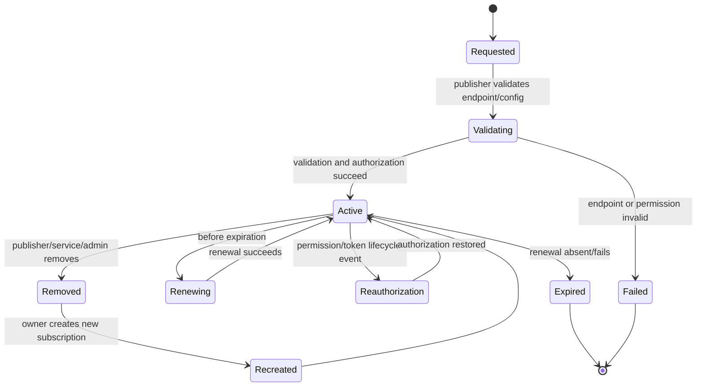

## 11. Endpoint validation is not event delivery

Publishers often challenge a callback endpoint before activating a subscription. The consumer proves it controls and can respond at the endpoint under the publisher's validation protocol. Validation success does not prove event permissions, long-term endpoint health, signature processing, queue health, or business logic.

| Stage | Proves | Does not prove |
|---|---|---|
| DNS/TLS connection | Publisher reached an HTTPS origin with accepted cert | Correct app handler/authorization |
| Validation challenge response | Endpoint understood current challenge | Future events processed |
| Subscription created | Publisher accepted config/authorization then | Renewal and permissions remain |
| First notification 2xx | One request acknowledged | Downstream target updated |
| Reconciliation | Desired/actual compared at time | Every event path exactly once |

## 12. Webhook authenticity and integrity

The endpoint must not trust source IP or TLS alone as the only publisher proof unless the product contract explicitly does so with appropriate controls. Common designs use a shared-secret HMAC over exact raw request bytes, a signed message/token, a subscription secret/state, mutual TLS, or a platform-specific validation scheme. Follow vendor libraries/documentation.

| Validation element | Why |
|---|---|
| HTTPS and certificate validation | Confidentiality/integrity and endpoint authentication in transit |
| Exact expected host/path/method/content type | Narrow receiver surface |
| Body-size and parser limits | Denial-of-service defense |
| Exact raw body retained for verification | Re-encoding can alter signed bytes |
| Signature/auth header presence and version | Select correct profile |
| Current/overlap verification key/secret ID | Support rotation |
| Maintained cryptographic library | Avoid custom mistakes |
| Constant-time tag comparison where applicable | Reduce timing leakage |
| Timestamp/nonce/delivery ID under profile | Replay-window/dedup controls |
| Event type/action allowlist | Prevent unintended business logic |

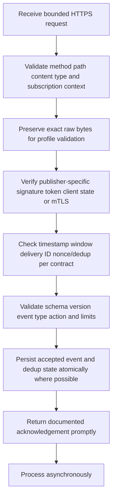

HMAC is a keyed message-authentication code: parties sharing a secret can verify integrity and shared-key authenticity. It is not encryption. A plain hash of `secret + payload` is not a substitute for a defined HMAC profile. This guide does not implement or test HMAC.

## 13. Replay and duplicate defenses

A valid old signed message can remain cryptographically valid. Replay defenses use publisher timestamps/nonces/delivery IDs and a bounded acceptance window according to contract. Deduplication prevents repeated business effects; it does not mean the endpoint should reject legitimate documented redelivery in a way that causes an infinite publisher retry.

| Signal | Use | Caveat |
|---|---|---|
| Delivery ID | Identify redelivery/attempt family | Publisher may preserve or change across retry; verify docs |
| Event ID | Logical event dedup | Scope and uniqueness are producer-specific |
| Timestamp | Reject stale replay window | Clock sync and delayed legitimate delivery |
| Nonce | One-use proof | Requires durable state and producer support |
| Payload/resource version | Apply only newer state | Version semantics required |
| Idempotency key | Bind repeated processing to one effect | Define per operation/resource |
| Subscription ID | Namespace dedup and permissions | Recreated subscriptions get new IDs |

## 14. Acknowledge quickly; process durably

Publisher-specific timeouts vary. A robust endpoint performs bounded request checks, validates authenticity as the contract requires before acceptance, persists the event or rejects it, and responds promptly. Slow external calls belong behind a durable queue. A 202 response means accepted for processing, not completed, under HTTP semantics.

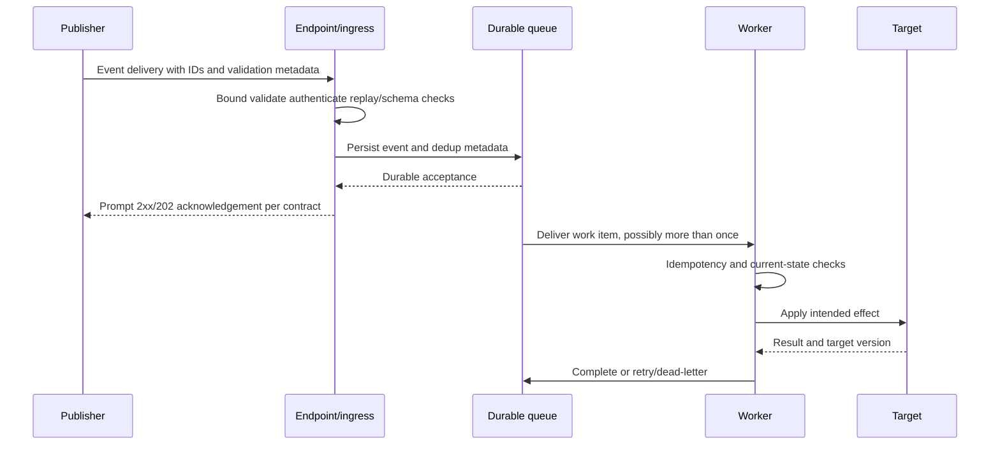

| Endpoint choice | Publisher sees | Consumer obligation |
|---|---|---|
| 2xx after durable queue | Accepted/delivered under contract | Process/retry internally |
| 2xx before persistence | Accepted but event can be lost on crash | Avoid unless contract/design ensures durability |
| 4xx | Request rejected, often permanent/client/auth issue | Understand publisher retry policy |
| 5xx | Temporary consumer failure | Publisher may retry/back off |
| Timeout/connection loss | Outcome unknown to publisher | Expect retry/duplicate |
| Redirect | Product-specific and security-sensitive | Avoid relying without explicit support |

## 15. Delivery semantics: at-most, at-least, exactly once

**At-most-once** means no retry, so an event may be lost but is not intentionally redelivered. **At-least-once** means retry until acknowledged under limits, so duplicates are expected. “Exactly once” requires a carefully defined scope, durable deduplication, and atomic effects; it is rarely a property of the HTTP network delivery by itself.

| Semantic | Loss possible? | Duplicate possible? | Consumer design |
|---|---|---|---|
| At-most-once delivery | Yes | Less from publisher; network/client duplicates still possible | Reconciliation for gaps |
| At-least-once delivery | Reduced under retry window | Yes | Idempotency/dedup plus reconciliation |
| Exactly-once processing claim | Depends on defined boundaries | Hidden/deduped in claimed boundary | Demand contract, atomicity, recovery proof |
| Effectively-once business effect | Delivery can duplicate | Yes, but effect deduped | Stable operation key and transactional state |

## 🔍 Plain-English deep-dive: The acknowledgement dilemma creates duplicates

A courier hands a package to a clerk. The clerk stores it, but the acknowledgement radio cuts out. The courier cannot know whether the package was stored and delivers another copy. If the clerk simply processes every package, the customer is charged twice. If the clerk recognizes the same delivery ID and checks the completed ledger, the second copy can be acknowledged without repeating the effect.

If the clerk acknowledges before storing, a crash can lose the package while the courier believes it was delivered. This is why durable acceptance before acknowledgement is valuable and why idempotency is essential under at-least-once delivery.

The analogy stops because event IDs, attempts, and business operations can have different identities. The lesson is to define the deduplication key, persist it with the effect where possible, and make retries converge on current state.

**Memory cue:** Lost acknowledgement makes duplicate delivery; early acknowledgement can make lost work.

## 16. Idempotent consumers

An idempotent consumer produces the same intended final effect when processing the same logical operation multiple times. It can record processed event/operation IDs, compare resource versions, use conditional updates, or implement upsert/set-state semantics instead of blind increment/append.

| Event effect | Non-idempotent behavior | Safer pattern |
|---|---|---|
| Set status to inactive | Toggle active/inactive | Set desired state explicitly with version |
| Update profile | Append duplicate field/value | Upsert by stable resource ID |
| Create alert | Create new alert per delivery | Business key from source event/resource/rule |
| Add group member | Blind append | Set membership/presence under target ID |
| Increment counter | Increment on every delivery | Derive/reconcile count or transactional event ledger |
| Send notification | Send on every worker retry | Outbox/effect ledger and recipient policy |
| Delete object | Error/recreate on duplicate | Treat already absent as converged where policy allows |

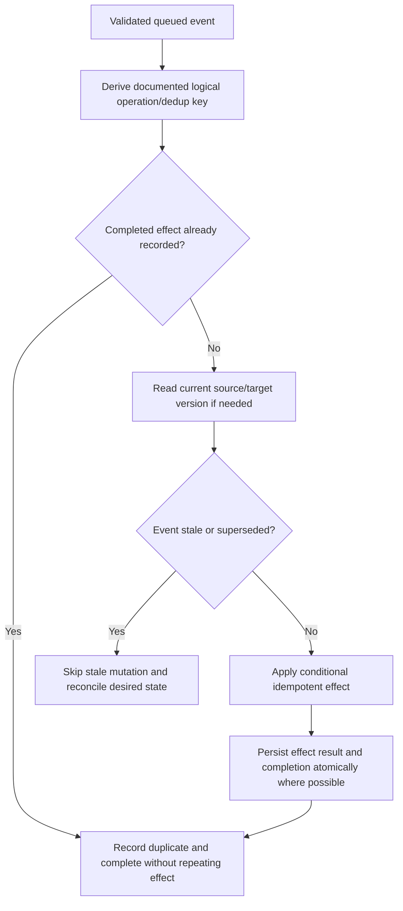

## 17. Ordering and concurrency

Publishers can deliver events out of order because parallel workers, retries, regions, partitions, batching, and network delays differ. Even if one stream preserves order, cross-resource or cross-partition order may not exist. Consumers should use source versions/sequences where defined, compare current state, serialize per resource when required, and make stale events harmless.

| Ordering strategy | Works when | Risk |
|---|---|---|
| Arrival order | Only if contract guarantees relevant order | Retry makes stale overwrite new |
| Event time | Clocks/producer semantics reliable | Same timestamp/skew/backfill |
| Source sequence/version | Monotonic per resource/partition | Gaps and scope need handling |
| Current-state retrieval | Source query available | Rate/latency/eventual consistency |
| Per-resource serialization | Stable object key and manageable load | Hot keys/blocking |
| Set desired state | Event contains/permits current state | Stale payload may still be wrong |
| Reconciliation | Authoritative source accessible | Detection latency and query cost |

## 18. Retry, backoff, jitter, and status classification

Retries should be bounded and classification-aware. Exponential backoff increases delay after failures; jitter spreads clients to avoid synchronized retry storms. Honor a trustworthy publisher/resource `Retry-After` where the contract applies. Do not retry permanent schema/authorization failures forever.

| Result | Typical classification | Action |
|---|---|---|
| 2xx | Publisher acknowledgement success | Consumer owns downstream retries after durable accept |
| 400/415/422 | Malformed/schema/media issue | Fix producer/consumer compatibility; no tight retry |
| 401 | Authentication/signature/credential issue | Investigate trust/rotation; do not expose secret |
| 403 | Authorization/policy/permission issue | Review grants and scope |
| 404/410 | Endpoint/resource absent | Verify route/subscription lifecycle |
| 408/timeout | Unknown outcome | Expect/dedup retry; correlate ingress |
| 409/412 | Conflict/version | Re-read/reconcile and conditional retry |
| 413 | Payload too large | Contract/limit/architecture fix |
| 429 | Rate limited | Honor Retry-After/backoff/jitter |
| 5xx/503/504 | Temporary server/upstream failure | Bounded retry/backoff, health alert |

## 19. Queues and dead-letter handling

A durable queue decouples fast webhook acknowledgement from slower processing, absorbs bursts, supports retries, and provides depth/age metrics. A **dead-letter queue (DLQ)** stores work that exceeded retry policy or cannot be processed. A DLQ is not a trash bin; it needs owner, alert, reason, retention, privacy, replay procedure, and reconciliation.

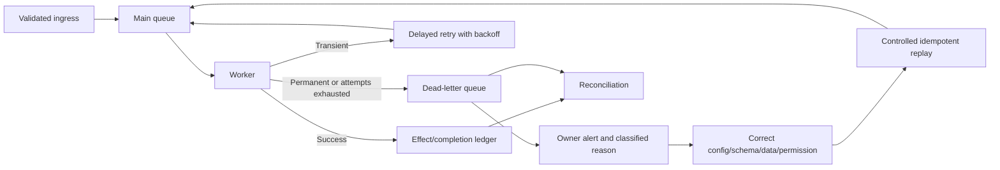

| Queue metric | Meaning | Alert example concept |
|---|---|---|
| Ingress rate | Accepted events/time | Unexpected zero/spike |
| Queue depth | Pending messages | Sustained growth |
| Oldest age | Processing lag | SLA breach |
| Worker success/failure | Processing health | Error-rate increase |
| Retry count | Transient instability | Retry storm |
| DLQ depth/rate | Unprocessable/exhausted | Any critical event or threshold |
| Duplicate rate | Delivery/reprocessing behavior | Sudden publisher/consumer change |
| Reconciliation gap | Missing/divergent state | Completeness failure |

## 20. Missing events and reconciliation

No webhook design should use “we received no notification” as proof that no source change happened. Publisher outages, subscription expiry, revoked permissions, scope filters, endpoint drops, retry-window expiry, consumer acknowledgement-before-persist, queue loss, and processing failures can all create gaps. Reconciliation queries authoritative source state/change APIs, delta/checkpoint mechanisms, or a full inventory where supported.

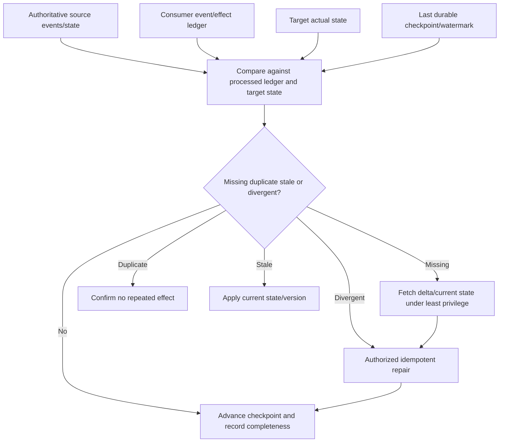

| Reconciliation input | Purpose |
|---|---|
| Subscription/lifecycle history | Explain coverage windows |
| Source audit/change records | Authoritative occurrence/eligibility |
| Publisher delivery history | Attempts/responses/retry window |
| Consumer accepted-event ledger | Durable ingress completeness |
| Processing/effect ledger | Worker outcome/dedup |
| Target read-back/audit | Actual state/effect |
| Checkpoint/delta token | Resume incremental comparison |
| DLQ/retry inventory | Pending failures |

## 21. Permissions and observable events

An integration needs permission to create/manage subscriptions, receive/validate notifications, retrieve source details, and write downstream actions as applicable. These can be different permissions and identities. Notification eligibility may depend on resource permission, tenant consent, user role, application access policy, licensing, and scope.

| Capability | Identity | Permission question | Risk |
|---|---|---|---|
| Create/renew subscription | Provisioning/control-plane workload | Can it subscribe to this resource/scope? | Broad tenant monitoring |
| Receive callback | Endpoint workload | How is publisher authenticated? | Forged event execution |
| Fetch resource details | Data-plane worker | Which fields/objects are required? | Excess data access |
| Write target action | Processor identity | Which exact operations/resources? | Automated destructive action |
| Read audit/delivery logs | Support/monitor identity | Which tenants/time/fields? | Sensitive forensic data |
| Replay/redeliver | Operations identity | Who can trigger and approve? | Duplicate side effects |
| Change permissions/subscription | Admin/governance identity | Who approves and reviews? | Scope expansion/silent outage |

```mermaid
flowchart LR
    Need[Business detection/action need] --> Events[Minimum event/resource types]
    Events --> Fields[Minimum fields or retrieval]
    Fields --> SourcePerm[Minimum source subscription/read permission]
    SourcePerm --> Consent[Owner/admin consent and policy]
    Consent --> Subscription[Scoped subscription]
    Subscription --> Endpoint[Authenticated receiver]
    Endpoint --> TargetPerm[Minimum target action permission]
    TargetPerm --> Review[Periodic grant subscription owner and use review]
```

## 22. Permission-to-event evidence map

Do not troubleshoot permissions as a single “consent granted” Boolean. Map each business requirement through source event, subscription, payload, optional retrieval, transformation, target operation, and audit.

| Business need | Source event/resource | Subscription scope | Payload fields | Retrieval permission | Target action/permission | Evidence |
|---|---|---|---|---|---|---|
| Detect config change | Config audit event | One tenant/resource class | IDs/type/time/changed fields | Config-read if details needed | Alert-create | Source/delivery/alert IDs |
| Process user lifecycle | Identity change | Assigned population | User ID/change type | Profile minimum | Account state update | Source/target IDs |
| Ingest security event | Security event stream | Approved categories | Event metadata/content minimum | Event-read | SIEM write | Checkpoint/counts |
| Monitor subscription health | Lifecycle event | Integration's subscriptions | Subscription ID/reason/time | Subscription-read/manage | Ticket/renew | Lifecycle/action result |

## 23. Permission review checklist

| Review area | Question |
|---|---|
| Business owner | Is purpose still valid? |
| Technical owner | Is an accountable team active? |
| Identity | Dedicated workload per purpose/environment? |
| Source permissions | Least resource/field/event access? |
| Consent/grant | Correct tenant and approval? |
| Subscription | Correct events, filters, endpoint, expiry? |
| Target permissions | Only required actions/resources? |
| Payload/content | Minimum data; encryption where needed? |
| Logs/retention | Protected, minimized, timed disposal? |
| Credential/trust | Managed/federated or rotated secret/key? |
| Use | Last used and expected rate/locations? |
| Removal | Tested decommission and gap handling? |

## 🔍 Plain-English deep-dive: Permissions and subscriptions are two separate valves

A building can authorize a courier to enter the mailroom, while a forwarding form decides which packages are sent to a particular desk. Opening only the permission valve does not create a forwarding instruction. Creating a forwarding instruction without authorization will fail or stop later when authorization is removed.

In an event integration, permissions allow a workload to subscribe/read/manage resources. The subscription selects event/resource scope and endpoint. The payload may provide only an identifier, requiring a separately authorized retrieval. Downstream writes need another permission. Expiry and revocation can stop one stage while the others still look healthy.

The analogy stops because consent, resource policies, and subscription lifecycles differ by product. The support lesson is to map business action to every identity, grant, subscription, payload/retrieval, and target permission independently.

**Memory cue:** Permission allows; subscription selects; payload informs; target permission acts.

## 24. Webhook secret and signing-key rotation

When a webhook uses a shared secret or verification key, rotation must support the publisher/consumer contract. A typical safe design allows an overlap where the consumer accepts signatures from old and new verification material, the publisher switches signing, telemetry proves new use, and old material is removed. Some products provide only replace-in-place behavior; plan for coordinated downtime/risk.

| Rotation phase | Evidence |
|---|---|
| Inventory | Subscription IDs, endpoint, owner, algorithm/profile, key/secret IDs, consumers |
| Prepare | Product-supported overlap, change/rollback, alerts, no values in ticket |
| Add replacement | New ID/version stored in secret manager |
| Consumer ready | Accepts documented old/new IDs and validates exact bytes |
| Publisher switch | Configuration/audit event UTC |
| Observe | New verification ID succeeds; old traffic drains |
| Remove old | Revocation/deletion UTC |
| Negative/monitor | Old signatures rejected under approved test/profile; no valid loss |

## 25. Schema evolution and compatibility

Publishers add event types/actions/fields and can change versions under documented compatibility policies. Consumers should check event type/action, tolerate unknown optional fields, reject unsafe malformed input, version transformation logic, and monitor unknown values. Do not treat field order as semantic JSON order.

| Change | Consumer behavior |
|---|---|
| New optional field | Ignore/preserve safely if contract permits |
| New event/action | Do not execute default privileged action; classify/monitor |
| Field becomes nullable | Handle absence without broad fallback |
| Enum adds value | Unknown-safe path and alert where business-critical |
| Type/required field changes | Versioned contract/migration |
| Payload grows/batches | Enforce documented size/count and scale queue |
| Resource ID format changes | Treat opaque; avoid parsing assumptions |
| Deprecated event/version | Migrate before cutoff and reconcile gaps |

## 26. Worked example 1: Source event exists, no publisher attempt

**Input:** A customer expects a webhook for an administrative change. Source audit shows the change, but publisher delivery history has no event.

**Reasoning:** Compare event type/resource/action to subscription event list, filter/scope, tenant, active window, expiry, publisher limits, and permissions at event time. “Endpoint issue” is not yet supported because no attempt occurred.

**Evidence:** Redacted source event ID/type/object ID/event UTC, subscription ID/config history, grant/lifecycle history, and publisher status.

**Result:** The fictional subscription selected update events but not permission-change events. Correct scope only under owner approval and assess missed-history backfill.

**Caveat:** Do not broaden to every event as a diagnostic shortcut.

## 27. Worked example 2: Publisher shows timeout; consumer processed twice

**Input:** Publisher timed out on first delivery and retried. Consumer target contains two alerts.

**Reasoning:** Trace delivery ID/attempts, ingress receive, queue persist, acknowledgement time, worker effects, and dedup key. The first request arrived and processed after the publisher stopped waiting. The consumer treated each attempt as a new alert.

**Evidence:** Event ID, delivery/attempt IDs, receive/response UTC, queue IDs, worker operation IDs, target alert IDs, and latency.

**Result:** Add durable ingress and business-effect idempotency keyed to documented source event/resource/rule; reconcile duplicate alerts under owner policy.

**Caveat:** Dedup by payload hash alone can collapse distinct legitimate events with equal content.

## 28. Worked example 3: Signature fails only through one proxy path

**Input:** Some deliveries validate while others fail signature verification after a routing change.

**Reasoning:** Compare endpoint node/path, signature version/header presence, key ID, exact raw bytes before any parser, content encoding, proxy transformations, and secret version. Signature must cover the exact bytes defined by publisher.

**Evidence:** Delivery ID, ingress node, content length/encoding, payload fingerprint, signature header name/version (not value), verification key ID, proxy route, validation stage, and UTC.

**Result:** One proxy normalized the request body before verification. Verify at the earliest trusted byte-preserving boundary or configure the route correctly using maintained libraries.

**Caveat:** Never disable signature validation to restore delivery.

## 29. Worked example 4: Events arrive out of order

**Input:** “User disabled” arrives before an older “user updated” retry; the late update reactivates fields/behavior.

**Reasoning:** Arrival order is not source order. Check per-resource source version/sequence, event times, retry history, target current state, and whether updates set state or toggle it. Stale events should not overwrite newer state.

**Evidence:** Source object ID, event IDs/types, source versions, event/attempt/receive times, target version and operation results.

**Result:** Consumer ignores/supersedes lower source version and performs current-state reconciliation. Deactivation remains security-critical.

**Caveat:** Event timestamps alone may not be a reliable version.

## 30. Worked example 5: 202 returned, event absent from target

**Input:** Publisher marks delivery successful because endpoint returned 202, but target never changes.

**Reasoning:** 202 means accepted for processing, not completed. Follow consumer queue acceptance, queue depth/age, worker retry/DLQ, permission at target, transform/schema version, and target read-back.

**Evidence:** Delivery ID, 202 UTC, queue message ID, worker operation/error, DLQ reason, target request correlation/status, and reconciliation gap.

**Result:** Event is in DLQ due to expired target credential. Rotate under Part 064 process, replay idempotently, reconcile, and improve credential-expiry alerting.

**Caveat:** Blindly redelivering from publisher can create more duplicates without fixing target access.

## 31. Worked example 6: Subscription active but permissions revoked

**Input:** Subscription record has a future expiration date, yet events stop after an admin grant change.

**Reasoning:** Subscription expiry and authorization lifecycle are separate. Check lifecycle notifications, app/service identity, consent/grant history, resource access policy, access-token/endpoint authorization state, and source delivery eligibility.

**Evidence:** Subscription/tenant/app IDs, future expiry, grant-change audit, last successful event/delivery UTC, lifecycle event IDs, reauthorization attempts, and permission names.

**Result:** Admin revoked a required read permission. Restore only if business/security owner reapproves; then reauthorize/renew/recreate according to product and backfill via supported delta/full sync.

**Caveat:** Do not use a broader permission to bypass the revoked grant.

## 32. Customer-safe evidence matrix

| Symptom | Minimum safe evidence | Never request |
|---|---|---|
| Missing event | Event type/ID/object ID, UTC, subscription scope/history, attempt existence | Full sensitive source record |
| Delivery failure | Delivery/attempt ID, endpoint host/path class, status/latency/error UTC | Webhook secret/signature/token |
| Invalid signature | Header name/version, key/secret ID, payload fingerprint/length, route | Signature value/raw payload/secret |
| Duplicate | Event/delivery/attempt/queue/operation IDs and effects | Destructive cleanup without owner |
| Out of order | Source version/sequence and all relevant times | Assumption arrival order is truth |
| Slow endpoint | Response latency percentiles, queue acceptance, timeout contract | Disabling validation |
| Permission gap | App/identity IDs, grant/scope names/history, resource/event scope | Broad admin consent as test |
| Reconciliation gap | Checkpoint, expected/processed/target IDs/counts, DLQ | Bulk customer export unless approved/minimized |

## Troubleshooting decision tree

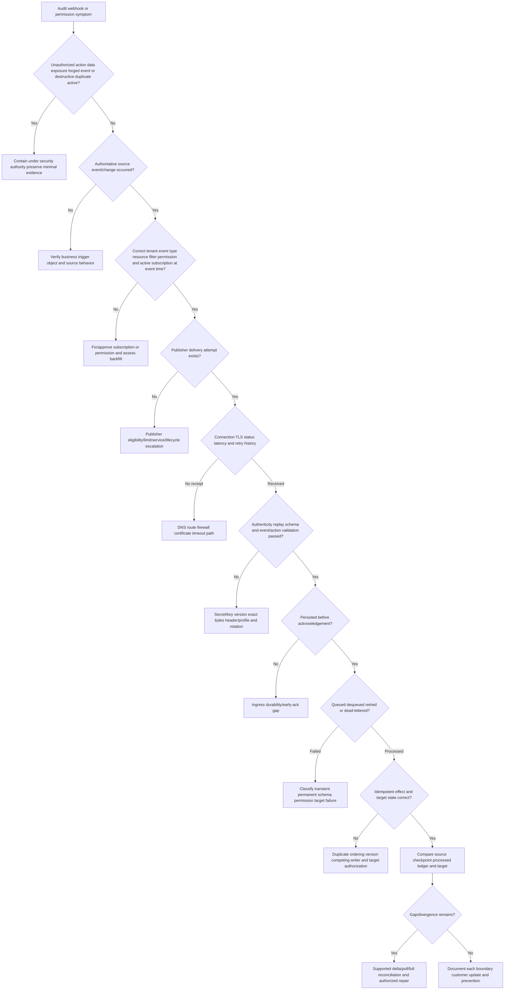

## 33. Common failure modes

| Failure mode | Why it fails | Better behavior |
|---|---|---|
| One log is the truth for all stages | Each log observes one boundary | Event/delivery/processing/target ledgers |
| Display name correlates actor/object | Names change/collide | Stable IDs plus tenant/source |
| One timestamp tells sequence | Clocks/delays/retries differ | Event, attempt, receive, process, target times |
| “No event” means no change | Notification can be lost/ineligible | Source audit/state plus reconciliation |
| Publisher 2xx means target updated | Only HTTP acknowledgement | Queue/worker/effect/read-back evidence |
| 202 means completed | HTTP says accepted for processing | Track asynchronous status |
| Webhooks are exactly once | Timeouts/retries create ambiguity | At-least-once assumption, idempotency, reconciliation |
| Arrival order equals source order | Parallel/retry paths reorder | Versions/sequences/current-state checks |
| Dedup by display fields/hash only | Distinct events can look equal | Documented event/business operation key |
| Acknowledge before persistence | Crash loses accepted event | Durable accept then acknowledgement |
| Process synchronously in callback | Timeout/backpressure/retries | Fast validate/persist/queue/ack |
| Retry every error | Permanent failures loop | Classification, bounded backoff, DLQ |
| DLQ is archival | Failed events remain unresolved | Owner/alert/remediation/replay/reconciliation |
| IP allowlist proves publisher | Addresses change/spoofing boundaries | Publisher-defined cryptographic/auth validation plus defense in depth |
| TLS proves payload authenticity | TLS authenticates endpoint/channel, not every business publisher context | Signature/token/state/mTLS profile |
| Hash payload with secret manually | Ad hoc cryptography is unsafe | Maintained HMAC/signature library/profile |
| Parse JSON before signature check | Re-encoding can change exact bytes | Verify profile over exact raw bytes |
| Disable verification during outage | Enables forged business events | Fix key/path/bytes/rotation issue |
| Signature prevents replay | Old valid message can replay | Timestamp/delivery ID/nonce/dedup per contract |
| Subscription future expiry means healthy | Permission/token/service removal separate | Lifecycle/grant/use monitoring |
| Consent means every event is visible | Scope/filter/resource/payload differ | Permission-to-event map |
| Broad subscribe/read/write for support | Expands data/blast radius | Minimum events, fields, resources, actions |
| Log full payload for debugging | Leaks content/secrets/PII | Metadata/fingerprints and approved protected evidence |
| Immutable label proves integrity | Storage/control details matter | Document tamper evidence, access, gaps, keys, retention |
| Replay fixes missing state | Can duplicate/stale overwrite | Idempotent replay plus current-state reconciliation |

## 34. Escalation packet

| Section | Required content |
|---|---|
| Impact | Missing/excess/late action, affected count, security/data/availability risk |
| Boundaries | Source, publisher, subscription, endpoint, queue, worker, target, tenant/environment |
| Source event | Event type/ID, actor/object IDs, event/recorded UTC, outcome, schema |
| Subscription | ID, events/resource/filter, endpoint class, active/expiry history, owner |
| Permissions | Identities, consent/grant/scope names, changes/lifecycle state |
| Delivery | Delivery/attempt IDs, attempt UTC, response/status/latency, retry/throttle |
| Validation | Profile/header version, key/secret ID, stage/error, payload fingerprint/length |
| Processing | Queue ID, enqueue/dequeue, worker operation, retries/DLQ, schema version |
| Effect | Target correlation/status/version/read-back and competing writers |
| Reconciliation | Checkpoint, expected/processed/target counts/IDs, repair result |
| Privacy | No secret/signature/token/header/payload; approved redaction/location |
| Ask | Exact publisher/network/identity/application/target decision or fix |

## Safe synthetic lab: The Event Relay Control Room 065

### Objective

Build a local paper model for audit events, webhook subscription eligibility, delivery attempts, authenticity metadata, acknowledgement, queues, processing, target effects, reconciliation, and permissions. The unique lab is **The Event Relay Control Room 065**.

The lab uses invented event IDs, delivery IDs, timestamps, status codes, field names, fingerprints, and permission names. It does not create a server, endpoint, subscription, secret, HMAC, signature, key, token, API request, webhook delivery, queue, tenant change, or customer event.

### Prerequisites

- Local Markdown editor or spreadsheet only.
- This Part and fictional IDs prefixed `EVT-065`, `DEL-065`, `SUB-065`, `REQ-065`, `TRACE-065`, `QUEUE-065`, `OP-065`, `OBJ-065`, `ACTOR-065`, and `CASE-065`.
- Reserved text-only hosts `publisher-065.example.test`, `receiver-065.example.test`, and `target-065.example.test`.
- No browser listener, local server, tunnel, webhook forwarding service, API client, identity portal, subscription, secret manager, queue, network request, signature, token, private key, payload, or customer data.
- Artifact label: **local/public lab - synthetic audit/webhook/permission metadata only**.
- Record start UTC, zero-credential/payload statement, zero-live-system statement, and source date August 24, 2026.

### Synthetic event and delivery starter

| Event ID | Delivery ID/attempt | Event UTC | Delivery UTC/status | Processing/target |
|---|---|---|---|---|
| `EVT-065-A` | `DEL-065-A/1` | `10:00:00Z` | `10:00:02Z / 202` | Queued/success |
| `EVT-065-B` | `DEL-065-B/1,2` | `10:01:00Z` | Timeout then 202 | Duplicate safely deduped |
| `EVT-065-C` | none | `10:02:00Z` | Not attempted | Subscription filter gap |
| `EVT-065-D` | `DEL-065-D/1` | `10:03:00Z` | 202 | DLQ permission error |

### Lab steps

1. Create the cover with artifact label, UTC, authorization/safety boundary, experience labels, and zero endpoint/credential/payload statement.
2. Define event, action, outcome, audit/application/access/delivery logs, publisher, consumer, endpoint, subscription, queue, DLQ, checkpoint, idempotency, and reconciliation.
3. Draw source-audit-publisher-delivery-ingress-queue-worker-target-reconciliation boundaries.
4. Build a vantage-point matrix stating strongest conclusion and non-conclusion for eight log sources.
5. Create 30 fictional source events with when/where/who/what/outcome/correlation/schema/privacy fields.
6. Replace display identifiers with stable actor/object IDs and explicit tenant/source namespaces.
7. Build an identifier dictionary for event, delivery, attempt, subscription, request, trace/span, queue, operation, target, and checkpoint IDs.
8. Create a seven-timestamp ledger for each event: event, recorded, published, attempted, received/enqueued, processed, and target UTC.
9. Add clock source/precision/confidence and one deliberate clock-skew case.
10. Build log trust/integrity/privacy controls: source verification, sanitization, secure transport, access separation, tamper evidence, gap detection, retention, disposal.
11. Create four fictional subscriptions with tenant, resource, event types, filters, endpoint, validation profile, expiry, owner, lifecycle state, and permissions.
12. Model endpoint-validation success and explain five things it does not prove.
13. Build a webhook authenticity checklist using HTTPS, route/method/type/size, exact raw bytes, profile version, key/secret ID, maintained library, constant-time comparison, and replay metadata.
14. Model shared HMAC and signed-token approaches conceptually without values or calculations.
15. Create replay/redelivery cases using event, delivery, timestamp, nonce, resource version, idempotency, and subscription IDs.
16. Model durable acceptance: validate, persist event/dedup state, acknowledge, then async process.
17. Compare at-most-once, at-least-once, exactly-once claim, and effectively-once business effect.
18. Create idempotency designs for set status, upsert profile, create alert, add membership, counter, downstream notification, and delete.
19. Deliver events out of order and use source versions/current-state reconciliation to prevent stale overwrite.
20. Build response classification for 2xx, 4xx, timeout, conflict, 429/Retry-After, and 5xx with bounded backoff/jitter.
21. Create queue depth/age/retry/DLQ/duplicate/reconciliation metrics and alerts.
22. Move six events through transient retry, permanent failure, DLQ, repair, controlled replay, and reconciliation.
23. Build the permission-to-event evidence map for four business needs, with source and target identities separated.
24. Review owners, identities, source grants, consent, subscription, target grants, data, retention, trust material, use, and decommission.
25. Design shared-secret/signing-key overlap rotation using IDs only.
26. Model schema evolution with new optional field, enum, nullable field, action, larger batch, opaque ID, and version deprecation.
27. Run the troubleshooting tree for no attempt, timeout/duplicate, proxy signature failure, out-of-order state, 202/DLQ, and revoked permission.
28. Draft one customer update and one escalation with exact ask and no sensitive values.
29. Deliver a 90-second missing-event explanation, 90-second webhook reliability answer, and 60-second honesty boundary.
30. Validate source URLs/date, cleanup, privacy, zero-activity statement, and rubric.

### Expected evidence

- End-to-end source/delivery/processing/target diagram.
- Eight-source vantage-point matrix.
- Thirty fictional event records and stable-ID namespace map.
- Seven-timestamp/clock-confidence ledger.
- Log trust, integrity, privacy, retention, and disposal controls.
- Four subscription lifecycle records and endpoint-validation limits.
- Webhook authenticity/replay checklist without values.
- Delivery-semantics and durable-acknowledgement models.
- Seven idempotent business-effect designs.
- Out-of-order/version reconciliation exercise.
- HTTP/retry/backoff classification and queue/DLQ metrics.
- Six failure-to-replay cases.
- Permission-to-event maps and full permission review.
- Secret/key rotation and schema-evolution plans.
- Six troubleshooting cases, customer update, and escalation packet.
- Source ledger dated **August 24, 2026**.
- Spoken Microsoft-transfer, GitHub-learned, and Abnormal-unknown statements.

### Cleanup and privacy

- Confirm every actor, object, event, delivery, attempt, subscription, request, trace, queue, operation, target, permission, and case is fictional and includes `065`.
- Confirm all hosts use `example.test` and no functional URL/path, listener, callback, request, subscription, credential, signature, HMAC, secret, token, key, payload, or customer record exists.
- Remove real tenant/app/object/event/delivery/subscription/correlation IDs, names, emails, IPs, URLs, permission lists, payloads, screenshots, logs, and timestamps.
- Confirm no GitHub/Microsoft/Abnormal/admin console, endpoint, API client, tunnel, queue, secret manager, or network request was accessed.
- Delete the artifact if a credential, signature, event content, or customer identity cannot be reliably removed.
- Record cleanup UTC and: `Synthetic paper event-delivery exercise only; zero live endpoint, subscription, event, payload, token, signature, HMAC, secret, key, queue, request, permission change, tenant, or production activity.`

### Validation rubric

| Dimension | Fail | Developing | Pass |
|---|---|---|---|
| Evidence | One log is truth | Uses multiple logs | States vantage, strongest conclusion, trust, gaps, correlation |
| Event schema | Message text only | Actor/action/time | When/where/who/what/outcome/schema/tenant/privacy/IDs |
| Time | One timestamp | UTC timeline | Event/attempt/receive/process/target plus clock confidence |
| Subscription | Endpoint only | Events and expiry | Tenant/resource/filter/permissions/owner/lifecycle/history |
| Authenticity | IP/TLS only | Signature named | Exact bytes, profile, key ID, rotation, replay, library, no values |
| Reliability | Assumes once/order | Knows retry | Durable ack, idempotency, versions, backoff, DLQ, reconciliation |
| Permissions | “Consent granted” | Lists scopes | Source/subscription/payload/retrieval/target/audit least privilege |
| Privacy | Raw payload/log | Manual redaction | Metadata-first, pre-ingest redaction, access, retention, disposal |
| Troubleshooting | Resubscribe/replay | Checks attempt | Source eligibility through target plus reconciliation/precise ask |
| Honesty/safety | Live webhook claim | Says learned | Paper-only; Microsoft transfer, GitHub learned, Abnormal unknown |

## 35. Official Source Anchors

All sources were verified and recorded with guide currency date **August 24, 2026**. HTTP and HMAC sources anchor protocol/message-authentication concepts; current product docs define real delivery, validation, retries, permissions, and lifecycle. Those product contracts must be revalidated before use.

| Official or primary source | What it anchors | Boundary |
|---|---|---|
| [RFC 9110 - HTTP Semantics](https://www.rfc-editor.org/rfc/rfc9110.html) | HTTPS authority, methods, 2xx/202, 4xx/5xx, idempotency, Retry-After, privacy of logs/URIs | Webhook retry contract is product-specific |
| [RFC 2104 - HMAC](https://www.rfc-editor.org/rfc/rfc2104.html) | Keyed message-authentication-code integrity/shared-key concept | Old examples are not current algorithm-selection guidance; use product/library profile |
| [OWASP Logging Cheat Sheet](https://cheatsheetseries.owasp.org/cheatsheets/Logging_Cheat_Sheet.html) | Security logging purposes, when/where/who/what, correlation, exclusion, sanitization, protection, retention, verification | Secondary implementation guidance |
| [GitHub Docs - Best practices for webhooks](https://docs.github.com/en/webhooks/using-webhooks/best-practices-for-using-webhooks) | Minimum subscriptions, HTTPS, secret, fast response/queue, event/action checks, delivery ID/redelivery | GitHub profile only; learned architecture |
| [GitHub Docs - Validating webhook deliveries](https://docs.github.com/en/webhooks/using-webhooks/validating-webhook-deliveries) | Current HMAC-SHA256 profile, exact payload, secure secret, constant-time comparison, proxy/encoding failures | Do not copy example values into production; use official libraries |
| [GitHub Docs - Troubleshooting webhooks](https://docs.github.com/en/webhooks/testing-and-troubleshooting-webhooks/troubleshooting-webhooks) | Attempt-versus-no-attempt, timeout, certificate/network, out-of-order, delay, signature troubleshooting | GitHub timing/limits are not universal |
| [Microsoft Graph - Receive change notifications through webhooks](https://learn.microsoft.com/en-us/graph/change-notifications-delivery-webhooks) | Current endpoint validation, acknowledgement/queue, retries, slow/drop behavior, subscription renewal, clientState, firewall concepts | Microsoft Graph profile; no candidate ops claim |
| [Microsoft Graph - Lifecycle notifications](https://learn.microsoft.com/en-us/graph/change-notifications-lifecycle-events) | Reauthorization, removed/missed events, renew/recreate, delta/full resync | Resource support and behavior can change |
| [Microsoft Graph - Change notifications with resource data](https://learn.microsoft.com/en-us/graph/change-notifications-with-resource-data) | Current encrypted resource data, authenticity validation, key overlap/rotation, resource limitations | Security-sensitive implementation belongs to maintained libraries/current docs |

### Source-use discipline

- Treat HTTP response semantics and publisher delivery guarantees as separate contracts.
- Follow publisher-specific signature/authentication libraries and verify exact raw bytes.
- Design consumers for duplicates, delay, reordering, and gaps even when normal delivery looks clean.
- Reconcile authoritative source to processed/target state; webhook absence is not proof of no change.
- Record metadata, IDs, fingerprints, stages, and UTC; exclude secrets, signatures, tokens, and unnecessary payload.
- Keep Abnormal event, permission, signature, retry, and retention behavior explicitly unknown.

## Likely Interview Questions

### Q1. What is the difference between an audit event and a webhook delivery?

**Model answer:** An audit event records an attributable source action/change under the source system's model. A webhook delivery is an attempt to notify a subscribed consumer about an eligible event. The audit can exist with no delivery; a delivery can be acknowledged while downstream processing later fails. I correlate source, publisher, ingress, queue, worker, target, and reconciliation ledgers.

### Q2. Which fields make an integration event useful for troubleshooting?

**Model answer:** I want when, where, who, what, outcome, and correlation: source event and recorded UTC, tenant/environment/service, stable actor/client and object IDs, event/action/change fields, success/failure/reason, schema version, and event/delivery/subscription/request/trace IDs. I also record receive, queue, process, and target times because one timestamp cannot represent the pipeline.

### Q3. How do you secure a webhook endpoint?

**Model answer:** Use HTTPS and certificate validation, a narrow route/method/content type, request-size limits, publisher-specific authenticity/integrity validation over exact raw bytes using maintained libraries, secure key/secret storage and rotation, constant-time tag comparison where applicable, replay/delivery-ID controls, schema/event allowlists, least privileges, fast durable queueing, redacted logs, and monitoring/reconciliation.

### Q4. Why must a webhook consumer be idempotent?

**Model answer:** The publisher can retry when acknowledgement is lost or an endpoint times out, so the same logical event can arrive more than once. The consumer needs a documented event/business operation key and should persist completion with the effect where possible. State-setting/upsert and source-version checks are safer than toggles, increments, or blind append.

### Q5. Does returning 202 mean the event was processed?

**Model answer:** No. HTTP 202 means accepted for processing, not completed. For a webhook it can tell the publisher to stop retrying once the consumer has durably accepted the event under the product contract. I still trace queue, worker, retry/DLQ, target result, and reconciliation before claiming business success.

### Q6. How would you investigate a missing webhook event?

**Model answer:** Prove the source event and expected behavior, then verify tenant, event/resource/filter, permission, and subscription active window. Check whether the publisher attempted delivery. If so, trace DNS/TLS/status/latency/retries, consumer validation and durable ingress, queue, worker/DLQ, target, and reconciliation. If no attempt exists, focus on eligibility, publisher limits/health, or lifecycle rather than the endpoint.

### Q7. How are integration permissions related to event delivery?

**Model answer:** Permissions and subscriptions are separate. A control-plane identity needs enough privilege to create/renew a scoped subscription; the subscription selects resources/events/filter and endpoint; the callback validates publisher identity; a worker can need separate least-privileged read permission for details and write permission for target effects. Consent or future subscription expiry alone does not prove all stages remain authorized.

### Q8. What are your experience and evidence-handling boundaries?

**Model answer:** I bring Microsoft production support, identity, timeline, and escalation practices as transfer. I studied Graph and GitHub webhook architecture and built a metadata-only paper lab, but I am not claiming production webhook implementation. I never request secrets, signatures, tokens, keys, authorization headers, or sensitive payloads, and Abnormal-specific behavior remains unknown without approved docs.

## Memory Hooks

- **Audit says source action; delivery says notification attempt.**
- **Every log is a witness at one doorway.**
- **When, where, who, what, outcome, correlation.**
- **Event ID is not automatically delivery ID.**
- **Event time, attempt time, receive time, process time, target time differ.**
- **Webhook rings; queue receives; worker acts; reconciliation proves.**
- **Endpoint validation is setup proof, not processing proof.**
- **TLS protects channel; publisher profile authenticates message.**
- **Verify exact bytes before transformation.**
- **Signature blocks tampering, not replay by itself.**
- **Lost acknowledgement creates duplicate delivery.**
- **Durable accept before 2xx; async work after.**
- **202 is accepted, not completed.**
- **Arrival order is not source order.**
- **Idempotency makes retries converge.**
- **DLQ needs an owner, repair, replay, and reconciliation.**
- **Permission allows; subscription selects; target permission acts.**
- **No webhook is never proof of no source change.**

## Completion Checklist

- [ ] I can state the Section goal and multi-ledger correlation rule.
- [ ] I can define event, audit/application/access/delivery logs, webhook, subscription, queue, DLQ, checkpoint, idempotency, and reconciliation.
- [ ] I can state each log's vantage point, strongest conclusion, and non-conclusion.
- [ ] I can design when/where/who/what/outcome/correlation event fields.
- [ ] I can distinguish stable IDs from display values and namespace them.
- [ ] I can distinguish event, delivery, attempt, subscription, request, trace, queue, operation, and target IDs.
- [ ] I can build event/record/publish/attempt/receive/process/target UTC timelines.
- [ ] I can explain clock confidence, correlation versus causation, and schema provenance.
- [ ] I can explain log access, sanitization, integrity/tamper evidence, retention, privacy, and disposal.
- [ ] I can explain webhook/polling/hybrid and subscription lifecycle.
- [ ] I can explain endpoint-validation limits.
- [ ] I can explain HTTPS, profile-specific HMAC/signature validation, exact raw bytes, rotation, and replay defenses without values.
- [ ] I can separate authenticate, validate, persist, acknowledge, queue, process, effect, and reconcile.
- [ ] I can compare at-most-once, at-least-once, exactly-once claims, and effectively-once effects.
- [ ] I can design idempotency and safe out-of-order handling.
- [ ] I can classify HTTP/retry/backoff/DLQ behavior.
- [ ] I can reconcile source/checkpoint/processed/target state.
- [ ] I can map source/subscription/payload/retrieval/target/audit permissions.
- [ ] I can investigate no-attempt, timeout/duplicate, signature, ordering, DLQ, and revoked-permission cases.
- [ ] I completed or can explain **The Event Relay Control Room 065**.
- [ ] The lab includes Prerequisites, Expected evidence, Cleanup and privacy, and Validation rubric.
- [ ] I used no live endpoint, subscription, event, payload, credential, signature, key, request, queue, or permission change.
- [ ] I can state Microsoft transfer, GitHub learned, and Abnormal unknown boundaries.
- [ ] I checked Official Source Anchors and recorded **August 24, 2026**.
- [ ] I can answer exactly Q1-Q8.

[Next: Part 066 - Microsoft 365 Integration Architecture and Troubleshooting](Part-066-microsoft-365-integration-architecture-and-troubleshooting.md)