# Part 066 - Microsoft 365 Integration Architecture and Troubleshooting

## Section goal

This Part builds a support-ready mental model for a third-party SaaS integration with Microsoft 365. Microsoft 365 is not one server or database. A case can cross Microsoft Entra ID for tenant identity, application instances, consent, token issuance, Conditional Access, and sign-in evidence; Microsoft Graph or a service-specific API for resource data; Exchange Online for mailboxes and mail behavior; Microsoft Defender services for security signals; Microsoft Purview for audit and compliance evidence; Microsoft 365 service health for platform incidents; and the third-party connector for subscriptions, checkpoints, ingestion, transformation, and target state.

The owning-object distinction is crucial for multitenant SaaS. The software vendor registers an application object in its **home tenant**. When a customer authorizes the multitenant application, Microsoft Entra creates or uses a **service principal** in the customer's tenant. That local service principal represents the application instance and holds tenant-specific grants, policy effects, enablement, owners, sign-in evidence, and resource access relationships. The application/client ID can be the same across customers, but each customer has a distinct tenant ID and service-principal object ID.

Consent is not a token and not a guarantee that an API call will succeed. Consent/grant authorizes specific delegated scopes or application roles under the tenant's controls. Token acquisition then authenticates the client and obtains an access token for a resource. The resource validates the token and enforces runtime authorization, licenses, resource-specific rules, application access policies/RBAC, object state, throttling, and service availability. An integration can therefore show “admin consent granted” while token acquisition or data access still fails.

The central troubleshooting rule is:

> Identify customer tenant, vendor application, local service principal, access mode, credential or federated trust, exact resource and operation, granted permission, token result, resource result, source-service state, audit/service-health evidence, connector checkpoint, and target state before changing consent, permissions, credentials, policy, or data.

This Part covers Microsoft 365 service boundaries; Microsoft Entra application objects/service principals; single- versus multitenant context; delegated versus app-only access; user/admin consent; Graph permissions; other authorization systems; token and resource audiences; Graph/service-specific data planes; mailbox, mail-flow, security, audit, and service-health evidence; pagination; delta/change notification concepts; errors; throttling; Retry-After; retention/privacy; and end-to-end connector troubleshooting. It does not provide tenant setup, admin-consent URLs, credentials, runnable Graph/PowerShell commands, API requests, permission-change instructions, live endpoint tests, or customer data. The lab is a paper architecture and evidence matrix only.

This is the guide area where your prior support background is a direct strength. Production experience can support statements about Microsoft cloud boundaries, tenant-aware triage, incident ownership, identity/configuration evidence, service health, and Engineering escalation. It must not be inflated into owning a Microsoft Graph app, Purview program, Exchange connector, Defender integration, or Abnormal Microsoft 365 implementation without a real example. Abnormal's actual onboarding flow, app ID, service principal, permission set, APIs, Exchange/Defender/Purview dependencies, data path, subscription model, checkpointing, and logs remain proprietary unknowns unless approved documentation states them.

## Learning outcomes

After completing this Part, you should be able to:

- explain Microsoft 365 as multiple identity, productivity, security, compliance, API, and health services;
- distinguish Microsoft Entra tenant/directory, home tenant, customer tenant, application object, service principal, managed identity, and enterprise application;
- explain why one multitenant app ID maps to different service-principal object IDs and grants in customer tenants;
- distinguish delegated access from app-only access and explain the user-plus-app authorization intersection;
- distinguish delegated scopes, application permissions/app roles, user consent, admin consent, app-role assignment, OAuth permission grant, Exchange RBAC, Entra RBAC, and resource-specific controls;
- explain client credential/federated identity, token acquisition, access-token audience, claims, and resource authorization checkpoints;
- map a business requirement to a specific Microsoft resource, least-privileged permission, data fields, retention, and downstream action;
- separate mailbox data, message transport/mail flow, mailbox audit, unified audit, security alerts/incidents, service health, and Message center/change communications;
- explain Microsoft Graph as a major unified API surface without assuming every Microsoft 365 operation or product feature is exposed identically;
- trace pagination, projection, delta/change-notification, checkpoint, retry, and reconciliation behavior;
- classify Graph 400/401/403/404/409/410/412/429/5xx results and use machine-readable codes/request IDs/UTC safely;
- handle throttling through Retry-After/backoff and reduce polling/overbroad data retrieval;
- use Entra sign-in/audit, Purview audit, Exchange/mail evidence, Graph request evidence, service health, connector logs, and target read-back at their correct vantage points;
- distinguish a tenant-specific issue, identity/consent issue, credential/token issue, resource/policy issue, Microsoft service issue, connector issue, and target issue;
- build a safe escalation packet for Microsoft, identity administrators, Exchange/security owners, or the SaaS Engineering team; and
- state production-transfer and proprietary boundaries honestly.

## JD Mapping

| Supplied role signal | Capability built | Your transferable evidence | Boundary |
|---|---|---|---|
| Microsoft 365 ecosystem | Uses tenant, Entra identity, Graph, Exchange, audit, health, and admin evidence correctly | Direct enterprise support strength | Do not claim connector ownership |
| Enterprise integrations | Traces multitenant app instance, consent, token, resource, ingestion, and target state | Configuration and cloud troubleshooting | Vendor implementation remains unknown |
| SaaS Security | Reviews app-only access, least privilege, credentials, grants, audit, and residual data | Identity/security transfer | No Abnormal security architecture claim |
| Complex cases | Separates Microsoft service, customer tenant, connector, and target hypotheses | critical situation, escalation, RCA | No invented Microsoft 365 incident |
| API support | Interprets Graph errors, request IDs, paging, throttling, and change tracking | HTTP/REST/JSON working knowledge | Lab performs no API call |
| Customer communication | Converts multi-service evidence into a clear timeline and owner map | enterprise case ownership | No credential/raw mailbox collection |
| Mail/security concepts | Separates mailbox, mail flow, audit, and security signal planes | Microsoft domain familiarity | Exact Abnormal dependency unknown |
| Engineering collaboration | Produces permission-to-operation and symptom-to-boundary matrices | Escalation discipline | Precise ask, not “Microsoft is broken” |

## Candidate honesty note

| Evidence tier | Safe statement | Do not imply |
|---|---|---|
| **Production transfer - Microsoft** | “I have production enterprise support experience with tenant-aware configuration, identity, service health, evidence, escalations, and customer communication.” | That you administered every Microsoft 365 product or Graph app |
| **Local/public lab** | “I built a synthetic multitenant app/service-principal, consent, API, and connector evidence map without a tenant or API call.” | A real enterprise app, consent, token, mailbox, alert, or connector |
| **Current official-doc study** | “I verified Graph, Entra, Purview, and service-health concepts against Microsoft Learn.” | Production ownership of those integrations |
| **Reasoned architecture** | “I can map likely planes and test them, while treating product-specific dependencies as hypotheses.” | That generic Microsoft architecture is Abnormal's design |
| **Proprietary unknown** | “Abnormal's app, permissions, APIs, mailbox/security data path, cadence, and logs require approved docs.” | Private settings or tenant changes |

Safe interview language:

> “My advantage is knowing how to make a Microsoft cloud case tenant- and service-specific. I would correlate the customer tenant ID, vendor app ID, local enterprise-app/service-principal object ID, access mode, grant, credential metadata, token result, resource/API result, Entra and Purview/Exchange evidence, Microsoft service health, connector checkpoint, and target state. I would request IDs, permission names, status codes, request IDs, and UTC, never a token, secret, private key, mailbox export, or unrestricted audit bundle.”

## 1. Microsoft 365 is a service graph, not one product

Microsoft 365 combines identity, messaging, collaboration, security, compliance, management, and API surfaces. A connector symptom should be assigned to a plane before diagnosis.

| Plane/service | Owns or exposes | Example integration evidence | Does not prove alone |
|---|---|---|---|
| Microsoft Entra ID | Tenant identities, app instances, grants, token issuance, sign-ins/audit | Tenant/app/SP IDs, consent, sign-in result | Mail/security data retrieval succeeded |
| Microsoft Graph | API gateway to many Microsoft cloud resources | Request ID, API path class, HTTP/error code | Every M365 feature/operation available |
| Exchange Online | Mailboxes, messages, transport/mail behavior, mailbox permissions | Mailbox/resource IDs, message trace/audit where applicable | Third-party connector ingested event |
| Microsoft Defender services | Security alerts/incidents/policies by product | Alert/incident IDs and service audit | Connector permission/checkpoint healthy |
| Microsoft Purview Audit | Searchable cross-service audit records under licensing/retention | Operation, actor, object, UTC | Real-time event delivery |
| Microsoft 365 Service health | Tenant-relevant incidents/advisories | Issue ID, service, start/status/impact | This tenant symptom matches exactly |
| Message center | Planned changes/announcements | Message/change ID and dates | Active outage evidence |
| Third-party SaaS connector | Authorization workflow, subscriptions/polling, ingestion, mapping, checkpoint | Connector ID/status/last success/error | Microsoft source state by itself |
| Target SaaS datastore/UI | Processed data and customer-visible state | Target record/count/read-back | Which upstream stage failed |

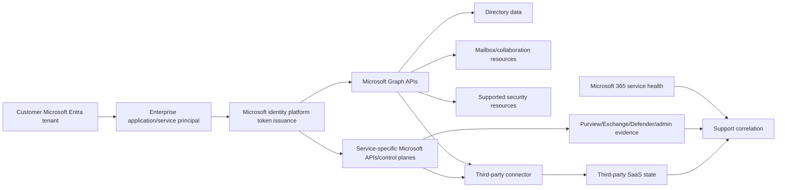

## 2. Tenant and cloud boundaries

A **tenant** is an organization's Microsoft Entra directory/security boundary and identity context. Store tenant ID separately from primary domain/display name because domains and branding are not immutable identity. Microsoft cloud environments/sovereign clouds can have different authorities, endpoints, availability, and documentation; never assume worldwide-commercial endpoints for every tenant.

| Tenant field | Why |
|---|---|
| Tenant ID | Stable directory correlation |
| Cloud/environment | Authority/resource endpoint and feature availability |
| Primary/verified domains | Human routing/context, not identity proof |
| Customer organization | Case/account correlation |
| License/service plan | Feature, retention, API/audit availability |
| Region/multigeo context | Data/audit/service behavior caveats |
| Admin/security policy | Consent, Conditional Access, app restrictions |
| Service health scope | Tenant-relevant issue evidence |

## 3. Application object versus service principal

An **application object** is the application's registration/blueprint in its home tenant. A **service principal** is the local security principal/application instance in a tenant where the app is used. The service principal defines what that application instance can do in that customer tenant and is listed under Enterprise applications.

| Object/value | Location/owner | Cardinality | Support use |
|---|---|---|---|
| Application object | Vendor/app home tenant | One per registration | Global app definition, app/client ID |
| Application/client ID | App registration | Same logical app across tenants | Identify vendor application |
| Home tenant ID | Vendor/app publisher tenant | One home context | Locate application object/publisher |
| Service principal | Each customer tenant | One or more local instances as designed | Local identity, enablement, grants, sign-ins |
| Service-principal object ID | Customer tenant | Unique local object | Query exact enterprise app/grants/audit |
| App role assignment | Customer tenant | Many grants | Application permission consent/grant |
| OAuth2 permission grant | Customer tenant/user/org | Many delegated grants | Delegated scope consent |

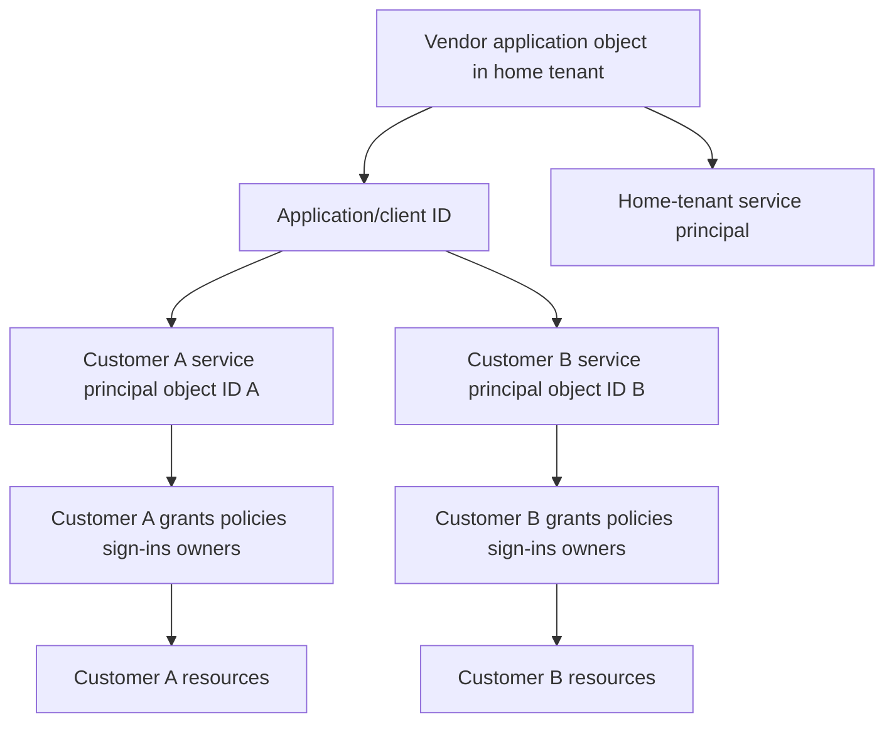

## 🔍 Plain-English deep-dive: The application object is a franchise blueprint; the service principal is the local branch

A franchise company has one brand blueprint at headquarters. Each city has a local branch with its own lease, employees, permissions, operating status, and inspection history. The brand number can be common, while each branch has a different local record ID.

For a multitenant Microsoft application, the home-tenant application object is the blueprint. Consent creates or uses a local service principal in the customer tenant. Customer-specific grants, enablement, policies, and sign-in events attach to that local instance. Looking only at the vendor app ID can identify the product but not prove which customer object or permission changed.

The analogy stops because properties can be inherited or independently governed under Microsoft Entra rules. The support lesson is exact: always collect tenant ID, app/client ID, service-principal object ID, access mode, grant IDs/types, and relevant UTC.

**Memory cue:** App object defines; service principal operates locally.

## 4. Single-tenant and multitenant context

A single-tenant app is intended for one directory context. A multitenant app can be used by other customer tenants, each with a local service principal after consent/use. “Multitenant” does not mean the app can automatically access every tenant; every customer tenant has its own authorization and instance.

| Question | Why |
|---|---|
| Who owns the home application object? | Vendor/application publisher responsibility |
| Is the app configured for intended account types/cloud? | Sign-in/consent compatibility |
| Does the customer service principal exist? | Local instance baseline |
| Is local sign-in/assignment enabled? | Token/sign-in behavior |
| Which permissions are actually granted locally? | Customer authorization |
| Which credential/trust authenticates vendor workload? | Token acquisition |
| Which tenant authority is used? | Prevent wrong-tenant token |
| Which resource audience is requested? | Prevent wrong-resource token |

## 5. Delegated versus app-only access

With **delegated access**, a signed-in user is present and both the application and the user must be authorized. Delegated permissions are scopes. With **app-only access**, the workload acts as itself without a user and uses application permissions/app roles or another resource authorization model. Background connectors commonly need app-only behavior, but the actual product design must be verified.

| Dimension | Delegated | App-only/application |
|---|---|---|
| Actor | App on behalf of signed-in user | Service principal/workload itself |
| Permission representation | Delegated scopes | Application permissions/app roles |
| Effective access | App scope intersect user/resource privilege/policy | App grant plus resource policy/RBAC |
| Consent | User or admin depending permission/policy | Admin/resource owner according to model |
| Use | Interactive/user-context operations | Background automation/tenant-scale service |
| Main risk | Confused user context/excess delegated consent | Broad unattended tenant access |
| Evidence | User + client/service principal + scopes | Service principal + app roles |

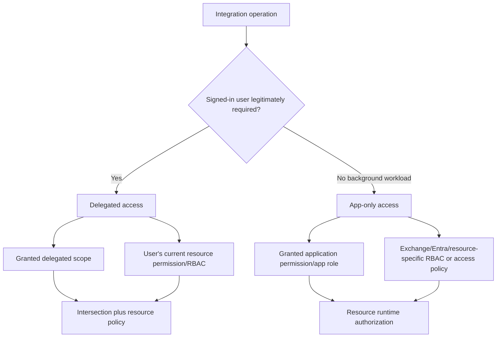

## 6. Consent and grants

Consent is the authorization process in which a user/admin permits a client application to access a protected resource. Application permissions and many high-impact delegated permissions require admin consent. Customer policies can restrict user consent or require workflows. Consent artifacts must be distinguished from “configured permissions” on the vendor application registration.

| Layer | Meaning | Misread |
|---|---|---|
| App requests/configures permission | Vendor says app may request it | Customer granted it |
| Consent prompt | Proposed client/resource permissions | Token/access already active |
| OAuth2 permission grant | Delegated consent record | User can access every object |
| App role assignment | Application permission granted to service principal | Resource-specific RBAC/policy bypassed |
| Tenant admin role | Authority to consent/manage | App runtime permission itself |
| Resource-specific grant/RBAC | Additional resource authorization | Global Graph grant unnecessary/irrelevant |
| Token claims | Current issued grant representation | Grant cannot later be revoked |

## 7. Other authorization systems

Microsoft Entra consent is not the only authorization system. Microsoft Entra RBAC controls directory administration; Exchange Online RBAC and application RBAC can constrain Exchange operations; Teams can use resource-specific consent; workload-specific access policies and licenses can add constraints. A Graph application permission is not a universal bypass.

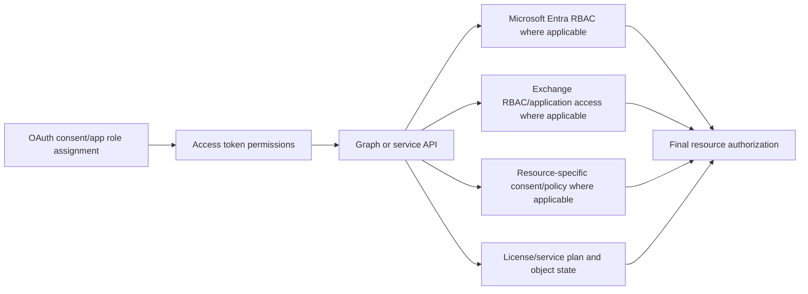

## 8. Credential or federated trust and token acquisition

The vendor workload must authenticate as the application/service principal through a supported method such as a managed/federated identity, certificate, or client secret. Credential lifecycle belongs to Part 064. Token acquisition then depends on correct tenant authority, client ID, credential/trust, requested resource, grant, app enablement, and policy.

| Token-acquisition checkpoint | Evidence without secrets |
|---|---|
| Tenant authority | Tenant ID/cloud/authority host class |
| Client identity | App/client ID and service-principal object ID |
| Credential | Type, credential/key ID, created/expiry, owner, last use |
| Federation | Issuer/subject/audience metadata and trust ID |
| Resource request | Intended audience/resource name |
| Grant | Delegated scope or app role names/IDs |
| Policy | Conditional Access/workload policy/result category |
| Result | Success/error code, sign-in/correlation/request ID, UTC |

## 9. Token audience and runtime API call

An access token is issued for a resource/audience. A token for Microsoft Graph cannot be assumed valid for Exchange Online PowerShell, a custom SaaS API, or another Microsoft resource. The resource server validates the token and request, then returns its own authorization/error result.

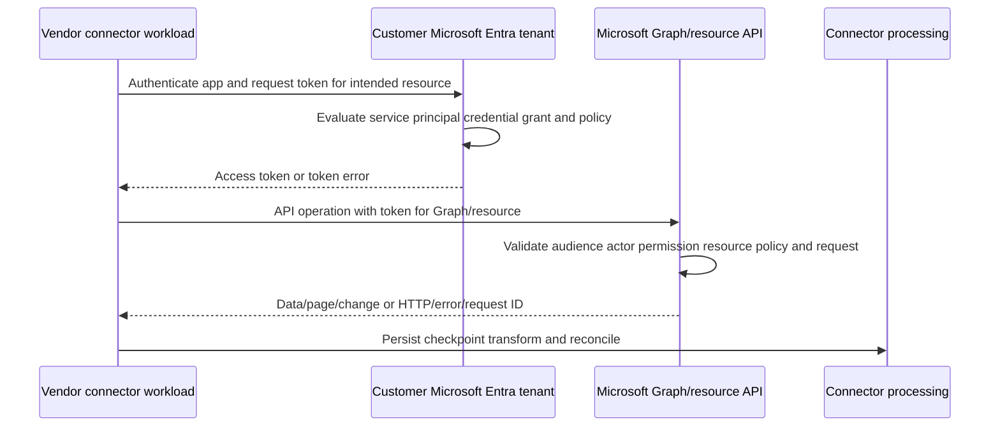

## 🔍 Plain-English deep-dive: Consent is a building permit, not an opened door or completed delivery

A city permit authorizes a company to perform a category of work. The contractor still needs valid identification, must arrive at the correct building, obey building-specific access rules, use valid equipment, and complete the job. A permit record does not prove the crew entered or the work passed inspection.

Microsoft consent/grants are similar. They authorize an app instance for defined scopes/roles. The workload must authenticate and obtain a resource-specific access token. The API then checks audience, permission, resource policy, object state, license, and request. The connector must still page, checkpoint, process, and write target state.

The analogy stops because Microsoft authorization is token- and policy-driven. The support lesson is exact: separate requested permission, granted permission, token acquisition, API authorization, source data, connector processing, and target outcome.

**Memory cue:** Consent grants potential; token carries current authorization; resource decides the operation.

## 10. Microsoft Graph and service-specific surfaces

Microsoft Graph is a protected API gateway for many Microsoft Entra and Microsoft 365 resources. It does not mean every administrative, compliance, transport, or security operation lives in one identical API model. Always identify the owning Microsoft service and current supported API/profile.

| Surface | Use concept | Support caution |
|---|---|---|
| Microsoft Graph REST/SDK | Directory, users/groups, mail/calendar/files/Teams/security resources as supported | Per-endpoint permissions, paging, limits, versions |
| Microsoft identity platform | Authentication/token issuance/consent | Not the resource data API |
| Exchange Online admin/RBAC | Messaging administration and resource authorization | Different audience/session/control plane |
| Purview portal/APIs | Audit/compliance search/export under roles/licenses | Not necessarily real-time; retention varies |
| Defender portals/APIs | Security product incidents/alerts/actions | Product licensing/schema/permissions vary |
| Microsoft 365 admin center | Tenant administration/service health/message center | Human/admin plane, not connector ingestion proof |

## 11. Mailbox data, mail flow, and audit are separate

A **mailbox** stores messages/folders and related resources. **Mail flow/transport** describes processing and movement of messages through Exchange Online transport. **Mailbox audit** records selected owner/delegate/admin mailbox actions. **Unified audit** aggregates many service activities for search under coverage/retention. A message's presence, transport trace, mailbox audit record, and third-party ingestion are different checkpoints.

| Question | Evidence plane |
|---|---|
| Was message submitted/routed/delivered by Exchange transport? | Message trace/mail-flow evidence under current support |
| Does message/resource exist in mailbox? | Exchange/Graph mailbox resource read under permission |
| Who accessed/moved/deleted/changed mailbox item? | Mailbox/Purview audit if operation/actor/time covered |
| Did app call Graph for message/attachment? | Entra app sign-in plus Graph request/resource audit where available |
| Did connector ingest/process it? | Third-party checkpoint/event/processing logs |
| Does target show security classification/action? | Third-party target state/audit |

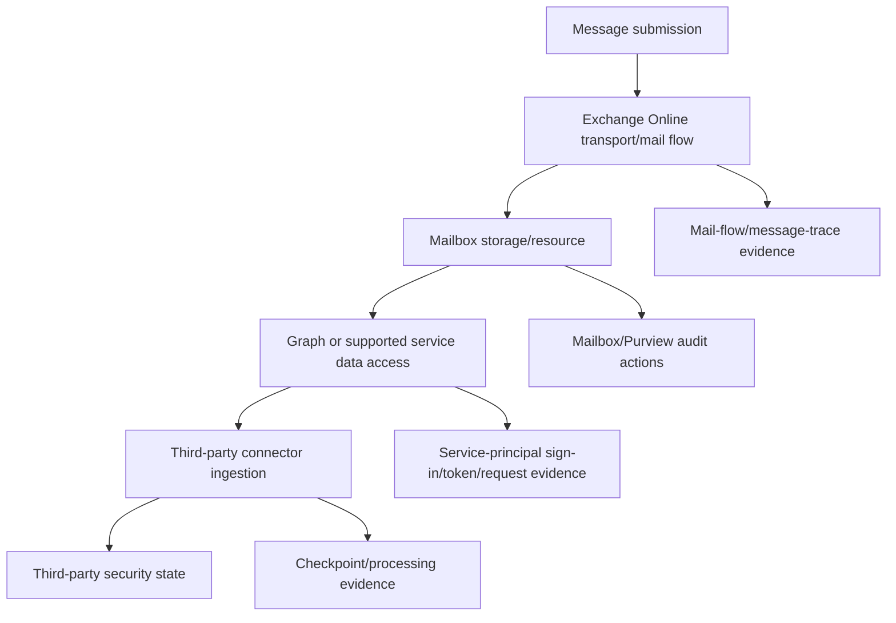

## 12. Mailbox audit expectations and caveats

Microsoft 365 mailbox auditing is on by default for supported mailbox types, but audited actions depend on sign-in type, defaults/customizations, license, mailbox type, bypass settings, geography, and operation. Absence of one audit record is not proof that no mailbox action occurred until coverage is verified.

| Coverage question | Why |
|---|---|
| Organization audit default enabled? | Baseline generation |
| Mailbox type supported? | User/shared/group differences |
| Owner/delegate/admin sign-in type? | Different audited actions |
| Operation included/default/customized? | Coverage gap |
| Audit bypass association? | Actor actions may not be logged |
| License/service plan? | Action/retention/search availability |
| Multigeo relationship? | Cross-geo caveats |
| Retention/search window? | Record may have aged out/not arrived |

## 13. Security data and incident/alert boundaries

Microsoft security products can expose alerts, incidents, entities, and evidence through current supported APIs. An alert is not automatically the same as an incident, raw event, mailbox message, or third-party detection. Products can correlate, update, merge, resolve, or retain records differently. The precise Abnormal-to-Microsoft security integration direction is unknown.

| Artifact | Plain meaning | Correlation needs |
|---|---|---|
| Raw activity/event | Low-level observed action/signal | Source/service/time/object |
| Alert | Product detection requiring review | Alert ID, provider, status, severity |
| Incident | Correlated group/case of alerts/evidence | Incident ID, alerts, timeline |
| Entity/evidence | User/device/message/IP/file context | Stable IDs and privacy |
| Third-party detection | Vendor-generated classification | Vendor event/message correlation |
| Remediation action | Change to object/account/message | Actor, approval, target, audit/result |

## 14. Purview audit search as evidence

Microsoft Purview Audit search provides cross-service activity records under roles, license, retention, operation coverage, and search behavior. Audit records can be delayed; Microsoft documents typical ranges but does not guarantee a fixed availability time. Search job completion and export limits are operational constraints, not evidence that absent activity never occurred.

| Audit factor | Support effect |
|---|---|
| Ingestion enabled | Whether new eligible audit records enter search |
| Audit role | Whether investigator can search/export |
| License/retention policy | Searchable historical window |
| Exact operation/record type | Query coverage and no-result interpretation |
| UTC range | Correct temporal scope |
| Search job state | Queued/in-progress/completed |
| Index/common schema versus data content | Keyword limitations |
| Service latency/outage | Record may appear later |
| Administrative-unit scope | Investigator may see subset |

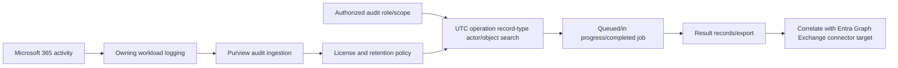

## 15. Service health and Message center

Microsoft 365 Service health lists tenant-relevant incidents/advisories and updates with issue ID, estimated start, affected service, impact, status, and progress. It is supporting evidence, not proof that every symptom has that cause. Message center describes planned changes and preparation, while service health focuses active/recent service issues.

| Evidence | Use | Boundary |
|---|---|---|
| Service health issue ID | Stable incident/advisory correlation | Match service/time/impact/tenant |
| Estimated start | Compare first-failure UTC | Estimate can change |
| User impact | Compare symptom/population | Connector behavior may differ |
| Affected service | Route owner/hypothesis | “Microsoft 365” is too broad |
| Status/updates | Incident progression | Customer-side recovery may lag |
| Issue origin | Microsoft versus customer environment indicator | Continue local evidence collection |
| History/post-incident report | RCA/context | Availability window limited by portal/history |
| Message center change | Planned change/migration | Not an active incident by itself |

## 🔍 Plain-English deep-dive: Service health is a weather report, not a diagnosis of every leak

Suppose a regional weather report says heavy rain began at 14:00. A homeowner found water at 14:15. The matching time and location make rain a strong hypothesis, but an inspector still checks the roof, pipes, and which rooms are affected. A weather report for another region is weak evidence; a clear report does not prove a small local cloudburst never happened.

Microsoft 365 Service health works similarly. A tenant-relevant incident or advisory should be matched to affected service, estimated start, customer population, operation, error pattern, and recovery. Graph request IDs, local connector failures, peer-tenant behavior, and source/target reconciliation remain necessary. A broad incident should not hide an expired credential, revoked grant, or one-node vendor defect.

The analogy stops because Microsoft can update scope, status, and estimated start as investigation develops. The support lesson is exact: record a service-health issue as a time-bounded hypothesis with supporting and contradicting evidence, then validate local recovery after the service reports restoration.

**Memory cue:** Health notices explain matching patterns; local evidence proves this case.

## 16. End-to-end connector state machine

An integration is healthy only if tenant identity, app instance, grant, credential, token, source resource, API change collection, processing, checkpoint, and target state all work. A “connected” UI can mean initial authorization succeeded but not continuous ingestion.

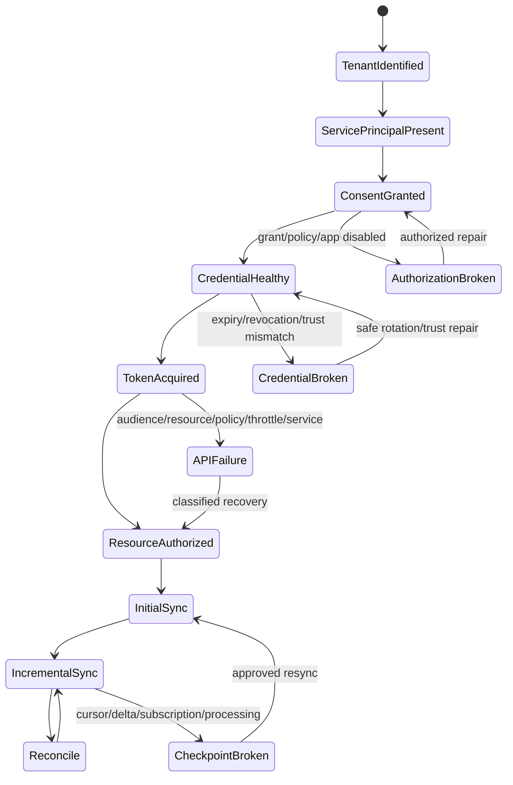

## 17. Initial versus incremental collection

An initial sync establishes in-scope resource state and checkpoint. Incremental mechanisms include delta queries, change notifications, service-specific feeds, or product polling. Microsoft recommends change tracking/notifications where supported rather than continuous full scans. Webhooks and delta are complementary: notification triggers, delta/reconciliation ensures completeness.

| Collection model | State | Main risks |
|---|---|---|
| Full scan | Enumerate all in-scope resources | Volume/throttling/privacy/time |
| Delta query | Follow opaque delta links/tokens | Expiry/reset/invalid cursor/pagination |
| Webhook notification | Receive change hint/event | Gaps/duplicates/order/subscription lifecycle |
| Audit/activity feed | Time/content window and checkpoint | Delay/retention/content availability |
| Hybrid | Webhook trigger plus delta/checkpoint/backstop | Two paths need correlation |

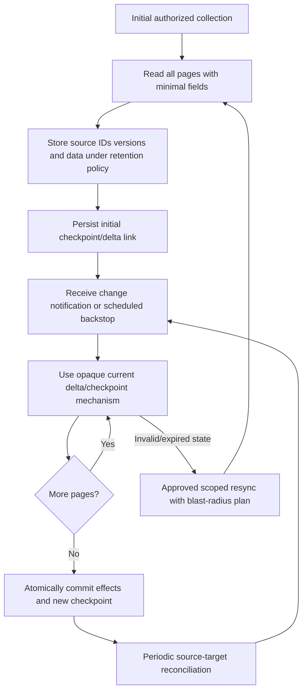

## 18. Pagination, projection, and opaque next links

Microsoft Graph collections can return multiple pages. Follow `@odata.nextLink` until absent and treat the returned URL as opaque. Use `$select`/supported projection to request only needed fields, reducing data, latency, processing, and privacy risk. Exact endpoint capabilities vary.

| Mistake | Consequence | Better behavior |
|---|---|---|
| Read first page only | Missing users/messages/alerts | Follow every nextLink |
| Reconstruct nextLink manually | Lose skip/state parameters | Treat full link as opaque |
| Request all properties | More PII, payload, latency | Minimum supported projection |
| Assume stable snapshot | Concurrent changes can shift state | Delta/version/reconciliation model |
| Persist nextLink as permanent | Link can expire/change | Use only under documented lifecycle |
| Log full URL/body | Sensitive query/resource data exposure | Redacted endpoint class and request ID |

## 19. Graph error anatomy

Microsoft Graph returns HTTP status plus JSON `error` with machine-readable `code`, human/developer `message`, optional nested `innerError`, and optional `details`. Code against documented codes, not message text. The deepest understood inner code can be most specific. Support should capture request ID/date/UTC safely.

| Field | Use | Boundary |
|---|---|---|
| HTTP status | Broad protocol class | Same status has many causes |
| `error.code` | Machine-readable category | Product/endpoint-specific codes exist |
| Nested `innerError.code` | More specific understood cause | Do not assume undocumented values stable |
| `message` | Human/developer context | Do not parse as contract/show raw to user |
| `details` | Per-operation/batch breakdown | Batch top-level 200 can contain failures |
| `request-id` | enterprise support correlation | Not a credential |
| `client-request-id` | Caller-generated correlation | Must be unique/logged per request |
| `date` | Service response time | Compare with client UTC and service health |

## 20. HTTP/error classification for Microsoft 365 integrations

| Result | Likely boundary | First checks |
|---|---|---|
| 400 | Request/schema/query | Endpoint/version/parameters/filter/page link |
| 401 | Token missing/invalid/wrong audience/expired | Token acquisition result, resource audience, clock |
| 403 | Permission/user privilege/license/policy/claims | Access mode, grant, user/resource RBAC, Conditional Access |
| 404 | Resource absent/wrong tenant/ID/not provisioned | Stable ID, object lifecycle, scope, eventual creation |
| 409 | State/concurrency conflict | Current object and conditional retry |
| 410 | Resource/cursor no longer available | Delta/checkpoint recovery contract |
| 412 | ETag/precondition mismatch | Read latest, reconcile, conditional update |
| 429 | Throttled | Retry-After, request pattern, app/tenant/service scope |
| 500 | Service internal failure | Request ID/date, bounded retry, service health |
| 503/504 | Service unavailable/upstream timeout | Retry-After/backoff/new connection as documented, health |

## 21. 401 versus 403

401 means the request lacks valid authentication credentials for the resource: wrong/missing/expired/malformed token, wrong audience, or validation problem. 403 means the service understood the authenticated request but refuses it: missing permission, user privilege, license, resource policy, Conditional Access claims challenge, or object-level restriction.

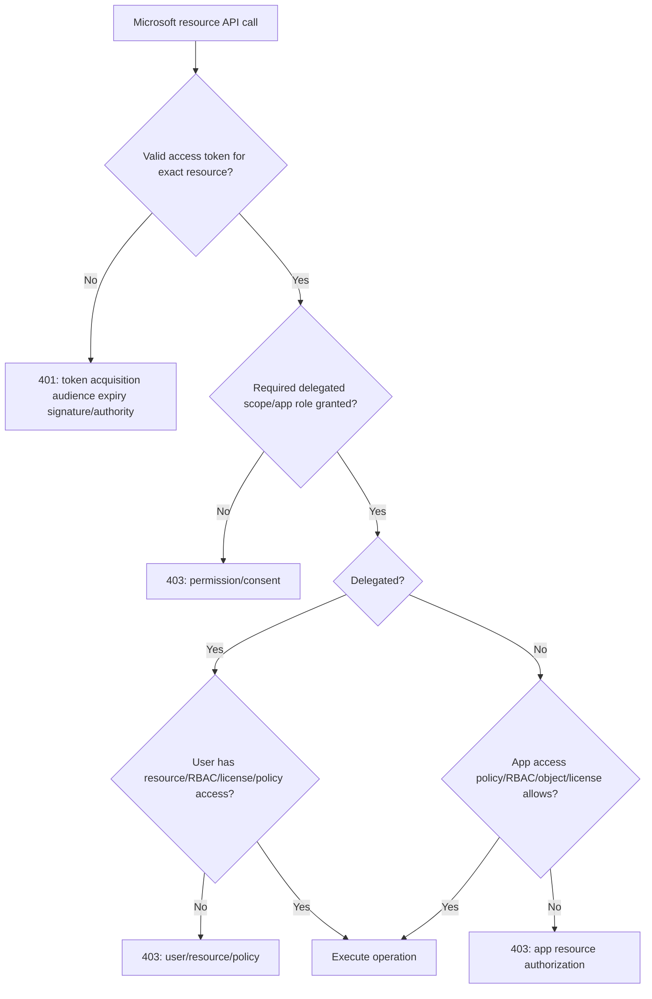

## 🔍 Plain-English deep-dive: 401 is the badge reader; 403 is the room policy

At a secure building, the lobby badge reader first checks whether the badge is genuine, current, and intended for this building. Failure there resembles 401. After the badge is accepted, each room checks whether that person or service is allowed inside. A valid badge can still be denied at the records room; that resembles 403.

In Microsoft Graph/resource calls, token validation includes resource audience and time. Authorization then evaluates scopes/app roles, user privileges, resource policy, licenses, and other controls. Asking for a new secret will not fix a missing mailbox permission; granting a broad role should not be used to hide a wrong-audience token.

The analogy stops because Conditional Access and claims challenges add protocol behavior. The support lesson is to identify the exact deny stage before changing anything.

**Memory cue:** 401 asks “is this credential valid here?”; 403 asks “may this valid actor do this?”

## 22. Throttling and retry discipline

Microsoft Graph can return 429 with `Retry-After`. Limits vary by operation, workload, app, and tenant; do not hard-code one universal threshold. Honor Retry-After, reduce frequency/volume, use projection, delta/change notifications, and product SDK retry handlers as appropriate. Continuous polling while throttled extends pressure.

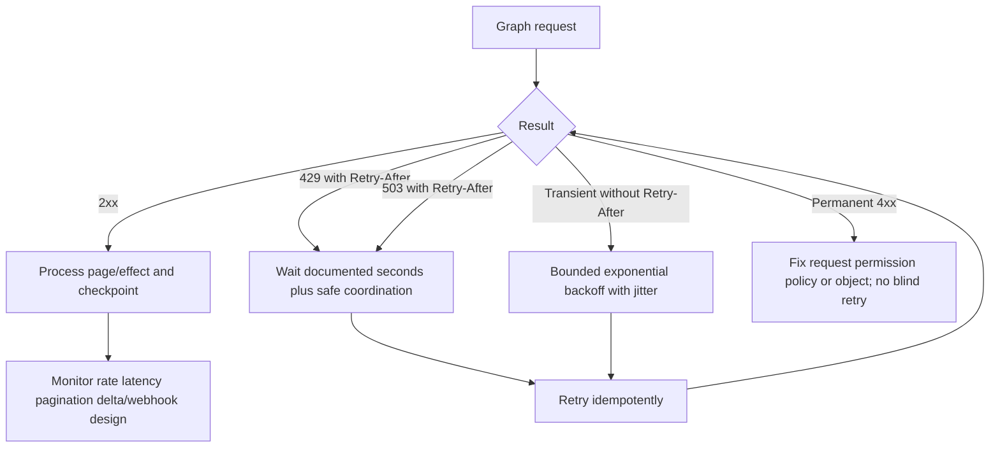

| Anti-throttle practice | Benefit |
|---|---|
| `$select`/minimum fields | Less payload/service work/privacy risk |
| Delta query | Avoid repeated full scans |
| Change notifications | Avoid tight polling |
| Backstop threshold | Completeness without constant polling |
| Cache stable metadata appropriately | Fewer repeated reads |
| Honor Retry-After | Fastest recovery and fairness |
| Bounded concurrency | Avoid burst overload |
| Per-operation batch result handling | Do not treat top-level batch 200 as all success |

## 23. Service health correlation versus local root cause

When errors spike, compare first/last failure UTC, affected tenant/population/service/API, Graph request IDs, and service-health issue. A posted incident strengthens a Microsoft-service hypothesis only when time, service, geography/tenant, and symptom align. One customer failure with healthy peer tenants often points to tenant-specific grants/policy/object state, though regional/service issues can be scoped.

| Pattern | Higher-priority hypothesis |
|---|---|
| Many tenants, same API/time/error | Vendor change or Microsoft service/dependency |
| One tenant, all connector objects | Local SP/grant/credential/policy/tenant service |
| One tenant, subset of mailboxes/users | Resource RBAC/license/object/scope/data |
| One connector node/region | Vendor deployment/network/cache/credential version |
| 429 concentrated in high-volume tenant | Request pattern/throttling |
| Source data correct, target missing after 2xx | Connector processing/checkpoint/target |
| Service health issue matches service/time/impact | enterprise incident with local validation |

## 24. Experience map and truthful Microsoft stories

You can lean into Microsoft-specific support habits without inventing Graph implementation work.

| Interview competency | experience transfer statement | Add only with real example |
|---|---|---|
| Tenant-aware triage | “I separate tenant, user/app identity, service, object, policy, and timeline early.” | Exact production case |
| Service health | “I correlate tenant-relevant incident ID and UTC instead of assuming outage.” | Incident handled |
| Escalation | “I provide request/correlation IDs, service boundary, timeline, changes, impact, and precise ask.” | Engineering outcome |
| Identity | “I distinguish app registration, service principal, consent, token, and resource authorization.” | Admin operation performed |
| Audit | “I confirm coverage, role, operation, retention, and ingestion before using absence.” | Audit investigation |
| Customer communication | “I state known, unknown, next checkpoint, owner, and risk clearly.” | Customer feedback/metric |

## 25. Worked example 1: Consent appears granted, token acquisition fails

**Input:** Customer sees the enterprise app and admin-consented permissions, but connector reports client-authentication failure.

**Reasoning:** Consent/grant is one checkpoint. Verify tenant ID/cloud, app ID, local service-principal object ID/enabled state, credential or federated trust ID/expiry/subject, token authority/resource, sign-in error/correlation, and rotation timing. Do not re-consent first.

**Evidence:** Non-secret IDs, grant names, credential type/ID/expiry, Entra service-principal sign-in failure code, correlation ID, UTC, and connector node/version.

**Result:** The synthetic credential expired after consent remained valid. Use Part 064 rotation and prove new works/old fails; no permission expansion.

**Caveat:** Token acquisition method is vendor-specific and Abnormal's remains unknown.

## 26. Worked example 2: Token acquired, Graph returns 403

**Input:** App-only token acquisition succeeds; one mailbox operation returns 403.

**Reasoning:** Check access-token audience and app role, exact API operation's least permission, local app-role assignment, Exchange application RBAC/access policy if applicable, mailbox type/location, license, and object scope. Compare a permitted and denied mailbox with no data export.

**Evidence:** Tenant/app/SP IDs, access mode, role names, API path class, mailbox stable IDs/types, Graph error/inner code, request ID/date, and resource policy evaluation.

**Result:** Synthetic resource policy excludes that mailbox. Owner decides intended scope; do not grant tenant-wide access to fix one object.

**Caveat:** Current endpoint permission documentation controls the decision.

## 27. Worked example 3: First page works, most data missing

**Input:** Connector reports successful Graph calls but ingests only a small fraction of in-scope objects.

**Reasoning:** Inspect collection count expectations, `@odata.nextLink`, page processing, checkpoint commit, projection, filters, and errors per page. Success on page one is incomplete enumeration.

**Evidence:** Request/client-request IDs, page ordinal, item counts, nextLink presence/fingerprint (not full sensitive URL), queue/effect counts, checkpoint, target count, and UTC.

**Result:** Worker discarded nextLink after deployment. Fix paging, perform approved scoped resync, and reconcile source/target counts/IDs.

**Caveat:** Concurrent source changes require delta/version handling, not one assumed snapshot.

## 28. Worked example 4: Graph 429 creates ingestion lag

**Input:** High-volume tenant's last-success time falls behind while small tenants remain current.

**Reasoning:** Correlate 429 rate, Retry-After, operation type, tenant/app concurrency, full-scan/polling behavior, projection, page sizes, retry storms, and checkpoint lag. Check service health but prioritize request pattern.

**Evidence:** Tenant/app IDs, endpoint class, 429/error code, Retry-After values, request rate/concurrency, queue age, checkpoint age, and service-health issue IDs if any.

**Result:** Tight full scans retried immediately. Adopt Retry-After, bounded concurrency, delta/change notification/backstop, minimum fields, and lag alerts.

**Caveat:** Throttling limits are scenario-specific and can change.

## 29. Worked example 5: Purview audit search returns no record

**Input:** An expected mailbox action is absent from a completed audit search.

**Reasoning:** Confirm organization ingestion, mailbox type, audit default/custom action sets, actor sign-in type, exact operation name, bypass, license, retention, multigeo, UTC range, administrative-unit/searcher scope, and ingestion delay. Then check other evidence planes.

**Evidence:** Audit configuration metadata, operation/record type, actor/object stable IDs, UTC, search job ID/state/scope, license/retention class, and mailbox audit coverage.

**Result:** The synthetic action was not in the customized Delegate audit set. Absence cannot prove no action; policy owner restores/updates coverage prospectively as appropriate.

**Caveat:** Never alter audit policy during an investigation without change control and preservation.

## 30. Worked example 6: Microsoft service incident versus connector defect

**Input:** Multiple customers report Graph 503 errors and delayed ingestion.

**Reasoning:** Aggregate by cloud/tenant/region/API and first failure UTC; capture request IDs/dates and Retry-After; check Microsoft 365 service health for matching service/impact/time; compare unaffected operations; inspect connector deployments and upstream dependencies.

**Evidence:** Error rate, tenant-safe population counts, API class, request IDs, service-health issue ID/status/timeline, connector release/node, checkpoint lag, and recovery times.

**Result:** Matching Microsoft advisory explains upstream errors; connector's bounded backoff protects service. Communicate impact and monitor local recovery/reconciliation after service restoration.

**Caveat:** A posted issue is not automatic root cause if symptom/service/time do not match.

## 31. Worked example 7: Mail exists but third-party UI lacks it

**Input:** Exchange evidence confirms message in mailbox, but third-party target shows no record.

**Reasoning:** Separate transport delivery, mailbox resource existence, API visibility/permission, paging/delta/change event, connector receipt, transformation/filter, queue/DLQ, checkpoint, and target write. Do not resend mail or widen permission first.

**Evidence:** Privacy-minimized message correlation ID/hash under policy, mailbox/source ID, Graph request/page/change IDs, connector operation/checkpoint, target lookup, and UTC.

**Result:** Synthetic connector filter excluded the event type. Owner validates intended behavior and scoped backfill.

**Caveat:** Exact message identifiers/content handling are product- and privacy-specific.

## 32. Customer-safe evidence matrix

| Symptom | Minimum safe evidence | Never request |
|---|---|---|
| Consent/onboarding | Tenant/app/SP object IDs, access mode, granted permission names, UTC | Admin password/token/secret |
| Token failure | Error/correlation, tenant/resource, credential type/ID/expiry | Client secret/private key/assertion |
| Graph 401/403 | API class, role/scope names, access mode, request ID/date/inner code | Access token/raw mailbox data |
| Missing data | Source stable IDs/counts, paging/checkpoint, connector/target IDs | Broad mailbox export |
| Audit gap | Operation, actor/object IDs, UTC, coverage/retention/search job | Unfiltered audit export |
| Throttling | 429, Retry-After, rate/concurrency, lag | Tight manual retry |
| Service incident | Issue ID/service/impact/status plus matching request IDs/UTC | “Microsoft outage” without match |
| Credential rotation | Credential IDs/expiry/consumer versions/sign-ins | Old/new values |

## Troubleshooting decision tree

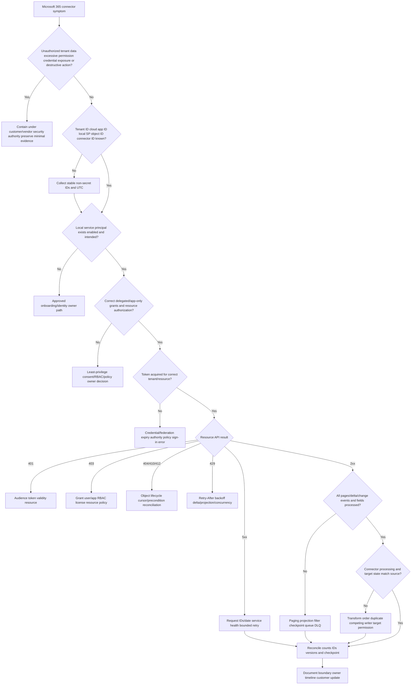

## 33. Common failure modes

| Failure mode | Why it fails | Better behavior |
|---|---|---|
| Microsoft 365 is one service | Hides owning boundary | Name Entra/Graph/Exchange/Defender/Purview/health |
| Domain name identifies tenant | Domains/branding can vary | Tenant ID plus cloud |
| App ID identifies customer instance | Same multitenant app ID across tenants | Tenant ID + SP object ID |
| App registration equals enterprise app | Blueprint versus local instance | Track both objects/owners |
| Enterprise app exists, so connected | Grant/token/API/processing may fail | End-to-end checkpoints |
| Configured permission equals granted | Vendor request is not customer consent | Inspect local grant artifacts |
| Consent equals token | Separate authorization and issuance | Token result/resource audience |
| Consent equals API success | Runtime policy/license/object remains | Resource error and policy evidence |
| Delegated app can do anything user can | Scope also constrains | App scope intersect user access |
| App-only ignores resource RBAC | Additional authorization can apply | Check service-specific controls |
| Graph token works everywhere | Audience/resource specific | Acquire/use token for exact resource |
| Graph is all Microsoft 365 | Some control/data planes differ | Identify supported current API |
| Mailbox equals mail flow | Storage and transport differ | Separate trace/resource/audit/connector |
| Audit absence proves no activity | Coverage/delay/retention/scope gaps | Validate audit prerequisites and other evidence |
| Service health issue proves root cause | May not match tenant/service/time/symptom | Explicit match table |
| Service health clear proves Microsoft healthy | Scoped/new/unposted issues possible | Request IDs, peer tests, report/escalate |
| First page is full result | Graph pages collections | Follow opaque nextLink |
| Reconstruct nextLink | Loses server state/parameters | Use returned full opaque URL |
| Full scan is safest | Load/throttling/privacy and staleness | Delta/webhook/backstop/reconciliation |
| Retry 429 immediately | Extends throttle/storm | Honor Retry-After |
| Parse Graph error message | Text can change | HTTP plus machine-readable codes |
| Batch 200 means all succeeded | Subrequests can fail individually | Inspect every result |
| Re-consent fixes every 403 | Can expand privilege/miss resource policy | Locate exact deny layer |
| New secret fixes authorization | Credential and permission differ | Classify 401/403/token stage |
| Delete/recreate service principal first | Destroys grants/evidence and increases outage | Preserve evidence and root cause |
| Export mailbox/audit for support | Excess sensitive data | IDs, metadata, scoped protected evidence |
| Generic architecture equals Abnormal design | Proprietary path unknown | Approved product documentation |

## 34. Escalation packet

| Section | Required content |
|---|---|
| Impact | Missing/excess/delayed data, affected tenants/resources, security/availability |
| Tenant | Tenant ID, cloud/environment, license/service plan class, multigeo if relevant |
| Application | App/client ID, home publisher, local SP object ID, enabled/owner/access mode |
| Grants | Delegated scopes/app roles, grant artifact IDs/types, consent UTC/actor role class |
| Credential/trust | Type, credential/key/trust ID, expiry, last use, rotation timeline; no values |
| Token | Authority/resource audience/result/error/correlation/sign-in UTC; no token |
| Resource operation | Graph/service API class, object type/ID, method intent, request IDs/date/error |
| Collection | Filters, projection, paging, delta/subscription/checkpoint, counts/lag |
| prior evidence | Entra sign-in/audit, Purview/Exchange/Defender evidence, service-health ID |
| Connector | Connector ID/version/node, last success, queue/DLQ, processing/target result |
| Changes | Grants, credential, policy/RBAC, license, service, release, network, schema |
| Privacy | Data minimized/redacted; approved evidence location/retention |
| Ask | Exact Microsoft/identity/Exchange/security/vendor Engineering decision or fix |

## Safe synthetic lab: The Microsoft 365 Boundary Flight Deck 066

### Objective

Build a local paper architecture and troubleshooting workbook for a fictional multitenant SaaS integration with Microsoft 365. Trace home application object, customer service principal, consent, credentials, token acquisition, Graph/service resource, Exchange/security/audit/health evidence, connector checkpoint, and target state. The unique lab is **The Microsoft 365 Boundary Flight Deck 066**.

The lab does not access or create a Microsoft tenant, app registration, service principal, consent grant, credential, token, Graph request, mailbox, message, security alert, audit search, service-health session, subscription, or third-party connector. All IDs and records are fictional metadata.

### Prerequisites

- Local Markdown editor or spreadsheet only.
- This Part and fictional IDs prefixed `TENANT-066`, `APP-066`, `SP-066`, `GRANT-066`, `CRED-066`, `REQ-066`, `MAIL-066`, `ALERT-066`, `AUDIT-066`, `HEALTH-066`, `CONN-066`, and `CASE-066`.
- Reserved text-only hosts under `example.test`; no real Microsoft authority, Graph endpoint, admin portal, or vendor URL.
- No Entra/Microsoft 365/Purview/Exchange/Defender/Abnormal account, API client, PowerShell session, browser admin console, network request, credential, token, consent, mailbox data, audit export, or tenant change.
- Artifact label: **local/public lab - synthetic Microsoft 365 integration metadata only**.
- Record start UTC, zero-live-tenant/data/credential statement, experience labels, and source date August 24, 2026.

### Synthetic tenant/application starter

| Tenant | App/client ID | Local SP object ID | Access/grant | Connector state |
|---|---|---|---|---|
| `TENANT-066-A` | `APP-066-VENDOR` | `SP-066-A` | App-only `GRANT-066-A` | Healthy |
| `TENANT-066-B` | `APP-066-VENDOR` | `SP-066-B` | App-only `GRANT-066-B` | 403 resource policy |
| `TENANT-066-C` | `APP-066-VENDOR` | `SP-066-C` | Expired `CRED-066-C` | Token failure |
| `TENANT-066-D` | `APP-066-VENDOR` | `SP-066-D` | Least grant | Paging gap |

### Lab steps

1. Create the cover with artifact label, UTC, safety boundary, production-transfer statement, and Abnormal proprietary-unknown statement.
2. Define tenant/cloud, home/customer tenant, application object, app ID, service principal, SP object ID, enterprise app, consent, grant, access mode, resource, and connector.
3. Draw Entra/Graph/Exchange/Defender/Purview/service-health/vendor planes and identify each owner.
4. Build four customer tenants sharing one vendor app ID but different SP IDs, grants, policies, credentials, and connector states.
5. Create an application-object versus service-principal property/owner/evidence matrix.
6. Compare single-tenant and multitenant context and list eight tenant-safe identifiers.
7. Model delegated authorization as app-scope and user-resource intersection; model app-only as app role plus resource policy.
8. Build requested/configured versus granted/consented versus token versus runtime-authorization checkpoints.
9. Add Entra RBAC, Exchange RBAC/application policy, resource-specific consent, license, and object-state decisions to four cases.
10. Create credential/trust metadata and token-acquisition evidence cards without values.
11. Model token audience mismatch between Graph and another resource without creating tokens.
12. Map ten fictional business operations to owning Microsoft service, API/control surface, least permission, fields, retention, and target action.
13. Build mailbox-data, mail-flow, mailbox-audit, unified-audit, security-alert/incident, and connector evidence comparisons.
14. Create mailbox-audit coverage cards for mailbox type, actor type, operation, default/customization, bypass, license, geo, and retention.
15. Build Purview audit-search readiness using ingestion, role, operation, record type, UTC, retention, search scope/job, and latency.
16. Create service-health correlation cards with issue ID, service, estimated start, impact, status, matching evidence, and contrarian evidence.
17. Model initial full enumeration with every page, minimum fields, source IDs/versions, and checkpoint.
18. Model webhook-triggered delta plus a backstop and checkpoint commit/reconciliation.
19. Create pagination failures: first-page only, manually rebuilt nextLink, page error, duplicate page, and source changes during enumeration.
20. Build Graph error records using HTTP, code, nested inner code, request ID, client-request ID, date, and human message boundary.
21. Classify 400, 401, four kinds of 403, 404, 409, 410, 412, 429, 500, 503, and 504.
22. Model a 429/Retry-After flow with bounded concurrency, projection, delta, backoff, and lag monitoring.
23. Create cross-tenant symptom patterns that distinguish Microsoft service, vendor deployment, tenant grant/policy, resource subset, and target processing.
24. Run the troubleshooting tree on expired credential, one-mailbox 403, first-page gap, 429 lag, audit no-result, matching service incident, and source-mail/target gap.
25. Draft a customer update for a Microsoft service advisory and another for a tenant-specific permission issue.
26. Draft one identity-admin packet, one enterprise support packet, and one vendor Engineering packet with precise asks.
27. Deliver a 90-second multitenant architecture answer, a 90-second consent-versus-access answer, and a 60-second honesty boundary.
28. Validate source URLs/date, cleanup, privacy, zero-activity statement, and rubric.

### Expected evidence

- Microsoft 365 multi-plane ownership diagram.
- Four-tenant app/service-principal/grant/connector map.
- Application-object versus service-principal comparison and identifier register.
- Delegated/app-only and consent/token/runtime authorization models.
- Other authorization-system decision cards.
- Credential/trust and token-audience metadata records.
- Ten-operation permission/data/retention map.
- Mailbox/mail-flow/audit/security/connector evidence matrix.
- Mailbox-audit and Purview search coverage workbooks.
- Service-health match/contrarian cards.
- Full-page initial and webhook/delta/backstop reconciliation models.
- Graph error and throttling workbooks.
- Cross-tenant pattern matrix and seven troubleshooting cases.
- Two customer updates and three escalation packets.
- Source ledger dated **August 24, 2026**.
- Spoken Microsoft strength and Abnormal unknown statements.

### Cleanup and privacy

- Confirm every tenant, app, service principal, grant, credential, request, mailbox, message, alert, audit event, health issue, connector, object, and case is fictional and includes `066`.
- Confirm all hosts use `example.test` and no valid Microsoft tenant/domain/GUID, authority, Graph URL, consent URL, token, secret, certificate, private key, request, command, query, or payload exists.
- Remove real customer names, domains, tenant/app/SP IDs, mail addresses, mailbox/message identifiers/content, alerts/incidents, audit records, request IDs, service-health details, and screenshots.
- Confirm no Entra/M365/Purview/Exchange/Defender/Abnormal portal, PowerShell, Graph Explorer, API client, account, or network request was used.
- Delete the artifact if credential, mailbox/security data, audit data, or customer identity cannot be reliably removed.
- Record cleanup UTC and: `Synthetic paper Microsoft 365 integration exercise only; zero live tenant, app, service principal, consent, credential, token, Graph/API request, mailbox, message, alert, audit search, service-health access, connector, or production activity.`

### Validation rubric

| Dimension | Fail | Developing | Pass |
|---|---|---|---|
| Service map | “Microsoft 365” | Names Graph/Entra | Owning Entra/Graph/Exchange/Defender/Purview/health/vendor boundaries |
| Multitenancy | App ID only | Knows enterprise app | Home app + customer SP object + grants/policies/sign-ins per tenant |
| Authorization | Consent equals access | Delegated/app-only | Request/grant/token/resource/RBAC/license/object checkpoints |
| Mail/security | One data stream | Separates mailbox/audit | Mail flow, mailbox resource/audit, security alert/incident, connector/target |
| Collection | First response | Paging | Opaque nextLink, minimum fields, delta/webhook/backstop/checkpoint/reconcile |
| Errors | HTTP only | Reads message | Machine code/inner code/request IDs/UTC and 401/403 distinctions |
| Reliability | Retry all | Handles 429 | Retry-After, backoff, projection, bounded concurrency, health correlation |
| Evidence | Raw tenant data | Some redaction | Stable IDs/metadata/scoped audit, no credentials/content/export |
| Triage | Re-consent/recreate | Checks grants | Tenant-to-target decision tree and precise owner/escalation |
| Honesty | Claims connector ops | Says learned | Leans into enterprise support; Abnormal path remains unknown |

## 35. Official Source Anchors

All sources were verified and recorded with guide currency date **August 24, 2026**. Microsoft documentation and service behavior evolve; revalidate endpoint permissions, licensing, retention, cloud availability, limits, and portal workflows before production use.

| Official source | What it anchors | Boundary |
|---|---|---|
| [Microsoft Graph - Authentication and authorization basics](https://learn.microsoft.com/en-us/graph/auth/auth-concepts) | App registration, delegated/app-only, Graph permissions, access tokens, least privilege | Endpoint permission docs remain controlling |
| [Microsoft Entra - Apps and service principals](https://learn.microsoft.com/en-us/entra/identity-platform/app-objects-and-service-principals) | Home application object, local SP, multitenant relationship, enterprise app | Microsoft identity object model, not vendor implementation |
| [Microsoft identity platform - Permissions and consent](https://learn.microsoft.com/en-us/entra/identity-platform/permissions-consent-overview) | Delegated scopes, app roles, user/admin consent, grant types, other RBAC systems | Policies and resource models vary |
| [Microsoft Graph - Error responses](https://learn.microsoft.com/en-us/graph/errors) | HTTP/error/innerError/details, request ID/date, machine-code versus message handling | Endpoint-specific codes can add detail |
| [Microsoft Graph - Throttling guidance](https://learn.microsoft.com/en-us/graph/throttling) | 429, Retry-After, backoff, avoiding polling, batch subrequest handling | No universal threshold |
| [Microsoft Graph - Best practices](https://learn.microsoft.com/en-us/graph/best-practices-concept) | Least privilege, paging/nextLink, projections, errors, delta/webhooks, support correlation | Revalidate current API terms/capabilities |
| [Microsoft Purview - Manage mailbox auditing](https://learn.microsoft.com/en-us/purview/audit-mailboxes) | Default auditing, mailbox/actor/action coverage, customization, bypass, multigeo caveats | License/current config matters |
| [Microsoft Purview - Search the audit log](https://learn.microsoft.com/en-us/purview/audit-search) | Ingestion, roles, retention/licensing, UTC search/jobs, operation/record types, latency | Audit absence requires coverage checks |
| [Microsoft 365 - Check service health](https://learn.microsoft.com/en-us/microsoft-365/enterprise/view-service-health?view=o365-worldwide) | Tenant service incidents/advisories, issue fields/status/history, Message center distinction | Service-health match is evidence, not automatic root cause |

### Source-use discipline

- Check the current method/topic for exact least-privileged Graph permissions.
- Treat tenant ID, app ID, and service-principal object ID as distinct.
- Never handle customer tokens, secrets, private keys, mailbox exports, or unrestricted audit data in ordinary support artifacts.
- Use Graph request IDs/date, Entra sign-in/audit, source-service evidence, service health, connector logs, and target state at their proper boundaries.
- Use paging, delta/change notifications, projection, Retry-After, and reconciliation as supported.
- Keep Abnormal's Microsoft 365 app, grants, APIs, cadence, and logs explicitly unknown.

## Likely Interview Questions

### Q1. Explain the application object and service principal in a multitenant Microsoft 365 integration.

**Model answer:** The vendor has one application object in its home Entra tenant, identified by the app/client ID. Each customer tenant where the app is used has a local service principal, with its own object ID, grants, enablement, policies, owners, and sign-ins. I always collect tenant ID, app ID, and local service-principal object ID rather than treating the app ID as the customer instance.

### Q2. What is delegated versus app-only Microsoft Graph access?

**Model answer:** Delegated access has a signed-in user; effective authorization is the app's delegated scope intersected with the user's resource privileges and policy. App-only access has no user; the service principal receives application permissions/app roles and can also be constrained by resource RBAC/access policy, licenses, and object state. The product's operation determines the appropriate mode.

### Q3. Why can admin consent be present while the connector still fails?

**Model answer:** Consent is one authorization record, not token or processing success. The service principal can be disabled, credential/federation can fail, token authority or audience can be wrong, resource policy/license can deny the operation, Graph can throttle/fail, paging/checkpoint can break, or connector processing/target writes can fail. I trace each checkpoint separately.

### Q4. How do you distinguish Graph 401 from 403?

**Model answer:** 401 points to authentication for that resource: missing/invalid/expired token, wrong audience, authority, or token validation. 403 means the valid actor is not allowed: missing scope/app role, delegated user privilege, application RBAC/access policy, license, Conditional Access claims, or object restriction. I use machine-readable code/inner code, request ID/date, access mode, grants, and resource evidence.

### Q5. How would you investigate missing Microsoft 365 data in a SaaS connector?

**Model answer:** Identify tenant/app/local SP and source service/object first. Validate grant, credential/trust, token, API result, filters/projection, every page or delta/change event, checkpoint, queue/DLQ, transform, and target state. Correlate Entra, Exchange/Purview/Defender as applicable, Graph request IDs, service health, connector logs, and reconciliation before changing consent or resyncing.

### Q6. How should a connector handle Microsoft Graph throttling?

**Model answer:** Detect 429, honor Retry-After, use bounded concurrency and retry, and use exponential backoff with jitter if no Retry-After is supplied under current guidance. Reduce calls and fields, follow paging correctly, prefer delta/change notifications over repeated full scans, monitor checkpoint lag, and handle batch subrequest failures individually.

### Q7. What is the difference between mail flow, mailbox data, and mailbox audit?

**Model answer:** Mail flow is Exchange transport submission/routing/delivery. Mailbox data is the stored message/folder resource visible through supported access. Mailbox audit records selected owner/delegate/admin actions under configured coverage, license, retention, and timing. A connector's ingestion and target record are additional stages; evidence from one does not prove the others.

### Q8. How would you present your Microsoft 365 experience honestly for this role?

**Model answer:** enterprise support is a real strength: tenant-aware triage, identity/configuration boundaries, service health, audit evidence, escalation, and customer communication. My Graph connector model and lab are standards/current-doc based, not a claim that I built production receivers or owned Abnormal's integration. I keep Abnormal's app, permissions, APIs, data path, and logs unknown until approved docs confirm them.

## Memory Hooks

- **Microsoft 365 is many planes; name the owner.**
- **Tenant ID identifies the directory; domain is a label.**
- **App object defines globally; service principal operates locally.**
- **Same app ID, different customer SP object IDs and grants.**
- **Delegated equals app scope intersect user access.**
- **App-only equals workload grant plus resource policy.**
- **Configured is not granted; granted is not token; token is not API success.**
- **Access tokens are resource/audience specific.**
- **Graph is broad, not every Microsoft control plane.**
- **Mail flow routes; mailbox stores; audit records selected actions.**
- **Audit absence requires coverage, retention, scope, and delay checks.**
- **Every nextLink until absent; treat it as opaque.**
- **Webhook triggers; delta tracks; backstop reconciles.**
- **401 validates the badge; 403 enforces the room policy.**
- **429 means Retry-After and less pressure, not faster retry.**
- **Service health must match service, time, tenant, and symptom.**
- **Source correct plus target missing means inspect connector middle.**
- **prior production transfer is real; Abnormal internals remain unknown.**

## Completion Checklist

- [ ] I can state the Section goal and tenant-to-target checkpoint rule.
- [ ] I can map Entra, Graph, Exchange, Defender, Purview, service health, connector, and target planes.
- [ ] I can distinguish tenant ID/cloud from domain/display name.
- [ ] I can distinguish home app object, app/client ID, local service principal, and SP object ID.
- [ ] I can explain one multitenant app across multiple customer service principals.
- [ ] I can explain delegated and app-only authorization.
- [ ] I can distinguish requested/configured, consented/granted, token, and resource authorization.
- [ ] I can include Entra/Exchange/resource-specific RBAC, license, and policy.
- [ ] I can trace credential/federation and token acquisition without secrets.
- [ ] I can explain resource audience and 401 versus 403.
- [ ] I can separate Graph and service-specific Microsoft 365 surfaces.
- [ ] I can separate mail flow, mailbox data, mailbox audit, security artifacts, and connector state.
- [ ] I can validate Purview audit coverage/search/retention/latency before using absence.
- [ ] I can correlate Microsoft 365 service health without overclaiming causation.
- [ ] I can model initial sync, all pages, delta/webhooks, checkpoint, backstop, and reconciliation.
- [ ] I can interpret Graph error/code/inner code/request ID/date and batch details.
- [ ] I can handle 429 with Retry-After/backoff and reduce request load.
- [ ] I can use cross-tenant patterns to route Microsoft versus tenant versus vendor causes.
- [ ] I completed or can explain **The Microsoft 365 Boundary Flight Deck 066**.
- [ ] The lab includes Prerequisites, Expected evidence, Cleanup and privacy, and Validation rubric.
- [ ] I used no live tenant, app, SP, consent, credential, token, API request, mailbox, alert, audit search, or connector.
- [ ] I can state production-transfer and Abnormal proprietary boundaries.
- [ ] I checked Official Source Anchors and recorded **August 24, 2026**.
- [ ] I can answer exactly Q1-Q8.

[Next: Part 067 - Google Workspace Integration Learning Lab](Part-067-google-workspace-integration-learning-lab.md)