# Part 067 - Google Workspace Integration Learning Lab

## Section goal

This Part builds a beginner-friendly support model for a third-party SaaS integration with Google Workspace. It is explicitly a **learned architecture and synthetic paper lab**, not a claim that you administered Google Workspace, Google Cloud, Gmail API, Admin SDK, Cloud Pub/Sub, OAuth verification, or domain-wide delegation in production.

Google Workspace and Google Cloud are related but distinct administrative planes. A Google Cloud project can contain enabled APIs, OAuth clients, service accounts, keys, IAM roles, quota usage, Pub/Sub topics, and subscriptions. A Google Workspace customer/domain has users, groups, organizational units, licenses, Admin-console API controls, app access controls, domain-wide delegation entries, Gmail mailboxes, and audit/activity records. A Cloud service account is an application identity; it is not automatically a member or user of the Workspace domain. Cloud IAM permission on the project does not automatically authorize access to Workspace user data.

**Domain-wide delegation (DWD)** lets a Workspace super administrator authorize a service account's OAuth client ID for specified scopes so an application can impersonate a specific user when calling supported Google Workspace APIs. The application still chooses a subject user for each delegated authorization, and effective access is constrained by the authorized OAuth scopes, the impersonated user's privileges/resource access, API behavior, Admin policy, service/account state, and license. DWD is therefore not one universal “read the whole domain” switch.

For Gmail change ingestion, current official architecture can involve Gmail API `watch`, a Google Cloud Pub/Sub topic, a Pub/Sub subscription, a notification carrying the watched user/email context and a new mailbox `historyId`, then Gmail `history.list` to retrieve changes since the last durable `historyId`. The Pub/Sub message ID is not a Gmail message ID, and the push notification is a trigger, not the complete mailbox change. Watches expire and must be renewed. Notifications can be delayed or dropped, so a backstop partial synchronization is required; an out-of-range history ID requires a controlled full synchronization.

The central support rule is:

> Identify Workspace customer/domain, Google Cloud project, OAuth client or service account, domain-wide delegation entry and exact scopes, impersonated subject, enabled API, resource operation, Pub/Sub/watch/checkpoint state, quota/error evidence, connector processing, and target state before changing scopes, keys, subjects, watches, permissions, or data.

This Part covers Workspace/Cloud ownership, customer/domain/project identifiers, OAuth clients, service accounts, keys and keyless options conceptually, domain-wide delegation, impersonation, scope categories, app verification, API controls, Admin SDK Directory API, Reports API/audit concepts, Gmail resources, full/partial sync, `historyId`, Gmail push notifications via Cloud Pub/Sub, watch renewal, acknowledgement, quotas, backoff, errors, audit evidence, privacy, and troubleshooting. It provides no Admin-console steps, credential generation, private key, token, runnable API request, Cloud project, Pub/Sub resource, mailbox access, user impersonation, or customer data. Abnormal's actual Google integration, scopes, service account, project, Pub/Sub topology, watch cadence, APIs, audit sources, and logs remain proprietary unknowns unless approved documentation states them.

## Learning outcomes

After completing this Part, you should be able to:

- distinguish Google Workspace customer/domain, Google Account, Cloud organization, Cloud project, OAuth client, service account, service-account client ID/email, and Workspace user;
- explain why Cloud IAM, API enablement, OAuth consent configuration, Workspace app controls, domain-wide delegation, and user/resource privilege are separate gates;
- distinguish interactive user OAuth from server-to-server service-account access and DWD impersonation;
- explain DWD as an admin authorization of a numeric OAuth client ID plus exact scopes, not a private-key upload or automatic access to all data;
- explain the impersonated subject and how its privileges combine with DWD scopes and API/resource rules;
- distinguish non-sensitive, sensitive, and restricted scopes and explain least privilege, verification, and user-data policy at a high level;
- inventory a Google integration without recording a private key, token, authorization header, mailbox content, or customer export;
- map Directory API resource operations to narrow read/write scopes;
- distinguish Gmail message, thread, label, mailbox user, history record/history ID, Pub/Sub message, topic, subscription, and watch;
- explain initial full sync, partial sync with `history.list`, checkpoint commit, invalid/old history ID recovery, and reconciliation;
- trace Gmail API to Pub/Sub publisher, topic, subscription, receiver, worker, Gmail history retrieval, and target state;
- explain watch expiration/renewal, acknowledgement/retry, notification-rate limits, delayed/dropped notifications, and backstop synchronization;
- explain Reports API/audit evidence as a separate source with its own scopes, event/activity model, pagination, time window, and availability;
- classify OAuth/JWT, 401/403/404, quota/rate, project/API, subject, scope, watch, Pub/Sub, and connector errors;
- use truncated exponential backoff with jitter conceptually and avoid retry storms/full-scan loops;
- distinguish Google-side service/project/domain causes from vendor connector/target causes; and
- present Google Workspace experience as learned architecture and synthetic practice, while leaning on experience transferable support skills.

## JD Mapping

| Supplied role signal | Capability built | Your transferable evidence | Boundary |
|---|---|---|---|
| Google Workspace ecosystem | Maps Workspace domain, Cloud project, DWD, Gmail/Admin APIs, Pub/Sub, and audit | enterprise identity/cloud concepts transfer | Learned architecture only |
| SaaS integrations | Traces admin grant to identity, token, API, watch, checkpoint, and target | REST/JSON and enterprise configuration habits | No live Google connector claim |
| Email security | Separates Gmail mailbox history/change notification from full message/resource retrieval | Microsoft mail-plane reasoning transfers | Abnormal Google mail path unknown |
| Security/least privilege | Reviews exact scopes, impersonated subject, keys, API controls, data retention | Microsoft security/identity habits | No DWD administration claim |
| Complex troubleshooting | Uses multi-plane IDs/timelines and competing hypotheses | critical situation/escalation experience | Synthetic cases only |
| API support | Understands pagination, history checkpoints, Pub/Sub IDs, quota/backoff | HTTP/API working knowledge | No API calls in lab |
| Customer trust | Requests metadata and field names, not keys/tokens/mail | Privacy-aware support | Customer content excluded |
| Cross-functional work | Routes Workspace admin, Cloud owner, security, network, and vendor Engineering asks | enterprise support collaboration | Google role names/workflows need current docs |

## Candidate honesty note

| Evidence tier | Safe statement | Do not imply |
|---|---|---|
| **Production transfer - Microsoft** | “I transfer tenant-aware identity, consent, API, evidence, service-health, escalation, and customer communication skills.” | That Microsoft and Google objects are identical |
| **Local/public lab** | “I built a synthetic Google Workspace DWD, Gmail history, Pub/Sub, and troubleshooting model with no live resources.” | A real Google Cloud project, DWD grant, watch, or mailbox |
| **Learned architecture - Google** | “I verified current concepts against official Google Workspace/Identity documentation.” | Production Google Workspace administration |
| **Security boundary** | “I discuss keys/tokens/scopes conceptually and collect metadata only.” | That the lab generated or inspected credentials |
| **Proprietary unknown** | “Abnormal's Google app, scopes, project, service account, subjects, APIs, Pub/Sub, and logs require approved docs.” | Generic Google guidance reveals Abnormal internals |

Safe interview language:

> “My Google Workspace integration knowledge is learned and lab-based, supported by real enterprise support experience. I would identify the Workspace customer/domain, Cloud project, service-account numeric client ID and email, DWD scopes, subject user, enabled API, request/quota evidence, Gmail watch and history checkpoint, Pub/Sub topic/subscription delivery, connector processing, and target state. I would never request the service-account JSON key, private key, access token, Gmail message content, or an unrestricted Admin audit export.”

## 1. Google Workspace and Google Cloud planes

| Plane | Owns | Key support evidence | Common confusion |
|---|---|---|---|
| Google Workspace customer/domain | Users, groups, org units, licenses, Admin policies, API controls, DWD | Customer/domain IDs, admin audit, DWD scopes | Same thing as Cloud project |
| Google Cloud organization/project | APIs, OAuth clients, service accounts, IAM, quota, Pub/Sub | Project ID/number, client/service-account IDs, API metrics | Project IAM grants Workspace data |
| Google Identity OAuth | Consent, token issuance, scopes, app verification | OAuth error, client ID, scopes, subject, UTC | Scope request equals grant |
| Admin SDK Directory API | Directory resources | Customer/user/group stable IDs, pages/errors | Gmail mailbox API |
| Admin SDK Reports API | Workspace activities/usage reports | Application/event/activity IDs/time | Complete real-time audit of every action |
| Gmail API | Mailbox messages/threads/labels/history/watch | User, message/thread/history IDs, error/quota | SMTP transport/logging |
| Cloud Pub/Sub | Topic/subscription message delivery | Project/topic/subscription/message IDs | Pub/Sub ID equals Gmail message ID |
| Third-party SaaS | Connector state, mapping, processing, target | Connector/checkpoint/target IDs | Google source state automatically |

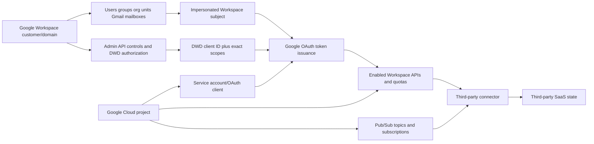

## 2. Identifier inventory

Display domains and account emails are useful, but stable numeric/string identifiers and namespace matter. A service account has an email-like identifier and a numeric OAuth client ID; DWD authorization uses the client ID, not an assumption based on the email address.

| Identifier | Owner/scope | Use |
|---|---|---|
| Workspace customer ID | Google Workspace customer | Stable organization correlation |
| Primary/secondary/domain alias | Workspace domain | Routing/display and user identity context |
| Cloud organization ID | Google Cloud organization | Governance boundary if used |
| Cloud project ID | Cloud project | Human-readable globally unique project reference |
| Cloud project number | Cloud project | Stable numeric resource association |
| OAuth client ID | Google Auth/Cloud project | Interactive OAuth client identity |
| Service-account email | Cloud project | Service identity display/principal reference |
| Service-account numeric client ID | Google service account/OAuth | DWD authorization and correlation |
| Service-account key ID | Credential metadata | Rotation/signature troubleshooting; no private key |
| Workspace user ID/email | Workspace domain | Impersonated subject/resource owner |
| Connector/customer ID | Third-party SaaS | Vendor-side correlation |

## 3. Cloud project setup gates versus Workspace authorization

An integration can fail even if one plane is correct. The Cloud project must exist and have the intended API enabled. The OAuth app/service account must exist and be active. Credentials/trust must work. Workspace API controls must allow the app as required. DWD must authorize the exact service-account client ID and scopes. The subject and resource must exist and permit the operation.

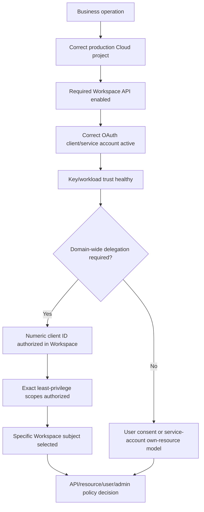

## 🔍 Plain-English deep-dive: The Cloud project is the workshop; Workspace delegation is the building access list

A contractor can own tools and have permission to work inside its own workshop. That does not put the contractor on a customer's building access list. The customer separately records which contractor ID may perform which work, and the contractor names the employee whose authority/context applies at each visit.

The Google Cloud project is the workshop containing APIs, service account, keys/trust, quota, and Pub/Sub. Workspace DWD is the customer's authorization of the service-account client ID for exact OAuth scopes. The application then impersonates a specific Workspace user; the user's authority and the API's resource rules still matter.

The analogy stops because OAuth tokens and scopes enforce access cryptographically. The support lesson is exact: Cloud IAM, API enablement, service-account credentials, DWD client/scopes, subject, and resource permission are separate evidence checkpoints.

**Memory cue:** Cloud builds the caller; Workspace authorizes delegated data access.

## 4. Interactive OAuth versus server-to-server access

| Dimension | Interactive user OAuth | Service account without DWD | Service account with DWD |
|---|---|---|---|
| Human present | Yes | No | No during calls; admin configured delegation |
| Actor/context | App on behalf of consenting user | Service account itself | Service account impersonating named Workspace user |
| Data | User-authorized resources | Service account's/project resources where supported | Workspace user/domain resources under scope and subject privilege |
| Authorization | User/admin consent and app controls | Cloud/resource IAM/API policy | Workspace super-admin DWD + exact scopes + subject/API rules |
| Credential | OAuth client flow/token | Service-account credential/trust | Service-account credential/trust plus delegated subject |
| Main risk | Excess scopes/refresh tokens | Overprivileged service identity/key | Domain-scale impersonation and broad scopes |

## 5. What a service account is and is not

A service account belongs to an application/project, not an individual. It can authenticate server-to-server. It is not automatically a Workspace user, group member, super admin, or subject to every Workspace end-user policy. Its Cloud IAM roles determine what it may do to Cloud resources, not automatic access to Gmail or Directory data.

| Statement | Verdict | Why |
|---|---|---|
| Service account is a machine identity | Correct | Represents application/workload |
| Service-account email proves DWD entry | Incorrect | DWD uses/correlates numeric client ID and scopes |
| Project Owner means read all Gmail | Incorrect | Cloud IAM and Workspace data authorization differ |
| API enabled means API access authorized | Incorrect | Only makes service available to project; OAuth/resource auth remains |
| DWD means service account can impersonate authorized subjects | Qualified | Exact scopes, subject, API/resource rules and policy apply |
| Private key can be shared with support | Incorrect | Never share; use key ID/error metadata |

## 6. Domain-wide delegation flow

At a high level, a Workspace super administrator authorizes the service account's client ID for selected OAuth scopes. The application authenticates the service account, creates/requests delegated credentials for a specific Workspace user (the subject), obtains an access token, and calls the API. Use Google-supported libraries to avoid hand-rolled JWT cryptography.

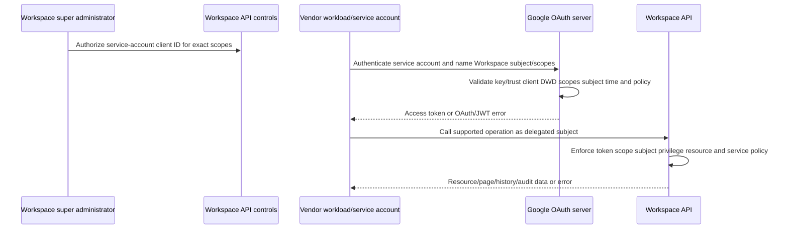

## 7. Effective authority under impersonation

Current Google guidance emphasizes that DWD access is constrained by authorized OAuth scopes and the impersonated user's permissions. The subject should be a dedicated appropriate account under governance, not an arbitrary super admin chosen to make errors disappear.

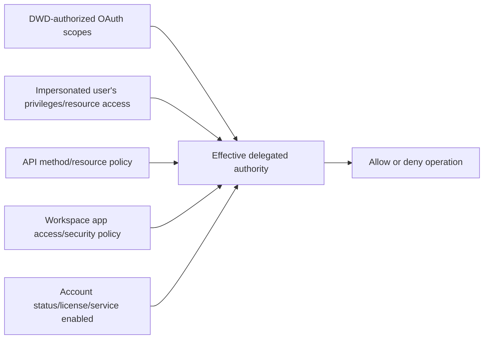

| Subject concern | Support question |
|---|---|
| Exists/active | Is subject a valid Workspace account now? |
| Domain membership | Is it in the authorized Workspace customer/domain? |
| Admin privilege | Does API operation require admin role/privilege? |
| Resource access | Can this subject access target mailbox/directory resource? |
| License/service | Is relevant service available/enabled? |
| Suspension/deletion | Did lifecycle break impersonation? |
| Dedicated ownership | Is subject purpose/owner/review explicit? |

## 8. DWD grant inventory

| Field | Why |
|---|---|
| Workspace customer ID/domain | Correct organization boundary |
| Service-account numeric client ID | Exact delegated client |
| Cloud project ID/number | Owning vendor environment |
| Service-account email | Human-readable identity correlation |
| Authorized scope URI list | Privilege and mismatch analysis |
| Grant/admin audit UTC | Change timeline |
| Owner/approver | Governance and incident contact |
| Purpose/environment | Prevent test/prod crossover |
| Last reviewed/used | Stale access detection |
| Revocation/decommission plan | Safe removal and backfill impact |

## 9. Scope categories and app verification

Google OAuth scopes are URI strings defining requested data/action access. Choose the narrowest scope supported by the endpoint. Google categorizes scopes as non-sensitive, sensitive, or restricted; production apps using sensitive/restricted scopes can require verification and, for certain restricted data use, additional requirements/security assessment. Internal-only and Marketplace cases have distinct rules; use current official policy.

| Scope category | General sensitivity | Support/governance question |
|---|---|---|
| Non-sensitive | Limited data/action | Is it sufficient? |
| Sensitive | Personal user data/resources/actions | Is verification/justification current? |
| Restricted | Highly sensitive/extensive data/actions | Can architecture avoid it; are verification/security requirements met? |
| Read-only variant | Retrieval without write | Does endpoint support it instead of full scope? |
| Narrow resource scope | Users/groups/members/etc. subset | Does exact operation need broader? |

## 🔍 Plain-English deep-dive: A scope is the job description; the subject is the employee badge

A contractor agreement may allow “read directory records.” The employee sent to the building still needs a valid badge and may only enter rooms assigned to that employee. Giving the employee an executive badge because one room is locked expands risk rather than diagnosing the requirement.

In DWD, the authorized scope describes what the application may request. The subject identifies the Workspace user on whose behalf the app acts. The API/resource evaluates both. A directory read-only scope plus a user without required admin visibility can still fail; a broad scope should not be granted merely to test.

The analogy stops because OAuth scope and API-specific privilege checks are exact. The support lesson is to map each API method to documented scope, subject role/resource access, service policy, and intended data.

**Memory cue:** Scope defines the job; subject supplies the delegated authority context.

## 10. Test versus production projects and ownership

Google OAuth production guidance calls for separate test and production projects, accurate branding, current contacts, owned domains, secure redirect origins where applicable, minimum scopes, and verification as required. Mixing environments can cause wrong client IDs, DWD entries, quotas, Pub/Sub topics, credentials, and audit evidence.

| Project inventory | Support use |
|---|---|
| Project ID/number | Exact environment correlation |
| Organization/folder | Governance owner |
| Environment | Test/staging/production separation |
| Enabled APIs | Service readiness |
| OAuth clients/service accounts | Calling identities |
| Owners/editors/security contacts | Maintenance/escalation |
| Consent/branding/verification status | OAuth production readiness |
| Quota/billing class | Limits and behavior |
| Pub/Sub resources | Notification topology |
| Logs/monitoring | Request and delivery evidence |

## 11. Credential and key handling

Service-account private keys are high-risk credentials. Prefer platform-managed/keyless workload identity patterns where supported by the deployment and Google guidance. If a key exists, protect it in a secret manager/HSM-equivalent, restrict access, inventory key ID/create/last-use/disable/delete, rotate with overlap, and never place the JSON key in a ticket or repository.

| Record | Safe evidence | Never request |
|---|---|---|
| Service account | Email, numeric client ID, unique ID | Private key JSON |
| Key | Key ID, created/disabled/deleted UTC, last-use metadata | Private key material |
| Token | Type, scope names, issue/expiry/error, fingerprint if approved | Access/refresh token |
| JWT assertion | Error code/time/key ID/subject/audience class | Assertion value |
| Workload federation | Pool/provider/trust/subject metadata | External credential token |

## 12. API enablement and method authorization

Enabling an API in the Cloud project makes the service available to the project but does not grant Workspace data access. The application still needs OAuth scope, DWD/user consent as applicable, subject/resource authority, quota, and correct request.

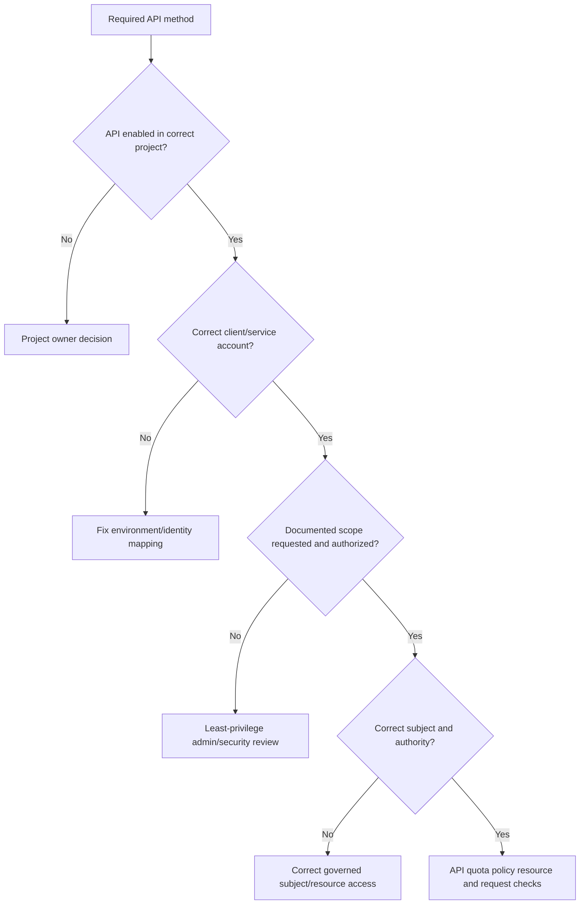

## 13. Admin SDK Directory API

The Directory API manages/retrieves Workspace directory resources such as users, groups, group members, organizational units, domains, devices, roles, and schemas under supported methods/scopes. Read-only scopes often exist separately from read/write scopes. Method documentation controls the exact requirement.

| Business need | Candidate resource | Least-privilege thought process |
|---|---|---|
| Inventory users | Users | Read-only user scope, required fields only |
| Read groups | Groups | Group read-only rather than full group management |
| Read memberships | Group members | Member read-only, pagination |
| Read org units | Organizational units | Org-unit read-only |
| Read domains | Domains | Domain read-only |
| Read role assignments | Role management | Read-only role management |
| Modify a user/group | Specific write resource | Separate high-risk operation/approval; not part of support test |

Directory object email/alias/display values can change; use stable IDs and customer namespace for correlation. Follow page tokens until absent and treat them as opaque according to API contract.

## 14. Gmail resource model

| Resource | Meaning | Identifier caution |
|---|---|---|
| User/mailbox | Workspace account whose Gmail data is accessed | `me` resolves to authenticated/delegated subject; explicit user context matters |
| Message | One Gmail message resource | Message ID is not RFC Message-ID or Pub/Sub ID |
| Thread | Conversation grouping | Thread can contain multiple message IDs |
| Label | Gmail categorization/system/user label | Label IDs/names differ |
| Attachment | Message part data | High sensitivity and quota/permission impact |
| History record | Mailbox change record | Can mention messages/label changes |
| `historyId` | Mailbox history checkpoint/version-like marker | Not contiguous event count or message ID |

## 15. Full and partial Gmail synchronization

The first connection or an invalid/stale incremental checkpoint can require full synchronization. A partial sync uses `history.list` with a recent stored `startHistoryId` to retrieve changes. History availability is limited; a 404 for an out-of-range history ID requires full sync. A full sync must be scoped to the application's purpose and privacy policy, not “download everything.”

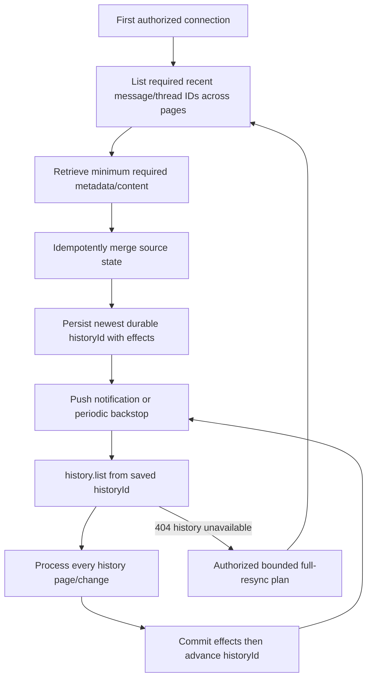

| Sync rule | Why |
|---|---|
| Store checkpoint only after durable effects | Avoid skipping unprocessed changes |
| Handle every page | Avoid silent data gaps |
| Treat historyId as opaque numeric string/marker | Avoid invented arithmetic assumptions |
| Make processing idempotent | Notifications/retries can duplicate triggers |
| Use minimum data/format | Privacy, quota, latency |
| Reconcile source and target | Repair delayed/dropped notification gaps |
| Plan full-resync blast radius | Avoid throttling/data overcollection |

## 🔍 Plain-English deep-dive: A history ID is a bookmark, not proof the chapters were filed

Imagine a clerk reading an amendment book. After reading pages 200 through 220, the clerk must update seven filing cabinets. If the clerk moves the bookmark to page 220 before the cabinet updates are durable, a power loss can make the next shift start at page 220 even though some changes were never filed.

A Gmail history ID plays the bookmark role. It marks the mailbox history position from which later partial synchronization continues. The connector should process all returned pages and changes idempotently, make intended effects durable, and then commit the new checkpoint under its recovery design. A notification's newer history ID is a trigger/upper observation, not permission to skip directly there.

The analogy stops because history records can age out and a full synchronization may be required. The support lesson is exact: distinguish notification history ID, requested start history ID, every returned page, last applied change, and durably committed checkpoint.

**Memory cue:** Apply the chapters, then move the bookmark.

## 16. Gmail push architecture through Cloud Pub/Sub

Gmail API push notifications use Cloud Pub/Sub. A project owns a topic. Gmail's publishing service identity needs publish permission on that topic. A Pub/Sub subscription delivers messages via push webhook or pull. A Gmail `watch` is configured per mailbox/user and returns a starting `historyId` and expiration. Watch renewal is a separate lifecycle.

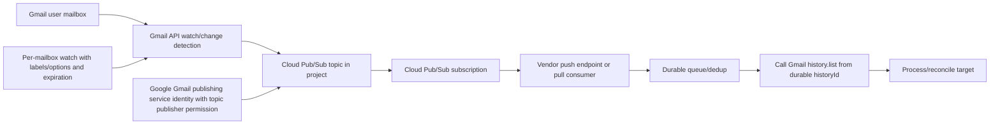

## 17. Watch, Pub/Sub message, and Gmail history IDs

| Identifier/state | Owner | Meaning |
|---|---|---|
| Watch expiration | Gmail API per mailbox watch | Renewal deadline |
| Watch response historyId | Gmail mailbox | Starting point after watch setup |
| Notification historyId | Gmail mailbox | New mailbox history point/trigger |
| Pub/Sub message ID | Cloud Pub/Sub | Delivery message identity, unrelated to Gmail message ID |
| Pub/Sub subscription | Cloud project | Delivery configuration/state |
| Gmail message ID | Gmail mailbox | Message resource identifier |
| Consumer checkpoint | Vendor connector | Last durably processed history state |

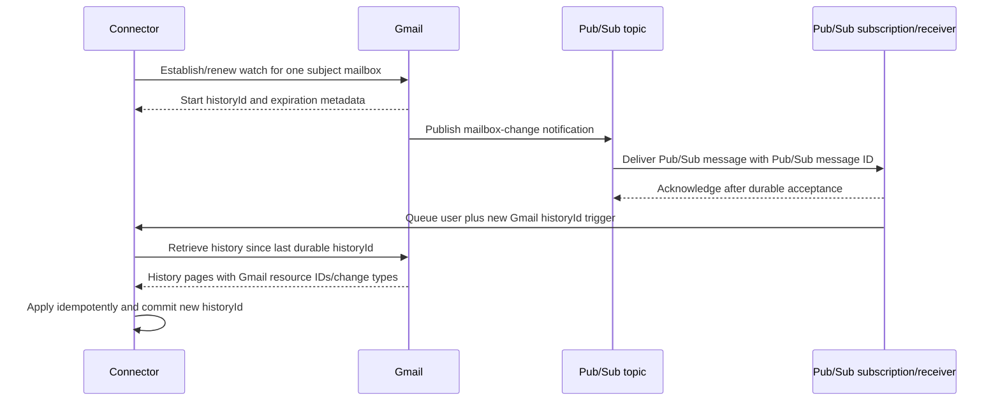

## 🔍 Plain-English deep-dive: The Pub/Sub notification is a library pager, not the book

A library pager vibrates and displays “Shelf account 42 has changed; latest revision 900.” The pager's own serial number identifies that pager message, not a book. The librarian uses the last recorded revision to ask the catalog what changed, then updates inventory and stores the new revision.

Gmail push behaves similarly. The Pub/Sub message ID identifies delivery in Pub/Sub. The notification identifies a mailbox and a Gmail history point. The connector calls Gmail history to learn message/label changes since its last durable history ID. It does not treat the Pub/Sub ID as a Gmail message or the notification as complete message content.

The analogy stops because watches expire, Pub/Sub can retry, and Gmail history can age out. The lesson is exact: separately inventory watch expiration, Pub/Sub delivery ID, mailbox user, notification history ID, saved history ID, retrieved resource IDs, and target effects.

**Memory cue:** Pub/Sub wakes the worker; Gmail history tells what changed.

## 18. Watch renewal, expiration, and coverage

Current Gmail guidance requires renewing watch at least every seven days and recommends daily renewal; use the returned expiration rather than a hard-coded assumption. A successful watch can trigger an immediate notification. Renewal success does not prove Pub/Sub delivery or history processing.

| Watch evidence | Question |
|---|---|
| Subject mailbox | Which user is watched? |
| Topic/project | Correct project and topic? |
| Label filter/options | Which mailbox changes eligible? |
| Start historyId | Initial incremental boundary? |
| Expiration UTC | Renewal deadline? |
| Last renewal attempt/result | Did watch remain active? |
| Pub/Sub publisher permission | Can Gmail publish to topic? |
| First/immediate notification | Did path activate? |
| Last notification and history progress | Is continuous flow healthy? |

## 19. Push reliability, rate, and backstop

Gmail documents that notifications can be delayed or dropped in extreme cases and each watched user has a maximum notification rate; high-frequency notifications can be dropped. Cloud Pub/Sub has its own delivery/retry/acknowledgement semantics and quotas. Therefore, use a no-notification backstop to call `history.list` and reconcile.

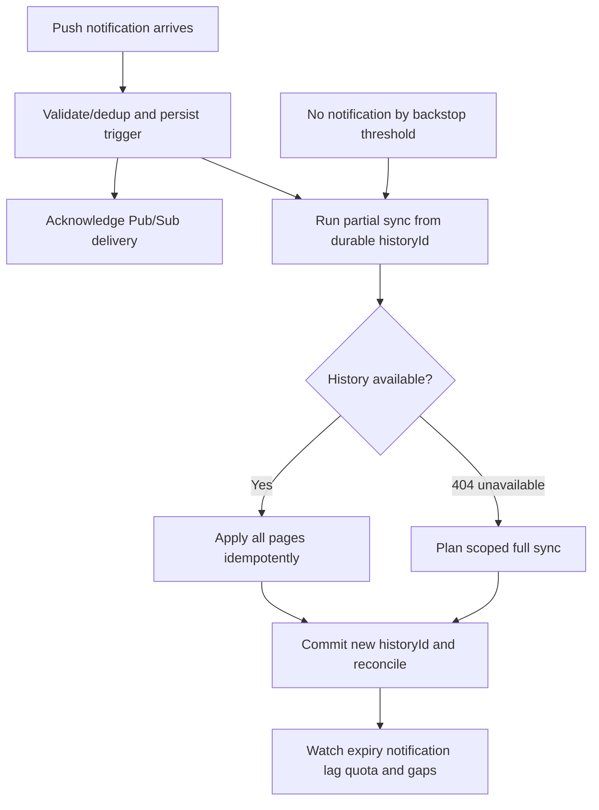

| Failure | Expected resilience |
|---|---|
| Duplicate Pub/Sub delivery | Dedup/idempotent partial sync |
| Notification delayed | History retrieves all changes from checkpoint |
| Notification dropped | Periodic backstop history call |
| Watch expired | Renewal monitoring/repair then sync gap |
| History ID too old | Controlled full sync |
| Pub/Sub push timeout | Redelivery; durable acceptance before ack |
| Notification loop/high rate | Avoid self-triggering changes; quota/rate monitoring |

## 20. Directory and Reports audit evidence

The Admin SDK Reports API exposes activity/usage reporting for supported Workspace applications under specific authorization scopes and API methods. Treat an activity record, Gmail history record, Admin audit log, Cloud audit log, Pub/Sub delivery log, and vendor connector log as different evidence planes.

| Evidence plane | Question answered |
|---|---|
| Workspace Admin audit | Who changed DWD/app/user/admin configuration? |
| Reports API activity | Which supported Workspace application activity occurred? |
| Gmail history | Which mailbox message/label changes occurred after history ID? |
| Cloud Audit Logs | Who changed project/service account/API/Pub/Sub/IAM? |
| OAuth/token errors | Did service identity/subject/scope token step succeed? |
| Pub/Sub metrics/logs | Did publisher/topic/subscription deliver/ack/retry? |
| Vendor logs | Did connector sync/process/checkpoint/write target? |

Audit availability, event types, retention, actor fields, and pagination vary. A no-result search is not proof of no action until API, time, application name/event, subject, retention, and role/scope are verified.

## 21. Pagination and checkpoints

Google APIs commonly return page tokens. Follow every token until absent; treat it as opaque. Record page ordinal/count/error and commit checkpoint only after the corresponding effects are durable. Do not log page tokens if they are treated as sensitive by the service/policy.

| Checkpoint | Scope | Invalid-recovery question |
|---|---|---|
| Directory page token | One list operation | Retry page or restart enumeration under contract? |
| Reports page token | One activity query | Is time range stable and complete? |
| Gmail historyId | Per mailbox | Is partial history still available? |
| Pub/Sub ack state | Per delivery | Was message durably accepted? |
| Vendor cursor | Per tenant/user/integration | Does it map exactly to source checkpoint? |

## 22. Quotas and backoff

Google Workspace APIs enforce quotas by project, user, method, or service. Gmail methods consume differing quota units. Quotas change; current project-specific limits and billing/policy must be checked. For time-based quota errors, Google recommends truncated exponential backoff with randomness and a maximum retry bound.

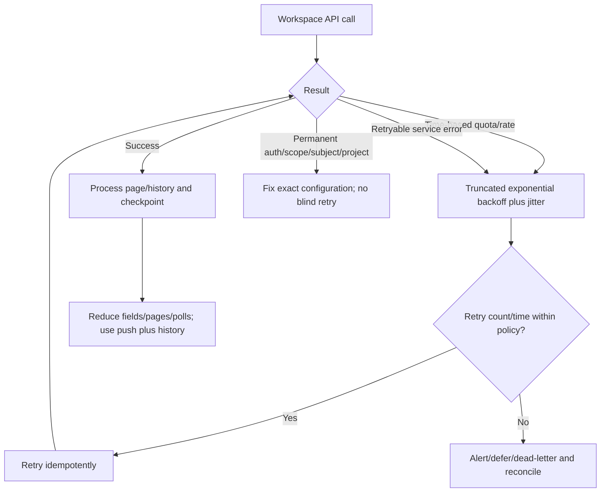

| Quota dimension | Support evidence |
|---|---|
| Per project | Project ID/number, aggregate rate/quota usage |
| Per user per project | Subject/mailbox, rate and method costs |
| Per method | Method class and quota units |
| Pub/Sub | Topic/subscription throughput/ack/redelivery |
| Watch notification rate | Per watched Gmail user |
| Daily/billing policy | Current project/account documentation |

## 23. OAuth/JWT and DWD error taxonomy

| Error/category | Likely cause | Safe evidence/next step |
|---|---|---|
| `unauthorized_client` | Client not DWD-authorized, wrong client ID, scope mismatch | Numeric client ID, DWD entry/scopes, propagation UTC |
| `access_denied` | Requested scope not authorized or service policy restriction | Requested versus DWD scope names and Admin policy |
| `admin_policy_enforced` | Workspace admin app-access policy blocks scopes/client | App controls audit/policy owner |
| `invalid_client` | Client/assertion configuration invalid | Project/client/service-account/key IDs and library error |
| `deleted_client`/disabled identity | OAuth client/key/service account removed/disabled | Lifecycle audit and IDs |
| `invalid_grant` invalid subject | User absent/wrong domain | Subject ID/status/domain |
| `invalid_grant` time | Clock/iat/exp issue | Server UTC/skew and error; no assertion |
| Invalid signature | Wrong/deleted/disabled key or assertion encoding | Key ID/status and Google library use |
| `invalid_scope` | Empty/typo/unsupported scope/audience | Exact documented scope names |

## 24. API and resource errors

| Result | Hypotheses | Evidence |
|---|---|---|
| 400 | Request/filter/page/watch schema | Method/error reason and safe field names |
| 401 | Token invalid/expired/wrong audience | Token metadata/error, client/key/subject |
| 403 | Scope, user privilege, Admin policy, API disabled, quota variant | Error reason, scopes, subject/admin role, project API |
| 404 on resource | Wrong ID/user/resource deleted/not visible | Stable IDs/customer/subject |
| 404 on history.list | startHistoryId outside available range | Mailbox checkpoint age and full-sync plan |
| 409/precondition | State/version conflict | Current resource/version and idempotency |
| 429/rateLimit | Quota/rate exceeded | Project/user/method usage and backoff |
| 5xx/backend | Temporary Google service issue | Request ID/error UTC, status dashboard, bounded retry |

## 25. Cross-platform transfer map: Microsoft to Google

Use analogy to accelerate learning, then respect differences.

| Microsoft concept | Rough Google learning bridge | Important difference |
|---|---|---|
| Entra tenant ID | Workspace customer/domain ID | Domain/customer/Cloud organization relationships differ |
| App registration | Google Cloud OAuth client/service account/project config | Object model and consent differ |
| Service principal | Service account/OAuth client plus Workspace authorization | No one-to-one tenant-local SP equivalent assumed |
| Application permission/admin consent | DWD client ID plus scopes | DWD impersonates explicit subject under current guidance |
| Microsoft Graph | Google Workspace APIs | Separate APIs/scopes/projects/quotas |
| Graph change notification/delta | Gmail watch/Pub/Sub/history | Per-mailbox watch/history semantics |
| Purview/Entra audit | Workspace Reports/Admin + Cloud audit | Coverage/retention/schema differ |
| Managed/workload identity | Google workload identity/service-account patterns | Platform-specific trust/credentials |

## 26. Worked example 1: API enabled, `unauthorized_client`

**Input:** Gmail API is enabled in the expected project, but delegated token acquisition returns `unauthorized_client`.

**Reasoning:** API enablement is not DWD authorization. Verify Workspace customer, service-account numeric client ID versus email, DWD entry, exact requested/authorized scopes, subject domain, propagation time, and project/service-account environment.

**Evidence:** Fictional customer/project IDs, service-account email/client ID, scope names, subject ID, DWD audit UTC, error and request UTC. No key/assertion/token.

**Result:** Synthetic admin entered the service-account email instead of numeric client ID. Correct under authorized admin process and wait/verify documented propagation; do not broaden scopes.

**Caveat:** The lab performs no Admin-console action.

## 27. Worked example 2: DWD and token succeed, Directory 403

**Input:** Token acquisition works with directory read-only scope, but a privileged Directory operation returns 403.

**Reasoning:** Check exact method's required scope, impersonated subject's admin privileges, object/resource scope, Admin app-control policy, service/account state, and whether the operation is read or write. A DWD scope does not make the subject super admin.

**Evidence:** Method class, scope names, subject stable ID/role class, target object type/ID, error reason, request ID/UTC.

**Result:** Subject lacks required role privilege. Governance owner chooses an appropriately scoped dedicated admin subject or redesign; no arbitrary super-admin impersonation.

**Caveat:** Current method docs determine exact requirements.

## 28. Worked example 3: Gmail notifications stop after a week

**Input:** Pub/Sub and connector are healthy, but one mailbox no longer receives Gmail notifications.

**Reasoning:** Compare per-mailbox watch expiration and renewal result, subject status, topic, publisher permission, label filters, last notification/history progress, and quota. Watch lifecycle is distinct from Pub/Sub subscription lifecycle.

**Evidence:** Subject ID, watch start/expiration/last renewal UTC, topic/subscription IDs, last Pub/Sub message ID/time, history IDs, and connector checkpoint.

**Result:** Watch was not renewed. Re-establish under approved process, run history/backstop from last durable ID if available, otherwise plan full sync, then reconcile.

**Caveat:** Do not assume renewing Pub/Sub subscription renews Gmail watches.

## 29. Worked example 4: Pub/Sub message arrives, no Gmail message found by that ID

**Input:** Engineer uses Pub/Sub message ID as a Gmail message ID and receives 404.

**Reasoning:** Pub/Sub message ID identifies notification delivery, not Gmail resource. Decode/interpret notification only within protected system to get mailbox/history context; use history retrieval to obtain Gmail message IDs/change types.

**Evidence:** Pub/Sub message ID, subscription, mailbox subject, notification history ID, saved history ID, retrieved Gmail resource IDs, all redacted/synthetic.

**Result:** Correct identifier map and connector correlation. No direct message lookup by Pub/Sub ID.

**Caveat:** Support artifacts should not contain the production notification body/email.

## 30. Worked example 5: `history.list` returns 404

**Input:** Connector resumes after an outage; partial Gmail sync returns 404 for the saved start history ID.

**Reasoning:** The history checkpoint is outside available history. Stop retrying the same ID. Calculate mailbox/user population, data range, scope/quota/privacy, current watch, target state, and full-sync recovery plan.

**Evidence:** Mailbox ID, saved checkpoint age, last successful sync, 404 reason/request UTC, current history/watch metadata, target count/version.

**Result:** Authorized bounded full sync, then commit fresh history ID and reconcile. Add checkpoint-age/backstop alerts.

**Caveat:** Full synchronization must retrieve only data required by purpose/policy.

## 31. Worked example 6: Rate errors create synchronized retry storm

**Input:** Thousands of mailbox workers retry at fixed one-second intervals after quota errors.

**Reasoning:** Correlate project/user/method quotas, method costs, retry timing, concurrency, full versus partial sync, notification loops, and checkpoint lag. Fixed retry synchronizes load.

**Evidence:** Project ID, method class, error reason, aggregate/per-user rates, backoff distribution, worker count, queue age, checkpoint lag.

**Result:** Truncated exponential backoff with jitter and max attempts, bounded per-user/project concurrency, method minimization, push-triggered partial sync, and reconciliation.

**Caveat:** Quotas and cost units change; use current project/API documentation.

## 32. Worked example 7: Google data fetched, vendor target remains empty

**Input:** Gmail history call returns changes successfully, but third-party target has no records.

**Reasoning:** Follow history pages, message/resource retrieval, filters, transform/schema, queue/DLQ, checkpoint commit timing, target authorization/write, and idempotency. Google-side success moves the fault boundary downstream.

**Evidence:** Request/page/history IDs, counts, connector operation/queue IDs, transform error, target correlation/status, and checkpoint before/after.

**Result:** Synthetic transform rejected an unknown label value and acknowledged upstream. Fix schema handling, replay idempotently, and reconcile before advancing checkpoint.

**Caveat:** Never paste Gmail content into the escalation.

## 33. Customer-safe evidence matrix

| Symptom | Minimum safe evidence | Never request |
|---|---|---|
| DWD auth | Customer/project, numeric client ID, scope names, subject ID/status, error UTC | Service-account JSON/private key/JWT |
| API 401/403 | API/method class, scopes, subject role class, request/error IDs | Access token/auth header |
| Directory gap | Object IDs/counts, page token presence/ordinal, filters | Full directory export |
| Gmail sync gap | Mailbox ID, watch/history/checkpoint metadata, counts | Message content/raw mailbox export |
| Pub/Sub issue | Project/topic/subscription/message IDs, ack/retry/latency | Push auth token/payload |
| Quota | Project/user/method error/retry metrics | Unlimited/manual retry |
| Audit gap | Application/event/time/actor ID, scope/retention/search metadata | Unrestricted audit export |
| Key rotation | Key IDs/status/last use/consumer version | Old/new private key |

## Troubleshooting decision tree

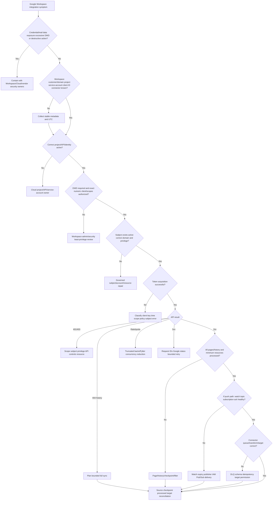

## 34. Common failure modes

| Failure mode | Why it fails | Better behavior |
|---|---|---|
| Workspace equals Cloud project | Different governance/data planes | Track customer/domain and project separately |
| Project IAM grants Gmail access | Cloud IAM is not Workspace DWD | Exact Workspace scopes/subject/API authorization |
| API enabled means authorized | Enablement is one gate | Client/DWD/subject/resource checks |
| Service account is a Workspace user | Machine identity belongs to project | DWD explicit subject for user data |
| DWD client uses service-account email only | Authorization correlates numeric client ID | Inventory both IDs |
| DWD is global super-admin access | Scope and subject/API rules constrain | Least scopes and governed subject |
| Pick super admin to fix 403 | Expands blast radius/hides requirement | Exact method and delegated privilege |
| Requested scope equals authorized scope | DWD/app controls can differ | Compare exact normalized scope lists |
| Broad full scopes for testing | Sensitive/restricted data exposure | Read-only/narrow method scopes |
| Cloud project owner can view key safely | Private key exposure is compromise | Keyless/secret manager and metadata only |
| Share service-account JSON with support | Grants reusable credential | Never request; rotate if exposed |
| Pub/Sub message ID is Gmail message ID | Different systems/namespaces | Notification history -> history.list -> message IDs |
| Notification contains full change | It is a trigger/history point | Retrieve history pages |
| One watch covers domain automatically | Gmail watch is per mailbox/user under model | Inventory per-subject coverage/expiration |
| Pub/Sub subscription renewal renews Gmail watch | Separate lifecycle | Track watch expiration/renewal |
| Push means no polling/reconciliation | Notifications can delay/drop | History backstop and reconciliation |
| Fixed retry after quota | Synchronized storm | Truncated exponential backoff+jitter |
| Retry old history ID forever | 404 means unavailable range | Controlled full sync |
| Commit history ID before processing | Skips failed changes | Commit effects and checkpoint safely |
| First page is all directory/mail | Collections paginate | Follow page tokens |
| Audit no result proves no action | Coverage/time/retention/scope gaps | Validate evidence prerequisites |
| Google-side 2xx means target complete | Connector middle can fail | Queue/transform/checkpoint/target evidence |
| Microsoft analogy is exact | Object/authorization models differ | Use analogy then official Google contract |
| Google status issue proves cause | Must match service/time/symptom | Contrarian local evidence |
| Generic Google model equals Abnormal | Proprietary implementation unknown | Approved product docs |

## 35. Escalation packet

| Section | Required content |
|---|---|
| Impact | Missing/excess/delayed data, affected users/resources, security/availability |
| Workspace | Customer ID/domain class, account/license/service state, admin policy |
| Cloud | Organization/project ID/number, environment, enabled API, quota class |
| Client identity | OAuth/service-account email and numeric client ID, active state, owner |
| DWD | Exact scope names, grant/change UTC, admin audit ID, purpose; no credentials |
| Subject | Stable user ID/domain/status/role class/resource access; no personal excess |
| Token | OAuth/JWT error, key ID/time/audience/API; no assertion/token |
| API | Method/resource class, HTTP/reason, request ID/UTC, pages/counts |
| Gmail/Push | Watch subject/expiration, topic/subscription/message ID, history IDs/ack |
| Connector | Connector/version/node, checkpoint, queue/DLQ, transform, target result |
| Audit/status | Workspace/Cloud audit IDs, Google status evidence and match |
| Privacy | No key/token/mail/payload/export; approved evidence location |
| Ask | Exact Workspace admin/Cloud owner/Google support/vendor Engineering decision |

## Safe synthetic lab: The Google Workspace Delegation Observatory 067

### Objective

Build a local paper model of a fictional Google Workspace integration spanning customer/domain, Cloud project, service account, DWD scopes, subject impersonation, Directory/Reports/Gmail APIs, Pub/Sub, watches, history checkpoints, quotas, audit, connector processing, and target reconciliation. The unique lab is **The Google Workspace Delegation Observatory 067**.

The lab creates no Google account, project, OAuth client, service account, key, DWD authorization, token, API request, Pub/Sub topic/subscription, Gmail watch, mailbox read, audit search, connector, or target change. All values are fictional metadata.

### Prerequisites

- Local Markdown editor or spreadsheet only.
- This Part and fictional IDs prefixed `GWCUST-067`, `GDOMAIN-067`, `GPROJECT-067`, `GCLIENT-067`, `GSA-067`, `GKEY-067`, `GSUBJECT-067`, `GWATCH-067`, `GPUBSUB-067`, `GHIST-067`, `GREQ-067`, `GCONN-067`, and `CASE-067`.
- Reserved text-only hosts under `example.test`; no real Google domains, API endpoints, admin URLs, Gmail addresses, or Cloud resource paths.
- No Google Workspace/Cloud/Admin/Gmail/Pub/Sub/Abnormal account, API client, local receiver, browser console, network request, service-account JSON, key, token, user, mailbox, or audit export.
- Artifact label: **local/public lab - synthetic Google Workspace integration metadata only**.
- Record start UTC, zero-live-system/data/credential statement, learned-architecture label, and source date August 24, 2026.

### Synthetic integration starter

| Workspace/project | Service account/client | DWD/subject | Gmail/connector state |
|---|---|---|---|
| `GWCUST-067-A` / `GPROJECT-067-PROD` | `GSA-067-A` / `GCLIENT-067-A` | Narrow scopes / `GSUBJECT-067-A` | Healthy |
| `GWCUST-067-B` / `GPROJECT-067-PROD` | Same vendor pattern, distinct grant | Missing scope | `access_denied` |
| `GWCUST-067-C` / `GPROJECT-067-PROD` | Disabled `GKEY-067-C` | Authorized scopes | Invalid signature |
| `GWCUST-067-D` / `GPROJECT-067-PROD` | Healthy identity | Valid subject | Expired watch/history gap |

### Lab steps

1. Create a cover with artifact label, UTC, safety boundary, Microsoft-transfer statement, Google learned-only statement, and Abnormal unknowns.
2. Define Workspace customer/domain, Cloud organization/project, OAuth client, service account, service-account email/client ID, Workspace user, DWD, scope, subject, API, Pub/Sub, watch, and history ID.
3. Draw Workspace, Cloud, OAuth, API, Pub/Sub, connector, and target ownership boundaries.
4. Build an identifier register with owner, namespace, stability, sensitivity, and support use.
5. Create four fictional Workspace customers mapped to project/client/service-account/DWD/subject/connector states.
6. Model Cloud project/API enablement separately from Workspace authorization.
7. Compare interactive OAuth, service account without DWD, and service account with DWD.
8. Build a service-account “is/is not” truth table and credential metadata inventory without values.
9. Model DWD authorization as numeric client ID plus exact scopes and an explicit subject per request.
10. Create six effective-authority cases combining scope, subject privilege, API method, Admin policy, service/account, and resource.
11. Classify 20 fictional scopes by API/resource, read/write, non-sensitive/sensitive/restricted category, business need, and verification owner.
12. Compare test and production projects, contacts, branding, verification, APIs, clients, quotas, Pub/Sub, and monitoring.
13. Map Directory users/groups/members/org units/domains/roles to read-only versus write risk.
14. Create Gmail message/thread/label/history/Pub-Sub identifier cards.
15. Model initial full Gmail sync with all pages, minimum fields, idempotent merge, and durable history checkpoint.
16. Model partial sync with history.list, every page, effects, and checkpoint commit.
17. Create old history 404 and calculate a bounded full-resync/privacy/quota plan.
18. Draw Gmail watch -> Pub/Sub topic -> subscription -> receiver -> queue -> history -> target flow.
19. Inventory per-mailbox watch start history ID, filter, expiration, renewal, last notification, and checkpoint progress.
20. Create duplicate, delayed, dropped, timeout/redelivery, high-rate/drop, and watch-expiry notification cases.
21. Build a no-notification backstop and source-target reconciliation ledger.
22. Separate Workspace Admin/Reports, Gmail history, Cloud audit, OAuth errors, Pub/Sub logs, and vendor logs by vantage point.
23. Model page tokens/history IDs/ack/checkpoints as separate state.
24. Create per-project/per-user/per-method quota cards and truncated backoff+jitter decisions.
25. Classify OAuth/DWD errors and API 400/401/403/404/429/5xx cases.
26. Map Microsoft concepts to Google only as learning bridges and record differences.
27. Run the troubleshooting tree on wrong DWD client ID, subject 403, watch expiry, ID confusion, old history, retry storm, and downstream transform failure.
28. Draft two customer updates and three escalation packets for Workspace admin, Cloud owner/Google support, and vendor Engineering.
29. Deliver a 90-second DWD explanation, 90-second Gmail push/sync answer, and 60-second honesty boundary.
30. Validate source URLs/date, cleanup, privacy, zero-activity statement, and rubric.

### Expected evidence

- Google Workspace/Cloud/OAuth/API/Pub-Sub/vendor boundary diagram.
- Identifier register and four-customer integration map.
- Project enablement versus Workspace authorization model.
- Interactive/service-account/DWD comparison and truth table.
- DWD effective-authority cases and 20-scope review.
- Test/production ownership and credential metadata inventory.
- Directory resource/permission matrix.
- Gmail resource and identifier map.
- Full/partial sync and old-history recovery plans.
- Per-mailbox watch and Pub/Sub delivery workbook.
- Reliability/backstop/reconciliation cases.
- Audit-vantage and checkpoint-state maps.
- Quota/backoff and error taxonomy.
- Microsoft-to-Google bridge with differences.
- Seven troubleshooting cases, two customer updates, and three escalations.
- Source ledger dated **August 24, 2026**.
- Spoken Microsoft-transfer, Google-learned, and Abnormal-unknown statements.

### Cleanup and privacy

- Confirm every customer, domain, project, OAuth client, service account, key, subject, API request, watch, Pub/Sub resource/message, history ID, mailbox/message, audit event, connector, and case is fictional and includes `067`.
- Confirm all hosts use `example.test` and no valid Google domain, email, client ID, project path, API endpoint, token, JWT, key, JSON credential, scope grant, Pub/Sub payload, Gmail data, or request exists.
- Remove real customer/domain/project/client/service-account/user IDs, scope lists, mail addresses/content, Pub/Sub resources, history IDs, audit records, request IDs, screenshots, and logs.
- Confirm no Google Workspace/Cloud/Admin/Gmail/Pub-Sub/Abnormal console, account, API client, receiver, or network request was used.
- Delete the artifact if credential, mailbox data, audit data, or customer identity cannot be reliably removed.
- Record cleanup UTC and: `Synthetic paper Google Workspace integration exercise only; zero live customer, project, OAuth client, service account, DWD grant, subject impersonation, key, token, API request, Pub/Sub resource, Gmail watch, mailbox data, audit search, connector, or production activity.`

### Validation rubric

| Dimension | Fail | Developing | Pass |
|---|---|---|---|
| Planes | Workspace equals project | Names both | Customer/domain, project, OAuth, API, Pub/Sub, vendor ownership separated |
| Identity | Email only | Knows service account | Client ID/email/key ID/project/customer/subject namespaces |
| DWD | “Full domain access” | Lists scopes | Numeric client + exact scopes + subject + API/resource/policy intersection |
| Security | Uses JSON key | Says protect key | Keyless preference/metadata-only/rotation; no values |
| Gmail | Notification equals message | Knows history | Watch expiry, Pub/Sub ID, mailbox history, full/partial sync, durable checkpoint |
| Reliability | Push is complete | Adds retry | Ack/idempotency/delay/drop/backstop/404 full sync/reconcile |
| Quota | Fixed retry | Backoff | Per-project/user/method, truncated backoff+jitter, bounded concurrency |
| Evidence | Raw mail/audit | Some redaction | Stable metadata/IDs/counts/UTC; no token/key/content/export |
| Troubleshooting | Regrant all | Checks DWD | Project-to-target decision tree and precise owner asks |
| Honesty | Claims Google ops | Says studied | experience transfer, Google learned lab, Abnormal unknown |

## 36. Official Source Anchors

All sources were verified and recorded with guide currency date **August 24, 2026**. Google changes APIs, quotas, OAuth policies, scope classifications, Admin interfaces, and product availability. Revalidate current method documentation and organization/project configuration before production work.

| Official source | What it anchors | Boundary |
|---|---|---|
| [Google Identity - OAuth 2.0 for server-to-server applications](https://developers.google.com/identity/protocols/oauth2/service-account) | Service accounts, DWD, numeric client/scopes, subject impersonation, libraries, OAuth/JWT errors | Do not use code samples here as a live lab |
| [Google Workspace Admin Help - Control API access with domain-wide delegation](https://knowledge.workspace.google.com/admin/apps/control-api-access-with-domain-wide-delegation) | Current admin DWD authorization/review concepts | Admin UI/policy changes; super-admin action required |
| [Google OAuth production policy compliance](https://developers.google.com/identity/protocols/oauth2/production-readiness/policy-compliance) | Separate projects, owners/contacts, minimum scopes, verification, secure domains | Vendor compliance responsibility |
| [Google Workspace - Configure OAuth consent and choose scopes](https://developers.google.com/workspace/guides/configure-oauth-consent) | Scope categories, consent configuration, minimum scopes, review/security assessment | Internal/external and API-specific rules vary |
| [Admin SDK Directory API - Choose scopes](https://developers.google.com/workspace/admin/directory/v1/guides/authorizing) | Directory resource read/write scope separation | Exact API method documentation controls |
| [Admin SDK Reports API - Authorization/scopes](https://developers.google.com/workspace/admin/reports/v1/guides/authorizing) | Reports/audit authorization concepts | Retrieved page currently redirects to general scope guidance; verify API reference |
| [Gmail API - Synchronize clients](https://developers.google.com/workspace/gmail/api/guides/sync) | Full/partial sync, history.list, recent history ID, 404/full-sync recovery | Scope/data-retention design required |
| [Gmail API - Configure push notifications](https://developers.google.com/workspace/gmail/api/guides/push) | Pub/Sub topology, watch/history/expiration, acknowledgement, rate/reliability/backstop | Per-mailbox watch; Pub/Sub has separate controls |
| [Gmail API - Usage limits](https://developers.google.com/workspace/gmail/api/reference/quota) | Current project/user/method quota model and truncated exponential backoff | Quotas/pricing changed in 2026 and can change again |

### Source-use discipline

- Use Google-supported auth/client libraries; do not hand-roll JWT signing.
- Treat Cloud IAM, API enablement, Workspace DWD, OAuth scopes, subject authority, and API resource policy separately.
- Verify exact scope and method requirements in current API docs.
- Never request service-account JSON/private key, access token, Gmail content, Pub/Sub payload, or unrestricted audit export.
- Design push as a trigger for history sync plus backstop/reconciliation.
- Keep Abnormal's Google project, client, scopes, subjects, APIs, Pub/Sub, and logs explicitly unknown.

## Likely Interview Questions

### Q1. How do Google Cloud and Google Workspace differ in an integration?

**Model answer:** The Cloud project owns enabled APIs, OAuth clients/service accounts, credentials or workload trust, IAM, quota, and Pub/Sub resources. The Workspace customer owns users, Gmail data, Admin API controls, app access policy, and DWD authorization. Cloud IAM or API enablement does not automatically grant Workspace data; both planes plus OAuth subject/resource authorization must align.

### Q2. What is domain-wide delegation?

**Model answer:** A Workspace super administrator authorizes a service account's numeric OAuth client ID for exact scopes. The application authenticates that service account and explicitly impersonates a Workspace user when requesting access. Effective access is constrained by scopes, subject privileges, API/resource rules, service/account state, and Admin policy. It is not an unrestricted all-domain switch.

### Q3. What evidence would you collect for a DWD authorization failure?

**Model answer:** Workspace customer/domain, Cloud project ID/number, service-account email and numeric client ID, key/trust ID and state, exact requested versus authorized scope names, subject stable ID/domain/status/role class, API/method, OAuth error, request/correlation, and UTC. I never request the JSON key, private key, JWT assertion, or access token.

### Q4. Explain Gmail push notifications and history synchronization.

**Model answer:** A per-mailbox Gmail watch publishes change notifications to a Cloud Pub/Sub topic; a Pub/Sub subscription delivers to the connector. The notification provides mailbox/history context, not the complete message. The connector uses its last durable history ID with history.list, processes every page idempotently, and commits a new history ID. Watches expire; notifications can delay/drop, so a periodic backstop is required.

### Q5. Why is a Pub/Sub message ID not a Gmail message ID?

**Model answer:** They belong to different namespaces. Pub/Sub message ID identifies delivery of the notification. Gmail message ID identifies a mailbox message resource. The notification points to a mailbox history state; history.list returns change records and Gmail resource IDs. I track all three separately.

### Q6. What should happen when Gmail history.list returns 404 for startHistoryId?

**Model answer:** Stop retrying that stale checkpoint. The history is outside the available range, so plan an authorized, privacy- and quota-bounded full synchronization, obtain a fresh durable history ID, reconcile source and target, and improve checkpoint-age/watch/backstop monitoring.

### Q7. How should a Google Workspace connector handle rate limits?

**Model answer:** Identify per-project, per-user-per-project, method, watch, and Pub/Sub limits. Use truncated exponential backoff with jitter and a maximum retry policy, bounded concurrency, minimum methods/fields, push-triggered partial sync rather than repeated full scans, queue/lag monitoring, and reconciliation. Current project/API quotas must be rechecked.

### Q8. What are your Google Workspace experience boundaries?

**Model answer:** My Google Workspace integration knowledge is learned from current official documentation and a metadata-only paper lab. My production strength is enterprise support, identity, service boundaries, RCA, escalation, and customer communication. I do not claim Google admin/DWD/Gmail API operations, and Abnormal's Google integration remains unknown without approved docs.

## Memory Hooks

- **Workspace owns user data; Cloud project owns the application machinery.**
- **Cloud IAM is not Workspace domain-wide delegation.**
- **API enabled is not API authorized.**
- **Service account is a workload, not a Workspace user.**
- **DWD equals numeric client ID plus exact scopes plus explicit subject.**
- **Scope defines the job; subject supplies delegated authority.**
- **Use read-only/narrow scopes and current verification rules.**
- **Never share the service-account JSON/private key.**
- **Directory, Reports, Gmail, Cloud audit, and Pub/Sub are separate planes.**
- **Pub/Sub message ID is not Gmail message ID.**
- **Watch expires; Pub/Sub subscription does not renew it.**
- **Push wakes; history.list explains changes.**
- **Commit effects before advancing history ID.**
- **404 old history means controlled full sync, not infinite retry.**
- **Notifications can delay/drop; backstop reconciliation closes gaps.**
- **Quota is project/user/method specific; back off with jitter.**
- **Prior-role work is production transfer; Google is learned architecture.**

## Completion Checklist

- [ ] I can state the Section goal and project-DWD-subject-checkpoint rule.
- [ ] I can separate Workspace customer/domain and Google Cloud organization/project.
- [ ] I can inventory project, OAuth client, service-account email/client ID/key ID, subject, and connector IDs.
- [ ] I can explain why Cloud IAM/API enablement does not grant Workspace data.
- [ ] I can compare interactive OAuth, service account, and DWD.
- [ ] I can explain DWD as client ID plus exact scopes plus explicit subject.
- [ ] I can explain scope/subject/API/policy/license/resource effective authority.
- [ ] I can discuss sensitive/restricted scope verification and least privilege.
- [ ] I can protect service-account credentials and use metadata-only evidence.
- [ ] I can map Directory resources to read-only/write scope risk.
- [ ] I can distinguish Gmail message/thread/label/history and Pub/Sub IDs.
- [ ] I can explain full sync, partial history sync, durable checkpoints, and 404 recovery.
- [ ] I can trace Gmail watch, Pub/Sub topic/subscription, receiver, history, and target.
- [ ] I can track per-mailbox watch expiration/renewal separately from Pub/Sub.
- [ ] I can design duplicate/delay/drop/rate/backstop/reconciliation resilience.
- [ ] I can separate Workspace Reports/Admin, Gmail history, Cloud audit, Pub/Sub, and vendor logs.
- [ ] I can reason about project/user/method quotas and truncated backoff with jitter.
- [ ] I can classify OAuth/DWD and API errors without credentials.
- [ ] I completed or can explain **The Google Workspace Delegation Observatory 067**.
- [ ] The lab includes Prerequisites, Expected evidence, Cleanup and privacy, and Validation rubric.
- [ ] I used no live Google project, DWD, subject, key, token, API, Pub/Sub, Gmail, audit, or connector.
- [ ] I can state experience transfer, Google learned, and Abnormal unknown boundaries.
- [ ] I checked Official Source Anchors and recorded **August 24, 2026**.
- [ ] I can answer exactly Q1-Q8.

[Next: Part 068 - Slack and Zoom Integration Learning Lab](Part-068-slack-and-zoom-integration-learning-lab.md)