# Part 068 - Slack and Zoom Integration Learning Lab

## Section goal

This Part builds a beginner-friendly comparison of Slack and Zoom integrations for support work. It is explicitly **learned architecture plus a synthetic paper lab**. You must not claim production administration of Slack Enterprise Grid, Slack app installations, Zoom Marketplace apps, Zoom account integrations, OAuth tokens, event subscriptions, Audit Logs APIs, or webhook endpoints unless a real experience supports it.

Slack and Zoom both support OAuth applications, scopes, APIs, event subscriptions, webhooks, signatures, administrative controls, audit/integration evidence, and rate limits. Those shared nouns can hide important differences. A Slack app can be installed to a workspace or, for supported use cases, an Enterprise organization; tokens can represent a bot, user, app, workflow, configuration, or other supported actor. Slack Events API visibility depends on installation, token actor, granted scopes, workspace/Enterprise context, event subscription, object/channel visibility, and lifecycle state.

A Zoom app can be user-managed or admin-managed, and Zoom provides account authorization, user authorization, server-to-server account access, and other use cases under current app models. Event subscriptions select products/events and can cover all account users, master/subaccounts, app installers, or programmatically selected users/accounts depending on supported configuration. Zoom app scopes control API/event information. Webhook endpoint validation and periodic revalidation are separate from actual event processing.

Both platforms require the receiver to authenticate webhook requests using the platform's current profile, preserve exact request bytes as required, check timestamps/replay, acknowledge quickly, queue work, process idempotently, and reconcile source to target. Delivery retry rules differ. Slack expects a 2xx within three seconds, supplies retry number/reason headers, and can temporarily disable subscriptions after sustained failures. Zoom expects 200/204 within three seconds, retries selected server/connection failures on a documented schedule, and does not retry ordinary 3xx or 4xx results. Zoom periodically revalidates endpoint URLs and can disable event delivery after repeated validation failures.

The central support rule is:

> Identify platform organization/account, app, installation/management type, token actor, granted scopes, event subscription and visibility, webhook validation/signing profile, delivery attempt, queue/processing state, audit/admin evidence, rate-limit state, and target result before changing scopes, tokens, app approval, subscriptions, endpoints, or customer data.

This Part covers Slack workspace/Enterprise/app installation, bot/user/app token concepts, scopes, event envelopes, visibility, shared-channel context, Events API HTTP/Socket Mode, signed requests, retries, rate limits, app lifecycle, integration logs, and Enterprise Audit Logs. It covers Zoom account/user/app management types, server-to-server versus user/account authorization, scopes, event subscriptions, endpoint challenge-response/revalidation, signed webhook requests, delivery/retries, webhook logs, deauthorization, OAuth errors, and rate-limit concepts. It provides no app creation, OAuth URL, client secret, signing secret, token, endpoint, API request, Socket Mode connection, Zoom webhook challenge, or customer content. Abnormal's Slack/Zoom app types, scopes, events, install path, tokens, webhook endpoints, reconciliation, and logs remain proprietary unknowns unless approved documentation states them.

## Learning outcomes

After completing this Part, you should be able to:

- distinguish Slack Enterprise organization, workspace/team, app, installation, bot user, human user, channel, and shared channel;
- distinguish Slack app ID, enterprise ID, team ID, user ID, channel ID, event ID, event context, authorization, and token type;
- explain Slack bot versus user token authority and why event visibility is perspectival rather than “all workspace data” by default;
- explain Slack required versus optional/additive scopes, app approval, org/workspace installation, revocation, and reauthorization;
- trace Slack Events API URL verification, HTTP versus Socket Mode, signed-request validation, replay window, event acknowledgement, retry headers, failure disabling, delayed events, event rate limiting, and idempotency;
- explain Slack Audit Logs API Enterprise scope and actor-action-entity-context records, plus workspace integration logs for app/service changes;
- distinguish Zoom account, user, app ID/client ID, admin-managed/user-managed general app, server-to-server OAuth app, event subscription, webhook endpoint, and app deauthorization;
- explain Zoom account/user/server-to-server authorization concepts and avoid mixing the wrong grant/token owner with an endpoint;
- map Zoom scopes to API methods and event types under least privilege;
- trace Zoom endpoint validation, 72-hour revalidation, secret-token request signature, request timestamp, event timestamp, delivery acknowledgement, selected retries, and webhook logs;
- distinguish Slack and Zoom request signing even though both use version/timestamp/body HMAC profiles;
- design secure secret rotation conceptually without logging either old or new secret;
- compare platform event time, dispatch time, request timestamp, receive time, processing time, and target time;
- classify installation, missing-scope, invalid-auth/token, disabled/revoked app, wrong workspace/account, subscription, endpoint, signature, 3xx/4xx/5xx, and rate-limit failures;
- build a permission-to-event and event-to-effect map for both platforms;
- collect customer-safe IDs/status/error/timeline evidence without message/chat/meeting/recording content or credentials; and
- state Slack/Zoom learned-only experience and production-transfer strengths honestly.

## JD Mapping

| Supplied role signal | Capability built | Your transferable evidence | Boundary |
|---|---|---|---|
| Slack and Zoom ecosystem | Learns account/workspace, apps, scopes, events, audit, and support touchpoints | Microsoft SaaS/identity transfer | No production Slack/Zoom claim |
| Enterprise integrations | Traces install/authorization, event delivery, processing, and target | REST/JSON/cloud troubleshooting | Product profile differs |
| SaaS Security | Least scopes, bot/user/account identity, signing secrets, token lifecycle, audit | Identity/security habits | No app administration claim |
| Webhook support | Applies exact-byte signature, replay, ack, retry, queue, idempotency, reconciliation | Part 065 foundation | No live receiver |
| Complex cases | Separates event not eligible, not attempted, not received, not processed, not reflected | critical situation/RCA/escalation | Synthetic cases only |
| Customer communication | Requests stable IDs, event names, status, UTC, not content/secrets | Privacy-aware support | Chat/meeting content excluded |
| Admin evidence | Uses Slack audit/integration and Zoom webhook/app logs at correct scope | Microsoft audit transfer | Plan/retention availability varies |
| Cross-functional work | Routes platform admin, app owner, network, security, vendor Engineering asks | Microsoft collaboration | Current platform docs govern |

## Candidate honesty note

| Evidence tier | Safe statement | Do not imply |
|---|---|---|
| **Production transfer - Microsoft** | “I transfer enterprise identity, permissions, API, webhook, audit, service-health, RCA, and customer communication practices.” | That Slack/Zoom objects map one-to-one to Microsoft |
| **Local/public lab** | “I built a synthetic Slack/Zoom installation-event-delivery comparison with no app or endpoint.” | A real install, token, event subscription, or webhook |
| **Learned architecture - Slack/Zoom** | “I verified behavior against current official developer docs.” | Platform administrator/developer production experience |
| **Security boundary** | “I reason from secret/token IDs and validation stages only.” | Handling a real signing/client secret or token |
| **Proprietary unknown** | “Abnormal's Slack/Zoom integrations require approved docs for exact scopes, events, app types, and evidence.” | Public docs reveal Abnormal configuration |

Safe interview language:

> “My Slack and Zoom integration knowledge is current-doc and lab based. For Slack I would identify enterprise/workspace/app/installation IDs, bot or user actor, granted scopes, event subscription/visibility, event ID, retry headers, and integration/audit evidence. For Zoom I would identify account/app/management and authorization type, scopes, event subscription/receiver scope, endpoint validation state, request/event IDs, retry and webhook logs. For either platform I would never request an OAuth token, client/signing secret, raw chat, meeting, recording, or webhook payload.”

## 1. Shared integration pipeline, different contracts

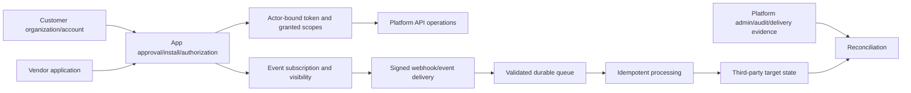

| Shared checkpoint | Slack owner/model | Zoom owner/model |
|---|---|---|
| Customer boundary | Enterprise org/workspace/team | Zoom account/master/subaccount/user |
| App identity | Slack app ID | Zoom app/client ID |
| Installation | Workspace/org installation and authorizing user/bot | Admin/user-managed app addition or server-to-server account app |
| Token actor | Bot/user/app/workflow/configuration as supported | Account/user/client authorization as supported |
| Permission | Bot/user scopes and object visibility | Zoom product/method/event scopes |
| Event config | Workspace/bot events, HTTP or Socket Mode | Event subscriptions and receiver scope |
| Request proof | Slack signing secret/timestamp/raw request | Zoom secret token/timestamp/raw request profile |
| Delivery evidence | Retry headers/app/integration evidence | Request/trace IDs and webhook logs |
| Admin audit | Enterprise Audit Logs/integration logs as available | Marketplace/account/admin logs as available |

## 2. Slack organization and workspace model

A Slack **workspace** (historically team) is identified by a team ID. Enterprise Grid can group multiple workspaces under an Enterprise organization ID. An app can have installation/authorization contexts involving enterprise, team, and user IDs. Some fields may be absent depending on installation type. Shared channels can cross workspace boundaries, so context and data ownership require care.

| Slack object | Identifier pattern concept | Support use |
|---|---|---|
| Enterprise organization | Enterprise ID | Org installation/audit/shared context |
| Workspace/team | Team ID | Primary installation/event namespace |
| Slack app | App ID/API app ID | Vendor app identity |
| Installation/authorization | Enterprise + team + user combination as applicable | Event visibility/token ownership |
| Human or bot user | User ID | Actor/authorization |
| Channel/conversation | Channel ID | Membership/visibility/resource |
| Event | Event ID and event context | Dedup/correlation/authorization lookup |
| Message/object | Platform-specific ID/timestamp | Resource correlation, not public content |

## 3. Slack app installation is tenant-specific

OAuth installation binds the app to a selected workspace or supported Enterprise organization and returns installation metadata/tokens/scopes. A successful installation for one workspace does not authorize another. Verify the connecting enterprise/workspace against the customer's expected managed account to prevent personal or wrong-workspace linkage.

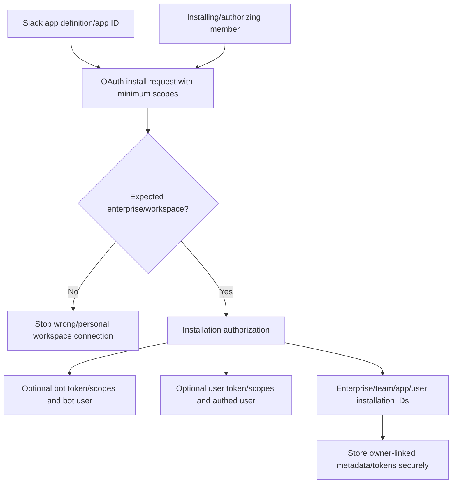

## 🔍 Plain-English deep-dive: The app listing is a product model; each installation is a local lease

A software vendor can publish one product model, but every customer signs a separate lease for a specific office. Each lease names the office, approved access, local users, and cancellation terms. A lease in Office A does not open Office B.

A Slack app ID identifies the application, while each workspace/Enterprise installation creates a customer-specific authorization with granted scopes and tokens. A Zoom app similarly has account/user authorization instances. Support must not search by app name alone or assume one customer's grant applies elsewhere.

The analogy stops because installations can have bot and user actors, optional scopes, org deployment, and API-specific rules. The lesson is exact: track customer boundary ID, app ID, installation/authorization owner, actor token type, granted scopes, created/revoked UTC, and connector ID.

**Memory cue:** One app definition, many customer-specific installations.

## 4. Slack token types and authority

Slack token types have different actors and APIs. Bot tokens represent a bot associated with an app installation and are not tied to a human installer identity in the same way as user tokens. User tokens act as the authorized user within their visibility and scopes. App-level tokens address app-wide features, not ordinary Web API access by default. Workflow/configuration/service tokens have specialized lifecycles and purposes.

| Slack token | Represents | Typical use boundary | Main support risk |
|---|---|---|---|
| Bot token | App's bot user in installation | Bot API methods/events under granular scopes/membership | Assume bot sees every channel |
| User token | Workspace member | Acts as user under scopes and user visibility | Human lifecycle/revocation/excess access |
| App-level token | App across organizations for specific APIs | Socket Mode/app-level operations | Use as Web API token incorrectly |
| Workflow token | Short-lived workflow context | Workflow functions/borrowed visibility constraints | Assume durable or full user impersonation |
| Configuration token | User/workspace app configuration context | Manifest/app config APIs | Confuse with installed app token |
| Service token | Specialized Slack CLI/Deno use | Platform-specific management | Long-lived/non-rotatable risk under current model |

## 🔍 Plain-English deep-dive: Token type chooses whose eyes and hands the app borrows

A building robot has its own badge and can enter rooms assigned to the robot. A human assistant's badge represents that person and can open rooms the person is allowed to enter. A facilities badge configures robots but is not the badge used to deliver packages. The badges can look similar but carry different identities and jobs.

Slack bot tokens act as the bot; user tokens act as the user; app-level/configuration/workflow tokens serve narrower platform purposes. Scope names and channel membership/visibility then constrain what each actor can see or do. A missing private-channel event can be correct if the bot is not a member even when an app scope sounds broad.

The analogy stops because Slack's exact token prefixes, scope rules, borrowed visibility, and Enterprise behavior are platform contracts. The support lesson is to inventory token type, owner installation, enterprise/team/user/bot IDs, scopes, channel visibility, lifecycle, and API method.

**Memory cue:** Token type selects the actor; scopes and object visibility bound the action.

## 5. Slack scopes: requested, granted, optional, additive

Slack apps request bot scopes and/or user scopes. Required and optional scopes can be governed by admins/users. The installation response shows granted scopes; optional scopes can be absent and features must degrade gracefully. Reinstalling/requesting additional scopes can add permissions. Removing scopes from an existing token generally requires revocation/reauthorization rather than assuming the app configuration change shrinks an issued token.

| Scope state | Meaning | Support check |
|---|---|---|
| Configured in app | App can request/review it | Not proof installation has it |
| Required | Needed for app's core install under design | Justify minimum |
| Optional | Customer/user can grant subset where supported | Feature must handle absence |
| Requested in OAuth | Proposed for this authorization | Check workspace/user selected |
| Granted on token | Current token privilege | Use response headers/metadata, no token value |
| Added later | Reauthorization expanded grant | Audit timeline and risk review |
| Removed from app config | Future/config intent | Existing token may retain until revoked |

## 6. Slack event visibility intersection

An event type subscription alone is insufficient. Events API uses OAuth permissions and actor visibility. The app receives events visible to an authorized user or bot under scopes and channel/resource access. Shared-channel/external contexts add enterprise/team context.

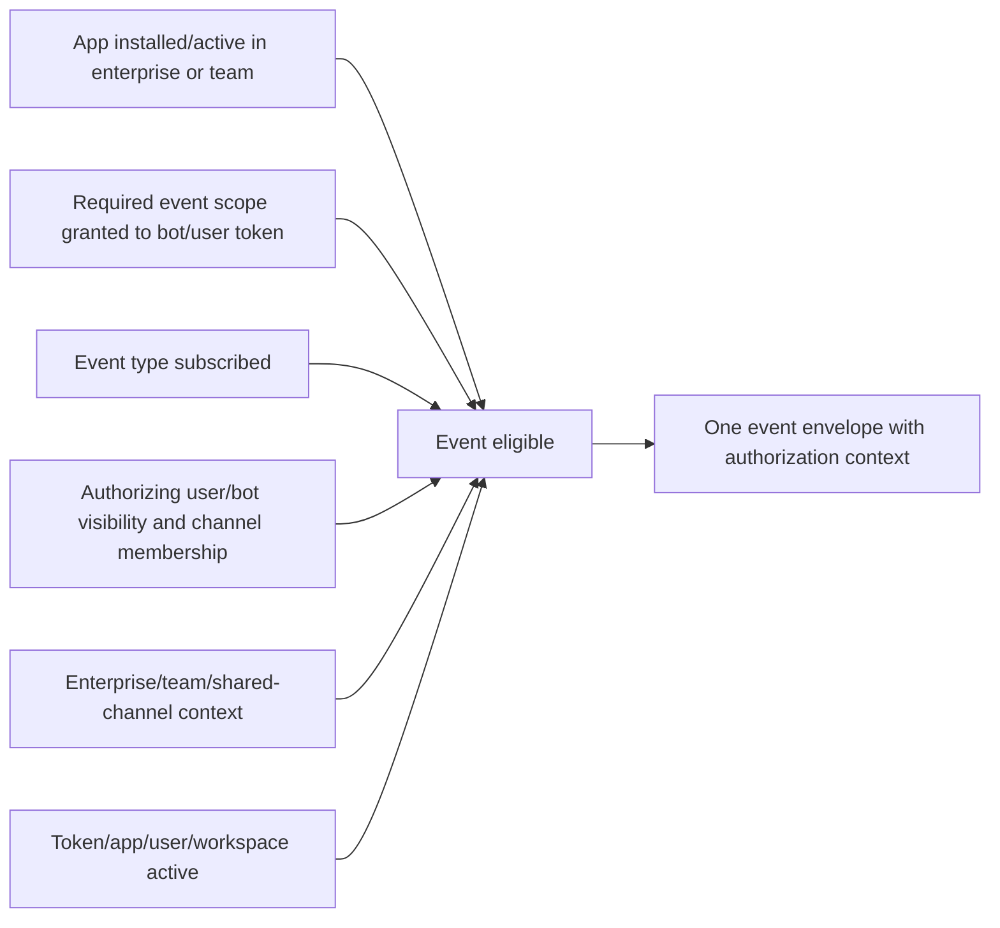

| Missing Slack event question | Why |
|---|---|
| Correct app ID? | Multiple apps/environments can share endpoint |
| Correct team/enterprise context? | Wrong workspace or org install |
| Event type configured? | Subscription eligibility |
| Corresponding scope granted to actor token? | Permission eligibility |
| Bot/user can see resource? | Perspective/membership |
| App/token/user active? | Revocation/uninstall/deactivation stops events |
| Subscription temporarily disabled? | Delivery failure threshold |
| Event rate limited/delayed? | Best-effort delivery and rate conditions |

## 🔍 Plain-English deep-dive: An event subscription chooses a news topic, not every newspaper edition

A reader can subscribe to “building notices,” but the office still delivers only notices for buildings the reader is authorized to enter. Selecting the topic does not add the reader to private offices or reveal notices from another company. If the reader changes offices or loses a badge, the visible set changes even though the topic subscription remains.

Slack event subscriptions behave similarly. The selected event type identifies the kind of activity the app wants. The installed bot or user token must have the corresponding scope, and that actor must be able to see the channel/resource in the enterprise/workspace context. Shared channels and multiple authorizations add context; they do not erase visibility rules.

The analogy stops because Slack sends event envelopes with app/team/authorization identifiers and platform-specific event semantics. The support lesson is to verify event type, granted actor scope, channel/resource membership, enterprise/team context, app/token lifecycle, and delivery state separately.

**Memory cue:** Subscription chooses the topic; actor visibility chooses the edition.

## 7. Slack Events API delivery modes

Slack supports a public HTTP request URL and Socket Mode. HTTP requires an Internet-reachable HTTPS endpoint and signed-request validation. Socket Mode uses a WebSocket connection authorized by an app-level token and can avoid an inbound public endpoint, but connection, acknowledgement, reconnection, and app-level token lifecycle remain.

| Mode | Transport | Authentication/validation | Main operations concern |
|---|---|---|---|
| HTTP Events API | Slack POST to request URL | Slack request signature/timestamp or supported mTLS profile | TLS/DNS/3-second response/retries |
| Socket Mode | App WebSocket connection | App-level token plus envelope acknowledgement | Connection lifecycle/reconnect/scaling |
| Web API | App calls Slack methods | Bot/user token in Authorization header | Method scopes/rate limits/errors |
| Incoming webhook | App posts to a specific authorized destination | Secret webhook URL | URL is credential; distinct from Events API |

## 8. Slack URL verification and event envelope

During HTTP request-URL configuration, Slack sends a URL-verification callback/challenge under its current protocol. Production event callbacks have an outer envelope and inner event. The deprecated verification token should not replace signed-request verification.

| Slack field | Meaning |
|---|---|
| Outer `type` | Callback type such as event callback or URL verification |
| `team_id` | Workspace where event occurred/context |
| `api_app_id` | Slack app intended recipient |
| `event_id` | Globally unique event identifier under current docs |
| `event_context` | Event/authorization lookup context |
| `event_time` | Dispatch-time epoch seconds |
| `authorizations` | One visible installation context; not necessarily all |
| Inner `event.type` | Actual subscribed event type |
| Inner `event_ts`/`ts` | Event/object timestamps with event-specific semantics |
| Shared/context IDs | Enterprise/team/shared-channel delivery context |

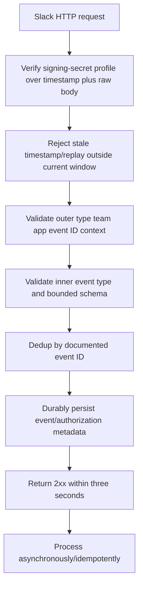

## 9. Slack request signing and replay

Slack's current HTTP profile includes request timestamp and signature headers. The receiver obtains the raw body before deserialization, uses the app signing secret with the documented version/timestamp/body construction via maintained SDK/library, compares safely, and checks that the request time is recent (the official example uses five minutes). This guide never computes a signature.

| Validation evidence | Record | Never record |
|---|---|---|
| Signing profile/version | Header name/version and validation stage | Signing secret |
| Request timestamp | UTC/skew/freshness result | Full signature if policy forbids |
| Raw body | Length/fingerprint only | Chat/event payload in ticket |
| App ID | Expected versus received app ID | OAuth client secret |
| Team/enterprise | Expected customer context | Customer message content |
| Result | Pass/fail/error category | Token/signing basestring |

## 10. Slack acknowledgement, retries, and disabling

Slack expects HTTP 2xx within three seconds. Slow business logic should be queued. Slack documents three retries with increasing intervals and retry number/reason headers for timeout, connection, SSL, non-2xx, redirects, and other failure classes. Sustained high failure can temporarily disable subscriptions; delayed-event behavior is configurable/current-doc dependent.

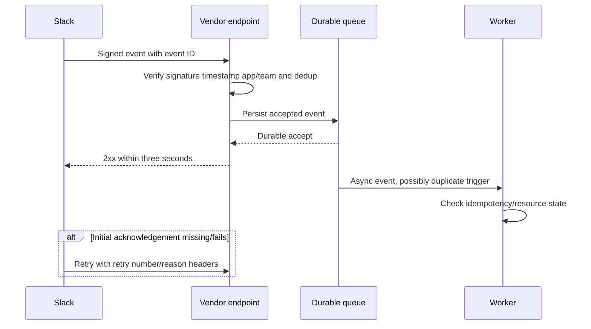

| Slack retry reason class | First hypothesis |
|---|---|
| `http_timeout` | Handler exceeded three seconds/queue unavailable |
| `connection_failed` | DNS/network/endpoint reachability |
| `ssl_error` | Certificate/TLS chain/hostname |
| `http_error` | Non-2xx response/auth/schema/rate behavior |
| Too many redirects | Route/proxy configuration |
| Unknown | Correlate event ID/retry/edge logs and escalate |

## 11. Slack event rate and Web API rate limits

Events API currently documents a workspace/team per-app event-delivery cap and emits an app-rate-limited event. Web API methods have method/tier/workspace/app rate behavior and can return rate-limit errors/Retry-After. Never hard-code limits from memory; use current method docs and response headers.

| Limit surface | Evidence |
|---|---|
| Events API | Team/app/event rate, `app_rate_limited`, minute UTC |
| Web API method | Method, team/app, HTTP/error, Retry-After |
| Audit Logs API | Enterprise token/scope and method limits |
| Integration logs | Admin scope/method pagination and rate |
| Vendor queue | Depth, oldest age, worker throughput |

## 12. Slack lifecycle events and revocation

App uninstall, token revocation, user deactivation, Enterprise migration, scope changes, and subscription changes can alter event/API behavior. Bot tokens are usually less tied to the installing user's lifecycle than user tokens, but uninstall/revoke still matters. Store tokens linked to enterprise/workspace/user owner and delete them when no longer needed.

| Lifecycle event | Expected investigation |
|---|---|
| App installed | Team/enterprise/app/user/bot IDs and granted scopes |
| Optional scope absent | Feature gate/missing_scope behavior |
| Additional scope granted | Reauthorization/audit and privilege review |
| Token revoked | Token type/owner and app event/integration log |
| App uninstalled | Stop events/API, delete customer tokens/data per policy |
| User deactivated | User-token behavior and owner reassignment |
| Subscription disabled | Delivery failures/integration logs and repair |
| Enterprise migration | Org/team context and transient platform errors |

## 13. Slack admin and audit evidence

The Slack Audit Logs API is Enterprise-plan/organization scoped and read-only. It represents actor-action-entity-context audit events and a subset of possible audit actions; it does not provide message-content monitoring. An Audit Logs app requires organization-level installation/authorization under current requirements. Workspace integration logs can show app/service added, changed, disabled, removed, scopes, actors, and reasons under admin access.

| Slack evidence | Scope | Useful question |
|---|---|---|
| Audit Logs API | Enterprise organization | Which actor performed action on which entity/context? |
| Integration logs | Workspace/team (or org token with team context) | Was app/service added/disabled/removed; why? |
| App event | App installation lifecycle | Was token/app revoked/uninstalled/migrated? |
| Events delivery/retry | Vendor ingress/Slack delivery | Did event arrive/retry/fail? |
| Web API response | Specific API method | Did token actor/scope/resource allow call? |
| Slack status | Platform service | Is there a matching incident? |

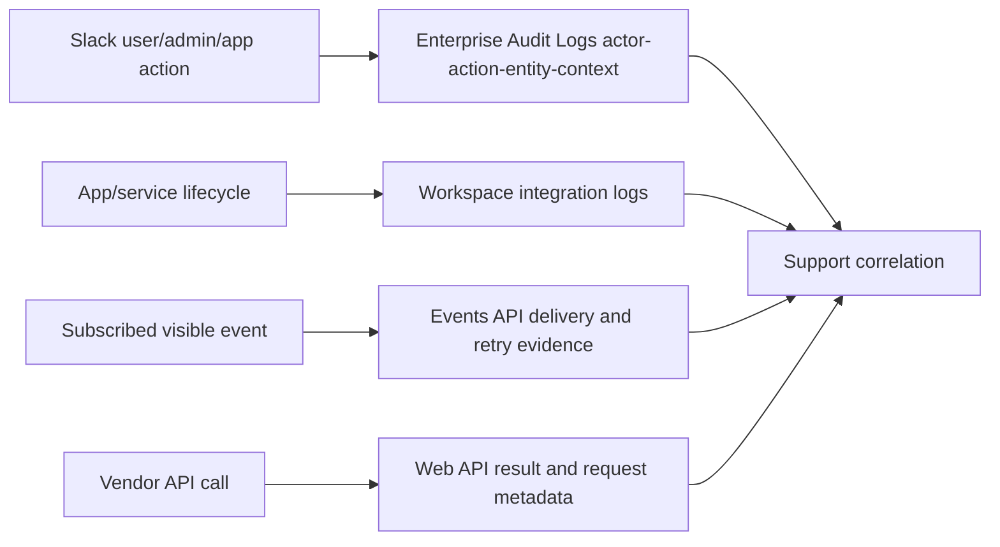

## 14. Zoom account and app management model

A Zoom account contains users and licensed products. Master/subaccount relationships can affect event scope. A General OAuth app can be admin-managed or user-managed. Admin-managed apps can be added/managed across an account under scopes; user-managed apps access the authorizing user's data. Server-to-Server OAuth supports backend access to the app owner's Zoom account without interactive user authorization, under account-level scopes.

| Zoom concept | Meaning | Support identifier |
|---|---|---|
| Account | Customer authorization/resource boundary | Account ID |
| Master/subaccount | Hierarchical account relationship where used | Master/subaccount IDs |
| User | Zoom member/host/authorizing identity | User ID |
| App | Marketplace/developer app definition | App/client ID |
| Admin-managed General app | Account admins add/manage | Account authorization/scopes |
| User-managed General app | Individual user adds/manages | User authorization/scopes |
| Server-to-Server OAuth app | Backend access to own Zoom account | Account ID + client credential metadata |
| Event subscription | Selected events, endpoint, receiver scope | Subscription ID |

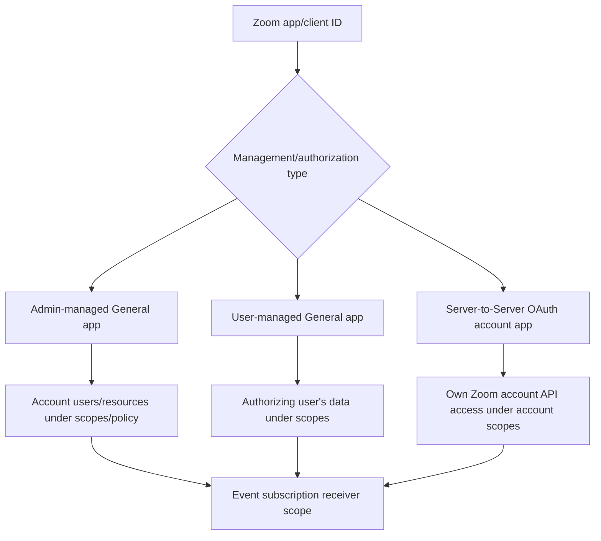

## 15. Zoom development versus production identity

Zoom app build flow distinguishes development and production credentials/configuration. An event endpoint or OAuth redirect working in development does not prove production app credentials, scopes, publication/review, subscription, and endpoint are aligned. The app management type affects available scopes/features and should be rechecked after changes.

| Environment field | Why |
|---|---|
| App/client ID | Correct app definition/environment |
| Development/production credential ID | Prevent wrong secret/client |
| Redirect URL/allowlist | OAuth callback exactness/security |
| Management type | User/account features and scope availability |
| Selected products/features | Event/API capability |
| Approved scopes | API/event authorization |
| Publication/review state | Customer availability/changes |
| Endpoint/subscription ID | Delivery route |

## 16. Zoom authorization types and token lifecycle

| Zoom use case | Actor/owner | Token lifecycle concept | Main support error |
|---|---|---|---|
| User authorization | User-managed or user context | Access/refresh under OAuth profile | Wrong user/deauthorized/revoked refresh |
| Account authorization | Admin/account-managed context | Account-granted access | Wrong account/preapproval/scopes |
| Server-to-Server account access | App/workload for own account | Short access token reacquired; no separate refresh in current profile | Wrong account ID/client/secret/grant |
| Client authorization for app-owned resources | App client as supported | Purpose-specific token | Wrong grant/scope/resource |

Zoom access tokens are bearer credentials and must never be sent to support. For server-to-server access, current docs state access tokens expire after one hour and can be requested again; do not assume a refresh token flow. General user OAuth can have refresh/deauthorization behavior.

## 17. Zoom scopes and event eligibility

Zoom scopes control API methods and event information. Selecting an event can require the corresponding read/admin scope. Admin/user variants distinguish account-level versus user-level authority. The build flow can add subscription-management scopes, but event data scopes still matter.

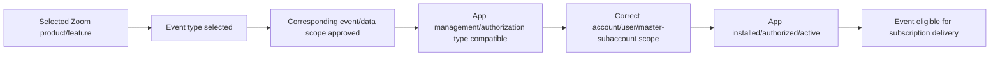

| Zoom missing event question | Why |
|---|---|
| Correct production app ID? | Development/production split |
| App authorized in intended account/user? | Wrong account/owner |
| Management type compatible? | User versus admin scope |
| Event selected and saved/published? | Configuration/review state |
| Corresponding scope present? | “Event not allowed”/eligibility |
| Receiver scope covers user/account/subaccounts? | Population selection |
| Subscription active and endpoint validated? | Delivery lifecycle |
| Event actually occurred/qualifies? | Source behavior |

## 18. Zoom endpoint validation and periodic revalidation

Zoom uses a challenge-response check for endpoint validation. The receiver responds with the challenge under the platform's HMAC secret-token profile within three seconds. Production/development endpoints are periodically revalidated (current docs state every 72 hours); repeated failed revalidation can trigger notification and eventual subscription disablement.

## 🔍 Plain-English deep-dive: Endpoint validation is a scheduled fire-alarm test, not proof every incident report was processed

A building manager periodically presses a fire-alarm test button. A correct response proves the alarm line and controller can answer the challenge at that moment. It does not prove every future sensor is configured, every alarm is authentic, or responders completed every incident workflow.

Zoom endpoint validation proves endpoint control and challenge handling under its current profile. Actual events still require selected subscriptions/scopes, request signature validation, three-second acknowledgement, queue processing, retries, and target reconciliation. Slack URL verification has a similar setup role but a different challenge and lifecycle contract.

The analogy stops because Zoom automatically revalidates and can disable subscriptions after consecutive failures. The support lesson is to track initial validation, revalidation attempts, endpoint/TLS changes, app environment, event-delivery logs, and processing separately.

**Memory cue:** Validation proves the route answers; event evidence proves the workflow.

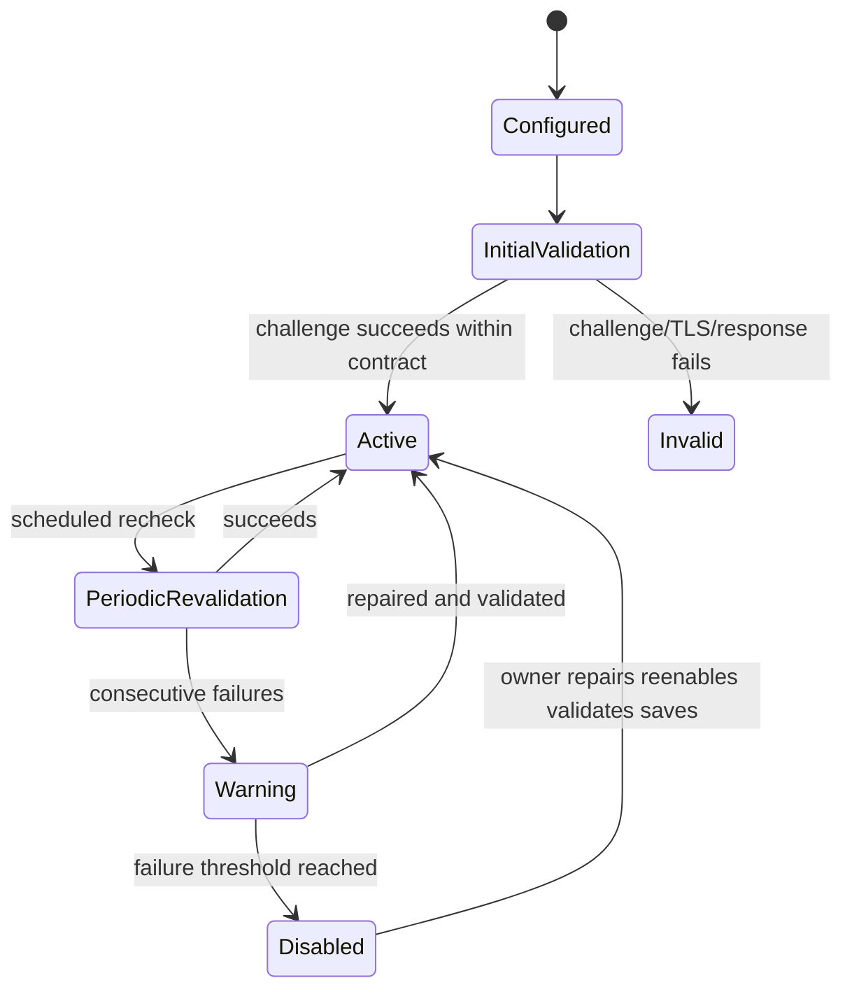

## 19. Zoom request signing

Zoom's current webhook profile includes an `x-zm-request-timestamp` and `x-zm-signature`, with a secret token and documented `v0:timestamp:body` message. Use exact raw request content and maintained libraries; do not copy Slack verification code because similar shape does not guarantee identical canonicalization, headers, replay policy, or lifecycle.

| Validation field | Zoom | Slack comparison |
|---|---|---|
| Shared verifier | Zoom webhook secret token | Slack signing secret |
| Signature header | Zoom-specific signature header | Slack-specific signature header |
| Timestamp header | Zoom request timestamp | Slack request timestamp |
| Message profile | Zoom version/timestamp/body contract | Slack version/timestamp/body contract |
| Endpoint challenge | Zoom CRC plain/encrypted token response | Slack URL-verification challenge |
| Replay policy | Implement per current Zoom guidance/threat model | Slack docs show five-minute freshness example |
| Safe implementation | Zoom library/sample/current docs | Slack Bolt/SDK/current docs |

## 20. Zoom event payload and identifiers

| Zoom field/ID | Meaning |
|---|---|
| Event name | Product-specific event type |
| `event_ts` | Time associated event occurred under payload contract |
| Account ID | Account/customer context |
| User/host ID | Actor/resource owner as applicable |
| Object ID/UUID | Meeting/session/recording/etc. resource identity |
| Request ID/trace ID | Webhook delivery/support correlation |
| Event subscription ID | Subscription configuration identity |
| Retry number | Initial versus retry delivery |
| Receive/process/target UTC | Vendor-side stages |

## 21. Zoom acknowledgement and retries

Zoom expects 200 or 204 within three seconds. Current docs describe retries for selected 5xx/connection/internal conditions, with first/second/third retry intervals. Ordinary redirects and client errors are not retried. This makes a mistaken 401/403/404 response a potential permanent loss for that event delivery unless recovery/reconciliation exists.

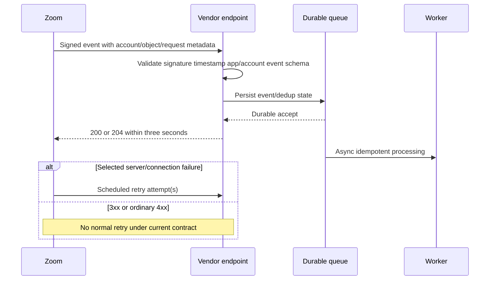

| Zoom response/outcome | Delivery interpretation |
|---|---|
| 200/204 | Successfully delivered |
| 3xx | Not retried under current docs |
| 4xx including auth/not found/rate | Not retried under current docs |
| Selected >=500/internal/connection | Up to documented retries |
| Timeout | Retry classification under current enum/profile |
| Exhausted retries | No further webhook for that event |

## 22. Zoom webhook logs and retention window

Zoom's Marketplace API currently exposes webhook call logs for the past seven days under required permissions, with event, status, failure reason, endpoint, subscription ID, request/response metadata, request/trace IDs, date/time, retry number, and pagination. Raw bodies/headers can contain sensitive data; support should request IDs/status/failure metadata or use an approved protected location, not paste logs into chat.

| Webhook log field | Support use |
|---|---|
| Event | Eligibility/type |
| Status/failure reason | Retry/permanent classification |
| Endpoint | Correct environment/route |
| Subscription ID | Configuration correlation |
| Request/trace ID | Zoom/vendor lookup |
| Date/time | Event-delivery timeline |
| Retry number | Initial/retry sequence |
| Page token/window | Completeness and seven-day evidence limit |

## 23. Zoom deauthorization and data cleanup

When a user removes/deauthorizes a production General app, Zoom sends a deauthorization notification to the configured endpoint under supported verification. Current docs require deletion of associated user data. This is a data-lifecycle and security event, not merely an OAuth error.

| Deauthorization check | Why |
|---|---|
| Account/user/app IDs | Correct customer instance |
| Request authenticity | Prevent forged deletion request |
| Deauthorization UTC | Token/data lifecycle boundary |
| Token revocation | Stop API access |
| Customer data inventory | Delete/retain according to policy/legal basis |
| Webhook/subscription state | Stop events |
| Audit/customer confirmation | Demonstrate completion |

## 24. Platform comparison: event visibility and ownership

| Question | Slack | Zoom |
|---|---|---|
| Customer root | Enterprise org/workspace | Account/master/subaccount/user |
| App instance | Installation/authorization in workspace/org | App added/authorized at account/user or S2S account app |
| Actor | Bot or user token often central | Account/user/app authorization type |
| Event visibility | OAuth scopes + user/bot perspective/channel membership | Scope + selected event + account/user receiver scope |
| HTTP verification | Signing secret/timestamp/raw body | Secret token/timestamp/raw body |
| Setup validation | URL verification | CRC endpoint validation + periodic revalidation |
| Delivery success | 2xx within three seconds | 200/204 within three seconds |
| Retry | Slack retry headers/reasons and current schedule | Selected server/connection failures only; current schedule |
| Disable condition | Sustained delivery failure can disable | Revalidation failures can disable subscription |
| Audit evidence | Enterprise Audit Logs/workspace integration logs | Webhook logs/app/account evidence |

## 25. Shared secret rotation

Slack client/signing secrets and Zoom client/webhook secret tokens have product-specific rotation behavior. Do not assume one platform's overlap period applies to another. Inventory every endpoint/node/environment/secret version and migrate through approved rotation.

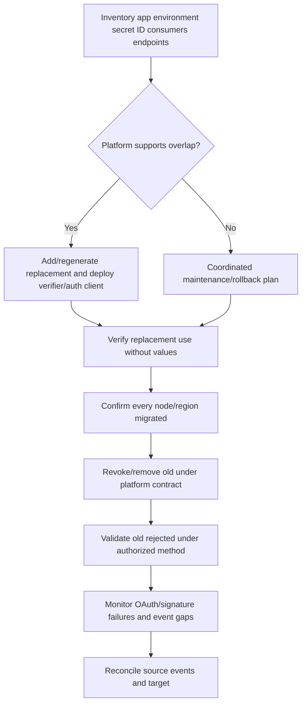

## 26. Rate limits and backoff comparison

| Surface | Slack | Zoom | Shared behavior |
|---|---|---|---|
| API rate | Per method/tier/workspace/app behavior | Per endpoint/rate-label/account/app behavior | Current docs/headers control |
| Event delivery rate | Events API app/team cap and rate event | Product/event/account limits vary | Monitor delivery lag/loss |
| Response | Slack error plus Retry-After where applicable | 429 and platform headers/docs | Honor delay and jitter |
| Webhook 429 from receiver | Slack may treat as failed/retry under current Events rules | Zoom does not retry 4xx including rate limit | Queue ingress rather than rate-limit publisher |
| Recovery | Reduce requests, queue, cache, backoff | Reduce requests, queue, backoff | Never tight-loop |

## 27. Worked example 1: Slack event selected, no private-channel messages

**Input:** Slack app subscribes to a message event but receives no events from one private channel.

**Reasoning:** Identify enterprise/team/app/installation, event type, token actor, granted scope, bot/user channel visibility/membership, shared-channel context, token/app lifecycle, and subscription state. Event subscription alone does not expand visibility.

**Evidence:** IDs, token type (not value), granted scope names, channel ID/type/membership Boolean, event subscription, integration log, last event/retry UTC.

**Result:** Synthetic bot was not a channel member. Product owner decides intended membership/architecture; do not switch to a broad user token merely to bypass visibility.

**Caveat:** Slack event/scopes differ by conversation type and current docs.

## 28. Worked example 2: Slack processes an event twice

**Input:** Slack timed out waiting for acknowledgement and retried; target creates duplicate tickets.

**Reasoning:** Correlate event ID, retry number/reason, edge receive, queue acceptance, response time, worker operation, and target IDs. `event_id` is the logical dedup anchor under current Events API guidance.

**Evidence:** Event ID, team/app, retry headers, receive/response UTC, queue/worker/target IDs. No payload.

**Result:** Persist event ID/effect atomically where possible, acknowledge after durable accept within three seconds, and make target creation idempotent.

**Caveat:** Do not suppress distinct events using message text hash.

## 29. Worked example 3: Slack event subscriptions suddenly disabled

**Input:** No new Slack events after an hour of endpoint errors.

**Reasoning:** Check app/team, integration logs/app owner notifications, delivery success ratio, timeout/SSL/non-2xx/redirect failures, endpoint deployment, token/app lifecycle, and platform status.

**Evidence:** Integration change type/reason, event/retry counts, endpoint status/latency, TLS evidence, app/team IDs, last success/failure UTC.

**Result:** Synthetic integration log says disabled due to errors. Repair endpoint, safely re-enable under owner process, and reconcile missed state where API/business source allows.

**Caveat:** Re-enabling without fixing receiver creates another failure loop.

## 30. Worked example 4: Zoom endpoint validates, selected event absent

**Input:** Zoom CRC validation succeeds, but meeting event never appears.

**Reasoning:** Validation proves endpoint response only. Verify production app ID/environment, app management/authorization type, account/user, selected event, corresponding scope, receiver scope, publication/review state, event qualification, subscription ID, and webhook logs.

**Evidence:** Account/app/subscription IDs, event/scope names, endpoint validation/revalidation state, webhook-log attempt existence, event source ID/time.

**Result:** Synthetic app lacks the event's required admin scope. Least-privilege owner review and app update/review are needed; endpoint code is not root cause.

**Caveat:** Do not add every event scope as a diagnostic shortcut.

## 31. Worked example 5: Zoom receiver returns 401 for signature failure

**Input:** One endpoint node uses stale webhook secret and returns 401; Zoom does not redeliver that event.

**Reasoning:** Compare node/region, secret ID/version, raw-body path, request timestamp/signature validation stage, deployment version, and webhook logs. Under current Zoom behavior, ordinary 4xx is not retried.

**Evidence:** Request/trace/subscription IDs, endpoint node, signature profile/header names (not values), secret version ID, status 401, retry number, event/receive UTC.

**Result:** Deploy correct secret through approved rotation, monitor validation, and reconcile the missed source event through supported API/state.

**Caveat:** Never return 2xx for an unauthenticated request merely to avoid loss; safely persist only validated events.

## 32. Worked example 6: Zoom webhooks stop after revalidation failures

**Input:** Event delivery stops even though previous event calls were 200.

**Reasoning:** Inspect endpoint periodic revalidation history/notifications, TLS/DNS/route changes, CRC response latency/body, development versus production URL, app subscription enabled state, and webhook logs.

**Evidence:** App/subscription/endpoint IDs, revalidation attempt/failure count/UTC, TLS status, deployment, last webhook request ID and last success.

**Result:** Proxy route stopped passing CRC event body correctly. Repair, revalidate, enable/save under owner process, then reconcile coverage gap.

**Caveat:** Event-handler success does not imply challenge-handler success.

## 33. Worked example 7: Zoom API token works for wrong conceptual actor

**Input:** Server-to-server token acquisition succeeds, but code expects user-specific `me` behavior from a different OAuth model.

**Reasoning:** Identify app type/grant, account ID, token owner/subject semantics, requested scopes, endpoint's account/user parameter expectations, and resource ownership. Token success does not mean the actor model matches the API call.

**Evidence:** App/account/user IDs, app/management type, grant type, scope names, API method/path class, HTTP/Zoom error/tracking ID, UTC.

**Result:** Redesign request to use account-scoped resource IDs/endpoints supported for server-to-server access or use the appropriate user authorization model; do not pass a human token into a backend service casually.

**Caveat:** Exact Zoom method scopes and `me` support require current method docs.

## 34. Customer-safe evidence matrix

| Symptom | Minimum safe evidence | Never request |
|---|---|---|
| Slack install/scope | Enterprise/team/app/user/bot IDs, token type, scope names, install UTC | OAuth token/client secret |
| Slack missing event | Event type, team/app/channel ID/type, membership, subscription/lifecycle | Message/channel content export |
| Slack delivery | Event ID, retry num/reason, response/latency, endpoint node | Signing secret/signature/raw body |
| Zoom OAuth | Account/app/user IDs, app/grant type, scopes, error/tracking UTC | Client secret/access/refresh token |
| Zoom missing event | Event/scope/subscription/receiver IDs, attempt existence | Meeting/recording/chat content |
| Zoom webhook | Request/trace ID, status/failure/retry, endpoint/subscription | Secret token/signature/request body |
| Audit/admin | Action/change type/actor/entity/context IDs/time | Broad audit/content export |
| Rate limit | Method/event/account/workspace, 429/Retry-After/queue lag | Tight retry or publisher 429 without plan |

## Troubleshooting decision tree

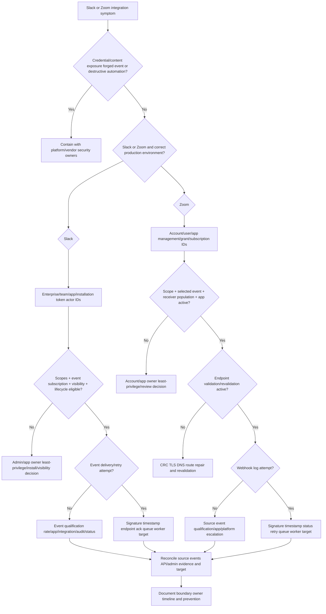

## 35. Common failure modes

| Failure mode | Why it fails | Better behavior |
|---|---|---|
| Slack/Zoom are generic webhook apps | Hides ownership/actor contracts | Platform-specific install/account/token/subscription map |
| App ID proves customer installation | One app can have many customer grants | Add enterprise/team or account/user installation IDs |
| Scope configured equals granted | Installation may have subset/older scopes | Store granted scopes per customer token |
| Event selected equals visible | Token actor/resource visibility also matters | Scope + actor + object + install intersection |
| Slack bot sees all channels | Membership/visibility restricts | Check channel and bot/user perspective |
| Slack user token is always better | Tied to human authority/lifecycle and broader risk | Bot identity unless user action truly required |
| App-level token calls all Slack APIs | Specialized purpose | Match token type to API |
| Remove scope in config shrinks token | Slack grants can be additive | Revoke/reinstall under approved plan |
| Verification token is current Slack request proof | Deprecated | Signed-request profile/SDK |
| Parse body before Slack signature | Raw bytes can change | Verify exact raw body first |
| Slack 2xx proves target effect | Only acknowledgement | Queue/worker/target/reconcile |
| Slack retries mean exactly once | Retry creates duplicates | Dedup by event ID/idempotent effect |
| Re-enable disabled Slack events immediately | Failure recurs | Fix endpoint then reconcile/re-enable |
| Zoom CRC success proves event scope | Setup route only | App/scope/subscription/source checks |
| Zoom app type does not matter | Management type controls authority/features/scopes | Identify user/admin/S2S model |
| S2S token has user refresh flow | Current S2S reacquires short token | Follow app-specific OAuth profile |
| Zoom 4xx will retry | Current docs say ordinary 4xx not retried | Validate before acceptance and reconcile misses |
| Return 2xx for bad signature | Accepts forged event | Reject/authenticate and rely on reconciliation |
| Event-handler 200 means Zoom revalidation works | CRC path can fail separately | Monitor periodic revalidation |
| Copy Slack HMAC code to Zoom | Profiles/canonicalization differ | Platform SDK/current docs |
| IP allowlist proves publisher | Ranges change and isn't content proof | Platform request signature; allowlist defense in depth |
| Pub event timestamp equals receive time | Delivery latency/retry differs | Record both plus process/target UTC |
| Raw webhook log in ticket | Contains sensitive headers/payload | IDs/status/failure/fingerprint only |
| Platform status proves root cause | Must match customer/service/time | Contrarian app/account evidence |
| Generic model equals Abnormal integration | Exact private path unknown | Approved product docs |

## 36. Escalation packet

| Section | Slack evidence | Zoom evidence |
|---|---|---|
| Customer | Enterprise/team IDs and shared context | Account/master/subaccount/user IDs |
| Application | App ID/environment/distribution | App/client ID, dev/prod, management/type |
| Installation | Installer/bot/user IDs and lifecycle | Added/authorized account/user and status |
| Token/grant | Token type, granted bot/user scopes, credential ID | Grant type, scope names, credential ID |
| Event config | Event type, workspace/bot subscription, visibility | Event type, subscription ID, receiver scope |
| Request validation | Signing profile, timestamp/freshness, app/team, result | Secret-token profile, request timestamp, account/app, result |
| Delivery | Event ID, retry num/reason, status/latency | Request/trace ID, retry num/status/failure, seven-day log window |
| Admin/audit | Audit/integration action/change/reason IDs | App/webhook/admin log IDs and review state |
| Processing | Queue/worker/idempotency/target/reconciliation | Queue/worker/idempotency/target/reconciliation |
| Privacy | No token/secret/signature/content | No token/secret/signature/chat/meeting/recording |
| Ask | Exact Slack admin/app/network/vendor decision | Exact Zoom account/app/network/vendor decision |

## Safe synthetic lab: The Collaboration Event Twin Console 068

### Objective

Build a local paper comparison of fictional Slack and Zoom integrations from app installation/account authorization through scopes, event eligibility, request validation, delivery retries, queue processing, audit/admin evidence, rate limits, and target reconciliation. The unique lab is **The Collaboration Event Twin Console 068**.

The lab creates no Slack workspace/app/install/token/Socket Mode connection/request URL or Zoom account/app/OAuth token/event subscription/webhook endpoint. It processes no chat, channel, meeting, participant, recording, user, audit, or webhook content. All identifiers and events are fictional metadata.

### Prerequisites

- Local Markdown editor or spreadsheet only.
- Fictional Slack IDs prefixed `SE-068`, `ST-068`, `SA-068`, `SU-068`, `SC-068`, `SEVT-068`, and `SINST-068`.
- Fictional Zoom IDs prefixed `ZA-068`, `ZU-068`, `ZAPP-068`, `ZSUB-068`, `ZREQ-068`, `ZOBJ-068`, and `ZEVENT-068`.
- Shared connector IDs prefixed `CONN-068`, `QUEUE-068`, `OP-068`, `TARGET-068`, and `CASE-068`.
- Reserved `example.test` hosts only; no real app IDs, domains, endpoints, tokens, secrets, payloads, users, channels, meetings, or accounts.
- Artifact label: **local/public lab - synthetic Slack/Zoom integration metadata only**.
- Record start UTC, zero-live-system/content/credential statement, learned-only label, and source date August 24, 2026.

### Synthetic comparison starter

| Platform/customer | App/installation | Scope/event | Delivery/target |
|---|---|---|---|
| Slack `ST-068-A` | `SA-068-VENDOR` / `SINST-068-A` bot | Narrow scope/event | Healthy |
| Slack `ST-068-B` | Same app / user token | Missing channel visibility | No event |
| Zoom `ZA-068-A` | `ZAPP-068-VENDOR` admin-managed | Correct scope/subscription | Healthy |
| Zoom `ZA-068-B` | Production app/S2S | Endpoint revalidation failed | Disabled |

### Lab steps

1. Create the cover with artifact label, UTC, safety boundary, Microsoft-transfer statement, Slack/Zoom learned-only statement, and Abnormal unknowns.
2. Define Slack enterprise/workspace/app/install/bot/user/channel/event and Zoom account/user/app/type/subscription/event concepts.
3. Draw one shared pipeline and annotate platform-specific checkpoints.
4. Build stable identifier dictionaries for Slack and Zoom with owner/namespace/sensitivity.
5. Create four Slack installations and four Zoom authorizations across test/production customer contexts.
6. For Slack, compare bot, user, app-level, workflow, configuration, and service token purpose/lifecycle without values.
7. Build Slack configured/requested/granted/optional/additive scope state per installation.
8. Create Slack event eligibility intersections using installation, scope, subscription, actor visibility, channel membership, shared context, and lifecycle.
9. Compare Slack HTTP Events API, Socket Mode, Web API, and incoming webhook purposes.
10. Build Slack event-envelope cards for app/team/enterprise/user/channel/event/context/authorization/timestamps.
11. Model Slack signed-request validation using metadata only: profile, timestamp freshness, raw-body fingerprint, app/team, result.
12. Run Slack 3-second durable-acknowledgement and three-retry timeline with retry number/reason.
13. Create Slack failure-disable, delayed-event, app-rate-limited, uninstall, token-revoked, and Enterprise-migration cases.
14. Build Slack Audit Logs actor-action-entity-context and integration-log app-change/reason records.
15. For Zoom, compare user-managed, admin-managed, server-to-server, and client/app-owned authorization purposes.
16. Build Zoom dev/prod app identity, account/user owner, scopes, products/features, review, and event-subscription inventory.
17. Create Zoom event eligibility intersections using app type, account/user scope, event, permission scope, app state, and receiver population.
18. Model Zoom CRC initial validation and 72-hour periodic revalidation/disable timeline.
19. Build Zoom signed-request metadata verification without secret/signature/body.
20. Run Zoom 3-second acknowledgement and selected-retry timeline; contrast 3xx/4xx no-retry.
21. Build Zoom webhook-log records with event/status/failure/subscription/request/trace/retry/page/time metadata and seven-day evidence constraint.
22. Model Zoom deauthorization, token/data cleanup, and customer confirmation.
23. Compare Slack/Zoom event visibility, validation, retry, disable, audit, and rate behavior.
24. Design independent signing/client secret rotation plans using IDs only.
25. Create Slack method/event-rate and Zoom endpoint/event/account rate-limit cards with Retry-After/backoff decisions.
26. Run the decision tree on Slack private-channel gap, Slack duplicate, Slack disabled delivery, Zoom CRC-only success, Zoom stale secret 401, Zoom revalidation disable, and Zoom wrong actor model.
27. Draft one Slack customer update, one Zoom customer update, and platform/vendor escalation packets.
28. Deliver a 90-second Slack event visibility answer, 90-second Zoom webhook lifecycle answer, 90-second comparison, and 60-second honesty boundary.
29. Validate source URLs/date, cleanup, privacy, zero-activity statement, and rubric.

### Expected evidence

- Shared and platform-specific integration diagrams.
- Slack/Zoom stable identifier dictionaries.
- Four Slack installations and four Zoom authorization records.
- Slack token/scope/event-visibility and delivery workbooks.
- Slack HTTP/Socket/Web API/incoming-webhook comparison.
- Slack signed-request, retry/disable/rate, lifecycle, and audit/integration records.
- Zoom app-type/dev-prod/scope/event eligibility records.
- Zoom CRC/revalidation, signed request, delivery/retry, webhook-log, and deauthorization records.
- Platform comparison and independent secret-rotation plans.
- Rate/backoff cards and seven troubleshooting cases.
- Two customer updates and escalation packets.
- Source ledger dated **August 24, 2026**.
- Spoken Microsoft-transfer, Slack/Zoom-learned, and Abnormal-unknown statements.

### Cleanup and privacy

- Confirm every enterprise/workspace/account/app/install/user/bot/channel/event/subscription/request/trace/object/queue/operation/target/case ID is fictional and includes `068`.
- Confirm all hosts use `example.test` and no valid OAuth URL, endpoint, token, client/signing/webhook secret, signature, request body, response URL, incoming webhook URL, Socket token, chat, meeting, participant, recording, or audit content exists.
- Remove real customer names, workspace/account IDs, app IDs, users, channels, scopes, events, endpoints, webhook logs, screenshots, and status details.
- Confirm no Slack/Zoom/Abnormal app management, admin, Marketplace, API client, Socket Mode, endpoint, or network request was accessed.
- Delete the artifact if credentials, collaboration content, or customer identity cannot be reliably removed.
- Record cleanup UTC and: `Synthetic paper Slack/Zoom integration exercise only; zero live workspace, account, app, installation, OAuth grant, token, secret, event subscription, endpoint, webhook, Socket Mode, API request, audit query, collaboration content, or production activity.`

### Validation rubric

| Dimension | Fail | Developing | Pass |
|---|---|---|---|
| Customer/app | App ID only | Names workspace/account | Customer boundary + installation/authorization + actor + environment IDs |
| Permission | Scope configured | Granted scopes | Token/app type, granted scope, object visibility, event/subscription intersection |
| Slack | Bot sees all | Knows Events API | Token types, membership, envelope, signing, retries/disable/rate/audit |
| Zoom | CRC equals healthy | Knows webhooks | App type, scope, receiver, periodic revalidation, signing, retry/logs/deauth |
| Security | Copies secret | Says protect | Exact-byte profile via library, replay, rotation, no credentials |
| Reliability | 2xx equals effect | Uses queue | Durable ack, idempotency, retry contrast, gap reconciliation |
| Evidence | Raw payload | Some IDs | Platform/customer/app/event/request/admin IDs/UTC, no content |
| Rates | Retry immediately | Backoff | Platform-specific Retry-After/queues/concurrency/reconciliation |
| Troubleshooting | Reinstall/revalidate first | Checks app | Source-to-target decision tree and precise owner asks |
| Honesty | Claims platform ops | Says studied | experience transfer, Slack/Zoom lab, Abnormal unknown |

## 37. Official Source Anchors

All sources were verified and recorded with guide currency date **August 24, 2026**. Slack and Zoom app models, token types, scopes, event contracts, review, retry, revalidation, rate limits, and APIs evolve. Revalidate current platform documentation before production use.

| Official source | What it anchors | Boundary |
|---|---|---|
| [Slack - Installing with OAuth](https://docs.slack.dev/authentication/installing-with-oauth) | Workspace install, bot/user scopes/tokens, optional/additive scopes, enterprise connection check, revocation | Do not reuse example URLs/tokens |
| [Slack - Tokens](https://docs.slack.dev/authentication/tokens) | Bot/user/app/workflow/config/service token purpose/lifecycle | Exact supported APIs change |
| [Slack - Security best practices](https://docs.slack.dev/authentication/best-practices-for-security) | Secret storage, least privilege, rotation/revocation, governance/auditing | Vendor implementation responsibility |
| [Slack - Events API](https://docs.slack.dev/apis/events-api/) | Permission visibility, envelope IDs, HTTP/Socket, 3-second ack, retry/failure/rate/lifecycle | Best-effort delivery; reconcile gaps |
| [Slack - Verifying requests](https://docs.slack.dev/authentication/verifying-requests-from-slack) | Signing-secret/timestamp/raw-body profile, replay check, SDK, mTLS option | Never include secret/signature/body in lab |
| [Slack - Audit Logs API](https://docs.slack.dev/admins/audit-logs-api/) | Enterprise read-only actor-action-entity-context audit subset | Enterprise plan/org installation; not message content |
| [Slack - team.integrationLogs](https://docs.slack.dev/reference/methods/team.integrationLogs/) | Workspace integration added/changed/disabled/removed reasons/paging | Admin scope and current method availability |
| [Zoom - Create an OAuth app](https://developers.zoom.us/docs/integrations/create/) | User/admin management, dev/prod credentials, features, scopes, review | S2S is distinct app path |
| [Zoom - OAuth 2.0](https://developers.zoom.us/docs/integrations/oauth/) | User/account/S2S/client access, token/revoke/deauthorization, actor context | Follow app-specific grant/profile |
| [Zoom - Using webhooks](https://developers.zoom.us/docs/api/webhooks/) | Event subscriptions, receiver scope, endpoint requirements, CRC/revalidation, signatures, delivery/retries | Retry and revalidation behavior can change |
| [Zoom - Get webhook logs](https://developers.zoom.us/docs/api/marketplace/#tag/app/get/marketplace/apps/{appId}/webhook_logs) | Seven-day webhook logs, status/failure/retry/request/trace/subscription/paging | Raw logs may contain sensitive payload/headers |
| [Zoom - OAuth error messages](https://developers.zoom.us/docs/integrations/oauth-error-messages/) | Client/redirect/grant/token/app-disabled/revoked error categories | Use tracking IDs/current support guidance |

### Source-use discipline

- Use platform SDKs/current request-verification profiles; do not copy one platform's HMAC implementation to the other.
- Inventory customer boundary, app installation/authorization, token actor, granted scopes, event visibility, and subscription separately.
- Acknowledge only validated/durably accepted events and process asynchronously/idempotently.
- Treat platform retry behavior as different and provide reconciliation for non-retried/dropped events.
- Never request tokens, client/signing/webhook secrets, signatures, or collaboration payload/content.
- Keep Abnormal's Slack/Zoom app types, scopes, events, endpoints, and logs explicitly unknown.

## Likely Interview Questions

### Q1. How does Slack event visibility work?

**Model answer:** Event selection is only one gate. The Slack app must be installed and active in the correct workspace/Enterprise context; the bot or user token needs the corresponding granted scope; that actor must be able to see the channel/resource; and the event type must be subscribed. I track enterprise/team/app/installation/actor/channel IDs and lifecycle rather than assuming a bot sees the whole workspace.

### Q2. What is the difference between Slack bot and user tokens?

**Model answer:** A bot token represents the app's bot user and is bounded by bot scopes and its object/channel visibility. A user token represents a human and actions occur under that user's access and lifecycle. Other Slack tokens have specialized app/workflow/configuration uses. I prefer the least-privileged actor that matches the business action and never treat token strings as evidence to share.

### Q3. How would you process Slack Events API safely?

**Model answer:** Verify the current Slack signature over the exact raw body with signing-secret/timestamp freshness via an SDK, validate app/team/event envelope and schema, deduplicate by event ID, persist durably, return 2xx within three seconds, and process asynchronously/idempotently. Correlate retry number/reason, integration/audit evidence, rate events, and target reconciliation.

### Q4. What Zoom app/authorization distinctions matter?

**Model answer:** Identify account and user, production app ID, admin-managed versus user-managed General app, or Server-to-Server OAuth account app. Those choices determine who authorizes, which data/subjects are available, which scopes/events are valid, and token lifecycle. A successful token from one actor model does not guarantee a user-specific API call is conceptually valid.

### Q5. What does Zoom webhook endpoint validation prove?

**Model answer:** CRC validation proves the configured endpoint can answer Zoom's challenge under the webhook secret profile at that time. It does not prove the app has the event scope, the receiver population includes the source, future request signatures validate, or workers update target state. Periodic revalidation has its own failure/disable lifecycle that I monitor separately.

### Q6. How do Slack and Zoom webhook retries differ?

**Model answer:** Both require prompt acknowledgement, but the contracts differ. Slack documents three retries with retry number/reason for several delivery failures and can disable after sustained failure. Zoom retries selected server/connection failures but not ordinary 3xx/4xx, and stops after its documented attempts. Therefore I classify responses per platform and always reconcile missed effects.

### Q7. What evidence would you request for a missing Slack or Zoom event?

**Model answer:** Customer/account/workspace IDs, app/install/authorization type, token actor type, granted scope names, event/subscription/receiver scope, source object/event time, attempt existence, event/request/trace/subscription IDs, response/latency/retry, validation stage, queue/worker/target result, and admin/audit state. Never tokens, secrets, signatures, or chat/meeting payloads.

### Q8. What are your Slack and Zoom experience boundaries?

**Model answer:** My Slack and Zoom knowledge is learned from current official docs and a synthetic metadata-only lab. My production foundation is enterprise support, identity, APIs, audit, incident ownership, escalation, and customer communication. I do not claim Slack/Zoom administration, and Abnormal's exact integrations remain unknown absent approved docs.

## Memory Hooks

- **One app definition; customer-specific installation or authorization.**
- **Slack token type selects actor; scopes and visibility bound access.**
- **Slack event = install + scope + actor visibility + subscription + lifecycle.**
- **Bot installed does not mean bot joined every channel.**
- **Slack event ID dedups; retry headers explain delivery attempts.**
- **Slack wants durable 2xx within three seconds.**
- **Audit Logs describe actor-action-entity-context, not message content.**
- **Zoom app management type determines account/user authority.**
- **Zoom S2S is account backend access, not a user OAuth refresh model.**
- **Zoom event = app type + scope + selected event + receiver population.**
- **CRC validates endpoint control; periodic revalidation guards continuity.**
- **Slack and Zoom signatures look related but are separate contracts.**
- **Zoom 4xx normally does not retry; reconciliation matters.**
- **2xx acknowledges delivery, not final target effect.**
- **Log IDs, status, stage, and UTC; never credentials or collaboration content.**
- **Prior-role work is production transfer; Slack/Zoom are learned architecture.**

## Completion Checklist

- [ ] I can state the Section goal and platform-specific checkpoint rule.
- [ ] I can distinguish Slack Enterprise/workspace/app/install/user/bot/channel/event IDs.
- [ ] I can explain Slack bot/user/app/workflow/configuration token purposes.
- [ ] I can explain configured/requested/granted/optional/additive Slack scopes.
- [ ] I can build Slack event visibility from install, scope, actor, membership, context, and lifecycle.
- [ ] I can compare Slack HTTP Events, Socket Mode, Web API, and incoming webhooks.
- [ ] I can explain Slack envelope, signing/timestamp/raw-body, 3-second ack, retries, disable, and rate events.
- [ ] I can use Slack Audit Logs and integration logs at correct scope.
- [ ] I can distinguish Zoom account/user/app/admin-managed/user-managed/S2S concepts.
- [ ] I can separate Zoom development/production app identities and actor/token models.
- [ ] I can map Zoom scope/event/receiver eligibility.
- [ ] I can explain Zoom CRC initial/periodic validation separately from event delivery.
- [ ] I can explain Zoom signing/timestamp, 3-second ack, selected retry, and no-retry 3xx/4xx behavior.
- [ ] I can use Zoom webhook-log IDs/status/failure/retry within the evidence window.
- [ ] I can explain Zoom deauthorization and data cleanup.
- [ ] I can rotate Slack/Zoom secrets under separate current contracts.
- [ ] I can classify platform rate limits and backoff without hard-coded assumptions.
- [ ] I can troubleshoot seven Slack/Zoom cases and reconcile target state.
- [ ] I completed or can explain **The Collaboration Event Twin Console 068**.
- [ ] The lab includes Prerequisites, Expected evidence, Cleanup and privacy, and Validation rubric.
- [ ] I used no live app, install, token, secret, endpoint, event, API, audit query, or collaboration content.
- [ ] I can state experience transfer, Slack/Zoom learned, and Abnormal unknown boundaries.
- [ ] I checked Official Source Anchors and recorded **August 24, 2026**.
- [ ] I can answer exactly Q1-Q8.

[Next: Part 069 - Okta Integration Learning Lab](Part-069-okta-integration-learning-lab.md)