# Part 069 - Okta Integration Learning Lab

## Section goal

This Part builds a beginner-friendly, support-ready model of an Okta integration. It is explicitly a **learned architecture and synthetic paper lab**. You must not claim production Okta administration, app integration creation, policy changes, network-zone configuration, System Log API operation, SCIM provisioning, or SAML/OIDC setup unless real evidence supports that statement.

An **Okta organization (org)** is a hard tenant boundary containing users, groups, app integrations, policies, authenticators, authorization servers, API/service credentials, System Log events, and configuration. Production, preview, trial, and integrator environments differ. Every org has an Okta domain/URL and infrastructure cell; an org can also use a custom domain for end-user sign-in, while administration continues through the appropriate uncustomized/admin URL under current behavior. The org, environment, domain, and app instance must be identified before troubleshooting.

Okta Universal Directory has a central Okta user profile. When an app is assigned to a user, Okta creates or uses a separate **app user profile** for that application instance. Profile mappings transform attributes between sources, Okta, and target apps. Groups and group rules can drive assignment. Therefore the user's Okta login/email/display values, app username, target application's local user ID, SAML NameID/OIDC subject, and SCIM target `id` must be tracked separately.

Single sign-on (SSO) and provisioning are parallel integrations. SAML or OpenID Connect authenticates/federates and can create an application session. SCIM creates, matches, updates, deactivates, or groups target accounts. A user can be provisioned but unable to sign in, or sign in through an existing/local account while SCIM is broken. Assignment can influence both paths, but the exact app settings and product behavior must be proven rather than assumed.

Okta Identity Engine sign-in can evaluate user identification/routing, global session policy, app sign-in policy, authenticators, device assurance, network zones, risk/context, and app assignment. Policies and rules are ordered: the first applicable policy/rule conditions can control the result, with defaults last. The System Log records near-real-time org activity and provides event type, actor, target, outcome, client, authentication/security context, transaction/correlation, request, and debugging context. Debug fields are troubleshooting aids, not stable contracts.

The central support rule is:

> Identify Okta org/environment, user and app-user profiles, app integration instance, assignment path, SSO protocol/configuration, policy/rule/network/device context, System Log transaction and outcome, SCIM source/match/target state, and downstream app session/account before changing assignment, policy, scopes, certificates, mappings, provisioning, or customer data.

This Part covers Okta orgs/domains/cells, Universal Directory, user/app-user profiles, profile sourcing/mapping, groups/rules/assignments, app integrations, SAML, OIDC/OAuth authorization-server boundaries, Identity Engine/global and app policies, authenticators, network zones, device/risk context, System Log, event hooks, SCIM lifecycle, rate limits, and integrated troubleshooting. It provides no Okta org access, Admin-console steps, app creation, certificate, token, API request, SAML assertion, OIDC token, event-hook endpoint, SCIM operation, user assignment, policy edit, or customer identity. Abnormal's Okta app template, protocols, assignments, claims, certificates, redirect URLs, SCIM profile, mappings, policies, System Log expectations, and evidence remain proprietary unknowns unless approved documentation states them.

## Learning outcomes

After completing this Part, you should be able to:

- define Okta org, org URL/domain, custom domain, cell, production/preview org, Universal Directory, user type, and feature/licensing boundary;
- distinguish Okta user, app user, target application account, group, app integration instance, assignment, and source profile;
- trace individual/group-rule/group assignment into app-user creation and effective access;
- explain profile-level and attribute-level sourcing plus directional profile mappings;
- distinguish SSO authentication/federation, target application session, SCIM provisioning, and target-local authorization;
- apply SAML issuer/audience/ACS/NameID/certificate/time/relay-state reasoning to an Okta-to-app flow;
- apply OIDC issuer/discovery/JWKS/client/redirect/state/nonce/code/PKCE/ID-token/access-token reasoning at a safe level;
- distinguish Okta org authorization server and custom authorization server concepts and avoid wrong-issuer/resource assumptions;
- explain Identity Engine, global session policy, app sign-in policy, authenticator enrollment, routing, device assurance, network zone, and risk context;
- reconstruct ordered policy/rule evaluation and identify which rule actually applied;
- interpret System Log event type, UUID, published time, actor, targets, outcome, client, authentication context, security context, transaction, request, and debug context;
- page/query System Log conceptually using time/filter/opaque next-link state and avoid depending on display/debug strings;
- explain Okta event hooks as asynchronous, at-least-once, potentially delayed/duplicated/out-of-order triggers using System Log event objects;
- trace SCIM assignment/provisioning, user/app profiles, match, create/update/deactivate, import/source, group push, rate-limit retry, and target reconciliation;
- investigate user-not-assigned, policy-denied, wrong network/device, SAML mismatch, OIDC issuer/redirect, SCIM duplicate/deactivation, event-hook, and downstream-session cases;
- collect a privacy-minimized Okta escalation packet without passwords, API tokens, SAML assertions, OAuth tokens, cookies, SCIM bearer tokens, or raw user profiles; and
- present Okta knowledge as learned architecture while using prior production support as transferable evidence.

## JD Mapping

| Supplied role signal | Capability built | Your transferable evidence | Boundary |
|---|---|---|---|
| Okta ecosystem | Applies SSO/OIDC/SCIM, assignment, roles, policies, logs, and network context | enterprise identity/tenant transfer | Learned architecture only |
| Enterprise integrations | Traces org/app/user/assignment to SSO and lifecycle target state | Configuration/API/RCA habits | No Okta production claim |
| SaaS Security | Least privilege, authenticators, policy context, deprovisioning, audit | Security/identity experience | No policy administration claim |
| Complex tickets | Joins sign-in, SAML/OIDC, SCIM, System Log, and app evidence | critical situation/escalation | Synthetic cases only |
| API support | Understands System Log paging/filter, OAuth management scopes, rate limits | REST/JSON working knowledge | No API call in lab |
| Customer communication | Requests stable IDs, event UUID/transaction/outcome, not credentials/assertions | Privacy-aware support | User profiles minimized |
| Provisioning | Applies Part 063 source/match/active/reconciliation to Okta | Standards foundation | Okta profile specifics current-doc only |
| Cross-functional work | Routes Okta admin, app owner, network/device, security, and vendor Engineering | Microsoft collaboration | Exact ownership customer-specific |

## Candidate honesty note

| Evidence tier | Safe statement | Do not imply |
|---|---|---|
| **Production transfer - Microsoft** | “I transfer tenant-aware identity, federation, policy, audit, API, and escalation practices.” | That Entra and Okta object/policy models are identical |
| **Local/public lab** | “I built a synthetic Okta SSO/provisioning/System Log evidence model without an org or identity.” | A live Okta app, user, policy, or SCIM connector |
| **Learned architecture - Okta** | “I verified current concepts against official Okta documentation.” | Production Okta admin/support ownership |
| **Standards knowledge** | “I apply SAML/OIDC/SCIM standards and vendor profiles carefully.” | Every optional feature supported |
| **Proprietary unknown** | “Abnormal's Okta integration settings and evidence require approved docs.” | Public Okta docs reveal Abnormal's app template |

Safe interview language:

> “My Okta knowledge is standards- and current-doc based, supported by real enterprise identity/support experience. I would identify org/environment, app instance, user/app-user/target IDs, assignment path, SAML or OIDC issuer/recipient/configuration, applied policy/rule/network/device context, System Log UUID/transaction/outcome, SCIM source/externalId/target id/active state, and downstream session. I would never request a password, API token, assertion, OAuth token, cookie, SCIM credential, or raw profile export.”

## 1. Okta org as the root boundary

An Okta org is the root container. Objects do not automatically cross orgs. Federation can connect orgs, but users and app instances remain separate in each. Org URL, environment, cell, custom domain, feature availability, and customer contract matter.

| Org field | Why |
|---|---|
| Canonical org URL/domain | API/issuer/admin correlation |
| Custom sign-in domain | User-facing issuer/redirect/cookie context as configured |
| Production/preview/trial/integrator type | Features/release/support expectations |
| Cell/region | Service/status correlation |
| Customer/company | Case ownership |
| Identity Engine/feature state | Policy/authenticator behavior |
| Contract/products | SCIM/audit/device/risk/authorization features |
| Admin/support roles | Evidence/configuration authority |

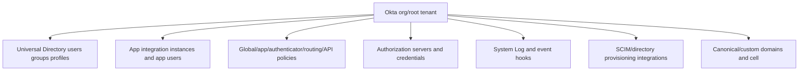

## 2. Org URLs, custom domains, and cells

The Okta subdomain identifies an org, but custom domains can alias the end-user experience. Administration uses the appropriate administrative/uncustomized domain under current guidance. Preview orgs often use preview domains/cells and can have early features. Never diagnose by company display name alone.

| URL/context issue | Hypothesis |
|---|---|
| Wrong org subdomain | User/app/config exists in another org |
| Custom versus canonical domain | Issuer/cookie/redirect/certificate mismatch |
| Admin URL through custom domain | Wrong administration path |
| Preview versus production | Different configuration/release behavior |
| Wrong cell/status incident | Service-health correlation mismatch |
| Multiple orgs | Duplicate user/app IDs and divergent policy |

## 🔍 Plain-English deep-dive: An Okta org is a secured campus; the custom domain is its sign on the road

A company can put its own branded sign at the campus entrance, but the land registry still identifies the specific campus, and the administration office can have a different entrance. Two campuses with the same company branding remain separate security boundaries.

An Okta custom domain changes the user-facing URL/brand path, while the canonical org/domain and cell still matter for APIs, administration, issuers, and support. Preview and production orgs can look similar but contain different users, app instances, certificates, policies, and events.

The analogy stops because domains participate in TLS, issuer, redirect, cookie, and discovery behavior. The support lesson is to record canonical org, custom domain, environment, cell, issuer, and exact app instance before testing.

**Memory cue:** Brand points to the campus; canonical org identifies the tenant.

## 3. Universal Directory and profile sourcing

Universal Directory (UD) stores the central Okta user profile and schemas. A profile can be sourced from HR, AD/LDAP, an app, or Okta according to configuration. Source of truth can be profile-level or attribute-level. A value visible in Okta can be read-only because another source owns it.

| Profile concept | Meaning | Support question |
|---|---|---|
| Okta user profile | Central identity object/attributes | Which stable Okta user ID/type? |
| User type/schema | Attribute contract for user population | Required/unique/type constraints? |
| Profile source | System that masters profile/lifecycle | Where must correction occur? |
| Attribute source | System that masters one field | Which direction wins? |
| Profile mapping | Transform from source to destination | Which expression/version/result? |
| Import | Pull external users/attributes into Okta | Match/confirm/create behavior? |
| Push/provision | Send Okta/app-user state downstream | Which app/SCIM target? |

## 4. Okta user versus app user versus target user

Assigning an app to an Okta user creates/uses a separate app user profile specific to that app integration. It stores app-facing attributes such as app username. The downstream target then has its own account/SCIM `id`. These objects can diverge.

| Identity object | Stable identifier | Example role |
|---|---|---|
| Okta user | Okta user ID | Central directory identity/lifecycle |
| App user | App-assignment user ID/profile | Mapped username/attributes for one app instance |
| SAML subject/NameID | Assertion value under app config | Federated subject mapping |
| OIDC subject `sub` | Issuer-scoped subject | Client identity correlation |
| SCIM `externalId` | Client/provisioning-domain ID | Source-target correlation |
| SCIM target `id` | Target service provider | Target operations/group references |
| Target-local account ID | Downstream product | App authorization/data ownership |

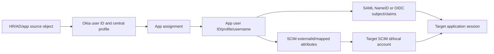

## 🔍 Plain-English deep-dive: The Okta user is a passport; the app user is a venue badge

A person has one passport identity, but each conference creates a local badge with a venue-specific badge number, printed name, role, and access level. The venue's turnstile system can assign another internal account ID. Changing the passport name does not prove every badge was reprinted.

The Okta user profile resembles the central passport. Assignment creates an app-specific profile/badge with mapped username/attributes. SAML/OIDC sends configured subject/claims; SCIM links to a target account with its own ID. A login mismatch may be at the badge mapping even when the Okta user looks correct.

The analogy stops because source-of-truth rules and automated mappings can overwrite values. The support lesson is to inventory each object, identifier, mapping direction, current value, and timestamp separately.

**Memory cue:** Okta user is central; app user is app-specific; target user is downstream.

## 5. Groups, group rules, and assignments

Users can be assigned to an app directly or through group membership. Group rules can add users based on attributes. Imported groups can be mastered externally. Effective assignment is a graph, not one checkbox.

| Assignment path | Evidence |
|---|---|
| Direct user assignment | User ID, app instance ID, app-user record, assignment event |
| Okta group assignment | Group ID, app-group assignment, user membership |
| Dynamic group rule | Rule ID/status/expression inputs/result |
| Imported group | Source directory/app and sync state |
| Nested/group feature behavior | Current supported membership semantics |
| Unassignment | Trigger, app-user/provisioning/deactivation outcome |

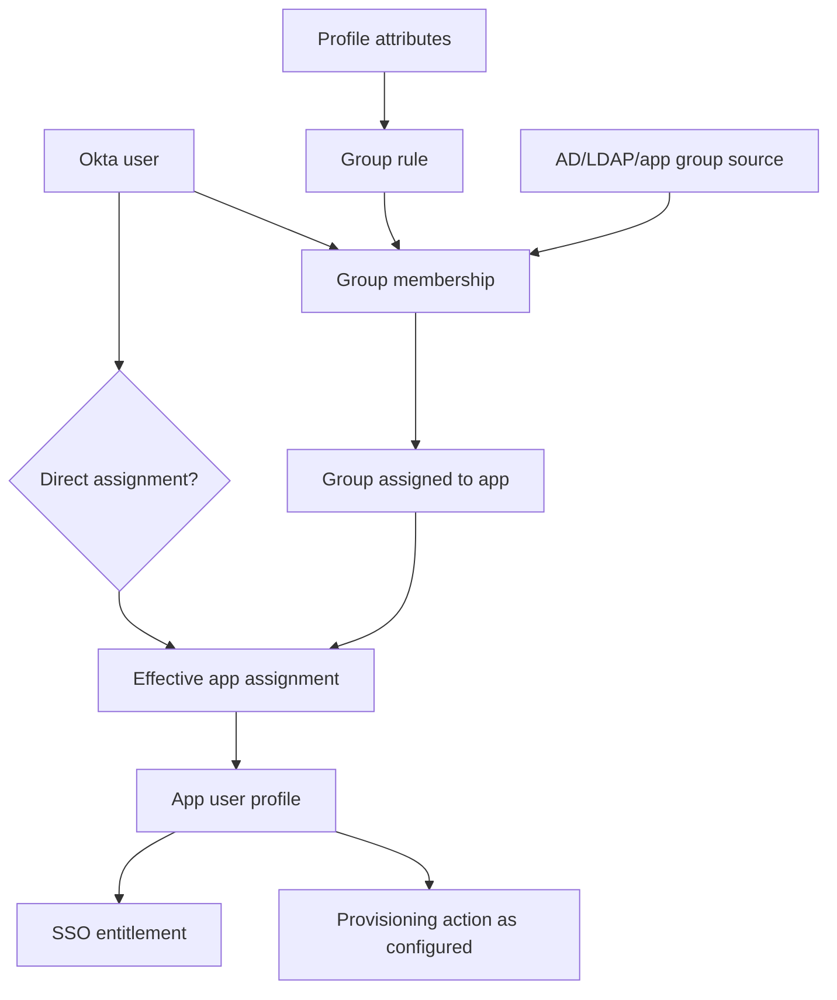

## 6. App integration instance

An app integration instance belongs to one org and has protocol/configuration, assignments, app-user schema/mappings, sign-on policy, provisioning settings, credentials/certificates, and lifecycle. Multiple instances of the same catalog application can exist, so app label alone is not enough.

| App-instance field | Why |
|---|---|
| App instance ID | Exact target within org |
| Label/catalog/type | Human/product context |
| Sign-on mode/protocol | SAML/OIDC/SWA/etc. behavior |
| Assignments/groups | Eligible population |
| App-user schema/mappings | Subject/attribute values |
| App sign-in policy ID | Authentication requirements |
| SAML certificate/OIDC client metadata | Trust/token validation |
| Provisioning connection/profile | SCIM lifecycle path |
| Status/created/updated | Lifecycle/change correlation |

## 7. SSO, provisioning, and target authorization

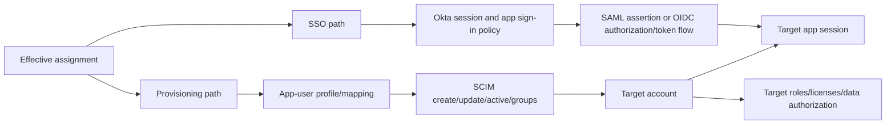

| Symptom | SSO hypothesis | Provisioning hypothesis | Target hypothesis |
|---|---|---|---|
| User cannot launch | Assignment/policy/SAML/OIDC | Account absent/inactive | Local app deny |
| User signs in, profile stale | Claims mapping/cached session | SCIM mapping/update failed | Target owns field |
| User unassigned but signs in | Existing IdP/app session/local login | Deactivation failed | Local unmanaged account |
| Account exists, SSO fails | Assertion/token/recipient/policy | SCIM healthy | App trust/session issue |
| Group access missing | Claim/group mapping | Group push/member update | App role mapping |

## 🔍 Plain-English deep-dive: SSO is the turnstile; SCIM is the badge office

The badge office creates and updates a person's venue badge. The turnstile validates that the person presenting credentials should enter now. A badge can exist while the turnstile denies entry; a turnstile can accept a person mapped to an old or manually created badge while the badge office automation is broken.

SCIM is the badge-office lifecycle path. SAML/OIDC is the federated turnstile path. Okta assignment can feed both, but sessions, target-local accounts, roles, and revocation remain separate. Fixing SSO by recreating an account can introduce duplicates; fixing SCIM by weakening sign-in policy is unrelated.

The analogy stops because SAML/OIDC assertions/tokens and SCIM resources have exact protocols. The support lesson is to build parallel SSO and provisioning timelines and join them only through proven identifiers.

**Memory cue:** SCIM prepares the account; SSO opens a session; target authorization controls actions.

## 8. SAML path in an Okta integration

Part 061 provides the standard detail. In an Okta app, support identifies IdP issuer/entity, SSO URL, signing certificate/key ID, SP entity/audience, ACS, NameID format/value mapping, attribute statements, request/response binding, time, InResponseTo, RelayState, app assignment, and target session.

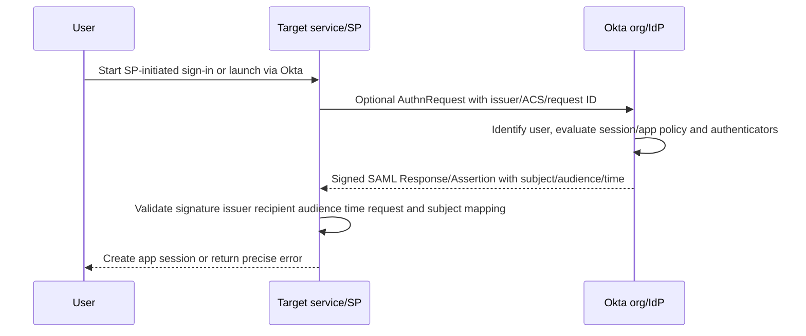

| SAML failure | Check |
|---|---|
| Wrong recipient/ACS | Exact environment/instance URL and request/response |
| Audience mismatch | SP entity ID versus assertion audience |
| Invalid signature | Current Okta signing cert/key and app trust cache |
| Unknown user | NameID/app-user mapping versus target account |
| Assertion expired/not yet valid | UTC/clock/latency |
| User not assigned | Okta app assignment/System Log |
| RelayState issue | App return state separate from assertion trust |

## 9. OIDC/OAuth path in an Okta integration

Part 062 provides protocol fundamentals. Okta can issue through an org authorization server or configured custom authorization server, with distinct issuer/discovery/JWKS/scopes/claims/policies. The client must use the exact issuer's metadata and validate returned tokens for its client/audience/profile.

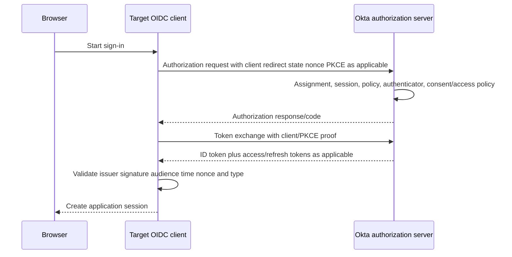

| OIDC failure | Check |
|---|---|
| Discovery/JWKS failure | Exact issuer/domain/auth server and cache/network |
| Redirect mismatch | Client registration versus request environment |
| Invalid client/secret | Client ID/credential ID/expiry; no value |
| Invalid state/nonce/PKCE | Transaction binding and session/cookie |
| Wrong issuer | Org versus custom authorization server |
| Audience/client mismatch | ID/access token recipient/type |
| Scope/claim missing | Authorization-server policy and request/grant |

## 10. Org versus custom authorization server

| Dimension | Org authorization server | Custom authorization server |
|---|---|---|
| Purpose | Okta/org APIs and standard Okta/OIDC use under current profile | Protect custom APIs with custom scopes/claims/policies |
| Issuer | Org-specific issuer | Includes custom authorization-server identifier/path |
| Policies | Platform-defined and supported controls | Custom access policy/rules available under product |
| Tokens | Audience/claims intended by server/profile | Custom API audience/scopes/claims |
| Support mistake | Use token for wrong API | Mix discovery/JWKS/issuer between servers |

Never validate only the hostname. The issuer string is the trust namespace; discovery and JWKS must correspond to it.

## 11. Identity Engine sign-in layers

Okta Identity Engine orchestrates user identification, routing, global session, app sign-in policy, authenticator enrollment/challenges, device/risk/context, and application access. A target app's session begins only after the protocol/client accepts the result.

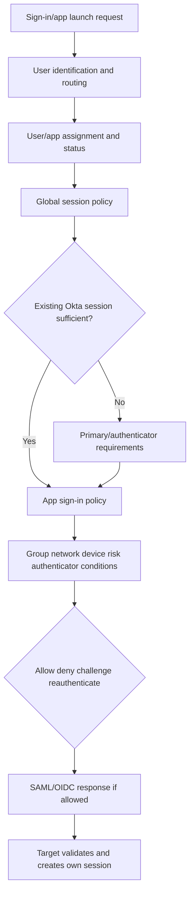

## 12. Global session versus app sign-in policy

| Policy | Main question | Evidence |
|---|---|---|
| Global session policy | How can user establish/maintain Okta session? | Policy/rule ID, session/authenticator event |
| App sign-in policy | What additional confidence for this app? | App/policy/rule, challenge/deny outcome |
| Authenticator enrollment policy | Which authenticators must/can user enroll? | Enrollment status/policy/rule |
| Device assurance | Does device meet required posture? | Device context/assurance outcome |
| Routing/IdP discovery | Which identity provider handles identification? | Routing rule/IdP selection |
| API access policy | Which client/grant/user/scope token rules? | Authorization server/policy/rule/token event |

## 13. Ordered policy and rule evaluation

Policies of a type are considered in priority order; matching conditions lead to rules considered in order. The first applicable rule/settings can control the outcome, while default policy/rule remain last. A policy without rules is not evaluated under current docs. Reading the rule the admin expected is insufficient; identify the applied rule from evidence.

## 🔍 Plain-English deep-dive: Policy evaluation is an airport line of checkpoints, not a vote

Imagine signs directing travelers through ordered checkpoints. The first sign whose conditions match sends the traveler to its ordered booth rules. Once an applicable booth rule matches, that rule applies; later signs do not vote to override it. A broad “allow corporate users” sign placed before a specific rule can capture traffic unexpectedly.

Okta policies/rules are similarly priority-driven. Conditions can include groups, app, network, device, risk, and authentication context. Defaults remain as fallback. The support task is to reconstruct the exact request context and identify the evaluated/applied rule ID, not merely list all configured rules.

The analogy stops because different policy types compose in an authentication pipeline. The lesson is to record global-session rule, app-sign-in rule, authenticator/device result, and System Log outcome in order.

**Memory cue:** Priority is control flow; first applicable rule beats intended rule.

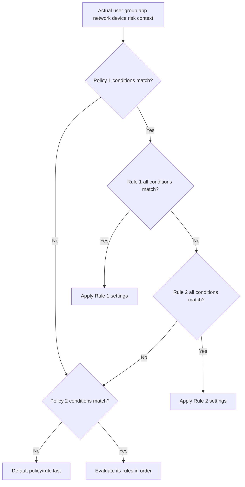

## 14. Network zones and client context

Network zones can use IPs/CIDRs, geography, IP type, or ASN under current features and can feed global/app policies and routing. They are policy inputs, not authentication proof. Proxies, VPNs, NAT, forwarders, IPv4/IPv6, trusted proxy configuration, and IP-chain interpretation can alter the apparent client.

| Network evidence | Question |
|---|---|
| Source/client IP and IP chain | What did Okta evaluate? |
| Proxy/VPN/egress | Which address is expected? |
| Zone ID/type/status | Which configured zone matched? |
| Geolocation/ASN | Was dynamic zone context involved? |
| Policy/rule condition | How did zone affect result? |
| User/device comparison | Why subset differs? |
| Change/audit UTC | Did network configuration recently change? |

## 15. Authenticators, devices, risk, and sessions

| Layer | Symptom | Evidence |
|---|---|---|
| Authenticator enrollment | User asked to enroll/cannot continue | Enrollment policy and user enrollment state |
| Authenticator challenge | Push/passkey/password/etc. fails | Method, outcome/reason, no secret/code |
| Device assurance | Managed/compliant requirement fails | Device ID/context/assurance result |
| Risk/entity/session protection | Step-up/deny/session termination | Risk context/policy event |
| Okta global session | Repeated Okta authentication | Session policy/lifetime/externalSessionId |
| App session | User returns to app despite Okta change | Target session cookie/lifecycle |

## 16. System Log as the evidence spine

The Okta System Log is a near-real-time, read-only org audit/troubleshooting source. One transaction can produce multiple events. Use stable `eventType`, UUID, transaction ID, actor/target IDs, and outcome rather than display text alone.

| System Log field | Support purpose | Caution |
|---|---|---|
| `uuid` | Unique event ID | Distinct from transaction/session |
| `published` | Event publication UTC | Not every external system timestamp |
| `eventType` | Stable action category/catalog | Verify current event catalog |
| `actor` | User/app/client entity performing action | Alternate/display IDs can change |
| `target[]` | Entities acted on | Search by type, not array position |
| `outcome` | Result/reason | One event not entire flow |
| `transaction.id/type` | Correlate event sequence | Sample/split paths possible |
| `authenticationContext` | Provider/credential/session metadata | Does not expose secrets |
| `client`/`request` | Browser/IP/request context | Automated events can have blanks |
| `securityContext` | IP reputation/security metadata | Risk signal, not final truth |
| `debugContext.debugData` | Extra troubleshooting details | Keys/values can change; not data contract |
| `severity`/version | Event classification/schema | Severity is not business impact alone |

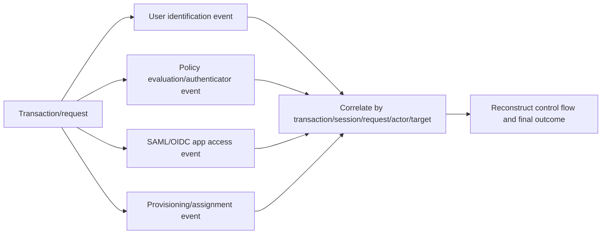

## 17. System Log querying and paging concepts

System Log queries can use `since`, `until`, filters, keyword query, limit, sort order, and an opaque `after` token through the returned next link. Bounded historical queries and polling/persistence semantics differ. Follow the `rel=next` URL/token, do not invent offsets, and use scoped OAuth management access rather than broad API tokens where supported.

| Query concern | Safe support practice |
|---|---|
| Time | UTC ISO range with incident buffer |
| Filter | Stable event type/actor/target IDs; redact PII |
| Keyword | Exploratory only; not stable contract |
| Page | Follow opaque next link until absent |
| Sort | Understand ascending/descending use |
| Rate | Handle 429 and headers/backoff |
| Permission | `okta.logs.read`/least management access as supported |
| Retention/default range | Verify org/product/current limits |

## 18. Event hooks

Okta event hooks asynchronously push eligible System Log event objects to an external HTTPS endpoint. They do not alter the underlying process; inline hooks are the synchronous extension concept. Event hooks are best-effort, at-least-once, can batch multiple events, delay, duplicate, and arrive out of order.

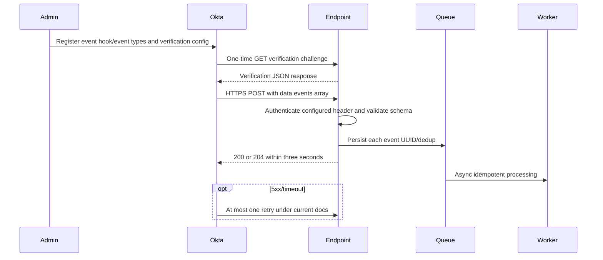

| Event-hook property | Current concept |
|---|---|
| Eligible types | Subset of System Log catalog |
| Verification | One-time GET challenge/header response |
| Ongoing delivery | HTTPS POST with array of LogEvent objects |
| Security | HTTPS plus configured authorization-header secret scheme |
| Acknowledgement | Empty 200/204 promptly within three seconds |
| Retry | At most one retry; 4xx not retried, 5xx retried |
| Semantics | Best effort, at least once, delayed/duplicate/out of order possible |
| Debug | System Log source event plus delivery failure events/hook ID context |

## 19. System Log versus event-hook evidence

| Evidence | Conclusion |
|---|---|
| Source System Log event exists | Okta recorded the underlying event |
| Event type hook-eligible/configured | Delivery should be considered/configured |
| Hook ID in debug context | Hook configured for event, not proof delivered |
| `event_hook.delivery` failure | Okta detected attempt failure |
| Endpoint ingress event UUID | Vendor received event |
| 200/204 | Okta considered delivery accepted |
| Queue/worker/target | Downstream business effect |

## 20. SCIM in Okta: assignment to target lifecycle

Part 063 covers the standard. In Okta, assignment/app-user mapping can trigger downstream create, match/read, update, activation/deactivation, group push, import, or profile-source behavior depending on the app. Okta's current docs describe deprovisioning an Okta-managed user as setting target `active=false` rather than deleting the target resource.

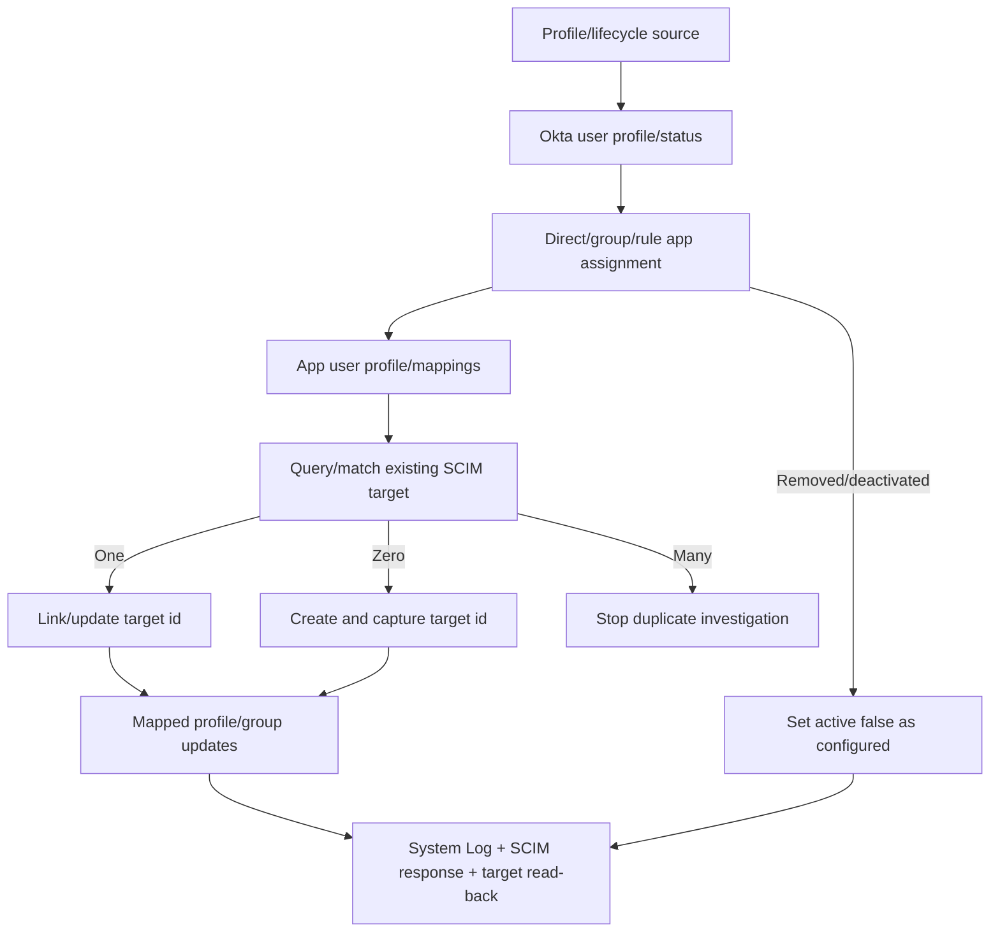

## 21. Profile mapping and source-of-truth questions

| Data element | Candidate owner | Evidence |
|---|---|---|
| Employment status | HR/AD/source app | Source lifecycle event |
| Okta user login | Source/Okta policy | Okta user profile/mapping |
| App username | App-user mapping | App-user profile |
| SCIM externalId | Okta/provisioning client | Outbound correlation |
| Target SCIM id | Downstream service | Provisioning result/read-back |
| Department/manager | Attribute-level source | Mapping/source designation |
| App role/group | Okta group/app target | Assignment/group push/local role |
| Deactivation | Lifecycle/assignment policy | System Log/provisioning/target active |

## 22. SCIM imports and matching

Import can bring target users/groups into Okta or match existing resources depending on configuration. A one-time import is not continuous source authority by default. Duplicate prevention requires approved matching properties, exact source/target IDs, and human-safe review.

| Match outcome | Safe decision |
|---|---|
| Zero target matches | Create only if assignment/source authorized and required data valid |
| Exactly one | Validate identity, link target ID, reconcile |
| Multiple | Stop; do not select first/delete automatically |
| Existing unmanaged account | Establish ownership/roles/data before linking |
| Source user recreated | Treat new source ID versus reused login carefully |

## 23. SCIM deactivation and deletion semantics

Okta docs distinguish target deactivation (`active=false`) from deleting the Okta user object; deleting an already deactivated Okta profile does not necessarily issue target DELETE. Reactivation can set active true. Sessions/tokens/local credentials/ownership remain downstream concerns.

| Lifecycle action | Expected question |
|---|---|
| User unassigned from app | Does configured provisioning deactivate target? |
| Okta user deactivated | Which app assignments/target active states change? |
| Okta user deleted | Was target already deactivated; any target delete? |
| User reassigned/reactivated | Which attributes/groups/roles return? |
| Target user manually disabled | Does import/source overwrite Okta? |
| Local app session/API key | Does SCIM active state revoke it? |

## 24. SCIM rate limiting and retry

Okta current documentation describes handling target SCIM 429 by pausing/rescheduling with Retry-After integer seconds where supported, default delay if absent/unsupported, exponential backoff, and a maximum attempt policy. This is specific product behavior and can change; do not generalize to System Log or event hooks.

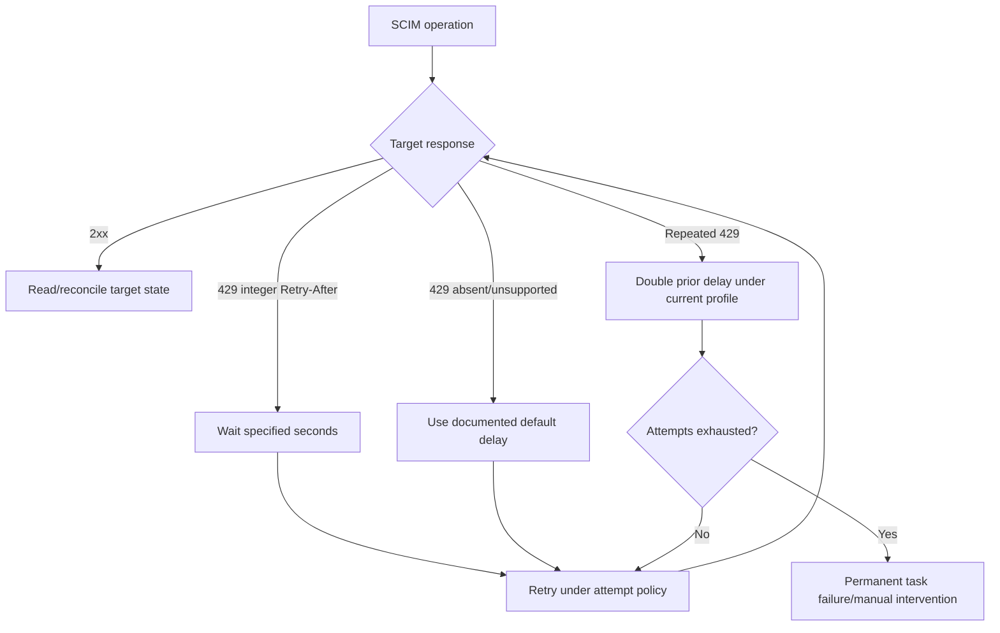

## 25. Sign-in troubleshooting timeline

| Checkpoint | Evidence |
|---|---|
| User identification/routing | Org/domain/user/IdP/routing event |
| User status/assignment | Okta user/app-user/group IDs |
| Global session policy | Applied policy/rule and session result |
| Authenticator/device/network/risk | Challenge/assurance/zone/security context |
| App sign-in policy | Applied app policy/rule outcome |
| SAML/OIDC generation | Protocol event, issuer/app/client/correlation |
| Target validation | Target error/correlation/UTC |
| Target app session | Session created/denied/cached/revoked |

## 26. Worked example 1: User assigned but Okta tile launch denied

**Input:** App appears assigned, but Okta denies access before SAML/OIDC reaches target.

**Reasoning:** Verify org/environment, Okta user/app-user status, assignment path, global session policy, app sign-in policy, group/network/device/risk/authenticator context, applied rule, and System Log outcome/transaction.

**Evidence:** Org/app/user/app-user/group/policy/rule IDs, event UUID/types, transaction/external session, outcome/reason, client/zone/device metadata, UTC.

**Result:** Synthetic app-sign-in rule denies unmanaged devices. Route to policy/device owner; do not change SAML settings.

**Caveat:** System Log debug data is supporting evidence, not stable contract.

## 27. Worked example 2: SAML reaches app, unknown user

**Input:** Okta reports successful federation, target says user not found.

**Reasoning:** Compare Okta user ID, app-user username, NameID format/value mapping, assertion issuer/audience/recipient/time, target account/SCIM ID, and target's matching rule. Keep redacted values.

**Evidence:** App instance, user/app-user/target IDs, mapping name/version, NameID format plus hashed/redacted value, SAML correlation/request IDs, target error UTC.

**Result:** App-user username retained old email while target account uses immutable ID mapping. Correct source/mapping under owner change and reconcile; do not recreate target blindly.

**Caveat:** Never ask for an unredacted assertion in ordinary chat.

## 28. Worked example 3: OIDC wrong issuer after environment change

**Input:** Client validates tokens in preview but rejects production tokens with issuer mismatch.

**Reasoning:** Identify production org/custom domain, org versus custom authorization server, discovery issuer, JWKS URI source, client ID/redirect environment, and client cache. Signature success with wrong issuer still requires rejection.

**Evidence:** Expected/received issuer strings, auth-server/app/client IDs, discovery/JWKS metadata URL class, key ID, target error/correlation/UTC; no token.

**Result:** Production client uses preview discovery metadata. Correct environment trust configuration and retest safely.

**Caveat:** Do not disable issuer validation.

## 29. Worked example 4: SCIM duplicate after app username change

**Input:** Existing target account remains, but Okta creates a second account after user rename.

**Reasoning:** Inventory source Okta user ID, app-user ID/old-new username, SCIM externalId, target IDs, match property, assignment history, create timeout/retry, and target ownership/data. Stop further creates.

**Evidence:** All IDs, mapping/match config names, System Log provisioning events, SCIM status/correlation, target created UTC/roles/data class.

**Result:** Mutable app username was sole match and external correlation was lost. Owner selects safe link/merge/deactivate after data review; fix immutable correlation.

**Caveat:** Do not delete the newer account automatically.

## 30. Worked example 5: User unassigned but target stays active

**Input:** Group rule removes app assignment, yet target account and session remain active.

**Reasoning:** Trace source attributes/rule, group membership, effective unassignment, app-user/provisioning event, SCIM response, target `active`, target-local session/tokens/keys, duplicate/local account, and configured deprovision action.

**Evidence:** Source/user/group/rule/app-user/target IDs, assignment and provisioning UUID/transaction/outcome, target read-back and session audit.

**Result:** SCIM deactivated one target ID, but user signed into an unmanaged duplicate local account. Security/app owner handles residual access.

**Caveat:** Do not ask the departing user to repeatedly test access.

## 31. Worked example 6: Event hook 200 but downstream ticket absent

**Input:** Okta sees successful event-hook delivery; vendor target has no ticket.

**Reasoning:** 200/204 proves acceptance, not processing. Correlate System Log source UUID/transaction, hook ID/eligibility, endpoint ingress, batch item/event ID, queue, worker/DLQ, target operation, and idempotency.

**Evidence:** Event UUID/type/published, hook ID, delivery event, endpoint/queue/operation/target IDs, status/UTC. No raw payload/auth header.

**Result:** Batch parser processed only first `data.events` element. Engineering repairs, replays/reconciles idempotently, and adds batch-count checks.

**Caveat:** Event hooks can batch and arrive out of order.

## 32. Worked example 7: SCIM 429 eventually fails permanently

**Input:** Target repeatedly rate-limits Okta provisioning; automatic retries end in task failure.

**Reasoning:** Review target rate/Retry-After format, operation/user/app, retry attempts/delays, queue/backlog, app assignment blast radius, target capacity, and whether manual retry is now safe. Avoid mass toggling assignment.

**Evidence:** App/user/operation IDs, HTTP 429, Retry-After presence/value type, attempt count/times, System Log outcome, target rate metrics, current desired/actual state.

**Result:** Target returned HTTP-date while current Okta SCIM retry supports integer seconds for this behavior; default/backoff exhausted. Fix target response/capacity, then reprocess and reconcile.

**Caveat:** Revalidate current Okta behavior before relying on retry counts/defaults.

## 33. Customer-safe evidence matrix

| Symptom | Minimum safe evidence | Never request |
|---|---|---|
| User not assigned | Org/app/user/app-user/group/rule IDs and assignment events | Full user profile export |
| Policy deny | Policy/rule IDs, client/zone/device/risk category, System Log outcome | Password/MFA code/device secrets |
| SAML | Issuer/audience/recipient/NameID format/cert key ID/time/correlation | Raw assertion/private key |
| OIDC | Issuer/auth server/client/redirect class/key ID/error/correlation | ID/access/refresh token/client secret |
| SCIM | User/app-user/externalId/target IDs, operation/status/outcome | SCIM bearer token/raw PII body |
| Event hook | Event UUID/type/hook ID/delivery status/queue/target IDs | Authorization-header secret/raw payload |
| System Log | Event type/UUID/transaction/actor/target/outcome/UTC | Broad unredacted export |
| Rate limit | Org/app/operation/429/Retry-After/attempts/backlog | Tight manual retry loop |

## Troubleshooting decision tree

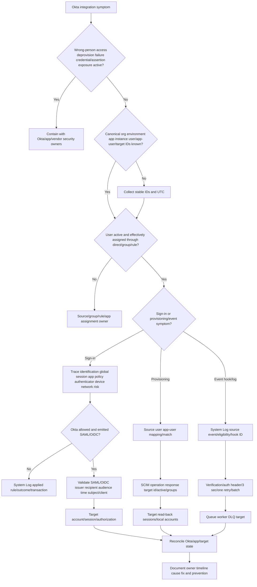

## 34. Common failure modes

| Failure mode | Why it fails | Better behavior |
|---|---|---|
| Company name identifies org | Multiple/custom/preview orgs exist | Canonical org URL/environment/cell |
| Custom domain is Admin/API URL | User/admin/API paths differ | Track canonical/custom/admin/issuer |
| Same user ID across orgs | Orgs are hard boundaries | Namespace every ID by org |
| Okta user equals app user | App-specific mapped profile differs | Track both IDs/profiles |
| Email is immutable identity | Rename/reuse/collision | Stable IDs and approved correlation |
| Assignment is one checkbox | Direct/group/rule/source paths | Effective assignment graph |
| Tile exists means target account active | SSO and SCIM differ | Target read-back/provisioning evidence |
| SSO success means SCIM healthy | Session and lifecycle paths separate | Parallel timelines |
| SCIM success means app access | Target roles/sessions/local policy separate | Validate target authorization |
| SAML signature valid means accept | Issuer/audience/recipient/time/subject remain | Full validation |
| OIDC hostname match is issuer validation | Org/custom auth issuers differ | Exact issuer/discovery/JWKS |
| Policy expected equals policy applied | Priority/context can select another rule | System Log rule/transaction evidence |
| Network zone proves user identity | Context input only | Authentication and policy remain |
| Repeated prompt means Okta session bug | App policy/target session can trigger | Separate global/app/target sessions |
| System Log display message is contract | Human/debug fields can change | Event type/IDs/outcome |
| DebugData key is stable schema | Explicitly troubleshooting-only | Defensive optional use |
| Target array index is fixed | Ordering can vary | Search by target type/ID |
| Hook ID means delivered | Only configured for event | Delivery event/endpoint evidence |
| Event hook exactly once/order | At-least-once/delay/duplicates/out-of-order | UUID dedup and published time/reconcile |
| Event hook affects Okta flow | Asynchronous notification | Inline hook is different concept |
| Return 200 before persistence | Event can be lost | Durable accept then ack |
| Unassign means target DELETE | Often deactivation/active=false | Verify app provisioning semantics |
| Delete Okta user deletes target | Current SCIM lifecycle may not send target delete | Deactivate/read-back/retention policy |
| Retry 429 manually at once | Competes with backoff/increases load | Current product retry and target fix |
| Recreate app integration to fix | Destroys IDs/assignments/evidence | Root-cause exact layer |
| Raw assertion/token/log export in ticket | Credential/PII exposure | Metadata IDs/status/UTC |
| Generic Okta model equals Abnormal | Exact app template unknown | Approved product docs |

## 35. Escalation packet

| Section | Required content |
|---|---|
| Impact | Sign-in/lifecycle/event gap, affected population, security/availability |
| Org | Canonical/custom domain, environment/cell, engine/features, customer |
| Identity | Okta user/app-user/group/source/target IDs and statuses |
| App | App instance ID/type/protocol/assignments/policy/provisioning profile |
| Assignment | Direct/group/rule/import path and change UTC |
| Policy | Global/app/enrollment/device/network/risk rule IDs and applied outcome |
| SSO | SAML/OIDC issuer/client/recipient/audience/key/time/correlation metadata |
| SCIM | Source/externalId/target id/match/mapping/operation/status/active/read-back |
| System Log | Event UUID/type/published/transaction/actor/target/outcome/request IDs |
| Event hook | Hook ID/event eligibility/delivery status/batch/retry/endpoint/queue |
| Changes | App/cert/client/redirect/mapping/source/group/policy/zone/target changes |
| Privacy | No credentials/assertions/tokens/cookies/profiles; protected evidence location |
| Ask | Exact Okta admin/network/device/app/vendor Engineering decision or fix |

## Safe synthetic lab: The Okta Identity Junction 069

### Objective

Build a local paper model of a fictional Okta org connecting assignment, Universal Directory/app-user mapping, Identity Engine policies, SAML/OIDC sign-in, SCIM provisioning, System Log, event hooks, and downstream target state. The unique lab is **The Okta Identity Junction 069**.

The lab creates no Okta org, user, group, app integration, assignment, policy, network zone, authenticator, certificate, OAuth client, token, System Log query, event hook, SCIM request, or target account. All values are fictional metadata.

### Prerequisites

- Local Markdown editor or spreadsheet only.
- Fictional IDs prefixed `ORG-069`, `USER-069`, `APP-069`, `APPUSER-069`, `GROUP-069`, `RULE-069`, `POLICY-069`, `ZONE-069`, `EVENT-069`, `TX-069`, `HOOK-069`, `SCIM-069`, `TARGET-069`, and `CASE-069`.
- Reserved text-only domains under `example.test`; no real Okta/custom domain, issuer, redirect, ACS, SCIM endpoint, or app URL.
- No Okta/Abnormal account, Admin Console, API client, local endpoint, network request, assertion, token, secret, user/profile data, or policy change.
- Artifact label: **local/public lab - synthetic Okta integration metadata only**.
- Record start UTC, zero-live-system/identity/credential statement, learned-only label, and source date August 24, 2026.

### Synthetic identity starter

| Org/user | App/app user | Sign-in context | SCIM/target |
|---|---|---|---|
| `ORG-069-PROD` / `USER-069-A` | `APP-069-A` / `APPUSER-069-A` | Allowed policy | Active `TARGET-069-A` |
| `ORG-069-PROD` / `USER-069-B` | Same app / group-assigned | Device deny | Provisioned |
| `ORG-069-PROD` / `USER-069-C` | App username renamed | SAML unknown user | Duplicate targets |
| `ORG-069-PREVIEW` / `USER-069-D` | Preview app | Wrong OIDC issuer | No production target |

### Lab steps

1. Create the cover with artifact label, UTC, safety boundary, Microsoft-transfer statement, Okta learned-only statement, and Abnormal unknowns.
2. Define org, canonical/custom/admin domain, cell, environment, Universal Directory, Okta user, app user, target user, app instance, assignment, policy, System Log, and hook.
3. Draw org-root ownership and create production/preview/custom-domain identifier cards.
4. Build user/app-user/SAML subject/OIDC subject/SCIM externalId/target-id registers.
5. Create eight source-of-truth and directional profile-mapping cases.
6. Build direct/group/group-rule/import assignment graphs for 16 fictional users.
7. Inventory two app instances of the same catalog product with distinct IDs/protocol/policy/mappings/certs/clients/provisioning.
8. Draw parallel SSO, SCIM, and target-authorization paths.
9. Model SAML issuer/ACS/audience/NameID/cert/time/request/target session metadata without an assertion.
10. Model OIDC issuer/discovery/JWKS/client/redirect/state/nonce/PKCE/token-type metadata without a token.
11. Compare org and custom authorization servers and create wrong-issuer cases.
12. Build Identity Engine identification/assignment/global session/authenticator/app policy/protocol/target pipeline.
13. Create six policy contexts and walk policy/rule priority to applied rule.
14. Add network zone, proxy/VPN/IP chain, device assurance, risk, authenticator, and session metadata.
15. Build System Log records with event UUID/type/published/actor/targets/outcome/client/auth/security/transaction/request/debug fields.
16. Correlate five-event sign-in and five-event provisioning transactions.
17. Build bounded and polling System Log query/page worksheets using opaque next links only.
18. Model event-hook GET verification, eligible event types, batched POST, auth header metadata, three-second 200/204, one retry, UUID dedup, and System Log delivery evidence.
19. Build SCIM assignment -> app-user mapping -> match/create/link/update/deactivate -> target read-back flow.
20. Create import/matching/duplicate, profile sourcing, Group Push, reactivation, and deprovisioning cases.
21. Model 429 Retry-After integer/absent/unsupported cases and current backoff/attempt behavior.
22. Run the decision tree on policy deny, SAML unknown user, OIDC wrong issuer, SCIM duplicate, deprovision residual access, event-hook batch loss, and exhausted 429.
23. Draft two customer updates and Okta admin, network/device, app owner, and vendor Engineering escalation packets.
24. Deliver a 90-second Okta user/app-user answer, 90-second policy/System Log answer, 90-second SSO-versus-SCIM answer, and 60-second honesty boundary.
25. Validate source URLs/date, cleanup, privacy, zero-activity statement, and rubric.

### Expected evidence

- Okta org-root and production/preview/custom-domain maps.
- User/app-user/protocol/SCIM/target identifier register.
- Eight source/mapping cases and 16-user assignment graph.
- Two app-instance comparison.
- Parallel SSO/provisioning/target architecture.
- SAML and OIDC metadata validation workbooks.
- Identity Engine/policy priority and network/device/risk cases.
- System Log schema, transaction, query, and pagination workbooks.
- Event-hook verification/batch/retry/dedup/delivery evidence.
- SCIM matching/lifecycle/group/rate/reconciliation cases.
- Seven decision-tree cases, two customer updates, and four escalations.
- Source ledger dated **August 24, 2026**.
- Spoken Microsoft-transfer, Okta-learned, and Abnormal-unknown statements.

### Cleanup and privacy

- Confirm every org/domain/cell/user/group/rule/app/app-user/policy/zone/event/transaction/hook/SCIM/target/case is fictional and includes `069`.
- Confirm all domains use `example.test` and no valid issuer, discovery, JWKS, ACS, redirect, assertion, token, cookie, certificate/private key, API/SCIM endpoint, request, or auth header exists.
- Remove real org URLs, customers, user/app/target IDs, email/profile values, policy/network/device data, System Log events, assertions/tokens, screenshots, and target records.
- Confirm no Okta/Abnormal/Admin/API client/endpoint/org/account/network request was used.
- Delete the artifact if credentials, identity data, or customer evidence cannot be reliably removed.
- Record cleanup UTC and: `Synthetic paper Okta integration exercise only; zero live org, user, app, assignment, policy, network zone, authenticator, assertion, OAuth token, API query, event hook, SCIM request, target account, or production activity.`

### Validation rubric

| Dimension | Fail | Developing | Pass |
|---|---|---|---|
| Org | Company name only | Org URL | Canonical/custom/admin domain, environment, cell, exact app instance |
| Identity | Email equals identity | Okta user ID | Okta user/app-user/protocol/externalId/target-id/source mapping |
| Assignment | One checkbox | Direct/group | Direct/group/rule/import effective graph and app-user creation |
| SSO/SCIM | One connection | Separates paths | Policy/protocol/session versus mapping/lifecycle/read-back plus target auth |
| Policy | Lists rules | Checks order | Actual context, layered policy IDs, applied rule, System Log outcome |
| Logs | Display message | Event type | UUID/transaction/actor/target/outcome/context; debug optional/non-contract |
| Hooks | Webhook equals once | Knows retry | Verification, batch, at-least-once, order, one retry, UUID dedup, System Log |
| SCIM | Recreate user | Knows active | Match IDs, source/mapping, deactivate/reactivate, target sessions, 429 retry |
| Evidence | Raw assertion/profile | Redacts | Stable IDs/metadata/UTC, no credentials/assertions/tokens/profiles |
| Honesty | Claims Okta admin | Says learned | experience transfer, Okta paper lab, Abnormal unknown |

## 36. Official Source Anchors

All sources were verified and recorded with guide currency date **August 24, 2026**. Okta features, engine behavior, product licensing, event types, policies, rate limits, APIs, and UI change. Revalidate current org and app documentation before production actions.

| Official or primary source | What it anchors | Boundary |
|---|---|---|
| [Okta - Organizations](https://developer.okta.com/docs/concepts/okta-organizations/) | Org root, URLs/custom domains, production/preview, cells, hard boundaries, features/rate | Customer org/product specific |
| [Okta - Universal Directory](https://developer.okta.com/docs/concepts/universal-directory/) | User/app-user profiles, schemas, sourcing, mappings, groups/rules, directory integrations | Source authority must be configured/verified |
| [Okta - Policies](https://developer.okta.com/docs/concepts/policies/) | Policy/rule priority, global/app/authenticator/device/API/routing concepts | Engine/product/feature differences |
| [Okta Help - Network zones](https://help.okta.com/oie/en-us/content/topics/security/network/network-zones.htm) | Zone inputs and policy/routing uses | Network context is not identity proof |
| [Okta - System Log API](https://developer.okta.com/docs/reference/api/system-log/) | Read-only org events, fields, time/filter/paging, OAuth scope, debug non-contract | Retention/rate/product/current event catalog varies |
| [Okta - Event hooks](https://developer.okta.com/docs/concepts/event-hooks/) | Async versus inline, eligible System Log events, verification, batch, at-least-once/order/retry/rate/debug | Header auth profile needs secure design; no live lab |
| [Okta - SCIM concepts](https://developer.okta.com/docs/concepts/scim/) | Provisioning CRUD, assignment/mapping/source, active/deprovision, imports, 429 retry | Standards plus Okta profile; verify app behavior |
| [RFC 7643 - SCIM Core Schema](https://www.rfc-editor.org/rfc/rfc7643.html) | `id`, `externalId`, Users/Groups, schemas/active | Vendor profiles vary |
| [RFC 7644 - SCIM Protocol](https://www.rfc-editor.org/rfc/rfc7644.html) | SCIM operations/filter/page/PATCH/errors | Optional capabilities |
| [OASIS SAML 2.0 Core](https://docs.oasis-open.org/security/saml/v2.0/saml-core-2.0-os.pdf) | Assertion/protocol validation | Okta/target profiles control |
| [OpenID Connect Core 1.0](https://openid.net/specs/openid-connect-core-1_0.html) | OIDC client/token validation | Exact authorization server/profile controls |

### Source-use discipline

- Namespace every object by canonical org/environment and app instance.
- Use stable event type/UUID/transaction/actor/target/outcome; treat display/debug text as non-contract.
- Trace layered applied policies rather than editing the expected rule.
- Keep SSO, provisioning, target authorization, and sessions separate.
- Never request credentials, assertions, tokens, cookies, SCIM secrets, or raw profiles.
- Keep Abnormal's Okta app/configuration/evidence explicitly unknown.

## Likely Interview Questions

### Q1. What is the difference between an Okta user and an app user?

**Model answer:** The Okta user is the central Universal Directory identity. Assigning an app creates/uses an app-user profile for that specific app instance, with mapped attributes such as app username. SAML NameID/OIDC subject and SCIM target IDs add more identifiers. I track all of them rather than matching by email/display name alone.

### Q2. How does effective app assignment work in Okta?

**Model answer:** A user can be assigned directly or through an Okta/imported group, potentially populated by a group rule from sourced profile attributes. I trace source attributes, rule ID/status, group membership, app-group assignment, app-user creation, and unassignment events. The tile or central user state alone does not prove target provisioning or session state.

### Q3. How do global session and app sign-in policies differ?

**Model answer:** Global session policy controls how a user establishes and maintains the Okta session. App sign-in policy can require additional authentication confidence for a specific/shared set of apps. Identity Engine can also evaluate authenticators, device assurance, network zones, and risk. I identify the actual applied policy/rule from System Log and priority/context rather than the rule an admin expected.

### Q4. How would you troubleshoot an Okta SAML or OIDC sign-in failure?

**Model answer:** First verify org, app instance, user/app-user, assignment, user status, applied session/app policy, authenticator/device/network context, and System Log transaction/outcome. If Okta emits protocol output, validate SAML issuer/recipient/audience/signature/time/NameID or OIDC exact issuer/discovery/JWKS/client/redirect/state/nonce/PKCE/token type, then target account/session authorization.

### Q5. What makes the Okta System Log useful?

**Model answer:** It is the near-real-time org audit and troubleshooting spine. I use event type, UUID, published UTC, actor, target types/IDs, outcome, transaction/request/external session, authentication/client/security context, and correlation. DebugContext can help but its fields can change, so I don't code or conclude solely from debug/display strings.

### Q6. How do Okta event hooks behave?

**Model answer:** They asynchronously push eligible System Log event objects after one-time endpoint verification. Deliveries can batch events, are best-effort and at least once, and can be delayed, duplicated, or out of order. The receiver authenticates the configured header, durably stores/dedups each UUID, responds 200/204 within three seconds, and handles at most one retry under current docs. System Log proves source/delivery failures.

### Q7. What happens when a user is deprovisioned through Okta SCIM?

**Model answer:** Under the current Okta model, unassignment/deactivation commonly sends target `active=false`; deleting an already deactivated Okta profile does not necessarily send target DELETE. I trace source lifecycle, assignment, app user, mapping, SCIM operation, target `id`/active, groups/roles, sessions/tokens/local duplicates, and restoration policy.

### Q8. What are your Okta experience boundaries?

**Model answer:** My Okta knowledge is standards/current-doc and synthetic-lab based. My production strength is Microsoft identity and enterprise support, RCA, escalation, and customer communication. I do not claim Okta administration or production SCIM/SSO setup, and Abnormal's Okta integration remains unknown without approved documentation.

## Memory Hooks

- **Org is the hard tenant; canonical domain identifies it.**
- **Custom domain brands sign-in; it does not merge orgs.**
- **Okta user is central; app user is app-specific.**
- **Direct, group, rule, and source build effective assignment.**
- **SCIM prepares account; SSO creates session; target authorizes actions.**
- **SAML validates issuer, recipient, audience, signature, time, and subject.**
- **OIDC validates exact issuer, keys, client/audience, time, nonce, and type.**
- **Global session gets into Okta; app policy gets into the app path.**
- **Priority is control flow; find the applied rule.**
- **Network zone is policy context, not identity proof.**
- **System Log: event type, UUID, transaction, actor, target, outcome.**
- **DebugData helps today; it is not tomorrow's schema.**
- **Hook ID means configured, not delivered.**
- **Event hooks batch and deliver at least once; dedup UUIDs.**
- **SCIM `active=false` is not target DELETE or session revocation.**
- **429 retry behavior is product-path specific.**
- **Prior-role work is production transfer; Okta is learned architecture.**

## Completion Checklist

- [ ] I can state the Section goal and joined identity/sign-in/provisioning/log rule.
- [ ] I can identify canonical/custom/admin org domains, environment, and cell.
- [ ] I can distinguish Okta user, app user, SAML/OIDC subject, SCIM IDs, and target account.
- [ ] I can trace profile/attribute sources and directional mappings.
- [ ] I can build effective direct/group/rule/import app assignment.
- [ ] I can separate SSO, SCIM provisioning, target authorization, and sessions.
- [ ] I can apply safe SAML and OIDC validation metadata.
- [ ] I can distinguish org and custom authorization-server issuers.
- [ ] I can trace Identity Engine identification, global session, app policy, authenticator, device, network, and risk.
- [ ] I can walk policy/rule priority and identify the actual applied rule.
- [ ] I can interpret System Log UUID/type/published/actor/targets/outcome/transaction/context.
- [ ] I treat display/debug fields as optional troubleshooting aids, not stable contracts.
- [ ] I can follow opaque System Log next links and handle rate/permissions.
- [ ] I can explain event-hook verification, batches, at-least-once/order, three-second ack, one retry, and System Log evidence.
- [ ] I can trace Okta assignment/mapping/match/SCIM/target lifecycle.
- [ ] I can investigate duplicate/deactivation/import/group/rate cases safely.
- [ ] I can reconcile target sessions/local accounts after deprovisioning.
- [ ] I can create a privacy-minimized escalation packet.
- [ ] I completed or can explain **The Okta Identity Junction 069**.
- [ ] The lab includes Prerequisites, Expected evidence, Cleanup and privacy, and Validation rubric.
- [ ] I used no live org, user, app, policy, assertion, token, API, hook, SCIM operation, or target account.
- [ ] I can state experience transfer, Okta learned, and Abnormal unknown boundaries.
- [ ] I checked Official Source Anchors and recorded **August 24, 2026**.
- [ ] I can answer exactly Q1-Q8.

[Next: Part 070 - Splunk CrowdStrike and Cortex SOAR Integration Lab](Part-070-splunk-crowdstrike-and-cortex-soar-integration-lab.md)