# Part 070 - Splunk CrowdStrike and Cortex SOAR Integration Lab

## Section goal

This Part builds a beginner-friendly, support-ready model for a security integration spanning CrowdStrike Falcon, Splunk, and Cortex XSOAR. It is explicitly a **learned architecture and synthetic paper lab**. You must not claim production Splunk administration, CrowdStrike operation, Cortex XSOAR administration, detection response, endpoint containment, SIEM search ownership, playbook deployment, or API integration unless real evidence supports that statement.

A **security information and event management (SIEM)** platform collects security data, parses and indexes it, makes it searchable, correlates activity, and can generate alerts. Splunk can fill that role, but the exact products, topology, apps, add-ons, data models, retention, permissions, and detection content vary. Receiving bytes is not the same as indexing an event; indexing is not the same as parsing or normalizing it correctly; searchability is not the same as a correlation search generating a notable event or case.

An **endpoint detection and response (EDR)** platform records endpoint behavior, detects suspicious activity, provides investigation context, and can expose response actions. CrowdStrike Falcon can fill that role. Its APIs are organized into service collections and authorized by OAuth2 API clients with assigned scopes. Detections, alerts, incidents, hosts/devices, event streams, and bulk data exports have distinct identifiers and delivery/retrieval models. A source detection existing in Falcon does not prove that a collector retrieved it, Splunk indexed it, XSOAR fetched it, or a responder acted on it.

A **security orchestration, automation, and response (SOAR)** platform connects tools, creates or enriches incidents, runs commands, and automates workflows through playbooks. Cortex XSOAR can fill that role. An integration instance stores configuration and credentials, `fetch-incidents` imports new source records according to a checkpoint, classification and mapping shape them into incidents, context carries structured task outputs, and playbooks orchestrate tasks. A test-module success proves only the tested connection/capability. An imported incident does not prove a playbook completed, and a successful command response does not prove the intended external security state unless it is read back and reconciled.

These systems can be connected in several supported architectures. CrowdStrike data might flow directly to Splunk, directly to XSOAR, through a storage/stream service, through a vendor add-on, or through a customer-built collector. Splunk may create a detection/notable that XSOAR fetches, while XSOAR separately enriches or acts through CrowdStrike. Never assume a specific arrow from product names alone. First document the approved topology and ownership.

The central support rule is:

> Identify source tenant/region and stable source object ID, retrieval mode and checkpoint, delivery request/batch and acknowledgement, Splunk index/source/sourcetype/event time plus searchable result, normalization/detection ID, XSOAR instance/fetch checkpoint/mirror ID/incident ID, playbook/task/command ID, target action/read-back state, UTC, and owner before rotating credentials, rewinding cursors, replaying events, changing searches, enabling playbooks, or taking endpoint action.

This Part covers SIEM/EDR/SOAR roles; common integration topologies; CrowdStrike OAuth2 clients, scopes, regions, service collections, detection/incident/host identity, query-versus-entity retrieval, pagination, rate handling, streaming and bulk-delivery checkpoints; Splunk HEC and supported collector concepts, token/index/source/sourcetype/host/time, acknowledgements, indexes, parsing, CIM normalization, search and detection; Cortex XSOAR integration instances, credentials, test module, fetch incidents, first fetch, `lastRun`, pagination, deduplication, raw JSON, classification/mapping, incident context, commands, playbooks, approvals, response safety, and audit; plus integrated troubleshooting and reconciliation.

It provides no Splunk, CrowdStrike, Cortex, Palo Alto Networks, or Abnormal tenant; no HEC token, Falcon API client, XSOAR credential, search, event stream, API request, integration instance, incident, playbook, command, endpoint action, containment, account change, or production data. Abnormal's supported Splunk, CrowdStrike, or Cortex XSOAR integration architecture, authentication, schemas, event types, mappings, actions, ownership, and troubleshooting evidence remain proprietary unknowns unless approved documentation states them.

## Learning outcomes

After completing this Part, you should be able to:

- define SIEM, EDR/XDR, SOAR, source event, detection, alert, incident, notable, case, integration instance, playbook, command, context, checkpoint, and reconciliation;
- draw and challenge multiple possible CrowdStrike-Splunk-XSOAR topologies instead of assuming a direct pipeline;
- distinguish CrowdStrike tenant/customer identity, cloud region, OAuth2 API client ID, scope, access token, service collection, operation, detection/alert ID, incident ID, host/device ID, and stream/checkpoint;
- explain why API query operations can return IDs that must be hydrated by entity/detail operations;
- apply bounded time, pagination/cursor, rate-limit, retry, overlap, deduplication, and checkpoint-commit reasoning to CrowdStrike retrieval;
- distinguish event-stream, bulk data replication, periodic API polling, and webhook/push-style delivery models conceptually;
- explain Splunk index, indexer, source, sourcetype, host, event time, index time, raw event, field extraction, tag, event type, data model, CIM, search, alert, and notable/case;
- distinguish a successful HEC HTTP response, HEC indexer acknowledgement, an indexed raw event, a correctly parsed event, a CIM-normalized event, and a detection result;
- describe safe HEC event metadata, channel/acknowledgement concepts, idempotent resend design, token scope, TLS, and destination index controls without exposing a token;
- use source event IDs and UTC to prove count, freshness, completeness, duplicates, schema, time extraction, index routing, and searchable state;
- define Cortex XSOAR content pack/integration, integration instance, command, `test-module`, fetch interval, first-fetch window, `lastRun`, `seen_ids`, cursor, `dbotMirrorId`, `rawJSON`, classifier, mapper, incident, context, War Room, and playbook;
- explain how XSOAR fetch logic prevents gaps/duplicates across equal timestamps, page limits, partial failures, and restarts;
- distinguish source retrieval, incident creation, mapping, playbook start, task completion, command acceptance, target execution, and read-back;
- design human approval, least privilege, scope/asset allowlists, dry run, blast-radius gates, rollback, and emergency-stop controls for SOAR response;
- troubleshoot missing, delayed, duplicate, malformed, mis-timed, mis-normalized, misclassified, stuck-playbook, unauthorized, and misleading-success cases;
- build a source-to-SIEM-to-SOAR-to-target evidence ledger with immutable IDs, UTC, counts, status, and ownership;
- create a privacy-minimized escalation packet without credentials, tokens, authorization headers, endpoint data, raw security payloads, command secrets, or customer identifiers; and
- present all three products as learned architecture while using prior production support, incident handling, ETW/log correlation, networking, identity, and escalation as transferable strengths.

## JD Mapping

| Supplied role signal | Capability built | Your transferable evidence | Boundary |
|---|---|---|---|
| Splunk ecosystem | Ingestion, index/source/sourcetype/time, search, CIM, alert evidence | Microsoft telemetry/log correlation | Learned architecture only |
| CrowdStrike ecosystem | OAuth scopes, source IDs, detections/incidents/hosts, API/stream retrieval | Security/identity/network investigation | No Falcon production claim |
| Cortex XSOAR | Instances, fetch, mapping, context, playbooks, commands, audit | Automation/RCA workflow thinking | No XSOAR production claim |
| Integrations | Joined source-delivery-index-fetch-action ledger | APIs, distributed troubleshooting | Synthetic metadata only |
| Customer troubleshooting | Missing/delayed/duplicate/schema/permission/playbook diagnosis | critical situation and escalation | No customer security data |
| SaaS security | Least privilege, secret handling, approvals, rollback, audit | Microsoft security experience | No live response actions |
| Networking | DNS/TLS/proxy/timeout/retry/rate isolation | Production networking support | No endpoint bypass |
| APIs | OAuth clients/scopes, pagination/cursors, checkpoints, idempotency | REST/JSON working knowledge | No API calls in lab |
| Incident response | Separates detection, investigation, containment, verification | Structured incident practice | No analyst/IR ownership claim |
| Cross-functional work | Routes source, SIEM, SOAR, network, IAM, security, and vendor owners | Enterprise collaboration | Ownership is deployment-specific |

## Candidate honesty note

| Evidence tier | Safe statement | Do not imply |
|---|---|---|
| **Production transfer - Microsoft** | “I transfer layered logging, identity, API, networking, incident, and escalation methods.” | Microsoft telemetry equals Splunk/Falcon/XSOAR internals |
| **Local/public lab** | “I built a synthetic evidence and control-plane model without products or endpoints.” | A live SIEM/EDR/SOAR deployment |
| **Learned architecture - three platforms** | “I verified core concepts against current vendor documentation.” | Admin/operator production experience |
| **Standards/protocol knowledge** | “I apply OAuth, HTTP, TLS, JSON, timestamps, pagination, and idempotency.” | Exact vendor endpoint/profile behavior without docs |
| **Proprietary unknown** | “Abnormal's supported integrations require approved product documentation.” | Public vendor docs define Abnormal's implementation |

Safe interview language:

> “My Splunk, CrowdStrike, and Cortex XSOAR knowledge is current-doc and synthetic-lab based. My production strength is enterprise support: correlating distributed evidence, isolating identity/network/API layers, managing incidents, and producing engineering-ready escalations. For this integration, I would identify the Falcon tenant/region/client scopes/source object and checkpoint; prove Splunk delivery, index, source, sourcetype, event/index time, searchability, and normalization; then prove XSOAR instance, fetch `lastRun`, mirror/incident IDs, mapping, playbook task, command, and external read-back. I would not request tokens, authorization headers, raw endpoint telemetry, or execute response actions outside approved controls.”

## 1. SIEM, EDR, and SOAR from zero

| Term | Plain meaning | Why it matters | Memory hook |
|---|---|---|---|
| SIEM | Search/correlation system for security data | Central visibility and detections | Library plus security analyst |
| EDR | Endpoint behavior/detection/response platform | Rich endpoint context and controls | Flight recorder plus brakes |
| XDR | Broader cross-domain detection/response model | Joins endpoint, identity, network, cloud, email | More sensors, joined investigation |
| SOAR | Workflow/orchestration platform | Repeatable enrichment and response | Air-traffic controller |
| Event | One recorded occurrence | Atomic evidence unit | Receipt |
| Detection/alert | Rule/model says activity merits attention | Starts investigation | Alarm |
| Incident/case | Grouped work item with state/owner/history | Human response lifecycle | Case folder |
| Playbook | Ordered workflow of tasks/conditions/actions | Repeatability and automation | Checklist that can execute |
| Checkpoint | Durable resume position | Avoids gaps/duplicates | Bookmark |
| Reconciliation | Compare intended and actual states | Success must be verified | Inventory count |

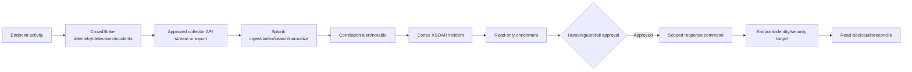

## 2. Do not assume one topology

The products do not establish the arrows. An organization might ingest Falcon data into Splunk and fetch Splunk alerts into XSOAR. It might fetch Falcon alerts directly into XSOAR while also sending raw Falcon telemetry to Splunk. XSOAR might query Splunk only for enrichment. The exact integration could use vendor apps, REST APIs, streaming, files in object storage, HEC, message queues, or supported brokers.

| Topology | Strength | Risk/support question |
|---|---|---|
| Falcon -> Splunk -> XSOAR | Central SIEM detection controls cases | Which Splunk alert/notable is source? |
| Falcon -> XSOAR direct; Falcon -> Splunk parallel | Fast source case plus search history | Duplicate incidents/correlation IDs |
| Falcon export -> storage -> collector -> Splunk | Durable high-volume pipeline | Manifest/checkpoint/object lag |
| Falcon stream -> consumer -> Splunk HEC | Near-real-time | Stream cursor, consumer, HEC ack |
| XSOAR -> Falcon command | Direct enrichment/response | Scope, approval, target/read-back |
| XSOAR -> Splunk search | Investigation enrichment | Search permissions/time/window/result limits |
| Splunk -> XSOAR webhook/API | Push alert delivery | Delivery ack versus incident creation |
| XSOAR fetches Splunk | Pull with `lastRun` | Cursor/time/dedup/poll interval |

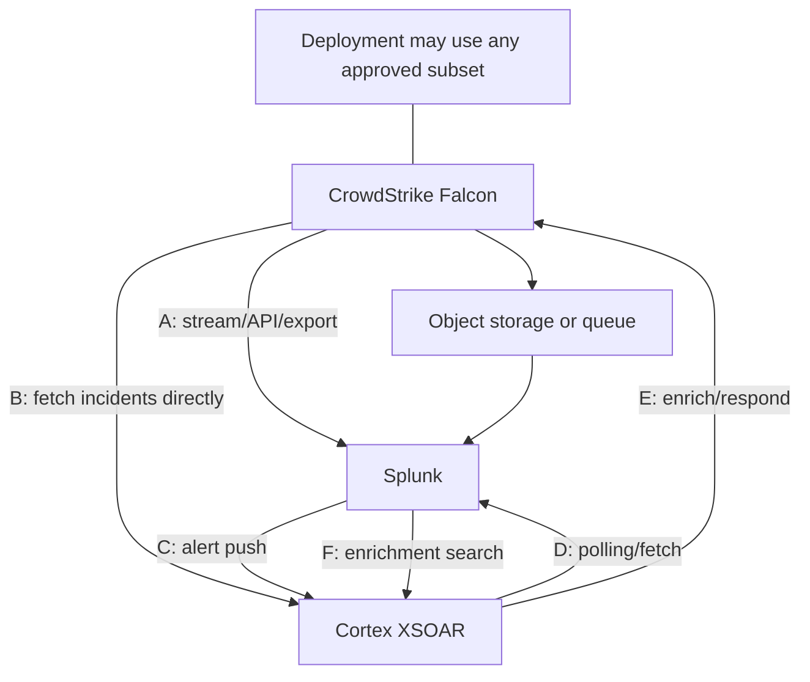

## 🔍 Plain-English deep-dive: A product list is not a wiring diagram

Knowing that a building contains a smoke detector, a security desk, and a sprinkler controller does not reveal the wiring. The detector might call the desk, the desk might manually activate sprinklers, or a certified controller might act automatically. There can be parallel feeds and redundant paths.

CrowdStrike, Splunk, and XSOAR are similar. CrowdStrike can be a source and response target. Splunk can ingest raw data or emit detections. XSOAR can fetch from either product, receive pushed cases, search Splunk, or issue Falcon commands. Product names alone do not prove which path carries the customer's event.

The analogy stops because software paths have credentials, scopes, schemas, checkpoints, retries, and versioned content. The support lesson is to demand a deployment-specific data-flow diagram containing each source, transport, destination, identity, checkpoint, transformation, and owner before troubleshooting.

**Memory cue:** Inventory products, then prove arrows.

## 3. One item, many identities

An activity can be represented by multiple objects. Preserve every native ID and map explicitly.

| Layer | Example fictional identity | Purpose |
|---|---|---|
| Falcon source event | `FALCON-EVENT-070-A` | Atomic source occurrence |
| Falcon detection/alert | `FALCON-DETECT-070-A` | Detection work object |
| Falcon incident | `FALCON-INC-070-A` | Grouped Falcon investigation |
| Falcon host/device | `FALCON-AID-070-A` | Endpoint identity |
| Collector batch | `BATCH-070-A` | Retrieval/delivery unit |
| Stream/cursor | `CURSOR-070-A` | Resume position |
| HEC request/channel/ack | `HEC-REQ/CHANNEL/ACK-070-A` | Splunk delivery evidence |
| Splunk event | `_raw` plus `_time`/`_indextime`/index | Indexed occurrence |
| Splunk alert/notable | `SPLUNK-NOTABLE-070-A` | SIEM detection/case source |
| XSOAR mirror/source ID | `MIRROR-070-A` | External dedup/link key |
| XSOAR incident | `XSOAR-INC-070-A` | SOAR case |
| XSOAR playbook/task | `PB/TASK-070-A` | Workflow execution |
| Command/action | `CMD/ACTION-070-A` | Response attempt |
| Target operation | `TARGET-OP-070-A` | External effect/read-back |

## 4. The state ladder

| State | What it proves | What it does not prove |
|---|---|---|
| Source object exists | Falcon recorded source item | Collector retrieved it |
| API/stream returned item | Collector saw item | Durable checkpoint/delivery |
| Collector persisted batch | Local durable receipt | Splunk accepted it |
| HEC HTTP success | HEC accepted valid-looking request | Indexed/searchable/parsing complete |
| HEC ack true | Documented replication/ack state | Correct parsing/normalization/detection |
| Splunk raw search hit | Event indexed/searchable in selected time/index | Correct fields/CIM/alert |
| CIM search hit | Required tags/fields normalized | Detection fired or SOAR imported |
| Splunk alert/notable | Detection logic produced result | XSOAR incident created |
| XSOAR fetch saw source | Integration retrieved it | Classification/mapping/playbook success |
| XSOAR incident exists | Case imported/created | Playbook or response complete |
| Task command accepted | XSOAR/integration accepted execution | External target changed |
| Target read-back matches | Desired external state observed | Long-term persistence/no side effects |

## 5. CrowdStrike tenant, cloud region, and API identity

CrowdStrike Falcon is tenant- and region-aware. The exact customer/tenant identifier, cloud/base URL or autodiscovered region, OAuth2 API client, assigned scopes, product entitlements, API operation, and object type must align. A token from a valid client can still lack the required service scope or target the wrong regional API.

| CrowdStrike context | Support question |
|---|---|
| Customer/tenant identifier | Which exact Falcon tenant owns object? |
| Cloud region/base URL | Which regional endpoint is authoritative? |
| API client ID | Which workload identity is used? |
| Scope names/access | Does client have minimum read/write operation scope? |
| Credential ID/rotation UTC | Which secret version is active, without value? |
| Product entitlement | Is API/data source licensed/enabled? |
| Service collection/operation | Which API contract is called? |
| Source object type/ID | Detection, alert, incident, host, event, audit? |

## 6. CrowdStrike OAuth2 clients and scopes

An API client uses a client ID and secret to obtain a short-lived access token under its assigned scopes. Official FalconPy examples explicitly recommend not hardcoding credentials and demonstrate service-specific scope requirements. The secret and access token are never support evidence.

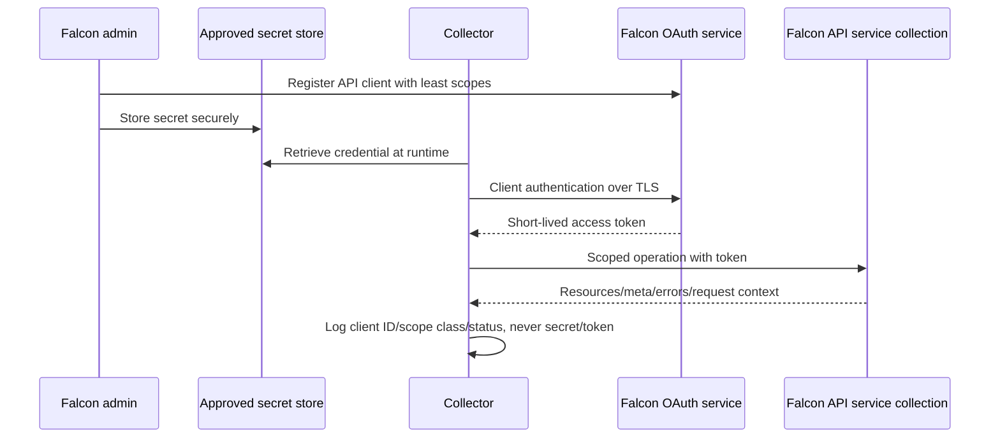

| Auth symptom | Likely layer | Safe evidence |
|---|---|---|
| Token request rejected | Client ID/secret/region/status | Client ID, credential ID, status, UTC |
| 401 after prior success | Expired/invalid token or wrong region | Token age class, refresh result, base URL |
| 403 | Missing scope/entitlement/tenant role | Operation and configured scope names |
| Some operations work | Service-specific scope difference | Successful/failed operation IDs |
| After rotation only one node fails | Stale secret cache/deployment | Credential version and instance/node IDs |
| TLS/proxy error | Network trust path | DNS/TLS/proxy metadata, no bypass |

## 7. Service collections and operation contracts

Falcon APIs are grouped into service collections. FalconPy provides service classes aligned to collections and an all-in-one class; both abstract token handling. This is useful, but an SDK does not erase scope, pagination, region, rate, schema, or business-state requirements.

| Contract item | Why it matters |
|---|---|
| Service collection | Scope and object domain |
| Operation ID/method/path class | Exact API behavior |
| Query/filter/sort | Which IDs qualify and in what order |
| Entity/detail operation | Hydrates IDs into objects |
| Pagination metadata | Completeness/resume |
| Response resources/errors | Partial versus full success |
| Rate-limit headers/status | Backoff/capacity |
| Schema/version/date | Mapping compatibility |
| Request/correlation ID | Vendor escalation |

## 8. Query IDs, then hydrate entities

Many security APIs use a two-stage pattern: query IDs using filters and sorting, then request entity details for those IDs. Treating the first query response as full objects can produce empty fields; retrieving only the first page produces silent gaps.

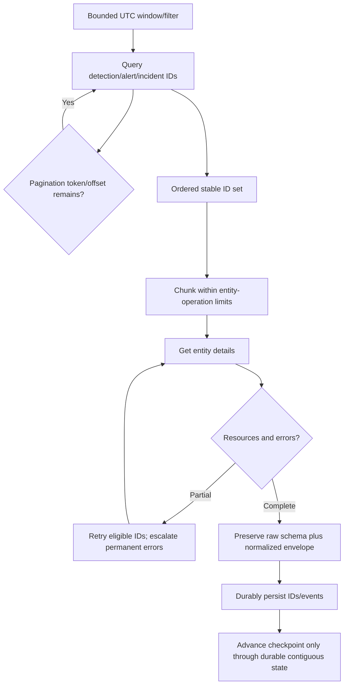

## 9. Detections, alerts, incidents, and hosts

Product terminology evolves, and exact schemas depend on current APIs. The support model keeps object types distinct.

| Object | Concept | Correlation caution |
|---|---|---|
| Raw telemetry/event | Endpoint/security occurrence | High volume; may not be detection |
| Detection/alert | Analytic result for suspicious behavior | Status/severity can update |
| Incident | Grouped related activity/investigation | One-to-many with detections |
| Host/device | Endpoint represented by stable device/AID | Hostname can change/reuse |
| User/process/file/network entity | Evidence linked to activity | Sensitive; minimize payload |
| Response operation | Action request/status | Acceptance is not final target state |
| Audit event | Configuration/operator/API activity | Separate from detection telemetry |

## 10. Retrieval modes

| Mode | Typical purpose | State/checkpoint | Main failure |
|---|---|---|---|
| Periodic REST API polling | Detections/incidents/entities | Time+IDs or cursor/offset | Gaps/duplicates/rate limits |
| Event stream | Near-real-time event notification | Stream/session/offset | Disconnect/resume/order |
| Bulk data replication/export | High-volume telemetry files | Manifest/object/key/checkpoint | Missing/late/duplicate objects |
| Vendor add-on/connector | Packaged ingestion | App checkpoint/config | Version/schema/permission |
| Push/webhook-style feed | Event-triggered delivery where supported | Delivery/event IDs | Retry/dedup/receiver |

Do not label every feed “API polling.” Obtain current product documentation for the configured method.

## 🔍 Plain-English deep-dive: A checkpoint is a signed bookmark, not “last time the job ran”

A reader can stop halfway through a page. If the bookmark is moved to the next chapter before the current page is safely copied, a crash causes missing text. If the bookmark never moves, the reader repeats pages. A trustworthy bookmark records the last contiguous passage that was durably handled.

Security collectors face the same problem. A scheduled job may query a time window, retrieve several pages, persist some records, fail to deliver a batch, and restart. “Job completed at 10:05” is not a safe checkpoint. A robust checkpoint contains a stable cursor or an inclusive timestamp plus IDs at that timestamp, and it advances only after durable acceptance under the chosen delivery guarantee.

The analogy stops because APIs can mutate records, return late events, paginate, and rate-limit. The support lesson is to record checkpoint before/after, page/cursor, query window, source IDs, persisted counts, delivered counts, overlap, dedup counts, and commit rule.

**Memory cue:** Commit the bookmark after durable contiguous work.

## 11. Pagination, equal timestamps, and late data

| Risk | Robust design |
|---|---|
| First page only | Follow offset/token until empty/limit with bounded loop |
| Timestamp ties | Store IDs sharing last timestamp |
| New data during pagination | Stable sort/cursor or bounded end time |
| Late-arriving update | Small overlap/lookback plus ID/version dedup |
| Mutable status | Upsert by source ID and updated time/version |
| Partial entity hydration | Retry failed IDs separately; record gaps |
| More events than cycle max | Persist cursor across cycles; do not jump base time |
| Crash after send before checkpoint | Idempotent destination/dedup |

## 12. Rate limits and retries

A 429 or rate-related response is a capacity/control signal. Retry only idempotent operations according to current documented headers and bounded backoff with jitter. Separate authentication failure, permission failure, invalid filters, transient server errors, and client timeouts.

| Response class | Action |
|---|---|
| 2xx | Validate resources/errors/count/schema; persist |
| 400 | Fix request/filter/schema; do not blind retry |
| 401 | Refresh/revalidate client auth/region |
| 403 | Scope/entitlement/tenant authorization owner |
| 404 | Wrong object/operation/tenant or lifecycle |
| 429 | Respect current retry headers/backoff; reduce concurrency |
| 5xx | Bounded retry if operation idempotent; preserve request ID |
| Timeout/unknown | Reconcile before retrying writes/actions |

## 13. Splunk data lifecycle

Splunk's useful evidence begins before search. Data enters through an input or collector, is parsed and timestamped/routed, indexed, made searchable, enriched by search-time knowledge, normalized, and used by searches/detections.

```mermaid
flowchart LR
    Source[Source event] --> Input[HEC/add-on/forwarder/collector]
    Input --> Queue[Input/processing queues]
    Queue --> Parse[Event breaking timestamp metadata routing]
    Parse --> Index[Index bucket with raw event and index-time metadata]
    Index --> Search[Search head/query]
    Search --> Extract[Field extractions aliases lookups tags event types]
    Extract --> CIM[CIM-normalized datasets]
    CIM --> Detection[Correlation search/alert/notable]
    Detection --> Delivery[SOAR push/fetch]
```

## 14. Index, source, sourcetype, host, and time

| Splunk concept | Plain meaning | Troubleshooting use |
|---|---|---|
| Index | Named data store/search partition | Routing, retention, permission |
| Indexer | Component that processes/stores searchable data | Ingest health and acknowledgement |
| `source` | Origin label, often file/feed/input | Identify collector/feed |
| `sourcetype` | Data format/handling classification | Parsing/field extraction contract |
| `host` | Host attribution metadata | May be sender or observed host depending design |
| `_raw` | Original indexed event representation | Source truth for parsing investigation |
| `_time` | Event time used in searches | Must reflect source occurrence |
| `_indextime` | Time event entered index | Lag/freshness measurement |
| Fields | Extracted/indexed/search-time properties | Search/normalization |
| Tags/event types | Semantic classifications | CIM/detection qualification |

## 15. Event time versus index time

| Time | Meaning | Failure example |
|---|---|---|
| Source created/detected | Vendor event occurrence | Detection happened 09:00 UTC |
| Source updated | Mutable object state changed | Closed at 09:30 UTC |
| Collector received | Source returned item | Polled at 09:02 UTC |
| HEC received | Splunk input accepted request | 09:03 UTC |
| `_time` | Parsed/assigned event time | Wrongly becomes 1970 or current time |
| `_indextime` | Indexed arrival | 09:04 UTC |
| Search executed | Query clock | 09:10 UTC |
| Alert scheduled/triggered | Detection evaluation | Window missed due to wrong `_time` |
| XSOAR occurred/imported | Case time/import time | Mapper swaps fields |

Freshness can be measured as `_indextime - _time` only after verifying `_time` is correctly parsed and both clocks/units are understood.

## 16. HEC conceptual model

HTTP Event Collector (HEC) accepts event or raw data over HTTPS using an HEC token and configured input. Event format can carry `event`, `time`, `host`, `source`, `sourcetype`, `index`, and fields under current profiles. A token can constrain indexes and defaults. Never put a token in a ticket, command transcript, screenshot, or guide.

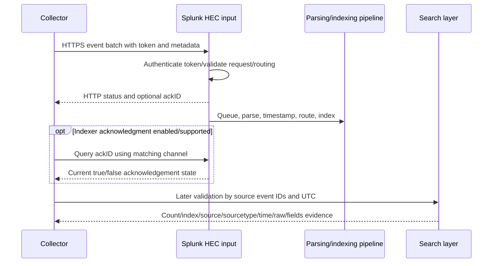

## 17. HEC acceptance and acknowledgement

Official Splunk documentation makes important distinctions:

- A normal successful HEC response means the request appeared valid and was accepted before full processing.
- In supported configurations, indexer acknowledgement can be enabled per token.
- An acknowledgement-enabled request uses a channel and returns an `ackID`; the client queries acknowledgement status with the same channel.
- A true acknowledgement has a documented replication meaning but does not guarantee correct parsing or that malformed data survived every parsing condition.
- A false status can mean pending, unknown, expired, or another issue; acknowledgement state has retention/cleanup behavior.
- Product support differs between Splunk Enterprise and Splunk Cloud/platform-specific senders, so verify current deployment support.

| Proof | Interpretation | Next check |
|---|---|---|
| HTTP 200/text success | HEC accepted valid-looking input | Pipeline/search by event ID |
| `ackID` issued | Request tracked for ack channel | Poll matching channel |
| Ack false | Not confirmed/unknown/pending/expired | Timing, channel, server logs, search |
| Ack true | Documented replication acknowledgement | Search and parsing/normalization |
| Raw event found | Indexed and searchable | Field/time/CIM/detection |
| Normalized event found | Search-time mapping works | Alert schedule/logic/suppression |

## 🔍 Plain-English deep-dive: A loading-dock receipt is not a shelf-location proof

A warehouse clerk can accept a sealed box at the loading dock and issue a receipt. That receipt proves handoff, not that every item was unpacked, labeled correctly, placed on the right shelf, or included in tonight's inventory report. A package-tracking number can provide stronger progress, but the final audit still checks the shelf and catalog.

HEC's initial success is the loading-dock receipt. Indexer acknowledgement is a stronger pipeline checkpoint in supported configurations. A Splunk search by native source ID proves the event is searchable. Correct source/sourcetype/time/field/CIM mapping proves catalog placement. A detection/notable proves the analytics stage.

The analogy stops because Splunk has distributed queues, replication, parsing, search-time schema, and product-specific acknowledgement behavior. The support lesson is to name the exact proof and avoid saying “ingestion succeeded” without a stage.

**Memory cue:** HTTP receipt, ack tracking, shelf search, catalog mapping, alarm result.

## 18. HEC batching, channels, and resend safety

| Design concern | Safe behavior |
|---|---|
| Batch identity | Assign collector batch/request ID |
| Native identity | Include immutable source event/detection ID |
| Event boundaries | Follow supported event/raw format; never split one event across requests |
| Channel | Stable unique channel per sending client where ack required |
| Ack state | Store request -> channel -> ackID -> final observation |
| Timeout | Reconcile/search before resend when outcome ambiguous |
| Resend | Preserve same source ID and duplicate marker/attempt metadata |
| Destination dedup | Search/detection dedup by native ID/version, not HEC ackID |
| Checkpoint commit | After chosen durable/reconciled condition |

## 19. Splunk parsing and event boundaries

Even indexed bytes can be unusable. One source record can be split into multiple events, several records can merge, JSON can be truncated, timestamp units can be wrong, and nested fields may not extract.

| Parsing symptom | Check |
|---|---|
| One Falcon event becomes many | Line/event breaking and JSON framing |
| Many events become one | Batch delimiter/event endpoint format |
| `_time` 1970/future/current | Epoch seconds vs milliseconds/time extraction/timezone |
| Missing nested IDs | JSON field extraction/path/casing |
| Wrong host | HEC/default/transform host metadata |
| Wrong index | Token allowed indexes/default/routing transform |
| Wrong sourcetype | Sender metadata/token default/transform |
| Truncated raw event | Payload/line/event limits and collector serialization |

## 20. Searchability and permissions

A support search must specify the correct index, time range, source/sourcetype, and stable source ID. “No results” can mean wrong search-time picker, wrong role index access, wrong field extraction, a literal/escaped identifier mismatch, or true absence.

| Search check | Reason |
|---|---|
| Earliest/latest UTC | Bound event and index lag |
| `index=` | Avoid default-index blindness |
| `source`/`sourcetype` | Identify feed/parser |
| Raw source ID search | Works before field extraction |
| Extracted source ID field | Validates parser/schema |
| `_time` and `_indextime` | Detect lag/time errors |
| Role/search context | Prove index/knowledge-object access |
| Count by source ID | Duplicate/missing evidence |

## 21. Splunk CIM normalization

The Splunk Common Information Model (CIM) is a search-time semantic model. It uses shared field names and tags for equivalent events from different vendors while leaving raw machine data intact. Data models describe least-common-denominator datasets. CIM-compatible searches and apps see only correctly normalized data.

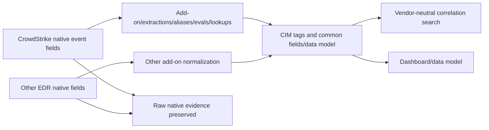

| Layer | Example conceptual content | Failure |
|---|---|---|
| Raw | Vendor JSON/source fields | Event absent/truncated |
| Extraction | Native field paths | Schema/case/version mismatch |
| Alias/eval/lookup | Map/derive common values | Wrong semantics/data type |
| Tags/event types | Select dataset membership | Event excluded from CIM |
| CIM fields | Common user/dest/action/signature/etc. | Required fields null/incorrect |
| Data model | Dataset constraints | Search/dashboard misses event |
| Correlation search | Detection logic | Window/threshold/suppression issue |

Normalization is not deleting native fields. Preserve source IDs and raw evidence for vendor escalation.

## 22. Splunk detection and notable/case evidence

| Detection checkpoint | Evidence |
|---|---|
| Search exists/enabled | Search ID/name/version/owner/app |
| Schedule/window | Cron/frequency, earliest/latest, dispatch UTC |
| Search ran | Search job/SID/status/result count |
| Event qualified | Native source ID present in results |
| Suppression/throttling | Key/window/current state |
| Alert action | Delivery/action execution ID/status |
| Notable/case | Stable notable/event/case ID |
| SOAR handoff | Push request or fetch source ID/checkpoint |

## 23. Cortex XSOAR concepts

| XSOAR term | Plain meaning | Support evidence |
|---|---|---|
| Content pack | Versioned integrations/scripts/playbooks/content | Pack/integration version |
| Integration | Code/definition connecting an external product | Brand/name/version/commands |
| Integration instance | Configured use with URL/credentials/options | Instance ID/name/engine/status |
| Engine | Execution bridge for network-local integrations where configured | Engine ID/connectivity/version |
| Command | Named integration operation | Command/args class/result/task ID |
| `test-module` | Connection/configuration test operation | Exact tested capability/result UTC |
| `fetch-incidents` | Periodic import of external events | Fetch interval/history/checkpoint/count |
| Incident | SOAR case/work item | Incident ID/type/status/owner |
| Context | Structured per-incident data passed between tasks | Context path/key field/source ID |
| War Room | Incident activity/task/command evidence view | Entry/task/command IDs and outcome |
| Playbook | Workflow of tasks/conditions/commands | Playbook/version/execution/task state |

## 24. Integration instance and credential boundary

An integration can have several instances for tenants, regions, environments, engines, or purposes. The instance selects base URL, credentials, fetch options, incident type, first-fetch time, limits, proxy/TLS behavior, and other vendor-specific settings. Instance name alone is not stable proof; collect its approved identifier and non-secret configuration metadata.

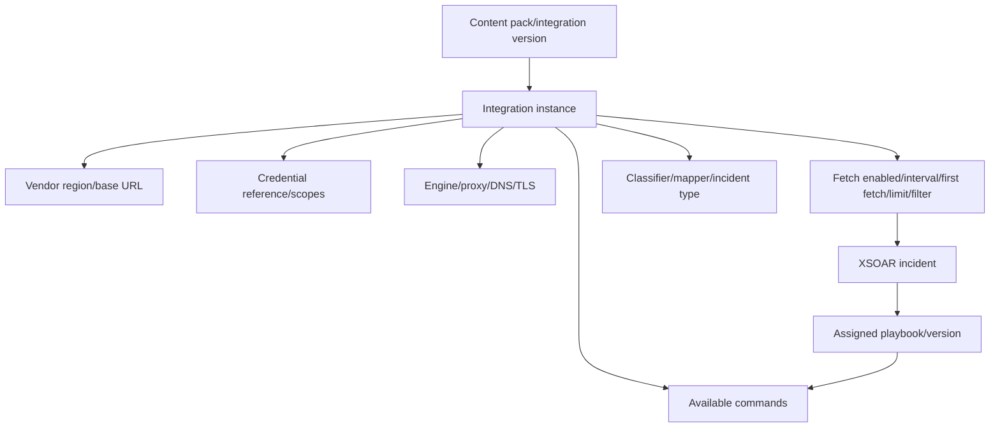

## 25. Test-module is a narrow checkpoint

| Test success may prove | It does not prove |
|---|---|
| Instance can reach tested endpoint | Every endpoint/service collection reachable |
| Credential works for tested operation | Fetch/response scopes sufficient |
| TLS/proxy works on one execution path | Every engine/node uses same path |
| Expected response obtained | Source events exist or filters qualify |
| Basic configuration parses | Mapping/playbook/action correct |

## 26. XSOAR fetch-incidents lifecycle

Official developer documentation describes `fetch-incidents` as the periodic import path. First run uses a configured lookback because no prior state exists. Later runs read `lastRun`, query/filter/paginate, deduplicate, build incident dictionaries, send incidents, and persist the next checkpoint. Current best practices include bounded pagination, native IDs, ISO 8601 UTC, reasonable fetch limits, small JSON-safe state, and careful partial-failure handling.

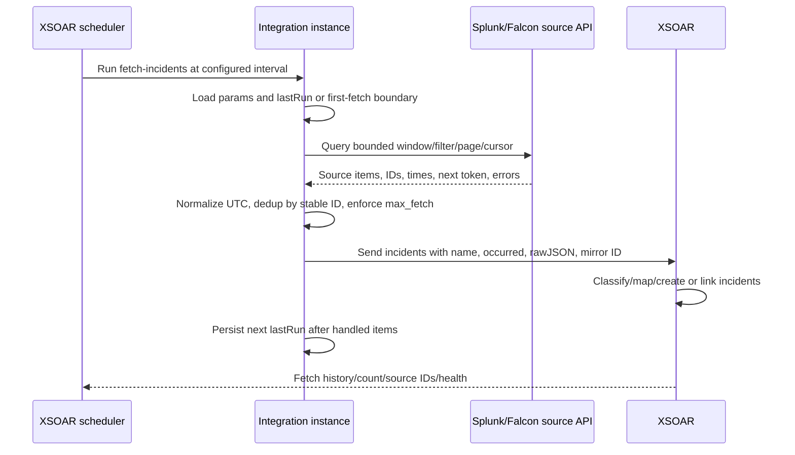

## 27. First fetch, lastRun, and dedup

| State field | Purpose |
|---|---|
| First-fetch time | Bound initial historical import |
| `last_fetch_time` | Inclusive resume time for timestamp strategy |
| `seen_ids` | Dedup IDs sharing resume timestamp |
| `next_token` | Resume stable cursor across cycles |
| `last_id` | Resume ID-ordered APIs |
| Filter/version | Detect query semantics change |
| Source tenant/instance | Prevent checkpoint reuse across sources |

`lastRun` should contain pointers, not raw events. If a filter changes, reason about the old checkpoint versus the newly eligible population before restarting.

## 🔍 Plain-English deep-dive: Fetch state is a turnstile counter with a guest list

A venue turnstile tracks how far it processed a queue. Several guests can arrive at exactly 10:00. Remembering only “10:00” can skip some or admit them twice after restart. The counter needs the timestamp and guest IDs already processed at that timestamp, or a reliable ticket cursor issued by the queue system.

XSOAR fetch logic has the same challenge. A last-fetch timestamp alone can fail when source records share timestamps, arrive late, or exceed one page. A stable cursor is preferred when available. Otherwise an inclusive timestamp plus `seen_ids`, a bounded overlap, and source-ID dedup protects continuity. The checkpoint advances through successfully handled records rather than wall-clock time.

The analogy stops because source items can update and mappings can create side effects. The lesson is to log old/new `lastRun`, source window, cursor/page, fetched/filtered/deduped/imported counts, first/last IDs, and error status without logging payloads.

**Memory cue:** Timestamp plus guest list, or a source cursor.

## 28. Incident shape, rawJSON, classification, and mapping

XSOAR fetched incident dictionaries commonly include a human-readable `name`, ISO 8601 `occurred`, source record serialized in `rawJSON` for mapping, and a source/mirror ID such as `dbotMirrorId` where supported. Severity/type/details can also be populated according to the integration and mapper.

| Stage | Purpose | Failure |
|---|---|---|
| Fetch query | Select source items | Wrong filter/window/permissions |
| Incident dictionary | Provide name/time/source ID/raw data | Invalid time/oversized/missing ID |
| Classification | Select incident type | Wrong classifier/order/value |
| Mapping | Map raw fields to XSOAR fields | Schema path/type/case mismatch |
| Incident creation/link | Store case and source identity | Duplicate/mirror conflict |
| Playbook assignment | Choose workflow | Wrong incident type/playbook version |

Raw JSON can contain sensitive endpoint, user, process, file, network, and detection data. Keep it inside approved product controls; do not copy it into ordinary support tickets.

## 29. Context and command outputs

XSOAR incident Context is structured data passed between playbook tasks. Integration commands return human-readable output and structured outputs under documented context paths, often with a key field that updates/links matching objects. Context is not the source product itself.

| Output layer | Purpose | Caution |
|---|---|---|
| Human-readable/War Room | Analyst view | Can omit machine detail |
| Structured context | Inputs for conditions/tasks | Mapping/key path/version matters |
| Raw response | Debug/source detail | Sensitive and large |
| Output key field | Link/update object by stable identity | Wrong key causes overwrite/duplicates |
| Standard indicator context | Cross-integration consistency | Value alone can have privacy/risk |
| Command status/error | Task execution evidence | Not external final state |

## 30. Playbooks and task types

| Playbook element | Role |
|---|---|
| Input | Parameter supplied by incident/parent/caller |
| Condition | Branch based on context/evidence |
| Manual task | Analyst investigation or approval |
| Automation/script | Transform/check logic inside platform |
| Integration command | External query or action |
| Sub-playbook | Reusable workflow |
| Output | Structured result for caller/case |
| Error path | Timeout/retry/manual escalation/rollback |

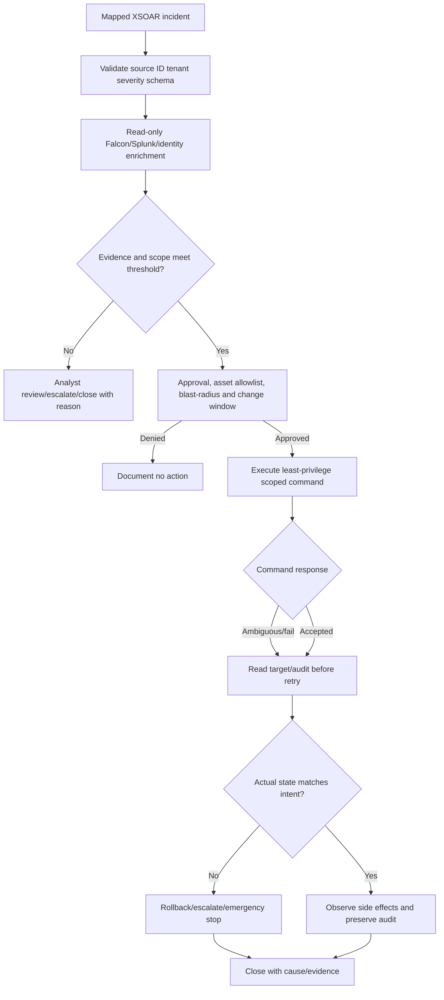

## 31. SOAR response safety

Security automation can disrupt endpoints, accounts, networks, evidence, and business operations. Automation is not safe merely because a command exists.

| Control | Purpose |
|---|---|
| Read-only default | Enrichment before action |
| Separate read/write clients | Minimize accidental authority |
| Least scopes | Only necessary command/resource |
| Asset/tenant allowlist | Prevent cross-environment targeting |
| Explicit denylist | Protect critical infrastructure/executives/systems |
| Severity/confidence/evidence gate | Avoid acting on weak signal |
| Human approval | Accountable decision for destructive actions |
| Change window/case linkage | Operational authorization |
| Maximum targets | Bound blast radius |
| Dry run/simulation | Validate selection without action |
| Idempotency/action key | Prevent repeated effects |
| Timeout/retry policy | Avoid duplicate unknown-outcome actions |
| Read-back/audit | Prove actual state |
| Rollback/release plan | Restore safely |
| Emergency disable/kill switch | Stop faulty automation |

## 32. Containment is a state transition, not a button click

| State | Evidence |
|---|---|
| Proposed | Incident/source IDs, rationale, intended target |
| Approved | Approver, policy/change/case, UTC |
| Submitted | Command/task/action ID and non-secret parameters |
| Accepted | Vendor operation response/status |
| Executing | Target operation progress if asynchronous |
| Effective | Target read-back indicates contained/isolated state |
| Observed | Network/endpoint/business side effects assessed |
| Released/rolled back | Release operation and target read-back |
| Closed | Final owner, reason, audit, prevention |

## 33. Cross-product canonical envelope

Keep native payloads protected and create a small evidence envelope for correlation.

| Canonical field | Source |
|---|---|
| `source_vendor`/`source_product` | Collector configuration |
| `source_tenant`/`source_region` | Falcon context |
| `source_object_type`/`source_id` | Detection/incident/host/event |
| `source_created_utc`/`updated_utc` | Native timestamps |
| `schema_version` | Source/collector contract |
| `collector_instance`/`batch_id` | Retrieval layer |
| `retrieval_checkpoint` | Cursor/time+IDs/manifest |
| `delivery_attempt`/`request_id` | Transport |
| `splunk_index/source/sourcetype` | SIEM metadata |
| `splunk_event_time/index_time` | SIEM time proof |
| `splunk_detection_id` | Alert/notable if created |
| `xsoar_instance/mirror_id/incident_id` | SOAR import |
| `playbook/version/task/command` | SOAR execution |
| `target_operation/status` | Response outcome |
| `trace_id` | Integration-generated end-to-end correlation |

## 34. End-to-end evidence ledger

| Checkpoint | Count/ID | UTC | Status | Owner |
|---|---|---|---|---|
| Falcon query/window | IDs/pages/resources/errors | Query start/end | Retrieved/partial | Falcon/collector |
| Collector persist | Batch and source IDs | Persisted | Durable | Collector |
| HEC request | Request/channel/ackID | Sent/response | Accepted/error | Collector/Splunk input |
| Splunk index | Native IDs/index/source/sourcetype | `_time`/`_indextime` | Searchable | Splunk ingest |
| Normalization | Dataset/required fields | Search UTC | Valid/invalid | Splunk content |
| Detection | Search job/notable ID | Dispatch/trigger | Created/suppressed | SOC/Splunk |
| XSOAR fetch | Old/new lastRun/source IDs | Cycle | Fetched/dedup/error | XSOAR integration |
| XSOAR incident | Mirror and incident ID | Created | Mapped/duplicate | SOAR |
| Playbook | Execution/task IDs | Start/end | Complete/error/waiting | SOC/SOAR |
| External action | Command/operation/target | Submit/read-back | Effective/ambiguous/fail | Response owner |

## 35. Worked example 1: Falcon detection exists, Splunk search is empty

**Input:** Analyst provides a Falcon detection ID and UTC. Splunk has no field-search result.

**Reasoning:** Confirm Falcon tenant/region/object type, source created/updated time, collector mode, filter/window, old/new checkpoint, pagination/resources/errors, batch persistence, HEC request/ack, target index/source/sourcetype, raw ID search, permissions, `_time`, and `_indextime`.

**Evidence:** Source ID, collector instance/batch, checkpoint before/after, query/request IDs, HTTP/ack metadata, destination index/source/sourcetype, bounded raw search result and UTC. No payload/token.

**Result:** Synthetic collector advanced checkpoint to query end after the first page, although a next token remained. Repair commits cursor only after all pages are durable; rewind to last proven contiguous point and dedup by source ID.

**Caveat:** Rewind/replay requires count and duplicate controls.

## 36. Worked example 2: HEC 200 but event absent

**Input:** Collector logged HEC 200; source ID cannot be found in Splunk.

**Reasoning:** Initial 200 is not final indexing proof. Check exact Splunk deployment, token/input, index permission/default, request format, batch boundaries, HEC internal/input logs, ack support/configuration, parsing errors, wrong index, time picker, role access, and raw search across candidate indexes/time.

**Evidence:** HEC request ID/status/text code, token identifier not value, input/instance, target index class, channel/ackID/status if used, internal error correlation, source ID and UTC.

**Result:** Synthetic token defaulted to a quarantine index not visible to the analyst role. Correct approved routing/role, then reconcile source IDs; do not resend blindly.

**Caveat:** A search permission failure can resemble ingestion loss.

## 37. Worked example 3: Raw event exists but CIM search misses it

**Input:** Native source ID is searchable in `_raw`, but endpoint correlation content has no result.

**Reasoning:** Verify sourcetype, add-on/version, field extraction paths/casing/types, tags/event type, required CIM fields, data-model constraints/acceleration range, search app/knowledge-object permissions, and raw semantics.

**Evidence:** Raw event ID, sourcetype, extraction/alias/eval/tag versions, required-field present/null/type matrix, data-model search count, search job/SID/UTC.

**Result:** Vendor schema changed `device_id` path; extraction returned null, excluding event from endpoint dataset. Update/test supported content and backfill/search-time validation.

**Caveat:** Do not overwrite raw evidence to “normalize” it.

## 38. Worked example 4: Splunk detection fires twice for one Falcon item

**Input:** One Falcon detection creates two Splunk notables and two XSOAR incidents.

**Reasoning:** Compare source ID/version/update time, collector resend reason, HEC requests/acks, indexed count, detection suppression key, mutable update handling, XSOAR `dbotMirrorId`, fetch overlap, and mapper key.

**Evidence:** One native ID mapped to two batch/request/notable/mirror/incident IDs and UTC. Determine whether duplicate raw copies, legitimate updates, or duplicate detection runs.

**Result:** Synthetic HEC ack timed out; collector resent, and Splunk detection keyed on index-time plus hostname instead of native detection ID. Add native-ID/version dedup and reconcile existing cases.

**Caveat:** Preserve legitimate status updates rather than dropping all repeated IDs.

## 39. Worked example 5: XSOAR test succeeds but fetch imports nothing

**Input:** Integration Test is green; no incidents arrive.

**Reasoning:** Identify instance/tenant/region, what test-module actually calls, fetch enabled/interval/history, source filter/type/status, first-fetch and `lastRun`, time units/timezone, scope for fetch operation, pagination, max fetch, classifier/mapping, and errors.

**Evidence:** Instance ID/version, test operation/result UTC, fetch cycle/old-new state, source query window/filter/count, source IDs, fetch history/health, no secrets.

**Result:** Synthetic test calls a basic read endpoint, while fetch filter asks for `new` lowercase and source expects an exact different status. Fix configuration and conduct bounded first-fetch/reconciliation.

**Caveat:** Do not reset `lastRun` to import unlimited history.

## 40. Worked example 6: XSOAR duplicates equal-timestamp alerts

**Input:** Alerts created in the same second repeat every fetch.

**Reasoning:** Inspect timestamp precision/order, inclusive query, `lastRun`, `seen_ids`, native source ID, next token, max-fetch boundary, mirror ID, and incident creation dedup.

**Evidence:** Source IDs sharing timestamp, old/new checkpoint, fetched/dedup/imported counts across cycles, mirror/incident IDs.

**Result:** Timestamp-only state queried inclusively without retaining IDs. Store same-timestamp IDs or use stable source cursor; dedup by source ID.

**Caveat:** Exclusive time queries can create the opposite problem: gaps.

## 41. Worked example 7: Playbook waits forever at enrichment

**Input:** Incident exists, playbook is running, enrichment task never completes.

**Reasoning:** Identify playbook/version/task, integration instance/engine, command and argument classes, external request/operation ID, timeout/polling state, credential scope, network/TLS/proxy, response schema, context output path, task error path, and concurrency.

**Evidence:** Incident/playbook/task/command/instance/engine IDs, status transitions/UTC, HTTP class/request ID, context path presence, no raw payload/token.

**Result:** Synthetic command returns asynchronous operation ID, but playbook expects immediate entities and has no polling/timeout branch. Add bounded poll and manual escalation path.

**Caveat:** Re-running can create duplicate external operations.

## 42. Worked example 8: Containment command says success, host communicates

**Input:** XSOAR task shows success; monitoring suggests endpoint remains online.

**Reasoning:** Distinguish command accepted, operation queued, Falcon operation completed, host target identity, containment/read-back state, sensor connectivity, policy/exceptions, business network behavior, timestamp, and duplicate hostnames. Verify stable device/AID.

**Evidence:** Incident/approval/task/command/operation/device IDs, accepted/completed/read-back statuses, audit actor and UTC, network observation source.

**Result:** Synthetic command targeted an old device record sharing hostname; current AID was different. Stop, reassess authorization, target stable ID, and document mis-target prevention.

**Caveat:** Never retarget automatically from hostname.

## 43. Worked example 9: Falcon API 403 after scope reduction

**Input:** Read-only detection import works; host enrichment/action fails with 403.

**Reasoning:** Compare operations/service collections, client ID, assigned scopes/entitlements, region/tenant, integration instance selection, credential rotation, and change audit. Least privilege is correct; missing required scope is fixed through owner review, not broad admin scope.

**Evidence:** Client ID, configured scope names, operation ID, 403/request ID/UTC, change record; no secret/token.

**Result:** Synthetic client retains detection-read but host-detail scope was removed. Security owner grants only approved read scope or separates enrichment/action clients.

**Caveat:** Do not combine all read/write scopes for convenience.

## 44. Worked example 10: Detection arrives one hour late

**Input:** Falcon source created 10:00Z; Splunk alert at 11:00Z; XSOAR case at 11:01Z.

**Reasoning:** Compare source created/updated, collector receive, batch/HEC, `_time`, `_indextime`, scheduled search dispatch/window, alert delivery, XSOAR fetch interval/occurred/created. Determine transport lag versus timestamp parsing versus schedule.

**Evidence:** Full eight-clock ledger and queue/checkpoint/search/task IDs.

**Result:** Synthetic source epoch milliseconds were parsed as seconds and rejected; fallback assigned current index time. Detection's hourly window then fired late. Correct time extraction and validate lag distribution.

**Caveat:** “One hour” can also be timezone display, so use raw UTC.

## 45. Worked example 11: XSOAR mapping sends low severity down high-risk path

**Input:** Source severity is low but XSOAR launches containment approval branch.

**Reasoning:** Trace raw source severity/code/type, classifier, mapper transform/default, incident severity, playbook condition, context path/data type/casing, content version, and fallback branch.

**Evidence:** Redacted raw severity, mapper/version, mapped field/type, playbook version/condition/task path and UTC.

**Result:** Synthetic mapper treated unknown lowercase value as maximum rather than safe low/manual review. Fix explicit mapping, safe default, tests, and review affected incidents.

**Caveat:** Unknown severity should not silently trigger destructive automation.

## 46. Worked example 12: Search enrichment returns too much sensitive data

**Input:** XSOAR War Room receives large raw endpoint records and exposes unnecessary user/process/network details.

**Reasoning:** Review Splunk search fields/time/index permissions, XSOAR command outputs/raw response/context, auto extraction, playbook use, retention/access, and data-minimization requirement.

**Evidence:** Search/command/task IDs, result count/field-name inventory/size, context paths, access class; no values.

**Result:** Synthetic search used wildcard fields and integration returned raw response. Restrict fields/count/time, return keyed structured outputs, and purge under policy.

**Caveat:** Troubleshooting does not justify copying sensitive payloads into tickets.

## 47. Metrics and reconciliation

| Metric | Formula/use |
|---|---|
| Source eligible count | Native IDs meeting source filter/window |
| Retrieved count | Unique source IDs returned |
| Retrieval gap | Eligible minus retrieved after lateness policy |
| Delivery accepted count | Batches/items accepted by input |
| Searchable count | Unique source IDs found in index |
| Duplicate ratio | Indexed rows minus unique IDs over unique IDs |
| Ingest lag | `_indextime - source event time` |
| Normalization completeness | Required CIM fields present/valid |
| Detection coverage | Eligible normalized items meeting logic/results |
| SOAR import count | Unique mirror IDs/incidents |
| Fetch lag | XSOAR imported time minus source event time |
| Playbook success | Completed desired workflows over started |
| Action effectiveness | Target states verified over approved actions |

## 48. Customer-safe evidence matrix

| Symptom | Minimum safe evidence | Never request |
|---|---|---|
| Falcon API auth/scope | Tenant/region/client ID/scope names/operation/status/request ID/UTC | Client secret/access token/auth header |
| Source missing | Source object ID/type/time, filter/window/page/cursor/checkpoint/count | Raw endpoint telemetry |
| HEC failure | Input/token ID not value, request/channel/ackID/status/index/UTC | HEC token/full request header |
| Splunk search miss | Native ID, index/source/sourcetype/time/role/search SID/count | Broad raw event export |
| Time issue | Source/receive/index/search/import UTC and units | User content not needed for time |
| CIM failure | Sourcetype/content version/field-name/type/tag matrix | Raw sensitive payload |
| Detection miss | Search/version/window/job/SID/result/suppression IDs | Unbounded search export |
| XSOAR fetch | Instance/version/fetch history/old-new state/filter/count/source IDs | Integration credential/rawJSON |
| Mapping | Field names/types/classifier/mapper/content version | Full incident data |
| Playbook | Incident/playbook/version/task/command/status/UTC | Command secrets/raw context |
| Response | Approval/action/target stable ID/status/read-back/audit | Credential or unnecessary host/user data |

## Troubleshooting decision tree

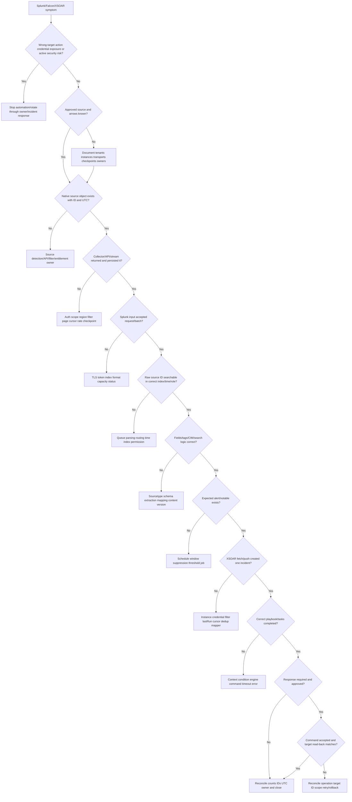

## 49. Common failure modes

| Failure mode | Why it fails | Better behavior |
|---|---|---|
| Product list becomes assumed topology | Multiple direct/parallel paths possible | Deployment-specific arrows/owners |
| “Falcon event” without object type | Event/detection/alert/incident differ | Native type and stable ID |
| Hostname identifies endpoint | Rename/reuse/duplicate records | Stable device/AID plus tenant |
| API client valid means authorized | Scopes/entitlements operation-specific | Client ID + scope names + operation |
| SDK hides all reliability | Pagination/rate/checkpoint remain | Inspect response/meta/errors/state |
| Query first page only | Silent source gaps | Exhaust cursor with bounds |
| Advance checkpoint to wall clock | Skips unhandled/late records | Durable contiguous source state |
| Timestamp-only exclusive query | Skips ties | Cursor or inclusive time + seen IDs |
| Retry every response | Duplicates/load/security actions | Classify status/idempotency/outcome |
| HEC 200 means indexed | Pre-pipeline acceptance | Ack/search proof by native ID |
| HEC ack means normalized | Parsing/search-time stages remain | Raw/CIM/detection validation |
| AckID used for event dedup | Request-scoped tracking, not source identity | Native source ID/version |
| Resend after timeout blindly | Original may have succeeded | Search/reconcile then idempotent resend |
| Default index search only | Event can route elsewhere | Explicit index/input routing |
| Field search proves absence | Extraction can be broken | Raw ID search first |
| `_time` equals ingest time | Event time can be parsed/fallback | Compare source and `_indextime` |
| Sourcetype is cosmetic | Controls parsing/knowledge | Treat as data contract |
| CIM replaces raw data | CIM is search-time semantic mapping | Preserve native raw/source ID |
| Raw event means detection should fire | Tags/fields/window/logic/suppression | Validate every stage |
| XSOAR test means fetch works | Narrow test operation | Fetch history/query/state/count |
| Reset lastRun to fix | Duplicates/unbounded history | Bounded rewind and reconciliation |
| Store raw events in lastRun | State bloat/privacy | Small JSON pointer state |
| Email/hostname used as mirror ID | Mutable/non-unique | Source stable ID |
| rawJSON copied into ticket | Sensitive endpoint evidence | Protected product storage/metadata |
| Incident exists means playbook done | Creation and workflow separate | Playbook/task evidence |
| Green task means external action effective | Acceptance versus target state | Operation/read-back/audit |
| Retry unknown write immediately | Duplicate containment/action | Query operation/target first |
| Automation action on display name | Wrong target/blast radius | Tenant + immutable target ID |
| One broad read/write credential | Excess authority | Separate least-scope instances/clients |
| Disable TLS verification to test | Hides trust/MITM risk | Fix DNS/cert/proxy chain |
| Unknown severity defaults high action | Unsafe destructive behavior | Safe manual-review default |
| Close case after command response | No actual-state proof | Read-back and observe side effects |
| Generic vendor architecture equals Abnormal | Product implementation unknown | Approved Abnormal docs |

## 50. Escalation packet

| Section | Required content |
|---|---|
| Impact | Missing/delayed/duplicate/detection/response, population, security/availability |
| Topology | Exact source, transport, Splunk, XSOAR, target arrows and owners |
| CrowdStrike | Tenant/region/client ID/scope names/service operation/object IDs/time/status/request IDs |
| Retrieval | Mode/filter/window/pages/cursor/checkpoint before-after/counts/errors |
| Delivery | Collector/batch/request/channel/ack metadata/retries/status |
| Splunk | Deployment/input/index/source/sourcetype/host/time/index-time/search SID/count |
| Normalization | Add-on/content/schema/CIM dataset/field-name/type/tag validation |
| Detection | Search/version/schedule/window/job/results/suppression/notable ID |
| XSOAR | Pack/integration/instance/engine/fetch history/first-fetch/lastRun/mirror/incident IDs |
| Mapping | Classifier/mapper/incident type/field type/context key/version |
| Playbook | Playbook/version/task/command/status/error/timeout/approval |
| Target | Immutable target/action/operation/read-back/audit/rollback state |
| Timeline | Source/retrieve/deliver/index/search/alert/import/task/action/read-back UTC |
| Privacy | No secrets/tokens/headers/raw telemetry/rawJSON/context; protected evidence location |
| Ask | Exact Falcon/Splunk/XSOAR/network/IAM/content/response Engineering decision |

## Safe synthetic lab: The Detection Relay and Response Airlock 070

### Objective

Build a local paper model of three fictional architectures joining CrowdStrike source detections, a collector/checkpoint, Splunk HEC/index/search/CIM/detection, Cortex XSOAR fetch/mapping/context/playbook, and simulated target response. The unique lab is **The Detection Relay and Response Airlock 070**.

The lab creates no tenant, API client, secret, token, HEC input, index, event, Splunk search, CrowdStrike query, stream, endpoint, XSOAR instance, incident, playbook, command, containment action, identity change, or network request. All records are fictional metadata. Every response task is paper-only and ends in simulated read-back.

### Prerequisites

- Local Markdown editor or spreadsheet only.
- Fictional IDs prefixed `FALCON-070`, `COLLECTOR-070`, `CURSOR-070`, `BATCH-070`, `HEC-070`, `SPLUNK-070`, `CIM-070`, `NOTABLE-070`, `XSOAR-070`, `PB-070`, `TASK-070`, `CMD-070`, `TARGET-070`, and `CASE-070`.
- Reserved text-only domains under `example.test`; no real Falcon, Splunk, XSOAR, Cortex, Palo Alto Networks, Abnormal, HEC, API, search, or endpoint URL.
- No product account, free trial, developer tenant, API client, token, secret, authorization header, integration instance, event payload, endpoint data, search execution, incident, or action.
- Artifact label: **local/public lab - synthetic SIEM/EDR/SOAR metadata only**.
- Record start UTC, zero-live-system/identity/credential/action statement, learned-only label, and source date August 24, 2026.

### Synthetic event starter

| Scenario | Falcon source | Splunk state | XSOAR/target state |
|---|---|---|---|
| A | `FALCON-070-A` API page 1 | HEC accepted, wrong index | No incident |
| B | `FALCON-070-B` repeated update | Two raw rows, bad dedup | Duplicate incidents |
| C | `FALCON-070-C` correct | Raw found, CIM field missing | Detection absent |
| D | `FALCON-070-D` correct | Notable exists | Fetch checkpoint skips tie |
| E | `FALCON-070-E` correct | Imported | Enrichment task stuck |
| F | `FALCON-070-F` approved | Imported/playbook complete | Command accepted, wrong stable target |

### Lab steps

1. Create the cover with artifact label, UTC, safety boundary, Microsoft-transfer statement, learned-only product statement, and Abnormal unknowns.
2. Define SIEM, EDR, XDR, SOAR, event, detection, incident, notable, case, checkpoint, integration instance, context, command, playbook, and reconciliation.
3. Draw three possible topologies: Falcon -> Splunk -> XSOAR, Falcon parallel to Splunk/XSOAR, and storage/stream -> Splunk plus XSOAR enrichment.
4. Select one synthetic topology and record every arrow's transport, credential class, checkpoint, schema, guarantee, and owner.
5. Build a native-ID register for source event/detection/incident/device, collector batch/cursor, HEC request/channel/ack, Splunk event/notable, XSOAR mirror/incident/task/command, and target operation.
6. Create a state ladder showing source exists, retrieved, persisted, HEC accepted, ack observed, raw searchable, CIM valid, notable created, XSOAR imported, task completed, command accepted, and target read-back.
7. Build Falcon tenant/region/client/scope/service-operation cards without endpoint or credentials.
8. Model query-ID and entity-hydration response metadata across three pages, including one partial entity error.
9. Create cursor-based and timestamp-plus-seen-ID retrieval state machines.
10. Simulate late events, equal timestamps, mutable status updates, page overflow, 401, 403, 429, 5xx, and timeout outcomes.
11. Define durable collector batches and commit checkpoint only after the chosen acceptance/reconciliation condition.
12. Model Splunk HEC event metadata with fictional source IDs, time, host, source, sourcetype, index, and field-name inventory; no payload/token.
13. Create HEC normal success and supported acknowledgement state worksheets with fictional channel/ack IDs.
14. Simulate an ambiguous timeout/resend and prove why native-ID dedup is necessary.
15. Build a Splunk index/source/sourcetype/host/`_time`/`_indextime` ledger for 24 synthetic events.
16. Create event-breaking, JSON extraction, wrong-time-unit, wrong-index, wrong-sourcetype, and role-permission cases.
17. Build raw-ID search, extracted-field search, count, lag, and duplicate result tables as paper outputs.
18. Map native source fields to a fictional CIM-like field/tag/data-model worksheet while preserving native fields.
19. Validate required field presence/type/tag for 12 events and record pass/fail reasons.
20. Create scheduled-search metadata, job/result/suppression/notable IDs, and explain why five eligible events produce four notables.
21. Build XSOAR content pack/integration/instance/engine/credential/fetch configuration cards.
22. Model test-module as one narrow capability and contrast fetch permissions/filter.
23. Create first-fetch, `lastRun`, cursor, `seen_ids`, `next_token`, max-fetch, and partial-failure cases.
24. Build incident dictionaries conceptually using name/occurred/mirror/raw field-name inventory, without raw JSON values.
25. Create classifier/mapper matrices for severity, incident type, source ID, host ID, and timestamps.
26. Build XSOAR Context paths with stable output key fields and a War Room task/command ledger using metadata only.
27. Draw an enrichment-first playbook with safe-default branch, manual approval, asset allowlist, maximum target count, action, polling/read-back, rollback, and close.
28. Simulate a stuck asynchronous enrichment task and design timeout/manual escalation behavior.
29. Simulate containment of the wrong hostname record and correct it using stable device identity, without an action.
30. Create separate fictional read and write API clients and scope matrices.
31. Build an emergency-stop checklist for disabling a faulty playbook/instance under approved owner control.
32. Run the troubleshooting decision tree on all six starter scenarios plus six worked examples.
33. Reconcile source/retrieved/indexed/normalized/notable/imported/action counts and calculate lag/duplicate/completeness metrics.
34. Draft customer updates for missing ingestion, mapping error, duplicate case, and ambiguous action.
35. Draft Falcon, collector/network, Splunk ingest, Splunk content, XSOAR integration, and response-owner escalation packets.
36. Deliver a 90-second HEC proof answer, 90-second checkpoint answer, 90-second XSOAR safety answer, and 60-second honesty boundary aloud.
37. Validate sources/date, cleanup, privacy, zero-activity statement, and rubric.

### Expected evidence

- Three topology diagrams and one selected source-to-target ownership map.
- Native-ID register and twelve-stage state ladder.
- Falcon tenant/region/client/scope/service-operation cards.
- Query/hydration, pagination, cursor, time-plus-ID, partial-error, and rate worksheets.
- Collector batch/checkpoint/dedup ledger.
- HEC acceptance/channel/ack/reconcile worksheet.
- Splunk index/source/sourcetype/host/event/index-time ledger for 24 events.
- Parsing, time, routing, permission, raw search, lag, and duplicate cases.
- CIM-like field/tag/data-model validation for 12 events.
- Detection schedule/job/suppression/notable evidence.
- XSOAR pack/integration/instance/test/fetch/lastRun/mapping/context worksheets.
- Safe enrichment/approval/action/read-back/rollback playbook.
- Six starter and six additional decision-tree investigations.
- End-to-end counts/lag/completeness/reconciliation scorecard.
- Four customer updates and six escalation packets.
- Source ledger dated **August 24, 2026**.
- Spoken Microsoft-transfer, three-products-learned, and Abnormal-unknown statements.

### Cleanup and privacy

- Confirm every tenant/client/scope/event/detection/incident/device/cursor/batch/request/channel/ack/index/search/notable/instance/mirror/playbook/task/command/target/case is fictional and includes `070`.
- Confirm all domains use `example.test` and no valid endpoint, API path, HEC input, token, secret, authorization header, query, event payload, host/user/process/file/network data, incident context, command, or response action exists.
- Remove real customers, tenants, regions tied to customers, client IDs, scopes, indexes, sourcetypes, searches, detections, endpoint IDs, incidents, screenshots, or logs.
- Confirm no Splunk, CrowdStrike, Cortex XSOAR, Palo Alto Networks, Abnormal, API, stream, HEC, search, account, endpoint, or network request was used.
- Delete the artifact if credentials, endpoint data, customer security evidence, or operational instructions cannot be reliably removed.
- Record cleanup UTC and: `Synthetic paper SIEM/EDR/SOAR exercise only; zero live tenant, credential, token, HEC input, API request, event stream, Splunk event/search, CrowdStrike object, XSOAR instance/incident/playbook/command, endpoint action, or production activity.`

### Validation rubric

| Dimension | Fail | Developing | Pass |
|---|---|---|---|
| Topology | Assumes arrows | Names systems | Deployment-specific paths, transports, identities, checkpoints, owners |
| Source | “Falcon event” | Gives timestamp | Tenant/region/object type/stable IDs/query/pages/cursor/resources/errors |
| Delivery | “Sent to Splunk” | HTTP status | Batch/request/channel/ack plus searchable native-ID reconciliation |
| Splunk | Index only | Raw search | Index/source/sourcetype/event/index time/parser/permissions/normalization |
| CIM | Renames fields | Maps fields | Preserves raw, validates semantic fields/tags/data model/content version |
| Detection | Says search fired | Has result | Schedule/window/job/result/suppression/notable/handoff IDs |
| XSOAR fetch | Test green | Has last time | First fetch/cursor or time+seen IDs/paging/max/partial failure/mirror ID |
| Mapping | Copies payload | Field map | Classifier/mapper/types/stable keys/context/playbook version |
| Automation | Green command | Has approval | Read-only, least scope, allowlist, max targets, read-back, rollback, stop |
| Evidence | Raw payloads | Some IDs | Native IDs/counts/UTC/status/owners with no secrets/security data |
| Honesty | Claims production | Says learned | experience transfer, synthetic three-product lab, Abnormal unknown |

## 51. Official Source Anchors

All sources were verified and recorded with guide currency date **August 24, 2026**. APIs, schemas, product names, cloud regions, scopes, HEC behavior, CIM versions, XSOAR content, fetch guidance, interfaces, and licensing change. Revalidate current documentation and the customer's supported topology before production action.

| Official or primary source | What it anchors | Boundary |
|---|---|---|
| [CrowdStrike Developer Center](https://developer.crowdstrike.com/) | Current API collections/operations, SDK and tenant-specific access entry point | Console/login may be required; exact operations/scopes current |
| [CrowdStrike FalconPy](https://github.com/CrowdStrike/falconpy) | OAuth2 abstraction, service classes, operation collections, region support, no hardcoded secrets, scope examples | SDK is not substitute for API contract/tenant entitlement |
| [Splunk - HTTP Event Collector examples](https://help.splunk.com/en/splunk-enterprise/get-data-in/get-started-with-getting-data-in/9.4/get-data-with-http-event-collector/http-event-collector-examples) | Event/raw formats, metadata, batching, channel/ack examples, secure TLS warning | Version/deployment-specific behavior |
| [Splunk - HEC indexer acknowledgment](https://help.splunk.com/en/splunk-enterprise/get-data-in/get-started-with-getting-data-in/9.4/get-data-with-http-event-collector/about-http-event-collector-indexer-acknowledgment) | Initial 200 boundary, per-token ack, channel/ackID/query/state/limits/resend considerations | Enterprise/Cloud support differs; true ack limitations documented |
| [Splunk - Common Information Model overview](https://help.splunk.com/en/splunk-enterprise/common-information-model/6.0/introduction/overview-of-the-splunk-common-information-model) | Search-time schema, common fields/tags/data models, raw data preserved | Exact CIM/add-on/content version controls |
| [Cortex XSOAR - Integrations](https://cortex-docs.paloaltonetworks.com/cortex-xsoar-8-saas/configure-cortex-xsoar/integrations) | Integration role: fetch incidents, run commands, credentials, long-running integrations | SaaS/version/pack-specific settings |
| [Cortex XSOAR - Playbooks](https://cortex-docs.paloaltonetworks.com/cortex-xsoar-8-saas/configure-cortex-xsoar/playbooks) | Playbooks, inputs/outputs, scripts, testing/debugging | Customer content/version/permissions vary |
| [Cortex XSOAR Developer - Fetching Incidents](https://xsoar.pan.dev/docs/integrations/fetching-incidents) | Fetch interval, first/last run, paging, dedup, incident shape, mirror ID, partial failure, safe logs | Integration implementation/version varies |
| [Cortex XSOAR Developer - Code Conventions](https://xsoar.pan.dev/docs/integrations/code-conventions) | Test module, client/commands, retries, errors, credentials, outputs, sensitive logging | Developer guidance, not customer deployment proof |
| [Cortex XSOAR Developer - Context and Outputs](https://xsoar.pan.dev/docs/integrations/context-and-outputs) | Structured incident Context, output paths/key fields, command results | Content/version/schema-specific |
| [RFC 6749 - OAuth 2.0](https://www.rfc-editor.org/rfc/rfc6749.html) | Client/token authorization foundation | Vendor client-credentials/API profile controls |
| [RFC 9110 - HTTP Semantics](https://www.rfc-editor.org/rfc/rfc9110.html) | HTTP status, idempotency, request/response semantics | Product-specific acknowledgement remains separate |

### Source-use discipline

- Verify exact product/version/deployment and official current page before operation.
- Preserve native source IDs and UTC through every transformation.
- Name acceptance, acknowledgement, indexing, parsing, normalization, detection, import, command, and target-read-back states separately.
- Treat display names, hostnames, emails, HEC ackIDs, and XSOAR incident IDs as layer-specific, not universal identity.
- Keep credentials, tokens, authorization headers, raw endpoint telemetry, raw JSON, and incident context out of tickets.
- Keep all response actions behind approved least-privilege controls and actual-state reconciliation.
- Keep Abnormal's supported Splunk/CrowdStrike/Cortex implementation explicitly unknown.

## Likely Interview Questions

### Q1. How do SIEM, EDR, and SOAR differ in this architecture?

**Model answer:** CrowdStrike as EDR/XDR is a source of endpoint/security telemetry, detections, incidents, host context, and potentially response controls. Splunk as SIEM ingests, indexes, searches, normalizes, and correlates data into alerts/notables. Cortex XSOAR imports cases, enriches them, and orchestrates playbooks/commands. Those are roles, not guaranteed arrows, so I first document the actual topology.

### Q2. How would you prove a CrowdStrike detection reached Splunk?

**Model answer:** I identify Falcon tenant/region/object type/native ID and source UTC, then trace collector mode, filter/window, pages/cursor, persisted batch, HEC request/channel/ack metadata, destination index/source/sourcetype, and finally search the raw native ID in a bounded time range with appropriate role access. I compare `_time` and `_indextime`, then validate fields/CIM separately.

### Q3. Does a successful Splunk HEC response prove the event was indexed?

**Model answer:** No. The normal HEC success response is an input acceptance checkpoint before full processing. In supported configurations, indexer acknowledgement adds a channel/ackID tracking state, but correct parsing, searchability, CIM normalization, and detection still require separate proof. The strongest practical check is a search by immutable source ID plus field/time validation.

### Q4. How do you prevent gaps and duplicates in API or XSOAR fetching?

**Model answer:** Prefer a stable source cursor. Otherwise query an inclusive UTC timestamp, store IDs sharing the boundary timestamp, use bounded overlap for late data, dedup/upsert by native source ID and version/update time, exhaust pagination, and advance the checkpoint only through durably handled contiguous records. Record old/new state and counts per cycle.

### Q5. What is Splunk CIM and how would you troubleshoot it?

**Model answer:** CIM is a search-time semantic model using common field names and tags across vendor data while preserving raw events. I prove the raw event first, then validate sourcetype, add-on/content version, extraction paths/types, aliases/evals/lookups, tags/event type, required dataset fields, and data-model/search constraints. A raw hit with no CIM hit is normalization, not ingestion loss.

### Q6. Why can an XSOAR integration Test be green while no incidents arrive?

**Model answer:** Test-module validates only its implemented capability, often connectivity and one operation. Fetch uses separate settings and behavior: enabled state, interval, source filter, first-fetch, `lastRun`, cursor/page, max fetch, scopes, incident construction, classifier, and mapper. I inspect fetch history and source IDs/counts instead of resetting state blindly.

### Q7. How would you make an automated endpoint response safe?

**Model answer:** Default to read-only enrichment; use separate least-scope read/write identities, tenant and immutable-asset allowlists, critical-asset denylists, confidence/evidence gates, human approval, maximum targets, dry run, idempotency, bounded timeout/retry, operation/audit IDs, target read-back, rollback/release, and emergency disable. A green task is not proof of containment.

### Q8. What are your experience boundaries for these platforms?

**Model answer:** My Splunk, CrowdStrike, and Cortex XSOAR knowledge is current-doc and synthetic-lab based. My production evidence is enterprise support, distributed log/network/identity investigation, incident management, and engineering escalation. I do not claim platform administration or live response, and Abnormal's exact integrations remain unknown without approved documentation.

## Memory Hooks

- **Products name capabilities; topology proves arrows.**
- **Falcon tenant, region, client scope, operation, object ID.**
- **Query IDs, hydrate details, exhaust pages.**
- **Checkpoint after durable contiguous work.**
- **Cursor first; otherwise inclusive time plus seen IDs.**
- **HEC 200 is the loading dock, not the shelf.**
- **Ack tracks a request; native ID tracks an event.**
- **Index, source, sourcetype, host, event time, index time.**
- **Raw first, fields second, CIM third, detection fourth.**
- **CIM normalizes at search time and preserves raw evidence.**
- **XSOAR Test is narrow; fetch has its own state.**
- **Mirror by immutable source ID, not hostname or email.**
- **Context carries task data; it is not the source of truth.**
- **Incident created is not playbook complete.**
- **Command accepted is not target effective.**
- **Read-only, approval, allowlist, maximum targets, read-back, rollback.**
- **UTC and stable IDs join every ledger row.**
- **Prior-role work is production transfer; all three platforms are learned architecture.**

## Completion Checklist

- [ ] I can state the Section goal and exact evidence-chain rule.
- [ ] I can define SIEM, EDR/XDR, SOAR, event, detection, incident, checkpoint, context, and playbook.
- [ ] I can draw multiple possible product topologies and identify the approved one.
- [ ] I can map every native ID from Falcon through Splunk, XSOAR, and target operation.
- [ ] I can distinguish each stage in the state ladder.
- [ ] I can identify Falcon tenant, region, API client, scopes, service collection, operation, and source object.
- [ ] I can explain query-ID/entity-hydration APIs, pagination, partial errors, rate limits, and checkpoints.
- [ ] I can compare REST polling, event stream, bulk export, connector, and push delivery.
- [ ] I can define Splunk index, source, sourcetype, host, `_raw`, `_time`, and `_indextime`.
- [ ] I can distinguish HEC acceptance, indexer acknowledgement, raw search, parsing, CIM, and detection.
- [ ] I can design channel/ack/resend behavior without exposing a token.
- [ ] I can troubleshoot event boundaries, JSON fields, time units, routing, and permissions.
- [ ] I can explain CIM search-time fields/tags/data models while preserving raw evidence.
- [ ] I can prove a scheduled search job, result, suppression, notable, and handoff.
- [ ] I can define XSOAR content, integration, instance, engine, test, fetch, incident, context, War Room, and playbook.
- [ ] I can design first-fetch and `lastRun` with cursor or time-plus-seen IDs.
- [ ] I can distinguish classification, mapping, incident creation, and playbook assignment.
- [ ] I can debug context paths, task status, asynchronous commands, and errors.
- [ ] I can design least-privilege, approval, allowlist, blast-radius, read-back, rollback, and emergency-stop controls.
- [ ] I can reconcile source, retrieved, indexed, normalized, detected, imported, and acted counts.
- [ ] I can create a privacy-minimized escalation packet with IDs/status/UTC only.
- [ ] I completed or can explain **The Detection Relay and Response Airlock 070**.
- [ ] The lab includes Prerequisites, Expected evidence, Cleanup and privacy, and Validation rubric.
- [ ] I used no live tenant, token, API, HEC, search, event, incident, playbook, command, endpoint, or action.
- [ ] I can state experience transfer, three-platform learned, and Abnormal unknown boundaries.
- [ ] I checked Official Source Anchors and recorded **August 24, 2026**.
- [ ] I can answer exactly Q1-Q8.

[Next: Part 071 - OSI and TCP IP Troubleshooting Bridge](Part-071-osi-and-tcp-ip-troubleshooting-bridge.md)