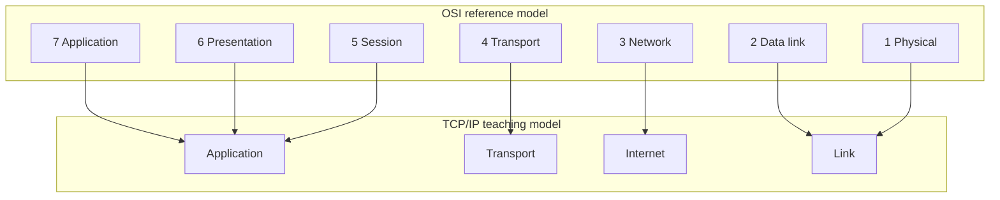
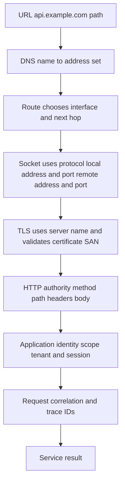
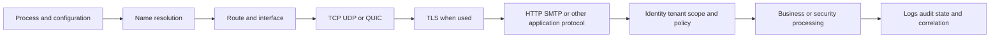
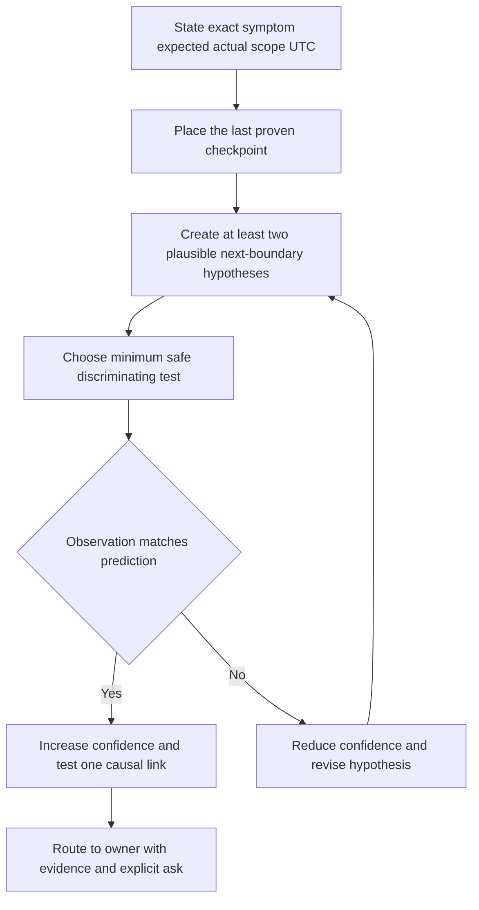
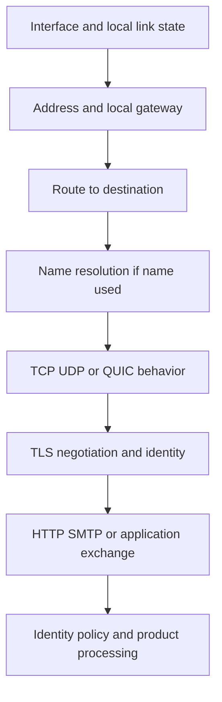
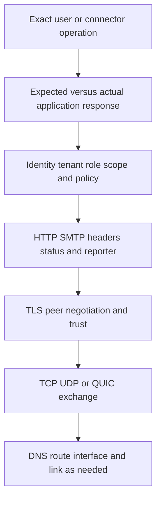
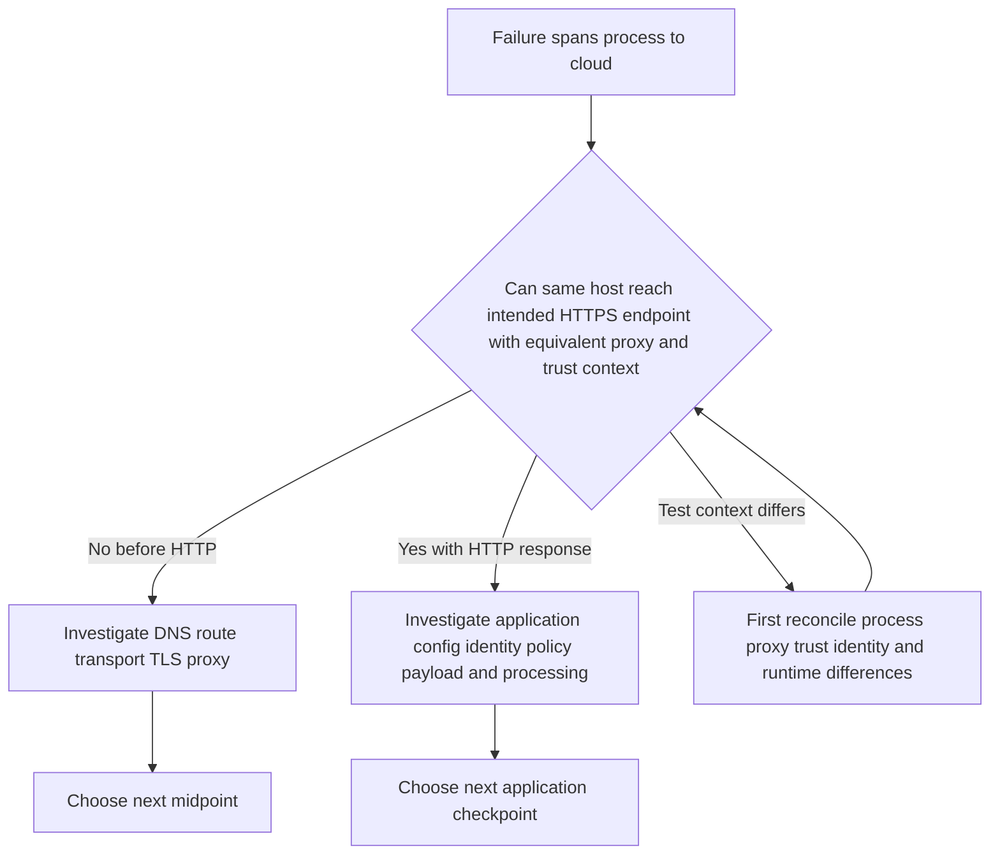
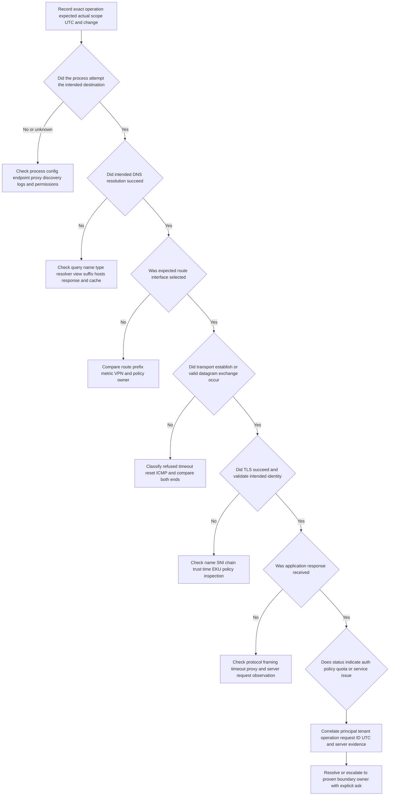

# Part 071 - OSI and TCP IP Troubleshooting Bridge

> **Purpose:** Turn networking terminology into an evidence-based support method for SaaS, API, identity, and email-connectivity cases.
>
> **Artifact label:** Learned architecture plus local/public lab. This Part does not claim production network-engineering ownership.
>
> **Currency and source access date:** August 24, 2026.

## Section goal

By the end of this Part, you should be able to use the seven-layer Open Systems Interconnection (OSI) reference model and the Internet protocol suite, commonly called the TCP/IP model, as troubleshooting maps rather than rigid explanations of software ownership. You should be able to describe encapsulation and decapsulation, name protocol data units carefully, distinguish names, addresses, ports, certificates, and HTTP identities, and convert a customer symptom into a layer hypothesis, discriminating evidence, and the correct owner.

The practical objective is not to recite seven layer names. It is to answer questions such as: Did a SaaS connector fail before name resolution, during route selection, while opening a Transmission Control Protocol (TCP) connection, during Transport Layer Security (TLS), or after an HTTP request reached the service? Which observation would disprove the current hypothesis? Which team can act on the evidence? That is the bridge from networking study to enterprise support.

This Part teaches three investigation directions: **bottom-up**, beginning with local/link and moving toward the application; **top-down**, beginning with the user-visible application behavior and moving down; and **divide-and-conquer**, testing a highly discriminating midpoint first. None is universally best. The correct choice depends on the symptom, available evidence, safety, and time.

## JD Mapping

| Supplied role signal | Capability developed here | SaaS, API, or email application | Proof artifact |
|---|---|---|---|
| Complex investigations | Separates one vague failure into testable layer hypotheses | Connector cannot reach a cloud endpoint | Layer-to-symptom evidence matrix |
| Inbound API questions | Distinguishes DNS, TCP, TLS, HTTP, identity, and API-contract failures | `POST` returns an error after successful TLS | Annotated request path |
| Cloud Email Security | Connects DNS, routing, TCP, TLS, SMTP/HTTPS, and product processing without collapsing them | Mail transfer timeout versus application rejection | Layered email-flow narrative |
| SaaS Security | Maps endpoints, proxies, identities, certificates, and tenant-facing requests | Audit collector intermittently fails | Identity and owner ledger |
| Customer trust | Explains what is known, unknown, and tested without network jargon theater | Clear status update during an outage | Evidence-led update template |
| Engineering collaboration | Packages expected/actual behavior, times, IDs, and the narrow failed boundary | Reproducible escalation | Symptom-to-owner table |
| Networking and diagnostic tools | Converts working familiarity into disciplined interpretation | Windows and Linux command evidence | Safe local lab |
| Security and privacy | Minimizes captures and avoids secrets, payloads, and unauthorized probes | Redacted packet metadata | Collection boundary checklist |
| Continuous learning | Uses standards and official documentation rather than memorized folklore | Current protocol verification | Dated source ledger |
| Honest candidate positioning | Distinguishes support reasoning from network design or operations ownership | Interview answer about network depth | Candidate honesty statement |

## Candidate honesty note

You can accurately say that TCP/IP, OSI, HTTP/HTTPS, TLS, DNS/DHCP, proxies, firewalls, ports, routing, Wireshark, Netsh, Network Monitor, Procmon, DevTools, HAR, and Fiddler are areas of **upskilling and working familiarity**. Your production-strength transfer is several years of enterprise support: scoping impact, comparing working and failing states, collecting evidence, coordinating owners, escalating to Engineering, validating fixes, and communicating under pressure.

You should not say that you designed enterprise networks, administered routers or firewalls, owned packet-level production incidents as a network engineer, or operated Abnormal AI connectivity in production. A safe interview formulation is:

> My production depth is enterprise SaaS support and evidence-led escalation. Networking is a deliberate working-familiarity area that I use to isolate DNS, transport, TLS, proxy, and HTTP boundaries. I can demonstrate the method in repeatable labs, and I would partner with the customer's network or security owner for production policy and device changes.

| Evidence tier | Honest claim in this Part | Claim to avoid |
|---|---|---|
| Production transfer | Structured enterprise support investigations, customer updates, escalation, fix validation | Production network-engineering ownership |
| Working familiarity | Layered TCP/IP reasoning and common diagnostic evidence | Expert packet forensics from this lesson alone |
| Local/public lab | Loopback HTTP, local socket evidence, localhost capture where authorized | Customer-environment proof |
| Learned architecture | Standards-based OSI/TCP-IP mapping and protocol identities | Abnormal-specific internal topology |
| No direct experience | Abnormal AI production network paths and internal telemetry | Invented product boundaries or owners |

## 1. Why layered models exist

A networked application performs many jobs: it creates application data, identifies a remote service, protects a session, divides data into transport units, chooses an internetwork path, reaches a neighboring interface, and transmits signals. A **layered model** groups related jobs so people can reason about one boundary without holding the entire system in their head.

An analogy is a parcel delivery. The product department writes an order, a packaging team boxes it, a courier labels a route, a local depot chooses the next vehicle, and a physical vehicle moves it. On arrival, those steps are reversed. The analogy helps explain nested handling and local responsibilities. It stops being accurate because network layers are implemented in interacting software, firmware, hardware, operating-system components, libraries, middleboxes, and cloud services; they are not independent employees in a strict vertical organization.

The OSI model has seven named layers. It is a **reference model**, meaning a conceptual vocabulary for describing communication functions. The deployed Internet is more directly described by the TCP/IP protocol suite. Engineers commonly use OSI layer numbers as shorthand, but actual implementations do not always fit one box. TLS is a classic example: people may place it at OSI presentation, session, or application level depending on the discussion. The useful question is not “Which single layer owns TLS forever?” It is “Which boundary and evidence are we testing?”

```mermaid
flowchart LR
    User[User or integration goal] --> App[Application behavior]
    App --> Protect[Representation session and protection]
    Protect --> Transport[Transport conversation]
    Transport --> Internet[Internetwork addressing and route]
    Internet --> Link[Local link delivery]
    Link --> Medium[Signals on a medium]
    Medium --> Link2[Peer link receives]
    Link2 --> Internet2[Peer validates destination]
    Internet2 --> Transport2[Peer transport reassembles]
    Transport2 --> Protect2[Peer decrypts and interprets]
    Protect2 --> Service[Service processes request]
```



### Model comparison

| OSI layer | Primary reasoning question | Common examples | TCP/IP grouping | Important caution |
|---:|---|---|---|---|
| 7 Application | What service operation and application protocol are in use? | HTTP, SMTP, DNS application messages | Application | An application error can depend on lower layers |
| 6 Presentation | How is data represented, compressed, or protected? | Character encoding, serialization, TLS concepts | Application | TLS does not map cleanly to only one OSI box |
| 5 Session | How is a dialogue established, maintained, or resumed? | Session state, TLS resumption, RPC dialogue concepts | Application | Many Internet protocols implement session behavior themselves |
| 4 Transport | Can endpoints exchange transport data reliably or as datagrams? | TCP, User Datagram Protocol (UDP), ports | Transport | QUIC uses UDP but provides richer transport behavior in user space |
| 3 Network | How does a packet reach an address across networks? | Internet Protocol (IP), routing, Internet Control Message Protocol (ICMP) | Internet | Policy, tunnels, and middleboxes complicate paths |
| 2 Data link | How does one local-link participant reach another? | Ethernet, Wi-Fi frames, Media Access Control (MAC), Address Resolution Protocol (ARP) | Link | A cloud support engineer may not observe the customer link |
| 1 Physical | Are bits represented and carried on the medium? | Radio, copper, fiber, signal and link state | Link | “Link up” does not prove useful end-to-end communication |

## 2. TCP/IP is both a suite and a model

**TCP/IP** can refer to the family of protocols that make the Internet work or to a four-layer/five-layer teaching model. A common four-layer model contains application, transport, internet, and link. Some teaching material separates physical from data link, producing five layers. Both can be useful if the speaker names the convention.

The TCP/IP model is closer to deployed Internet protocols than the seven-layer OSI model, but it is still a model. It does not mean an operating system has exactly four isolated modules. For example, a browser may perform HTTP, TLS, DNS-over-HTTPS, proxy selection, connection pooling, and QUIC decisions while the operating system supplies sockets, routes, interfaces, and trust stores. A security agent or enterprise proxy can alter the observable path again.

| Reasoning need | OSI vocabulary advantage | TCP/IP vocabulary advantage | Support-safe phrasing |
|---|---|---|---|
| Teaching all functions | Seven layers make distinct concerns visible | Fewer groups are easier to follow | “Conceptually, this is a transport boundary” |
| Internet troubleshooting | Layer numbers are familiar shorthand | Maps directly to IP, TCP/UDP, and application protocols | “DNS succeeded; TCP connection is the next checkpoint” |
| Ownership | Can suggest a specialist domain | Avoids pretending each OSI layer has a team | “The evidence points to the proxy policy owner” |
| TLS discussion | Presentation/session concepts explain protection and dialogue | Internet practice treats TLS near application behavior | “TLS is between TCP establishment and protected HTTP here” |
| QUIC/HTTP/3 | Exposes why strict mapping becomes awkward | Treats QUIC as transport over UDP for application use | “UDP reachability alone does not prove QUIC success” |



## 🔍 Plain-English deep-dive: Layers are questions, not literal ownership boxes

Suppose a browser displays `502 Bad Gateway`. Calling it “a Layer 7 issue” is a useful starting classification because an HTTP-speaking intermediary generated an HTTP status. It is not a root cause. The reverse proxy may have failed to resolve a backend name, timed out opening TCP, rejected a backend certificate, or received an invalid HTTP response. An application-layer symptom can therefore report a lower-boundary failure observed by another system.

Think of a hotel front desk telling a guest that a room is unavailable. The front desk owns the message, but the cause might be maintenance, housekeeping, a reservation-data error, or a safety closure. The analogy stops because protocols expose specific machine evidence and automated retry behavior that a hotel metaphor does not model.

Use layer language to form questions:

1. What operation is the user trying to complete?
2. What is the last independently proven checkpoint?
3. What next boundary must succeed?
4. Which observation would disprove the favored hypothesis?
5. Which owner controls that boundary?

| Weak layer statement | Why weak | Stronger statement |
|---|---|---|
| “It is Layer 7.” | Classifies the visible format only | “The reverse proxy returned HTTP 502; backend DNS/TCP/TLS evidence is still needed.” |
| “The network is fine.” | No defined scope or proof | “Name resolution and TCP 443 succeeded from this host at 14:03 UTC; TLS failed before HTTP.” |
| “TLS is Layer 6.” | Treats a teaching mapping as ownership proof | “The certificate-name validation failed after TCP establishment and before protected HTTP.” |
| “Ping works, so the API works.” | ICMP reachability does not prove the target protocol | “ICMP replied; TCP/TLS/HTTP remain untested.” |
| “The firewall blocked it.” | Assigns cause without policy evidence | “Three SYN attempts received no response; route, firewall drop, and return-path hypotheses remain.” |

## 3. Encapsulation and decapsulation

**Encapsulation** is the process of adding control information around data as it moves down a protocol stack. The application creates data. A transport protocol adds a transport header. IP adds an IP header. A link technology adds a frame header and often a trailer. The physical/link medium carries the resulting bits or symbols. At the receiver, **decapsulation** validates and removes the relevant information as data moves upward.

Headers are not decorative labels. They carry fields used by peers and intermediate systems: ports for transport demultiplexing, addresses for routing, flags and sequence numbers for TCP behavior, and checks/integrity fields where defined. Each header has a scope. Ethernet addresses usually matter on a local link and can change at every routed hop; IP addresses normally identify internetwork endpoints but can be translated; TCP ports identify transport endpoints on hosts; application identifiers live inside or above protected protocol content.

```mermaid
sequenceDiagram
    participant App as SaaS client application
    participant TCP as TCP transport
    participant IP as IP layer
    participant Link as Ethernet or Wi-Fi link
    participant Net as Network path
    participant Peer as Cloud service stack
    App->>TCP: HTTP/TLS bytes
    TCP->>IP: TCP segment with ports and sequence state
    IP->>Link: IP packet with source and destination addresses
    Link->>Net: Frame for the next local hop
    Net->>Peer: Frames change by hop; packet is forwarded
    Peer->>Peer: Decapsulate link, IP, transport, then protected application data
    Peer-->>App: Response follows the reverse logical process
```

### Protocol data unit names, used carefully

A **protocol data unit (PDU)** is the unit of data a protocol layer exchanges. Textbooks often teach a fixed naming ladder: data at layers 7–5, segment at layer 4 for TCP, packet at layer 3, frame at layer 2, and bits at layer 1. This is a useful memory aid, not universal language.

| Context | Careful PDU term | Why this term works | Common overstatement to avoid |
|---|---|---|---|
| HTTP request or SMTP command | Application message or application data | Names the protocol object | Calling every application object a “packet” when precision matters |
| TLS | TLS record or handshake message | TLS defines records and handshake messages | “TLS packet” as if TLS were IP |
| TCP | TCP segment | Conventional and technically useful | Saying UDP has TCP segments |
| UDP | UDP datagram | UDP specification uses datagram language | Assuming datagram means guaranteed delivery |
| IPv4 or IPv6 | IP packet; IPv6 specification also uses packet | Describes the routed unit | Calling an Ethernet frame an IP packet without context |
| Ethernet or Wi-Fi | Frame | Link-layer delivery unit | Treating one captured frame as an entire application transaction |
| Physical signaling | Bits/symbols/signals depending medium | Avoids pretending the medium only exposes abstract bits | Assigning application meaning directly to a physical event |
| Generic capture discussion | Packet is common colloquial shorthand | Wireshark and users commonly say packet capture | Mistaking shorthand for exact protocol scope |

The plural “data” may be adequate at the upper layers, but a JSON object, HTTP message, TLS record, and email message are not interchangeable. A capture may split one application message across several TCP segments or carry several small application records efficiently. TCP presents an ordered byte stream, not application message boundaries. That distinction prevents false conclusions such as “one packet equals one API request.”

## 4. Nested scope and changing headers

At each router, the incoming link frame is removed and a new link frame is created for the next link. The IP packet is forwarded, with fields such as hop limit or time to live changed. If Network Address Translation (NAT) is present, addresses and often ports may change. TCP endpoints still maintain the conversation, but middleboxes can inspect, proxy, terminate, or reset it. TLS can protect application content from passive observers, yet an explicitly trusted inspection proxy may terminate one TLS session and create another.

```mermaid
flowchart LR
    C[Client application data] --> T1[TCP header plus bytes]
    T1 --> P1[IP header plus TCP segment]
    P1 --> F1[Local frame to gateway]
    F1 --> R[Router removes local frame]
    R --> F2[New frame on next link]
    F2 --> P2[Forwarded IP packet]
    P2 --> S[Server receives]
    S --> U[Transport reassembly]
    U --> A[Application interprets data]
```



| Identifier or state | Typical scope | May change on path? | Support value |
|---|---|---:|---|
| MAC address | One local Layer 2 link | Yes, at routed hops | Local gateway/neighbour evidence |
| Client private IP | Local enterprise or virtual network | Often through NAT | Host and route correlation |
| Public translated IP | Internet-facing translation boundary | Yes across proxies/NAT | Allowlist and cloud-log correlation |
| Destination IP | Routed service endpoint | DNS, CDN, load balancer, NAT can vary | Route and endpoint evidence |
| Source TCP port | Client-side transport instance | PAT/proxy can change it | Five-tuple and capture correlation |
| Destination TCP port | Requested transport service | Proxy/tunnel may alter path | Listener/policy hypothesis |
| DNS name | Human/application service name | Resolves to multiple addresses | Intent and service selection |
| TLS server name | Hostname indicated for TLS endpoint selection | Proxy may observe or originate it | Certificate/virtual-host routing |
| Certificate SAN | Names the certificate is valid for | Certificate differs by endpoint/inspection | Peer identity validation |
| HTTP `Host`/`:authority` | Application authority requested | Reverse proxy may route on it | Virtual host/API boundary |
| HTTP request/correlation ID | One application request/trace context | Services can add or propagate IDs | Client-to-server log join |
| Email Message-ID | Message-level identifier supplied in content | Can be absent, duplicated, or rewritten | Mail-flow correlation with cautions |

## 🔍 Plain-English deep-dive: One request carries many different identities

Consider a connector calling `https://api.example.com/v1/events`. The string `api.example.com` begins as a **name**. DNS may return several IP addresses. The routing table chooses a path to one address. TCP uses source and destination ports. TLS validates that the certificate is acceptable for `api.example.com`, commonly through a Subject Alternative Name (SAN). HTTP sends an authority/host and a path. Authentication identifies a user, workload, application, or tenant. The service creates a request ID. These identities answer different questions.

The analogy is international travel. A traveler has a name, passport number, flight number, seat, departure gate, destination airport, hotel reservation, and payment reference. No one identifier replaces all others. The analogy stops because network identifiers can be translated, reused, multiplexed, encrypted, or generated dynamically.



### Identity ledger for a support case

| Question | Evidence field | Example with harmless reserved data | What it does not prove |
|---|---|---|---|
| What did the client intend? | URL/hostname and operation | `https://api.example.com/v1/events` | Actual resolved or reached endpoint |
| What did DNS return? | A/AAAA answer and resolver | `192.0.2.20` as documentation-only example | Route or port reachability |
| What path was selected? | Route/interface/next hop | Local route-table row | End-to-end symmetry |
| What transport instance? | Five-tuple and protocol | TCP local ephemeral to remote 443 | TLS or HTTP success |
| What TLS identity? | SNI, chain, SAN, issuer | SAN `api.example.com` | Application authorization |
| What HTTP operation? | Method, authority, path, status | `GET /health`, status `200` | Full business workflow health |
| Who authenticated? | Redacted principal/client ID and scopes | Synthetic `CLIENT-071` | Permission to every resource |
| Which request? | Request/trace ID and UTC | `REQ-071-A`, `14:03:12Z` | Root cause by itself |
| Which email? | Message ID/network message ID and UTC | `MSG-071@example.test` | Authenticity or delivery alone |

## 5. The layered endpoint-to-cloud path

For SaaS support, the most useful path often starts above the traditional stack with local process and configuration, then crosses protocol boundaries, then reaches cloud processing. A browser extension, service process, or connector can fail before any packet is sent because its configuration, credential reference, proxy decision, or local trust store is wrong. Likewise, successful HTTP does not prove a downstream asynchronous job completed.

| Checkpoint | Expected evidence | Example failure symptom | Likely owner to involve |
|---|---|---|---|
| Process/configuration | Correct process running; intended endpoint and proxy mode | No attempt appears in capture | Application/endpoint owner |
| Name resolution | Expected DNS response from intended resolver/view | NXDOMAIN, timeout, wrong split-DNS answer | DNS/network owner |
| Route/interface | Route to chosen address via expected interface | Wrong VPN path or no route | Endpoint/network owner |
| Transport | TCP handshake or valid UDP/QUIC exchange | Refused, timeout, reset | Host, firewall, proxy, service owner depending evidence |
| TLS | Negotiated version; valid peer chain/name/time | Unknown CA, hostname mismatch, alert | Trust/proxy/service owner |
| HTTP/SMTP | Protocol request reaches respondent; status/reply exists | 407 proxy auth, 401/403, 429, 5xx | Proxy, identity, API, or service owner |
| Application identity | Correct principal, tenant, role, and scope | Authenticated but forbidden | IAM/application owner |
| Product processing | Accepted object progresses through documented state | HTTP 202 but no eventual event | Product/integration owner |
| Observability | UTC and stable IDs join client and service evidence | “No logs” due wrong tenant/time | Logging/product owner |



## 6. Symptom to layer to evidence to owner

A **symptom** is an observed unwanted behavior, not a diagnosis. “The integration is down” is a customer summary. It must be converted into an exact operation, expected result, actual result, scope, start time, frequency, environment, and change history.

A **hypothesis** is a testable explanation. “DNS is broken” is too broad until it predicts an observation, such as “the configured resolver returns NXDOMAIN for the service name while a known-good resolver returns the documented address.” A **discriminating test** produces different expected results for competing hypotheses. Repeating an undirected command is activity, not necessarily diagnosis.

### Symptom routing matrix

| Observed symptom | First plausible boundaries | Discriminating evidence | Causation restraint | Potential owner after proof |
|---|---|---|---|---|
| Name not found | Hosts/search suffix/stub/resolver/authoritative DNS | Resolver used, query name/type, response code, answers | NXDOMAIN is not “the Internet is down” | DNS zone or endpoint configuration owner |
| Connection refused | Route reached responding host; no listener or active reject | SYN followed by RST/ACK; local listener evidence | Could be service, address, port, or policy | Service/host/firewall owner |
| Connection timeout | Route, firewall drop, service silence, return path | SYN timing, route, server-side observation | A timeout alone does not identify a firewall | Network/service owners based on both sides |
| TLS hostname error | Wrong hostname, wrong endpoint, wrong certificate | SNI, peer chain, SAN, requested hostname | Do not disable validation | Service, DNS, proxy, or certificate owner |
| HTTP 401 | Missing/invalid authentication | Challenge, sanitized auth scheme, token metadata outside ticket | Not usually a network failure | Identity/API client owner |
| HTTP 403 | Identity known but operation/policy denied, sometimes edge policy | Principal, scopes/roles, request ID, server audit | 403 semantics are product-specific | IAM/application/security owner |
| HTTP 407 | Explicit proxy requires authentication | Proxy response headers and proxy configuration | Not origin API authorization | Proxy/endpoint owner |
| HTTP 429 | Rate/quota control | Retry-After, quota key, request rate, IDs | Retrying aggressively worsens it | Client/API owner |
| HTTP 502/503/504 | Gateway/backend/service availability | Responding hop, request ID, gateway/backend timing | Status class is not root cause | Reverse-proxy/service owner |
| SMTP 4xx/5xx | Mail protocol policy, transient/permanent handling | Exact reply, enhanced status, responding host, message IDs | Delivery and security verdicts are separate | Mail/security/service owner |
| One user fails | Local config, identity, policy, cached state | Working/failing comparison on same path | Avoid global outage claims | Endpoint/IAM/application owner |
| All sites fail on VPN | Route, DNS, proxy, VPN, endpoint policy | Before/after route/DNS/proxy comparison | Correlation with VPN is not proof | VPN/network owner |



## 🔍 Plain-English deep-dive: A visible error belongs to a reporter before it belongs to a cause

An HTTP 504 response belongs, as an observation, to the gateway that reported it. It says the gateway did not receive a timely upstream response according to its rules. It does not by itself say whether the upstream application was overloaded, DNS chose the wrong backend, TCP failed, TLS failed, a dependency stalled, or the timeout budget was too short.

Think of a train-station board displaying “delayed.” The board is the reporter. The delay may arise from track signaling, a late incoming train, weather, staffing, or a safety inspection. Asking which system emitted the message prevents support from assigning blame to the most familiar team. The analogy stops because protocol statuses have documented semantics and machine-correlatable IDs.

The reporting-system rule is:

1. Record the exact observer and UTC.
2. Preserve the exact error/status without secrets.
3. Identify what that observer attempted next.
4. Obtain evidence from the next boundary when authorized.
5. Assign an owner only when evidence identifies a controllable component.

## 7. Bottom-up troubleshooting

Bottom-up troubleshooting starts at the lowest relevant boundary and proves each higher checkpoint. It is useful when basic connectivity is genuinely uncertain, many applications fail, the endpoint recently changed networks, interface/link evidence is suspicious, or lower-layer proof is cheap.



| Bottom-up step | Question | Windows evidence example | Linux evidence example | Stop condition |
|---|---|---|---|---|
| Interface | Is intended interface operational? | `Get-NetAdapter` | `ip link` | Wrong/down interface explains scope |
| Address | Is address configuration plausible? | `Get-NetIPConfiguration` | `ip address` | APIPA/no gateway suggests configuration issue |
| Route | Which next hop/interface wins? | `Get-NetRoute` | `ip route get <address>` | Unexpected route/VPN owner identified |
| DNS | What does intended resolver answer? | `Resolve-DnsName example.com` | `resolvectl query example.com` or `dig example.com` | Wrong response/view explains intent mismatch |
| Transport | Can intended port establish? | `Test-NetConnection example.com -Port 443` | `curl`/`openssl` evidence; `ss` for local state | Refusal/timeout becomes narrow boundary |
| TLS | Does peer identity validate? | `curl.exe -v https://example.com/` | `openssl s_client` or `curl -v` | Chain/name/protocol error identified |
| Application | What exact response and ID? | DevTools or `curl.exe -D -` | `curl -D -` | Status/body identifies next application owner |

Bottom-up can waste time if the application already returned a precise HTTP authorization error. A 403 response proves that many lower checkpoints worked for that request. Rechecking the physical link first adds little unless the issue is intermittent or the response came from an unexpected intermediary.

## 8. Top-down troubleshooting

Top-down starts with the exact application operation. It is efficient when the application provides a detailed status, request ID, server response, or reproducible comparison. The investigator validates expected behavior, configuration, identity, and application evidence, then moves downward only when the current boundary lacks proof.



| Top-down clue | Immediate interpretation | Next safe check | Wrong shortcut |
|---|---|---|---|
| HTTP 401 with request ID | Server/intermediary produced application response | Authentication scheme, sanitized principal context, clock, request ID | Packet capture first without reading response |
| HTTP 403 for one operation | Reachability exists; authorization/policy likely | Compare roles/scopes/resource/tenant with allowed operation | “Firewall” because it says forbidden |
| HTTP 429 | Request reached rate-control boundary | Retry-After and client rate/retry design | Immediate parallel retries |
| Valid SMTP 550 reply | SMTP peer responded permanently for that command | Exact enhanced status, recipient/domain/policy context | Route testing as if no server answered |
| Browser certificate warning | TCP likely established; TLS identity/trust failed | Requested host, chain, SAN, trust source, inspection | Bypass warning or disable validation |
| No attempt in logs or capture | Failure may precede network I/O | Process, endpoint, proxy discovery, local config | Blame remote service |
| Client timeout but server logs success | Response/return path/client timeout/processing mismatch | UTC and ID correlation, capture both boundaries if authorized | Assume server never responded |

## 9. Divide-and-conquer troubleshooting

Divide-and-conquer selects a middle checkpoint whose outcome sharply separates hypotheses. For a connector to a SaaS API, a carefully scoped `curl -v` request to the intended harmless read-only endpoint may reveal DNS selection, connection attempt, TLS negotiation, HTTP status, and responding headers in one test. That can be more discriminating than checking every layer in order. It can also be misleading if `curl` uses a different proxy, trust store, protocol stack, credential, or runtime than the failing application.



### Choosing a method

| Situation | Preferred starting method | Reason | Check that could change the choice |
|---|---|---|---|
| Device has no useful connectivity | Bottom-up | Lower configuration is uncertain | Another app receives a precise cloud response |
| API returns structured 403 and request ID | Top-down | Lower path worked for that request | Response came from an enterprise proxy, not API |
| Connector says generic timeout | Divide-and-conquer | Many boundaries remain | Local process never attempted network I/O |
| VPN change affected many services | Bottom-up/divide at route and DNS | Shared path dependency | Non-VPN host reproduces same service error |
| One email message failed after SMTP reply | Top-down from exact SMTP reply/message state | Application protocol evidence exists | No actual reply was captured; UI paraphrased it |
| Intermittent SaaS failures | Timeline-led divide-and-conquer | Need working/failing comparison | All failures align with interface resets |

## 10. Worked example: SaaS audit connector times out

**Scenario:** A fictional connector `CONNECTOR-071` on Windows reports “endpoint timeout” when reading a harmless metadata endpoint at `https://api.example.com/`. The report started at 14:00 UTC after a VPN policy change. No credential will be used in the exercise.

**Expected:** DNS resolves the intended name; the selected route reaches the endpoint; TCP and TLS succeed; HTTP returns a response within the configured time. **Actual:** The application reports a timeout after 20 seconds.

### Competing hypotheses

| Hypothesis | Prediction | Minimum discriminating evidence | Result in worked example | Confidence update |
|---|---|---|---|---|
| H1 DNS failure | No usable A/AAAA answer from application resolver | `Resolve-DnsName` plus app DNS event if available | Answers returned | Decrease H1 |
| H2 VPN route black hole | SYN leaves VPN interface without reply | `Get-NetRoute`, `Test-NetConnection`, scoped capture | Selected VPN route; repeated SYN, no response | Increase H2, not yet causal |
| H3 TLS trust failure | TCP completes then TLS alert/validation error | TLS client output/capture metadata | TCP never completes | Decrease H3 for this attempt |
| H4 API processing timeout | HTTP request reaches service and service logs request ID | Client HTTP trace and service log | No HTTP evidence | Decrease H4 |
| H5 Application-only proxy mismatch | App uses proxy while test bypasses it | Effective proxy evidence and process behavior | App and test both use VPN direct route | Decrease H5 |

The last proven checkpoint is DNS. The next failed checkpoint is transport response on the selected VPN route. Three SYN retransmissions are **consistent with** silent loss, policy drop, unreachable return path, or an unresponsive endpoint. They do not prove “the firewall blocked it.” The useful escalation goes to the VPN/network owner with source/destination metadata, UTC, selected route, scoped capture summary, affected population, change correlation, and an explicit request to verify policy and return-path observations.

**Customer-safe update:**

> We confirmed the connector resolves the intended service name. From the affected host at 14:12 UTC, the selected path uses the changed VPN route, but the TCP connection did not complete and no TLS or HTTP request occurred. This narrows the current boundary to path/transport rather than API authorization. We are asking the VPN owner to compare policy and return-path evidence for the documented destination. We have not concluded that a firewall caused the loss.

## 11. Worked example: Email API returns 403

**Scenario:** A synthetic email-security integration can list tenants but cannot read a message metadata resource. The client receives HTTP 403 with `REQ-071-EMAIL` at 09:31:02Z.

The response proves that the specific attempt resolved a route, established a transport path, completed the required TLS exchange, and reached an HTTP-speaking respondent. It does not prove that every packet path was healthy or that the response came from the intended origin; the certificate, authority, and headers must establish that. Assuming those validate, the investigation starts top-down.

1. Record operation, tenant/resource, expected permission, actual 403, UTC, and request ID.
2. Confirm the responding authority and certificate matched the intended service.
3. Identify the synthetic principal/client ID without exposing a token.
4. Compare required versus granted role/scope for list-tenants and read-message-metadata.
5. Check whether admin consent, resource ownership, tenant boundary, or conditional policy differs.
6. Correlate the request ID with authorized service/audit evidence.
7. Route to IAM/API owner if the permission boundary is demonstrated.

| Observation | Layered meaning | Remaining uncertainty |
|---|---|---|
| DNS answer exists | Name resolution worked at that time/view | Other clients/views may differ |
| TLS identity valid | Intended HTTPS identity was validated | Authorization still unknown |
| HTTP 403 with request ID | Application policy respondent denied operation | Exact product reason requires docs/logs |
| Tenant listing succeeds | Principal has some permission | It may lack resource-specific permission |
| Metadata read fails | Operation/resource boundary differs | Scope, role, consent, resource, or policy |

The correct summary is not “Layer 7 issue, send to app team.” It is “The request reached the intended HTTPS authority and was denied for one operation; compare operation-specific authorization and tenant/resource policy using request ID `REQ-071-EMAIL`.”

## 12. Worked example: Browser works, Linux collector fails

**Scenario:** A browser on Windows reaches a SaaS portal, while a Linux service on the same corporate network cannot call its API hostname.

This is not proof that “the network works.” The two clients may use different DNS views, proxy discovery, certificate stores, TLS libraries, source networks, IP families, authentication identities, and HTTP versions. Compare controlled dimensions.

| Dimension | Windows browser | Linux collector | Diagnostic implication |
|---|---|---|---|
| Name | Portal hostname | API hostname | Different service endpoints |
| DNS resolver/view | Enterprise client policy | Container or system resolver | Split DNS possible |
| Proxy | PAC/managed browser | Environment variable or direct | Path may differ |
| Trust | Windows certificate store | Distribution/container CA bundle | Inspection CA may be absent |
| IP family | Happy Eyeballs | Library preference/configuration | IPv6/IPv4 result may differ |
| Identity | Interactive user/session | Workload identity/token | Authorization differs |
| Protocol | HTTP/2 or HTTP/3 possible | Library-specific HTTP/1.1 or HTTP/2 | Middlebox behavior can differ |

The discriminating plan is to compare the exact API hostname from both environments, document resolvers and answers, effective proxy, selected address, TLS chain and SAN, HTTP response, and UTC. Do not export cookies or tokens. A public portal success is weak evidence for a protected API operation.

## 13. Troubleshooting tree



### Hypothesis ledger template

| ID | Hypothesis | Why plausible | Prediction | Test and safety | Actual observation | Confidence | Next action/owner |
|---|---|---|---|---|---|---|---|
| H1 | Name resolution differs | Split DNS and VPN change | Affected resolver returns different address | Read-only query to intended resolver | Record exact result | Low/medium/high | Named owner |
| H2 | Selected route is wrong | Failure began after VPN route change | Route points to unexpected interface | Read route table; no change | Record row | Low/medium/high | Named owner |
| H3 | TCP listener unavailable | Refused immediately | SYN receives RST/ACK | Scoped local observation | Record flags/time | Low/medium/high | Named owner |
| H4 | TLS identity mismatch | Browser warning | SAN excludes requested name | Inspect peer cert; do not bypass | Record names/issuer/time | Low/medium/high | Named owner |
| H5 | API permission missing | 403 for one operation | Principal lacks required scope/role | Compare metadata only | Record scope names, no token | Low/medium/high | Named owner |

## 🔍 Plain-English deep-dive: “Last proven good” is a checkpoint, not the root cause

If DNS succeeded and TCP did not, DNS is the last proven good checkpoint and TCP/path is the first observed failing boundary. This narrows the search. It does not prove a TCP implementation defect. The failure could be routing, firewall policy, listener state, NAT, return path, resource exhaustion, or an endpoint selecting the wrong address.

Imagine a tracked parcel scanned at a regional depot but absent at the destination. The scan narrows where to investigate; it does not prove the delivery truck broke down. The analogy stops because network evidence can be duplicated, sampled, transformed, or observed from only one side.

Use precise language:

- **Observed:** “The client sent SYN packets and received no reply during the scoped capture.”
- **Inferred:** “The failure is before TLS and HTTP for those attempts.”
- **Not yet known:** “Whether loss occurred at endpoint policy, VPN, firewall, remote path, or return path.”
- **Next test:** “Compare matching UTC/five-tuple evidence at the next authorized boundary.”

## 14. Common failure modes and unsafe shortcuts

| Failure mode or shortcut | Why it misleads or creates risk | Better practice | Escalation trigger |
|---|---|---|---|
| Reciting layers without evidence | Sounds organized but does not discriminate | Name last proof, prediction, and next observation | No authorized evidence at boundary |
| Treating OSI mapping as literal implementation | Modern stacks and proxies cross boundaries | State model convention and concrete protocol state | Architecture ambiguity blocks action |
| Saying “network issue” for any timeout | Timeout has many causes | Record reporter, stage, duration, retries, both-side evidence | Repeated impact with no observable next hop |
| Saying “application issue” for any HTTP status | Intermediary can report lower failure | Identify respondent and upstream attempt | Gateway/backend evidence needed |
| Assuming ping proves service health | ICMP differs from TCP/TLS/HTTP policy | Test intended protocol safely | ICMP blocked but service status uncertain |
| Disabling TLS validation | Removes identity protection and hides cause | Inspect chain/name/trust/time; fix trust path | Certificate ownership or interception unclear |
| Capturing broad production traffic | Exposes credentials, content, PII, and other users | Scope host/interface/port/time; authorize and stop | Sensitive content cannot be minimized |
| Posting raw HAR/pcap in a ticket | Artifacts can contain tokens, cookies, email/body content | Redact, minimize, store in approved protected channel | Secret exposure requires incident process |
| Probing arbitrary public hosts | Unauthorized and irrelevant | Use localhost, owned systems, `example.com`, or documented read-only service | Need target-owner authorization |
| Changing firewall/routing during diagnosis | Destroys baseline and can increase blast radius | Read state first; use approved change/rollback | Production change required |
| Equating correlation with cause | VPN change may coincide with service incident | Predict and test mechanism | Competing hypotheses remain viable |
| Assigning owner from layer number | Organizational ownership is deployment-specific | Identify component/control and explicit evidence | Shared boundary needs coordinated escalation |

## 15. Escalation package for a layered connectivity case

| Package field | Minimum useful content | Privacy/safety boundary |
|---|---|---|
| Customer impact | Operation, affected population, severity, workaround | No unnecessary user content |
| Expected/actual | Exact expected state and exact observed state | Preserve wording/status |
| Timeline | Start, reproductions, changes, tests in UTC | Note clock source/skew |
| Endpoint | OS/version, process/runtime, interface class | Redact device/user names where unnecessary |
| Intent | Sanitized service hostname, operation, environment | No query secrets or message content |
| DNS | Query name/type, resolver/view, response code/answers/TTL | Public/reserved values or protected handling |
| Route | Selected interface/next hop/prefix decision | Mask internal topology in customer-safe summary |
| Transport | Protocol, ports, five-tuple where approved, states/timing | Do not publish customer IPs broadly |
| TLS | Version, SNI/name, chain subject/issuer/SAN/time/error | Certificate public data may still expose internal names |
| Application | Method/command, status/reply, request/message ID | Remove authorization, cookies, bodies, recipients |
| Hypotheses | Ranked explanations and tests with outcomes | Separate observation from inference |
| Owner/ask | Exact component owner and decision/evidence requested | Do not prescribe unauthorized change |

## Safe local lab: The Layer Passport 071

### Objective

Create a harmless, inspectable endpoint-to-localhost evidence chain that demonstrates application data, names, addresses, ports, TCP state, and HTTP identity without credentials or third-party probing. The unique artifact is **The Layer Passport 071**. It uses only the loopback interface and Python's standard-library HTTP server if Python is already installed. If Python is unavailable, use an existing local development server owned by the learner or complete the paper variant; do not install software merely for the exercise.

### Prerequisites

- Authorization to inspect the learner's own workstation.
- Windows PowerShell and/or a Linux shell.
- Optional Python 3 already installed; verify with `python --version`, `py -3 --version`, or `python3 --version`.
- A new empty local directory containing only a harmless text file named `layer-passport-071.txt` with synthetic content such as `CASE-071 local lab`.
- Browser or platform-provided `curl` client. On Windows, use `curl.exe` to avoid PowerShell alias ambiguity on older environments.
- Optional Wireshark/tcpdump only if already installed and loopback capture is understood and authorized. Packet capture is not required for a pass.
- No administrator rights are required for the core lab. Do not change firewall, proxy, route, DNS, trust, or security settings.
- Artifact label: **local/public lab - loopback metadata and harmless synthetic content only**.

### Lab procedure

1. Record start time in UTC and the artifact label. Record OS, shell, and whether Python, `curl`, and local TCP-state tools are available.
2. Create the harmless text file in an otherwise empty lab directory. Confirm it contains no personal, customer, tenant, credential, token, cookie, internal hostname, or email data.
3. Start the local server bound explicitly to loopback and an unprivileged port:

   **Windows:**

   ```powershell
   py -3 -m http.server 8071 --bind 127.0.0.1
   ```

   **Linux:**

   ```bash
   python3 -m http.server 8071 --bind 127.0.0.1
   ```

4. Keep that terminal visible. The explicit stop action is `Ctrl+C`. Do not bind to `0.0.0.0` or a non-loopback interface.
5. In a second terminal, record listener evidence.

   **Windows:**

   ```powershell
   Get-NetTCPConnection -LocalAddress 127.0.0.1 -LocalPort 8071 -State Listen
   ```

   **Linux:**

   ```bash
   ss -ltn 'sport = :8071'
   ```

6. Request only the harmless file and print headers plus body:

   **Windows:**

   ```powershell
   curl.exe --verbose --max-time 10 http://127.0.0.1:8071/layer-passport-071.txt
   ```

   **Linux:**

   ```bash
   curl --verbose --max-time 10 http://127.0.0.1:8071/layer-passport-071.txt
   ```

7. Repeat using the name `localhost` and record whether it resolves to IPv4, IPv6, or both. If the server is bound only to `127.0.0.1`, an IPv6-first attempt may fail before a client falls back; record rather than “fix” it.
8. While making one request, inspect local TCP connections with the same read-only command filtered to port 8071. Short-lived states may disappear quickly; absence is not failure.
9. Create a Layer Passport table containing process, URL/name, resolved address, local/remote address, local ephemeral/remote listener port, TCP result, HTTP method/path/status, server log time, and synthetic case ID.
10. Run one safe negative test against the same loopback host and adjacent unused lab port with a two-second timeout: `curl.exe --verbose --max-time 2 http://127.0.0.1:8072/` or Linux equivalent. Record “refused” if the OS actively rejects it. Do not assume every environment uses identical wording.
11. Explain why the negative test demonstrates listener/transport behavior but does not test DNS, TLS, a proxy, Internet routing, or a cloud API.
12. Stop the local server with `Ctrl+C`. Verify the 8071 listener is gone using the read-only listener command.
13. Delete the harmless lab file and directory after preserving only a redacted Markdown summary if desired.

### Optional scoped loopback capture

Only if capture tooling is already installed and authorized, start a loopback-only capture filtered to TCP port 8071, make exactly one request, and stop immediately. In Wireshark select the documented loopback interface and use capture filter `tcp port 8071`; press the red stop button after the request. On Linux:

```bash
sudo tcpdump -i lo -nn -s 128 -c 20 'tcp port 8071'
```

`sudo` is needed only where local capture permissions require it. `-c 20` guarantees an automatic stop; `-s 128` limits captured bytes but may still include part of the harmless HTTP content. Do not run this command on a shared or production host. Delete the pcap after completing metadata observations. The required lab does not depend on elevated capture.

### Expected evidence

- UTC start/end and explicit local-only authorization statement.
- Listener bound only to `127.0.0.1:8071`.
- Successful loopback TCP connection and HTTP request for one harmless file.
- `curl` output showing connection target, request line, response status/headers, and synthetic body.
- Local server log showing the request; normalize its time if it is not UTC.
- A Layer Passport mapping application operation, name, address, port, transport result, and HTTP result.
- A safe negative result on unused local port 8072, commonly immediate refusal.
- Optional maximum-20-packet loopback capture with no secrets or real content.
- A short statement that localhost success does not prove proxy, DNS, TLS, Internet route, or SaaS service health.
- Spoken 90-second explanation comparing OSI and TCP/IP and naming the last-proven-checkpoint method.

### Cleanup and privacy

- Stop the Python/local server with `Ctrl+C`; verify no listener remains on 8071.
- Stop any capture immediately; verify `tcpdump` exited or Wireshark capture is stopped.
- Delete the synthetic file, empty lab directory, and optional pcap unless a sanitized artifact is intentionally retained.
- Inspect retained text for local usernames and paths. Redact them if they are not needed.
- Do not retain browser profiles, cookies, authorization headers, tokens, customer addresses, internal DNS names, email content, or unrelated traffic.
- Do not upload packet captures or verbose transcripts to public services or AI tools.
- Record: `Loopback-only Layer Passport 071 completed; no third-party host, credential, security control change, or production data was used.`

### Validation rubric

| Dimension | Fail | Developing | Pass |
|---|---|---|---|
| Scope | Uses external target without need | Uses localhost but broad listener | Loopback-only binding and explicit authorization |
| Model | Recites layer names | Maps some observations | Maps operation, name, address, port, TCP, and HTTP with caveats |
| PDU language | Calls everything a packet | Uses some precise terms | Distinguishes message, segment/datagram, packet, frame as context requires |
| Evidence | Says “works” | Saves command output | Records UTC, expected/actual, listener, request, status, and limitations |
| Negative test | Probes arbitrary host | Tests local unused port | Explains refusal and exactly what remains untested |
| Safety | Leaves service/capture running | Stops service | Verifies listener gone, stops capture, deletes sensitive artifacts |
| Honesty | Claims network-engineer depth | Calls it practice | Labels working familiarity and local lab precisely |
| Spoken answer | Lists seven layers only | Explains encapsulation | Connects symptom, layer, evidence, and owner in 90 seconds |

## Official Source Anchors - August 24, 2026

These sources anchor stable protocol concepts and current tool behavior. Standards describe protocol contracts; they do not prove a customer's topology, a vendor's implementation, or the cause of a specific incident. Product/tool pages can change and should be revalidated after the guide currency date.

| Official or primary source | Topic anchored | Support boundary |
|---|---|---|
| [ISO/IEC 7498-1 overview](https://www.iso.org/standard/20269.html) | OSI Basic Reference Model source family | Full standard access may require ISO purchase; model is conceptual |
| [RFC 1122 - Requirements for Internet Hosts, Communication Layers](https://www.rfc-editor.org/rfc/rfc1122.html) | Internet host communication-layer requirements | Updated by later RFCs; use RFC status/update links |
| [RFC 8200 - Internet Protocol, Version 6](https://www.rfc-editor.org/rfc/rfc8200.html) | IPv6 packet terminology and architecture | IPv6 operations are expanded in Part 072 |
| [RFC 9293 - Transmission Control Protocol](https://www.rfc-editor.org/rfc/rfc9293.html) | Current TCP specification, segments, connection behavior | Packet interpretation needs complete context |
| [RFC 768 - User Datagram Protocol](https://www.rfc-editor.org/rfc/rfc768.html) | UDP datagram foundation | Minimal service does not imply application behavior |
| [RFC 9110 - HTTP Semantics](https://www.rfc-editor.org/rfc/rfc9110.html) | HTTP methods, statuses, fields, semantics | HTTP respondent/status is not automatically root cause |
| [RFC 8446 - TLS 1.3](https://www.rfc-editor.org/rfc/rfc8446.html) | TLS handshake and protection foundation | TLS versions/certificates are expanded in Part 075 |
| [Microsoft Learn - TCP/IP Fundamentals](https://learn.microsoft.com/en-us/training/modules/network-fundamentals/) | Microsoft learning path for network fundamentals | Training material is not customer topology evidence |
| [Microsoft Learn - Get-NetTCPConnection](https://learn.microsoft.com/en-us/powershell/module/nettcpip/get-nettcpconnection) | Read-only Windows TCP connection-state evidence | Visibility and permissions vary |
| [Microsoft Learn - Get-NetRoute](https://learn.microsoft.com/en-us/powershell/module/nettcpip/get-netroute) | Windows route-table inspection | Reading a route does not prove remote path behavior |
| [Microsoft Learn - Test-NetConnection](https://learn.microsoft.com/en-us/powershell/module/nettcpip/test-netconnection) | Windows diagnostic command semantics | A successful port test does not prove TLS/HTTP/business health |
| [curl documentation](https://curl.se/docs/) | Official curl documentation and security guidance | Match proxy, trust, protocol, and identity context to the application |
| [Python documentation - http.server](https://docs.python.org/3/library/http.server.html) | Local lab server behavior and security warning | Not recommended for production; loopback lab only |
| [Wireshark User's Guide](https://www.wireshark.org/docs/wsug_html_chunked/) | Capture/display concepts and protocol inspection | Captures are sensitive and expert flags are not root-cause proof |
| [tcpdump manual](https://www.tcpdump.org/manpages/tcpdump.1.html) | Official tcpdump options and filter use | Capture authorization and minimization remain mandatory |

### Source-use discipline

- Prefer the current RFC named by the RFC Editor's update/obsolescence metadata.
- State whether a term is reference-model language, protocol specification language, or common operations shorthand.
- Revalidate Windows/Linux command syntax against installed versions and local policy.
- Never infer Abnormal AI's internal routing, proxy, TLS termination, ports, or owner map from this vendor-neutral lesson.
- Treat every packet capture, HAR, trace, and verbose transcript as potentially sensitive.
- Do not disable certificate validation, firewall controls, endpoint security, proxy policy, or VPN policy to make a lab pass.

## Likely Interview Questions

### Q1. How do the OSI and TCP/IP models differ, and which do you use?

**Model answer:** OSI is a seven-layer reference model that separates application, presentation, session, transport, network, data-link, and physical functions. TCP/IP more directly groups deployed Internet protocols into application, transport, internet, and link. I use either as a reasoning vocabulary, name the convention, and then anchor the investigation in concrete protocol evidence rather than forcing an implementation into one box.

### Q2. What are encapsulation and decapsulation?

**Model answer:** Encapsulation adds protocol control information as data moves down the sending stack: for example, application bytes are carried in TCP segments, IP packets, and local-link frames. The receiver validates and removes the relevant wrappers during decapsulation. Link headers can change at each routed hop, while application and transport meaning follow their own endpoint or proxy boundaries.

### Q3. What PDU names would you use at each layer?

**Model answer:** I use application message or data at the upper layers, TLS record when discussing TLS, TCP segment, UDP datagram, IP packet, link frame, and bits/signals at the medium. I also acknowledge that “packet” is common capture shorthand. Precision matters most when it prevents a wrong inference, such as assuming one TCP segment equals one HTTP request.

### Q4. Why is an HTTP 502 not automatically an application root cause?

**Model answer:** The 502 is an application-protocol observation emitted by a gateway. Its upstream attempt may have failed at backend DNS, TCP, TLS, HTTP framing, or application processing. I record which component responded, correlate its request ID and UTC, and inspect the next authorized boundary before assigning cause or ownership.

### Q5. How do names, addresses, ports, certificates, and HTTP identities differ?

**Model answer:** A DNS name expresses service intent and resolves to addresses; IP addresses support internetwork delivery; ports identify transport endpoints; TLS SNI and certificate SANs select and validate a protected service identity; HTTP authority, method, and path identify the application operation; authentication and request IDs identify principal/context and one transaction. None substitutes for all the others.

### Q6. When would you use bottom-up, top-down, or divide-and-conquer troubleshooting?

**Model answer:** I start bottom-up when basic endpoint or path state is uncertain, top-down when the application supplies a precise response such as a 403 or SMTP reply, and divide-and-conquer when a midpoint test can separate lower connectivity from upper application hypotheses quickly. I verify that the test uses equivalent DNS, proxy, trust, protocol, and identity context before treating it as representative.

### Q7. A client sends SYNs and receives no response. What can you conclude?

**Model answer:** I can conclude that the observed TCP handshake did not complete from that capture point and that TLS/HTTP did not occur for those attempts. I cannot conclude “firewall” from silence alone. Route, endpoint policy, transit loss, remote availability, asymmetric return path, NAT, and capture visibility remain hypotheses until matching evidence discriminates them.

### Q8. How does your networking background fit this support role?

**Model answer:** My production strength is several years of enterprise support, including complex investigations, customer communication, escalation, and fix validation. Networking and tools are working-familiarity areas I am deliberately deepening through safe labs. I can isolate DNS, route, TCP, TLS, proxy, and HTTP boundaries, but I would not claim network-engineer ownership or Abnormal production experience.

## Memory Hooks

- **Models organize questions; evidence identifies boundaries.**
- **OSI has seven; TCP/IP groups deployed Internet functions.**
- **Application message, TCP segment, UDP datagram, IP packet, link frame.**
- **Encapsulation wraps; decapsulation validates and unwraps.**
- **One request has names, addresses, ports, certificate names, HTTP authority, principal, and IDs.**
- **The visible error has a reporter before it has a cause.**
- **Last proven good narrows the path; it does not name root cause.**
- **Bottom-up for uncertain foundations; top-down for precise responses; divide at a discriminating midpoint.**
- **A timeout is an observation, not a firewall verdict.**
- **Ping is not TCP, TLS, HTTP, API health, or email delivery.**
- **UTC plus stable IDs connect client and service evidence.**
- **Working familiarity is not network-engineering ownership.**

## Completion Checklist

- [ ] I can explain why layered models exist without presenting them as literal ownership boxes.
- [ ] I can map all seven OSI layers to a named TCP/IP convention and state where the mapping is imperfect.
- [ ] I can define encapsulation, decapsulation, PDU, segment, datagram, packet, frame, and signal.
- [ ] I can explain why one TCP segment does not necessarily equal one application request.
- [ ] I can distinguish DNS name, IP address, MAC address, port, socket, SNI, certificate SAN, HTTP authority, principal, and request ID.
- [ ] I can convert a vague SaaS/API/email symptom into expected, actual, scope, UTC, and ranked hypotheses.
- [ ] I can state the last proven checkpoint and first observed failing boundary without overclaiming cause.
- [ ] I can choose bottom-up, top-down, or divide-and-conquer and explain why.
- [ ] I can identify a test that could disconfirm my favored hypothesis.
- [ ] I can explain why 401, 403, 407, 429, 502, 503, 504, SMTP replies, refusals, resets, and timeouts route differently.
- [ ] I can produce a privacy-minimized escalation package with an explicit owner ask.
- [ ] I completed or can accurately explain **The Layer Passport 071**.
- [ ] My local listener was loopback-only and was explicitly stopped and verified absent.
- [ ] I used no credential, token, customer data, security-control bypass, or third-party probe.
- [ ] I can deliver the eight model answers aloud without implying network-engineer or Abnormal production ownership.
- [ ] I reviewed the Official Source Anchors dated August 24, 2026 and noted what must be revalidated.

[Next: Part 072 - IPv4 IPv6 Subnetting Routing and NAT](Part-072-ipv4-ipv6-subnetting-routing-and-nat.md)