# Part 072 - IPv4 IPv6 Subnetting Routing and NAT

> **Purpose:** Build an accurate addressing and route-selection model for SaaS, API, and email-connectivity troubleshooting across IPv4 and IPv6.
>
> **Artifact label:** Learned architecture plus local/public read-only lab. No router, firewall, NAT, VPN, DNS, or cloud configuration is changed.
>
> **Currency and source access date:** August 24, 2026.

## Section goal

By the end of this Part, Arti should be able to read Internet Protocol version 4 (IPv4) and Internet Protocol version 6 (IPv6) addresses, convert IPv4 octets between decimal and binary, interpret Classless Inter-Domain Routing (CIDR) prefixes, calculate an IPv4 subnet's network, host range, and broadcast address, and explain the special-purpose ranges that commonly appear in support evidence. She should also be able to read a route table, apply longest-prefix matching before route preference/metric, reason about gateways and asymmetric paths, and distinguish source NAT, destination NAT, and port translation.

The operational goal is endpoint-to-cloud diagnosis. When a SaaS connector resolves an API name to both IPv4 and IPv6 addresses, which address did it choose? Which local interface and route won? Was the source translated? Did the return path differ? Did the client recover through a Happy Eyeballs-style IPv4/IPv6 race? A useful support answer connects the address and route evidence to the application attempt without pretending that an IP address identifies a person, tenant, certificate, or HTTP operation.

This lesson also establishes a security boundary: **Network Address Translation (NAT) is address/port translation, not a security control by itself.** Stateful firewalls and explicit policies can filter traffic; translation alone must not be described as protection.

## JD Mapping

| Supplied role signal | Capability built | SaaS/API/email connection | Evidence artifact |
|---|---|---|---|
| Complex investigations | Calculates and validates address/path scope | One subnet fails while another works | Prefix and route worksheet |
| API support | Identifies selected IP family, route, gateway, and translated source | API works over IPv4 but stalls over IPv6 | Dual-stack attempt timeline |
| Cloud Email Security | Connects mail/API endpoints to routable addresses without confusing message identity | SMTP/HTTPS path reaches unexpected edge | Address-to-service evidence map |
| SaaS Security | Distinguishes tenant/application identity from network location | Allowlist observes public egress IP | Identity-boundary table |
| Networking familiarity | Uses Windows and Linux route/address commands safely | Endpoint and VPN comparison | Read-only lab transcript |
| Customer communication | Explains path facts without saying “the Internet is broken” | Clear route-owner handoff | Customer-safe summary |
| Engineering escalation | Supplies exact prefix, selected route, family, interface, UTC, and request ID | Reproducible family-specific failure | Escalation package |
| Security mindset | Avoids treating NAT as a firewall or bypassing IPv6 | Dual-stack policy review | Safety checklist |
| Continuous learning | Anchors ranges and behavior in IANA/RFC/Microsoft/Linux docs | Standards-based interpretation | Source ledger |
| Honest positioning | Frames calculations and tooling as working familiarity | Interview depth statement | Spoken answer |

## Candidate honesty note

Arti's strongest production evidence remains Microsoft enterprise support: isolating client/cloud boundaries, managing critical investigations, comparing working and affected states, coordinating Engineering, and validating outcomes. IPv4/IPv6 subnetting, routing-table interpretation, NAT concepts, and path tools are **upskilling and working familiarity**, supported here by a local read-only lab. She should not claim to have designed enterprise IP plans, configured production routers, owned BGP, administered carrier networks, or changed customer NAT/firewall policy.

Safe wording is: “I can calculate subnets, interpret endpoint route selection, distinguish translated and original identities, and package evidence for the network owner. I would not make a production route or NAT change without authorization and the owning team's change process.”

| Evidence tier | Safe claim | Boundary |
|---|---|---|
| Production transfer | Enterprise SaaS support, escalation, customer updates, fix validation | Not production routing ownership |
| Working familiarity | CIDR math, route-table reading, dual-stack and NAT diagnosis | Not network architecture certification |
| Local/public lab | Own-device address/route inspection and reserved-address worksheets | Not customer topology evidence |
| Learned architecture | NDP, SLAAC, DHCPv6, Happy Eyeballs, translation concepts | Implementation varies by OS/network |
| Unknown | Abnormal AI edge addressing, egress ranges, routing, NAT, IPv6 support | Verify only through approved current docs |

## 1. IP addresses answer a delivery question

The Internet Protocol (IP) provides addressing and packet delivery across interconnected networks. An IP address identifies an interface or logical network endpoint in a routing context. It is not inherently a durable device identity, user identity, tenant identity, or certificate identity. Addresses can be reassigned, translated, shared, announced from multiple locations, or used by a load-balanced service.

An analogy is a postal delivery address. It helps a delivery system choose where to send an envelope. It does not prove who is inside, who wrote the letter, or who is authorized to open it. The analogy stops because IP routing uses prefixes and next hops, paths can be asymmetric, and one service may use many dynamic addresses.

```mermaid
flowchart LR
    Name[Service name] --> DNS[DNS answer set]
    DNS --> Address[Selected IPv4 or IPv6 address]
    Address --> Route[Longest matching route]
    Route --> Interface[Outgoing interface and next hop]
    Interface --> Path[Forward path]
    Path --> Edge[Cloud edge or service]
    Edge --> Return[Return path may differ]
    Return --> App[Transport TLS and application result]
```

### Address concepts

| Term | Plain meaning | Why it matters | Memory hook |
|---|---|---|---|
| Address | Numeric locator used by IP | Route and endpoint evidence | “Where IP sends” |
| Prefix | Leading bits shared by an address block | Defines network grouping and route specificity | “Left bits group” |
| Prefix length | Number after `/` indicating fixed leading bits | `/24` fixes 24 IPv4 bits | “Slash means fixed bits” |
| Subnet | A prefix used as one logical IP network | Determines on-link versus gateway decisions | “One routed neighborhood” |
| Interface | Logical/physical endpoint attached to a network | Holds addresses and sends packets | “The host's exit door” |
| Next hop | Neighboring router used toward a destination | Connects local decision to broader path | “Next router, not final server” |
| Default route | Least-specific route used when no better route exists | Typical path to nonlocal destinations | “Catch-all route” |
| Gateway | Router used to reach other networks | Often, but not always, the default next hop | “Road out of subnet” |
| Metric/preference | Value used among otherwise eligible routes | Helps choose between comparable routes | “Tie-break preference” |
| Dual stack | IPv4 and IPv6 available together | One family can work while the other fails | “Two possible roads” |

## 2. IPv4 from bits to dotted decimal

An IPv4 address is 32 bits. It is normally displayed as four 8-bit **octets** separated by dots, such as `192.0.2.25`. Each octet ranges from 0 to 255 because eight binary positions represent values from $0$ through $2^8-1$.

The place values in one octet are:

| Binary position | 7 | 6 | 5 | 4 | 3 | 2 | 1 | 0 |
|---:|---:|---:|---:|---:|---:|---:|---:|---:|
| Decimal value | 128 | 64 | 32 | 16 | 8 | 4 | 2 | 1 |

For example, decimal 192 is $128+64$, so its bits are `11000000`. Decimal 168 is $128+32+8$, or `10101000`. Decimal 10 is $8+2$, or `00001010`.

| Decimal | Binary | Calculation |
|---:|---|---|
| 10 | `00001010` | $8+2$ |
| 25 | `00011001` | $16+8+1$ |
| 128 | `10000000` | $128$ |
| 192 | `11000000` | $128+64$ |
| 224 | `11100000` | $128+64+32$ |
| 255 | `11111111` | Sum of all positions |

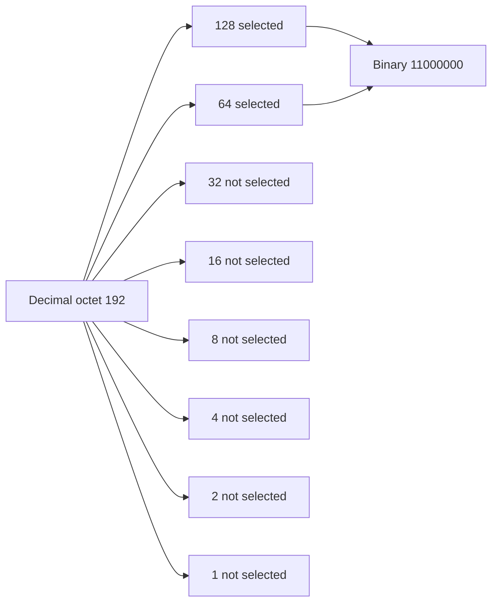

## 3. Prefixes and CIDR

**Classless Inter-Domain Routing (CIDR)** represents an address and the number of leading network bits, such as `192.0.2.25/24`. A `/24` leaves $32-24=8$ host bits. The corresponding dotted-decimal mask is `255.255.255.0`.

Older “Class A/B/C” language still appears, but modern routing and subnetting use explicit prefixes. Do not infer a `/8`, `/16`, or `/24` merely from the first octet. Always use the configured or advertised prefix.

The number of addresses in an IPv4 prefix is:

$$
2^{32-p}
$$

where $p$ is the prefix length. Traditional IPv4 host calculation subtracts the network and directed-broadcast addresses when those concepts apply:

$$
\text{traditional usable hosts}=2^{32-p}-2
$$

That shortcut is not universal. `/31` point-to-point links are defined for using both addresses, and `/32` represents one host route. Cloud platforms can reserve additional addresses. Calculate the block first, then apply the actual platform/protocol rules.

| Prefix | Mask | Addresses | Traditional host count | Block size in changing octet | Typical interpretation |
|---:|---|---:|---:|---:|---|
| `/8` | `255.0.0.0` | 16,777,216 | 16,777,214 | 1 in first octet | Very large aggregate |
| `/16` | `255.255.0.0` | 65,536 | 65,534 | 1 in second octet | Large subnet/aggregate |
| `/24` | `255.255.255.0` | 256 | 254 | 1 in third octet | Familiar LAN-sized block |
| `/25` | `255.255.255.128` | 128 | 126 | 128 | Half a `/24` |
| `/26` | `255.255.255.192` | 64 | 62 | 64 | Quarter of a `/24` |
| `/27` | `255.255.255.224` | 32 | 30 | 32 | Small subnet |
| `/28` | `255.255.255.240` | 16 | 14 | 16 | Smaller subnet |
| `/29` | `255.255.255.248` | 8 | 6 | 8 | Very small subnet |
| `/30` | `255.255.255.252` | 4 | 2 | 4 | Traditional point-to-point size |
| `/31` | `255.255.255.254` | 2 | Special | 2 | Point-to-point per RFC 3021 |
| `/32` | `255.255.255.255` | 1 | One exact address | 1 | Host route |

## 🔍 Plain-English deep-dive: A prefix is a stencil over bits

Imagine placing a stencil over the left side of a 32-character binary address. The covered positions are the prefix: they must match for addresses in that block. The uncovered positions can vary. A `/24` covers 24 bits and leaves 8 variable bits, giving $2^8=256$ combinations.

The analogy stops because a prefix is not merely a visual grouping. Hosts and routers use masks/prefixes in route selection and on-link decisions, and modern networks can hold overlapping or policy-qualified routes.

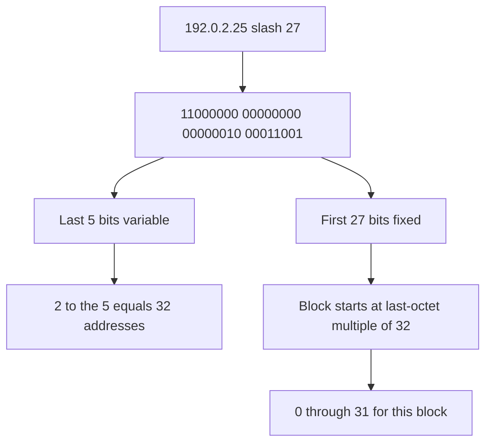

## 4. Calculating IPv4 network, host, and broadcast

The **network address** has all host bits set to zero. The **directed broadcast address** has all host bits set to one for a conventional broadcast-capable subnet. Ordinary assignable hosts lie between them, subject to platform reservations and special prefix rules.

### Worked example A: `192.0.2.77/27`

1. `/27` leaves five host bits.
2. The block contains $2^5=32$ addresses.
3. The last-octet boundaries are 0, 32, 64, 96, 128, 160, 192, and 224.
4. 77 lies in 64–95.
5. Network address: `192.0.2.64`.
6. Directed broadcast: `192.0.2.95`.
7. Conventional host range: `192.0.2.65` through `192.0.2.94`.

### Binary AND method

```
Address:  01001101  (77)
Mask:     11100000  (224)
AND:      01000000  (64)
```

The network address is the bitwise AND of address and mask. The broadcast address preserves network bits and sets all host bits to one.

| Input | Network | Conventional first host | Conventional last host | Broadcast | Notes |
|---|---|---|---|---|---|
| `192.0.2.77/27` | `192.0.2.64` | `.65` | `.94` | `.95` | Documentation range only |
| `198.51.100.130/26` | `198.51.100.128` | `.129` | `.190` | `.191` | Block size 64 |
| `203.0.113.14/28` | `203.0.113.0` | `.1` | `.14` | `.15` | Input is last conventional host |
| `10.20.30.40/24` | `10.20.30.0` | `.1` | `.254` | `.255` | Private space |
| `10.20.30.40/32` | Exact host route | Not applicable | Not applicable | Not applicable | One route destination |

### Worked example B: Are two addresses on the same `/26`?

Take `198.51.100.130/26` and `198.51.100.190/26`. `/26` blocks are 0–63, 64–127, 128–191, and 192–255. Both are in 128–191, so they share the same prefix. `198.51.100.192/26` is in the next subnet.

This calculation does not prove the hosts can communicate. VLANs, host policy, duplicate addresses, link state, and cloud controls can still intervene. “Same subnet” is an addressing relationship, not an end-to-end health result.

## 5. Important IPv4 ranges

Special-purpose ranges prevent dangerous misinterpretation. A support engineer should recognize them, then confirm the authoritative IANA registry and current platform behavior.

| Range | Purpose | Routability expectation | Support clue |
|---|---|---|---|
| `10.0.0.0/8` | Private-use address space | Not globally routed as public source/destination | Requires routing/VPN/translation between private and public contexts |
| `172.16.0.0/12` | Private-use (`172.16`–`172.31`) | Not globally routed | Do not call all `172/8` private |
| `192.168.0.0/16` | Private-use | Not globally routed | Common local/VPN overlap |
| `127.0.0.0/8` | Loopback | Host-local | Traffic should not leave host |
| `169.254.0.0/16` | IPv4 link-local | Local link only | Windows automatic private IP addressing (APIPA) often signals DHCP failure/no configured address |
| `192.0.2.0/24` | Documentation TEST-NET-1 | Examples only | Safe in written diagrams, not a real service target |
| `198.51.100.0/24` | Documentation TEST-NET-2 | Examples only | Safe synthetic evidence |
| `203.0.113.0/24` | Documentation TEST-NET-3 | Examples only | Safe synthetic evidence |
| `0.0.0.0` | Unspecified address; context-dependent route/listener notation | Not a normal remote host target | Listener `0.0.0.0` usually means all IPv4 interfaces |
| `224.0.0.0/4` | Multicast space | Multicast-specific | Not ordinary unicast endpoint evidence |
| `255.255.255.255` | Limited broadcast | Local link | Routers normally do not forward it |

**APIPA** is common Windows shorthand for Automatic Private IP Addressing. A host may self-assign an address in `169.254.0.0/16` when it cannot obtain expected IPv4 configuration through Dynamic Host Configuration Protocol (DHCP). Seeing `169.254.x.y` supports a local configuration/DHCP hypothesis; it does not explain why DHCP failed. IPv4 link-local has standards-defined behavior beyond the Windows label.

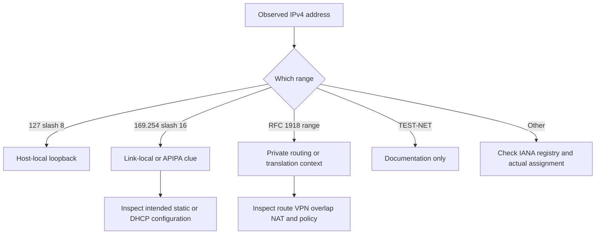

## 6. Gateways and on-link decisions

When sending to an IPv4 destination, a host checks routes. If the destination is considered on-link, the host resolves the neighbor's link-layer address, commonly with Address Resolution Protocol (ARP) on Ethernet-like IPv4 networks. If the destination is remote, it sends the frame to a next-hop router while keeping the IP destination set to the remote address.

The default gateway is not inserted as the destination IP of every Internet packet. It is the next local delivery target for packets whose selected route names that gateway. This distinction explains why packet captures show a remote destination IP inside a frame addressed to the local router's MAC address.

| Field | Local remote-service example | Meaning |
|---|---|---|
| Destination DNS name | `api.example.com` | Application intent |
| Destination IP | Resolved public service address | End IP target for this attempt |
| Selected route | `0.0.0.0/0` via local gateway | Catch-all route chosen after no more-specific match |
| Next hop | Local router address | Neighbor that receives the local frame |
| Frame destination | Gateway's link-layer address | Local-link delivery identity |
| HTTP authority/TLS name | `api.example.com` | Protected/application service identity |

## 7. Route tables and longest-prefix match

A route normally contains a destination prefix, next hop or on-link designation, outgoing interface, and preference/metric. The key general rule is **longest-prefix match**: among routes eligible for the destination, the most specific prefix wins. A `/32` IPv4 host route is more specific than `/24`, which is more specific than `/16`, which is more specific than the default `/0`.

Only after specificity and policy/route eligibility are considered does a metric commonly decide among comparable routes. Operating systems and routers differ in administrative preference, policy routing, equal-cost multipath, source selection, interface metric calculation, and route origin. Do not reduce every route decision to “lowest metric wins.”

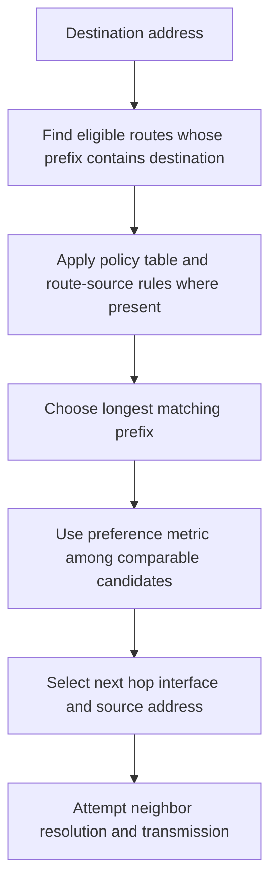

### Worked route-selection example

| Route | Next hop | Metric | Destination `203.0.113.42` matches? | Selection reasoning |
|---|---|---:|---:|---|
| `0.0.0.0/0` | `10.0.0.1` | 10 | Yes | Candidate default |
| `203.0.113.0/24` | `10.0.0.2` | 50 | Yes | More specific than default |
| `203.0.113.42/32` | VPN | 200 | Yes | Most specific, wins despite larger shown metric under simple model |
| `198.51.100.0/24` | `10.0.0.3` | 1 | No | Not eligible |

If policy routing excludes the `/32`, or its interface is unusable, behavior may differ. The correct support evidence is the operating system's route lookup for the actual destination and source context, not a hand-picked table row alone.

## 🔍 Plain-English deep-dive: Longest prefix chooses detail before preference

Imagine directions written at three levels: “all mail goes to the central depot,” “mail for District 7 goes to Depot B,” and “mail for Building 42 goes to the secure desk.” A letter for Building 42 follows the most detailed matching instruction even if the central depot route is generally preferred. Metric usually compares equally detailed viable instructions, not unrelated levels of specificity.

The analogy stops because real route selection can include policy tables, source addresses, route protocols, equal-cost paths, tunnels, and implementation-specific preferences.

## 8. Routing symptoms in SaaS support

| Symptom | Routing-related hypotheses | Evidence | Important alternative |
|---|---|---|---|
| Works off VPN, fails on VPN | More-specific VPN route, split-DNS, proxy/policy, overlap | Route lookup before/after, selected source/interface, DNS view | Service or identity changed simultaneously |
| One subnet fails | Missing return route, ACL, NAT pool, local overlap | Client and server-edge UTC/five-tuple evidence | Endpoint policy/image difference |
| IPv4 works, IPv6 times out | Broken IPv6 path/return/policy/PMTUD | Family-forced read-only tests, route lookup, timing | Client library/address selection issue |
| Service sees unexpected source | NAT, proxy, egress gateway, load balancer | Original local source plus observed egress identity | Log belongs to another retry/node |
| Intermittent destination IP | DNS/CDN/load balancing | Answer set, chosen address, route, request ID | Cached stale address or family race |
| `No route to host` | Local route/neighbor error or ICMP-derived path condition | Exact OS error, route lookup, capture | Wording varies and may represent policy reject |
| Reply arrives on different interface | Asymmetric path/policy routing | Captures/flow logs at authorized boundaries | Capture visibility or offload artifact |

## 9. Asymmetric paths

An **asymmetric path** means forward and return traffic follow different network paths. Asymmetry is common and not automatically wrong. Internet routing, cloud load balancing, multiple carriers, VPNs, and policy can make it normal. It becomes relevant when a stateful firewall/NAT sees only one direction, reverse-path checks reject traffic, monitoring observes only half the conversation, latency differs, or troubleshooting assumes identical hops.

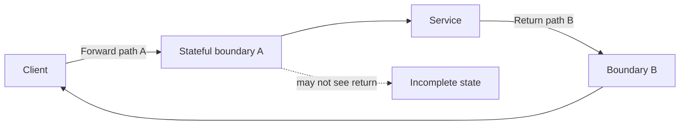

| Observation | What it supports | What it does not prove | Next evidence |
|---|---|---|---|
| Client sends SYN; server sees it | Forward path reached server | Server reply reached client | Server reply capture and next-hop logs |
| Server sends SYN-ACK; client does not see it | Return-path loss after server point | Exact dropping device | Authorized intermediate/edge evidence |
| Different traceroute hops by direction | Path asymmetry is plausible | Application failure cause | Protocol-specific timing and state evidence |
| Stateful device logs out-of-state drop | Device rejected observed flow state | Why topology became asymmetric | Route/policy change timeline |
| One capture sees only one direction | Visibility may be incomplete | Real one-way traffic | Capture point/interface/offload validation |

## 10. NAT, PAT, SNAT, and DNAT

**Network Address Translation (NAT)** changes address information between network realms. **Source NAT (SNAT)** changes a packet's source address, commonly when private clients reach a public service. **Destination NAT (DNAT)** changes the destination, commonly to direct traffic from a published address to an internal service. **Port Address Translation (PAT)**, also called Network Address and Port Translation (NAPT), lets many flows share an address by translating transport ports as well.

Terminology varies among platforms. Some products use “NAT” broadly for all translation and “PAT” for port multiplexing. Always describe the observed before/after tuple and direction rather than relying only on a label.

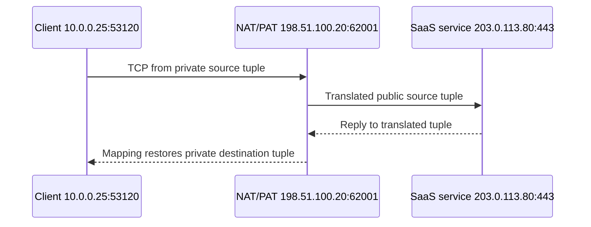

| Translation | Before | After | Common use | Support clue |
|---|---|---|---|---|
| SNAT | `10.0.0.25:53120 -> service:443` | `198.51.100.20:53120 -> service:443` | Public egress identity | SaaS logs public source, not private client |
| PAT/NAPT | Many private source tuples | One/few public IPs with translated ports | Shared Internet egress | Need timestamp plus full tuple to correlate |
| DNAT | Client targets published address | Destination rewritten to backend | Service publishing | Backend sees proxy/NAT path |
| Twice NAT | Source and destination translated | Both sides rewritten | Overlap/integration boundaries | Original and translated tuples both needed |
| No translation | End-to-end addresses retained | Same IP endpoints | Routed public/private environment | Firewall/proxy can still exist |

### NAT is not security

Translation can make unsolicited inbound reachability less obvious in some designs, but that is not a sufficient security claim. Filtering comes from firewall rules, state tracking, access control, service listeners, identity, and application authorization. IPv6 does not require NAT to be secure; explicit host/network policy remains necessary for both families.

## 🔍 Plain-English deep-dive: NAT rewrites an address label; a firewall makes a policy decision

Think of an office mailroom replacing many employee return addresses with one corporate return address and keeping a temporary ledger. That resembles source translation and port mappings. A security desk that decides which packages may enter resembles filtering. A mailroom can perform both jobs, but rewriting and permission are conceptually different.

The analogy stops because NAT mappings operate on protocol tuples with timeouts and checksums, while firewalls can inspect state, direction, identity, application metadata, and policy.

| Statement | Verdict | Better wording |
|---|---|---|
| “NAT secures the network.” | Incorrectly broad | “The boundary translates addresses; separately verify stateful filtering and policy.” |
| “Private IPs are encrypted.” | False | “Private addressing says nothing about encryption.” |
| “IPv6 is insecure because it does not need NAT.” | False | “IPv6 requires deliberate firewall and endpoint policy, as IPv4 does.” |
| “The SaaS allowlist should use the laptop's private IP.” | Usually wrong for public egress | “Identify documented, stable public egress identity and ownership.” |
| “One public IP equals one user.” | False under shared egress | “Correlate UTC, translated tuple, principal, and request ID.” |

## 11. IPv6 notation

IPv6 addresses are 128 bits, normally written as eight groups of four hexadecimal digits separated by colons. Hexadecimal uses digits `0`–`9` and letters `a`–`f`; one hex digit represents four bits.

Leading zeros in a group may be omitted. One longest run of consecutive all-zero groups may be compressed once with `::`. The address must expand to exactly eight groups.

Example:

`2001:0db8:0000:0000:0000:0000:0000:0025`

can become:

`2001:db8::25`

Do not use `::` twice because expansion would be ambiguous. Text comparison should use canonicalization rules or an address parser rather than ad hoc string matching.

| IPv6 notation | Meaning/canonical direction | Caution |
|---|---|---|
| `2001:db8::25` | Documentation-prefix example address | `2001:db8::/32` is not a live lab target |
| `::1/128` | Loopback | Host-local only |
| `::/128` | Unspecified address | Not an ordinary destination |
| `fe80::/10` | Link-local unicast | Interface/zone ID often needed in commands |
| `2000::/3` | Global unicast allocation space | Check IANA/RIR assignment and route, not just prefix family |
| `fc00::/7` | Unique local address space; locally assigned commonly uses `fd` | Not globally routed by design; not equivalent to encryption |
| `ff00::/8` | Multicast | IPv6 has no broadcast |
| `2001:db8::/32` | Documentation | Use in diagrams only |

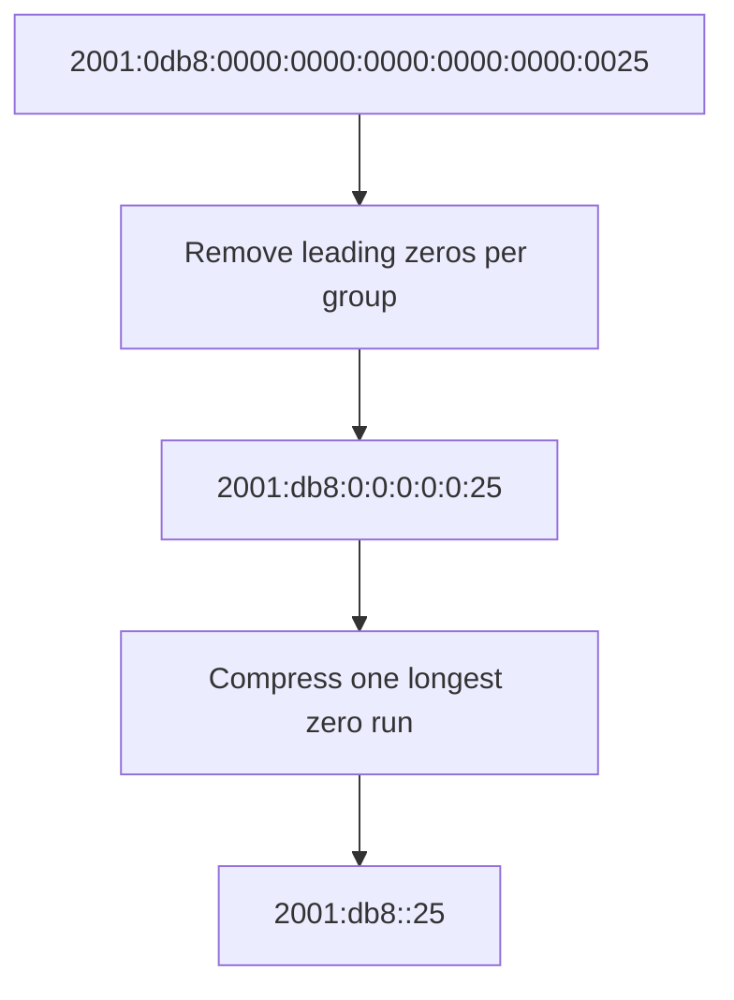

## 12. IPv6 prefixes and subnet reasoning

IPv6 commonly uses a `/64` on LANs because IPv6 Neighbor Discovery and Stateless Address Autoconfiguration assumptions are built around that size in normal deployments. This does not mean all IPv6 routes are `/64`; providers and organizations receive aggregates, point-to-point and loopback routes may use other lengths, and platform guidance matters.

IPv6 does not use broadcast. Neighbor Discovery Protocol (NDP) functions use Internet Control Message Protocol version 6 (ICMPv6), including Neighbor Solicitation/Advertisement and Router Solicitation/Advertisement. Blocking ICMPv6 indiscriminately can break essential IPv6 operation and Path MTU Discovery.

### IPv6 configuration at a high level

| Mechanism | What it supplies | Important boundary |
|---|---|---|
| Link-local address | Local-link IPv6 communication | Does not provide global Internet reachability |
| Router Advertisement (RA) | Router/prefix/default-router and flags | Core to IPv6 on-link/default-router discovery |
| Stateless Address Autoconfiguration (SLAAC) | Host forms address from advertised prefix | Privacy/stable address behavior varies by OS |
| DHCPv6 | Stateful addresses and/or other configuration such as DNS, depending mode | Default gateway is learned through RA, not generally DHCPv6 |
| NDP | Neighbor/router discovery and reachability | Uses ICMPv6; not ARP |
| DNS AAAA | Maps name to IPv6 address | An answer does not prove path quality |

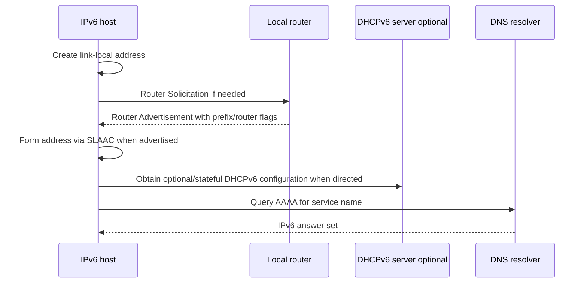

## 🔍 Plain-English deep-dive: IPv6 is not “IPv4 with longer addresses”

IPv6 expands the address space, removes broadcast, makes ICMPv6 central to neighbor and path functions, supports multiple addresses per interface as a normal condition, and uses router advertisements for default-router discovery. Its operational model differs enough that blindly translating IPv4 habits creates failures.

Think of moving from a small building directory to a city with many address types and public transit signals. More digits are only one change; the way neighbors, routes, and announcements work also changes. The analogy stops because IPv6 behavior is defined by protocols, prefixes, interface scope, and operating-system source/destination selection.

## 13. IPv4/IPv6 dual stack and Happy Eyeballs

A dual-stack client may receive A (IPv4) and AAAA (IPv6) records. It needs address-selection and connection-attempt behavior that provides good user experience if one family is slow or broken. The Happy Eyeballs standards family describes racing/staggering connection attempts and using responsive paths while avoiding excessive load. Implementations, delay values, caching, protocol versions, and application behavior vary.

Do not say “the browser always tries IPv6 first and falls back after exactly N milliseconds.” Record the actual client/version and evidence. A successful user experience can hide a broken family because the other family wins quickly. Conversely, a connector without comparable fallback may time out.

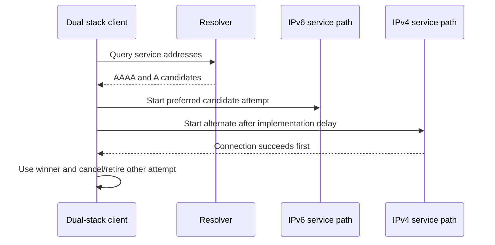

| Observation | Possible meaning | Test discipline |
|---|---|---|
| Browser works; IPv6 forced test fails | Browser may recover over IPv4 | Confirm selected family in browser/capture before claiming |
| CLI works; service fails | Libraries/fallback/proxy differ | Match runtime, DNS, proxy, trust, and protocol context |
| First request slow, later fast | Family race, DNS/cache, TLS/session, connection reuse | Correlate attempts; do not pick one cause prematurely |
| AAAA exists but no IPv6 default route | Misconfigured resolver/service or client behavior | Inspect route/address and actual attempt |
| IPv6 connects but TLS fails | Connectivity works; identity/trust differs at reached endpoint | Compare certificate/SNI and edge |

## 14. Worked example: API works only when IPv4 is forced

**Scenario:** `COLLECTOR-072` resolves `api.example.com` to both families. Normal attempts take 20 seconds and fail; a read-only equivalent forced over IPv4 receives HTTP 200. A forced IPv6 attempt stalls before TLS.

| Hypothesis | Prediction | Evidence | Result | Conclusion restraint |
|---|---|---|---|---|
| Bad API credential | Both families reach HTTP and reject | HTTP statuses both paths | IPv6 never reaches TLS; IPv4 200 | Credential hypothesis reduced |
| IPv6 route/path problem | IPv6 transport fails while IPv4 succeeds | Family-specific route and TCP timing | Observed | Boundary narrowed, exact drop unknown |
| DNS returns wrong IPv6 edge | AAAA maps to unintended service | Official DNS/edge evidence and TLS if reachable | Not yet known | Needs service/DNS owner evidence |
| Client lacks fallback | Normal client waits/fails despite IPv4 viability | Client timeline/config/version | Plausible | Do not change without product guidance |
| Proxy treats families differently | Effective path differs | Proxy config/logs and destination evidence | Unknown | Retain hypothesis |

The support package should state: same host, same UTC window, same harmless operation, A/AAAA answers, selected family, route lookups, IPv6 transport timeout, IPv4 HTTP success, client fallback behavior, and request ID. It should not recommend disabling IPv6 globally. The owner should investigate IPv6 route/policy/service reachability or the application's documented fallback behavior.

## 15. Worked example: SaaS allowlist sees the wrong address

A customer provides `10.25.4.8` as the collector IP to a public SaaS allowlist, but the service sees `198.51.100.44` in synthetic logs. The private address is translated at the enterprise egress. The allowlist must use the stable, documented public egress identity controlled by the customer, subject to vendor documentation and change process.

Support must ask:

1. Which component performs egress translation or proxying?
2. Is the observed public address stable, pooled, regional, or changed by failover?
3. Does the SaaS product support IP allowlisting, and at what boundary?
4. Are IPv4 and IPv6 egress identities both relevant?
5. Does a proxy create the connection on the client's behalf?
6. Can UTC, translated tuple, principal, and request ID correlate the attempt?

Do not ask for a broad production NAT table in a normal ticket. Request the minimum matching mapping from the authorized network owner, protected appropriately.

## 16. Troubleshooting decision tree

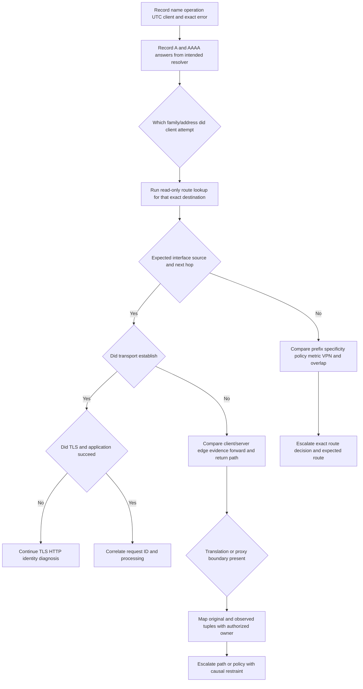

### Failure modes and unsafe shortcuts

| Failure/shortcut | Why wrong or risky | Better action | Escalate when |
|---|---|---|---|
| Treating first octet as classful mask | Modern CIDR is explicit | Use actual prefix |
| Using $2^h-2$ for every prefix/platform | `/31`, `/32`, and cloud reservations differ | Calculate block, apply current platform rules |
| Calling every `172.x` address private | Only `172.16/12` is RFC 1918 private | Check exact prefix |
| Assuming private means secure | Address scope is not encryption/filtering | Verify TLS, firewall, identity, application policy |
| Calling NAT a firewall | Translation and filtering are different functions | Document each control separately |
| Disabling IPv6 because IPv4 works | Hides path issue and can break supported behavior | Gather family-specific evidence; fix owner boundary |
| Assuming lowest metric always wins | Prefix specificity/policy/eligibility precede simple metric | Use actual route lookup |
| Assuming traceroute shows both directions | It samples one direction with protocol/response caveats | Correlate endpoint/edge evidence |
| Publishing internal routes/NAT mappings | Exposes topology and client data | Minimize and protect artifacts |
| Changing routes during collection | Destroys baseline and risks outage | Read first; approved change/rollback only |
| Treating IP as user identity | Shared/dynamic/proxied addresses break assumption | Correlate principal, device, UTC, tuple, request ID |
| Blocking all ICMPv6 | Breaks essential IPv6 functions/PMTUD | Follow standards and approved policy |

## 17. Escalation package

| Field | Required evidence | Boundary |
|---|---|---|
| Impact | Operation, users/connectors, start, frequency, workaround | No unnecessary content |
| Client | OS/runtime/interface/VPN/proxy context | Redact names where possible |
| Name resolution | Query name/type/resolver/view/A/AAAA/TTL/UTC | Do not expose internal zones publicly |
| Family selection | Actual attempted address/family/order/timing | Implementation-specific |
| Address state | Relevant local addresses/prefixes/lifetimes/scope | Minimize unrelated interfaces |
| Route | Actual lookup, selected prefix/source/interface/next hop/metric/policy table | Read-only output; protect topology |
| Transport | Five-tuple/state/timing at authorized points | No broad capture |
| Translation | Original and translated tuple for matching UTC | Request only from authorized owner |
| Return path | Server/edge reply evidence and destination | Avoid assuming symmetry |
| Application | TLS/HTTP/SMTP checkpoint and request/message ID | Remove tokens/cookies/body |
| Ask | Exact route/NAT/policy/service decision requested | No unauthorized fix prescription |

## Safe local/public lab: The Dual-Stack Route Ledger 072

### Prerequisites

- The learner's own Windows and/or Linux workstation and authorization to read its network configuration.
- PowerShell on Windows; a standard shell with `ip` on Linux. If a command is absent, use the paper path rather than install software.
- Optional `Resolve-DnsName`, `nslookup`, `dig`, `resolvectl`, `curl`, `tracert`, or `tracepath`; only read-only queries to `example.com` are permitted.
- No administrator rights required for the core lab.
- No route, address, DHCP, VPN, proxy, DNS, firewall, NAT, or interface changes.
- Use IANA documentation addresses for calculations: `192.0.2.0/24`, `198.51.100.0/24`, `203.0.113.0/24`, and `2001:db8::/32`. Never send probes to those reserved ranges.
- Artifact label: **local/public lab - read-only own-device route metadata plus documentation-range calculations**.

### Lab procedure

1. Record start UTC, OS, active connection type, and explicit read-only/no-change statement.
2. Create a paper subnet worksheet for `192.0.2.77/27`, `198.51.100.130/26`, `203.0.113.14/28`, and `10.20.30.40/24`. Show binary mask, block size, network, conventional host range, broadcast, and caveat.
3. Expand and compress `2001:0db8:0000:0000:0000:0000:0000:0025`. Label its documentation prefix and do not query/probe it.
4. Record only relevant local address/interface data.

   **Windows:**

   ```powershell
   Get-NetIPConfiguration
   Get-NetIPAddress | Sort-Object InterfaceIndex, AddressFamily
   ```

   **Linux:**

   ```bash
   ip address show
   ```

5. Identify loopback, IPv4 private/public/link-local where present, IPv6 link-local/global/unique-local where present, and prefix lengths. Redact public addresses and interface descriptions in any shared artifact.
6. Read route state.

   **Windows:**

   ```powershell
   Get-NetRoute -AddressFamily IPv4 | Sort-Object DestinationPrefix, RouteMetric
   Get-NetRoute -AddressFamily IPv6 | Sort-Object DestinationPrefix, RouteMetric
   ```

   **Linux:**

   ```bash
   ip -4 route show
   ip -6 route show
   ```

7. On Linux, use `ip route get` only for an address actually returned by the authorized public query in the next step. On Windows, use `Find-NetRoute -RemoteIPAddress <returned-address>` if available, or inspect matching routes without changing them.
8. Query `example.com` using the normal configured resolver and record A/AAAA response, resolver, TTL if shown, and UTC.

   **Windows:**

   ```powershell
   Resolve-DnsName example.com -Type A
   Resolve-DnsName example.com -Type AAAA
   ```

   **Linux:**

   ```bash
   resolvectl query example.com
   ```

   If `resolvectl` is unavailable, use `dig A example.com` and `dig AAAA example.com`.
9. For one returned address per available family, record the operating system's selected route, source address category, interface, and next hop. Do not expose exact public/local addresses in a portfolio artifact; substitute `CLIENT-V4-072`, `CLIENT-V6-072`, and `GATEWAY-072`.
10. Optionally request the public documentation page with strict time limits and no credentials:

   ```bash
   curl --max-time 10 --head https://example.com/
   ```

   On Windows use `curl.exe`. If supported, compare `--ipv4` and `--ipv6` as read-only tests. A failure is valid evidence; do not alter IPv6, firewall, or proxy settings.
11. Build a route ledger with destination name, DNS family/address alias, matching route prefix, interface alias, next-hop alias, outcome, UTC, and limitation.
12. Add a synthetic NAT mapping: `10.20.30.40:53072 -> 198.51.100.44:62072 -> 203.0.113.80:443`. Label every address documentation/private and explain SNAT/PAT without sending traffic.
13. Draft a customer-safe summary for “IPv4 succeeds; IPv6 transport fails” that recommends evidence/ownership, not disabling IPv6.
14. Record end UTC and perform cleanup.

### Expected evidence

- Four complete IPv4 subnet calculations with binary reasoning.
- One correctly compressed/expanded IPv6 documentation address.
- Relevant local interface/address inventory with sensitive values redacted.
- IPv4 and IPv6 route-table observations, including defaults where present.
- A/AAAA answer record for `example.com` from the configured resolver.
- Actual route lookup for at least one returned address.
- Optional bounded HEAD comparison over IPv4/IPv6 with exact outcome.
- Route ledger connecting name, family, address alias, route, interface, next hop, and result.
- Synthetic original/translated tuple explaining SNAT and PAT.
- Explicit statement: NAT is translation, not security.
- One 90-second spoken explanation of longest-prefix match and one 90-second dual-stack troubleshooting answer.

### Cleanup and privacy

- No service or capture should be running; this lab starts none.
- Close terminals containing full local/public addresses when finished.
- Redact public IPs, private prefixes, interface names, VPN names, gateways, DNS suffixes, and route topology from shared artifacts unless harmless and necessary.
- Delete raw command output after transferring only minimized observations to the lab worksheet.
- Do not upload route tables, interface inventories, VPN details, or public egress addresses to public services.
- Confirm that no route, metric, adapter, VPN, DNS, DHCP, proxy, NAT, firewall, IPv4, or IPv6 setting changed.
- Record: `Dual-Stack Route Ledger 072 completed read-only; no reserved-range probe, third-party scan, credential, customer data, or network change occurred.`

### Validation rubric

| Dimension | Fail | Developing | Pass |
|---|---|---|---|
| IPv4 math | Guesses ranges | Gets block size | Shows binary/prefix, network, host, broadcast, caveats |
| Special ranges | Calls all 172 private | Knows RFC 1918 | Correct private/link-local/loopback/documentation distinctions |
| Routing | Chooses lowest metric only | Knows default route | Applies eligibility, longest prefix, then preference/metric caveat |
| NAT | Calls NAT security | Names translation | Maps before/after tuple and separates firewall policy |
| IPv6 | Treats as longer IPv4 | Compresses notation | Explains scope, NDP, RA, SLAAC, DHCPv6, no broadcast |
| Dual stack | Recommends disabling IPv6 | Runs family tests | Correlates actual selection/fallback and routes safely |
| Privacy | Shares raw topology | Redacts some values | Keeps only aliases/minimum evidence and deletes raw output |
| Honesty | Claims router ownership | Says working familiarity | States support evidence role and owner boundary precisely |

## Official Source Anchors - August 24, 2026

| Official or primary source | Topic anchored | Boundary |
|---|---|---|
| [IANA IPv4 Special-Purpose Address Space](https://www.iana.org/assignments/iana-ipv4-special-registry/iana-ipv4-special-registry.xhtml) | Current IPv4 special-purpose registry | Check registry flags; do not rely on memory alone |
| [IANA IPv6 Special-Purpose Address Space](https://www.iana.org/assignments/iana-ipv6-special-registry/iana-ipv6-special-registry.xhtml) | Current IPv6 special-purpose registry | Allocation and routing properties differ |
| [RFC 4632 - CIDR Address Strategy](https://www.rfc-editor.org/rfc/rfc4632.html) | CIDR prefixes and aggregation foundation | Operational policy adds complexity |
| [RFC 1918 - Address Allocation for Private Internets](https://www.rfc-editor.org/rfc/rfc1918.html) | IPv4 private-use ranges | Private does not mean secure/encrypted |
| [RFC 3927 - IPv4 Link-Local Addresses](https://www.rfc-editor.org/rfc/rfc3927.html) | `169.254/16` behavior | APIPA is Windows terminology/context |
| [RFC 5737 - IPv4 Address Blocks for Documentation](https://www.rfc-editor.org/rfc/rfc5737.html) | TEST-NET ranges | Documentation only, not live targets |
| [RFC 3021 - Using 31-Bit Prefixes on IPv4 Point-to-Point Links](https://www.rfc-editor.org/rfc/rfc3021.html) | `/31` exception to common host-count rule | Deployment must support/use it intentionally |
| [RFC 8200 - IPv6 Specification](https://www.rfc-editor.org/rfc/rfc8200.html) | IPv6 base packet and addressing context | Neighbor/configuration behavior is in related RFCs |
| [RFC 4291 - IPv6 Addressing Architecture](https://www.rfc-editor.org/rfc/rfc4291.html) | IPv6 address types and representation | Check updates in RFC Editor metadata |
| [RFC 5952 - IPv6 Text Representation](https://www.rfc-editor.org/rfc/rfc5952.html) | Canonical IPv6 text recommendations | Use parsers for comparison |
| [RFC 4861 - Neighbor Discovery for IPv6](https://www.rfc-editor.org/rfc/rfc4861.html) | NDP, router/neighbor discovery | Updated by later RFCs; ICMPv6 policy matters |
| [RFC 4862 - IPv6 Stateless Address Autoconfiguration](https://www.rfc-editor.org/rfc/rfc4862.html) | SLAAC | OS privacy/stable address implementation varies |
| [RFC 8415 - DHCP for IPv6](https://www.rfc-editor.org/rfc/rfc8415.html) | DHCPv6 | RA/default-router relationship remains important |
| [RFC 4193 - Unique Local IPv6 Unicast Addresses](https://www.rfc-editor.org/rfc/rfc4193.html) | IPv6 ULA | Local scope is not a security guarantee |
| [RFC 8305 - Happy Eyeballs Version 2](https://www.rfc-editor.org/rfc/rfc8305.html) | Dual-stack connection-racing strategy | Verify current updates and client implementation |
| [Microsoft Learn - TCP/IP addressing and subnetting](https://learn.microsoft.com/en-us/troubleshoot/windows-client/networking/tcpip-addressing-and-subnetting) | Windows IPv4 subnetting concepts | Platform/cloud reservations can differ |
| [Microsoft Learn - Get-NetIPAddress](https://learn.microsoft.com/en-us/powershell/module/nettcpip/get-netipaddress) | Windows address inspection | Output can expose topology; minimize |
| [Microsoft Learn - Get-NetRoute](https://learn.microsoft.com/en-us/powershell/module/nettcpip/get-netroute) | Windows route inspection | Read state; do not modify in this lab |
| [Linux ip-route manual](https://man7.org/linux/man-pages/man8/ip-route.8.html) | Linux route display/lookup semantics | Distribution/iproute2 version may vary |

### Source-use discipline

- Use the IANA registries for special-purpose classification and the RFC Editor for update/obsolescence status.
- Treat route output as one host's decision at one time, not proof of every path hop.
- Record actual family, address, source, interface, next hop, UTC, and application outcome.
- Never disable IPv6, certificate validation, firewall policy, or VPN policy merely to make a test pass.
- Never describe NAT, private addressing, or IPv6 address scope as encryption or authorization.
- Verify vendor egress/allowlist requirements in current approved documentation.

## Likely Interview Questions

### Q1. How do you calculate the subnet for `192.0.2.77/27`?

**Model answer:** `/27` leaves five host bits, so each block has 32 addresses and boundaries occur at 0, 32, 64, 96, and so on in the last octet. Seventy-seven lies in 64–95. The network is `192.0.2.64`, conventional hosts are `.65`–`.94`, and directed broadcast is `.95`. It is a documentation range, so I use it only in examples.

### Q2. What is longest-prefix matching?

**Model answer:** The host/router finds eligible routes containing the destination and generally chooses the one with the greatest prefix length, because it is most specific. Preference or metric commonly breaks ties among comparable routes after policy and eligibility. I use the operating system's actual lookup because policy tables, source selection, tunnels, and unusable interfaces can affect the result.

### Q3. What is the difference between a destination address and a gateway?

**Model answer:** The destination IP identifies the remote IP endpoint for the packet. The gateway is a local next-hop router selected by the route. On an Ethernet link, the frame may be addressed to the gateway's MAC while the enclosed IP packet still carries the remote destination IP.

### Q4. How do SNAT, DNAT, and PAT differ, and is NAT security?

**Model answer:** SNAT rewrites the source, DNAT rewrites the destination, and PAT/NAPT also translates ports so many flows can share addresses. Terminology varies, so I record before/after tuples. NAT is not security by itself; filtering and authorization come from firewall, endpoint, identity, and application policies.

### Q5. What IPv4 ranges should a support engineer recognize?

**Model answer:** Key ranges include RFC 1918 private `10/8`, `172.16/12`, and `192.168/16`; loopback `127/8`; link-local `169.254/16`, often an APIPA clue on Windows; and documentation `192.0.2/24`, `198.51.100/24`, and `203.0.113/24`. I check the current IANA registry for exact properties.

### Q6. How do SLAAC, DHCPv6, NDP, and router advertisements relate?

**Model answer:** NDP uses ICMPv6 for neighbor and router discovery. Routers advertise prefixes, default-router information, and configuration flags through Router Advertisements. SLAAC can form addresses from advertised prefixes; DHCPv6 can provide stateful addresses and/or other configuration depending on mode. The IPv6 default gateway is learned through RA rather than generally from DHCPv6.

### Q7. An API works over IPv4 but not IPv6. What do you do?

**Model answer:** I record A/AAAA answers, actual family selection, family-specific route lookup, source/interface, transport/TLS/application checkpoints, timing, and the client's fallback behavior. I compare equivalent safe attempts and correlate service evidence. I do not disable IPv6 globally; I escalate the demonstrated path, policy, endpoint, or client-fallback boundary.

### Q8. How would you position your routing experience honestly?

**Model answer:** I have working familiarity with subnet calculations, endpoint route tables, dual-stack behavior, NAT concepts, and read-only Windows/Linux tools. My production strength is Microsoft enterprise support and evidence-led escalation. I can isolate and communicate the boundary, but I do not claim production router design or ownership and would partner with the authorized network team for changes.

## Memory Hooks

- **IPv4 is 32 bits; IPv6 is 128.**
- **Slash length counts fixed left-hand bits.**
- **Block first, then network, hosts, broadcast, and platform exceptions.**
- **Only `172.16/12` is RFC 1918, not all `172`.**
- **`169.254/16` is link-local; APIPA is a Windows clue.**
- **Longest prefix before simple metric.**
- **Gateway is next hop; destination remains the remote IP.**
- **Asymmetry can be normal until state/policy makes it harmful.**
- **SNAT changes source; DNAT changes destination; PAT changes ports too.**
- **NAT translates; a firewall filters.**
- **IPv6 has link-local, no broadcast, and essential ICMPv6/NDP.**
- **RA supplies default-router information; DHCPv6 is not DHCPv4 copied.**
- **Dual stack means measure the family actually attempted.**
- **Never “fix” evidence by disabling IPv6 or security validation.**

## Completion Checklist

- [ ] I can convert IPv4 octets between binary and decimal.
- [ ] I can calculate block size, network, conventional host range, and broadcast for common prefixes.
- [ ] I can explain `/31`, `/32`, and cloud-reservation exceptions to $2^h-2$.
- [ ] I can identify private, loopback, link-local/APIPA, documentation, multicast, unspecified, and broadcast IPv4 contexts.
- [ ] I can explain interface, next hop, gateway, default route, prefix, and metric.
- [ ] I apply longest-prefix matching before simple metric reasoning and state policy/eligibility caveats.
- [ ] I can explain asymmetric paths without assuming they are failures.
- [ ] I can map original and translated tuples for SNAT, DNAT, and PAT.
- [ ] I can state clearly that NAT/private addressing is not security or encryption.
- [ ] I can expand/compress IPv6 and identify loopback, unspecified, link-local, global, ULA, multicast, and documentation space.
- [ ] I can explain NDP, RA, SLAAC, and DHCPv6 at a high level.
- [ ] I can explain dual-stack/Happy Eyeballs behavior without claiming fixed implementation timing.
- [ ] I completed or can explain **The Dual-Stack Route Ledger 072**.
- [ ] I made no route, adapter, DNS, DHCP, proxy, firewall, VPN, NAT, IPv4, or IPv6 change.
- [ ] I removed or redacted topology-sensitive raw output.
- [ ] I can answer exactly Q1–Q8 aloud with honest ownership boundaries.
- [ ] I checked Official Source Anchors dated August 24, 2026.

[Next: Part 073 - DNS and DHCP Troubleshooting](Part-073-dns-and-dhcp-troubleshooting.md)