# Part 073 - DNS and DHCP Troubleshooting

> **Purpose:** Diagnose how endpoints learn network configuration and how service names become addresses, while preserving resolver/view/cache context.
>
> **Artifact label:** Learned architecture plus local/public read-only lab. No DNS zone, DHCP lease, hosts file, cache, adapter, or security setting is changed.
>
> **Currency and source access date:** August 24, 2026.

## Section goal

By the end of this Part, you should be able to explain the Domain Name System (DNS) path from a local stub resolver through recursive resolution, delegation, root and top-level-domain servers, and authoritative answers. You should be able to distinguish positive and negative caching, read the common A, AAAA, CNAME, MX, TXT, PTR, and SRV record types, and interpret NXDOMAIN, no-data, SERVFAIL, REFUSED, timeout, truncation, DNS Security Extensions (DNSSEC), and Extension Mechanisms for DNS (EDNS) evidence without overclaiming cause.

You should also be able to explain Dynamic Host Configuration Protocol (DHCP) address acquisition through Discover, Offer, Request, and Acknowledgment (DORA), lease renewal and rebinding, relevant options such as gateway/router, DNS server, and domain/search configuration, and why an IPv4 link-local/APIPA address is a clue rather than a root cause.

The support objective is to connect configuration and naming to SaaS/API/email symptoms. A client might use a hosts entry, search suffix, split-DNS view, browser encrypted DNS path, local cache, enterprise recursive resolver, or application-specific resolver. A successful public `dig` query from another device does not prove the failing process received the same answer. Likewise, a DHCP lease can provide an address while supplying an incorrect DNS server or gateway.

## JD Mapping

| Supplied role signal | Capability developed | SaaS/API/email example | Proof artifact |
|---|---|---|---|
| Complex investigations | Separates local configuration, resolver, recursion, delegation, and authority | Connector reports “host not found” | Resolver-path evidence ledger |
| API support | Distinguishes name failure from transport/TLS/HTTP | API hostname NXDOMAIN only on VPN | Split-view comparison |
| Cloud Email Security | Interprets MX/TXT/PTR alongside A/AAAA and TTL | Mail route or authentication lookup differs | Record-type worksheet |
| SaaS Security | Identifies service-discovery and tenant endpoint naming dependencies | SRV/CNAME target unavailable | Dependency map |
| Windows/Linux tools | Uses `Resolve-DnsName`, `nslookup`, `dig`, `resolvectl`, and `ipconfig` carefully | Cross-OS evidence | Read-only command transcript |
| Customer trust | Explains exact response code and affected resolver/view | “DNS is down” correction | Customer-safe update |
| Engineering escalation | Supplies qname, qtype, resolver, flags, answer/authority, TTL, UTC | Reproducible escalation | DNS evidence packet |
| Privacy/security | Avoids exposing cache history, internal zones, tokens, and customer names | Minimized DNS/DHCP output | Redaction checklist |
| Continuous learning | Uses RFC/IANA/Microsoft/systemd/ISC/BIND docs | Standards-grounded interpretation | Dated source ledger |
| Honest candidate positioning | Demonstrates support-level diagnosis, not DNS/DHCP administration ownership | Interview answer | Honesty statement |

## Candidate honesty note

You can position DNS/DHCP and the listed tools as **working familiarity strengthened by repeatable labs**. Your production transfer is enterprise support: isolating local versus service boundaries, comparing affected and working users, correlating changes and timestamps, collecting minimum evidence, escalating with clear asks, and validating recovery. You should not claim to have administered production authoritative DNS, recursive resolver fleets, IP address management, DHCP failover, DNSSEC signing, or Abnormal AI DNS infrastructure.

| Evidence tier | Safe wording | Boundary |
|---|---|---|
| Production transfer | “I used evidence-led client/cloud isolation in enterprise support.” | Not DNS platform ownership |
| Working familiarity | “I can identify resolver/view/cache and interpret common records and response codes.” | Not authoritative-server administration |
| Local/public lab | “I compared read-only queries against my configured resolver and public authoritative path.” | Not customer DNS proof |
| Learned architecture | “I understand DORA, lease timing, delegation, EDNS, and DNSSEC at support depth.” | Implementation/config varies |
| Unknown | Abnormal endpoint records, TTLs, DNS providers, split views, and DHCP dependencies | Verify current approved documentation |

## 1. DNS and DHCP solve different problems

DNS maps names and other structured keys to typed resource records. DHCP supplies network configuration to a client for a limited lease. They interact because DHCP often tells a client which recursive DNS servers and domain/search information to use, but DHCP does not resolve names and DNS does not normally assign client addresses.

An analogy is hotel check-in. DHCP gives a guest a room number, checkout time, and directions to hotel services. DNS is the directory that maps “conference room” or “restaurant” to a location. The analogy stops because DNS is globally delegated and cached, while DHCP normally operates through local broadcast/relay scopes and leased configuration.

| Question | DNS role | DHCP role | Common support error |
|---|---|---|---|
| What address serves `api.example.com`? | Returns A/AAAA according to view/cache | May identify which resolver to ask | Calling this “DHCP resolution” |
| What IPv4 address should this client use? | Usually no role | Offers/leases address | Assuming DNS gives endpoint address configuration |
| What default gateway should the client use? | No ordinary host-config role | DHCP option can supply router | Blaming DNS for no route |
| What suffix should short names try? | Search behavior uses local config | DHCP can supply domain/search option | Querying a different fully qualified name unknowingly |
| How long may an answer be cached? | Record/negative TTL rules | No role | Flushing without understanding TTL/source |
| How long may a client use its address? | No role | Lease time, renewal, rebinding | Treating lease expiration as DNS TTL |

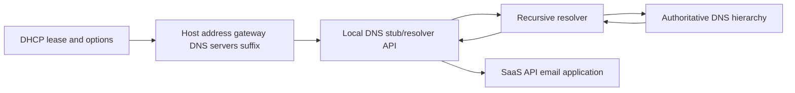

## 2. DNS names and the namespace

DNS names form a hierarchy read from the most specific label on the left toward the root on the right. In `api.support.example.com.`, `api` is below `support`, which is below `example`, which is below `com`, which is below the root. A trailing dot makes the absolute root explicit. A **fully qualified domain name (FQDN)** identifies the complete name in that hierarchy.

A **zone** is an administratively served portion of the namespace, not necessarily the same as a domain name or one server. **Delegation** places name-server records in a parent so responsibility continues at child authoritative servers. The parent may also supply glue address records when required to reach in-bailiwick child name servers.

| Term | Plain meaning | Why it matters | Caveat |
|---|---|---|---|
| Label | One component between dots | Search suffixes add labels | Case is normally insensitive in matching |
| Root | Top of DNS hierarchy, represented by trailing dot | Starting point for iterative resolution | Clients usually ask recursive resolvers, not roots directly |
| TLD | Top-level domain such as `com` | Refers resolver toward delegated child | TLD server is not authoritative for every child record |
| Domain | A node and descendants in namespace | Human/application naming | Not always equal to one zone |
| Zone | Administratively served DNS data | Identifies authority boundary | Can contain delegations to child zones |
| Delegation | Parent points to child name servers | Broken delegation causes broad failure | Cached records can mask changes |
| Authoritative server | Serves data for a zone | Source for authoritative answer/referral | It may be primary/secondary/anycast; do not infer topology |
| Recursive resolver | Finds/cache answers for clients | Main enterprise/client dependency | Policy and split views can alter answers |
| Stub resolver | Local API/component sending resolver queries | Application may not use the OS stub | Hosts/cache/search can precede network query |

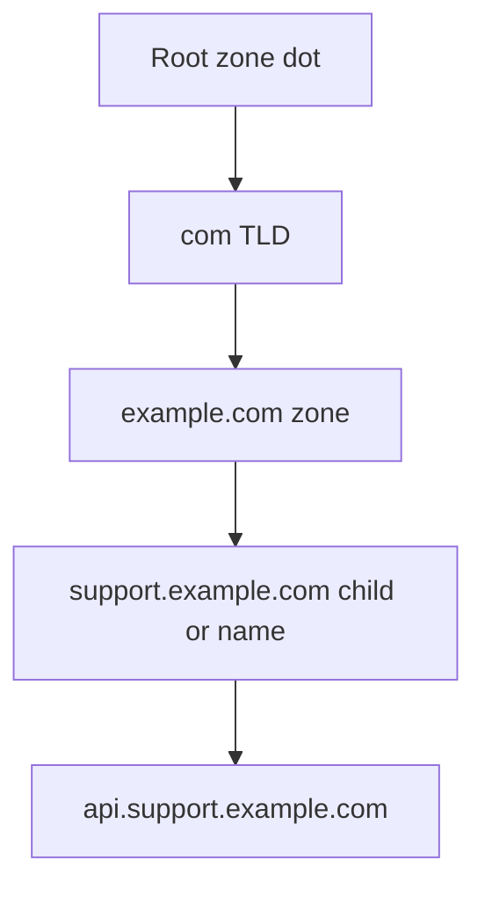

## 3. Stub, recursive, and authoritative roles

The local **stub resolver** usually accepts a name query from an application and sends it to a configured recursive resolver. The **recursive resolver** returns a final answer or error on the client's behalf, using cache or iterative queries. In an iterative process it asks a root server, follows a referral to a top-level-domain server, follows a delegation to the authoritative server, and obtains the answer.

Applications can bypass or supplement this path. Browsers may use DNS over HTTPS (DoH) according to enterprise/user policy; VPN software can install per-interface or suffix-based resolver rules; containers may use an internal DNS forwarder; Java or other runtimes can cache independently; a hosts file can return a local static mapping. Therefore “the machine resolves it” must name the process, API/tool, resolver, query, and time.

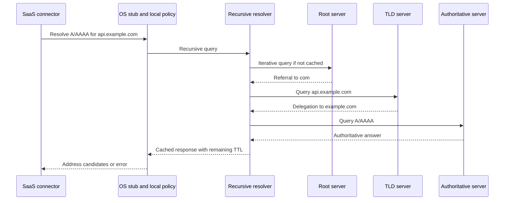

### Roles and evidence

| Component | Input | Output | Evidence to collect | Owner boundary |
|---|---|---|---|---|
| Application | URL/service name | Resolver call/result | Exact name, family/type, app error, UTC | App/runtime owner |
| Hosts/local policy | Name lookup | Static/local result | Relevant exact entry only | Endpoint owner |
| Stub/cache | Query | Cached/network response | Resolver API/tool and cache context | OS/endpoint owner |
| Recursive resolver | Recursive query | Answer/referral-derived error | Resolver IP/identity, response code, flags, TTL | DNS resolver owner |
| Root/TLD | Iterative query | Referral | `+trace`/authority evidence when authorized | Public DNS hierarchy |
| Authoritative server | Query for owned zone | Authoritative data/error | AA flag, answer/authority, SOA, serial when relevant | Zone owner/provider |
| DNS policy/security | Query/client identity | Filtered/synthesized/refused result | Policy event/category/request | Security/DNS owner |

## 🔍 Plain-English deep-dive: “DNS” is a chain of observers, not one box

When an application says “name not found,” the result could come from its own cache, a hosts file, the operating-system stub, a VPN-specific resolver, a recursive resolver's positive or negative cache, a filtering policy, a broken delegation, or the authoritative zone. Asking a different public resolver may demonstrate what that resolver sees, but it does not prove what the application used.

Think of asking for a telephone number. You might consult your contacts, an office directory, a public directory service, or the organization itself. Different directories can intentionally show different results. The analogy stops because DNS has typed records, delegation, TTL, response flags, transport rules, and cryptographic validation extensions.

The evidence formula is:

> process + exact query name + query type + resolver/view + UTC + response code + flags + answer/authority + TTL

## 4. Resource records

A DNS **resource record (RR)** has an owner name, type, class (usually Internet/IN), time to live (TTL), and type-specific data. A record's meaning depends on its type; a TXT string is not interchangeable with an A address.

| Type | Data/meaning | SaaS/API/email use | Important caution |
|---|---|---|---|
| A | IPv4 address | API or mail-host address candidate | Answer does not prove route/service health |
| AAAA | IPv6 address | Dual-stack service candidate | Broken IPv6 can be masked by fallback |
| CNAME | Canonical-name alias for an owner | SaaS custom hostname/edge alias | Alias owner generally cannot hold other ordinary data; follow chain carefully |
| MX | Mail exchanger plus preference | Inbound mail routing | Lowest preference value is tried first; target must resolve and should not be an alias under SMTP rules |
| TXT | Arbitrary text strings | SPF/DMARC/domain verification and vendor tokens | Multiple strings/records and quoting matter; TXT is not inherently trusted |
| PTR | Domain name associated with reverse lookup key | Reverse DNS/mail reputation clues | Forward/reverse agreement is policy evidence, not identity proof |
| SRV | Priority, weight, port, target for service discovery | Directory/voice/service location | Client must support/use SRV; priority and weight differ |
| NS | Authoritative name server for zone/delegation | Authority path | Parent delegation and child zone must agree operationally |
| SOA | Zone authority metadata including serial and negative-cache field context | Zone/change/negative response evidence | Fields have specific semantics; serial alone is not propagation proof |
| CAA | Which certificate authorities may issue for a domain | Certificate issuance policy | Does not validate an already presented certificate by itself |

### Record examples using reserved names/addresses

```text
api.example.com.        300 IN A     192.0.2.25
api.example.com.        300 IN AAAA  2001:db8::25
alias.example.com.      300 IN CNAME api.example.com.
example.com.            600 IN MX 10 mail.example.com.
example.com.            600 IN TXT   "v=spf1 -all"
_service._tcp.example.com. 300 IN SRV 10 20 443 target.example.com.
25.2.0.192.in-addr.arpa. 300 IN PTR   api.example.com.
```

These are teaching examples. `example.com` is reserved for documentation, and TEST-NET/`2001:db8` addresses are not targets for probing.

## 5. CNAME chains and terminal records

A resolver querying A for an alias can return the CNAME and continue toward the canonical name's A result. Chains increase dependency and caching complexity. Loops, excessive chains, missing terminal A/AAAA data, DNSSEC issues, and split-view differences can break resolution.

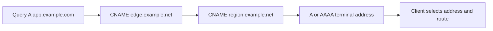

| Observation | Meaning | Next check |
|---|---|---|
| CNAME returned, no terminal A/AAAA | Alias path incomplete in observed response/cache | Query canonical target with same resolver/view |
| CNAME loop | Invalid dependency cycle | Authoritative zone owner correction |
| Different chain on VPN | Split DNS/policy/CDN behavior possible | Compare intended views and documentation |
| Old canonical target remains | Cache/TTL or stale zone data | TTL, authority, serial/change timeline |
| TLS name mismatch after CNAME | Certificate validates requested service name, not merely final DNS target | Requested hostname, SNI, SAN, edge config |

## 6. MX, PTR, TXT, and email caution

MX preference values rank choices; lower values are preferred. Equal-preference exchangers can provide distribution. Sending systems look up the selected MX target's A/AAAA and attempt SMTP according to protocol rules. A published MX record does not prove a server accepts a recipient, supports a policy, has valid TLS, or delivered a message.

PTR records live under reverse namespaces (`in-addr.arpa` for IPv4 and `ip6.arpa` for IPv6). Mail systems may use reverse/forward consistency and reputation as signals, but PTR does not cryptographically prove sender identity.

TXT records can carry SPF, DMARC, verification, or unrelated text. The owner name and protocol syntax matter. Querying TXT at `example.com` does not automatically find `_dmarc.example.com`, and a domain may have multiple TXT records.

| Email symptom | DNS evidence | What remains outside DNS |
|---|---|---|
| No MX answer | Exact qname/type/rcode/authority | Fallback SMTP behavior and domain intent |
| MX target has no address | Target A/AAAA queries | Cache/view/authoritative correction |
| Sender rejected for reverse DNS | PTR plus forward A/AAAA and exact SMTP reply | Receiver policy/reputation decision |
| SPF result differs | TXT at evaluated identity, includes/redirect chain, TTL | SMTP identity/alignment and evaluator behavior |
| DMARC record “missing” | TXT at `_dmarc.<domain>` from correct resolver | Organizational-domain and policy evaluation |
| Mail delayed after DNS recovers | TTL/negative cache and retry schedule | Queue retry policy and message state |

## 7. Positive, negative, and local caching

Caching reduces latency and authoritative load. A positive answer is cached according to TTL, with implementation and policy limits. **Negative caching** stores proof that a name does not exist (NXDOMAIN) or that a requested type has no data, using authority information defined by DNS standards. A corrected zone may therefore not appear immediately to every recursive resolver.

Client applications, operating systems, local forwarders, enterprise recursive resolvers, and upstream resolvers may each cache. The TTL displayed by a recursive response is often remaining lifetime, not necessarily the authoritative original TTL. A cache flush is a state-changing diagnostic action that can disrupt comparison and should not be the first reflex.

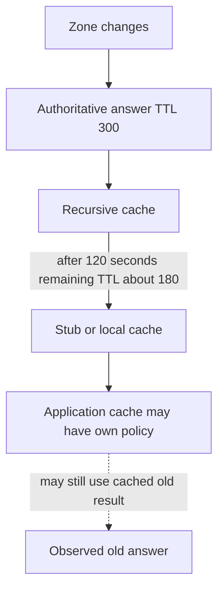

| Cache location | Potential behavior | Evidence/limitation | Safe approach |
|---|---|---|---|
| Application/runtime | Independent TTL or connection pool | OS query may differ | Restart only if approved; inspect app docs/logs first |
| Browser | Host cache, DoH, connection reuse | CLI may not match | Use browser network/internal diagnostics carefully |
| OS stub/cache | Local positive/negative entries | Cache display can expose browsing/internal names | Query first; minimize output |
| Local forwarder | Container/VPN/router cache | Host may point to proxy resolver | Record actual resolver path |
| Recursive resolver | Shared positive/negative cache | Different clients can share stale result | Query exact resolver and authoritative source |
| Authoritative server | Current served zone data | Multiple authoritative nodes may differ transiently | Query each authoritative server when authorized |

## 🔍 Plain-English deep-dive: TTL is permission to reuse, not a global propagation timer

TTL tells a caching resolver how long it may reuse a record before refreshing. It does not command every cache to begin at the same moment, and it does not guarantee a change appears everywhere exactly after one TTL. Different resolvers cached the old value at different times; applications may cache separately; authoritative nodes and delegation data can have their own state.

Think of library patrons checking out copies of a directory for up to five minutes. Updating the master directory does not recall every copy instantly. The analogy stops because DNS negative caching, delegation, client policy, serve-stale behavior, and connection reuse have formal/implementation-specific rules.

## 8. DNS response outcomes

The DNS header response code (RCODE), answer section, authority section, and flags together matter. Tool wording can blur distinctions.

| Outcome | Plain meaning | Common hypotheses | Evidence required |
|---|---|---|---|
| NOERROR with answers | Query succeeded with data | Normal or policy-synthesized answer | Answer, flags, TTL, resolver/view |
| NOERROR with no requested data | Name may exist but requested type absent (“NODATA” concept) | Type not published, CNAME/delegation nuance | Authority/SOA and alternate types |
| NXDOMAIN | Queried name asserted nonexistent in that DNS view | Typo, search suffix, stale negative cache, missing zone/name, policy synthesis | Exact FQDN, resolver/view, authority/SOA, DNSSEC proof where used |
| SERVFAIL | Resolver/server could not complete processing | DNSSEC validation, timeout/delegation, server failure, lame delegation | Resolver logs/extended errors, trace/authority checks |
| REFUSED | Server declined operation/query by policy | ACL, recursion disabled, view/policy | Which server, query, client/source, flags |
| Timeout | No usable response before client deadline | Path, server, transport, packet size, policy, overload | Attempts, UDP/TCP, timing, route/capture at authorized points |
| Truncated (`TC`) | UDP response says retry with TCP | Large response/EDNS/path | Flags and TCP retry result |
| FORMERR/NOTIMP | Format/feature unsupported or invalid | EDNS/version/client/server compatibility | Exact query bytes/tool options/server logs where authorized |

NXDOMAIN is different from NOERROR/no-data. If `host.example.com` exists with A but no AAAA, an AAAA query can return no-data rather than saying the entire name does not exist. Applications may present both as “host not found,” so raw resolver evidence matters.

## 🔍 Plain-English deep-dive: A DNS response code describes an outcome at one observer

An RCODE is evidence from the server or resolver that returned it, in one view, at one time. NXDOMAIN from an enterprise recursive resolver can reflect an authoritative negative answer, a cached earlier answer, or an intentional filtering policy. SERVFAIL can reflect failed DNSSEC validation, unreachable authority, broken delegation, or local resolver trouble. REFUSED proves an explicit refusal at that respondent, not why its policy denied the query.

Imagine asking a help desk for a room location. “No such room,” “I could not complete the lookup,” “I am not allowed to answer,” and silence are four different outcomes. None tells you the building's full history without knowing which desk answered and which directory it used. The analogy stops because DNS exposes machine-readable flags, sections, TTLs, extended errors, signatures, and delegation evidence.

A disciplined support statement therefore says: “Resolver `RESOLVER-073-A` returned NXDOMAIN for AAAA `host.example.com.` at 14:03 UTC with this authority/negative-cache evidence.” It does not say “the domain does not exist everywhere.” The next action is chosen from the exact observer, view, response, and authoritative comparison.

## 9. EDNS and DNSSEC at support depth

**EDNS** extends DNS message capabilities, including larger UDP payload negotiation and extension flags/options. It is not a new DNS transport and does not encrypt queries. Large responses can expose path Maximum Transmission Unit, fragmentation, or firewall compatibility problems; clients/resolvers may fall back to TCP depending on truncation and behavior.

**DNSSEC** adds data-origin authentication and integrity for DNS data through signed records and a chain of trust. A validating resolver can detect bogus signatures or prove nonexistence. DNSSEC does not encrypt DNS names/answers and does not prove the application behind an address is trustworthy. DoH and DNS over TLS (DoT) protect transport to a resolver but do not replace DNSSEC's data validation role.

| Feature | Provides | Does not provide | Support clue |
|---|---|---|---|
| EDNS | Extended size/flags/options framework | Encryption or guaranteed large-UDP delivery | Failure only with large/DNSSEC answers |
| TCP fallback | Reliable DNS transport for larger/truncated exchanges | Correct DNS data by itself | UDP works/truncates, TCP blocked |
| DNSSEC validation | Origin/integrity and authenticated denial for signed chain | Confidentiality or application authorization | SERVFAIL on validating resolver, works with nonvalidating path |
| DoT | Encrypted client/resolver DNS transport over TLS | Authoritative data authenticity by itself | Enterprise policy/path differs |
| DoH | DNS carried in HTTPS | Automatic bypass legitimacy or DNSSEC | Browser differs from OS CLI |
| AD/CD/DO flags | Validation/query-control signals with context | A simple universal “secure” boolean | Interpret from querying component and docs |

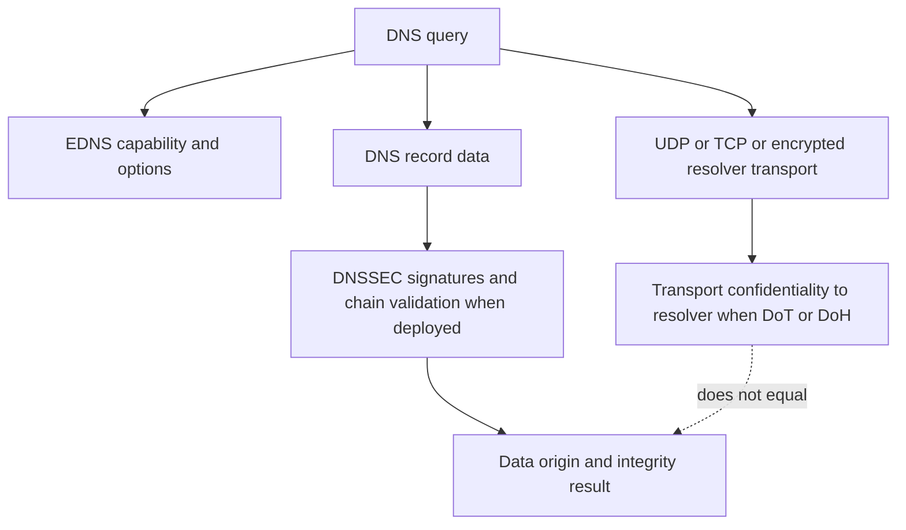

## 10. Split DNS, search suffixes, and hosts files

**Split DNS** returns different answers depending on network, client, resolver, identity, or view. It can be intentional: an internal API name maps to private addresses on VPN and public addresses externally. It can fail when a client uses the wrong resolver, a suffix route is missing, or internal/private data leaks into a public path.

A **search suffix** lets a client transform a short name such as `mail` into candidate FQDNs such as `mail.corp.example`. This convenience creates ambiguity. Always reproduce with the exact absolute FQDN and note whether the application used a short name.

The hosts file is a local static mapping checked according to the operating system's name-service order. A stale entry can override DNS for one host. Do not modify it during initial evidence collection.

| Working/failing difference | Plausible naming cause | Discriminating check |
|---|---|---|
| VPN on/off | Split resolver or suffix route | Resolver/view and exact FQDN answers in each state |
| Browser/CLI | DoH, proxy, browser cache | Effective browser resolver policy and CLI resolver |
| Host A/Host B | Hosts entry, DHCP DNS option, cache | Exact local configuration and resolver query |
| FQDN/short name | Search suffix expansion | Query exact absolute FQDN and record suffix list |
| Container/host | Internal forwarder/search domain | Inspect container resolver config safely |
| IPv4/IPv6 | A/AAAA difference | Query each type and record selected family |

## 11. DNS troubleshooting flow

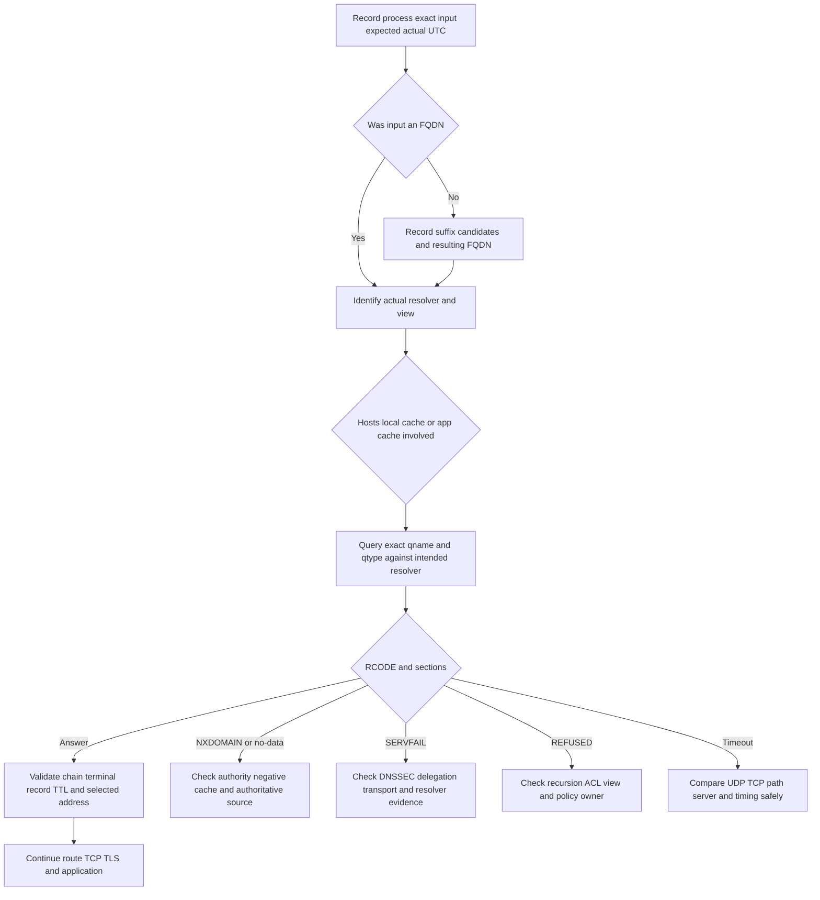

### DNS evidence packet

| Field | Example safe form | Why required |
|---|---|---|
| Process/runtime | `CONNECTOR-073`, version | Resolver behavior can differ |
| Input | `api.example.com.` | Avoid suffix ambiguity |
| QTYPE/class | A/IN and AAAA/IN | Different data/outcomes |
| Resolver/view | `RESOLVER-073-A`, VPN on | Answers can be view-specific |
| UTC | `2026-08-24T14:03:00Z` | Cache/change correlation |
| RCODE/flags | NOERROR, RD/RA/AA/AD as observed | Identifies response semantics/source |
| Sections | Answer, authority, additional summaries | NXDOMAIN/delegation/terminal evidence |
| Chain | CNAME owners/targets to terminal data | Dependency map |
| TTL | Remaining TTL per response | Cache hypothesis |
| Selected address | Aliased/redacted | Connects to route/transport attempt |

## 12. DHCPv4 DORA

DHCPv4 commonly begins when a client without usable configuration broadcasts a DHCPDISCOVER. One or more servers can respond with DHCPOFFER messages. The client broadcasts a DHCPREQUEST indicating the selected server/address. The chosen server returns DHCPACK to confirm the lease, or DHCPNAK in relevant invalid situations. A **DHCP relay agent** can forward messages between a client subnet and remote DHCP servers.

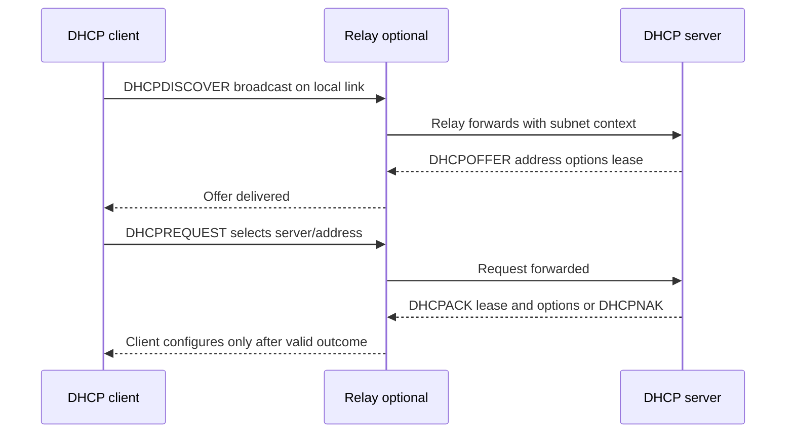

DORA is a memory aid, not every packet sequence in every state. Renewal often uses unicast DHCPREQUEST to the original server, and reboot/rebinding behavior differs. Duplicate detection, server policy, reservations, relays, failover, and operating-system state affect the exchange.

| Message | Basic purpose | Useful fields/context | Failure clue |
|---|---|---|---|
| DHCPDISCOVER | Client seeks servers/config | Client ID/MAC context, transaction ID, requested options | No offer suggests scope/relay/server/path/policy hypotheses |
| DHCPOFFER | Server proposes address/options | Offered address, server ID, lease/options | Multiple offers can be normal |
| DHCPREQUEST | Client selects/requests or renews | Requested address/server ID/state-dependent fields | Request without ACK requires server/path evidence |
| DHCPACK | Server confirms lease/config | Address, mask, router, DNS, lease timers | ACK can still contain wrong options |
| DHCPNAK | Server rejects invalid requested network/address context | Server ID and state | Client must restart acquisition as specified |
| DHCPDECLINE | Client reports offered address appears in use | Address/conflict evidence | Possible duplicate/address-detection issue |
| DHCPRELEASE | Client tells server it relinquishes lease | Address/server | Not guaranteed on abrupt disconnect |
| DHCPINFORM | Configured client asks for local options | Options, no normal address lease | Not DORA acquisition |

## 🔍 Plain-English deep-dive: An ACK proves a lease decision, not useful connectivity

A DHCPACK says the server accepted a lease/configuration transaction. The supplied gateway could be unreachable, the DNS server could be wrong, the subnet mask could be incorrect, an address conflict could occur, or policy could block the application. Treat address assignment, local gateway reachability, DNS behavior, and SaaS reachability as separate checkpoints.

Think of receiving an office badge and room assignment. The badge issuance can succeed while the room number is wrong or a door reader is offline. The analogy stops because DHCP options, ARP conflict detection, route creation, and lease timers have protocol-specific behavior.

## 13. Leases, renewal, and rebinding

A DHCP address is normally leased for a period. At renewal time (T1), commonly defaulting to half the lease when not otherwise specified, the client attempts to renew with the original server. At rebinding time (T2), commonly later in the lease, the client broadens the request to any available server. RFC defaults are often described as T1 50% and T2 87.5% of the lease, but the actual lease/options/client state must be read rather than assumed.

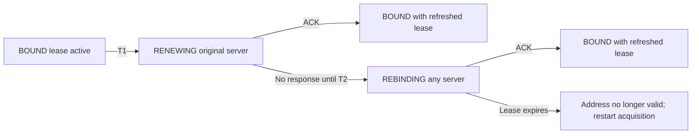

| Lease phase | Client behavior | Evidence | Support caution |
|---|---|---|---|
| Initial acquisition | Discover/offer/request/ack style exchange | Transaction/lease/options | Broadcast/relay visibility matters |
| Bound | Uses leased address/options | Lease obtained/expires, routes, resolver config | Correct lease is not app health |
| T1 renewal | Usually tries server that granted lease | Unicast request/ACK timing | Brief server loss may not affect service immediately |
| T2 rebinding | Seeks any server able to extend lease | Broader request/ACK | Failover/scope consistency matters |
| Expiration | Must stop using expired address per state rules | Client event/log/config transition | User may see APIPA/no connectivity |

## 14. DHCP options and APIPA

DHCP options carry configuration. Common IPv4 examples include subnet mask, router, DNS servers, domain name, domain search, and lease time. Option numbers and interpretation should be checked against current registries and platform documentation.

| Option/function | Typical purpose | Failure symptom | Evidence boundary |
|---|---|---|---|
| Subnet mask | Defines local IPv4 prefix | Wrong on-link/gateway decisions | Compare lease and effective route |
| Router/default gateway | Supplies next-hop router list | Local address but no remote route | Effective default route/gateway reachability |
| DNS server | Supplies resolver addresses | IP works but names fail | Effective resolver and query result |
| Domain name | Local domain context | Unexpected suffix/display | Search behavior is platform-specific |
| Domain search | Ordered suffix list | Short name resolves to wrong FQDN | Use exact FQDN to disambiguate |
| Lease time | Duration of assigned configuration | Renewal/expiration timing | Read actual obtained/expires values |
| Vendor/user/client identifiers | Classification/policy | Different scope/options per client | Privacy and server policy |
| Classless static routes | Supplies more-specific routes on supporting clients | Certain prefixes take unexpected path | Effective route table is decisive |

If Windows cannot obtain intended IPv4 configuration, it may self-assign an APIPA address in `169.254.0.0/16`. IPv4 link-local supports communication on the local link but is not a normal route to enterprise SaaS. Check whether the interface was intended to use DHCP, whether an offer arrived, relay/scope state, link/VLAN, and client logs. Do not merely run `ipconfig /release` and `/renew` on a production remote session; it can disconnect the host and destroy evidence.

## 15. DHCP troubleshooting flow

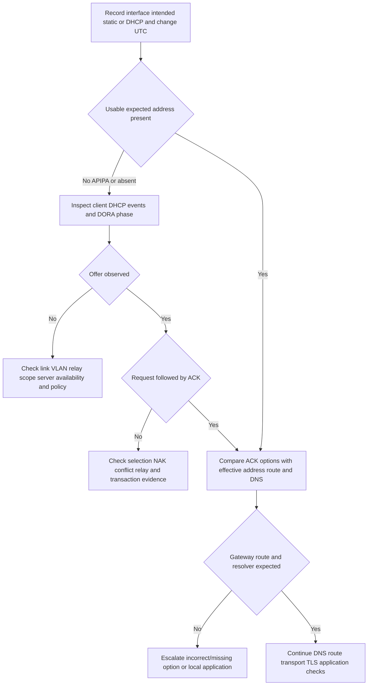

### DHCP failure modes

| Symptom | Hypotheses | Safe evidence | Unsafe shortcut |
|---|---|---|---|
| No offer | Link/VLAN/relay/scope/server/policy | Client events and authorized scoped capture/logs | Repeated release on remote machine |
| Offer, no ACK | Request selection, NAK, conflict, path | Transaction ID/message sequence | Guessing server ignored client |
| APIPA | DHCP failed or no intended static config | Interface config, DHCP events, lease history | Calling APIPA the root cause |
| Address but no names | Wrong/missing DNS option or resolver failure | Effective DNS servers and exact query | Reconfiguring public DNS without approval |
| Address but no remote path | Mask/router/route/policy | Effective route/gateway evidence | Treating ACK as connectivity proof |
| Periodic drops near lease time | Renewal/rebind/server/relay | Lease times and client/server events | Assuming address conflict without proof |
| Duplicate address warning | Conflict or stale reservation/state | OS conflict event, ARP/DHCP owner evidence | Manually claiming another address |

## 16. Worked example: VPN API name fails only internally

**Scenario:** On VPN, a connector resolves `api.example.test` to a private address; off VPN, the same conceptual service uses a public name/view. The VPN query returns NXDOMAIN after a zone change, while a public resolver answer is irrelevant because `.test` is reserved and this is synthetic.

| Hypothesis | Prediction | Result | Confidence |
|---|---|---|---|
| Wrong search suffix | Client queried unintended expanded name | Exact app qname is correct FQDN | Reduced |
| Stale negative cache | Intended resolver cached earlier NXDOMAIN | Remaining negative TTL and later authority answer differ | Increased |
| Broken delegation | All recursive resolvers following same child fail | Internal authority is directly configured; no delegation | Reduced |
| Split-view record missing | Internal authority lacks name while external architecture differs | Authority returns NXDOMAIN in internal view | Increased |
| TCP/TLS problem | DNS succeeds but next layer fails | No address returned | Reduced for this attempt |

The customer-safe update names the internal resolver/view, exact qname/qtype, NXDOMAIN and authority/negative TTL, affected scope, change time, and zone-owner ask. It does not say “public DNS works” as proof, and it does not flush every client cache before the owner confirms the authoritative correction.

## 17. Worked example: DHCP ACK but SaaS unreachable

**Scenario:** A Windows endpoint receives `10.73.10.25/24`, lease and DNS server, but no default route appears. Local subnet resources work; public SaaS does not.

The DHCP ACK is a successful lease checkpoint. Compare the ACK/effective options, route table, and expected router option. If the router option was absent in the lease, the DHCP scope/policy owner investigates. If present but no route was installed, the endpoint/network stack owner investigates. Do not change the gateway manually during the baseline collection.

| Checkpoint | Observed | Interpretation |
|---|---|---|
| Address/mask | Present and expected | Acquisition partially succeeded |
| DNS server | Present | Does not prove resolution works |
| Default route | Missing | No ordinary remote path |
| Local subnet | Reachable | Link/local prefix plausible |
| SaaS request | Never reaches TCP/TLS | Application authorization is not current boundary |

## 18. Combined troubleshooting tree

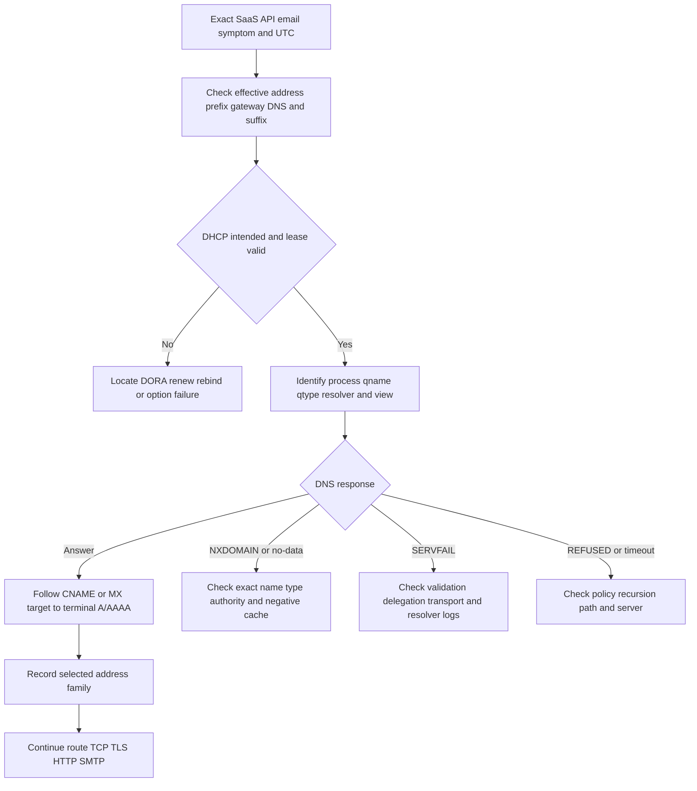

## 19. Common unsafe practices and escalation triggers

| Practice | Risk | Safer replacement | Escalate when |
|---|---|---|---|
| Flushing DNS immediately | Destroys cache evidence and changes behavior | Query/cache/TTL first; approved controlled retest |
| Editing hosts file | Creates hidden override and security risk | Read relevant entry; owner-approved change later |
| Switching to public DNS | Can bypass split DNS/policy and leak names | Query intended resolver; optional public comparison only for public names |
| `ipconfig /release` remotely | Can disconnect endpoint | Read lease/events; plan authorized local action |
| Broad `ipconfig /displaydns` sharing | Exposes browsing/internal names | Filter locally or omit; record exact target only |
| Claiming NXDOMAIN means domain unregistered | It means nonexistent in that observed view | Check authority/view/negative proof |
| Claiming SERVFAIL means server down | Many validation/delegation causes | Obtain resolver diagnostics and authority path |
| Treating DNSSEC as encryption | Misstates security property | Separate data integrity from transport privacy |
| Querying customer internal names via public tools | Leaks internal naming | Use protected authorized environment |
| Capturing all DHCP/DNS on shared segment | Privacy and unrelated traffic | Scope interface/time/host with authorization |

## Safe local/public lab: The Name and Lease Evidence Board 073

### Prerequisites

- The learner's own Windows and/or Linux workstation and permission to read local configuration.
- Windows PowerShell with `Resolve-DnsName`/`ipconfig`, or Linux with `resolvectl` and optionally `dig`/`nslookup` already installed.
- Internet access is optional. Public queries, if available, are limited to `example.com`, `iana.org`, and their published records. No zone transfer, enumeration, brute force, or third-party infrastructure probing.
- No use of real customer/internal names in commands or artifacts.
- No cache flush, lease release/renew, adapter restart, hosts edit, resolver change, VPN change, or DNS/DHCP server change.
- Artifact label: **local/public lab - read-only resolver and lease metadata with reserved/public documentation names**.

### Lab procedure

1. Record start UTC, OS, shell, connection/VPN state, and no-change statement.
2. Record effective DNS servers/search context while minimizing unrelated interfaces.

   **Windows:**

   ```powershell
   Get-DnsClientServerAddress | Where-Object {$_.ServerAddresses.Count -gt 0}
   Get-DnsClientGlobalSetting
   ```

   **Linux:**

   ```bash
   resolvectl status
   ```

3. In the retained artifact replace resolver addresses, interface names, and suffixes with `RESOLVER-073-A`, `IFACE-073-A`, and `SUFFIX-REDACTED` unless public/harmless.
4. Query the exact FQDN and record qname, qtype, resolver, UTC, response code/flags if exposed, records, aliases, and TTL.

   **Windows:**

   ```powershell
   Resolve-DnsName example.com -Type A
   Resolve-DnsName example.com -Type AAAA
   Resolve-DnsName example.com -Type MX
   Resolve-DnsName example.com -Type TXT
   ```

   **Linux/systemd-resolved:**

   ```bash
   resolvectl query example.com
   ```

   **Linux with dig already installed:**

   ```bash
   dig A example.com
   dig AAAA example.com
   dig MX example.com
   dig TXT example.com
   ```

5. Use `nslookup -type=A example.com` once on either OS to compare output style. Note which resolver it reports and why tool output does not prove application behavior.
6. Query a deliberately nonexistent randomized label under `example.com`, such as `does-not-exist-073.example.com`, once. Record NXDOMAIN/no-data as actually returned, authority information, and any negative TTL evidence. Do not loop or generate many labels.
7. If `dig` is installed, use one bounded trace only for `example.com`: `dig +trace example.com A`. Record root/TLD/authoritative roles, not every public IP. This is optional and should be skipped behind policy that prohibits direct DNS queries.
8. Do not use `AXFR` or request a zone transfer.
9. Read local DHCP/lease-relevant configuration without changing it.

   **Windows:**

   ```powershell
   ipconfig /all
   ```

   Retain only the active adapter's DHCP-enabled state, address category/prefix, gateway presence, DHCP server alias, DNS server aliases, lease obtained/expires, and suffix category. Do not share the raw output.

   **Linux:** use the network manager's read-only connection/status view if approved, or record only `ip address`, `ip route`, and `resolvectl status`. DHCP lease file locations/permissions vary; do not access protected files merely for this lab.
10. Draw a synthetic DORA sequence using `CLIENT-073`, `RELAY-073`, `SERVER-073`, and documentation address `192.0.2.73`; include Discover, Offer, Request, ACK, lease, router, DNS, and domain/search options.
11. Add renewal at T1 and rebinding at T2 using a fictional eight-hour lease; calculate default teaching times while stating actual server values control.
12. Create a failure variant: offer/ACK contains address and DNS but no router. Predict effective route and SaaS symptom.
13. Build the Name and Lease Evidence Board linking DHCP option -> effective host config -> exact DNS query -> resolver response -> selected address -> next route checkpoint.
14. Draft a 90-second customer update for NXDOMAIN in one resolver view and a 90-second update for APIPA/no offer, without claiming root cause.
15. Record end UTC and complete cleanup.

### Expected evidence

- Minimized effective resolver/search configuration with aliases.
- A, AAAA, MX, and TXT query observations for `example.com`.
- One exact nonexistent-name response with negative-cache/authority notes.
- Optional one-time `dig +trace` role map.
- A comparison of `Resolve-DnsName`, `resolvectl`, `dig`, and/or `nslookup` output boundaries.
- Active-interface DHCP-enabled/static status, lease timing if available, gateway and DNS option evidence, all redacted.
- Synthetic DORA plus renewal/rebinding timeline.
- Missing-router-option failure prediction.
- Name and Lease Evidence Board connecting configuration to resolution and next layer.
- No caches, leases, adapters, files, resolvers, or zones changed.
- Spoken explanation of NXDOMAIN versus SERVFAIL versus REFUSED versus timeout.

### Cleanup and privacy

- Delete raw `ipconfig /all`, `resolvectl status`, route, and resolver outputs after extracting minimum aliased evidence.
- Ensure retained artifacts contain no internal suffix, resolver address, interface name, MAC/client ID, DHCP server, public IP, lease identifiers, browsing history, customer domain, email address, or username.
- Do not run or retain `ipconfig /displaydns`; it is unnecessary and may expose unrelated names.
- Do not flush DNS, release/renew DHCP, edit hosts/resolver files, restart networking, or change VPN state as cleanup.
- No service/capture was started, so none should remain.
- Record: `Name and Lease Evidence Board 073 completed read-only; no cache, lease, adapter, hosts, resolver, zone, or security setting changed.`

### Validation rubric

| Dimension | Fail | Developing | Pass |
|---|---|---|---|
| DNS roles | Says “DNS server” only | Names recursive/authoritative | Maps stub, recursive, root, TLD, delegation, authority, cache |
| Records | Confuses TXT/address | Names common types | Explains A/AAAA/CNAME/MX/TXT/PTR/SRV semantics/cautions |
| Errors | Calls all failures NXDOMAIN | Distinguishes timeout | Interprets RCODE, sections, flags, resolver/view, TTL |
| Caching | Flushes immediately | Records TTL | Separates app/stub/recursive/negative cache and preserves state |
| DHCP | Recites DORA | Knows lease | Connects DORA, options, T1/T2, effective route/DNS, APIPA |
| Tools | Copies one output | Uses two tools | Records exact resolver/query/type/time and tool limitations |
| Privacy | Shares raw config/cache | Redacts obvious data | Keeps only aliases/minimum evidence; deletes raw output |
| Honesty | Claims DNS admin ownership | Says learned | States support-depth working familiarity and owner boundaries |

## Official Source Anchors - August 24, 2026

| Official or primary source | Topic anchored | Boundary |
|---|---|---|
| [RFC 1034 - Domain Names Concepts and Facilities](https://www.rfc-editor.org/rfc/rfc1034.html) | DNS hierarchy, zones, resolvers, caching | Updated by later RFCs |
| [RFC 1035 - Domain Names Implementation and Specification](https://www.rfc-editor.org/rfc/rfc1035.html) | DNS messages and core record formats | Later RFCs update behavior |
| [RFC 2308 - Negative Caching of DNS Queries](https://www.rfc-editor.org/rfc/rfc2308.html) | NXDOMAIN/no-data negative caching | Resolver implementation/policy can add limits |
| [RFC 2181 - Clarifications to the DNS Specification](https://www.rfc-editor.org/rfc/rfc2181.html) | TTL/data/CNAME clarifications | Check RFC update metadata |
| [RFC 6891 - EDNS(0)](https://www.rfc-editor.org/rfc/rfc6891.html) | EDNS extension mechanism | Does not provide encryption |
| [RFC 4033 - DNS Security Introduction and Requirements](https://www.rfc-editor.org/rfc/rfc4033.html) | DNSSEC goals and model | Use with DNSSEC protocol RFC set |
| [RFC 7858 - DNS over TLS](https://www.rfc-editor.org/rfc/rfc7858.html) | DoT transport privacy | Does not replace DNSSEC/application TLS |
| [RFC 8484 - DNS Queries over HTTPS](https://www.rfc-editor.org/rfc/rfc8484.html) | DoH | Enterprise/browser policy and resolver differ |
| [RFC 5321 - SMTP](https://www.rfc-editor.org/rfc/rfc5321.html) | MX lookup and mail-transfer behavior | Email platform policy remains separate |
| [IANA DNS Parameters](https://www.iana.org/assignments/dns-parameters/dns-parameters.xhtml) | Current RR types, rcodes, flags | Registry is authoritative for assignments, not incident cause |
| [RFC 2131 - Dynamic Host Configuration Protocol](https://www.rfc-editor.org/rfc/rfc2131.html) | DHCPv4 messages, leases, renewal/rebinding | Platform/server implementation varies |
| [RFC 2132 - DHCP Options and BOOTP Vendor Extensions](https://www.rfc-editor.org/rfc/rfc2132.html) | Core DHCP option definitions | Later option RFCs/registry apply |
| [IANA BOOTP/DHCP Parameters](https://www.iana.org/assignments/bootp-dhcp-parameters/bootp-dhcp-parameters.xhtml) | Current DHCP option/message assignments | Consult exact option specification |
| [RFC 3927 - IPv4 Link-Local Addresses](https://www.rfc-editor.org/rfc/rfc3927.html) | IPv4 link-local behavior | APIPA is Windows terminology/context |
| [Microsoft Learn - Resolve-DnsName](https://learn.microsoft.com/en-us/powershell/module/dnsclient/resolve-dnsname) | Windows DNS query command | Tool resolver/options may differ from application |
| [Microsoft Learn - DNS client resolution](https://learn.microsoft.com/en-us/windows-server/networking/dns/dns-client) | Windows DNS client concepts | Version/policy specific |
| [Microsoft Learn - Automatic Private IP Addressing](https://learn.microsoft.com/en-us/windows-server/troubleshoot/how-to-use-automatic-tcpip-addressing-without-a-dh) | Windows APIPA behavior | Link-local symptom is not root cause |
| [BIND 9 Administrator Reference Manual](https://bind9.readthedocs.io/) | `dig` and authoritative/resolver concepts | BIND docs do not define every platform resolver |
| [systemd-resolved manual](https://www.freedesktop.org/software/systemd/man/latest/systemd-resolved.service.html) | Linux systemd-resolved routing/cache/resolution behavior | Only applies when systemd-resolved is in use |
| [resolvectl manual](https://www.freedesktop.org/software/systemd/man/latest/resolvectl.html) | `resolvectl` query/status commands | Output and features vary by version |

### Source-use discipline

- Check RFC Editor “Updated by” metadata and IANA registries for current assignments.
- Record the exact query, resolver/view, tool/runtime, UTC, response code, flags, sections, and TTL.
- Treat public-resolver comparison as comparison, not proof of the application's path.
- Never expose internal qnames, suffixes, resolver addresses, lease identifiers, or caches in public artifacts.
- Never disable DNSSEC validation, encrypted-DNS policy, endpoint security, or split-DNS policy to make a test pass.
- Verify current vendor endpoint and record requirements only in approved documentation.

## Likely Interview Questions

### Q1. Explain stub, recursive, and authoritative DNS roles.

**Model answer:** An application usually asks a local stub resolver. The stub sends a recursive query to a configured recursive resolver, which answers from cache or follows referrals from root to TLD to the delegated authoritative server. The authoritative server serves zone data. I record which path the actual process used because hosts files, VPN views, DoH, containers, and application caches can differ.

### Q2. How do A, AAAA, CNAME, MX, TXT, PTR, and SRV differ?

**Model answer:** A and AAAA contain IPv4/IPv6 addresses; CNAME aliases an owner to a canonical name; MX names mail exchangers with preference; TXT carries protocol-specific or arbitrary text; PTR supports reverse mapping; SRV provides service priority, weight, port, and target. I follow dependencies to terminal records and never treat one record as proof that the service works.

### Q3. What is the difference between NXDOMAIN, SERVFAIL, REFUSED, and timeout?

**Model answer:** NXDOMAIN asserts the queried name does not exist in the observed view; NOERROR/no-data means the name may exist without that type. SERVFAIL means the resolver could not complete processing, often including validation/delegation failures. REFUSED is an explicit policy refusal. Timeout means no usable response arrived before the deadline. Resolver, flags, authority, transport, and logs refine each.

### Q4. How do TTL and negative caching affect a DNS change?

**Model answer:** TTL permits caches to reuse data; different caches acquired the old value at different times and may apply local limits. NXDOMAIN/no-data can also be negatively cached using authority information. TTL is not one global propagation timer. I preserve cache/TTL evidence, compare intended resolver and authority, and avoid flushing everything as the first step.

### Q5. What do EDNS and DNSSEC provide?

**Model answer:** EDNS extends DNS message capabilities, including larger UDP sizes and options; it does not encrypt. DNSSEC authenticates DNS data origin/integrity and denial of existence through a chain of trust; it does not encrypt queries or prove the application is trustworthy. DoH/DoT protect resolver transport and are a separate property.

### Q6. Explain DHCP DORA and why an ACK is not enough.

**Model answer:** A client discovers, servers offer, the client requests a selected lease, and the server acknowledges or rejects. The ACK can include address, mask, router, DNS, suffix, and lease timing. It proves a lease decision, not that options are correct or the gateway, resolver, TLS, or SaaS application is reachable, so I validate effective configuration separately.

### Q7. What are renewal, rebinding, and APIPA?

**Model answer:** At T1 the bound client normally attempts renewal with its server; at T2 it rebinds more broadly if renewal failed; actual server-provided times control. If intended IPv4 DHCP fails, Windows may assign a `169.254/16` APIPA/link-local address. That is a clue to locate the failed acquisition/configuration boundary, not the root cause itself.

### Q8. How would you describe your DNS/DHCP experience honestly?

**Model answer:** I have working familiarity with resolver chains, records, response codes, caching, DORA/lease/options, and read-only Windows/Linux tools, reinforced through labs. My production strength is enterprise support investigation and escalation. I do not claim authoritative DNS or DHCP infrastructure ownership and would partner with the authorized platform/network owner for changes.

## Memory Hooks

- **DHCP gives configuration; DNS answers typed name questions.**
- **Stub asks; recursive finds/caches; authoritative serves zone data.**
- **Root to TLD to delegation to authority.**
- **Record exact qname, qtype, resolver/view, UTC, rcode, flags, sections, TTL.**
- **A/AAAA address; CNAME alias; MX mail; TXT text; PTR reverse; SRV discovery.**
- **NXDOMAIN is not no-data.**
- **SERVFAIL is a processing failure, not automatically server-down.**
- **TTL permits reuse; it is not a global countdown.**
- **EDNS extends; DNSSEC validates; DoH/DoT encrypt resolver transport.**
- **DORA: Discover, Offer, Request, ACK.**
- **ACK proves lease decision, not usable SaaS connectivity.**
- **T1 renews; T2 rebinds; actual lease values win.**
- **APIPA/link-local is a clue, not a cause.**
- **Do not flush, release, or edit before preserving evidence.**

## Completion Checklist

- [ ] I can distinguish DNS from DHCP and explain how DHCP options influence DNS use.
- [ ] I can define stub, recursive, authoritative, root, TLD, zone, and delegation.
- [ ] I can explain application/OS/VPN/browser/container resolver differences.
- [ ] I can interpret A, AAAA, CNAME, MX, TXT, PTR, SRV, NS, and SOA at support depth.
- [ ] I can follow an alias/mail target to terminal addresses without calling it service proof.
- [ ] I can distinguish positive cache, negative cache, original TTL, and remaining TTL.
- [ ] I can distinguish NOERROR/answer, no-data, NXDOMAIN, SERVFAIL, REFUSED, timeout, and truncation.
- [ ] I can explain EDNS, TCP fallback, DNSSEC, DoH, and DoT without confusing their security properties.
- [ ] I can explain split DNS, search suffix, hosts, and why public resolver success is limited evidence.
- [ ] I can explain DORA, relay, DHCPNAK, lease, T1 renewal, T2 rebinding, and expiration.
- [ ] I can connect subnet mask, router, DNS, and domain/search options to effective host behavior.
- [ ] I can explain APIPA as IPv4 link-local evidence rather than root cause.
- [ ] I completed or can explain **The Name and Lease Evidence Board 073**.
- [ ] I made no DNS cache, lease, adapter, hosts, resolver, VPN, zone, or server change.
- [ ] I deleted/minimized raw configuration and used no internal/customer names.
- [ ] I can answer exactly Q1–Q8 aloud with honest support versus infrastructure ownership.
- [ ] I checked Official Source Anchors dated August 24, 2026.

[Next: Part 074 - TCP UDP Sockets Ports and Connection State](Part-074-tcp-udp-sockets-ports-and-connection-state.md)