# Part 074 - TCP UDP Sockets Ports and Connection State

> **Purpose:** Read transport evidence accurately enough to separate listener, path, connection, teardown, and application failures in SaaS, API, and email cases.
>
> **Artifact label:** Learned architecture plus loopback-only lab. No public service is scanned, no security control is disabled, and no credential is used.
>
> **Currency and source access date:** August 24, 2026.

## Section goal

By the end of this Part, you should be able to define a socket, endpoint, listener, connection, port, and five-tuple; distinguish well-known/system, registered/user, and dynamic/private port ranges; and explain how a client normally receives an ephemeral source port. You should be able to narrate the Transmission Control Protocol (TCP) three-way handshake, sequence and acknowledgment numbers, receive windows, retransmissions, flags, graceful FIN teardown, abortive Reset (RST), and common TCP states including TIME_WAIT and CLOSE_WAIT.

You should also be able to distinguish an immediate refusal from a timeout and a reset, explain User Datagram Protocol (UDP) datagrams and Internet Control Message Protocol (ICMP) feedback without treating silence as proof, and describe QUIC at a high level as a secure transport built over UDP rather than “unreliable HTTP.”

The support goal is to connect transport evidence to SaaS/API/email outcomes. A listening port proves a local process accepted a bind/listen state; it does not prove a remote route, firewall, TLS certificate, HTTP authorization, SMTP recipient, or product workflow. An established TCP connection proves a transport state at an observation point; it does not prove the application request completed. Every conclusion must name the tuple, direction, observer, and time.

## JD Mapping

| Supplied role signal | Capability developed | SaaS/API/email case | Proof artifact |
|---|---|---|---|
| Complex investigations | Separates listener, handshake, stream, reset, teardown, and app state | Connector reports generic connection error | Packet-level connection narrative |
| API support | Identifies whether failure precedes TLS/HTTP | API 443 refused versus 403 | Transport checkpoint table |
| Cloud Email Security | Reads SMTP TCP establishment and closure independently of message outcome | Port 25 connects but RCPT fails | Transport/application boundary map |
| SaaS Security | Correlates local workload socket with proxy/cloud connection | Agent uses proxy connection | Tuple and owner ledger |
| Windows/Linux tools | Uses `Get-NetTCPConnection`, `netstat`, and `ss` safely | Listener/process/state evidence | Local transcript |
| Customer trust | Avoids claiming firewall from timeout or success from ESTABLISHED | Precise update | Evidence statement set |
| Engineering escalation | Supplies protocol, tuple, state, flags, timing, retries, process, UTC | Reproducible reset case | Escalation packet |
| Privacy/security | Limits captures and removes content, IPs, process/user data | Safe pcap metadata | Cleanup checklist |
| Continuous learning | Grounds behavior in current TCP/UDP/QUIC/IANA sources | Standards-based answer | Source ledger |
| Honest positioning | Demonstrates working familiarity without network-engineering ownership | Interview depth statement | Spoken answer |

## Candidate honesty note

You can describe socket/transport analysis as **working familiarity and lab evidence**. Your production strength is enterprise support: scoping, timeline building, client/cloud isolation, Engineering escalation, critical-situation communication, and fix validation. You should not claim kernel TCP implementation expertise, enterprise firewall administration, Internet routing ownership, production packet-forensics specialization, or Abnormal AI transport ownership.

| Evidence tier | Safe claim | Boundary |
|---|---|---|
| Production transfer | Enterprise investigation and escalation discipline | Not transport-stack ownership |
| Working familiarity | Five-tuples, handshakes, states, flags, retransmission, safe tools | Not expert causal packet forensics from one trace |
| Local lab | Loopback listener, connection, refusal, state observations | Not remote/customer proof |
| Learned architecture | UDP/ICMP/QUIC and TCP state machine | Implementations/timeouts vary |
| Unknown | Abnormal ports, proxies, QUIC use, connection pooling, timeout policy | Verify current approved docs |

## 1. Endpoint, socket, connection, and listener

A transport **endpoint** combines an IP address, transport protocol, and port in a particular network namespace. A **socket** is an operating-system programming abstraction through which a process sends or receives network data. A socket can be unconnected, listening, or associated with a peer. A TCP **connection** is state shared conceptually between two endpoints after handshake progress; each host has its own local state and observations.

A server usually creates a socket, binds it to a local address/port, and listens. When a connection arrives, the operating system accepts it into a separate connected socket while the listening socket remains available for more clients. “Port 443 is open” is imprecise: say which local address has which protocol listener, which process owns it, and from where reachability was tested.

An analogy is a hotel switchboard. The published number resembles a listening endpoint; each caller receives a separate conversation while the main number remains available. The analogy stops because sockets have protocol state, queues, namespaces, address reuse rules, and security policy.

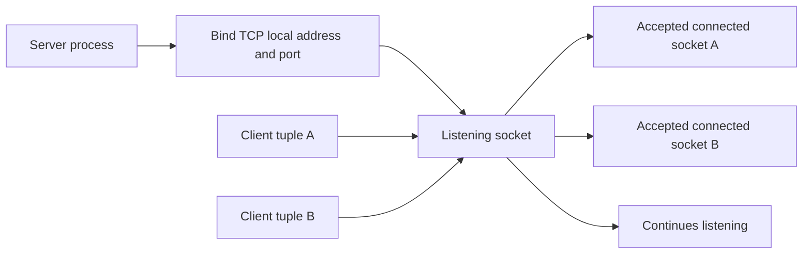

### Core terms

| Term | Plain meaning | Evidence value | Caution |
|---|---|---|---|
| Local endpoint | Address/port from observer's host perspective | Identifies local bind/connection side | “Local” changes by observer |
| Remote endpoint | Peer address/port from observer | Identifies intended/observed peer | Proxy may be peer instead of origin |
| Socket | OS communication object | Process and state association | Not a wire protocol packet |
| Listener | Socket waiting for TCP connections or UDP datagrams | Local service readiness checkpoint | Does not prove remote reachability |
| Accepted socket | Per-peer TCP socket created from listener | Server accepted handshake state | Application may not have processed request |
| Port | 16-bit transport identifier | Demultiplexes services/flows | Port number alone does not identify application securely |
| Network namespace | Isolated networking context | Containers/services may see different sockets/routes | Host tools may not see all namespaces |
| Backlog/queue | Pending connection bookkeeping | Saturation can affect acceptance | Implementation has multiple queues/limits |

## 2. The five-tuple

A unidirectional description of a transport flow commonly uses the **five-tuple**:

1. Source IP address.
2. Source port.
3. Destination IP address.
4. Destination port.
5. Transport protocol, such as TCP or UDP.

Direction matters. The reverse direction swaps source and destination. NAT, a proxy, or a load balancer can create different tuples at different observation points. A full support join often needs UTC plus tuple, process, TLS name, HTTP request ID, and application identity.

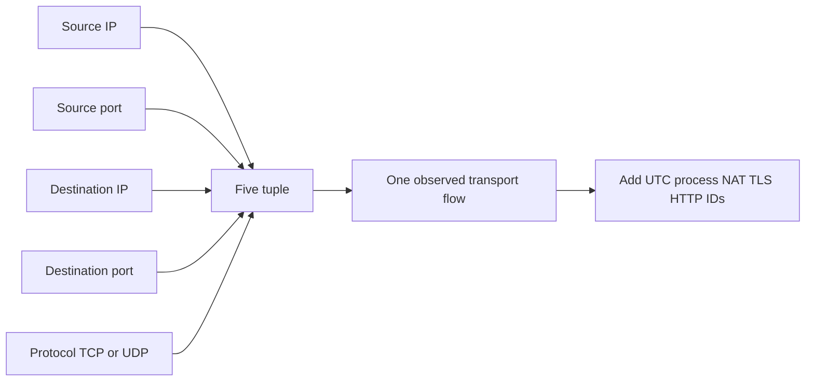

| Observation point | Example tuple using documentation addresses | What changed | Why record point |
|---|---|---|---|
| Client | `192.0.2.10:53174 -> 203.0.113.20:443 TCP` | Original local tuple | Maps process to attempt |
| After PAT | `198.51.100.40:62074 -> 203.0.113.20:443 TCP` | Source address/port | Cloud sees translated tuple |
| Reverse proxy front | Client/PAT -> proxy 443 | Peer is proxy | Origin is not direct transport peer |
| Proxy backend | Proxy address:ephemeral -> backend:8443 | Entirely new TCP connection | Front/back failures are separate |
| Server | Remote translated source -> local service | Direction labels reverse | Server logs need same UTC/tuple |

## 3. Port ranges and ephemeral ports

TCP and UDP port fields are 16 bits, so values range from 0 through 65535. IANA groups service names/ports into ranges. The System Ports range is 0–1023, User Ports 1024–49151, and Dynamic/Private Ports 49152–65535. “Well-known” and “registered” are common older/colloquial labels.

An operating system selects a client-side **ephemeral port** from its configured dynamic range for an outbound flow. Actual ranges, allocation algorithms, reservations, reuse, namespaces, and policy vary. Do not assume every client uses exactly IANA's dynamic range or that a high source port means malicious behavior.

| Range | IANA label | Typical use | Support caution |
|---:|---|---|---|
| 0–1023 | System Ports | Widely standardized services; privileged bind conventions on many OSs | Port does not authenticate service |
| 1024–49151 | User Ports | Registered/application services and other uses | Registration does not guarantee process identity |
| 49152–65535 | Dynamic/Private Ports | Dynamic client/private use | OS ephemeral range may differ/configure |
| Any | Local override/tunnel/proxy | Product can use nondefault ports | Read actual config/documentation |

Common associations such as TCP 443 for HTTPS, TCP 25 for SMTP relay, TCP/UDP 53 for DNS, and UDP 443 for HTTP/3/QUIC are clues, not proof. A process can speak a different protocol on a familiar port, and a proxy can carry one protocol inside another tunnel.

## 🔍 Plain-English deep-dive: A port is a numbered door, not the person behind it

Calling port 443 “HTTPS” is shorthand for a common assignment. The port identifies where transport data is delivered; the bytes and protocol negotiation determine what is actually spoken. Malware can listen on 443, a development server can use 8443, and an enterprise proxy can accept CONNECT on one port and create another connection elsewhere.

Think of an office suite number. It helps route a visitor to a door, but the sign may be stale and it does not verify who opened the door. The analogy stops because ports are per transport protocol/address/namespace and can be translated or reused.

## 4. TCP service model

TCP provides a reliable, ordered byte stream between endpoints. It detects loss and corruption, retransmits as needed, suppresses duplicate delivery to the receiving application, and uses flow/congestion controls. “Reliable” does not mean guaranteed success or infinite waiting. Connections can time out, reset, lose all paths, or be terminated by hosts/middleboxes.

TCP is a byte stream, not a message protocol. One HTTP request can span multiple TCP segments; multiple small application writes can be coalesced; TLS records and HTTP/2 frames have their own boundaries. Packet-by-packet application assumptions are unsafe without reassembly and protocol knowledge.

| TCP property | Meaning | SaaS support relevance | Limit |
|---|---|---|---|
| Connection-oriented | Establishes state before byte exchange | Handshake is a checkpoint | State can differ at each endpoint/middlebox |
| Reliable | Retransmits and orders bytes | Loss may appear as delay, not corrupt app data | Persistent loss still fails |
| Ordered | Application reads stream in sequence | Missing segment can delay later bytes | Head-of-line effects exist |
| Full duplex | Both sides send independently | One side can half-close | Directional evidence needed |
| Flow control | Receiver advertises acceptable data window | Slow receiver can constrain sender | Not same as network congestion |
| Congestion control | Sender adapts to network signals | Throughput changes with loss/RTT | Algorithm/implementation varies |
| Byte stream | No application message boundaries | Requires protocol parser/reassembly | One packet is not one request |

## 5. Three-way handshake

A normal active opener sends SYN with an initial sequence number. The passive/listening side replies SYN-ACK, acknowledging the client's SYN and supplying its own initial sequence number. The client sends ACK for the server's SYN. SYN consumes one sequence number in the sequence space.

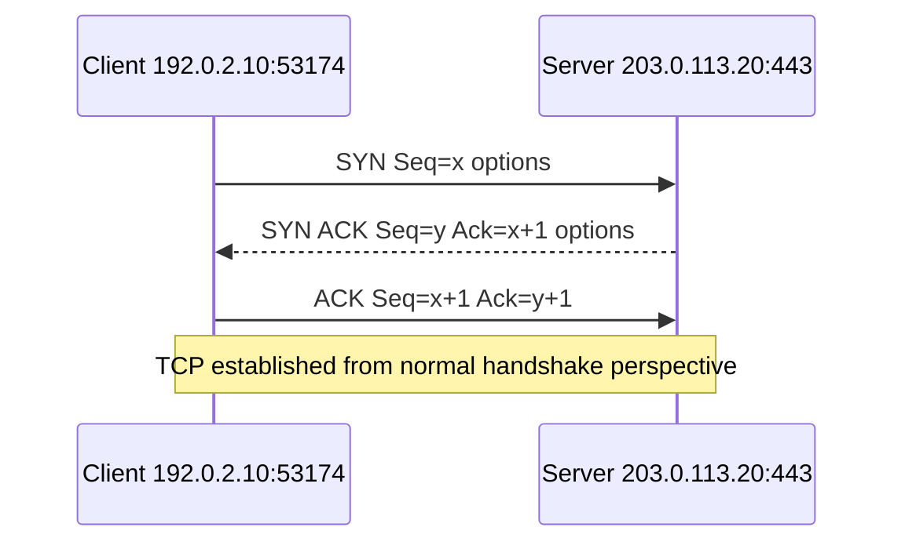

Handshake options can negotiate Maximum Segment Size (MSS), window scaling, selective acknowledgment permission, timestamps, and other capabilities. Exact fields depend on implementations. The handshake proves TCP state for that tuple at that time; TLS and HTTP happen later (except protocols that combine layers differently, such as QUIC over UDP).

### Handshake interpretations

| Trace pattern | Observation | Plausible boundary | What not to claim |
|---|---|---|---|
| SYN, SYN-ACK, ACK | Handshake completed at capture point | TCP path/listener available | API healthy or authenticated |
| Repeated SYN, no reply | Client retransmits opening attempt | Forward/return path, policy, listener silence | “Firewall definitely dropped it” |
| SYN, RST-ACK | Active rejection/no listener/policy reject at respondent | Reached rejecting stack/device | Which process/config caused it without evidence |
| SYN, SYN-ACK, repeated SYN-ACK | Server did not observe final ACK | Return/forward loss, capture point, client state | Server application failure |
| ICMP unreachable | Network/host/admin/port feedback depending code | Path/policy endpoint clue | Universal cause; filtering can alter ICMP |

## 6. Sequence and acknowledgment numbers

TCP sequence numbers count bytes in a stream. An acknowledgment number normally means “the next sequence number I expect.” It is cumulative: ACK 5001 says all bytes through 5000 have been received in order. SYN and FIN each consume one sequence number. Capture tools often display **relative sequence numbers** for readability rather than raw wire values.

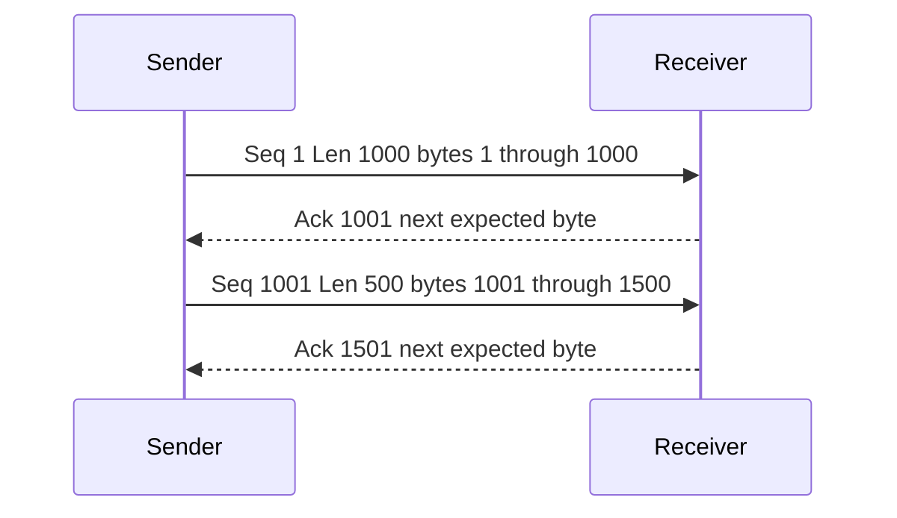

| Field/concept | Plain meaning | Interpretation caution |
|---|---|---|
| Sequence number | Position of first payload byte (or control in sequence space) | Relative display may hide raw value |
| Segment length | TCP payload bytes in that segment | Offload can make local captures look unusual |
| Acknowledgment | Next in-order byte expected | Duplicate ACK can have several causes/context |
| Selective ACK (SACK) | Reports received blocks beyond a gap | Requires negotiated support and full context |
| Retransmission | Sender sends sequence range again | Analyzer inference can be false with incomplete capture |
| Out-of-order | Capture sees later sequence before earlier | Could be path reordering, capture loss, or offload |

## 7. Receive window and flow control

The receiver advertises a window indicating how much additional sequence space it is prepared to accept. Window scaling negotiated in the SYN handshake extends the effective window beyond the 16-bit field. A zero window means the receiver currently advertises no additional capacity; probes can check when it opens.

Flow control protects the receiver. Congestion control protects the network path. They interact with throughput but answer different questions.

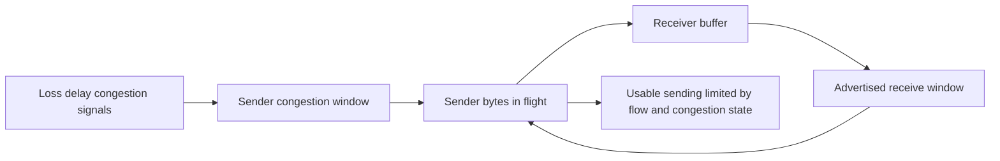

| Observation | Possible interpretation | Required context |
|---|---|---|
| Small advertised window | Receiver/application may be consuming slowly | Scale factor, direction, duration |
| Zero window | Receiver temporarily cannot accept more | Reopen probes, process state, buffer evidence |
| Window full analyzer flag | Sender may be filling advertised window | Capture completeness/offload/scale |
| High RTT with no loss | Window/BDP may constrain throughput | Part 078 covers performance analysis |
| Loss/retransmission | Congestion/path/capture issues possible | Both directions, timing, capture point |

## 🔍 Plain-English deep-dive: ACK does not mean the application finished

A TCP ACK confirms receipt into the peer's TCP sequence space, not that an application parsed, authorized, persisted, or acted on those bytes. Likewise, an HTTP 202 can confirm application acceptance without final asynchronous completion. Each checkpoint has its own guarantee.

Think of a signed delivery at a building mailroom. The package reached the mailroom; it may not have reached the employee or been processed. The analogy stops because TCP ACKs are automatic transport state and application protocols define different semantics.

For a SaaS API, use a state ladder: TCP acknowledged bytes -> TLS record processed -> HTTP request parsed -> identity authorized -> operation accepted -> backend workflow completed -> audit state visible. Never substitute an earlier proof for a later one.

## 8. Loss and retransmission at transport depth

When expected acknowledgment does not arrive, TCP retransmits according to its algorithms. A retransmission timeout (RTO) handles missing acknowledgment after a timer. Duplicate acknowledgments and selective acknowledgments can enable faster loss recovery. Detailed performance interpretation belongs in Part 078; here the key is that a retransmission is an inference about repeated sequence data, not automatic proof of physical packet loss at a named device.

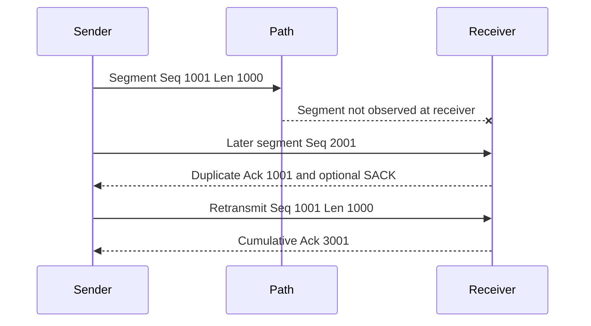

| Analyzer label | What it may mean | Caveat |
|---|---|---|
| Retransmission | Same sequence range seen again after gap/timing | Capture may have missed original/ACK |
| Fast retransmission | Heuristic sees duplicate ACK trigger pattern | Algorithms and SACK alter behavior |
| Duplicate ACK | Same next-expected byte acknowledged again | Out-of-order, loss, window update, or capture artifact |
| Previous segment not captured | Sequence gap in this capture | Name itself admits capture incompleteness |
| Spurious retransmission | Data appears retransmitted after already ACKed | Reordering, ACK visibility, capture points |

## 9. TCP flags

TCP control flags describe segment purpose/state. Context, sequence numbers, and direction matter more than a flag in isolation.

| Flag | Plain role | Common appearance | Caution |
|---|---|---|---|
| SYN | Synchronize sequence numbers/open | Handshake | SYN also carries options and consumes sequence number |
| ACK | Acknowledgment field valid | Most established segments | ACK flag alone does not mean no payload |
| FIN | Sender has no more bytes to send | Graceful half-close | Peer can still send until its own close |
| RST | Abort/reject connection state | Refusal, abort, invalid/unexpected state | Identify sender and preceding events |
| PSH | Prompt receiving stack/application delivery behavior | Often data segments | Not an application message boundary |
| URG | Urgent pointer valid | Rare in modern application traffic | Do not overinterpret |
| ECE/CWR | Explicit Congestion Notification signaling | Congestion-capable paths | Negotiation/context required |

## 10. Graceful close and half-close

TCP is full duplex, so each direction closes independently. A side sends FIN after all its bytes; the peer ACKs it. The peer can continue sending before it sends its own FIN. A common four-segment teardown is FIN, ACK, FIN, ACK, but FIN and ACK can combine and simultaneous closes exist.

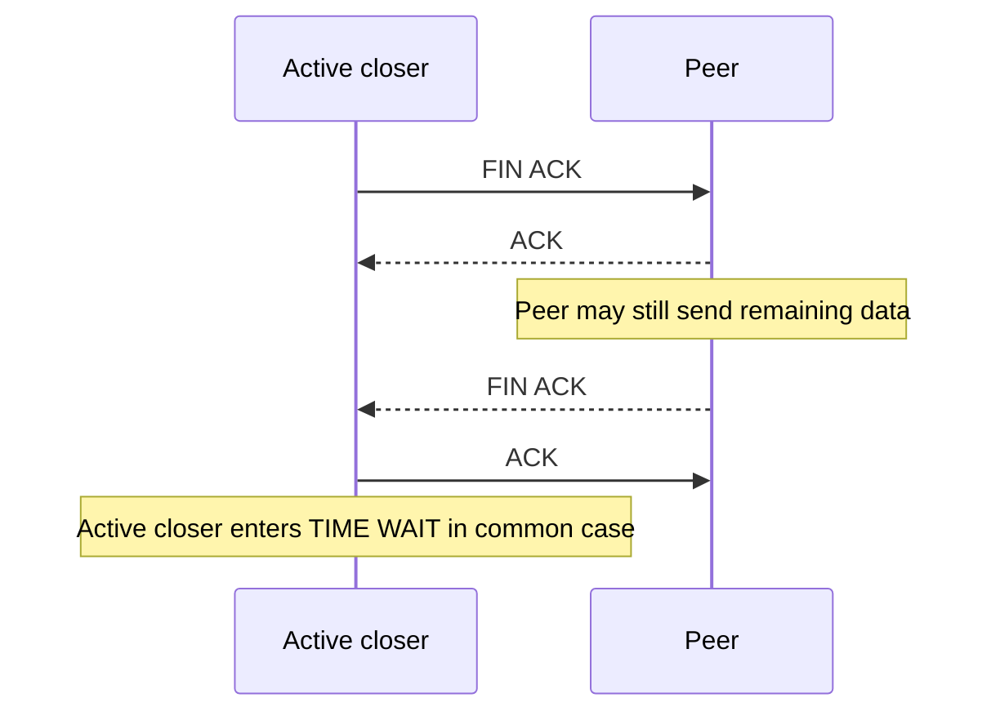

An RST is abortive. It can follow an attempt to connect to a non-listening port, an application abort, policy device action, timeout/state expiration in a middlebox, data on an invalid socket state, or other conditions. A trace reveals who emitted the observed RST but not always which higher-level component intentionally caused it.

## 11. TCP states

The standard state machine includes LISTEN, SYN-SENT, SYN-RECEIVED, ESTABLISHED, FIN-WAIT-1, FIN-WAIT-2, CLOSE-WAIT, CLOSING, LAST-ACK, TIME-WAIT, and CLOSED. Tools use spelling variants such as `SYN_SENT`, `TIME_WAIT`, or `TIME-WAIT`.

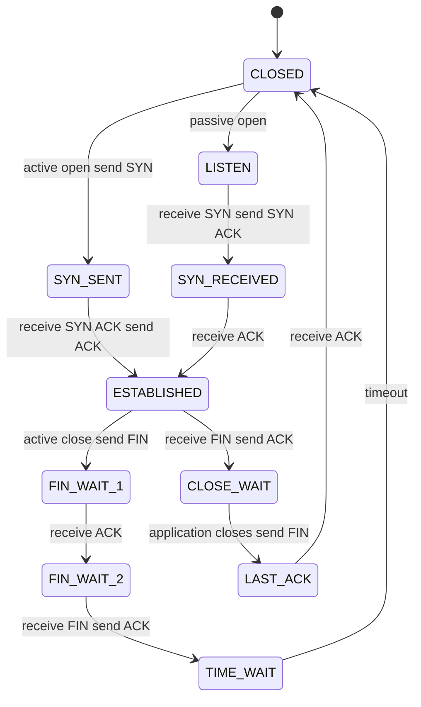

| State | Plain meaning | Healthy/transient context | Concern pattern |
|---|---|---|---|
| LISTEN | Local TCP endpoint awaits opens | Server readiness | Wrong address/port/process or missing listener |
| SYN-SENT | Active opener sent SYN | Very brief during connect | Many persistent entries suggest no handshake response |
| SYN-RECEIVED | SYN seen; SYN-ACK sent; final ACK pending | Brief server state | Backlog/path/attack/capture context needed |
| ESTABLISHED | Handshake complete; data can flow | Normal active connection | Long-lived idle may be pooling or leak; app evidence needed |
| FIN-WAIT-1 | Local side sent FIN, awaits ACK/FIN progress | Brief teardown | Persistence suggests peer/path issue |
| FIN-WAIT-2 | Local FIN acknowledged; awaiting peer FIN | Can persist by implementation | Peer/application not closing |
| CLOSE-WAIT | Peer sent FIN; local TCP acknowledged; local app has not closed | Brief while app cleans up | Many persistent entries often indicate local app close handling issue |
| LAST-ACK | Local app sent FIN after peer close; awaits ACK | Brief teardown | Persistent path/peer issue |
| TIME-WAIT | Closed flow retained to handle delayed segments/protect tuple reuse | Normal, often on active closer | Volume only matters with resource/port evidence |
| CLOSED | No connection state | Normal end/no socket | Tool may omit it |

## 🔍 Plain-English deep-dive: TIME_WAIT is protective bookkeeping, not automatically a leak

TIME_WAIT lets the endpoint handle delayed duplicate segments and ensure the final acknowledgment can be retransmitted if necessary before an identical tuple is reused. It commonly appears on the active closer. Exact duration is implementation-specific and related conceptually to twice the Maximum Segment Lifetime (2MSL).

Think of keeping a completed shipping reference reserved briefly so a delayed box is not assigned to a new order. The analogy stops because TCP protects sequence-space and connection-tuple semantics rather than packages.

Many TIME_WAIT sockets can be normal for short-lived connections. Investigate connection reuse, pooling, request rate, ephemeral-port range, NAT limits, and actual resource failures before tuning. Do not recommend registry/sysctl changes from a count alone.

## 12. CLOSE_WAIT and ownership

CLOSE_WAIT means the local stack received a FIN and acknowledged it; the local application has not yet closed its socket. A few brief entries are normal. A growing persistent collection associated with one process can support an application lifecycle/leak hypothesis. It is not normally fixed by changing the network.

| State pattern | Likely next owner | Evidence to include | Avoid |
|---|---|---|---|
| Persistent CLOSE_WAIT in one process | Application/runtime owner | PID, count trend, tuple aliases, app logs, UTC | Killing production process without plan |
| Many SYN-SENT to one destination | Path/service/policy owners | retransmission timing, route, server-side observation | Declaring firewall from silence |
| Repeated immediate RST from server IP | Service/listener/policy owner | sender, flags, exact port, service state | Calling timeout |
| TIME_WAIT plus address-in-use failures | App/OS/NAT design owner | rates, port range, reuse/pooling, exact error | Blind timeout reduction |
| FIN-WAIT-2 growth | Peer/app close path | duration, process, peer behavior | Treating all close states as loss |

## 13. Refused versus timeout versus reset

**Connection refused** commonly means the opening SYN reached a host/device that actively rejected it, often with RST-ACK, or the local stack immediately knew no suitable endpoint existed. **Timeout** means an operation did not complete before a deadline; during connect it often appears as repeated SYN without response, but application/TLS/read timeouts occur later. **Connection reset** means established or opening state was aborted with RST; “reset by peer” names the observed network peer from the socket perspective, which may be a proxy.

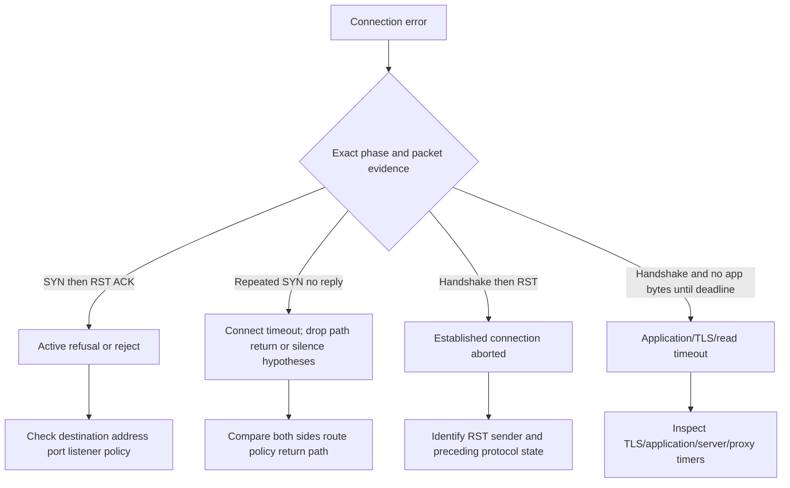

| User wording | Required clarification | Useful evidence | Causal restraint |
|---|---|---|---|
| “Port closed” | Local listener absent or remote refusal? | Listener table and SYN/RST | A scan-like result is not required |
| “Timed out” | DNS, connect, TLS, read, operation, or overall? | Phase timestamps and flags/status | Timeout does not name firewall |
| “Reset by peer” | Which peer: origin, proxy, load balancer? | Tuple, RST source, TLS/HTTP preceding bytes | RST source address may be translated/spoofed/device-generated |
| “Connection dropped” | FIN graceful or RST abort, idle timer, app close? | State timeline and owner logs | User language is not packet semantics |

## 14. UDP datagrams and ICMP feedback

UDP provides a minimal datagram service. It has source/destination ports, length, and checksum; it does not create a TCP-like handshake, ordered byte stream, acknowledgment, retransmission, or congestion control. Applications using UDP must define needed reliability, ordering, retry, security, and congestion behavior.

Sending a UDP datagram successfully from an API usually means the local stack accepted it, not that a remote application received it. An ICMP Destination Unreachable/Port Unreachable can provide negative evidence. Firewalls may drop either UDP or ICMP; absence of ICMP does not prove an open port or delivered datagram.

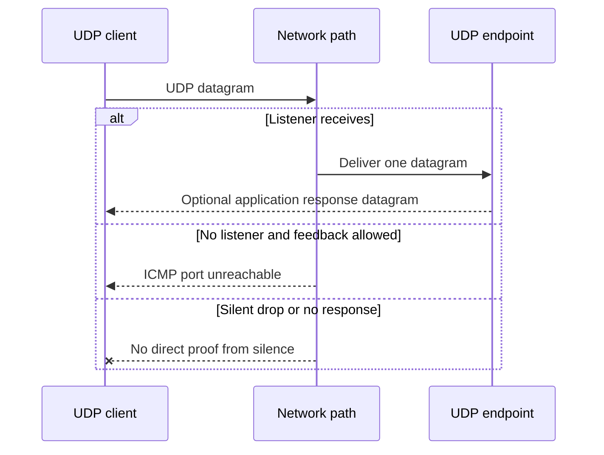

| TCP | UDP | Support implication |
|---|---|---|
| Connection state/handshake | No TCP-like connection handshake | No SYN does not mean broken UDP |
| Ordered byte stream | Message-preserving datagrams | Datagram boundary matters |
| Built-in retransmission | Application/protocol decides | DNS/QUIC implement behavior above UDP |
| Flow/congestion control in TCP | Not supplied by base UDP | Responsible applications add congestion control |
| FIN/RST teardown | No equivalent connection teardown | NAT/policy state may still expire |
| Listener and accepted sockets | Bound UDP endpoint receives datagrams | Tool state often shows UNCONN/bound endpoint |

## 15. QUIC at a high level

QUIC is a secure transport standardized over UDP. It integrates TLS 1.3 handshake protection, supports multiple streams without TCP's cross-stream head-of-line blocking, uses connection IDs to help survive address/path changes, and includes reliability and congestion control. HTTP/3 maps HTTP semantics over QUIC.

Calling QUIC “UDP, therefore unreliable” is wrong. UDP is the substrate; QUIC implements transport reliability/security. UDP 443 reachability alone does not prove QUIC handshake or HTTP/3 success. Middleboxes can block or mishandle UDP, and clients may fall back to TCP-based HTTP versions depending on implementation/policy.

| QUIC concept | Plain meaning | Troubleshooting clue | Boundary |
|---|---|---|---|
| UDP substrate | QUIC packets ride UDP datagrams | Firewall/NAT UDP policy matters | UDP send is not QUIC success |
| Integrated TLS 1.3 | Cryptographic handshake is part of QUIC | Metadata is more encrypted than classic TCP/TLS | Certificate/identity still matters |
| Connection ID | Identifies QUIC connection beyond tuple alone | Path migration/NAT rebinding support | Privacy and implementation rules apply |
| Streams | Multiple ordered streams in one connection | One stream loss need not block all others | App/HTTP/3 mapping matters |
| Reliability/congestion | QUIC acknowledges/retransmits/adapts | Packet-number/ACK analysis differs from TCP | Use current QUIC-capable tooling |
| HTTP/3 | HTTP over QUIC | Browser may use UDP 443 | Fallback can hide UDP issue |

## 🔍 Plain-English deep-dive: UDP is a foundation; QUIC builds the missing floors

Base UDP is like sending individually addressed postcards without a built-in receipt, ordering system, or secure envelope. QUIC uses that delivery interface but adds its own numbered packets, acknowledgments, loss recovery, congestion control, encryption, and streams. The analogy stops because QUIC cryptography and transport state are tightly integrated and far more sophisticated than postal add-ons.

For support, identify the actual protocol. A browser reaching HTTPS may use HTTP/3 over QUIC or HTTP/2 over TCP/TLS. A capture of UDP 443 plus application protocol evidence can support QUIC; the port alone cannot.

## 16. Windows and Linux transport evidence

| Goal | Windows | Linux | Caution |
|---|---|---|---|
| List TCP state | `Get-NetTCPConnection` | `ss -tan` | Output can expose internal/public endpoints |
| Filter listener | `Get-NetTCPConnection -State Listen` | `ss -ltn` | Listener is local readiness only |
| UDP endpoints | `Get-NetUDPEndpoint` | `ss -uan` | UDP lacks TCP connection state |
| Map PID | `Get-NetTCPConnection ...` plus `Get-Process -Id` | `ss -ltnp` when permitted | Process details may require privileges and expose data |
| Legacy overview | `netstat -ano` | `netstat` if installed | `ss` is generally preferred on modern Linux |
| Route/context | `Get-NetRoute` | `ip route get` | Route is separate from socket state |

Do not paste full unfiltered socket tables into a ticket. Filter by owned local lab port, process, time, and approved endpoint. On shared systems, process names, local ports, remote services, users, containers, and internal addresses are sensitive operational data.

## 17. Worked examples

### Example A: Local refusal

A client sends SYN to `127.0.0.1:8075` where no process listens. The local stack returns RST-ACK immediately. This is an active refusal at the local host. It says nothing about Internet routing or a remote firewall.

### Example B: TCP established, TLS fails

The handshake completes to remote 443, then the client emits a TLS alert due to hostname mismatch. Transport succeeded. The correct owner path involves requested hostname, SNI, certificate SAN, DNS/edge/proxy, and trust policy. Reopening the port is not the fix; disabling validation is unsafe.

### Example C: SMTP connection works, recipient rejected

TCP to mail exchanger port 25 establishes. Server greeting and EHLO succeed. `RCPT TO` receives SMTP 550. The transport path worked; the exact SMTP reply and enhanced status route the investigation to recipient/domain/policy/application evidence. “Port 25 open” never guaranteed delivery.

### Example D: Growing CLOSE_WAIT

A connector process has 2,000 persistent CLOSE_WAIT entries. Peer FINs arrived and the local TCP stack acknowledged them; the application has not closed sockets. Correlate PID/version/request rate/errors and reproduce safely. This supports an application lifecycle issue more strongly than a firewall issue, but code/runtime evidence is needed before root cause.

| Example | Last proven checkpoint | First observed failed boundary | Owner candidate | Key caveat |
|---|---|---|---|---|
| Local refusal | Local route/stack | No listener on port | Local service/config | Only localhost case |
| TLS hostname mismatch | TCP established | TLS peer identity validation | Service/DNS/proxy/cert | Never bypass validation |
| SMTP 550 | TCP and SMTP command exchange | Recipient/policy decision | Mail owner | Message delivery is later |
| CLOSE_WAIT growth | Peer close reached local stack | Local app did not close | App/runtime | Brief CLOSE_WAIT is normal |

## 18. Troubleshooting decision tree

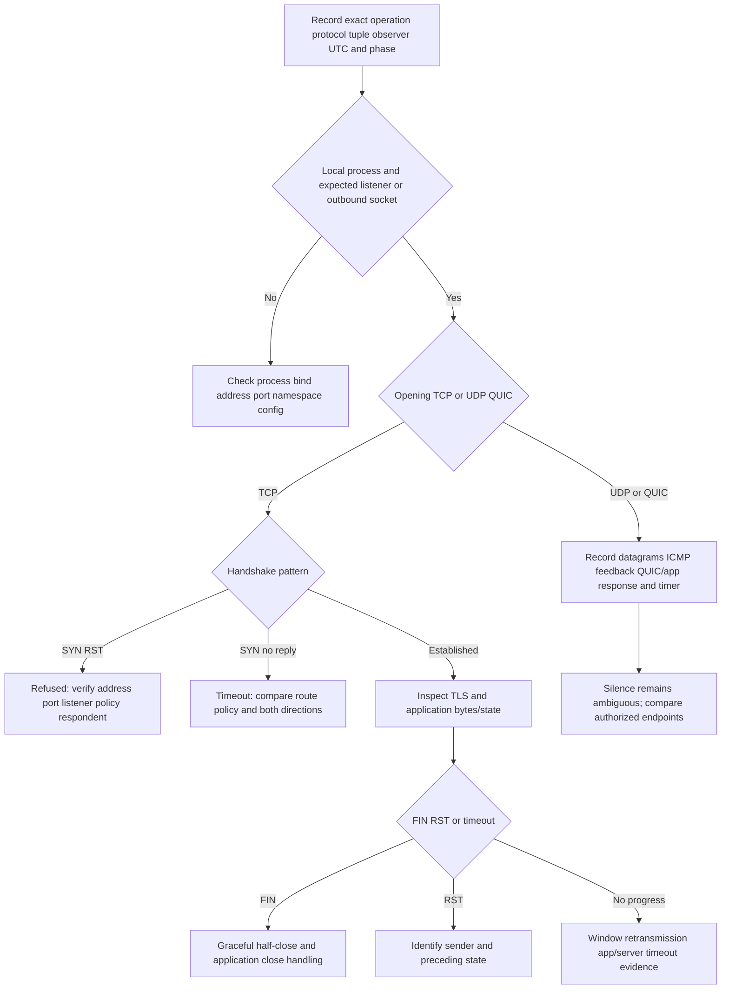

## 19. Failure modes and escalation package

| Failure/shortcut | Why misleading/risky | Better practice |
|---|---|---|
| “Port 443 is HTTPS and healthy” | Assignment/listener does not prove protocol/app | Validate handshake, TLS, HTTP, identity, operation |
| “ESTABLISHED means request succeeded” | TCP state precedes app semantics | Correlate TLS/HTTP/request ID |
| “Timeout means firewall” | Silence has many causes | Compare route, retransmissions, both endpoints, policy logs |
| “RST means server application bug” | Host/proxy/firewall can generate reset | Identify observed sender and preceding state |
| “TIME_WAIT is a leak” | It is normal protection | Prove resource/port impact and workload pattern |
| “CLOSE_WAIT is network delay” | Local app has not closed after peer FIN | Correlate process/socket lifecycle |
| “UDP send succeeded, so delivered” | Local acceptance is not remote receipt | Require app response/ICMP/remote evidence |
| “QUIC is unreliable UDP” | QUIC adds reliable secure transport | Analyze actual QUIC/HTTP3 behavior |
| Broad socket dump/pcap | Exposes services, IPs, users, content | Scope/filter/redact/delete |
| Tuning TCP timers/port range first | Changes baseline and may create risk | Diagnose workload/path/app first; approved change only |

### Escalation package

| Field | Minimum evidence | Privacy/causation boundary |
|---|---|---|
| Impact | Operation, population, start/frequency/workaround | No payload/content |
| Process | App/runtime/version/PID alias/namespace | Minimize process/user data |
| Tuple | Protocol and aliased original/translated endpoints | Protect real IP/ports where needed |
| Observer | Client/server/proxy/capture interface | Perspective controls direction |
| Timeline | DNS, SYN, handshake, TLS/app, FIN/RST, timeout UTC | Note clock/capture limitations |
| State | Listener and connection-state snapshots/trend | State is observation, not cause |
| Flags/sequence | Key SYN/ACK/FIN/RST/retransmission summary | Avoid raw content |
| App correlation | TLS name, HTTP/SMTP status, request/message ID | Remove secrets/body |
| Hypotheses/tests | Predictions and outcomes | Keep alternatives alive |
| Ask | Exact listener/path/proxy/app decision requested | No unauthorized tuning |

## Safe local lab: The Socket State Theatre 074

### Prerequisites

- The learner's own Windows or Linux workstation and authorization to inspect loopback sockets.
- Python 3 already installed, or an equivalent learner-owned loopback development server. Do not install software just for this lab.
- PowerShell with `Get-NetTCPConnection`/`netstat` or Linux `ss`; `curl`/`curl.exe` optional.
- Empty local directory with harmless file `socket-074.txt` containing `CASE-074 loopback only`.
- Ports 8074 and 8075 are selected as unprivileged lab ports; verify 8074 is unused before starting. If occupied, choose another private lab port and record it.
- No firewall, registry, sysctl, ephemeral-range, proxy, route, TLS, or endpoint-security changes.
- Artifact label: **local lab - loopback TCP socket metadata and harmless synthetic HTTP only**.

### Lab procedure

1. Record start UTC, OS, shell, selected ports, and loopback-only/no-change statement.
2. Before starting a server, verify no listener exists on 8074.

   **Windows:**

   ```powershell
   Get-NetTCPConnection -LocalPort 8074 -ErrorAction SilentlyContinue
   ```

   **Linux:**

   ```bash
   ss -ltn 'sport = :8074'
   ```

3. Start Python's development server bound only to IPv4 loopback from the harmless directory:

   **Windows:** `py -3 -m http.server 8074 --bind 127.0.0.1`

   **Linux:** `python3 -m http.server 8074 --bind 127.0.0.1`

4. The explicit stop action is `Ctrl+C`. Never bind to `0.0.0.0` or a LAN address.
5. Record the filtered listener and owning process identifier if permitted.

   **Windows:**

   ```powershell
   Get-NetTCPConnection -LocalAddress 127.0.0.1 -LocalPort 8074 -State Listen
   ```

   **Linux:**

   ```bash
   ss -ltnp 'sport = :8074'
   ```

   If process output requires privilege, omit `-p`; do not elevate solely for the lab.
6. Request the harmless file with a bounded client:

   **Windows:**

   ```powershell
   curl.exe --verbose --max-time 5 http://127.0.0.1:8074/socket-074.txt
   ```

   **Linux:**

   ```bash
   curl --verbose --max-time 5 http://127.0.0.1:8074/socket-074.txt
   ```

7. During/repeated immediately after one request, run a port-filtered state command. Short-lived ESTABLISHED/TIME_WAIT states may disappear; record the actual result rather than looping aggressively.

   **Windows:** `Get-NetTCPConnection | Where-Object {$_.LocalPort -eq 8074 -or $_.RemotePort -eq 8074}`

   **Linux:** `ss -tan 'sport = :8074 or dport = :8074'`
8. Build a five-tuple row from the observed loopback connection, replacing the ephemeral port with `EPHEMERAL-074` in shared work.
9. Make one negative connection attempt to unused loopback port 8075 with a two-second maximum. Record exact refusal wording/timing. Do not retry repeatedly.

   `curl.exe --verbose --max-time 2 http://127.0.0.1:8075/` or Linux `curl` equivalent.
10. Explain why this local refusal is not a model for every remote timeout and does not test a firewall, DNS, TLS, or cloud service.
11. Create a paper TCP handshake with client initial sequence 1000 and server 5000; show SYN sequence consumption and the next two acknowledgments.
12. Add a 1,000-byte client data segment and correct server ACK. Then create one lost-segment/retransmission sequence.
13. Draw a graceful FIN close and an alternative RST abort. Label active closer and TIME_WAIT as conceptual/implementation-dependent duration.
14. Create a state/owner worksheet for LISTEN, SYN-SENT, ESTABLISHED, CLOSE-WAIT, FIN-WAIT-2, LAST-ACK, and TIME-WAIT.
15. Create a paper UDP scenario with one datagram, optional response, ICMP port unreachable, and silent drop; state what each proves.
16. Create a paper QUIC scenario over UDP 443 and list evidence needed beyond the port.
17. Stop the server with `Ctrl+C`, verify the 8074 listener is gone, and record end UTC.

### Expected evidence

- Loopback-only listener with local address, port, state, and optional process alias.
- One successful harmless HTTP request over TCP and one local unused-port refusal.
- One observed or reconstructed five-tuple with ephemeral client port.
- Clear distinction between listener, accepted connection, HTTP response, and product processing.
- Handshake sequence/ack worksheet with SYN consumption.
- Data acknowledgment and retransmission worksheet.
- FIN/RST teardown comparison and state/owner table.
- UDP/ICMP and QUIC paper cases.
- Exact statement that refusal, timeout, and reset are different observations.
- 90-second spoken answer on TIME_WAIT/CLOSE_WAIT and honest experience boundary.

### Cleanup and privacy

- Stop Python/local server with `Ctrl+C` and verify no 8074 listener remains.
- Delete `socket-074.txt` and the lab directory after retaining only minimized notes.
- Close/delete raw socket output that exposes usernames, processes, unrelated endpoints, VPNs, or public/private addresses.
- No packet capture is required. If an authorized loopback capture was independently used, stop immediately and delete it after extracting metadata.
- Do not alter firewall, TCP settings, registry, sysctl, ephemeral range, port reservations, proxy, route, or security software.
- Record: `Socket State Theatre 074 completed on loopback; server stopped, listener verified absent, no credential, third-party probe, production content, or security change used.`

### Validation rubric

| Dimension | Fail | Developing | Pass |
|---|---|---|---|
| Socket model | Calls socket a port | Names endpoint | Distinguishes listener, accepted socket, tuple, process, namespace |
| Handshake | Says “connects” | Lists SYN sequence | Correct SYN/SYN-ACK/ACK and sequence consumption |
| Stream | Treats packets as requests | Knows sequence/ACK | Explains byte stream, windows, retransmission/capture caveats |
| States | Calls TIME_WAIT error | Names common states | Maps states to local/peer/app ownership and duration caveat |
| Errors | Merges refused/reset/timeout | Distinguishes two | Identifies phase, flags, reporter, alternatives |
| UDP/QUIC | Calls UDP unreliable and stops | Knows datagram | Explains ICMP/silence and QUIC reliability/security over UDP |
| Safety | Binds publicly/leaves server | Uses loopback | Stops/verifies/deletes and changes no controls |
| Honesty | Claims packet expert | Says learning | States working familiarity and production-transfer boundary |

## Official Source Anchors - August 24, 2026

| Official or primary source | Topic anchored | Boundary |
|---|---|---|
| [RFC 9293 - Transmission Control Protocol](https://www.rfc-editor.org/rfc/rfc9293.html) | Current TCP functional specification/state behavior | Implementations and extensions vary |
| [RFC 7323 - TCP Extensions for High Performance](https://www.rfc-editor.org/rfc/rfc7323.html) | Window scaling/timestamps | Check current updates/implementation |
| [RFC 2018 - TCP Selective Acknowledgment Options](https://www.rfc-editor.org/rfc/rfc2018.html) | SACK foundation | Negotiation/capture context required |
| [RFC 5681 - TCP Congestion Control](https://www.rfc-editor.org/rfc/rfc5681.html) | Core congestion concepts | Newer algorithms/updates exist |
| [RFC 768 - User Datagram Protocol](https://www.rfc-editor.org/rfc/rfc768.html) | UDP datagram service | Application adds needed behavior |
| [RFC 1122 - Requirements for Internet Hosts](https://www.rfc-editor.org/rfc/rfc1122.html) | Host transport requirements | Updated by later RFCs |
| [RFC 9000 - QUIC Transport Protocol](https://www.rfc-editor.org/rfc/rfc9000.html) | QUIC transport, streams, connection IDs | Use related TLS/loss RFCs too |
| [RFC 9001 - Using TLS to Secure QUIC](https://www.rfc-editor.org/rfc/rfc9001.html) | QUIC TLS integration | TLS 1.3 and QUIC-specific mapping |
| [RFC 9002 - QUIC Loss Detection and Congestion Control](https://www.rfc-editor.org/rfc/rfc9002.html) | QUIC reliability/congestion | Implementation can evolve within spec |
| [RFC 9114 - HTTP/3](https://www.rfc-editor.org/rfc/rfc9114.html) | HTTP over QUIC | Client fallback/Alt-Svc behavior varies |
| [IANA Service Name and Transport Protocol Port Number Registry](https://www.iana.org/assignments/service-names-port-numbers/service-names-port-numbers.xhtml) | Current port ranges/assignments | Assignment is not runtime identity proof |
| [Microsoft Learn - Get-NetTCPConnection](https://learn.microsoft.com/en-us/powershell/module/nettcpip/get-nettcpconnection) | Windows TCP state inspection | Filter/minimize sensitive output |
| [Microsoft Learn - Get-NetUDPEndpoint](https://learn.microsoft.com/en-us/powershell/module/nettcpip/get-netudpendpoint) | Windows UDP endpoint inspection | UDP has no TCP state machine |
| [Microsoft Learn - netstat](https://learn.microsoft.com/en-us/windows-server/administration/windows-commands/netstat) | Windows connection/listener command | Output can expose topology/processes |
| [Linux ss manual](https://man7.org/linux/man-pages/man8/ss.8.html) | Linux socket inspection/filter syntax | Version/privileges/namespaces vary |
| [Python documentation - http.server](https://docs.python.org/3/library/http.server.html) | Local lab server | Development only, not production |

### Source-use discipline

- Check RFC Editor update/obsolescence metadata and IANA's live port registry.
- Record protocol, full tuple, direction, observer, process/namespace, UTC, and phase.
- Treat Wireshark/expert retransmission labels as heuristics requiring capture completeness.
- Never expose full socket tables or captures when one filtered row/timeline is enough.
- Never tune TCP timers, ephemeral ports, registry/sysctl, firewall, or security controls during baseline collection.
- Verify vendor ports/protocols/timeouts only through current approved documentation.

## Likely Interview Questions

### Q1. What is a socket, and what is the five-tuple?

**Model answer:** A socket is an OS communication object bound to networking state. A flow's five-tuple is source IP, source port, destination IP, destination port, and transport protocol. I also record direction, observer, process, namespace, UTC, NAT/proxy transformations, and application IDs because the same logical request can have different tuples at different boundaries.

### Q2. Explain the TCP three-way handshake.

**Model answer:** The client sends SYN with an initial sequence number; the listener replies SYN-ACK, acknowledging that SYN and supplying its own sequence; the client ACKs the server SYN. SYN consumes one sequence number. Completion proves TCP establishment for that tuple, not TLS, HTTP, authorization, SMTP delivery, or backend processing.

### Q3. What do TCP sequence and acknowledgment numbers mean?

**Model answer:** Sequence numbers locate bytes in the stream; the acknowledgment normally identifies the next in-order byte expected and is cumulative. SYN and FIN consume sequence space. Tools often display relative values. Retransmission/duplicate-ACK labels require both-direction timing and capture completeness before causal conclusions.

### Q4. What is the difference between refusal, timeout, and reset?

**Model answer:** An opening SYN followed by RST commonly indicates active refusal/reject. Repeated SYN without reply until the connect deadline is a timeout with multiple path/service hypotheses. A reset aborts connection state, often after establishment but sometimes during open. I identify phase, RST sender/peer, prior protocol state, and both-side evidence rather than assigning firewall or application cause immediately.

### Q5. Explain TIME_WAIT and CLOSE_WAIT.

**Model answer:** TIME_WAIT is protective bookkeeping, commonly on the active closer, handling delayed segments/final-ACK reliability before tuple reuse; many entries can be normal. CLOSE_WAIT means the local stack received/ACKed peer FIN while the local application has not closed. Persistent growth in one process supports an application lifecycle investigation.

### Q6. What does an ESTABLISHED connection prove?

**Model answer:** It proves the TCP handshake completed and the local stack considers the connection established at that observation time. It does not prove TLS identity, HTTP/SMTP success, authentication, data persistence, or a product workflow. I correlate the next protocol checkpoint and request/message ID.

### Q7. How do UDP and QUIC relate?

**Model answer:** UDP provides independent datagrams without TCP's handshake, ordering, retransmission, or flow/congestion controls. QUIC uses UDP as a substrate but adds secure TLS 1.3-integrated transport, acknowledgments, loss recovery, congestion control, connection IDs, and streams; HTTP/3 runs over QUIC. UDP 443 alone does not prove QUIC or HTTP/3 success.

### Q8. How do you position your transport troubleshooting experience?

**Model answer:** I have working familiarity with socket/tuple/state evidence, TCP handshake/teardown, UDP/ICMP, QUIC concepts, and filtered Windows/Linux tools, reinforced in local labs. My production depth is enterprise support investigation and escalation, not kernel networking or firewall ownership. I would provide precise evidence to the owning team.

## Memory Hooks

- **Socket is an OS object; port is one field; tuple identifies a flow.**
- **Five tuple: source IP/port, destination IP/port, protocol.**
- **Ephemeral source ports are selected from OS-configured ranges.**
- **SYN, SYN-ACK, ACK; SYN consumes one sequence.**
- **ACK means next byte expected, not app completed.**
- **TCP is an ordered byte stream, not message packets.**
- **FIN is graceful half-close; RST aborts.**
- **TIME_WAIT protects; CLOSE_WAIT waits for the local app.**
- **Refused replies; timeout waits; reset aborts.**
- **Silence does not prove a UDP port is open.**
- **QUIC builds secure reliable transport over UDP.**
- **Listener is local readiness, not remote SaaS health.**

## Completion Checklist

- [ ] I can define endpoint, socket, listener, accepted socket, connection, port, and namespace.
- [ ] I can state and reverse the five-tuple and explain NAT/proxy tuple changes.
- [ ] I know IANA port ranges and do not treat assignment as process identity.
- [ ] I can explain ephemeral ports without assuming one universal OS range.
- [ ] I can narrate SYN/SYN-ACK/ACK with sequence and acknowledgment values.
- [ ] I can explain byte-stream boundaries, receive windows, scaling, flow versus congestion control.
- [ ] I can interpret retransmission/duplicate-ACK labels with capture caveats.
- [ ] I can explain SYN, ACK, FIN, RST, PSH, URG, ECE, and CWR at support depth.
- [ ] I can map LISTEN through TIME_WAIT/CLOSED and identify local ownership.
- [ ] I can distinguish refusal, connect timeout, read timeout, and reset.
- [ ] I can explain UDP datagrams, ICMP feedback, silence, and NAT state.
- [ ] I can explain why QUIC over UDP is not “unreliable HTTP.”
- [ ] I completed or can explain **The Socket State Theatre 074**.
- [ ] I bound only to loopback, stopped the server, verified listener removal, and deleted the file.
- [ ] I made no firewall/TCP/registry/sysctl/route/proxy/security change and probed no third party.
- [ ] I can answer exactly Q1–Q8 aloud with honest ownership boundaries.
- [ ] I checked Official Source Anchors dated August 24, 2026.

[Next: Part 075 - TLS SSL Certificates SNI and Mutual TLS](Part-075-tls-ssl-certificates-sni-and-mutual-tls.md)