# Part 075 - TLS SSL Certificates SNI and Mutual TLS

> **Purpose:** Diagnose protected service identity and negotiation failures without weakening certificate validation or exposing private keys, tokens, or customer data.
>
> **Artifact label:** Learned architecture plus public read-only certificate-metadata lab. No trust store, certificate, proxy, or security policy is changed.
>
> **Currency and source access date:** August 24, 2026.

## Section goal

By the end of this Part, Arti should be able to use the current term **Transport Layer Security (TLS)** rather than calling modern connections “SSL,” while recognizing that product settings and errors may retain legacy Secure Sockets Layer (SSL) wording. She should be able to explain TLS confidentiality, integrity, and peer authentication; narrate ClientHello and ServerHello negotiation at a high level; distinguish protocol versions, cipher suites, key agreement, signatures, and record protection; and identify what TLS does not prove about application authorization or business processing.

She should be able to read an X.509 certificate chain containing leaf, intermediate, and root/trust anchor roles; distinguish issuer, subject, Subject Alternative Name (SAN), validity time, signature, public key, Key Usage, Extended Key Usage (EKU), and revocation mechanisms; and explain hostname validation. She should understand Server Name Indication (SNI), Application-Layer Protocol Negotiation (ALPN), session resumption, enterprise TLS inspection, and mutual TLS (mTLS) client-certificate authentication.

The support goal is to isolate a SaaS/API/email connection at the TLS boundary. A successful TCP handshake with a failed certificate check means route/transport worked for that attempt but protected peer identity did not validate. A successful TLS handshake proves negotiated protection and validated identity according to the client context; it does not prove an OAuth scope, tenant role, HTTP request, SMTP recipient, or asynchronous product action succeeded.

## JD Mapping

| Supplied role signal | Capability developed | SaaS/API/email example | Proof artifact |
|---|---|---|---|
| Complex investigations | Separates TCP, TLS negotiation, chain, name, time, policy, and application identity | Connector says “SSL error” | TLS evidence ladder |
| API support | Reads HTTPS certificate/SNI/ALPN and distinguishes 401/403 after TLS | API mTLS handshake fails before HTTP | Handshake worksheet |
| Cloud Email Security | Understands HTTPS and SMTP STARTTLS identity/trust boundaries | Mail connector certificate mismatch | Certificate validation matrix |
| SaaS Security | Handles enterprise inspection and client-certificate identity safely | SaaS collector behind proxy | Two-session topology |
| Windows/Linux tools | Uses `curl` and `openssl s_client` without bypassing validation | Cross-platform comparison | Read-only transcript |
| Customer trust | Explains validation failure without recommending insecure workaround | Precise remediation boundary | Customer-safe update |
| Engineering escalation | Supplies requested name, SNI, peer chain, validation result, version, ALPN, UTC, request ID | Reproducible TLS failure | Escalation packet |
| Security/privacy | Never requests private keys or exports credentials; minimizes cert/internal-name data | Safe evidence collection | Redaction checklist |
| Continuous learning | Uses TLS/X.509/hostname RFCs and official OpenSSL/curl/Microsoft docs | Current protocol reasoning | Source ledger |
| Honest positioning | Frames TLS analysis as working familiarity, not PKI administration ownership | Interview answer | Honesty statement |

## Candidate honesty note

Arti can accurately describe TLS, certificate, SNI, ALPN, mTLS, `curl`, OpenSSL, browser evidence, and trust-store comparison as **working familiarity supported by safe labs**. Her production transfer is enterprise Microsoft support: diagnosing client/cloud boundaries, collecting logs, coordinating identity/network/product owners, communicating risk, escalating to Engineering, and validating fixes. She should not claim to have designed enterprise public key infrastructure (PKI), operated a certificate authority (CA), managed production private keys, configured Abnormal's TLS endpoints, or owned enterprise inspection policy.

| Evidence tier | Safe claim | Boundary |
|---|---|---|
| Production transfer | Microsoft SaaS support, evidence preservation, escalation, validation | Not PKI/network-security ownership |
| Working familiarity | TLS negotiation and certificate-chain/name/trust analysis | Not cryptographic implementation expertise |
| Public lab | Read-only metadata from `example.com` using normal validation | Not customer endpoint proof |
| Learned architecture | TLS 1.2/1.3, resumption, inspection, mTLS | Deployment/version/policy varies |
| Unknown | Abnormal endpoint chains, TLS versions, ALPN, inspection guidance, mTLS requirements | Verify approved current docs |

## 1. TLS, not SSL

SSL was the predecessor family to TLS. SSL 2.0 and SSL 3.0 are obsolete and insecure. Current protected web/API discussions should say TLS. A UI label such as “SSL certificate,” environment variable like `SSL_CERT_FILE`, or error text may use SSL historically; explain the exact protocol/version rather than correcting vocabulary without context.

An analogy is calling all modern smartphones “cell phones from the 1990s.” People understand the category, but the technology generation matters for security and compatibility. The analogy stops because TLS versions are formal protocol specifications with negotiated cryptographic behavior.

| Term | Correct support use | Avoid |
|---|---|---|
| TLS | Current protocol family securing transport/application exchanges | “SSL/TLS are identical versions” |
| SSL | Historical predecessor or legacy product label | Enabling obsolete SSL to fix compatibility |
| HTTPS | HTTP semantics over TLS (commonly TCP; HTTP/3 uses QUIC/TLS integration) | Treating port 443 as proof of HTTPS |
| STARTTLS | Application protocol command upgrades an existing plaintext connection to TLS | Assuming implicit TLS and STARTTLS are the same flow |
| PKI | People, policy, CAs, certificates, keys, revocation, trust operations | Equating PKI only with certificates |
| X.509 certificate | Signed structure binding identity attributes to a public key under rules | Calling it encryption by itself |

## 2. What TLS provides and what it does not

TLS aims to provide confidentiality against passive reading, integrity/authenticity of protected records, and authentication of the server (and optionally the client) according to certificate/pre-shared-key context. Security depends on correct validation, trusted keys, sound endpoints, current algorithms, and safe application use.

TLS does not make a malicious website trustworthy, prove an API operation is authorized, protect data after an endpoint decrypts it, guarantee availability, or validate every claim in an application response. A valid certificate says a trusted issuance/validation process bound the certificate's public key to names/attributes under policy; it does not certify business legitimacy or safe content.

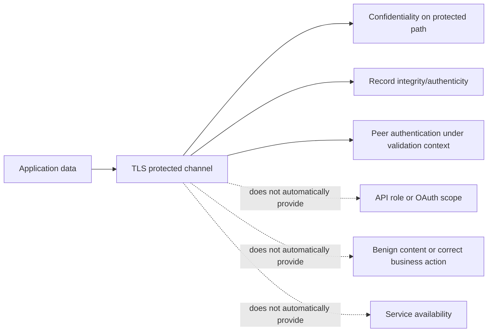

### Security-property matrix

| Question | TLS contribution | Additional evidence |
|---|---|---|
| Is traffic protected from passive observers on this segment? | Negotiated encryption/integrity after handshake | Endpoint and inspection boundaries |
| Did client validate intended server name? | Certificate/SAN/chain/hostname algorithm | Requested name, SNI, client trust/policy |
| Is caller allowed to read tenant data? | Optional client authentication only | OAuth/token/role/scope/resource policy |
| Did API persist the event? | No | HTTP semantics, request ID, backend/audit state |
| Is email authentic/safe? | Protects one hop when used | SPF/DKIM/DMARC/content/behavior and mail path |
| Is endpoint uncompromised? | No | Endpoint/security telemetry and controls |

## 3. TLS sits between transport and application evidence

In common HTTPS over TCP, DNS selects an address, TCP establishes a byte stream, TLS negotiates protection and peer identity, then HTTP is exchanged inside the protected channel. With HTTP/3, QUIC over UDP integrates TLS 1.3 differently, but the identity/protection boundary remains important.

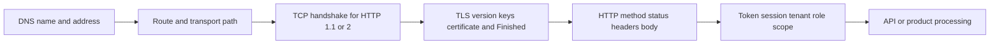

| Last evidence | What is proven | What remains unproven |
|---|---|---|
| DNS answer | Resolver returned candidate address | Route, transport, identity |
| TCP established | Transport handshake completed | TLS version/name/trust |
| Server certificate received | Peer sent certificate data | Chain/name/time/policy validation success |
| TLS Finished verified | Handshake keys/transcript validated under negotiated context | HTTP/auth/business operation |
| HTTP 401 | Protected HTTP respondent challenges authentication | Correct credentials/authorization |
| HTTP 200 | That HTTP operation returned success semantics | Downstream async processing unless contract says so |

## 4. ClientHello

The TLS ClientHello begins negotiation. In TLS 1.3 it can carry supported protocol versions, random value, cipher suites, extensions such as SNI, ALPN protocols, supported groups, signature algorithms, key share, and session-resumption/pre-shared-key information. Exact fields vary by version and client.

Do not say the client “chooses the cipher.” The client offers supported choices; the server selects according to overlap and policy. In TLS 1.3, cipher-suite names cover authenticated encryption/hash aspects and no longer encode key exchange/authentication the same way TLS 1.2 suite names did.

| ClientHello item | Purpose | Failure clue | Privacy note |
|---|---|---|---|
| Supported versions | Offers TLS versions | No overlap/protocol-version alert | Version fingerprint can identify clients |
| Cipher suites | Offers record-protection algorithms | No shared cipher/policy | Meanings differ TLS 1.2 versus 1.3 |
| SNI | Names intended virtual server | Wrong/default cert or route | Usually visible in classic TLS 1.2/1.3 without ECH |
| ALPN | Offers application protocols such as `h2`/`http/1.1` | Protocol mismatch/no selection | Exact offers can fingerprint client |
| Supported groups/key share | Offers key-agreement groups/material | Handshake failure/policy | Never confuse public key share with private key |
| Signature algorithms | Offers certificate/handshake signature support | Incompatible certificate/signature | Client policy/version matters |
| Session ticket/PSK | Attempts resumption | Resume rejected/full handshake | Ticket is sensitive session material |

## 5. ServerHello and TLS 1.3 handshake

The server selects a version, cipher suite, and key-agreement parameters. In a typical certificate-authenticated TLS 1.3 handshake it sends ServerHello, encrypted extensions, certificate chain, CertificateVerify, and Finished. The client validates negotiation and certificate identity, verifies the server's signature over the handshake transcript, sends its Finished, and application data can follow. Exact message ordering/visibility differs with resumption and client authentication.

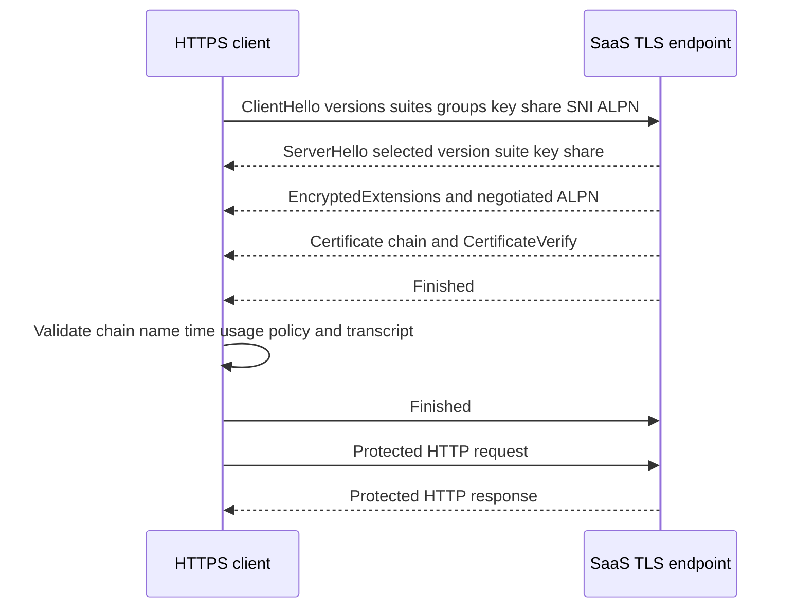

### TLS 1.2 versus TLS 1.3 at support depth

| Area | TLS 1.2 | TLS 1.3 | Support implication |
|---|---|---|---|
| Version negotiation | ClientHello/version and extensions depending implementation | `supported_versions` extension | Capture/tool displays differ |
| Cipher-suite meaning | Often encodes key exchange/auth/cipher/hash | Names AEAD cipher/hash; key exchange/signature separate | Do not read names with TLS 1.2 assumptions |
| Handshake privacy | More handshake metadata visible | Most server handshake after ServerHello encrypted | Certificate may not be visible to passive capture without keys |
| Legacy algorithms | Broader historical options | Removes obsolete constructions | Old client/server can fail overlap |
| Forward secrecy | Depends on selected ephemeral key exchange | Ephemeral (EC)DHE normal design | High-level claim only; inspect negotiated details |
| Resumption | Session IDs/tickets | PSK-based tickets; optional 0-RTT | Resumption changes visible messages |

## 🔍 Plain-English deep-dive: A handshake negotiates overlap; it does not “upgrade anything until it works”

Client and server each have supported versions, algorithms, groups, signature schemes, and policies. They find an acceptable intersection. If none exists, the secure outcome is failure. Enabling obsolete protocols or weakening validation merely to create overlap trades a visible failure for security exposure.

Think of two organizations agreeing on a language and verification method from approved lists. If the lists do not overlap, they stop rather than inventing an unapproved language. The analogy stops because TLS derives cryptographic keys, authenticates a transcript, and enforces algorithm-specific rules.

A safe support response records offered/selected version, alert, client/runtime, server endpoint, and current compatibility documentation. It routes policy changes to the security owner; it does not prescribe obsolete SSL/TLS or “accept all certificates.”

## 6. Key agreement, signatures, and symmetric protection

Public-key cryptography and symmetric cryptography have different jobs. Ephemeral Diffie-Hellman-style key agreement lets peers derive shared secrets without sending the resulting traffic key. Certificate signatures authenticate the server's handshake/public-key identity. Symmetric authenticated encryption protects application records efficiently after keys are established.

| Mechanism | High-level job | Common confusion |
|---|---|---|
| Certificate public key | Supports identity/signature verification under certificate algorithm | It is not the server private key |
| Certificate signature | Issuer signs certificate data | Does not encrypt application payload |
| CertificateVerify | Endpoint proves possession of private key and binds handshake transcript | Different from CA's certificate signature |
| (EC)DHE key agreement | Derives shared secret with forward-secrecy properties | Not “encrypting with the certificate” in TLS 1.3 |
| HKDF/key schedule | Derives traffic secrets/keys from handshake inputs | Implementation detail; do not expose secrets |
| AEAD cipher | Encrypts and authenticates records | Cipher suite alone does not validate hostname |

Never request or transmit private keys for ordinary support. A private key is high-impact secret material. Most TLS diagnosis needs public certificate metadata, validation errors, supported/selected parameters, and endpoint logs.

## 7. Certificates and chain roles

An X.509 certificate contains a subject/public key and extensions, and is signed by an issuer. A typical public-web chain includes:

- **Leaf/end-entity certificate:** presented for the service name.
- **Intermediate CA certificate:** CA authorized to issue below a root, often presented by server.
- **Root CA/trust anchor:** locally trusted authority, often self-signed and normally stored in the client trust store rather than sent as necessary chain data.

Chain building can choose among multiple intermediates/cross-signs. The presented list is not always identical to the path a client builds. Trust is a client decision using its trust anchors and policy.

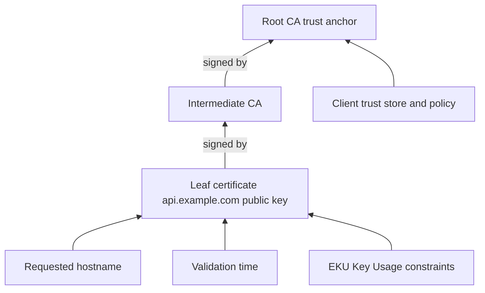

| Role | Usually sent by server? | Usually trusted directly? | Failure example |
|---|---:|---:|---|
| Leaf | Yes | No, except explicit pin/special trust | SAN mismatch, expired, wrong EKU |
| Intermediate | Yes, needed chain certificates | Usually not as primary trust anchor | Missing/incorrect intermediate |
| Root/trust anchor | Often omitted from handshake | Yes in local trust store/policy | Root absent/distrusted |
| Cross-certificate | Sometimes in alternate paths | Depends on path/store | One client builds path, another cannot |

## 8. Certificate fields

| Field/extension | Plain meaning | Validation use | Caution |
|---|---|---|---|
| Subject | Entity attributes named in certificate | Display/context | Hostname validation uses SAN in modern rules |
| Issuer | Name of signing certificate authority entity | Chain-building clue | Same text does not prove same key/certificate |
| Serial number | Issuer-scoped certificate identifier | Revocation/audit correlation | Not globally unique alone |
| Validity `notBefore`/`notAfter` | Time interval for validity | Reject not-yet-valid/expired | UTC/clock matters; renewal overlap matters |
| Subject Alternative Name | DNS/IP identities certified | Hostname/IP matching | Wildcard rules are constrained |
| Basic Constraints | CA status/path-length constraints | Prevents leaf acting as CA | Must be interpreted with path rules |
| Key Usage | Permitted cryptographic key operations | Constrains certificate/key use | Algorithm/context matters |
| Extended Key Usage | Permitted application purposes, e.g. server/client auth | Service/client validation policy | Absence/presence semantics depend on path/policy |
| Authority Key Identifier | Helps identify issuer key | Chain building | Not a trust decision alone |
| Subject Key Identifier | Identifies subject public key | Path/reference aid | Not identity proof alone |
| Signature algorithm | Algorithm issuer used to sign certificate | Policy/verification | Do not confuse with negotiated record cipher |
| Public key algorithm/size/group | Subject key material type | Compatibility/security policy | Private key never appears in certificate |

## 9. Chain validation

Certificate validation is more than checking dates. A client builds a path from leaf toward a trusted anchor; verifies each signature; enforces CA/basic/path/name constraints; checks validity; validates the intended identity; applies Key Usage/EKU and algorithm policy; and may evaluate revocation information according to platform/application policy.

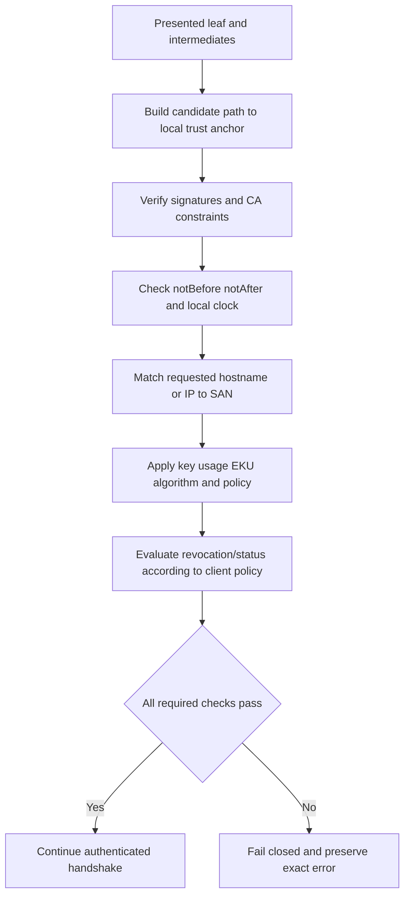

| Error wording | Plausible causes | Minimum evidence | Unsafe response |
|---|---|---|---|
| Unable to get local issuer | Missing intermediate, unknown root, wrong chain/store | Presented chain, built path, trust context | Download arbitrary cert and trust it |
| Self-signed certificate | Intended private CA/inspection or unexpected endpoint | Fingerprint/subject/issuer, owner, path | Accept permanently without validation |
| Certificate expired | Leaf/intermediate outside validity or clock issue | `notAfter`, UTC, client clock, chain role | Set clock incorrectly or bypass |
| Not yet valid | Clock skew or premature certificate deployment | `notBefore`, UTC, time source | Ignore time validation |
| Hostname mismatch | Requested name absent from valid SAN match | URL/SNI/SAN, DNS/edge/proxy | Connect by IP with disabled checks |
| Unsupported certificate purpose | EKU/usage/policy incompatible | EKU/Key Usage/client role | Remove validation |
| Revoked/status failure | Certificate revoked or status checking unavailable/policy | Exact revocation result and client policy | Turn off revocation globally |
| Weak algorithm/policy | Client security policy rejects chain/signature/key | Algorithms, client/runtime policy | Re-enable obsolete algorithms casually |

## 🔍 Plain-English deep-dive: A certificate chain is a signed authorization path, not a stack of matching names

Each issuer signs the certificate below it and must be allowed to act as a CA under constraints. The client does not trust the leaf merely because the issuer text resembles a familiar company. It verifies signatures and builds to a locally trusted anchor under policy.

Think of a permit signed by an authorized regional office whose authority comes from a national office your organization recognizes. Matching letterhead is not enough; signatures, authority, dates, scope, and requested identity matter. The analogy stops because certificate path construction can choose alternate cryptographic paths and enforce formal extensions.

## 10. Hostname validation and SAN

For DNS-name HTTPS, the client validates the requested reference identity against DNS names in the SAN extension using defined matching rules. Modern rules do not simply trust Common Name (CN) fallback. A wildcard such as `*.example.com` matches one left-most label such as `api.example.com` under normal rules; it does not broadly match `deep.api.example.com` or `example.com`.

If a client connects to an IP literal, IP SAN matching rules apply; a DNS SAN is not automatically valid for the numeric address. Using the IP to “work around DNS” can therefore correctly fail identity validation and can omit the intended SNI virtual host.

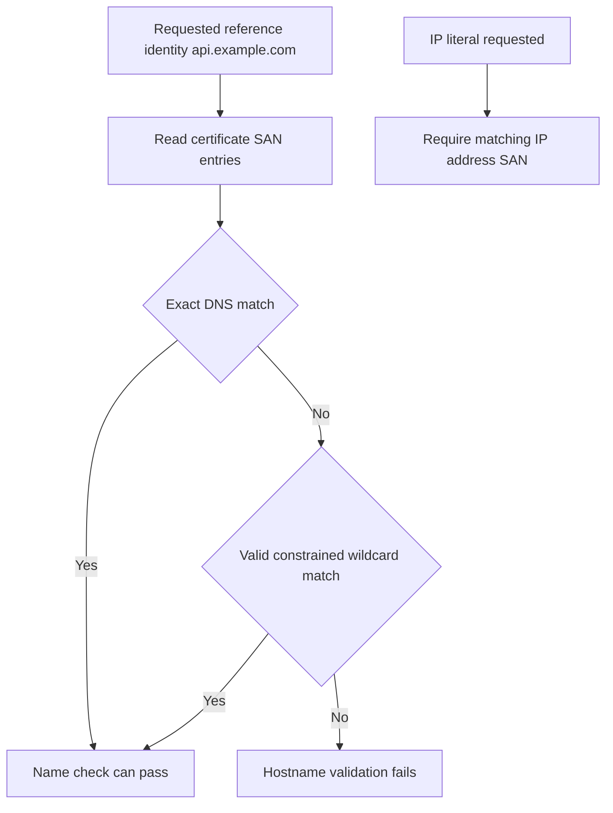

| Requested identity | SAN | Expected high-level result | Reason |
|---|---|---|---|
| `api.example.com` | `DNS:api.example.com` | Match | Exact DNS identity |
| `api.example.com` | `DNS:*.example.com` | Match under normal wildcard rules | One label wildcard |
| `deep.api.example.com` | `DNS:*.example.com` | No match | Wildcard does not span labels |
| `example.com` | `DNS:*.example.com` | No match | Wildcard represents a subdomain label |
| `192.0.2.25` | `DNS:api.example.com` | No IP match | DNS name differs from IP reference |
| `192.0.2.25` | `IP Address:192.0.2.25` | Match if all other validation succeeds | Typed IP SAN |

## 🔍 Plain-English deep-dive: The client validates the name it intended, not whichever server answered

DNS and routing can deliver a client to an endpoint, but TLS must still confirm that the endpoint is authorized for the reference identity the client requested. If `api.example.com` resolves to an address whose server presents only `portal.example.com`, successful routing does not make that certificate valid for the API name. Connecting by IP changes the reference identity and commonly removes correct SNI selection; it is not a safe workaround.

Think of a taxi reaching a building after being given a company name. Arrival at a building does not prove it is the intended company; the sign and verified address must still match the request. The analogy stops because TLS performs cryptographic chain and hostname checks rather than visual inspection.

The support evidence is a four-way comparison: requested URL/reference identity, DNS-selected address, ClientHello SNI, and certificate SAN. A mismatch can arise from DNS, load-balancer/virtual-host configuration, proxy inspection, or certificate deployment. Preserve all four and route to the component owner; never suppress the name check.

## 11. SNI

Server Name Indication is a TLS extension through which the client indicates the intended server name during handshake. It lets one IP/listener host many virtual TLS services and select the appropriate certificate/configuration. Classic SNI is commonly visible before handshake encryption; Encrypted ClientHello (ECH) can change visibility where deployed.

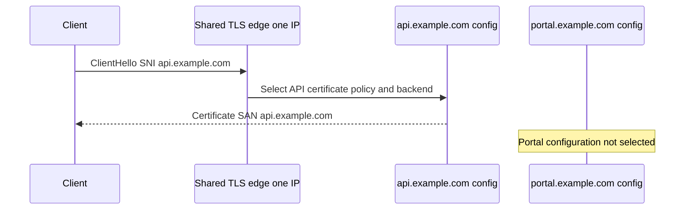

Without correct SNI, the endpoint may present a default certificate, reject the handshake, or route differently. `openssl s_client -connect <address>:443` without `-servername <host>` may therefore test a different virtual host than a browser. Always include the intended SNI and hostname-validation option in a diagnostic command.

## 12. ALPN

Application-Layer Protocol Negotiation lets client and server select an application protocol during TLS handshake. Common values include `h2` for HTTP/2 and `http/1.1`; HTTP/3 uses ALPN within QUIC's TLS integration. ALPN success identifies negotiated protocol, not the success of a later request.

| ALPN observation | Meaning | Next check |
|---|---|---|
| `h2` selected | Both chose HTTP/2 | HTTP/2 frames/response and application IDs |
| `http/1.1` selected | HTTP/1.1 chosen | Request/response semantics |
| No ALPN | Could be allowed/default or failure depending protocol/client | Application behavior/current docs |
| Offered protocol unsupported | No acceptable overlap or fallback | Client/server policy and endpoint |
| Proxy changes ALPN | Front and backend sessions differ | Record both TLS legs where authorized |

## 13. Revocation at a high level

Certificate Revocation Lists (CRLs) publish revoked serials; Online Certificate Status Protocol (OCSP) can provide certificate status responses; OCSP stapling lets a server send a status response during handshake. Browser/OS/application behavior can use hard-fail, soft-fail, caching, proprietary mechanisms, or policy differences. Do not infer “not revoked” merely because one tool did not check or report it.

| Mechanism | Basic role | Failure modes | Support caution |
|---|---|---|---|
| CRL | Signed list of revoked certificates | Distribution unavailable, stale/large list | Client policy/cache determines behavior |
| OCSP | Query responder for status | Responder unavailable, unknown, privacy/latency | Tool may not perform automatically |
| OCSP stapling | Server supplies recent signed status | Missing/expired/invalid staple | Requirement differs by policy/certificate |
| Short-lived cert | Limits exposure window through frequent renewal | Automation/clock/deployment failures | Does not eliminate validation needs |
| Platform policy | Defines status-check behavior | Different clients disagree | Record exact client/runtime/store/policy |

## 14. Session resumption and 0-RTT

Session resumption lets peers reuse previously established cryptographic context to reduce handshake cost. TLS 1.3 uses pre-shared-key concepts and session tickets. Resumed handshakes can omit a full certificate exchange, so a capture may differ from the first connection.

TLS 1.3 early data (0-RTT) can send application data before handshake completion in resumption contexts, but it has replay risks. Applications must permit it only for replay-safe operations under their design. Support should not enable 0-RTT to “make APIs faster” without product/security guidance.

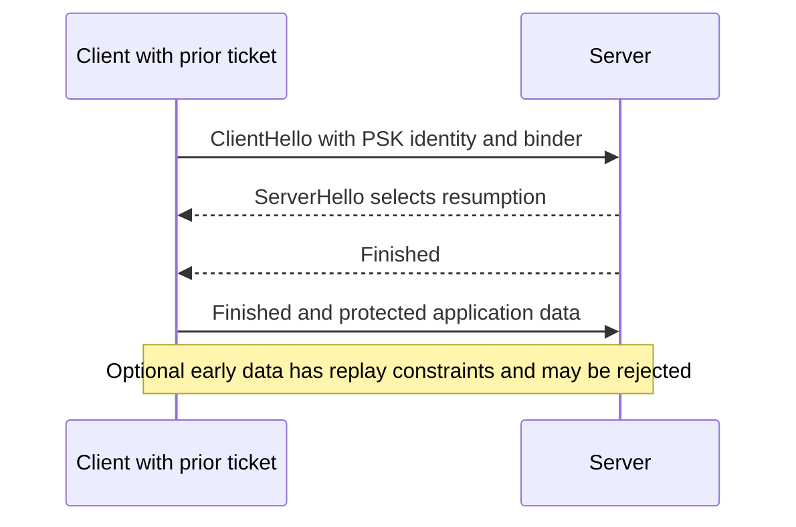

| Observation | Possible reason | Evidence |
|---|---|---|
| First connection shows certificate, second does not | Resumption | Session/ticket and handshake type |
| Problem disappears after fresh process | Cache/session/resolution/connection state | Controlled comparison, not immediate root cause |
| Early request repeated | 0-RTT replay/retry/application behavior | Method/idempotency/server logs/request IDs |
| Resumption rejected | Ticket expiry/key rotation/policy/server instance | Full handshake follows or fails |

## 15. TLS inspection

An enterprise TLS inspection proxy terminates the client's TLS session, validates/inspects according to policy, then establishes a separate TLS session to the destination. The client normally sees a leaf certificate issued by an enterprise inspection CA; the origin sees the proxy as its TCP/TLS peer. This is two protected connections, not one end-to-end TLS session.

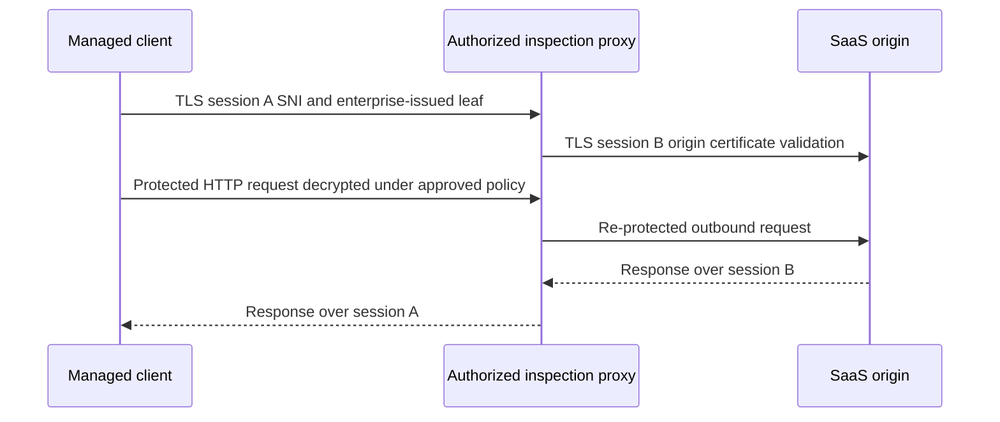

Inspection can cause failures when its CA is absent from an application's trust store, certificate pinning or mTLS conflicts with interception, algorithms/protocols differ, exclusions are incomplete, proxy identity/policy fails, or front/back SNI/ALPN differs. Do not import an inspection CA into arbitrary stores or bypass validation. Verify approved design with endpoint, network/security, and application owners.

| Observation | Inspection hypothesis | Evidence |
|---|---|---|
| Browser trusts, Java service rejects | Browser/OS and Java trust stores differ | Issuer/fingerprint and exact runtime store |
| Certificate issuer is enterprise CA | Inspection likely/intentional | Managed policy and proxy owner confirmation |
| Off-network chain differs | Different path/inspection | Same hostname/UTC/client comparison |
| mTLS fails only through proxy | Proxy cannot transparently preserve client-certificate exchange | Approved bypass/design documentation, no ad hoc bypass |
| HTTP status from proxy | Front session reached proxy | Proxy reason/log and outbound session state |

## 🔍 Plain-English deep-dive: Inspection creates two truths that must not be mixed

The client validates the proxy-issued certificate on session A. The proxy separately validates the origin certificate on session B. The client cannot directly prove the exact origin certificate from its front session, and the origin sees the proxy's network identity. An error on either leg can be reported to the client.

Think of a secure corporate mailroom opening authorized packages, inspecting them, then repackaging them for an internal recipient. There are two sealed journeys. The analogy stops because TLS inspection involves cryptographic endpoint impersonation authorized by local trust policy and has major privacy/compliance constraints.

Always draw both legs, record each requested name/version/ALPN/chain/result if authorized, and identify the policy owner. Raw decrypted content is usually unnecessary for certificate troubleshooting.

## 16. Mutual TLS

Ordinary public HTTPS authenticates the server to the client. **Mutual TLS (mTLS)** also requests and validates a client certificate. During TLS 1.3, the server sends CertificateRequest; the client selects an eligible certificate, sends its chain and CertificateVerify, and proves possession of the corresponding private key. The server validates the client chain/usage/trust and then maps certificate identity to application policy.

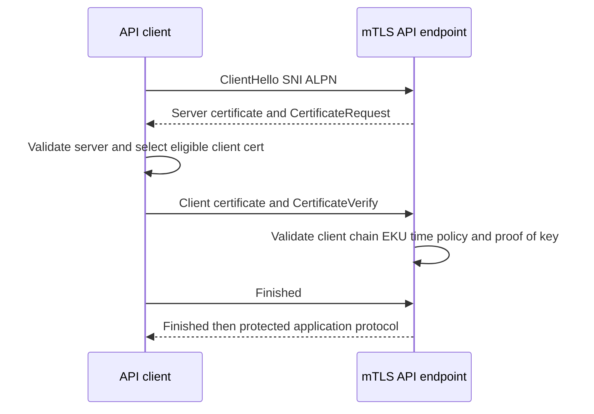

| mTLS failure | Plausible cause | Safe evidence | Never request |
|---|---|---|---|
| No client certificate sent | Selection criteria, store/access, acceptable CA, application config | Subject/SAN/issuer/serial alias/EKU/store context/error | Private key or password |
| Client cert rejected | Untrusted issuer, expired, revoked, wrong EKU, policy mapping | Public chain metadata and server validation reason | Exportable PFX in ticket |
| Private-key access failure | Service account permission/provider/hardware | Key presence/access error and identity, not key bytes | Private key material |
| TLS succeeds, HTTP 403 | Certificate authenticated but app authorization denied | Certificate identity mapping, role/resource/request ID | Assumption that mTLS grants all access |
| One node fails | Trust/config drift or load-balancer routing | Node/request ID/chain/policy version | Broad secrets |

## 17. Safe evidence with curl and OpenSSL

`curl -v` can show name resolution, connection target, TLS version/cipher/ALPN (backend-dependent), certificate validation summary, request/response headers, and timing. Verbose output can expose headers, cookies, proxy details, internal names, and tokens. Use only unauthenticated harmless endpoints or redact before retention.

OpenSSL `s_client` is a diagnostic TLS client, not a full browser. Include SNI and explicit hostname verification. Trust-store defaults vary by installation. `-showcerts` displays certificates sent by the peer, not necessarily the validated path. `Verify return code: 0` must be interpreted with the options/trust context used.

| Command behavior | Safe use | Misinterpretation to avoid |
|---|---|---|
| `curl --verbose https://example.com/` | End-to-end validated harmless GET/HEAD metadata | Treating curl's trust/proxy as same as failing app |
| `curl --head` | Limits response body for HTTP endpoint | HEAD semantics can differ from GET |
| `openssl s_client -servername ...` | Sends intended SNI | Assuming SNI also performs hostname validation |
| `-verify_hostname` | Requests hostname verification | Availability depends on OpenSSL version |
| `-verify_return_error` | Stops/report validation errors | Trust store still must be correct/known |
| `-showcerts` | Shows peer-sent chain list | Calling list the exact built trusted path |
| `-brief` | Concise negotiated summary | May omit details needed for a failure |

Never use `curl -k`/`--insecure`, language settings that skip verification, or OpenSSL options that deliberately accept invalid chains as remediation. A controlled expert may use special diagnostics in an isolated environment, but this beginner support guide intentionally does not teach bypass patterns.

## 18. Worked examples

### Example A: Hostname mismatch after DNS change

`api.example.test` begins resolving to a new edge. TCP completes, but the leaf SAN contains only `portal.example.test`. This is consistent with wrong virtual-host/certificate deployment, wrong SNI, or wrong DNS edge. Evidence: requested URL, DNS answer, selected address, SNI, presented chain fingerprint/subject/SAN, validation error, UTC. Do not connect by IP with validation disabled.

### Example B: Browser works, collector rejects enterprise issuer

The managed browser trusts an authorized enterprise inspection CA in the OS store. A Linux container uses its own CA bundle and rejects the proxy-issued leaf. Compare exact issuer/fingerprint, path, proxy, runtime trust source, and approved application support for inspection. The fix is an owner-approved trust/deployment design, not copying arbitrary certificates into the container.

### Example C: mTLS certificate sent but API returns 403

Handshake logs show client certificate validation and Finished completed. HTTP returns 403 with request ID. The certificate authenticated a client identity; application mapping lacks the required tenant/resource role. Continue at application authorization, not TLS.

### Example D: Old client has no version overlap

TCP establishes; server sends protocol-version alert after ClientHello. Current server policy supports TLS 1.2/1.3, while legacy client only offers obsolete versions. Upgrade/replace the client per product policy. Do not re-enable obsolete SSL/TLS on the production service as an ad hoc fix.

| Example | Last proven | First failing boundary | Owner path | Unsafe shortcut |
|---|---|---|---|---|
| SAN mismatch | TCP and certificate receipt | Hostname validation | DNS/edge/cert/service | `--insecure` |
| Inspection trust mismatch | TCP/front TLS presentation | Runtime trust path | Endpoint/security/app | Random CA import |
| mTLS then 403 | Mutual TLS auth | App authorization | IAM/API owner | Replace cert blindly |
| Version alert | TCP/ClientHello reached peer | Version policy overlap | Client/service security | Enable SSL 3.0 |

## 19. Troubleshooting decision tree

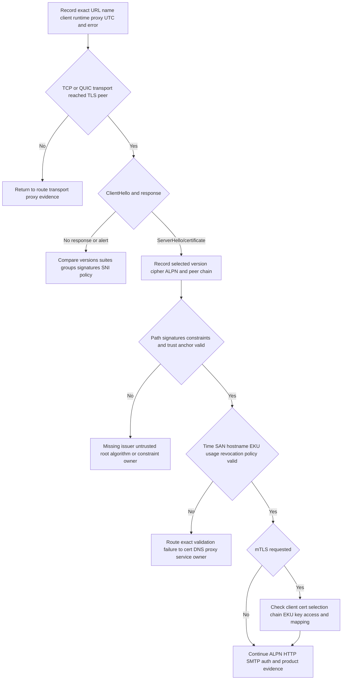

## 20. Failure modes and escalation package

| Failure/shortcut | Why unsafe/wrong | Better action |
|---|---|---|
| Calling all modern TLS “SSL” | Hides obsolete-version risk | Name actual negotiated/offered version |
| Using `--insecure` | Removes peer identity validation and masks cause | Fix chain/name/trust/time/policy |
| Importing arbitrary root/intermediate | Expands trust and can enable interception | Verify authoritative owner and approved deployment |
| Requesting private key/PFX/password | Severe credential exposure | Use public certificate metadata and key-access status only |
| Trusting subject/CN only | Modern hostname checks use SAN | Record requested reference identity and SAN |
| Assuming `showcerts` is validated chain | It is peer-sent list | Record built path/trust context |
| Assuming TLS success means API authorization | Different layer | Correlate HTTP/auth/request ID |
| Disabling revocation globally | Weakens policy | Diagnose reachability/status/policy with owner |
| Treating inspection as one session | Mixes client/proxy and proxy/origin evidence | Draw both TLS legs |
| Broad verbose output in ticket | Leaks cookies/auth/internal data | Use unauth endpoint, redact/minimize |

### Escalation package

| Field | Minimum evidence | Boundary |
|---|---|---|
| Impact | Operation/population/start/workaround | No payload/credentials |
| Client | OS/runtime/library/version/trust source | Version-specific behavior |
| Intent | URL hostname/port and expected protocol | Redact internal names if needed |
| Path | Direct/proxy/inspection and observed peer | Two TLS legs where applicable |
| ClientHello | Offered versions/SNI/ALPN/groups/signatures summary | No ticket/session secrets |
| Negotiation | Selected version/cipher/ALPN or exact alert | Cipher does not imply hostname success |
| Chain | Leaf/intermediate fingerprints, issuer/subject/SAN, validity | Public cert can still expose internal names |
| Validation | Exact error, built path/trust anchor context, time/EKU/revocation policy | Do not send private key |
| mTLS | Client cert public metadata/selection/key-access status | Never export PFX/private key |
| Correlation | UTC, tuple alias, request ID/server node | TLS may fail before request ID |
| Ask | Exact certificate/proxy/client/policy decision | No validation bypass |

## Safe public lab: The TLS Identity Ladder 075

### Prerequisites

- The learner's own Windows or Linux workstation and authorization for a normal read-only HTTPS request.
- `curl`/`curl.exe`. OpenSSL is optional and must already be installed.
- Public target limited to `https://example.com/`, the IANA-reserved documentation service. No scanning, alternate ports, repeated load, authentication, or client certificate.
- A clean terminal; no bearer-token/cookie environment variables are used in the command.
- No `-k`, `--insecure`, trust-store changes, certificate imports, proxy bypass, protocol weakening, or revocation disablement.
- Artifact label: **public read-only lab - example.com public TLS metadata only**.

### Lab procedure

1. Record start UTC, OS, curl/OpenSSL version, connection/VPN/proxy category (direct/managed proxy/unknown), and no-change statement.
2. Make one bounded HEAD request with normal validation:

   **Windows:**

   ```powershell
   curl.exe --verbose --head --max-time 10 https://example.com/
   ```

   **Linux:**

   ```bash
   curl --verbose --head --max-time 10 https://example.com/
   ```

3. Record only: requested name, resolved-address alias, connection family, TLS backend, negotiated version/cipher if displayed, ALPN offered/selected if displayed, certificate subject/issuer/SAN summary if displayed, validation result, HTTP status, and UTC. Remove proxy addresses, local paths, environment details, cookies, and unrelated headers.
4. If OpenSSL is installed, run one SNI and hostname-validating connection with a short timeout mechanism available on the OS. Do not loop:

   ```bash
   openssl s_client -connect example.com:443 -servername example.com -verify_hostname example.com -verify_return_error -showcerts -brief
   ```

   OpenSSL versions differ; if an option is unavailable, document that and skip rather than weakening validation. End the interactive client immediately after output with `Ctrl+C` if it remains open.
5. Do not save full certificates unless needed. Record leaf subject, issuer, SAN containing the intended name, `notBefore`, `notAfter`, signature/public-key algorithms, EKU if shown, and SHA-256 fingerprint. These are public metadata but still minimize.
6. Draw the observed or conceptual chain as leaf -> intermediate(s) -> local trust anchor. Clearly distinguish peer-sent certificates from the path the client validated.
7. Build a hostname worksheet for exact SAN, wildcard one-label match, too-deep name, base domain, and IP literal. Use only `example.com`/documentation addresses on paper; do not make invalid live requests.
8. Build a ClientHello/ServerHello worksheet listing offers versus selections and why a cipher suite is not a certificate name check.
9. Draw an enterprise inspection topology with session A/client-to-proxy and session B/proxy-to-origin. Use fictional `PROXY-075`; do not inspect or alter the actual connection.
10. Draw an mTLS exchange with fictional `CLIENT-CERT-075` and no key material. List client certificate selection, proof-of-key, server validation, and later authorization as separate states.
11. Create four synthetic failure cards: missing intermediate, expired leaf, SAN mismatch, and client certificate wrong EKU. For each, state exact evidence, owner, safe remediation class, and prohibited bypass.
12. Draft a customer update for SAN mismatch and one for inspection trust-store mismatch.
13. Close OpenSSL/curl, record end UTC, and complete cleanup.

### Expected evidence

- One bounded, normally validated HTTPS HEAD transcript summary for `example.com`.
- Requested hostname, address-family alias, TLS backend/version/cipher/ALPN where exposed, validation result, HTTP status, UTC.
- Optional one OpenSSL SNI plus hostname-validation summary.
- Leaf/intermediate/root-role diagram distinguishing sent list from built path.
- Field worksheet for subject, issuer, SAN, validity, signature, public key, KU/EKU, and fingerprint.
- Exact/wildcard/IP hostname matching worksheet.
- Client-offer/server-selection handshake worksheet.
- Two-session TLS inspection diagram.
- mTLS authentication-versus-authorization diagram.
- Four synthetic failure cards and two customer-safe updates.
- Explicit statement that validation was never disabled.

### Cleanup and privacy

- Ensure no `openssl s_client` process remains; use `Ctrl+C` if it stayed interactive.
- Delete raw verbose output after retaining only minimized public metadata. Verbose output can reveal proxy, internal trust, local paths, environment, and headers.
- Do not retain/export browser cookies, session tickets, key-log files, client certificates, PFX/PKCS#12 bundles, passwords, authorization headers, or private keys.
- Do not import/delete certificates, change trust stores, clear browser state, alter proxy settings, or disable revocation/hostname checks.
- If enterprise inspection exposed an internal CA name, replace it with `ENTERPRISE-CA-075` in shared artifacts.
- Record: `TLS Identity Ladder 075 completed with normal validation; no insecure option, private key, client certificate, credential, trust change, third-party scan, or customer data used.`

### Validation rubric

| Dimension | Fail | Developing | Pass |
|---|---|---|---|
| Terminology | Calls modern TLS SSL only | Names TLS | Distinguishes legacy labels and obsolete SSL safely |
| Handshake | Says “certificate exchanged” | Lists Client/ServerHello | Separates offers/selections, key agreement, cert proof, Finished |
| Chain | Trusts matching issuer text | Names leaf/root | Builds signature/constraint/time/name/usage/trust path |
| Hostname | Uses CN/IP workaround | Checks SAN | Applies exact/wildcard/IP rules and SNI context |
| Inspection | Treats as one session | Notices enterprise issuer | Draws two TLS legs, trust stores, owners, privacy boundary |
| mTLS | Treats client cert as full authorization | Knows both certs | Separates selection/key proof/trust from app mapping |
| Safety | Uses `--insecure` or exports key | Normal validation | No bypass, secrets, trust change; minimized metadata |
| Honesty | Claims PKI ownership | Says learning | States working familiarity and production-transfer boundary |

## Official Source Anchors - August 24, 2026

| Official or primary source | Topic anchored | Boundary |
|---|---|---|
| [RFC 8446 - TLS 1.3](https://www.rfc-editor.org/rfc/rfc8446.html) | TLS 1.3 handshake, key schedule, resumption/early data | Use errata/updates and implementation docs |
| [RFC 5246 - TLS 1.2](https://www.rfc-editor.org/rfc/rfc5246.html) | TLS 1.2 legacy/current compatibility context | TLS 1.3 differs materially |
| [RFC 8996 - Deprecating TLS 1.0 and TLS 1.1](https://www.rfc-editor.org/rfc/rfc8996.html) | Obsolete-version guidance | Product policy can be stricter |
| [RFC 6176 - Prohibiting SSL 2.0](https://www.rfc-editor.org/rfc/rfc6176.html) | SSL 2.0 prohibition | Historical context |
| [RFC 7568 - Deprecating SSL 3.0](https://www.rfc-editor.org/rfc/rfc7568.html) | SSL 3.0 deprecation | Do not enable for compatibility |
| [RFC 6066 - TLS Extensions](https://www.rfc-editor.org/rfc/rfc6066.html) | SNI and related extensions | ECH can alter visibility where deployed |
| [RFC 7301 - ALPN](https://www.rfc-editor.org/rfc/rfc7301.html) | Application protocol negotiation | Selection is not request success |
| [RFC 5280 - Internet X.509 PKI Certificate and CRL Profile](https://www.rfc-editor.org/rfc/rfc5280.html) | Certificate/path/extension/CRL profile | Platform policies and web PKI add rules |
| [RFC 6125 - Service Identity](https://www.rfc-editor.org/rfc/rfc6125.html) | TLS service identity concepts | Updated by RFC 9525 |
| [RFC 9525 - Service Identity in TLS](https://www.rfc-editor.org/rfc/rfc9525.html) | Current service identity/hostname validation guidance | Apply protocol-specific profiles |
| [RFC 6960 - OCSP](https://www.rfc-editor.org/rfc/rfc6960.html) | Online certificate status | Client policy/caching varies |
| [RFC 7633 - TLS Feature Extension](https://www.rfc-editor.org/rfc/rfc7633.html) | Must-Staple concept | Browser/client support varies |
| [OpenSSL s_client documentation](https://docs.openssl.org/master/man1/openssl-s_client/) | Diagnostic client options including SNI/verification | Version/build/trust defaults vary |
| [OpenSSL verification options](https://docs.openssl.org/master/man1/openssl-verification-options/) | Chain, purpose, hostname verification | Tool options must be explicit |
| [curl TLS certificate verification](https://curl.se/docs/sslcerts.html) | curl trust stores and verification | TLS backend/platform varies |
| [curl command-line options](https://curl.se/docs/manpage.html) | `--verbose`, `--head`, timeout behavior | Verbose output is sensitive |
| [Microsoft Learn - Certificates and Trust](https://learn.microsoft.com/en-us/windows-server/identity/ad-cs/certificate-trust) | Windows certificate trust concepts | Windows version/store/application context matters |

### Source-use discipline

- Prefer TLS terminology and name actual offered/selected versions.
- Treat certificate, handshake, and verbose command output as sensitive operational metadata even when certificates are public.
- Never request private keys, PFX/PKCS#12, passwords, session tickets, key logs, tokens, or cookies.
- Never advise `--insecure`, disabled hostname checking, disabled revocation, obsolete SSL/TLS, or arbitrary CA import.
- Record client/runtime/trust store/proxy, requested hostname, SNI, selected parameters, built path, validation result, UTC, and request ID.
- Verify Abnormal/vendor TLS and mTLS requirements only through current approved documentation.

## Likely Interview Questions

### Q1. What does TLS provide, and what does it not provide?

**Model answer:** TLS provides negotiated confidentiality, record integrity/authenticity, and peer authentication according to certificate or other credential validation. It does not automatically authorize an API operation, prove content is safe, guarantee service availability, or prove backend processing. I maintain a checkpoint ladder from TCP through TLS, HTTP, identity, and product state.

### Q2. Explain a TLS 1.3 handshake at a high level.

**Model answer:** The client offers versions, cipher suites, groups/key share, signature algorithms, SNI, ALPN, and possible resumption. The server selects compatible parameters, sends its certificate and proof of private-key possession, and both verify Finished messages over the handshake transcript before protected application data. mTLS adds a client certificate and proof when requested.

### Q3. How is a certificate chain validated?

**Model answer:** The client builds from leaf through allowed intermediates to a local trust anchor; verifies signatures and CA/path constraints; checks validity time, SAN/reference identity, Key Usage/EKU, algorithms and policy; and evaluates revocation according to client policy. The peer-sent list from `showcerts` is not necessarily the exact trusted path.

### Q4. What are SNI and ALPN?

**Model answer:** SNI carries the intended server name so a shared edge can select the right certificate/configuration. ALPN lets peers choose an application protocol such as HTTP/2 or HTTP/1.1 during handshake; QUIC also uses ALPN for HTTP/3. Correct selection is a handshake checkpoint, not proof of application success.

### Q5. Why can a browser work while a service or curl fails TLS?

**Model answer:** They may use different DNS/proxy paths, TLS libraries, protocol offers, SNI/ALPN, trust stores, enterprise inspection CAs, revocation policy, client certificates, clocks, or session caches. I compare the exact runtime context and peer chain rather than copying trust or disabling validation.

### Q6. How does TLS inspection change troubleshooting?

**Model answer:** Inspection creates client-to-proxy TLS session A and proxy-to-origin session B. The client validates an enterprise-issued leaf; the proxy validates the origin and becomes the origin's peer. I record both legs and owners where authorized, minimize content, and never treat the client-visible chain as direct proof of the origin chain.

### Q7. What is mTLS, and does it grant API access?

**Model answer:** In mTLS the server requests a client certificate; the client sends an eligible chain and proves possession of its private key; the server validates trust, time, EKU, and policy. That authenticates certificate identity. The application still maps it to tenant/resource permissions, so a completed mTLS handshake can still receive HTTP 403.

### Q8. How do you troubleshoot TLS without weakening security?

**Model answer:** I preserve exact errors and collect requested name, SNI, client/runtime/trust source, proxy path, selected version/cipher/ALPN, public chain metadata, SAN, time, EKU, validation result, UTC, and request ID. I use normal validation with bounded curl/OpenSSL tests, never request private keys, and never recommend insecure flags or trust bypasses.

## Memory Hooks

- **Say TLS; SSL is obsolete or a legacy label.**
- **TLS protects a channel; application authorization is later.**
- **Client offers; server selects; both verify Finished.**
- **TLS 1.3 suites do not encode every algorithm like TLS 1.2 names.**
- **Leaf to intermediate to local trust anchor.**
- **SAN matches requested identity; subject text is not enough.**
- **SNI selects virtual TLS service; ALPN selects application protocol.**
- **A certificate contains a public key, never the private key.**
- **Peer-sent chain is not necessarily built trusted path.**
- **Inspection creates two TLS sessions.**
- **mTLS authenticates a client certificate; authorization still follows.**
- **Resumption changes handshake evidence; 0-RTT has replay risk.**
- **Never use insecure validation as remediation.**

## Completion Checklist

- [ ] I can explain TLS versus obsolete SSL terminology.
- [ ] I can state TLS confidentiality, integrity, authentication, and application limits.
- [ ] I can narrate ClientHello, ServerHello, certificate proof, Finished, and protected data.
- [ ] I can distinguish versions, cipher suites, key agreement, signatures, and symmetric AEAD protection.
- [ ] I can identify leaf, intermediate, root/trust anchor, and peer-sent versus built chain.
- [ ] I can interpret issuer, subject, serial, SAN, validity, Basic Constraints, KU, EKU, signature, and public key.
- [ ] I can explain exact/wildcard/IP hostname validation and SNI.
- [ ] I can explain ALPN and why selection does not prove HTTP success.
- [ ] I can discuss CRL, OCSP, stapling, and client policy without overclaiming.
- [ ] I can explain resumption/tickets and 0-RTT replay caution.
- [ ] I can draw both TLS-inspection legs and compare trust stores.
- [ ] I can explain mTLS selection, proof-of-key, validation, and later authorization.
- [ ] I completed or can explain **The TLS Identity Ladder 075**.
- [ ] I used normal validation and no insecure flag, trust change, private key, PFX, token, cookie, or customer endpoint.
- [ ] I minimized/deleted verbose metadata and stopped OpenSSL if interactive.
- [ ] I can answer exactly Q1–Q8 aloud with honest PKI/network ownership boundaries.
- [ ] I checked Official Source Anchors dated August 24, 2026.

[Next: Part 076 - HTTP and HTTPS Methods Status Headers and State](Part-076-http-and-https-methods-status-headers-and-state.md)