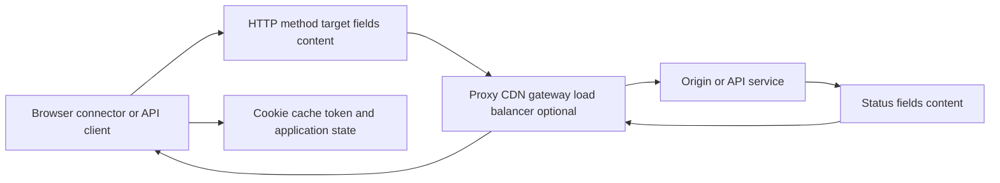
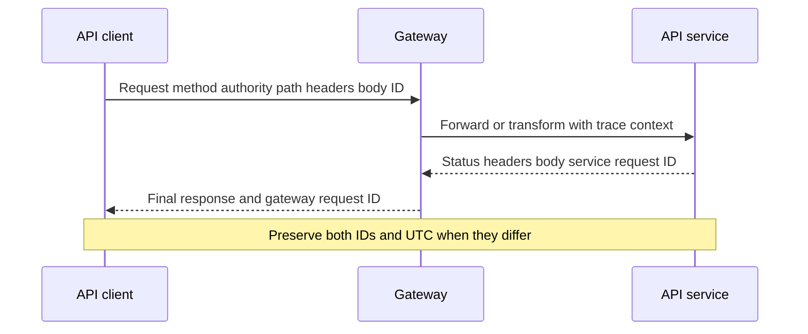
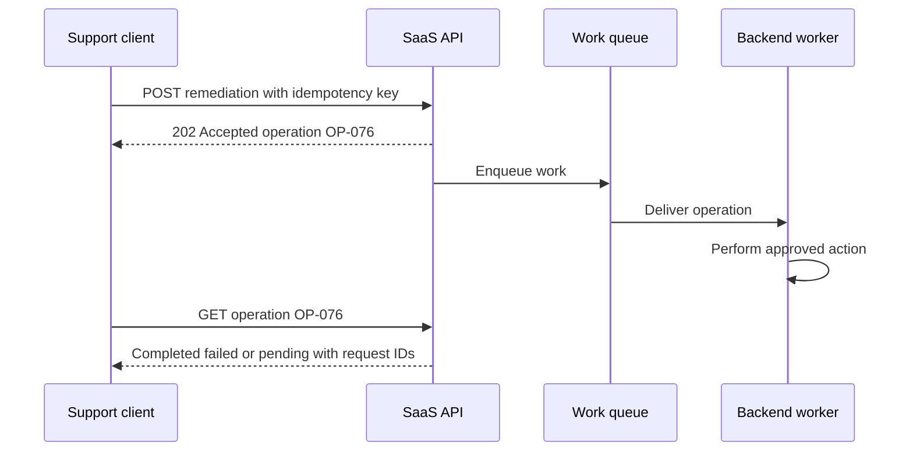
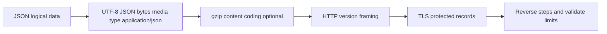
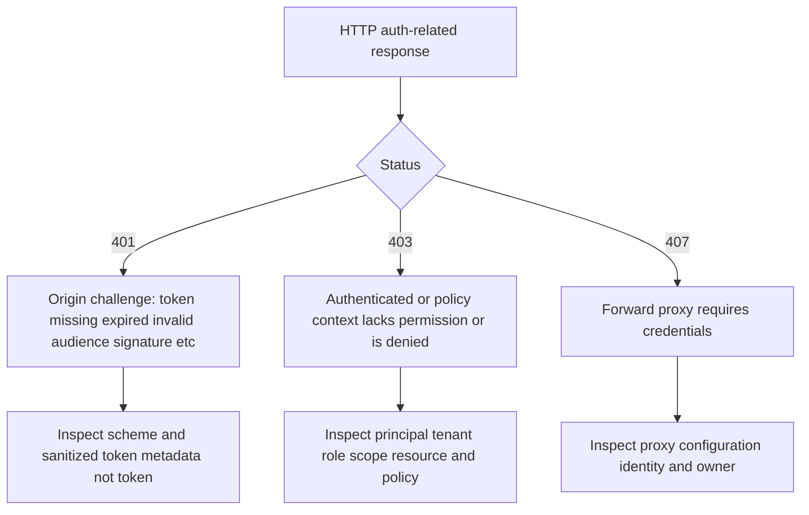
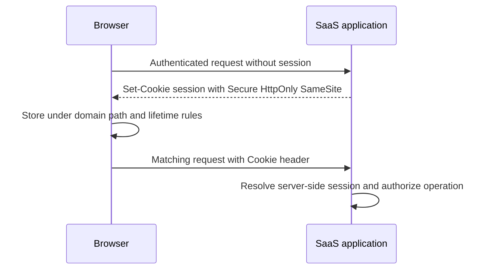
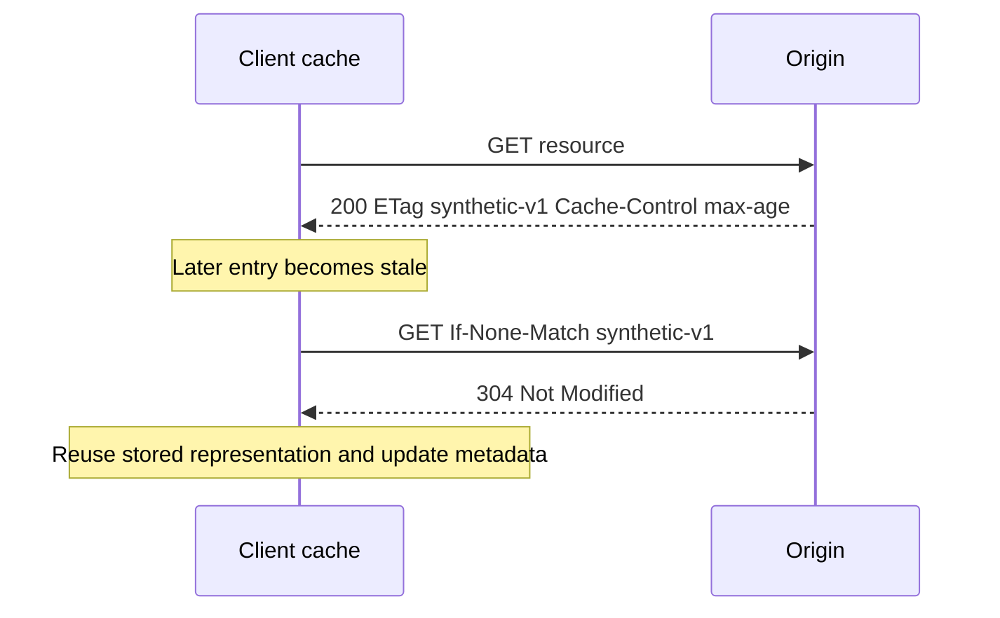
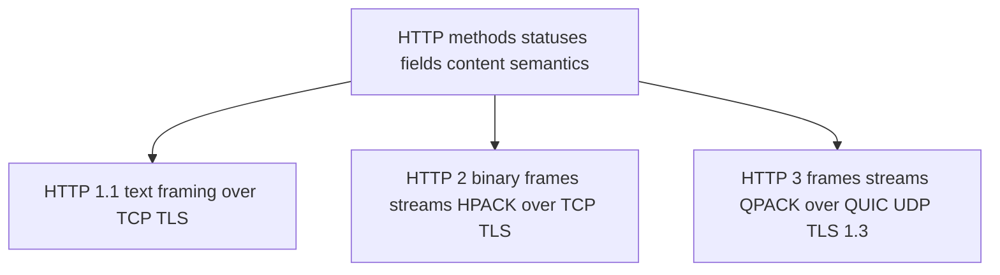
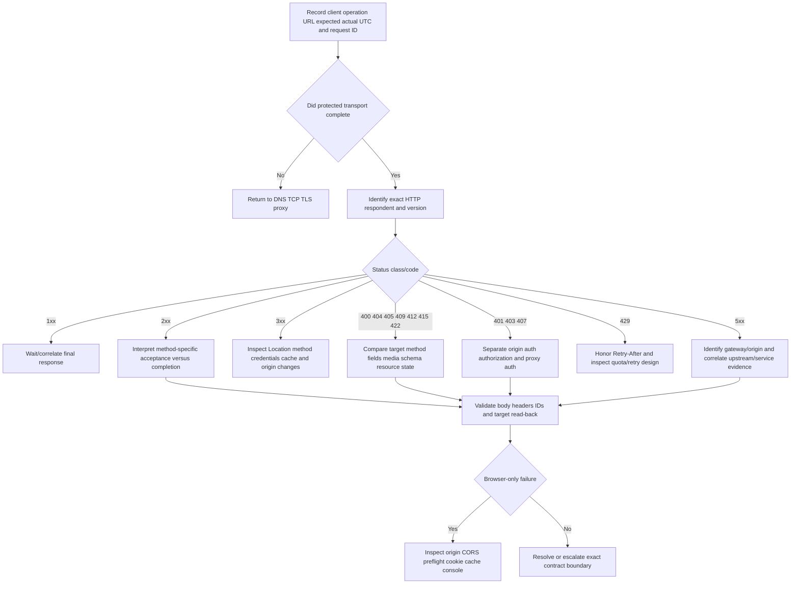

# Part 076 - HTTP and HTTPS Methods Status Headers and State

> **Purpose:** Interpret web/API exchanges as structured application evidence without confusing transport success, status semantics, browser policy, authentication, or product completion.
>
> **Artifact label:** Learned architecture plus bounded public read-only lab. No credential, cookie, token, state-changing request, or validation bypass is used.
>
> **Currency and source access date:** August 24, 2026.

## Section goal

By the end of this Part, Arti should be able to read an HTTP request and response; distinguish method, target, authority, headers, body, status, and protocol version; and explain method safety, idempotency, and cacheability without reducing them to “GET reads, POST writes.” She should be able to interpret informational, successful, redirection, client-error, and server-error status classes; distinguish representation metadata from framing and content coding; and use request/correlation IDs, timestamps, and structured error bodies safely.

She should understand cookies and their `Secure`, `HttpOnly`, `SameSite`, domain, path, and lifetime attributes; validators such as ETag and Last-Modified; redirects; authentication challenges; proxy responses; compression; content negotiation; and browser Cross-Origin Resource Sharing (CORS), including preflight. She should be able to explain why CORS is browser-enforced access policy rather than a general server-to-server network block.

The support objective is to trace a SaaS/API/email-related operation after DNS, transport, and TLS have succeeded. A 401, 403, 407, 409, 415, 429, 502, or 504 response is not “the website is down.” It is evidence from a specific respondent about one request. The response must be tied to the requested authority, method, path, tenant/principal context, request ID, UTC, body/error schema, proxy path, and expected contract.

## JD Mapping

| Supplied role signal | Capability developed | SaaS/API/email example | Proof artifact |
|---|---|---|---|
| API questions | Reads requests/responses and method/status/header/body contracts | Connector receives 415 or 429 | Annotated exchange |
| Complex investigations | Separates client, proxy, gateway, API, and backend responders | 504 at reverse proxy | Respondent evidence ladder |
| Cloud Email Security | Interprets HTTPS management APIs and SMTP-adjacent webhooks without confusing message delivery | Message-remediation API returns 202 | State ladder |
| SaaS Security | Handles cookies, sessions, authorization challenges, tenant context, and CORS | Portal works; browser API call fails | Browser/server matrix |
| Customer communication | Explains precise status semantics and next action | “Forbidden” versus outage | Customer-safe update |
| Engineering escalation | Supplies sanitized request, response, IDs, UTC, expected contract | Reproducible API defect | Escalation packet |
| Windows/Linux tools | Uses `curl` HEAD/GET safely and correlates headers | Public read-only lab | Transcript worksheet |
| Privacy/security | Removes authorization, cookies, bodies, PII, query secrets, and HAR secrets | Redacted evidence | Cleanup checklist |
| Continuous learning | Uses RFC 9110/9111/9112/9113/9114 and Fetch standards | Current semantics | Source ledger |
| Honest positioning | Frames HTTP tooling as working familiarity and support practice | Interview answer | Honesty statement |

## Candidate honesty note

Arti can position HTTP/HTTPS, browser DevTools, HAR, Fiddler, Postman, cURL, JSON, and REST as **working familiarity**, reinforced by public/local labs and grounded in Microsoft SaaS support methods. Her production evidence is enterprise customer support, client/cloud isolation, escalation, communication, and fix validation. She should not claim to have designed Abnormal's APIs, owned global reverse proxies/CDNs, operated production browser-security policy, or administered customer authentication systems without real evidence.

| Evidence tier | Safe claim | Boundary |
|---|---|---|
| Production transfer | Microsoft SaaS troubleshooting and customer/Engineering coordination | Not Abnormal API ownership |
| Working familiarity | HTTP semantics, headers/statuses/cookies/caching/CORS and safe tools | Not protocol implementation expertise |
| Public lab | Read-only HEAD/GET against `example.com` | Not authenticated/product workflow proof |
| Learned architecture | HTTP/1.1, HTTP/2, HTTP/3, proxies, browser policy | Deployment varies |
| Unknown | Abnormal endpoint contracts, headers, error schemas, versions, caching, limits | Verify approved current docs |

## 1. HTTP is an application protocol

HTTP is a stateless application-level request/response protocol with extensible methods, status codes, fields, and content semantics. “Stateless” means each request has defined semantics without requiring the protocol itself to remember an application login; applications add state through cookies, tokens, databases, caches, and connection context.

HTTPS is HTTP carried through authenticated encrypted transport: commonly TLS over TCP for HTTP/1.1 and HTTP/2, and TLS-integrated QUIC over UDP for HTTP/3. HTTP semantics remain recognizable across versions even though wire framing differs.

An analogy is a standardized service form. The request names an operation and resource, fields add instructions, content carries a representation, and the response records an outcome. The analogy stops because HTTP supports intermediaries, caching, negotiation, multiplexed streams, authentication, and machine-enforced browser policy.



### HTTP vocabulary

| Term | Plain meaning | Support value | Caution |
|---|---|---|---|
| User agent/client | Component sending request | Browser, agent, connector, CLI | Different clients apply different policy |
| Origin server | Server authoritative for requested resource | Application evidence source | Reverse proxy may answer first |
| Intermediary | Proxy/gateway/cache between endpoints | Can transform/respond/cache | Identify respondent for each status |
| Resource | Concept identified by URI | API object/page/action context | Representation is not the resource itself |
| Representation | Current/past resource state encoded in content | JSON/HTML/image | Media type and schema matter |
| Field/header | Named metadata attached to message | Auth, content, cache, tracing | Can contain secrets/PII |
| Content/body | Bytes associated with message semantics | JSON error/data | Some methods/statuses have special rules |
| Connection | Underlying transport association | Reuse/multiplexing | One connection carries many requests |

## 2. URI, URL, authority, path, and query

A Uniform Resource Identifier (URI) identifies a resource. A URL is a URI that identifies a resource through a network-access mechanism. For `https://api.example.com:443/v1/events?limit=10`, the scheme is `https`, authority contains host `api.example.com` and explicit port 443, path is `/v1/events`, and query is `limit=10`.

The fragment after `#` is normally interpreted by the user agent and not sent in an HTTP request. User information in URLs is unsafe/deprecated in many contexts. Query strings can be logged by browsers, proxies, servers, analytics, and tickets; never place secrets there.

| Component | Example | Why it matters | Privacy/security |
|---|---|---|---|
| Scheme | `https` | Selects protected HTTP behavior | Never downgrade casually |
| Host/authority | `api.example.com` | DNS, SNI, certificate, virtual host | Internal hosts can be sensitive |
| Port | `443` | Transport endpoint | Not proof of protocol |
| Path | `/v1/events` | Resource/route contract | Can expose object IDs |
| Query | `limit=10` | Parameters/filtering | Frequently logged; no secrets |
| Fragment | `#section` | Client-side identifier | Normally not sent to server |

## 3. HTTP/1.1 request and response anatomy

An HTTP/1.1 request message has a request line, header fields, a blank line, and optional content. A response has a status line, fields, a blank line, and optional content. HTTP/2 and HTTP/3 encode fields/frames differently; packet text will not look like HTTP/1.1 lines, but method/status/authority/path semantics remain.

```http
GET /v1/status HTTP/1.1
Host: api.example.com
Accept: application/json
User-Agent: CONNECTOR-076/1.0
X-Request-ID: REQ-076-A

```

```http
HTTP/1.1 200 OK
Content-Type: application/json; charset=utf-8
Content-Length: 42
ETag: "synthetic-v1"
X-Request-ID: REQ-076-A

{"status":"ok","case":"CASE-076"}
```

These are synthetic. No authorization header or customer content appears.

| Request element | Meaning | Failure clue |
|---|---|---|
| Method | Desired semantics (`GET`, `POST`, etc.) | 405 when unsupported for resource |
| Target/path/query | Resource and parameters | 404, validation error, wrong version |
| HTTP version | Framing/protocol capabilities | Proxy/version compatibility |
| Host/authority | Intended virtual origin | Wrong routing/certificate/421 |
| Fields | Metadata/control/context | Missing auth/content type/conditional field |
| Content | Representation or command data | Schema/encoding/size error |



## 🔍 Plain-English deep-dive: A response belongs first to the system that generated it

An HTTP status proves that an HTTP-speaking component produced a response. A 403 from an enterprise proxy is not the same as a 403 from the origin API. A 504 from a gateway says that gateway timed out waiting for its upstream according to its timer; it does not identify whether upstream DNS, TCP, TLS, application processing, or dependency latency caused the wait.

Think of a receptionist reporting “the department did not answer.” The receptionist is the reporter; the department's internal reason remains unknown. The analogy stops because HTTP fields, Via headers, certificates, request IDs, and gateway logs can precisely correlate machine boundaries.

Record certificate/authority, `Server`/`Via`/proxy headers only as clues, branded error-body style, request IDs, source IP only where approved, and exact UTC. Avoid trusting a mutable header as proof without corroboration.

## 4. Methods

HTTP methods define request semantics. A method is **safe** when its defined semantics are essentially read-only; a method is **idempotent** when multiple identical intended requests have the same intended effect as one. These are protocol semantics, not guarantees that implementation bugs, logging, billing, triggers, or side effects never occur.

| Method | Defined high-level purpose | Safe? | Idempotent? | Support cautions |
|---|---|---:|---:|---|
| GET | Retrieve a representation | Yes | Yes | Query can still trigger buggy/analytics side effects; body semantics are not generally defined |
| HEAD | Same as GET without response content | Yes | Yes | Server implementation may differ; not proof GET body path works |
| POST | Process supplied representation according to resource | No | No by general semantics | Retry can duplicate actions unless API adds idempotency |
| PUT | Create/replace state at target with representation | No | Yes | Concurrent changes/preconditions matter |
| DELETE | Remove association/resource state | No | Yes | Repeated response codes can differ although intended effect is idempotent |
| PATCH | Apply partial modifications | No | Not guaranteed | Patch format/operation may or may not be idempotent |
| OPTIONS | Describe communication options; used by CORS preflight | Yes | Yes | Response depends on resource/server policy |
| CONNECT | Establish a tunnel through proxy | No | No | Common for HTTPS via forward proxy |
| TRACE | Diagnostic loop-back | Yes by semantics | Yes | Often disabled for security; do not enable/probe |

### Safety versus idempotency versus retryability

| Property | Question | Example | Why separate |
|---|---|---|---|
| Safe | Does intended semantics avoid state change? | GET | A safe method can still consume resources/log |
| Idempotent | Does repeating intended request change intended final effect? | PUT same representation | Response/timestamps can differ |
| Retryable | Is retry safe in this application/failure state? | GET often, POST with idempotency key sometimes | Depends on whether server processed request |
| Cacheable | May response be stored/reused under rules? | GET commonly | Separate from method safety |

## 🔍 Plain-English deep-dive: Idempotent does not mean “the second request does nothing”

Two identical PUT requests can both be processed, authenticated, logged, metered, and answered; idempotency means their intended effect on the target state is equivalent to one. A repeated DELETE can return 204 first and 404 later while the intended “resource absent” state remains.

Think of setting a thermostat to 20°C twice. The second command is still received and logged, but the intended final setting is unchanged. The analogy stops because APIs have concurrency, validation, asynchronous jobs, and side effects outside the target resource.

For retries, ask whether the server might have processed the request before the client timed out, whether the method is idempotent, whether the API supports an idempotency key, and whether response/reconciliation evidence exists. Never blindly retry a state-changing email remediation or security action.

## 5. Status-code classes

The three-digit status code expresses the result of one request at one respondent. The first digit defines a class; individual code semantics matter more than class alone. Reason phrases are optional/human-readable and not authoritative semantics.

| Class | General meaning | Examples | Support posture |
|---:|---|---|---|
| 1xx | Informational/interim | 100 Continue, 103 Early Hints | Final response still expected |
| 2xx | Request received/understood/accepted successfully by semantics | 200, 201, 202, 204, 206 | Distinguish immediate versus asynchronous completion |
| 3xx | Redirection or conditional/cache result | 301, 302, 303, 304, 307, 308 | Follow method and credential rules carefully |
| 4xx | Client request cannot be fulfilled as sent/context | 400, 401, 403, 404, 409, 415, 422, 429 | Client/auth/policy/resource/contract evidence |
| 5xx | Server/respondent failed to fulfill apparently valid request | 500, 502, 503, 504 | Identify reporter/upstream/service state |

### High-value statuses

| Status | Core meaning at support level | Common evidence | Caution |
|---:|---|---|---|
| 200 OK | Request succeeded with method-specific content | Response body/headers/request ID | Does not imply unrelated backend state |
| 201 Created | Resource created; often Location | Resource URI and representation | Validate actual resource/read-back |
| 202 Accepted | Accepted for processing, not completed | Operation/status URL/job ID | Must monitor later state |
| 204 No Content | Success with no response content | Headers/status | Do not expect JSON body |
| 206 Partial Content | Range response | Content-Range | Cache/range semantics matter |
| 301/308 | Permanent redirect; 308 preserves method | Location and cache behavior | Clients can cache; migration impact |
| 302/303/307 | Temporary/see-other redirects with differing method rules | Redirect chain | Credential/header forwarding security |
| 304 Not Modified | Conditional request can reuse stored representation | Validator/cache entry | Not an ordinary body response |
| 400 Bad Request | Malformed/invalid request in broad sense | Structured error/field details | Product-specific validation reason |
| 401 Unauthorized | Lacks valid authentication credentials; challenge often provided | WWW-Authenticate | Name is historically misleading; not “not authorized” |
| 403 Forbidden | Server understood but refuses | Principal/role/policy/request ID | Authentication may or may not be present by implementation |
| 404 Not Found | No current representation disclosed/found | Target/tenant/version | Can intentionally hide forbidden resource |
| 405 Method Not Allowed | Method known but not supported for resource | Allow header | Wrong route/version/proxy possible |
| 409 Conflict | Request conflicts with current resource state | Version/state/duplicate | Product schema defines resolution |
| 412 Precondition Failed | Conditional field evaluated false | ETag/date precondition | Protects concurrency |
| 415 Unsupported Media Type | Content format/coding unsupported | Content-Type/Content-Encoding | Accept describes response preference, not request body type |
| 422 Unprocessable Content | Syntax understood; instructions semantically invalid | Field validation body | Current terminology differs from historical WebDAV wording |
| 429 Too Many Requests | Rate limiting | Retry-After/rate headers/request rate | Do not amplify with retries |
| 500 Internal Server Error | Unexpected server condition | Request ID/server logs | One status does not reveal cause |
| 502 Bad Gateway | Gateway received invalid/failed upstream response | Gateway/upstream evidence | Not automatically origin app defect |
| 503 Service Unavailable | Temporary inability/maintenance/overload | Retry-After/service health | Could be edge or origin |
| 504 Gateway Timeout | Gateway did not receive timely upstream response | Both-leg timing/IDs | Client timeout and gateway timeout differ |

## 6. Accepted is not completed

Security and email APIs frequently use asynchronous processing. A 202 response can mean the request was validated/queued while remediation, synchronization, export, or analysis happens later. The API contract should supply an operation ID, status resource, webhook, audit event, or reconciliation method.



| State | Evidence | What it proves |
|---|---|---|
| Client sent | Local request transcript/time | Attempt, not receipt |
| HTTP response received | Status/request ID/respondent | Respondent handled request to stated boundary |
| 202 accepted | Accepted under contract | Not completion |
| Job queued | Internal/audit state | Awaiting worker |
| Job completed | Operation terminal state | Backend reports outcome |
| Target read-back | Actual message/object state | Stronger effect verification |
| Customer validation | Original workflow succeeds | Outcome from user perspective |

## 7. Request and response fields

HTTP fields are case-insensitive names with structured or field-specific values. Intermediaries can add/remove fields according to rules. Hop-by-hop fields apply to one connection; end-to-end metadata travels toward the intended recipient unless transformed. HTTP/2 and HTTP/3 prohibit or transform certain connection-specific fields.

| Field | Direction/purpose | Troubleshooting use | Privacy/security |
|---|---|---|---|
| Host / `:authority` | Requested origin | Virtual routing/SNI comparison | Internal name sensitivity |
| User-Agent | Client software identity | Version-specific behavior | Fingerprinting/host info |
| Accept | Preferred response media types | 406/content negotiation | Not request-body type |
| Content-Type | Media type of content | 415/schema/charset | Boundary parameter for multipart |
| Content-Length | Content size in bytes | Truncation/framing | Compression changes wire/body relationships |
| Content-Encoding | Coding applied to representation data | gzip/br decompression | Decompression limits/security |
| Transfer-Encoding | HTTP/1.1 transfer coding/framing | chunked issues | Not used same way in HTTP/2/3 |
| Authorization | Credentials for origin | Auth scheme | Never retain/share value |
| Proxy-Authorization | Credentials for proxy | 407 handling | Never retain/share value |
| WWW-Authenticate | Origin authentication challenge | Scheme/error/scope clue | Can disclose realm/context |
| Proxy-Authenticate | Proxy challenge | Proxy auth clue | Not origin authentication |
| Location | Redirect/new resource | Chain and method handling | Avoid credential leakage across origins |
| Retry-After | Suggested wait after 429/503 or redirect contexts | Backoff scheduling | Date/seconds interpretation |
| Date | Message origination date | Clock/correlation | Not guaranteed server processing start |
| Via | Intermediary path clue | Proxy/gateway evidence | Can be omitted/obscured by policy |
| X-Request-ID/traceparent | Correlation | Join client/gateway/server logs | Treat identifiers as sensitive |

## 8. Content type, charset, and encoding

`Content-Type` describes the media type of message content, such as `application/json` or `text/html; charset=utf-8`. `Content-Encoding` describes a coding such as `gzip` applied to the representation. Transfer framing describes how a message crosses one connection. These are separate.



| Symptom | Likely metadata boundary | Evidence |
|---|---|---|
| 415 response | Request `Content-Type`/`Content-Encoding` unsupported | Exact fields and API contract |
| Garbled text | Charset mismatch or double decoding | Raw bytes/media type/charset, safely synthetic |
| JSON parse error | Invalid/truncated/wrong representation | Content length, decompression, body schema |
| Browser downloads instead of displays | Media type/disposition | `Content-Type`, `Content-Disposition` |
| Proxy returns compressed error unexpectedly | Negotiation/transformation | `Accept-Encoding`, `Content-Encoding`, respondent |
| Decompression failure | Truncated/corrupt/unsupported coding | Wire length, coding, client library error |

## 9. Authentication challenges: 401, 403, and 407

A 401 response means the request lacks valid authentication credentials for the target resource and normally includes `WWW-Authenticate` challenge(s). A 403 means the server understood the request but refuses to fulfill it. A 407 is the proxy equivalent, using `Proxy-Authenticate`. Product implementations add structured details; always read current contract.



| Evidence | 401 path | 403 path | 407 path |
|---|---|---|---|
| Respondent | Origin/API/gateway | Origin/API/security edge | Forward proxy |
| Challenge | `WWW-Authenticate` | Not required | `Proxy-Authenticate` |
| Safe identity data | Client/principal ID alias, issuer/audience/scope names, expiry | Principal/tenant/role/scope/resource/policy | Proxy identity/config category |
| Secret to exclude | Token/password/cookie | Token/password/cookie | Proxy credential |
| Next owner | Identity/client/API | IAM/application/security policy | Endpoint/proxy/network |

## 🔍 Plain-English deep-dive: Authentication asks “who are you”; authorization asks “may you do this here?”

Authentication establishes an identity or credential validity. Authorization decides whether that identity may perform a specific operation on a specific resource in a tenant/policy context. A client can be successfully authenticated and still receive 403 because its role/scope/resource relationship is insufficient.

Think of entering a building with a valid badge, then finding the badge does not permit the finance room. The analogy stops because APIs can use scopes, claims, resource policies, conditional access, ownership, consent, and contextual controls.

Never paste a bearer token to prove authentication. Record safe metadata: credential type, issuer/audience, principal/client alias, expiry/clock, granted scope names, tenant/resource, challenge/error, and request ID. Token content and signatures can still be sensitive even when encoded rather than encrypted.

## 10. Redirects

Redirect status and `Location` tell a client to use another URI or representation. Method preservation differs: 307 and 308 explicitly preserve method/content; 303 directs retrieval with GET/HEAD semantics; 301/302 historical user-agent behavior can rewrite POST to GET. Follow the current HTTP specification and client behavior.

| Redirect | Persistence | Method behavior at high level | Support risk |
|---:|---|---|---|
| 301 | Permanent | User-agent behavior/history; current semantics allow method change for POST | Cached migration surprises |
| 302 | Temporary | Historical POST-to-GET behavior possible | API client variance |
| 303 | See Other | Follow with GET/HEAD | Common after POST result |
| 307 | Temporary | Preserve method/content | Replays state-changing request at new location |
| 308 | Permanent | Preserve method/content | Cached state-changing target migration |

Across origins, clients should not forward sensitive `Authorization` or cookies inappropriately. Cookies follow their own scope rules. A redirect from HTTPS to HTTP is a security downgrade and should be rejected/investigated according to policy. Capture the chain manually with redaction before using automatic `-L` on a state-changing/authenticated request.

## 11. Cookies and sessions

A cookie is name/value state stored by a user agent and sent to matching requests according to scope and attributes. Cookies often identify a session; they are credentials and must be treated like secrets. Server-side session state is separate from the cookie token.

| Attribute | Purpose | Security value | Limitation |
|---|---|---|---|
| Secure | Send only over secure transport (with defined localhost nuances) | Reduces plaintext exposure | Does not prevent script access alone |
| HttpOnly | Blocks ordinary script access | Reduces cookie theft via script | Browser still sends cookie; XSS can perform actions |
| SameSite=Strict | Strong same-site sending restriction | CSRF defense | Can break cross-site workflows |
| SameSite=Lax | Allows selected top-level safe navigations | Balanced default behavior | Exact browser rules matter |
| SameSite=None | Allows cross-site context | Needed for some integrations | Must be Secure in modern browsers |
| Domain | Broadens host scope when valid | Enables subdomain sharing | Overbroad scope increases exposure |
| Path | Limits request-path matching | Narrows sending | Not a robust confidentiality boundary |
| Expires/Max-Age | Persistence lifetime | Session control | Server can revoke independently |

`Set-Cookie` is a response field with special handling and should not be combined like ordinary list fields. Cookie values never belong in HAR screenshots, tickets, chats, or interview artifacts.



## 12. Caching and validators

HTTP caching stores reusable responses under cache-control rules. A private browser cache, shared proxy cache, CDN, and origin can each participate. `Cache-Control` directives, freshness lifetime, `Vary`, authentication, and method/status semantics control reuse.

Validators allow conditional requests. An ETag is an opaque entity tag chosen by the origin; Last-Modified supplies a timestamp. `If-None-Match` can produce 304 for cache revalidation; `If-Match` can protect updates from overwriting changed state and produce 412 if the condition fails.

| Mechanism | Meaning | Troubleshooting use | Caution |
|---|---|---|---|
| `Cache-Control: no-store` | Do not store response | Sensitive data handling | Different from `no-cache` |
| `no-cache` | Stored response must revalidate before reuse | Stale-content analysis | Name is commonly misunderstood |
| `max-age` | Freshness lifetime in seconds | Age/freshness calculation | Shared-cache directives can differ |
| `private` | Intended for private cache, not shared | Personalized data | Still stored locally unless no-store |
| `Vary` | Selected request fields form cache key | Wrong variant investigation | `Vary: *` has special implications |
| ETag | Opaque representation validator | Conditional GET/update | Weak/strong tags differ |
| Last-Modified | Modification timestamp validator | Fallback validator | Resolution/clock limitations |
| Age | Time response has resided in cache chain estimate | Identifies cached response | Multiple caches/clock behavior |



## 13. CORS and browser preflight

The same-origin policy restricts browser scripts from reading/interacting across origins. CORS is the HTTP-header mechanism by which a server indicates which cross-origin browser requests may be exposed. It is enforced by browsers. A server-to-server client such as a backend connector or curl is not governed by browser CORS, although the server can implement independent origin/policy checks.

An origin consists of scheme, host, and port. Different path alone is same origin; `https://app.example.com` and `https://api.example.com` are different origins.

For certain non-simple cross-origin requests, the browser sends an OPTIONS **preflight** containing `Origin`, `Access-Control-Request-Method`, and possibly `Access-Control-Request-Headers`. The server responds with allowed origin/method/header/credentials metadata. Only then does the browser send the actual request if policy permits.

```mermaid
sequenceDiagram
    participant JS as Browser script at app.example.com
    participant API as api.example.com
    JS->>API: OPTIONS preflight Origin and requested method headers
    API-->>JS: Access-Control-Allow-Origin Method Headers
    alt Browser policy accepts
        JS->>API: Actual cross-origin request
        API-->>JS: Response with matching CORS exposure fields
    else Policy rejects
        Note over JS: Browser blocks script access; network may have succeeded
    end
```

| CORS symptom | Evidence | Likely boundary | Common mistake |
|---|---|---|---|
| Browser console CORS error, API logs no request | Preflight may fail before actual request | OPTIONS route/proxy/CORS policy | Debugging token/body first |
| API returns 200 but script cannot read | Response lacks/mismatches allow-origin/expose rules | Browser/server CORS contract | Saying network blocked response |
| curl succeeds, browser fails | Expected if CORS policy missing | Browser-only policy | “CORS works in curl” |
| Credentialed request fails with `*` origin | Wildcard incompatible with credentials rules | CORS credential policy | Disabling browser security |
| Redirect during preflight/actual | Browser behavior and target CORS differ | Redirect chain/origin | Assuming headers carry safely |

## 🔍 Plain-English deep-dive: CORS can hide a successful network exchange from JavaScript

A browser may send a request and receive a response, yet refuse to expose it to page script because response CORS fields do not authorize that origin. The failure is in the browser's access decision, not necessarily DNS, TCP, TLS, or API processing.

Think of a receptionist receiving a sealed answer but being prohibited from handing it to a visitor from another department. The message arrived; access policy blocks disclosure. The analogy stops because browser origins and HTTP fields define precise rules.

Never disable browser web security as a customer workaround. Capture the Network and Console evidence, exact page origin, target origin, preflight request/response, actual response where sent, credential mode, and server CORS configuration owner.

## 14. HTTP/1.1, HTTP/2, and HTTP/3

| Version | Transport/framing | Concurrency | Header compression | Key support distinction |
|---|---|---|---|---|
| HTTP/1.1 | Textual messages over TCP with defined framing | Pipelining uncommon; multiple connections/reuse | None native | Connection-specific fields/chunked framing |
| HTTP/2 | Binary frames/streams over one TCP connection commonly via TLS | Multiplexed streams | HPACK | TCP loss can affect all streams at transport level |
| HTTP/3 | Binary HTTP semantics over QUIC/UDP | Multiplexed QUIC streams | QPACK | QUIC integrates TLS 1.3 and avoids cross-stream TCP head-of-line blocking |

HTTP/2/3 pseudo-fields such as `:method`, `:scheme`, `:authority`, and `:path` carry request-control data. Do not expect plaintext request lines in a packet capture. TLS usually encrypts fields/content; browser/curl/server telemetry is often the safer evidence source.



## 15. Worked examples

### Example A: 415 from webhook receiver

Sender uses `Content-Type: text/plain`; contract requires `application/json`. TLS/HTTP reach receiver, which returns 415 and request ID. Compare exact content type, content encoding, charset, body schema using synthetic data. Fix sender contract; do not change firewall.

### Example B: 429 after aggressive retry

Client retries failed requests immediately across ten threads. API returns 429 with Retry-After. Record quota identity, request rate, concurrency, response headers, retries, and IDs. Implement bounded exponential backoff with jitter in Part 087 context; do not keep testing at load.

### Example C: 504 from gateway

Client gets branded gateway 504 at 30 seconds; origin eventually logs completion at 45 seconds. Gateway timeout budget is shorter than backend operation. Correlate IDs and design asynchronous 202/status pattern or optimize/align timeouts through owners. Do not simply increase every timeout.

### Example D: CORS error although API returns 200

Browser request carries Origin `https://portal.example.test`; API sends 200 without matching `Access-Control-Allow-Origin`. Browser withholds response from script. curl's 200 is expected and does not test CORS. Fix approved server/gateway CORS policy.

| Example | Last proven checkpoint | Failed boundary | Owner | Evidence |
|---|---|---|---|---|
| 415 | TLS and HTTP responder | Request media contract | Client/API | Content-Type/body schema/request ID |
| 429 | API rate-control | Client pacing/quota | Client/API | Rate, Retry-After, IDs |
| 504 | Gateway request/upstream wait | Timer/backend latency | Gateway/service | Both-leg UTC/IDs |
| CORS | Network/API can succeed | Browser exposure policy | Web/API gateway | Origin/preflight/allow fields/console |

## 16. Troubleshooting decision tree



## 17. Failure modes and escalation package

| Failure/shortcut | Why wrong/risky | Better practice |
|---|---|---|
| Treating any 2xx as full completion | 202/async and method semantics differ | Poll/reconcile operation state |
| Treating all 4xx as bad credentials | Many contract/resource/policy codes | Interpret exact status/error/respondent |
| Treating 5xx as origin defect | Gateway/intermediary may report upstream issue | Identify reporter and both legs |
| Blindly following redirects | Can replay method or leak credentials | Inspect chain/authority/method first |
| Retrying POST after timeout | Server may have processed it | Use contract/idempotency/reconciliation |
| Calling `no-cache` “do not store” | It means revalidate, not necessarily no storage | Use current cache semantics |
| Sharing Cookie/Authorization/HAR | Exposes credentials/PII | Redact/minimize/revoke if exposed |
| Using curl to “prove CORS” | curl does not enforce browser CORS | Inspect browser preflight/console |
| Disabling browser/TLS security | Hides issue and creates exposure | Correct policy/configuration |
| Assuming header is trustworthy | Clients/intermediaries can set/spoof fields | Corroborate with trusted logs/context |

### Escalation package

| Field | Minimum evidence | Privacy boundary |
|---|---|---|
| Impact | Operation/population/start/frequency/workaround | No user content |
| Client | Browser/runtime/library/version | Redact profile/user data |
| Request | Method, sanitized URL/path/query keys, content type/encoding, body schema summary | No token/cookie/body/PII/query secrets |
| Path | Direct/forward proxy/reverse proxy/gateway | Alias internal systems |
| Response | Exact status, safe fields, structured error code/message | Redact body identifiers |
| IDs/time | Client/gateway/service request IDs and UTC | Treat IDs as sensitive |
| Auth context | Scheme, principal/client alias, tenant, scope/role names, expiry | No credentials |
| Browser context | Page origin, target origin, preflight, CORS fields, console | No session data |
| Cache/redirect | Validators, age, location origin/method behavior | No private URL data |
| Expected contract | Official endpoint/method/status/schema/version | Revalidate current docs |
| Ask | Exact API/proxy/browser/identity decision | No speculative root cause |

## Safe public lab: The HTTP Evidence Envelope 076

### Prerequisites

- Learner-owned Windows/Linux workstation and authorization for normal public read-only requests.
- `curl.exe` on Windows or `curl` on Linux. Browser DevTools optional and covered more deeply in Part 082.
- Public target limited to `https://example.com/`. No authentication, query secrets, alternate paths designed to generate load, state-changing methods, repeated loops, or third-party API tests.
- Normal TLS validation remains enabled. No `--insecure`, proxy bypass, cookie jar, authorization header, custom Host header, TRACE, CONNECT, POST, PUT, PATCH, or DELETE.
- Artifact label: **public read-only lab - example.com HEAD/GET metadata only**.

### Lab procedure

1. Record start UTC, OS, curl version/TLS backend, connection/proxy category, and no-credential/no-change statement.
2. Send one bounded HEAD request and save output only temporarily:

   **Windows:**

   ```powershell
   curl.exe --verbose --head --max-time 10 https://example.com/
   ```

   **Linux:**

   ```bash
   curl --verbose --head --max-time 10 https://example.com/
   ```

3. Annotate name resolution alias, selected address family, TCP/TLS checkpoint summary, ALPN/HTTP version if shown, request method/authority/path, response status, Date, Content-Type, Content-Length, cache fields, server/intermediary clues, and UTC. Redact local/proxy addresses and unrelated headers.
4. Send one bounded GET while discarding body so no content artifact is retained:

   **Windows:**

   ```powershell
   curl.exe --silent --show-error --dump-header - --output NUL --max-time 10 https://example.com/
   ```

   **Linux:**

   ```bash
   curl --silent --show-error --dump-header - --output /dev/null --max-time 10 https://example.com/
   ```

5. Compare HEAD and GET response metadata. Do not conclude they use identical server code paths.
6. Create a synthetic HTTP/1.1 GET and 200 JSON response using `example.test`, `REQ-076-A`, and no credentials. Label request line/status line, each field, blank line, and content.
7. Create method cards for GET, HEAD, POST, PUT, DELETE, PATCH, OPTIONS, and CONNECT. Record safe/idempotent and one retry caveat each.
8. Create status cards for 100, 200, 201, 202, 204, 301, 303, 304, 307, 308, 400, 401, 403, 404, 405, 409, 412, 415, 422, 429, 500, 502, 503, and 504. Each card names respondent, proof, unknown, next evidence.
9. Build an asynchronous email-remediation state ladder: POST -> 202/operation ID -> queued -> running -> completed -> message-state read-back. All IDs are synthetic.
10. Build a redirect worksheet comparing method preservation and cross-origin credential risks; do not make live redirect tests.
11. Build a cookie attribute worksheet with a fictional value `[REDACTED]`; never create/store a real cookie.
12. Build a cache validation exchange with ETag `"synthetic-v1"`, If-None-Match, and 304; distinguish `no-store` from `no-cache`.
13. Build a browser CORS preflight sequence between `portal.example.test` and `api.example.test`. Include one missing allow-origin failure and explain why curl is irrelevant to browser enforcement.
14. Draw HTTP/1.1, HTTP/2, and HTTP/3 framing/transport comparison.
15. Draft customer updates for 401, 429, 504, and CORS, each with respondent, evidence, next action, owner, and update time.
16. Delete raw curl output after transferring minimized notes; record end UTC.

### Expected evidence

- One HEAD and one body-discarded GET metadata summary for `example.com` under normal TLS validation.
- Annotated synthetic request/response anatomy.
- Method safety/idempotency/retry cards.
- At least 24 status cards with proof/unknown/owner.
- Async 202-to-read-back state ladder tied to email/SaaS processing.
- Header/content/framing/encoding comparison.
- Redirect/method/credential worksheet.
- Cookie-attribute security worksheet with no actual cookie.
- ETag/304 cache exchange and no-store/no-cache distinction.
- CORS preflight/browser-only policy sequence.
- HTTP version comparison.
- Four customer-safe updates and spoken 90-second status triage answer.

### Cleanup and privacy

- Delete raw verbose/header output after retaining only necessary public fields; it may reveal proxy, IP, TLS backend, local paths, and headers.
- Confirm no Authorization, Proxy-Authorization, Cookie, Set-Cookie value, token, client certificate, user identifier, email content, customer name, or query secret was sent or retained.
- No service/capture was started. Close terminals and browser tabs.
- Do not clear/change shared caches, cookies, proxy, browser security, CORS settings, DNS, TLS trust, or HTTP configuration.
- Do not upload HAR/headers/transcripts to public services.
- Record: `HTTP Evidence Envelope 076 completed using two bounded read-only example.com requests; no credential, state-changing method, insecure option, customer data, or security change used.`

### Validation rubric

| Dimension | Fail | Developing | Pass |
|---|---|---|---|
| Anatomy | Calls request a URL only | Names method/status | Annotates authority/path/fields/content/respondent/version/IDs |
| Methods | Says GET/POST only | Knows idempotent | Separates safe, idempotent, retryable, cacheable with caveats |
| Status | Uses class only | Knows common codes | Interprets exact code/respondent/body/contract/next checkpoint |
| State | Treats 202 as done | Knows async | Reconciles operation and target read-back |
| Headers/content | Merges type/encoding | Names fields | Separates media type, charset, content coding, framing, negotiation |
| Browser | Calls CORS network failure | Knows preflight | Maps origin/preflight/actual/exposure and no-security-bypass rule |
| Safety | Uses token/cookie/insecure/state change | Public GET | Bounded HEAD/GET only, discards/deletes/minimizes output |
| Honesty | Claims API owner | Says learned | States support working familiarity and product-contract unknowns |

## Official Source Anchors - August 24, 2026

| Official or primary source | Topic anchored | Boundary |
|---|---|---|
| [RFC 9110 - HTTP Semantics](https://www.rfc-editor.org/rfc/rfc9110.html) | Methods, statuses, fields, semantics, authentication framework | Endpoint contracts remain product-specific |
| [RFC 9111 - HTTP Caching](https://www.rfc-editor.org/rfc/rfc9111.html) | Cache storage, freshness, validation | Browser/CDN policy varies |
| [RFC 9112 - HTTP/1.1](https://www.rfc-editor.org/rfc/rfc9112.html) | HTTP/1.1 messaging/framing | Request smuggling/security guidance evolves |
| [RFC 9113 - HTTP/2](https://www.rfc-editor.org/rfc/rfc9113.html) | HTTP/2 frames/streams/HPACK relationship | Check updates/implementation |
| [RFC 9114 - HTTP/3](https://www.rfc-editor.org/rfc/rfc9114.html) | HTTP/3 over QUIC/QPACK | Client/proxy support varies |
| [RFC 6265 - HTTP State Management Mechanism](https://www.rfc-editor.org/rfc/rfc6265.html) | Cookie model | Updated browser rules/drafts must be checked |
| [RFC 7235 - HTTP Authentication](https://www.rfc-editor.org/rfc/rfc7235.html) | Historical authentication framework | Semantics consolidated/updated by RFC 9110 |
| [RFC 6585 - Additional HTTP Status Codes](https://www.rfc-editor.org/rfc/rfc6585.html) | 428, 429, 431, 511 | Product rate metadata varies |
| [Fetch Standard](https://fetch.spec.whatwg.org/) | Browser fetching, CORS, credentials, redirects | Living standard; revalidate current behavior |
| [HTML Standard - Origin](https://html.spec.whatwg.org/multipage/origin.html) | Browser origin concepts | Living standard |
| [MDN - CORS](https://developer.mozilla.org/en-US/docs/Web/HTTP/Guides/CORS) | Browser-oriented explanatory guidance | Secondary to Fetch standard but maintained/documented |
| [curl command-line options](https://curl.se/docs/manpage.html) | Safe command behavior/options | Backend/version/proxy context differs |
| [curl HTTP scripting](https://curl.se/docs/httpscripting.html) | HTTP request/response tooling concepts | Do not include secrets in examples |
| [Microsoft Edge DevTools Network features](https://learn.microsoft.com/en-us/microsoft-edge/devtools/network/) | Browser network evidence | HAR and headers contain secrets; Part 082 expands |

### Source-use discipline

- Treat RFC semantics as the baseline and product API documentation as the endpoint contract.
- Record exact method, sanitized target, authority/respondent, status, safe fields/error, request IDs, UTC, and expected behavior.
- Never include authorization, cookies, tokens, bodies, personal data, sensitive query parameters, or internal URLs in public artifacts.
- Do not retry state-changing requests unless the contract, idempotency, and reconciliation state make it safe.
- Never disable TLS validation, browser CORS/security, proxy policy, or authentication controls to “prove” HTTP connectivity.
- Revalidate living browser standards and current vendor API/version/rate-limit behavior.

## Likely Interview Questions

### Q1. What are the main parts of an HTTP request and response?

**Model answer:** A request has method, target/authority, protocol version/framing, fields, and optional content. A response has status, fields, and optional content. I also identify the respondent/intermediaries, TLS authority, request/trace IDs, UTC, client/runtime, and expected API contract because those determine where the evidence belongs.

### Q2. What is the difference between safe and idempotent methods?

**Model answer:** Safe semantics are intended to be read-only; idempotent semantics mean repeating an identical request has the same intended effect as one. GET is safe/idempotent, PUT and DELETE are idempotent but not safe, and POST/PATCH are not generally idempotent. Retryability still depends on processing ambiguity, API idempotency support, and reconciliation.

### Q3. How do you distinguish 401, 403, and 407?

**Model answer:** 401 is an origin authentication challenge for missing/invalid credentials and normally includes WWW-Authenticate. 403 is an understood request the server refuses, often authorization/policy/resource context. 407 is forward-proxy authentication using Proxy-Authenticate. I identify the respondent and never share credentials.

### Q4. What does HTTP 202 prove?

**Model answer:** It proves the respondent accepted the request for processing under its contract, not that processing completed. I capture the operation/request ID and status location or event, monitor terminal state, and read back the target object, such as message-remediation state, before declaring success.

### Q5. How do 502, 503, and 504 differ?

**Model answer:** 502 means a gateway received an invalid/failed upstream response, 503 means the respondent is temporarily unavailable/overloaded/under maintenance, and 504 means a gateway timed out waiting for upstream. I identify which component generated the status and correlate both legs; none alone names root cause.

### Q6. Explain Content-Type, Content-Encoding, and transfer framing.

**Model answer:** Content-Type describes the media type/charset of content; Content-Encoding describes representation coding such as gzip; transfer framing carries message boundaries over a protocol version, such as Content-Length/chunked in HTTP/1.1 or frames in HTTP/2/3. A 415 often points to request media/coding contract, not Accept.

### Q7. What is CORS and why can curl succeed while a browser fails?

**Model answer:** CORS is browser-enforced cross-origin response-access policy. The browser may preflight with OPTIONS and require allow-origin/method/header/credential fields before sending or exposing the actual response. Curl does not enforce browser same-origin/CORS rules, so its success proves only its own HTTP exchange.

### Q8. How do you collect HTTP evidence safely?

**Model answer:** I use the minimum read-only request, preserve normal TLS validation, and record sanitized method/target, respondent, status, safe fields/error schema, IDs, and UTC. I remove authorization, cookies, tokens, bodies, PII, query secrets, and internal names, avoid blind redirects/retries/state changes, and delete raw HAR/verbose output after extracting evidence.

## Memory Hooks

- **HTTP semantics survive versions; framing changes.**
- **Method + authority + path + fields + content.**
- **Safe asks for no intended state change; idempotent repeats intended effect.**
- **Retryability is a contract decision, not just a method label.**
- **202 accepted is not completed.**
- **401 authenticate, 403 refuse/authorize, 407 proxy authenticate.**
- **429 slows retries; 504 names a gateway wait.**
- **Content-Type says what; Content-Encoding says coding; framing carries it.**
- **Cookies are credentials; never share values.**
- **no-cache means revalidate; no-store means do not store.**
- **CORS is browser exposure policy, not general server networking.**
- **Status belongs to its respondent before it belongs to a cause.**

## Completion Checklist

- [ ] I can annotate HTTP request/response anatomy across version-independent semantics.
- [ ] I can identify scheme, authority, path, query, and fragment/security boundaries.
- [ ] I can classify GET, HEAD, POST, PUT, DELETE, PATCH, OPTIONS, CONNECT for safety/idempotency.
- [ ] I can separate safe, idempotent, retryable, and cacheable.
- [ ] I can interpret 1xx–5xx classes and the high-value individual statuses in this Part.
- [ ] I can explain 202-to-operation-to-read-back state.
- [ ] I can distinguish request/response metadata, media type, charset, content coding, and framing.
- [ ] I can separate 401, 403, and 407 respondents and evidence.
- [ ] I can analyze redirects without leaking credentials/replaying unsafe methods.
- [ ] I can explain cookie attributes without exposing cookie values.
- [ ] I can explain ETag, Last-Modified, 304, 412, no-cache, and no-store.
- [ ] I can explain CORS, origin, preflight, credential mode, and curl limitation.
- [ ] I can compare HTTP/1.1, HTTP/2, and HTTP/3 at support depth.
- [ ] I completed or can explain **The HTTP Evidence Envelope 076**.
- [ ] I used only bounded HEAD/GET with normal validation and deleted raw output.
- [ ] I can answer exactly Q1–Q8 aloud with honest product/API ownership boundaries.
- [ ] I checked Official Source Anchors dated August 24, 2026.

[Next: Part 077 - Proxies Firewalls VPNs and Load Balancers](Part-077-proxies-firewalls-vpns-and-load-balancers.md)