# Part 077 - Proxies Firewalls VPNs and Load Balancers

> **Purpose:** Identify which middlebox receives, filters, terminates, tunnels, translates, balances, or reports a SaaS/API/email connection, and route evidence to the correct owner.
>
> **Artifact label:** Learned architecture plus local read-only configuration and synthetic topology lab. No proxy, PAC, firewall, VPN, route, certificate, DNS, or load-balancer setting is changed.
>
> **Currency and source access date:** August 24, 2026.

## Section goal

By the end of this Part, Arti should be able to distinguish forward, explicit, transparent/intercepting, and reverse proxies; explain Proxy Auto-Configuration (PAC) at a high level; narrate HTTP CONNECT and 407 proxy authentication; and draw enterprise TLS inspection as two protected sessions. She should be able to explain stateful firewall rules, allow/drop/reject behavior, egress controls, IP/FQDN allowlist limitations, and why a client-side timeout does not prove a firewall.

She should be able to compare full-tunnel and split-tunnel virtual private networks (VPNs), read their route and DNS implications, and identify overlapping prefixes or path changes without changing client configuration. She should understand Layer 4 (L4) versus Layer 7 (L7) load balancers, health checks, backend pools, affinity, TLS termination/passthrough/re-encryption, and why front-end success does not prove backend health.

The support objective is to map **ownership boundaries**. The local application may connect to a forward proxy rather than the SaaS origin; a reverse proxy may answer 502 while its backend TLS fails; a stateful firewall may drop one direction; a VPN may install more-specific routes and split DNS; and a load balancer may route only one tenant/path to an unhealthy node. A strong escalation names each leg, identity, policy, timer, and owner.

## JD Mapping

| Supplied role signal | Capability developed | SaaS/API/email example | Proof artifact |
|---|---|---|---|
| Complex investigations | Decomposes one apparent connection into middlebox legs | API 504 behind gateway | Boundary topology |
| API support | Interprets CONNECT, 407, TLS inspection, reverse-proxy statuses | Connector cannot authenticate to proxy | Proxy evidence map |
| Cloud Email Security | Reasons about SMTP/HTTPS egress allowlists and gateways | Mail/API endpoint changed IP | Allowlist-risk worksheet |
| SaaS Security | Separates network source, user/workload identity, tenant, and policy | Shared proxy egress denied | Identity/tuple ledger |
| Windows/Linux tools | Reads proxy/route/DNS/connection context safely | VPN-on/off comparison | Read-only lab |
| Customer trust | Routes to the owner without blaming “the firewall” | Precise customer update | Ownership matrix |
| Engineering collaboration | Correlates front/backend IDs, health, timers, and TLS legs | One load-balancer node fails | Escalation packet |
| Privacy/security | Avoids PAC secrets, decrypted content, full rulebases, VPN topology | Minimized evidence | Cleanup checklist |
| Continuous learning | Anchors behavior in HTTP/TLS/IPsec/IANA/Microsoft docs | Current architecture | Source ledger |
| Honest positioning | Frames middlebox analysis as support familiarity, not network operations | Interview answer | Honesty statement |

## Candidate honesty note

Arti can present proxies, firewalls, VPNs, load balancers, PAC, TLS inspection, and related tools as **working familiarity and learned architecture**. Her production transfer is Microsoft enterprise support across client/cloud boundaries, CRITSIT coordination, customer communication, Engineering escalation, and fix validation. She should not claim to have administered production firewall rulebases, VPN concentrators, PAC infrastructure, certificate-inspection policy, cloud load balancers, or Abnormal edge services.

| Evidence tier | Safe statement | Boundary |
|---|---|---|
| Production transfer | “I isolate owners and keep one evidence timeline across teams.” | Not network/security device ownership |
| Working familiarity | “I can map proxy/VPN/firewall/LB legs and interpret read-only evidence.” | Not production configuration authority |
| Local lab | “I inventoried my own effective settings and built synthetic flows.” | Not customer topology proof |
| Learned architecture | L4/L7, PAC, CONNECT, stateful policy, tunnels, health/affinity | Products differ |
| Unknown | Abnormal proxy support, egress endpoints, load-balancer design, health checks | Verify approved current docs |

## 1. A middlebox changes the path or the evidence

A **middlebox** is a network component performing functions beyond ordinary destination-based forwarding, such as filtering, proxying, translation, optimization, inspection, or load balancing. The term describes function, not quality. Middleboxes can be essential controls and availability components.

An analogy is an airport connection. A traveler may pass ticketing, security, passport control, a shuttle, and a gate before reaching the plane. Each checkpoint sees a different identity and can stop or redirect the journey. The analogy stops because network middleboxes can terminate protocols, create new connections, transform headers, maintain flow state, and operate automatically at high scale.

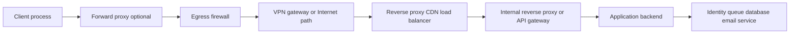

| Component | Primary function | Can create a new connection? | Common visible evidence |
|---|---|---:|---|
| Router | Forward packets by route/policy | Usually no transport proxy | Hop/route/ICMP/flow telemetry |
| Stateful firewall | Permit/drop/reject flows under policy/state | Usually no, unless proxy function | Rule/action/session/NAT logs |
| Forward proxy | Connect outward for clients | Yes | 407, CONNECT, proxy logs/certificate |
| Transparent proxy | Intercepts without explicit client target | Yes/often | Unexpected certificate/headers/path |
| Reverse proxy | Receives requests for servers | Yes | 502/504, request IDs, routing headers |
| Load balancer | Distributes flows/requests across backends | Depends on mode | VIP, pool member, health/affinity |
| VPN gateway | Encapsulates/routes protected traffic | Tunnel state, not normally app proxy | Routes, tunnel selectors, DNS policy |
| NAT gateway | Translates addresses/ports | Flow mapping, not app connection necessarily | Original/translated tuples |

## 2. Forward proxies

A **forward proxy** acts for clients reaching external services. The application connects to the proxy; the proxy enforces policy and creates or tunnels an outward connection. The SaaS origin sees the proxy's network identity, not necessarily the client IP. Authentication can identify a user/device/workload to the proxy separately from origin authentication.

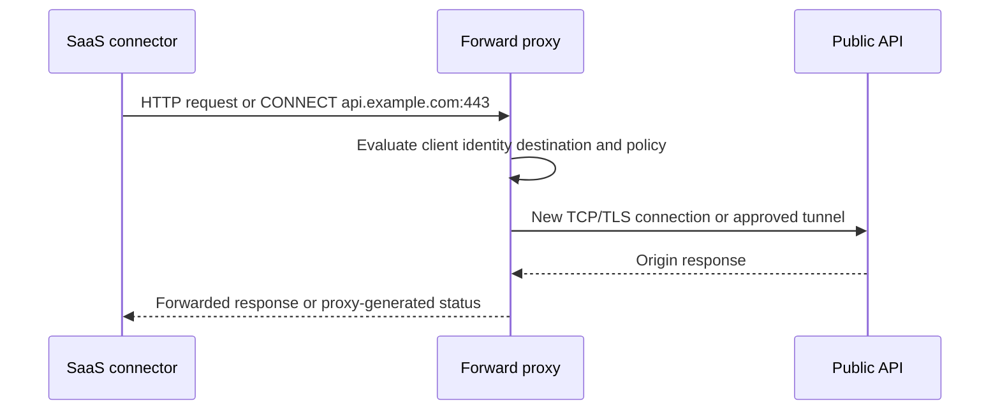

| Forward-proxy evidence | Meaning | What it does not prove |
|---|---|---|
| Client remote endpoint equals proxy | Application used explicit proxy path | Proxy reached origin |
| HTTP 407 | Proxy demands authentication | Origin rejected API token |
| Proxy-generated block page | Proxy policy denied request | Destination server received request |
| CONNECT 200 | Proxy established tunnel according to its semantics | TLS/HTTP inside tunnel succeeded |
| Enterprise-issued certificate | TLS inspection likely/approved path hypothesis | Exact origin certificate |
| Origin sees shared egress IP | Proxy/NAT is origin peer | Which client/user sent request without logs/IDs |

## 3. Explicit versus transparent proxies

An **explicit proxy** is configured in the application, operating system, environment, or PAC result. The client intentionally addresses the proxy and may use absolute-form HTTP targets or CONNECT. A **transparent/intercepting proxy** receives traffic redirected without the application explicitly selecting it; deployment can involve routing, firewall redirection, or network policy.

“Transparent” does not mean invisible or privacy-neutral. TLS interception must create a client-trusted substitute certificate or otherwise cannot read protected content. Certificate pinning, custom trust stores, mTLS, QUIC, non-HTTP protocols, and privacy/compliance policy can make interception incompatible.

| Feature | Explicit forward proxy | Transparent/intercepting proxy | Reverse proxy |
|---|---|---|---|
| Acts for | Client | Client/network policy | Server/service |
| Client configured? | Yes, directly or PAC | Not necessarily | Client targets service normally |
| Client transport peer | Proxy | May appear as destination depending interception | Service edge |
| Origin sees | Proxy egress | Proxy/interceptor egress | Reverse-proxy backend connection |
| Common error | 407/PAC/connect policy | Reset/cert/default-policy symptoms | 502/503/504/route errors |
| Owner | Endpoint/network/security | Network/security | Service/platform |

## 4. PAC and proxy selection

A PAC file is JavaScript that implements `FindProxyForURL(url, host)` and returns choices such as a proxy list or `DIRECT`. Discovery/configuration can be manual, managed policy, or Web Proxy Auto-Discovery (WPAD) depending environment. Evaluation may use host matching, network properties, DNS-related helper functions, and failover order.

PAC is code and can contain internal proxy names/topology. Do not paste a full enterprise PAC file into a public ticket. Record the sanitized input URL/host and effective result, along with source/version/hash/last update when authorized.

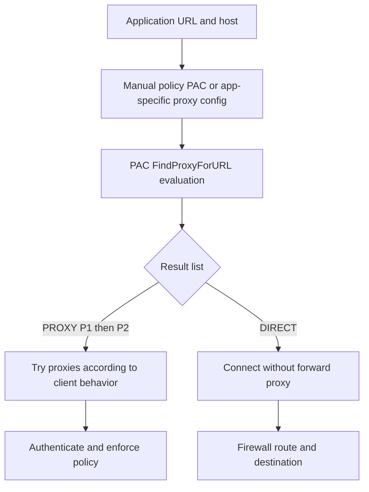

| PAC symptom | Plausible cause | Evidence | Caution |
|---|---|---|---|
| Browser works, service fails | Service ignores OS/PAC or uses env proxy | Effective proxy per process/runtime | Do not assume system setting applies |
| One hostname goes DIRECT | PAC match/order/case/helper behavior | Sanitized URL and evaluated result | Full PAC may expose internal data |
| Slow before connect | PAC download/evaluation/DNS/proxy failover | Timing by stage and PAC source | Application timeout may include PAC time |
| Different on VPN | Network/interface-dependent PAC logic or policy | Before/after effective result | VPN also changes DNS/routes |
| Old proxy selected | Cached PAC/policy/source update issue | Source URL/hash/cache/update UTC | Do not clear globally before evidence |

## 🔍 Plain-English deep-dive: “The proxy setting” may be five different settings

A browser may use managed policy and PAC; a Windows service may use WinHTTP; a desktop app may use WinINET/system settings; Java may use JVM properties; Linux tools may use environment variables; a container may have its own configuration. One device can therefore have multiple effective proxy paths.

Think of employees using different travel-booking systems even though they work for one company. Checking one portal does not prove another employee's booking route. The analogy stops because applications inherit, bypass, or implement proxy configuration according to runtime rules.

The evidence must name process/runtime, URL, effective proxy source/result, authentication context, and UTC. Never change global proxy state merely because a different client works.

## 5. CONNECT tunnels and 407

For HTTPS through an explicit forward proxy, the client commonly sends `CONNECT api.example.com:443 HTTP/1.1`. The proxy evaluates policy and, if allowed, creates a TCP connection to the target, replying with 2xx to establish a tunnel. The client then performs TLS through that tunnel unless the proxy performs authorized inspection.

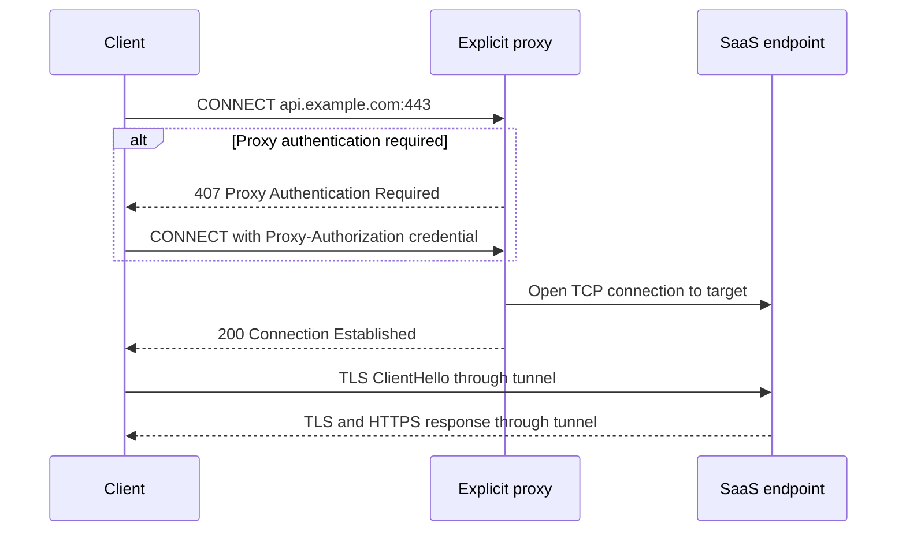

| Checkpoint | Proof | Remaining unknown |
|---|---|---|
| TCP to proxy | Client reached proxy listener | Proxy auth/policy/origin reachability |
| 407 | Proxy requires/rejects authentication | Origin API auth |
| CONNECT 200 | Proxy accepted tunnel and normally connected under contract | TLS certificate and HTTP operation |
| TLS success | Protected peer validated in client context | API authorization/product completion |
| HTTP status | Respondent processed one request | Backend/asynchronous state |

`Proxy-Authorization` is a credential and must never be retained. An origin `Authorization` token is distinct. Mixing 401 and 407 owners wastes time and risks credential exposure.

## 6. TLS inspection through a proxy

Authorized inspection creates two TLS sessions: client-to-proxy and proxy-to-origin. The client sees an enterprise-issued leaf; the origin sees the proxy. SNI, ALPN, versions, ciphers, trust stores, certificate policies, and timeouts can differ on each leg.

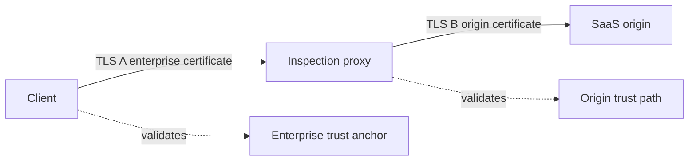

| Inspection issue | Client-side evidence | Proxy/origin evidence | Owner |
|---|---|---|---|
| App does not trust enterprise CA | Unknown issuer on session A | Proxy never receives usable HTTP | Endpoint/app/security |
| Proxy rejects origin chain | Proxy-generated TLS error | Session B validation failure | Proxy/security/service |
| mTLS incompatible | Client cert requested/consumed at wrong leg | Origin lacks expected client proof | Architecture/security/API |
| Certificate pinning | App rejects substituted leaf | Proxy policy indicates inspection | Application/security |
| ALPN/protocol downgrade | Front selects one protocol; back another | Leg-specific negotiation | Proxy/service |
| Privacy exception needed | Sensitive category/policy | Approved bypass/exclusion process | Security/compliance, not support ad hoc |

## 7. Firewalls and stateful rules

A firewall enforces policy on network traffic. A **stateful firewall** tracks flow/connection state and can permit return traffic related to an allowed outbound connection. A **stateless filter** evaluates packets more independently. Modern firewalls can also perform NAT, application identification, identity policy, TLS inspection, intrusion prevention, and proxy functions; document which function generated the evidence.

Rules can match source/destination addresses, zones/interfaces, protocol, ports, direction, identity, application, time, and other context. Rule order and implicit/default rules matter. “The port is allowed” is incomplete without source, destination, protocol, direction, state, application, and policy version.

| Firewall action | Wire symptom | Meaning | Caution |
|---|---|---|---|
| Allow | Flow passes this policy checkpoint | One boundary permitted traffic | Later boundary can fail |
| Drop | Discard silently | Client may time out/retransmit | Silence alone does not identify this firewall |
| Reject TCP | Return RST or policy response | Active denial | RST source/translation can complicate attribution |
| Reject ICMP | Return prohibited/unreachable feedback | Explicit network-layer denial | OS error wording varies |
| Reset established flow | Inject/send RST | Session terminated by policy/device | Need log/preceding protocol evidence |
| Log only/monitor | Observe without block | Telemetry | Sampling/disabled logging can hide events |

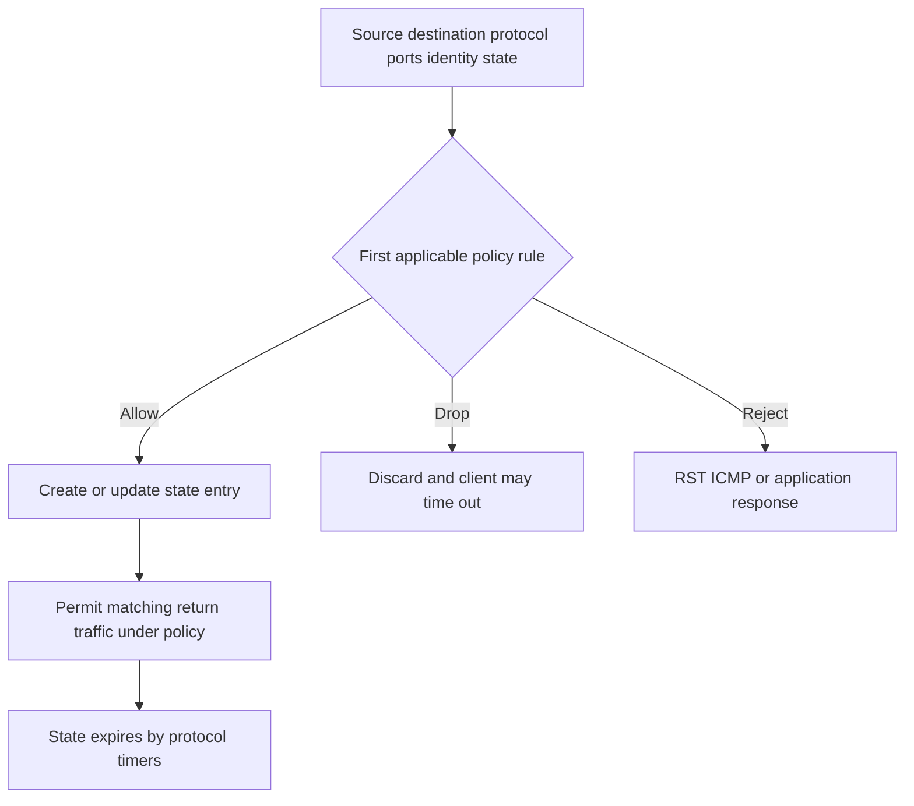

## 🔍 Plain-English deep-dive: A timeout is compatible with a firewall drop, but not proof of one

Repeated SYNs without replies can result from a silent firewall drop, wrong route, failed NAT, remote host outage, return-path loss, service black hole, or capture visibility. A firewall becomes the cause when its trusted log/policy/state evidence matches the exact original or translated tuple and UTC, or a controlled authorized policy test discriminates it.

Think of a letter receiving no reply. A mailroom might have discarded it, but the address could be wrong or the recipient absent. The analogy stops because packet captures and firewall sessions can correlate precise tuples and actions.

Say: “The connection timed out before TLS; firewall drop remains a hypothesis. We need matching policy/session evidence for tuple alias `FLOW-077-A` at 14:03 UTC.”

## 8. Egress controls and allowlists

**Egress control** governs outbound traffic. SaaS connectors may require HTTPS to documented FQDNs/ports, certificate-validation endpoints, identity providers, DNS, or update services. IP allowlists can be fragile when vendors use cloud/CDN addresses that change, share IPs, use IPv6, or vary by region. FQDN-based policy can also be complex because devices resolve/cache names differently and one FQDN can lead to aliases/multiple addresses.

| Allowlist approach | Benefit | Risk/limitation | Evidence |
|---|---|---|---|
| Static destination IP | Simple deterministic match | Cloud/CDN change, IPv6, shared IP | Current vendor-published ranges/change process |
| FQDN policy | Tracks names conceptually | Device resolution/cache/CNAME/wildcard semantics | Exact policy engine behavior and DNS view |
| Domain wildcard | Broad coverage | Excess privilege and ambiguous matching | Approved minimum documented domains |
| Service tag/cloud object | Provider-maintained ranges | Platform-specific/version/region | Current provider docs and policy logs |
| Proxy category/application | Central identity/content control | Misclassification, TLS/mTLS/QUIC limits | Proxy policy/version/logs |
| Source IP allowlist at SaaS | Limits accepted egress identities | NAT/proxy pools/failover/IPv6 change | Stable public egress ownership |

No allowlist should be broadened from a guessed IP captured once. Verify vendor documentation, DNS/CDN behavior, customer egress architecture, failover, IPv6, certificate validation dependencies, owner, review date, and removal process.

## 9. VPNs

A VPN creates a protected tunnel across another network and can install virtual interfaces, routes, DNS resolver policies, proxy settings, and security filters. In a **full tunnel**, most/default traffic is routed through the enterprise VPN. In **split tunneling**, selected prefixes/domains/apps use the VPN while other traffic uses the local Internet path. Definitions and implementation vary; read actual routes/policy.

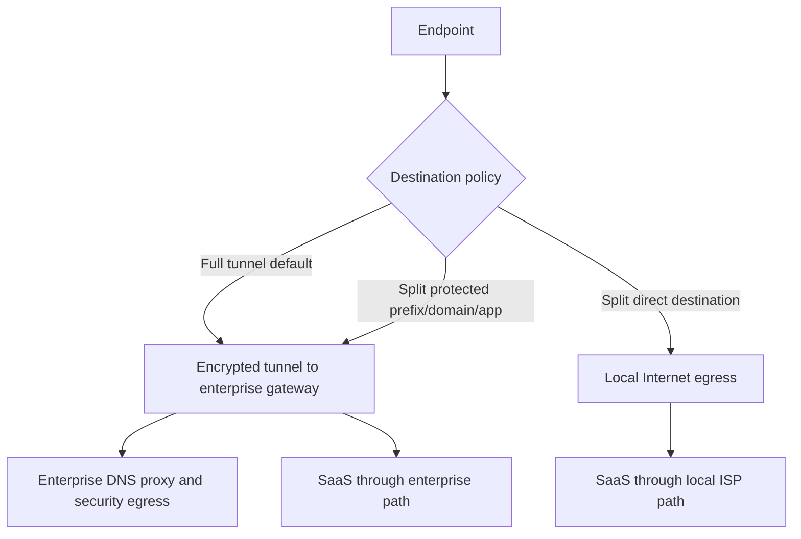

| VPN effect | Failure symptom | Read-only evidence | Owner boundary |
|---|---|---|---|
| More-specific route | One SaaS prefix fails only on VPN | Route lookup before/after | VPN/network |
| Default route takeover | All Internet goes enterprise path | Default/metric/interface | VPN/security |
| Split DNS | Internal/private answer only on VPN | Resolver per suffix/interface and qname | DNS/VPN |
| Prefix overlap | Local subnet collides with corporate range | Route specificity and selected interface | Network/VPN design |
| MTU overhead | Large transfers/TLS stall | MSS/PMTUD evidence | VPN/network; Part 078 |
| Proxy policy insertion | Service/browser paths differ | Effective proxy by process | Endpoint/proxy |
| Identity/conditional policy | Access changes on corporate egress/device state | Sign-in/policy logs | IAM/security |
| Tunnel reconnect | Existing TCP sessions reset/change path | VPN events, route/interface timeline | VPN/client/app |

## 🔍 Plain-English deep-dive: Split tunnel is a policy decision per destination, not “half a VPN”

In split tunneling, selected traffic follows the protected tunnel and other traffic follows a local path. The selection can depend on prefixes, domains, applications, routes, and platform policy. Two SaaS hostnames in one workflow can therefore take different egress, DNS, proxy, certificate-inspection, and conditional-access paths.

Think of an employee whose confidential parcels must use the corporate courier while ordinary mail uses the local post office. The system is not half protected; each category follows a defined route. The analogy stops because VPN policy can install virtual interfaces, DNS rules, filters, and dynamic routes.

When one API works and another fails on VPN, record each exact hostname/address, route lookup, source/interface, resolver/view, proxy result, and UTC. Do not infer the tunnel decision from a generic “VPN connected” icon, and do not disable the VPN to create a permanent workaround when policy requires it.

## 10. Load balancers

A load balancer distributes connections or requests across backend targets. An L4 load balancer makes decisions mainly from network/transport data such as address, port, and protocol. An L7 load balancer understands application protocol fields such as HTTP host/path/headers and can terminate TLS, redirect, authenticate, rate-limit, or generate statuses.

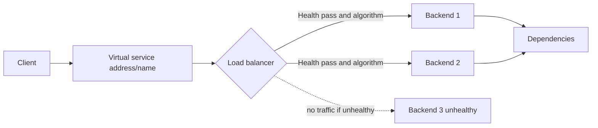

| Dimension | L4 load balancing | L7 load balancing |
|---|---|---|
| Primary visibility | IP, port, protocol, connection | HTTP/TLS/application metadata |
| Routing basis | Tuple/hash/connection algorithm | Host/path/header/cookie/content/policy |
| TLS | Often pass-through or transport-level termination depending product | Commonly terminates/inspects/re-encrypts |
| Error evidence | Reset/timeout/transport behavior | HTTP redirects/4xx/5xx/request IDs |
| Affinity | Source/tuple/hash | Cookie/header/session/application key |
| Health checks | TCP connect or protocol checks | HTTP path/status/content/dependency checks |

## 11. Health checks

A health check determines whether a backend should receive traffic. A TCP check can prove a listener accepts transport but not application readiness. An HTTP `/health` check can test an application path, but if too shallow it misses dependencies; if too deep it can remove every node during a shared dependency failure and amplify an outage.

| Health design | Proves | Misses/risk | Better evidence |
|---|---|---|---|
| TCP connect | Listener/transport accepts | TLS/app/dependencies | Pair with application readiness where appropriate |
| TLS handshake | TLS endpoint/identity from LB context | Auth/business dependencies | Record SNI/trust/policy |
| HTTP 200 shallow | Process route responds | DB/queue/identity dependencies | Separate liveness/readiness |
| Deep dependency check | End-to-end readiness | Shared dependency removes all nodes | Design fail-safe/degraded behavior |
| Content match | Correct expected body marker | Cache/stale/static response | Add request ID/version/backend identity |
| Passive health | Observes real flow failures | Low traffic/detection delay | Combine active/passive carefully |

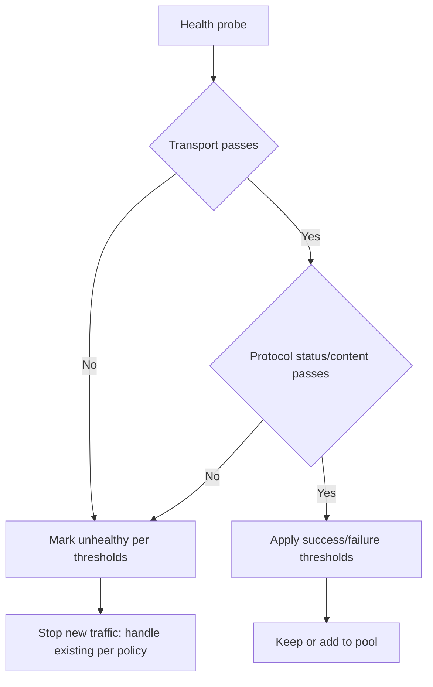

## 12. Affinity and uneven failures

**Session affinity** or stickiness routes related requests to the same backend, using source IP, cookies, headers, or consistent hashing. It can support local session state but can hide one bad node: one user repeatedly fails while others succeed. Shared proxy egress makes source-IP affinity uneven or ineffective.

| Symptom | Affinity hypothesis | Evidence | Alternative |
|---|---|---|---|
| One user always fails | Sticky cookie maps to bad backend | Redacted affinity value hash/backend ID/request IDs | User identity/config differs |
| Failures every N requests | One pool member unhealthy | Backend ID distribution and health | Intermittent dependency |
| All users behind proxy hit one node | Source-IP hash collapses clients | Egress IP/backend mapping | Global backend issue |
| Clearing cookies changes result | Cookie affinity/session/cache | Cookie name only, backend IDs | Login/session changed too |
| Retry succeeds | Different backend or transient condition | IDs/backend/connection reuse | Retry altered timing/load |

Do not ask customers to share affinity/session cookie values. A server-side request ID/backend-node ID is safer.

## 🔍 Plain-English deep-dive: A green health check proves only what it checks

A TCP health check can remain green while every API request fails authorization or database access. An HTTP `/health` endpoint returning static 200 can remain green during queue failure. Conversely, a deep check can mark all nodes down because one optional dependency is slow.

Think of checking that a restaurant's front door opens. It does not prove cooks, payment systems, or supplies are ready. The analogy stops because production health design uses thresholds, load-balancer state, dependencies, and failover behavior.

Support should compare probe source, protocol, SNI/Host/path, expected status/content, interval/timeout/thresholds, backend logs, and the real failing operation.

## 13. TLS termination patterns

| Pattern | Front leg | Backend leg | Identity/evidence boundary |
|---|---|---|---|
| TLS pass-through | Client TLS reaches backend | Same TLS session through LB routing | Backend certificate visible to client |
| TLS termination/offload | Client TLS ends at LB | Plain HTTP or other inside protected network | LB certificate; backend content unencrypted on that leg |
| TLS re-encryption | Client TLS ends at LB | New TLS session LB-to-backend | Two chains/SNI/ALPN/trust contexts |
| mTLS front only | Client cert validated at LB | Identity forwarded/mapped to backend | Secure identity propagation required |
| mTLS end-to-end/pass-through | Client cert reaches backend | TLS not terminated at LB | L7 routing visibility limited |

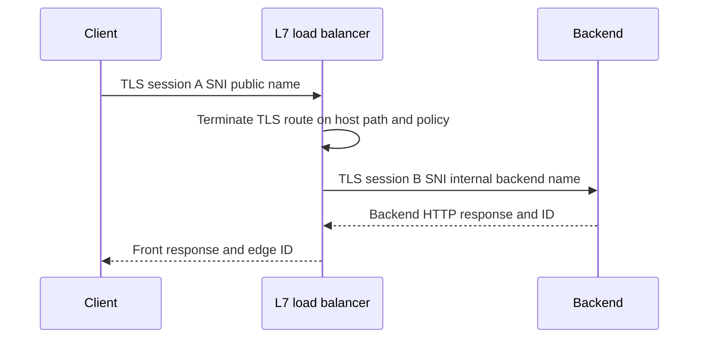

## 14. Worked examples

### Example A: 407 after service-account rotation

A Windows service connects to explicit proxy and receives 407; browser works with interactive user auth. TCP reaches proxy and origin is never contacted. Compare service runtime proxy source, supported proxy auth scheme, service identity, clock, and proxy logs. Do not send proxy credentials or reuse a user's credential.

### Example B: VPN-on API timeout

DNS returns same service addresses. VPN installs a `/32` route to the API address through a tunnel; SYN receives no reply. Off VPN, default route succeeds. This supports VPN route/path policy boundary; matching gateway/firewall evidence is needed before saying drop. Do not disable VPN as permanent fix if policy requires it.

### Example C: 502 on one backend

L7 gateway returns 502 for approximately one third of requests. Request IDs map failures to `BACKEND-077-C`; its backend TLS certificate expired while health check uses TCP only. Correct health design and certificate deployment through owners. Do not broaden retries without limits.

### Example D: SaaS source allowlist after egress failover

Customer source IP allowlist contains primary proxy egress only. Failover proxy uses another documented public IP and receives 403 at SaaS edge. Verify stable egress set and current vendor allowlist contract; update through approved change. Do not add an entire cloud range from a single observed IP.

| Example | Reporter | Failed leg | Owner | Correlation evidence |
|---|---|---|---|---|
| 407 | Forward proxy | Client-to-proxy auth | Proxy/endpoint/IAM | Proxy request/session ID + UTC |
| VPN timeout | Client | VPN-selected transport path | VPN/network/security | Route + tuple + gateway logs |
| Backend cert 502 | L7 gateway | Gateway-to-backend TLS | Service/LB/cert | Edge and backend IDs |
| Egress allowlist 403 | SaaS edge | Source-policy authorization | Network/SaaS admin | Egress IP + request ID/UTC |

## 15. Troubleshooting decision tree

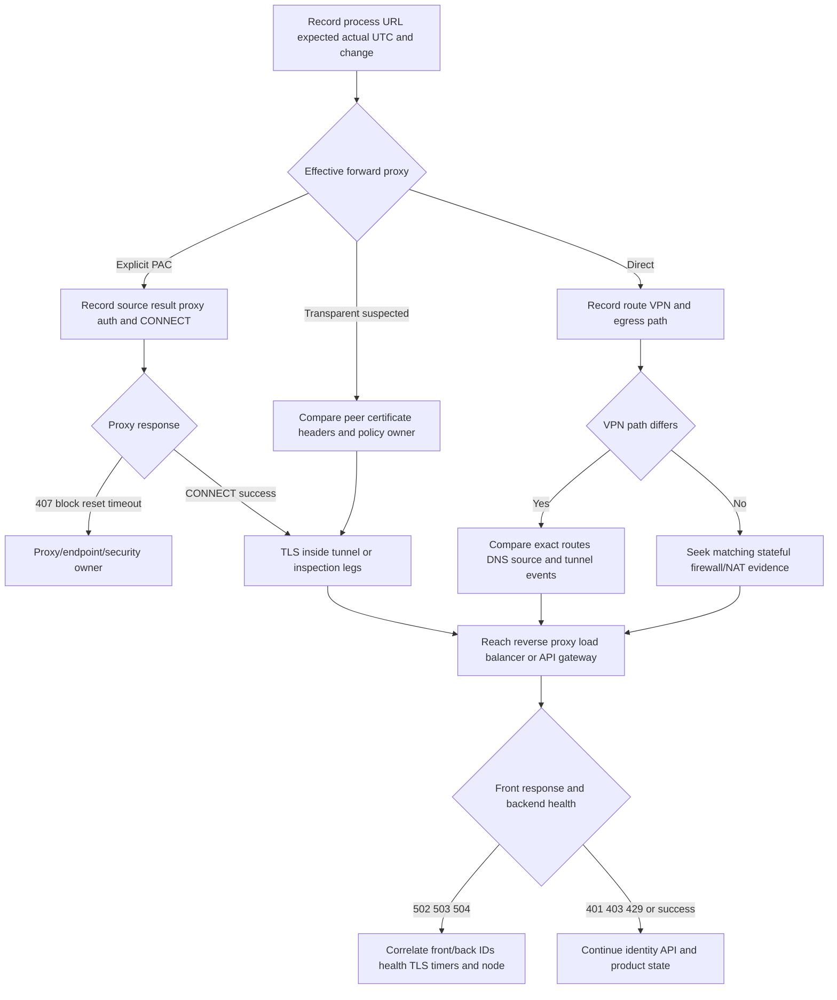

## 16. Failure modes and unsafe shortcuts

| Shortcut | Why risky/wrong | Better action |
|---|---|---|
| “No proxy configured” after checking one UI | Process/runtime/PAC/env can differ | Record effective path for failing process |
| Sharing PAC file | Exposes internal topology/code | Share sanitized evaluated result/hash/source |
| Sending proxy/origin credentials in logs | Credential compromise | Record scheme/identity alias/error only |
| Blaming firewall from timeout | Silence is ambiguous | Match tuple/UTC to trusted action/state logs |
| Temporarily allow all egress | Broad security exposure | Minimum documented destinations through change control |
| Allowlisting one resolved cloud IP forever | Dynamic/CDN/IPv6/failover | Use vendor-supported current method |
| Disabling VPN | Can violate access/security policy | Compare paths; owner-approved workaround only |
| Changing routes while collecting | Destroys baseline | Read before/after only under authorized change |
| Treating LB health green as app healthy | Probe may be shallow | Compare exact real operation and backend dependencies |
| Clearing affinity cookies | Changes session/evidence and exposes secrets | Use request/backend IDs; controlled test only |
| Treating TLS termination as one session | Mixes front/back certs and failures | Draw each leg with SNI/chain/ALPN/timer |
| Increasing all timeouts | Hides overload/dependency and increases queues | Find budget/latency stage and design async/recovery |

## 17. Ownership and escalation package

| Boundary | Owner candidates | Minimum evidence | Explicit ask |
|---|---|---|---|
| Application proxy selection | App/endpoint | Process/runtime, URL, proxy source/result | Confirm supported effective proxy path |
| Proxy authentication/policy | Proxy/IAM/security | 407/challenge, identity alias, policy/session ID, UTC | Explain denial or auth compatibility |
| Firewall/NAT | Network/security | Original/translated tuple, route, action/state log, UTC | Confirm rule/action/return path |
| VPN | Endpoint/VPN/network | interface, exact route, DNS view, tunnel events | Confirm intended split/full policy |
| Public service edge | Vendor/service | SNI/authority, status, edge request ID | Correlate edge routing/policy |
| Load balancer frontend | Platform | VIP, listener, TLS, route rule, edge ID | Identify selected pool/member |
| Health/backend | Service/platform | probe config/status, member ID, backend TLS/HTTP ID | Compare health to real operation |
| Application identity | IAM/API | principal/tenant/scope/role/resource/request ID | Explain authorization outcome |

### Timeline fields

| Stage | UTC/ID/evidence |
|---|---|
| Process selects proxy | Effective source/result and client ID alias |
| Client reaches proxy | Tuple and proxy session ID |
| CONNECT/auth decision | 2xx/407/policy ID |
| Proxy/TLS leg A | Client-visible chain/version/ALPN |
| Proxy/TLS leg B | Origin chain/version/ALPN from proxy logs |
| Firewall/NAT | Original/translated tuple/action/state |
| VPN | route/tunnel/interface/DNS transition |
| Load balancer | frontend request ID/pool/member/health |
| Backend | service request ID/status/dependency time |
| Client result | exact error/status and customer impact |

## Safe local lab: The Middlebox Ownership Map 077

### Prerequisites

- Learner-owned Windows and/or Linux workstation and authorization to read its proxy, route, resolver, and connection configuration.
- PowerShell on Windows; shell with `env`, `ip`, and optionally `resolvectl` on Linux.
- No requirement for Internet access. No packet capture, public probing, firewall log access, or admin rights.
- Do not print environment values unfiltered: proxy URLs can embed usernames/passwords. Commands below list variable names or require manual redaction before retention.
- No proxy/PAC/VPN/firewall/route/DNS/certificate/browser change; do not disconnect a required VPN.
- Synthetic systems use `CLIENT-077`, `PROXY-077`, `FW-077`, `VPN-077`, `LB-077`, `BACKEND-077-A/B/C`, and `api.example.test` only.
- Artifact label: **local lab - read-only effective-setting inventory plus synthetic middlebox topology**.

### Lab procedure

1. Record start UTC, OS, active VPN category (connected/not connected/not applicable), and explicit no-change statement.
2. On Windows, record WinHTTP proxy summary:

   ```powershell
   netsh winhttp show proxy
   ```

   Record only `DIRECT`, explicit proxy alias, or PAC/source category. Redact server/bypass details.
3. On Windows, inspect current-user Internet proxy settings only if authorized, without retaining raw registry data:

   ```powershell
   Get-ItemProperty 'HKCU:\Software\Microsoft\Windows\CurrentVersion\Internet Settings' | Select-Object ProxyEnable, AutoConfigURL
   ```

   Replace any URL with `PAC-URL-REDACTED`. Do not retrieve the PAC.
4. On Linux, list only proxy-related environment variable names, not values:

   ```bash
   env | cut -d= -f1 | grep -iE '^(http|https|all|no)_proxy$'
   ```

   If values are manually inspected for the learner's own diagnosis, never retain credentials/hosts in the artifact.
5. Record effective IPv4/IPv6 routes and DNS resolver category using Part 072/073 read-only commands. Keep only default/synthetic-relevant route aliases and whether a VPN interface has more-specific routes.
6. Create a process-to-proxy matrix for browser, PowerShell/curl, Windows service, Linux shell, Java/container conceptually. Mark actual known/unknown source, not assumptions.
7. Draw three topologies: direct, explicit forward proxy CONNECT tunnel, and authorized TLS-inspection two-leg path.
8. Create a PAC result worksheet for four synthetic URLs. Record input host, result `PROXY PROXY-077:8080` or `DIRECT`, failover order, owner, and what could cache it. Do not write executable PAC code.
9. Create a CONNECT state ladder: TCP proxy -> 407/auth -> CONNECT 200 -> TLS -> HTTP -> product state. Use no credential values.
10. Build a stateful firewall worksheet with allow, silent drop, TCP reject, ICMP reject, and reset. For each, predict client/capture/log evidence and list alternatives.
11. Build an egress allowlist review for `api.example.test`: FQDN, aliases, A/AAAA dynamics, required port/protocol, certificate/revocation dependencies, proxy/NAT public egress, failover, owner, review date. All data synthetic.
12. Draw full-tunnel and split-tunnel VPN routes. Add one prefix-overlap and one split-DNS failure.
13. Draw L4 pass-through and L7 TLS re-encryption load balancers. Map front/back tuples, SNI, certificates, IDs, and owners.
14. Define TCP, TLS, shallow HTTP, and deep dependency health checks; write one false-green and one false-red scenario.
15. Add cookie/source-IP affinity scenarios with a bad backend. Use only cookie name `AFFINITY-077`, never a value.
16. Run the troubleshooting tree for the four worked examples and produce an escalation packet for each.
17. Draft customer updates that avoid “firewall issue” until matching evidence exists.
18. Delete raw output, record end UTC, and complete cleanup.

### Expected evidence

- Minimized proxy-source inventory for the learner's own OS/process contexts.
- Redacted route/DNS/VPN category inventory without topology details.
- Direct, CONNECT-tunnel, and inspection topologies.
- PAC effective-result worksheet with no code/internal names.
- CONNECT/407/TLS/HTTP/product state ladder.
- Stateful firewall action-versus-observation matrix.
- FQDN/IP/IPv6/proxy/NAT/failover allowlist risk review.
- Full/split VPN route and split-DNS/overlap cases.
- L4/L7 and TLS pass-through/termination/re-encryption diagrams.
- Health-check and affinity failure cases.
- Four owner-specific escalation packets and customer updates.
- Spoken 90-second middlebox ownership answer.

### Cleanup and privacy

- Delete raw proxy, registry, environment, route, resolver, and interface output after retaining aliases/categories only.
- Verify no proxy credential, PAC URL/content, bypass list, internal hostname, VPN name, route/prefix, DNS suffix/server, public egress IP, certificate internal name, cookie, token, username, or process path remains.
- Do not retrieve PAC, display environment variable values in shared output, disconnect VPN, reset proxy, clear caches, import certificates, or change firewall/routes.
- No service/capture was started, so none should remain.
- Store no customer rulebase, network diagram, decrypted content, or vendor-private topology.
- Record: `Middlebox Ownership Map 077 completed read-only and synthetic; no proxy, PAC, firewall, VPN, route, DNS, certificate, load balancer, credential, or security setting changed.`

### Validation rubric

| Dimension | Fail | Developing | Pass |
|---|---|---|---|
| Proxy | Calls every proxy same | Forward/reverse | Maps explicit/transparent/PAC/CONNECT/407/inspection legs |
| Firewall | Says timeout equals block | Knows stateful | Distinguishes allow/drop/reject/reset with tuple/log causation |
| Allowlist | Uses one captured IP | Uses vendor list | Reviews FQDN/IP/AAAA/CDN/proxy/NAT/failover/change lifecycle |
| VPN | Says on/off only | Knows split tunnel | Maps routes, DNS, source, overlap, MTU/policy owners |
| Load balancer | Says distributes traffic | Knows L4/L7 | Maps health, affinity, TLS, front/back IDs and failure nodes |
| Ownership | Escalates to “network” | Names team | Names exact controllable boundary, evidence, and explicit ask |
| Safety | Changes settings/shares secrets | Read-only | Aliases/deletes raw output; changes nothing |
| Honesty | Claims network admin | Says learned | States support working familiarity and owner partnership |

## Official Source Anchors - August 24, 2026

| Official or primary source | Topic anchored | Boundary |
|---|---|---|
| [RFC 9110 - HTTP Semantics](https://www.rfc-editor.org/rfc/rfc9110.html) | Proxies, gateways, CONNECT, authentication/status semantics | Product proxy behavior varies |
| [RFC 7235 - HTTP Authentication](https://www.rfc-editor.org/rfc/rfc7235.html) | 401/407 challenge framework historical source | Semantics consolidated by RFC 9110 |
| [RFC 2817 - Upgrading to TLS Within HTTP/1.1](https://www.rfc-editor.org/rfc/rfc2817.html) | CONNECT/tunnel historical context | Current HTTP specs take precedence |
| [RFC 8446 - TLS 1.3](https://www.rfc-editor.org/rfc/rfc8446.html) | TLS handshake/security | Inspection creates separate sessions |
| [RFC 7296 - Internet Key Exchange Protocol Version 2](https://www.rfc-editor.org/rfc/rfc7296.html) | IKEv2/IPsec negotiation foundation | VPN products/modes vary |
| [RFC 4301 - Security Architecture for IP](https://www.rfc-editor.org/rfc/rfc4301.html) | IPsec architecture/selectors | Not all VPNs use IPsec |
| [RFC 4787 - NAT UDP Behavioral Requirements](https://www.rfc-editor.org/rfc/rfc4787.html) | NAT behavior context | NAT is not firewall security |
| [Microsoft Learn - WinHTTP AutoProxy support](https://learn.microsoft.com/en-us/windows/win32/winhttp/winhttp-autoproxy-support) | Windows WinHTTP PAC/auto-proxy concepts | Other runtimes differ |
| [Microsoft Learn - netsh winhttp](https://learn.microsoft.com/en-us/windows-server/administration/windows-commands/netsh-winhttp) | WinHTTP proxy display/config command | This lab uses show only |
| [Microsoft Learn - VPN routing decisions](https://learn.microsoft.com/en-us/windows/security/operating-system-security/network-security/vpn/vpn-routing) | Windows VPN split/full routing concepts | Client/platform policy varies |
| [Microsoft Learn - Azure Load Balancer health probes](https://learn.microsoft.com/en-us/azure/load-balancer/load-balancer-custom-probe-overview) | Official L4 health-probe example | Not proof of customer/vendor platform |
| [Microsoft Learn - Azure Application Gateway health monitoring](https://learn.microsoft.com/en-us/azure/application-gateway/application-gateway-probe-overview) | Official L7 health-probe example | Product-specific behavior |
| [curl proxy documentation](https://everything.curl.dev/usingcurl/proxies/index.html) | curl proxy/CONNECT behavior | Ensure no credentials in output |
| [WHATWG Fetch Standard](https://fetch.spec.whatwg.org/) | Browser proxy/network fetch context and credentials | Living standard/client policy |

### Source-use discipline

- Identify the exact function before saying “proxy,” “firewall,” “VPN,” or “load balancer.”
- Record each leg's tuple, TLS identity, HTTP respondent, timer, request/session ID, UTC, and owner.
- Treat PAC, proxy logs, rulebases, VPN routes, egress IPs, health configuration, and decrypted content as sensitive.
- Never broaden egress, disable VPN/inspection, bypass proxy, import CA, clear affinity, or alter health/routing merely to make a test pass.
- Require matching trusted policy/session evidence before assigning firewall cause.
- Verify current vendor allowlist/proxy/mTLS/endpoint guidance in approved documentation.

## Likely Interview Questions

### Q1. How do forward and reverse proxies differ?

**Model answer:** A forward proxy acts for clients reaching outward; the application connects to it explicitly or through policy and the origin sees proxy egress. A reverse proxy acts for servers; clients target the service and the proxy routes to backends. Either can terminate TLS and generate HTTP errors, so I identify the actual respondent and both connection legs.

### Q2. Explain CONNECT and HTTP 407.

**Model answer:** An HTTPS client commonly sends CONNECT host:port to an explicit forward proxy. A 407 is the proxy's authentication challenge, distinct from origin 401. After policy/auth, a 2xx establishes the tunnel; TLS and HTTP still must succeed inside it. I never share Proxy-Authorization credentials.

### Q3. Why does a timeout not prove a firewall block?

**Model answer:** Repeated SYN without reply is compatible with silent drop, but also wrong route, NAT failure, host outage, listener silence, return-path loss, or capture limitations. I correlate the exact original/translated tuple and UTC with trusted firewall action/state logs or another discriminating boundary before assigning cause.

### Q4. What are the risks of IP and FQDN allowlists for SaaS?

**Model answer:** Cloud/CDN IPs can change, be shared, vary by region/failover, and include IPv6; FQDN policies depend on the device's DNS/CNAME/cache/wildcard behavior. I use the vendor-supported current method, minimum destinations/ports, egress architecture, failover and review lifecycle, never one observed IP guess.

### Q5. How do full- and split-tunnel VPNs affect troubleshooting?

**Model answer:** Full tunnel usually sends default/most traffic through enterprise egress; split tunnel sends selected prefixes/domains/apps through VPN and other traffic locally. VPN can also change DNS, proxy, source identity, MTU, and policy. I compare actual route lookup, resolver/view, interface/source, and tunnel events without disabling required controls.

### Q6. How do L4 and L7 load balancers differ?

**Model answer:** L4 primarily distributes transport flows using addresses/ports/protocol and tuple/hash algorithms. L7 understands HTTP/TLS context and can route on host/path/header, terminate TLS, authenticate, or generate statuses. I correlate frontend ID to pool/member, backend TLS/HTTP ID, health state, and timer.

### Q7. Why can a load balancer be green while the application fails?

**Model answer:** Health proves only its configured probe. TCP can pass while TLS, authorization, or dependencies fail; a shallow 200 may be static. I compare probe source, protocol, SNI/Host/path, expected content, thresholds, and backend logs with the exact failing operation. Affinity can also pin only some users to a bad node.

### Q8. How do you position your middlebox experience honestly?

**Model answer:** I have working familiarity with proxy selection, CONNECT/407, stateful policy evidence, VPN routes/DNS, and L4/L7 health/affinity/TLS legs, reinforced through read-only labs. My production strength is enterprise support ownership and cross-team escalation, not firewall/VPN/load-balancer administration.

## Memory Hooks

- **Forward proxy acts for client; reverse proxy acts for service.**
- **Explicit is configured; transparent is intercepted; either can inspect.**
- **PAC result belongs to a process, URL, network, and time.**
- **407 is proxy auth; 401 is origin auth.**
- **CONNECT 200 opens a tunnel, not a successful API.**
- **Inspection creates client-proxy and proxy-origin TLS sessions.**
- **Allow, drop, reject, reset are different observations.**
- **Timeout supports drop as one hypothesis, never proof alone.**
- **NAT translates; firewall policy filters.**
- **Full/split VPN changes routes and often DNS/proxy/source.**
- **L4 sees flows; L7 sees application protocol.**
- **Health is only as deep as the probe.**
- **Affinity can make one bad backend look user-specific.**
- **Name the boundary, evidence, owner, and ask.**

## Completion Checklist

- [ ] I can distinguish forward, explicit, transparent/intercepting, and reverse proxies.
- [ ] I can explain process-specific proxy sources and PAC at a safe high level.
- [ ] I can narrate CONNECT, 407, tunnel establishment, TLS, and HTTP checkpoints.
- [ ] I can draw two TLS-inspection legs with separate trust/ALPN/timers.
- [ ] I can explain stateful versus stateless policy and allow/drop/reject/reset outcomes.
- [ ] I can avoid assigning firewall cause from timeout alone.
- [ ] I can review egress/FQDN/IP/IPv6/proxy/NAT/failover allowlist risks.
- [ ] I can distinguish full and split VPN and compare route/DNS/source effects.
- [ ] I can distinguish L4 and L7 load balancing.
- [ ] I can evaluate TCP/TLS/HTTP/dependency health checks and thresholds.
- [ ] I can explain affinity and uneven backend failures without sharing cookies.
- [ ] I can map TLS pass-through, termination, re-encryption, and mTLS boundaries.
- [ ] I completed or can explain **The Middlebox Ownership Map 077**.
- [ ] I made no proxy/PAC/firewall/VPN/route/DNS/certificate/load-balancer change.
- [ ] I deleted/redacted raw topology and credential-sensitive settings.
- [ ] I can answer exactly Q1–Q8 aloud with honest ownership boundaries.
- [ ] I checked Official Source Anchors dated August 24, 2026.

[Next: Part 078 - Latency Loss Retransmission and MTU](Part-078-latency-loss-retransmission-and-mtu.md)