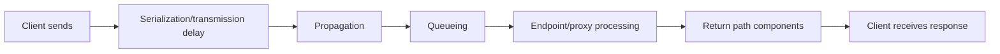
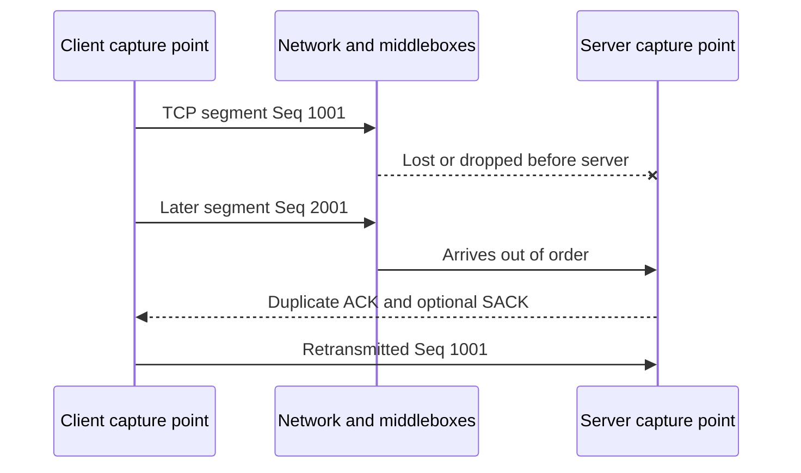
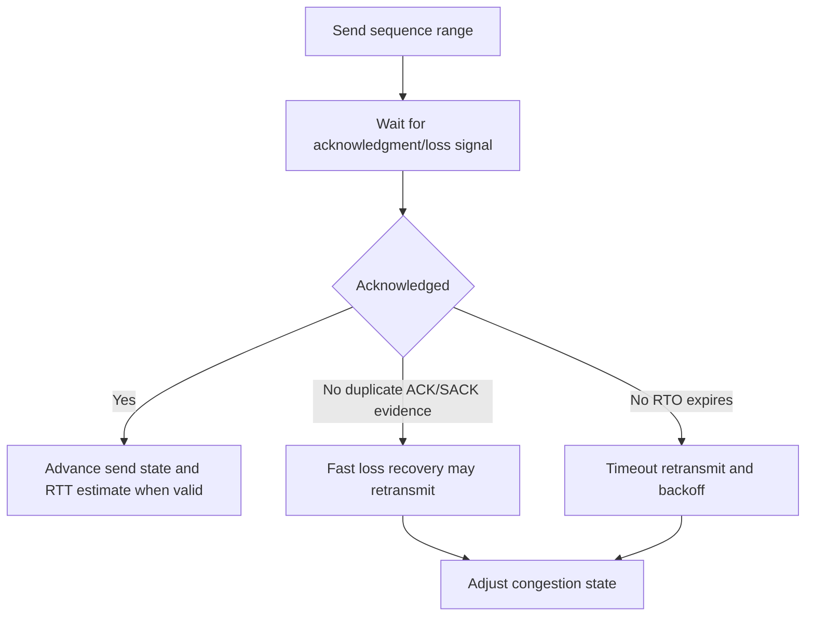
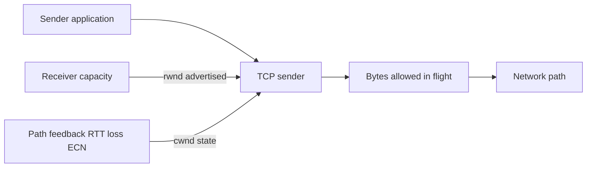
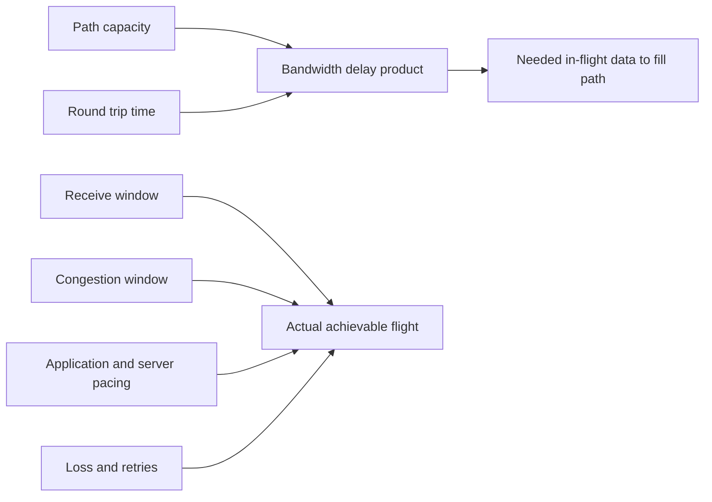
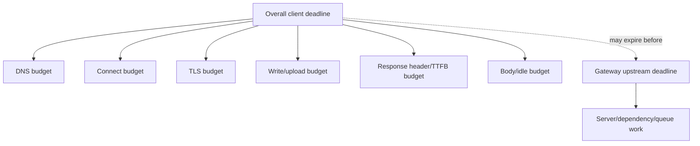
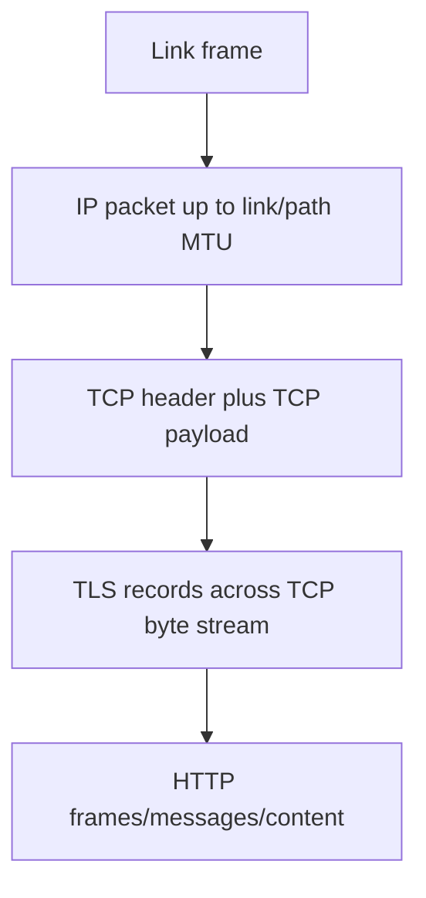
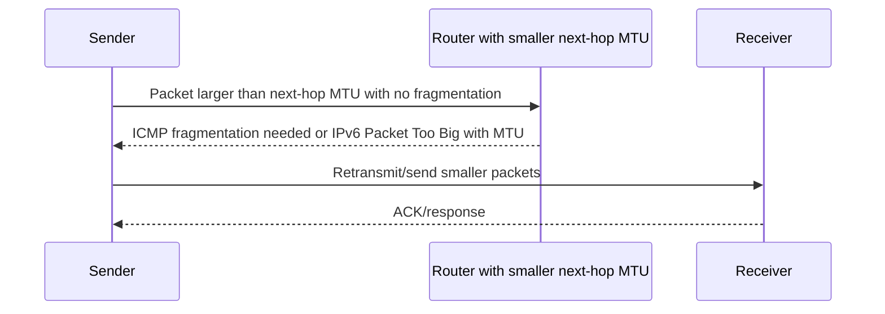
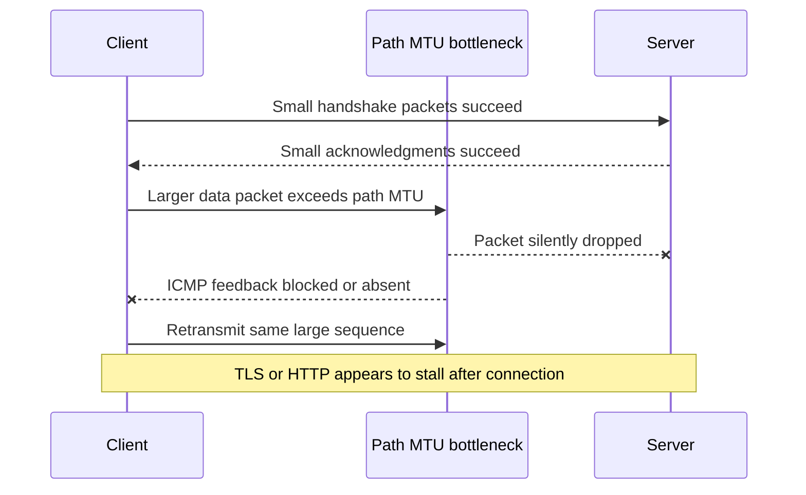
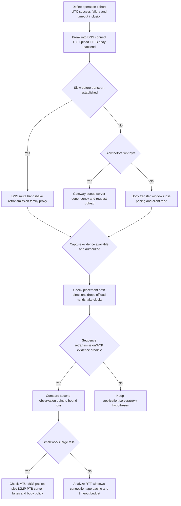

# Part 078 - Latency Loss Retransmission and MTU

> **Purpose:** Convert “slow,” “intermittent,” and “large requests fail” into measured transport/path hypotheses without treating analyzer labels or correlation as root cause.
>
> **Artifact label:** Learned architecture plus loopback/local calculation lab and one optional bounded public HEAD timing. No packet size attack, flood, tuning, firewall change, or third-party path probing.
>
> **Currency and source access date:** August 24, 2026.

## Section goal

By the end of this Part, Arti should be able to distinguish one-way latency, round-trip time (RTT), jitter/variation, packet loss, retransmission, timeout, throughput, and goodput. She should understand TCP retransmission timeout (RTO), duplicate acknowledgments, fast retransmit/recovery, flow control, congestion control, receiver window, congestion window, and bandwidth-delay product (BDP) at a support level without claiming one capture proves the network device that caused loss.

She should be able to connect transport delay to application timeout budgets and identify where DNS, connect, TLS, first-byte, read, overall operation, gateway, queue, and asynchronous-processing timers differ. She should understand Maximum Transmission Unit (MTU), TCP Maximum Segment Size (MSS), IPv4/IPv6 fragmentation differences, Path MTU Discovery (PMTUD), ICMP “packet too big”/fragmentation-needed feedback, Packetization Layer PMTUD, and the characteristic “small works, large stalls” black-hole hypothesis.

The support objective is to diagnose SaaS/API/email symptoms with restraint. A Wireshark “TCP Retransmission” label is an expert-system inference based on packets visible at one capture point. It can reflect real loss, capture loss, offload, reordering, or asymmetric visibility. A long API request can reflect path RTT, server compute, queueing, rate limit, proxy buffering, dependency latency, or client timeout design. Measurement must separate observations from explanations.

## JD Mapping

| Supplied role signal | Capability developed | SaaS/API/email example | Proof artifact |
|---|---|---|---|
| Complex investigations | Converts slowness/intermittence into stage metrics and hypotheses | Connector times out on large exports | Performance timeline |
| API support | Distinguishes connect/TLS/TTFB/body/operation timing | 504 at 30 seconds | Timeout-budget worksheet |
| Cloud Email Security | Reasons about large attachments/API payloads and mail/API retry behavior | Small messages work; large upload stalls | MTU/MSS hypothesis card |
| SaaS Security | Avoids retry storms and unsafe tuning | Audit collector retransmits under loss | Goodput/retry analysis |
| Tool familiarity | Interprets capture expert information cautiously | Retransmission labels | Evidence rubric |
| Customer trust | Reports measured degradation without fabricated root cause | Accurate status update | Observation/inference table |
| Engineering escalation | Supplies stage timing, tuple, capture points, sequence gaps, MTU evidence, IDs | Reproducible performance case | Escalation packet |
| Security/privacy | Uses loopback/bounded public reads and no flooding | Safe lab | Cleanup checklist |
| Continuous learning | Uses current TCP/PMTUD/QUIC and tool docs | Standards-based reasoning | Source ledger |
| Honest positioning | Frames network-performance analysis as working familiarity | Interview answer | Honesty statement |

## Candidate honesty note

Arti can describe latency/loss/retransmission/MTU analysis as **working familiarity and lab-based learning**, supported by her production experience in Microsoft enterprise support, critical-case coordination, evidence correlation, and fix validation. She should not claim to be a network performance engineer, congestion-control implementer, carrier operator, or packet-forensics expert; nor should she prescribe production MTU/MSS, TCP, firewall, VPN, or timeout changes without the owning team's design and change control.

| Evidence tier | Safe claim | Boundary |
|---|---|---|
| Production transfer | Structured timing, competing hypotheses, customer updates, Engineering escalation | Not network performance ownership |
| Working familiarity | RTT/loss/retransmission/window/MTU interpretation | Not single-capture root-cause certainty |
| Local/public lab | Loopback transfer timing and synthetic calculations; optional one HEAD | Not customer path benchmarking |
| Learned architecture | TCP congestion/PMTUD/PLPMTUD/QUIC concepts | Algorithms/implementations vary |
| Unknown | Abnormal timeout budgets, edge MTU, retry behavior, congestion algorithms | Verify approved current docs |

## 1. Delay has components

**Latency** is delay from one point/event to another. One-way network latency requires synchronized clocks or specialized measurement. **Round-trip time (RTT)** measures send-to-reply/acknowledgment time from one observer and avoids separate clock synchronization. RTT includes forward and return path, processing, serialization, propagation, and queueing components.

An analogy is a parcel round trip: travel distance, time waiting at depots, time to scan, and time to load onto a vehicle all contribute. The analogy stops because network packets are serialized at link rates, routes can differ by direction, and protocol acknowledgments may be delayed/coalesced.



| Delay component | Plain meaning | Clue | Caveat |
|---|---|---|---|
| Processing | Time a device/app needs to inspect/compute | Server spans/CPU/queue | Timestamps must align |
| Queueing | Waiting behind other work/packets | Variable RTT under load | Can occur network or application |
| Serialization | Time to put bits onto a link | Packet size/link rate | Usually small on fast links but access links matter |
| Propagation | Signal travel time | Geographic/path floor | Route can be indirect/asymmetric |
| Protocol setup | DNS/TCP/TLS rounds | Stage timing | Reuse/resumption can remove rounds |
| Application work | Auth, query, scan, queue, dependency | TTFB/server trace | Not “network latency” |

## 2. RTT and application timing

HTTP tooling can expose DNS lookup, TCP connect, TLS connect, time to first byte (TTFB), and total time. TTFB includes request transmission, network RTT, proxy/gateway handling, server queue/compute, and response-start travel. It is not a pure server-processing metric.

| Metric | Start/end | What it includes | What it cannot isolate alone |
|---|---|---|---|
| DNS time | Query start to usable result | Cache/resolver/network/authority as needed | Exact authoritative processing without deeper evidence |
| Connect time | TCP open attempt to established | Route/RTT/retransmission/listener | TLS/app |
| TLS time | Connection through handshake complete | RTT, crypto, chain/status, proxy | HTTP/backend work |
| TTFB | Request start to first response byte | Upload, RTT, gateway, server/dependency start | Which internal stage |
| Download time | First to last response byte | Transfer rate, flow/congestion, client read | Server generation if streaming |
| Total | Whole client operation | Every configured stage/retry | Root cause without breakdown |


## 3. Jitter and variation

**Jitter** is variation in delay over time. Definitions differ by measurement context; for support, state the calculation instead of reporting an unlabeled “jitter” number. You might use successive RTT difference, standard deviation, percentile spread, or protocol-specific interarrival variation.

| Statistic | What it shows | Use | Caution |
|---|---|---|---|
| Minimum | Best observed floor | Approximate baseline | Sample may be unrepresentative |
| Median (p50) | Typical middle observation | Stable center | Hides tail problems |
| p95/p99 | Tail delay exceeded by 5%/1% | User timeout/tail experience | Needs enough samples |
| Maximum | Worst sample | Outlier visibility | One outlier not trend |
| Standard deviation | Spread around mean | Variation summary | Sensitive to distribution/outliers |
| Successive difference | Change between adjacent samples | Interactive/real-time variation | Sign/absolute definition matters |

For SaaS support, a percentile distribution and stage breakdown are usually more useful than one average. Ten users can experience 20 ms typical requests while one percent reach 10 seconds and trigger retries.

## 🔍 Plain-English deep-dive: An average can describe a system no user actually experiences

Suppose nine requests finish in one second and one finishes in 91 seconds. The average is ten seconds, but no request took ten seconds. Median is one second; maximum is 91; p90/p95 depends on method/sample. Reporting only “average 10 seconds” hides both normal and catastrophic experiences.

Think of average household income in a group with one billionaire. The analogy stops because latency distributions are time-dependent, censored by timeouts, and affected by retries and concurrency.

Always record count, window, percentile method, successes, failures/timeouts, client/path cohort, and operation. Timeouts may disappear from latency averages if they are excluded, making an unhealthy system look fast.

## 4. Packet loss and observation

Packet loss means a packet sent at one point is not received at the intended next observation/application path. Causes include congestion queue drop, corruption, policy, interface errors, wireless conditions, routing loops, MTU/fragment handling, host overload, and capture loss. A sender-side trace alone usually shows missing acknowledgment, not the exact loss location.



| Evidence | Supports | Does not prove |
|---|---|---|
| Sender retransmits same sequence | Sender lacked sufficient acknowledgment under its logic | Which link/device lost original/ACK |
| Receiver never captured original | Loss before receiver or receiver capture miss | Exact hop |
| Interface discard counter increases | Local interface/device drops | That this flow caused counter change without correlation |
| Firewall log says drop for tuple | Policy device dropped matching observed packet | Other losses did not occur too |
| Wi-Fi retry/low signal | Local-link impairment plausible | End-to-end TCP loss cause alone |
| One-way capture missing ACKs | Visibility/asymmetry/capture loss possible | Receiver did not send ACK |

## 5. Retransmission and analyzer caveats

TCP retransmits sequence space when acknowledgments/loss signals indicate data might not have arrived. Wireshark labels such as “Retransmission,” “Fast Retransmission,” “Spurious Retransmission,” “Duplicate ACK,” and “Previous segment not captured” are analysis heuristics based on packets visible in the file.

Capture placement and offload matter. TCP segmentation offload (TSO), generic segmentation offload (GSO), large receive offload (LRO), receive-side coalescing (RSC), checksum offload, virtualization, and packet drops in the capture path can make local frames look unlike wire packets. Capturing only one direction or starting midstream also confuses analysis.

| Capture condition | Possible misleading sign | Verification |
|---|---|---|
| Sender host before segmentation offload | Very large “TCP segment” | Capture closer to wire/disable only under approved expert test; inspect offload metadata |
| Receiver coalescing | Fewer/larger packets | Compare external capture/server evidence |
| Capture drops | Sequence gaps/retransmission flags | Capture statistics and resource use |
| Midstream start | Unknown sequence/window scale | Capture handshake if safe/reproducible |
| One direction missing | Duplicate/spurious labels | Confirm interface/filter/asymmetry |
| Multiple capture points | Apparent duplicates/different timestamps | Label points and clock alignment |

## 🔍 Plain-English deep-dive: Wireshark expert information is a smoke detector, not a fire investigator

An expert flag draws attention to a pattern. It does not know every packet the hosts saw, every offload transformation, or why a packet was delayed. “TCP Retransmission” is a useful search marker; root cause requires sequence/ACK/timing, both directions, capture statistics, and often another observation point.

Think of a smoke alarm. It correctly asks you to investigate, but cannot by itself distinguish burnt toast from an electrical fire. The analogy stops because packet heuristics are deterministic analyses of available frames, not physical sensors.

Use language such as: “The capture contains 18 analyzer-labeled retransmissions in the affected flow; capture loss is zero according to available statistics, and the receiver trace lacks the original segments. This supports loss between points A and B but does not locate the device.”

## 6. RTO and fast retransmit at a high level

TCP estimates RTT and maintains a retransmission timeout (RTO). If acknowledgment does not arrive before RTO, it retransmits and generally backs off. Fast retransmit/recovery can retransmit before RTO after acknowledgment patterns indicate a gap; selective acknowledgments improve knowledge of received blocks. Modern algorithms are detailed and implementation-specific.



| Recovery signal | Typical timing | Benefit | Caution |
|---|---|---|---|
| RTO expiry | Timer after insufficient ACK | Recovers when no better signal | Adds significant delay/backoff |
| Duplicate ACK pattern | Later data reaches receiver but gap remains | Can recover faster | Reordering can also produce duplicates |
| SACK blocks | Receiver identifies noncontiguous received data | Efficient selective retransmission | Requires negotiated support |
| RACK/TLP concepts | Time-based modern loss detection/probes | Improves tail recovery | OS/version-specific; high-level only |

## 7. Flow control versus congestion control

TCP flow control protects the receiver using the advertised receive window (`rwnd`). Congestion control protects the network using a sender-side congestion window (`cwnd`) and algorithms responding to acknowledgments, loss, Explicit Congestion Notification (ECN), and timing. The effective in-flight data is constrained by both, roughly the smaller of applicable windows plus implementation details.



| Symptom | Flow-control hypothesis | Congestion/path hypothesis | App alternative |
|---|---|---|---|
| Zero window | Receiver buffer/app not consuming | Not primary signal | Receiver app blocked/slow |
| Repeated window updates | Receiver capacity changes | Path may be fine | App read behavior |
| Loss and reduced sending | Congestion algorithm reacts | Queue/path loss | Capture artifacts |
| High RTT, no loss, low transfer | Window/BDP limitation possible | Path latency | Server pacing/client read |
| Good transport but slow TTFB | Not flow window | Not necessarily congestion | Server queue/compute/dependency |

## 8. Throughput, goodput, and overhead

**Bandwidth/capacity** is the theoretical or configured rate a path/link can carry. **Throughput** is the observed delivered rate at a chosen layer, potentially including protocol overhead/retransmissions depending measurement. **Goodput** is useful application payload delivered per time, excluding retransmitted data and lower-layer overhead.

$$
\text{goodput}=\frac{\text{useful application bytes delivered}}{\text{elapsed seconds}}
$$

| Metric | Numerator | Includes retries/headers? | Use |
|---|---|---|---|
| Link rate | Raw bit capacity | Physical framing context | Upper bound for one link |
| IP throughput | IP bytes/time | IP headers, retransmitted packets if counted | Network utilization |
| TCP throughput | TCP bytes/time | Definition must state retransmissions/headers | Flow performance |
| Application goodput | Unique useful payload/time | Excludes retries/transport headers | Customer task rate |
| Transactions/sec | Completed operations/time | Depends on operation size/quality | API capacity |

Do not run bandwidth tests against third-party SaaS endpoints. They generate load and can violate policy. Use service telemetry, approved internal tools, or synthetic localhost data.

## 9. Bandwidth-delay product

BDP estimates how much data can be “in flight” to fill a path:

$$
\text{BDP bits}=\text{bandwidth bits/s}\times\text{RTT seconds}
$$

Example: a 100 Mbps path with 80 ms RTT has:

$$
100{,}000{,}000\times0.08=8{,}000{,}000\text{ bits}=1{,}000{,}000\text{ bytes}
$$

Approximately 1 MB must be in flight to fill the theoretical path, before protocol/implementation constraints. BDP is not a promise of throughput; congestion window growth, receive window, loss, application pacing, server limits, encryption, and shared capacity matter.



### BDP examples

| Capacity | RTT | BDP bytes approx | Interpretation |
|---:|---:|---:|---|
| 10 Mbps | 20 ms | 25,000 | Small regional path |
| 100 Mbps | 80 ms | 1,000,000 | About 1 MB in flight |
| 1 Gbps | 100 ms | 12,500,000 | About 12.5 MB |
| 20 Mbps | 250 ms | 625,000 | High-latency link needs substantial flight |

## 🔍 Plain-English deep-dive: A wide, long pipe needs more water in flight

BDP is like the amount of water occupying a pipe: capacity is pipe flow rate, RTT is the round-trip length in time, and BDP is how much must be moving to keep it full. A tiny send window leaves a high-capacity long path underused.

The analogy stops because TCP adapts congestion state, applications pause, packets are discrete, acknowledgments have policies, and the path is shared/dynamic.

Use BDP to test plausibility, not prescribe socket buffers. Production tuning requires OS/application/network owners, measurement, change control, and rollback.

## 10. Application timeout budgets

A timeout is a policy deadline. Different timers can overlap: DNS, connect, TLS, request write, response-header/TTFB, idle/read, total operation, proxy upstream, load balancer, server execution, dependency, queue visibility, webhook delivery, and retry budgets.



| Timer | Typical owner | Symptom | Evidence |
|---|---|---|---|
| DNS | Runtime/OS/resolver | Name resolution timeout | Query attempts/resolver/UTC |
| Connect | Client library | SYN retries then client error | Tuple/capture/state |
| TLS handshake | Client/proxy/server | Handshake timeout | Hello/alert/timing |
| Request write | Client/proxy | Large upload stalls | bytes sent/window/MTU/server reads |
| Response header/TTFB | Client/gateway | No status before deadline | server request timing/queue |
| Read/idle | Client/proxy | Streaming body pauses | byte/timestamp sequence |
| Gateway upstream | Reverse proxy | 504 | front/back IDs and timer |
| Server execution | Application | Internal cancellation/deadline | traces/dependencies |
| Overall | User workflow | Generic timeout masks stage | client stage breakdown |
| Retry budget | Client/integration | Retry storm/long tail | attempts/backoff/total time |

Increasing one timer can push failure to another layer, increase queue occupancy, duplicate work, and make users wait longer. Prefer asynchronous 202/status patterns for long operations and align deadlines/retries with idempotency and capacity.

## 11. MTU and MSS

The **Maximum Transmission Unit (MTU)** is the largest network-layer packet a link/interface can carry without lower-layer fragmentation mechanisms. Ethernet commonly has an IP MTU of 1500 bytes, but tunnels, VPNs, PPPoE, cloud overlays, and jumbo frames differ.

TCP's **Maximum Segment Size (MSS)** is the maximum TCP payload a peer advertises for received segments, generally based on its outgoing interface MTU minus IP/TCP base headers. IPv4 without options commonly uses 20-byte IP + 20-byte TCP headers, so MTU 1500 suggests MSS 1460. IPv6 base header is 40 bytes, so base calculation suggests 1440, but TCP options and actual path behavior matter.

| Concept | Scope | Includes | Example/caution |
|---|---|---|---|
| Link MTU | One interface/link | IP packet size | Tunnel overhead reduces effective path MTU |
| Path MTU | Minimum MTU along route | End-to-end IP path constraint | Can differ by direction/change over time |
| TCP MSS | TCP payload peer advertises | Excludes IP/TCP headers | Advertisement is endpoint receive intent, not full path guarantee |
| Application record/chunk | App/TLS/HTTP unit | App bytes | Stack segments/coalesces independently |
| Frame size | Link-layer unit | Link headers/trailer plus payload | Different from IP MTU |



## 12. Fragmentation differences

IPv4 routers can fragment packets in some circumstances unless Don't Fragment (DF) is set; endpoints can also fragment. IPv6 routers do not fragment transit packets; the source uses fragmentation headers when appropriate after learning path limits. Fragmentation adds overhead and loss sensitivity; modern transports prefer PMTUD/appropriate packetization.

| Area | IPv4 | IPv6 | Support implication |
|---|---|---|---|
| Router fragmentation | Possible when allowed | Not performed by routers | IPv6 depends strongly on ICMPv6 Packet Too Big/PMTUD |
| Source indication | DF controls no-fragment behavior | Source handles fragmentation | Tool syntax differs |
| Feedback | ICMP Destination Unreachable fragmentation needed | ICMPv6 Packet Too Big | Blocking feedback can black-hole large packets |
| Minimum link MTU expectations | Different legacy requirements | IPv6 minimum link MTU 1280 | Tunnels still need correct handling |
| Fragment risks | Reassembly resources/loss/security filtering | Similar endpoint reassembly concerns | Avoid fragmented design where possible |

## 13. Path MTU Discovery

Classic PMTUD sends packets that should not be fragmented and relies on ICMP feedback indicating a smaller next-hop MTU. The sender reduces packet size. If ICMP feedback is blocked and oversized packets are silently dropped, small packets can work while larger packets stall: a **PMTUD black hole** hypothesis.

Packetization Layer PMTUD (PLPMTUD) probes sizes at the transport/application layer without relying solely on ICMP. TCP and QUIC have specifications/implementations for robust discovery. Do not assume every stack uses the same algorithm.



### Black-hole pattern



## 🔍 Plain-English deep-dive: “Small works, large fails” is a pattern, not an MTU verdict

PMTUD failure is one explanation for handshakes/small requests succeeding while large uploads or certificate chains stall. Other explanations include application size limits, proxy body limits, WAF policy, compression, memory pressure, rate limits, server parsing, timeout, or attachment scanning.

Think of envelopes passing through a slot while boxes are rejected. The slot size is plausible, but a clerk could also enforce a weight/content policy. The analogy stops because network packetization divides application data and retransmits dynamically.

Discriminate with stage evidence: does transport repeatedly retransmit the same large sequence, is valid ICMP MTU feedback present/absent, do MSS/path/interface values conflict, does an intermediate return HTTP 413/other body-limit status, and does the server see bytes? Do not randomly lower MTU system-wide.

## 14. MTU/MSS symptoms and evidence

| Symptom | MTU-related hypothesis | Competing hypothesis | Evidence |
|---|---|---|---|
| TCP handshake then TLS stall | Larger TLS records/chain hit path issue | Inspection/cert/server TLS failure | sequence sizes/retransmissions/ICMP/server trace |
| Small GET works, upload fails | Client-to-server path MTU | 413/WAF/body parser/rate/timeout | bytes sent, HTTP status, server receipt |
| VPN only | Tunnel overhead/effective MTU | route/proxy/security policy | interface MTU/MSS/tunnel/ICMP |
| IPv6 only | ICMPv6 PTB blocked/path issue | broken route/edge/family selection | PTB, packet sizes, server observation |
| One direction stalls | Directional path MTU/asymmetry | receiver window/app read | both-direction captures |
| MSS clamped | Tunnel/firewall adjusts SYN MSS | Expected mitigation or misconfig | SYN option at both boundaries |

MSS clamping modifies advertised TCP MSS at a tunnel/firewall edge to avoid oversized TCP segments. It does not solve UDP/QUIC automatically and is an owner-controlled mitigation, not a support-agent default.

## 15. Worked examples

### Example A: API gateway 504 at exactly 30 seconds

Client DNS/TCP/TLS complete in 0.4 seconds. Gateway receives request ID at 14:03:00 and returns 504 at 14:03:30. Backend trace completes at 14:03:45. Network RTT is stable at roughly 40 ms in available transaction evidence. The failed boundary is the gateway's upstream timeout versus backend duration; “network latency” is not supported.

### Example B: Retransmissions only in client capture

Client capture flags retransmissions, but capture drop counter is high and server capture sees original segments once with normal ACK. The best explanation is client capture loss/overload rather than wire loss. Repeat with narrower snap length/filter or another authorized point; do not escalate carrier loss.

### Example C: VPN upload stalls after 1 KB

TCP/TLS handshake and small response succeed. Upload produces repeated same large sequence; server does not see it; no ICMP feedback reaches client; VPN interface MTU is smaller than physical interface. PMTUD black hole is plausible between points, but exact device remains unknown. Escalate to VPN/network owner with packet-size/timing/MTU evidence; do not lower global MTU ad hoc.

### Example D: Good throughput but bad goodput

Client transmits 100 MB including 40 MB retransmissions; only 60 MB unique application payload arrives in 10 seconds. Depending measurement, wire throughput is around 80 Mbps while application goodput is 48 Mbps. State definitions and account for headers; investigate loss/capture/retry mechanism.

| Example | Observation | Supported conclusion | Unsupported leap |
|---|---|---|---|
| Exact 30s 504 | Gateway timer fires before backend end | Timeout-budget mismatch boundary | “Internet slow” |
| Client-only retrans labels | Server sees originals; capture drops high | Capture loss likely | Path packet loss |
| VPN large-segment stall | Larger sequence absent at server, no ICMP | PMTUD black-hole hypothesis strengthened | Specific firewall caused it |
| 40% repeated bytes | Useful payload much lower than wire rate | Goodput impairment | Congestion is sole cause |

## 16. Troubleshooting decision tree



## 17. Failure modes and escalation package

| Failure/shortcut | Why wrong/risky | Better practice |
|---|---|---|
| Reporting average only | Hides tail/timeouts/cohorts | Count, median, percentiles, failures, window |
| Calling TTFB “network latency” | Includes server/gateway work | Break stages and correlate service trace |
| Treating retransmission label as cause | Capture/offload/reordering ambiguity | Validate capture quality/sequence/both points |
| Using ping loss as API loss proof | ICMP policy/path differs | Measure intended protocol/service evidence |
| Flooding/throughput testing SaaS | Unauthorized load | Use approved telemetry/local lab |
| Increasing retries/timeouts | Duplicates/load/long queues | Align budgets/idempotency/backoff/reconciliation |
| Randomly lowering MTU | Changes system and hides root cause | Prove path-size pattern; owner change control |
| Blocking all ICMP | Breaks PMTUD, especially IPv6 | Permit required feedback per approved policy |
| Calling small/large pattern MTU proof | Body/WAF/app limits compete | Compare packet/server/HTTP evidence |
| Sharing pcaps/bodies | Credentials/content/PII exposure | Metadata-only filtered evidence |

### Escalation package

| Field | Minimum evidence | Boundary |
|---|---|---|
| Impact/cohort | Operation, payload class, users/nodes, start/frequency | No content/body |
| Distribution | count, successes, timeouts, p50/p95/p99/max, window | State percentile method |
| Stage timing | DNS/connect/TLS/upload/TTFB/body/total | Tool definitions |
| Path context | family, route, proxy/VPN/LB, source/interface aliases | Protect topology |
| Flow | tuple alias, protocol, connection/reuse | NAT/proxy legs separate |
| Capture quality | point, interface, start, both directions, drops, offload, snap/filter | No raw payload |
| TCP evidence | sequence gaps, ACK/SACK, retransmission/RTO/window timeline | Observation not location |
| MTU evidence | interface/path MTU, MSS, packet sizes, ICMP/PTB, server bytes | No random probe |
| Application | status/request IDs/server/backend spans/limits | Correlate UTC |
| Ask | Exact network/VPN/proxy/app/timeout/MTU decision | No preselected root cause |

## Safe local lab: The Delay and Packet-Size Ledger 078

### Prerequisites

- Learner-owned Windows/Linux workstation and authorization to run a loopback server and read local interface settings.
- Python 3 already installed; `curl`/`curl.exe`; PowerShell or Linux shell. Wireshark/tcpdump optional and not required.
- Empty directory with a harmless generated text file of exactly 1 MiB or smaller. Use repeated `CASE-078` text; no customer/personal data.
- Loopback port 8078. Bind only `127.0.0.1`.
- Optional public request limited to one HEAD against `https://example.com/`; no ping, traceroute, MTU probes, large downloads, or repeated benchmarking against public hosts.
- No firewall, VPN, MTU, MSS, TCP window, registry, sysctl, offload, route, proxy, timeout, or ICMP setting changes.
- Artifact label: **local lab - loopback timing and synthetic MTU calculations; optional one public HEAD timing**.

### Lab procedure

1. Record start UTC, OS, tool versions, selected port, and no-change/no-load statement.
2. Create a harmless file no larger than 1 MiB. Record exact byte size. Do not use binary/customer content.
3. Start `python -m http.server 8078 --bind 127.0.0.1` using `py -3` on Windows or `python3` on Linux. Explicit stop is `Ctrl+C`.
4. Make five sequential loopback requests only, discarding bodies and recording total time. Five is the hard maximum, not a load test.

   **Windows PowerShell:**

   ```powershell
   1..5 | ForEach-Object { curl.exe --silent --output NUL --write-out '%{time_total}\n' --max-time 5 http://127.0.0.1:8078/delay-078.txt }
   ```

   **Linux:**

   ```bash
   for run in 1 2 3 4 5; do curl --silent --output /dev/null --write-out '%{time_total}\n' --max-time 5 http://127.0.0.1:8078/delay-078.txt; done
   ```

5. Calculate minimum, maximum, median, mean, and range manually/spreadsheet. State five samples are insufficient for production percentiles.
6. Compute local application goodput as file bytes divided by each total time, clearly labeling loopback and application bytes.
7. Optionally run one public HEAD timing with normal TLS validation:

   ```bash
   curl --silent --head --output /dev/null --write-out 'dns=%{time_namelookup} connect=%{time_connect} tls=%{time_appconnect} first=%{time_starttransfer} total=%{time_total}\n' --max-time 10 https://example.com/
   ```

   Use `curl.exe` on Windows. Do not repeat/benchmark. Treat as one observation only.
8. Read local interface MTU without changing it. Windows: `Get-NetIPInterface | Select-Object InterfaceAlias,AddressFamily,NlMtu,ConnectionState`. Linux: `ip link show`. Retain only loopback and one active-interface aliases/MTU categories; redact names.
9. Calculate base TCP MSS examples for IPv4/IPv6 at MTU 1500 and a fictional VPN MTU 1400. State options/encapsulation/path alter real behavior.
10. Calculate BDP for 10 Mbps/20 ms, 100 Mbps/80 ms, 1 Gbps/100 ms, and 20 Mbps/250 ms. Convert bits to bytes.
11. Create three synthetic TCP timelines: clean ACK, RTO retransmission, and duplicate-ACK/SACK fast recovery. Use sequence numbers and timestamps.
12. Create a capture-quality checklist with point, direction, drop count, offload, handshake, filter, snap length, and clock.
13. Draw PMTUD success and black-hole cases using `CLIENT-078`, `VPN-078`, `SERVER-078`; do not send size probes.
14. Build a timeout-budget worksheet for DNS 2s, connect 5s, TLS 5s, gateway 30s, backend 45s, client overall 35s. Explain resulting 504/client behavior.
15. Draft customer updates for tail latency, capture-labeled retransmissions, and small-works/large-fails with explicit uncertainty.
16. Stop server with `Ctrl+C`, verify port 8078 listener is absent, delete file/raw timing data after retaining summarized synthetic artifact, and record end UTC.

### Expected evidence

- Five loopback total-time observations and correctly labeled summary statistics.
- Loopback application-goodput calculations with limitations.
- Optional one public HEAD stage-timing observation for `example.com` only.
- Redacted read-only MTU inventory.
- IPv4/IPv6/VPN MSS calculations.
- Four BDP calculations.
- Clean/RTO/fast-recovery sequence timelines.
- Capture-quality and causation-restraint checklist.
- PMTUD success and black-hole diagrams without probes.
- Multi-layer timeout-budget analysis.
- Three customer-safe updates and spoken 90-second answer.

### Cleanup and privacy

- Stop local Python server with `Ctrl+C` and verify no listener remains on 8078.
- Delete harmless file and raw request/timing output after retaining aggregate values.
- Do not retain public/private IPs, interface names, proxy/VPN identifiers, paths/usernames, headers, cookies, tokens, bodies, or unrelated socket data.
- If optional capture was independently authorized, stop immediately and delete pcap after extracting metadata; no capture is needed.
- Confirm no MTU/MSS/TCP/offload/firewall/VPN/route/proxy/timeout/ICMP setting changed.
- Record: `Delay and Packet-Size Ledger 078 completed with five loopback reads and at most one public HEAD; no flood, throughput test, size probe, credential, customer data, or network tuning.`

### Validation rubric

| Dimension | Fail | Developing | Pass |
|---|---|---|---|
| Delay | Uses “latency” generically | Knows RTT | Breaks components/stages/distributions and timeout inclusion |
| Loss | Treats missing ACK as located loss | Knows retransmission | Bounds loss with capture quality and multiple points |
| TCP | Names duplicate ACK | Knows RTO | Explains sequence/SACK/fast/RTO and windows at support depth |
| Performance | Equates bandwidth/throughput | Calculates rate | Distinguishes goodput/overhead/BDP/pacing |
| MTU | Says 1500 universal | Knows MSS | Maps link/path MTU, IPv4/6 fragmentation, PMTUD/PLPMTUD |
| Causation | Blames firewall/carrier | States uncertainty | Lists competing hypotheses and discriminating evidence |
| Safety | Runs public load/changes MTU | Local test | Five-loopback max, optional one HEAD, no changes/probes |
| Honesty | Claims network-performance owner | Says learning | States support working familiarity and owner partnership |

## Official Source Anchors - August 24, 2026

| Official or primary source | Topic anchored | Boundary |
|---|---|---|
| [RFC 9293 - TCP](https://www.rfc-editor.org/rfc/rfc9293.html) | TCP sequence/ack/retransmission/state foundation | Congestion/modern recovery in related RFCs |
| [RFC 6298 - Computing TCP's Retransmission Timer](https://www.rfc-editor.org/rfc/rfc6298.html) | RTO calculation/backoff baseline | Implementations may include later algorithms |
| [RFC 5681 - TCP Congestion Control](https://www.rfc-editor.org/rfc/rfc5681.html) | Slow start/congestion avoidance/fast recovery foundation | Newer algorithms vary |
| [RFC 2018 - TCP SACK](https://www.rfc-editor.org/rfc/rfc2018.html) | Selective acknowledgment | Requires negotiation/context |
| [RFC 8985 - RACK-TLP Loss Detection](https://www.rfc-editor.org/rfc/rfc8985.html) | Modern time-based loss recovery | OS implementation varies |
| [RFC 3168 - ECN](https://www.rfc-editor.org/rfc/rfc3168.html) | Explicit congestion notification foundation | Updated experimentation/implementation applies |
| [RFC 1191 - IPv4 Path MTU Discovery](https://www.rfc-editor.org/rfc/rfc1191.html) | Classic IPv4 PMTUD | PLPMTUD improves robustness |
| [RFC 8201 - IPv6 Path MTU Discovery](https://www.rfc-editor.org/rfc/rfc8201.html) | IPv6 PMTUD | ICMPv6 PTB is essential evidence |
| [RFC 4821 - Packetization Layer PMTUD](https://www.rfc-editor.org/rfc/rfc4821.html) | Original PLPMTUD framework | Obsoleted by RFC 8899 |
| [RFC 8899 - Datagram PLPMTUD](https://www.rfc-editor.org/rfc/rfc8899.html) | Current datagram PLPMTUD | Protocol implementation varies |
| [RFC 2923 - TCP Problems with PMTUD](https://www.rfc-editor.org/rfc/rfc2923.html) | PMTUD black-hole symptoms | Historical/current diagnosis context |
| [RFC 9002 - QUIC Loss Detection and Congestion Control](https://www.rfc-editor.org/rfc/rfc9002.html) | QUIC loss/RTT/congestion | Different packet number/ACK model from TCP |
| [Wireshark User's Guide - Expert Information](https://www.wireshark.org/docs/wsug_html_chunked/ChAdvExpert.html) | Expert-analysis purpose/limits | Flags require investigator validation |
| [Wireshark TCP analysis](https://www.wireshark.org/docs/wsug_html_chunked/ChAdvTCPAnalysis.html) | TCP analysis labels | Capture completeness/offload matters |
| [Microsoft Learn - TCP/IP performance known issues](https://learn.microsoft.com/en-us/troubleshoot/windows-server/networking/tcpip-performance-known-issues) | Windows offload/performance troubleshooting context | Version/hardware-specific; do not disable casually |
| [Microsoft Learn - Get-NetIPInterface](https://learn.microsoft.com/en-us/powershell/module/nettcpip/get-netipinterface) | Read-only Windows MTU/interface state | Output can expose topology |
| [Linux ip-link manual](https://man7.org/linux/man-pages/man8/ip-link.8.html) | Linux interface/MTU display | This lab makes no changes |
| [curl write-out documentation](https://everything.curl.dev/usingcurl/verbose/writeout.html) | curl timing variables | Definitions/backend/version matter |

### Source-use discipline

- Define every metric's numerator, denominator, start/end, cohort, and timeout treatment.
- Treat expert flags and single-point captures as hypotheses until quality/second-point evidence supports them.
- Do not run load, flood, path-size, ping, traceroute, or throughput tests against third parties without explicit authorization.
- Never alter MTU, MSS, offload, TCP timers/windows, firewall/ICMP, VPN, proxy, or application deadlines during baseline collection.
- Preserve only metadata; packets/HARs can contain credentials, email/API content, and topology.
- Verify current vendor timeout/payload/retry/path requirements in approved documentation.

## Likely Interview Questions

### Q1. How do latency, RTT, jitter, and loss differ?

**Model answer:** Latency is delay between events; one-way delay needs clock discipline, while RTT measures send-to-reply from one observer. Jitter is delay variation and must name its calculation. Loss means sent data was not received at a defined observation point. I report distributions, failures/timeouts, stages, and cohorts rather than one average.

### Q2. What does a TCP retransmission prove?

**Model answer:** It shows the sender resent sequence space because acknowledgment/loss logic required it. A capture label is a heuristic and does not locate loss. I validate sequence/ACK/SACK/timing, both directions, capture drops, offload, start point, and preferably another observation point before assigning a device or path.

### Q3. How do RTO and fast retransmit differ?

**Model answer:** RTO retransmits after an acknowledgment timer expires and generally backs off. Fast recovery can retransmit earlier when duplicate ACK/SACK/time-based evidence indicates a gap. Exact modern behavior is OS/algorithm specific. Both change congestion state and can add application delay.

### Q4. What is the difference between flow and congestion control?

**Model answer:** Flow control uses the receiver-advertised window to protect receiver buffers/application consumption. Congestion control uses sender state such as congestion window and path feedback to protect the network. Effective in-flight data is constrained by both plus application pacing and implementation.

### Q5. Distinguish bandwidth, throughput, goodput, and BDP.

**Model answer:** Bandwidth/capacity is a path/link rate; throughput is observed delivered rate at a stated layer; goodput is unique useful application payload per time; BDP is capacity times RTT, estimating in-flight data needed to fill a path. BDP is a plausibility tool, not guaranteed speed or automatic tuning advice.

### Q6. What are MTU and MSS?

**Model answer:** MTU is the largest IP packet a link/path can carry under its rules; path MTU is the minimum along the route. TCP MSS is the maximum TCP payload a peer advertises, generally derived from interface MTU minus IP/TCP headers. Tunnels/options/family/path can reduce effective sizes.

### Q7. What is a PMTUD black hole, and how do you avoid overdiagnosing it?

**Model answer:** It occurs when oversized no-fragment packets are dropped and required ICMP size feedback is absent, so small exchanges work while larger data retransmits/stalls. I compare packet sizes, MSS/MTU, ICMP/PTB, server byte receipt, both directions, and HTTP/body-limit alternatives. I do not randomly lower MTU or blame a firewall.

### Q8. How do you position performance troubleshooting experience honestly?

**Model answer:** I have working familiarity with stage timing, distributions, TCP sequence/retransmission/window evidence, BDP, and MTU/PMTUD concepts, reinforced through safe labs. My production strength is structured enterprise support and escalation, not network performance engineering; changes belong to authorized owners.

## Memory Hooks

- **RTT is round trip; one-way needs synchronized clocks.**
- **Report distributions and include timeouts, not average alone.**
- **TTFB includes path, gateway, queue, server, and response travel.**
- **Expert flags are clues; capture quality controls confidence.**
- **RTO waits; fast recovery uses earlier loss evidence.**
- **rwnd protects receiver; cwnd protects network.**
- **Bandwidth is capacity; throughput is observed; goodput is useful payload.**
- **BDP equals bandwidth times RTT.**
- **Timeouts are policy budgets at many layers.**
- **MTU bounds IP packet; MSS bounds TCP payload advertisement.**
- **IPv6 routers do not fragment; ICMPv6 PTB matters.**
- **Small works/large fails suggests MTU, body policy, or application alternatives.**
- **Never tune or flood before proving the boundary.**

## Completion Checklist

- [ ] I can distinguish latency, one-way delay, RTT, jitter definition, and loss.
- [ ] I can report count, window, p50/p95/p99/max, failures/timeouts, and cohort.
- [ ] I can break HTTP/API time into DNS/connect/TLS/upload/TTFB/body/total.
- [ ] I can interpret TCP retransmission/duplicate ACK/SACK/RTO with capture caveats.
- [ ] I can explain capture loss, offload, asymmetry, midstream, and clock effects.
- [ ] I can separate receiver flow control from sender congestion control.
- [ ] I can calculate and distinguish throughput, goodput, and BDP.
- [ ] I can map client/gateway/server/dependency/retry timeout budgets.
- [ ] I can define link MTU, path MTU, MSS, frame, packet, and application unit.
- [ ] I can compare IPv4 and IPv6 fragmentation/PMTUD.
- [ ] I can explain classic PMTUD, PLPMTUD, ICMP feedback, and black-hole pattern.
- [ ] I keep body-limit/proxy/app alternatives when small works and large fails.
- [ ] I completed or can explain **The Delay and Packet-Size Ledger 078**.
- [ ] I ran no public flood/benchmark/path-size probe and changed no network setting.
- [ ] I stopped/verifed the local server and deleted raw data.
- [ ] I can answer exactly Q1–Q8 aloud with honest ownership boundaries.
- [ ] I checked Official Source Anchors dated August 24, 2026.

[Next: Part 079 - Endpoint-to-Cloud Layered Troubleshooting](Part-079-endpoint-to-cloud-layered-troubleshooting.md)