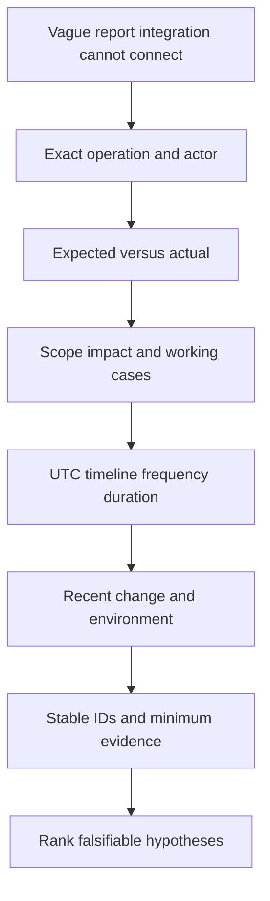
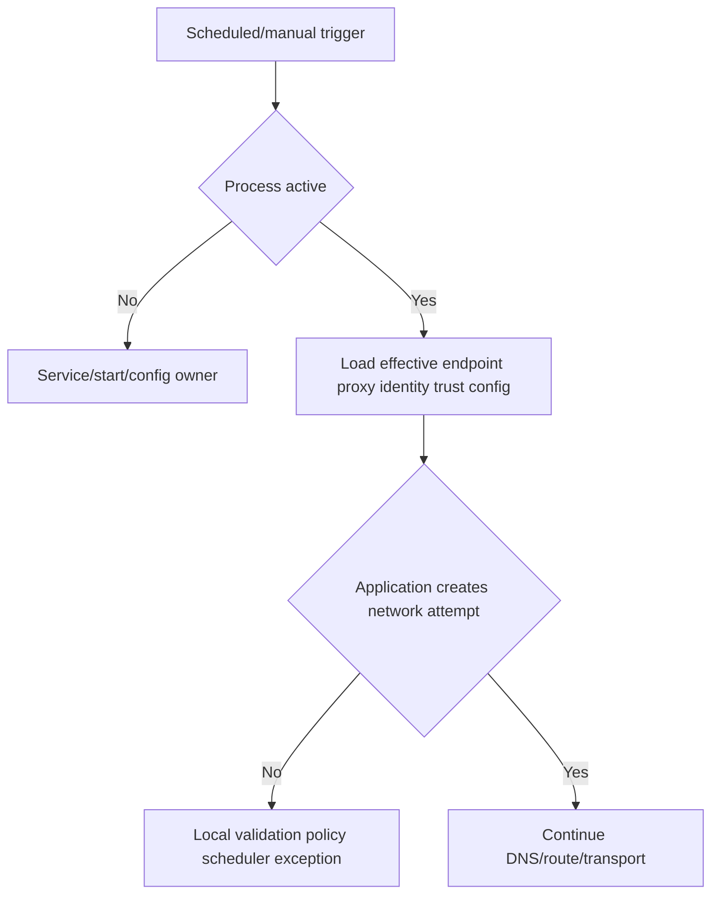
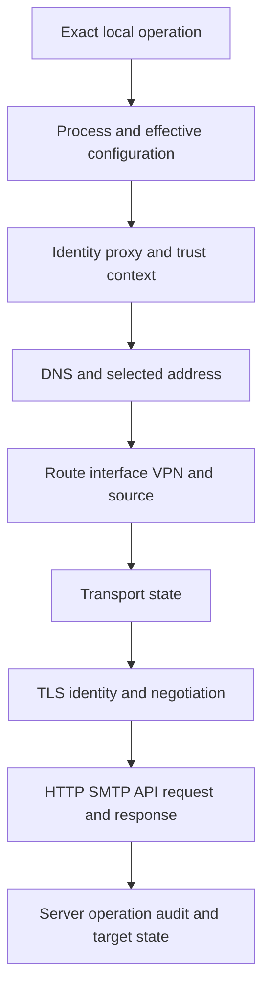
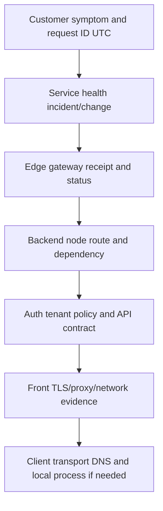
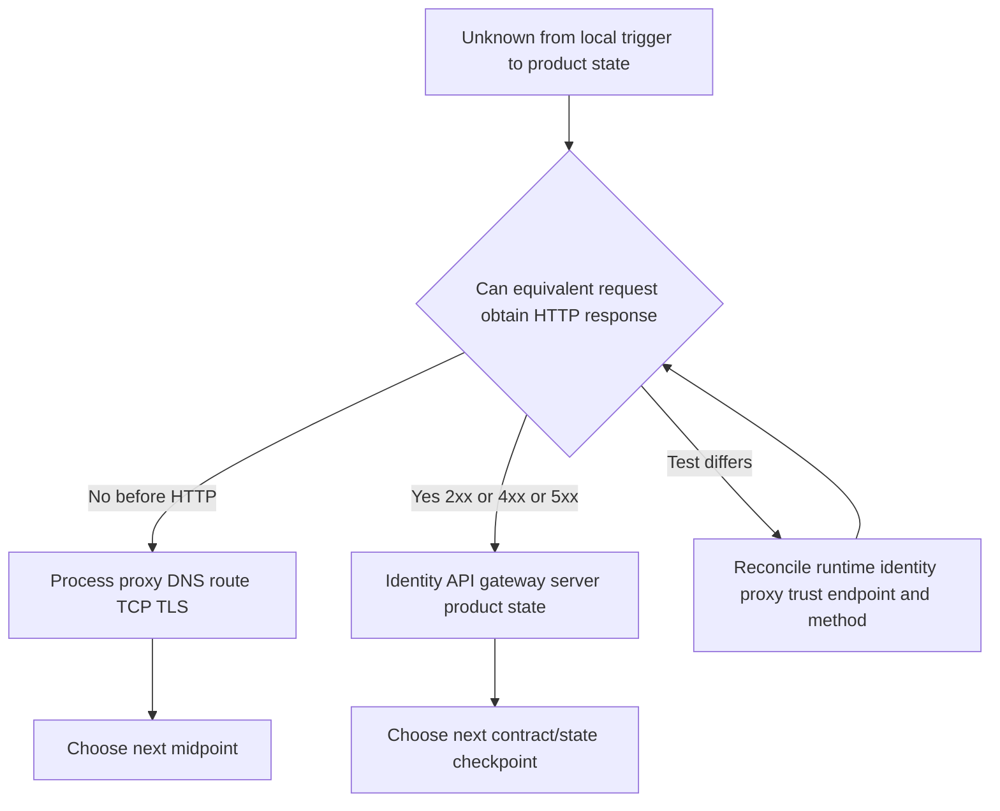
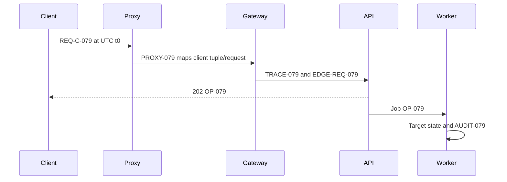
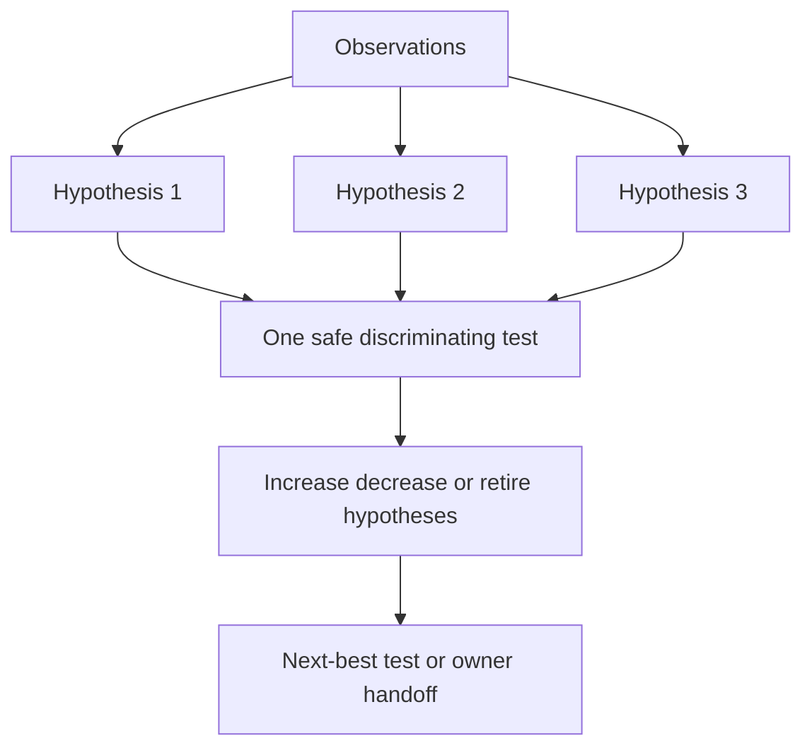
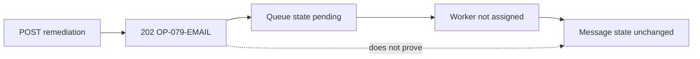
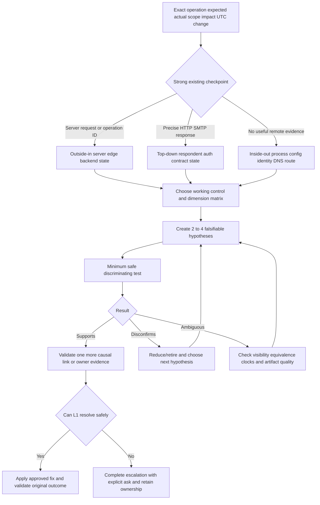

# Part 079 - Endpoint-to-Cloud Layered Troubleshooting

> **Purpose:** Combine process, configuration, identity, DNS, route, transport, TLS, HTTP/proxy/API, server, and product evidence into one efficient support method.
>
> **Artifact label:** Production-transfer method plus local/synthetic lab. It does not claim Abnormal production access, network-engineering ownership, or server-internal visibility.
>
> **Currency and source access date:** August 24, 2026.

## Section goal

By the end of this Part, Arti should be able to take a vague report such as “the integration cannot connect,” define exact expected and actual behavior, establish scope/impact/timeline/change, choose a meaningful control, and trace the operation across local process/configuration, identity, name resolution, route, proxy/VPN, TCP/UDP/QUIC, TLS, HTTP/SMTP, API contract, server processing, asynchronous state, and observability.

She should be able to select **inside-out** (endpoint upward), **outside-in** (service edge/backend toward client), or **divide-and-conquer** troubleshooting based on evidence and access; distinguish local from remote symptoms; choose the lowest-risk discriminating test; maintain a hypothesis ledger; correlate UTC and stable IDs; and create an escalation package that tells the owning team exactly what decision or evidence is needed.

This Part is not a command cookbook. The method controls the tools. Running DNS, TCP, TLS, HTTP, packet, HAR, and log commands without a hypothesis produces a large artifact pile and privacy risk. The quality standard is: every test has a predicted observation under at least two hypotheses, a safety boundary, an owner, and a next decision.

## JD Mapping

| Supplied role signal | Capability developed | SaaS/API/email example | Proof artifact |
|---|---|---|---|
| Enterprise L1 ownership | Owns case continuity from intake through resolution/escalation | Integration outage | End-to-end case plan |
| Complex investigations | Ranks hypotheses and chooses discriminating tests | Intermittent connector failures | Hypothesis ledger |
| API questions | Traces identity/DNS/TCP/TLS/HTTP/API contract | 403/504/webhook timeout | Layer evidence matrix |
| Cloud Email Security | Connects message IDs/mail/API/remediation without collapsing states | Message-removal API accepted but not complete | State ladder |
| SaaS Security | Maps tenant, role, app identity, proxy, audit, and server state | Collector stopped after consent change | Identity/config evidence |
| Timely updates | Communicates facts, unknowns, action/owner/time | Critical case cadence | Update template |
| Engineering collaboration | Produces minimal repro, expected/actual, IDs, timeline, evidence, explicit ask | Suspected product defect | Escalation packet |
| Networking/tool familiarity | Uses tools only where they test a layer hypothesis | Endpoint-to-cloud isolation | Safe lab portfolio artifact |
| Security/privacy | Collects minimum evidence and protects tokens/content/topology | Redacted evidence manifest | Safety checklist |
| Honest candidate positioning | Uses Microsoft support transfer without claiming network/vendor ownership | Interview narrative | Spoken answer |

## Candidate honesty note

This Part naturally leans into Arti's production strength: five years of Microsoft enterprise support, complex investigations, CRITSIT handling, customer/partner updates, Engineering/Product escalation, fix validation, KB/training, and case quality. She can describe the **method** as production transfer. The specific Abnormal product path, private telemetry, network ownership, email-security operations, and named non-Microsoft tool administration remain learned or no-direct-experience areas.

Safe wording:

> In Microsoft enterprise support I repeatedly turned incomplete customer reports into scoped problems, compared working and failing conditions, built timelines, tested hypotheses, and escalated with clear evidence while maintaining customer trust. I am applying that production method to networking, API, email, and security support through current standards and safe labs. I would not imply access to Abnormal internals or ownership of customer network changes.

| Evidence tier | What Arti may claim | Boundary |
|---|---|---|
| Production transfer | Case ownership, scoping, evidence correlation, critical cadence, escalation, validation | Do not relabel Microsoft cases as Abnormal/security cases |
| Working familiarity | Endpoint-to-cloud protocol/tool reasoning | Not network-engineer ownership |
| Local/synthetic lab | Reproducible loopback/public-documentation workflow | Not customer production proof |
| Learned architecture | Vendor-neutral SaaS/API/email request path | Not Abnormal internal design |
| Unknown | Proprietary telemetry, backend routing, limits, ownership, runbooks | Verify after joining/approved docs |

## 1. Start with the operation, not the layer

A customer does not experience “Layer 4.” They experience a failed job: sign in, synchronize users, fetch alerts, submit a webhook, retrieve message metadata, remediate an email, load a portal, or export audit data. Begin by defining the operation and intended outcome.

An analogy is diagnosing a failed journey. “The traveler did not arrive” is not enough; you need origin, destination, intended route, departure time, ticket identity, last confirmed checkpoint, and comparison traveler. The analogy stops because network/application systems provide exact machine timestamps, identifiers, protocol responses, retries, and policy states.

| Intake dimension | High-signal question | Weak version |
|---|---|---|
| Operation | What exact user/API/connector action was attempted? | “What is broken?” |
| Expected | What result/state should exist under which contract? | “Should it work?” |
| Actual | Exact error/status/state and reporting component? | “It fails” |
| Scope | Users, tenants, messages, endpoints, networks, operations affected/working? | “Everyone?” |
| Time | First/last occurrence, reproducible UTC, frequency/duration? | “Since yesterday” |
| Impact | Business/security consequence and workaround? | “Critical” without impact |
| Change | What changed before onset across client, identity, network, service? | “Nothing changed” |
| Environment | OS/runtime/version, tenant, region, proxy/VPN, integration mode? | “Windows” |
| IDs | Request/message/operation/trace/object IDs? | Screenshots only |
| Evidence | Minimum existing logs/transcript/control? | “Send all logs” |

## 2. Expected, actual, and control

**Expected** behavior comes from a supported contract, documented configuration, known-good baseline, or explicit business requirement. **Actual** behavior is directly observed. A **control** is a carefully chosen working comparison that differs in as few relevant dimensions as possible.

| Comparison | Useful control | Confounder to avoid |
|---|---|---|
| Affected user | Same role/tenant/operation on working user | Different permissions and network simultaneously |
| Affected endpoint | Same user/operation from working endpoint | Browser has different token/session/proxy |
| VPN effect | Same host/process/operation immediately before/after under approved states | DNS/cache/token/time changes between tests |
| API method | Same endpoint/principal with permitted read operation | Different resource/contract/version |
| IPv4/IPv6 | Same name/operation forced by family safely | Different proxy or TLS context |
| Message case | Same sender/recipient/policy/time cohort | Different threat/policy attributes |
| Service node | Same request distributed to node A/B | Retries alter state/load |

A control does not prove causation. If one user works and one fails, identity/configuration becomes more plausible, but device, session, route, data, timing, or affinity can differ. Write the dimension matrix before interpreting.

## 🔍 Plain-English deep-dive: A working comparison is useful only when you know what changed

“It works in the browser” is weak control evidence for a background connector. The browser can use a different DNS path, proxy, trust store, HTTP version, cookie/session, user identity, tenant, and endpoint. The comparison proves only that one workflow succeeded.

Think of two keys opening two similar doors. Success with one does not prove the other lock is broken if the keys, doors, permissions, and times differ. The analogy stops because software comparisons can enumerate variables and correlate protocol evidence.

Use a dimension table and identify the smallest meaningful difference. A good test deliberately changes one variable while preserving safety and expected contract.

## 3. The endpoint-to-cloud checkpoint ladder

```mermaid
flowchart LR
    Goal[User or integration goal] --> Process[Process/service running]
    Process --> Config[Endpoint config proxy identity references]
    Config --> Name[DNS/hosts/search/resolver]
    Name --> Route[Family route interface VPN NAT]
    Route --> Transport[TCP UDP QUIC socket state]
    Transport --> TLS[TLS SNI chain ALPN mTLS]
    TLS --> HTTP[HTTP SMTP proxy status headers body]
    HTTP --> Auth[Principal tenant role scope policy]
    Auth --> API[Method path schema version rate/idempotency]
    API --> Server[Gateway service dependencies queue]
    Server --> State[Async operation target audit state]
    State --> Outcome[Customer-validated outcome]
```

| Checkpoint | Expected evidence | Failure examples | Owner candidates |
|---|---|---|---|
| Goal/operation | Exact action/resource/expected state | Wrong workflow/expectation | Customer/app/product |
| Process | Running correct version/context | Service stopped/crash/no network attempt | Endpoint/app |
| Configuration | Intended URL/proxy/tenant/credential reference | Wrong endpoint/stale secret reference | App/admin |
| Local identity | Correct service account/token/cert selection | Access denied/key unavailable | IAM/endpoint |
| Name resolution | Intended qname/type/resolver/view/answer | NXDOMAIN/wrong split answer | DNS/endpoint/VPN |
| Route/interface | Correct family/source/next hop | VPN overlap/wrong route | Endpoint/network/VPN |
| Transport | Listener/handshake/datagram/QUIC progress | Refused/timeout/reset | Service/network/proxy |
| TLS | Name/chain/time/EKU/version/ALPN/mTLS valid | SAN/untrusted/alert | App/proxy/cert/service |
| Application protocol | Exact HTTP/SMTP response/respondent | 407/401/403/429/5xx | Proxy/IAM/API/gateway |
| API contract | Method/path/version/media/schema/retry valid | 404/405/409/415/422 | Client/API/product |
| Server/dependency | Request correlated to service/queue/dependency | Backend timeout/partial failure | Engineering/platform |
| Async/target state | Operation terminal plus read-back | 202 stuck/duplicate/partial | Product/integration |
| Outcome | Original workflow verified | Technical success but user impact persists | Support/customer owner |

## 4. Process and local configuration before packets

Many failures occur before network I/O. A service can be stopped, run under the wrong account, reference an old URL, read a different configuration file, fail to load a client certificate, reject a malformed local setting, or decide not to retry. If no matching network attempt exists, network analysis is premature.

| Local question | Evidence | Common trap |
|---|---|---|
| Is correct process running? | Service/process state, version, start/stop events | Looking at similarly named process |
| Which config did it load? | Effective config source/version/hash, sanitized values | Reading template instead of effective runtime |
| Which identity context? | Service account/client ID/cert alias | Using interactive user's successful test |
| Which proxy stack? | Runtime effective proxy/PAC/env | Assuming browser setting applies |
| Which trust store? | Runtime/OS/container/JVM source | Copying certificates blindly |
| Did it attempt the operation? | App log/request creation/socket evidence | Assuming scheduler ran |
| Did local policy block it? | Endpoint/security/application event | Blaming remote service |

## 5. Identity exists at several boundaries

The operating-system process identity, proxy identity, TLS server/client certificate identity, OAuth client/principal, tenant, role/scope, resource owner, session cookie, and request ID are different. A proxy can authenticate the user while the API rejects the workload token; mTLS can authenticate a certificate while application authorization returns 403.

| Identity | Boundary | Safe evidence | Secret to exclude |
|---|---|---|---|
| OS/service account | Local process/resource access | Alias/SID category and permission result | Password/ticket |
| Proxy principal | Client-to-proxy | Alias/auth scheme/policy result | Proxy credential |
| TLS server | Client-to-peer | Requested name/SNI/SAN/chain fingerprint | Server private key |
| mTLS client | Client-to-server TLS | Public cert alias/issuer/EKU/serial hash | Client private key/PFX |
| OAuth client/principal | API auth | Client/principal alias, issuer/audience, scope names, expiry | Access/refresh token |
| Tenant/resource | Application authorization | Tenant/resource aliases and role mapping | Customer identifiers in public artifact |
| Session/cookie | Browser state | Cookie name/attributes/session event alias | Cookie value |
| Request/trace ID | Transaction correlation | ID or protected hash | Do not treat as credential-free automatically |

## 6. Inside-out troubleshooting

Inside-out starts at the affected endpoint: operation trigger, process/config, identity, DNS, route, transport, TLS, application protocol, then cloud state. It is effective when support can access the endpoint and lower/client evidence is uncertain.

| Use inside-out when | Benefit | Risk | Guardrail |
|---|---|---|---|
| One endpoint/user affected | Finds local difference quickly | Collecting too much endpoint data | Exact process/operation filter |
| No server request ID | Establishes whether request left | Mistaking CLI test for app | Match runtime/proxy/identity |
| Generic timeout | Locates last proven checkpoint | Sequential tests can be slow | Divide at likely midpoint when possible |
| Recent endpoint policy/update | Validates effective local state | Confirmation bias | Keep remote/service hypotheses |

## 7. Outside-in troubleshooting

Outside-in starts at service health/edge logs, request IDs, backend/audit state, and moves toward the client. It is useful when many customers are affected, the service has strong telemetry, a request ID exists, or endpoint access is limited.

| Use outside-in when | Benefit | Risk | Guardrail |
|---|---|---|---|
| Broad multi-tenant impact | Finds shared service boundary | Assuming every report same incident | Match symptom/time/operation |
| HTTP request ID exists | Fast server correlation | Missing requests are invisible | Pair with client evidence |
| Async operation stuck | Backend state is decisive | Private telemetry may be unavailable at L1 | Escalate with ID/state |
| Endpoint collection unsafe | Minimizes customer data | Server logs can lack local context | Request targeted client facts |

## 8. Divide-and-conquer

Divide-and-conquer tests a midpoint with high information gain. For a generic API timeout, a read-only request from the same process context can split lower DNS/TCP/TLS/proxy from upper identity/API processing. But if the test uses different trust/proxy/identity/version, it is not equivalent.

| Candidate midpoint | “Yes” proves | “No” narrows | Equivalence requirement |
|---|---|---|---|
| DNS exact qname/type | Resolver returned candidates | Local/resolver/authority | Same resolver/view/process behavior |
| TCP port test | TCP handshake from test context | Route/policy/listener | Same destination/family/proxy path |
| TLS validated request | Protected peer identity | TLS/proxy/transport | Same SNI/trust/client cert |
| HTTP read-only endpoint | HTTP respondent reached | Lower path or endpoint | Same proxy/auth/authority/version |
| API list/read operation | Identity/API works for that operation | Auth/contract/resource | Same principal/tenant/scope |
| Server request-ID search | Service received attempt | Client/edge path if absent | Correct environment/time/ID |

## 🔍 Plain-English deep-dive: The best next test is the one that changes your decision

A test is useful when different hypotheses predict different outcomes. If both “DNS is wrong” and “token lacks scope” predict that ping may fail because ICMP is blocked, ping does not discriminate. An exact DNS query or an HTTP 403 with request ID does.

Think of a medical laboratory test selected because one diagnosis predicts positive and another negative. The analogy stops because software tests must also preserve security, data, state, and production load.

Before running a test, write: hypothesis A prediction, hypothesis B prediction, command/action, authorization/safety, expected artifact, and owner decision. If the result will not change the next action, do not collect it.

## 9. Local versus remote

| Pattern | Local hypotheses | Remote/shared hypotheses | Discriminating comparison |
|---|---|---|---|
| One endpoint fails | Process/config/trust/proxy/route/cache | User-specific server policy | Same identity on controlled endpoint; same endpoint with control identity where safe |
| One user fails everywhere | Role/token/session/tenant/policy | Account/resource server state | Working user same operation plus audit logs |
| All users one site | DNS/VPN/proxy/firewall/egress | Region/edge path | Another site same tenant/operation |
| All tenants same operation | Client release commonality or service endpoint | Service/API defect/change | Service health/backend traces/version cohorts |
| One API resource | Resource authorization/schema/state | Backend shard/object issue | Same principal different resource and server ID |
| Intermittent | Wi-Fi/path/affinity/cache/rotation/time | Backend node/dependency/scale | IDs/selected node/path across successes/failures |

“Local” and “remote” are relative. A corporate forward proxy is remote from the endpoint but customer-owned; a SaaS edge is remote but can generate client-visible errors for backend failures. Name components rather than using only local/remote.

## 10. Time and identifiers

Time is the join key when no universal ID crosses all systems. Use UTC in ISO 8601 with precision/time-zone source. Record clock skew where known. Avoid ordering events from timestamps with incompatible clocks without uncertainty bounds.

Stable identifiers include request/trace/span IDs, operation/job IDs, message/network-message IDs, webhook event/delivery IDs, tenant/object IDs, connection tuples, proxy/firewall session IDs, and backend-node IDs. Each has scope and uniqueness rules.

| ID | Scope | Join use | Caution |
|---|---|---|---|
| Client request ID | Client-generated request | Client/proxy/server if propagated | Server may replace/ignore |
| Edge request ID | Gateway interaction | Vendor edge logs | One retry gets new ID |
| Trace/span | Distributed trace graph | Service/dependency timing | Sampling can omit spans |
| Operation/job ID | Async work | Poll/audit/worker state | Different from initial request |
| Message-ID | Email message header | Mail correlation | Can be absent/duplicated/re-written |
| Network message ID | Platform delivery identity | Mail trace | Platform-specific/private |
| Webhook event ID | Logical event | Dedup/replay | Deliveries can share event ID |
| Delivery ID | One webhook attempt | Retry timeline | Not logical event identity |
| Five-tuple/session ID | Network flow | Firewall/proxy correlation | NAT/proxy changes tuple |

## 11. Hypothesis ledger

A hypothesis must be falsifiable. “Network issue” is a category. “The Windows service uses an obsolete WinHTTP proxy after policy change, so its CONNECT will receive 407 while browser PAC path succeeds” predicts specific observations.

| Field | Purpose | Example |
|---|---|---|
| ID | Stable reference | H-079-03 |
| Hypothesis | Specific causal explanation | Service uses wrong proxy identity |
| Why plausible | Evidence/change/scope | Browser works; service 407 after account rotation |
| Prediction if true | Observable result | Proxy logs service principal denied; origin sees no request |
| Prediction if false | Different result | CONNECT 200/origin request exists |
| Test | Minimum action | Inspect effective WinHTTP proxy and matching proxy session |
| Safety | Authorization/data/state | Read-only; no credential output |
| Result | Direct observation | 407 + policy session ID |
| Confidence | Low/medium/high with reason | High for failed boundary, cause needs owner confirmation |
| Next action | Owner/explicit ask | Proxy IAM owner explains policy mapping |

## 🔍 Plain-English deep-dive: Confidence should move when evidence arrives

If every result is interpreted as support for the initial theory, the hypothesis is not being tested. A TLS-valid HTTP 403 should decrease a “TCP blocked” hypothesis. A server request ID should decrease “request never left endpoint.” Negative evidence matters only when the observation system would reliably have seen the event.

Think of a scoreboard where evidence changes the score. The analogy stops because confidence is not a precise probability unless a formal model exists; low/medium/high with reasoning is enough for support.

Record disconfirming evidence prominently. The goal is the correct next action, not defending the first guess.

## 12. Safe test selection

| Test class | Low-risk example | Risk | Guardrail |
|---|---|---|---|
| Read configuration | Effective endpoint/proxy/route | Exposes topology/secrets | Filter/redact; no changes |
| Query name | Exact public/synthetic FQDN | Internal-name leakage | Intended resolver/protected channel |
| Test transport | Intended documented port/read-only endpoint | Third-party probing | Owned/documented target only |
| Validate TLS | Normal hostname/chain validation | Verbose metadata | No insecure option/private key |
| Read HTTP/API | HEAD/GET status/metadata | Token/body/PII/rate | Unauthenticated harmless or approved scope |
| Compare user/device | Controlled working case | Privacy/state differences | Consent and one-variable design |
| Capture packets | Narrow host/port/time | Credentials/content/unrelated traffic | Authorization/filter/stop/delete |
| Reproduce state change | Synthetic/local or approved test object | Real impact/duplicate action | Idempotency/rollback/read-back |
| Service log search | Exact ID/time | Private telemetry/access | Minimum fields/approved storage |

Never disable TLS validation, browser security, endpoint security, firewall/VPN/proxy policy, or identity controls for diagnosis. A policy owner may approve a controlled temporary comparison with rollback in a separate process; that is not a beginner default.

## 13. Evidence quality

| Quality dimension | Strong evidence | Weak evidence |
|---|---|---|
| Directness | Exact protocol response/request ID | Screenshot paraphrase |
| Specificity | One process/tuple/operation | Whole-machine broad logs |
| Timing | UTC with clock/source | “Around lunch” |
| Comparison | Controlled one-variable difference | Browser versus service with many differences |
| Completeness | Both directions/response/body schema/status | Client error only |
| Integrity | Original protected artifact/hash/manifest where needed | Edited untracked paste |
| Privacy | Minimum redacted metadata | Raw HAR/pcap/token/email |
| Reproducibility | Exact safe steps and expected/actual | “Try again” |
| Causality | Prediction/test/observation | Correlation/assumption |

## 14. Worked case: SaaS email connector generic timeout

**Symptom:** `CONNECTOR-079` cannot retrieve synthetic message metadata. UI says “connection timed out.” One site affected after VPN policy update; browser portal works.

### Intake and checkpoints

| Stage | Evidence | Interpretation |
|---|---|---|
| Process | Service running and scheduler event at 14:03Z | Trigger occurred |
| Effective config | Correct hostname; WinHTTP proxy `PROXY-079-A` | Browser proxy comparison not equivalent |
| DNS | Service resolver returns A/AAAA | Name checkpoint works |
| Route | Service TCP peer is proxy, not API | Direct API route irrelevant |
| Proxy | CONNECT waits then proxy returns 504-style error | Proxy attempted/failed next leg |
| Origin | No request ID/log for window | Consistent with pre-origin failure, absence reliability must be known |
| Change | VPN policy reroutes proxy-origin destination | Path change plausible |

Hypotheses: proxy cannot route destination through new VPN; proxy DNS view returns wrong address; origin unavailable; service proxy auth issue. The 504 and proxy session ID reduce auth/no-attempt hypotheses. Network/proxy owner checks session B tuple and sees return-path drop after VPN route change. The root cause belongs to the proxy-to-origin VPN path, not the connector token.

Customer update:

> We confirmed the connector process starts correctly, resolves its configured service, and reaches the enterprise proxy. The proxy reports a timeout on its outbound service leg at 14:03 UTC; no TLS or API request ID was created for the origin. We are correlating proxy session `PROXY-079-A` with the VPN path changed today. This narrows the current boundary but does not yet identify the dropping device. Next update: 15:00 UTC.

## 15. Worked case: 202 but message not remediated

The API request receives 202 with `OP-079-EMAIL`. DNS/TCP/TLS/auth all succeeded for that request. The operation remains `pending` for 20 minutes and no target-state audit event exists. Network testing is no longer the best next action.

Escalate operation ID, tenant/message aliases, request ID, UTC, expected SLA/contract, pending state, no target audit, impact, and explicit ask to inspect queue/worker. Do not resubmit blindly; duplicate/remediation idempotency must be known.

## 16. Worked case: one browser user receives CORS error

API returns 200 for actual request but missing allow-origin for the portal origin. Browser blocks script exposure. Curl succeeds because it does not enforce CORS. DNS/TCP/TLS/API processing are not the failed boundary. Compare page origin, target origin, preflight/actual requests, credentials mode, gateway CORS policy, and response IDs. Do not disable browser security.

## 17. Worked case: intermittent 502 tied to one backend

Edge request IDs map every failure to backend `NODE-079-C`; successes map A/B. Node C's TLS backend chain is expired, but shallow TCP health remains green. Evidence supports backend certificate/health configuration. Route to platform/service owner with edge/backend IDs and current health design; avoid broad network escalation.

| Case | Direction chosen | Why | Decisive evidence |
|---|---|---|---|
| Connector timeout | Inside-out then proxy leg | Endpoint/process path unclear | Effective proxy + proxy session timeout |
| 202 pending | Outside-in | Operation ID/server state exists | Queue/worker/target audit |
| Browser CORS | Top-down/browser | Precise console/network response | Origin/preflight/allow fields |
| Intermittent 502 | Outside-in/control comparison | Edge IDs/backend selection | Failed-node correlation and TLS health |

## 18. Troubleshooting decision tree

## 19. Failure modes

| Failure mode | Why harmful | Recovery |
|---|---|---|
| Tool-first collection | Privacy risk/no decision | Write hypotheses/predictions first |
| One favored hypothesis | Confirmation bias | Keep 2–4 plausible alternatives |
| Layer label as cause | “L7 issue” lacks owner/mechanism | Name reporter, checkpoint, component |
| Working browser as proof | Runtime/path/identity differ | Dimension matrix |
| Testing from support laptop | Different tenant/path/identity | Test affected context or label limitation |
| Flushing/restarting early | Destroys transient evidence | Preserve state/timeline before action |
| Blind retries | Duplicate action/load | Idempotency/reconciliation/budget |
| Broad captures/logs | Exposes credentials/content | Minimum filters/fields/time |
| Missing UTC/IDs | Cannot correlate | Capture identifiers at intake |
| Escalation without ask | Owning team repeats investigation | State exact decision/evidence needed |
| Throwing case over wall | Customer loses continuity | L1 remains communication owner |
| Declaring root cause after workaround | Workaround may bypass mechanism | Verify causal chain and prevention |

## 🔍 Plain-English deep-dive: Escalation is a query, not a file transfer

A useful escalation asks a question the receiving owner can answer with access or expertise L1 lacks. “Please investigate attached logs” is not enough. “Please correlate edge request `EDGE-079-A` at 14:03:12Z and confirm why backend `NODE-C` returned TLS alert after health check passed” is actionable.

Think of handing a specialist a labeled specimen plus the exact test requested, not an unsorted warehouse. The analogy stops because Engineering may discover new hypotheses and require iterative collaboration.

Support retains customer ownership: impact, cadence, dependencies, evidence updates, workaround safety, and validation remain tracked while the specialist investigates.

## 20. Escalation package

| Section | Required content |
|---|---|
| Executive summary | One sentence impact + failed boundary + current action |
| Expected/actual | Exact supported behavior and direct observation |
| Scope/impact | Affected/working cohorts, security/business consequence, workaround |
| Environment | Tenant/region aliases, OS/runtime/version, proxy/VPN/integration mode |
| Timeline | Start/change/repros/tests/results in UTC with clock notes |
| Reproduction | Minimum safe deterministic steps and frequency |
| Configuration | Effective sanitized endpoint/proxy/identity/trust/version, not templates |
| Layer evidence | Process, DNS, route, tuple, TLS, HTTP/API, server/async state as relevant |
| IDs | Request/trace/operation/message/event/session/backend IDs and mappings |
| Controls | Working/failing dimension matrix |
| Hypotheses | Ranked predictions/tests/results and disconfirming evidence |
| Attempts | What was tried, why, actual result, side effects/rollback |
| Privacy | Removed secrets/content/PII/topology; protected artifact location |
| Ask | Exact owner decision, log correlation, contract clarification, or defect review |
| Customer plan | Next update time, owner, safe workaround, validation criteria |

### Customer update pattern

> **Impact:** [specific affected operation/population]. **What we confirmed:** [last proven checkpoint and exact failed boundary]. **What remains unknown:** [one concise causal uncertainty]. **Current action/owner:** [discriminating test or owner query]. **Customer request:** [minimum safe evidence/action, if any]. **Next update:** [UTC time even if no resolution].

## Safe local lab: The Endpoint-to-Cloud Flight Recorder 079

### Prerequisites

- Learner-owned Windows/Linux workstation and authorization to run a loopback HTTP server/read filtered local state.
- Python 3 already installed, `curl`/`curl.exe`, and the read-only OS commands used in Parts 071–078.
- Empty lab directory with harmless `flight-079.json` containing only `{"case":"CASE-079","status":"synthetic"}`.
- Loopback port 8079; no public listener. Optional one normal HEAD to `https://example.com/`; no other public target/probing.
- No token, cookie, client certificate, customer/internal domain, VPN/proxy change, route/DNS/cache flush, firewall/security disablement, or production state change.
- Artifact label: **local lab - loopback endpoint-to-application evidence plus synthetic cloud/proxy/server extensions**.

### Lab procedure

1. Create a cover with start UTC, OS/tool versions, authorization, artifact label, no-credential/no-change statement, and honest experience tier.
2. Define operation: `GET http://localhost:8079/flight-079.json`; expected 200 and synthetic JSON; actual initially unknown.
3. Create impact/scope/change as a fictional one-client lab case and identify `127.0.0.1` as control/path boundary.
4. Before server start, run one bounded request to port 8079 and record expected refusal. This is baseline, not a cloud timeout.
5. Start `py -3 -m http.server 8079 --bind 127.0.0.1` or `python3` equivalent. Explicit stop is `Ctrl+C`.
6. Record process/version/effective working directory, listener address/port/state, and local process alias. Do not collect unrelated processes.
7. Query `localhost` with the normal resolver tools and record IPv4/IPv6 answers/hosts behavior. Explain why server bound to IPv4 only can differ from `::1`.
8. Record route/loopback interface context and five-tuple for one request.
9. Send one verbose bounded request to `http://127.0.0.1:8079/flight-079.json`; record method/path/Host/status/content type/length/server log/UTC. Delete verbose raw output later.
10. Send one request to nonexistent path `/missing-079` and record HTTP 404 as application response, contrasted with pre-listener refusal.
11. Create a checkpoint ladder with proof/unknown/owner for process, config, identity not used, DNS, route, TCP, TLS not used, HTTP, and local server state.
12. Create an expected/actual/control dimension matrix comparing `127.0.0.1`, `localhost`, missing path, and stopped-listener cases.
13. Create four hypotheses for the initial refusal; test only the local listener hypothesis by starting server. Record why that result disconfirms route/TLS/API-auth explanations for this lab.
14. Add a synthetic enterprise extension after localhost: `PROXY-079 -> VPN-079 -> EDGE-079 -> API-079 -> QUEUE-079 -> WORKER-079`. No network calls.
15. Create a successful synthetic trace mapping client/proxy/edge/request/operation/audit IDs in UTC.
16. Create four failure variants: PAC selects dead proxy; IPv6 route stalls; SAN mismatch; HTTP 202 remains queued. Choose inside-out/outside-in/divide approach for each.
17. Complete a hypothesis ledger with at least three hypotheses per variant and one disconfirming result.
18. Draft escalation packages for the proxy timeout and pending operation; include explicit asks.
19. Draft first response, progress update, and resolution message with next-update UTC.
20. Deliver a spoken 3-minute end-to-end troubleshooting walkthrough and a 60-second honesty boundary.
21. Stop server, verify no listener on 8079, delete file/raw output, record cleanup/end UTC.

### Expected evidence

- Exact operation/expected/actual/scope/impact/change/UTC intake card.
- Pre-listener refusal, active-listener success, and HTTP 404 comparison.
- Filtered process/listener/DNS/route/tuple/HTTP/server-log evidence.
- Endpoint-to-local-application checkpoint ladder.
- Working/failing dimension matrix.
- Falsifiable hypothesis ledger with disconfirming evidence.
- Synthetic proxy/VPN/edge/API/queue/worker extension and cross-system ID map.
- Four layered failure variants with chosen direction/test/owner.
- Two complete escalation packages with explicit asks.
- Three customer communications and validation criteria.
- Spoken method and honesty answers.

### Cleanup and privacy

- Stop Python server with `Ctrl+C`; verify no listener remains on 8079.
- Delete `flight-079.json`, lab directory, raw verbose output, unredacted process/socket/config output.
- Retained artifact uses only loopback, `example.test`, aliases, synthetic IDs, and UTC; no usernames/paths/internal names/public IPs.
- Do not retain or upload tokens, cookies, HAR/pcap, certificates, email/API bodies, customer IDs, proxy/VPN topology, or full logs.
- Confirm no DNS/cache/hosts/proxy/VPN/route/firewall/trust/browser/security setting changed.
- Record: `Endpoint-to-Cloud Flight Recorder 079 completed on loopback with synthetic cloud extensions; server stopped and verified absent; no credential, third-party probe, production state, customer data, or security change.`

### Validation rubric

| Dimension | Fail | Developing | Pass |
|---|---|---|---|
| Intake | “Cannot connect” | Gets error | Exact operation expected/actual/scope/impact/time/change/environment/IDs |
| Direction | Always bottom-up | Chooses a path | Justifies inside-out/outside-in/divide by existing evidence/access |
| Controls | Browser works | Compares two cases | Dimension matrix and one-variable controlled test |
| Hypotheses | One vague guess | Multiple ideas | Falsifiable predictions, disconfirming evidence, confidence updates |
| Layers | Runs all tools | Checks layers | Stops at last proof/first fail and maps component owner |
| Correlation | Screenshots | Some IDs | UTC plus client/proxy/edge/operation/message/session mappings |
| Escalation | Uploads logs | Summary | Complete privacy-safe packet with exact owner ask/cadence |
| Honesty | Claims Abnormal/network ownership | Says learning | Distinguishes Microsoft production transfer, lab, learned, unknown |

## Official Source Anchors - August 24, 2026

| Official or primary source | Topic anchored | Boundary |
|---|---|---|
| [RFC 1122 - Requirements for Internet Hosts](https://www.rfc-editor.org/rfc/rfc1122.html) | Layered Internet host behavior | Updated by later RFCs |
| [RFC 9293 - TCP](https://www.rfc-editor.org/rfc/rfc9293.html) | Transport checkpoint/state | Does not define application success |
| [RFC 8446 - TLS 1.3](https://www.rfc-editor.org/rfc/rfc8446.html) | Protected-channel handshake | Client/product policy varies |
| [RFC 9110 - HTTP Semantics](https://www.rfc-editor.org/rfc/rfc9110.html) | Methods/status/respondents/intermediaries | API contracts product-specific |
| [RFC 9457 - Problem Details for HTTP APIs](https://www.rfc-editor.org/rfc/rfc9457.html) | Structured API problem response format | APIs may use other schemas |
| [W3C Trace Context Recommendation](https://www.w3.org/TR/trace-context/) | `traceparent`/distributed trace propagation | Sampling/security/implementation varies |
| [OpenTelemetry Trace specification](https://opentelemetry.io/docs/specs/otel/trace/) | Trace/span model and context | Vendor telemetry may differ |
| [Microsoft Cloud Adoption Framework - Troubleshoot methodology](https://learn.microsoft.com/en-us/azure/cloud-adoption-framework/operate/observability) | Observability and cloud operations context | Not an Abnormal runbook |
| [Microsoft Learn - Test-NetConnection](https://learn.microsoft.com/en-us/powershell/module/nettcpip/test-netconnection) | Windows bounded connectivity evidence | Port success does not prove TLS/API |
| [Microsoft Learn - Resolve-DnsName](https://learn.microsoft.com/en-us/powershell/module/dnsclient/resolve-dnsname) | Windows DNS evidence | Match app resolver context |
| [Microsoft Learn - Get-NetRoute](https://learn.microsoft.com/en-us/powershell/module/nettcpip/get-netroute) | Windows route evidence | Read one host/time only |
| [curl documentation](https://curl.se/docs/) | Request/timing/TLS/HTTP diagnostics | Match runtime/proxy/identity context |
| [Wireshark User's Guide](https://www.wireshark.org/docs/wsug_html_chunked/) | Packet evidence/filters/conversations | Capture sensitivity/caveats |
| [Python http.server documentation](https://docs.python.org/3/library/http.server.html) | Loopback lab server | Development only, not production |
| [NIST SP 800-61 Rev. 2](https://csrc.nist.gov/pubs/sp/800/61/r2/final) | Incident handling/evidence/coordination principles | Supersession/current NIST guidance must be checked |

### Source-use discipline

- Standards establish protocol semantics; current product documentation establishes supported endpoints/contracts/configuration.
- Name the observation point and respondent before naming a cause or owner.
- Use UTC, stable IDs, expected/actual, and working/failing controls in every significant case.
- Choose tests for information gain and safety, not tool coverage.
- Never disable validation/security controls, expose credentials/content, probe third parties, or mutate production state without authorization.
- Keep Abnormal internal architecture, telemetry, ownership, SLAs, and runbooks explicitly unknown unless approved sources establish them.

## Likely Interview Questions

### Q1. Walk me through endpoint-to-cloud troubleshooting.

**Model answer:** I define exact operation, expected/actual, scope, impact, UTC, environment, and change; capture request/message/operation IDs; choose a control; then trace process/effective config/identity, DNS, route/proxy/VPN, transport, TLS, HTTP/SMTP, authorization, API contract, server/dependency, and target state. I stop at the first unproven boundary, test competing hypotheses safely, and route an explicit evidence-backed ask.

### Q2. When do you use inside-out, outside-in, or divide-and-conquer?

**Model answer:** Inside-out when endpoint/process evidence is uncertain or one endpoint is affected; outside-in when broad impact, service telemetry, request IDs, or async state are decisive; divide-and-conquer when an equivalent midpoint can quickly separate lower connectivity from upper application hypotheses. Existing evidence and access choose the direction.

### Q3. What makes a good control?

**Model answer:** A control performs the same operation under the same tenant/resource/version/time with as few changed dimensions as possible. I document differences in user, endpoint, identity, DNS, proxy, route, family, trust, protocol, data, and backend. “Browser works” is not a strong connector control without that matrix.

### Q4. What is a falsifiable hypothesis?

**Model answer:** It is a specific explanation that predicts different observable outcomes from alternatives. I write why plausible, prediction if true/false, minimum safe test, result, confidence change, and owner. Evidence must be allowed to reduce confidence; otherwise it is confirmation bias.

### Q5. How do time and IDs help?

**Model answer:** UTC bounds events across systems when clocks are known; request, trace, operation, message, event/delivery, firewall/proxy session, tuple, and backend IDs join each stage. I record each ID's scope and map replacements/retries rather than assuming one universal ID.

### Q6. A request gets 202 but the action never happens. What next?

**Model answer:** DNS/TCP/TLS/HTTP acceptance are proven for that request. I use operation ID to check queued/running/terminal state, worker/dependency events, retries/dedup, audit record, and target read-back. I do not resend blindly because the first request may later execute and create duplicate security action.

### Q7. What makes a strong escalation?

**Model answer:** It has impact, expected/actual, scope, environment, UTC timeline/change, minimal repro, effective sanitized config, layer evidence, ID mappings, working control, ranked hypotheses including disconfirming evidence, attempts/results, privacy statement, exact owner ask, and customer update/validation plan. L1 retains communication ownership.

### Q8. How does your background support this method?

**Model answer:** The method is a direct transfer from five years of Microsoft enterprise support: complex case scoping, CRITSIT communication, comparison evidence, Engineering escalation, and fix validation. Networking/API/email layers are deliberate working-familiarity areas proven through labs; I do not claim network engineering or Abnormal production access.

## Memory Hooks

- **Start with the operation, not the layer.**
- **Expected, actual, scope, impact, UTC, change, environment, IDs.**
- **A control is only useful when dimensions are known.**
- **Process and config can fail before packets.**
- **Identity exists at OS, proxy, TLS, OAuth, tenant, session, and request layers.**
- **Inside-out for endpoint uncertainty; outside-in for strong service evidence.**
- **Divide at a truly equivalent midpoint.**
- **Best test changes the next decision.**
- **Last proven checkpoint is not root cause.**
- **Confidence must fall when evidence disagrees.**
- **UTC plus scoped IDs join the story.**
- **Escalation is an explicit query, not a log dump.**
- **L1 retains ownership while specialists investigate.**

## Completion Checklist

- [ ] I can define exact operation, expected/actual, scope, impact, UTC, change, environment, and IDs.
- [ ] I can create a working/failing dimension matrix.
- [ ] I can trace process/config/identity/DNS/route/proxy/transport/TLS/HTTP/API/server/target state.
- [ ] I can choose inside-out, outside-in, or divide-and-conquer and justify it.
- [ ] I can distinguish local/user/site/tenant/operation/global patterns.
- [ ] I can map OS, proxy, TLS, OAuth, tenant, session, and request identities safely.
- [ ] I can build a UTC timeline and scoped ID translation ledger.
- [ ] I can write 2–4 falsifiable hypotheses with true/false predictions.
- [ ] I can choose a minimum safe discriminating test and update confidence.
- [ ] I can distinguish direct observation, inference, unknown, and owner.
- [ ] I can maintain customer cadence while another team owns a dependency.
- [ ] I can create the complete escalation package and explicit ask.
- [ ] I completed or can explain **The Endpoint-to-Cloud Flight Recorder 079**.
- [ ] I stopped/verifed the loopback server and deleted raw data.
- [ ] I used no credentials, customer content, third-party probes, production mutation, or security bypass.
- [ ] I can answer exactly Q1–Q8 aloud with honest production/lab/learned boundaries.
- [ ] I checked Official Source Anchors dated August 24, 2026.

[Next: Part 080 - Wireshark tcpdump and Network Monitor](Part-080-wireshark-tcpdump-and-network-monitor.md)