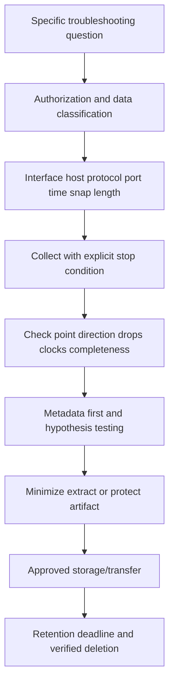
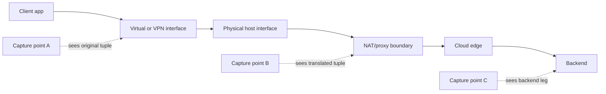
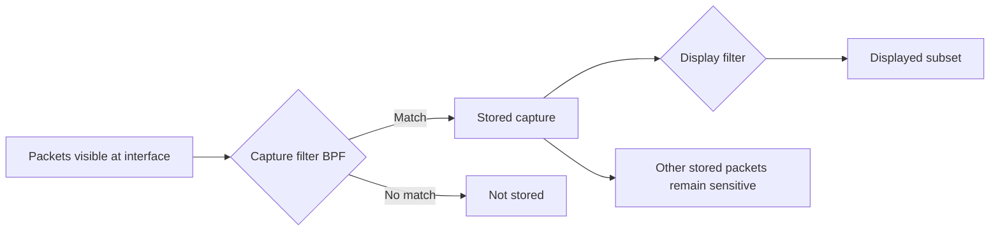
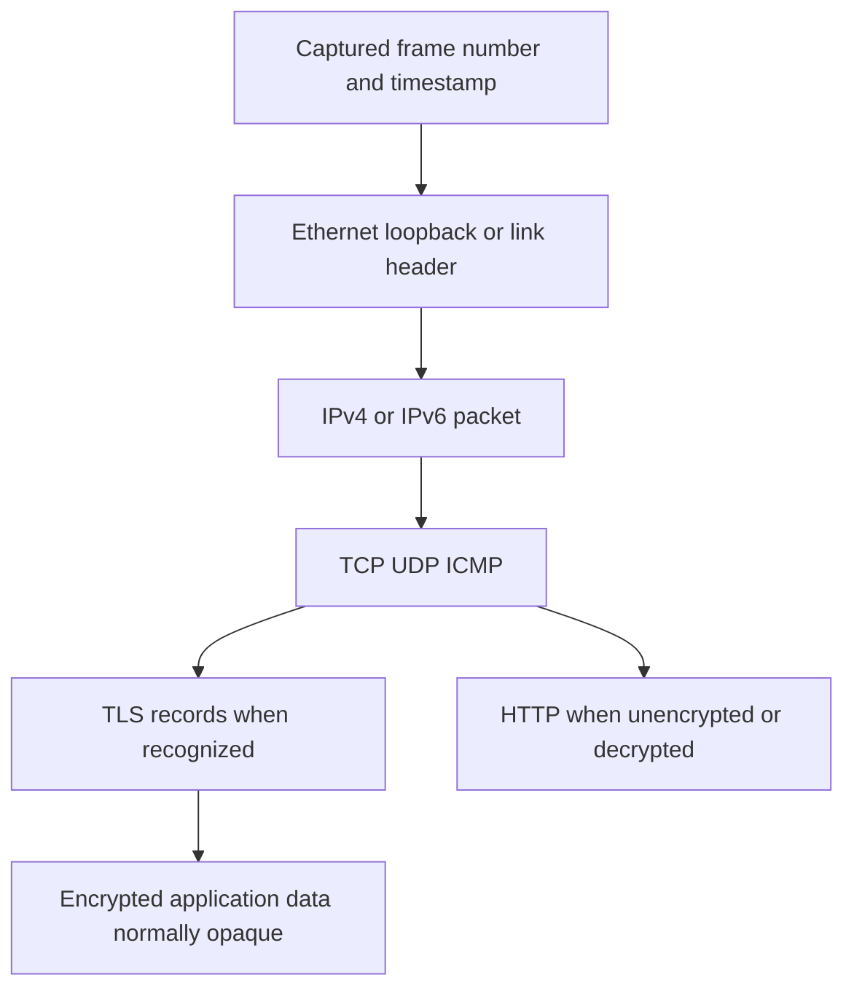
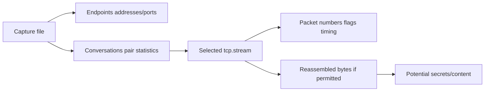
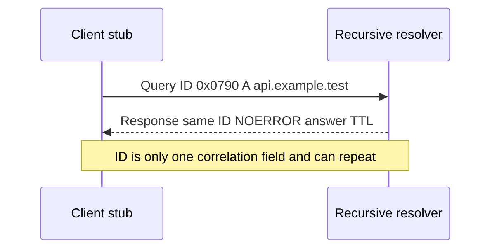
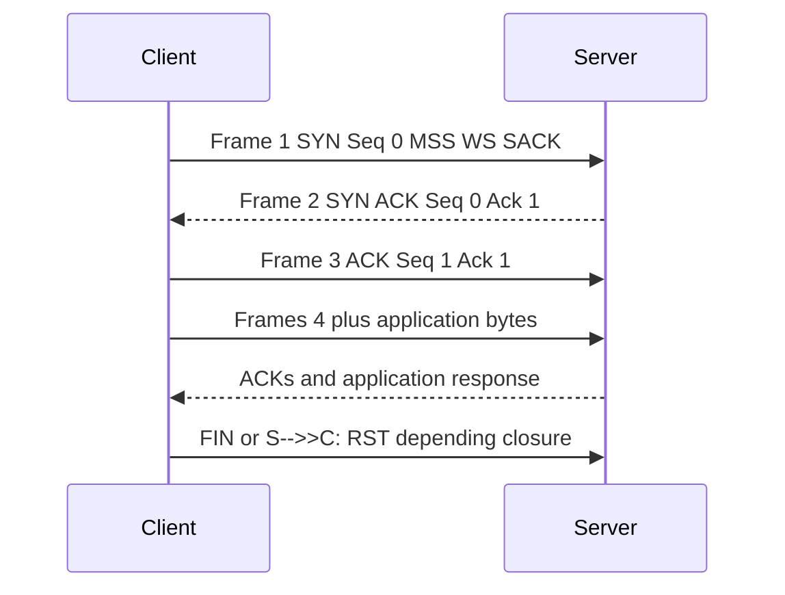
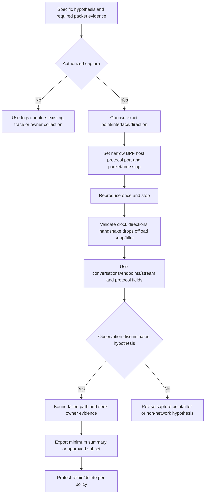

# Part 080 - Wireshark tcpdump and Network Monitor

> **Purpose:** Design, collect, interpret, minimize, and dispose of packet evidence safely, while treating protocol analysis and expert flags as observations rather than automatic root cause.
>
> **Artifact label:** Working-familiarity tool practice plus loopback-only lab. No customer capture, third-party probing, TLS decryption, credential collection, or security-control change.
>
> **Currency and source access date:** August 24, 2026.

## Section goal

By the end of this Part, Arti should be able to plan a packet capture by authorization, question, interface, direction, endpoint, time window, filter, snap length, stop condition, storage, and deletion. She should distinguish a **capture filter**, applied before packets are stored, from a **display filter**, applied while viewing captured data. She should use safe Berkeley Packet Filter (BPF) examples for owned loopback traffic and recognize that capture-filter and Wireshark-display-filter syntax are different.

She should be able to navigate Wireshark interfaces, packets, protocol details, bytes, conversations, endpoints, streams, name resolution, time display, expert information, and basic statistics. She should identify DNS, TCP handshake/state/retransmission clues, TLS ClientHello/SNI/ALPN/version metadata where visible, and HTTP content only when unencrypted or decrypted through an explicitly authorized method. She should use `tcpdump` with numeric output, interface, packet count, snapshot length, write/read, and rotation/stop controls safely.

She should understand Microsoft Network Monitor as a **legacy familiarity area**, useful when encountering historical `.cap` files/parsers or older support workflows, but not assume it is Microsoft's current recommended capture platform. Tool status and supported collection workflows must be verified against current Microsoft documentation. The core skill is protocol evidence, not loyalty to one UI.

## JD Mapping

| Supplied role signal | Capability developed | SaaS/API/email example | Proof artifact |
|---|---|---|---|
| Complex investigations | Captures only the flow that can distinguish hypotheses | Intermittent TLS reset | Scoped packet narrative |
| API support | Correlates DNS/TCP/TLS/HTTP metadata with request IDs | API timeout before HTTP | Conversation timeline |
| Cloud Email Security | Reads SMTP/TLS flow metadata without exposing message content | Mail connector handshake issue | Redacted flow worksheet |
| SaaS Security | Handles pcaps as sensitive security evidence | Proxy/identity endpoint capture | Evidence manifest |
| Diagnostic tools | Builds working familiarity with Wireshark/tcpdump/NetMon | Cross-platform collection | Loopback lab |
| Customer trust | Explains what capture proves and misses | Causation-safe update | Observation/inference table |
| Engineering collaboration | Supplies capture point, filter, UTC, tuple, packet numbers, IDs, limitations | Reproducible packet escalation | Escalation packet |
| Privacy/security | Authorizes, minimizes, encrypts/transfers, retains/deletes responsibly | No raw ticket attachment | Cleanup checklist |
| Continuous learning | Uses official Wireshark/libpcap/tcpdump/Microsoft docs | Current tool behavior | Source ledger |
| Honest positioning | Frames tools as working familiarity, not packet-forensics ownership | Interview answer | Honesty statement |

## Candidate honesty note

Arti's CV supports working familiarity with Wireshark, Netsh, Microsoft Network Monitor, Procmon, DevTools, HAR, and Fiddler. The honest claim is that these tools reinforce an evidence-first enterprise support method. She should not claim advanced packet-forensics specialization, unrestricted customer capture authority, production network ownership, or current deep operation of every legacy parser.

| Evidence tier | Safe claim | Boundary |
|---|---|---|
| Production transfer | Evidence collection, escalation, privacy, customer communication | Not unrestricted packet capture |
| Working familiarity | Scoped Wireshark/tcpdump filters, conversations, streams, metadata | Not expert root cause from flags alone |
| Local lab | Loopback capture capped by packet count/time | Not production traffic proof |
| Legacy familiarity | Network Monitor UI/parser concepts and historical artifacts | Not current default/recommendation |
| Unknown | Abnormal-approved capture procedures, retention, endpoint tooling | Follow internal policy after joining |

## 1. A packet capture is a sensitive recording

A packet capture (pcap/pcapng or tool-specific trace) records network frames/packets visible at an interface/capture point. Depending on protocol and position it can contain IP addresses, hostnames, DNS queries, URLs, email addresses/content, authentication headers, cookies, tokens, unencrypted credentials, certificates, message bodies, internal topology, file content, and user behavior. TLS protects application content on the captured leg, but metadata and other protocols remain visible.

An analogy is a security-camera recording at a building entrance. It can establish who crossed one checkpoint and when, but not everything that happened inside; it also records unrelated people and requires access/retention controls. The analogy stops because packet capture can record exact protocol bytes and can be copied/decrypted/correlated at scale.



### Capture authorization card

| Field | Required decision | Example local lab |
|---|---|---|
| Owner/authorization | Who owns host/network and approved capture? | Learner on own workstation |
| Question | What hypothesis will capture discriminate? | Did loopback TCP handshake/HTTP occur? |
| Interface | Where must packets be visible? | Loopback only |
| Scope | Host/port/protocol/direction | TCP port 8080 (lab-specific 8080 if chosen) |
| Timing | Start before repro; stop after one attempt | Max 20 packets/30 seconds |
| Snapshot length | How many bytes per packet? | 128 bytes for metadata where adequate |
| Output | File or live summary? | Temporary local pcapng/pcap |
| Classification | What sensitive data may appear? | Harmless synthetic local HTTP only |
| Storage/access | Approved location and permissions | Local temporary directory |
| Retention/deletion | When/how deleted? | Immediately after worksheet |

## 2. Capture point and interface

The same flow looks different at client, server, proxy, NAT, load balancer, virtual switch, VPN adapter, container namespace, and physical interface. A client capture can show original source tuple; a cloud edge sees translated/proxy source. Capturing the wrong interface can show nothing even when the request succeeds.



| Capture point | Likely visibility | Common blind spot |
|---|---|---|
| Client loopback | Local app-to-local service | External interface traffic |
| Client physical Wi-Fi/Ethernet | Host network traffic after stack/offload context | VPN-encapsulated inner flow may be elsewhere |
| VPN virtual adapter | Inner/decrypted tunnel traffic depending platform | Outer encrypted tunnel |
| Proxy client side | Client-proxy leg | Proxy-origin leg |
| Proxy server side | Proxy-origin leg | Original client tuple/content attribution |
| Server interface | Requests reaching server | Loss before server |
| Load balancer/backend | Backend flow | Front client TLS/tuple |
| Container namespace | Container-local flow | Host/NAT view |

## 🔍 Plain-English deep-dive: A capture proves visibility at one window, not the whole building

If a client capture shows SYN leaving and no reply, the capture proves that observer did not record a reply. It does not identify whether the SYN left the physical adapter, reached a firewall, reached the server, or whether a return packet was lost or captured on another interface.

Think of watching one doorway camera. You can confirm a person left that doorway, not which road they took. The analogy stops because packet sequence numbers, TTL/hop limit, tuples, and second capture points can bound the path more precisely.

Every conclusion should name capture host, interface, side of proxy/VPN/NAT, direction, timestamp source, and limitations.

## 3. Capture filters versus display filters

A **capture filter** decides which packets are stored, using libpcap/BPF-style syntax in Wireshark/tcpdump capture contexts. It reduces volume and exposure but cannot recover discarded traffic. A **display filter** decides which already-captured packets Wireshark shows, using Wireshark's field-based display-filter language. It preserves the file but does not reduce collected sensitive data.

| Property | Capture filter | Display filter |
|---|---|---|
| Applied | Before/during collection | After collection |
| Typical syntax | BPF/libpcap, e.g. `tcp port 8070` | Wireshark fields, e.g. `tcp.port == 8070` |
| Reduces stored data | Yes | No |
| Can use decoded app fields | Limited/header offsets/protocol primitives | Rich dissector fields |
| Can be changed after capture | No | Yes |
| Risk | Too narrow misses evidence | File still contains hidden sensitive traffic |



## 4. Safe BPF capture-filter examples

These examples are for owned/authorized traffic. Parentheses and shell quoting matter. Name resolution in filters can add DNS/dependency ambiguity; numeric addresses are preferable when known and safe.

| Intent | BPF example | Caution |
|---|---|---|
| One TCP lab port | `tcp port 8080` | Includes source or destination port |
| Destination lab port | `tcp dst port 8080` | Response source port needs separate expression |
| One host | `host 127.0.0.1` | Loopback only in lab |
| One host and TCP port | `host 127.0.0.1 and tcp port 8080` | Ensure chosen interface sees loopback |
| DNS TCP/UDP | `port 53` | Can capture unrelated queries/content; narrow further |
| HTTPS metadata to one IP | `host 192.0.2.25 and tcp port 443` | Documentation example only; do not capture/probe it |
| Exclude SSH management | `not port 22` | Exclusion alone remains broad and risky |
| Two alternatives | `(tcp port 8080 or tcp port 8081) and host 127.0.0.1` | Quote in shell |

Avoid broad `ip`, `tcp`, or `port 53` captures on enterprise/shared interfaces unless explicitly required and authorized. A narrow capture may still include payload, so packet count/time/snapshot length and protected handling remain necessary.

## 5. Wireshark display filters

| Question | Display filter example | Interpretation boundary |
|---|---|---|
| One TCP port | `tcp.port == 8080` | Either source/destination |
| Opening SYNs | `tcp.flags.syn == 1 && tcp.flags.ack == 0` | Not proof destination received |
| Resets | `tcp.flags.reset == 1` | Identify sender and prior state |
| DNS response code | `dns.flags.response == 1 && dns.flags.rcode != 0` | RCODE needs resolver/view/sections |
| TLS ClientHello | `tls.handshake.type == 1` | Visibility depends on protocol/ECH/capture |
| TLS SNI | `tls.handshake.extensions_server_name` | SNI can be absent/encrypted in future/ECH contexts |
| HTTP requests | `http.request` | Only decoded unencrypted/decrypted HTTP |
| HTTP errors | `http.response.code >= 400` | Respondent/source still needed |
| Analyzer retransmission | `tcp.analysis.retransmission` | Heuristic, capture-dependent |
| Stream | `tcp.stream == 3` | Stream index is file-local, not universal ID |

Display-filter field names can change with dissector/version. Use Wireshark autocomplete/field reference for installed version. Do not invent filters from memory when a syntax check is available.

## 🔍 Plain-English deep-dive: A display filter hides data from your eyes, not from the file

If a pcap contains ten users' traffic and you display one host, the other nine users' packets remain in the file. Sending that pcap sends all ten. Redaction by display filter requires exporting only selected packets or extracting a summary through an approved workflow, then validating the result.

Think of applying a search filter in a spreadsheet: hidden rows still exist in the document. The analogy stops because packet files can contain binary payload and cross-packet reassembly.

The safest sequence is narrow capture first, minimal duration/count/snap length, then display filters, then approved export/summary, verify with a fresh open, and delete the original according to policy.

## 6. Wireshark layout and packet anatomy

Wireshark commonly shows a packet list, packet-details tree, and packet bytes. The list summarizes frame/time/source/destination/protocol/info. The details tree decodes nested protocols. The bytes pane maps selected fields to raw bytes. A dissector is an interpretation; “Data” or malformed decoding can reflect wrong port heuristic, encryption, truncation, or genuinely invalid content.



| Pane/statistic | Use | Caution |
|---|---|---|
| Packet list | Timeline and endpoints | Summary can omit important fields |
| Protocol tree | Field-level decoding | Dissector assumptions/version matter |
| Bytes | Ground truth captured bytes | Snap truncation/capture alteration possible |
| Coloring rules | Visual pattern detection | Color is not evidence category |
| Expert Information | Aggregated heuristic warnings | Not root cause |
| Conversations | Pair/flow aggregates | NAT/proxy creates separate conversations |
| Endpoints | Address/port aggregates | High traffic is not malicious by itself |
| I/O Graphs | Rate/event timing | Filter/interval/units matter |
| Protocol Hierarchy | Decoded protocol distribution | Encrypted traffic appears under TLS/data |

## 7. Time settings and packet references

Capture timestamps come from the capture system and interface/tool precision; clocks can skew. Wireshark can display absolute UTC, local time, time since first packet, and deltas. Use UTC for cross-system correlation and relative/delta for within-capture timing. Record packet numbers only as file-local references; filtering/export can renumber frames.

| Time view | Best use | Limitation |
|---|---|---|
| Absolute UTC | Join logs/traces across systems | Capture clock accuracy |
| Local date/time | User recollection | Time zone/DST ambiguity |
| Since beginning | Flow sequence | Not cross-system join |
| Since previous captured | Inter-packet gaps | Previous displayed vs captured distinction matters |
| Delta in stream | RTT/retransmission flow timing | Requires correct stream/filter |

## 8. Conversations, endpoints, and streams

A Wireshark TCP stream is a file-local grouping of packets belonging to a TCP conversation. “Follow TCP Stream” reconstructs visible byte directions and can expose credentials/content. Use only on the harmless loopback lab or authorized data, and never paste raw output blindly.



| View | Question answered | Does not answer |
|---|---|---|
| Endpoints | Which addresses/ports appear and byte/packet totals? | Which app/user without correlation |
| Conversations | Which pairs exchanged how much/how long? | Causal health/root cause |
| Stream graph | How one TCP sequence evolved | Server-internal processing |
| Follow stream | What visible application bytes were exchanged? | Safe sharing; encrypted payload remains opaque |
| Flow graph | What packet/message order appears? | Missing/capture-dropped events |

## 🔍 Plain-English deep-dive: “Not in the capture” is evidence only when the capture would have seen it

No DNS query in a pcap can mean the application used cache, hosts, DoH, another interface, a container resolver, or never attempted resolution. It supports “no classic DNS packet was visible at this point under this filter and window,” not “DNS was not used.” The same caution applies to missing server replies and HTTP requests.

Think of finding no visitor on one camera. That matters only if the camera covered the correct entrance, was recording at the right time, and did not drop footage. The analogy stops because packet capture adds exact interfaces, filters, directions, protocol encapsulation, and drop counters.

Before using absence as negative evidence, validate interface/capture point, BPF, start/end time, both directions, encapsulation/VPN namespace, packet-drop statistics, offload, and expected protocol. Then state the bounded absence precisely.

## 9. DNS capture interpretation

For DNS, record query name/type, transaction ID (with transport/context), source/destination resolver, response code, flags, answer/authority/additional sections, TTL, retries, UDP/TCP, truncation, and timing. A retransmitted query can reflect lost query/response, resolver delay, application retry, or capture visibility.



| Pattern | Interpretation | Caution |
|---|---|---|
| Query, answer | Resolver exchange observed | App may choose another answer/cache |
| Query repeated, no answer captured | Timeout/loss/resolver/capture hypotheses | Check interface/direction |
| NXDOMAIN | Resolver reports nonexistent name in view | Authority/negative cache/policy context |
| TC bit then TCP | UDP response truncated; client retries TCP | TCP policy may fail |
| Large DNSSEC response | EDNS/fragmentation/TCP implications | Do not capture unrelated DNS broadly |

## 10. TCP capture interpretation

Start with tuple and handshake. Record SYN/SYN-ACK/ACK, MSS/window-scale/SACK/timestamps, data sequence/ACK, retransmission labels, FIN/RST, state timing, and direction. Relative sequence numbers aid explanation.



| Evidence | Safe conclusion | Unsafe conclusion |
|---|---|---|
| Handshake complete | TCP established at capture point | API is healthy |
| SYN repeats/no response | Opening did not complete in visible trace | Firewall caused it |
| RST observed | Sender address emitted/appears to emit reset | Server application definitely chose it |
| Retransmission label | Sequence range appears repeated under analyzer | Physical packet loss at named router |
| Zero window | Receiver advertises no capacity | Network congestion |
| FIN exchange | Graceful directional close | Business operation completed |

## 11. TLS metadata

Without session secrets, TLS application content is encrypted. Classic TLS ClientHello can expose version offers, cipher suites, extensions, SNI, ALPN, supported groups, and key share; TLS 1.3 encrypts most server handshake messages after ServerHello, including certificates to passive observers. Tool/runtime logs may expose validated chain metadata safely. ECH can hide SNI where deployed.

| TLS item | Usually visible in ordinary capture? | Use | Caveat |
|---|---:|---|---|
| TCP tuple/timing | Yes for TLS over TCP | Path/peer | Proxy/NAT legs differ |
| ClientHello | Often | Offers/SNI/ALPN/fingerprint clues | ECH/QUIC/version changes visibility |
| ServerHello | Often | Selected version/cipher | Not certificate validation result alone |
| Certificate TLS 1.2 | Often before app encryption | Public chain metadata | Inspection/proxy context |
| Certificate TLS 1.3 | Encrypted after ServerHello | Requires endpoint/tool logs or authorized keys | Do not request private keys |
| Alerts | Some visible/detail varies | Handshake/closure clue | Encrypted alerts may be opaque |
| Application data | Encrypted | Timing/size only | Size/timing can still be sensitive |

## 🔍 Plain-English deep-dive: Encryption hides content, not all context

A TLS capture can still reveal communicating addresses, ports, timing, sizes, connection counts, classic SNI/ALPN, and failure patterns. This metadata can expose internal names, applications, work schedules, and security architecture. “Encrypted pcap” does not mean harmless pcap.

Think of opaque envelopes whose addresses, sizes, and mailing times remain visible. The analogy stops because TLS/QUIC metadata evolves and traffic analysis can correlate many sessions.

Handle TLS captures under the same authorization, minimization, storage, and deletion policy as plaintext captures. Do not seek decryption keys unless a specialized approved procedure explicitly requires it.

## 12. HTTP and SMTP visibility

Unencrypted HTTP/SMTP can expose methods, URLs, headers, cookies, authorization, email addresses, content, and attachments. Capturing plaintext production application protocols carries very high sensitivity. STARTTLS/HTTPS encrypt later content, but pre-upgrade greetings/commands can remain visible.

| Protocol state | Visible | Safety |
|---|---|---|
| HTTP plaintext | Full request/response potentially | Local synthetic only in this lab |
| HTTPS/TLS | Metadata and encrypted records | Still sensitive |
| SMTP before STARTTLS | Banner/EHLO/STARTTLS and possibly identities if sent before upgrade | Do not capture real mail content |
| SMTP after STARTTLS | TLS metadata/encrypted content | Same metadata sensitivity |
| HTTP/2/3 encrypted | Transport/TLS/QUIC metadata | Endpoint logs/DevTools safer for semantics |

## 13. Expert Information and causation restraint

Wireshark Expert Information groups notes/warnings/errors such as retransmissions, malformed packets, and protocol anomalies. Severity is dissector-assigned, not business impact. A red entry can be expected protocol behavior; a real outage can have no red entry.

| Expert label | Investigate | Before concluding |
|---|---|---|
| Retransmission | Sequence/ACK/timing | Capture drops/offload/reordering/other point |
| Duplicate ACK | Gap/out-of-order/window | Direction/completeness/SACK |
| Previous segment not captured | Capture began late/drop/filter | It explicitly names capture absence |
| TCP window full/zero window | Advertised window/scale/app read | Receiver process and duration |
| Malformed | Raw bytes/dissector/version/snap truncation | Decode-as/port/encryption/truncation |
| Checksum incorrect | Offload/capture point | Wire capture before calling corruption |

## 14. tcpdump basics

`tcpdump` captures/displays packets using libpcap. Safe options include interface `-i`, numeric output `-n`/`-nn`, packet count `-c`, snapshot length `-s`, write `-w`, read `-r`, verbosity, timestamps, and file rotation controls. Privileges vary by OS; do not elevate on shared/production hosts merely for practice.

| Option | Purpose | Safe practice |
|---|---|---|
| `-D` | List capture interfaces | Read-only inventory; interface names sensitive |
| `-i lo` | Capture loopback on Linux | Local lab only |
| `-nn` | Do not resolve names/ports | Prevents extra DNS and misleading service names |
| `-c 20` | Stop after 20 packets | Hard stop condition |
| `-s 128` | Capture first 128 bytes per packet | Reduces payload but not eliminates sensitive metadata |
| `-w file.pcap` | Write raw packets | Protect/delete file |
| `-r file.pcap` | Read existing file | No network capture |
| `-tttt` | Human date/time output | Note local/UTC settings |
| `-G`/`-W`/`-C` | Time/count/size rotation depending combination | Use bounded approved retention |

Safe loopback example:

```bash
sudo tcpdump -i lo -nn -s 128 -c 20 -w loopback-080.pcap 'tcp port 8080'
```

Use `sudo` only if the learner's own Linux capture permissions require it. On shared or production hosts, seek authorization and supported privilege design. A snap length of 128 can still include part of plaintext HTTP; the lab content is deliberately harmless.

## 15. Microsoft Network Monitor context

Microsoft Network Monitor 3.x is a legacy Windows packet capture/parser tool encountered in historical enterprise support workflows and `.cap` artifacts. Microsoft discontinued active development; successor tooling and Windows tracing workflows evolved, and Microsoft Message Analyzer was later retired. Do not install unsupported tooling simply for this guide. Verify current Microsoft-supported collection/analysis guidance, security policy, and file compatibility.

| Network Monitor concept | Transferable skill | Current caution |
|---|---|---|
| Capture adapters | Select correct interface | Modern virtual/VPN/ETW paths differ |
| Parser profiles | Protocol decoding | Parsers are legacy/outdated |
| Display filters | Narrow viewed frames | Syntax differs from Wireshark |
| Conversations/process association | Group related traffic | Attribution depends on capture/provider |
| `.cap` files | Historical evidence artifact | Convert/open only in approved tooling; preserve original |
| Frame summary/details/hex | Layered packet reading | Protocol updates may not decode correctly |

Arti can say she has familiarity with Network Monitor concepts and can transfer packet reasoning to current tools. She should not present Network Monitor as the preferred current Microsoft capture solution.

## 16. Worked examples

### Example A: Client retransmissions, server sees original

Client pcap shows retransmission labels but reports capture drops; server pcap shows originals/ACKs. This supports client capture loss/offload artifact. Do not blame path loss. Narrow capture and validate point.

### Example B: TLS reset after ClientHello

Client sends ClientHello with SNI `api.example.test`; proxy-side capture shows RST before origin leg exists. Proxy policy/session ID is decisive. Capture does not expose token/HTTP because handshake ended first.

### Example C: DNS query absent

Application says name error, but pcap has no DNS. The process may use cache, hosts, DoH, another interface, container resolver, or never attempt. Absence is useful only if capture point/filter would see intended query.

### Example D: SMTP STARTTLS

Capture shows server greeting, EHLO, STARTTLS, 220 ready, then TLS ClientHello and encrypted data. It proves upgrade progression, not message delivery or threat verdict. Do not follow plaintext stream on real email.

| Example | Observation | Inference | Next evidence |
|---|---|---|---|
| Retrans labels/client drops | Capture quality poor | Path loss unproven | Server/cleaner point |
| RST at proxy | Front leg terminated pre-origin | Proxy boundary likely | Proxy policy/session log |
| No DNS packets | No visible classic DNS | Cache/DoH/wrong interface possibilities | Process resolver context |
| STARTTLS then encrypted | TLS upgrade began | SMTP/TLS later state unknown | TLS/app/mail logs and IDs |

## 17. Troubleshooting decision tree



## 18. Failure modes and escalation package

| Failure/shortcut | Why unsafe/wrong | Better practice |
|---|---|---|
| Capture “everything” | Privacy/size/no hypothesis | Narrow point/host/port/time/count |
| Wrong interface | False absence | Map process/VPN/container/path first |
| Display filter as redaction | Hidden packets remain in file | Capture narrow/export subset/verify |
| Expert flag as root cause | Heuristic/capture-dependent | Sequence/timing/quality/second point |
| Follow stream on customer pcap | Exposes content/credentials | Metadata-first and approved protected access |
| Decrypt TLS casually | Requires secrets and expands exposure | Endpoint/app logs; formal approved procedure only |
| Resolve names during tcpdump | Adds queries/mislabels | `-nn` |
| Leave capture running | Unbounded collection/storage | `-c`, duration, rotation, manual stop verification |
| Share raw pcap in ticket | Persistent sensitive artifact | Protected approved transfer or extracted summary |
| Install legacy NetMon | Unsupported/security/compatibility risk | Use approved current tool; preserve legacy file |

### Escalation package

| Field | Minimum content |
|---|---|
| Authorization/classification | Owner, purpose, sensitive-data category |
| Capture metadata | Host alias, OS/tool/version, interface/capture point, UTC/clock |
| Scope | BPF, direction, snap length, packet count/duration, repro steps |
| Quality | Dropped packets, offload/virtualization, start before handshake, both directions |
| Flow | Protocol and aliased original/translated tuple, stream/frame references |
| Protocol summary | DNS/TCP/TLS/HTTP/SMTP observations and exact packet numbers in original file |
| Hypothesis | Prediction, observed result, confidence, alternatives |
| Correlation | Request/message/proxy/session/backend IDs and UTC |
| Privacy | Payload/credentials/PII status, redaction/export method, protected location |
| Ask | Exact second-point/device/proxy/service evidence requested |
| Retention | Owner, access list, expiration/deletion time |

## Safe local lab: The Twenty-Packet Loopback Capsule 080

### Prerequisites

- Learner-owned Windows/Linux workstation and explicit permission to capture its loopback traffic.
- Python 3 already installed and a harmless file `capsule-080.txt` containing `CASE-080 harmless loopback capture`.
- Wireshark/Npcap already installed on Windows **or** `tcpdump` already installed on Linux. Do not install a capture driver/tool just for this lesson. If unavailable, complete the paper-analysis variant.
- Loopback port 8080. Verify it is unused; if occupied, choose another local port and update every filter.
- Capture hard limit: one request, at most 20 packets, at most 30 seconds, snapshot length 128 bytes where tool supports it.
- No public/third-party capture, TLS keys, credentials, customer data, email, browser session, proxy/VPN/firewall/security change.
- Artifact label: **local lab - maximum twenty loopback packets with harmless plaintext HTTP only**.

### Lab procedure

1. Record start UTC, authorization, OS/tool/version, selected loopback interface/port, BPF, snap length, max packets/time, storage path, deletion time, and harmless-content statement.
2. Start Python server bound only to `127.0.0.1:8080` from the empty lab directory. Explicit stop is `Ctrl+C`.
3. **Wireshark path:** select the documented loopback adapter. Enter capture filter `tcp port 8080`. Configure snapshot length 128 if available and an automatic stop after 20 packets or 30 seconds. Start capture.
4. **Linux tcpdump path:**

   ```bash
   sudo tcpdump -i lo -nn -s 128 -c 20 -w capsule-080.pcap 'tcp port 8080'
   ```

   If privileges are not already authorized, use the paper path; do not change permissions.
5. Send exactly one request: `curl.exe --max-time 5 http://127.0.0.1:8080/capsule-080.txt` or Linux equivalent.
6. Stop Wireshark immediately after response; tcpdump stops automatically at 20 packets but terminate earlier with `Ctrl+C` after request if it waits. Verify capture is stopped.
7. Stop Python server and verify listener absent.
8. Record capture file size, packet count, start/end UTC, dropped-packet statistic if available, interface, and filter. Do not inspect unrelated traffic; none should be in scoped file.
9. In Wireshark apply display filter `tcp.port == 8080`. Compare to capture-filter syntax and state why display filtering is not redaction.
10. Identify one TCP conversation, endpoints, client ephemeral port, server port, SYN/SYN-ACK/ACK, HTTP GET, HTTP 200, acknowledgments, and FIN/RST closure actually observed.
11. Record MSS/window-scale/SACK options if present, relative sequence/ACK values, and timing. Do not infer Internet performance from loopback.
12. Use `tcp.stream == <actual-index>` and Follow TCP Stream only because content is harmless/local. Confirm it contains no header/cookie/credential beyond synthetic request.
13. Open Expert Information and record labels. Explain each or state none; do not manufacture a retransmission.
14. Create capture versus display filter cards for TCP port, SYN, RST, HTTP request, and retransmission.
15. Create synthetic DNS, TLS ClientHello, STARTTLS, timeout, RST, and retransmission packet summaries on paper, including capture-quality caveats.
16. Create a Network Monitor transfer table: frame summary/details/bytes, parser/filter/conversation concepts, and legacy status.
17. Close Wireshark/tcpdump, delete pcap/pcapng and harmless file after extracting the worksheet. Reopen directory to verify pcap deletion. Record end/deletion UTC.

### Expected evidence

- Capture authorization/scope/retention card.
- Maximum 20-packet/30-second loopback artifact metadata.
- Verified stopped capture and stopped/absent listener.
- Capture-filter versus display-filter comparison.
- One conversation/endpoints/five-tuple/stream mapping.
- Handshake, HTTP request/response, ACK, and close narrative from actual frames.
- TCP options/sequence/time observations with loopback limitations.
- Expert Information interpretation or explicit “none observed.”
- Synthetic DNS/TLS/STARTTLS/loss/reset cases.
- Network Monitor legacy-to-current transferable skill table.
- Confirmed pcap and local file deletion UTC.

### Cleanup and privacy

- Stop capture and Python server; verify no capture process and no 8080 listener remain.
- Delete pcap/pcapng, harmless file, and raw stream/export. Verify file absence.
- Do not upload even this harmless pcap publicly; the practice is deletion/minimization.
- Retained Markdown contains only loopback aliases, packet numbers/flags/timing, no local usernames/paths/MAC addresses/process details.
- Confirm no token, cookie, authorization, email/content beyond harmless string, TLS key, customer data, public/internal traffic, or unrelated frame was collected.
- Confirm no Npcap/driver permission, offload, firewall, VPN, route, proxy, TLS, browser, or endpoint-security setting changed.
- Record: `Twenty-Packet Loopback Capsule 080 deleted after analysis; capture and server stopped; no credential, customer data, third-party traffic, decryption key, or security change used.`

### Validation rubric

| Dimension | Fail | Developing | Pass |
|---|---|---|---|
| Authorization | Captures first | Own device | Documents question/owner/classification/retention before capture |
| Scope | Any-interface broad | Port filter | Correct interface + BPF + snap/count/time hard stops |
| Filters | Mixes syntaxes | Knows two types | Explains storage/redaction consequence and valid examples |
| Analysis | Reads Info column only | Finds handshake | Uses conversations/streams/fields/time/quality and causal restraint |
| Protocols | Expects plaintext in TLS | Knows encryption | Extracts DNS/TCP/TLS metadata and limits HTTP to authorized plaintext |
| Expert flags | Treats red as root cause | Calls clue | Validates drops/offload/directions/sequence/second point |
| Cleanup | Retains pcap | Stops capture | Stops/verifies/deletes pcap/stream/file and records UTC |
| Honesty | Claims packet expert/current NetMon | Says familiar | States working familiarity and legacy/current-tool boundary |

## Capture Proof Ceilings and Escalation Quality

A packet capture proves only what was visible at the selected interface during the captured interval. It may show that a client transmitted a SYN, received a reset, retried a TLS handshake, or waited without a response. It does not automatically prove which process made the decision, why a firewall dropped traffic, what happened beyond an encrypted boundary, or whether a cloud service processed an accepted request. Interface choice, offload, tunneling, proxies, packet loss in the capture path, clock alignment, and encryption all limit interpretation.

A strong escalation therefore pairs the smallest relevant packet slice with capture location, interface, UTC window, endpoint tuple, DNS name, process or request identifier, expected outcome, observed outcome, comparison case, and explicit proof ceiling. State what the packets establish and what remains unknown. This prevents a large PCAP from becoming a substitute for reasoning and helps the receiving owner request the next evidence source precisely.

## Official Source Anchors - August 24, 2026

| Official or primary source | Topic anchored | Boundary |
|---|---|---|
| [Wireshark User's Guide](https://www.wireshark.org/docs/wsug_html_chunked/) | Interfaces, UI, filters, statistics, streams, expert information | Version/plugins/dissectors vary |
| [Wireshark CaptureFilters wiki](https://wiki.wireshark.org/CaptureFilters) | BPF capture-filter examples | Verify syntax/compiler on installed version |
| [Wireshark DisplayFilters reference](https://www.wireshark.org/docs/dfref/) | Display-filter fields | Fields vary by version/dissector |
| [Wireshark TCP analysis](https://www.wireshark.org/docs/wsug_html_chunked/ChAdvTCPAnalysis.html) | TCP expert/analysis flags | Heuristics require capture-quality validation |
| [Wireshark TLS wiki](https://wiki.wireshark.org/TLS) | TLS dissection/decryption concepts | Decryption requires explicit authorization/secrets |
| [tcpdump manual](https://www.tcpdump.org/manpages/tcpdump.1.html) | `tcpdump` options/output/rotation | OS build/privileges vary |
| [pcap-filter manual](https://www.tcpdump.org/manpages/pcap-filter.7.html) | BPF/libpcap filter grammar | Link types and syntax context matter |
| [pcap-savefile manual](https://www.tcpdump.org/manpages/pcap-savefile.5.html) | pcap file format context | pcapng supports richer metadata |
| [RFC 9293 - TCP](https://www.rfc-editor.org/rfc/rfc9293.html) | TCP flags/state/sequence semantics | Capture does not show application internals |
| [RFC 8446 - TLS 1.3](https://www.rfc-editor.org/rfc/rfc8446.html) | TLS metadata/encryption boundary | QUIC TLS differs in transport framing |
| [Microsoft Network Monitor 3.4 archive/download context](https://www.microsoft.com/en-us/download/details.aspx?id=4865) | Legacy Network Monitor availability/context | Verify current security/support status before use |
| [Microsoft Message Analyzer operating guide archive notice](https://learn.microsoft.com/en-us/openspecs/blog/ms-winintbloglp/8b8eb88b-9850-4c6a-a9f4-303951739065) | Message Analyzer retirement context | Not a current replacement recommendation |
| [Microsoft Learn - Network tracing with netsh](https://learn.microsoft.com/en-us/windows-server/networking/technologies/netsh/netsh-trace) | Current Windows native trace direction | Part 081 covers scoped usage |
| [Python http.server documentation](https://docs.python.org/3/library/http.server.html) | Local loopback server | Development only |

### Source-use discipline

- Verify tool/version syntax, filter compilation, interface semantics, and current Microsoft support status.
- Authorization and minimization precede collection; display filters are not redaction.
- Always record capture point/interface, direction, UTC/clock, BPF, snap length, packet/time limit, drops, offload, and repro.
- Treat pcap/pcapng/`.cap` as sensitive evidence regardless of TLS encryption.
- Never request TLS private keys, capture authentication/email content, or decrypt traffic outside an explicit approved process.
- Preserve legacy originals, analyze copies in approved tools, and avoid unsupported software installation.

## Likely Interview Questions

### Q1. How do you plan a safe packet capture?

**Model answer:** I first document authorization, question/hypothesis, data classification, exact interface/capture point, host/protocol/port/direction, start-before-repro timing, snap length, packet/time stop, storage/access, and deletion. I reproduce once, stop/verify, validate drops/offload/clocks/directions, extract minimum evidence, and delete/retain under policy.

### Q2. What is the difference between capture and display filters?

**Model answer:** A capture filter uses BPF/libpcap syntax before storage and reduces what enters the file. A Wireshark display filter uses decoded fields after capture and only changes what is shown; hidden packets remain sensitive in the file. `tcp port 8080` and `tcp.port == 8080` illustrate different syntaxes.

### Q3. How do conversations, endpoints, and streams help?

**Model answer:** Endpoints aggregate address/port activity; conversations group pairs and bytes/duration; a TCP stream groups one file-local connection and supports packet/byte reconstruction. NAT/proxies create new conversations, stream indexes change between files, and Follow Stream can expose content, so I use it only when authorized.

### Q4. What can you learn from encrypted TLS traffic?

**Model answer:** I can often see tuples, timing, sizes, connection count, ClientHello, classic SNI/ALPN, version/cipher negotiation, and failure/alert patterns. TLS 1.3 encrypts most server handshake details; ECH/QUIC change visibility. Metadata remains sensitive and does not reveal HTTP semantics without endpoint evidence/decryption authorization.

### Q5. How do you interpret Wireshark retransmission flags?

**Model answer:** As heuristic clues. I inspect sequence/ACK/SACK/timing, both directions, handshake options, capture start, dropped-packet counters, snap/filter, offload/virtualization, and another capture point if possible. A flag does not locate loss or name a firewall/router.

### Q6. What safe `tcpdump` options matter?

**Model answer:** Exact interface, `-nn` to avoid resolution, narrow quoted BPF, `-c` hard packet limit, `-s` minimized snapshot length, and controlled `-w` storage. I record UTC/tool/filter/drops and stop/delete. Privilege and shared-host capture require explicit authorization.

### Q7. How do you position Microsoft Network Monitor today?

**Model answer:** It is legacy familiarity useful for historical `.cap` files and transferable concepts such as adapters, parsers, filters, conversations, and frame details. I would verify current Microsoft-supported tracing guidance and use approved modern tooling; I would not install unsupported legacy tooling as a default.

### Q8. How do you position your packet-analysis experience honestly?

**Model answer:** I have working familiarity with scoped Wireshark/tcpdump collection, filters, conversations, DNS/TCP/TLS metadata, and expert-info caveats, demonstrated in loopback labs. My production strength is enterprise support evidence and escalation, not advanced packet forensics or network ownership.

## Memory Hooks

- **Authorize, question, point, filter, limit, stop, protect, delete.**
- **Capture filter reduces file; display filter reduces view only.**
- **BPF `tcp port`; Wireshark `tcp.port ==`.**
- **Capture point determines tuple and visibility.**
- **UTC for systems; relative time for flow.**
- **Endpoints aggregate; conversations pair; streams group one file-local TCP flow.**
- **Follow Stream can expose secrets.**
- **TLS hides content, not all metadata.**
- **Expert flags are clues, never root cause alone.**
- **Check drops, offload, directions, handshake, and clocks.**
- **`-nn -c -s -i` keeps tcpdump disciplined.**
- **Network Monitor is legacy; protocol reasoning transfers.**

## Completion Checklist

- [ ] I can create authorization/question/interface/filter/limit/retention before capture.
- [ ] I can distinguish capture-filter and display-filter syntax/effect.
- [ ] I can write narrow safe BPF for an owned loopback port.
- [ ] I can select/justify capture point across VPN/proxy/NAT/LB legs.
- [ ] I can use packet list/details/bytes, endpoints, conversations, streams, graphs, hierarchy, and expert info.
- [ ] I can normalize UTC/relative time and reference file-local packet/stream IDs correctly.
- [ ] I can interpret DNS queries/responses, TCP handshake/state/flags, and TLS metadata.
- [ ] I know HTTP/SMTP plaintext and stream following can expose secrets/content.
- [ ] I can validate retransmission/malformed/checksum flags against capture quality/offload.
- [ ] I can use bounded `tcpdump` options safely and read an existing pcap offline.
- [ ] I can explain Network Monitor legacy context without presenting it as current default.
- [ ] I completed or can explain **The Twenty-Packet Loopback Capsule 080**.
- [ ] I stopped capture/server, verified absence, deleted pcap/stream/file, and recorded UTC.
- [ ] I captured no third-party/customer/credential/email traffic and changed no security setting.
- [ ] I can answer exactly Q1–Q8 aloud with honest tool-depth boundaries.
- [ ] I checked Official Source Anchors dated August 24, 2026.

[Next: Part 081 - Netsh Procmon Test NetConnection and PowerShell](Part-081-netsh-procmon-test-netconnection-and-powershell.md)