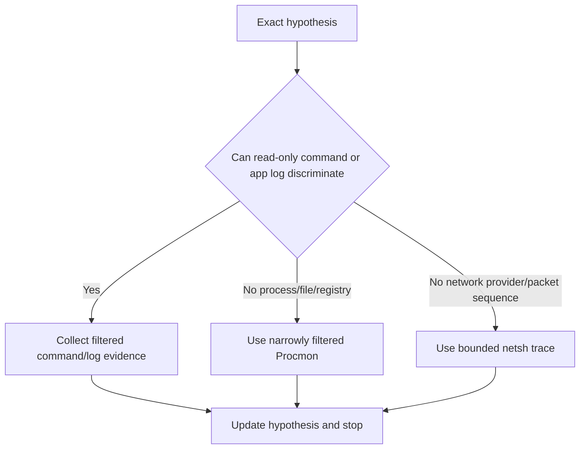
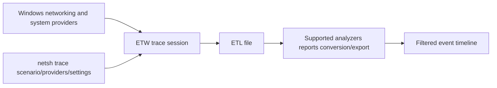
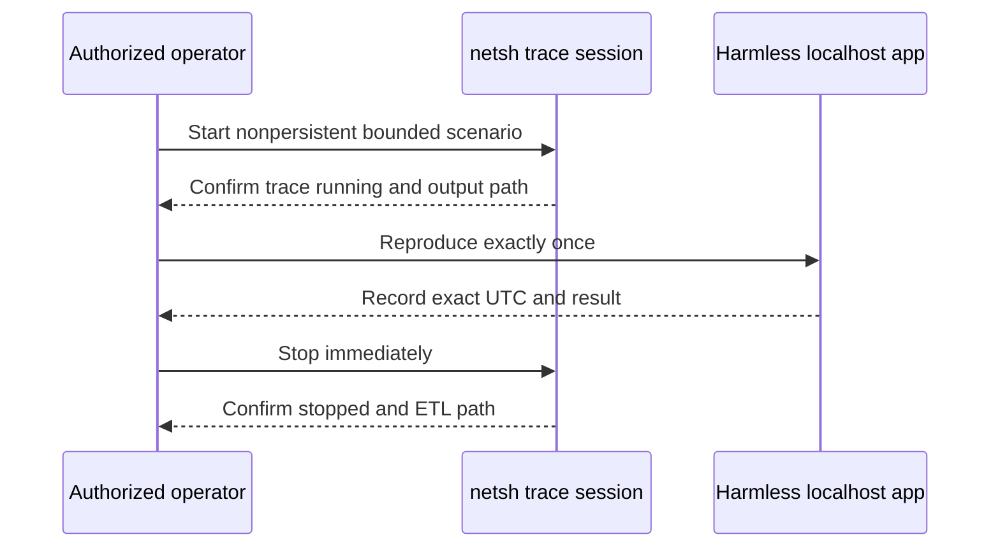
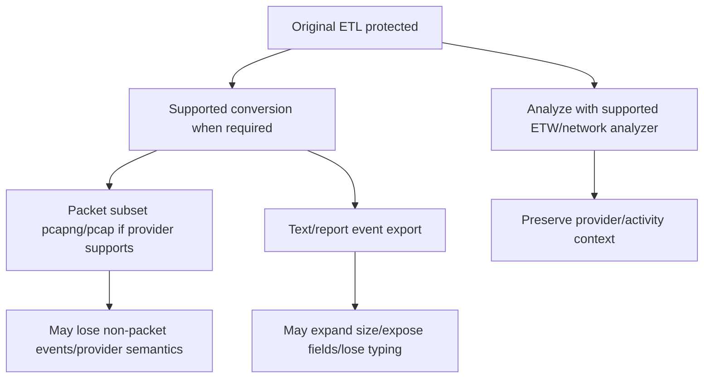
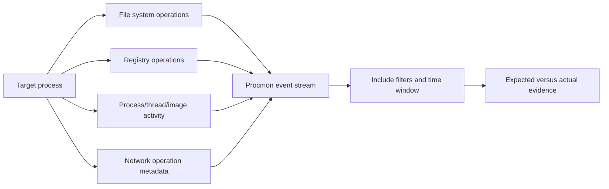
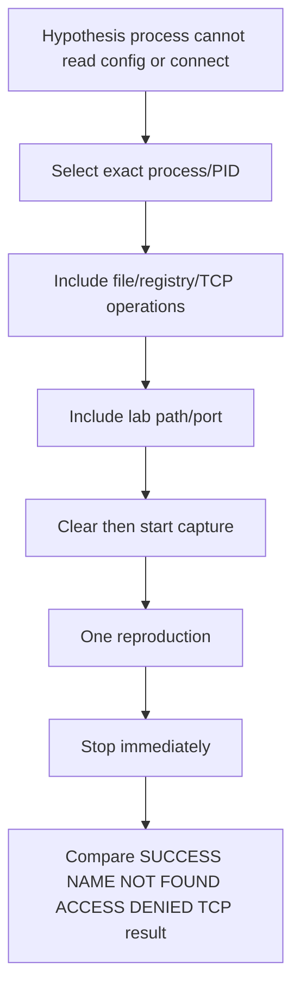
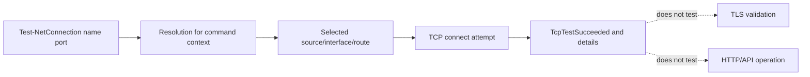
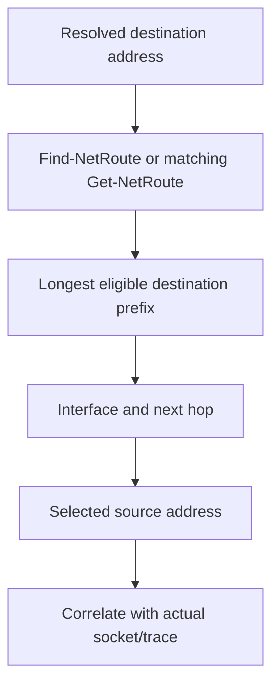
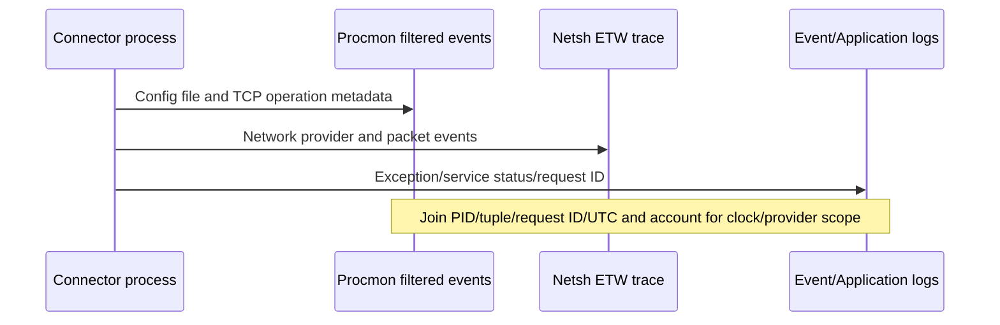
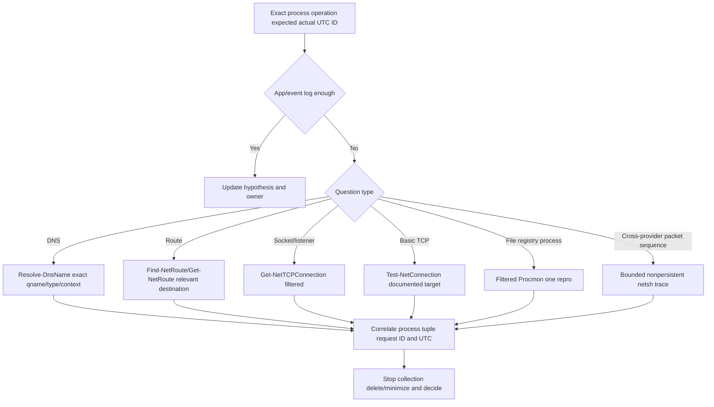

# Part 081 - Netsh Procmon Test NetConnection and PowerShell

> **Purpose:** Collect the smallest useful Windows endpoint evidence across network, process, file, registry, route, DNS, and event boundaries, with explicit trace stops and deletion.
>
> **Artifact label:** Windows working-familiarity lab using localhost and optional scoped ETL/Procmon metadata. No customer data, credentials, security-control changes, or third-party probes.
>
> **Currency and source access date:** August 24, 2026.

## Section goal

By the end of this Part, Arti should be able to use Windows-native `netsh trace` with a chosen scenario, explicit nonpersistent configuration, bounded duration/size, named output, immediate stop, and protected cleanup. She should understand Event Trace Log (ETL) files as sensitive multi-provider evidence, not ordinary text, and describe conversion/analysis caveats without assuming every ETL can be losslessly turned into pcap or opened by every tool.

She should be able to use Process Monitor (Procmon) at a high level to observe process/thread, file system, registry, and network metadata; design include filters before reproduction; recognize that Procmon network events are not packet payload captures; and understand stacks, symbols, boot logging, and profiling as specialized/high-volume options rather than defaults.

She should use `Test-NetConnection`, `Get-NetTCPConnection`, `Get-NetRoute`/`Find-NetRoute`, `Resolve-DnsName`, `Get-NetIPConfiguration`, and `ipconfig` to answer exact questions, not dump an endpoint. She should connect command output with Windows Event Log/application logs, UTC, process ID, tuple, request ID, and expected/actual behavior. The guiding principle is **least collection**: use the least invasive source that can disconfirm the current hypothesis.

## JD Mapping

| Supplied role signal | Capability developed | SaaS/API/email example | Proof artifact |
|---|---|---|---|
| Complex investigations | Correlates process/config/network/event evidence | Connector never attempts API | Windows evidence timeline |
| API support | Separates DNS/route/TCP from TLS/HTTP | Port 443 succeeds but API 403 | PowerShell checkpoint matrix |
| Cloud Email Security | Collects local service/connectivity evidence without message content | Mail connector reset | Filtered ETL/Procmon plan |
| SaaS Security | Handles ETL/PML/logs as sensitive artifacts | Identity agent file/config access issue | Evidence manifest |
| Diagnostic tools | Builds working familiarity with Netsh, Procmon, PowerShell | Windows native triage | Local lab |
| Customer trust | Requests minimum targeted evidence and explicit cleanup | Remote troubleshooting | Collection script/checklist |
| Engineering collaboration | Supplies process/version/config access/socket/route/DNS/event timeline | Reproducible endpoint issue | Escalation packet |
| Security/privacy | Stops traces, avoids stacks/boot logs by default, deletes raw artifacts | Least collection | Privacy rubric |
| Continuous learning | Uses Microsoft Learn/Sysinternals official docs | Current syntax/status | Source ledger |
| Honest positioning | Frames tools as working familiarity, not Windows kernel/network ownership | Interview answer | Honesty statement |

## Candidate honesty note

Arti can accurately cite working familiarity with Netsh, Procmon, Network Monitor, PowerShell, and Windows endpoint evidence. Her real production foundation is Microsoft enterprise support, which makes Windows log/process/client-cloud troubleshooting a natural transfer strength. She should still avoid claiming kernel ETW provider design, advanced Procmon stack forensics, Windows networking component ownership, or authority to capture customer endpoints without consent.

| Evidence tier | Safe claim | Boundary |
|---|---|---|
| Production transfer | Windows enterprise support, logs, escalation, fix validation, customer sessions | Exact past tool depth must match real examples |
| Working familiarity | Scoped netsh/Procmon/PowerShell evidence | Not kernel/provider expert |
| Local lab | Loopback server, filtered commands, optional short traces | Not customer production proof |
| Learned architecture | ETW/ETL, providers, stack/symbol concepts | Internal implementation varies |
| Unknown | Abnormal-approved Windows collectors/providers/retention | Follow internal runbooks |

## 1. Start with the evidence question

Windows offers many overlapping sources. The correct source is the cheapest one that separates hypotheses.

| Question | First evidence source | Escalate collection only if |
|---|---|---|
| Does name resolve in intended client context? | `Resolve-DnsName` plus app log | App resolver differs or timing issue |
| Which route/interface would Windows select? | `Find-NetRoute`/`Get-NetRoute` | Policy/tunnel behavior needs trace |
| Is local/remote TCP connection state present? | `Get-NetTCPConnection` | State is too transient or packet cause needed |
| Can one documented TCP listener handshake? | `Test-NetConnection` | Need TLS/HTTP or both-side proof |
| Did process read intended config/file/registry key? | Filtered Procmon | App logs/effective-config evidence insufficient |
| Did Windows networking providers record failure sequence? | Short scoped `netsh trace` | Simpler sources cannot answer |
| Did service/app report an exception? | Application/Windows Event Log | Need ETW/Procmon correlation |



## 🔍 Plain-English deep-dive: More telemetry can reduce understanding

A ten-gigabyte trace may contain the decisive event but bury it among millions of unrelated events, expose users and credentials, and be difficult to transfer. A filtered ten-line timeline tied to one process/request often has higher diagnostic value.

Think of asking every employee to speak at once versus interviewing the two witnesses who saw the event. The analogy stops because broad telemetry can still be necessary for intermittent cross-component failures, but must be planned.

The least-collection ladder is: existing error/request ID -> effective config/status -> one filtered command -> app/event log -> filtered Procmon or narrow ETL -> broader coordinated trace only under owner guidance.

## 2. ETW and ETL from zero

Event Tracing for Windows (ETW) is a high-performance Windows instrumentation framework. **Providers** emit typed events, **sessions** enable/collect selected providers, and **consumers** process events live or from files. An `.etl` file stores trace events and metadata. `netsh trace` orchestrates networking-related scenarios/providers and can include packet capture.



| ETW term | Plain meaning | Support value | Caution |
|---|---|---|---|
| Provider | Component emitting structured events | Component-specific state/reasons | Enabling many providers increases volume |
| Event | Timestamped typed record | Sequence and fields | Fields can contain identifiers/content |
| Session | Active collection configuration | Start/stop scope | Must be stopped; persistent sessions are risky |
| Scenario | Predefined collection grouping in `netsh trace` | Easier relevant provider set | Still can be broad/sensitive |
| ETL | Binary event trace file | Preserves structured events | Not plain pcap/text; tool/version matters |
| Correlation/activity ID | Links related events | Cross-provider flow | Not always present/propagated |
| Report/cab | Optional processed artifacts | Summary/support packaging | May add system/config data and size |

## 3. Planning `netsh trace`

Before starting, use `netsh trace show scenarios` and `netsh trace show scenario <name>` where permitted to inspect available scenario/providers. Scenario names and provider sets vary by Windows version. Choose the narrowest supported scenario; `InternetClient` is a common example for client connectivity but is not universally the best.

| Plan field | Decision |
|---|---|
| Hypothesis | What event/packet sequence is needed? |
| Scenario/providers | Narrowest set documented on this Windows version |
| Capture | Whether packet capture is required (`capture=yes/no`) |
| Correlation | Process/PID, tuple, hostname, request ID, UTC |
| Persistence | `persistent=no` for normal diagnostic session |
| Size/mode | Bounded `maxSize`; single/circular according to approved need |
| Report | Disable extra report when unnecessary (`report=no`) |
| Output | Protected local path with space and permissions |
| Repro | One exact attempt after trace start |
| Stop | Named operator/time; immediate `netsh trace stop` |
| Retention | Analyze minimum, approved transfer, delete by UTC |

## 4. Safe start and stop pattern

Example for an **authorized learner-owned short trace**, run in an elevated terminal only if local policy permits:

```powershell
netsh trace start scenario=InternetClient capture=yes report=no persistent=no maxSize=64 fileMode=single traceFile="C:\Temp\trace-081.etl"
```

Immediately reproduce one harmless localhost operation, then:

```powershell
netsh trace stop
```

The output path must exist/be approved and not contain existing evidence to overwrite. Syntax/options/scenarios must be checked with `netsh trace start help` on the installed Windows version. A 64 MB maximum is a lab bound, not a universal production recommendation. Even a short scenario can record unrelated system/network metadata.



### Start/stop safety

| Risk | Guardrail | Verification |
|---|---|---|
| Forgotten running trace | Named stop owner and timer | `netsh trace show status`; stop confirmation |
| Reboot persistence | `persistent=no` | Status/config output |
| Disk growth | Small maxSize/mode/duration | File size and free space |
| Extra reports | `report=no` unless required | Output inventory |
| Sensitive packet/provider data | Local synthetic repro/narrow scenario | Classification and deletion |
| Admin impact | Own device/authorized window | Skip if elevation not approved |

## 5. ETL sensitivity and conversion caveats

An ETL may contain packet fragments, DNS names, IP addresses, process/app identities, adapter/routes, proxy details, certificate metadata, user/system identifiers, and provider payloads. Renaming `.etl` to `.pcap` does not convert it. Packet/event conversion depends on trace providers, Windows/tool version, metadata, and analyzer. Some conversions extract packets but lose ETW event context; others produce multiple files or very large text/XML.



| Action | Risk | Safe rule |
|---|---|---|
| Analyze original directly | Tool modifies workspace/indexes | Preserve original/hash when chain of custody matters; work on copy |
| Convert to pcap | Non-packet events lost; link/metadata differences | State converter/version and limitations |
| Convert to text | Massive expansion/sensitive strings | Filter first/approved protected path |
| Generate report/cab | Adds system/config data | Only when runbook requires |
| Upload to ticket/cloud | Persistent broad exposure | Approved secure transfer/access/retention |
| Email ETL | Size/security exposure | Never ordinary email |

## 🔍 Plain-English deep-dive: ETL is a multiplexed event recording, not “a Windows pcap”

A network ETL can contain packets plus component events explaining state transitions, failures, interfaces, and process context. Extracting packets may help Wireshark analysis but discard the events that explain why Windows made a decision. Conversely, not every ETL contains packet data.

Think of a flight recorder with audio, instrument readings, and control events. Exporting only a video view loses other channels. The analogy stops because ETW providers have structured schemas and version-specific metadata.

Always document collection command/scenario/providers, Windows build, analyzer/converter/version, original versus derived artifact, and losses introduced by conversion.

## 6. Procmon from zero

Process Monitor is a Sysinternals tool that records real-time file-system, registry, process/thread, and selected network activity. It combines concepts from legacy Filemon and Regmon and adds filtering, process tree, details, stacks, and logging.

Procmon is not a packet sniffer. Its network category records operations/endpoints/results/duration metadata available to Procmon; it does not provide TCP sequence numbers or payload. It can answer “which process attempted TCP Connect to which endpoint?” and “which configuration file/key returned NAME NOT FOUND/ACCESS DENIED?”



| Procmon category | Example question | Evidence | Limitation |
|---|---|---|---|
| File system | Did connector open intended config/cert/log? | Path, operation, result, detail | Path/content sensitive |
| Registry | Which proxy/setting key was queried? | Key, operation, result/data summary | Registry data can contain secrets |
| Process/thread | Which executable/child loaded/exited? | PID, command/image events | Command line/user sensitive |
| Network | Did process perform TCP Connect/Send/Receive metadata? | Endpoint/operation/result/duration | No packet payload/sequence analysis |
| Image load | Which DLL/provider loaded? | Path/version/signature context | Broad volume |
| Profiling | Periodic stack sampling | CPU hot path | High volume/specialized |

## 7. Procmon filter design

Procmon starts capturing by default in many workflows, so establish filters quickly or configure before reproduction. Filter by Process Name/PID, operation, path/endpoints, result, and time. Be careful with “exclude” filters that still collect data in backing file/memory depending workflow; use drop-filtered-events only when its data-loss effect is understood and approved.

| Goal | Include filter concept | Why |
|---|---|---|
| One connector process | Process Name is `python.exe` or exact lab process | Removes unrelated system activity |
| One PID instance | PID is `1234` | Distinguishes same-name processes; PID can recycle |
| Config lookup | Path contains `flight-081` plus file/registry operations | Finds effective source |
| Network metadata | Operation begins with TCP and port 8081 | Links process to local flow |
| Access failure | Result is ACCESS DENIED | Finds permission boundary |
| Missing file/key | Result is NAME NOT FOUND/PATH NOT FOUND | Normal probing can produce many misses; context required |
| Time window | Clear display immediately before repro, stop immediately after | Limits event count |



## 8. Interpreting Procmon results

`SUCCESS` means the operation completed under its specific semantics; it does not prove application correctness. `NAME NOT FOUND` can be normal when applications probe optional paths. `ACCESS DENIED` can be expected during fallback or indicate the failure. Sequence/context matter.

| Result/pattern | Possible meaning | Required context |
|---|---|---|
| SUCCESS reading config | Bytes/metadata read successfully | Was it correct file/version/content? |
| NAME NOT FOUND then alternate SUCCESS | Normal search/fallback | Effective source is later success |
| ACCESS DENIED then app error | Permission hypothesis strengthened | Requested access, identity, file ACL/owner |
| TCP Connect SUCCESS | OS operation connected at Procmon boundary | TLS/HTTP not proven |
| TCP Connect timeout/failure | Transport operation failed | Route/firewall/listener evidence needed |
| Repeated file reads | Polling/retry/config reload | Not necessarily performance cause |
| Process Exit | Process ended with code | Exception/crash/log needed |

## 🔍 Plain-English deep-dive: “NAME NOT FOUND” can be an ordinary search step

Applications often check several configuration locations, language files, optional DLLs, or registry values. One missing candidate followed by success at the intended location is normal. A filtered Procmon list full of red results is not automatically the cause.

Think of checking three pockets before finding keys in the fourth. The first three “not found” results are part of a successful search. The analogy stops because applications define exact fallback and error handling.

Correlate the missing path with subsequent fallback, application error time, effective configuration, and code/documentation. The decisive failure is often the last required resource that had no successful alternative.

## 9. Procmon stacks and symbols

Procmon can capture/display call stacks for events. Stacks identify user/kernel modules/functions that led to an operation when symbols are available. Symbol configuration can contact servers, expose module paths/build identities, take time, and produce incomplete/misleading names. Stack capture/profiling adds overhead and volume.

| Stack question | Value | Caution |
|---|---|---|
| Which module requested file/key? | Narrows code owner | Inlining/optimization/symbol mismatch |
| Which library initiated network operation? | Runtime/proxy/TLS clue | Async call stacks may not show logical initiator |
| Is third-party filter involved? | Module stack clue | Presence is not causation |
| Why high CPU? | Profiling samples/hot paths | Procmon is not full performance profiler |

Use stacks only when basic filtered event sequence cannot answer and Engineering requests it. Do not enable boot logging, profiling, or broad stacks for the Part 081 lab.

## 10. `Test-NetConnection`

`Test-NetConnection` provides diagnostic information for ping, TCP port, route, and related tests depending parameters. For SaaS diagnosis, `-ComputerName <name> -Port <documented-port> -InformationLevel Detailed` can show resolved/remote address, source address/interface, and `TcpTestSucceeded`. It is not an HTTP/TLS/API test.

| Field/result | Means | Does not mean |
|---|---|---|
| ComputerName | Input target name/address | Exact app resolver path if runtime differs |
| RemoteAddress | Address selected for this test | All DNS candidates/path health |
| RemotePort | TCP destination port | Protocol identity |
| InterfaceAlias/SourceAddress | Windows selection for test | Full Internet path |
| TcpTestSucceeded True | TCP handshake succeeded for test | TLS certificate/HTTP/auth/product success |
| False | Test did not establish under conditions | Firewall root cause |

## 🔍 Plain-English deep-dive: A green port test is one checkpoint, not a substitute application

`Test-NetConnection` uses its own resolver, route, process, proxy assumptions, source selection, and TCP behavior. A background service may use a forward proxy, container namespace, different DNS view, client certificate, or workload identity. Therefore a green TCP result narrows the path but does not reproduce the service.

Think of confirming a building's front door opens while the employee's secure room remains inaccessible. The front door test is useful, but it does not test the badge or room. The analogy stops because the application adds TLS, HTTP, authentication, schema, and product state.

Record the test's selected address, source/interface, port, UTC, and result, then compare its context with the failing process. State explicitly which later checkpoints remain.



Avoid `-TraceRoute` against third-party targets unless authorized; Part 081 lab uses only loopback. ICMP and path tools are covered in Part 082.

## 11. `Get-NetTCPConnection`

`Get-NetTCPConnection` enumerates TCP connections/listeners with local/remote addresses/ports, state, owning process, and policy/offload fields depending version. Filter as early as possible.

| Question | Filter pattern | Caution |
|---|---|---|
| Is local lab listener present? | `-LocalAddress 127.0.0.1 -LocalPort 8081 -State Listen` | Listener only local readiness |
| Connections to port | `Where-Object` local/remote port 8081 | Broad enumeration happens before pipeline; small lab only |
| Which PID owns listener? | `OwningProcess` then `Get-Process -Id` | PID can recycle; process/user info sensitive |
| Are many CLOSE_WAIT/TIME_WAIT? | `-State` and count/trend | State alone not cause |
| Which remote endpoint? | Exact address/port filter | Proxy may be peer, not origin |

## 12. Routes and interfaces

`Get-NetRoute` lists routes; `Find-NetRoute -RemoteIPAddress` can identify best route/source for a destination on supported systems. `Get-NetIPConfiguration` summarizes interfaces, addresses, gateways, and DNS. These expose topology; never attach raw full output without redaction.



| Command | Best use | Limitation |
|---|---|---|
| `Get-NetRoute` | Inventory/filter exact routes | Route table can be large/sensitive |
| `Find-NetRoute` | Best route/source for exact address | Policy/runtime behavior still needs actual attempt |
| `Get-NetIPConfiguration` | Relevant active interface/gateway/DNS summary | Full output exposes configuration |
| `Get-NetIPAddress` | Address/lifetime/prefix details | Many virtual/temporary addresses |
| `Get-NetAdapter` | Link/admin/media state | Link up is not cloud reachability |

## 13. `Resolve-DnsName` and `ipconfig`

`Resolve-DnsName` queries DNS and can specify type/server/options. Record exact qname/qtype/resolver/view/UTC/response. `ipconfig /all` displays broad adapter/DHCP/DNS/suffix data and is sensitive. `ipconfig /displaydns` can expose browsing/internal names; avoid it for routine sharing. `/flushdns`, `/release`, and `/renew` change state and are excluded from this lesson's lab.

| Command | Safe use | Risk/limit |
|---|---|---|
| `Resolve-DnsName example.com -Type A` | Public read-only exact type | Command resolver context may differ from app |
| `Resolve-DnsName localhost` | Local name/hosts behavior | Not public DNS |
| `ipconfig` | Basic active address summary | Still exposes network data |
| `ipconfig /all` | DHCP/DNS/gateway detailed diagnosis | Broad sensitive output |
| `ipconfig /displaydns` | Local cache diagnostics under explicit need | Browsing/internal-name exposure |
| `ipconfig /flushdns` | Changes cache | Preserve evidence first; not lab |
| `ipconfig /release`/`renew` | Changes lease/connectivity | Can disconnect remote session; not lab |

## 14. Event and application logs

Windows Event Log channels and application logs can show service starts/stops, DNS client events, networking component errors, TLS/Schannel events, application exceptions, and policy activity. Event IDs are provider/version-specific; do not memorize one number as universal.

| Log field | Why needed | Caution |
|---|---|---|
| Provider/channel | Defines schema/owner | Same Event ID across providers differs |
| Event ID/version/level | Identifies event type | Level is not business severity |
| TimeCreated UTC | Timeline | Viewer displays local time by default |
| Record ID/activity ID | Correlation | Scope is channel/provider/session |
| Process/thread/user | Local owner | PII/security-sensitive |
| Payload fields | Error/status/config | May contain names/paths/data |
| Log size/retention | Explains missing history | Absence may be overwrite/filter |



## 15. Worked examples

### Example A: Port succeeds, API fails 403

`Test-NetConnection` to 443 succeeds, proving test-context TCP establishment. `curl` under normal validation receives API 403/request ID. Stop network collection; inspect principal/tenant/role/scope/resource policy. TNC success never proved API authorization.

### Example B: No packets because app reads wrong URL

Procmon shows connector reads `config.old.json` and never accesses current file; app log reports invalid endpoint before socket activity. The failure is local effective configuration, not DNS/firewall. Fix through supported config owner/change, then validate original workflow.

### Example C: Procmon ACCESS DENIED on client certificate key

Service reads certificate metadata but gets access denied opening private-key provider/resource. No mTLS ClientHello with client proof follows. Route to certificate/service-account owner. Never export private key/PFX to support.

### Example D: Short netsh trace captures reset

One 20-second ETL shows TCP establishes then RST appears after TLS ClientHello; application log has same UTC. Convert/extract only if supported; correlate proxy/firewall/provider events in ETL. RST sender and policy log determine owner; ETL packet alone may not prove intent.

| Example | Cheapest decisive source | Failed boundary | Next owner |
|---|---|---|---|
| TNC true/403 | HTTP response/request ID | Authorization | IAM/API |
| Wrong config | Procmon + app log | Local effective config | App/admin |
| Key access denied | Procmon/file/key access + TLS log | Local identity/private-key access | Endpoint/PKI/IAM |
| Reset after TLS hello | ETL + app/proxy logs | TLS/proxy/transport | Proxy/security/service |

## 16. Troubleshooting decision tree



## 17. Failure modes and escalation package

| Failure/shortcut | Why harmful | Better practice |
|---|---|---|
| Full `ipconfig /all` in ticket | Topology/user/DHCP/DNS exposure | Extract relevant fields and aliases |
| Flush/release/renew first | Destroys evidence/disconnects | Read state/logs before approved action |
| TNC true = API works | Tests only TCP | Continue TLS/HTTP/auth contract |
| Procmon without filters | Millions of sensitive events | Include process/path/operation/time |
| Red rows = root cause | Normal probing/fallback | Sequence and required resource semantics |
| Procmon network = pcap | No payload/sequence | Use ETL/pcap only when needed |
| Enable stacks/boot logging by default | Volume/overhead/privacy | Engineering-requested specialized collection |
| Leave netsh running | Disk/privacy impact | Nonpersistent/size/time/explicit stop/status |
| Treat ETL as pcap | Loses provider context | Document native/derived analysis |
| Upload ETL/PML raw | Sensitive broad artifact | Protected transfer/minimum export/delete |

### Escalation package

| Field | Minimum evidence |
|---|---|
| Case | Operation, expected/actual, scope/impact, change, UTC |
| Endpoint | OS/build/runtime/app version/process/PID alias/service identity alias |
| Effective config | Sanitized endpoint/proxy/trust/config source and access results |
| DNS/route | Exact qname/type/resolver; selected route/source/interface aliases |
| TCP | TNC limitation, listener/connection state, tuple, reset/timeout phase |
| Procmon | Tool version, filters, start/stop UTC, key event rows/results/stacks status |
| ETL | Start command/scenario/capture/report/persistence/size/path alias, stop proof, Windows build |
| Event logs | Provider/channel/event ID/version/record/activity/time and minimal payload |
| Correlation | PID, tuple, request ID, activity ID, UTC mapping |
| Privacy | No credentials/private key/content/topology; protected artifact/retention |
| Ask | Exact app/endpoint/IAM/network/Engineering decision needed |

## Safe local lab: The Windows Least-Collection Ladder 081

### Prerequisites

- Learner-owned Windows workstation and authorization. Linux learners complete the paper/command-comparison sections; Part 082 covers Linux tools.
- PowerShell, `netsh`, and Python 3 already installed. Procmon optional and only if already installed from official Sysinternals source under local policy.
- Empty directory `C:\Temp\Lab081` only if permitted; otherwise use an approved user-owned temporary path. Harmless file `evidence-081.txt` contains `CASE-081 localhost only`.
- Loopback port 8081.
- Optional elevated rights for netsh trace. If not approved, skip ETL and complete a paper trace plan. Do not elevate merely to satisfy the lab.
- No public target, credentials, browser session, customer/internal data, private key, firewall/proxy/VPN/route/DNS/trust/registry/config change.
- Artifact label: **local Windows lab - loopback and least-collection evidence; optional maximum 64 MB short ETL**.

### Lab procedure

1. Record start UTC, Windows build, PowerShell/Python/Procmon versions, authorization, temp path, and no-change statement.
2. Use `Resolve-DnsName localhost` and record only loopback answers/source behavior.
3. Use `Get-NetIPConfiguration` but retain only loopback/active-interface category, not addresses/names. Explain why raw output is sensitive.
4. Before server start run:

   ```powershell
   Test-NetConnection 127.0.0.1 -Port 8081 -InformationLevel Detailed
   ```

   Record expected `TcpTestSucceeded=False` (wording/result may vary) and no listener.
5. Start `py -3 -m http.server 8081 --bind 127.0.0.1` in the harmless directory. Stop action is `Ctrl+C`.
6. Run filtered listener query:

   ```powershell
   Get-NetTCPConnection -LocalAddress 127.0.0.1 -LocalPort 8081 -State Listen
   ```

7. Run TNC again. Record selected source/interface/remote address/port and TCP result. State what remains untested.
8. Use `Get-NetRoute -AddressFamily IPv4` only to identify loopback/default-route concepts; do not retain full table. If `Find-NetRoute` is available, use only loopback address and document result.
9. Make one `curl.exe --max-time 5 http://127.0.0.1:8081/evidence-081.txt` request. Record HTTP/server-log UTC and filtered TCP state if visible.
10. **Optional Procmon path:** configure include filters for the Python process/PID, lab directory path, and TCP port 8081 operations. Clear current events, start, make one request, stop immediately. Save no PML if the filtered event table can be summarized. Record file open/read and TCP metadata; no stacks/profiling/boot logging.
11. **Optional netsh path:** inspect `netsh trace show scenarios` and scenario help. Confirm disk space/path. Start bounded trace:

   ```powershell
   netsh trace start scenario=InternetClient capture=yes report=no persistent=no maxSize=64 fileMode=single traceFile="C:\Temp\Lab081\trace-081.etl"
   ```

12. Verify start response, make exactly one localhost curl request, then immediately run `netsh trace stop`. Record stop confirmation and `netsh trace show status`. If scenario/syntax unsupported, stop/skip and document; do not improvise broad providers.
13. Do not convert the ETL in the lab. Create a conversion-decision worksheet: analyzer, required packet/provider evidence, expected loss, output sensitivity, approved tool, original preservation/deletion.
14. Create an event-log worksheet using synthetic provider/channel/event ID/record/activity/request fields. Do not export broad live logs.
15. Build four evidence ladders for wrong config, DNS failure, TCP refusal, and API 403. Choose cheapest source before Procmon/ETL.
16. Draft escalation packets for Procmon ACCESS DENIED and ETL-observed reset scenarios using synthetic data.
17. Stop Python server; verify listener absent. Confirm netsh trace status stopped and Procmon capture stopped.
18. Delete ETL/PML/raw outputs and harmless file/directory after extracting minimized worksheet. Record deletion/end UTC.

### Expected evidence

- Least-source selection table for each hypothesis.
- `Resolve-DnsName localhost`, filtered interface/route concepts, and before/after local TNC results.
- Filtered listener/tuple/process and one harmless HTTP request timeline.
- Optional Procmon filter plan and minimal file/network metadata sequence.
- Optional netsh exact start/one-repro/stop/status/file-size record, bounded at 64 MB.
- ETL conversion caveat/decision worksheet without conversion.
- Synthetic event/application log correlation.
- Four source-selection ladders and two escalation packets.
- Confirmed server/trace/Procmon stopped and raw files deleted.
- Spoken 90-second least-collection and honest-experience answer.

### Cleanup and privacy

- Stop Python with `Ctrl+C`; verify no 8081 listener.
- Run `netsh trace stop` if any uncertainty exists, then verify stopped status. Do not leave a trace session active.
- Stop Procmon capture and close Procmon. Delete PML/backing file if created.
- Delete ETL, CAB/report/text/pcap derivatives, harmless file, raw command output, and temp directory; verify absence.
- Retain no adapter/DNS/gateway/proxy/VPN names, public/private addresses, MAC, username/path, process command line, registry data, event payload, request body, token, cookie, certificate/private key, or customer identifier.
- Confirm no flush/release/renew, proxy/firewall/VPN/route/DNS/trust/registry/security change occurred.
- Record: `Windows Least-Collection Ladder 081 completed on localhost; all server/Procmon/netsh sessions stopped and raw ETL/PML/output deleted; no credential, customer data, public probe, or security change used.`

### Validation rubric

| Dimension | Fail | Developing | Pass |
|---|---|---|---|
| Source choice | Starts broad ETL | Uses commands | Chooses cheapest discriminating source and stops when answered |
| Netsh | Starts unbounded/persistent | Stops trace | Narrow scenario, no report/persistence, size/time/repro/stop/status/delete |
| ETL | Calls it pcap | Knows providers | Preserves native context, documents conversion loss/sensitivity/tool version |
| Procmon | No filters/red rows cause | Process filter | Process/path/operation/time filters, sequence/fallback, no default stacks |
| PowerShell | Dumps all config | Uses TNC | Filters DNS/route/socket/interface and states limitations |
| Correlation | Separate outputs | Common UTC | PID/tuple/activity/request ID plus provider/channel timeline |
| Safety | Leaves trace/files | Stops one tool | Verifies all stops, deletes artifacts, changes no state/security |
| Honesty | Claims kernel expertise | Says familiar | States Windows support transfer and tool-depth boundary |

## Cross-Tool Evidence and Escalation Quality

Windows tools answer different questions. `Test-NetConnection` can establish a scoped connectivity observation, but not application correctness. `Get-NetTCPConnection` shows socket state, but not why the owning process chose an endpoint. `Get-NetRoute` explains candidate route selection, but not every downstream hop. A Netsh trace can expose network events across a time window, while Procmon can correlate process, file, registry, and selected network activity. Event logs may add service or policy context. None should be treated as a universal root-cause oracle.

For a useful escalation, normalize all evidence to UTC and record the affected process, user context where authorized, destination name and address, local and remote ports, command/tool version, filters, collection start and stop, exact error, request or correlation ID, recent change, control comparison, and privacy redactions. Build a short timeline that distinguishes observation from inference. For example, a successful TCP probe plus an application TLS error narrows the issue beyond basic reachability; it does not prove the remote service is healthy. A Procmon `ACCESS DENIED` result identifies an operation and path, but the responsible policy or intended permission still requires ownership evidence.

Prefer the least intrusive tool that can falsify the current hypothesis. Stop traces immediately after the target event, preserve original files securely, export only the minimum redacted excerpt, and include the commands needed to reproduce the collection safely. This reduces customer effort, limits sensitive data, and gives Engineering a discriminating evidence package instead of unrelated diagnostic volume.

Reproducibility also requires environment context: Windows build, PowerShell version, architecture, relevant policy state, network profile, proxy/VPN state, and whether the shell was elevated. Record hashes for retained artifacts when integrity matters, keep originals read-only, and document every transformation or export. If a second collection differs, compare scope, filters, timing, interface, process identity, configuration, and tool version before concluding that the underlying behavior changed.

## Official Source Anchors - August 24, 2026

| Official or primary source | Topic anchored | Boundary |
|---|---|---|
| [Microsoft Learn - netsh trace](https://learn.microsoft.com/en-us/windows-server/networking/technologies/netsh/netsh-trace) | Network trace commands/scenarios/start/stop context | Syntax/scenarios vary by Windows build |
| [Microsoft Learn - Network Shell command reference](https://learn.microsoft.com/en-us/windows-server/networking/technologies/netsh/netsh) | Netsh framework | Use trace-specific/current guidance |
| [Microsoft Learn - Event Tracing](https://learn.microsoft.com/en-us/windows-hardware/test/weg/instrumenting-your-code-with-etw) | ETW provider/session/consumer foundation | Developer view; operational tools vary |
| [Microsoft Learn - Event Trace Log files](https://learn.microsoft.com/en-us/windows-hardware/test/wpt/event-trace-log) | ETL/WPA context | Not every ETL is compatible with every analyzer |
| [Sysinternals Process Monitor](https://learn.microsoft.com/en-us/sysinternals/downloads/procmon) | Official Procmon features/download/docs | Tool version/current EULA/policy apply |
| [Process Monitor book/resources](https://learn.microsoft.com/en-us/sysinternals/resources/troubleshooting-book) | Sysinternals troubleshooting context | Advanced stacks/cases require expertise |
| [Microsoft Learn - Test-NetConnection](https://learn.microsoft.com/en-us/powershell/module/nettcpip/test-netconnection) | TNC fields/options | TCP test is not TLS/HTTP |
| [Microsoft Learn - Get-NetTCPConnection](https://learn.microsoft.com/en-us/powershell/module/nettcpip/get-nettcpconnection) | TCP listener/state/process evidence | Filter sensitive output |
| [Microsoft Learn - Get-NetRoute](https://learn.microsoft.com/en-us/powershell/module/nettcpip/get-netroute) | Route table evidence | Read-only in lab |
| [Microsoft Learn - Find-NetRoute](https://learn.microsoft.com/en-us/powershell/module/nettcpip/find-netroute) | Best-route/source lookup | Availability/module version varies |
| [Microsoft Learn - Get-NetIPConfiguration](https://learn.microsoft.com/en-us/powershell/module/nettcpip/get-netipconfiguration) | Interface/gateway/DNS summary | Raw output sensitive |
| [Microsoft Learn - Resolve-DnsName](https://learn.microsoft.com/en-us/powershell/module/dnsclient/resolve-dnsname) | DNS command semantics | App resolver context can differ |
| [Microsoft Learn - ipconfig](https://learn.microsoft.com/en-us/windows-server/administration/windows-commands/ipconfig) | Windows IP/DHCP/DNS commands | Flush/release/renew change state |
| [Microsoft Learn - Windows Event Log](https://learn.microsoft.com/en-us/windows/win32/wes/windows-event-log) | Provider/channel/event architecture | Event IDs are provider/version scoped |
| [Python http.server documentation](https://docs.python.org/3/library/http.server.html) | Local lab server | Development only |

### Source-use discipline

- Check installed command help/current Microsoft docs before trace; scenarios/options/builds differ.
- Prefer filtered commands and existing app/event evidence before Procmon/ETL.
- Treat ETL, PML, event exports, registry/config, and full command outputs as sensitive.
- Never request private keys, tokens, cookies, message/API content, broad customer logs, or stack/boot capture without need/authorization.
- Always use nonpersistent bounded trace, one repro, explicit stop/status, protected storage, and deletion.
- Document original versus converted artifacts and lost provider/packet context.

## Likely Interview Questions

### Q1. How do you choose between PowerShell, Procmon, and netsh trace?

**Model answer:** I start with the cheapest evidence that can discriminate: application/event error, effective config, exact DNS/route/socket/TCP command. I use Procmon when process file/registry/network-operation metadata is missing, and a short scoped netsh ETL when cross-provider/packet sequencing is needed. I stop collection when the question is answered.

### Q2. How do you run `netsh trace` safely?

**Model answer:** I document authorization/hypothesis, inspect available scenarios, choose narrow providers/capture need, set `persistent=no`, bounded size/mode, `report=no` unless required, protected output, and one reproduction. I immediately `netsh trace stop`, verify status/file size, record command/build/tool, extract minimum evidence, and delete under policy.

### Q3. Why is an ETL not simply a pcap?

**Model answer:** ETL can multiplex structured ETW provider events and packet data, depending on collection. Packet conversion can lose provider/activity context; text conversion can expand/expose data; not every ETL contains convertible packets. I preserve/document original and converter/analyzer/version/losses.

### Q4. What can Procmon prove about a network issue?

**Model answer:** Procmon can tie a process/PID to config/file/registry access and network operation metadata such as TCP Connect/result/duration. It is not packet payload/sequence capture. I use tight process/path/operation/time filters and correlate with app logs, socket state, ETL/pcap only if needed.

### Q5. Why is `NAME NOT FOUND` not automatically a failure?

**Model answer:** Applications commonly probe optional locations and then succeed at a fallback. I follow the sequence to the effective required resource and correlate the application error. A missing candidate matters only when no valid fallback succeeds or docs/code make it required.

### Q6. What does `Test-NetConnection -Port` prove?

**Model answer:** It reports whether its command context established TCP to the selected address/port and can show source/interface/route details. It does not prove the failing application's resolver/proxy/identity context, TLS validation, HTTP/API authorization, or product processing.

### Q7. How do you correlate Windows evidence?

**Model answer:** I normalize UTC and map app process/PID, tuple, DNS qname/address, route/source/interface, Procmon operation/result, ETW provider/activity, Event Log provider/channel/record, and request ID. I record clock/tool/filter/visibility limitations and avoid broad exports.

### Q8. How do you position these tool skills honestly?

**Model answer:** Windows enterprise support is a real production strength; I have working familiarity with focused PowerShell, Netsh, Procmon, Event Logs, and trace hygiene, reinforced in localhost labs. I do not claim kernel ETW/provider expertise or unrestricted customer capture authority.

## Memory Hooks

- **Question first; cheapest evidence next.**
- **Commands before Procmon; Procmon before broad ETL when sufficient.**
- **ETW provider -> session -> ETL -> supported analyzer.**
- **Nonpersistent, bounded, no extra report, one repro, stop, status, delete.**
- **ETL is not automatically pcap.**
- **Procmon sees file/registry/process/network metadata, not packet payload.**
- **Filter process, path, operation, result, and time.**
- **Red rows require sequence/context.**
- **TNC tests TCP, not TLS/HTTP/API.**
- **Routes and `ipconfig /all` expose topology.**
- **Event ID belongs to provider/channel/version.**
- **UTC + PID + tuple + activity/request ID joins evidence.**

## Completion Checklist

- [ ] I can choose existing logs/commands/Procmon/ETL based on a discriminating question.
- [ ] I can define ETW provider, event, session, scenario, consumer, and ETL.
- [ ] I can plan and run/describe a nonpersistent bounded netsh trace with explicit stop/status.
- [ ] I can explain ETL sensitivity and original/conversion/provider-context caveats.
- [ ] I can explain Procmon file/registry/process/network categories and packet limitation.
- [ ] I can design include filters before one reproduction.
- [ ] I can interpret SUCCESS/NAME NOT FOUND/ACCESS DENIED in sequence.
- [ ] I know stacks/symbols/profiling/boot logging are specialized, not defaults.
- [ ] I can interpret Test-NetConnection without overstating it.
- [ ] I can filter Get-NetTCPConnection and map process/listener/state.
- [ ] I can use Get/Find-NetRoute and interface data with topology/privacy restraint.
- [ ] I can use Resolve-DnsName/ipconfig safely and avoid state-changing switches initially.
- [ ] I can correlate Event Log provider/channel/record/activity with process/tuple/request UTC.
- [ ] I completed or can explain **The Windows Least-Collection Ladder 081**.
- [ ] I stopped/verifed server, Procmon, and netsh; deleted ETL/PML/raw files.
- [ ] I made no public probe, security/config change, or credential/customer-data collection.
- [ ] I can answer exactly Q1–Q8 aloud with honest depth boundaries.
- [ ] I checked Official Source Anchors dated August 24, 2026.

[Next: Part 082 - DevTools HAR Fiddler Linux OpenSSL and Path Tools](Part-082-devtools-har-fiddler-linux-openssl-and-path-tools.md)