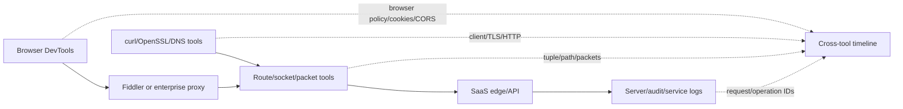
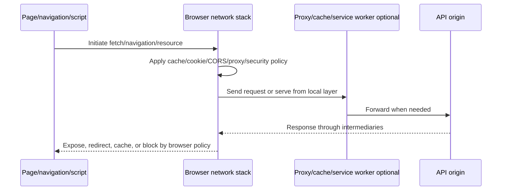
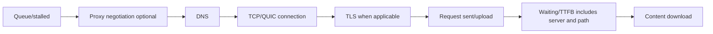
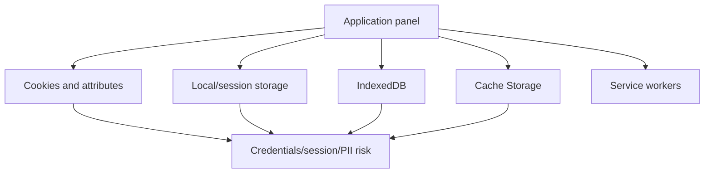
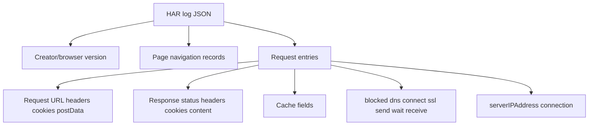
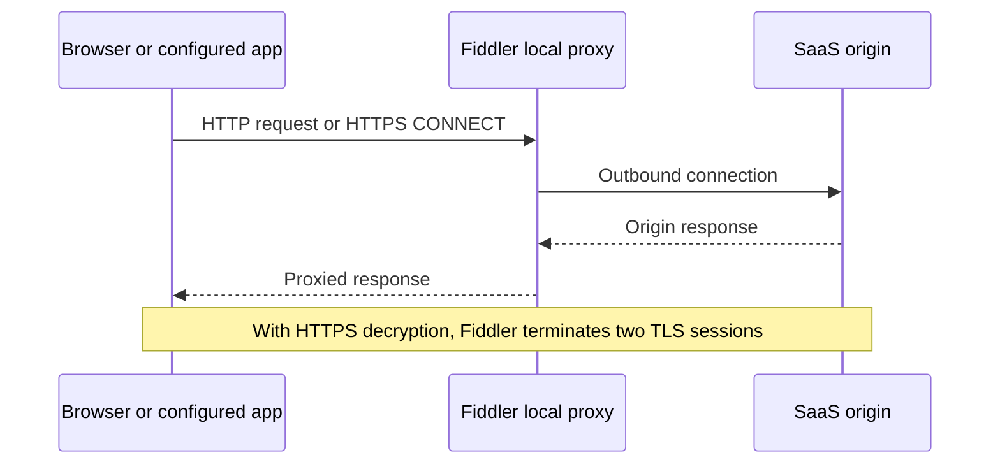
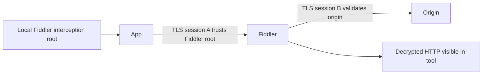
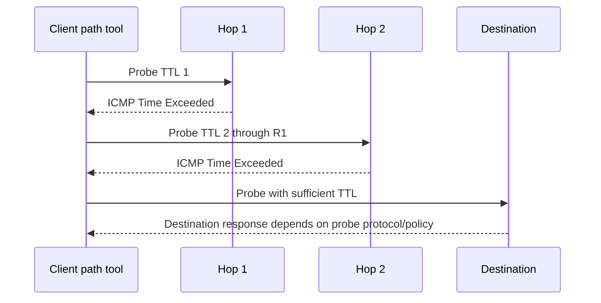
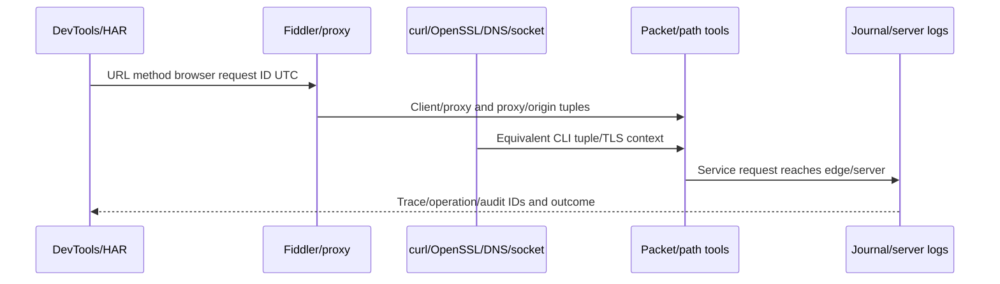
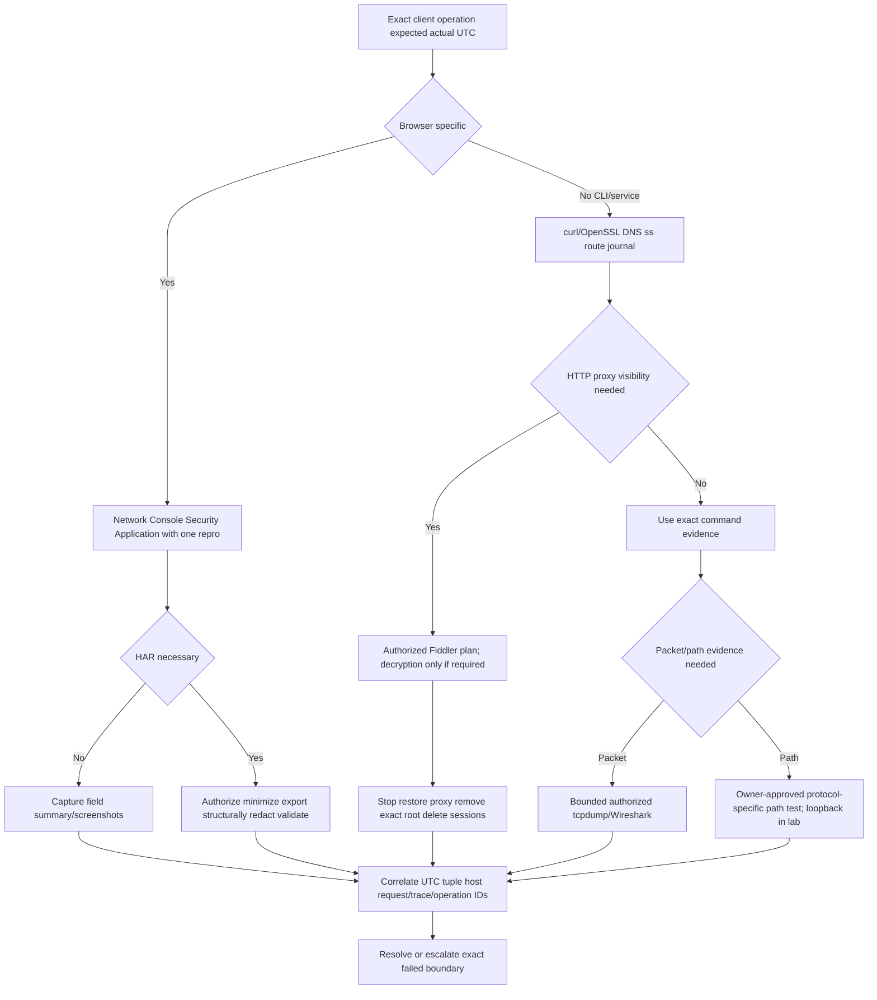

# Part 082 - DevTools HAR Fiddler Linux OpenSSL and Path Tools

> **Purpose:** Correlate browser, HTTP-proxy, command-line, DNS, TLS, route, socket, packet, and service-log evidence while protecting tokens, cookies, content, private keys, and topology.
>
> **Artifact label:** Working-familiarity cross-tool lab using localhost and bounded public documentation endpoints. Fiddler TLS decryption is conceptual unless separately authorized; no security bypass or third-party path probing.
>
> **Currency and source access date:** August 24, 2026.

## Section goal

By the end of this Part, Arti should be able to use browser Developer Tools (DevTools) Network, Console, Security, and Application panels as distinct evidence sources; read a request waterfall; and interpret request/response headers, initiator, timing, status, protocol, remote address, cookies, storage, certificate/security state, and browser errors. She should understand HTTP Archive (HAR) structure, field timing, limitations, and high-risk contents, and create a redaction/retention plan before export.

She should explain Fiddler Classic/Everywhere at a high level as an explicit local HTTP debugging proxy, including capture scope, system/application proxy effects, HTTPS decryption authorization, locally trusted interception certificate, certificate cleanup, and the difference between client-to-Fiddler and Fiddler-to-origin TLS sessions. She must never advise decrypting customer or unrelated traffic without authorization.

She should use Linux and cross-platform `curl`, OpenSSL, `dig`/`nslookup`, `ss`, `ip route`, `tcpdump`, `journalctl`, `traceroute`/`tracert`, `pathping`, and `mtr` with accurate scope and caveats. Path tools show selected probe/response behavior, not a guaranteed application route or root cause; the lab uses only loopback for path commands. Finally, she should correlate all sources using UTC, request/trace IDs, operation/event IDs, process/PID, tuple, hostname, and exact expected/actual behavior.

## JD Mapping

| Supplied role signal | Capability developed | SaaS/API/email example | Proof artifact |
|---|---|---|---|
| API support | Reads browser/curl/TLS/DNS/server evidence | Portal API 403/CORS/504 | Cross-tool request timeline |
| Complex investigations | Chooses the tool matching browser/process/path/server boundary | Browser works; Linux collector fails | Tool-equivalence matrix |
| Cloud Email Security | Correlates web console/API/message operation without exposing email content | Remediation request stuck | Request-to-operation ledger |
| SaaS Security | Protects HAR/cookies/tokens/proxy-decrypted traffic | Auth/session issue | Redaction manifest |
| Diagnostic tools | Builds practical DevTools/HAR/Fiddler/Linux/OpenSSL/path familiarity | Cross-OS support | Lab transcript |
| Customer trust | Requests minimum evidence and explains limitations | Remote-session evidence plan | Customer-safe checklist |
| Engineering collaboration | Supplies URL/method/status/timing/IDs/TLS/DNS/socket/log joins | Reproducible browser/API issue | Escalation packet |
| Privacy/security | Authorizes decryption, removes interception CA, avoids credentials/public probes | Safe Fiddler plan | Cleanup verification |
| Continuous learning | Anchors to official browser/Fiddler/curl/OpenSSL/Linux docs | Current commands | Source ledger |
| Honest positioning | Frames tools as working familiarity and labs, not tool/platform ownership | Interview answer | Honesty statement |

## Candidate honesty note

Arti can accurately state working familiarity with browser DevTools, HAR, Fiddler, cURL, OpenSSL concepts, Linux utilities, Wireshark/tcpdump, Netsh, and Procmon. Her production-strength story remains Microsoft enterprise support, customer communication, evidence correlation, Engineering escalation, and fix validation. She should not claim unrestricted TLS interception, Linux/network administration ownership, Fiddler deployment ownership, or Abnormal production tooling.

| Evidence tier | Safe claim | Boundary |
|---|---|---|
| Production transfer | Browser/client-cloud support, case correlation, remote troubleshooting | Use only real CV examples |
| Working familiarity | DevTools/HAR/curl/OpenSSL/Linux/path/Fiddler concepts | Not advanced forensics/admin ownership |
| Local/public lab | Localhost request plus `example.com` metadata | Not authenticated/customer proof |
| Conceptual authorized plan | Fiddler HTTPS decryption/certificate lifecycle | Not performed without explicit need |
| Unknown | Abnormal browser capture, proxy, endpoint, log, retention runbooks | Verify after joining |

## 1. Choose the observer closest to the question

Each tool observes a different boundary. DevTools sees browser requests and policy; Fiddler sees traffic routed through its proxy; curl sees its own resolver/proxy/TLS/HTTP stack; OpenSSL tests TLS; DNS tools query resolvers; `ss` sees local socket state; route tools show selection; tcpdump sees packets at an interface; journal/service logs show application state.



| Question | Best first observer | Why | Limitation |
|---|---|---|---|
| Did browser send preflight? | DevTools Network | Browser initiator/CORS context | Browser-only client |
| Why script cannot read 200? | Network + Console | Response and policy error | Server config still needed |
| Which cookie/storage applies? | Application panel | Browser state/scope | Values are credentials/sensitive |
| Which certificate/browser security state? | Security panel | Validated origin/cert/mixed content | Browser-specific trust/path |
| What raw HTTP did proxy see? | Authorized Fiddler | Client/proxy HTTP sessions | Only proxied traffic; decrypted content sensitive |
| Does CLI validate TLS? | curl/OpenSSL | Explicit client output | Different proxy/trust/runtime |
| Which resolver answer? | `dig`/`resolvectl`/`nslookup` | Exact qname/type/server | App may use different resolver/cache |
| Which local socket/route? | `ss`/`ip route` or PowerShell | Kernel state/selection | Not application success |
| What packet sequence? | tcpdump/Wireshark | Interface-visible protocol | Capture sensitivity/visibility |
| What did service do? | `journalctl`/app logs | Process/backend state | Logging/sampling/clock scope |

## 2. Browser DevTools Network panel

Open DevTools before reproduction, choose the Network panel, clear existing entries, preserve log only when redirects/navigation require it, disable cache only for a controlled comparison (because it changes behavior), reproduce once, and stop interaction. Browser versions/layouts differ.

The request table commonly shows name, status, type, initiator, size, time, and waterfall. Selecting a request shows headers, payload, preview/response, initiator, timing, cookies, and security details. Viewing payload/response/cookies can expose secrets and customer content.



### Network fields

| Field | Meaning | Support value | Caution |
|---|---|---|---|
| Name/URL | Requested resource | Exact endpoint/path/query | Query/object IDs/secrets |
| Method | HTTP operation | Contract/retry semantics | State-changing risk |
| Status | Respondent/cache/browser result | 401/403/429/5xx routing | “(blocked)” may be client policy, not HTTP |
| Type | Browser resource category | fetch/xhr/document/script | Heuristic/initiator context |
| Initiator | Script/parser/redirect/call stack | Finds trigger/code owner | Source paths/content sensitive |
| Protocol | h2/h3/http/1.1 etc | Version/intermediary clues | Browser reuse/fallback varies |
| Remote address | Browser-observed peer | Proxy/edge tuple | May be proxy, not origin |
| Size/transferred | Encoded/decoded/cache transfer | Compression/cache clues | Definitions vary by browser |
| Timing/waterfall | Queue/DNS/connect/TLS/request/TTFB/content stages | Locates delay stage | Reuse/cache can omit stages |
| Priority | Browser scheduling hint | Queue diagnosis | Dynamic/internal policy |

## 3. Waterfall timing

Waterfall stages commonly include queueing/stalled, DNS, initial connection, proxy negotiation, TLS, request sent, waiting/TTFB, and content download. A reused connection has no fresh DNS/TCP/TLS; a service worker or cache can answer locally; HTTP/2/3 multiplexing changes queueing.



| Waterfall pattern | Plausible boundary | Check |
|---|---|---|
| Long queue/stalled | Browser connection limits, service worker, proxy, priority | Initiator/connections/protocol/browser task |
| Long DNS | Resolver/cache/policy | Exact resolver/qname and other clients |
| Long connect | Route/proxy/TCP/QUIC | Remote address/family/transport evidence |
| Long TLS | Chain/status/proxy/version/client cert | Security panel/TLS logs |
| Long request sent | Large upload/flow control/receiver/path | Size/body policy/server bytes |
| Long waiting | Gateway/server/dependency/RTT | Request ID/server traces |
| Long download | Body size/throughput/client read | encoded/decoded size, protocol, packet/server data |
| Instant from cache | Stored response/service worker | Size/source/cache fields/Application panel |

## 🔍 Plain-English deep-dive: TTFB is a stopwatch around many rooms

Browser “waiting for server response” begins after request sending and ends at first response byte. It can include network travel, proxy/gateway queueing, authentication, server queue, application computation, dependency calls, and return travel. Calling it server CPU time or network RTT is incorrect.

Think of timing from handing a restaurant order to receiving the first dish: waiter travel, kitchen queue, cooking, and return all contribute. The analogy stops because distributed tracing can split machine spans precisely.

Correlate request ID and UTC with gateway/backend spans before assigning latency ownership.

## 4. Console panel

The Console shows JavaScript exceptions, network-related messages, CORS/CSP/mixed-content/security warnings, deprecations, source maps, and application logging. Console text is not necessarily the raw HTTP error; it is the browser/runtime's interpretation.

| Console message | Likely boundary | Required Network/Security evidence |
|---|---|---|
| CORS blocked | Browser response-exposure/preflight | Origin, OPTIONS/actual, allow fields, credentials mode |
| Mixed content | HTTPS page requested insecure resource | Request URL/upgrade/block behavior |
| CSP violation | Content Security Policy blocked source/action | Policy directive/source/nonce/hash context |
| `TypeError: Failed to fetch` | Generic fetch failure | DNS/TLS/CORS/abort/offline details in Network |
| 401/403 logged by app | App handled HTTP error | Actual response/respondent/request ID |
| JavaScript exception | Client code/state | Initiator/stack/version/input, no secret data |
| Service worker error | Browser worker/cache layer | Application/Network service-worker context |

Do not paste full Console output if it contains URLs, stack source paths, object data, usernames, tenant IDs, or tokens.

## 5. Security panel

The Security panel summarizes origin security, TLS/certificate, mixed content, and insecure resources. It reflects the browser's validation context and can show an enterprise inspection certificate. It does not prove a non-browser service trusts the same chain.

| Security evidence | Value | Limitation |
|---|---|---|
| Main origin secure/not secure | Browser decision | Subresources/origins may differ |
| Certificate subject/issuer/SAN/time | Server/inspection identity | Public metadata may expose internal names |
| Protocol/cipher/key exchange | Browser negotiation | Proxy backend leg may differ |
| Mixed content | Insecure subresource relationship | Browser may block/upgrade |
| Certificate transparency/status | Browser policy evidence | Other clients differ |

## 6. Application panel

The Application panel can show cookies, local/session storage, IndexedDB, Cache Storage, service workers, manifests, and other browser state. These can contain credentials, tokens, personal data, cached API responses, and application objects. Inspect only the minimum field under authorization; never export values for ordinary support.



| Store | Common use | Failure clue | Privacy rule |
|---|---|---|---|
| Cookies | Session/auth/preferences/affinity | Scope/SameSite/expiry/blocked | Record name/attributes only, never value |
| Local storage | Persistent app state/tokens/config | Stale state/version | Values can be credentials/PII |
| Session storage | Tab/session state | One-tab issue | Still sensitive |
| IndexedDB | Structured offline/cache data | Schema/cache corruption | Do not export customer records |
| Cache Storage | Service-worker responses | Stale/offline response | Can contain full API bodies |
| Service worker | Intercepts/cache/offline logic | Browser differs from curl | Version/state/script sensitive |

## 🔍 Plain-English deep-dive: Browser state can make one user inhabit a different application reality

A service worker can serve cached data while another user reaches the network; cookies can route affinity or identify a session; local storage can select tenant/environment. Two users entering the same URL may execute different effective state paths.

Think of two customers entering the same store with different membership cards and saved carts. The storefront is identical but state changes the experience. The analogy stops because browser storage and service workers execute formal origin-scoped rules.

Do not clear state before preserving evidence. If a controlled clean-profile test is approved, record it as a changed variable and never use a real session export.

## 7. HAR structure

HAR is a JSON-based HTTP Archive format representing browser/client pages and request entries. An entry can contain started time, request method/URL/version/headers/query/cookies/body, response status/headers/cookies/content, cache, timings, server IP, connection, and implementation-specific fields.



| HAR field | Diagnostic value | Sensitivity/limitation |
|---|---|---|
| `startedDateTime` | Cross-tool timeline | Browser clock/time format |
| `time` | Entry elapsed time | Sum/rounding/negative unavailable fields |
| request URL/method | Exact operation | Query/path secrets/object IDs |
| request headers | Auth/content/trace/CORS | Authorization/Cookie/PII |
| queryString | Parameters | Often secrets/filters/emails |
| cookies | Session state | Credential-grade secret |
| postData | Request body/media type | Credentials/PII/message/API content |
| response status/headers | Respondent outcome/cache/IDs | Set-Cookie/internal headers |
| content | Response body/type/encoding | Customer/security content; may be omitted/encoded |
| timings | Stage breakdown | Browser/proxy/cache/reuse semantics |
| serverIPAddress | Observed peer | Proxy/edge, not origin necessarily |
| connection | Browser connection identifier | Browser-local/nonportable |

## 8. HAR redaction

A HAR exported “without content” can still contain authorization, cookies, URLs/query strings, response headers, server IPs, timings, and internal names. Redaction is structured-data work, not blind find/replace. Preserve JSON validity and relationship fields; verify with a fresh parser/viewer.

| Remove/transform | Why | Retain safely |
|---|---|---|
| `Authorization`, `Proxy-Authorization` | Credentials | Scheme only (`Bearer [REDACTED]`) if needed |
| `Cookie`, `Set-Cookie`, cookie arrays | Session credentials | Cookie names/attribute categories only |
| Query values/path object IDs | PII/tenant/resources/tokens | Parameter names and consistent aliases |
| `postData`/response content | API/email/customer data | Schema/size/hash only if required |
| Internal/public IP/hostnames | Topology/identity | Stable aliases preserving joins |
| User-Agent/client hints | Fingerprinting/device data | Browser/version category |
| Referrer/Origin | Internal pages/tenant | Origin aliases, preserve same/cross relationship |
| Request/trace IDs | Customer/vendor identifiers | Protected value or consistent salted alias when allowed |

## 🔍 Plain-English deep-dive: HAR is often a credential bundle disguised as a performance file

HAR captures enough request state to reproduce context: authorization headers, cookies, query values, request bodies, and responses. That is why it is diagnostically useful and dangerous. Renaming the file or removing one token string does not make it safe.

Think of exporting a browser's travel diary with tickets, receipts, and room keys. The analogy stops because HAR is structured JSON and may contain replayable digital credentials.

Prefer screenshots/field summaries for simple issues. If HAR is necessary, reproduce in a synthetic/clean session where possible, minimize duration, export, store securely, structurally redact, validate, transfer through approved channels, and delete originals/derivatives on schedule. Revoke credentials if exposure occurs.

## 9. Fiddler as an HTTP debugging proxy

Fiddler Classic (Windows-focused) and Fiddler Everywhere are related Progress Telerik products with different platforms/features/licensing. They act as local debugging proxies and show HTTP sessions routed through them. Verify current official documentation and product version.



| Fiddler capability | Use | Safety boundary |
|---|---|---|
| Session list/inspectors | HTTP method/status/headers/body/timing | Contains credentials/content |
| Filters | Limit hosts/processes/status/content type | Configure before capture; verify effect |
| HTTPS decryption | Inspect TLS-protected HTTP by local MITM trust | Explicit authorization and certificate lifecycle |
| Composer | Build/replay requests | State-changing/credential risk; not used in lab |
| AutoResponder/rules | Modify/simulate responses | Changes behavior; not baseline collection |
| Save archive | Share/reopen sessions | Sensitive like HAR/pcap |

## 10. Fiddler HTTPS decryption and certificate cleanup

To decrypt HTTPS, Fiddler installs/uses a locally trusted root certificate and generates leaf certificates for requested hosts, terminating client TLS and creating a separate origin TLS session. This can expose all routed plaintext HTTP, tokens, cookies, and bodies. Apps with certificate pinning/custom trust/mTLS may fail.



Prerequisites for any real use: explicit owner/user/security authorization, defined target apps/hosts/time, synthetic account/data when possible, protected workstation, current official installer, filter, start/stop, no unrelated apps, secure storage, and cleanup validation.

Cleanup must disable HTTPS decryption/system proxy capture, stop/exit Fiddler, restore prior proxy state, remove the Fiddler-generated root certificate using the product's documented cleanup and OS certificate tools, verify trust-store absence by issuer/thumbprint, close/restart affected apps as approved, delete session archives/logs, and record UTC. Never remove similarly named enterprise certificates blindly.

| Cleanup item | Verification | Risk if omitted |
|---|---|---|
| Capture stopped/Fiddler exited | No active sessions/process/listener | Continued interception/logging |
| System/app proxy restored | Compare pre-capture settings | Apps remain routed/broken |
| HTTPS decryption disabled | Product setting | Ongoing plaintext exposure |
| Generated root removed | Exact thumbprint/store check | Persistent local interception trust |
| Sessions/archives deleted | File inventory | Credentials/content remain |
| Browser/app restarted if needed | New connection/cert check | Cached proxy/trust/session |

This lesson does not instruct the learner to perform Fiddler HTTPS decryption in the lab. The conceptual lifecycle is the required skill.

## 11. curl evidence

`curl` can show DNS, connection, proxy, TLS, HTTP version, request/response headers, redirects, and timing. Use `--verbose` cautiously: it can print authorization/cookies/client certificates/proxy credentials. `--trace` and `--trace-ascii` can reveal even more data and are excluded from ordinary customer collection.

| curl option | Safe purpose | Caution |
|---|---|---|
| `--verbose` | Connection/TLS/headers for unauth harmless request | Redact; no tokens/cookies |
| `--head` | Request headers-only semantics | Server HEAD path can differ |
| `--dump-header -` | Print response headers | Set-Cookie/internal IDs may appear |
| `--output /dev/null`/`NUL` | Avoid retaining body | Body still traverses client for GET |
| `--max-time` | Hard overall deadline | Stage-specific timers still matter |
| `--connect-timeout` | Bound connection stage | DNS may be included depending behavior/version |
| `--write-out` | Structured timing/status fields | Definitions/version matter |
| `--resolve` | Controlled name-address mapping while preserving Host/SNI | Authorized owned targets only; can bypass DNS path |
| `--ipv4`/`--ipv6` | Family comparison | Does not justify disabling a family |
| `--location` | Follow redirects | Credential/method/cross-origin risk; inspect first |

Never use `--insecure` as remediation. Never paste a real bearer token into shell history or a screenshot. Prefer environment/secret tools approved by the organization for authenticated work; this lab is unauthenticated.

## 12. OpenSSL `s_client`

OpenSSL `s_client` tests TLS handshakes and displays peer/negotiation data. Include `-servername` for SNI, `-verify_hostname` for name validation, and `-verify_return_error` for validation failures. Trust stores/options/builds differ.

```bash
openssl s_client -connect example.com:443 -servername example.com -verify_hostname example.com -verify_return_error -brief
```

| Output | Use | Caution |
|---|---|---|
| Protocol/cipher | Negotiated parameters | Tool policy differs from app |
| Peer certificate/chain | Public identity metadata | Peer-sent list not necessarily built path |
| Verify return/error | Tool validation result | Depends on trust/options/time |
| ALPN | Selected application protocol if offered | Option required to offer protocols |
| Session/resumption | TLS session behavior | Tickets/secrets are sensitive |
| Client cert request | mTLS clue | Never send/export real private key in ticket |

End interactive `s_client` with `Ctrl+C` or EOF after evidence. Do not use options that weaken validation.

## 13. DNS tools on Linux and Windows

| Tool | Strength | Caveat |
|---|---|---|
| `dig` | Detailed DNS header/sections/type/server/trace options | May bypass OS stub/search/split routing unless explicit |
| `nslookup` | Widely available interactive/noninteractive queries | Output/behavior differs; less script-structured |
| `resolvectl` | systemd-resolved per-link resolver/status/query | Only where systemd-resolved is active |
| `Resolve-DnsName` | Windows DNS client command | Runtime/browser may differ |
| `getent ahosts` | Name Service Switch/application-like lookup | Includes local NSS sources, output semantics differ |

Safe public queries use `example.com`/`iana.org`, one query per needed type. Do not use `AXFR`, brute-force subdomains, or public tools for internal/customer names.

## 14. Path tools and caveats

`traceroute`/`tracert` send probes with increasing TTL/hop limit and use ICMP Time Exceeded (or other responses) to reveal responding routers. `pathping` combines route discovery and repeated measurements on Windows. `mtr` combines traceroute/ping-like ongoing statistics. Probe protocols differ: Windows `tracert` commonly uses ICMP Echo; classic Unix traceroute often uses UDP by default, with ICMP/TCP options; implementations vary.



| Observation | Possible meaning | Do not conclude |
|---|---|---|
| `*` at one hop, later hops respond | That router did not answer probes/rate-limited | Traffic was dropped there |
| Path changes between runs | ECMP/routing/load/policy | Instability caused app failure automatically |
| High RTT at intermediate, low later | ICMP response de-prioritized | Forwarding delay at that hop |
| Loss at hop, none later | Control-plane response limiting | Transit packet loss |
| Destination not respond | Probe blocked/service/policy | Application unreachable |
| Different path from app | Probe protocol/ports/source differ | Tool route equals TCP 443 route |

## 🔍 Plain-English deep-dive: Traceroute maps who answers its questions, not every device carrying the application

Routers can forward application packets while ignoring/rate-limiting TTL-expired probes. Multipath can send probes along different routes. Firewalls and tunnels hide hops. Return paths differ. Thus stars and intermediate “loss” need downstream/context interpretation.

Think of asking roadside workers to mail postcards back; a worker who declines may still keep the road open. The analogy stops because TTL expiration and ICMP responses are precise protocol behavior.

Use path tools only with authorization and a stated probe protocol. Part 082 lab runs them only to loopback, avoiding third-party probes. For SaaS, rely on documented tests/telemetry and owner-approved capture when path evidence is required.

## 15. `ss`, `ip route`, `tcpdump`, and `journalctl`

| Tool | High-value safe command | Evidence | Caution |
|---|---|---|---|
| `ss` | `ss -ltn 'sport = :8082'` | Local listener/socket state | Process details need privileges; namespaces |
| `ss` | `ss -tan 'sport = :8082 or dport = :8082'` | Lab connection states | Short-lived states may vanish |
| `ip route` | `ip route get 127.0.0.1` | Selected route/source/interface | Use exact real destination only when authorized |
| `ip address` | `ip address show lo` | Loopback address/state | Broad output exposes topology |
| `tcpdump` | `-i lo -nn -s 128 -c 20 'tcp port 8082'` | Bounded packet metadata | Requires authorization/privilege, plaintext payload possible |
| `journalctl` | `journalctl --since ... --until ... -u <owned-unit>` | Service events in UTC window | Logs can contain secrets; permissions/rotation |
| `journalctl -k` | Kernel log subset | Interface/firewall/driver events | Broad/system-sensitive; filter/time-bound |

`journalctl` reads the systemd journal where used. Always bound by unit, boot, priority, UTC window, process, or grep field where appropriate. A missing event can reflect logging level, rate limit, rotation, namespace, or wrong unit; it is not proof nothing happened.

## 16. Cross-tool correlation

The goal is one timeline, not separate screenshots. Normalize UTC and preserve each tool's clock/source precision. Map one browser request to proxy session, network tuple, TLS name, HTTP request ID, server trace, operation ID, and audit result.



| Join key | Browser/HAR | Fiddler | CLI/network | Server/log |
|---|---|---|---|---|
| UTC | startedDateTime/timing | session start/timing | command/capture timestamps | event timestamp |
| Host/authority | URL/Host | request host/CONNECT | SNI/curl URL/DNS | virtual host/service |
| Tuple | remote address | front/back endpoints | `ss`/tcpdump | edge/backend tuple |
| Request ID | response/header | session headers | curl header | gateway/app log |
| Trace ID | `traceparent` if exposed | header | sanitized header | trace spans |
| Operation/event ID | response body/header | session content (sensitive) | safe JSON metadata | worker/audit state |
| Process | browser/profile | client process if known | PID/unit | service/node |

## 17. Worked examples

### Example A: Browser CORS failure, curl 200

DevTools shows preflight 204 without allowed custom header; actual request not sent. Console reports CORS. Curl GET returns 200 because it does not enforce browser policy and differs in method/header. Fix gateway CORS contract; do not disable browser security.

### Example B: Browser works, Linux service TLS fails

Security panel shows enterprise inspection issuer trusted by Windows. OpenSSL in Linux container sees same enterprise issuer but its CA bundle lacks trust. `ss`/tcpdump prove TCP; journal shows certificate verify failure before HTTP. Resolve approved container trust/inspection design; never `--insecure`.

### Example C: Fiddler changes behavior

Issue disappears when routed through Fiddler. Fiddler changes proxy path, DNS location, TLS termination, HTTP version, connection reuse, timing, and certificates. It is not proof origin is fixed. Compare pre/post dimension matrix and do not leave interception root installed.

### Example D: HAR exposes token

Customer attaches raw HAR containing Authorization/Cookie. Stop sharing; restrict/delete artifact under incident/data-handling process, revoke/rotate exposed credentials per owner policy, request sanitized reproduction, and document exposure. Do not copy token into analysis notes.

| Example | Decisive source | Failed boundary | Key safety |
|---|---|---|---|
| CORS | Network + Console | Browser preflight policy | No browser-security disable |
| Linux TLS | OpenSSL/journal + cert issuer | Runtime trust/inspection | No insecure flag/arbitrary CA |
| Fiddler effect | Path dimension comparison | Observer changed system | Full cert/proxy cleanup |
| HAR token | Data-handling process | Evidence exposure | Restrict/revoke/delete |

## 18. Troubleshooting decision tree



## 19. Failure modes and escalation package

| Failure/shortcut | Why harmful | Better practice |
|---|---|---|
| Export HAR first | Credential/content exposure | Field summary first; authorize HAR need |
| Clear cookies/cache immediately | Destroys user-specific evidence | Preserve, then controlled variable test |
| Console error as raw protocol fact | Browser interpretation | Pair Network/Security/request ID |
| curl success proves browser | CORS/cookies/cache/service worker differ | Tool-equivalence matrix |
| Use `--insecure` | Removes TLS identity validation | Fix chain/name/trust/policy |
| Fiddler decrypt all traffic | Captures unrelated secrets/content | Target filters/synthetic profile/authorization |
| Leave Fiddler root/proxy | Persistent interception/broken apps | Verified exact certificate/proxy cleanup |
| Treat traceroute stars as drop | ICMP control response differs | Downstream/application evidence |
| Run mtr/pathping at SaaS without approval | Repeated third-party probes/load | Owner-approved target or loopback lab |
| Dump `journalctl` | Sensitive broad logs | Unit/boot/time/priority/request filters |

### Escalation package

| Section | Minimum evidence |
|---|---|
| Operation | Browser/service/CLI action, expected/actual, scope/impact |
| Client | OS/browser/runtime/tool versions and effective proxy/trust context |
| Browser | Page/target origin aliases, initiator, method/status, waterfall, console/security, service worker/cache state |
| HAR | Why required, time window, redaction manifest/validation, protected location/retention |
| Fiddler | Product/version, capture/decrypt authorization, filters, proxy/cert pre/post state, session IDs |
| DNS/TLS/HTTP | qname/type/resolver, SNI/chain/result/ALPN, method/status/safe headers/body schema |
| Linux | process/unit, `ss` tuple/state, route, journal event IDs/UTC |
| Packet/path | capture point/filter/quality or probe protocol/limitations; no raw public artifact |
| Correlation | UTC, host, tuple, request/trace/operation/event IDs |
| Ask | Exact browser/proxy/IAM/network/app/server decision needed |

## Safe local/public lab: The Cross-Tool Correlation Ribbon 082

### Prerequisites

- Learner-owned Windows and/or Linux workstation and authorization.
- Browser with DevTools, Python 3, and `curl`/`curl.exe`. OpenSSL, `dig`, `ss`, `ip`, `journalctl`, tcpdump, and Fiddler are optional if already installed/approved.
- Empty local directory with harmless `ribbon-082.json`: `{"case":"CASE-082","request_id":"REQ-082-LOCAL","status":"ok"}`.
- Loopback port 8082; server bound only to `127.0.0.1`.
- Public activity limited to one normal browser navigation or HEAD to `https://example.com/`, one `curl` HEAD, one OpenSSL handshake, and A/AAAA DNS queries. No public traceroute/tracert/pathping/mtr/tcpdump, no authentication, no Fiddler decryption.
- Path commands run only against `127.0.0.1`/`::1` or are completed on paper if tool rejects loopback.
- No cache/cookie clearing, browser-security disablement, `--insecure`, certificate/proxy/Fiddler-root changes, private keys/tokens/customer data.
- Artifact label: **local/public lab - localhost correlation plus bounded example.com metadata; no HTTPS interception**.

### Lab procedure

1. Record start UTC, OS/browser/curl/OpenSSL/DNS/tool versions, authorization, limits, and no-credential/no-change statement.
2. Start Python server `py -3 -m http.server 8082 --bind 127.0.0.1` or Linux equivalent. Explicit stop is `Ctrl+C`.
3. Open DevTools Network, clear entries, leave normal cache state unchanged, and navigate once to `http://127.0.0.1:8082/ribbon-082.json`.
4. Record request URL/method/status/type/initiator/protocol/remote address alias/size/time/waterfall, response Content-Type/Length/Date/Server, and server-log time. The synthetic body contains no secret.
5. Inspect Console for errors (record “none” if none), Security for plaintext-local HTTP context, and Application only to confirm no cookie/storage/service worker is required. Do not export values.
6. Do **not** export HAR from a real session. Build a synthetic HAR entry from observed harmless fields with Authorization/Cookie/postData omitted. Create a redaction manifest for a hypothetical authenticated HAR.
7. Send one curl request with response headers and timing, discarding body where practical:

   **Windows:**

   ```powershell
   curl.exe --silent --show-error --dump-header - --output NUL --write-out 'code=%{http_code} remote=%{remote_ip} connect=%{time_connect} first=%{time_starttransfer} total=%{time_total}\n' --max-time 5 http://127.0.0.1:8082/ribbon-082.json
   ```

   **Linux:** use `/dev/null`.
8. Record `ss`/`Get-NetTCPConnection` listener and one connection if visible; record loopback route with `ip route get 127.0.0.1` or Windows route equivalent.
9. Optional tcpdump: maximum 20 packets on loopback port 8082 as in Part 080, one request, immediate stop/delete. No capture is required.
10. On Linux with a user-owned systemd test service, a filtered `journalctl --since/--until -u` can be used; otherwise create a synthetic journal row. Do not query broad system logs solely for the lab.
11. Run `tracert 127.0.0.1` on Windows or `traceroute 127.0.0.1` on Linux if available. Record loopback result/limitation. Do not run public path tools. Create paper cards for pathping/mtr caveats.
12. Make one public `curl --head --max-time 10 https://example.com/` with normal validation. Record only status, protocol/TLS summary, and UTC.
13. If OpenSSL exists, run one validated SNI/hostname command to `example.com:443`; end immediately. Record public chain/negotiation summary only.
14. Query A/AAAA for `example.com` once with configured resolver using appropriate tool. Compare with curl's selected remote address alias; do not expose raw IP in shared artifact.
15. Create a Fiddler authorization and cleanup plan only. Include pre-proxy/trust inventory, target filter, synthetic account, TLS-decrypt decision, exact generated-root thumbprint tracking, stop/restore/remove/delete verification. Do not launch/decrypt.
16. Build the Correlation Ribbon table joining browser/curl/socket/route/optional packet/server/DNS/TLS records by UTC, loopback host/port, `REQ-082-LOCAL`, and synthetic public alias.
17. Add four synthetic cases: CORS preflight, Linux inspection-CA failure, path-tool star, and raw HAR token exposure. Run decision tree and escalation packet for each.
18. Draft customer evidence request that asks for field summaries before HAR/Fiddler/pcap and states redaction/retention.
19. Stop Python server, verify no 8082 listener, stop/delete optional capture, close OpenSSL/browser tabs, delete harmless file/raw headers/synthetic HAR after retaining minimized worksheet, record end UTC.

### Expected evidence

- One localhost DevTools Network request with waterfall/headers/initiator/protocol/status and no secret state.
- Console/Security/Application panel boundary notes.
- Synthetic HAR anatomy and redaction manifest, not an authenticated export.
- Curl timing/header summary and local socket/route correlation.
- Optional deleted 20-packet loopback capture and bounded journal row.
- Loopback-only path-tool result plus pathping/mtr caveat cards.
- One bounded public HEAD, one optional validated OpenSSL handshake, and A/AAAA queries for `example.com`.
- Fiddler authorization/two-TLS-leg/certificate-cleanup plan without decryption.
- Cross-tool UTC/host/tuple/request-ID Correlation Ribbon.
- Four synthetic failure investigations and one escalation/evidence request package.
- Spoken 3-minute cross-tool explanation and 60-second honesty boundary.

### Cleanup and privacy

- Stop Python server with `Ctrl+C`; verify no listener on 8082.
- Stop/delete optional tcpdump/pcap; close OpenSSL interactive process, DevTools/browser tabs, and terminals.
- Delete raw curl headers/timing, synthetic HAR, harmless JSON, journal extracts, packet files, screenshots with paths, and temp directory after transferring minimum notes.
- Confirm Fiddler HTTPS decryption was not enabled and no Fiddler root/proxy change occurred. If Fiddler was launched contrary to plan, stop it and use official exact-certificate/proxy cleanup before completing.
- Retain no Authorization/Proxy-Authorization, Cookie/Set-Cookie value, token, query secret, postData/response customer content, browser storage, private key/client cert, internal URL/IP/hostname, username/path, or unrelated logs.
- Confirm no cache/cookie, browser security, proxy, trust store, DNS, route, VPN, firewall, systemd service, or security setting changed.
- Record: `Cross-Tool Correlation Ribbon 082 completed with localhost and bounded example.com metadata only; no authenticated HAR, Fiddler decryption/root, insecure TLS, public path probe, credential, customer data, or security change.`

### Validation rubric

| Dimension | Fail | Developing | Pass |
|---|---|---|---|
| DevTools | Screenshot only | Reads Network | Correlates Network/Console/Security/Application/initiator/waterfall |
| HAR | Shares raw | Redacts token | Structured manifest removes cookies/auth/query/body/PII and validates JSON |
| Fiddler | Decrypts broadly/leaves root | Knows proxy | Authorizes/filters/two TLS legs/stop/proxy restore/exact-root removal/delete |
| CLI | Uses insecure/unbounded | curl/OpenSSL work | Normal validation, bounded requests, explicit SNI/name, safe fields |
| Linux | Dumps all state | Uses commands | Filters ss/route/tcpdump/journal by local process/port/time with limitations |
| Path | Treats stars/loss as proof | Knows hops | States probe protocol/control-plane/asymmetry/ECMP and no public lab probes |
| Correlation | Separate screenshots | Common time | UTC + host + tuple + request/trace/operation IDs across observers |
| Honesty | Claims interception/Linux admin | Says familiar | States tool working familiarity, lab proof, production-transfer boundary |

## Official Source Anchors - August 24, 2026

| Official or primary source | Topic anchored | Boundary |
|---|---|---|
| [Microsoft Edge DevTools Network](https://learn.microsoft.com/en-us/microsoft-edge/devtools/network/) | Network requests, timing, filters, HAR workflow | Browser/version UI changes |
| [Microsoft Edge DevTools Console](https://learn.microsoft.com/en-us/microsoft-edge/devtools/console/) | Console evidence | Messages are runtime interpretations |
| [Chrome DevTools Network reference](https://developer.chrome.com/docs/devtools/network/reference/) | Chromium network fields/timing/HAR | Chrome/Edge features can differ |
| [Chrome DevTools Application](https://developer.chrome.com/docs/devtools/application/) | Storage/service worker/cookie inspection | Values are sensitive |
| [HAR 1.2 specification archive](http://www.softwareishard.com/blog/har-12-spec/) | HAR object/entry/timing field model | Historical spec; implementations extend/omit fields |
| [Telerik Fiddler Everywhere documentation](https://docs.telerik.com/fiddler-everywhere/introduction) | Current Fiddler Everywhere concepts | Licensing/platform/version vary |
| [Telerik Fiddler Classic HTTPS decryption](https://docs.telerik.com/fiddler/configure-fiddler/tasks/decrypthttps) | HTTPS interception/certificate setup/cleanup context | Explicit authorization and current docs required |
| [curl documentation](https://curl.se/docs/) | curl TLS/HTTP/proxy/timing behavior | Backend/version differs |
| [curl write-out](https://everything.curl.dev/usingcurl/verbose/writeout.html) | Timing/status variable definitions | Record curl version |
| [OpenSSL s_client](https://docs.openssl.org/master/man1/openssl-s_client/) | TLS diagnostic options | Trust store/build/version vary |
| [BIND 9 Administrator Reference Manual](https://bind9.readthedocs.io/) | `dig` DNS tool | Does not reproduce every OS/app resolver |
| [Microsoft Learn - nslookup](https://learn.microsoft.com/en-us/windows-server/administration/windows-commands/nslookup) | Windows DNS query tool | Output/context differs from app |
| [Linux ss manual](https://man7.org/linux/man-pages/man8/ss.8.html) | Socket filtering/state | Namespace/privilege/version vary |
| [Linux ip-route manual](https://man7.org/linux/man-pages/man8/ip-route.8.html) | Route display/lookup | Policy routing tables matter |
| [tcpdump manual](https://www.tcpdump.org/manpages/tcpdump.1.html) | Bounded capture | Authorization/sensitivity mandatory |
| [systemd journalctl manual](https://www.freedesktop.org/software/systemd/man/latest/journalctl.html) | Journal filters/output/time | Only systemd-journal systems |
| [Microsoft Learn - tracert](https://learn.microsoft.com/en-us/windows-server/administration/windows-commands/tracert) | Windows path command | ICMP/probe behavior not app path proof |
| [Microsoft Learn - pathping](https://learn.microsoft.com/en-us/windows-server/administration/windows-commands/pathping) | Windows route/loss measurement | Repeated probes require authorization |
| [traceroute manual](https://man7.org/linux/man-pages/man8/traceroute.8.html) | Linux probe modes/caveats | Implementation/distribution differs |
| [mtr project documentation](https://www.bitwizard.nl/mtr/) | Combined path statistics | Ongoing probes; authorization required |
| [RFC 7854 - BGP Monitoring Protocol](https://www.rfc-editor.org/rfc/rfc7854.html) | Reminder that control-plane path evidence differs from traceroute | Not a traceroute operation guide |

### Source-use discipline

- Verify browser/Fiddler/tool version and living documentation; UI/options and standards evolve.
- Prefer field summaries over HAR; treat HAR/Fiddler archives/pcaps/journal exports as credential-grade evidence.
- Never disable TLS/browser security, use `--insecure`, expose cookies/tokens/private keys, or decrypt unrelated/customer traffic.
- Fiddler HTTPS interception requires authorization, exact target scope, synthetic data where possible, and verified proxy/root/session cleanup.
- State path probe protocol, authorization, return-path/ECMP/control-plane limitations; do not probe third parties in labs.
- Join evidence with UTC and scoped IDs, while recording each observer's path/trust/proxy differences.

## Likely Interview Questions

### Q1. How do the DevTools Network, Console, Security, and Application panels differ?

**Model answer:** Network shows requests, responses, initiators, protocol/peer, timing and waterfall; Console shows runtime/browser-policy interpretations and exceptions; Security shows browser TLS/certificate/mixed-content state; Application shows cookies/storage/cache/service workers. I correlate them but avoid exporting credential/content values.

### Q2. How do you interpret a browser waterfall?

**Model answer:** I separate queue/stalled, proxy, DNS, connection, TLS, request upload, waiting/TTFB, and download. Reused connections/cache/service workers can omit stages. TTFB includes path, proxy/gateway, server queue/compute/dependencies and return travel, so I correlate request ID/server spans before assigning cause.

### Q3. Why is a HAR sensitive, and how do you handle it?

**Model answer:** HAR can contain Authorization, cookies, query values, request/response bodies, tenant/user IDs, internal hosts/IPs, and timings. I request it only when field summaries are insufficient, use synthetic/clean repro where possible, structurally redact and validate JSON, transfer/store under policy, and delete originals/derivatives; exposed credentials are revoked.

### Q4. How does Fiddler HTTPS decryption work safely?

**Model answer:** Fiddler becomes an explicit local proxy, installs/uses a locally trusted interception root, terminates client TLS and creates a separate origin TLS session. Real decryption needs explicit authorization, narrow app/host/time filters and protected data. Cleanup stops capture, restores proxy, disables decryption, removes the exact generated root by thumbprint, verifies absence, and deletes sessions.

### Q5. How do curl and OpenSSL tests differ from a browser or service?

**Model answer:** They use their own resolver, proxy, TLS library/trust, protocol offers, cookies/identity, and connection behavior. curl can test HTTP/timing; `s_client` exposes TLS negotiation/chain with explicit SNI/hostname validation. Success is useful but not equivalent until contexts are matched.

### Q6. What are the main caveats with traceroute, pathping, and mtr?

**Model answer:** They use specific probe protocols/TTL and rely on ICMP/control-plane responses. Routers can rate-limit/not answer while forwarding; ECMP and asymmetric return paths alter results. Intermediate “loss” with healthy later hops often reflects response policy. They require authorization and do not prove the application TCP/TLS path.

### Q7. How do you correlate Linux and browser evidence?

**Model answer:** I normalize UTC and map browser URL/method/status/initiator/request ID to DNS qname/address, `ip route` source/interface, `ss` tuple/process, TLS SNI/chain, optional tcpdump packet timing, journal unit/events, and server trace/operation ID. I record observer/tool differences and protect raw artifacts.

### Q8. How do you position these tools honestly?

**Model answer:** I have working familiarity with DevTools/HAR/Fiddler concepts, curl/OpenSSL, DNS/path/socket/packet/journal tools and cross-tool correlation, reinforced through safe labs. My production strength is Microsoft enterprise support and evidence-led escalation, not unrestricted interception, Linux/network administration, or Abnormal production tooling.

## Memory Hooks

- **Choose the observer closest to the question.**
- **Network requests; Console interpretation; Security TLS; Application state.**
- **Waterfall waiting is not pure server or network time.**
- **HAR can be a credential bundle.**
- **Field summary before HAR; structured redaction before sharing.**
- **Fiddler creates two TLS sessions and a local trust responsibility.**
- **Stop, restore proxy, disable decrypt, remove exact root, delete sessions.**
- **curl/OpenSSL are different clients, not browser replicas.**
- **Never use insecure validation as a fix.**
- **dig asks DNS; ss sees sockets; ip route selects path; journal sees service events.**
- **Traceroute shows responders to its probes, not guaranteed application route.**
- **UTC + host + tuple + request/trace/operation IDs forms the ribbon.**

## Completion Checklist

- [ ] I can distinguish Network, Console, Security, and Application panel evidence.
- [ ] I can read queue/proxy/DNS/connect/TLS/upload/TTFB/download waterfall stages.
- [ ] I can explain initiator, protocol, peer, cache/service-worker, and browser-policy context.
- [ ] I can enumerate HAR request/response/cache/timing/content fields and limitations.
- [ ] I can design structured HAR redaction and credential-exposure response.
- [ ] I can explain Fiddler explicit proxy and two TLS sessions.
- [ ] I can state authorization/filters/protected handling for HTTPS decryption.
- [ ] I can verify stop/proxy restoration/decryption disable/exact-root removal/session deletion.
- [ ] I can use bounded curl/header/timing and validated OpenSSL SNI/hostname evidence.
- [ ] I can compare dig/nslookup/resolvectl/Resolve-DnsName/getent contexts.
- [ ] I can interpret traceroute/tracert/pathping/mtr with probe/control-plane/ECMP/asymmetry caveats.
- [ ] I can filter ss/ip route/tcpdump/journalctl evidence safely.
- [ ] I can build a cross-tool UTC/host/tuple/request/trace/operation ID timeline.
- [ ] I completed or can explain **The Cross-Tool Correlation Ribbon 082**.
- [ ] I used no authenticated HAR, Fiddler decryption/root, insecure TLS, public path probe, credential, or customer data.
- [ ] I stopped/verifed the local server/capture/processes and deleted raw artifacts.
- [ ] I can answer exactly Q1–Q8 aloud with honest ownership/depth boundaries.
- [ ] I checked Official Source Anchors dated August 24, 2026.

[Next: Part 083 - REST APIs JSON and CRUD](Part-083-rest-apis-json-and-crud.md)