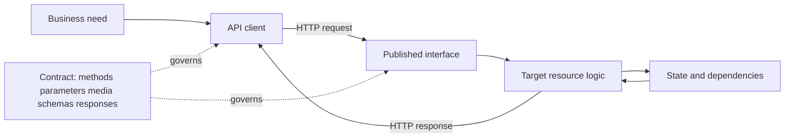
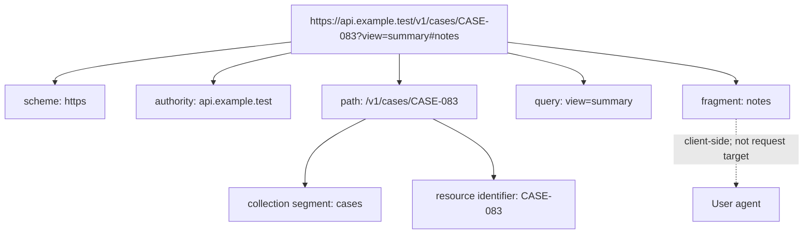
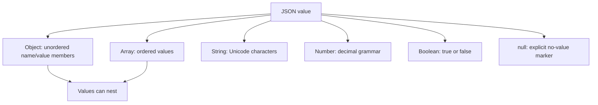
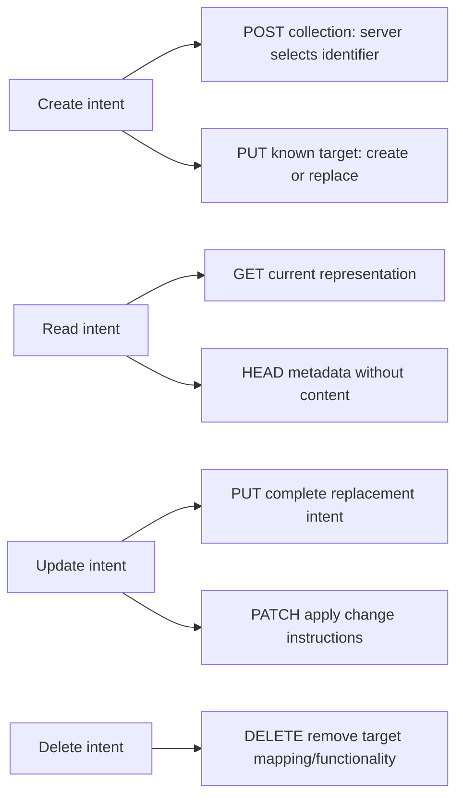
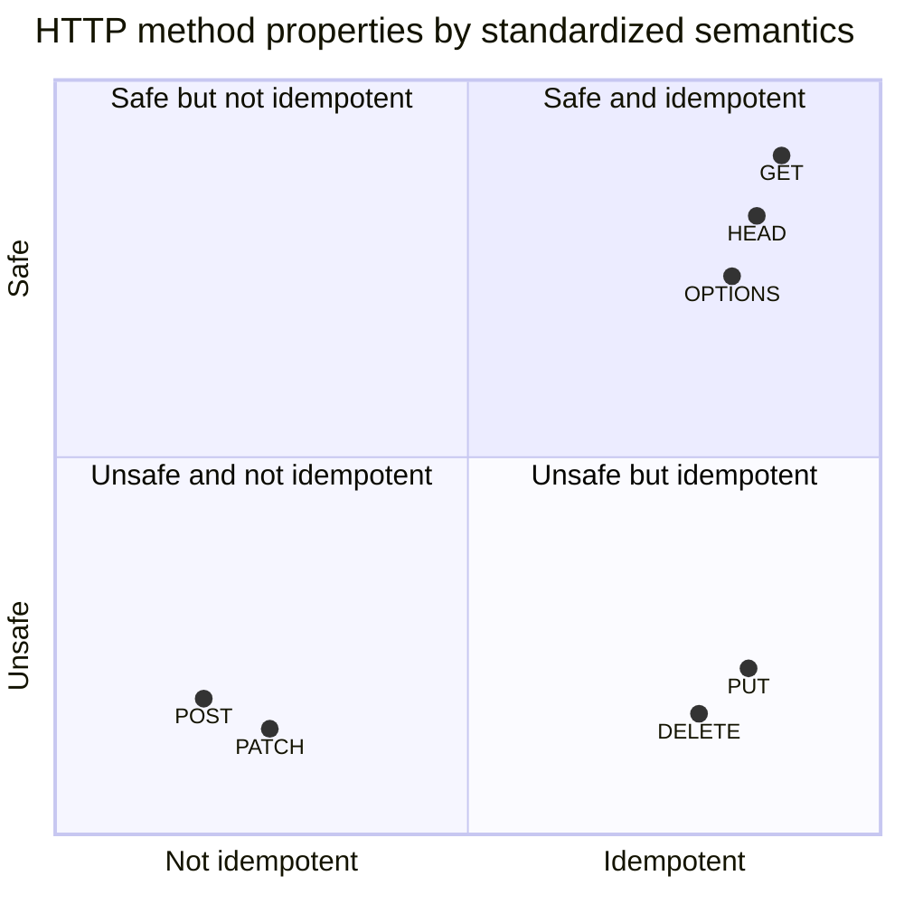
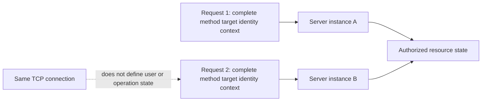
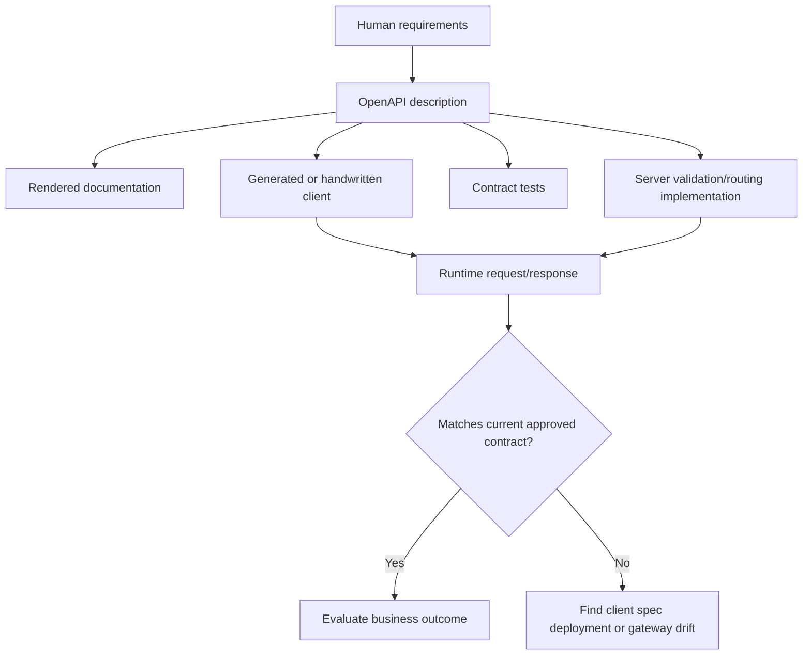
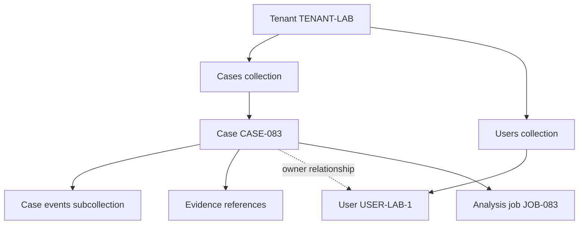
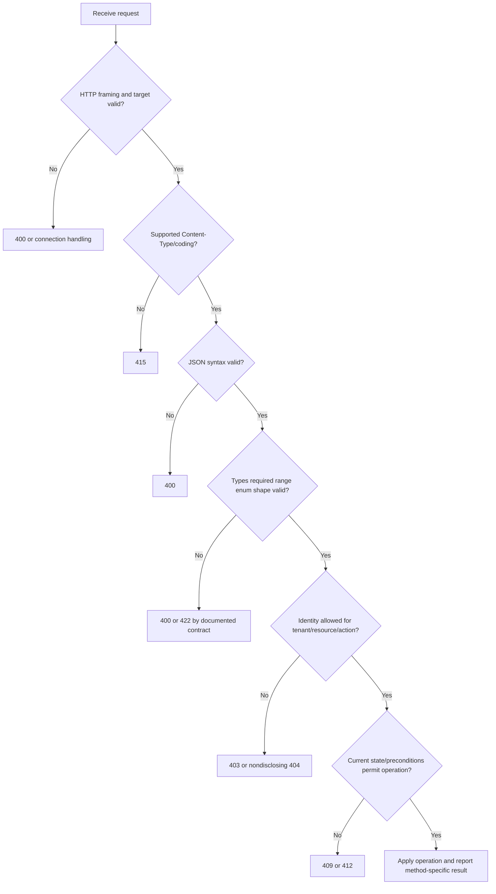
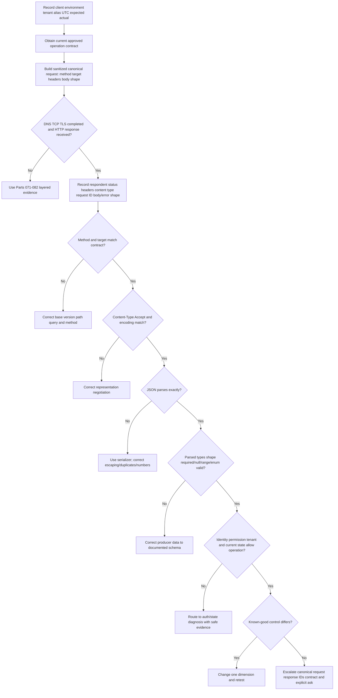

# Part 083 - REST APIs JSON and CRUD

> **Purpose:** Build a precise beginner-first model of REST-style HTTP APIs, JSON data, CRUD operations, method semantics, resource contracts, content negotiation, modeling, and validation so API support evidence can be interpreted without guessing.
>
> **Artifact label:** **Local/synthetic lab** using reserved example names, hand-built HTTP transcripts, and operating-system or Python-standard-library JSON parsing. It is not proof of Abnormal API access, API ownership, or production integration administration.
>
> **Currency and source access date:** August 24, 2026.

## Section goal

By the end of this Part, you should be able to explain an application programming interface from zero knowledge; distinguish an interface, resource, endpoint, and Uniform Resource Identifier; read URI components; and separate a resource from a transferred representation. You should be able to read and construct JavaScript Object Notation using objects, arrays, strings, numbers, booleans, and null while recognizing escaping, duplicate-name, precision, missing-field, and type hazards.

You should map create, read, update, and delete intentions to HTTP methods without claiming that the mapping is automatic or universal. You should distinguish a safe method from an idempotent method, interpret status, headers, and body together, explain stateless request semantics, and reason about `Content-Type`, `Accept`, and representation selection. You should understand OpenAPI as a high-level machine-readable HTTP API description, not as the running service itself, and should assess resource modeling, nesting, input validation, output validation, error evidence, and contract drift.

The support objective is not to memorize one vendor's endpoints. It is to ask: what resource and operation were intended, what exact representation and contract were sent, what did the responding component report, and which evidence would distinguish syntax, media type, schema, authorization, state, or server failures? All examples are synthetic. Current approved Abnormal documentation remains authoritative for any real Abnormal endpoint, schema, method, status, limit, or workflow.

## JD Mapping

| Supplied role signal | Capability developed | Vendor-neutral support example | Proof artifact |
|---|---|---|---|
| API support | Reads resource, URI, method, headers, status, and JSON as one exchange | Connector receives 422 on a case update | Annotated canonical exchange |
| Complex investigations | Separates transport success from API contract success | TCP/TLS work; representation fails validation | Boundary decision tree |
| Cloud Email Security | Models messages, detections, cases, and actions without inventing product paths | Synthetic detection collection | Resource map |
| SaaS Security | Reasons about tenant-scoped resources and relationships | Synthetic tenant and user records | Tenancy boundary table |
| AI Security Agents | Distinguishes an asynchronous job resource from a completed outcome | Synthetic analysis job returns 202 | State-transition worksheet |
| Diagnostic tools | Validates JSON and compares request/response evidence | Local parser and hand transcript | Reproducible lab ledger |
| Customer trust | Requests minimum redacted evidence and avoids credentials/content | Sanitized request summary | Evidence checklist |
| Engineering collaboration | Supplies exact contract mismatch and minimal reproduction | Number sent where string required | Escalation packet |
| Continuous learning | Uses current HTTP, URI, JSON, OpenAPI, and JSON Schema sources | Standards-grounded explanation | Source ledger |
| Honest positioning | Labels production transfer, working familiarity, lab evidence, and unknowns | Interview boundary answer | Honesty statement |

## Candidate honesty note

You can accurately present REST, HTTP, JSON, cURL, Postman, and API troubleshooting as **working familiarity supported by safe labs**, strengthened by production enterprise-support habits: scoping, client/cloud isolation, evidence correlation, customer updates, Engineering escalation, and fix validation. You should not imply that you designed or operated Abnormal APIs, administered a production API gateway, owned customer integration credentials, or knows proprietary resource paths, schemas, status behavior, or backend implementation.

| Evidence tier | Safe claim | Boundary to preserve |
|---|---|---|
| Production transfer | Structured enterprise case ownership, exact reproduction, correlation, escalation, and validation | Use only truthful examples from your own CV |
| Working familiarity | REST-style resources, HTTP semantics, JSON, contracts, and troubleshooting | Not protocol or platform implementation ownership |
| Local/synthetic lab | Parsed synthetic JSON and annotated synthetic HTTP exchanges | No authenticated vendor call or customer data |
| Learned architecture | Vendor-neutral SaaS and security resource patterns | Pattern is not proof of any named platform design |
| No direct experience | Abnormal API operations and non-Microsoft named platform administration | State the gap directly |
| Unknown until approved documentation or access | Abnormal endpoints, versions, schemas, auth, pagination, errors, limits, and internal logs | Never infer proprietary behavior from generic examples |

## 1. Start with the interface, not the acronym

An **application** is software used to perform work. **Programming** means giving a computer precise instructions. An **interface** is an agreed boundary through which two parties interact. An **application programming interface**, abbreviated **API**, is therefore an agreed software boundary: a caller sends a structured operation, and a provider returns a structured result.

An API is like a restaurant menu and ordering counter. The menu exposes choices and required details; the kitchen remains hidden. The analogy stops because an API contract has machine-level syntax, types, status semantics, authorization, concurrency, and version rules that a menu does not.

**Representational State Transfer**, abbreviated **REST**, is an architectural style described by constraints such as a uniform interface, stateless interactions, cacheability, layered systems, and separation of client and server concerns. In everyday support language, “REST API” often means an HTTP API organized around resources and representations. That shorthand does not prove strict conformance to every REST constraint. A support engineer should describe observed contract behavior rather than grade a service by its marketing label.



| Term | Plain meaning | Analogy | Why it matters in support |
|---|---|---|---|
| API | Agreed software interaction boundary | Ordering counter | Defines what the caller may ask and what evidence returns |
| Client | Software sending a request | Customer placing an order | Its environment, code, identity, and serialization can fail |
| Server | Software receiving and responding | Counter and kitchen system | It may be origin, gateway, or another respondent |
| Contract | Documented expectations for operations and data | Menu plus ordering rules | Expected versus actual must be compared here |
| REST | Architectural style centered on constraints and resources | Consistent chain-wide service rules | Avoids inventing a separate verb and shape for every action |
| HTTP API | API whose messages use HTTP semantics | Standard delivery envelope | Method, target, fields, status, and content carry evidence |
| Integration | Connection that moves or acts on data between systems | Conveyor between departments | Failures can occur at either system or the boundary |

**Memory hook:** API means “agreement at a software boundary,” not “database exposed on the Internet.”

## 2. Resource, endpoint, URI, and operation

A **resource** is whatever the interface identifies: a case, user, message record, collection, policy, job, or report. A resource can be abstract or computed. It does not have to be a database row or file. A **representation** is transferable information reflecting a past, current, or desired resource state. JSON is one possible representation format.

An **endpoint** is common practitioner language for an exposed method-and-target interaction, or sometimes just its network address. Because teams use it differently, record both method and target rather than saying “the endpoint failed.” `GET /cases/CASE-083` and `PATCH /cases/CASE-083` have the same path but different operation semantics.

A **Uniform Resource Identifier**, abbreviated **URI**, identifies a resource. A **Uniform Resource Locator**, abbreviated **URL**, is the subset of URI commonly associated with locating and accessing a resource. Standards-oriented writing prefers URI when discussing identification generally. In an actual API ticket, use the product's own terminology while preserving exact components.



| URI part | Example | Function | Support caution |
|---|---|---|---|
| Scheme | `https` | Selects URI scheme and secured HTTP access semantics | HTTP and HTTPS are different origins/namespaces |
| Authority | `api.example.test` | Names authority; can include host and port | Never include user/password information |
| Path | `/v1/cases/CASE-083` | Hierarchical identifying data | Case sensitivity and trailing slash behavior are contract-specific |
| Query | `view=summary` | Non-hierarchical identifying data often used for options/filtering | Logged widely; never place secrets here |
| Fragment | `notes` | Client-side secondary-resource reference | It is removed before an HTTP request target is sent |
| Percent encoding | `%20` | Encodes an octet such as a space within a component | Encode once; parse components before decoding delimiters |
| Origin | scheme + host + effective port | Security and authority boundary | Same host with different scheme or port is a different origin |

Reserved characters can be syntax delimiters. If a data value contains a delimiter, use a structured URI builder or the contract's serializer rather than string concatenation. A literal slash inside a path parameter may change segments; an ampersand inside an unencoded query value may begin another parameter; a percent sign can trigger decoding. Do not decode and re-encode blindly.

### 🔍 Plain-English deep-dive: Identification is not interaction

A URI identifies; the HTTP method expresses the requested action. The path `/cases/CASE-083?do=delete` is not safe merely because it is used with `GET`. If the server performs deletion on a safe method, the design violates the caller's safe-method expectation. Conversely, the word `delete` in a path does not itself perform anything.

Think of a street address and a delivery instruction. The address identifies a place; “inspect,” “deliver,” and “remove” are different instructions. The analogy stops because HTTP method semantics are standardized and intermediaries use them for retries, caching, prefetch, and automation.

For evidence, preserve method, normalized target, query parameter names, and safe aliases for values. A screenshot containing only a path is incomplete.

## 3. Resource versus representation

The resource is the identified concept behind the interface. The representation is data transferred about it. One resource can have different representations by time, language, media type, field projection, authorization context, or server selection. A JSON document is not the resource itself; it is a representation of resource state at a point in an interaction.

```mermaid
sequenceDiagram
    participant C as Client
    participant A as API interface
    participant R as Case resource
    C->>A: GET /v1/cases/CASE-083
    A->>R: Select current state allowed for caller
    R-->>A: State plus metadata
    A-->>C: 200 + application/json representation
    Note over C,R: The resource remains behind the interface; JSON crosses the boundary
```

| Concept | Is | Is not | Diagnostic question |
|---|---|---|---|
| Resource | Identified subject with observable semantics | Necessarily one stored record | Which subject and state were intended? |
| Representation | Transferable state information plus metadata | Guaranteed complete internal state | Which fields/media/time/caller view does it reflect? |
| Collection | Resource representing multiple members | Necessarily every member in one response | Is it paginated, filtered, projected, or scoped? |
| Member | Resource related to a collection | Array position as permanent identity | What stable identifier selects it? |
| Operation | Method applied to target with fields/content | Path string alone | Which exact method and preconditions were used? |
| Backend model | Internal storage or services | Public API contract | Is this known, observed, documented, or inferred? |

This distinction prevents several support errors. A missing field does not automatically mean backend data is absent; the representation may omit it because of projection, permissions, version, or null/missing rules. A 200 response does not mean a desired asynchronous side effect completed; it means the response's method-specific semantics succeeded at the reporting boundary. A collection's empty `items` array may reflect a filter or tenant scope rather than a global absence.

## 4. JSON from zero: six value kinds

**JavaScript Object Notation**, abbreviated **JSON**, is a lightweight, text-based, language-independent data interchange format. JSON has six value kinds: object, array, string, number, boolean, and null. RFC 8259 describes four primitive types, strings, numbers, booleans, and null, plus two structured types, objects and arrays.



| JSON kind | Valid example | Meaning | Frequent mistake |
|---|---|---|---|
| Object | `{"status":"open"}` | Unordered name/value members | Depending on member order or duplicate names |
| Array | `["high","email"]` | Ordered sequence of values | Treating one object as an array or assuming homogeneous values without schema |
| String | `"CASE-083"` | Unicode character sequence in quotes | Sending an unquoted identifier or wrong escaping |
| Number | `83` or `8.3e1` | Base-10 number grammar | Expecting unlimited range/precision or allowing `NaN` |
| Boolean | `true` | Logical true/false literal | Sending string `"true"` or capitalized `True` |
| Null | `null` | Explicit null value | Confusing with missing member, empty string, zero, or false |

Consider this synthetic representation:

```json
{
  "case_id": "CASE-083",
  "title": "Synthetic API contract exercise",
  "priority": 2,
  "active": true,
  "owner": null,
  "tags": ["api", "training"],
  "context": {
    "tenant_alias": "TENANT-LAB",
    "request_id": "REQ-083-A"
  }
}
```

The outer value is an object. `case_id` and `title` map to strings. `priority` maps to a number. `active` maps to a boolean. `owner` is present with null. `tags` maps to an ordered array of strings. `context` maps to another object. Whitespace and indentation improve readability but are not data members.

An object member name is always a JSON string. Member names should be unique for interoperability. RFC 8259 notes that behavior with duplicate names is unpredictable: some parsers retain the last value, some fail, and some expose all duplicates. Never rely on duplicate members.

### 🔍 Plain-English deep-dive: null, missing, empty, zero, and false are different states

`{"owner":null}` says the `owner` member is present and its value is null. `{}` says the member is absent. `{"owner":""}` provides an empty string. `{"attempts":0}` provides numeric zero. `{"active":false}` provides a boolean. A schema and API contract decide which are allowed and what they mean.

Think of a paper form. “Owner: not assigned” is explicit null; no owner field printed is missing; a blank line is an empty string; “0 attempts” is a number; “Active: no” is false. The analogy stops because JSON syntax itself does not assign business meaning; the contract does.

In support, capture the exact parsed shape. Do not summarize all five conditions as “blank.” That summary can hide the contract defect.

## 5. JSON syntax, strings, escaping, numbers, and types

JSON strings begin and end with double quotation marks. A quotation mark, reverse solidus (backslash), and control characters must be escaped. Common two-character escapes include `\"`, `\\`, `\n`, `\r`, and `\t`; `\u` followed by four hexadecimal digits can represent a code unit. JSON exchanged outside a closed ecosystem must use UTF-8. A networked JSON text must not be generated with a byte-order mark, although parsers may ignore one for interoperability.

```json
{
  "summary": "Line one\nLine two",
  "quoted": "The caller said \"retry later\".",
  "windows_path_example": "C:\\Lab\\case-083.json",
  "literal_backslash_n": "\\n"
}
```

The parsed `summary` contains a line feed. The parsed `quoted` contains quotation marks. The path contains single backslashes. `literal_backslash_n` contains two visible characters, backslash and `n`. Copying a JSON string into a shell, PowerShell string, programming-language string, YAML document, or URI can introduce a second escaping layer. Always ask which representation layer a screenshot shows.

JSON numbers do not allow leading zeros except zero itself, and do not allow `Infinity` or `NaN`. Implementations can limit range and precision. RFC 8259 notes strong interoperability for integer values within $[-(2^{53})+1, (2^{53})-1]$ in commonly used IEEE 754 binary64 environments. Large identifiers should usually be modeled as strings if exact digits and formatting matter. That is a design rule, not a claim that every API follows it.

| Input | JSON syntax valid? | Likely contract issue | Better evidence |
|---|---:|---|---|
| `{"id":083}` | No | Leading zero is invalid number grammar | Parser position and raw synthetic body |
| `{"id":"083"}` | Yes | Valid string; schema decides suitability | Expected schema type |
| `{"enabled":"false"}` | Yes | String, not boolean | Parsed type and contract |
| `{"enabled":false}` | Yes | Boolean | Business meaning |
| `{"value":NaN}` | No | Literal not allowed by JSON | Generator/library behavior |
| `{"a":1,"a":2}` | Grammar allows names but non-unique is unsafe | Parser disagreement | Reject duplicates and fix producer |
| `{"note":"line
break"}` | No | Raw control character in string | Use `\n` escape |
| `{"note":null}` | Yes | May violate non-null schema | Presence, nullability, and required rules |

Types exist at several layers. JSON has its data model; a schema constrains allowed types; a programming language maps parsed values into runtime types; a database may store another type. `1`, `1.0`, and `"1"` can pass through those layers differently. Do not diagnose “type mismatch” without naming the layer and expected contract.

## 6. HTTP request and response anatomy

An HTTP request contains control data such as method and target, header fields, optional content, and potentially trailers. A response contains a status code, header fields, optional content, and potentially trailers. HTTP versions express these details differently on the wire, but the semantic model remains useful.

```mermaid
sequenceDiagram
    participant C as Client
    participant G as Gateway or API edge
    participant S as Service
    C->>G: Method + target + headers + optional content
    G->>S: Forwarded or transformed request
    S-->>G: Status + headers + optional content
    G-->>C: Final HTTP response
    Note over C,S: Status says result class; headers add control/metadata; content carries representation or error detail
```

Synthetic request:

```http
POST /v1/cases HTTP/1.1
Host: api.example.test
Accept: application/json
Content-Type: application/json
X-Request-ID: REQ-083-CREATE

{
  "title": "Synthetic connector issue",
  "priority": 2,
  "active": true
}
```

Synthetic response:

```http
HTTP/1.1 201 Created
Content-Type: application/json
Location: /v1/cases/CASE-083
X-Request-ID: REQ-083-CREATE

{
  "case_id": "CASE-083",
  "title": "Synthetic connector issue",
  "priority": 2,
  "active": true,
  "owner": null
}
```

| Message element | Question answered | Example | Mistake to avoid |
|---|---|---|---|
| Method | What semantics did the caller request? | `POST` | Calling every request a GET |
| Target | Which resource was addressed? | `/v1/cases` | Omitting query or base/version context |
| Request headers | What modifiers, metadata, credentials, and preferences applied? | `Accept` | Sharing Authorization/cookies |
| Request content | What representation/instructions were supplied? | JSON object | Calling it “payload” without media/schema |
| Status code | What result semantics did the respondent report? | `201` | Reading status without method and body |
| Response headers | What representation/control/correlation metadata returned? | `Location` | Ignoring request ID or media type |
| Response content | What result/error representation returned? | Created case | Assuming every 2xx has content |

Record the respondent. A 502 can be generated by a gateway while the application never processes the request. A 401 may come from an identity-aware proxy. A 404 can hide a forbidden resource. TLS success does not prove HTTP acceptance, and HTTP acceptance does not prove a downstream workflow completed.

## 7. CRUD intentions and HTTP methods

**Create, Read, Update, Delete**, abbreviated **CRUD**, is a data-operation mnemonic. CRUD is not an HTTP specification. HTTP methods have standardized semantics that often support CRUD-style intentions, but mapping depends on the resource contract.



| Intent | Common method | Target example | Important nuance |
|---|---|---|---|
| List/read collection | GET | `/v1/cases` | May be filtered, paginated, projected, and scoped |
| Read one | GET | `/v1/cases/CASE-083` | Returns selected representation, not internal object |
| Read metadata | HEAD | `/v1/cases/CASE-083` | Semantics like GET but no response content |
| Create with server ID | POST | `/v1/cases` | Server processes content and may return 201 + Location |
| Create/replace known target | PUT | `/v1/cases/CASE-083` | Desired complete target state; contract may forbid creation |
| Partial update | PATCH | `/v1/cases/CASE-083` | Patch document media type defines instructions |
| Delete target mapping | DELETE | `/v1/cases/CASE-083` | Does not guarantee physical erasure or immediate completion |
| Resource-specific command | POST often | `/v1/cases/CASE-083/actions/close` | Model command/result explicitly; behavior is contract-specific |

`PUT` means create or replace the state at a known target according to the enclosed representation. It is not generically “update some fields.” Omitting a field in a complete replacement could clear/default/reject it according to contract. `PATCH` applies a patch document; the media type defines its syntax and operation semantics. PATCH is neither safe nor inherently idempotent, although a specific patch can be designed and conditioned to be idempotent.

`DELETE` requests removal of the association between the target resource and its current functionality. It does not promise that every historical copy, audit record, dependent object, or storage block is erased. Privacy deletion, retention, and legal-hold behavior are separate product and policy contracts.

### 🔍 Plain-English deep-dive: CRUD and HTTP are two different maps

CRUD describes what people want to do with data. HTTP methods describe request semantics at a resource interface. The maps overlap but are not identical. POST can create, trigger processing, append, or submit. PUT can create or replace a known target. PATCH can alter state using format-specific instructions. GET can calculate a current report without exposing stored rows.

Think of CRUD as four business labels and HTTP methods as standardized shipping instructions. “Create” can be shipped as “process this at the collection” or “place this complete state at this known address.” The analogy stops because methods also govern safety, idempotency, caching, and intermediary behavior.

In support, start from documented operation semantics, not from a guessed CRUD shortcut.

## 8. Safe and idempotent are not synonyms

A method is **safe** when its defined semantics are essentially read-only: the caller does not request a state change. GET, HEAD, OPTIONS, and TRACE are safe in RFC 9110. Logging, metrics, billing side effects, or cache population can still occur, but the requested semantics are read-only.

A method is **idempotent** when the intended effect of multiple identical requests is the same as one. Safe methods, PUT, and DELETE are idempotent by standardized semantics. Responses may differ, logs may contain multiple entries, and concurrent actors may change state. POST and PATCH are not inherently idempotent; a specific operation can add idempotency by design.



| Method | Safe? | Idempotent by standard semantics? | Retry implication |
|---|---:|---:|---|
| GET | Yes | Yes | Retry may still face rate limits, cost, or changing state |
| HEAD | Yes | Yes | Metadata path can differ in implementation |
| OPTIONS | Yes | Yes | Does not guarantee future permission or availability |
| POST | No | No | Do not blindly retry after ambiguous outcome |
| PUT | No | Yes | Identical intended state can be retried, but check preconditions/concurrency |
| DELETE | No | Yes | Repetition has same intended effect; later response can be 404 |
| PATCH | No | No by default | Patch format and operation may be made idempotent |

Idempotency is about intended server effect, not identical response. First DELETE can return 204; second can return 404 while the desired absent state remains. A repeated PUT can overwrite an intervening change unless an `If-Match` precondition protects it. Parts 087 and 088 develop retry and delivery idempotency in depth.

## 9. Status, headers, and body must be read together

HTTP status codes range from 100 through 599. The first digit defines informational, successful, redirection, client-error, or server-error class. The method, status, relevant headers, and content together define the response meaning.

| Status | Beginner meaning | Contract question | Support next step |
|---:|---|---|---|
| 200 | Request succeeded; content meaning depends on method | Does body match expected schema/state? | Validate representation and IDs |
| 201 | New resource created | Is `Location` present/usable and representation current? | Record created URI and validator |
| 202 | Accepted, not completed | What job/status resource shows eventual outcome? | Poll/reconcile only as documented |
| 204 | Succeeded with no response content | Did client incorrectly expect JSON? | Inspect headers and later state safely |
| 400 | Server perceives malformed/bad request | Syntax, framing, parameter, or generic validation? | Read structured error and compare canonical request |
| 404 | Not found or undisclosed | Wrong path/version/tenant/ID/permission? | Use authorized control and contract |
| 405 | Method known but not allowed for target | What does `Allow` advertise now? | Correct operation, not random method retries |
| 409 | Conflict with current state | Which state/version relationship conflicts? | Retrieve/reconcile under contract |
| 415 | Request media type or content coding unsupported | Is `Content-Type` correct? | Send supported representation only |
| 422 | Type/syntax understood, instructions unprocessable | Which semantic/field rule failed? | Use field/path details; fix data |
| 500 | Respondent encountered unexpected condition | Can request ID locate server error? | Controlled retry only by policy; escalate evidence |
| 502/504 | Gateway received invalid/late upstream result | Which gateway/upstream leg? | Correlate respondent, timing, and IDs |

### Worked response comparison

```http
HTTP/1.1 422 Unprocessable Content
Content-Type: application/json
X-Request-ID: REQ-083-VALIDATE

{
  "code": "validation_failed",
  "message": "One or more fields are invalid.",
  "details": [
    {
      "field": "priority",
      "reason": "expected integer from 1 through 4"
    }
  ]
}
```

The response proves an HTTP component returned 422 and a JSON error representation says `priority` violated a range/type rule. It does not prove which internal component validated it unless the request ID and server evidence identify that owner. It does not justify sending arbitrary alternative values. Compare the current contract and one synthetic or authorized known-good request.

## 10. Stateless request semantics

HTTP is stateless: each request's semantics can be understood in isolation, and connection choice does not change message meaning. REST's stateless constraint requires each client request to contain the information necessary for the server to understand it; server-side application state may still exist. Authentication tokens, resource state, caches, databases, and asynchronous jobs do not disappear.



| Statement | Correct? | Explanation |
|---|---:|---|
| “Stateless means no data is stored.” | No | Resource and operational state can be stored extensively |
| “Every request should be self-descriptive for its operation.” | Yes | Method, target, fields, content, and identity context carry semantics |
| “Same connection means same user.” | No | HTTP warns against that assumption without specific secure context |
| “Cookies make HTTP stateful.” | Not exactly | Cookies carry client/server application state across stateless messages |
| “A server can load-balance requests.” | Often | Stateless semantics help, but shared state and affinity design still matter |
| “A 202 request is complete because the connection closed cleanly.” | No | Accepted processing has its own resource/state lifecycle |

For support, include all effective context needed to reproduce: base URI, version, tenant/environment alias, identity category, scopes/role summary, method, target, media fields, sanitized body schema, preconditions, UTC, and request ID. Never include token values.

## 11. Content negotiation and media types

A **media type** labels a representation format and processing model. JSON commonly uses `application/json`. `Content-Type` describes the content being sent. `Accept` expresses response media preferences. Confusing them causes 406, 415, parsing failures, or silent format mismatch.

```mermaid
sequenceDiagram
    participant C as Client
    participant A as API
    C->>A: POST JSON; Content-Type: application/json; Accept: application/json
    A->>A: Check request media type and parse/validate content
    A->>A: Select acceptable response representation
    alt Request format unsupported
        A-->>C: 415 Unsupported Media Type
    else No acceptable response representation
        A-->>C: 406 Not Acceptable or documented fallback
    else Contract succeeds
        A-->>C: 2xx + Content-Type + representation
    end
```

| Field | Direction | Says | Does not say |
|---|---|---|---|
| `Content-Type` | Request or response | Media type of associated content | Which response type the caller wants |
| `Accept` | Request, and defined response use | Preferred response media types | Actual response content type |
| `Content-Encoding` | Request or response | Coding applied beyond media type, often compression | Character escaping or base64 business field |
| `Accept-Encoding` | Request or response-defined context | Acceptable content codings | JSON type/schema |
| `Content-Language` | Representation metadata | Intended audience language(s) | Programming language |
| `Vary` | Response | Request fields that influenced selected representation | Complete cache policy by itself |

`Accept: application/json` does not convert an HTML error page into JSON if an upstream proxy ignores the preference or emits its own response. Always verify actual response `Content-Type` before parsing. A client error “unexpected `<` at position 0” often means an HTML document reached a JSON parser; preserve status, media type, respondent, and first safe body characters rather than blaming JSON immediately.

## 12. Contracts, OpenAPI, and evidence ceilings

An API contract documents allowed operations and message shapes. It can include servers, paths, methods, parameters, request media types, schemas, security requirements, response statuses, response headers, response media types, examples, and deprecation. **OpenAPI Specification**, abbreviated **OAS**, defines a language-agnostic description format for HTTP APIs. As of the access date, the latest published OAS page identifies version 3.2.0.

OpenAPI is a description, not the running service. A specification can be stale, incomplete, filtered by access, interpreted differently by tools, or deployed out of step. Runtime evidence can also be misleading because a gateway or older server version may respond. Contract, deployed version, request, response, and server correlation should agree.



Synthetic high-level OpenAPI fragment, included only to teach anatomy:

```yaml
openapi: 3.2.0
info:
  title: Synthetic Case API
  version: 1.0.0
paths:
  /v1/cases/{caseId}:
    get:
      parameters:
        - name: caseId
          in: path
          required: true
          schema:
            type: string
      responses:
        "200":
          description: Current case representation
          content:
            application/json:
              schema:
                $ref: "#/components/schemas/Case"
        "404":
          description: Case not found or not disclosed
components:
  schemas:
    Case:
      type: object
      required: [case_id, title, active]
      properties:
        case_id: { type: string }
        title: { type: string, minLength: 1 }
        active: { type: boolean }
```

| Contract layer | Example question | Evidence | Ceiling |
|---|---|---|---|
| Discovery/base | Which approved server and version? | Current official docs/spec | Does not prove deployed route |
| Path/method | Is GET supported on this target? | Paths/operation + 405/Allow | Dynamic permissions may differ |
| Parameter | Is `caseId` path string required? | Parameter definition | Does not prove identifier exists |
| Request body | Which media/schema is accepted? | RequestBody/schema | Tool/version dialect differences matter |
| Security | Which scheme/scopes are described? | Security scheme/requirement | Does not prove token permission |
| Response | Which statuses and shapes are expected? | Responses/headers/content | Undocumented gateway failures can occur |
| Runtime | What actually happened? | Sanitized exchange + IDs | One exchange does not prove global behavior |
| Backend | Why did implementation decide? | Correlated logs/traces/code owner | Usually unavailable to L1 without escalation |

### 🔍 Plain-English deep-dive: A schema is a ruler, not the object

A schema states constraints on allowed data. It can require a field, limit a number, enumerate values, or define nested structures. Passing a schema proves conformance to those declared constraints; it does not prove truth, authorization, freshness, business safety, or successful downstream processing.

Think of an airport baggage gauge. A bag can fit the dimensions and still belong to the wrong passenger or contain prohibited material. The analogy stops because JSON Schema can compose conditional constraints and produce machine-readable evaluation results.

Use schema validation to answer “does this instance match these declared rules?” Keep identity, permissions, business rules, and side effects as separate checks.

## 13. Resource modeling and nesting

Good resource modeling gives stable identifiers, understandable relationships, predictable methods, and bounded representations. Use nouns for resources and method semantics for actions where practical. Avoid exposing database tables directly or creating excessively deep paths that imply ownership rules the business does not have.



| Modeling choice | Helpful when | Risk | Support check |
|---|---|---|---|
| `/cases/{id}` | Stable globally/tenant-scoped case identifier exists | ID may leak or be wrong tenant | Verify tenant scope and alias values |
| `/tenants/{t}/cases/{id}` | Tenant is essential addressing boundary | Deep path and duplicated tenant context | Compare token tenant, path tenant, and resource tenant |
| `/cases/{id}/events` | Events are clearly subordinate to a case | Event may need independent address | Check lifecycle and canonical URI |
| `/case-events/{eventId}` | Event has stable independent identity | Relationship must be represented elsewhere | Preserve `case_id` link |
| `/cases/{id}/actions/close` | Close is a command with result/audit | RPC-style path proliferation | Document idempotency and status resource |
| `/jobs/{jobId}` | Async work has observable lifecycle | Orphaned jobs and unclear retention | Record state transitions and correlation |
| Embedded child objects | One bounded representation is efficient | Large/stale/permission-heavy response | Check projections, pagination, and auth filtering |
| Links/identifiers | Clients can traverse relationships | Extra requests and version coupling | Document relation semantics |

Nesting is a contract choice, not a universal rule. A two-level relationship often reads clearly. Deep nesting can duplicate parent identifiers, complicate moves, and produce ambiguous permissions. A child can be represented inline while also having its own URI. Avoid assuming that path nesting equals database containment or authorization inheritance.

For security integrations, resource identifiers and tenant boundaries are particularly sensitive. Do not put email content, token material, personal data, or secrets in paths or query values. Use synthetic aliases in tickets and screenshots.

## 14. Validation: syntax, schema, business, and state

Validation should be layered. A message can be valid HTTP but invalid JSON; valid JSON but wrong schema; schema-valid but disallowed by a business rule; business-valid but conflicting with current state; or accepted but fail downstream.



| Validation layer | Example failure | Evidence | Fix owner candidate |
|---|---|---|---|
| URI/parameter serialization | Space or slash encoded incorrectly | Canonical target and parameter contract | Client/API design |
| HTTP/media | JSON body labeled `text/plain` | `Content-Type`, status 415 | Client |
| JSON syntax | Trailing comma or unescaped newline | Parser location, minimized body | Client serializer |
| Schema shape | Object sent where array required | JSON pointer/path and expected schema | Client/contract |
| Required/nullable | Required member missing or null disallowed | Presence plus schema keywords | Client/data source |
| Range/enum | Priority 9 outside 1..4 | Field detail, allowed range | Client/business owner |
| Authorization | Valid identity lacks resource permission | Safe identity/scopes/role summary | IAM/API owner |
| State/precondition | ETag changed since read | `If-Match`, current ETag, 412 | Client concurrency design |
| Dependency | Accepted API request cannot reach downstream | Request/operation IDs and server trace | Service/dependency owner |

Validate as early as practical, return stable machine-readable error codes and field paths, and avoid reflecting secrets or full rejected content. Clients should parse errors defensively and retain status, media type, request ID, application error code, and safe details. Error structure is developed further in Part 089.

## 15. Worked end-to-end examples

### Example A: Create and retrieve a synthetic case

1. **Intent:** Create a new case while allowing the server to select its identifier.
2. **Contract choice:** POST the collection `/v1/cases` with `application/json`.
3. **Input:** Object containing non-empty `title`, integer `priority` 1 through 4, and boolean `active`.
4. **Expected response:** `201 Created`, `Location`, request ID, and a representation or no content according to contract.
5. **Evidence:** The synthetic 201 exchange earlier shows `CASE-083` and `owner: null`.
6. **Follow-up:** GET the `Location` only in an authorized real workflow; in this lab, annotate a paper/synthetic GET.
7. **Caveat:** A 201 proves creation at the respondent's contract boundary, not downstream alert delivery or named-platform behavior.

### Example B: Wrong JSON type

```http
POST /v1/cases HTTP/1.1
Host: api.example.test
Content-Type: application/json
Accept: application/json
X-Request-ID: REQ-083-TYPE

{"title":"Synthetic issue","priority":"2","active":true}
```

The JSON is syntactically valid. `priority` is a string rather than a number. A schema expecting integer 1 through 4 should reject it. Whether the API uses 400 or 422 is contract-specific; 422 is plausible under RFC 9110 when content type and syntax are understood but instructions cannot be processed. Do not “fix” by coercing all numeric-looking strings globally; change the producer according to the field contract.

### Example C: Null versus missing

| Request body | Parsed state | Possible contract interpretation |
|---|---|---|
| `{"owner":null}` | Owner present and null | Clear owner, explicitly unassigned, or reject |
| `{}` | Owner absent | Leave unchanged, default, or reject if required |
| `{"owner":""}` | Owner present as empty string | Usually invalid identifier, but contract decides |
| `{"owner":"USER-LAB-1"}` | Owner string | Assign if authorized and valid |

For PUT, omitted `owner` in a complete desired representation can differ from PATCH omission. Never carry partial-update assumptions into replacement semantics.

### Example D: Content negotiation mismatch

Client sends JSON but sets `Content-Type: application/xml`; server returns 415. Changing `Accept` does not fix request media labeling because `Accept` concerns the preferred response. The corrective action is to serialize and label the supported request representation consistently, then validate the actual response `Content-Type` before parsing.

### Example E: Method safety mistake

An internal link points to `GET /v1/cases/CASE-083?close=true`, and a crawler follows it, changing state. The root defect is unsafe action semantics attached to GET. Blocking the crawler treats a symptom. The API owner should move the state change to an unsafe documented operation with authorization, anti-replay/concurrency controls, and an observable result.

| Example | Last proven checkpoint | Failed boundary | Unsafe shortcut |
|---|---|---|---|
| Create/read | 201 with Location | Downstream outcome still unknown | Claim full workflow completion |
| Wrong type | JSON parser accepted body | Schema/field contract | Random coercion |
| Null/missing | Parsed shape known | Business/operation semantics | Treat every blank alike |
| Media mismatch | HTTP reached API respondent | Request representation metadata | Change Accept only |
| GET side effect | Safe request changed state | API design semantics | Blame crawler |

## 16. Troubleshooting decision tree



The decision tree deliberately stops broad collection. One discriminating test should compare at least two plausible hypotheses. If JSON cannot parse, there is little value in debating a business enum. If the gateway returns HTML 502, client-side schema validation is not the failed runtime boundary. If a 422 identifies one field path, preserve that exact path rather than dumping the full body.

## 17. Failure modes, misleading signals, and escalation triggers

| Failure or shortcut | Why it misleads or harms | Better practice |
|---|---|---|
| “The API is down” after one 404 | 404 can mean path, version, ID, tenant, or nondisclosure | Record exact method/target/respondent/control |
| Treat 2xx as full workflow success | 202 is incomplete; 200 meaning depends on method | Query documented status/state and correlate IDs |
| Hand-build JSON strings | Escaping, type, locale, and injection bugs | Use a structured serializer/parser |
| Put token in URI | URIs are logged/displayed/shared | Use approved auth mechanism; redact values |
| Share full Authorization/header dump | Credentials and tenant data leak | Allowlist safe headers and replace values |
| Equate null, missing, empty, zero, false | Hides contract state | Preserve parsed value and presence |
| Retry POST after timeout | Can duplicate side effects | Use documented idempotency/reconciliation |
| Assume PUT is partial update | Can clear omitted fields | Confirm complete representation semantics |
| Assume PATCH is idempotent | Increment/append patches can repeat effects | Analyze patch instruction and preconditions |
| Parse body before checking media type/status | HTML/proxy errors become JSON errors | Record status and Content-Type first |
| Trust generated SDK alone | SDK/spec/runtime may drift | Compare raw sanitized HTTP and current contract |
| Treat OpenAPI as runtime proof | Description may be stale or filtered | Correlate deployed version and request ID |
| Infer backend table from path | Resource abstraction hides implementation | State inference ceiling |
| Invent Abnormal endpoint from generic pattern | Violates named-platform boundary | Use current approved Abnormal docs only |

Escalate when the sanitized canonical request matches the current approved contract, a scoped control confirms the issue, the error or unexpected representation is reproducible, and server-side ownership or defect analysis is needed. Also escalate potential cross-tenant disclosure, credentials in evidence, contract-breaking change, inconsistent idempotency, unsafe GET side effect, or unexplained data loss immediately through the correct security/incident process.

### Minimal escalation package

| Field | Minimum safe evidence |
|---|---|
| Impact and scope | Affected operation/population/time; no unsupported severity claim |
| Environment | Client/runtime/tool version, network/proxy category, environment/tenant aliases |
| Contract | Approved document/version/date and expected operation/schema/status |
| Canonical request | Method, sanitized target, allowlisted headers, body schema/example aliases |
| Response | Respondent, UTC, status, Content-Type, safe headers, structured error fields |
| Correlation | Request/trace/operation IDs and clock precision |
| Controls | Known-good user/tenant/environment/version with one changed dimension |
| Attempts | Exact tests and observations, not a command dump |
| Safety | Secret/PII/content redaction and artifact retention statement |
| Ask | Specific owner decision: contract, deployment, validation, authorization, state, or server defect |

## Safe local lab: The Synthetic Case Ledger Contract Lab 083

### Prerequisites

- A learner-owned workstation and permission to create/delete harmless local text files.
- A plain-text editor. Use built-in PowerShell and/or Python 3 only if already installed; no package, module, extension, server, network request, or dependency installation is required.
- A new local directory containing only synthetic artifacts. Suggested names: `case-valid-083.json`, `case-invalid-syntax-083.json`, `case-wrong-type-083.json`, `exchange-083.md`, and `ledger-083.md`.
- Reserved synthetic authorities and identifiers only: `api.example.test`, `TENANT-LAB`, `CASE-083`, `USER-LAB-1`, `REQ-083-*`. Do not attempt to resolve or call `api.example.test`.
- No credential, Authorization value, cookie, token, real tenant/user/message/case identifier, customer content, internal host, public endpoint, production API, destructive request, or security-control change.
- Artifact label: **local/synthetic lab - JSON parsing, contract comparison, and paper HTTP transcripts; no network or named-platform access**.

### Lab procedure

1. Record start UTC, OS/editor, parser/tool version if used, scope, authorization, artifact label, and the no-network/no-secret statement.
2. Copy the valid synthetic case object from Section 4 into `case-valid-083.json`. Before parsing, label each member's expected JSON type and distinguish `owner: null` from a missing `owner`.
3. Parse with one available built-in route. PowerShell: `Get-Content -Raw .\case-valid-083.json | ConvertFrom-Json`. Optional Python standard library: `py -3 -m json.tool .\case-valid-083.json`. Record command, UTC, exit/error, and only synthetic output.
4. Create `case-invalid-syntax-083.json` by adding one trailing comma after the final object member. Predict the parser result, run the same parser once, record the location/message, and restore valid syntax. Do not develop a parser with string replacements.
5. Create `case-wrong-type-083.json` with `"priority":"2"`. Parse it. Record that JSON syntax succeeds while a schema expecting integer would fail. This is the lab's key syntax-versus-schema discriminator.
6. Create five separate one-line objects showing `owner` null, missing, empty string, synthetic identifier, and wrong numeric type. Build a presence/type/meaning table. Do not assign meaning beyond the hypothetical contract.
7. Write a local synthetic contract: `title` required non-empty string; `priority` required integer 1 through 4; `active` required boolean; `owner` optional and either string or null; `tags` optional array of strings; unknown members rejected for this exercise.
8. Manually validate six instances: valid; missing title; empty title; priority string; priority 9; active string. Record first failing layer, expected field path, and hypothetical 400-versus-422 contract decision.
9. Copy the POST/201 exchange from Section 6 into `exchange-083.md`. Annotate method, collection target, Host, Accept, Content-Type, request ID, request body, status, Location, response media type, and representation.
10. Build four additional paper exchanges only: GET returning 200; HEAD returning 200 without content; PUT complete replacement returning 204; PATCH wrong media type returning 415. No request is sent anywhere.
11. Build the CRUD-to-method matrix and add safe/idempotent properties. For each operation, write whether an automatic retry after an unread response could duplicate effects or overwrite concurrent state.
12. Decompose `https://api.example.test/v1/cases/CASE-083?view=summary#notes`. Mark the fragment as client-side and the query value as non-secret synthetic data. Explain why tokens must not appear in it.
13. Write two content-negotiation cards: request JSON correctly labeled; request JSON mislabeled as XML. Predict 2xx/validation versus 415 paths. Add a response with HTML `Content-Type` to show why media type is checked before JSON parsing.
14. Copy the high-level OpenAPI fragment. Make one intentional drift: change the contract's `priority` to string while leaving the runtime example numeric. Identify description, client, test, and service risks without choosing a winner absent deployment evidence.
15. Run the decision tree on four synthetic tickets: invalid JSON, wrong type, wrong method, and gateway HTML 502. For each, state two hypotheses, cheapest discriminating check, evidence ceiling, owner, and next action.
16. Produce a sanitized canonical request template that includes no values for Authorization/Cookie and uses aliases for tenant and resource identifiers.
17. Produce a one-page escalation packet for a repeatable 422 where current contract says integer 1 through 4 and body sends integer 2. The explicit ask is whether deployed validation/specification drifted; do not claim a server bug until owner evidence confirms it.
18. Deliver a spoken three-minute explanation covering API/interface/resource/representation/endpoint/URI, JSON types, CRUD mapping, safety/idempotency, status+headers+body, statelessness, negotiation, and contract validation.
19. Deliver a spoken 60-second honesty statement distinguishing production-transfer methods, API working familiarity, this local lab, named-platform learned architecture, and Abnormal unknowns.
20. Perform cleanup and retain only a minimized ledger if desired.

### Expected evidence

- Start/end UTC, scope, tool/parser version, authorization, and artifact label.
- One valid parsed synthetic JSON object and one parser failure with location/message.
- Proof that wrong JSON type can parse while failing a schema contract.
- Null/missing/empty/zero/false and field-presence comparison table.
- A synthetic contract and six manual validation outcomes.
- Five annotated paper HTTP exchanges with no network activity.
- CRUD, safety, idempotency, status, media type, and retry-risk matrices.
- URI component decomposition with fragment and secret-placement cautions.
- One OpenAPI-description drift analysis with evidence ceilings.
- Four troubleshooting decision records and one minimized escalation packet.
- Spoken three-minute technical explanation and 60-second honesty boundary.

### Cleanup and privacy

- Delete invalid and duplicate synthetic JSON files, raw parser output, screenshots, and temporary exchange drafts after extracting minimum notes.
- Close editor/terminal sessions and verify no local server, listener, capture, proxy, environment variable, credential, or background process was created.
- Confirm that no network request occurred and `api.example.test` was never resolved or contacted.
- Retain only a minimized `ledger-083.md` if useful; it must contain synthetic aliases, commands, outcomes, interpretation, evidence ceilings, and no machine username/path if shared.
- Confirm no Authorization, Cookie, API key, bearer token, secret, real tenant/user/message/case identifier, personal data, customer content, internal host, vendor endpoint, or production response exists in any retained artifact.
- Record: `Synthetic Case Ledger Contract Lab 083 completed locally with synthetic JSON and paper HTTP transcripts only; no network, credential, customer data, named-platform access, destructive request, dependency installation, or security change.`

### Validation rubric

| Dimension | Fail | Developing | Pass |
|---|---|---|---|
| API vocabulary | Calls API a URL | Names endpoint/resource | Distinguishes interface, operation, resource, representation, endpoint, URI |
| URI | Copies full URL | Finds path/query | Decomposes safely, handles encoding, fragment, origin, and secret risk |
| JSON | Reads visible text only | Identifies objects/arrays | Parses all six kinds, escaping, duplicates, precision, and presence states |
| CRUD | Memorizes POST/GET/PUT/DELETE | Maps common actions | Explains mapping exceptions, PUT replacement, PATCH documents, DELETE ceiling |
| Method properties | Equates safe/idempotent | Defines both | Applies retry/concurrency consequences accurately |
| HTTP evidence | Uses status alone | Reads body | Correlates method, target, respondent, status, headers, media type, IDs, content |
| Statelessness | Says no state exists | Says each request stands alone | Separates message semantics, application state, connection, and identity context |
| Negotiation | Swaps Accept/Content-Type | Identifies both | Predicts 406/415/parser paths and validates actual media type |
| Contract | Treats docs as runtime | Reads OpenAPI | Compares current description, deployment, request, response, and tests |
| Modeling | Mirrors tables blindly | Uses nouns | Explains stable IDs, relationships, nesting, tenant/privacy boundaries |
| Troubleshooting | Dumps all traffic | Follows layers | Uses hypotheses, cheap discriminator, control, evidence ceiling, explicit ask |
| Safety/honesty | Uses real data or claims Abnormal access | Says synthetic | Proves local cleanup and states production/lab/learned/unknown boundaries |

## Official Source Anchors - August 24, 2026

| Official or primary source | Topic anchored | Boundary |
|---|---|---|
| [RFC 9110 - HTTP Semantics](https://www.rfc-editor.org/rfc/rfc9110.html) | Resources, representations, messages, methods, safety, idempotency, negotiation, statuses, fields, stateless HTTP | HTTP does not define application resource internals |
| [RFC 3986 - URI Generic Syntax](https://www.rfc-editor.org/rfc/rfc3986.html) | URI components, references, percent encoding, normalization, security | API parameter serialization adds contract-specific rules |
| [RFC 8259 - JSON](https://www.rfc-editor.org/rfc/rfc8259.html) | JSON grammar, six value kinds, objects, arrays, numbers, strings, UTF-8, interoperability | Does not define business schemas |
| [RFC 5789 - PATCH Method for HTTP](https://www.rfc-editor.org/rfc/rfc5789.html) | Partial modification, patch documents, non-safe/non-idempotent default, conditional requests, Accept-Patch | Specific patch media type defines instructions |
| [OpenAPI Specification 3.2.0](https://spec.openapis.org/oas/latest.html) | Language-agnostic HTTP API description, paths, operations, parameters, schemas, responses, security | Description/tool support is not runtime proof |
| [JSON Schema Specification](https://json-schema.org/specification) | Core and Validation specifications; current published draft family | Dialect and validator behavior/version must be recorded |
| [IANA HTTP Method Registry](https://www.iana.org/assignments/http-methods/http-methods.xhtml) | Registered method safety and idempotency properties | Registration does not guarantee endpoint support |
| [IANA HTTP Status Code Registry](https://www.iana.org/assignments/http-status-codes/http-status-codes.xhtml) | Registered HTTP status codes and specifications | Application error codes remain contract-specific |
| [IANA Media Types - application/json](https://www.iana.org/assignments/media-types/application/json) | JSON media type registration | Actual API may use additional structured media types |

### Source-use discipline

- Treat RFC 9110 as the current HTTP semantics anchor rather than relying on obsoleted RFC 7231 summaries.
- Use RFC 3986 for generic URI syntax; use the API's OpenAPI/official documentation for parameter serialization.
- Use RFC 8259 for JSON syntax and interoperability; do not infer required fields or business meaning from JSON alone.
- Treat PATCH behavior as patch-media-type and endpoint specific; never assume generic partial-object semantics.
- Record the OpenAPI and JSON Schema versions/dialects used by tooling. “OpenAPI” alone is incomplete version evidence.
- Separate sourced standard behavior, documented vendor behavior, observed runtime evidence, and support inference.
- Verify all Abnormal-specific operations only in current approved Abnormal documentation or with authorized internal owners.
- Never include real credentials, tokens, cookies, tenant data, customer content, or vendor endpoints in study artifacts.

## Likely Interview Questions

### Q1. What is the difference between an API, resource, endpoint, URI, and representation?

**Model answer:** An API is the agreed software interaction boundary. A resource is the subject identified behind that interface. A URI identifies the resource. “Endpoint” is informal and can mean an address or a method-target operation, so I record both. A representation is transferable information about resource state, such as JSON; it is not the resource or backend record itself.

### Q2. What JSON types must you recognize, and what common traps matter?

**Model answer:** JSON has objects, arrays, strings, numbers, booleans, and null. I check quotation and escaping, duplicate object names, UTF-8, numeric range/precision, and exact parsed types. I keep null, missing, empty string, zero, and false distinct because the contract can assign different meanings to each.

### Q3. How does CRUD map to HTTP methods?

**Model answer:** CRUD is a data-operation mnemonic, not the HTTP contract. GET commonly reads, POST to a collection often creates with a server-selected ID, PUT expresses complete state at a known target, PATCH applies format-specific change instructions, and DELETE removes the target mapping/functionality. I verify documented resource semantics because POST and other methods support broader operations.

### Q4. What is the difference between safe and idempotent?

**Model answer:** Safe means the caller requests essentially read-only semantics. Idempotent means repeated identical requests have the same intended server effect as one, though responses and logs can differ. GET is safe and idempotent; PUT and DELETE are unsafe but idempotent; POST and PATCH are not inherently idempotent. Retry decisions still need deadlines, preconditions, and business knowledge.

### Q5. How do you interpret an HTTP API response correctly?

**Model answer:** I read the request method and target, then the respondent, final status, relevant headers, actual Content-Type, correlation ID, and parsed body together. A status class is only a starting point. For example, 202 means accepted rather than completed, 204 has no content, 415 concerns request representation support, and 422 often identifies semantically unprocessable content.

### Q6. What does statelessness mean in an API?

**Model answer:** Each request carries enough context for its semantics to be understood independently; the connection does not define the user or operation. It does not mean the service stores no data. Resources, tokens, jobs, caches, and databases still hold state. For reproduction I capture every effective request dimension while redacting credential values.

### Q7. How do Content-Type, Accept, OpenAPI, and JSON Schema fit together?

**Model answer:** Content-Type labels the content actually sent; Accept expresses response media preferences. OpenAPI describes the HTTP surface, including operations, parameters, media, schemas, responses, and security. JSON Schema constrains data instances. The description is not runtime proof, so I compare its version with the deployed behavior, sanitized exchange, correlation IDs, and contract tests.

### Q8. How would you troubleshoot a REST/JSON ticket while preserving honesty boundaries?

**Model answer:** I define expected/actual, scope, environment, tenant alias, UTC, and approved contract; build a sanitized canonical request; then record respondent, status, media type, safe headers, request ID, and parsed error. I test method/target, negotiation, JSON syntax, schema, identity/permission, and state in order with a control. My production strength is enterprise support and evidence-led escalation; REST/JSON is working familiarity and lab proof, not Abnormal API ownership.

## Memory Hooks

- **API = agreement at a software boundary.**
- **Resource stays; representation travels.**
- **Endpoint needs method plus target.**
- **URI identifies; method requests the action.**
- **JSON six: object, array, string, number, boolean, null.**
- **Null is present; missing is absent.**
- **CRUD is a mnemonic; HTTP is the semantics.**
- **PUT replaces desired state; PATCH applies instructions.**
- **Safe asks for no state change; idempotent tolerates repetition of intent.**
- **Status + headers + media type + body + request ID.**
- **Content-Type is what I send; Accept is what I want back.**
- **OpenAPI describes; runtime evidence demonstrates.**
- **Schema checks shape, not truth or permission.**
- **Generic design never proves an Abnormal endpoint.**

## Completion Checklist

- [ ] I can define API, interface, REST, client, server, contract, integration, and endpoint from zero.
- [ ] I can distinguish a resource from a representation and backend implementation.
- [ ] I can decompose scheme, authority, path, query, fragment, origin, and percent encoding.
- [ ] I can explain why secrets never belong in URI userinfo, paths, or queries.
- [ ] I can identify all six JSON value kinds and nested structures.
- [ ] I can explain strings, escaping, UTF-8, duplicate names, and numeric precision hazards.
- [ ] I preserve null, missing, empty string, zero, and false as separate states.
- [ ] I can annotate method, target, headers, content, status, respondent, and correlation ID.
- [ ] I can map CRUD intentions to GET/HEAD/POST/PUT/PATCH/DELETE with caveats.
- [ ] I can distinguish safety, idempotency, retry risk, and response equality.
- [ ] I can interpret 200, 201, 202, 204, 400, 404, 405, 409, 415, 422, and 5xx in context.
- [ ] I can explain stateless HTTP without claiming the service stores no state.
- [ ] I can distinguish Content-Type, Accept, content coding, and actual parsed representation.
- [ ] I can explain OpenAPI and JSON Schema at high level and state their evidence ceilings.
- [ ] I can evaluate resource identifiers, collections, nesting, jobs, tenancy, and privacy.
- [ ] I can walk syntax, media, schema, authorization, state, and dependency validation layers.
- [ ] I completed or can reproduce **The Synthetic Case Ledger Contract Lab 083** without network or dependencies.
- [ ] I retained only minimized synthetic evidence and completed cleanup/privacy checks.
- [ ] I can answer exactly Q1-Q8 aloud using the model answers as guides rather than scripts.
- [ ] I can state prior production transfer, API working familiarity, local lab proof, learned architecture, no-direct-experience, and Abnormal unknowns honestly.
- [ ] I checked Official Source Anchors dated August 24, 2026 and separated standards, docs, observations, and inference.

[Next: Part 084 - API Authentication Keys OAuth and Tokens](Part-084-api-authentication-keys-oauth-and-tokens.md)