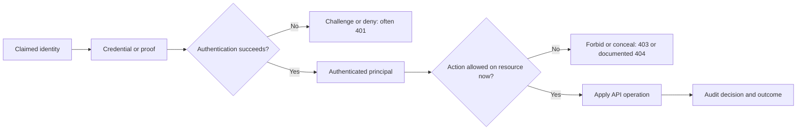
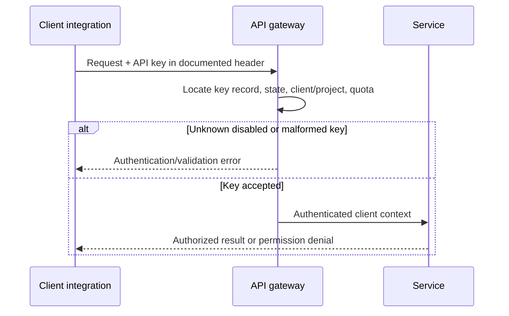
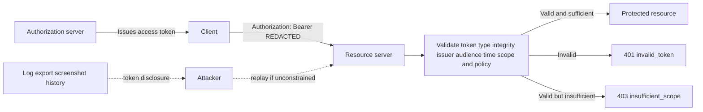
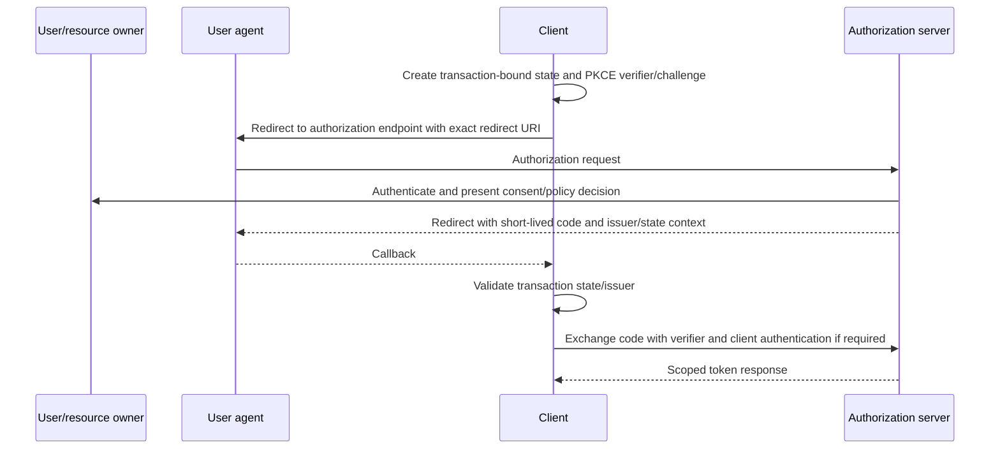
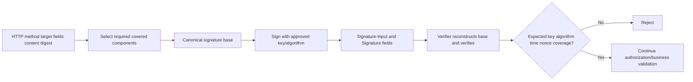
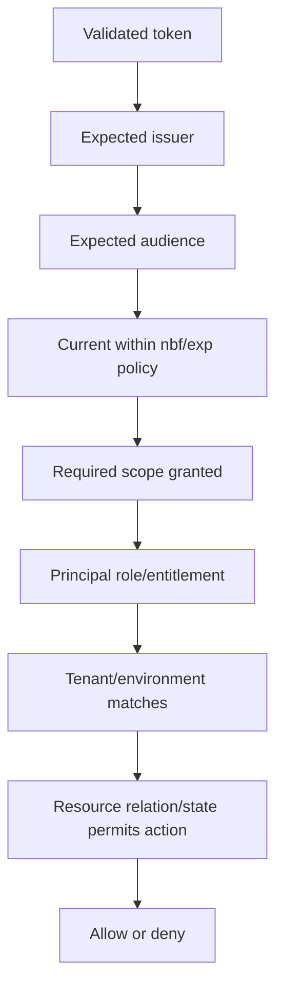
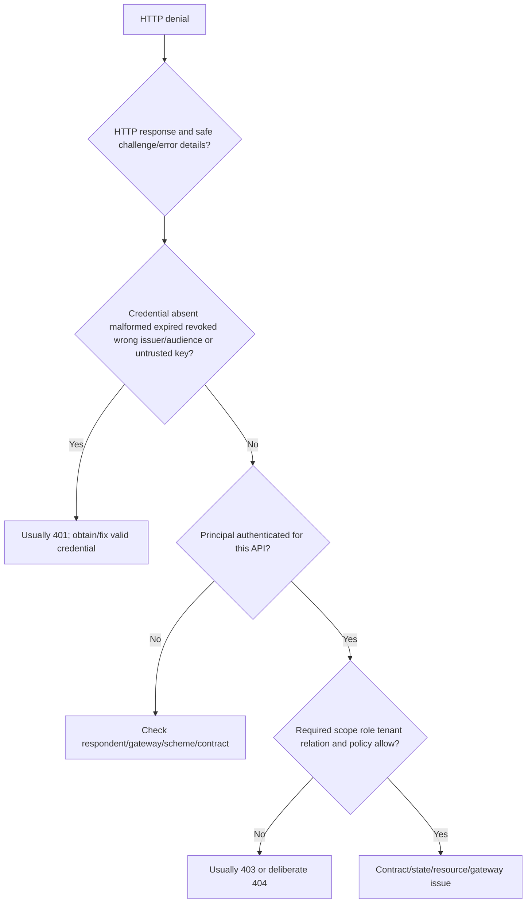
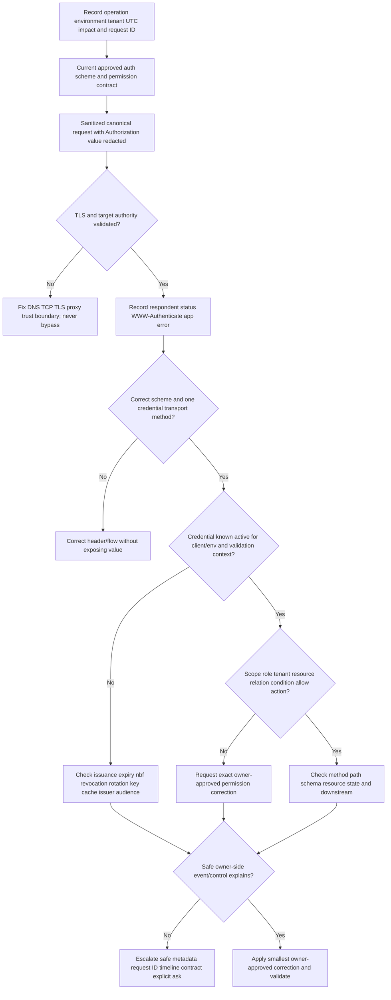

# Part 084 - API Authentication Keys OAuth and Tokens

> **Purpose:** Explain API identity and permission mechanisms from zero, compare keys, Basic concepts, bearer tokens, OAuth flows, mutual TLS, and message signatures, and build a safe troubleshooting model for 401, 403, expiry, revocation, rotation, scopes, claims, and secret handling.
>
> **Artifact label:** **Local/paper lab** using synthetic credential metadata and redacted HTTP transcripts only. No credential is created, encoded, decoded, stored, transmitted, or tested against any endpoint.
>
> **Currency and source access date:** August 24, 2026.

## Section goal

By the end of this Part, you should distinguish identification, authentication, authorization, and accounting; explain API keys, HTTP Basic authentication conceptually, bearer tokens, OAuth client credentials, and delegated authorization flows; and describe mutual Transport Layer Security and HTTP message signatures at an appropriate high level. You should compare scopes, roles, resource relationships, and policy checks without treating any one mechanism as universally sufficient.

You should diagnose 401 versus 403 carefully, recognizing that implementations can intentionally return 404 to avoid disclosing a resource. You should reason about token expiry, not-before time, revocation, refresh, key rotation, secret storage, redaction, least privilege, issuer, audience, subject, tenant, clock, signature/key selection, and sender constraints. You should separate “who or what authenticated?” from “what may that principal do to this resource now?”

The security objective is strict: credentials are never learning artifacts. This Part includes no real key, password, token, certificate private key, OAuth endpoint, consent request, client registration, live authorization flow, or named-vendor call. Synthetic labels such as `[SYNTHETIC_TOKEN_REDACTED]` are evidence placeholders, not values to send. Current approved Abnormal documentation and internal policy remain authoritative for any actual integration identity, scope, credential lifecycle, endpoint, or troubleshooting procedure.

## JD Mapping

| Supplied role signal | Capability developed | Vendor-neutral support example | Proof artifact |
|---|---|---|---|
| API support | Separates authentication, authorization, and API contract errors | 401 expired token versus 403 missing scope | Decision ledger |
| Complex investigations | Correlates issuer, audience, time, client, tenant, scope, and resource | Same principal works on one collection only | Permission matrix |
| Cloud Email Security | Reasons about least-privilege access to message/security records | Read metadata without broad content access | Scope review |
| SaaS Security | Recognizes tenant and role boundaries | Valid token for wrong tenant/resource | Tenant map |
| AI Security Agents | Distinguishes service identity from delegated user authority | Background service versus analyst action | Flow comparison |
| Customer trust | Never asks for or copies credentials | Redacted authorization evidence | Evidence template |
| Engineering collaboration | Supplies safe identity metadata and exact denial stage | `invalid_token` versus `insufficient_scope` | Escalation packet |
| Onboarding/integrations | Plans issuance, storage, rotation, revocation, and ownership | Connector credential lifecycle | RACI table |
| Continuous learning | Uses OAuth Security BCP and primary RFCs | Current flow guidance | Source ledger |
| Honest positioning | Frames identity concepts as working familiarity and learned architecture | Interview answer | Honesty statement |

## Candidate honesty note

Your prior cloud, Entra fundamentals, SSO/SAML/OAuth learning, enterprise support, escalation, and customer-trust experience provide a strong transfer base. You can claim working familiarity with authentication evidence, OAuth roles and flows, token claims, least privilege, and secret hygiene. You should not claim identity-provider engineering, authorization-server operation, production public key infrastructure ownership, cryptographic implementation, customer credential custody, or Abnormal API administration.

| Evidence tier | Safe claim | Boundary |
|---|---|---|
| Production transfer | enterprise support, identity/configuration isolation, customer communication, escalation | Do not invent production OAuth-security incidents |
| Working familiarity | API key, Basic concept, bearer, OAuth roles/flows, scopes, claims, 401/403 reasoning | Not authorization-server engineering |
| Local/paper lab | Synthetic credential lifecycle and denial diagnosis | No live auth flow or credential |
| Learned architecture | mTLS, signatures, sender-constrained tokens, named ecosystem patterns | Not deployed ownership |
| No direct experience | Abnormal API credential administration and named non-Microsoft platform operations | State directly |
| Unknown | Abnormal auth schemes, scopes, roles, issuers, audiences, lifetimes, rotation, logs | Verify current approved documentation |

## 1. Identity, authentication, authorization, and accounting

An **identity** is a representation of a person, workload, application, device, or organization. A **principal** is an identity that can be authenticated and considered for access. **Authentication** asks whether presented evidence sufficiently establishes the claimed principal. **Authorization** asks whether that authenticated principal may perform a requested action on a target resource under current policy. **Accounting** or **auditing** records relevant actions and decisions.



| Term | Plain meaning | Analogy | Support evidence |
|---|---|---|---|
| Identity | Representation of an actor | Name on an employee directory | Safe alias, type, tenant, issuer |
| Principal | Identity considered for access | Badge holder at a door | Client/user/service/object ID alias |
| Credential | Secret or proof used to authenticate | Badge or key | Never collect value; record type and lifecycle metadata |
| Authentication | Verify presented identity evidence | Badge reader checks badge | Challenge/error, issuer/key/time evidence |
| Authorization | Decide allowed action on resource | Door policy checks room access | Scope/role/resource/tenant/policy summary |
| Accounting/audit | Record security-relevant activity | Entry log | UTC, request ID, principal alias, decision |
| Impersonation/delegation | One actor acts as or for another under rules | Authorized representative | Grant type, subject/client distinction |

Authentication success never guarantees authorization. A valid employee badge does not open every room. The analogy stops because API policy can evaluate scopes, roles, claims, tenant, resource ownership, conditions, risk, licensing, and current state on every request.

## 2. API keys

An **API key** is a value an API uses to identify or authenticate a calling client, project, subscription, or integration according to the provider's contract. Some keys only identify for metering; others act as bearer credentials. Treat every unknown key as a secret until the owner documents otherwise.



| API key property | Good design question | Failure symptom | Safe evidence |
|---|---|---|---|
| Placement | Which documented header? | 401/403/400 or missing key | Header name only, value `[REDACTED]` |
| Identity binding | Which client/project/tenant? | Valid key reaches wrong boundary | Stable aliases, no raw key |
| Privilege | What actions/resources? | Key authenticates but action denied | Permission summary |
| Environment | Dev/test/prod separation? | Key rejected in another environment | Environment alias |
| State | Active/disabled/expired? | Sudden denial after lifecycle event | State and UTC from owner console/log |
| Rotation | Overlap and rollback plan? | Old/new mismatch across instances | Key version alias, never material |
| Quota | Key carries rate policy? | 429 while auth succeeds | Limit headers/account metadata |
| Storage | Approved secret manager? | Leak in config/history/export | Storage class and incident action |

Do not put API keys in URI query strings unless a current contract gives no alternative and security owners explicitly accept the exposure; URLs are widely logged and displayed. Do not store keys in source code, Postman collection exports, screenshots, tickets, wiki pages, shell history, ordinary environment files committed to source, or chat. Use organization-approved secret management, access controls, rotation, audit, and injection methods.

### 🔍 Plain-English deep-dive: An API key is often a bearer secret with a friendly label

If possession of a key is sufficient to call the API, copying it copies authority. Calling it an “identifier” does not reduce that risk. Some platforms separate a public client identifier from a secret; support must know which property the current contract assigns.

Think of a parking pass. A printed lot number may only identify a subscription, while a gate barcode may open the gate for whoever presents it. The analogy stops because APIs can bind keys to networks, signatures, quotas, tenants, scopes, or other controls.

Evidence should say `X-Api-Key: [REDACTED]`, key alias `KEY-V2`, active state observed at UTC, and intended tenant/environment. Never preserve a prefix/suffix unless policy explicitly permits it and it is necessary to distinguish versions.

## 3. HTTP Basic authentication: concept only

The HTTP **Basic** authentication scheme transmits a user identifier and password pair encoded with Base64 in the `Authorization` field. Base64 is an encoding, not encryption. Anyone who recovers the field value can decode the credential pair. Basic is not secure without an external secure transport such as correctly validated Transport Layer Security, abbreviated TLS.

This guide teaches Basic conceptually and does not generate a value. A server can issue a `401 Unauthorized` challenge with `WWW-Authenticate: Basic realm="..."`; the client may respond with `Authorization: Basic [REDACTED]`. A proxy's analogous challenge uses 407 and proxy-specific fields.

| Basic concept | Meaning | Risk | Support boundary |
|---|---|---|---|
| User/password pair | Long-lived primary credential pair | Reuse, phishing, storage, guessing | Never request or decode it |
| Base64 | Binary-to-text encoding | Easily reversible; no secrecy | Do not call encryption |
| Realm/protection space | Scope label for challenge/credential reuse | Credentials sent too broadly | Record realm label only if non-sensitive |
| TLS | Protects transport leg and validates server when configured correctly | Termination/interception creates more legs | Never bypass certificate checks |
| 401 challenge | Server asks for valid credentials | Repeated prompts can leak to counterfeit server | Validate authority and challenge |
| Password rotation | Replace exposed/expired credential | Service outage if rollout is not coordinated | Dual-window/rollback only if policy supports |

Basic is included for protocol literacy and legacy troubleshooting, not as a default recommendation for high-value API integrations. RFC 7617 and current security architecture must be read together. Never use a real credential in a command line, example, or lab.

## 4. Bearer tokens

A **bearer token** can be used by any party possessing it without proving possession of separate cryptographic key material. It is like cash: possession is the central authorization condition. The analogy stops because a token can have scope, audience, expiry, revocation state, sender constraints in related profiles, and server-side policy.



| Bearer handling rule | Why | Bad shortcut | Better practice |
|---|---|---|---|
| Use HTTPS with server validation | Protects token from interception/counterfeit target | Disable TLS checks | Fix trust/name/chain/path |
| Prefer Authorization header | Avoids URI logging/history | Query `access_token=` | Documented Bearer header |
| One transport method per request | Avoids ambiguity | Header plus body token | One current contract method |
| Short lifetime | Limits exposure window | Indefinite access token | Refresh/reissue under policy |
| Audience restriction | Limits wrong-server replay | One token for every API | Resource-specific audience |
| Least scope | Limits operations/resources | Broad admin scope for convenience | Minimum operations/data |
| Redact everywhere | Prevents support artifacts becoming credentials | Partial screenshot blur | Structured allowlist/redaction |
| Revoke on exposure | Stops or limits further use | Delete ticket only | Incident process plus rotation/revocation |

Synthetic request anatomy:

```http
GET /v1/cases/CASE-084 HTTP/1.1
Host: api.example.test
Authorization: Bearer [SYNTHETIC_TOKEN_REDACTED]
Accept: application/json
X-Request-ID: REQ-084-A
```

Safe case notes retain scheme `Bearer`, not token characters. They may retain a policy-approved token fingerprint or issuer-side event ID if the organization provides one specifically for correlation. Never invent a fingerprint by hashing a real token in an unapproved tool; hashes can still be sensitive correlators and may expose low-entropy secrets.

## 5. OAuth roles and grants

OAuth 2.0 is an authorization framework that allows a client limited access to protected resources, either on its own behalf or with a resource owner's authorization. Its main roles are resource owner, client, authorization server, and resource server. Authentication of a user can be involved, but OAuth by itself is not a user-authentication protocol. OpenID Connect adds an identity layer and is not expanded here beyond that boundary.

```mermaid
sequenceDiagram
    participant O as Resource owner
    participant C as Client
    participant A as Authorization server
    participant R as Resource server
    C->>O: Request delegated authorization through approved flow
    O->>A: Authenticate and approve or deny
    A-->>C: Authorization grant or denial
    C->>A: Exchange grant; authenticate client as required
    A-->>C: Scoped access token; optional refresh token by flow/policy
    C->>R: Protected request with access token
    R->>R: Validate token and authorize action/resource
    R-->>C: Result or OAuth/HTTP error
```

| OAuth role/artifact | Plain meaning | Common confusion | Support question |
|---|---|---|---|
| Resource owner | Entity capable of granting access | Always a person | Who controls authorization? |
| Client | Application requesting access | End user or resource server | Which registered client/environment? |
| Authorization server | Issues tokens after applicable checks | Same as every API | Which trusted issuer/metadata? |
| Resource server | Hosts protected resources and validates token | Token issuer | Which audience/resource API? |
| Authorization grant | Credential representing authorization used to obtain token | Access token itself | Which flow and transaction? |
| Access token | Credential presented to resource server | User identity proof in every context | What scope/audience/subject/client? |
| Refresh token | Credential used at authorization server for new access token | Token sent to API | Is it bound, rotated, expired, revoked? |

OAuth is extensible, so a grant name does not fully specify deployment security. Current profiles, authorization-server metadata, exact redirect matching, client type, Proof Key for Code Exchange, token binding/sender constraints, and security BCP guidance matter.

## 6. Client credentials flow

The **client credentials grant** is for a confidential client acting on its own behalf or under prearranged authorization. There is no end-user delegation in the transaction. The client authenticates to the authorization server and requests an access token, often with scopes. RFC 6749 says the grant is only for confidential clients.

```mermaid
sequenceDiagram
    participant W as Workload client
    participant A as Authorization server
    participant R as Resource server
    W->>A: POST token request; client authenticates; requested scope
    A->>A: Validate client policy and allowed scope
    A-->>W: Access token metadata; no token shown in evidence
    W->>R: Protected request with bearer or constrained token
    R->>R: Validate issuer audience time scope client/resource policy
    R-->>W: Result, 401, or 403
```

| Checkpoint | Expected fact | Failure | Safe evidence |
|---|---|---|---|
| Client registration | Correct environment and client alias | `invalid_client` | Client ID alias; no secret |
| Client authentication | Approved method and current credential | 401/400 token endpoint error | Auth method, key/cert version alias |
| Grant type | `client_credentials` when supported | `unsupported_grant_type` | Literal grant name |
| Requested scope | Subset allowed for client | `invalid_scope` | Scope names only if non-sensitive |
| Token response | Token type, expiry, granted scope | Parse/cache issue | Metadata with token redacted |
| Resource request | Correct API audience and operation | `invalid_token`/403 | Issuer/audience/scope summaries |
| Workload identity | Client, not human user | Subject confusion | Principal type and alias |

Do not call client credentials “service account login” unless the platform uses that documented term. Do not assume a refresh token; RFC 6749 says a refresh token should not be included in the client credentials response. The client requests a new token using its own credential according to policy.

## 7. Delegated flows at high level

In a **delegated flow**, a resource owner authorizes a client to access resources under bounded conditions. The modern common browser-based pattern is authorization code with Proof Key for Code Exchange, abbreviated **PKCE**. The client redirects the user agent to the authorization server, the user authenticates and authorizes, the client receives a short-lived authorization code, and the code is exchanged at the token endpoint with transaction binding.



RFC 9700 is the OAuth 2.0 Security Best Current Practice. It states public clients must use PKCE and recommends it for confidential clients; authorization servers must support PKCE. It says clients should not use the implicit grant except under narrowly mitigated conditions and must not use the resource owner password credentials grant. Exact redirect matching and protection against cross-site request forgery and mix-up are central.

| Flow/topic | Appropriate high-level use | Current caution |
|---|---|---|
| Authorization code + PKCE | Delegated browser/native authorization | Bind transaction, exact redirect, validate issuer/state/code verifier |
| Client credentials | Workload acts on own/prearranged authority | Confidential client; no end user |
| Implicit grant | Historical token-in-authorization-response flow | RFC 9700 says clients should not use it except with strong mitigations |
| Resource owner password grant | Client directly collects user password | RFC 9700 says it must not be used |
| Refresh token | Obtain new access tokens without full authorization flow | Bind/rotate, protect, scope, inactivity expiry, replay detection |
| Device authorization/other extensions | Device/user experience profiles | Use current profile, metadata, and security review |

### 🔍 Plain-English deep-dive: OAuth delegates authority; it does not make every token an identity card

An access token tells a resource server what authorization the issuer associates with it. A token can represent a client, a user delegation, or another profile. Treating every `sub` as a human user or every token as proof of login can create authorization defects.

Think of a signed purchasing authorization: it can empower a company service, an employee acting through an application, or a specific transaction. The analogy stops because OAuth has formal issuers, clients, grants, token types, claims, endpoints, redirect protections, and cryptographic validation.

For support, state principal type, grant/flow, issuer, client alias, subject category, audience, scope, tenant, and current policy. Do not infer a human identity solely from a decodable claim set.

## 8. Mutual TLS and certificate-bound tokens

**Mutual Transport Layer Security**, abbreviated **mTLS**, adds client certificate authentication/proof to normal server-authenticated TLS. The client presents an X.509 certificate and proves possession of the corresponding private key during the handshake. In OAuth, RFC 8705 defines mTLS client authentication and certificate-bound access tokens; these are distinct but complementary mechanisms.

```mermaid
sequenceDiagram
    participant C as Client with protected private key
    participant T as Token endpoint
    participant R as Resource server
    C->>T: mTLS handshake; present certificate; prove private-key possession
    T->>T: Match certificate/client policy
    T-->>C: Token bound to certificate thumbprint/context
    C->>R: mTLS handshake with required certificate
    C->>R: Present bound access token
    R->>R: Validate token and certificate binding
    R-->>C: Permit or reject mismatch
```

| mTLS dimension | Meaning | Typical failure | Evidence without secret |
|---|---|---|---|
| Server authentication | Client validates server identity | Unknown issuer/name/time | Public chain summary |
| Client certificate request | Server requests client proof | No certificate requested/presented | Handshake metadata |
| Private-key possession | Client signs handshake proof | Key unavailable/permission/provider error | Key-store alias and error, never key |
| Certificate identity | Server maps certificate to client | DN/SAN/registered cert mismatch | Subject/SAN aliases/thumbprint under policy |
| Certificate-bound token | Token tied to certificate | Token/cert mismatch | Confirmation metadata aliases |
| Expiry/rotation | Certificate lifecycle changes | New cert not registered or old token bound | Cert version and UTC |
| TLS termination | Proxy handles client certificate | Untrusted forwarded header/context | Proxy trust and signed/protected hop evidence |

Never email, attach, or paste a private key. Do not export a client certificate bundle containing a private key into a ticket. A certificate can be public, but its subject, SAN, serial, and topology may still be sensitive. Follow approved minimum evidence and PKI ownership.

## 9. HTTP message signatures at high level

HTTP message signatures, standardized in RFC 9421, allow selected HTTP message components to be covered by a digital signature or keyed message authentication code. Signer and verifier construct a canonical signature base from agreed components and metadata. Verification can provide integrity and signer evidence for the covered components; it does not encrypt the message and does not replace TLS.



| Signature concept | Plain meaning | Failure risk |
|---|---|---|
| Covered components | Message parts protected by signature | Important method/path/body digest omitted |
| Signature base | Canonical bytes both sides reconstruct | Proxy/library normalization mismatch |
| `created`/`expires` | Signature time window metadata | Clock skew or stale replay |
| `nonce` | Unique value used by a profile | Replay cache/matching failure |
| `keyid` | Identifier to find verification key | Unknown/rotated/wrong-tenant key |
| Algorithm policy | Approved method for key/context | Downgrade or mismatch |
| Content digest | Hash field that can bind content when covered and checked | Signature passes while content digest is never validated |
| TLS | Confidentiality and transport authentication | Signatures alone expose content |

Application profiling is essential: RFC 9421 does not decide which components every API must sign or how keys are trusted. Vendor-specific signature schemes are examples of their own contracts, not universal HTTP behavior. Never reproduce a signature with real material in a support ticket or generic online tool.

## 10. Scopes, roles, resource policy, and least privilege

A **scope** is a named range of access requested/granted in an OAuth deployment. A **role** groups permissions according to an authorization model. A permission can also depend on resource ownership, tenant, environment, relationship, policy conditions, licensing, or risk. Scope is not identical to role.



| Authorization factor | Example synthetic fact | Why token validity is insufficient |
|---|---|---|
| Scope | `cases.read` | May not cover `cases.update` |
| Role | `support_analyst` | Role may be restricted to assigned cases |
| Tenant | `TENANT-LAB` | Resource can belong to another tenant |
| Audience | `case-api` | Token intended for another API must be rejected |
| Subject/client | workload versus user | Policy differs by principal type |
| Resource relation | case assigned to group A | Scope may be broad but relationship denies |
| Environment | test versus production | Registration and keys differ |
| Time/risk | valid time but high-risk condition | Conditional access/policy may block |

**Least privilege** means granting only the actions, resources, tenants, and duration necessary for the purpose. It is not “fewest scope words” because one broad scope can be riskier than several narrow ones. Review data sensitivity, write/delete/remediation effects, consent, separation of duties, and recovery.

## 11. Token formats and validation claims

Access tokens can be opaque handles or structured/self-contained tokens. A **JSON Web Token**, abbreviated **JWT**, is a compact claims format encoded in a JSON Web Signature or JSON Web Encryption structure. A JWT is not inherently an OAuth access token, and an OAuth token is not inherently a JWT.

Decoding base64url segments only reveals encoded JSON; it does not validate signature, encryption, issuer, audience, time, key trust, token type, nonce, or policy. Never paste a real JWT into a public decoder. If a current approved process permits local inspection, minimize and protect the artifact; this lab does not decode one.

| Claim/concept | Plain meaning | Validation question | Common failure |
|---|---|---|---|
| `iss` | Issuer that created/asserts token | Exact trusted issuer for environment? | Wrong tenant/cloud/metadata |
| `sub` | Subject of claims | Correct principal type and scoped uniqueness? | Client mistaken for user |
| `aud` | Intended recipient(s) | Does resource server identify itself? | Token sent to wrong API |
| `exp` | Expiration time | Is current trusted time before expiry? | Expired token/clock issue |
| `nbf` | Not-before time | Is token active yet? | Clock skew or future issuance |
| `iat` | Issued-at time | Is age plausible under profile? | Stale/unexpected issuance |
| `jti` | Token identifier | Is replay handling/profile defined? | Treating ID as secret or universal replay defense |
| Scope/roles | Authorization attributes | Required action/resource present? | Valid token, insufficient permission |
| Header `kid` | Key identifier in many JOSE profiles | Trusted issuer key set contains allowed key? | Rotation/cache/wrong issuer |

### 🔍 Plain-English deep-dive: A readable token is not a validated token

Base64url is an encoding. An attacker can construct readable header and claim JSON. Trust begins only after the verifier applies the correct cryptographic and application profile, checks the trusted issuer/key/algorithm, and validates audience, time, token type, and authorization context.

Think of a photocopied ID card: text and photo are readable, but validation checks issuer, anti-counterfeit features, expiry, person, and intended use. The analogy stops because JWT verification is cryptographic and profile-specific.

Support evidence should prefer issuer-side validation outcomes and safe claim summaries over raw token content.

## 12. Expiry, refresh, revocation, and rotation

Credentials have lifecycles. **Expiry** ends acceptance after a time. **Revocation** invalidates a credential or grant before natural expiry, though propagation can create a bounded delay. **Rotation** introduces new credential material and retires old material. **Refresh** uses a refresh token at an authorization server to obtain a new access token.

```mermaid
stateDiagram-v2
    [*] --> Issued
    Issued --> Active: Validated and within time/policy
    Active --> Expired: Lifetime ends
    Active --> Revoked: Owner/security/policy invalidates
    Active --> Rotating: New material introduced
    Rotating --> Active: New accepted; old overlap bounded
    Rotating --> Revoked: Old retired after verification
    Expired --> [*]
    Revoked --> [*]
```



| Lifecycle event | Client behavior | Operator behavior | Evidence |
|---|---|---|---|
| Access token expiry | Obtain new token by approved flow | Monitor expected failures | Expiry/UTC summary, no token |
| Refresh token rotation | Atomically replace retained token | Detect reuse/revoke family per policy | Rotation event ID |
| Manual revocation | Stop using credential immediately | Revoke related grant/tokens as policy defines | Revocation UTC and owner |
| Key rotation | Select trusted new signing/verification key | Publish/cache/overlap/retire safely | Key ID/version, cache state |
| API key rotation | Deploy new key before retiring old when supported | Track all consumers and rollback | Alias/version inventory |
| Certificate rotation | Present registered/current cert and key | Update trust/binding before old expiry | Thumbprint alias/validity |
| Secret exposure | Cease use and escalate | Restrict evidence, revoke/rotate, investigate | Incident ID, never secret |

RFC 7009 defines OAuth token revocation and notes that a successful response also covers an invalid token, avoiding a token-validity oracle. Actual cascades and propagation are policy/design specific. Do not test revocation by repeatedly presenting a possibly compromised token to unrelated endpoints.

### 🔍 Plain-English deep-dive: Revocation closes a door; it does not rewind history

Think of credential revocation like disabling an access badge. The control system records that the badge should no longer open protected doors, but each door controller may need to receive that update, and disabling the badge does not undo actions completed before the cutoff. Similarly, an authorization server can accept a revocation request while resource servers, gateways, token caches, or sessions apply the decision according to their documented validation and propagation rules.

Therefore, a successful revocation response proves that the revocation endpoint accepted the request under its contract. It does not alone prove that every related token, session, or downstream credential is immediately unusable, nor that earlier business effects were reversed. Record the credential alias, revocation UTC, owner, affected audience/scope, expected propagation boundary, and approved validation evidence. If exposure is suspected, follow the incident process and reconcile prior activity; never test by sending the secret to extra endpoints.

## 13. 401 versus 403 and identity versus permission

RFC 9110 defines 401 for a request lacking valid authentication credentials and requires an applicable `WWW-Authenticate` challenge. 403 means the server understood the request but refuses fulfillment; credentials can be valid but insufficient. RFC 6750 maps `invalid_token` typically to 401 and `insufficient_scope` to 403. A server may return 404 to conceal the existence of a forbidden resource.



| Symptom | Plausible cause | Cheap discriminator | Do not conclude |
|---|---|---|---|
| 401 no token | Missing auth | `WWW-Authenticate` and canonical request | User lacks role |
| 401 `invalid_token` | Expired/revoked/malformed/wrong validation context | Issuer validation log and UTC | Password is wrong |
| 403 `insufficient_scope` | Token valid but lacks required scope | Granted versus required scope | Token refresh automatically adds permission |
| 403 with scope present | Role/tenant/resource/condition denies | Same principal on authorized control resource | Scope system is broken |
| 404 for known ID | Wrong path/tenant or concealment | Authorized control and server request ID | Resource definitely absent |
| 401 after key rotation | Key cache or new credential rollout mismatch | Key ID/version by instance/time | Global outage |
| Works in Postman only | Different token/client/env/proxy/headers | Canonical request dimension diff | Application code is bad |

Identity errors and permission errors need different owners and remedies. Reissuing the same insufficient scope token does not add authorization. Granting broad admin access to “test” a 403 changes risk and can obscure the missing exact permission. Use a preapproved control principal/resource or owner-side policy evaluation.

## 14. Secret storage, redaction, and support handling

Credential values should live only in approved secret stores or platform mechanisms with access control, audit, encryption, rotation, and minimal exposure. “Environment variable” is a delivery mechanism, not automatically a secure store; values can appear in child processes, diagnostics, crash dumps, container metadata, or logs depending on the environment.

| Location | Risk | Rule |
|---|---|---|
| Source repository | History persists after deletion | Never commit secrets |
| Postman environment/collection export | Export/sync/share can expose values | Use Vault/approved secret handling; sanitize export |
| Shell command/history | Process lists/history/transcripts | Avoid literal credentials; use approved prompt/store |
| PowerShell transcript/debug | Parameters/headers can be logged | Disable/minimize only under policy; redact output |
| Application logs | Central retention and broad readers | Never log raw Authorization/token/secret |
| Ticket/chat/email | Replication and long retention | Use safe aliases and incident channel |
| Screenshots/HAR/pcap | Hidden headers/cookies/content | Field summary first; structured redaction |
| Memory/crash dump | Runtime secret exposure | Limit capture/access/retention |
| Secret manager | Designed controls but access still matters | Least privilege, audit, rotation, owner |

If a credential appears in a support artifact, stop distribution, restrict access, notify security/owner, revoke or rotate according to policy, determine affected scope/time, sanitize or delete artifacts under retention rules, and document the incident without repeating the value. Redaction is not sufficient remediation for a credential already exposed.

## 15. Worked diagnostic cases

### Case A: Expired bearer token

Response is `401`, `WWW-Authenticate` identifies Bearer with `invalid_token`, and owner-side validation says expiry at 14:00 UTC while request arrived 14:03 UTC. Root boundary is token lifetime, not API resource permission. Client obtains a new token by the approved flow; support checks clock and cache behavior. Token remains redacted.

### Case B: Missing scope

Token validation succeeds for expected issuer/audience/time. Request to update a case returns `403 insufficient_scope`; read works. Current approved contract requires `cases.update`, while granted scope summary contains `cases.read`. Do not repeatedly refresh or grant global admin. Correct client authorization/consent/policy under owner control.

### Case C: Wrong audience

Token was issued for `telemetry-api` but sent to `case-api`; resource server returns 401 invalid token. This is an identity-context validation failure at this audience, even if token is otherwise cryptographically valid. Obtain a resource-specific token; never disable audience validation.

### Case D: API key rotation split

Half of connector instances use key alias `KEY-V1`; half use `KEY-V2`. V1 was retired early. Requests correlate by instance and return mixed 200/401. Restore approved overlap or deploy V2 everywhere, verify, then retire V1. Never reactivate exposed material without security approval.

### Case E: mTLS mismatch

TLS completes to server, but protected resource reports token/certificate binding mismatch after a certificate rotation. The new certificate is presented while the access token remains bound to the old certificate. Obtain a new bound token under the approved flow and verify registration/rollout; do not export the private key.

| Case | Authentication result | Authorization result | Correct owner path |
|---|---|---|---|
| Expired token | Fails current validity | Not reached | Client/token issuer/time |
| Missing scope | Succeeds | Fails action permission | OAuth consent/policy/API owner |
| Wrong audience | Fails for resource server | Not reached | Client token request/issuer profile |
| Split API key rotation | Depends on instance/key state | Usually not reached | Integration/secret lifecycle owner |
| mTLS binding mismatch | TLS/client proof may succeed | Bound token validation fails | Client cert/token/profile owners |

## 16. Troubleshooting decision tree



The canonical request must not contain the token. Record `Authorization: Bearer [REDACTED]`, credential alias/version, source mechanism category, and whether the client intended one environment/tenant. If a vendor asks for a raw token, follow internal security policy and an approved secure process; ordinary tickets and chat remain inappropriate.

## 17. Failure modes and escalation package

| Failure/shortcut | Harm | Better practice |
|---|---|---|
| Base64 means encrypted | Exposes Basic credential | Treat as clear reversible encoding |
| Decode JWT on public website | Token disclosure | Owner-side/local approved validation only |
| Put token/key in query | Logs/history/referrers | Authorization header/approved mechanism |
| Use `--insecure` or skip certificate checks | Enables counterfeit endpoint/token theft | Fix trust/name/chain |
| Refresh repeatedly on 403 | Does not add permission; may trigger limits | Compare exact required/granted authorization |
| Grant admin to test | Expands blast radius and hides policy defect | Preapproved narrow control |
| Log only last four characters | Partial values can still be sensitive | Use non-secret alias/event ID |
| Confuse client and user | Wrong authorization decisions | Record principal type/grant/subject/client |
| Trust decoded claims only | Skips signature/issuer/audience/time | Use validated result from trusted component |
| Ignore clock | Causes exp/nbf/signature failures | Compare trusted UTC and bounded skew policy |
| Rotate without inventory | Some instances continue old material | Consumer inventory, overlap, telemetry, rollback |
| Delete exposed token from ticket only | Credential remains usable | Revoke/rotate and incident handling |
| Treat vendor auth behavior as universal | Profiles differ | Current official contract and BCP |
| Claim Abnormal scope knowledge | Unfounded platform assertion | Mark proprietary details unknown |

### Minimal escalation package

| Field | Safe content |
|---|---|
| Operation | Method, sanitized target, expected/actual, impact, UTC |
| Environment | Client/runtime, environment and tenant aliases, proxy/TLS category |
| Auth contract | Scheme, flow/grant, required scope/role, current doc/version |
| Principal | Type, client/user/service aliases, no credential |
| Credential lifecycle | Key/token/cert version alias, issued/exp/nbf/revoked/rotated state summary |
| Validation | Issuer, audience, time, signature/key/binding outcome summaries |
| Response | Respondent, status, challenge error, request ID, redacted body |
| Permissions | Granted versus required scope/role/resource/tenant condition |
| Controls | One approved working/failing comparison |
| Ask | Exact identity, token, key cache, policy, resource, or implementation decision |

## Safe local lab: The Credential Lifecycle Decision Ledger 084

### Prerequisites

- Learner-owned paper or local text editor in a new directory.
- No Postman, curl, PowerShell web request, browser OAuth flow, decoder, OpenSSL, certificate tool, network service, package, dependency, account, registration, or API access is required.
- Use only synthetic aliases: `CLIENT-LAB-084`, `USER-LAB-084`, `TENANT-LAB`, `KEY-V1`, `KEY-V2`, `CERT-V1`, `CERT-V2`, `TOKEN-A`, and `REQ-084-*`.
- Use literal `[REDACTED]` in every Authorization/API-key/secret field. Do not create token-like encoded strings, passwords, private keys, certificate files, or hashes.
- Artifact label: **local/paper lab - credential metadata and authorization decisions only; no credentials or network**.

### Lab procedure

1. Record start UTC, scope, authorization, artifact label, and statement that no credential/network/tool flow will be used.
2. Draw the identity-authentication-authorization-accounting flow. Add one example each for a human user, workload client, and device; keep all aliases synthetic.
3. Build an authentication-mechanism matrix for API key, Basic concept, bearer token, OAuth client credentials, delegated authorization code with PKCE, mTLS, and message signature. Compare actor, proof, replay exposure, lifecycle, and support evidence.
4. Annotate three synthetic requests with values redacted: API key header, Basic header concept, and Bearer header. Mark every place a raw credential could leak: URI, terminal, collection, logs, screenshot, HAR, ticket, memory.
5. Create OAuth role cards for resource owner, client, authorization server, and resource server. Walk client credentials and delegated code+PKCE sequences without constructing endpoint URLs or parameters containing values.
6. Create a “deprecated/avoid” card: implicit grant security caveat from RFC 9700 and resource owner password credentials grant “must not be used.” Explain why this does not rewrite historical RFC text but updates deployment guidance.
7. Create TOKEN-A metadata only: issuer `ISSUER-LAB`, audience `case-api`, subject `CLIENT-LAB-084`, scope `cases.read`, issued 13:00 UTC, not-before 13:00, expiry 14:00. Do not encode it.
8. Evaluate six requests at 13:30: read case, update case, call telemetry API, call another tenant, call before not-before in an alternate card, and call after expiry. Record authentication versus authorization stage and likely 401/403/404 behavior.
9. Create a JWT validation checklist without a JWT: trusted issuer/key, allowed algorithm, signature, token type/profile, audience, exp/nbf/iat, subject/client, tenant, scope/role, nonce/replay where applicable. State why readable claims are insufficient.
10. Build an API key rotation timeline: distribute KEY-V2, verify all clients, observe V2 success, retire V1, monitor, rollback conditions. Add owner and evidence columns.
11. Build a certificate-bound token timeline: token bound to CERT-V1, certificate rotates to CERT-V2, old token mismatch, new token issued/bound, old certificate retired. State that private keys never leave approved storage.
12. Build a refresh/revocation scenario: access token expires, refresh token rotates, reuse of an old refresh token triggers family response according to hypothetical policy. Keep behavior explicitly hypothetical/profile-specific.
13. Run the 401/403 tree on seven synthetic responses: missing credential; expired token; wrong audience; insufficient scope; wrong tenant; hidden resource 404; key-cache delay after rotation.
14. For each response, name two plausible hypotheses and one cheapest safe discriminator using owner-side metadata or a preapproved control. Never suggest sending a raw token.
15. Draft a customer evidence request that asks for UTC, request ID, status/challenge, client/environment/tenant aliases, auth scheme, credential version alias, issuer/audience/time/scope summaries, and explicitly says not to send credentials.
16. Draft a credential-exposure response: stop sharing, restrict artifact, notify security/owner, revoke/rotate, assess scope/time, sanitize/delete under policy, preserve incident IDs without value.
17. Produce a one-page escalation packet for a valid expected issuer/audience/time token with `cases.read` receiving 403 on update requiring `cases.update`.
18. Deliver a spoken three-minute comparison of all mechanisms and a 60-second answer distinguishing identity errors from permission errors.
19. Deliver a 60-second honesty boundary: production transfer, working familiarity, paper lab, learned mTLS/signature architecture, no Abnormal API ownership.
20. Delete drafts containing any accidental real identifiers, retain only synthetic minimized ledger, and record end UTC.

### Expected evidence

- Identity/authentication/authorization/accounting diagram and actor examples.
- Seven-mechanism comparison with replay, lifecycle, and evidence boundaries.
- Three fully redacted request anatomies and leak-surface map.
- OAuth role cards and client-credentials/delegated-flow sequences.
- RFC 9700 current-guidance card.
- Synthetic token metadata decisions across issuer/audience/time/scope/tenant cases.
- JWT validation checklist with no encoded token.
- API key, certificate-bound token, refresh, revocation, and rotation timelines.
- Seven 401/403/404 decision records with hypotheses and discriminators.
- Customer-safe evidence request, exposure response, and escalation packet.
- Spoken technical, troubleshooting, and honesty explanations.

### Cleanup and privacy

- Confirm no credential, encoded token, password, private key, certificate file, cookie, secret, real client/user/tenant, vendor endpoint, or customer data was created or copied.
- Delete raw drafts/screenshots that include machine paths or accidental real identifiers.
- Confirm no browser OAuth session, Postman request, curl command, PowerShell web request, OpenSSL operation, network listener, environment variable, secret store entry, certificate-store change, or dependency installation occurred.
- Retain only a synthetic ledger with `[REDACTED]` placeholders and non-secret aliases.
- If any real credential was accidentally exposed, stop the lab and follow the credential-exposure incident process; cleanup alone is not remediation.
- Record: `Credential Lifecycle Decision Ledger 084 completed locally on paper with synthetic metadata and redacted transcripts only; no credential, token, key, certificate, endpoint, network, customer data, named-platform access, dependency, or security change.`

### Validation rubric

| Dimension | Fail | Developing | Pass |
|---|---|---|---|
| Core terms | Equates authn/authz | Defines both | Maps identity, principal, credential, authn, authz, audit stages |
| API keys | Calls all identifiers secret or public | Treats key carefully | Evaluates placement, binding, privilege, environment, storage, rotation |
| Basic | Calls Base64 encryption | Knows TLS needed | Explains challenge/realm/clear credential risk conceptually without generating value |
| Bearer | Shares or decodes token | Says possession matters | Applies TLS, header, audience, lifetime, scope, redaction, revocation |
| OAuth | Calls it login | Names four roles | Separates client credentials and delegated flow with current RFC 9700 guidance |
| mTLS/signatures | Treats as magic encryption | Describes proof | Separates client auth, token binding, message coverage, confidentiality, profile |
| Claims | Reads claims only | Checks expiry | Validates trusted issuer/key/algorithm/audience/time/type/principal/policy |
| Authorization | Scope equals permission | Adds roles | Evaluates scope, role, tenant, relationship, condition, resource, least privilege |
| 401/403 | Swaps status meanings | Knows rough split | Uses challenge/error, concealment, principal validation, exact permission evidence |
| Lifecycle | Rotates immediately | Names overlap | Inventories consumers, stages overlap, validates, retires, monitors, handles exposure |
| Secret handling | Includes partial value | Redacts obvious field | Uses allowlist evidence, aliases, approved stores, revocation/incident process |
| Honesty | Claims Abnormal/IAM ownership | Says learned | Separates experience transfer, working familiarity, lab, learned, unknown |

## Official Source Anchors - August 24, 2026

| Official or primary source | Topic anchored | Boundary |
|---|---|---|
| [RFC 9110 - HTTP Semantics](https://www.rfc-editor.org/rfc/rfc9110.html) | HTTP authentication framework, 401, 403, 404 concealment | Application auth schemes/policies vary |
| [RFC 7617 - Basic HTTP Authentication](https://www.rfc-editor.org/rfc/rfc7617.html) | Basic challenge and Base64 user/password risk | Concept only in this guide |
| [RFC 6750 - Bearer Token Usage](https://www.rfc-editor.org/rfc/rfc6750.html) | Bearer header, invalid_token, insufficient_scope, TLS and handling | Updated by RFC 9700 security advice |
| [RFC 6749 - OAuth 2.0](https://www.rfc-editor.org/rfc/rfc6749.html) | Roles, grants, access/refresh tokens, scopes, endpoints | Read with extensions and security BCP |
| [RFC 9700 - OAuth 2.0 Security BCP](https://www.rfc-editor.org/rfc/rfc9700.html) | Current best practices, PKCE, flow deprecations, sender/audience restriction, refresh protection | Profiles/deployments add requirements |
| [RFC 7009 - OAuth Token Revocation](https://www.rfc-editor.org/rfc/rfc7009.html) | Revocation endpoint semantics and propagation note | Actual cascade/design varies |
| [RFC 7519 - JSON Web Token](https://www.rfc-editor.org/rfc/rfc7519.html) | Claims, issuer, audience, times, validation/trust | JWT is a format, not automatically OAuth/token validity |
| [RFC 8414 - Authorization Server Metadata](https://www.rfc-editor.org/rfc/rfc8414.html) | Trusted OAuth server metadata | Retrieval/trust/profile still matter |
| [RFC 8705 - OAuth mTLS](https://www.rfc-editor.org/rfc/rfc8705.html) | mTLS client authentication and certificate-bound tokens | Operational PKI/TLS policy is deployment-specific |
| [RFC 9421 - HTTP Message Signatures](https://www.rfc-editor.org/rfc/rfc9421.html) | Covered components, signature base, time/nonce/key, verification | Application profile must define requirements; no confidentiality |
| [OpenAPI Specification - Security Scheme Object](https://spec.openapis.org/oas/latest.html#security-scheme-object) | Describing API key, HTTP, OAuth, OpenID Connect, and mutual TLS schemes | Description is not endorsement or runtime proof |

### Source-use discipline

- Read OAuth core documents with RFC 9700, which updates security guidance and deprecates unsafe modes.
- Do not generalize one vendor's scope names, API-key placement, token format, role behavior, webhook signature, or expiry policy.
- A decoded JWT is untrusted data until the complete profile validation succeeds.
- A 401/403/404 is evidence from a respondent, not proof of the exact internal cause without correlation.
- Treat API keys, Basic fields, bearer tokens, refresh tokens, authorization codes, signatures, cookies, and private keys as secrets.
- Use mTLS and HTTP signature examples only to explain architecture; implementation belongs to security/identity owners and established libraries.
- Verify Abnormal-specific auth only through current approved Abnormal documentation and internal owners.

## Likely Interview Questions

### Q1. What is the difference between identification, authentication, and authorization?

**Model answer:** Identification states which principal is claimed, authentication verifies credential/proof for that claim, and authorization decides whether the authenticated principal may perform this action on this resource under current scope, role, tenant, relationship, and policy. Audit records the decision. A successful login or valid token never implies universal permission.

### Q2. How do API keys, Basic authentication, and bearer tokens differ?

**Model answer:** An API key usually identifies or authenticates a client/project according to provider policy and may be bearer-like. Basic sends a Base64-encoded user/password pair, so Base64 is not encryption and TLS is essential. A bearer token can be used by whoever possesses it, often with scope, audience, and expiry. I never put their values in URIs, logs, tickets, or labs.

### Q3. Explain OAuth client credentials versus a delegated authorization flow.

**Model answer:** Client credentials is for a confidential workload acting on its own or prearranged authority; no end user participates. Delegated authorization code with PKCE involves a resource owner, user agent, authorization server, short-lived code, transaction checks, and token exchange. I identify the principal type and grant because client and user permissions differ.

### Q4. What current OAuth security guidance matters most?

**Model answer:** RFC 9700 updates OAuth security practice: use authorization code with PKCE for redirect flows, exact redirect matching and issuer/CSRF defenses, avoid implicit token issuance except narrowly mitigated cases, never use the resource-owner-password grant, restrict tokens by audience and privilege, protect refresh tokens with sender constraint or rotation, and use trusted metadata/TLS.

### Q5. What are mTLS and HTTP message signatures, and do they replace TLS?

**Model answer:** mTLS lets the client present a certificate and prove private-key possession; OAuth can also bind tokens to that certificate. HTTP message signatures cover selected canonical message components using an approved key and algorithm. Signatures provide no confidentiality and neither mechanism removes the need for correctly validated TLS and a complete application security profile.

### Q6. How do you validate a JWT-like access token safely?

**Model answer:** I do not trust decoded claims or use a public decoder. A trusted component verifies token type/profile, signature with an allowed algorithm and trusted issuer key, exact issuer, intended audience, exp/nbf/iat and clock policy, subject/client/tenant, and required scope/role. The API then evaluates resource and conditional policy. Raw token remains redacted.

### Q7. How do you distinguish 401 from 403?

**Model answer:** 401 generally means the request lacks valid authentication for the target and includes a challenge; bearer `invalid_token` maps there. 403 means the server understood but refuses, often valid identity with insufficient permission; `insufficient_scope` maps there. A 404 may conceal a forbidden resource. I use challenge/error, request ID, validation metadata, and exact permission comparisons.

### Q8. How do you handle rotation or accidental credential exposure?

**Model answer:** For planned rotation I inventory consumers, stage new material, use approved bounded overlap, verify by version and request evidence, retire old material, monitor, and keep rollback rules. For exposure I stop sharing, restrict the artifact, notify security/owner, revoke or rotate, assess scope/time, sanitize/delete under policy, and document an incident ID without repeating the value.

## Memory Hooks

- **Identity claims; authentication proves; authorization permits.**
- **A valid badge does not open every room.**
- **Base64 is wrapping, not encryption.**
- **Bearer means possession can spend authority.**
- **OAuth delegates access; OpenID Connect adds identity.**
- **Client credentials has no end-user delegation.**
- **PKCE binds the code transaction.**
- **RFC 9700 is the current OAuth security compass.**
- **mTLS proves a key on the TLS connection.**
- **Message signatures cover selected components; TLS still protects transport/confidentiality.**
- **Issuer made it; audience receives it; exp/nbf bound time.**
- **Scope is not role, and neither alone is full policy.**
- **401: valid authentication missing; 403: understood but forbidden.**
- **Never troubleshoot a secret by copying the secret.**

## Completion Checklist

- [ ] I can define identity, principal, credential, authentication, authorization, and accounting.
- [ ] I can explain API-key binding, privilege, quota, storage, environment, and rotation.
- [ ] I can explain Basic conceptually and state that Base64 is not encryption.
- [ ] I can explain bearer possession risk, TLS, header use, audience, scope, and redaction.
- [ ] I can name OAuth resource owner, client, authorization server, and resource server.
- [ ] I can compare client credentials and delegated authorization code with PKCE.
- [ ] I can state RFC 9700 guidance on PKCE, implicit, password grant, audience, and refresh protection.
- [ ] I can explain mTLS client authentication versus certificate-bound tokens.
- [ ] I can explain HTTP message signature coverage, canonicalization, nonce/time/key policy, and TLS boundary.
- [ ] I can distinguish scope, role, tenant, relationship, resource, environment, and condition.
- [ ] I can explain opaque versus structured tokens and why decoded JWT claims are untrusted.
- [ ] I can validate issuer, audience, exp, nbf, iat, subject/client, key/algorithm, and token type at high level.
- [ ] I can explain expiry, refresh, revocation, rotation, overlap, and propagation.
- [ ] I can distinguish 401, 403, deliberate 404, `invalid_token`, and `insufficient_scope`.
- [ ] I can write a credential-free canonical request and escalation package.
- [ ] I completed or can reproduce **The Credential Lifecycle Decision Ledger 084** with no network or credential.
- [ ] I can answer exactly Q1-Q8 aloud with precise safety and honesty language.
- [ ] I can state prior production transfer, working familiarity, paper lab, learned architecture, no direct experience, and Abnormal unknowns.
- [ ] I checked Official Source Anchors dated August 24, 2026 and current RFC 9700 guidance.

[Next: Part 085 - Postman curl and PowerShell API Practice](Part-085-postman-curl-and-powershell-api-practice.md)