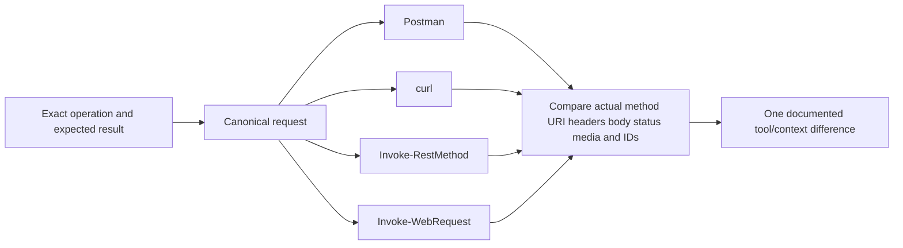
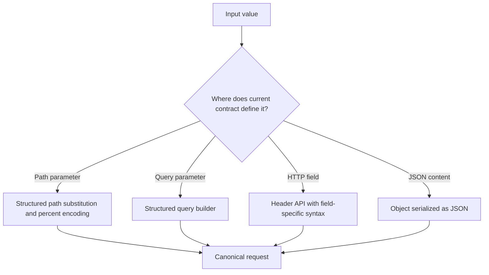
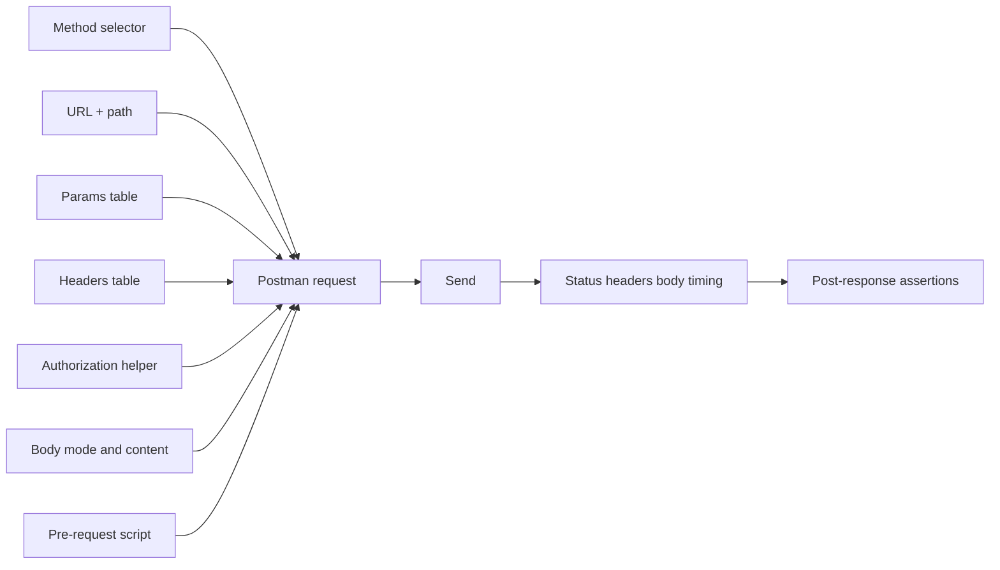
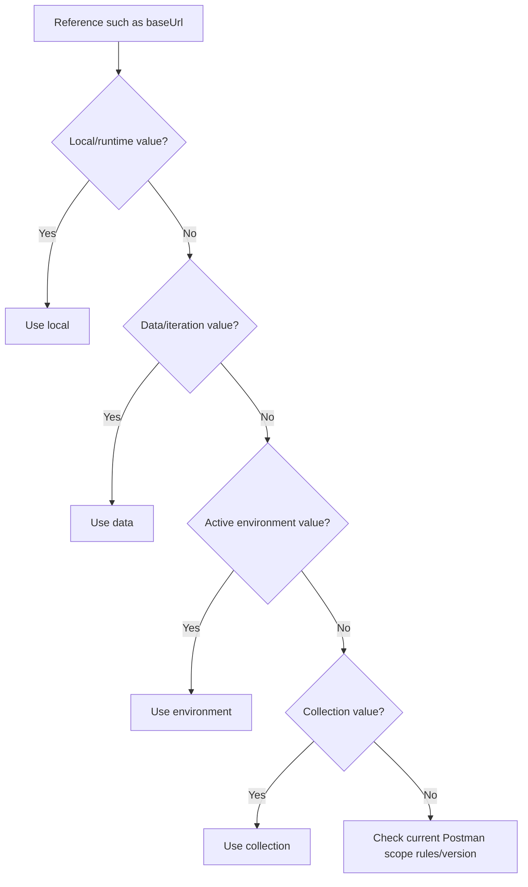
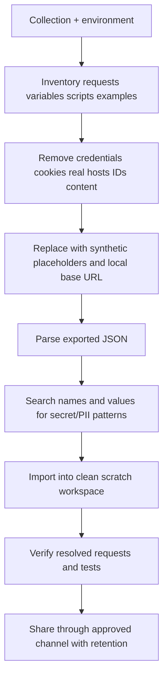
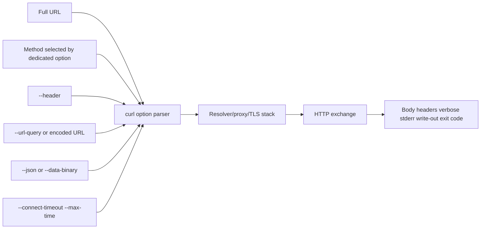
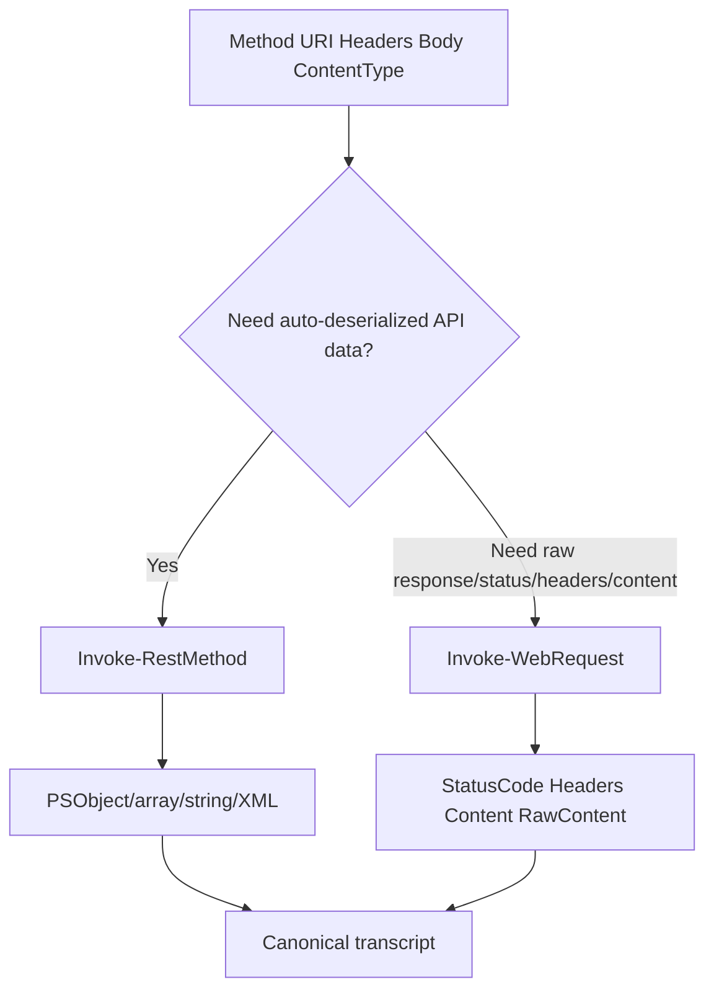
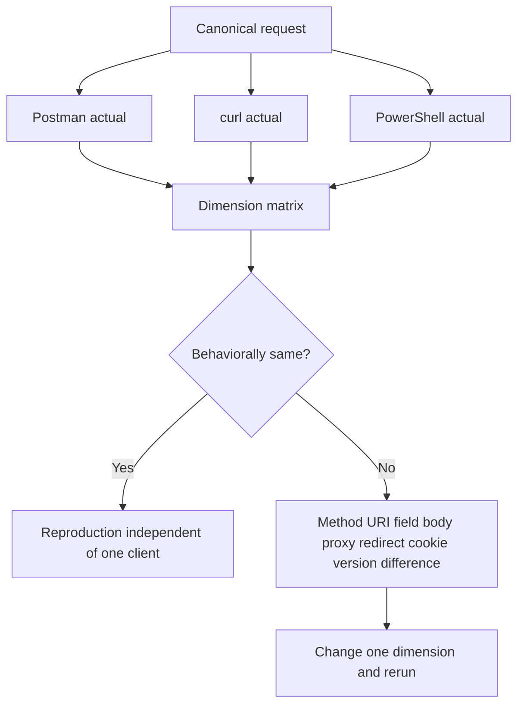
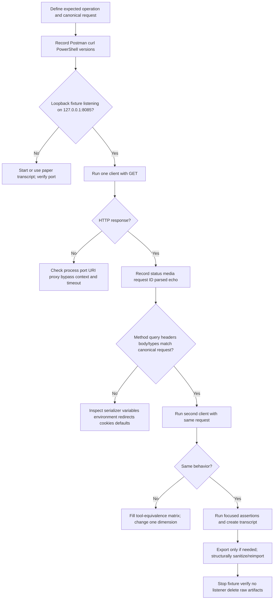

# Part 085 - Postman curl and PowerShell API Practice

> **Purpose:** Turn API concepts into reproducible requests and evidence using Postman, curl, `Invoke-RestMethod`, and `Invoke-WebRequest`, while keeping variables, exports, verbose output, transcripts, and local fixtures free of secrets and customer data.
>
> **Artifact label:** **Local loopback lab** using one Python-standard-library echo receiver bound to `127.0.0.1`, plus optional Postman if already installed. No dependency installation, authentication, public API, vendor endpoint, destructive method, or TLS bypass is used.
>
> **Currency and source access date:** August 24, 2026.

## Section goal

By the end of this Part, you should construct the same harmless request in Postman, curl, `Invoke-RestMethod`, and `Invoke-WebRequest`; place values correctly in path, query, header, and JSON content; and predict how each tool serializes, sends, parses, and exposes evidence. You should use variables and environments without storing secrets in ordinary collection/environment exports, write focused assertions, sanitize exported collections, and build a reproducible transcript with UTC, versions, canonical request, response, and interpretation.

You should understand curl's method/body/header options, bounded timeouts, status/timing output, exit code distinction, redirect risks, and verbose-data sensitivity. You should never use `--insecure`. You should distinguish PowerShell's structured JSON conversion in `Invoke-RestMethod` from the richer raw response object of `Invoke-WebRequest`, and record PowerShell edition/version because defaults and parameters vary.

The lab is deliberately local. A short Python standard-library receiver echoes only allowlisted synthetic fields, caps content length, supports harmless GET/HEAD/POST, binds only to IPv4 loopback, and stores nothing. Python is optional: if unavailable, the learner completes the exact exercise as paper transcripts. Postman is optional if already installed. No package installation is needed or requested.

## JD Mapping

| Supplied role signal | Capability developed | Vendor-neutral support example | Proof artifact |
|---|---|---|---|
| API support | Reproduces requests across GUI and CLI clients | Portal succeeds; service client fails | Tool-equivalence matrix |
| Complex investigations | Controls one request dimension at a time | Header or body serialization differs | Canonical transcript |
| Customer communication | Requests minimum exact evidence safely | Sanitized curl/PowerShell command | Evidence template |
| Engineering collaboration | Supplies executable local reproduction and assertions | Wrong content type/field type | Local collection/transcript |
| Diagnostic tools | Builds working familiarity with Postman, curl, and PowerShell | HTTP/JSON loopback exercise | Three-client lab |
| Privacy/security | Prevents tokens in history, exports, console, and screenshots | Redaction and cleanup manifest | Sanitized artifact |
| SaaS integrations | Uses environments and variable scopes carefully | Test versus production base URI | Variable-resolution ledger |
| Continuous learning | Checks current tool documentation/version | Syntax/default changes | Source ledger |
| Honest positioning | Separates tool lab from production platform ownership | Interview answer | Honesty statement |
| Operational rigor | Captures prerequisites, expected evidence, cleanup, and rubric | Repeatable L1 reproduction | Validation scorecard |

## Candidate honesty note

You can describe Postman, curl, JSON, and PowerShell as working knowledge/familiarity supported by a safe local lab. Your production strength remains enterprise support, browser/client-cloud troubleshooting, evidence correlation, customer/partner communication, Engineering escalation, and fix validation. You should not claim production API development, CI collection ownership, broad automation engineering, customer-secret handling authority, or Abnormal endpoint administration.

| Evidence tier | Safe claim | Boundary |
|---|---|---|
| Production transfer | Reproduction discipline, PowerShell/Windows familiarity, evidence and escalation | Exact historic tool depth must remain truthful |
| Working familiarity | Postman request builder/tests, curl, REST cmdlets, JSON serialization | Not advanced automation/platform ownership |
| Local lab | Loopback GET/HEAD/POST and cross-tool transcript | No authenticated or vendor call |
| Learned architecture | Safe collection/environment and CI concepts | Not production workspace governance |
| No direct experience | Abnormal API/tooling administration and named non-Microsoft platforms | State directly |
| Unknown | Abnormal-approved clients, collections, retention, redaction, headers, endpoints | Verify internal policy after joining |

## 1. One canonical request, several clients

A **canonical request** is the normalized statement of what the test intends to send: method, target URI, selected headers, content bytes or parsed data, timeout, redirect policy, and expected response. It is not necessarily a cryptographic canonicalization. In support, it gives different tools a shared comparison target.



Synthetic canonical request for this Part:

```http
POST /echo?case=CASE-085&mode=summary HTTP/1.1
Host: 127.0.0.1:8085
Accept: application/json
Content-Type: application/json
X-Lab-Request-ID: REQ-085-POST

{
  "case_id": "CASE-085",
  "active": true,
  "count": 3,
  "tags": ["postman", "curl", "powershell"]
}
```

| Dimension | Canonical value | Why capture it | Redaction rule |
|---|---|---|---|
| Method | POST | Controls content semantics | Safe |
| Scheme/authority | `http://127.0.0.1:8085` | Proves loopback-only lab | Safe locally; alias machine data when shared |
| Path | `/echo` | Selects fixture operation | Safe |
| Query | `case`, `mode` with synthetic values | Tests encoding/placement | Real queries can contain PII/secrets |
| Request headers | Accept, Content-Type, lab request ID | Tests negotiation/correlation | Allowlist; never Authorization/Cookie |
| Body | Synthetic typed JSON | Tests serialization/types | No customer data |
| Timeout | Five seconds in CLI examples | Bounds hang | Record tool semantics/version |
| Redirect | None expected/following disabled | Avoids method/credential surprises | Inspect before enabling |
| Expected | 200 JSON echo, matching ID and types | Makes assertions falsifiable | Safe synthetic only |

“Same URL” does not mean same request. Tools can choose different default headers, user agents, proxy sources, HTTP versions, body encodings, redirect behavior, cookie/session state, content types, error handling, and JSON conversion. The goal is not to force byte identity when the contract permits variance; it is to identify behaviorally relevant dimensions.

## 2. Place data in the right channel

Path, query, headers, and body serve different purposes. A path identifies a resource hierarchy; query parameters modify/select a target according to the contract; headers carry metadata/control/authentication; content carries a representation or instructions. Tools make it easy to put a value somewhere, but convenience does not define correctness.



| Location | Example | Good use | Common hazard |
|---|---|---|---|
| Path | `/cases/CASE-085` | Stable resource identifier | Slash/dot/percent/case changes meaning |
| Query | `?mode=summary` | Filtering, projection, pagination | Manual encoding, duplicates, logs, secrets |
| Header | `X-Lab-Request-ID` | Correlation metadata | Newlines, duplicates, forwarding, secret dumps |
| Body | JSON object | Structured desired state/instructions | String building, wrong type, charset/media mismatch |
| Environment variable | `baseUrl` in tool | Switch test context | Shadowing, wrong scope, accidental secret export |
| Local variable | `caseId` | Reuse synthetic input | Value precedence differs by tool |

Use structured parameter and serializer APIs. Do not concatenate `?q=` plus raw user input, hand-escape JSON, or place tokens in query strings. Capture both data form and serialized form when encoding is under investigation.

## 3. Postman request construction

Postman is an API client and collaboration/testing platform. The request builder exposes method, URL, Params, Authorization, Headers, Body, Scripts, Settings, and response data. UI labels can change, so record Postman version and use current documentation.



| Postman surface | Use in lab | Evidence | Safety |
|---|---|---|---|
| Method | GET/HEAD/POST | Exact selected method | No DELETE/PUT/PATCH in live lab |
| URL | `{{baseUrl}}/echo` | Resolved URL | `baseUrl` is loopback only |
| Params | `case`, `mode` | Encoded query and enabled rows | Values synthetic |
| Headers | Accept, Content-Type, request ID | Sent headers view | Never add auth/cookie |
| Body raw JSON | Typed synthetic object | Pretty/raw content | Avoid comments/trailing commas |
| Console | Inspect request and runtime logs | Can reveal full content | Open only for synthetic lab; sanitize |
| Tests | Status/media/type/echo assertions | Pass/fail results | Tests included in exports |
| Save | Store in collection | Reproducible request | Collection has no secrets |

Do not use Postman's Authorization helper with a real secret in this lab. In real authorized work, use the organization's approved Postman Vault/secret policy and understand sync/team/workspace visibility. A masked UI field is not proof the value cannot be exported, logged, synced, inherited, or accessed by scripts.

## 4. Variables and environments without secrets

Variables improve reuse but introduce resolution scope and shadowing. A variable can exist globally, in a collection, environment, data file, local/script context, or Vault depending on Postman version/features. The most local/high-precedence matching value can hide another. Record active environment and resolved non-secret values.



The diagram is an educational simplification; verify current official precedence because Postman evolves. Do not memorize a stale hierarchy without checking the installed version.

| Variable | Scope in this lab | Example value | Export rule |
|---|---|---|---|
| `baseUrl` | Local environment | `http://127.0.0.1:8085` | Safe synthetic loopback |
| `caseId` | Collection | `CASE-085` | Safe synthetic |
| `mode` | Environment | `summary` | Safe synthetic |
| `requestId` | Request/local | `REQ-085-POST` | Safe synthetic |
| `apiKey` | Not created | None | Credentials belong in approved Vault/store, never export |
| `token` | Not created | None | Never create for lab |

### 🔍 Plain-English deep-dive: A variable makes a value movable, not safe

Moving a token from a visible header into `{{token}}` may hide it from the request text, but the value still exists somewhere. It can be inherited, synced, exported, logged, read by scripts, or shown in the console depending on configuration.

Think of putting a document in a labeled drawer. The desk is cleaner, but the drawer's lock, access list, backup, and disposal determine safety. The analogy stops because software variables have scopes, precedence, runtime expansion, and synchronization.

For a shareable artifact, remove secret variable definitions and references that imply usable credentials; include placeholders and a setup note describing the approved injection mechanism.

## 5. Postman assertions

An **assertion** is a falsifiable check that compares observed response data with an expectation. In Postman, post-response JavaScript commonly uses `pm.test`, `pm.response`, and `pm.expect`. Assertions should check contract facts, not merely “there is a response.”

```javascript
pm.test("status is 200", function () {
    pm.response.to.have.status(200);
});

pm.test("response media type is JSON", function () {
    pm.expect(pm.response.headers.get("Content-Type")).to.include("application/json");
});

pm.test("synthetic request ID is echoed", function () {
    const body = pm.response.json();
    pm.expect(body.request_id).to.eql("REQ-085-POST");
});

pm.test("JSON types survive serialization", function () {
    const body = pm.response.json();
    pm.expect(body.json.active).to.be.a("boolean");
    pm.expect(body.json.count).to.be.a("number");
    pm.expect(body.json.tags).to.be.an("array");
});
```

| Assertion | Value | False positive/negative risk |
|---|---|---|
| Exact status | Detects wrong result class | Some valid contracts allow multiple statuses |
| Content-Type contains JSON | Prevents HTML-to-JSON parser confusion | Structured suffixes may need broader rule |
| Response time threshold | Detects lab regression | Local scheduling noise; not production SLO |
| Request ID echo | Correlates exchange | Header normalization/name differs by fixture |
| JSON type | Detects string/boolean/number drift | JavaScript numeric model limitations |
| Required field | Detects missing contract member | Optional/version-specific fields |
| No secret fields | Supports lab safety | Field names alone cannot detect embedded secret text |

Tests run after a response. They do not prove that the server internally used the expected code path unless server evidence correlates it. A passing 200 assertion can coexist with a wrong tenant or stale data. Name tests by the contract fact they establish.

## 6. Collections, exports, and sanitization

A Postman **collection** groups requests, folders, variables, documentation, and scripts. An **environment** groups variable values for a context. Exports are JSON artifacts that can include URLs, headers, bodies, scripts, variable names/values, examples, and metadata. Treat exports as code plus evidence and inspect structurally before sharing.



| Export surface | Hidden risk | Sanitization check |
|---|---|---|
| Request URL/query | Token, tenant, email, object IDs | Replace values and hosts; preserve parameter names only |
| Headers | Authorization, Cookie, API key, internal IDs | Allowlist safe headers; remove values |
| Body/examples | Customer/security/email content | Synthetic schema-preserving data |
| Variables | Current/initial values, shadowed secrets | Remove secret keys and all values |
| Scripts | Console logging or secret retrieval | Read every pre/post script |
| Responses/examples | Set-Cookie, tokens, PII, internal headers | Delete or synthesize |
| Collection metadata | Workspace/user naming | Minimize names/descriptions |
| File attachments | Local path and content | Exclude from shareable lab |

Sanitization is not a blind string replacement. Parse the JSON, inspect all nested locations, reparse after edits, and re-import into a clean context. If a credential was exported, revoke/rotate; deleting the export is not sufficient.

## 7. curl mental model and safe request construction

curl transfers data using URLs. The executable's features depend on its version, build, protocols, and TLS backend. On Windows, use `curl.exe` when command aliases could cause ambiguity. Always record `curl --version` or `curl.exe --version`.



Safe loopback GET:

```powershell
curl.exe --silent --show-error --max-time 5 --get `
  --url-query "case=CASE-085" `
  --url-query "mode=summary" `
  --header "Accept: application/json" `
  --header "X-Lab-Request-ID: REQ-085-GET" `
  --write-out "`ncode=%{http_code} type=%{content_type} total=%{time_total}`n" `
  "http://127.0.0.1:8085/echo"
```

Safe loopback POST from a file, avoiding complex shell quoting:

```powershell
curl.exe --silent --show-error --max-time 5 `
  --header "Accept: application/json" `
  --header "X-Lab-Request-ID: REQ-085-POST" `
  --json "@request-085.json" `
  --write-out "`ncode=%{http_code} type=%{content_type} total=%{time_total}`n" `
  "http://127.0.0.1:8085/echo?case=CASE-085&mode=summary"
```

`--json` sets JSON content and accept headers and uses binary-safe data behavior, but curl does not validate that input is valid JSON. A parser or fixture must still validate it. Version availability matters; otherwise use `--data-binary @file` with explicit Content-Type and Accept.

| curl option | Purpose | Caveat |
|---|---|---|
| `--get` | Use GET and append data options as query | Prefer `--url-query` where available/version supports |
| `--url-query` | Encode/add query item | Version-dependent; record version |
| `--header` | Add/replace field | Literal may be in history; redirects can matter |
| `--json @file` | Send file as JSON with headers | Does not validate JSON |
| `--data-binary @file` | Send exact file bytes | Set correct Content-Type |
| `--request` | Override method word | Does not make tool behavior match method; dedicated options preferred |
| `--dump-header` | Save/show response headers | Can contain cookies/internal IDs |
| `--write-out` | Emit status/timing/metadata | Output channel/format/version matter |
| `--connect-timeout` | Bound connect phase | Overall request still needs `--max-time` |
| `--max-time` | Bound transfer attempt | Retry can have separate total budget |
| `--verbose` | Connection/request/response diagnostics | Credential/content exposure; sanitize |
| `--fail-with-body` | Nonzero on HTTP 4xx/5xx while retaining body | Version-dependent; distinguish curl exit from HTTP status |

## 8. curl verbose output, redirects, and redaction

curl verbose output prefixes sent headers with `>`, received headers with `<`, and informational lines with `*`. It can reveal Authorization, Proxy-Authorization, Cookie, Set-Cookie, client certificate references, internal hosts/IPs, query values, and content. The lab uses verbose only against the synthetic loopback fixture and retains no raw verbose file.

### 🔍 Plain-English deep-dive: HTTP status and curl exit code answer different questions

A completely received HTTP 404 is a successful transfer by curl's default transport definition, even though the application reports not found. A DNS failure has no HTTP status. Options such as `--fail` or `--fail-with-body` change exit behavior. Capture both.

Think of a courier and recipient: the courier can successfully deliver an envelope containing a rejection. The analogy stops because curl's exit codes cover resolver, connection, TLS, protocol, read/write, timeout, and configured HTTP-failure behavior.

| Observation | Layer | Example interpretation |
|---|---|---|
| Exit 0 + HTTP 404 | Transfer complete; application not found | Inspect contract/resource/permission |
| Exit 6 + no HTTP status | Name resolution failed | DNS/client context |
| Exit 7 | Connect failed | Listener/route/firewall/port |
| Exit 28 | Timeout under configured bound | Determine stage and deadline |
| Exit 60 | Certificate validation failure | Chain/name/trust/time; never bypass |
| Exit 22 | HTTP failure with `--fail*` | Still preserve status/body safely |

Redirect following is disabled by default. Before using `--location`, inspect status and `Location`, method transformation, target origin, allowed protocols, and credential forwarding behavior. Never use `--location-trusted` casually. This lab has no redirects.

`--insecure` is prohibited. It skips peer verification and can allow a counterfeit endpoint to capture data or credentials. Local loopback uses plain HTTP without authentication because the traffic never leaves the learner-owned host; that does not model production security.

## 9. PowerShell request construction

PowerShell's `Invoke-RestMethod`, abbreviated **IRM**, sends HTTP(S) requests and deserializes JSON/XML into PowerShell objects. `Invoke-WebRequest`, abbreviated **IWR**, returns a web response object with status, headers, content, raw content, links, and related properties. Exact behavior differs between Windows PowerShell 5.1 and PowerShell 7.x, so record `$PSVersionTable`.



Prepare structured JSON rather than a hand-built string:

```powershell
$bodyObject = [ordered]@{
    case_id = 'CASE-085'
    active  = $true
    count   = 3
    tags    = @('postman', 'curl', 'powershell')
}
$bodyJson = $bodyObject | ConvertTo-Json -Depth 5
$headers = @{
    Accept             = 'application/json'
    'X-Lab-Request-ID' = 'REQ-085-POST'
}
```

IRM loopback POST:

```powershell
$result = Invoke-RestMethod `
    -Method Post `
    -Uri 'http://127.0.0.1:8085/echo?case=CASE-085&mode=summary' `
    -Headers $headers `
    -ContentType 'application/json' `
    -Body $bodyJson `
    -TimeoutSec 5
```

IWR loopback POST:

```powershell
$response = Invoke-WebRequest `
    -Method Post `
    -Uri 'http://127.0.0.1:8085/echo?case=CASE-085&mode=summary' `
    -Headers $headers `
    -ContentType 'application/json' `
    -Body $bodyJson `
    -TimeoutSec 5

$status = [int]$response.StatusCode
$mediaType = $response.Headers['Content-Type']
$parsed = $response.Content | ConvertFrom-Json
```

`TimeoutSec` is an alias for `ConnectionTimeoutSeconds` in current PowerShell 7.6 documentation; Windows PowerShell differs. Use installed help (`Get-Help`) and version evidence. Do not use `-SkipCertificateCheck`, `-AllowUnencryptedAuthentication`, or insecure redirects in real credentialed work or this lab.

| PowerShell concern | IRM | IWR | Diagnostic note |
|---|---|---|---|
| JSON response | Auto-deserializes | Content string; parse explicitly | Auto conversion can hide raw bytes |
| Status/headers | Current versions offer variables; errors vary | Response object exposes directly | Version-specific behavior |
| Non-2xx | Often throws unless supported switches/version | Often throws; catch response | Capture status/body safely |
| Array pipeline | Can arrive as single `Object[]` | Parse then enumerate | Count carefully |
| Body hashtable | May form-encode based on method | Similar web cmdlet semantics | ConvertTo-Json explicitly for JSON |
| Content type | `-ContentType` controls request | Same | Do not assume default |
| Proxy | Platform/default proxy rules | Same family | Compare with failing app context |
| Sessions/cookies | WebSession possible | WebSession possible | Avoid hidden state in baseline |

## 10. Query construction and encoding in PowerShell

For a fixed synthetic lab URI, an explicit string is readable. For dynamic values, use .NET URI/query APIs or documented serializers, not ad hoc replacement. PowerShell has no single universal query-builder cmdlet across all versions. One safe standard-library pattern uses `System.UriBuilder` and `System.Net.WebUtility::UrlEncode` for known scalar fields:

```powershell
$builder = [System.UriBuilder]'http://127.0.0.1:8085/echo'
$pairs = [ordered]@{
    case = 'CASE-085'
    mode = 'summary view'
}
$builder.Query = ($pairs.GetEnumerator() | ForEach-Object {
    '{0}={1}' -f `
        [System.Net.WebUtility]::UrlEncode([string]$_.Key), `
        [System.Net.WebUtility]::UrlEncode([string]$_.Value)
}) -join '&'
$uri = $builder.Uri
```

This example only covers simple key/string values using form-style encoding. Arrays, repeated keys, null, plus/space behavior, and nested structures require the API's serialization contract. Part 086 expands filtering and pagination parameter issues.

## 11. Safe local echo fixture

The fixture is a small local teaching server, not production code. It binds to `127.0.0.1`, caps request bodies at 16 KiB, accepts GET/HEAD/POST only, parses JSON when labeled JSON, and returns allowlisted data. It stores nothing and logs only method, path without query values, status, and synthetic request ID.

```mermaid
sequenceDiagram
    participant Tool as Postman/curl/PowerShell
    participant Loop as 127.0.0.1:8085 fixture
    Tool->>Loop: GET/HEAD/POST synthetic request
    Loop->>Loop: Enforce method and 16 KiB limit
    Loop->>Loop: Parse query and optional JSON
    Loop->>Loop: Select allowlisted headers only
    Loop-->>Tool: 200 application/json echo or bounded 4xx
    Note over Tool,Loop: No auth, persistence, external network, or customer data
```

Complete fixture code to type into `fixture-085.py` only for the lab:

```python
from http.server import BaseHTTPRequestHandler, ThreadingHTTPServer
import json
from urllib.parse import parse_qs, urlsplit

HOST = "127.0.0.1"
PORT = 8085
MAX_BODY = 16 * 1024


class Handler(BaseHTTPRequestHandler):
    server_version = "SyntheticFixture085/1.0"

    def log_message(self, format, *args):
        request_id = self.headers.get("X-Lab-Request-ID", "none")
        print(f"method={self.command} path={urlsplit(self.path).path} request_id={request_id}")

    def _send(self, status, document, include_body=True):
        body = json.dumps(document, separators=(",", ":")).encode("utf-8")
        self.send_response(status)
        self.send_header("Content-Type", "application/json")
        self.send_header("Content-Length", str(len(body)))
        self.send_header("Cache-Control", "no-store")
        self.send_header("X-Lab-Request-ID", document.get("request_id", "none"))
        self.end_headers()
        if include_body:
            self.wfile.write(body)

    def _document(self, parsed_json=None):
        target = urlsplit(self.path)
        query = parse_qs(target.query, keep_blank_values=True)
        return {
            "method": self.command,
            "path": target.path,
            "query": {key: query[key] for key in sorted(query)},
            "request_id": self.headers.get("X-Lab-Request-ID", "none"),
            "accept": self.headers.get("Accept"),
            "content_type": self.headers.get("Content-Type"),
            "json": parsed_json,
        }

    def do_GET(self):
        self._send(200, self._document())

    def do_HEAD(self):
        self._send(200, self._document(), include_body=False)

    def do_POST(self):
        try:
            length = int(self.headers.get("Content-Length", "0"))
        except ValueError:
            self._send(400, {"request_id": "none", "error": "invalid_content_length"})
            return
        if length > MAX_BODY:
            self._send(413, {"request_id": "none", "error": "body_too_large"})
            return
        body = self.rfile.read(length)
        try:
            parsed = json.loads(body.decode("utf-8")) if body else None
        except (UnicodeDecodeError, json.JSONDecodeError):
            self._send(400, {"request_id": "none", "error": "invalid_json"})
            return
        self._send(200, self._document(parsed))


server = ThreadingHTTPServer((HOST, PORT), Handler)
print(f"fixture=http://{HOST}:{PORT} stop=Ctrl+C")
server.serve_forever()
```

This fixture intentionally has no PUT/PATCH/DELETE. It is not hardened for untrusted networks. Do not change the bind address to `0.0.0.0`, add authentication, or keep it running after the lab.

## 12. Cross-tool equivalence and differences



| Dimension | Postman | curl | PowerShell | Record |
|---|---|---|---|---|
| Version/runtime | Desktop/web/agent components | Build/libcurl/TLS backend | Edition/version/.NET | Exact version output |
| Proxy | App/system configuration | Environment/config/options | .NET/platform environment/system | Effective category |
| TLS trust | Postman runtime/system settings | TLS backend/bundle/native | OS/.NET/platform | No bypass |
| Cookies | Cookie jar/workspace | Only when configured | WebSession when used | Baseline none |
| Redirects | Setting may vary | Off unless enabled | Defaults/version parameters | Explicit count/policy |
| JSON | Raw/editor/variables | Exact file bytes | ConvertTo-Json depth/types | Parsed echo |
| Default headers | Postman-generated | curl-generated | PowerShell-generated | Allowlisted actual fields |
| Error handling | Response UI/test result | Exit code + HTTP status | Objects/exceptions/switches | Preserve both layers |

Do not compare User-Agent strings as proof of business equivalence. Do compare method, normalized target, effective proxy/trust path, content bytes/types, auth context, redirect/cookie state, status, media type, and correlation ID.

### 🔍 Plain-English deep-dive: Convenient parsing can hide the evidence layer

Postman can pretty-print a response, curl can write content directly, and `Invoke-RestMethod` can turn JSON into PowerShell objects. Those conveniences help the learner work with data, but they can hide raw encoding, duplicate names, exact number spelling, byte-order marks, compressed transfer details, or a response body that was transformed before display. When the symptom is a parsing or interoperability failure, preserve the smallest safe raw evidence and the parsed view, then state which layer produced each observation.

Think of a spreadsheet importing a text file: the spreadsheet may turn an identifier into a number or a date into a localized display. The table is convenient, but it is not the original byte sequence. The analogy stops because HTTP clients also apply protocol framing, decompression, character decoding, and media-specific parsing.

For normal support, parsed values are often enough. Escalate to byte-level evidence only when it can discriminate encoding, duplicate-field, precision, or parser hypotheses, and collect it only from local synthetic or explicitly authorized traffic.

## 13. Reproducible transcript

A transcript should allow another engineer to repeat the safe test and understand the result without accessing secrets. It records context, command/request, expected result, actual result, interpretation, limitations, cleanup, and artifact label.

| Transcript field | Example |
|---|---|
| Case | `CASE-085 local fixture` |
| UTC window | `2026-08-25T10:00:00Z to 10:08:00Z` |
| Tool | `curl 8.x` / Postman version / PowerShell version |
| Fixture | `SyntheticFixture085/1.0`, loopback port 8085 |
| Canonical request | Method/URI/query names/allowlisted headers/body schema |
| Expected | 200, JSON, request ID echo, preserved types |
| Actual | Status/media/body summary/timing/exit |
| Interpretation | Which contract fact passed/failed |
| Limitation | Local HTTP, no TLS/auth/proxy/vendor behavior |
| Cleanup | Server stopped, listener absent, raw files deleted |
| Honesty label | Local lab; not production or Abnormal access |

### 🔍 Plain-English deep-dive: Reproducible does not mean “paste everything”

Reproducibility needs the relevant variables and evidence, not every byte from a private environment. A sanitized request can preserve method, parameter names, data types, media types, and timing while replacing credentials, tenant IDs, and customer content.

Think of a scientific recipe using safe substitute samples. Another person can test the method without receiving a patient's actual specimen. The analogy stops because some defects depend on real permissions or data; those require approved secure channels and owners, not public artifacts.

State what sanitization may change. A synthetic control demonstrates method, not equivalence to a customer-specific failure.

## 14. Troubleshooting decision tree



For a real ticket, replace the loopback branch with authorization, approved target, and minimum necessary evidence. Never copy an authenticated request from DevTools into Postman/curl without stripping cookies/tokens and understanding side effects.

## 15. Failure modes and escalation package

| Failure/shortcut | Why it fails | Better practice |
|---|---|---|
| “Works in Postman” ends investigation | Postman may differ in auth/proxy/cookies/body | Canonical dimension matrix |
| Store token in environment export | Export/sync leaks credential | Vault/approved secret injection; sanitize |
| Hand-build JSON in shell | Quoting/escaping/types change | File + parser/serializer |
| Use curl `-X` for everything | Method word changes without matching behavior | Dedicated method/body options |
| Assume curl exit 0 means API 2xx | Transfer success differs from HTTP | Capture exit + status |
| Use `--insecure` | Removes peer authentication | Fix TLS trust/name/chain |
| Share verbose/trace raw | Leaks headers/content/topology | Synthetic repro or structural redaction |
| Use PowerShell hashtable as JSON body | It may form-encode/stringify | `ConvertTo-Json` + explicit ContentType |
| Ignore PowerShell version | Defaults/parameters/error handling differ | Record `$PSVersionTable` and help |
| Follow redirects automatically | Method/target/credentials may change | Inspect status/Location first |
| Export collection without scripts review | Scripts can reveal/use secrets | Inspect every nested script/example/value |
| Bind fixture to all interfaces | Exposes teaching server | `127.0.0.1` only |
| Leave listener running | Unnecessary attack/evidence surface | Stop and verify port closed |
| Claim production tool depth | Lab is not operational ownership | Use working-familiarity language |

### Minimal escalation package

| Field | Minimum evidence |
|---|---|
| Operation | Exact method/target aliases, expected/actual, scope/impact |
| Client | Tool/app/runtime version and execution context |
| Effective environment | Base URL/version/tenant aliases, proxy/trust/cookie/redirect categories |
| Request | Sanitized canonical method/query/header/body schema and byte/encoding note |
| Response | Respondent, status, media type, safe headers, request ID, error shape |
| Cross-tool control | Same request in one approved alternate client; differences listed |
| Assertions | Which contract facts pass/fail |
| Transcript | UTC, commands/settings, output summary, limitations |
| Safety | Credential/PII/content redaction and retention |
| Ask | Exact client serialization, gateway, API contract, or server decision needed |

## Safe local lab: The Four-Client Loopback Transcript 085

### Prerequisites

- Learner-owned Windows workstation and permission to create/delete files and listen on IPv4 loopback port 8085.
- Python 3 if already installed for the fixture; otherwise use the paper-fallback transcripts. No installation is required.
- `curl.exe` if already present and Windows PowerShell or PowerShell. Postman is optional only if already installed and approved.
- A new empty directory with `fixture-085.py`, `request-085.json`, `transcript-085.md`, and optional sanitized Postman collection/environment exports.
- Port 8085 free; fixture must bind exactly to `127.0.0.1`, never `0.0.0.0`, LAN, public interface, container bridge, or cloud host.
- Synthetic identifiers only: CASE-085, REQ-085-GET, REQ-085-HEAD, REQ-085-POST. No Authorization, API key, Cookie, secret, customer data, real tenant/user/message, vendor URL, public fixture, or destructive request.
- Artifact label: **local loopback lab - Postman/curl/PowerShell equivalence; no authentication, public endpoint, dependency installation, or security bypass**.

### Lab procedure

1. Record start UTC, OS, Python/curl/PowerShell/Postman versions, proxy category, scope, artifact label, and no-credential/no-public-network statement.
2. Create `fixture-085.py` exactly from Section 11. Review HOST, PORT, MAX_BODY, allowed methods, logging, and no-persistence behavior before execution.
3. Create valid `request-085.json` from the canonical JSON body. Validate it with `py -3 -m json.tool request-085.json` or PowerShell `Get-Content -Raw | ConvertFrom-Json`.
4. Start `py -3 .\fixture-085.py`. Confirm output says `127.0.0.1:8085`. In another terminal, verify the listener is loopback-only with `Get-NetTCPConnection -LocalPort 8085 -State Listen` where available.
5. Run curl GET from Section 7. Capture command, exit code (`$LASTEXITCODE` immediately), HTTP status, media type, total time, request ID, and parsed query. Do not use verbose yet.
6. Run curl HEAD using `--head --max-time 5` and a synthetic request ID. Verify no response body and record response headers. Do not treat missing body as failure.
7. Run curl POST from `request-085.json`. Verify method, query arrays, request ID, Content-Type, boolean, number, and array types in echo.
8. Run one curl `--verbose` GET against loopback only. Identify sent/received/informational prefixes, confirm no secret fields, then close terminal or delete raw capture after retaining a sanitized field summary. Never use `--trace` or `--insecure`.
9. In PowerShell, build `$bodyObject`, `$bodyJson`, and `$headers` as in Section 9. Save `ConvertTo-Json` output and compare parsed types to source object.
10. Run IRM POST and inspect object properties/types with `.GetType().Name` for `active`, `count`, and `tags`. Record that IRM deserialized JSON.
11. Run IWR POST and record `StatusCode`, `Headers['Content-Type']`, and parsed `Content`. Compare the IWR response object with IRM output.
12. Construct one encoded query using `UriBuilder`/`UrlEncode`, changing mode to `summary view`. Verify the fixture sees the intended decoded value and the transcript retains the serialized URI.
13. If Postman is installed, create collection `Local API Practice 085` and environment `Loopback 085` containing only `baseUrl`, `caseId`, and `mode`. Create GET, HEAD, and POST requests matching the canonical forms.
14. Add the four Postman assertions from Section 5. Add one deliberate failing test expecting 201, observe failure, then correct it to 200 without resending if the installed Postman supports rerunning post-response tests.
15. Open Postman Console only for one synthetic request, compare actual generated headers/body, and close it. Do not save screenshots containing machine paths if sharing.
16. Export collection/environment only if Postman was used. Parse JSON, inspect URLs/headers/bodies/scripts/variables/examples, confirm no auth/cookie/current values, re-import into a clean scratch context, then delete raw exports after recording pass.
17. Fill the cross-tool equivalence matrix for version, proxy, method, target, query, headers, JSON bytes/types, status, media, request ID, redirect, cookie, and error behavior.
18. Introduce three harmless local failures one at a time: stop fixture for connection failure; send invalid JSON for 400; send body larger than 16 KiB only on paper rather than generating it. Predict and record layers. Restart only for the next test.
19. Build `transcript-085.md` with commands/settings, expected/actual, interpretation, limitations, no-secret statement, and cleanup. Include no raw verbose data.
20. Deliver a three-minute cross-tool walkthrough and 60-second explanation of why “works in Postman” is a comparison clue, not a root cause.
21. Stop the fixture with `Ctrl+C`, verify no listener on 8085, close Postman/terminals, delete raw outputs/exports/temp files, and record end UTC.

### Expected evidence

- Version and context inventory for every used client.
- Loopback-only listener verification and fixture start/stop evidence.
- Valid JSON parser result and exact synthetic canonical request.
- curl GET/HEAD/POST status, media, timing, exit, and echo summaries.
- One sanitized curl verbose anatomy with no retained raw trace.
- IRM deserialized object/type evidence and IWR raw response evidence.
- Structured query encoding example with serialized and parsed values.
- Optional Postman collection/environment with four passing assertions and corrected deliberate failure.
- Optional export structural sanitization and clean re-import record.
- Completed cross-tool equivalence matrix, three local failure decisions, and reproducible transcript.
- Spoken technical and honesty explanations.

### Cleanup and privacy

- Stop Python with `Ctrl+C`; verify no listener on local port 8085 and no `fixture-085.py` process remains.
- Delete `request-085.json`, invalid JSON, raw response headers/bodies, verbose output, screenshots, Postman console output, collection/environment exports, and temporary transcripts after retaining the minimized ledger.
- In Postman, delete the local environment/collection if not needed; confirm no current/shared/Vault secret or cookie was created.
- Confirm no Authorization, Proxy-Authorization, Cookie, Set-Cookie, API key, token, password, certificate/private key, real identifier, customer content, internal/public endpoint, or public request exists.
- Confirm no proxy, trust store, certificate validation, firewall, DNS, route, browser security, execution policy, system environment, or package state changed.
- Confirm `--insecure`, `-SkipCertificateCheck`, unencrypted authentication, insecure redirects, destructive methods, and public endpoints were not used.
- Record: `Four-Client Loopback Transcript 085 completed on 127.0.0.1 with synthetic GET/HEAD/POST only; no credential, public/vendor endpoint, customer data, destructive request, dependency installation, insecure validation, or persistent listener.`

### Validation rubric

| Dimension | Fail | Developing | Pass |
|---|---|---|---|
| Canonical request | Says “same URL” | Records method/URL | Records method, target, fields, body bytes/types, timeout, redirect, expected |
| Placement/encoding | Concatenates strings | Uses tool UI | Uses structured params/serializer and compares serialized/parsed form |
| Postman | Stores token/export | Sends request | Uses safe variables, assertions, console hygiene, structured export validation |
| curl | Uses `-X`/`--insecure` blindly | Gets 200 | Uses dedicated options, bounds, status+exit, safe verbose, redirect caution |
| PowerShell | Sends hashtable as assumed JSON | Uses IRM | Explicit JSON, ContentType, version, IRM/IWR evidence and error behavior |
| Equivalence | Tool screenshots | Compares outputs | Controls proxy/trust/cookies/redirect/body/header/version dimensions |
| Assertions | Checks response exists | Checks 200 | Tests status/media/correlation/types and explains evidence ceiling |
| Transcript | Command dump | Has expected/actual | Reproducible context, UTC, command/settings, result, inference, limitation, cleanup |
| Fixture | Binds all interfaces | Uses localhost | Loopback-only, bounded body/methods/logs, no persistence, verified stop |
| Privacy | Masks visible token | No token in request | No secrets anywhere, structural export check, raw deletion, exposure plan |
| Honesty | Claims production/API ownership | Says lab | Distinguishes experience transfer, working familiarity, local lab, Abnormal unknowns |

## Official Source Anchors - August 24, 2026

| Official or primary source | Topic anchored | Boundary |
|---|---|---|
| [Postman - Send API requests](https://learning.postman.com/docs/sending-requests/requests/) | Request builder, response inspection, variables, Vault links | UI/features/version/workspace policy vary |
| [Postman - Create requests](https://learning.postman.com/docs/use/send-requests/create-requests/create-requests/) | Params, headers, body, send workflow | Generated fields/settings require inspection |
| [Postman - Variables and environments](https://learning.postman.com/docs/sending-requests/variables/variables-intro/) | Reuse and variable context | Verify current scope precedence |
| [Postman - Test scripts](https://learning.postman.com/docs/tests-and-scripts/write-scripts/test-scripts/) | `pm.test`, `pm.response`, `pm.expect`, post-response tests | Tests do not prove internal server path |
| [Postman - Export data](https://learning.postman.com/docs/getting-started/importing-and-exporting/exporting-data/) | Collection/environment export | Exports require structural sanitization |
| [Postman Vault](https://learning.postman.com/docs/use/postman-vault/postman-vault-secrets/) | Product secret-storage feature | Organization policy and sharing model still govern |
| [curl man page](https://curl.se/docs/manpage.html) | Current command options, exit codes, verbose, JSON, timeouts, redirects | Record installed version/build/TLS backend |
| [everything curl - verbose](https://everything.curl.dev/usingcurl/verbose/index.html) | Verbose evidence model | Verbose output can contain secrets |
| [Microsoft Learn - Invoke-RestMethod](https://learn.microsoft.com/en-us/powershell/module/microsoft.powershell.utility/invoke-restmethod) | Structured API requests and JSON deserialization | PowerShell versions/platforms differ |
| [Microsoft Learn - Invoke-WebRequest](https://learn.microsoft.com/en-us/powershell/module/microsoft.powershell.utility/invoke-webrequest) | Raw web response object, status/headers/content | PowerShell versions/platforms differ |
| [Microsoft Learn - ConvertTo-Json](https://learn.microsoft.com/en-us/powershell/module/microsoft.powershell.utility/convertto-json) | Structured PowerShell object serialization | Depth and type conversion matter |
| [Python standard library - http.server](https://docs.python.org/3/library/http.server.html) | Local teaching fixture base classes | Not recommended for production; loopback lab only |
| [RFC 9110 - HTTP Semantics](https://www.rfc-editor.org/rfc/rfc9110.html) | Methods, fields, statuses, content, redirects | Tool behavior must preserve semantics |
| [RFC 8259 - JSON](https://www.rfc-editor.org/rfc/rfc8259.html) | JSON syntax/types/UTF-8 | Tool object mapping can differ |

### Source-use discipline

- Record installed tool versions; online docs can describe newer options.
- Use Postman Vault or an organization-approved secret mechanism only in authorized real work; this lab creates no secret.
- curl `--json` sets fields but does not validate JSON. Validate separately.
- Never use curl `--insecure` or PowerShell certificate-skip options as troubleshooting remediation.
- Treat verbose output, Postman Console, exports, PowerShell transcripts, and command history as sensitive evidence surfaces.
- Do not generalize the local fixture, Postman defaults, curl behavior, or PowerShell conversion to an Abnormal endpoint.
- Verify Abnormal-approved tools, endpoints, evidence retention, and redaction only through current approved guidance.

## Likely Interview Questions

### Q1. How do you make an API reproduction independent of one client tool?

**Model answer:** I define a sanitized canonical request: method, normalized target and query, allowlisted headers, exact content/media/encoding, timeout, redirect/cookie/proxy context, and expected response. I reproduce it in an approved second client, compare actual generated requests dimension by dimension, and use request IDs and UTC. “Works in Postman” identifies a context difference, not root cause.

### Q2. How do you use Postman variables and environments without leaking secrets?

**Model answer:** I keep non-secret base URLs and synthetic IDs in documented scopes, record the active environment and resolved values, and avoid shadowing. Credentials belong only in the organization-approved Vault/secret mechanism, never ordinary shared/exported values. Before sharing, I inspect collection, environment, scripts, examples, console, and exports structurally and re-import a sanitized copy.

### Q3. What should a useful Postman assertion test?

**Model answer:** It should state a contract fact and fail clearly: expected status set, actual response media type, required field/type, correlation ID, or bounded local timing. I avoid “response exists” tests. A passing assertion proves only the observed interface fact; it does not prove tenant correctness, truth, or an internal code path without correlated server evidence.

### Q4. What curl options and safety rules matter for API support?

**Model answer:** I use the full URL, structured query option where supported, explicit headers, `--json @file` or `--data-binary @file`, connect and total timeouts, and `--write-out` for status/media/timing. I capture curl exit code separately from HTTP status. Verbose output is synthetic or redacted, redirects are inspected before following, credentials never appear in history, and I never use `--insecure`.

### Q5. How do `Invoke-RestMethod` and `Invoke-WebRequest` differ?

**Model answer:** `Invoke-RestMethod` is convenient for API data because it deserializes JSON/XML into PowerShell objects. `Invoke-WebRequest` returns a response object useful for status, headers, raw content, and web details. I use `ConvertTo-Json` with sufficient depth and explicit ContentType for JSON, record PowerShell version, and preserve non-2xx evidence because defaults and parameters differ by version.

### Q6. Why should JSON be built with a serializer rather than string concatenation?

**Model answer:** A serializer preserves quoting, escaping, booleans, numbers, arrays, nulls, Unicode, and nesting according to the runtime's JSON behavior. Hand-built strings often turn booleans into strings or break on quotes/backslashes. I validate the serialized file and compare parsed echo/types, while recording serializer version and depth limitations.

### Q7. What belongs in a reproducible API transcript?

**Model answer:** UTC, authorization/scope, artifact label, tool/runtime versions, effective environment/proxy/trust/redirect/cookie context, sanitized canonical request, expected result, actual status/media/IDs/body schema/timing/exit, interpretation, evidence ceiling, control result, and cleanup. It excludes credentials, customer content, internal topology, and unnecessary raw traces.

### Q8. How do you position this hands-on practice honestly?

**Model answer:** I have working familiarity with Postman request building/tests, curl, PowerShell REST/web cmdlets, JSON serialization, and cross-tool comparison, demonstrated in a loopback-only lab. My production strength is enterprise support and evidence-led escalation. I do not claim production API automation, Postman governance, or Abnormal API ownership.

## Memory Hooks

- **Canonical first, tool second.**
- **Same URL is not necessarily the same request.**
- **Path identifies; query selects; headers control; body represents.**
- **A variable moves a value; it does not secure it.**
- **Assert a contract fact, not “something returned.”**
- **Export is code plus evidence; parse, sanitize, re-import.**
- **curl exit reports transfer; HTTP status reports application response.**
- **Use file-based JSON to reduce shell quoting risk.**
- **Never use insecure certificate validation.**
- **IRM gives objects; IWR exposes response detail.**
- **ConvertTo-Json explicitly; record depth and version.**
- **Loopback-only, bounded, stopped, verified.**
- **Reproducible means relevant and sanitized, not everything.**

## Completion Checklist

- [ ] I can define a canonical request before choosing a client.
- [ ] I can place values correctly in path, query, headers, and JSON content.
- [ ] I can construct matching GET/HEAD/POST requests in Postman, curl, IRM, and IWR.
- [ ] I understand variable scope/shadowing and keep secrets out of ordinary exports.
- [ ] I can write assertions for status, media type, correlation, and JSON types.
- [ ] I can structurally sanitize and re-import Postman collection/environment JSON.
- [ ] I can use curl query/header/body/timeout/write-out options with version awareness.
- [ ] I capture curl exit code separately from HTTP status.
- [ ] I can use one synthetic verbose trace safely and never use `--insecure`.
- [ ] I can explain redirect/method/credential risks before following redirects.
- [ ] I can use `ConvertTo-Json`, IRM, and IWR with explicit ContentType and version evidence.
- [ ] I can compare tool proxy, trust, cookie, redirect, header, body, and error contexts.
- [ ] I can write a reproducible, sanitized transcript with evidence ceilings.
- [ ] I completed or can reproduce **The Four-Client Loopback Transcript 085** without dependency installation.
- [ ] I stopped the fixture, verified no listener on 8085, and deleted raw artifacts.
- [ ] I used no credential, public/vendor endpoint, destructive method, customer data, or TLS bypass.
- [ ] I can answer exactly Q1-Q8 aloud with honest working-familiarity language.
- [ ] I checked Official Source Anchors dated August 24, 2026 and installed versions.

[Next: Part 086 - Pagination Filtering Sorting and Schemas](Part-086-pagination-filtering-sorting-and-schemas.md)