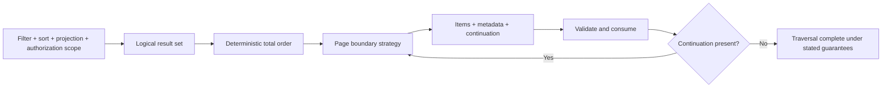
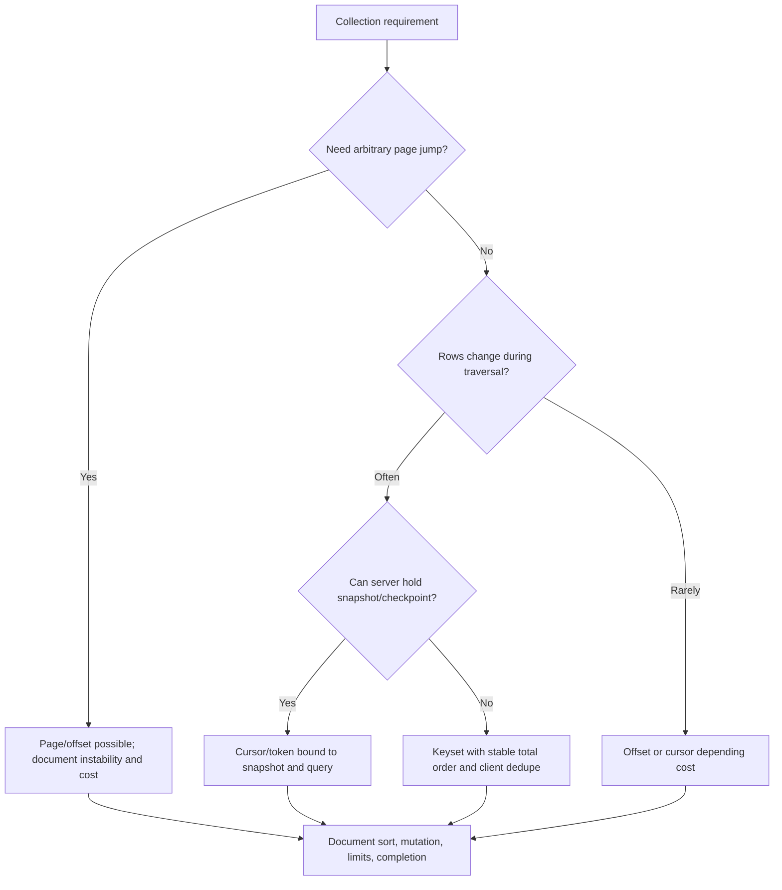
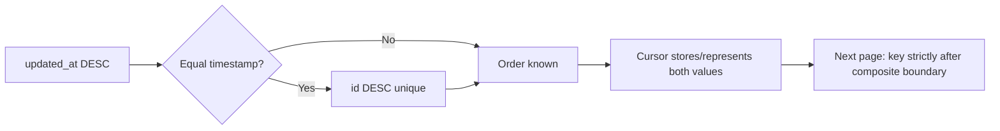
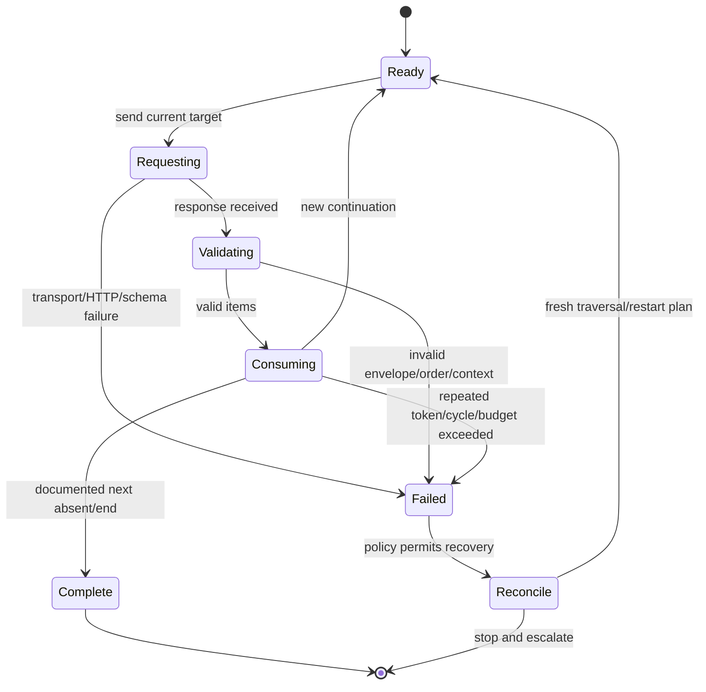
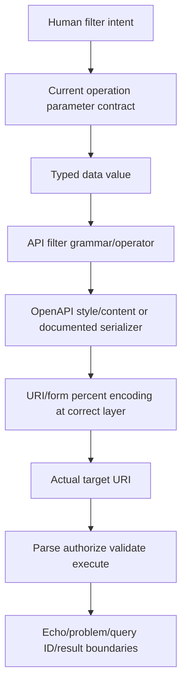
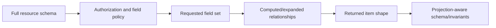
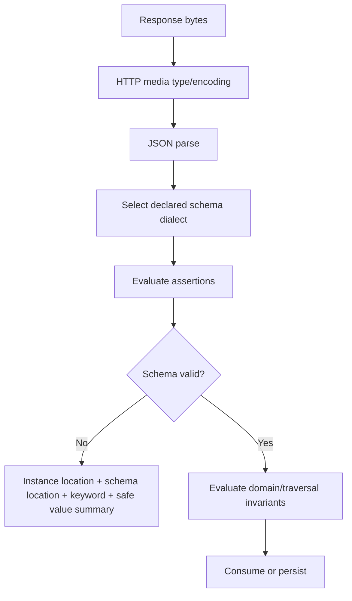
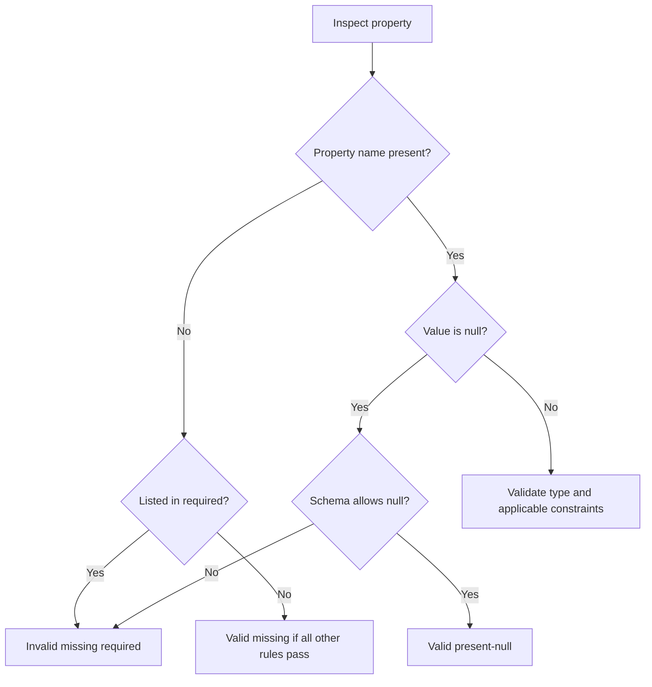
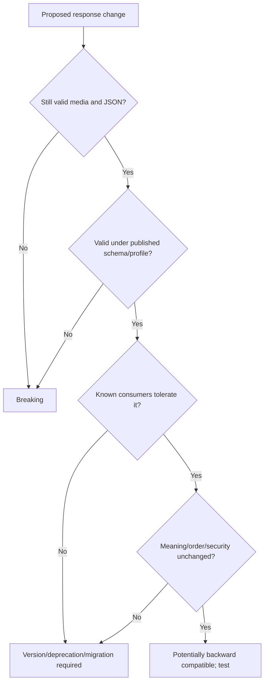
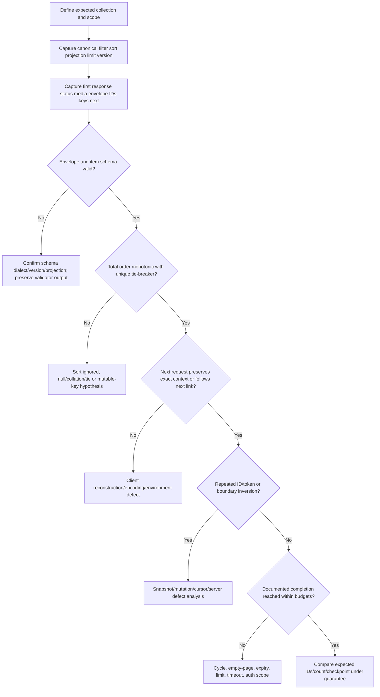

# Part 086 - Pagination Filtering Sorting and Schemas

> **Purpose:** Build a rigorous mental model for collection APIs: how a client selects a bounded page, follows continuation information, preserves stable ordering, expresses filters and projections, validates each response against an explicit schema, and recognizes gaps, duplicates, null/missing confusion, and compatibility drift.
>
> **Artifact label:** **Offline synthetic contract lab** using a twelve-row case ledger, paper HTTP responses, optional built-in PowerShell/Python parsing, and no network. No credential, vendor endpoint, customer data, package installation, destructive request, or production claim is used.
>
> **Currency and source access date:** August 24, 2026.

## Section goal

By the end of this Part, you should explain why pagination is not merely “split a list every 100 rows.” You should distinguish page-number, offset/limit, keyset, cursor, token, and server-provided next-link designs; identify the ordering and snapshot assumptions beneath each; and demonstrate how insertion, deletion, mutable sort keys, expiration, scope changes, and malformed client reconstruction create duplicates or gaps. You should treat continuation values as opaque unless the contract explicitly says otherwise, preserve the original filter/sort/projection context, stop safely, detect cycles, and maintain a client-side uniqueness ledger.

You should construct filter and sort parameters from the documented grammar, not guesses. You should understand operators, repeated values, booleans, timestamps, case/collation, field selection, encoded delimiters, allowlists, cost, and authorization-before-filtering. You should know that `filter=status eq open`, `status=open`, and `filter[status]=open` are unrelated conventions unless documentation defines one. You should distinguish URL generic syntax from a specific API's query language and from OpenAPI serialization settings.

You should validate a response at several layers: HTTP/media/JSON syntax, envelope shape, item schema, cross-field invariants, and traversal invariants. You should explain JSON Schema's assertion/annotation model; `type`, `required`, `properties`, `additionalProperties`, `enum`, ranges, string constraints, arrays, composition, and formats; and the critical difference between a property being absent, present with `null`, present with an empty value, or present with a wrong type. You should evaluate additive and breaking schema evolution from the consumer's observable contract rather than assuming that “adding a field is always safe.”

The Part stays vendor-neutral. Pagination names, token structure, maximum page size, sort behavior, total counts, snapshot guarantees, schema, and evolution policy are product contracts, not universal REST behavior. Abnormal-specific details remain unknown until current approved documentation and access are available.

## JD Mapping

| Supplied role signal | Capability developed | Vendor-neutral support situation | Evidence artifact |
|---|---|---|---|
| API troubleshooting | Reconstructs collection traversal | Export misses records | Page ledger and mutation replay |
| Complex investigations | Separates query, order, page state, and schema | Duplicate or gap after update | Controlled hypothesis matrix |
| Customer communication | Requests exact pagination evidence safely | “API only returns some results” | Minimum-evidence template |
| Engineering collaboration | Supplies deterministic boundary case | Tie at page boundary | Synthetic dataset and expected sequence |
| Data/schema literacy | Validates envelope, item, and invariants | Field absent/null/type changed | Schema checklist |
| Security/privacy | Prevents data leakage via filters/fields/logged URIs | Sensitive query or over-broad projection | Query redaction ledger |
| Reliability | Handles token expiry, cycle, empty page, max bounds | Long-running sync stalls | Traversal state machine |
| Integration support | Preserves filters/sort across pages | Page 2 changes result set | Canonical query fingerprint |
| Honest positioning | Distinguishes lab knowledge from platform ownership | Interview answer | Candidate boundary statement |
| Continuous learning | Verifies current API/spec dialect | Tool/schema behavior changed | Source and dialect ledger |

## Candidate honesty note

You can present pagination/filtering/schema analysis as working knowledge reinforced by an offline deterministic lab. Your production-transfer strength is enterprise troubleshooting, PowerShell-supported evidence collection, customer/partner coordination, issue scoping, escalation, and validation. You should not claim that you designed high-scale pagination, owned data contracts, administered Abnormal APIs, or knows proprietary cursor contents, filter operators, limits, retention, or ordering guarantees.

| Evidence tier | Safe wording | Boundary |
|---|---|---|
| Production transfer | “I isolate client, contract, timing, and data-boundary variables and build reproducible evidence.” | Keep historical specifics truthful |
| Working familiarity | “I understand offset, keyset, cursor, filtering, sorting, projections, OpenAPI, and JSON Schema fundamentals.” | Not platform architecture ownership |
| Local lab | “I replayed mutations over a twelve-row synthetic ledger and validated traversal invariants.” | Offline simulation only |
| Learned architecture | “Opaque continuation state and stable ordering are common resilient patterns.” | Not universal implementation claims |
| No direct experience | “I have not administered Abnormal pagination or schemas in production.” | Say directly |
| Unknown | Token lifetime, snapshot semantics, query grammar, schema dialect, limits, sort fields, totals | Verify approved current docs |

## 1. Collection retrieval is a contract, not a loop

A **collection** is a resource whose representation contains zero or more member representations, links, or summaries. **Pagination** divides a collection query result into bounded responses. A **page** is one bounded response; a **continuation** tells a client how to request another page. A **traversal** is the sequence of requests needed to consume the intended result set.

Pagination balances latency, memory, bandwidth, server work, fairness, and failure recovery. It does not by itself define what collection snapshot is being traversed, how rows are ordered, whether concurrent changes are visible, or whether a total is exact. Those are separate contract dimensions.



| Term | Plain meaning | Why it matters | Memory hook |
|---|---|---|---|
| Collection | A resource representing a group | The group has its own contract | Container, not just array |
| Page size | Requested/actual maximum members | Server can cap or vary it | Limit is a ceiling, not a promise |
| Offset | Number of ordered rows to skip | Position shifts under mutation | Count from a moving front |
| Cursor | Server-issued continuation state | Can encode a boundary/snapshot | Bookmark, usually opaque |
| Keyset | Continue after last ordered key | Stable under many inserts before boundary | Seek after key |
| Next link | Server-provided URI reference | Preserves exact serialization | Follow, validate, do not rebuild |
| Snapshot | Consistent view at a logical time/version | Defines change visibility | One photo versus live camera |
| Total order | Every pair has deterministic position | Prevents boundary ties | Sort plus unique tie-breaker |
| Projection | Selected fields returned | Changes shape/cost | Columns requested |
| Schema | Machine-processable constraints/annotations | Detects shape/type drift | Contract stencil |

### The five questions before any pagination bug

1. What exact logical query is intended: principal/tenant/resource, filters, search, sort, projection, time range, and version?
2. What deterministic order applies, including direction, null handling, collation, and unique tie-breaker?
3. What boundary mechanism applies: page, offset, keyset, cursor, token, or next URI?
4. What mutation/snapshot guarantee applies while traversal is in progress?
5. What completion and validation signals apply: next absent/null, item count, total, checkpoint, watermark, or explicit state?

## 2. Pagination strategy comparison

There is no single best strategy. The server chooses according to data volatility, query cost, storage indexes, random-access requirements, consistency, cacheability, and client needs.

| Strategy | Typical request | Boundary meaning | Strength | Main hazard |
|---|---|---|---|---|
| Page number | `page=3&page_size=50` | Conceptual offset `(3-1)*50` | Human-friendly random page | Moving data and page-base ambiguity |
| Offset/limit | `offset=100&limit=50` | Skip 100 in current order | Simple and jumpable | Deep scan cost; mutation shifts |
| Keyset/seek | `after_time=...&after_id=...` | Rows strictly after composite key | Efficient/stable with index | Must expose/order by suitable immutable key |
| Cursor | `cursor=[opaque]` | Server-defined position/context | Hides implementation; can bind query/snapshot | Expiry, tampering, wrong-context reuse |
| Continuation token | `continuation=[opaque]` | General server continuation state | Supports distributed stores | Often single-use/partition/version-specific |
| Next URI/link | Body field or HTTP Link | Server gives complete next target | Avoids client reconstruction | Must validate origin/scope and avoid leaking URI |
| Time watermark | `updated_after=...` | Changes after a timestamp/checkpoint | Incremental synchronization | Clock precision, late arrivals, tie handling |
| Hybrid | Cursor plus page-size hint | Server controls boundary; client hints size | Flexible | More state and version rules |



### Page-number questions

Is the first page 0 or 1? Is page size required, defaulted, clamped, or rejected? Can pages be empty before the end? Is page count computed from an exact total, estimate, or snapshot? Does a query beyond the end return 200 empty, 404, or another documented result? Never infer from one successful call.

### Offset questions

Does offset count logical matching items before or after authorization, filtering, deduplication, and sorting? Is maximum offset bounded? Is deep offset expensive? Does the server use a stable snapshot? Does `limit=0` mean empty, metadata-only, default, invalid, or unlimited? The contract must decide.

### Cursor/token questions

Is the value opaque? Is it bound to user, tenant, filter, sort, projection, API version, page size, region, snapshot, or expiry? Is it reusable? Can traversal resume after interruption? What status/problem type signals expiry or invalid context? Can clients persist it, and for how long? Does it contain sensitive information even if encoded? Assume sensitive and opaque until documented otherwise.

## 3. Stable ordering and total-order tie-breakers

A sort by `updated_at desc` is not necessarily a total order. If four records have the same timestamp, their relative order is undefined unless another key breaks the tie. Across requests, storage plans or concurrent writes can reorder tied records, putting one member on both pages and skipping another.

Use a deterministic composite ordering such as:

$$
(updated\_at\ DESC,\ id\ DESC)
$$

where `id` is unique and its comparison semantics are documented. The continuation boundary must use all fields that define the order.



| Sort concern | Question | Failure if omitted | Evidence |
|---|---|---|---|
| Field | Is it documented/sortable? | Ignored or rejected sort | Canonical request/spec |
| Direction | asc/desc grammar and default? | Reversed results | Boundary rows |
| Tie-breaker | Is final key unique? | Duplicate/gap | Equal-primary-key fixture |
| Null order | First/last/unspecified? | Cross-client mismatch | Null fixture |
| Collation | Case, locale, Unicode normalization? | Unstable text order | Synthetic variants |
| Mutability | Can sort field change mid-traversal? | Row crosses boundary | Mutation replay |
| Consistency | Snapshot/live? | Changes appear/disappear | Version/watermark evidence |
| Authorization | Before order/paging? | Count/leakage/missing surprises | Scope comparison |

### 🔍 Plain-English deep-dive: “Sorted” does not mean “stable”

Imagine alphabetizing support cases only by the minute they arrived. Five cases arriving at 10:04 share the same label. A clerk can place them in any order each time the stack is rebuilt. If page one ends inside that five-case tie, page two can begin from a different arrangement. A unique case ID as the final tie-breaker gives every record one deterministic slot.

The analogy stops because database collation, null handling, distributed partitions, indexing, and snapshot isolation determine actual behavior. The support question is still simple: can the contract compare every two matching records and say which comes first? If not, page boundaries are under-specified.

## 4. Offset pagination under insertion and deletion

Start with IDs ordered ascending: A, B, C, D, E, F. Page size is 2.

| Time | Request | Current ordered set | Response |
|---|---|---|---|
| T1 | `offset=0&limit=2` | A B C D E F | A B |
| T2 | insert X before A | X A B C D E F | No response yet |
| T3 | `offset=2&limit=2` | X A B C D E F | B C |

B is duplicated because offset two now starts after X and A. Conversely, if A is deleted after page one, offset two over B C D E F returns D E and skips C.

```mermaid
sequenceDiagram
    participant Client
    participant Collection
    Client->>Collection: GET offset=0 limit=2
    Collection-->>Client: [A,B]
    Note over Collection: Insert X before A
    Client->>Collection: GET offset=2 limit=2
    Collection-->>Client: [B,C]
    Note over Client: B duplicate; offset counted a changed prefix
```

Offset is not “broken”; it provides exactly the semantics the contract chooses. It is often adequate for low-volatility administrative lists, UI browsing, or snapshot-backed queries. It is weaker for long exhaustive exports from rapidly changing collections. A client-side ID set can detect duplicates but cannot prove a missing unseen record without a snapshot, later reconciliation, independent count/checksum, or stronger source guarantee.

| Mitigation | Helps with | Does not prove |
|---|---|---|
| Stable unique sort | Tie reshuffling | Prefix insertion/deletion under offset |
| Snapshot/version | Concurrent mutation | Correct authorization/filter contract |
| Keyset/cursor | Prefix movement | Mutating boundary key or server bugs |
| Client dedupe | Duplicate processing | Missing unseen rows |
| Reconciliation pass | Eventual omissions/changes | Point-in-time exactness without source support |
| Change feed/watermark | Incremental updates | Full historical snapshot unless documented |
| Smaller traversal window | Reduces exposure duration | Eliminates mutation |

## 5. Keyset and cursor boundaries

With ascending `(created_at, id)`, page one returns records through `(10:04, C)`. The next request asks for records whose composite key is strictly greater than that boundary:

$$
(created\_at > 10{:}04)\ \lor\ (created\_at = 10{:}04\ \land\ id > C)
$$

For descending order, inequalities reverse. A cursor can carry an equivalent server-controlled boundary plus query/snapshot context. The client should not decode and rebuild it unless the contract explicitly makes its structure public.

```mermaid
sequenceDiagram
    participant C as Client
    participant A as Collection API
    C->>A: GET filter=... sort=updated_at desc,id desc limit=3
    A-->>C: items + next_cursor=opaque-1
    C->>C: Validate item order, schema, IDs; store query fingerprint
    C->>A: GET cursor=opaque-1
    A->>A: Validate scope, query, version, expiry, boundary
    A-->>C: items + next_cursor=opaque-2
    C->>C: Detect cycle/reuse and continue within budgets
```

### Cursor rules for clients

1. Treat the cursor/token as an opaque string and sensitive operational metadata.
2. Prefer the server-provided next link/target exactly where the contract permits.
3. If the next response requires original query parameters too, preserve them exactly; if the token replaces them, do not duplicate them. Follow documentation.
4. Bind local traversal state to principal alias, tenant alias, API version, normalized query, sort, projection, and page-size request.
5. Do not use a token from one filter, environment, tenant, user, or version in another.
6. Enforce maximum pages, items, elapsed time, bytes, retries, and repeated-token detection.
7. On expiry/invalid token, do not silently restart and append to the same output. Decide whether to discard/reconcile/restart according to job semantics.
8. Do not log raw tokens. Store a one-way diagnostic fingerprint only if approved and useful.

### 🔍 Plain-English deep-dive: A cursor is a bookmark, not a page number

A page number says “count a fixed number from the front.” A cursor commonly says “continue from this server-understood position in this query.” It may also carry or reference a snapshot, partition state, expiry, or integrity protection. Editing it because its base64 text seems readable is like rewriting a library barcode after noticing digits in it: the apparent structure is not a supported contract.

The analogy stops because some APIs intentionally publish keyset parameters. The rule is contract-driven: opaque means preserve; documented fields mean construct and encode exactly as specified.

## 6. Server-provided next links and Web Linking

Continuation can appear in the JSON envelope, a response field, an HTTP `Link` field with a registered or documented relation such as `next`, or another vendor-defined place. RFC 8288 defines generic typed links and Link field serialization, not a universal pagination envelope.

| Form | Synthetic example | Client action | Caution |
|---|---|---|---|
| JSON next URI | `"next":"/cases?cursor=opaque"` | Resolve per contract/base URI | Validate authority/origin and scope |
| JSON cursor | `"next_cursor":"opaque"` | Put in documented parameter | Do not decode/log |
| HTTP Link | `</cases?cursor=opaque>; rel="next"` | Parse Link syntax, choose relation | Commas/quotes/repeated fields need parser |
| Links object | `"links":{"next":...}` | Follow documented member | Shape/version varies |
| Token header | Product-defined header | Use only documented semantics | Not standardized by HTTP alone |
| Absent/null next | Contract-specific completion | Stop only according to contract | Empty string/field missing may differ |

Before following a next URI, validate that it is permitted by the API contract, uses the expected secure origin/environment, does not downgrade scheme, does not include userinfo, does not cross into an unauthorized host, and retains intended version/scope. Avoid writing full continuation URIs to ordinary logs because query strings can contain sensitive filters, identifiers, or opaque state.

## 7. Completion, empty pages, cycles, and totals

Naive loops stop when `items.length < requested_limit`. That is unsafe if the server caps page size below the requested value, applies post-filter authorization, returns partial pages, or has adaptive limits. Prefer the documented continuation signal.



| Edge case | Safe response |
|---|---|
| Empty page with next present | Continue if contract permits; record anomaly/cost |
| Same next token repeated | Stop as cycle; do not spin |
| Next points to current URI | Stop and escalate |
| Next absent | Complete only if documented |
| Next null | Distinguish from missing if schema does |
| Total changes | Expected in live view; investigate under snapshot guarantee |
| Total smaller than consumed | Metadata drift/estimate/scope issue; do not discard evidence |
| Actual page > maximum | Contract or parsing violation |
| Item repeated | Dedupe if policy allows; preserve boundary evidence |
| Sort inversion | Stop because keyset traversal may become unsafe |

**Total count** can mean exact count at a snapshot, exact count at response time, approximate count, accessible count after authorization, or a separately cached estimate. It can be expensive and absent. A client must not use it as its only completion rule unless contractually guaranteed with the traversal.

## 8. Filtering fundamentals

A **filter** narrows matching records by predicates. An **operator** defines the comparison: equality, inequality, membership, containment, prefix, time range, existence, logical AND/OR, or a product-specific search operation. HTTP's query component carries data; HTTP does not define a universal filter language.

| Filter dimension | Questions to resolve | Common symptom |
|---|---|---|
| Field name | Exact API field or display label? Case-sensitive? | Zero results or ignored filter |
| Operator | `eq`, `=`, bracket, function, suffix? | 400/422 or broad result |
| Type | String, number, boolean, timestamp, enum, array? | String/boolean mismatch |
| Repetition | OR, AND, last-wins, array, invalid? | Missing/extra records |
| Encoding | Which delimiters are syntax versus data? | Parse error/wrong value |
| Time | UTC/offset, inclusive boundaries, precision? | Boundary gaps |
| Text | Case/collation/normalization/substring? | Inconsistent matches |
| Null/existence | Missing, null, empty, unset distinct? | Unexpected inclusion |
| Authorization | Filter before/after accessible-set selection? | Counts differ safely |
| Cost | Indexed? max clauses/window? | Latency/429/timeout |



### Filtering examples that must not be conflated

```text
?status=open
?status=open&status=pending
?status=open,pending
?filter=status%20eq%20%22open%22
?filter[status]=open
?where={...encoded JSON...}
```

Each can be correct for a specific contract. None is universally correct. OpenAPI Parameter Objects can specify location, schema/content, style, explode, and encoding. Even then, tool-version interoperability matters, especially for complex query values. Preserve both the typed data and serialized value in tests.

### Time filters

Define field semantics (created, updated, observed, ingested), instant syntax, timezone, precision, inclusivity, and delayed-arrival behavior. A half-open interval is often composable:

$$
start \leq t < end
$$

but only use it if documented. A source that stores milliseconds may round a nanosecond input. A record arriving late with an old event timestamp may not appear in an `event_time > watermark` sync. Incremental integration design must choose an authoritative checkpoint, overlap/reconciliation window, and dedupe key.

### 🔍 Plain-English deep-dive: Encoding and filter grammar are different layers

Suppose the filter language uses a space and quotation marks as syntax. URI serialization then represents those characters safely. `%20` is not the filter operator; it is an encoded space. Decoding once should recover the filter expression. Double encoding can leave `%20` as literal text, while failing to encode delimiters can cause a query parser to split one value into several parameters.

Think of a message written in a language and then placed in an addressed envelope. Grammar determines the sentence; encoding makes the envelope travel safely. The analogy stops because form-style query processing gives `+` a special space meaning and API frameworks can parse before the application receives values.

## 9. Sorting fundamentals

Sort contracts commonly define field allowlists, direction notation, multi-field ordering, default order, null placement, text collation, and unsupported-field behavior. Some APIs ignore invalid sort terms; others reject them. Silent fallback is dangerous because a cursor might no longer match the intended order.

| Sort syntax example | Possible meaning | Must verify |
|---|---|---|
| `sort=updated_at` | Ascending default | Default direction |
| `sort=-updated_at` | Descending prefix | Whether minus syntax exists |
| `sort=updated_at:desc` | Colon grammar | Encoding and multiple terms |
| `sort=updated_at,id` | Ordered field list | Shared/per-field direction |
| repeated `sort` | Multiple keys or last-wins | Parameter repetition semantics |
| `orderBy=...` | Product-specific | Exact casing/name |

A support reproduction should include at least two records tied on the primary key, one null if permitted, mixed-case text if text sorting matters, and IDs on both sides of a page boundary. Record the exact returned key sequence, not screenshots alone.

## 10. Field selection and projections

A **projection** asks the service to return selected fields, often through `fields`, `select`, `include`, `expand`, sparse fieldsets, or product-specific syntax. Projection reduces transfer and parsing cost but can alter joins/computation, omit fields needed for dedupe, and produce different authorization behavior.



| Projection risk | Example | Guardrail |
|---|---|---|
| Missing identity | Client requests only `status` | Always include stable ID/checkpoint fields |
| Field-level denial | Sensitive field silently omitted | Document permission-aware shape |
| Expansion explosion | Include nested history/users | Cost/depth/count limits |
| Null versus omission | Unavailable field omitted | Projection-aware schema |
| Schema mismatch | Validator expects full resource | Separate response schema/profile |
| Query leakage | Field names reveal capability | Treat metadata according to policy |
| Cache variation | Different fields share URI/cache key incorrectly | Correct cache/query semantics |

Projection is not authorization. The server must enforce field/resource policy independently of what the client asks. A client asking for fewer fields does not prove broader fields are inaccessible, and asking for a prohibited field must not leak its value through errors, totals, sorting, or timing.

## 11. JSON Schema as a validation language

JSON Schema describes and validates JSON-instance structure using a selected dialect. Draft 2020-12 is a current published draft family; schemas should declare `$schema` when practical. A schema is itself JSON. Assertions evaluate validity; annotations carry information used by tooling or applications. Some keywords, notably `format` under the default vocabulary, may be annotations rather than enforced assertions depending on dialect and validator configuration.



Synthetic collection envelope schema:

```json
{
  "$schema": "https://json-schema.org/draft/2020-12/schema",
  "$id": "https://schemas.example.test/case-page-086",
  "type": "object",
  "required": ["items", "page"],
  "properties": {
    "items": {
      "type": "array",
      "maxItems": 100,
      "items": { "$ref": "#/$defs/case" }
    },
    "page": {
      "type": "object",
      "required": ["size"],
      "properties": {
        "size": { "type": "integer", "minimum": 0, "maximum": 100 },
        "next": { "type": ["string", "null"], "format": "uri-reference" }
      },
      "additionalProperties": false
    }
  },
  "additionalProperties": false,
  "$defs": {
    "case": {
      "type": "object",
      "required": ["id", "status", "updated_at", "score"],
      "properties": {
        "id": { "type": "string", "pattern": "^CASE-[0-9]{3}$" },
        "status": { "enum": ["open", "pending", "closed"] },
        "updated_at": { "type": "string", "format": "date-time" },
        "score": { "type": "integer", "minimum": 0, "maximum": 100 },
        "owner": { "type": ["string", "null"], "maxLength": 40 },
        "tags": {
          "type": "array",
          "uniqueItems": true,
          "items": { "type": "string", "minLength": 1, "maxLength": 20 }
        }
      },
      "additionalProperties": false
    }
  }
}
```

This teaching schema is intentionally strict. Strict `additionalProperties: false` can catch drift but also makes additive server fields breaking for that consumer. Whether strictness is appropriate depends on compatibility policy. `$id` uses a reserved synthetic authority and is an identifier, not a live fetch target.

## 12. Core schema keywords and precise meanings

| Keyword | Plain meaning | Important caveat |
|---|---|---|
| `$schema` | Declares dialect/meta-schema URI | Validator must support it |
| `$id` | Establishes schema resource identifier/base | Reference resolution changes with it |
| `$ref` | Applies referenced schema | Resolve URI/base correctly; do not string-splice |
| `type` | Restricts JSON instance type(s) | Constraints like `pattern` do not imply type |
| `properties` | Applies subschemas to named properties if present | Does not make them required |
| `required` | Requires listed property names on an object | Says nothing about null unless type excludes it |
| `additionalProperties` | Applies schema/allows/disallows unlisted properties | Composition can surprise careless designs |
| `enum` | Value must equal one listed value | New enum value can break strict clients |
| `const` | Value must equal one value | Useful discriminator/version constraint |
| `minimum`/`maximum` | Inclusive numeric bounds | Numbers and integer mathematical model matter |
| `minLength`/`maxLength` | String length constraints | Unicode length interpretation is spec/tool-defined |
| `pattern` | Regex constraint on strings | Not automatically anchored; Unicode regex expectations |
| `items` | Schema for array items after prefix items | Draft version matters |
| `prefixItems` | Positional tuple schemas | New in modern draft design |
| `minItems`/`maxItems` | Array cardinality bounds | Page size may differ from item count semantics |
| `uniqueItems` | Array elements must be unique by JSON equality | Cost and object equality implications |
| `allOf` | All subschemas must validate | Composition, not inheritance by itself |
| `anyOf` | At least one validates | Multiple can validate |
| `oneOf` | Exactly one validates | Overlap causes invalidity/performance complexity |
| `format` | Semantic annotation/possible assertion | Enforcement depends on vocabulary/configuration |
| `examples` | Annotation examples | Does not enforce validity by itself |
| `default` | Annotation/default information | Validator generally does not insert values |

### Schema validation layers

1. Select the correct schema for operation, status, media type, API version, and projection.
2. Parse the schema and resolve references under the declared dialect/base URI.
3. Parse response JSON; duplicate-name handling belongs to JSON parser/interoperability policy before instance validation.
4. Evaluate schema and capture standardized validator output where available.
5. Evaluate semantic invariants not expressible or intentionally absent from the schema: `page.size == items.length`, order monotonicity, cross-field date relation, unique IDs across pages, query-scope consistency, and completion rules.

## 13. Required, optional, null, missing, empty, and default

These states are not interchangeable.

| JSON state | Example | Meaning determined by | Schema expression |
|---|---|---|---|
| Missing | `{}` lacks `owner` | Contract/application | Omit from `required` |
| Present null | `"owner": null` | Contract/application | Include `"null"` in type |
| Empty string | `"owner": ""` | Contract; may be valid/invalid | `minLength` controls |
| Empty array | `"tags": []` | Known collection with zero members | Array + cardinality |
| Empty object | `"details": {}` | Present object with no properties | Object schema |
| Zero | `"score": 0` | Numeric value, not missing | Number/integer bounds |
| False | `"active": false` | Boolean value, not missing | `type: boolean` |
| Wrong type | `"score": "0"` | Contract violation or version mismatch | `type: integer` rejects |
| Default annotation | property missing, schema says default | Consumer/application policy | `default` does not generally mutate instance |



### 🔍 Plain-English deep-dive: Required and non-null answer different questions

`required: ["owner"]` asks whether the property name exists. `type: "string"` asks whether the present value is a string. A required property can legally contain null only if its schema allows null; an optional property can still be invalid when present with null if null is not allowed.

Think of a form: a required box must appear and be filled according to its value rule. An optional box may be omitted, but if someone fills it with the wrong kind of value, it still fails. The analogy stops because JSON has explicit null, empty strings, empty containers, and false/zero values with distinct equality.

## 14. Envelope, item, semantic, and traversal invariants

Schema validity is necessary but often insufficient.

| Validation layer | Example check | Failure hypothesis |
|---|---|---|
| HTTP | 200, correct media type, complete content | Gateway/error HTML/truncation |
| JSON syntax | Parses as one JSON value | Malformed/truncated/encoding issue |
| Envelope schema | `items` array and `page` object | Version/envelope drift |
| Item schema | ID/status/time/score types | Producer/serialization drift |
| Page invariant | `page.size == len(items)` | Metadata defect or interpretation mismatch |
| In-page order | Composite keys monotonic | Sort ignored/unstable |
| Cross-page boundary | First key strictly after prior boundary | Duplicate/order defect |
| Traversal uniqueness | No repeated ID unless updates contract allows | Mutation/cursor/client reuse |
| Query fingerprint | Filter/sort/projection unchanged | Client reconstruction error |
| Completion | Documented next signal | Infinite/premature stop |
| Authorization | All returned items within approved scope | Security incident path |

When a record can legitimately change and reappear in a change feed, uniqueness may use `(record_id, version)` or event ID instead of record ID. In a snapshot export, repeated stable ID is more suspicious. Define the invariant from the operation semantics.

## 15. Schema evolution and compatibility

Evolution is evaluated from the consumer's assumptions, validator strictness, generated models, query/projection, and behavior. A change can be additive for a tolerant map-based client and breaking for a strict validator or exhaustive enum switch.



| Change | Often | Why it can still break | Safer handling |
|---|---|---|---|
| Add optional property | Additive | `additionalProperties:false`, generated model, signature/canonicalization | Tolerant readers, contract tests, version policy |
| Add enum value | Breaking for exhaustive consumers | Unknown branch/deserialization | Unknown-value strategy or version |
| Make optional required | Breaking | Old payloads/servers/clients omit | Deprecate, populate, observe, version |
| Allow null | Potentially breaking | Consumer dereferences/string methods | Separate absent/null semantics, migrate |
| Stop allowing null | Breaking for senders/fixtures | Existing instances invalid | Transition/version |
| Widen number range | Can break target runtime | Overflow/precision | String ID/decimal policy, bounds |
| Integer to string | Breaking | Type mismatch/sort changes | New field/version |
| Rename property | Breaking | Old name missing | Dual-read/dual-write period if safe |
| Change format only | Behavior-dependent | Validators/code generators enforce differently | Declare enforcement; test tools |
| Reorder array | Semantic breaking if order meaningful | Consumers select first | Document order or model set explicitly |
| Change default sort | Behavioral breaking | Pagination and “latest” assumptions | Explicit client sort/version |
| Change null to missing | Semantic breaking | Patch/projection/state meaning | Document and version/profile |
| Add required response header | Client compatibility varies | CORS/gateway/tool access | Rollout observation and docs |
| Change cursor lifetime | Operational breaking | Jobs cannot finish/resume | Communicate budgets/resume policy |

**Postel-style tolerance** is not permission to ignore contract violations. A robust consumer can ignore unknown additive fields while strictly validating fields it relies on, status/media, identities, boundaries, and security invariants. A producer should not emit ambiguous or undocumented data because clients happen to accept it.

## 16. OpenAPI descriptions for collection parameters and schemas

OpenAPI is a language-agnostic interface description. It can describe operations, parameter locations/serialization, response codes, media types, headers, links, and schemas. It does not make runtime behavior true. The live response and approved server evidence demonstrate execution.

Synthetic fragment:

```yaml
openapi: 3.2.0
info:
  title: Synthetic Case Collection
  version: 1.0.0
paths:
  /cases:
    get:
      parameters:
        - name: status
          in: query
          style: form
          explode: true
          schema:
            type: array
            items:
              enum: [open, pending, closed]
        - name: sort
          in: query
          schema:
            type: string
            enum: [updated_at, -updated_at]
        - name: cursor
          in: query
          schema:
            type: string
        - name: limit
          in: query
          schema:
            type: integer
            minimum: 1
            maximum: 100
      responses:
        '200':
          description: One bounded page
          content:
            application/json:
              schema:
                $ref: '#/components/schemas/CasePage'
components:
  schemas:
    CasePage:
      type: object
      required: [items, page]
      properties:
        items:
          type: array
          items:
            $ref: '#/components/schemas/Case'
        page:
          type: object
          required: [size]
          properties:
            size:
              type: integer
              minimum: 0
            next:
              type: [string, 'null']
              format: uri-reference
    Case:
      type: object
      required: [id, status, updated_at, score]
      properties:
        id: { type: string }
        status: { enum: [open, pending, closed] }
        updated_at: { type: string, format: date-time }
        score: { type: integer, minimum: 0, maximum: 100 }
```

The description still needs prose for mutation/snapshot guarantees, tie-breakers, cursor opacity/lifetime, completion, authorization, cost, total semantics, errors, and version compatibility. Some facts can be extensions, but clients must understand the owning specification.

## 17. Worked synthetic dataset

Use this ordered source for the lab. All values are fictional.

| Row | ID | Status | Updated UTC | Score | Owner state | Tags |
|---:|---|---|---|---:|---|---|
| 1 | CASE-001 | open | 10:09:00Z | 91 | `alpha` | api,urgent |
| 2 | CASE-002 | pending | 10:08:00Z | 72 | null | api |
| 3 | CASE-003 | open | 10:08:00Z | 72 | missing | schema |
| 4 | CASE-004 | closed | 10:07:00Z | 65 | empty string | archive |
| 5 | CASE-005 | open | 10:06:00Z | 65 | `beta` | api,schema |
| 6 | CASE-006 | pending | 10:05:00Z | 50 | `beta` | retry |
| 7 | CASE-007 | open | 10:04:00Z | 50 | `gamma` | paging |
| 8 | CASE-008 | open | 10:04:00Z | 40 | `Alpha` | paging |
| 9 | CASE-009 | closed | 10:03:00Z | 40 | null | archive |
| 10 | CASE-010 | pending | 10:02:00Z | 20 | `delta` | filter |
| 11 | CASE-011 | open | 10:01:00Z | 0 | `delta` | filter |
| 12 | CASE-012 | closed | 10:00:00Z | 0 | missing | schema |

Canonical order is `(updated_at DESC, id ASC)` for teaching. Page size 3 gives boundaries after CASE-003, CASE-006, CASE-009, and CASE-012. The owner column intentionally distinguishes null, missing, and empty. The duplicated timestamps/scores create ties.

### Mutation rounds

| Round | Mutation after first page | Offset expected risk | Keyset/cursor question |
|---|---|---|---|
| A | Insert CASE-000 at 10:10 | Duplicate old prefix member | New row is before boundary; snapshot/live policy decides visibility |
| B | Delete CASE-001 | Skip shifted member | Boundary remains meaningful if keys immutable |
| C | CASE-006 updated to 10:11 | Row crosses from later to before boundary | Could be missed or duplicated without snapshot/version feed |
| D | Add CASE-013 at 10:04 tie | Boundary needs ID tie-breaker | Composite predicate placement |
| E | Change filter open to pending on page 2 | Client context error | Token should reject if query-bound |
| F | Repeat same cursor | Infinite loop risk | Client repeated-token guard |
| G | Return empty page with next | Stop-rule test | Contract decides continue |
| H | Add unknown `severity` field | Strict schema failure | Compatibility/tolerant-reader policy |

## 18. Troubleshooting decision tree



### Minimum evidence for a pagination incident

| Evidence | Capture | Do not capture/share casually |
|---|---|---|
| Scope | Tenant/user/resource aliases and permission category | Real credential or full identity unnecessarily |
| Query | Parameter names, typed values with safe aliases, exact encoding, sort/projection/version | Sensitive query values/raw token |
| Pages | UTC, page index, status, count, first/last composite key, ID fingerprints | Full customer items |
| Continuation | Presence, length, approved hash/fingerprint, repeated/equal flag | Raw cursor/next URI if sensitive |
| Schema | Dialect/schema version, keyword, instance/schema path | Sensitive failed instance value |
| Mutation | Known writes/updates during window | Unapproved production mutation |
| Completion | Reason loop stopped, budgets, total semantics | Assumption disguised as guarantee |
| Correlation | Request/trace IDs and layer/respondent | Secrets/internal topology outside approved channel |

## 19. Common failure modes

| Shortcut/failure | Why it fails | Better practice |
|---|---|---|
| Increment page until short page | Server can cap/return partial pages | Use documented continuation |
| Sort only by timestamp | Ties cross boundaries | Add documented unique tie-breaker |
| Decode/edit cursor | Structure is not contract | Preserve opaque token |
| Reuse cursor with new filter | Continuation may be query-bound | New traversal; bind fingerprint |
| Rebuild next URI manually | Loses encoding/default/version | Follow server link where allowed |
| Log full next URI | Query/token can be sensitive | Redacted structure/fingerprint |
| Dedupe and declare success | Dedupe cannot reveal omissions | Reconcile under source guarantee |
| Trust total as fixed | Can be estimate/live/cached | Document semantics and timestamp |
| Treat null as missing | Different states | Schema and application rules |
| Treat `default` as inserted | JSON Schema annotation generally | Application-owned defaulting |
| Assume `format` always validates | Dialect/config varies | Record validator behavior |
| Add `additionalProperties:false` everywhere | Breaks additive evolution/composition | Use intentionally by compatibility policy |
| Ignore unknown enum value by crash | Producers evolve | Unknown branch/version policy |
| Build filter strings manually | Grammar/encoding injection and mismatch | Structured documented serializer |
| Filter secrets in query | URIs are logged/shared | Avoid or use approved contract |
| Claim Abnormal behavior | No approved evidence | Label unknown and verify docs |

## Safe local lab: The Twelve-Row Traversal and Schema Ledger 086

### Prerequisites

- Learner-owned workspace; paper/spreadsheet/Markdown is sufficient.
- Optional built-in PowerShell or Python 3 only if already available for JSON parsing/sorting. No packages or validators need to be installed.
- The twelve synthetic rows and eight mutation rounds in Section 17.
- Files, if used: `dataset-086.json`, `schema-086.json`, `pages-086.md`, `mutations-086.md`, and `cleanup-086.md` in a temporary local folder.
- No network, HTTP listener, public endpoint, vendor documentation requiring login, credential, customer record, real tenant/user/message, or production mutation.
- Artifact label: **offline synthetic pagination/filter/sort/schema lab; no Abnormal access or production behavior claim**.

### Lab procedure

1. Record start UTC, scope, artifact label, tools/versions, and no-network/no-secret statement.
2. Transcribe the twelve records into valid JSON, representing owner as string, null, missing, or empty exactly as listed. Parse it with built-in tooling or inspect the paper representation.
3. Write the canonical query: status unrestricted, sort `(updated_at DESC, id ASC)`, full teaching projection, page size 3, snapshot S0.
4. Divide S0 into four expected pages. Record each page's IDs, first/last composite key, item count, unique-ID running count, and synthetic continuation label C1-C3.
5. Prove within-page and cross-page monotonic order. Explain why the two 10:08 and two 10:04 records need ID tie-breaking.
6. Simulate page-number and offset traversal. For each request, write the conceptual offset and result.
7. Replay mutation A after page one and compute offset page two. Mark duplicate(s) and explain prefix shift.
8. Reset to S0. Replay mutation B and compute offset page two. Mark missing row and explain deletion shift.
9. Reset to S0. Write a keyset predicate after page one using both `updated_at` and `id`, with correct descending/ascending logic. Select page two manually.
10. Replay mutations A and B under that keyset boundary. State which new/deleted records can be visible and which guarantee is still unknown without snapshot semantics.
11. Replay mutation C, where CASE-006's sort key moves before the prior boundary. Explain why immutable/stable sort keys or snapshot/change-feed semantics matter.
12. Replay mutation D by adding CASE-013 at 10:04. Place it using ID ordering and show page boundary behavior.
13. Create a cursor ledger with query fingerprint, token aliases, token equality flag, page count, item count, elapsed/byte budgets, and stop reason. Never create a real token.
14. Replay E-G: changed filter, repeated cursor, and empty page with next. For each, choose stop/continue/escalate according to an explicitly invented teaching contract and label that assumption.
15. Apply three filters to S0: `status=open`; `score>=50`; and open AND updated in `[10:04,10:09)`. List exact expected IDs and boundary inclusivity.
16. Serialize the same fictional status filter in three different grammars from Section 8. Explain why they are not interchangeable and identify grammar versus URI-encoding characters.
17. Sort S0 by score descending only and identify ties. Add ID ascending and produce a total order. Then discuss owner text sort without assuming null/case/collation rules.
18. Define two projections: `{id,status}` and `{id,status,updated_at,score}`. Identify which one supports the canonical traversal boundary and schema validation.
19. Copy the JSON Schema from Section 11 into `schema-086.json` if using files. Inspect `$schema`, `$id`, required, properties, enum, ranges, owner union, arrays, and strict additional properties.
20. Build eight instance cards: fully valid; owner missing; owner null; owner empty; score string; unknown status; missing ID; extra severity. Predict schema result and keyword/path.
21. Note that `format: date-time` enforcement depends on validator configuration. Since no dependency is installed, validate timestamp shape conceptually and record the evidence ceiling.
22. Test envelope invariants on four paper pages: correct; `page.size` mismatched; duplicate ID across pages; sort inversion. Separate schema-valid from semantic-invalid cases.
23. Replay mutation H, adding `severity`. Evaluate under strict schema and tolerant consumer policies. Classify compatibility for generated/exhaustive clients.
24. Complete the schema evolution matrix in Section 15 with one consumer example and migration for every row.
25. Write one escalation package for “CASE-006 missing after page one” containing only synthetic IDs, UTC, query, composite boundaries, mutation assumption, token aliases, schema result, and exact ask.
26. Deliver a four-minute explanation: offset mutation, total-order tie, cursor opacity, required versus null, and why validation exceeds JSON parsing.
27. Delete temporary JSON/Markdown files or retain only a minimized synthetic worksheet according to local policy. Record end UTC and cleanup statement.

### Expected evidence

- Exact four-page S0 ledger with composite boundaries and uniqueness count.
- Offset insertion duplicate and deletion gap calculations.
- Keyset composite predicate and mutation analysis.
- Cursor state/budget/cycle/query-fingerprint ledger using aliases only.
- Exact filtered ID sets with time-boundary reasoning.
- Three non-equivalent filter serializations with encoding-layer explanation.
- Primary-only and tie-broken sort sequences.
- Projection comparison tied to identity and continuation.
- Eight schema instance predictions and keyword/path reports.
- Envelope versus semantic/traversal invariant matrix.
- Schema-evolution compatibility matrix and migration reasoning.
- One sanitized synthetic escalation package and spoken explanation.

### Cleanup and privacy

- Delete temporary dataset, schema, page, mutation, command, output, and screenshot files unless the minimized synthetic worksheet is intentionally retained.
- Confirm no listener/process/network request/package installation occurred.
- Confirm no Authorization, token/cursor, cookie, API key, password, certificate, customer data, real tenant/user/message, internal host, vendor endpoint, or production identifier was created or copied.
- Confirm no system proxy, DNS, firewall, route, certificate store, execution policy, environment, browser setting, or production data changed.
- Do not upload the synthetic dataset to an external schema validator; local/paper inspection is sufficient.
- Record: `Twelve-Row Traversal and Schema Ledger 086 completed offline with synthetic data; no network, credential, customer data, dependency installation, destructive request, or Abnormal behavior claim.`

### Validation rubric

| Dimension | Fail | Developing | Pass |
|---|---|---|---|
| Pagination model | “Loop pages” | Names strategies | Explains boundary, order, snapshot, mutation, completion, budgets |
| Offset mutations | Guesses | Finds duplicate | Calculates duplicate and gap with exact prefix shift |
| Stable sorting | Timestamp only | Adds second field | Proves total order, direction, null/collation/mutability questions |
| Cursor safety | Decodes/logs token | Preserves token | Binds opaque alias to query/scope/version and detects cycles/expiry |
| Filtering | Invents syntax | Copies example | Separates typed value, grammar, serialization, encoding, auth, cost |
| Projection | Requests fewer fields | Lists fields | Preserves identity/boundary and uses projection-aware schema |
| JSON Schema | “Checks JSON” | Uses type/required | Records dialect, references, assertions/annotations, output/evidence ceiling |
| Null/missing | Treats alike | Defines both | Tests absent/null/empty/zero/false/default/wrong type distinctly |
| Invariants | Schema only | Checks count | Checks HTTP, envelope, item, order, boundary, uniqueness, context, completion |
| Evolution | “Additive is safe” | Lists changes | Evaluates consumer strictness, enums, semantics, migration/version |
| Privacy | Raw URIs/tokens | Masks value | Uses synthetic aliases/fingerprints, minimizes artifacts, verifies cleanup |
| Honesty | Claims platform design | Says lab | Separates production transfer, familiarity, offline lab, Abnormal unknowns |

## Official Source Anchors - August 24, 2026

| Official or primary source | Topic anchored | Boundary |
|---|---|---|
| [RFC 9110 - HTTP Semantics](https://www.rfc-editor.org/rfc/rfc9110.html) | Request target/query context, methods, response semantics, fields, status, URI privacy | Does not define universal pagination/filter grammar |
| [RFC 3986 - URI Generic Syntax](https://www.rfc-editor.org/rfc/rfc3986.html) | URI components, percent encoding, references/resolution | API query semantics remain application-defined |
| [RFC 8288 - Web Linking](https://www.rfc-editor.org/rfc/rfc8288.html) | Typed links and HTTP Link field serialization | `next` use/envelope still must be documented |
| [IANA Link Relations Registry](https://www.iana.org/assignments/link-relations/link-relations.xhtml) | Registered relation names/current references | Registration does not impose an API pagination model |
| [RFC 8259 - JSON](https://www.rfc-editor.org/rfc/rfc8259.html) | JSON syntax/types/interoperability | Does not define domain schema |
| [JSON Schema Draft 2020-12](https://json-schema.org/draft/2020-12) | Current published draft family, meta-schema/vocabularies | Validator support/configuration varies |
| [JSON Schema Core 2020-12](https://json-schema.org/draft/2020-12/json-schema-core.html) | Dialects, vocabularies, identifiers, references, evaluation | Read with validation specification |
| [JSON Schema Validation 2020-12](https://json-schema.org/draft/2020-12/json-schema-validation.html) | Type/number/string/array/object assertions and annotations | `format` behavior depends on vocabulary/configuration |
| [OpenAPI Specification 3.2.0](https://spec.openapis.org/oas/latest.html) | Current language-agnostic HTTP API description, parameters, links, schemas | Description is design-time; runtime needs evidence |
| [RFC 6901 - JSON Pointer](https://www.rfc-editor.org/rfc/rfc6901.html) | Locations within JSON documents | Not a query/filter language |
| [RFC 6570 - URI Template](https://www.rfc-editor.org/rfc/rfc6570.html) | URI template expansion used by OpenAPI serialization concepts | Does not define parsing/general filter semantics |
| [RFC 9264 - Linkset](https://www.rfc-editor.org/rfc/rfc9264.html) | Link set media types/modeling context | Optional; not universal collection envelope |

### Source-use discipline

- Use RFC 9110 rather than obsolete RFC 7231 for current HTTP semantics.
- Treat OpenAPI 3.2.0 as current at the source date; record the exact OpenAPI version a real document declares.
- Treat JSON Schema dialect as explicit; do not apply Draft 2020-12 behavior to older schemas without confirmation.
- Do not infer filter syntax, sort grammar, page size, token contents, total semantics, snapshot behavior, or completion from HTTP/REST alone.
- Follow server-provided links only under the approved contract and validate target authority/scheme/scope.
- Treat cursor, next URI, filters, projections, IDs, and validation failures as potentially sensitive.
- Keep named-vendor examples out of universal claims; vendor documentation can illustrate only that vendor/version.
- Verify Abnormal behavior through current approved documentation and operational evidence after authorization.

## Likely Interview Questions

### Q1. Why can offset pagination produce duplicates or gaps?

**Model answer:** Offset counts rows from the current ordered prefix. If a row is inserted before the boundary after page one, the same prior row can shift into page two; if a prior row is deleted, an unseen row can shift before the next offset and be skipped. Stable sorting removes tie reshuffling but not prefix movement. For exhaustive volatile traversal I prefer documented cursor/keyset or snapshot semantics plus reconciliation.

### Q2. What makes a pagination sort stable enough for boundaries?

**Model answer:** It needs a deterministic total order: documented fields and direction, explicit null/collation behavior where relevant, and a final unique tie-breaker. The continuation must represent all ordering fields. I also ask whether sort keys can mutate and whether the traversal is snapshot or live, because a record crossing the boundary can still be duplicated or missed.

### Q3. How do you handle an opaque cursor safely?

**Model answer:** I preserve it exactly, avoid decoding/editing/logging it, and bind a local alias or approved fingerprint to principal, tenant, API version, filter, sort, projection, and traversal. I detect repeated tokens and enforce page/item/time/byte budgets. I do not reuse it across contexts. On expiry I follow the documented restart/resume policy rather than silently appending a restarted export.

### Q4. How do filtering grammar and URL encoding differ?

**Model answer:** The API defines a typed filter language and operators; the URI/query serialization then encodes that expression for transport. `%20` represents a space at the URI layer, not a filter operator. I use current operation documentation/OpenAPI serialization, structured builders, and both data-form and serialized examples rather than inventing `field=value` conventions or hand-encoding twice.

### Q5. What is the difference between a missing property and a null property in JSON Schema?

**Model answer:** `required` determines whether a property name must be present. The property's `type` determines whether a present value may be null. An optional string can be missing but reject null; a required string-or-null must be present and may contain null. Empty string, zero, false, empty array, and missing are also distinct states whose meanings belong to the API contract.

### Q6. Is a JSON response valid just because it parses?

**Model answer:** No. Parsing proves JSON syntax only. I then validate the correct dialect/schema for operation, status, media type, version, and projection; item and envelope constraints; and domain/traversal invariants such as page-size consistency, monotonic composite order, unique IDs, unchanged query context, valid continuation, and documented completion. A schema itself also has an evidence ceiling; runtime and server decisions need correlation.

### Q7. Is adding a response field always backward compatible?

**Model answer:** No. A tolerant map consumer may ignore it, but `additionalProperties:false`, generated models, signatures, exhaustive mappings, storage, or field-name collisions can break. New enum values and changed defaults/order are especially risky. I evaluate published schema, known consumers, semantics/security, deprecation and version policy, then run contract tests rather than labeling every additive change safe.

### Q8. How would you troubleshoot “the export is missing records”?

**Model answer:** I define scope and expected set, capture the exact filter/sort/projection/version, page boundaries, IDs or safe fingerprints, continuation aliases, UTC, status/media, and schema results. I verify a unique total order, unchanged query context, completion rule, token cycle/expiry, mutation/snapshot guarantee, and authorization. I reproduce with a small synthetic tie/mutation case and escalate the smallest discriminating package without secrets or customer content.

## Memory Hooks

- **A page is a bounded view; a traversal needs a contract.**
- **Offset counts a moving prefix.**
- **Keyset seeks after a boundary.**
- **Cursor means preserve, not interpret.**
- **Sort plus unique tie-breaker makes a total order.**
- **A stable sort does not create a snapshot.**
- **Follow documented next; do not rebuild by instinct.**
- **Stop by continuation, not short-page folklore.**
- **Filter grammar first, URI encoding second.**
- **Projection must keep identity and boundary fields.**
- **JSON parse is syntax; schema is shape; invariants are behavior.**
- **Properties do not imply required.**
- **Required does not imply non-null.**
- **Default annotates; applications decide insertion.**
- **Format enforcement depends on dialect/configuration.**
- **Additive for one client can be breaking for another.**
- **Dedupe detects repeats, not unseen omissions.**
- **Totals need timestamp and semantics.**
- **Tokens and query URIs are evidence-sensitive.**
- **Abnormal details remain unknown until approved verification.**

## Completion Checklist

- [ ] I can define collection, page, continuation, traversal, snapshot, and total order.
- [ ] I can compare page, offset, keyset, cursor, token, next-link, and watermark approaches.
- [ ] I can calculate offset duplicate and gap under insert/delete.
- [ ] I can write a composite keyset boundary for mixed sort directions.
- [ ] I include a unique tie-breaker and ask about null/collation/mutable keys.
- [ ] I treat cursor/token as opaque, context-bound, sensitive, and budgeted.
- [ ] I detect repeated tokens/links and avoid silent restart-and-append.
- [ ] I use the documented continuation signal instead of short-page assumptions.
- [ ] I distinguish exact, live, cached, accessible, and estimated totals.
- [ ] I separate typed filter, operator grammar, serialization, and percent encoding.
- [ ] I can reason about time boundaries, precision, late arrivals, and overlap.
- [ ] I understand projection, expansion, identity, cost, and field authorization.
- [ ] I can explain JSON Schema dialects, assertions, annotations, and references.
- [ ] I can use type, properties, required, additionalProperties, enum, ranges, arrays, and composition.
- [ ] I distinguish missing, null, empty, zero, false, wrong type, and default.
- [ ] I know that format validation varies by vocabulary/tool configuration.
- [ ] I validate HTTP, JSON, envelope, item, semantic, and traversal layers.
- [ ] I can evaluate additive and breaking schema evolution per consumer.
- [ ] I completed or can reproduce the offline twelve-row lab and mutation rounds.
- [ ] I captured no raw credential/cursor/customer data/vendor endpoint and verified cleanup.
- [ ] I can answer exactly Q1-Q8 aloud using honest evidence-tier language.
- [ ] I checked Official Source Anchors dated August 24, 2026.

[Next: Part 087 - Rate Limits Retries Backoff and Idempotency](Part-087-rate-limits-retries-backoff-and-idempotency.md)