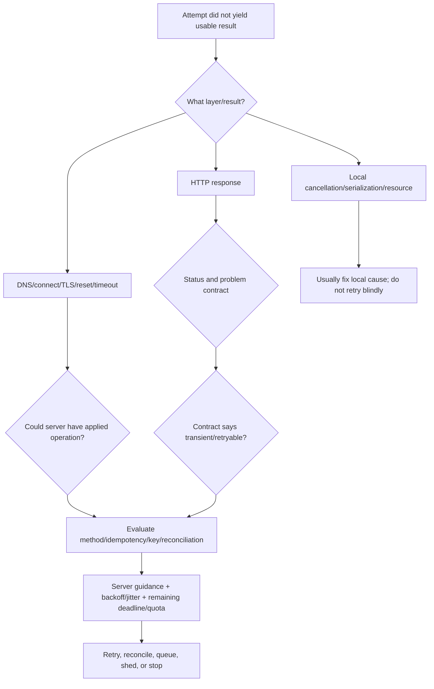
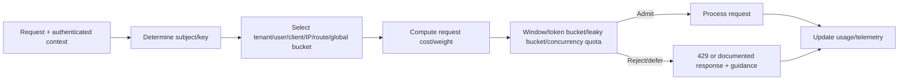
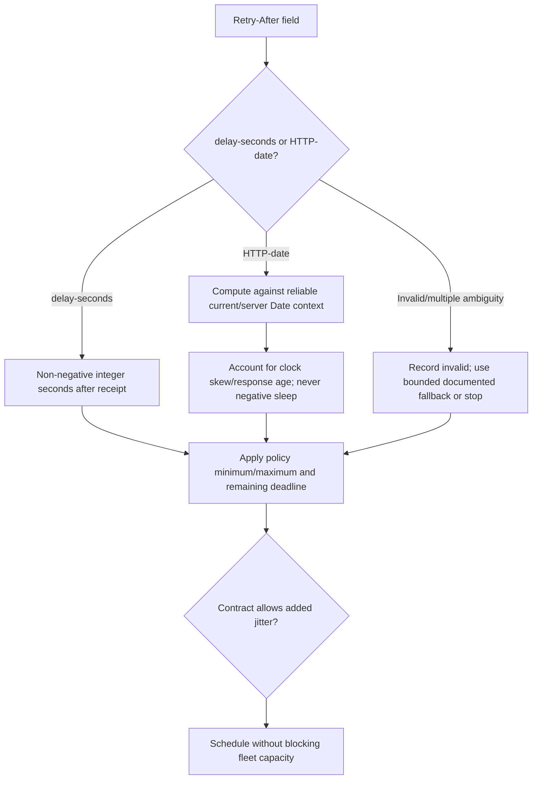
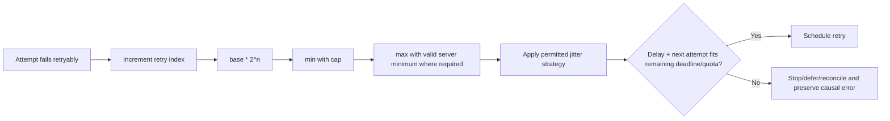
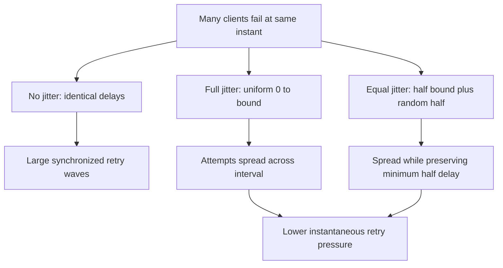
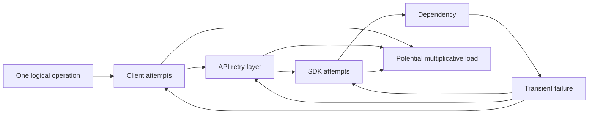
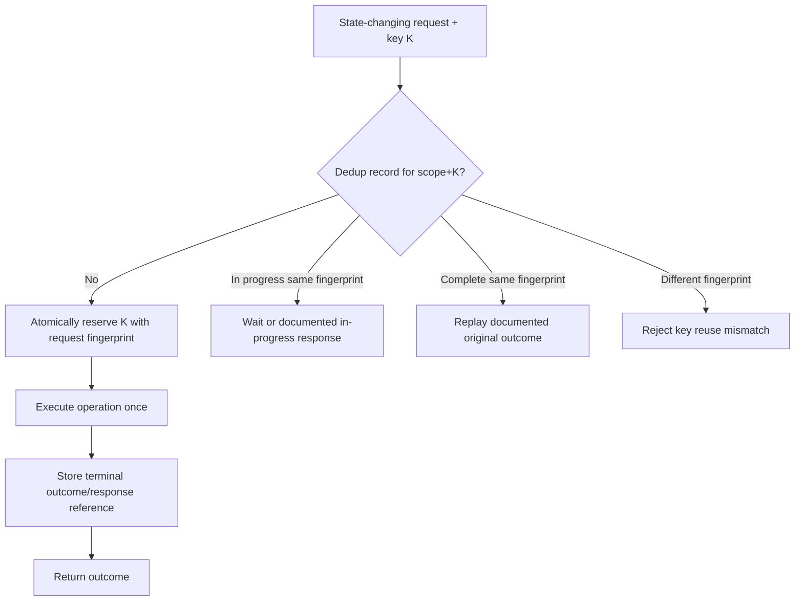
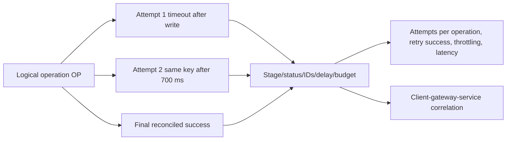
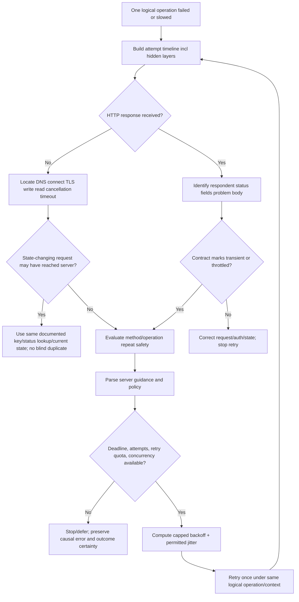

# Part 087 - Rate Limits Retries Backoff and Idempotency

> **Purpose:** Design and troubleshoot request recovery that improves reliability without creating duplicate effects, synchronized retry storms, unbounded latency, hidden overload, or misleading evidence.
>
> **Artifact label:** **Offline seeded retry simulation** using synthetic response cards and optional built-in PowerShell/Python arithmetic. It sends no network request, installs no dependency, creates no real idempotency key or credential, and claims no vendor-specific policy.
>
> **Currency and source access date:** August 24, 2026.

## Section goal

By the end of this Part, you should explain rate limiting as an admission-control policy with a defined subject, scope, resource, quota, window/algorithm, and response contract. You should distinguish HTTP 429 from transport failures, 408, 502, 503, 504, permanent 4xx errors, and successful asynchronous acceptance. You should inspect `Retry-After` as either delay-seconds or HTTP-date, account for server/client clock and response age, and treat standardized or vendor rate-limit fields as hints under their owning specification rather than universal promises.

You should design bounded retries by answering five questions: is the failure plausibly transient, is the operation safe to repeat, what server guidance applies, what delay/jitter policy avoids synchronization, and what end-to-end budget remains? You should calculate capped exponential backoff, full jitter, equal jitter, and decorrelated-style sequences; explain why jitter is needed; and distinguish attempt timeout, overall deadline, retry count, elapsed budget, concurrency budget, and retry quota. You should avoid retrying every exception or every 5xx response and should preserve the original causal error when the budget is exhausted.

You should understand HTTP method idempotency as an intended-effect property, not “the same response every time.” You should distinguish safe methods, standardized idempotent methods, application-specific idempotency, idempotency keys, conditional requests, resource identifiers, deduplication records, request fingerprints, retention windows, concurrency races, and response replay. You should analyze the ambiguous-outcome case: a client can time out after a server committed the operation but before the response arrived. A blind POST retry can duplicate an effect; a documented idempotency mechanism or status reconciliation can make recovery safer.

The Part is vendor-neutral. Exact quotas, buckets, status codes, header names, retryable errors, idempotency-key syntax, retention, conflict behavior, and SDK defaults are API contracts. Abnormal-specific behavior remains unknown until current approved documentation and evidence are available.

## JD Mapping

| Supplied role signal | Capability developed | Vendor-neutral support situation | Evidence artifact |
|---|---|---|---|
| API support | Classifies throttling and transient failures | Integration receives 429/503 | Retry decision ledger |
| Complex troubleshooting | Reconstructs attempt timeline and ambiguous outcome | Client timed out after write | Causal timeline |
| Customer communication | Explains when not to “just retry” | Duplicate ticket/object risk | Plain-language risk statement |
| Engineering escalation | Supplies bounded reproducible sequence | Retry storm or wrong SDK defaults | Seeded simulation |
| Reliability | Uses backoff, jitter, deadlines, budgets, backpressure | Large fleet retries together | Budget design |
| Data/security | Keeps keys, bodies, subjects, and limits out of ordinary logs | Idempotency key/request fingerprint | Redacted evidence map |
| SaaS integrations | Honors server guidance and operation contracts | Scheduled connector work | Policy matrix |
| Incident response | Stops amplification and preserves root error | Downstream overload | Retry amplification calculation |
| Honest positioning | Labels local simulation versus production ownership | Interview response | Evidence-tier statement |
| Continuous learning | Checks standards and installed SDK behavior | Header/default changed | Source/version ledger |

## Candidate honesty note

You can describe retries, backoff, jitter, rate-limit semantics, and idempotency as working knowledge demonstrated by an offline deterministic simulation. Your production-transfer strength is enterprise support, evidence-led isolation, customer communication, cross-team escalation, and validation. You should not claim to have designed a hyperscale rate limiter, owned a payment-grade idempotency service, tuned Abnormal SDK retries, or know Abnormal quotas, headers, token windows, or deduplication behavior.

| Evidence tier | Safe claim | Boundary |
|---|---|---|
| Production transfer | “I prevent troubleshooting actions from amplifying incidents and preserve attempt-level evidence.” | Keep examples truthful |
| Working familiarity | “I can design bounded exponential backoff with jitter and reason about idempotency.” | Not large-scale service ownership |
| Offline lab | “I simulated 120 synthetic clients and ambiguous write outcomes with seeded data.” | No network or real API |
| Learned architecture | “Rate limiters and idempotency stores commonly use several algorithms/policies.” | Do not assert one vendor's internals |
| No direct experience | “I have not administered Abnormal quotas or idempotency behavior.” | Say directly |
| Unknown | Retryable status list, header policy, SDK attempts, key retention/scope, reconciliation endpoint | Verify current approved docs |

## 1. Reliability recovery begins with classification

A **retry** is a new attempt to perform the same intended operation after an attempt did not produce a usable result. It is not automatically safe. A retry can improve availability when a failure is transient and repetition is safe, but it consumes capacity and can repeat effects.



| Term | Plain meaning | Why it matters | Memory hook |
|---|---|---|---|
| Transient | Condition may clear without changing request | Candidate for delayed retry | May pass later |
| Permanent | Same request/context expected to keep failing | Retry wastes capacity | Fix before repeat |
| Attempt | One request execution | Unit of timeout/evidence | One try |
| Deadline | Latest time operation may complete usefully | Bounds all attempts/waits | Finish line |
| Backoff | Increasing delay between attempts | Reduces pressure during failure | Step back |
| Jitter | Random variation in delay | Desynchronizes clients | Spread the crowd |
| Rate limit | Admission policy restricting request use | Protects fairness/capacity | Traffic allowance |
| Idempotent | Repeating identical request has same intended effect as once | Supports uncertain recovery | Repeat without extra intended effect |
| Idempotency key | Client-provided operation identity under a contract | Helps deduplicate repeated non-idempotent requests | Same intent label |
| Retry budget | Limit on retry work/latency | Prevents amplification | Recovery allowance |
| Backpressure | Slow/reject upstream work when downstream saturated | Stops queue growth | Push pressure backward |
| Reconciliation | Query authoritative state after ambiguous outcome | Avoids duplicate write | Check before repeat |

## 2. Rate limiting as an admission contract

Rate limiting decides whether a request may consume a protected resource under policy. A complete explanation identifies **who/what is counted**, **where**, **for which operation/resource**, **over which interval or algorithm**, **with what cost**, and **how the client learns what to do next**.



| Contract dimension | Example possibilities | Support question |
|---|---|---|
| Subject | Credential, tenant, user, IP, integration, device | Which identity was counted? |
| Scope | Endpoint, resource class, account, region, global | Are multiple operations sharing a bucket? |
| Metric | Requests, compute units, bytes, records, concurrent jobs | Is one request weighted? |
| Algorithm | Fixed/sliding window, token bucket, leaky bucket, concurrency | Are bursts allowed? |
| Window | Second/minute/day or dynamic | When/how does capacity recover? |
| Capacity | Hard limit, tier-based, adaptive | Is the observed limit expected for plan/context? |
| Response | 429, 503, queue, delay, connection drop | What does current API specify? |
| Guidance | Retry-After, RateLimit fields, body, SDK signal | Which source is authoritative? |
| Granularity | Distributed approximation versus exact counter | Can small drift occur? |
| Exemption | Internal service, support test, priority class | Is caller class different? |

### Common limiter algorithms

| Algorithm | Simplified behavior | Strength | Tradeoff |
|---|---|---|---|
| Fixed window | Count in wall-clock blocks | Simple | Boundary burst can double short-term traffic |
| Sliding log | Store recent request timestamps | Precise | Memory/processing cost |
| Sliding counter | Approximate overlap between windows | Balanced | Approximation |
| Token bucket | Tokens refill; requests consume tokens | Allows bounded bursts | Need rate/burst/cost policy |
| Leaky bucket | Drain at steady rate; queue/reject excess | Smooth output | Queue latency/drop policy |
| Concurrency limit | Cap simultaneous in-flight work | Protects saturation | Does not directly cap long-term rate |
| Adaptive limit | Adjust using latency/errors/load | Responds to conditions | More complex and less predictable to clients |

Rate and concurrency are different. Ten one-hour jobs launched together may violate a concurrency limit even if requests per minute are low. A thousand tiny reads may violate rate but never create high in-flight concurrency. Robust clients may need both request pacing and maximum parallelism.

### 🔍 Plain-English deep-dive: A rate limit is not simply “N per minute”

“100 per minute” leaves unanswered whether a burst of 100 is allowed at second zero, whether writes cost more than reads, whether all tenants share capacity, and whether minute boundaries are fixed or rolling. Think of transit: a monthly pass, turnstile capacity, train capacity, and platform safety are different constraints even though all affect entry.

The analogy stops because distributed counters can be approximate, requests can have weights, and services can enforce policy at gateway, application, storage, or dependency layers. Record the exact subject, scope, and respondent rather than attributing every 429 to one global number.

## 3. HTTP 429 and other relevant outcomes

RFC 6585 defines 429 Too Many Requests: the user has sent too many requests in a given time. The response should explain the condition and may include `Retry-After`. It does not define how the server identifies the user or counts requests. Servers under attack need not send 429 at all.

| Result | General semantic | Retry stance | Idempotency concern |
|---|---|---|---|
| No HTTP response | Resolver/connect/TLS/reset/timeout | Layer- and operation-specific | Outcome may be unknown after send |
| 400 | Request perceived malformed/client error | Usually no until corrected | Repetition usually pointless |
| 401 | Valid authentication missing | Refresh/correct under auth policy; bounded | Avoid loops/credential exposure |
| 403 | Understood but refused | Do not retry same context automatically | Permission/policy change needed |
| 404 | Not found or existence hidden | Contract/context-specific | Eventual consistency only if documented |
| 408 | Server did not receive complete request in time | RFC allows repeat outstanding request; assess method/outcome | New connection and write ambiguity |
| 409 | Conflict with current state | Resolve/re-read/reconcile | Blind retry can repeat conflict |
| 412 | Preconditions false | Re-read and make deliberate state decision | Protects against lost update |
| 422 | Syntax understood, instructions unprocessable | Correct data | Retry same input no value |
| 428 | Server requires conditional request | Add correct precondition after state read | Prevent lost update |
| 429 | Too many requests | Honor guidance and policy, reduce concurrency/rate | Same operation still needs repeat safety |
| 500 | Unexpected server condition | Contract-specific bounded retry | Server may have partially acted |
| 502 | Gateway got invalid upstream response | Often transient but inspect respondent/path | Origin effect can be ambiguous |
| 503 | Temporary overload/maintenance possible | May use Retry-After; bounded retry/backpressure | Effect may be unknown for writes |
| 504 | Gateway timed out waiting upstream | Often transient; operation outcome may be unknown | High ambiguity for state change |
| 2xx | Request accepted/succeeded by status semantics | Do not retry because body parse failed without analysis | 202 is accepted, not completed |

An API/SDK can define a narrower retry policy. A 500 caused by deterministic invalid state is not transient. A 404 on an eventually created resource can be transient for a documented polling workflow. Status code class guides; the operation contract decides.

## 4. `Retry-After` parsing and interpretation

RFC 9110 defines `Retry-After` as either an HTTP-date or a non-negative decimal number of seconds. With 503 it estimates service unavailability; with a 3xx it is a minimum wait before the redirected request. RFC 6585 permits it with 429. Other uses need their specifications.



| Input | Interpretation | Caution |
|---|---|---|
| `Retry-After: 120` | Wait at least 120 seconds after response receipt | Not milliseconds |
| HTTP-date in future | Wait until represented time | Clock skew and transit/queue time |
| Date already past | Zero lower bound; use policy/backoff | Do not use negative delay |
| `0` | No required wait from field | Still use retry policy/budget |
| Invalid string | Field unusable | Preserve evidence; do not crash/spin |
| Two conflicting values | Invalid/ambiguous singleton behavior | Do not choose silently |
| Huge value | Server requests long delay | Clamp only according to job policy; maybe stop/defer |
| Missing | No server wait guidance | Use documented client policy, not immediate loop |

When both server guidance and client backoff exist, a common conservative policy is to wait at least the server's valid minimum and apply a bounded client policy that does not violate the overall deadline. Exact combination belongs to the API/SDK contract. Adding jitter above a minimum can spread clients, but jitter below a server-required minimum would violate it.

## 5. Standardized rate-limit fields and vendor headers

RFC 9333 defines `RateLimit-Limit`, `RateLimit-Remaining`, and `RateLimit-Reset` using Structured Fields, with semantics and security considerations. It does not make every `X-RateLimit-*` convention equivalent. Header naming, window selection, multiple limits, reset units, and accuracy must be read from the current specification and API documentation.

| Evidence | Potential use | Do not assume |
|---|---|---|
| HTTP 429 | This request was rate limited | Exact bucket or recovery time |
| Retry-After | Minimum delay under owning use | Remaining quota or universal retryability |
| RateLimit-Limit | Quota policy representation under RFC 9333 | Legacy vendor header equivalence |
| RateLimit-Remaining | Remaining quota under represented policy | Strong reservation for concurrent requests |
| RateLimit-Reset | Time until quota restoration per defined semantics | Unix timestamp unless specified |
| Legacy `X-RateLimit-Reset` | Vendor-defined | Seconds versus epoch or clock source |
| Problem body | Machine/human details | Safe to parse free-form message text |
| SDK exception | Wrapped policy details | That it preserved every header/body |

Treat fields as advisory state that can race with other clients. If remaining is 1 and ten workers read it simultaneously, it is not a reservation. Coordinated clients should pace centrally or share quota state where architecture and policy permit.

## 6. Exponential backoff

A simple capped exponential schedule before jitter is:

$$
B_n = \min(C,\ B_0 \cdot 2^n)
$$

where $B_0$ is base delay, $C$ is cap, and $n$ is the zero-based retry number after the initial attempt. With $B_0=0.5$ seconds and $C=8$ seconds, the bounds are 0.5, 1, 2, 4, 8, 8 seconds.

| Symbol | Meaning | Example |
|---|---|---|
| $n$ | Retry index, not total attempt index | First retry $n=0$ |
| $B_0$ | Base delay | 0.5 s |
| $C$ | Maximum backoff bound | 8 s |
| $B_n$ | Deterministic delay bound | min formula |
| $D$ | Overall deadline/budget | 20 s |
| $T_n$ | Per-attempt timeout | 3 s or remaining budget |
| $S$ | Server minimum guidance | parsed Retry-After |



Exponential backoff gives a failing dependency breathing room. It is not enough by itself: if 10,000 clients fail together and all wait exactly 1, 2, 4 seconds, they return together and create waves.

## 7. Jitter strategies

Let $B_n$ be the capped exponential bound and $U(a,b)$ a random value uniformly selected from $[a,b]$.

**Full jitter:**

$$
W_n = U(0, B_n)
$$

**Equal jitter:**

$$
W_n = \frac{B_n}{2} + U\left(0,\frac{B_n}{2}\right)
$$

**No jitter:** $W_n=B_n$.

A decorrelated-style algorithm commonly chooses each next delay from a range based on the prior delay, then caps it. Exact algorithms vary; use the selected library/provider guidance and test it rather than relying on the name alone.



| Strategy | Range at bound 8 s | Mean | Benefit | Risk/tradeoff |
|---|---:|---:|---|---|
| No jitter | exactly 8 | 8 | Simple/predictable | Synchronization |
| Full jitter | 0 to 8 | 4 | Strong spreading/lower mean | Some retries near zero unless policy minimum |
| Equal jitter | 4 to 8 | 6 | Avoids very short delay | Higher mean/less spread |
| Random fixed | fixed interval range | Depends | Simple desync | Does not increase under persistent failure |
| Decorrelated family | based on prior/base/cap | Algorithm-specific | Less correlated sequence | Harder to reason/test; names vary |

### 🔍 Plain-English deep-dive: Jitter is a system property, not decorative randomness

Imagine a stadium announcement telling everyone to try one locked gate again in exactly ten seconds. The crowd returns as one pulse. Giving each person a safe random retry time spreads demand. Backoff reduces how often people return; jitter reduces how many return at once.

The analogy stops because software clients can have priority, deadlines, shared rate buckets, retries at multiple layers, and deterministic pseudo-random seeds. Randomness must be generated appropriately, bounded, observable by summary, and combined with server minimums and budgets. Do not log secret random state or make tests flaky; inject/seed the scheduler in tests.

## 8. Deadlines, timeouts, and budgets

An **attempt timeout** bounds one try. An **overall deadline** bounds the useful operation including queueing, DNS, connect, TLS, writes, server processing, response reads, backoff, and retries. If each of five attempts has a 30-second timeout, the user may wait much longer than 30 seconds.

```mermaid
gantt
    title Synthetic retry deadline of 12 seconds
    dateFormat X
    axisFormat %L
    section Operation
    Attempt 1           :a1, 0, 2000
    Backoff jitter 1    :b1, 2000, 2700
    Attempt 2           :a2, 2700, 5200
    Backoff jitter 2    :b2, 5200, 6800
    Attempt 3 remaining :a3, 6800, 12000
```



| Budget | Protects | Example guard |
|---|---|---|
| Attempt count | Infinite retry loop | Initial + at most 3 retries |
| Elapsed/deadline | User/job latency | Absolute monotonic deadline |
| Per-attempt timeout | Hung request | min(configured, remaining) |
| Retry quota | Retry amplification during widespread failures | Retries as fraction/tokens of success traffic |
| Concurrency | In-flight saturation | Semaphore/adaptive limit |
| Queue depth/age | Memory and stale work | Reject/drop/defer policy |
| Bytes | Expensive repeated uploads/downloads | Size-aware policy |
| Cost units | Weighted API usage | Token bucket/operation weights |
| Hop budget | Nested service retries | Propagated deadline/attempt metadata where designed |

Use a monotonic clock for elapsed deadlines inside a process; wall-clock changes should not lengthen waits unexpectedly. HTTP-date parsing necessarily involves wall time, so compare carefully and cap by monotonic remaining budget.

### Budget decision

Before sleeping $W$ and attempting with timeout $T$, require an explicit rule such as:

$$
W + T_{minimum\ useful} \leq D_{remaining}
$$

Otherwise stop, defer to durable scheduling, or return a clear failure. Do not sleep until after the user's deadline and then attempt anyway.

## 9. Retry amplification and nested layers

If a UI retries 3 times, a service retries 3 times, and an SDK retries 3 times, one user operation can produce up to:

$$
3 \times 3 \times 3 = 27
$$

attempts if “3” means total attempts at each layer. If each means three retries plus initial, the maximum is $4^3=64$. Define terminology.

| Layer | Hidden retry source | Evidence |
|---|---|---|
| Browser/client | Fetch wrapper/service worker | Network timeline/request IDs |
| Application | Loop/job framework | Attempt logs and code/config |
| HTTP library | Built-in handler/policy | Version and policy settings |
| SDK | Generated/custom retry middleware | SDK docs/config/diagnostic logs |
| Proxy/gateway | Upstream retry/failover | Gateway trace/respondent IDs |
| Service mesh | Route retry policy | Mesh config/telemetry |
| Queue | Redelivery/visibility timeout | Delivery count/message ID |
| Function platform | Invocation retry | Platform execution IDs |
| Database/client | Transaction retry | Driver telemetry |



Prefer one owning retry layer for a given dependency and propagate deadlines/cancellation. Where multiple layers are unavoidable, coordinate low attempt counts and budgets. During overload, retries should be a controlled minority, not an unlimited second workload.

## 10. Backpressure, pacing, and circuit breaking

Retries are not the first response to sustained overload. **Backpressure** reduces incoming work; **pacing** spaces planned work; **load shedding** rejects low-priority work; a **circuit breaker** temporarily avoids calls when failures exceed a policy, then probes cautiously. These mechanisms are application patterns, not universal HTTP semantics.

| Mechanism | Trigger | Action | Failure mode if careless |
|---|---|---|---|
| Client rate limiter | Planned request rate | Acquire local/shared permit | Local view differs from server/global quota |
| Concurrency cap | In-flight count/latency | Queue or reject | Queue becomes unbounded |
| Backpressure | Downstream saturation | Slow/reject upstream | Cascading timeout if too late |
| Load shedding | Capacity/priority | Reject/defer optional work | Drops critical work without priority design |
| Circuit breaker | Failure/latency threshold | Fail fast while open | All clients probe together; masks recovery |
| Bulkhead | Workload class | Isolate pools/quotas | Mis-sized partitions waste capacity |
| Durable retry | Long server delay | Schedule job/message later | Duplicate delivery without idempotent consumer |

For a `Retry-After` of 30 minutes, holding an interactive thread asleep may be wrong. A durable scheduler can resume later if the operation remains valid and idempotent. A user-facing request may instead fail clearly with retry guidance.

## 11. HTTP idempotency and safety

RFC 9110 defines a method as idempotent when multiple identical requests have the same **intended effect on the server** as one request. Side effects such as logging each attempt or retaining revisions can still occur. Safe methods are essentially read-only by requested semantics. GET, HEAD, OPTIONS, and TRACE are safe; safe methods plus PUT and DELETE are idempotent under standardized semantics. POST is not generally idempotent, but an operation can define idempotent semantics or a deduplication mechanism.

| Method | Safe? | Idempotent by standardized semantics? | Automatic retry note |
|---|---:|---:|---|
| GET | Yes | Yes | Still consider cost, rate, consistency, range/body, privacy |
| HEAD | Yes | Yes | Metadata can change between attempts |
| OPTIONS | Yes | Yes | Capability response can change |
| TRACE | Yes | Yes | Security restrictions; rarely enabled |
| PUT | No | Yes | Repeating same desired state has same intended effect; conditions matter |
| DELETE | No | Yes | Repeating removal intent is idempotent though response may become 404 |
| POST | No | No generally | Retry only with operation-specific guarantee/key/reconciliation |
| PATCH | No generally | Not guaranteed by method | Patch document semantics can be idempotent or not |

### Same effect is not same response

First DELETE may return 204; the second may return 404 because the association is already gone. The intended final effect remains absent. A repeated PUT may return different ETag/timestamp or conflict if conditional state changed. Idempotency does not promise byte-identical responses, no logs, no billing attempts, no notifications, or no external side effects unless the complete operation contract controls them.

### 🔍 Plain-English deep-dive: Idempotent describes intent, not a magic shield

Pressing an elevator's “up” button twice asks for the same destination call; the second press need not summon a second elevator. But the system may log both presses, illuminate the button differently, or fail between components. Similarly, HTTP idempotency speaks to the requested effect at the resource interface, not every hidden side effect across uncontrolled systems.

The analogy stops because an API operation can fan out to email, billing, queues, and third parties. A robust implementation propagates an operation identity or makes downstream effects idempotent too; the client cannot assume that from the HTTP method alone beyond the standardized interface semantics.

## 12. Ambiguous outcomes

A failure before connecting usually means the server did not receive the request. A timeout after the client sent bytes can mean the server never received all content, received it but did not act, committed it and lost the response, or is still processing. Transport evidence can narrow but often cannot prove business outcome.

```mermaid
sequenceDiagram
    participant C as Client
    participant G as Gateway
    participant S as Service
    participant D as Durable state
    C->>G: POST create operation K
    G->>S: Forward request
    S->>D: Commit result for K
    D-->>S: committed
    S-->>G: 201 response
    Note over G,C: Connection/response lost
    C->>C: Timeout; outcome unknown
    C->>G: Reconcile by K/status or retry with same documented key
    G->>S: Lookup/deduplicate K
    S-->>C: Original outcome/current status
```

| Failure point | Likely knowledge | Safe next action depends on |
|---|---|---|
| DNS/connect refused | Origin likely not reached | Proxy/alternate path and method |
| TLS validation failure | HTTP request not sent over valid session | Fix trust/name; never bypass |
| Request write fails before any bytes | Server likely did not receive content | Library evidence still imperfect |
| Write partial/reset | Server may have partial request | Framing/server behavior |
| Read timeout after full write | High ambiguity | Idempotency/reconciliation |
| 504 from gateway | Upstream timed out; origin may continue | Gateway cancellation and operation contract |
| 202 received | Accepted, not completed | Poll/callback/status contract |
| Response body parse fails after 201 status | Creation may have succeeded | Location/operation ID/reconciliation |

Support language should say “the client did not receive confirmation” rather than “the server failed” unless evidence establishes that.

### 🔍 Plain-English deep-dive: A timeout describes the observer, not the final business state

“The request timed out” means a waiting component reached its deadline without receiving the expected completion evidence. It does not, by itself, say whether the origin started, committed, rolled back, or continued the operation. Different components can also have different deadlines: a gateway can return 504 while an origin worker continues.

Think of ending a phone call before hearing the other person confirm that a form was filed. You know the confirmation was not heard; you do not yet know whether the filing happened. The analogy stops because distributed systems can acknowledge at several stages, commit durable state atomically, enqueue later work, and propagate cancellation inconsistently.

Use precise support language: record the last confirmed stage, label the business outcome known, failed, or unknown, and reconcile through an authoritative operation/status/resource or the documented same-key retry path.

## 13. Idempotency keys

An **idempotency key** is a client-generated identifier supplied under an API-specific contract so repeated attempts for one logical operation can be recognized. There is no universal behavior in core HTTP. The IETF HTTPAPI working group has developed Idempotency-Key field work; use its final/current status and the API's documentation at implementation time, not assumptions from draft examples.

A robust contract addresses:

| Dimension | Question |
|---|---|
| Syntax | Allowed characters/length/field name? |
| Generation | Random unique value, operation-derived identifier, or server-issued? |
| Scope | Per tenant/client/route/resource/operation? |
| Uniqueness | How long must a key not be reused? |
| Fingerprint | Are method, target, normalized body, content type, principal included? |
| First request state | In progress, completed success, completed failure? |
| Concurrent duplicate | Wait, return conflict, return in-progress, or replay? |
| Mismatched payload | 400/409/422/problem type? |
| Retention | How long is result/dedupe record retained? |
| Response replay | Original status/body/headers or current representation? |
| Failure storage | Are deterministic failures cached/deduped? |
| Downstream effects | Is operation identity propagated? |
| Privacy | Is key sensitive/linkable/logged? |
| Recovery | Status lookup/reconciliation after expiry? |



The reservation must be atomic. A check-then-create race can execute two concurrent requests before either stores the result. Storage and business commit coordination is difficult: if the effect commits but the dedupe outcome does not, a retry can duplicate. Designs use transactional records, unique constraints, operation state machines, outboxes, or compensating/reconciliation patterns according to the domain.

### Key generation and logging

Use the API's documented requirements. Random high-entropy keys reduce collision risk but are not credentials by definition; they can still reveal linkage, appear in logs, or allow result probing if authorization is weak. Never include customer content or a secret in the key. Do not reuse the same key for two logical operations. Retry the same operation with the same key; using a new key defeats deduplication.

## 14. Request fingerprints and canonicalization

The server may bind a key to a request fingerprint so the same key cannot be reused with different content. Fingerprinting must be defined carefully. Hashing raw JSON bytes treats whitespace/property order as different; parsing and canonicalizing introduces duplicate-name, number, Unicode, and schema semantics. Target/query/header inclusion and secret handling matter.

| Fingerprint input | Benefit | Hazard |
|---|---|---|
| Method + normalized target | Distinguishes operation | URI normalization/query ordering rules |
| Raw content bytes | Simple/exact | Equivalent serialization differs |
| Parsed JSON data | Ignores whitespace/order | Parser duplicate/number/Unicode behavior |
| Selected headers | Includes media/version/context | Secrets and unstable headers |
| Principal/tenant | Prevents cross-scope key collision | Identity lifecycle/aliases |
| API version | Avoids replay across contract | Version negotiation details |

Clients usually should not invent the server fingerprint. They send identical intended data and let the documented server mechanism compare. If an error says key reuse with different payload, preserve safe hashes/schema summaries and compare serialization/version without exposing content.

## 15. Conditional requests as state protection

Idempotency keys deduplicate logical operation attempts; HTTP preconditions protect state assumptions. `If-Match` with a strong ETag can prevent lost updates: apply the change only if the current representation still matches the version read. `If-None-Match: *` can make a create-if-absent request conditional. RFC 6585 defines 428 when a server requires a conditional request.

```mermaid
sequenceDiagram
    participant C as Client
    participant S as Origin
    C->>S: GET resource
    S-->>C: 200 ETag "v7" + state
    Note over S: Another client updates to v8
    C->>S: PUT desired state, If-Match: "v7"
    S-->>C: 412 Precondition Failed
    C->>S: GET current state
    S-->>C: 200 ETag "v8"
    Note over C: Merge/ask/recompute; do not blind overwrite
```

| Mechanism | Primary problem | Typical evidence |
|---|---|---|
| Idempotent method semantics | Repeat same intended effect | Method/resource contract |
| Idempotency key | Duplicate logical POST-like operation | Key scope/fingerprint/outcome |
| `If-Match` | Lost update/overwrite | Prior/current ETag, 412 |
| `If-None-Match: *` | Create only if absent | 412 if current representation exists |
| Client-chosen resource URI + PUT | Repeatable desired state | Stable target identifier |
| Operation/status resource | Ambiguous asynchronous outcome | Operation ID/state/result |
| Natural business key | Domain duplicate | Uniqueness constraint; careful semantics |

These mechanisms can be combined. A create POST can use an idempotency key, return an operation resource, and downstream updates can use ETags. Do not substitute a random key for concurrency control or an ETag for logical request deduplication without contract support.

## 16. Retry decision matrix

Before retrying, evaluate these gates in order:

1. **Cancellation/deadline:** Does the caller still want the result, and is useful time left?
2. **Classification:** Is this condition transient under the current operation contract?
3. **Repeat safety:** Is method/operation idempotent, protected by same idempotency key, known not applied, or reconcilable?
4. **Server guidance:** Is there valid `Retry-After` or rate-limit policy?
5. **Capacity:** Does retry quota/concurrency/backpressure allow another attempt?
6. **Delay:** Compute bounded jittered delay without violating server minimum or deadline.
7. **Evidence:** Record attempt, causal failure, delay reason, remaining budget, and correlation safely.

| Condition | Retry now? | Better action |
|---|---:|---|
| Invalid JSON request 400 | No | Correct serializer/content |
| Expired token 401 | Not same request loop | One coordinated refresh if policy allows, then bounded repeat |
| Same principal 403 | No | Fix authorization/policy |
| 429 valid Retry-After | No immediate | Pace/defer; same operation safety still required |
| 503 with short guidance and safe GET | Maybe after wait | Budgeted jittered retry |
| 504 after unkeyed create POST | No blind retry | Reconcile/status/support path |
| Connection refused before send, safe GET | Usually candidate | Backoff/jitter/deadline |
| Parse error after 201 | No blind create retry | Use Location/request ID/status reconciliation |
| 412 | No blind repeat | Re-read/merge/ask |
| Cancellation | No | Propagate stop |
| Deadline exhausted | No | Return causal failure/ambiguous status |
| Circuit open | No normal request | Fail/defer; controlled probe by owner |

## 17. Observability for retries and limits

One logical operation needs one operation ID and multiple attempt records. Avoid high-cardinality secret labels. Log structure, not raw credentials/bodies/keys.

| Field | Example safe value | Purpose |
|---|---|---|
| operation alias | `OP-087-0042` | Correlate attempts |
| attempt index | 1, 2, 3 | Sequence |
| method/route template | `POST /cases` synthetic | Semantics without IDs |
| idempotency-key fingerprint | approved short hash/alias | Same-key confirmation, not raw key |
| start/end monotonic elapsed | milliseconds | Deadline accounting |
| failure stage | DNS/connect/write/read/status/parse | Classify ambiguity |
| respondent | client/gateway/origin alias | Locate layer |
| HTTP status/problem type | 429 / safe URI alias | Machine outcome |
| Retry-After parsed | source form and bounded seconds | Explain schedule |
| policy | version/name/strategy | Reproduce behavior |
| chosen delay | milliseconds | Verify jitter/backoff |
| remaining deadline/quota | summarized | Explain stop |
| request/trace ID | sanitized approved ID | Server correlation |
| final disposition | success/stop/defer/reconcile/unknown | Outcome honesty |



Useful metrics include initial-request rate, retry rate, retry-success rate, attempts per operation, throttled rate by safe scope, queue age, concurrency, deadline exhaustion, ambiguous outcomes, dedupe hits/conflicts, and final user success. “Retries succeeded” can hide that initial reliability deteriorated, so report both.

## 18. Troubleshooting decision tree



### Failure modes and safer alternatives

| Failure/shortcut | Damage | Safer alternative |
|---|---|---|
| Retry every exception | Permanent loops/duplicates | Explicit operation policy and classification |
| Immediate retry on 429 | More throttling | Honor guidance, pace, reduce concurrency |
| Exponential delay without jitter | Fleet waves | Full/equal/approved jitter |
| Jitter below Retry-After minimum | Violates server request | Apply minimum then add permitted spread |
| Independent per-worker pacing | Shared bucket overshoot | Coordinated limiter where architecture permits |
| Five 30s attempts under 30s SLA | Deadline violation | Overall monotonic deadline |
| Retry at three layers | Multiplicative load | One owner/propagated budget |
| Retry POST with new key | Duplicate effect | Same key for same logical operation |
| Reuse key with changed body | Ambiguous/misbound request | New key for new intent; compare safe fingerprint |
| Check then insert dedupe record | Concurrency race | Atomic reservation/unique constraint/state machine |
| Assume timeout means failure | Server may have committed | Reconcile and label unknown outcome |
| Treat 202 as completion | Work may later fail | Follow status/callback contract |
| Log raw key/body/headers | Secret/privacy exposure | Aliases, allowlists, structural summaries |
| Ignore SDK retries | Evidence count mismatch | Record version/config/diagnostics |
| Use wall clock for local deadline | Clock changes alter budget | Monotonic elapsed time |
| Claim vendor policy | Unsupported | Verify current approved docs |

## 19. Escalation package

| Section | Minimum high-signal evidence |
|---|---|
| Impact/scope | Operations affected, rate/concurrency, duration, safe tenant/client aliases |
| Contract | Method/route template, repeat-safety mechanism, expected retry/rate policy, docs version |
| Timeline | UTC + monotonic elapsed for logical operation and every attempt |
| Failures | Stage/respondent/status/problem type/safe headers/request IDs |
| Guidance | Raw form category and parsed/clamped Retry-After/rate-limit summaries |
| Policy | Library/SDK/runtime version, max attempts, timeouts, deadline, backoff/jitter, retry quota |
| Idempotency | Same key alias/fingerprint, scope, request fingerprint match, retention assumption |
| Outcome | Known success/failure/unknown/reconciled and authoritative evidence |
| Amplification | Hidden retry layers and computed maximum/observed attempts |
| Controls | Concurrency, pacing, backpressure, cancellation, circuit state |
| Privacy | Redaction/retention/exposure statement |
| Ask | Exact gateway/origin limiter decision, dedupe state, or request timeline needed |

## Safe local lab: The Seeded Retry Storm and Ambiguous Outcome Ledger 087

### Prerequisites

- Paper, spreadsheet, or local Markdown. Optional built-in PowerShell/Python 3 for arithmetic/random simulation if already installed; no package installation.
- A deterministic pseudo-random seed of 87 for repeatable teaching output. It is not a cryptographic key.
- Synthetic clients C001-C120, operations OP001-OP120, statuses, delays, and idempotency aliases only.
- Files if used: `policy-087.json`, `attempts-087.csv`, `outcomes-087.md`, and `cleanup-087.md` in a temporary local folder.
- No network request, listener, credential, real token/key, customer data, vendor endpoint, destructive operation, sleep command, or production configuration.
- Artifact label: **offline seeded retry simulation; arithmetic and paper state machine only; no Abnormal policy claim**.

### Lab procedure

1. Record start UTC, tool/runtime version, seed 87, scope, artifact label, and no-network/no-secret statement.
2. Define teaching policy P087: base 0.5 s, cap 8 s, at most three retries after initial, overall deadline 15 s, useful next-attempt minimum 2 s, full jitter unless valid server minimum requires a later time, concurrency cap 10.
3. Calculate deterministic no-jitter bounds for retries 0-5 and verify 0.5, 1, 2, 4, 8, 8 seconds.
4. On paper or using a seeded standard-library random generator, generate full-jitter delays for four retries. Record the random value, bound, chosen delay, cumulative wait, and remaining deadline.
5. Generate equal-jitter delays from the same bounds with a separate reset seed/run. Verify every delay is between half and full bound.
6. Create a histogram with one-second buckets for 120 clients retrying at no jitter after a shared failure. Put all clients in the 2-second bucket for a bound of 2 seconds.
7. Generate 120 seeded full-jitter delays in `[0,2]`. Count clients per 0.25-second bucket and compare maximum simultaneous bucket to no jitter. This is a teaching distribution, not capacity proof.
8. Parse response cards: `Retry-After: 3`; `Retry-After: 0`; a future HTTP-date; a past date; invalid text; two conflicting values; missing field; 3600. For each record usable minimum, clock assumption, cap/deadline decision, and disposition.
9. Combine a 3-second valid minimum with a full-jitter backoff bound of 2 seconds. Demonstrate a policy that never schedules before 3 seconds and explain any added jitter.
10. Build status cards for DNS failure, connect refusal, TLS validation error, read timeout after full write, 400, 401, 403, 408, 409, 412, 429, 500, 502, 503, 504, 201 parse error, and 202. Classify retry/reconcile/fix/defer/stop and evidence needed.
11. Create a 15-second operation timeline. Place attempt durations and waits; before every retry apply the remaining-budget inequality. Stop any attempt that cannot fit useful time.
12. Model three nested layers with four total attempts each and calculate 64 possible downstream attempts. Redesign with one owner and two retries total; calculate reduction.
13. Model retry quota as 20 tokens, each retry consuming one and each initial success replenishing a teaching amount. Replay a failure burst and stop retries when quota is empty. Label the invented policy.
14. Build a rate-limit contract card with subject, scope, metric, algorithm, window/refill, capacity/burst, cost, response, guidance, and respondent. Use only synthetic values.
15. Compare fixed window, token bucket, and concurrency limiter for a burst of twelve requests. State why the result depends on parameters and initial state.
16. Create operation OP-WRITE-087 with idempotency alias K087-A and request fingerprint F087-A. Walk first request through reserved, executing, committed, response-lost, duplicate-seen, replayed-success states.
17. Replay a concurrent duplicate while K087-A is executing. Demonstrate why atomic reservation is needed and choose a documented teaching response of `in_progress` rather than executing twice.
18. Reuse K087-A with fingerprint F087-B. Reject it as key/payload mismatch. Explain why a new logical intent needs a new key.
19. Expire K087-A from the teaching store, then present a late retry. Mark outcome unsafe/unknown unless a status/business reconciliation path exists. Do not pretend retention can be infinite.
20. Compare three write designs: unkeyed POST; POST with key; client-selected URI plus idempotent PUT. List benefits, conditions, and unresolved downstream effects.
21. Run an ETag lost-update card: read v7, another client writes v8, PUT with `If-Match: "v7"`, receive 412, re-read. Explain why immediate retry with v7 is wrong.
22. Create attempt logs for one synthetic operation with operation ID, attempts, stage, status, request ID alias, chosen delay, remaining deadline/quota, same-key flag, and final reconciled outcome. Include no raw body/key/header.
23. Calculate attempts-per-operation and final-success metrics for ten synthetic operations. Show how high retry success can coexist with degraded initial success.
24. Build an incident response for a 429/503 surge: reduce concurrency, stop nonessential work, honor guidance, cap retries, monitor recovery, and avoid changing production in the lab.
25. Write one escalation package for “504 after create and SDK automatically retried twice” with exact unknown-outcome language and an ask for gateway/origin/idempotency evidence.
26. Deliver a four-minute explanation of rate-limit scope, backoff versus jitter, timeout ambiguity, method idempotency, and same-key semantics.
27. Delete all temporary files or retain only a minimized fully synthetic worksheet. Record end UTC and cleanup statement.

### Expected evidence

- Backoff bounds and seeded full/equal jitter ledgers.
- No-jitter versus 120-client full-jitter bucket comparison.
- Eight `Retry-After` parse/decision cards.
- Transport/status classification matrix with repeat-safety decisions.
- Fifteen-second overall-deadline attempt timeline.
- Nested retry amplification calculation and redesigned budget.
- Synthetic rate-limit contract and algorithm comparison.
- Idempotency state-machine cases: commit/lost response, concurrent duplicate, mismatch, expiry.
- PUT/POST/key/precondition comparison.
- Structured attempt logs and retry/initial/final metrics.
- One safe incident response and escalation package.
- Spoken explanation and explicit evidence ceiling.

### Cleanup and privacy

- Delete temporary policy, attempts, outcomes, random samples, histograms, logs, screenshots, and command history excerpts unless the minimized synthetic worksheet is retained intentionally.
- Confirm no listener, network request, external validator, sleep/wait job, package installation, or production configuration occurred.
- Confirm no Authorization, API key, token, cookie, password, certificate, real idempotency key, customer payload, tenant/user/message, internal host, or vendor endpoint was used.
- Confirm seed 87 and aliases K087/F087/OP087 are synthetic and not reused in any real system.
- Confirm no proxy, DNS, firewall, route, certificate store, execution policy, environment, queue, limiter, or SDK production policy changed.
- Record: `Seeded Retry Storm and Ambiguous Outcome Ledger 087 completed offline with synthetic arithmetic/state; no network, credential, customer data, real key, destructive request, dependency installation, or Abnormal policy claim.`

### Validation rubric

| Dimension | Fail | Developing | Pass |
|---|---|---|---|
| Classification | Retries every error | Uses status list | Uses layer, respondent, transient contract, ambiguity, and causal evidence |
| Rate limits | “N/minute” only | Records 429 | Defines subject, scope, metric, algorithm, cost, guidance, concurrency |
| Retry-After | Treats as milliseconds | Parses integer | Handles date/delay, invalid/duplicate/skew/age/deadline/server minimum |
| Backoff | Fixed immediate retries | Exponential cap | Correct formula/index/cap and policy reasoning |
| Jitter | Random decoration | Adds randomness | Explains fleet synchronization and tests seeded full/equal ranges |
| Budgets | Max retries only | Adds timeout | Overall monotonic deadline, useful-time gate, quota, concurrency, cancellation |
| Amplification | Ignores layers | Lists layers | Calculates total, finds owner, propagates budget |
| Idempotency | “Same response” | Names methods | Explains intended effect, side effects, timeout ambiguity, operation contract |
| Idempotency keys | New key on retry | Reuses key | Covers scope, fingerprint, atomic reservation, in-progress, replay, mismatch, expiry |
| Preconditions | Blind retry 412 | Mentions ETag | Re-reads/merges and distinguishes state protection from dedupe |
| Observability | Raw dumps | Attempt count | Operation+attempt model, delay/budget/stage/respondent/outcome, safe fields |
| Privacy/honesty | Real API/key claims | Synthetic examples | Offline proof, structural redaction, cleanup, explicit Abnormal unknowns |

## Official Source Anchors - August 24, 2026

| Official or primary source | Topic anchored | Boundary |
|---|---|---|
| [RFC 9110 - HTTP Semantics](https://www.rfc-editor.org/rfc/rfc9110.html) | Safe/idempotent methods, retries after connection failure, statuses, Retry-After, preconditions | Application operation safety still needs contract |
| [RFC 6585 - Additional HTTP Status Codes](https://www.rfc-editor.org/rfc/rfc6585.html) | 428, 429, 431, 511; 429 may carry Retry-After | Does not define quota algorithm/user counting |
| [RFC 9333 - RateLimit Fields for HTTP](https://www.rfc-editor.org/rfc/rfc9333.html) | Standard RateLimit fields and structured semantics | Legacy vendor headers are not automatically equivalent |
| [RFC 8941 - Structured Field Values for HTTP](https://www.rfc-editor.org/rfc/rfc8941.html) | Structured field parsing model used by modern fields | Use field-specific semantics too |
| [RFC 9457 - Problem Details for HTTP APIs](https://www.rfc-editor.org/rfc/rfc9457.html) | Machine-readable problem type/status/detail/extensions | Detail is human text; avoid parsing it for control |
| [RFC 9111 - HTTP Caching](https://www.rfc-editor.org/rfc/rfc9111.html) | Cache interactions and response reuse | Retry policy is broader than caching |
| [IANA HTTP Status Code Registry](https://www.iana.org/assignments/http-status-codes/http-status-codes.xhtml) | Current registered HTTP status codes/spec references | Registry entry alone is not operation policy |
| [IANA HTTP Field Name Registry](https://www.iana.org/assignments/http-fields/http-fields.xhtml) | Current field registrations/spec references | Vendor fields need vendor documentation |
| [OpenAPI Specification 3.2.0](https://spec.openapis.org/oas/latest.html) | Describing responses/headers/schemas | Runtime policy/evidence still required |
| [RFC 8259 - JSON](https://www.rfc-editor.org/rfc/rfc8259.html) | JSON syntax/types for request fingerprints/problem content | Canonicalization is not defined by JSON alone |

### Source-use discipline

- Use current RFC 9110 semantics; do not rely on obsolete RFC 7231 wording as the primary source.
- Parse `Retry-After` according to its grammar and owning status/operation contract.
- Distinguish RFC 9333 fields from legacy `X-RateLimit-*` conventions and record actual API documentation/version.
- Do not parse free-form problem `detail` as machine retry control; use status, type, fields, and documented extensions.
- Verify SDK/library retry defaults in the installed version; generated clients may retry invisibly.
- Treat draft idempotency-key work according to its current publication status at implementation time and the API's explicit contract.
- Do not generalize one vendor's retry list, quota, key retention, or response replay to another.
- Verify Abnormal quotas, response fields, retry guidance, SDK behavior, idempotency support, and escalation evidence only through approved current sources.

## Likely Interview Questions

### Q1. When should an API client retry?

**Model answer:** Only when the caller still wants the result, time remains, the failure is transient under the operation contract, repetition is safe or reconcilable, and retry/concurrency quotas allow it. I honor valid server guidance, use bounded exponential backoff with jitter, propagate cancellation/deadline, and record each attempt. Permanent request/auth/state errors are fixed, not looped.

### Q2. Why add jitter to exponential backoff?

**Model answer:** Backoff lowers retry frequency, but deterministic schedules make clients that fail together retry together at 1, 2, 4 seconds, creating waves. Jitter spreads attempts across each bounded interval. I use an approved full/equal/decorrelated algorithm, deterministic injection in tests, server minimum guidance, and an overall deadline rather than unbounded random sleeping.

### Q3. How do you interpret 429 and `Retry-After`?

**Model answer:** 429 means the user sent too many requests in a time period, but RFC 6585 does not define the identity or counter. `Retry-After` can be integer seconds or HTTP-date. I parse it strictly, handle clock/age/invalid/huge values, treat it as a minimum under the owning contract, reduce rate/concurrency, and still verify that retrying the operation is safe.

### Q4. What is HTTP idempotency?

**Model answer:** Multiple identical requests have the same intended server effect as one. It does not require identical responses or prohibit attempt logs/revisions. Safe methods, PUT, and DELETE are idempotent by standardized semantics; POST is not generally. I still consider operation-specific side effects, preconditions, timeouts, and downstream propagation before automatic retries.

### Q5. Why is a read timeout after a write dangerous?

**Model answer:** The server may have committed the operation but the response was lost, so the client only knows it lacks confirmation. Retrying an unkeyed non-idempotent create can duplicate it. I use a documented same idempotency key, operation/status resource, stable resource identifier, or authoritative reconciliation and label the result unknown until evidence resolves it.

### Q6. What should an idempotency-key contract define?

**Model answer:** Field/syntax, generation, scope, uniqueness and retention window, request fingerprint, atomic reservation, concurrent in-progress behavior, completed response replay, mismatched-payload error, failure storage, authorization, downstream effects, privacy, expiry, and reconciliation. Same logical operation keeps the same key; changed intent gets a new key.

### Q7. How do retries amplify an outage?

**Model answer:** Every failed initial request creates additional load, and retries at client, SDK, gateway, mesh, and queue layers can multiply. Four attempts at three layers can yield 64 downstream attempts. I inventory hidden policies, choose one retry owner where possible, propagate deadlines/cancellation, cap concurrency and retry quota, add backpressure, and monitor initial versus final success separately.

### Q8. How would you position your experience with this topic?

**Model answer:** I have working familiarity with HTTP retry classification, rate-limit guidance, capped exponential backoff/jitter, deadlines, idempotency keys, preconditions, and attempt observability, demonstrated in an offline seeded simulation. My production strength is enterprise support and evidence-led escalation. I would verify Abnormal-specific quotas, SDK defaults, key retention, and escalation policy before acting.

## Memory Hooks

- **Retry is a new load event, not free recovery.**
- **Classify, prove repeat safety, then schedule.**
- **429 says too many; the bucket is contract-specific.**
- **Retry-After is seconds or HTTP-date, never assumed milliseconds.**
- **Backoff lowers frequency; jitter lowers synchronization.**
- **Full jitter samples zero to the capped bound.**
- **A deadline bounds attempts plus waits.**
- **Use monotonic time for local elapsed budgets.**
- **Retries at layers multiply.**
- **Backpressure beats retrying sustained overload.**
- **Idempotent means same intended effect, not same response.**
- **Timeout means no confirmation, not necessarily no commit.**
- **Same intent, same key; new intent, new key.**
- **Atomic reservation prevents duplicate concurrent execution.**
- **Key retention defines the late-retry safety window.**
- **ETag protects state; key deduplicates operation.**
- **202 accepted is not completed.**
- **Record operation and attempts separately.**
- **Preserve the first causal error when retries end.**
- **Vendor retry and idempotency behavior is never universal.**

## Completion Checklist

- [ ] I can define transient, permanent, attempt, deadline, backoff, jitter, and retry budget.
- [ ] I can describe rate-limit subject, scope, metric, algorithm, cost, and guidance.
- [ ] I distinguish rate from concurrency limiting.
- [ ] I can classify transport failures and relevant HTTP statuses without retrying all 5xx/4xx.
- [ ] I parse `Retry-After` delay-seconds and HTTP-date with clock/age/invalid handling.
- [ ] I distinguish RFC 9333 RateLimit fields from vendor `X-` conventions.
- [ ] I can calculate capped exponential bounds with correct retry indexing.
- [ ] I can explain and calculate full/equal jitter ranges.
- [ ] I enforce attempt, elapsed, timeout, retry-quota, concurrency, queue, and cost budgets.
- [ ] I use monotonic time for local deadlines and propagate cancellation.
- [ ] I can calculate nested retry amplification and identify the owning layer.
- [ ] I know when to pace, defer, shed, backpressure, or use circuit/bulkhead patterns.
- [ ] I explain safe versus idempotent methods and same effect versus same response.
- [ ] I recognize ambiguous outcomes after writes/timeouts/504/parse failures.
- [ ] I can specify idempotency-key scope, fingerprint, reservation, concurrency, replay, mismatch, retention, and expiry.
- [ ] I keep the same key for the same logical operation and never put secrets/content in it.
- [ ] I distinguish keys, ETag preconditions, client-selected URI, natural keys, and operation resources.
- [ ] I can build operation-level and attempt-level evidence without raw keys/bodies/credentials.
- [ ] I completed or can reproduce the offline seeded lab without any request or dependency install.
- [ ] I verified cleanup and used no real endpoint, credential, key, customer data, or production change.
- [ ] I can answer exactly Q1-Q8 aloud with honest evidence-tier wording.
- [ ] I checked Official Source Anchors dated August 24, 2026.

[Next: Part 088 - Webhooks Events Signatures and Replay Safety](Part-088-webhooks-events-signatures-and-replay-safety.md)