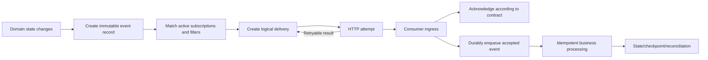
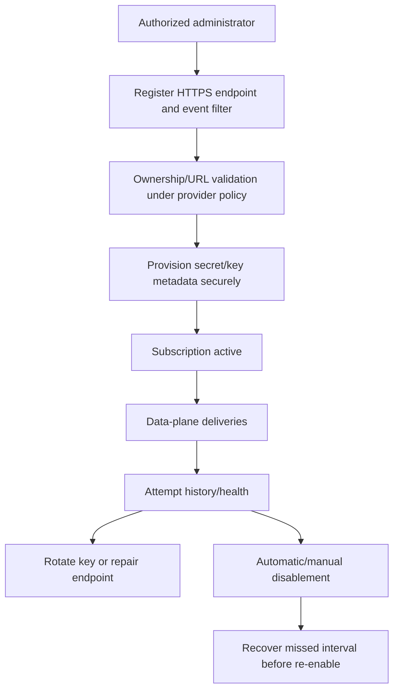
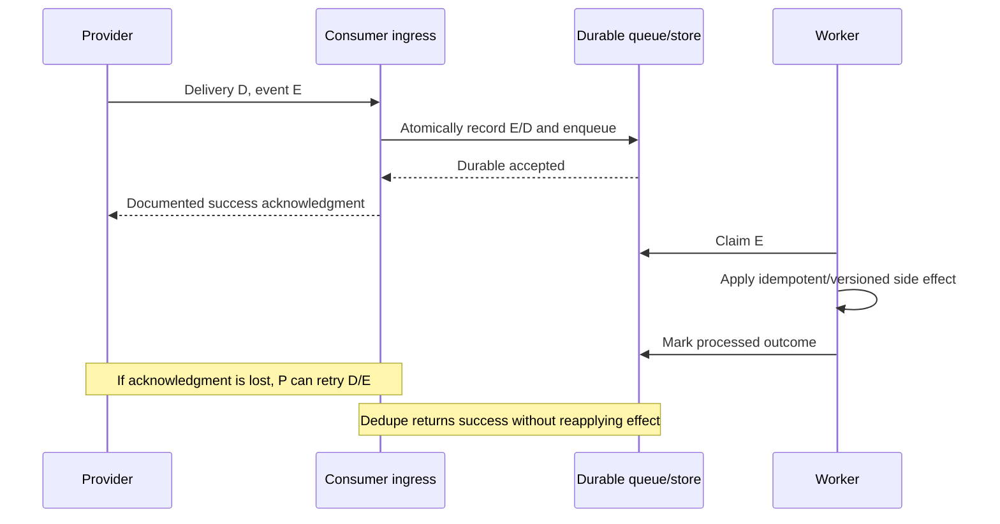
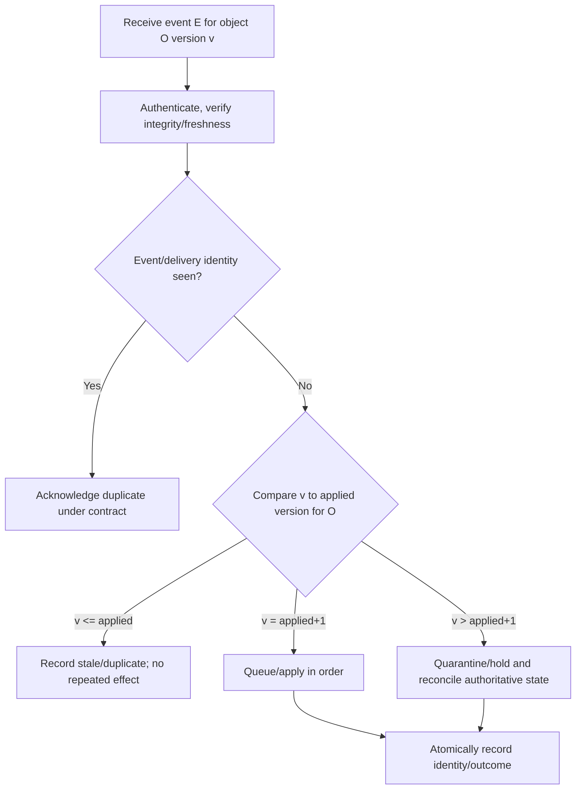
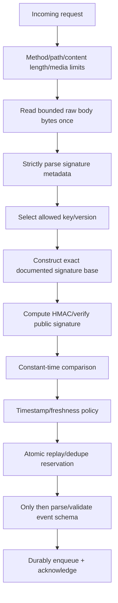
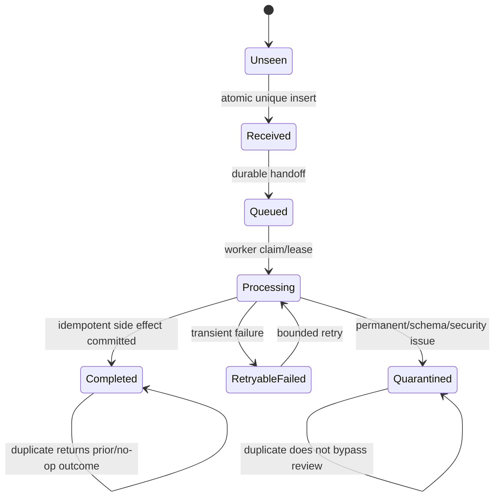
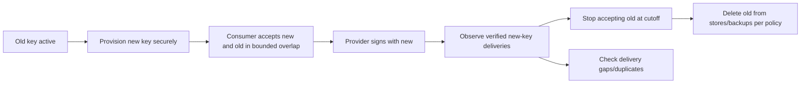
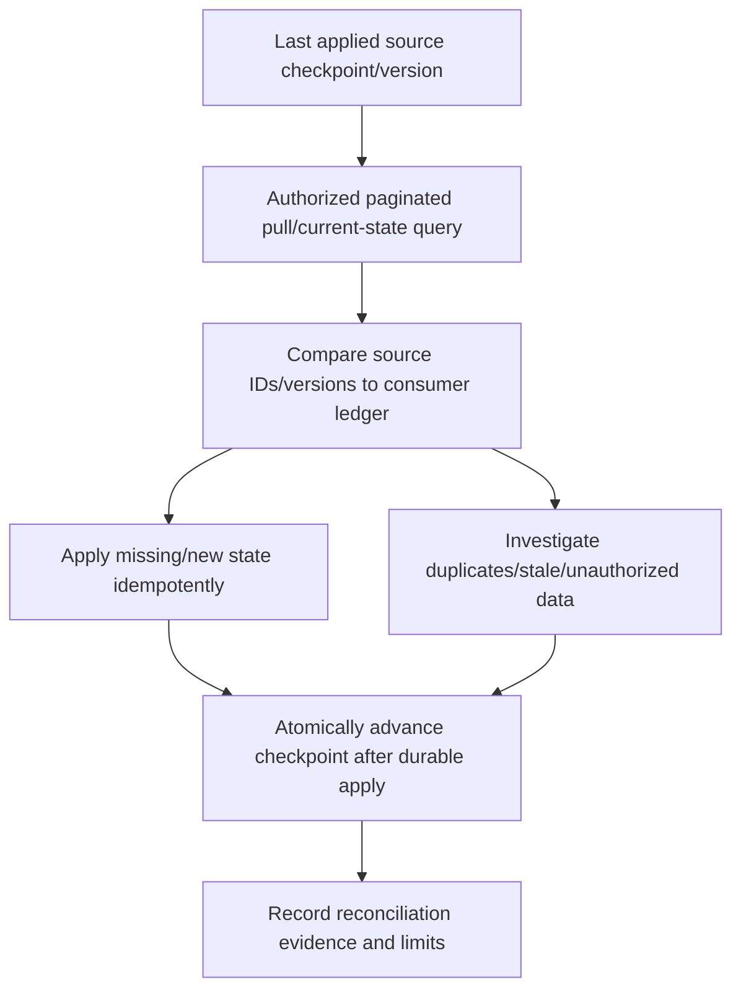
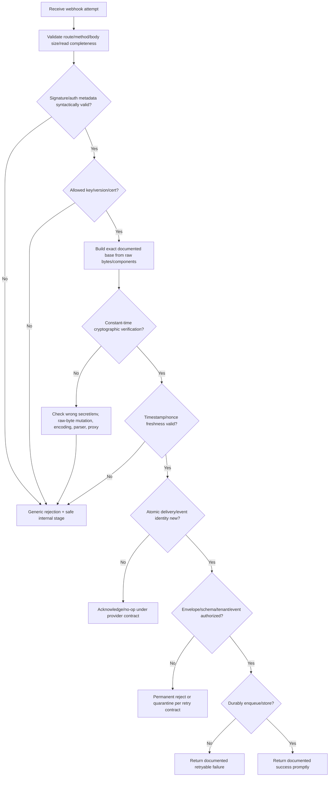

# Part 088 - Webhooks Events Signatures and Replay Safety

> **Purpose:** Receive asynchronous HTTP events safely and reliably by separating subscription, delivery, authentication, integrity, freshness, deduplication, ordering, acknowledgment, processing, retry, reconciliation, and observability concerns.
>
> **Artifact label:** **Offline synthetic webhook verification lab** with an invented teaching signature contract, a public non-secret lab key, raw local bytes, replay cards, and optional built-in Python/PowerShell cryptography. It makes no network call, installs no dependency, opens no listener, and is not an Abnormal or vendor protocol.
>
> **Currency and source access date:** August 24, 2026.

## Section goal

By the end of this Part, Arti should explain a webhook as an application pattern in which a provider initiates an HTTP request to a consumer endpoint when an event is ready. She should distinguish a **webhook delivery** from the underlying **event**, a delivery attempt from a logical delivery, an event notification from a command, subscription/control-plane operations from data-plane deliveries, and receipt acknowledgment from business processing completion.

She should expect asynchronous delivery contracts to define retries, timeouts, accepted statuses, duplicates, ordering, batching, retention, disablement, redelivery, and reconciliation. She should not assume exactly-once delivery. She should design an at-least-once consumer with stable event/delivery identities, atomic deduplication, idempotent side effects, durable queueing, bounded processing, dead-letter/quarantine handling, and a pull/reconciliation path for missed events.

She should understand webhook authentication options without treating them as interchangeable: high-entropy endpoint secrets, bearer/basic credentials, mutual TLS, HMAC over a vendor-defined signature base, public-key HTTP message signatures, JWS, network allowlists, and application authorization. She should verify the exact raw bytes and metadata specified by the contract before parsing or mutating the body; parse fields strictly; select the correct key; calculate with an approved algorithm; compare in constant time; check timestamp freshness; record delivery ID atomically; and support deliberate secret rotation.

She should analyze replay safety. A valid signature proves only what the signing contract covers and that a holder of the key/private key produced it; without freshness and uniqueness state, captured valid requests can be replayed. Timestamp windows limit age but do not prevent repeated delivery inside the window. A nonce or delivery/event ID plus durable deduplication is needed. Clock skew, processing delays, queueing, key retention, redelivery, and incident response complicate the policy.

The Part is vendor-neutral. Header names, canonicalization, algorithms, timestamp formats, tolerance, key rotation, response status policy, retry schedule, source IPs, and event schemas are provider/version contracts. GitHub and Stripe documentation are cited only as examples of different vendor schemes. Abnormal-specific details remain unknown until approved current documentation and access are available.

## JD Mapping

| Supplied role signal | Capability developed | Vendor-neutral support situation | Evidence artifact |
|---|---|---|---|
| API/integration support | Reconstructs provider-to-consumer delivery | Events not appearing downstream | Delivery lifecycle map |
| Security troubleshooting | Separates TLS/auth/signature/freshness/dedupe failures | “Invalid signature” | Verification-stage ledger |
| Complex investigations | Correlates attempts, event IDs, queues, side effects | Duplicate/missing/out-of-order event | Event-delivery matrix |
| Customer communication | Requests minimum sanitized evidence | Need raw bytes without content disclosure | Hash/metadata template |
| Engineering collaboration | Supplies deterministic signature vectors | Proxy changed body bytes | Offline verification fixture |
| Reliability | Designs fast acknowledgment and durable processing | Provider retries while consumer is slow | Queue/ack pattern |
| Privacy/security | Protects payloads, URLs, secrets, signatures, IDs | Logs expose sensitive events | Evidence minimization map |
| Incident response | Rotates keys, blocks replay, reconciles missed work | Signing secret exposure | Rotation/recovery runbook |
| Honest positioning | Distinguishes standards, vendor examples, and lab | Interview answer | Evidence-tier statement |
| Continuous learning | Checks current provider documentation/version | Header/algorithm changed | Source ledger |

## Candidate honesty note

Arti can present webhook lifecycle, HMAC verification, replay protection, deduplication, retries, and evidence correlation as working knowledge demonstrated offline. Her production-transfer strength is Microsoft enterprise troubleshooting, secure evidence handling, customer communication, incident escalation, and fix validation. She should not claim production webhook platform ownership, PKI/signing architecture design, GitHub/Stripe administration from this reading, or knowledge of Abnormal event types, secrets, endpoints, schemas, retry policy, or runbooks.

| Evidence tier | Safe claim | Boundary |
|---|---|---|
| Production transfer | “I trace asynchronous boundaries and preserve privacy while correlating attempts to outcomes.” | Keep historic examples truthful |
| Working familiarity | “I understand raw-byte HMAC verification, freshness, dedupe, retries, and rotation.” | Not production cryptographic system ownership |
| Offline lab | “I generated and rejected deterministic synthetic signature/replay vectors.” | Invented contract, no listener/network |
| Learned architecture | “At-least-once delivery and fast durable acknowledgment are common patterns.” | Not universal provider behavior |
| Vendor example | “GitHub/Stripe publish different signature procedures.” | Not experience and not transferable syntax |
| No direct experience | “I have not administered Abnormal webhooks.” | Say directly |
| Unknown | Event schema, headers, signature base, tolerance, keys, retries, status policy, source ranges | Verify approved docs |

## 1. Webhooks and events from first principles

An **event** is a record that something happened, such as `case.updated`. A **webhook** is one way to notify another system by delivering an HTTP request to a registered endpoint. The event can exist independently of the webhook; the provider may attempt to deliver it more than once. A **delivery** is a logical provider-to-endpoint transmission, and an **attempt** is one try.



| Term | Plain meaning | Why it matters | Memory hook |
|---|---|---|---|
| Provider | System sending event notifications | Owns delivery contract | Caller |
| Consumer | System receiving/processing them | Owns ingress safety | Receiver |
| Subscription | Configuration connecting events to endpoint | Control plane state | Mailing list registration |
| Event | Logical fact/notification | Deduplication and business meaning | What happened |
| Delivery | Logical sending of event/batch to endpoint | Can have many attempts | Envelope trip |
| Attempt | One HTTP request try | Status/timing/retry evidence | One knock |
| Acknowledgment | HTTP result indicating receipt policy | Controls provider retry | “I received it” |
| Processing | Applying business side effects | May happen after acknowledgment | “I acted on it” |
| Redelivery | Another delivery/attempt of prior event | Recovery or duplicate | Send again |
| Replay | Reuse of a captured valid message by attacker/system | Security and duplicate risk | Valid old message resent |
| Deduplication | Recognize already accepted identity | At-least-once safety | Seen-before ledger |
| Reconciliation | Compare/pull authoritative state/checkpoints | Recovers missed/ambiguous events | Audit against source |

### Events are not automatically commands

An event normally reports a past fact. A command requests an action. Treating every event as a command can repeat irreversible actions during redelivery. A consumer should use event identity/version and current state to decide idempotent outcomes.

| Message style | Example | Consumer question |
|---|---|---|
| Notification | “Case CASE-088 changed” | Fetch current state if authorized/needed |
| State transfer | “Case status is now open, version 7” | Is version newer than applied? |
| Delta | “Add label api” | Is operation itself idempotent/versioned? |
| Command-like | “Send this message now” | Is duplicate command protected end-to-end? |
| Batch | “Events E1-E10” | Can partial members fail/ack independently? |

## 2. Control plane versus data plane

The **control plane** manages endpoint registration, event selection, status, secret/key lifecycle, test delivery, disablement, and deletion. The **data plane** performs deliveries. A configuration success does not prove runtime reachability or verification.



| Control-plane field | Support concern | Security concern |
|---|---|---|
| Endpoint URL | Correct environment/path/version | SSRF, userinfo, redirects, DNS rebinding |
| Event types | Correct scope/filter | Overcollection/data leakage |
| Tenant/account | Correct principal/ownership | Cross-tenant delivery |
| Secret/key | Provisioned version and rotation state | Exposure, wrong scope, stale secret |
| Status | Active/paused/disabled/degraded | Unauthorized re-enable/change |
| Test function | Synthetic event semantics | Not proof of all production paths |
| History | Attempts/status/IDs | Sensitive payload/endpoint metadata |
| Delete | Stops future delivery policy | Retained queued deliveries may remain |

### Endpoint registration and SSRF

If users can register arbitrary callback URLs, the provider can be abused to call private/local/cloud metadata or attacker-controlled destinations. Providers commonly restrict scheme/ports/hosts, resolve addresses safely, block private/reserved ranges, revalidate redirects/DNS, require ownership verification, and control egress. Exact defenses belong to provider architecture.

Consumers should use a dedicated HTTPS endpoint, strong server identity validation, least-privilege route, strict method/content/size limits, no open redirect, and no credential embedded in URLs. Do not use a query secret because URLs leak into logs, histories, screenshots, and Referer-like contexts.

## 3. Delivery semantics and the “exactly once” trap

Networks can lose requests/responses; processes can crash after commit but before acknowledgment; providers can retry; queues can redeliver. Most webhook consumers should be designed for at-least-once delivery, even if a provider aims for one logical notification.



| Delivery guarantee term | What it typically means | What consumer still does |
|---|---|---|
| At most once | No retry after uncertain loss | Reconcile missing events; accept loss risk |
| At least once | Retry until policy says stop/success | Dedupe and idempotent processing |
| Exactly once claim | One logical effect under defined boundary | Inspect boundary, retention, downstream effects, failures |
| Ordered | Order within defined key/partition | Handle gaps, duplicates, concurrent partitions |
| Best effort | Delivery attempted without strong recovery | Pull/reconcile for correctness |

### 🔍 Plain-English deep-dive: Exactly once has a boundary

A provider can ensure one event record in its database, but the consumer may receive it twice because an acknowledgment was lost. The consumer can atomically dedupe at ingress, but a downstream email service might still send twice if operation identity is not propagated. “Exactly once” only has meaning when the system names the identity, boundary, failure model, retention, and side effects covered.

Think of registered mail: one letter can be created, attempted, and signed for, yet a photocopied instruction inside can still be acted on twice by another department. The analogy stops because digital systems can atomically store identities, but cannot create one global transaction across arbitrary external systems without specific protocols.

## 4. Ordering, versions, gaps, and batches

Ordering may be global, per tenant, per object, per subscription, per partition, or absent. Concurrent delivery can reorder attempts. Event creation time, occurrence time, ingestion time, and delivery time differ.

| Field/concept | Question | Failure if assumed |
|---|---|---|
| Event ID | Stable across retries/redeliveries? | Wrong dedupe key |
| Delivery ID | Stable across attempts or new per attempt? | Confused attempt grouping |
| Object ID | Which entity changed? | Cannot version per aggregate |
| Sequence/version | Global or per object/partition? | False gap/out-of-order conclusions |
| Occurred time | Producer/domain clock? | Clock-based order mistakes |
| Created time | Event-log creation | Not necessarily domain occurrence |
| Delivered time | Attempt timestamp | Retry changes it |
| Batch ID/index | Atomic/ordered members? | Partial processing ambiguity |



A consumer may choose current-state reconciliation instead of replaying every delta. If event E7 arrives before E6 but E7 says “current status closed, version 7,” fetching authoritative version 7 can resolve the gap. If events are commands whose intermediate effects matter, missing E6 cannot be skipped. The event contract decides.

### 🔍 Plain-English deep-dive: Arrival order is a transport observation, not necessarily domain order

Event E6 can be delayed by one partition or retry while E7 takes a faster path. The consumer sees E7 first even though the source created E6 first. Sorting by local receipt time would preserve the accident, not restore domain sequence. Use a provider-defined per-scope sequence/version, or reconcile current authoritative state when the event model permits.

Think of two letters mailed in order but routed through different sorting centers: the second can arrive first. The postmark, tracking number, and sender's numbered pages answer different questions. The analogy stops because event streams can be concurrent, partitioned, corrected, and intentionally unordered.

Before declaring a gap, name the ordering scope. A global counter, per-object version, partition offset, and delivery-attempt timestamp are not interchangeable.

For batches, decide whether one invalid member rejects the whole request, valid members are accepted separately, and provider retries the full batch or subset. A 2xx acknowledgment for a batch may cause provider to consider every member delivered, so silently dropping one item is dangerous.

## 5. Webhook authentication and integrity options

TLS authenticates the server endpoint to the provider and protects transport against ordinary on-path modification when validated. It does not by itself prove which application sent a request if the endpoint is publicly reachable. Application-layer verification adds origin/integrity/freshness according to its scheme.

| Mechanism | What it can establish | Main caveat |
|---|---|---|
| Unpredictable URL path | Possession of URL | URLs leak; weak sole control |
| Basic/bearer credential | Possession of shared credential | Replayable; storage/logging/rotation |
| HMAC signature | Integrity/authenticity for covered bytes/metadata | Shared secret; exact base/canonicalization/freshness |
| Public-key message signature | Holder of private key signed covered components | Key discovery/algorithm/coverage/replay policy |
| JWS | Signed structured payload/object | Serialization/profile/key selection still defined |
| mTLS | Client certificate authenticated at TLS layer | PKI/proxy termination/rotation mapping |
| Source IP allowlist | Network-source constraint | Ranges change/spoofing context/proxies; defense in depth |
| Provider API lookup | Delivery validated out-of-band | Availability/cost/recursive dependency |

No mechanism authorizes business action by itself. After request authentication, the consumer still validates subscription/tenant/event type/schema/object scope and applies least privilege.

### HMAC basics

HMAC is a keyed message authentication code defined in RFC 2104. With SHA-256, both parties use a shared secret and the exact contract-defined message $m$:

$$
tag = HMAC_{SHA-256}(secret, m)
$$

The receiver computes the expected tag and compares it to the received tag in constant time after strict parsing/decoding. Do not use plain `SHA256(secret || body)` as an improvised replacement. Do not decrypt an HMAC; it is not encryption.

## 6. Signature base and raw bytes

The **signature base** is the exact byte sequence the provider signs. It may be the raw body, timestamp plus delimiter plus body, selected HTTP components under RFC 9421, a canonical JSON form, or another documented structure. There is no universal webhook signature base.

This Part's invented lab contract is explicitly:

```text
LAB-ONLY CONTRACT 088
algorithm: HMAC-SHA-256
timestamp: decimal Unix seconds as ASCII
delivery_id: ASCII token
raw_body: exact UTF-8 bytes read from local file
signature_base: timestamp + "." + delivery_id + "." + raw_body
signature_encoding: lowercase hexadecimal
header-like card: t=<timestamp>,d=<delivery_id>,v1=<hex>
freshness: absolute difference from supplied verification time <= 300 seconds
replay key: (subscription_alias, delivery_id)
```

It is not GitHub, Stripe, Slack, Abnormal, RFC 9421, or any production scheme.



### Why body transformations break signatures

These JSON texts can represent equivalent data to many applications but have different bytes:

```json
{"event":"case.updated","count":1}
```

```json
{
  "count": 1,
  "event": "case.updated"
}
```

Whitespace, property order, escape spelling, Unicode normalization, newline endings, numeric spelling, compression handling, charset decoding, and reserialization can change bytes. If the provider signs raw body bytes, verify before JSON parsing/reserialization. Framework middleware must expose the original bounded bytes.

### 🔍 Plain-English deep-dive: Equivalent JSON data can have a different signature

A signature authenticates the bytes or components named by its contract, not an abstract intention. Reformatting JSON is like retyping a signed letter: the words may look equivalent, but the physical signed document changed. If the scheme signs canonicalized data, both sides must use that exact canonicalization; if it signs raw bytes, do not canonicalize at all.

The analogy stops because digital canonicalization can be formally specified and deterministic, while human “same meaning” is subjective. The support task is to identify the exact signed representation and capture safe hashes/lengths at every transformation boundary.

## 7. Strict parsing and constant-time comparison

Signature metadata can contain multiple versions/tags, timestamps, key IDs, or malformed duplicates. Follow the provider parser rules. Reject unsupported algorithms, invalid encoding, wrong lengths, duplicate singleton fields where prohibited, ambiguous whitespace, and unknown critical components. Never accept “any header containing the expected substring.”

| Verification step | Pass evidence | Failure class |
|---|---|---|
| Header present | Expected field/card exists | Missing metadata |
| Grammar | Parsed tokens/quoted values according to contract | Malformed/ambiguous |
| Version/algorithm | Allowed current value | Downgrade/unsupported |
| Key selection | Known active/overlap key alias | Unknown/stale key |
| Signature decoding | Exact hex/base64 format and length | Encoding error |
| Base construction | Component list, raw-body length/hash | Canonicalization mismatch |
| Cryptographic verify | Constant-time library verify | Wrong key/base/tag |
| Freshness | Timestamp within policy using reliable time | Old/future/skew |
| Replay reservation | New identity in atomic store | Duplicate/replay |
| Schema/authorization | Valid event and scope | Untrusted business input |

Constant-time comparison minimizes timing leakage about how many leading bytes matched. In Python, use `hmac.compare_digest`; in .NET use `CryptographicOperations.FixedTimeEquals` for same-length byte spans. Do not write a manual character loop or normal string equality for secret-dependent tags.

## 8. Replay attacks and duplicate delivery

A **duplicate** can be legitimate provider retry/redelivery; a **replay attack** is unauthorized reuse of captured valid material. The consumer often handles both with overlapping freshness and deduplication controls, while retaining different security interpretations.

```mermaid
sequenceDiagram
    participant P as Legitimate provider
    participant A as Capturing attacker
    participant C as Consumer
    P->>C: Valid signed request t,d,body
    A-->>A: Capture request
    C->>C: Verify signature + freshness + reserve d
    C-->>P: Success
    A->>C: Replay same valid request inside time window
    C->>C: Signature valid; freshness valid; d already reserved
    C-->>A: Documented duplicate response without side effect
```

| Control | Stops | Does not stop |
|---|---|---|
| Signature only | Unsigned/modified message without key | Captured valid replay |
| Timestamp window | Old captured replay | Multiple replays inside window |
| Delivery/event ID store | Reuse of same identity in retention | New forged identity if key compromised |
| Idempotent side effect | Repeated effect for recognized operation | Resource exhaustion at ingress |
| Rate/concurrency limits | Flood amplification | Correctness duplicates alone |
| TLS | Ordinary on-path capture/modification | Endpoint/server/log compromise |
| Secret rotation | Future signatures with exposed retired key after cutoff | Already accepted replay state/history |

### Timestamp policy

The contract defines timestamp source/format, maximum age, future tolerance, multiple timestamp behavior, clock source, and whether redelivery retains or regenerates timestamp/signature. Use a reliable clock. A very wide window increases replay opportunity; a very narrow window rejects delayed valid requests. Queue delays after ingress should not be evaluated as if the request just arrived: capture verification/receipt time and status before durable handoff.

### Atomic deduplication

Do not perform “check ID, process, then store ID.” Two concurrent duplicates can both pass the check and execute. Reserve/insert a unique identity atomically with state such as received/processing/completed/failed. Decide transaction boundaries with queue/business effects.



## 9. Deduplication identity and retention

Use the provider's documented stable identity. Event ID and delivery ID may differ: one event can have several subscription deliveries; a redelivery can reuse or replace delivery ID. If neither is stable, a content hash can be a weak fallback only under a deliberate contract because two legitimate identical events can collide semantically and JSON serializations can differ.

| Candidate key | Suitable when | Risk |
|---|---|---|
| Provider event ID | Stable globally/within documented scope | Scope collision or event reused across subscriptions |
| Delivery ID | Stable across attempts/redelivery as documented | New ID on redelivery defeats event dedupe |
| `(subscription,event_id)` | Event may be delivered to multiple subscriptions | Subscription lifecycle/aliases |
| `(tenant,object,version)` | State-version events | Commands/intermediate events may share version semantics |
| Content hash | No identity and exact bytes define duplicate | Legitimate identical content; transformations |
| Timestamp+object | Never sufficient alone | Collisions, clock/precision |

Retention should cover provider retry/redelivery horizon plus operational delay, with privacy/storage limits. If the provider can redeliver after 30 days and dedupe records last one day, late duplicates can reapply effects. Infinite retention is not free and may violate policy. Archive a compact identity/outcome rather than full payload where possible.

## 10. Secret and key rotation

Rotation should avoid both outage and indefinite trust of old material. Typical overlap flow: provision new key, update consumer to accept new+old by key ID/version or controlled candidate set, switch provider signing, observe new-key success, retire old, and delete it after an approved rollback/retention period.



| Rotation concern | Safe practice |
|---|---|
| Key IDs absent | Try bounded active candidates in constant-work style per contract; avoid oracle/log detail |
| Clock skew | Use explicit UTC cutoff and monitoring |
| Multiple environments | Separate keys/scopes; never copy production into test |
| Rollback | Time-bounded approved plan; do not keep old forever |
| Queued old deliveries | Verify at ingress before queue, or retain verification metadata/key policy deliberately |
| Compromise | Rotate immediately, disable/contain, inspect logs/replay, reconcile state |
| Logs | Never log secret; minimize signature/key ID details |
| Backups | Include secret lifecycle/deletion policy |

When a shared secret is compromised, past signatures may be forgeable if payload/signature material and accepted windows permit. Rotate, narrow/disable delivery, preserve incident evidence safely, invalidate old trust, inspect dedupe/anomalies, reconcile authoritative state, and communicate scope. Do not merely change the value in one consumer instance.

## 11. Fast acknowledgment and durable processing

Providers usually impose response timeouts. Doing expensive business work before acknowledgment can cause retries, duplicates, and thread exhaustion. A common pattern is: limit/read raw body, verify request, validate minimum envelope, atomically reserve identity and durably enqueue, then return the documented success quickly. Workers perform full processing later.

| Ingress stage | Should be bounded? | Failure response depends on |
|---|---:|---|
| TLS/route/method | Yes | Infrastructure/provider contract |
| Body length/read | Yes | Reject too large/incomplete |
| Signature/freshness | Yes | Security policy; do not reveal internals |
| Replay reservation | Atomic and quick | Duplicate acknowledgment contract |
| Minimal schema/routing | Yes | Whether invalid events should retry |
| Durable enqueue | Must confirm durability before success | Queue availability |
| Business side effect | Usually asynchronous | Worker retry/idempotency |

### 🔍 Plain-English deep-dive: A fast 2xx should mean durable receipt, not hopeful receipt

If the endpoint returns success before the event is safely stored, a process crash can lose the event and the provider may never retry because it received success. If the endpoint waits for every downstream action, it may exceed the provider timeout and trigger duplicates. The useful middle boundary is often “verified, accepted, and durably recorded.”

Think of a parcel desk issuing a receipt only after scanning the parcel into the building's tracked inventory, not after leaving it on the sidewalk and not after final delivery. The analogy stops because durable queues can still lose data under misconfiguration and side effects need their own idempotency/reconciliation.

## 12. Response status and retry contracts

Do not invent which status codes a provider retries. Some retry non-2xx; some accept a narrower set; some treat 3xx as failure; some disable subscriptions after consecutive failures; some retry 429/5xx differently. Redirect following can leak payload/signature and change target. Webhook endpoints should normally avoid redirects and respond directly under the documented contract.

| Consumer result | Possible provider interpretation | Consumer design question |
|---|---|---|
| 2xx | Accepted; stop retry | Was event durable before response? |
| 400/422 | Permanent malformed payload | Will provider retry anyway? Should event quarantine? |
| 401/403 | Verification/auth failure | Avoid detailed oracle; alert/security review |
| 404 | Wrong path/deployment | Disablement/retry behavior |
| 409 | Duplicate/in-progress in some APIs | Is it recognized as success by provider? |
| 429 | Consumer overloaded | Does provider honor Retry-After? |
| 500/503 | Temporary consumer failure | Retry schedule/horizon |
| Timeout/reset | No acknowledgment | Duplicate likely; dedupe required |
| 3xx | Redirect | Avoid; behavior and credential/body forwarding vary |

For an invalid signature, avoid returning detailed key/base mismatch information to the caller. Record a safe internal stage/result and generic response. Whether to use 400/401/403 belongs to the provider integration contract and security design.

## 13. Reconciliation and recovery

Webhooks are notifications, not always the sole source of truth. Reconciliation can pull events/state since a checkpoint, compare versions, repair missing updates, and verify subscription health. It needs pagination, rate limits, authentication, and idempotent application from Parts 083-087.



| Recovery situation | Reconciliation action |
|---|---|
| Endpoint disabled for hour | Query authoritative changes/state for exact interval with overlap |
| Signing secret mismatch | Fix/rotate, then recover missed valid events |
| Queue outage | Do not acknowledge until durable; redeliver/pull afterward |
| Dedupe store loss | Rebuild from business versions/audit source; prevent duplicate effects |
| Out-of-order gap | Fetch current object or missing sequence according to event semantics |
| Provider retention expired | Current-state full reconciliation; acknowledge evidence gap |
| Suspected replay/key compromise | Quarantine, rotate, audit IDs/times/source, reconcile state |

## 14. Evidence correlation

Correlate one event, one logical delivery, multiple attempts, one ingress reservation, queue message(s), worker attempts, and final business outcome. IDs can be sensitive; use approved aliases/fingerprints.

| Layer | Useful evidence | Privacy rule |
|---|---|---|
| Subscription | Alias, status, event filters, key version, config change UTC | No raw endpoint secret/URL query |
| Provider attempt | Delivery/event alias, attempt, UTC, target alias, status/latency | No full payload/signature |
| Edge/gateway | Request ID, route, status, body length/hash, TLS result | Minimize IP/topology |
| Verifier | Parser stage, algorithm/key alias, expected/received tag match boolean, age | Never log key or full tag/base |
| Dedupe | Identity alias, first-seen UTC, state/outcome | No full event needed |
| Queue | Message alias, enqueue/dequeue/delivery count | Encrypt/access/retain appropriately |
| Worker | Event/object/version alias, attempt, side-effect idempotency ID | No sensitive payload dump |
| Source | Authoritative state/version/checkpoint | Least-privilege query |

The best signature mismatch evidence often includes raw body length and a cryptographic hash computed locally on both sides, content encoding/media type, signature metadata structure, timestamp/delivery aliases, framework/proxy versions, and transformation points. A hash can still be sensitive/linkable; handle according to policy.

## 15. Verification decision tree



## 16. Failure modes and safer alternatives

| Failure/shortcut | Why it fails | Safer alternative |
|---|---|---|
| Parse JSON then reserialize for HMAC | Bytes change | Verify exact raw contract bytes first |
| Sign only body when contract includes timestamp/ID | Base mismatch/replay weakness | Exact component list/order/delimiters |
| Compare tags with normal string equality | Timing leakage/encoding ambiguity | Strict decode + fixed-time comparison |
| Accept any algorithm/version | Downgrade/confusion | Allowlist current schemes |
| Signature only, no freshness | Captured valid replay accepted | Timestamp/nonce + dedupe |
| Timestamp only | Replays within window | Atomic ID store |
| Check then insert dedupe | Concurrent duplicates race | Atomic unique reservation |
| Use delivery time as event order | Retries reorder | Source sequence/version semantics |
| Assume exactly once | Lost acknowledgment creates duplicate | At-least-once-safe consumer |
| Return 2xx before durable write | Crash loses event permanently | Acknowledge after durable acceptance |
| Do all business work before 2xx | Timeouts/retries | Queue after verification |
| Redirect webhook | Payload/signature/target ambiguity | Direct dedicated endpoint |
| Put secret in query URL | Logs/history leakage | Documented header/signature/store |
| IP allowlist only | Ranges/proxies are imperfect | Cryptographic/application verification too |
| Log full body/signature/secret | Sensitive exposure | Structural hashes/aliases/stages |
| Rotate without overlap/cutoff | Outage or indefinite old trust | Bounded staged rotation |
| Drop invalid member but 2xx batch | Provider believes delivered | Defined atomic/partial semantics |
| No reconciliation | Permanent gaps after retry horizon | Pull/current-state repair |
| Copy vendor scheme to another | Header/base/tolerance differ | Follow exact provider version docs |

## 17. Escalation package

| Section | Minimum evidence |
|---|---|
| Subscription | Safe alias, environment, active status, selected event types, change UTC |
| Contract | Provider/version docs, method/path template, media, limits, success/retry semantics |
| Delivery | Event/delivery aliases, attempt count, provider UTC, target alias |
| Edge | TLS/route/respondent/status/latency/body length/hash/request ID |
| Verification | Header grammar shape, algorithm/key alias, base component list, received age, match boolean |
| Replay | Dedupe key scope, first-seen/state, timestamp window, atomic-store result |
| Schema | Event type/version, validator keyword/path, sensitive value omitted |
| Processing | Enqueue ID/time, worker attempts, object/version alias, final outcome |
| Retry | Provider attempt schedule/horizon/disablement and consumer statuses |
| Reconciliation | Source checkpoint/state comparison and recovered/missing counts |
| Privacy | What was redacted, retained, rotated, or potentially exposed |
| Ask | Exact provider signing input/key state/delivery history or consumer transformation needed |

## Safe local lab: The Raw-Byte Signature and Replay Ledger 088

### Prerequisites

- Learner-owned local folder; paper is sufficient for policy cards.
- Python 3 or PowerShell/.NET only if already installed for standard HMAC/hash/constant-time functions. No packages, OpenSSL downloads, servers, tunnels, or network access.
- Public teaching key text `LAB-ONLY-NOT-A-SECRET-088`; it is intentionally non-secret and must never be reused outside this lab.
- Synthetic event/delivery/subscription IDs only: EVT-088-001, DEL-088-001, SUB-088-A.
- Files if used: `body-088.json`, `sign-088.py`, `verify-088.py`, `vectors-088.md`, `replay-088.md`, and `cleanup-088.md`.
- Lab contract exactly from Section 6. Do not substitute a vendor contract or endpoint.
- Artifact label: **offline invented HMAC teaching contract; no real secret, listener, provider, endpoint, or Abnormal behavior claim**.

### Lab procedure

1. Record start UTC, tool/runtime versions, artifact label, invented-contract statement, and no-network/no-secret statement.
2. Create `body-088.json` as one exact UTF-8 line without a trailing newline: `{"event_id":"EVT-088-001","type":"case.updated","object_id":"CASE-088","version":7}`.
3. Record raw byte length and SHA-256 hash. Treat even this synthetic hash as a local evidence value.
4. Choose fixed teaching verification time 1900000100 and signed timestamp 1900000000, yielding age 100 seconds. Use delivery ID DEL-088-001.
5. Construct bytes for `1900000000.DEL-088-001.` followed immediately by exact raw body bytes. Record component lengths and base hash, not a production base.
6. Using Python standard library `hmac`/`hashlib` or .NET HMACSHA256, compute lowercase hexadecimal HMAC with the public lab key. Save it as expected vector V1.
7. Verify V1 using strict lowercase-hex decode and constant-time comparison (`hmac.compare_digest` or `CryptographicOperations.FixedTimeEquals`). Record pass.
8. Make body variant B2 with pretty printing/property order change but equivalent data. Record different body/base hashes and verify V1 fails against B2.
9. Make B3 by adding a trailing newline. Record the one-byte length difference and verification failure.
10. Make B4 by changing version 7 to 8. Record signature failure and explain integrity coverage.
11. Make metadata variants: timestamp changed; delivery ID changed; missing v1; odd-length hex; non-hex; uppercase hex if contract requires lowercase; duplicate timestamp; unsupported v2 only. Predict parser versus crypto failure.
12. Create freshness vectors at ages -400 (far future), -20 (small future), 0, 299, 300, 301, and 3600. Define the invented policy precisely for absolute difference `<=300`; classify each.
13. Build replay store table keyed `(SUB-088-A, DEL-088-001)`. Atomically insert first valid vector as received, queue it, mark completed, then present it again inside the window. Verify signature/freshness pass but replay reservation fails and no side effect repeats.
14. Simulate two concurrent copies using a unique-key database analogy. Show why one insert wins and one receives duplicate, whereas check-then-insert can execute twice.
15. Use a new delivery ID with identical body. Under the invented contract it is cryptographically valid only with a new signature and is a distinct delivery. Discuss why event-level dedupe may additionally use EVT-088-001.
16. Build an event/delivery/attempt matrix: one event, one logical delivery, three attempts with timeout, 503, and 204; then a manual redelivery with a new delivery alias. Choose event-level and delivery-level keys deliberately.
17. Create source versions 6, 7, 9, 8 arrival order. Apply version logic: accept 6/7, detect gap at 9, reconcile/hold, classify 8. State that this policy is invented and event semantics can differ.
18. Model secret rotation with K-old and K-new aliases, both synthetic public labels. Define overlap start, provider switch, observation, old cutoff, and deletion. Test vectors signed by each at before/during/after cutoff.
19. Simulate a wrong-environment key: cryptographic failure with all metadata/body hashes matching. Produce a support hypothesis without logging key/tag.
20. Simulate a proxy/body-parser transformation by comparing provider raw-body hash to consumer raw ingress hash and post-parse serialized hash. Locate the first differing boundary.
21. Build response cards for 204, 400, 401, 429, 503, timeout, and redirect. Do not assume retries; fill a column from an invented provider contract and label it.
22. Design fast ingress: bounded read, verify, freshness, atomic reserve, minimal schema, durable enqueue, 204. Assign maximum teaching duration to each stage and keep total below invented provider timeout.
23. Design worker state: queued, processing, retryable failure, completed, quarantined. Add event-level side-effect idempotency identity.
24. Simulate 2xx before enqueue then crash; mark permanent-loss risk. Move 2xx after durable enqueue and explain improved boundary.
25. Create a reconciliation ledger comparing source objects/versions to completed events. Recover one missing synthetic version and record checkpoint advancement.
26. Build a sanitized escalation package for “signature fails only through proxy” containing lengths/hashes/stages/versions/aliases, not body/key/tag.
27. Deliver a four-minute explanation: event versus delivery, raw bytes, HMAC, freshness+dedupe, fast durable acknowledgment, and reconciliation.
28. Delete all temporary body/code/vector/replay/output files or retain only minimized synthetic notes. Record end UTC and cleanup statement.

### Expected evidence

- Exact invented contract and public lab-key statement.
- Raw body/base lengths and hashes plus one deterministic expected HMAC vector.
- Passing constant-time verification and failing whitespace/order/newline/content variants.
- Strict metadata parser failure matrix and freshness boundary cases.
- Atomic replay/dedupe state for first and repeated delivery.
- Event/delivery/attempt identity matrix and event-level dedupe discussion.
- Out-of-order/version-gap policy card.
- Old/new key rotation overlap/cutoff vectors.
- Proxy transformation hash-boundary comparison.
- Provider response/retry cards explicitly labeled invented.
- Fast durable ingress and idempotent worker state machines.
- Reconciliation ledger and sanitized escalation package.
- Spoken explanation with honest vendor/Abnormal boundaries.

### Cleanup and privacy

- Delete temporary payload, scripts, vectors, computed tags/hashes, replay tables, logs, screenshots, and shell history excerpts unless minimized synthetic notes are intentionally retained.
- Confirm no listener, tunnel, DNS/public request, package installation, external validator, real endpoint registration, or production configuration occurred.
- Confirm `LAB-ONLY-NOT-A-SECRET-088` is public teaching text, not stored in any real secret manager or reused.
- Confirm no Authorization, token, cookie, password, certificate/private key, production webhook secret, customer event, tenant/user/message, internal host, source IP, vendor endpoint, or raw vendor payload was used.
- Confirm no proxy, firewall, DNS, route, certificate store, system time, execution policy, queue, database, webhook subscription, or production event state changed.
- Record: `Raw-Byte Signature and Replay Ledger 088 completed offline under an invented contract with public synthetic key/data; no network, listener, real secret, customer data, dependency installation, destructive request, or Abnormal behavior claim.`

### Validation rubric

| Dimension | Fail | Developing | Pass |
|---|---|---|---|
| Lifecycle | “Webhook calls URL” | Shows send/receive | Separates control plane, event, delivery, attempt, ack, queue, process, reconcile |
| Delivery semantics | Claims exactly once | Mentions duplicates | Defines identity/boundary/failure/retention and at-least-once-safe consumer |
| Signature base | Signs parsed object | Uses body | Uses exact documented raw bytes/components/order/delimiters and safe hashes |
| Cryptography | Plain hash/string compare | Uses HMAC | Strict parser/allowlist/key selection/library HMAC/fixed-time compare |
| Replay | Signature only | Timestamp check | Freshness plus atomic scoped ID dedupe and idempotent effect |
| Raw bytes | Pretty prints freely | Retains body | Demonstrates order/whitespace/newline/transformation mismatches |
| Ordering | Uses delivery time | Stores sequence | Applies documented per-key version/gap/reconciliation semantics |
| Acknowledgment | 2xx immediately or after all work | Queues | 2xx only after verified atomic durable acceptance, then bounded worker |
| Rotation | Replace key suddenly | Accepts two keys | Bounded overlap, switch observation, cutoff, deletion, compromise path |
| Responses/retries | Assumes non-2xx retry | Lists statuses | Uses exact provider contract and handles redirects/disablement/horizon |
| Evidence/privacy | Logs body/key/tag | Masks secret | Uses aliases, lengths, safe hashes/stages, minimization, cleanup |
| Honesty | Calls lab vendor protocol | Says synthetic | Identifies invented contract, vendor examples only, Abnormal unknowns |

## Official Source Anchors - August 24, 2026

| Official or primary source | Topic anchored | Boundary |
|---|---|---|
| [RFC 9110 - HTTP Semantics](https://www.rfc-editor.org/rfc/rfc9110.html) | HTTP methods, statuses, fields, representations, redirects | Does not define a webhook protocol |
| [RFC 2104 - HMAC](https://www.rfc-editor.org/rfc/rfc2104.html) | Keyed-hash message authentication construction | Algorithm/profile/base/encoding still contract-specific |
| [RFC 9421 - HTTP Message Signatures](https://www.rfc-editor.org/rfc/rfc9421.html) | Standard mechanism for signing selected HTTP components | A provider may use another defined scheme |
| [RFC 8941 - Structured Field Values for HTTP](https://www.rfc-editor.org/rfc/rfc8941.html) | Structured field serialization used by modern HTTP fields | Use signature/provider-specific grammar |
| [RFC 7515 - JSON Web Signature](https://www.rfc-editor.org/rfc/rfc7515.html) | JWS protected content/signatures | Not every webhook uses JWS |
| [RFC 8259 - JSON](https://www.rfc-editor.org/rfc/rfc8259.html) | JSON syntax/interoperability | Equivalent data can have different raw bytes |
| [RFC 9457 - Problem Details for HTTP APIs](https://www.rfc-editor.org/rfc/rfc9457.html) | Machine-readable HTTP errors | Provider retry semantics remain specific |
| [OpenAPI Specification 3.2.0](https://spec.openapis.org/oas/latest.html) | `webhooks` and callbacks descriptions | Runtime delivery/security policy still needed |
| [CloudEvents Specification](https://github.com/cloudevents/spec/blob/main/cloudevents/spec.md) | Vendor-neutral event metadata format/specification | CloudEvents does not define every webhook delivery/retry/signature behavior |
| [GitHub Docs - Validating webhook deliveries](https://docs.github.com/en/webhooks/using-webhooks/validating-webhook-deliveries) | Vendor example: GitHub-specific validation procedure | Example only; do not generalize headers/base/secret |
| [Stripe Docs - Resolve webhook signature verification errors](https://docs.stripe.com/webhooks/signature) | Vendor example: Stripe-specific raw body/signature procedure | Example only; do not generalize syntax/tolerance |
| [OWASP SSRF Prevention Cheat Sheet](https://cheatsheetseries.owasp.org/cheatsheets/Server_Side_Request_Forgery_Prevention_Cheat_Sheet.html) | Endpoint/URL fetching and SSRF defense considerations | Guidance, not provider protocol |

### Source-use discipline

- HMAC, JWS, HTTP Message Signatures, mTLS, bearer credentials, and IP controls are different mechanisms. Follow the provider's exact current profile.
- Verify the exact signed components and bytes before parsing/transformation where the contract requires raw bytes.
- Use cryptographic library verification/fixed-time comparison and an explicit algorithm/key allowlist; never invent crypto for production.
- Signature validity alone does not establish freshness, uniqueness, business authorization, schema validity, or safe side effects.
- CloudEvents describes event metadata/format conventions, not a universal webhook retry or signature standard.
- GitHub and Stripe documentation illustrate that vendor schemes differ; their header names, bases, encodings, tolerance, and tools are not portable.
- Treat endpoint URLs, payloads, signatures, event/delivery IDs, body hashes, attempt histories, source addresses, and keys as sensitive according to policy.
- Verify Abnormal webhook availability, event catalog, endpoint requirements, signature scheme, secret rotation, retries, accepted statuses, evidence, and reconciliation only through approved current guidance.

## Likely Interview Questions

### Q1. What is the difference between an event, delivery, and attempt?

**Model answer:** The event is the logical fact/notification. A provider creates a logical delivery of that event or batch to a subscription, and may make several HTTP attempts for that delivery. Redelivery can create another delivery depending on the contract. I correlate event ID, delivery ID, attempt/request ID, ingress record, queue message, and final business outcome separately.

### Q2. Why should a webhook consumer expect duplicates?

**Model answer:** The provider can send successfully while the acknowledgment is lost, or retry after timeout/5xx; queues and workers can redeliver too. I design for at least once: verify, atomically reserve the documented stable identity, durably enqueue, acknowledge promptly, and make downstream effects idempotent/version-aware. “Exactly once” must name its boundary and retention.

### Q3. Why verify the raw request body before parsing JSON?

**Model answer:** If the signature contract covers raw bytes, whitespace, property order, escapes, Unicode, newline, decompression, or reserialization changes the signature base even when parsed data looks equivalent. I read a bounded raw body once, strictly parse signature metadata, construct the exact base, verify in constant time, check freshness/dedupe, then parse and schema-validate.

### Q4. Does a valid webhook signature prevent replay?

**Model answer:** No. It proves integrity/authenticity for covered components under the key; a captured valid message remains valid cryptographically. I require the documented timestamp/nonce freshness rule and an atomic scoped event/delivery-ID store, plus idempotent effects and rate limits. Timestamp alone still permits repeats inside its window.

### Q5. How should webhook signing keys be rotated?

**Model answer:** Provision the new key securely, let the consumer accept old and new for a bounded overlap, switch provider signing, observe verified new-key deliveries, retire old at an explicit UTC cutoff, reconcile gaps, and delete old material per policy. I use key aliases, never log secrets/tags, separate environments, and have an accelerated containment/reconciliation path for compromise.

### Q6. When should the consumer acknowledge a webhook?

**Model answer:** According to the provider contract, typically after route/size checks, cryptographic/freshness verification, atomic dedupe reservation, minimal schema/authorization, and confirmed durable enqueue or storage. Returning success before durability risks permanent loss; waiting for all business processing risks timeout and duplicate retries. Workers process idempotently afterward.

### Q7. How do you troubleshoot a signature that fails only behind a proxy/framework?

**Model answer:** I compare provider, edge, ingress-raw, and post-parser body lengths and safe hashes; content encoding/media/charset; exact timestamp/delivery metadata; signed component order/delimiters; key/environment alias; and framework/proxy versions. I locate the first transformation boundary without logging body, key, or full signature, and verify the exact provider procedure rather than reserializing JSON.

### Q8. How would you describe your webhook experience honestly?

**Model answer:** I have working familiarity with webhook/event delivery, HMAC and message-signature concepts, raw-byte verification, replay/deduplication, fast durable acknowledgment, ordering/version gaps, rotation, retries, and reconciliation, demonstrated with an invented offline contract. My production strength is enterprise support and evidence correlation. I would verify all Abnormal-specific details before acting.

## Memory Hooks

- **Event is the fact; delivery is the trip; attempt is one knock.**
- **Subscription config is control plane; HTTP calls are data plane.**
- **Assume at least once; design effects once.**
- **Exactly once must name its boundary.**
- **Delivery time is not event order.**
- **TLS secures transport; app verification proves its defined claim.**
- **HMAC authenticates covered bytes; it does not encrypt.**
- **The signature base is a contract, never a guess.**
- **Raw bytes first, parse later.**
- **Strict decode, allowlist algorithm/key, fixed-time compare.**
- **Valid signature is replayable without freshness and uniqueness.**
- **Timestamp limits age; ID store stops repeats in the window.**
- **Atomic reserve beats check-then-insert.**
- **Event ID and delivery ID may answer different questions.**
- **Acknowledge after durable acceptance, before expensive work.**
- **Provider statuses/retries are provider contracts.**
- **Rotate with bounded overlap and explicit cutoff.**
- **Reconcile because notifications can be missed.**
- **Hashes and IDs can still be sensitive.**
- **Vendor examples are not universal, and the lab is not Abnormal.**

## Completion Checklist

- [ ] I can define provider, consumer, subscription, event, delivery, attempt, acknowledgment, and processing.
- [ ] I separate control-plane registration/keys from data-plane delivery.
- [ ] I distinguish event notifications, state transfer, deltas, commands, and batches.
- [ ] I design for at-least-once delivery and can challenge an exactly-once claim by boundary.
- [ ] I can reason about event/delivery/request/object/version identities and ordering scopes.
- [ ] I understand endpoint registration/SSRF and dedicated HTTPS ingress concerns.
- [ ] I compare bearer, HMAC, public-key signature, JWS, mTLS, and allowlist controls without conflating them.
- [ ] I can define HMAC and explain why it is not encryption or a plain hash.
- [ ] I preserve exact raw bytes/components required by the signature contract.
- [ ] I strictly parse metadata, allowlist algorithm/key, decode exact length, and compare in constant time.
- [ ] I combine signature verification with timestamp/nonce freshness and atomic scoped dedupe.
- [ ] I know timestamp alone does not stop replay inside the window.
- [ ] I make downstream side effects idempotent/version-aware.
- [ ] I can stage secret/key rotation with overlap, observation, cutoff, deletion, and compromise recovery.
- [ ] I acknowledge only after verified durable acceptance according to provider status policy.
- [ ] I avoid redirects and know retries/disablement/accepted statuses are provider-specific.
- [ ] I can reconcile missed events/current state after outages, gaps, or retention expiry.
- [ ] I can correlate subscription, event, delivery attempts, ingress, queue, worker, and outcome privately.
- [ ] I completed or can reproduce the offline raw-byte/signature/replay lab with no listener/network/install.
- [ ] I deleted artifacts and used no real secret, payload, endpoint, customer data, or vendor protocol.
- [ ] I can answer exactly Q1-Q8 aloud with honest evidence-tier language.
- [ ] I checked Official Source Anchors dated August 24, 2026.

[Next: Part 089 - API Errors Versioning SDKs and Contracts](Part-089-api-errors-versioning-sdks-and-contracts.md)